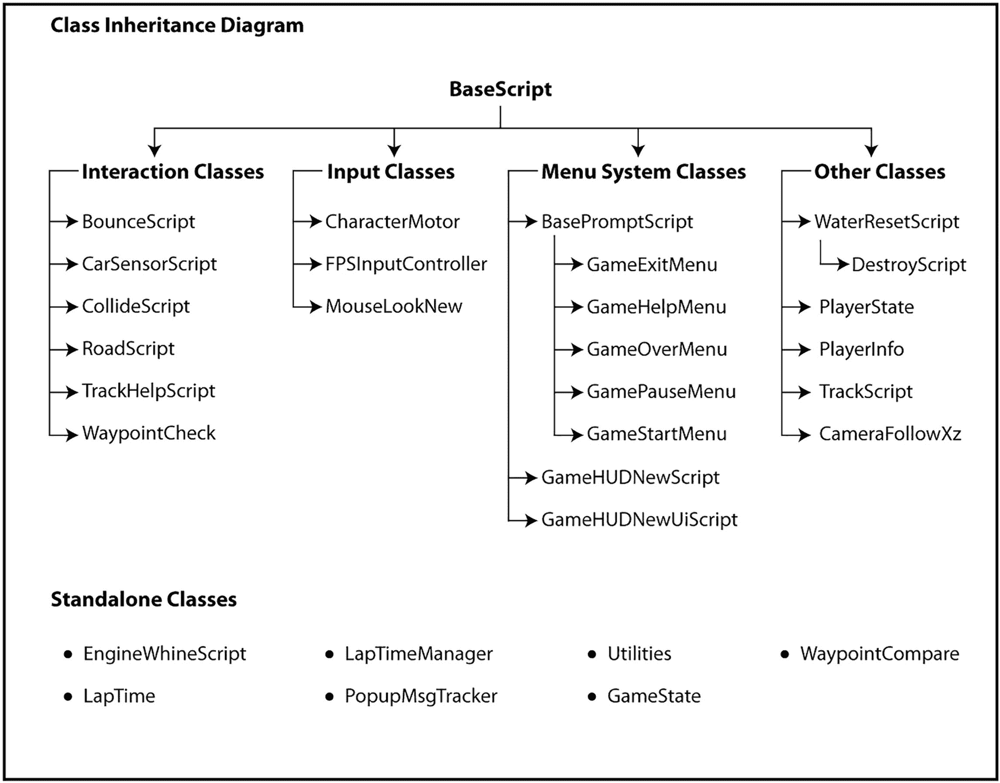

# 八、菜单系统类

在这一章中，我们将回顾游戏的菜单系统类，但是在此之前，我想回顾一下游戏类的结构。在这一章中，我们将介绍一个新的基类，它为其他菜单屏幕类提供核心菜单屏幕支持。由于事情变得有点复杂，我们最好在这里回顾一下游戏的职业结构。



图 8-1

Hover Racers 类继承图 1A Hover Racers 类图显示基类和独立类的扩展

正如您在前面列出的图表中所看到的，Hover Racers 代码库中的大多数类都扩展了`BaseScript`类，并通过扩展扩展扩展了`MonoBehaviour`类。这意味着所有那些列在`BaseScript`类条目下的树形结构中的类都是可以附加到 Unity 游戏对象上的脚本组件。到目前为止，您可以在任何演示场景中看到这一点。注意，有几个菜单系统类扩展了一个新的二阶基类，即`BasePromptScript`类。在上图中，有两个二阶基类:`BasePromptScript`和`WaterResetScript`类。

我们不会在这里讨论任何 Unity 编辑器菜单系统的细节，但是我们会在后面的正文中讨论。实际上有三个类比其他菜单系统类更相似。我们将会详细讨论这些课程。我把它们列在这里。

1.  GamePauseMenu

2.  GameOverMenu

3.  GameExitMenu

游戏还使用了一些其他的菜单系统类，其中一些我们会在本章中稍微讨论一下。

1.  游戏帮助菜单

2.  GameHUDNewScript

3.  GameHUDNewUiScript

4.  游戏开始菜单

我们将从前面列出的第一组类扩展的基类开始，即`BasePromptScript`类。这个脚本很简洁，所以我们将跳过更复杂的课程回顾，只列出完整的课程。

## 课堂复习:BasePromptScript

如前面列出的图表所示，`BasePromptScrip` t 类是`GameExitMenu`、`GameHelpMenu`、`GameOverMenu`、`GamePauseMenu`和`GameStartMenu`类的基类。这个基类扩展了我们熟知的另一个基类`BaseScript`。因此，任何扩展类都是`MonoBehaviour`类，通过继承，在它们可用的两个基类中都定义了功能。因为“提示”菜单屏幕都有相似的功能，两个按钮、一个声音效果和一个文本提示等。将功能、字段和方法集中到一个基类中是有意义的。我们将使用以下复习步骤来涵盖本课程。

1.  类别字段

2.  相关的方法大纲/类头

3.  支持方法详细信息

4.  主要方法详细信息

5.  示范

就这样，我们开始吧，好吗？第一部分是类字段。

### 类字段:BasePromptScript

`BasePromptScript`类有许多类字段，用于跟踪键盘、鼠标、控制器或触摸输入与菜单屏幕的交互。听起来我们做了很多，但是让我们考虑一下。Unity 游戏引擎支持鼠标，这意味着所有的 UI 按钮都会响应鼠标点击事件。此外，Unity 支持触摸输入，因此触摸屏设备本身将支持按钮点击交互。所以我们可以免费得到这么多。还不错。我们必须关心的输入是键盘和控制器输入，你会看到这反映在类的字段和方法中。

```cs
public bool keyBrdInput = false;
public int keyBrdInputIdx = 0;
public int keyBrdInputPrevIdx = -1;
public int keyBrdInputIdxMax = 2;
public int keyBrdInputIdxMin = 0;
public Text txt = null;
public bool btnPressed = false;
public Button btnOne;
public Button btnTwo;

Listing 8-1BasePromptScript Class Fields 1

```

`keyBrdInput`字段用于确定输入映射“MenuSelectUp”或“MenuSelectDown”是否被使用。这样，控制器输入和键盘输入可以映射到前面列出的关键字，从而为不同的输入源创建无缝的抽象。这意味着，我们将游戏配置为将某些键盘按键(上下箭头)路由到与控制器方向板的菜单输入上下箭头相同的输入映射。列表中的下一个字段`keyBrdInputIdx`用于跟踪该类当前高亮显示的 UI 元素。`keyBrdInputPrevIdx`用于跟踪先前高亮显示的 UI 元素。与这些字段相关的是接下来的两个类字段，`keyBrdInputIdxMin`和`keyBrdInputIdxMax`。这些字段用于指定当前菜单屏幕上可用的 UI 元素的最小和最大索引。

扩展了`BasePromptScript`类的屏幕主要是带有文本提示的 yes 或 no 菜单屏幕。在这种情况下，最大索引设置为 2。这些字段之后是 Unity UI `Text`类实例`txt`。这个类用于在菜单屏幕上显示文本提示。布尔标志`btnPressed`用于跟踪菜单按钮是否被按下。最后，`btnOne`和`btnTwo`字段是 Unity UI 类`Button`的实例，用于显示菜单屏幕的按钮选项。本复习部分到此结束。接下来，我们将看看这个类的相关方法大纲。

### 相关的方法大纲/类头:BasePromptScript

`BasePromptScript`类有一些主要的和支持的方法供我们回顾，在这里列出。

```cs
//Main Methods
public void Update();
public void InvokeClick(int current);

//Support Methods
public void SetBtnTextColor(int prev, int current);

Listing 8-2BasePromptScript Pertinent Method Outline/Class Headers 1

```

该类的导入语句和头文件如下。注意，`BasePromptScript`类扩展了我们之前提到的`BaseScript`类。另外，花点时间注意一下导入语句，特别是`UnityEngine.UI`名称空间。

```cs
using UnityEngine;
using UnityEngine.UI;

public class BasePromptScript : BaseScript {}

Listing 8-3BasePromptScript Pertinent Method Outline/Class Headers 2

```

这就把我们带到了本节的结尾。接下来让我们从类的支持方法开始方法回顾。

### 支持方法详细信息:BasePromptScript

这个类只有一个支持方法供我们讨论，列在这里。

```cs
01 public void SetBtnTextColor(int prev, int current) {
02    if (prev == 0) {
03       txt = btnOne.transform.GetChild(0).GetComponent<Text>();
04       txt.color = Color.white;
05    } else if (prev == 1) {
06       txt = btnTwo.transform.GetChild(0).GetComponent<Text>();
07       txt.color = Color.white;
08    }
09
10    if (current == 0) {
11       txt = btnOne.transform.GetChild(0).GetComponent<Text>();
12       txt.color = Color.red;
13    } else if (current == 1) {
14       txt = btnTwo.transform.GetChild(0).GetComponent<Text>();
15       txt.color = Color.red;
16    }
17 }

Listing 8-4BasePromptScript Support Method Details 1

```

`SetBtnTextColor`方法用于改变菜单屏幕的按钮文本颜色，以指示通过使用键盘或控制器输入哪个按钮被高亮显示。在这个方法中，在第 2–8 行，我们将先前突出显示的 UI 元素的文本颜色重置为白色。注意，我们获取了对`Text`组件的引用，然后调整了它的`color`字段，第 4 行和第 7 行。类似地，我们需要调整当前突出显示的 UI 元素，以表明它是选中的元素。第 10–16 行的代码与前面的代码块相同，只是在这种情况下，我们将文本更改为红色。红色表示突出显示的 UI 元素。在下一节中，我们将介绍这个类的主要方法。

### 主要方法详细信息:BasePromptScript

`BasePromptScript`类有两个主要的方法让我们复习。我们将在随后的清单中详细介绍这两者。

```cs
01 public void Update() {
02    if (BaseScript.IsActive(scriptName) == false) {
03       return;
04    }
05
06    if (keyBrdInput == false) {
07       if (Input.GetButtonUp("MenuSelectUp")) {
08          keyBrdInput = true;
09          keyBrdInputIdx = 0;
10          keyBrdInputPrevIdx = -1;
11          SetBtnTextColor(keyBrdInputPrevIdx, keyBrdInputIdx);
12       } else if (Input.GetButtonDown("MenuSelectDown")) {
13          keyBrdInput = true;
14          keyBrdInputIdx = (keyBrdInputIdxMax - 1);
15          keyBrdInputPrevIdx = -1;
16          SetBtnTextColor(keyBrdInputPrevIdx, keyBrdInputIdx);
17       }
18    } else {

19       if (Input.GetButtonUp("MenuSelectUp")) {
20          if (keyBrdInputIdx + 1 < keyBrdInputIdxMax) {
21             keyBrdInputPrevIdx = keyBrdInputIdx;
22             keyBrdInputIdx++;
23          } else {
24             keyBrdInputPrevIdx = (keyBrdInputIdxMax - 1);
25             keyBrdInputIdx = 0;
26          }
27          SetBtnTextColor(keyBrdInputPrevIdx, keyBrdInputIdx);
28       } else if (Input.GetButtonDown("MenuSelectDown")) {
29          if (keyBrdInputIdx - 1 >= keyBrdInputIdxMin) {
30             keyBrdInputPrevIdx = keyBrdInputIdx;
31             keyBrdInputIdx--;
32          } else {
33             keyBrdInputPrevIdx = keyBrdInputIdx;
34             keyBrdInputIdx = (keyBrdInputIdxMax - 1);
35          }
36          SetBtnTextColor(keyBrdInputPrevIdx, keyBrdInputIdx);
37       } else if (Input.GetButtonDown("Submit")) {
38          InvokeClick(keyBrdInputIdx);
39       }
40    }
41 }

01 public void InvokeClick(int current) {
02    if (current == 0) {
03       btnOne.onClick.Invoke();
04    } else if (current == 1) {
05       btnTwo.onClick.Invoke();
06    }
07 }

Listing 8-5BasePromptScript Main Method Details 1

```

我们要看的第一个方法是类的'`Update`方法。每个游戏帧都会调用这个方法，它负责调整菜单屏幕的状态以响应用户输入。在第 2–4 行，如您所料，如果类配置失败，方法会被转义而不做任何工作。让我描述一下菜单屏幕是怎么回事，以及它是如何处理键盘和控制器输入的。这将使审查下一个代码块更加有效。当菜单屏幕第一次显示时，没有选定的 UI 元素。如果检测到正确的键盘或控制器输入、箭头键和方向板按钮，则菜单通过选择第一个 UI 元素并高亮显示它来做出反应。从这一点开始，这种类型的进一步输入将改变所选择的 UI 元素。如果突出显示的元素是菜单中的最后一个元素，则第一个 UI 元素会突出显示，反之亦然。

记住这一点，让我们看看负责实现我们刚刚描述的功能的方法。第 6–18 行的代码用于处理初始键盘或控制器输入，并选择一个 UI 元素。如果检测到“MenuSelectUp”输入，则`keyBrdInput`标志设置为真，第一个菜单按钮高亮显示，第 8–11 行。或者，如果检测到“MenuSelectDown ”,那么`keyBrdInput`标志也被设置为真，但是我们选择最后一个菜单按钮，第 13–16 行。如果`keyBrdInput`标志为真，则执行第 18–40 行的下一个代码块。在这种情况下，如果检测到“MenuSelectUp”输入，我们将选定的 UI 元素上移一位，如果我们移过最后一个 UI 元素(第 20–27 行),则循环回到第一个元素。以类似的方式，如果检测到“MenuSelectDown”输入，我们将选定的 UI 元素下移一个，如果我们移过第一个 UI 元素，则循环回到最后一个元素，第 29-36 行。

最后，在第 37–39 行，如果检测到“提交”输入，我们通过调用第 38 行的`InvokeClick`方法调用当前选中按钮上的点击事件来提交菜单屏幕。集合中的最后一个方法是 Invoke 方法。此方法用于提供一种方式，以编程方式在菜单屏幕的两个按钮中的任何一个上引发单击事件。本复习部分到此结束。在下一节中，我们将看看如何演示这个类的功能。

### 演示:BasePromptScript

要清楚地演示`BasePromptScript`类的运行有点困难，因为它是一个由游戏的一些菜单屏幕使用的基类。也就是说，我们当然可以看到一些菜单屏幕在运行。我们最好的选择是运行完整的游戏。如果你在 Unity 编辑器中打开这个项目，并注意到“项目”面板，你应该会看到一个名为“场景”的条目。打开这个文件夹，找到名为“Main13”或“Main14”的场景。这两个场景将开始整个游戏。一旦游戏运行，开始一场比赛，然后在倒计时完成后点击游戏左下角的退出按钮。您应该会看到`GameExitMenu`屏幕。使用键盘或控制器与它交互，以可视化我们刚刚查看的代码。接下来，我们将看看一些特定的菜单屏幕。

## 课堂回顾:GamePauseMenu

`GamePauseMenu`类是一个双按钮提示屏幕的例子，它扩展了我们刚刚讨论过的`BasePromptScript`类。因此，它从`BasePromptScript`和`BaseScript`基类中获得了很多功能。我们将使用以下复习步骤来涵盖本课程。

1.  相关的方法大纲/类头

2.  支持方法详细信息

3.  主要方法详细信息

4.  示范

我们只有四个审查步骤的原因是因为我们已经扩展了多个基类并继承了它们的功能，从而简化了类的实现。接下来让我们看看课程大纲。

### 相关的方法大纲/类头:GamePauseMenu

这个类有一个主方法和一些支持方法供我们检查，没有其他的了。让我们看一看，好吗？

```cs
//Main Methods
void Start();

//Support Methods
public void PerformResumeGameUI();
public void PerformResumeGame();
public void PerformEndGameUI();
public void PerformEndGame();

Listing 8-6GamePauseMenu Pertinent Method Outline/Class Headers 1

```

该类的导入语句和声明如下。

```cs
using UnityEngine;
using UnityEngine.SceneManagement;
using static GameState;

public class GamePauseMenu : BasePromptScript {}

Listing 8-7GamePauseMenu Pertinent Method Outline/Class Headers 2

```

注意，`GamePauseMenu`类扩展了`BasePrompScript`类，正如我们之前提到的。另外，注意这个类比我们之前看到的有更多的导入，特别是`UnityEngine.SceneManager`名称空间和`GameState`导入。“`using static GameState`”行允许这个类从`GameState`类中访问枚举。你会看到它们被用在类的方法中，例如，在`PerformEndGame`方法中使用`GameStateIndex.NONE`值。

### 支持方法详细信息:GamePauseMenu

`GamePauseMenu`类有许多支持方法供我们回顾。让我们开始写代码吧！

```cs
01 public void PerformResumeGameUI() {
02    PerformResumeGame();
03 }

01 public void PerformResumeGame() {
02    if (BaseScript.IsActive(scriptName) == false) {
03       return;
04    }
05    gameState.PlayMenuSound();
06    gameState.HidePauseMenu();
07 }

01 public void PerformEndGameUI() {
02    PerformEndGame();
03 }

01 public void PerformEndGame() {
02    if (BaseScript.IsActive(scriptName) == false) {
03       return;
04    }
05    PlayerPrefs.SetInt("GameStateIndex", (int)GameStateIndex.NONE);
06    PlayerPrefs.Save();
07    gameState.PlayMenuSound();
08    gameState.ResetGame();
09    SceneManager.LoadScene(gameState.sceneName);
10 }

Listing 8-8GamePauseMenu Support Method Details 1

```

我们要回顾的这组支持方法负责处理点击输入事件，因为 UI 系统被设计成允许不同的输入来激活按钮点击事件。为了支持这一点，按钮的功能从输入事件处理程序中抽象出一个层次，我们很快就会看到。我们细读的第一个方法是`PerformResumeGameUI`法。该方法直接连接到`GamePauseMenu`屏幕的按钮上。当点击菜单屏幕按钮时，`PerformResumeGameUI`方法调用`PerformResumeGame`方法来完成恢复游戏的实际工作。

这允许我们直接调用`PerformResumeGame`方法来完成相同的任务，以响应键盘和控制器输入。列出的下一个方法是`PerformResumeGame`，负责在游戏暂停后恢复游戏。在第 2–4 行，我们有标准的转义码，如果类的配置有问题，它会阻止方法做任何工作。在第 5 行，我们播放了一个菜单声音，来自`GameState`类实例，表明用户输入已经收到，在第 6 行，我们隐藏了暂停菜单，继续游戏。请注意，菜单屏幕非常依赖于由`GameState`类提供的集中功能。

这个条目后面是`PerformEndGameUi`方法。该方法直接连接到菜单屏幕上的按钮，并在响应用户输入时被调用。它调用`PerformEndGame`方法来完成结束游戏的实际工作。请注意，在这两种情况下，直接用户输入事件处理程序都必须再进行一次方法调用来执行必要的工作。这是我前面提到的一个抽象层次。

标准转义码在`PerformEndGame`方法的第 2–4 行。为了正确地结束游戏，我们需要重置游戏的“GameStateIndex”玩家偏好并保存更改，第 5–6 行。接下来，我们播放一个菜单声音效果来指示用户输入被接收，第 7 行，并在第 8 行重置游戏。我们需要做的最后一件事是重置整个场景，这是通过第 9 行的方法调用完成的。这个调用将要求场景管理器为我们重新加载当前场景。在下一节，我们将看看这个类的主要方法。

### 主要方法详细信息:GamePauseMenu

`GamePauseMenu`类有一个主要的方法供我们回顾。在文本的这一点上，它应该看起来非常熟悉。不过，我们还是会谈到的。最好是彻底的。

```cs
01 void Start() {
02    base.Prep(this.GetType().Name);
03    if (BaseScript.IsActive(scriptName) == false) {
04       Utilities.wrForce(scriptName + ": Is Deactivating...");
05       return;
06    }
07 }

Listing 8-9GamePauseMenu Main Method Details 1

```

这是一个简单的`Start`方法的例子。该类在第 2 行准备好，如果有任何地方出错，该方法会写一些日志并退出，第 4–5 行。除此之外就没什么了。接下来的复习部分，看看我们能不能拿出一个像样的这个类的演示。

### 演示:游戏暂停

在行动中演示`GamePauseMenu`的最好方式是运行主游戏。找到“项目”面板，找到“场景”文件夹，并打开它。寻找名为“Main13”或“Main14”的场景。打开场景并运行它。您需要通过点击“赛道 1”或“赛道 2”按钮来开始一场由玩家控制的比赛。比赛倒计时开始后，点击 Unity 编辑器以外的其他应用。请注意，游戏暂停菜单屏幕弹出，游戏停止。

返回 Unity 编辑器，使用向上和向下键盘按钮更改所选的暂停菜单按钮。请注意，您可以使用鼠标或回车键单击按钮。这是我们工作中的抽象层。`GameOverMenu`和`GameExitMenu`类与我们刚刚复习的类非常相似。我让你自己去看。在你继续学习之前，确保你已经很好的理解了这些课程。

## 课堂回顾：游戏助手菜单

`GameHelpMenu`用于显示一系列帮助屏幕，描述关于 Hover Racers 游戏的不同细节。这个菜单屏幕比我们之前看到的要复杂一些。我们将使用以下步骤来复习这门课。

1.  类别字段

2.  相关的方法大纲/类头

3.  支持方法详细信息

4.  主要方法详细信息

5.  示范

我们将看到一些与 UI 交互、选择、点击等类似的代码，就像我们之前看到的一样，但是稍微复杂一些。

### 类字段:游戏帮助菜单

`GameHelpMenu`有许多用于控制用户与帮助菜单交互的类字段。不同的帮助菜单屏幕用于显示不同的图像，这些图像提供了关于如何玩游戏的信息。

```cs
//***** Class Fields: Images *****
public Image help1 = null;
public Image help2 = null;
public Image help3 = null;
public Image help4 = null;
public Image help5 = null;
public Image help6 = null;
public Image help7 = null;
public Image help8 = null;

//***** Internal Variables *****
private Image img = null;
private int idx = 0;
private int MAX_INDEX = 8;

//***** Class Fields *****
public Button btnPrev = null;
public Button btnNext = null;
public Button btnThree = null;

Listing 8-10GameHelpMenu Class Fields 1

```

前八个条目都是 Unity `Image`实例，用于显示关于如何玩游戏的不同帮助屏幕。这些图像在 Unity 编辑器中使用“检查器”面板进行配置，而不是以编程方式进行配置。下面的条目`img`用作临时占位符，帮助更改菜单不同按钮的文本颜色。`MAX_INDEX`字段用于指示该菜单屏幕显示的帮助图像的最大数量。其余的类字段是用于导航帮助菜单屏幕的按钮。接下来我们将查看相关的方法大纲。

### 相关的方法大纲/类头:GameHelpMenu

`GameHelpMenu`类的相关方法概述如下。

```cs
//Main Methods
void Start();
new void Update();
public new void InvokeClick(int current);
public new void SetBtnTextColor(int prev, int current);

//Support Methods
public void EnablePrev();
public void DisablePrev();
public void EnableNext();
public void DisableNext();
private void ShowHelpScreen(int i);

//Support Methods: Input Handlers
public void PerformMainMenuUI();
public void PerformMainMenu()
public void PerformNextUI();
public void PerformNext();
public void PerformPrevUI();
public void PerformPrev();

Listing 8-11GameHelpMenu Pertinent Method Outline/Class Headers 1

```

在这个节骨眼上，实际上有几个要点我想讨论一下。首先，请注意，有些方法条目用 new 关键字进行了修饰。这是因为这些方法是由`GameHelpMenu`类扩展的基类之一定义的。new 关键字用于告诉编译器该方法正在被重定义。我想提到的另一件事是，我们有一个新的方法部分，即“`Support Methods: Input Handlers`”。这样做的原因是有很多输入处理程序，我认为我们应该把它们分开，因为它们的功能和用途是相似的。接下来，我们将看看下面清单中详细列出的类的导入和声明。

```cs
using UnityEngine;
using UnityEngine.UI;

public class GameHelpMenu : BasePromptScript {}

Listing 8-12GameHelpMenu Pertinent Method Outline/Class Headers 2

```

这个类使用来自`UnityEngine`和`UnityEngine.UI`名称空间的导入。注意，`GameHelpMenu`类扩展了`BasePromptScript`基类。我们以前见过这个类的使用。它向扩展它的菜单类添加了一些默认字段和功能。

### 支持方法详情:GameHelpMenu

`GameHelpMenu`类有许多支持方法。这些方法有两种风格:支持方法和输入处理程序方法。我们将从下面列出的标准支持方法开始。

```cs
01 public void EnablePrev() {
02    if (btnPrev != null) {
03       btnPrev.interactable = true;
04    }
05 }

01 public void DisablePrev() {
02    if (btnPrev != null) {
03       btnPrev.interactable = false;
04    }
05 }

01 public void EnableNext() {
02    if (btnNext != null) {
03       btnNext.interactable = true;
04    }

05 }

01 public void DisableNext() {
02    if (btnNext != null) {
03       btnNext.interactable = false;
04    }
05 }

01 private void ShowHelpScreen(int i) {
02    if (help1 != null) {
03       help1.gameObject.SetActive(false);
04    }
05
06    if (help2 != null) {
07       help2.gameObject.SetActive(false);
08    }
09
10    if (help3 != null) {
11       help3.gameObject.SetActive(false);
12    }
13
14    if (help4 != null) {
15       help4.gameObject.SetActive(false);
16    }
17
18    if (help5 != null) {
19       help5.gameObject.SetActive(false);
20    }
21
22    if (help6 != null) {
23       help6.gameObject.SetActive(false);
24    }
25
26    if (help7 != null) {
27       help7.gameObject.SetActive(false);
28    }
29
30    if (help8 != null) {
31       help8.gameObject.SetActive(false);
32    }
33
34    if (i == 0) {

35       help1.gameObject.SetActive(true);
36       DisablePrev();
37       EnableNext();
38    } else if (i == 1) {
39       help2.gameObject.SetActive(true);
40       EnablePrev();
41       EnableNext();
42    } else if (i == 2) {
43       help3.gameObject.SetActive(true);
44       EnablePrev();
45       EnableNext();
46    } else if (i == 3) {
47       help4.gameObject.SetActive(true);
48       EnablePrev();
49       EnableNext();
50    } else if (i == 4) {
51       help5.gameObject.SetActive(true);
52       EnablePrev();
53       EnableNext();
54    } else if (i == 5) {
55       help6.gameObject.SetActive(true);
56       EnablePrev();
57       EnableNext();
58    } else if (i == 6) {
59       help7.gameObject.SetActive(true);
60       EnablePrev();
61       EnableNext();
62    } else if (i == 7) {
63       help8.gameObject.SetActive(true);
64       EnablePrev();
65       DisableNext();
66    }
67 }

Listing 8-13GameHelpMenu Support Method Details 1

```

前几个方法用于启用或禁用表单的一些 UI 元素。在这种情况下，我们有方法来控制启用或禁用`next`和`prev`按钮。这些方法非常简单，本质上是相似的。在继续下一步之前，花点时间仔细检查一下，确保你理解了它们。我们要看的下一个方法是`ShowHelpScreen`方法。

`ShowHelpScreen`方法类似于我们刚刚看到的启用/禁用方法，除了它被设计为与所有菜单的帮助图像一起工作，它负责禁用所有图像，然后只启用指定的图像。在该方法的第一个代码块(第 2–32 行)中，检查每个图像字段的空值，如果定义了空值，则随后将其禁用。第 34–66 行的下一个代码块用于根据图像列表中的当前位置启用指定的图像以及相关的“上一页”和“下一页”按钮。第一个和最后一个图像分别禁用“上一个”和“下一个”按钮。这就结束了该类的基本支持方法。在下一节中，我们将看看这个类的输入处理程序支持方法。

### 输入处理程序支持方法详细信息:GameHelpMenu

我们要介绍的第二组支持方法是输入处理程序支持方法。这些方法遵循与我们之前在两个按钮提示菜单屏幕中看到的相似的模式。一个例子是`GamePauseMenu`类。我在这里详细介绍一下方法。

```cs
01 public void PerformMainMenuUI() {
02    PerformMainMenu();
03 }

01 public void PerformMainMenu() {
02    if (BaseScript.IsActive(scriptName) == false) {
03       return;
04    }
05    gameState.PlayMenuSound();
06    gameState.ShowStartMenu();
07    gameState.HideHelpMenu();
08 }

01 public void PerformNextUI() {
02    PerformNext();
03 }

01 public void PerformNext() {
02    if (BaseScript.IsActive(scriptName) == false) {
03       return;
04    }

05    gameState.PlayMenuSound();
06    if ((idx + 1) < MAX_INDEX) {
07       idx++;
08    }
09    ShowHelpScreen(idx);
10 }

01 public void PerformPrevUI() {
02   PerformPrev();
03 }

01 public void PerformPrev() {
02    if (BaseScript.IsActive(scriptName) == false) {
03       return;
04    }
05    gameState.PlayMenuSound();
06    if ((idx - 1) >= 0) {
07       idx--;
08    }
09    ShowHelpScreen(idx);
10 }

Listing 8-14GameHelpMenu Input Handler Support Method Details 1

```

`GameHelpMenu`菜单有三个按钮，所以我们将有三组两个方法，每个都遵循我们在`GamePauseMenu`类的输入处理程序中看到的相同抽象。在这种情况下，我们有主菜单、上一个和下一个按钮。请注意，在每种情况下，实际的工作都是由本地类方法完成的，除非正确配置了类，否则每个这样的方法都不会做任何工作。仔细检查这些方法，确保它们对你有意义，然后再继续。

### 主要方法详细信息:GameHelpMenu

这个类有四个方法供我们阅读。有两种`MonoBehaviour`生命周期回调方法，`Start`和`Update`，以及两种 UI 管理方法，`InvokeClick`和`SetBtnTextColor`。

```cs
01 void Start() {
02    keyBrdInputIdxMax = 3;
03    base.Prep(this.GetType().Name);
04    if (BaseScript.IsActive(scriptName) == false) {
05       Utilities.wrForce(scriptName + ": Is Deactivating...");
06       return;
07    }
08 }

01 new void Update() {
02    if (BaseScript.IsActive(scriptName) == false) {
03       return;
04    }
05
06    if (keyBrdInput == false) {
07       if (Input.GetButtonUp("MenuSelectUp")) {
08          keyBrdInput = true;
09          if (idx == 0) {
10             keyBrdInputIdx = 1;
11             keyBrdInputPrevIdx = -1;
12          } else {
13             keyBrdInputIdx = 0;
14             keyBrdInputPrevIdx = -1;
15          }
16          SetBtnTextColor(keyBrdInputPrevIdx, keyBrdInputIdx);
17       } else if (Input.GetButtonDown("MenuSelectDown")) {
18          keyBrdInput = true;
19          if (idx == MAX_INDEX - 1) {
20             keyBrdInputIdx = (keyBrdInputIdxMax - 1);
21             keyBrdInputPrevIdx = -1;
22          } else {
23             keyBrdInputIdx = 1;
24             keyBrdInputPrevIdx = -1;
25          }
26          SetBtnTextColor(keyBrdInputPrevIdx, keyBrdInputIdx);
27       }
28    } else {

29       if (Input.GetButtonDown("MenuSelectUp")) {
30          if (keyBrdInputIdx + 1 < keyBrdInputIdxMax) {
31             keyBrdInputPrevIdx = keyBrdInputIdx;
32             keyBrdInputIdx++;
33          } else {
34             keyBrdInputPrevIdx = (keyBrdInputIdxMax - 1);
35             keyBrdInputIdx = 0;
36          }
37
38          if (idx == 0 && keyBrdInputIdx == 0) {
39             keyBrdInputIdx++;
40          } else if (idx == (MAX_INDEX - 1) && keyBrdInputIdx == (keyBrdInputIdxMax - 1)) {
41             keyBrdInputIdx = 0;
42          }
43
44          SetBtnTextColor(keyBrdInputPrevIdx, keyBrdInputIdx);
45       } else if (Input.GetButtonDown("MenuSelectDown")) {
46          if (keyBrdInputIdx - 1 >= keyBrdInputIdxMin) {
47             keyBrdInputPrevIdx = keyBrdInputIdx;
48             keyBrdInputIdx--;
49          } else {
50             keyBrdInputPrevIdx = keyBrdInputIdx;
51             keyBrdInputIdx = (keyBrdInputIdxMax - 1);
52          }
53
54          if (idx == 0 && keyBrdInputIdx == 0) {
55             keyBrdInputIdx = (keyBrdInputIdxMax - 1);
56          } else if (idx == (MAX_INDEX - 1) && keyBrdInputIdx == (keyBrdInputIdxMax - 1)) {
57             keyBrdInputIdx--;
58          }
59
60          SetBtnTextColor(keyBrdInputPrevIdx, keyBrdInputIdx);
61       } else if (Input.GetButtonDown("Submit")) {
62          InvokeClick(keyBrdInputIdx);
63       }
64    }
65 }

Listing 8-15GameHelpMenu Main Method Details 1

```

我们要看的第一个方法是`Start`方法。第一行代码(第 2 行)用于设置菜单的最大选择索引，以便在使用键盘或控制器导航帮助菜单的按钮时控制突出显示的 UI 元素。剩下的代码行，第 3–7 行，执行我们已经多次看到的标准类配置。我们要看的下一个方法是类的'`Update`方法。

正如所料，第 2–4 行的代码用于在类的配置遇到问题时阻止方法执行。第 6 行 if 语句的第一个分支(从第 7 行到第 27 行)意在将菜单高亮显示的 UI 元素从初始状态设置为 false。来自键盘或控制器的用户输入将导致第一个或最后一个可选 UI 元素被高亮显示。从第 29 行到第 63 行的主 if 语句的第二个分支用于在选择初始 UI 元素后处理键盘或控制器输入。这段代码支持向前或向后循环可选的 UI 元素。最后，在第 61–63 行，检测到“提交”输入，调用`InvokeClick`方法，将当前选择的菜单项索引作为参数。该方法将调用目标按钮上的 click 事件。

```cs
01 public new void InvokeClick(int current) {
02    if (current == 0) {
03       if (idx > 0) {
04          btnOne.onClick.Invoke();
05       }
06    } else if (current == 1) {
07       btnTwo.onClick.Invoke();
08    } else if (current == 2) {
09       if (idx < MAX_INDEX - 1) {
10          btnThree.onClick.Invoke();
11       }
12    }
13 }

01 public new void SetBtnTextColor(int prev, int current) {
02    if (prev == 0) {
03       img = btnOne.GetComponent<Image>();
04       img.color = Color.white;
05    } else if (prev == 1) {

06       txt = btnTwo.transform.GetChild(0).GetComponent<Text>();
07       txt.color = Color.black;
08    } else if (prev == 2) {
09       img = btnThree.GetComponent<Image>();
10       img.color = Color.white;
11    }
12
13    if (current == 0) {
14       img = btnOne.GetComponent<Image>();
15       img.color = Color.red;
16    } else if (current == 1) {
17       txt = btnTwo.transform.GetChild(0).GetComponent<Text>();
18       txt.color = Color.red;
19    } else if (current == 2) {
20       img = btnThree.GetComponent<Image>();
21       img.color = Color.red;
22    }
23 }

Listing 8-16GameHelpMenu Main Method Details 2

```

前面列出的第二组主要方法包含两个方法。这些方法用于调用按钮单击事件，并设置菜单按钮的文本颜色以指示选定的 UI 元素。我们要研究的第一个方法是`InvokeClick`方法。我们以前在`BasePromptScript`和`GamePauseMenu`类中见过这个方法。注意方法声明中的`new`关键字。这向编译器表明，这个继承自`BasePromptScript`类的方法在这里被重新定义。如果我们被要求点击第一个按钮，方法的第 2 行，这对应于“上一步”按钮。请注意，只有当帮助菜单屏幕索引大于 0 时，我们才调用 click 事件。这意味着我们不在第一个屏幕上，所以我们可以返回。

在第 6–8 行，如果当前选择的按钮索引是 1，对应于“主菜单”按钮，我们不加判断地处理点击事件。如果有更多的帮助菜单屏幕要查看，第 8–12 行的最后一段代码执行“下一步”按钮单击。下一个方法`SetBtnTextColor`负责设置指定按钮上的按钮文本颜色。它还重置上一个按钮的文本颜色。文本颜色的变化用于突出显示菜单按钮，表示它已被选中。第 2–11 行的小代码块用于恢复先前选择的按钮的文本颜色，而第 13–22 行的代码块用于设置当前选择的按钮的文本颜色。这就是本复习部分的结论。在下一节中，我们将看一看班级的示范。

### 演示:GameHelpMenu

为了演示`GameHelpMenu`类的运行，我们最好运行完整的游戏，场景“Main13”或“Main14 ”,点击开始菜单上的“help”按钮启动帮助菜单。在 Unity 编辑器中打开游戏项目，注意“项目”面板，找到“场景”文件夹。打开一个主场景，按下 Unity 编辑器的播放按钮运行游戏。当游戏开始时，点击上面提到的“帮助”按钮，启动帮助菜单屏幕。尝试使用键盘、控制器或鼠标与菜单的 UI 元素进行交互。当你这样做的时候，记住你刚刚检查的代码。

## 剩余菜单类别

其余的菜单系统类如下所示:

1.  游戏开始菜单

2.  GameHUDNewScript

3.  GameHUDNewUiScript

    我不会在这里详细回顾这些类。剩下的三个类与我们刚刚复习的类非常相似。复习它们并不能获得任何新的常识；然而，你应该仔细阅读它们，确保你熟悉它们。请务必这样做。通过使用本章演示部分概述的方法，尝试在实际游戏中查看每个菜单屏幕。

就 Unity 编辑器中的对象和组件而言，我们没有涉及到设置菜单屏幕，但是我们将在稍后的文本中介绍。这就引出了本章的结论。在我们继续之前，我想回顾一下我们讲过的内容。

## 第二章结论

在这一章，我们设法涵盖了游戏菜单系统的主要方面。在这个过程中，我们从游戏规约列表中去掉了几个点。让我们总结一下本章所讲的内容。

1.  BasePromptScript:大部分游戏的菜单系统使用的基类。该类包含核心的共享功能，以简化扩展类的实现。

2.  GamePauseMenu:这个类是一个双选项菜单屏幕的具体实现，它使用`BasePromptScript`作为基类。我们还回顾了 UI 事件抽象，通过类调用菜单屏幕按钮上的点击事件的能力来证明。

3.  这个类是一个更复杂的菜单屏幕实现的例子。虽然这个类也扩展了`BasePromptScript`类，但它覆盖了基类的大部分功能来支持三按钮菜单屏幕。

虽然我们没有涵盖游戏中的每个菜单屏幕，但我们涵盖了一组核心示例，这些示例带我们了解了菜单系统实现的关键公共方面。请务必查看一下我们在这里没有介绍的课程。仔细阅读它们，并跟随完整游戏场景的实际菜单屏幕，“Main13”或“Main14”。我们几乎完成了文本的代码部分，但是我们还有很多重要的内容要讲，所以坚持一下。在下一章，我们将开始回顾游戏的核心，管理玩家和游戏状态的类。