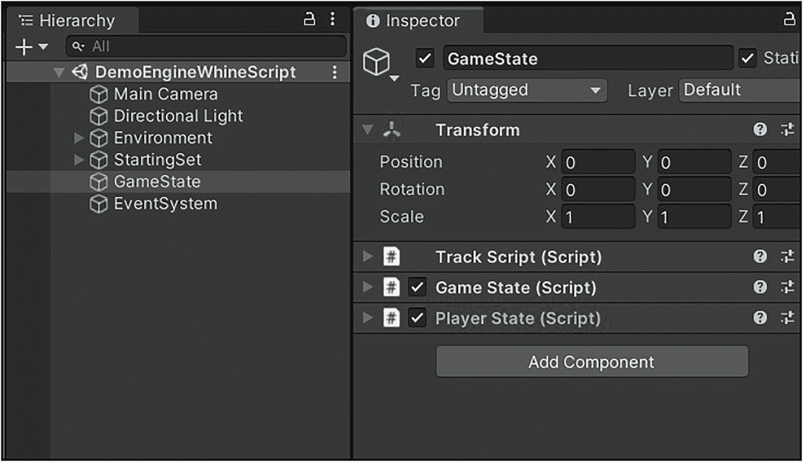

# 九、玩家和游戏状态类：第 1 部分

在这一章中，我们将看看负责跟踪玩家和游戏状态的类。有很多代码需要我们回顾，所以我把回顾分成了两章。这两章复习所涉及的课程如下:

1.  PlayerInfo(第 [09](https://doi.org/10.1007/978-1-4842-7851-2_09) 章:第一部分)

2.  TrackScript(第[章第 9](https://doi.org/10.1007/978-1-4842-7851-2_09) :第 1 部分)

3.  PlayerState(第[章第 9](https://doi.org/10.1007/978-1-4842-7851-2_09) :第 1 部分)

4.  游戏状态(第十章[第十章](10.html):第二部分)

列出的前两个类别`PlayerInfo`和`TrackScript`附属于随后的两个类别`PlayerState`和`GameState`。因为前两个类非常简单和直接，我们将从它们开始。我们开始吧！

## 课堂回顾:PlayerInfo

正如我们之前见过几次的，类负责松散地关联一个 Unity 游戏对象和一个玩家。为此，该类在存储在`GameState`类中的可用播放器数组中保存相关播放器的索引。这个课比较短，我就在这里枚举一下吧。

```cs
01 using UnityEngine;
02
03 public class PlayerInfo : MonoBehaviour {
04    public int playerIndex = 0;
05 }

Listing 9-1PlayerInfo Class Review 1

```

是的，就这么简单。这其实非常简单。因为`PlayerInfo`类扩展了`MonoBehaviour`类，所以它是一个脚本组件，可以附加到 Unity 游戏对象上。当在 Unity 编辑器中分配给一个游戏对象时，你可以设置`playerIndex`字段的值。这些信息可以从父游戏对象中找到，并用来查找存储在游戏主类`GameState`中的玩家的`PlayerState`对象。在我们回顾交互类的时候，我们已经看到过这个用例。接下来，我们将看看`TrackScript`类。这个类是另一个用于保存游戏状态相关信息的`MonoBehaviour`，更具体地说是与当前赛道相关的设置。

## 课堂回顾:音轨脚本

`TrackScript`类是另一个简单的状态类，用于保存当前赛道的基本配置信息。这堂课又短又甜，所以我们就把它完整地列在这里。

```cs
1 using UnityEngine;
2
3 public class TrackScript : MonoBehaviour {
4    public int index = 0;
5    public bool headLightsOn = false;
6    public int laps = 3;
7    public string sceneName = "";
8 }

Listing 9-2TrackScript Class Review 1

```

预计`TrackScript`将驻留在`GameState` Unity 游戏对象上，紧挨着`GameState`和`PlayerState`组件的实例，如此处所示。



图 9-1

GameState Unity 游戏对象配置描述 GameState 游戏对象设置的屏幕截图。它显示了 GameState、PlayerState 和 TrackScript MonoBehaviours 脚本组件，根据需要附加到相同的父游戏对象

`GameState`类负责加载和处理存储在关联的`TrackScript`组件中的数据。职业的第一个领域，`index`，目前没有被游戏使用。随意实现一些索引特定的代码，如大气效果或不同的背景音乐。列出的下一个字段`headLightsOn`是一个布尔标志，用于指示当前赛道是否应该打开悬停赛车的前灯。随后，`laps`字段用于显示当前赛道的圈数。我说建议是因为赛道难度和模式也会影响给定赛道的圈数。最后，`sceneName`字段可用于为当前轨道/场景提供名称。我们要看的下一个类是`PlayerState`类。这个类是一个怪物，所以要准备好一个冗长的类视图。

## 课堂回顾:玩家状态

`PlayerState`类是通过`BaseScript`类的扩展得到的`MonoBehaviour`类。它用于在整个游戏过程中跟踪玩家的状态。因此，该类有大量字段跟踪与汽车运动和状态相关的各种值。因为`PlayerState`类非常复杂，我们将使用更结构化的审查过程，并按照以下步骤来审查它:

1.  静态/常量/只读类成员

2.  类别字段

3.  相关的方法大纲/类头

4.  支持方法详细信息

5.  主要方法详细信息

6.  示范

没有相关的枚举可言，所以我们将省略这一部分。我应该花点时间提一下，有很多，几乎太多，类字段要回顾。不要对此感到不知所措，我们会慢慢地、详细地介绍一切。不要以为第一遍读完就一定要全记在脑子里。在处理游戏代码时，你很可能需要参考几次这个类的评论。在大多数情况下，您根本不需要调整这些字段，所以就把它看作是我们的彻底。就这样，让我们开始吧。

### 静态/常量/只读类成员:PlayerState

`PlayerState`类有许多静态和只读的类字段。这些字段用于查找资源、跟踪某些修饰符以及定义正在进行的比赛类型的值。

```cs
public static bool SHOW_AI_LOGIC = true;
public static readonly int TYPE_SPEED_SLOW = 0;
public static readonly int TYPE_SPEED_NORM = 1;
public static readonly int TYPE_SPEED_BOOST = 2;
public static readonly int TYPE_PLAYER_HUMAN = 0;
public static readonly int TYPE_PLAYER_COMPUTER = 1;
public static readonly int TYPE_CAR_HOVER_GREEN = 0;
public static readonly int TYPE_CAR_HOVER_BLACK = 3;
public static readonly int TYPE_CAR_HOVER_RED = 4;
public static readonly int TYPE_CAR_HOVER_PURPLE = 5;
public static readonly int DEFAULT_POSITION = 0;
public static readonly float DEFAULT_MAX_SPEED = 200.0f;

public static readonly float DEFAULT_GRAVITY = 11.0f;
public static float LIMIT_MAX_SPEED = 300.0f;

Listing 9-3PlayerState Static/Constants/Read-Only Class Members 1

```

前面列出了我们要查看的第一组静态类字段。第一个条目`SHOW_AI_LOGIC`，用于控制 AI 控制的汽车驾驶计算的显示。这实际上是一个非常酷的功能。在运行游戏的完整版本，场景“Main13”或“Main14”之前，将该字段的值设置为 true。打开场景并运行它。当 AI 悬浮赛车在赛道上奔跑时，切换到 Unity 编辑器的“场景”面板。确保你有一个自上而下的赛道视图，并缩小以便你能看到赛道的大部分。当盘旋赛车在赛道上前进时，跟随他们，你会注意到从赛车到下几个路点的小绿线。这些线是汽车的 AI 驾驶逻辑计算的一部分。

既然我们已经讨论了这个问题，让我们回到课堂上来。接下来是三个条目，用于表示慢速、正常或加速速度。接下来的两个条目，以“`TYPE_PLAYER_`”开头的，用来表示当前玩家的类型，AI 还是人类控制的。随后，有四个条目用于指示给定玩家使用的赛车类型。`DEFAULT_POSITION`字段用于为当前玩家提供默认位置值。接下来的两个条目，`DEFAULT_MAX_SPEED`和`DEFAULT_GRAVITY`，用于为悬停赛车的重力和最大速度值提供默认值。这个集合中列出的最后一个条目用于表示对玩家最大速度的限制。让我们继续查看下一组字段。

```cs
public readonly int MAX_IS_MISS_TIME = 2;
public readonly int MAX_IS_SHOT_TIME = 2;
public readonly int MAX_IS_HIT_TIME = 2;
public readonly int MAX_IS_LAP_COMPLETE_TIME = 6;
public static readonly int DEFAULT_LIFE_AMOUNT = 3;
public readonly int INVINC_SECONDS = 10;
public static readonly int DEFAULT_DAMAGE_AMOUNT = 0;
public readonly float MIN_STUCK_DISTANCE = 30.0f;
public readonly float MIN_STUCK_TIME = 3.0f;
public readonly float MIN_WAYPOINT_DISTANCE = 30.0f;
public readonly int MAX_SPEED_BONUS_DRAFTING = 4;
public readonly int MAX_SPEED_BONUS_PASSING = 20;
public readonly float MAX_SMOKE_TIME = 1000.0f;
public readonly int MAX_GAINED_LIFE_TIME = 2;
public static readonly string AUDIO_CLIP_CAR_SOUND1 = "CarAirNonGapless";

public static readonly string AUDIO_CLIP_CAR_SOUND2 = "car_idle_lp_01";

public static readonly string AUDIO_CLIP_GUN_SHOT = "explosion_short_blip_rnd_01";

Listing 9-4PlayerState Static/Constants/Read-Only Class Members 2

```

前面列出的静态/只读类字段集以四个最大计时值开始。这些字段以文本“`MAX_IS_`”开头。这些字段保存战斗模式通知未命中、命中、命中和单圈完成时间通知的最大计时值。接下来，我们有`DEFAULT_LIFE AMOUNT`字段，它为玩家设置了总生命值。`INVINC_SECONDS`字段被用来设置无敌修改器激活的最大时间限制。在这个区域之后是`DEFAULT_DAMAGE_AMOUNT`区域，用来准备每个玩家的伤害点。

随后，我们有一组最小值只读字段。`MIN_STUCK_DISTANCE`字段表示用于确定当前玩家的悬停赛车是否没有移动足够的距离并且现在被卡住的距离值。类似地，`MIN_STUCK_TIME`字段用于设置玩家的悬停赛车没有移动到被标记为卡住的最短时间。这两个字段都用于确定玩家是否被卡住。最后一个最小值输入，`MIN_WAYPOINT_DISTANCE`，是在被认为是航迹上的“下一个”航路点之前，你离一个航路点的最小距离。

接下来我们要看的四个字段是最大值，用于设置悬停赛车手一些行为的限制。这些条目的前两个用于设置从起草和通过另一个悬停赛车获得的速度奖励的限制。下一个最大值字段`MAX_SMOKE_TIME`，用于设置射击烟雾效果持续时间的限制。这个粒子效果已经被注释掉了，留给读者去实现。类似地，`MAX_GAINED_LIFE_TIME`字段用于设置寿命延长通知持续时间的限制。

这组静态字段中的最后三个条目用于定位具有指定名称的`AudioSource`组件。这就是静态类成员回顾部分的结论。在下一部分，我们将开始复习该课程的剩余字段。

### 类字段:PlayerState

`PlayerState`类有许多字段留给我们回顾。他们有很多人。它们用于控制、跟踪和模拟人工智能和人类控制的玩家的悬停赛车行为的所有方面。我们开始吧！

```cs
//***** Class Fields *****
public int index = 0;
public GameObject player;
public bool active = true;
public float offTrackSeconds = 6.0f;
public float wrongDirectionSeconds = 6.0f;

//***** Input Class Fields *****
public CharacterController controller

;
public CharacterMotor cm;
public MouseLookNew mouseInput;
public FPSInputController fpsInput;
public Transform home;
private bool hasSetHome = false;
public bool pause = false;

//***** Car Descriptor Class Fields *****
//0 = slow, 1 = norm, 2 = boost
public int speedType = TYPE_SPEED_SLOW;

//0 = human, 1 = computer
public int playerType = TYPE_PLAYER_HUMAN;

//0 = green hover, 1 = red hover, 2 = black hover,
//3 = black hover, 4 = red hover, 5 = purple hover
public int carType = TYPE_CAR_HOVER_GREEN;

//***** Speed Class Fields *****
public float speed = 0.0f;
public float speedPrct = 0.0f;
public float speedPrctLimit = 0.0f;
public float maxSpeed = DEFAULT_MAX_SPEED;
public int position = DEFAULT_POSITION;
public float gravity = DEFAULT_GRAVITY;

Listing 9-5PlayerState Class Fields 1

```

我们要查看的第一组字段从一组通用类字段开始。第一个字段是最重要的`index`字段。该字段用于指示该玩家状态实例与可用玩家数组中的哪个玩家相关联。下一个字段是一个`GameObject`实例`player`，用于保存对代表玩家的 Unity 游戏对象的引用。在这种情况下，这是悬停赛车模型。

布尔标志`active`用于指示玩家是否活动。该字段之后是`offTrackSeconds`字段。该字段描述在显示脱离轨道通知之前，车辆脱离轨道的秒数。随后，`wrongDirectionSeconds`表示在显示错误方向通知之前，汽车必须朝错误方向行驶的秒数。

我们要查看的下一组字段是输入类字段。`controller`字段是当前玩家的一个`CharacterController`实例。接下来，有一个`CharacterMotor`实例，`cm`。我们还有`MouseLookNew`、`mouseInput`和`FPSInputController`、`fpsInput`的实例来完善我们的控制类。`home`字段是一个`Transform`实例，用于记录玩家的家或起始位置。

布尔标志`hasSetHome`用于指示是否已经设置了初始位置。接下来，`pause`字段是指示播放器是否暂停的布尔标志。下面一组类字段是汽车描述符类字段。第一个这样的字段是`speedType`字段。该字段的值为 0、1 或 2，表示速度缓慢、正常或加速。类似地，`playerType`字段是一个整数值，0 代表人类玩家，1 代表计算机玩家。

该组中的最后一个字段是`carType`字段。该字段用于描述玩家驾驶的汽车类型。在我们的例子中，它描述了悬停赛车的颜色。这些值由前面列出的字段定义记录在注释中。我们必须查看的最后一组字段是速度等级字段。这些字段用于表示不同的速度相关特性、值和限制。`speed`字段代表玩家汽车的速度。`speedPrct`字段用于表示汽车当前行驶速度占悬停赛车最大速度的百分比。`speedPrctLimit`字段类似，只是它表示汽车当前行驶的`LIMIT_MAX_SPEED`值的百分比。

`maxSpeed`字段用于保存汽车的当前最大速度。接下来，`position`字段表示赛车在比赛中的当前位置，`gravity`字段用于表示赛车的重力。这将我们带到下一组要查看的类字段。我把它们列在这里。

```cs
//***** Time Class Fields *****
public string time;
public int timeNum;
public float totalTime = 0;
public float hour = 0;
public float min = 0;
public float s = 0;
public float ms = 0;

//***** Off Track Class Fields *****
public bool offTrack = false;
public float offTrackTime = 0.0f;

//***** Wrong Direction Class Fields *****
public bool wrongDirection = false;
public float wrongDirectionTime = 0.0f;

//***** Skipped Waypoint Class Fields *****
public bool skippedWaypoint = false;
public float skippedWaypointTime = 0.0f;

//***** Cameras and Objects Class Fields *****
public GameObject gun;
public GameObject gunBase;
public new Camera camera;
public Camera rearCamera;
public GameObject car;
public GameObject carSensor;

Listing 9-6PlayerState Class Fields 2

```

我们要查看的下一组类字段是当前玩家在赛道上比赛的时间。第一个条目`time`，是玩家的圈速的字符串表示。接下来的字段`timeNum`，是一个单一的大整数表示玩家的圈速。接下来，`totalTime`字段代表给定圈上的总持续时间，以毫秒为单位。随后会列出当前曲目时间的各个组成部分。第一个条目`hour`表示在当前曲目上花费的小时数。希望不要太多。

接下来，`min`类字段记录在当前赛道上花费的分钟数，而接下来的两个字段，`s`和`ms`，用于指示在当前赛道上花费的时间的秒和毫秒部分。接下来的三组字段用于跟踪玩家的偏离轨迹、错误方向和跳过的路点状态。下一个要审查的是跑道外的场地。该组中的第一个条目是`offTrack`字段。该字段是一个布尔标志，用于指示玩家离开了跑道。该组中的第二个字段表示当前玩家离开赛道的时间。

这组字段之后是错误方向类字段。与偏离轨道字段的模式类似，错误方向字段由布尔标志和定时值、`wrongDirection`和`wrongDirectionTime`字段组成。下一组字段，即跳过的路点类字段，也由布尔标志和时间追踪字段组成。该组包含`wrongDirection`和`wrongDirectionTime`字段。类似地，下一组字段，即跳过的路点类字段，也由布尔标志和时间跟踪字段组成。这些是`skippedWaypoint`和`skippedWaypointTime`类字段。这种模式经常用于测量某些功能的持续时间，然后切换一个布尔字段来打开或关闭该功能。

接下来是一组字段，表示与玩家的悬停赛车相关联的相机和对象。第一个这样的字段是`GameObject`实例`gun`。该字段是对汽车的枪对象的引用。这个物体在游戏的战斗模式中出现。下一个字段是`GameObject`实例`gunBase`。这也是对一个游戏对象的引用，在这种情况下，`gun`依赖的基础模型。接下来我们列出了一个特别重要的字段，`camera`。这个摄像头安装在悬停赛车的驾驶舱内。在玩游戏时，它被用作主摄像头。

下一个字段是`rearCamera`字段。这款相机被用作哈弗赛车的后视相机。接下来，我们有非常重要的`car`字段。该字段引用代表比赛中玩家的游戏对象。他们的悬停赛车。该组中的下一个也是最后一个字段是代表汽车前视传感器的`carSensor`游戏对象。我们已经在前面的高级交互课程复习第五章[T4 中讨论过这个问题。让我们转到下一组类字段。](05.html)

```cs
//***** Car Status Class Fields *****
public int ammo = 0;
public bool gunOn = false;
public bool isBouncing = false;
public bool isJumping = false;
public bool isDrafting = false;
public bool isShot = false;
public float isShotTime = 0.0f;
public bool isHit = false;
public float isHitTime = 0.0f;
public bool isMiss = false;
public float isMissTime = 0.0f;

public bool lapComplete = false;
public float lapCompleteTime = 0.0f;
public bool armorOn = false;
public bool boostOn = false;
public bool invincOn = false;
public float invincTime = 0.0f;
public int lifeTotal = DEFAULT_LIFE_AMOUNT;
public int damage = DEFAULT_DAMAGE_AMOUNT;
public int points = 0;
public bool alive = true;

Listing 9-7PlayerState Class Fields 3

```

这组类字段与悬停赛车的当前状态有关。第一个字段显示玩家拥有的弹药数量。下一个字段`gunOn`用于指示枪修改器是否激活。接下来的三个字段(`isBouncing`、`isJumping`和`isDrafting`)的使用方式与我们刚刚查看的`gunOn`字段相同。该组中接下来的六个字段遵循我们之前看到的关于轨迹和航路点指示器的相同模式。

在每种情况下，都有一个布尔标志和一个时间跟踪字段，用于射击、命中和未命中事件。请注意，这些事件仅在游戏的战斗模式中可用。接下来的两个字段`lapComplete`和`lapCompleteTime`，遵循我们刚刚看到的完全相同的模式。下一个字段`lapComplete`表示该圈已经完成，而下一个字段`lapCompleteTime`记录该圈的持续时间。`armorOn`和`boostOn`字段是布尔标志，用于指示给定的修改器是活动的还是非活动的。`invinvOn`和`invincTime`字段遵循我们看到的相同模式，包括一个布尔标志和一个计时字段。

`lifeTotal`栏显示玩家的总生命值。`damage`字段是一个整数值，表示当前汽车受到的损坏量。游戏并没有主动使用`points`区域，但是你可以在你认为合适的时候使用。类似地，布尔标志`alive`被用来指示当前玩家是否还活着，但是它并没有被游戏主动使用。我们要看的下一组类字段是速度和航路点相关的字段。我把它们列在这里。

```cs
//***** Speed Class Fields *****
public int maxForwardSpeedSlow = 50;
public int maxSidewaysSpeedSlow = 12;
public int maxBackwardsSpeedSlow = 5;
public int maxGroundAccelerationSlow = 25;
public int maxForwardSpeedNorm = 200;
public int maxSidewaysSpeedNorm = 50;
public int maxBackwardsSpeedNorm = 20;
public int maxGroundAccelerationNorm = 100;
public int maxForwardSpeedBoost = 250;
public int maxSidewaysSpeedBoost = 60;
public int maxBackwardsSpeedBoost = 30;
public int maxGroundAccelerationBoost = 120;

//***** Waypoint Class Fields *****
public ArrayList waypoints = null;
public float waypointDistance = 0.0f;
public float waypointDistancePrev = 0.0f;

Listing 9-8PlayerState Class Fields 4

```

我们要查看的下一组类字段，如前面所列，包含两组字段。这些字段用于跟踪玩家的速度和路点交互。不同的速度场分为三类:慢速、正常和加速。每个类别有四个条目。关于慢速，我们有一个`maxForwardSpeedSlow`字段，它保存一个用于正向慢速的值。在此之后，我们有慢速类别的横向和向后速度。这一类别的最后一个字段是地面加速速度慢字段。

“正常”和“加速”类别也有相同的条目。标准速度用于在轨运行。慢速用于偏离轨道的运动。最后，当汽车有一个激活的加速修改器时，加速速度用于运动。接下来的三个字段与航迹的航路点系统相关联。第一个条目是一个`ArrayList`实例，用于保存对所有路点的引用。

以下两个字段用于跟踪汽车和下一个航路点之间的距离，`waypointDistance`和`waypointDistancePrev`。正如你可能已经猜到的，先前的航路点距离计算存储在`waypointDistancePrev`字段中。这些计算被用作航路点计算和人工智能系统的一部分，这将我们带到下一组职业领域供我们回顾，人工智能领域。

```cs
//***** AI Class Fields Part 1 *****
public bool aiOn = false;
public int aiWaypointTime = 0;
public int aiWaypointLastIndex = -1;
public int aiWaypointIndex = 0; //0 = first node
public int aiWaypointRoute = 0;
public float aiTurnStrength = 1.0f;

public float aiSpeedStrength = 1.0f;
public float aiStrafeStrength = 0.0f;
public float aiSlide = 0.0f;

//0 = looking, 1 = testing, 2 = acting
public int aiIsStuckMode = 0;
public bool aiIsStuck = false;
public float aiWaypointDistance = 0f;

public Vector3 aiRelativePoint = Vector3.zero;
public float aiTime1 = 0.0f;
public float aiTime2 = 0.0f;
public float aiSlowDownTime = 0.0f;
public float aiSlowDown = 0.0f;
public bool aiSlowDownOn = false;

Listing 9-9PlayerState Class Fields 5

```

我们要复习的下一组字段是第一组 AI 类字段。游戏的人工智能系统使用这些字段来移动、计算人工智能控制的悬停赛车的移动或报告其状态。第一个条目`aiOn`，是一个布尔标志，指示悬停赛车的 AI 模式是否开启。`aiWaypointTime`字段保存一个整数表示，它是当前玩家的当前`timeNum`字段的副本。接下来的两个字段，`aiWaypointpointLastIndex`和`aiWaypointIndex`，用于跟踪玩家之前和当前的航点索引。这些由玩家的悬停赛车触发，与航路点对象交互。我应该注意到，虽然我说的是“玩家的”，这也意味着一个 AI 对手玩家，而不仅仅是一个人类玩家。

`aiWaypointRoute`字段用于加载指定路线的航路点。这个特性在游戏中实际上并没有使用；相反，路由总是被设置为零。如果您愿意，可以随意扩展这个功能。下一个字段`aiTurnStrength`，目前游戏还没有实现，但是可以作为人工智能转向计算的一部分。下面的字段`aiSpeedStrength`，被游戏的人工智能计算用来控制悬停赛车手的速度矢量。

类似地，`aiStrafeStrength`字段用于控制 AI 控制的悬停赛车的计算速度矢量的扫射分量。`aiSlide`字段为 AI 提供了一个用于速度计算的滑动组件。在处理“卡住”的悬停赛车时，我们会随着时间的推移进行一些检查，以表明赛车被卡住了。`aiIsStuckMode`字段有助于跟踪正在执行的停滞检查。

最终,“停滞”计算的结果存储在`aiIsStuck`字段中。接下来，我们有`aiWaypointDistance`字段，用于在 AI 模式下跟踪到下一个航路点的距离。`aiRelativePoint`字段用于确定当 AI 驾驶悬停赛车时应该使用什么`aiStrafeStrength`。接下来的两个字段`aiTime1`和`aiTime2`用于跟踪时间间隔，例如在检查不同的`aiIsStuckMode`时。该组中的最后两个字段是`aiSlowDownTime`和`aiSlowDown`字段。这些字段用于控制盘旋赛车在转弯时的速度。`aiSlowDownTime`字段测量当前减速的持续时间。下一个字段`aiSlowDown`是一个指示汽车应该减速多少的值。该值由轨迹的航路点标记决定。最后，`aiSlowDownOn`字段用于指示减速修改器当前打开。我们还有几个人工智能领域要复习。我在这里列出下一套。

```cs
//***** AI Class Fields Part 2 *****
public float aiSlowDownDuration = 100.0f;
public bool aiIsPassing = false;
public float aiPassingTime = 0.0f;
public int aiPassingMode = 0;
public bool aiHasTarget = false;
public float aiHasTargetTime = 0.0f;

public bool aiIsReloading = false;
public float aiIsReloadingTime = 0.0f;
public bool aiHasGainedLife = false;
public float aiHasGainedLifeTime = 0.0f;
public bool aiIsLargeTurn = false;
public float aiIsLargeTurnSpeed = 0.0f;

public float aiLastLookAngle = 0.0f;
public float aiNextLookAngle = 0.0f;
public float aiNext2LookAngle = 0.0f;
public float aiMidLookAngle = 0.0f;
public float aiMid2LookAngle = 0.0f;
public bool aiCanFire = false;

public float aiBoostTime = 0.0f;
public int aiBoostMode = 0;
public int aiWaypointJumpCount = 0;
public int aiWaypointPassCount = 0;

Listing 9-10PlayerState Class Fields 6

```

我们已经讨论了一大堆课程领域，并且几乎就要完成了，所以坚持住。我们还有两组字段要复习。其余的 AI 字段已在前面列出。第一个条目把我们带回到减速领域。`aiSlowDownDuration`字段用于跟踪悬停赛车的减速。这个值是在 AI 控制的车上由赛道的路点标记设定的。接下来的三个条目是与 AI 悬停赛车的通过修改器有关的字段。`aiIsPassing`字段是一个布尔标志，表示 AI 汽车处于超车模式。然后,`aiPassingTime`字段用于测量悬停赛车超过当前赛车的持续时间。与这两个字段相关的是设置传球尝试模式的`aiPassingMode`字段。

接下来的两个变量遵循我们之前见过的模式。`aiHasTarget`字段指示目标已经设置，而`aiHasTargetTime`字段用于测量目标已经激活的持续时间。在这一对之后是另外两个布尔标志和持续时间字段集。看看他们，重装和生命增益。从人工智能控制的汽车的转弯角度可以检测到大转弯。角度决定了`aiLargeTurnSpeed`字段的值。这种机制用于帮助控制汽车在大角度转弯时的速度。

查看接下来的五个字段。这些都是浮点值，旨在保持基于悬停赛车方向和到下一个航路点的距离之间的计算的角度。`aiCanFire`布尔用于指示汽车是否能够开火。这只有在游戏的战斗模式变异中才有。下一对字段`aiBoostMode`和`aiBoostTime`，遵循与之前看到的布尔标志、持续时间字段集类似的结构。在这种情况下，模式决定行为，时间字段跟踪持续时间。`aiWaypointPassCount`字段以一种有点愚蠢的方式跟踪经过的路点数量。它不能很好地跟踪重复和跳转，但是它可以用于根据其值的变化做出决定。还有一组剩余的类字段可供查看。

```cs
//***** Other Class Fields *****
public GameObject gunExplosion = null;
public GameObject gunHitSmoke = null;
public bool gunSmokeOn = false;
public float gunSmokeTime = 0.0f;
//public ParticleEmitter gunExplosionParticleSystem = null;

//public ParticleEmitter gunHitSmokeParticleSystem = null;

public GameObject flame = null;
public int totalLaps = 3;
public int currentLap = 0;
public bool prepped = false;
public GameObject lightHeadLight = null;

public AudioListener audioListener = null;
public AudioSource audioGunHit = null;
public AudioSource audioCarSound1 = null;
public AudioSource audioCarSound2 = null;

Listing 9-11PlayerState Class Fields 7

```

我们要查看的最后一组类字段是“其他”类字段。`gunExplosion`和`gunHitSmoke`字段是游戏对象引用，指向玩家的悬停赛车中的对象，特别是汽车的统一层次`GameObjects`。接下来的两个字段应该看起来很熟悉。它们遵循我们之前见过的相同模式。这一对场，`gunSmokeOn`和`gunSmokeTime`，用来控制枪械的烟雾效果。该功能目前在游戏中被禁用。我会解释的。这个特性是以一种遗留的方式实现的，但现在已经过时了。我们保留了为它提供动力的代码，但是注释掉了，这样你就可以用它来为游戏和支持代码添加新的最新粒子效果。下一个字段是引用了 hover racer 模型结构的一部分的`GameObject flame`。`totalLaps`字段的值表示当前比赛的圈数。

类似地，`currentLap`字段指示当前玩家在第几圈。布尔标志`prepped`用于表示玩家已经准备好，可以出发了。正如你可能已经想到的，`lightHeadLight`场是用来打开或关闭汽车的头灯。这组字段和字段查看部分是玩家的悬停赛车使用的音频监听器和声音资源字段。祝贺您，您已经完成了本复习部分的学习。在下一节中，我们将看看这个类的相关方法大纲。

### 相关的方法大纲/类头:PlayerState

`PlayerState`类让我们复习的方法很少。我把它们列在这里。

```cs
//Main Methods
void Start();
public bool PerformGunShotHit();
public Vector3 UpdateAiFpsController();
public void MoveToCurrentWaypoint();
public void MoveToWaypoint(int index);
public void UpdateAiMouseLook();
public void Update();
public void Reset();

//Support Methods
public void LoadAudio();
public void PauseSound();
public void UnPauseSound();
public bool IsValidWaypointIndex(int index);
public void StampWaypointTime();
public void PlayGunShotHitAudio();
public WaypointCheck GetCurrentWaypointCheck();
public void PerformLookAt(WaypointCheck wc);
public void ResetTime();
public int GetLife();
public int GetLifeHUD();
public int GetLapsLeft();
public void SetDraftingBonusOn();
public void SetDraftingBonusOff();
public void SetBoostOn();
public void SetBoostOff();
public void SetCurrentSpeed();
public void ShowInvinc();
public void HideInvinc();
public void ShowGun();
public void HideGun();
public void SetSlow();
public void SetNorm();
public void SetBoost();
private int GetPastWaypointIndex(int wpIdx);

Listing 9-12PlayerState Pertinent Method Outline/Class Headers 1

```

当然有很多支持方法需要我们回顾，但是由于大多数方法都非常简单和直接，我们将很快完成它们。

```cs
using System.Collections;
using UnityEngine;

public class PlayerState : BaseScript {}

Listing 9-13PlayerState Pertinent Method Outline/Class Headers 2

```

注意，`PlayerState`类扩展了`BaseScript`类，继承了一些我们在之前的类回顾中看到的标准功能。在下一个复习部分，我们将看看类的支持方法。

### 支持方法详细信息:PlayerState

`PlayerState`类有许多支持方法供我们研究。这些方法中有几个非常简单，所以我在这里列出来，但是由于它们的简单性，我们不会对它们做深入的回顾。请花时间仔细阅读。除非你了解这些方法的作用和使用方法，否则不要继续。

```cs
01 public void PauseSound() {
02    if (audioCarSound1 != null) {
03       audioCarSound1.Stop();
04    }
05
06    if (audioCarSound2 != null) {
07       audioCarSound2.Stop();
08    }
09 }

01 public void UnPauseSound() {
02    if (audioCarSound1 != null) {
03       audioCarSound1.Play();
04    }
05
06    if (audioCarSound2 != null) {
07       audioCarSound2.Play();
08    }
09 }

01 public bool IsValidWaypointIndex(int index) {
02    if (waypoints == null) {
03       waypoints = gameState.GetWaypoints(aiWaypointRoute);
04    }

05
06    if (waypoints != null && index >= 0 && index <= (waypoints.Count - 1)) {
07       return true;
08    } else {
09       return false;
10    }
11 }

01 public void StampWaypointTime() {
02    aiWaypointTime = timeNum;
03 }

01 public void PlayGunShotHitAudio() {
02    if (audioGunHit != null) {
03       if (audioGunHit.isPlaying == false) {
04          audioGunHit.Play();
05       }
06    }
07 }

01 public WaypointCheck GetCurrentWaypointCheck() {
02    if (waypoints != null) {
03       return (WaypointCheck)waypoints[aiWaypointIndex];
04    } else {
05       return null;
06    }
07 }

01 public void PerformLookAt(WaypointCheck wc) {
02    wcVpla = wc.transform.position;
03    wcVpla.y = player.transform.position.y;
04    player.transform.LookAt(wcVpla);
05 }

01 public void ResetTime() {
02    totalTime = 0f;
03 }

01 public int GetLife() {
02    return (lifeTotal - damage);
03 }

01 public int GetLifeHUD() {
02    return (lifeTotal - damage);
03 }

01 public int GetLapsLeft() {
02    return (totalLaps - currentLap);
03 }

01 public void SetDraftingBonusOn() {
02    isDrafting = true;
03    SetCurrentSpeed();
04 }

01 public void SetDraftingBonusOff() {
02    isDrafting = false;
03    SetCurrentSpeed();
04 }

01 public void SetBoostOn() {
02    boostOn = true;
03    SetBoost();
04 }

01 public void SetBoostOff() {
02    boostOn = false;
03    SetNorm();
04 }

01 public void SetCurrentSpeed() {
02    if (speedType == 0) {
03       SetSlow();
04    } else if (speedType == 1) {
05       SetNorm();
06    } else if (speedType == 2) {
07       SetBoost();
08    }

09 }

01 public void ShowInvinc() {
02    invincOn = true;
03    invincTime = 0f;
04 }

01 public void HideInvinc() {
02    invincOn = false;
03    invincTime = 0f;
04 }

01 public void ShowGun() {
02    gunOn = true;
03    if (gun != null) {
04       gun.SetActive(true);
05    }
06
07    if (gunBase != null) {
08       gunBase.SetActive(true);
09    }
10 }

01 public void HideGun() {
02    gunOn = false;
03    if (gun != null) {
04       gun.SetActive(false);
05    }
06
07    if (gunBase != null) {
08       gunBase.SetActive(false);
09    }
10 }

Listing 9-14PlayerState Support Method Details 1

```

这些支持方法本质上很简单。大多数只有几行代码。我不会在这里详细介绍它们。请通读一遍，确保你理解了它们，并且在你继续下一步之前，它们对你有意义。我们将继续讨论更复杂的支持方法。让我们来看看！

```cs
01 public void LoadAudio() {
02    audioSetLa = player.GetComponents<AudioSource>();
03    if (audioSetLa != null) {
04       lLa = audioSetLa.Length;
05       for (iLa = 0; iLa < lLa; iLa++) {
06          aSLa = (AudioSource)audioSetLa[iLa];
07          if (aSLa != null) {
08             if (aSLa.clip.name == AUDIO_CLIP_GUN_SHOT) {
09                audioGunHit = aSLa;
10             } else if (aSLa.clip.name == AUDIO_CLIP_CAR_SOUND1) {
11                audioCarSound1 = aSLa;
12             } else if (aSLa.clip.name == AUDIO_CLIP_CAR_SOUND2) {
13                audioCarSound2 = aSLa;
14             }
15          }
16       }
17    }
18 }

01 public void SetSlow() {
02    if (BaseScript.IsActive(scriptName) == false) {
03       return;
04    }
05
06    if (cm == null) {
07       return;
08    }
09
10    speedType = 0;
11    cm.movement.maxForwardSpeed = maxForwardSpeedSlow;
12    if (isDrafting == true) {
13       cm.movement.maxForwardSpeed += MAX_SPEED_BONUS_DRAFTING;
14    }
15
16    if (aiIsPassing == true) {
17       cm.movement.maxForwardSpeed += MAX_SPEED_BONUS_PASSING;
18    }
19    cm.movement.maxSidewaysSpeed = maxSidewaysSpeedSlow;
20    cm.movement.maxBackwardsSpeed = maxBackwardsSpeedSlow;
21    cm.movement.maxGroundAcceleration = maxGroundAccelerationSlow;
22 }

01 public void SetNorm() {

02    if (BaseScript.IsActive(scriptName) == false) {
03       return;
04    }
05
06    if (cm == null) {
07       return;
08    }
09
10    speedType = 1;
11    cm.movement.maxForwardSpeed = maxForwardSpeedNorm;
12    if (isDrafting == true) {
13       cm.movement.maxForwardSpeed += MAX_SPEED_BONUS_DRAFTING;
14    }
15
16    if (aiIsPassing == true) {
17       cm.movement.maxForwardSpeed += MAX_SPEED_BONUS_PASSING;
18    }
19    cm.movement.maxSidewaysSpeed = maxSidewaysSpeedNorm;
20    cm.movement.maxBackwardsSpeed = maxBackwardsSpeedNorm;
21    cm.movement.maxGroundAcceleration = maxGroundAccelerationNorm;
22 }

01 public void SetBoost() {
02    if (BaseScript.IsActive(scriptName) == false) {
03       return;
04    }
05
06    if (cm == null) {
07       return;
08    }
09
10    speedType = 2;
11    cm.movement.maxForwardSpeed = maxForwardSpeedBoost;
12    if (isDrafting == true) {
13       cm.movement.maxForwardSpeed += MAX_SPEED_BONUS_DRAFTING;
14    }
15
16    if (aiIsPassing == true) {
17       cm.movement.maxForwardSpeed += MAX_SPEED_BONUS_PASSING;
18    }

19    cm.movement.maxSidewaysSpeed = maxSidewaysSpeedBoost;
20    cm.movement.maxBackwardsSpeed = maxBackwardsSpeedBoost;
21    cm.movement.maxGroundAcceleration = maxGroundAccelerationBoost;
22 }

01 private int GetPastWaypointIndex(int wpIdx) {
02    if (wpIdx - 5 >= 0) {
03       wpIdx -= 5;
04    } else if (wpIdx - 4 >= 0) {
05       wpIdx -= 4;
06    } else if (wpIdx - 3 >= 0) {
07       wpIdx -= 3;
08    } else if (wpIdx - 2 >= 0) {
09       wpIdx -= 2;
10    } else if (wpIdx - 1 >= 0) {
11       wpIdx -= 1;
12    } else {
13       wpIdx = 0;
14    }
15    return wpIdx;
16 }

Listing 9-15PlayerState Support Method Details 2

```

前面列出的第一种更复杂的支持方法是`LoadAudio`方法。此方法用于加载音频资源，以用作悬停赛车的某些声音效果。在该方法的第 2 行，我们获得了一个附加到 player 对象的`AudioSource`组件列表。在生成的数组中循环，我们寻找三个特定的声音文件，并将引用存储在类字段中，第 9、11 和 13 行。

前面列出的下面三种方法用于更新当前玩家汽车的速度。第一个条目`SetSlow`，用于在 hover racer 脱离赛道时将其设置为慢速。第 2–4 行非常熟悉的代码(或者应该是这样的代码)会阻止这个方法在类没有正确配置的情况下执行任何工作。在第 6–8 行，如果字符运动字段`cm`未定义，我们退出该方法。

接下来，用第 10 行上代表慢速、正常或加速速度的值更新`speedType`字段。计算新的前进速度时考虑了 11–18 行上的牵引和通过。在该方法的最后，在第 19–21 行更新了悬停赛车的其余速度相关字段。我在`SetSlow`方法后面列出了`SetNorm`和`SetBoost`方法。这些方法与`SetSlow`方法几乎相同，所以我们在这里不再赘述。相反，我们会把他们的评论留给你。请确保您在继续之前了解该方法。

本节列出的最后一种方法是`GetPastWaypointIndex`方法。这个方法负责寻找过去的路点。它试图在玩家当前航点索引后面五个索引处找到一个有效的航点。如果所确定的索引值无效，则检查玩家当前航点索引后面四个索引的航点，依此类推。这就是本复习部分的结论。接下来，我们将看看这个类的主要方法。

### 主要方法细节:PlayerState

`PlayerState`类有几个主要的方法，负责配置和更新类字段。让我们来看看第一组主要的方法。

```cs
01 void Start() {
02    base.Prep(this.GetType().Name);
03    if (BaseScript.IsActive(scriptName) == false) {
04       Utilities.wrForce(scriptName + ": Is Deactivating...");
05       return;
06    }
07 }

01 public bool PerformGunShotHit() {

02    if (armorOn == true) {
03       armorOn = false;
04       isShot = true;
05       gunSmokeOn = true;
06       gunSmokeTime = 0.0f;
07       gunHitSmoke.SetActive(true);
08       //gunHitSmokeParticleSystem.Emit();
09       return true;
10    } else {
11       if (invincOn == true) {
12          return false;
13       } else {
14          damage++;
15          isShot = true;
16          gunSmokeOn = true;
17          gunSmokeTime = 0.0f;
18          gunHitSmoke.SetActive(true);
19          //gunHitSmokeParticleSystem.Emit();
20          PlayGunShotHitAudio();
21
22          if (GetLife() <= 0) {
23             aiWaypointIndex = GetPastWaypointIndex(aiWaypointIndex);
24             damage = 0;
25             if (aiWaypointIndex >= 0 && aiWaypointIndex < waypoints.Count) {
26                MoveToCurrentWaypoint();
27             }
28          }
29          return true;
30       }
31    }
32 }

01 public void MoveToWaypoint(int index) {
02    aiWaypointIndex = index;
03    MoveToCurrentWaypoint();
04 }

01 public void MoveToCurrentWaypoint() {
02    if (BaseScript.IsActive(scriptName) == false) {
03       return;
04    }

05
06    pause = true;
07    WaypointCheck wc = (WaypointCheck)waypoints[aiWaypointIndex];
08    Vector3 wcV = wc.transform.position;
09    wcV.y = wc.waypointStartY;
10
11    cm.movement.velocity = Vector3.zero;
12    player.transform.position = wcV;
13    isDrafting = false;
14    isJumping = false;
15    isBouncing = false;
16    SetNorm();
17    ShowInvinc();
18
19    if (aiWaypointIndex + 1 >= 0 && aiWaypointIndex + 1 < waypoints.Count) {
20       wc = (WaypointCheck)waypoints[aiWaypointIndex + 1];
21    }
22    aiWaypointJumpCount++;
23    PerformLookAt(wc);
24    pause = false;
25 }

Listing 9-16PlayerState Main Method Details 1

```

我们要看的第一个主要方法是`Start`方法。这个方法的实现遵循我们以前见过很多次的标准过程。对`Prep`方法的调用加载了一组标准变量，然后进行测试以查看该类是否正确初始化。下面列出的方法，`PerformGunShotHit`，用于对当前玩家应用射击命中结果。

第 2-9 行的第一个代码块处理当前玩家有主动护甲调整值时的命中。请注意，装甲修改器被设置为假，`isShot`标志被设置为真，一些效果字段被重置为显示一股烟的枪击。我应该再次提到，这些粒子效果已经被禁用，留给你来实现。在第 11 行到第 30 行的下一大块代码中，该方法处理没有装甲修改器激活时的射击命中。

这个大代码块的第一部分，第 11-13 行，处理当前玩家的无敌属性设置为真时的枪击事件。这段代码的第二部分从第 14 行到第 29 行。这段代码处理枪击事件。当前玩家的伤害和`isShot`旗在 14-15 行调整。枪击效果在第 16-19 行准备。在第 20 行，播放音频声音效果，表示有效的、破坏性的击打。

如果玩家没有更多的生命点，第 22 行，那么玩家在赛道上被重置，与击中水障碍的玩家被重置的方式相同。这在第 23–27 行处理。这个过程的第一步是找到一个先前的路点让玩家返回，作为受到致命一击的惩罚。我应该提一下，这个游戏的这些特性只有在战斗模式下才有。

对`GetPastWaypointIndex`方法的调用决定了我们可以将当前玩家向后移动多远。在第 24 行，当前玩家的伤害被设置为零，hover racer 通过调用第 26 行的`MoveToCurrentWaypoint`方法被重新定位。列出的下一个方法`MoveToWaypoint`，是方法集中第一个玩家重新定位的方法。这是一个传递方法，它更新第 2 行的`aiWaypointIndex`字段，然后通过调用`MoveToCurrentWaypoint`方法来移动播放器。我们现在来看看这个方法。

列出的第二个玩家重新定位方法`MoveToCurrentWaypoint`，实际上是移动玩家的悬停赛车。如果类没有正确配置，前几行代码(2–4)会阻止该方法执行任何工作。第 6–24 行的代码负责重新定位播放器。第一，玩家暂停，第 6 行；然后新玩家的位置由当前航点和第 9 行航点对象的`waypointStartY`字段的值决定。

第 11–17 行的代码设置玩家的速度、位置和修改器值。注意玩家在第 17 行收到无敌修正值。我们需要弄清楚给定玩家的新位置，玩家应该面向哪个方向。为此，我们找到第 19–21 行确定的下一个航路点。玩家的跳跃计数字段增加，玩家的方向在第 22-23 行调整。最后但同样重要的是，玩家在第 24 行没有暂停。在下一组要回顾的主要方法中，我们将看看`Update`和`Reset`方法。

```cs
001 public void Update() {
002    if (BaseScript.IsActive(scriptName) == false) {
003       return;
004    }
005
006    if (prepped == false || cm == null) {
007       return;
008    } else if (hasSetHome == false && player != null) {
009       home = player.transform;
010       hasSetHome = true;
011    }
012
013    //speed calculations
014    speed = cm.movement.velocity.magnitude;
015    if (boostOn == true || aiIsPassing == true) {
016       speed = LIMIT_MAX_SPEED;
017    }
018    speedPrct = (speed / maxSpeed);
019    speedPrctLimit = (speed / LIMIT_MAX_SPEED);
020
021    position = gameState.GetPosition(index, position);
022
023    //timing values
024    totalTime += Time.deltaTime;
025    ms = Mathf.RoundToInt((totalTime % 1) * 1000);
026    s = Mathf.RoundToInt(Mathf.Floor(totalTime));
027    min = Mathf.RoundToInt(Mathf.Floor((s * 1f) / 60f));
028    s -= (min * 60f);
029    hour = Mathf.RoundToInt(Mathf.Floor((min * 1f) / 60f));
030    min -= (hour * 60f);
031    time = string.Format("{0:00}:{1:00}:{2:000}", min, s, ms);
032    timeNum = int.Parse(string.Format("{0:00}{1:00}{2:00}{3:000}", hour, min, s, ms));
033
034    //waypoint distance calculations
035    if (waypoints != null && waypoints.Count > 0) {
036       wc = (WaypointCheck)waypoints[aiWaypointIndex];
037       if (wc != null) {
038          wcV = wc.transform.position;
039          wcV.y = player.transform.position.y;
040          waypointDistancePrev = waypointDistance;
041          waypointDistance = Vector3.Distance(wcV, player.transform.position);
042       }

043    }
044
045    //invincibility modifier
046    if (invincOn == true) {
047       invincTime += Time.deltaTime;
048    } else {
049       invincTime = 0f;
050    }
051
052    if (invincOn == true && invincTime >= INVINC_SECONDS) {
053       invincOn = false;
054    }
055
056    //has gained life
057    if (aiHasGainedLife == true) {
058       aiHasGainedLifeTime += Time.deltaTime;
059    } else {
060       aiHasGainedLifeTime = 0f;
061    }
062
063    if (aiHasGainedLife == true && aiHasGainedLifeTime >= MAX_GAINED_LIFE_TIME) {
064       aiHasGainedLife = false;
065    }
066
067    //gun smoke effect
068    if (gunSmokeOn == true) {
069       gunSmokeTime += Time.deltaTime * 100f;
070    } else {
071       gunSmokeTime = 0f;
072    }
073
074    if (gunSmokeOn == true && gunSmokeTime >= MAX_SMOKE_TIME) {
075       gunSmokeOn = false;
076       gunSmokeTime = 0f;
077       gunHitSmoke.SetActive(false);
078       //gunHitSmokeParticleSystem.emit = false;
079    }

080
081    //is shot time
082    if (isShot == true) {
083       isShotTime += Time.deltaTime;
084    } else {
085       isShotTime = 0f;
086    }
087
088    if (isShot == true && isShotTime >= MAX_IS_SHOT_TIME) {
089       isShot = false;
090    }
091
092    //is hit time
093    if (isHit == true) {
094       isHitTime += Time.deltaTime;
095    } else {
096       isHitTime = 0f;
097    }
098
099    if (isHit == true && isHitTime >= MAX_IS_SHOT_TIME) {
100       isHit = false;
101    }
102
103    //is miss time
104    if (isMiss == true) {
105       isMissTime += Time.deltaTime;
106    } else {
107       isMissTime = 0f;
108    }
109
110    if (isMiss == true && isMissTime >= MAX_IS_SHOT_TIME) {
111       isMiss = false;
112    }
113
114    //lap complete time
115    if (lapComplete == true) {
116       lapCompleteTime += Time.deltaTime;
117    } else {
118       lapCompleteTime = 0f;
119    }

120
121    if (lapComplete == true && lapCompleteTime >= MAX_IS_LAP_COMPLETE_TIME) {
122       lapComplete = false;
123    }
124
125    //off track checks
126    if (offTrack == true) {
127       offTrackTime += Time.deltaTime;
128    } else {
129       offTrackTime = 0f;
130    }
131
132    if (offTrack == true && offTrackTime >= offTrackSeconds) {
133       if (waypoints != null && waypoints.Count > 0) {
134          //move car to waypoint center
135          aiWaypointIndex = GetPastWaypointIndex(aiWaypointIndex);
136          if (aiWaypointIndex >= 0 && aiWaypointIndex < waypoints.Count) {
137             MoveToCurrentWaypoint();
138          }
139          offTrack = false;
140          offTrackTime = 0f;
141       }
142    }
143
144    //wrong direction checks
145    if (wrongDirection == true) {
146       wrongDirectionTime += Time.deltaTime;
147    } else {
148       wrongDirectionTime = 0f;
149    }
150
151    if (wrongDirection == true && wrongDirectionTime >= wrongDirectionSeconds) {
152       if (waypoints != null && waypoints.Count > 0) {
153          //move car to waypoint center
154          aiWaypointIndex = GetPastWaypointIndex(aiWaypointIndex);
155          if (aiWaypointIndex >= 0 && aiWaypointIndex < waypoints.Count) {
156             MoveToCurrentWaypoint();
157          }
158          wrongDirection = false;
159          wrongDirectionTime = 0;
160       }
161    }
162 }

001 public void Reset() {

002    totalTime = 0f;
003    min = 0f;
004    s = 0f;
005    ms = 0f;
006    hour = 0f;
007    ammo = 0;
008    damage = 0;
009    points = 0;
010
011    boostOn = false;
012    invincOn = false;
013    invincTime = 0.0f;
014    gunOn = false;
015    armorOn = false;
016    offTrack = true;
017    gunSmokeOn = false;
018    gunSmokeTime = 0f;
019
020    prepped = false;
021    offTrack = false;
022    offTrackTime = 0.0f;
023    wrongDirection = false;
024    wrongDirectionTime = 0.0f;
025    skippedWaypoint = false;
026    skippedWaypointTime = 0.0f;
027    position = 6;
028    currentLap = 0;
029    waypointDistance = 0.0f;
030    waypointDistancePrev = 0.0f;
031    alive = true;
032
033    isBouncing = false;
034    isJumping = false;
035    isDrafting = false;
036    isShot = false;
037    isShotTime = 0.0f;
038    isHit = false;
039    isHitTime = 0.0f;
040    isMiss = false;
041    isMissTime = 0.0f;
042
043    aiIsStuck = false;
044    aiIsPassing = false;
045    aiPassingTime = 0.0f;
046    aiPassingMode = 0;
047    aiHasTarget = false;
048    aiHasTargetTime = 0.0f;
049    aiIsReloading = false;
050    aiIsReloadingTime = 0.0f;
051
052    aiIsLargeTurn = false;
053    aiIsLargeTurnSpeed = 0.0f;
054    aiCanFire = false

;
055    aiBoostTime = 0.0f;
056    aiBoostMode = 0;
057    aiWaypointTime = 0;
058    aiWaypointLastIndex = -1;
059    aiWaypointIndex = 0;
060    aiWaypointJumpCount = 0;
061    aiWaypointPassCount = 0;
062 }

Listing 9-17PlayerState Main Method Details 2

```

前面列出的下一组主要方法，有两个重要的方法，我们现在来看看。我们要研究的第一个方法是非常重要的`Update`方法。这个方法为我们处理一些不同的职责。它负责计算当前速度、到航路点的距离，并跟踪不同修改器的持续时间。值得注意的是`PlayerState`类为人类和人工智能控制的玩家做着同样的工作。

`Update`方法的主要目的是跟踪悬停赛车的状态，并监控不同修改器所涉及的计时持续时间。修改器通过悬停赛车与其他汽车的交互以及跳跃和加速标记等轨迹功能来设置。注意，这个类不插入或驱动游戏的 HUD。这个过程由`GameState`类处理，我们马上就会看到。现在让我们来看一下`Update`方法的细节。

如果类没有正确配置，前几行代码保护方法不被执行，第 2-4 行。接下来，在第 6–7 行，如果该类没有被标记为已正确初始化，或者没有正确定义字符马达字段`cm`，则该方法返回。第 8–11 行的代码根据初始位置设置悬停赛车的初始位置。速度计算在第 14-19 行进行。

悬停赛车的速度被设置为等于汽车速度矢量的大小。如果汽车处于加速模式或者`aiIsPassing`标志为真，那么汽车的速度被设置为`LIMIT_MAX_SPEED`值。在第 18–19 行，速度百分比值被更新。第 24 行增加了总单圈时间，第 21 行更新了赛车在比赛中的当前位置。`Update`方法中的下一个代码块处理分段计时值，第 25–32 行。毫秒、秒和分钟由`totalTime`字段决定。请注意，在第 28 行，我们减去了所有可以用分钟表示的秒。在第 30 行执行类似的计算，减去所有可以用小时表示的分钟。

第 31 和 32 行更新了两个重要的类字段`time`和`timeNum`。`time`字段是当前圈速的字符串表示。`timeNum`字段是一个特殊的编码，它将当前的圈速保存为一个整数。下一个代码块是第 35–43 行的航路点距离计算。此代码负责获取当前航路点的中心位置和推荐的 Y 位置。

当前和先前的航路点距离设置在第 40-41 行。虽然人类玩家不使用这些值，但人工智能玩家使用它们来控制悬停赛车。在这段代码之后是无敌修改代码，第 46–54 行。这段代码遵循一个简单的模式，我们将在这个方法中多次看到。如果无敌修改器是激活的，第 46 行，那么我们增加修改器的计时值，第 47 行。如果不是，修改量时间被设置为零，第 49 行。第 52–54 行的最后一位代码重置了无敌修改器，如果它的活动时间超过了指定的时间。

下一个代码块，第 57–65 行，即“已经获得生命”部分，其功能与我们刚刚查看的代码相同。看一看它，并确保在继续之前理解它。包括这一段代码，剩下的代码块都很相似，你应该自己快速复习一下。代码块如下所示:

*   枪烟效果:68–79

*   拍摄时间:82–90 分钟

*   击中时间:93–101

*   错过时间是:104–112

*   单圈完成时间:115–123

代码非常直接。你会毫不费力地跟上它。尽管如此，还是要花点时间仔细看看。这种方法剩下的两个责任是偏离轨道检查和错误方向检查。这两个代码块遵循相同的模式，所以我将首先检查一个代码块，并将第二个代码块留给您来检查。请注意第 126–142 行代码中的“非跟踪检查”部分。第 126–130 行的 if 语句遵循我们之前见过的相同模式。如果布尔标志为真，我们递增偏离轨道时间；否则，我们将其值设置为零。

在第 132 行，如果 off-track 标志设置为 true，并且我们已经到达了`offTrackSeconds`时间，那么我们必须调整 hover racer 的位置，因为我们已经离开了赛道。如果有要处理的路点，第 133 行，那么我们将汽车移动到由第 135 行的方法调用确定的路点。如果确定的索引是有效的，我们移动汽车并重置偏离轨道标志和计时字段。

`Update`方法中的最后一段代码“错误方向检查”非常接近我们刚刚检查过的代码，所以我将把它留给您来检查。这组主方法中的最后一个方法是`Reset`方法。该方法只是将类字段重置为默认值。关于这个没什么好讨论的了。快速回顾一下，让我们继续研究剩下的最后两个主要方法，人工智能控制方法。

```cs
001 public Vector3 UpdateAiFpsController() {
002    if (player == null || prepped == false || cm == null) {
003       return Vector3.zero;
004    }
005
006    if (waypoints == null) {
007       waypoints = gameState.GetWaypoints(aiWaypointRoute);
008    }
009
010    if (waypoints == null) {
011       return Vector3.zero;
012    }
013
014    //calculate strafe strength
015    aiStrafeStrength = 0.0f;
016    aiSpeedStrength = 1.0f;
017
018    if (waypoints != null) {
019       fpsWc = (WaypointCheck)waypoints[aiWaypointIndex];
020       aiRelativePoint = player.transform.InverseTransformPoint(fpsWc.transform.position);
021
022       if (aiRelativePoint.x <= -30.0f) {
023          aiStrafeStrength = -0.30f;
024       } else if (aiRelativePoint.x >= 30.0f) {
025          aiStrafeStrength = 0.30f;
026       } else if (aiRelativePoint.x <= -20.0f) {
027          aiStrafeStrength = -0.20f;
028       } else if (aiRelativePoint.x >= 20.0f) {
029          aiStrafeStrength = 0.20f;
030       } else if (aiRelativePoint.x <= -15.0f) {
031          aiStrafeStrength = -0.15f;
032       } else if (aiRelativePoint.x >= 15.0f) {
033          aiStrafeStrength = 0.15f;
034       } else if (aiRelativePoint.x <= -10.0f) {
035          aiStrafeStrength = -0.10f;
036       } else if (aiRelativePoint.x >= 10.0f) {
037          aiStrafeStrength = 0.10f;
038       } else if (aiRelativePoint.x <= -5.0f) {

039          aiStrafeStrength = -0.05f;
040       } else if (aiRelativePoint.x >= 5.0f) {
041          aiStrafeStrength = 0.05f;
042       } else if (aiRelativePoint.x <= -1.0f) {
043          aiStrafeStrength = -0.01f;
044       } else if (aiRelativePoint.x >= 1.0f) {
045          aiStrafeStrength = 0.01f;
046       }
047    }
048
049    //calculate side, above, collisions
050    sidesUfp = (int)(cm.movement.collisionFlags & CollisionFlags.Sides);
051    aboveUfp = (int)(cm.movement.collisionFlags & CollisionFlags.Above);
052
053    if (sidesUfp == 0) {
054       collSidesUfp = false;
055    } else {
056       collSidesUfp = true;
057    }
058
059    if (aboveUfp == 0) {
060       collAboveUfp = false;
061    } else {
062       collAboveUfp = true;
063    }
064
065    //calculate is stuck data
066    if (aiTime2 > 1 && cm.movement.collisionFlags == CollisionFlags.None) {
067       aiTime2 = 0;
068       aiIsStuckMode = 0;
069       aiTime1 = 0;
070       aiIsStuck = false;
071    } else if (aiTime2 > 1 && Mathf.Abs(waypointDistance - aiWaypointDistance) > MIN_STUCK_DISTANCE && !(collAboveUfp || collSidesUfp)) {
072       aiTime2 = 0;
073       aiIsStuckMode = 0;
074       aiTime1 = 0;
075       aiIsStuck = false;
076    } else if (collAboveUfp || collSidesUfp) {
077       aiTime2 = 0;
078       aiIsStuckMode = 1;
079       aiWaypointDistance = waypointDistance;
080       aiIsStuck = true;
081    }

082
083    //test and apply is stuck data
084    if (aiIsStuckMode == 1 && aiTime1 >= MIN_STUCK_TIME && cm.movement.velocity.magnitude <= 30 && Mathf.Abs(waypointDistance - aiWaypointDistance) <= MIN_STUCK_DISTANCE) {
085       aiIsStuckMode = 2;
086       aiTime2 = 0f;
087       aiTime1 = 0f;
088       aiIsStuck = true;
089    } else if (aiIsStuckMode == 1 && aiTime1 > MIN_STUCK_TIME) {
090       aiIsStuckMode = 0;
091       aiTime2 = 0f;
092       aiTime1 = 0f;
093       aiIsStuck = false;
094    }
095
096    //process aiIsStuckMode
097    if (aiIsStuckMode == 1) {
098       aiTime1 += Time.deltaTime;
099    } else if (aiIsStuckMode == 2) {
100       if (waypoints != null && waypoints.Count > 0) {
101          //move car to waypoint center
102          aiWaypointIndex = GetPastWaypointIndex(aiWaypointIndex);
103          if (!(aiWaypointIndex >= 0 && aiWaypointIndex < waypoints.Count)) {
104             fpsV = new Vector3(0, 0, 0);
105             return fpsV;
106          }
107          MoveToCurrentWaypoint();
108          aiIsStuckMode = 0;
109          aiIsStuck = false;
110          aiTime2 = 0f;
111          aiTime1 = 0f;
112          aiStrafeStrength = 0f;
113       }
114
115       fpsV = new Vector3(0, 0, 0);
116       return fpsV;
117    }

118
119    if (aiIsStuckMode != 0) {
120       aiTime2 += Time.deltaTime;
121    }
122
123    //apply waypoint slow down
124    if ((aiSlowDownOn == true && aiSlowDown < 1.0f && speedPrct > 0.3f) || (aiSlowDown >= 1.0f)) {
125       aiSlowDownTime += (Time.deltaTime * 100);
126       aiSpeedStrength = aiSlowDown;
127       if (aiSlowDownTime > aiSlowDownDuration) {
128          aiSlowDownOn = false;
129          aiSlowDownTime = 0.0f;
130       }
131    }
132
133    //handle large turn
134    if (aiIsLargeTurn == true) {
135       if (aiSpeedStrength > aiIsLargeTurnSpeed) {
136          aiSpeedStrength = aiIsLargeTurnSpeed;
137       }
138    }
139
140    fpsV = new Vector3(aiStrafeStrength, 0, aiSpeedStrength);
141    return fpsV;
142 }

001 public void UpdateAiMouseLook() {
002    if (BaseScript.IsActive(scriptName) == false) {
003       return;
004    }
005
006    if (waypoints == null) {
007       waypoints = gameState.GetWaypoints(aiWaypointRoute);
008    }
009
010    if (waypoints == null || player == null || prepped == false || !(aiWaypointIndex >= 0 && aiWaypointIndex < waypoints.Count)) {
011       return;
012    }

013
014    wc1 = (WaypointCheck)waypoints[aiWaypointIndex];
015    if (SHOW_AI_LOGIC) {
016       Debug.DrawRay(player.transform.position, (wc1.transform.position - player.transform.position), Color.green);
017    }
018
019    umlA = 0.0f;
020    umlForward = (player.transform.TransformDirection(Vector3.forward) * 20);
021
022    if (SHOW_AI_LOGIC) {
023       Debug.DrawRay(player.transform.position, umlForward, Color.magenta);
024    }
025
026    if (waypointDistance >= MIN_WAYPOINT_DISTANCE) {
027       wcV1 = wc1.transform.position;
028       wcV1.y = player.transform.position.y;
029       umlA = Vector3.Angle(umlForward, (wcV1 - player.transform.position));
030       aiLastLookAngle = umlA;
031
032       umlTmpIdx = 0;
033       if (aiWaypointIndex + 1 >= 0 && aiWaypointIndex + 1 < waypoints.Count) {
034          umlTmpIdx = (aiWaypointIndex + 1);
035       } else {
036          umlTmpIdx = 0;
037       }
038
039       wc2 = (WaypointCheck)waypoints[umlTmpIdx];
040       wcV2 = wc2.transform.position;
041       wcV2.y = player.transform.position.y;
042       umlA = Vector3.Angle(umlForward, (wcV2 - player.transform.position));
043       aiNextLookAngle = umlA;
044
045       if (SHOW_AI_LOGIC) {
046          Debug.DrawRay(player.transform.position, (wc2.transform.position - player.transform.position), Color.green);
047       }
048
049       umlTmpIdx = 0;
050       if (aiWaypointIndex + 2 >= 0 && aiWaypointIndex + 2 < waypoints.Count) {
051          umlTmpIdx = (aiWaypointIndex + 2);
052       } else {

053          umlTmpIdx = 0;
054       }
055
056       wc5 = (WaypointCheck)waypoints[umlTmpIdx];
057       wcV5 = wc5.transform.position;
058       wcV5.y = player.transform.position.y;
059       umlA = Vector3.Angle(umlForward, (wcV5 - player.transform.position));
060       aiNext2LookAngle = umlA;
061
062       if (SHOW_AI_LOGIC) {
063          Debug.DrawRay(player.transform.position, (wc5.transform.position - player.transform.position), Color.green);
064       }
065
066       if (speedPrct > 0.2f) {
067          umlAngle = Mathf.Abs(aiNextLookAngle);
068
069          if (umlAngle > 80) {
070             aiIsLargeTurn = true;
071             aiIsLargeTurnSpeed = 0.65f;
072
073          } else if (umlAngle >= 65 && umlAngle <= 80) {
074             aiIsLargeTurn = true;
075
076             if (speedPrct >= 0.95f) {
077                aiIsLargeTurnSpeed = 0.05f;
078             } else if (speedPrct >= 0.85f) {
079                aiIsLargeTurnSpeed = 0.10f;
080             } else {
081                aiIsLargeTurnSpeed = 0.15f;
082             }
083
084          } else if (umlAngle >= 60) {
085             aiIsLargeTurn = true;
086
087             if (speedPrct >= 0.95f) {
088                aiIsLargeTurnSpeed = 0.10f;
089             } else if (speedPrct >= 0.85f) {
090                aiIsLargeTurnSpeed = 0.15f;
091             } else {
092                aiIsLargeTurnSpeed = 0.25f;
093             }
094
095          } else if (umlAngle >= 45) {
096             aiIsLargeTurn = true;
097
098             if (speedPrct >= 0.95f) {
099                aiIsLargeTurnSpeed = 0.20f;
100             } else if (speedPrct >= 0.85f) {
101                aiIsLargeTurnSpeed = 0.25f;
102             } else {

103                aiIsLargeTurnSpeed = 0.35f;
104             }
105
106          } else if (umlAngle >= 30) {
107             aiIsLargeTurn = true;
108
109             if (speedPrct >= 0.95f) {
110                aiIsLargeTurnSpeed = 0.40f;
111             } else if (speedPrct >= 0.85f) {
112                aiIsLargeTurnSpeed = 0.45f;
113             } else {
114                aiIsLargeTurnSpeed = 0.55f;
115             }
116
117          } else if (umlAngle >= 15) {
118             aiIsLargeTurn = true;
119
120             if (speedPrct >= 0.95f) {
121                aiIsLargeTurnSpeed = 0.60f;
122             } else if (speedPrct >= 0.85f) {
123                aiIsLargeTurnSpeed = 0.65f;
124             } else {
125                aiIsLargeTurnSpeed = 0.75f;
126             }
127
128          } else {
129             aiIsLargeTurn = false;
130          }
131       } else {
132          aiIsLargeTurn = false;
133       }
134
135       tr = Quaternion.LookRotation(wcV1 - player.transform.position);
136       player.transform.rotation = Quaternion.Slerp(player.transform.rotation, tr, Time.deltaTime * 5.0f);
137    } else {
138       aiLastLookAngle = 0.0f;
139       aiNextLookAngle = 0.0f;
140       aiMidLookAngle = 0.0f;
141    }

142 }

Listing 9-18PlayerState Main Method Details 3

```

我们要看的第一个人工智能方法是`UpdateAiFpsController`方法。这种方法负责控制悬停赛车的水平速度矢量。换句话说，它控制 X 和 Z 轴速度。前几行代码构成了我们之前见过很多次的标准保护代码，第 2-4 行。接下来，第 6–12 行的代码用于确保类路点设置正确。注意，该方法在转义时返回一个空的`Vector3`实例。

我们要看的第一段代码是一段相当长的代码，第 15–47 行。它负责决定悬停赛车的扫射，左右移动，力量。在第 15–16 行，新速度向量的分量`aiStrafeStrength`和`aiSpeedStrength`分别默认为 0 和 1。这相当于全速前进，没有横向速度。如果定义了路点，第 18 行，那么我们得到一个对当前路点的引用，我们调用`InverseTransformPoint`方法来从汽车的当前位置确定相对点`aiRelativePoint`。这让我们知道我们是否需要对悬停赛车应用扫射速度。在第 22–46 行，根据相对点的距离设置`aiStrafeStrength`字段的值。

该方法的下一个职责是计算与悬停赛车相关的侧面和上方碰撞。在第 50 行和第 51 行，通过检查角色运动运动字段的碰撞标志来确定侧面和上面的碰撞。一个简单的检查导致设置类字段`collSidesUfp`和`collAboveUfp`的值，第 53–57 行和第 59–63 行。该方法负责的下一个计算由第 66–81 行的“计算停滞数据”部分处理。

检查的前两个条件，第 66–71 行和第 71–76 行，重置了停滞数据。在第一种情况下，没有检测到冲突。在第二种情况下，悬停赛车远离航路点，并且没有检测到侧面或上方碰撞。如果发现侧面或上方碰撞，检查的第三个条件将启动“停滞 AI”修改器。将类字段`aiIsStuckMode`设置为 1 开始该过程，第 78 行。

如果当前模式是 1 并且悬停赛车的速度很慢，则 AI 驱动的 is-stuck 过程中的下一个计算将把 is-stuck 模式升级到 2。它还会考虑汽车是否仍在当前航路点附近，以及`MIN_STUCK_TIME`持续时间是否已过，第 84–89 行。在检查的下一个条件中，如果停滞模式为 1 并且`aiTime1`的值已经超过了`MIN_STUCK_TIME`持续时间，我们通过在第 90 行将`aiIsStuckMode`的值设置为 0 来重置 AI 停滞模式过程。与 is-stuck AI 修饰符相关的最后几行代码“process aiIsStuckMode”从第 97 行运行到第 117 行。

在第一种情况下，我们检查停滞模式的值是否为 1，然后第 98 行的`aiTime1`字段增加帧时间。如果可能的话，这部分过程会给汽车一点时间来摆脱困境。我们之前看到，如果经过了足够长的时间，字段`aiIsStuckMode`被设置为值 2。第 99–117 行处理了`aiIsStuckMode`的值为 2 的情况。在这段代码中，如果可能的话，悬停赛车会被移动，并且所有的停滞修改器字段都会被重置，第 107–112 行。注意，如果某些值没有意义，该方法返回一个零`Vector3`值，第 105 和 116 行。

第 119–121 行的代码负责增加`aiTime2`类字段的值。在使用这种方法之前，我们还需要承担一些责任。下一个代码片段从第 124 行运行到第 131 行，负责应用航路点减速。这些是当 AI 控制的玩家的悬停赛车通过某些路点时设置的减速提示。如果航路点的`aiSlowDownOn`字段设置为真，由`WaypointCheck`类处理，并且存在某些减速和速度值，则应用 AI 减速修改器。

在第 125 行，减速时间跟踪器递增，而在第 126 行，根据当前减速值设置`aiSpeedStrength`值。在第 127-130 行，如果经过了足够的时间，减速字段将被重置。最后但同样重要的是，我们还有最后一个责任要考虑，即“处理大转弯”的计算。代码从第 134 行运行到第 138 行。如果`aiLongTurn`标志被设置为真，则盘旋参赛者的计算速度强度被设置为`aiIsLargeTurnSpeed`字段的当前值，第 136 行。该方法中的最后一段代码基于第 140–141 行的`aiStrafeStength`和`aiSpeedStrength`字段的值创建一个新的`Vector3`实例，并返回它。

这就把我们带到了`PlayerState`类的一组主要方法中的最后一个方法，即`UpdateAiMouseLook`方法。这个方法的第一行，2–4 行，是我们多次看到的标准类配置检查。在第 6–8 行，如果 class' `waypoints`'字段为空，则初始化该字段。接下来，我们检查以确保所有必填字段和值都设置正确，第 10–12 行。方法变量`wc1`基于当前航路点索引(第 14 行)设置，并且`umlA`和`umlForward`字段在第 19 和 20 行初始化。请注意，`umlForward`字段是一个指向悬停赛车前方的向量。

第 15–17 行的调试代码负责绘制一个从汽车中心到下一个路点中心的箭头。如果`SHOW_AI_LOGIC`字段设置为真，那么当游戏在 Unity 编辑器中运行时,“场景”面板中将显示一个绿色箭头。如果 AI 逻辑调试打开，正向指示向量`umlForward`在第 22–24 行上绘制为洋红色线条。接下来，我们检查当前的航路点距离是否大于第 26 行的`MIN_WAYPOINT_DISTANCE`字段的值。如果是，则执行第 26–136 行的代码。如果没有，悬停赛车的转弯角度在第 138–140 行被重置为零。

看一下第 27–65 行；从悬停赛车的当前位置到当前和接下来两个路点的中心的角度在这里计算。第 45-47 行和第 62-64 行有一个调试调用，以绿线的形式显示 AI 逻辑，将汽车连接到我们在这里处理的两个路点。在第 66–130 行，如果汽车移动得足够快，并且转弯角度足够大，则`aiIsLargeTurn`标志被设置为真。第 135–136 行计算最终旋转值。这种方法实质上是根据悬停赛车与接下来的三个航路点的相对距离和所涉及的角度来驾驶悬停赛车。

### 演示:玩家状态

我已经为`PlayerState`类建立了一个非常详细的演示。打开 Unity 编辑器，进入“项目”面板。找到并打开“场景”文件夹。接下来，找到并打开名为“Main13Demonstration”的场景。在 Unity 编辑器中播放场景，你会在屏幕上注意到大量的汽车状态调试信息。如果您单击“开始”菜单上的任何轨迹按钮，演示场景将自动运行。我建议让街机演示模式 AI race 一边运行，一边监控屏幕上显示的调试值。这对于了解汽车的人工智能如何计算该做什么非常有用。

这个演示场景也是为了显示汽车的人工智能计算转弯，路点和速度。如果你让比赛在人工智能模式下运行，并点击“场景”面板，你会注意到有绿色的线从盘旋的参赛者发出，还有一条紫色的线表示前进的方向向量。这些线表示基于当前和即将到来的路点的人工智能计算。这就是我们这节课复习的结论。如果你第一次没有吸收所有的东西，不要担心。这里发生了很多事。慢慢来。

## 第二章结论

在这一章中，我们回顾了玩家和游戏状态类回顾的第 1 部分。这一章都是关于跟踪或捕捉游戏状态的类。让我们花点时间来总结一下本章中我们复习过的内容。

1.  PayerInfo:一个微妙的状态类。这个`MonoBehaviour`用于在活动玩家数组中提供相关玩家的索引，这有助于从主`GameState`对象实例中查找`PlayerState`数据。这个类用于连接游戏中的对象和游戏中的玩家。

2.  TrackScript:这个类是一个驻留在`GameState`对象上的`MonoBehaviour`，这个 Unity game 对象保存了对重要游戏和玩家数据的引用。它定义了当前赛道的一些属性。

3.  PlayerState:一个非常重要的状态类，`PlayerState`类是一个`MonoBehaviour`,用于跟踪与它相关的玩家状态的各种信息。

因为这只是游戏和玩家状态回顾的第一部分，我们没有看到`GameState`类。这门课是另一门非常重要的课。它本质上是整个游戏的大脑。因此，它相当复杂，我认为最好用一整章来回顾它。你几乎已经完成了游戏中每个职业的详细复习！一旦我们完成了`GameState`的回顾，我们将回顾一些关于如何让你的下一个游戏变得“专业”的提示然后我们会找点乐子，建一条新的赛道来比赛。敬请关注！