# 十九、使用 ADO.NET 实体框架

许多数据库开发人员认为随着 ADO.NET 2.0 和 LINQ 的发布，数据库 API 已经足够成熟了，但是这些数据访问 API 还在继续发展。数据访问 API 使用起来相当简单，它们允许您模拟关系数据库中存在的相同类型的数据结构和关系。

但是，与数据集或数据表中的数据交互的方式不同于与数据库表中的数据交互的方式。数据的关系模型和编程的面向对象模型之间的差异是相当大的，ADO.NET 2.0 和 LINQ 在减少这两种模型之间的阻抗方面做得相对较少。

随着的发布。NET 框架 4.5 和 Visual Studio 2011，推出了新版本的 ADO.NET 实体框架 5.0。本章将向您介绍 ADO.NET 实体框架 5.0 数据模型，也称为实体数据模型(EDM)。

EDM 是微软实现对象关系映射(ORM)的方式。ORM 是一种处理关系数据并将关系数据映射到对象集合的方法，这些对象称为*实体*。在这一章中，你将会学到更多的知识，包括这种方法的优点。

在本章中，我将介绍以下内容:

> *   Understanding ADO.NET Entity Framework 5.0
> *   Understanding entity data model
> *   Use entity data model

### 了解 ADO.NET 实体框架 5.0

ADO.NET 实体框架(EF) 5.0 背后的愿景是扩展数据库编程的抽象级别，并完全消除程序员用来编写面向数据库的软件应用的数据模型和开发语言之间的阻抗不匹配。

ADO.NET EF 5.0 允许开发人员通过对象模型而不是通过传统的逻辑/关系数据模型来关注数据，帮助将逻辑数据模式抽象为概念模型、映射层和逻辑层，以允许通过名为`EntityClient`的新数据提供者与该模型进行交互。

在本章中，我将回顾每一层的用途。

ADO.NET EF 5.0 允许开发人员编写更少的数据访问代码，减少维护，并将数据的结构抽象成一种更加业务友好的方式。它还可以帮助减少编译时错误的数量，因为它从概念模型生成强类型类。

如前所述，ADO.NET EF 5.0 生成了一个概念模型，开发者可以使用名为`EntityClient`的新数据提供者来编写代码。`EntityClient`遵循类似于熟悉的 ADO.NET 对象的模型，使用`EntityConnection`和`EntityCommand`对象返回一个`EntityDataReader`。

### 了解实体数据模型

ADO.NET EF 3.5 的核心是它的实体数据模型。ADO.NET EF 3.5 支持逻辑存储模型，该模型表示来自数据库的关系模式。关系数据库通常以不同于应用可以使用的格式存储数据。这通常会迫使开发人员以与数据库中包含的数据相同的结构来检索数据。然后，开发人员通常将数据提供给更适合处理业务规则的业务实体。ADO.NET EF 5.0 使用地图图层在数据模型之间架起了一座桥梁。在 ADO.NET EF 5.0 的模型中有三个活跃的层次。

> *   Concept layer
> *   Mapping layer
> *   Logical layer

这三层允许数据从关系数据库映射到更加面向对象的业务模型。ADO.NET EF 3.5 使用 XML 文件定义了这些层。这些 XML 文件提供了一个抽象层次，因此开发人员可以根据 OO 概念模型而不是传统的关系数据模型进行编程。

使用概念模式定义语言(CSDL)在 XML 文件中定义概念模型。CSDL 定义了应用的业务层所知道的实体和关系。表示数据库模式的逻辑模型是使用存储模式定义语言(SSDL)在 XML 文件中定义的。使用映射模式语言(MSL)定义的映射层映射其他两层。这种映射允许开发人员根据概念模型进行编码，并将这些指令映射到逻辑模型中。

#### 使用实体数据模型

今天运行的大多数应用都离不开后端数据库。应用和数据库高度相互依赖；也就是说，它们是紧密耦合的，因此显而易见，应用或数据库中的任何更改都会对另一端产生巨大影响；紧密耦合总是双向的，改变一侧需要与另一侧同步。如果更改没有正确地反映出来，应用将不会以期望的方式运行，系统将会崩溃。

让我们通过考虑下面的代码段来看看紧耦合，你在第十三章中使用它作为清单 13-3 的一部分:

`// Create connection
            SqlConnection conn = new SqlConnection(@"
                                 server = .\sql2012;
                                 integrated security = true;
                                 database = AdventureWorks");

            // Create command
            string sql = @"select Name,ProductNumber
                        from Production.Product";
            SqlCommand cmd = new SqlCommand(sql, conn);
            txtReader.AppendText("Command created and connected.\n\n");`  `try
            {
                // Open connection
                conn.Open();

                // Execute query via ExecuteReader
                SqlDataReader rdr = cmd.ExecuteReader();
            }`

假设您已经将上述代码与数据库一起部署到生产环境中，该数据库具有 select 查询中指定的列名。稍后，数据库管理员(DBA)决定更改所有表中的列名，以实现新的数据库策略:DBA 修改生产。Product 表，并将 Name 列更改为 ProductName，将 ProductNumber 列更改为 ProductSerialNumber。

完成这些数据库更改后，防止应用崩溃的唯一方法是修改源代码中引用 Name 和 ProductName 列的所有代码段，重新构建、重新测试并再次部署整个应用。因此，前面代码中修改后的代码段将如下所示:

`            // Create command
            string sql = @"select ProductName, ProductSerialNumber
                        from Production.Product";`

虽然从表面上看，进行这样的更改并不困难，但是如果考虑到可能有许多与数据库相关的代码段需要根据新的列命名方案修改列名，那么升级应用以使其能够与修改后的数据库一起工作可能会是一种繁琐而困难的方法。

有了 ADO.NET EF 5.0 的实体数据模型，微软使得实体关系建模变得可执行。微软通过结合 XML 模式文件和 ADO.NET EF 5.0 API 实现了这一点。架构文件用于定义概念层，以公开数据存储的架构(例如，SQL Server 2012 数据库的架构)并在两者之间创建映射。ADO.NET EF 5.0 允许你根据概念模式生成的类来编写程序。然后，当您从数据库中提取数据时，EDM 会通过允许您以面向对象的方式与关系数据库进行交互来处理所有的翻译。

EDM 使得客户端应用和数据库模式能够以松散耦合的方式独立发展，而不会相互影响或破坏。

ADO.NET 的 EDM 5.0 实体框架提供了应用所使用的数据库模式的概念视图。这个概念视图在应用中被描述为一个 XML 映射文件。XML 映射文件将实体属性和关联关系映射到数据库表。

这种映射是将应用从对关系数据库模式的更改中抽象出来的魔棒。因此，不必修改应用中所有面向数据库的代码段来适应数据库模式中的更改，只需修改 XML 映射文件，使其反映对数据库模式的所有更改。换句话说，ADO.NET 5.0 EDM 提供的解决方案是在不改变任何源代码的情况下修改 XML 映射文件来反映模式的变化。

##### 试试看:创建实体数据模型

在本练习中，您将了解如何创建 EDM。

1.  创建一个名为 Chapter19 的新 Windows 窗体应用项目。当解决方案资源管理器打开时，保存解决方案。
2.  将 Chapter19 项目重命名为 EntityFramework。
3.  Right-click the project and select Add  New Item; from the provided Visual Studio templates, choose ADO.NET Entity Data Model, and name it `AWCurrencyModel.edmx`; your screen should look like Figure 19-1. Click Add. 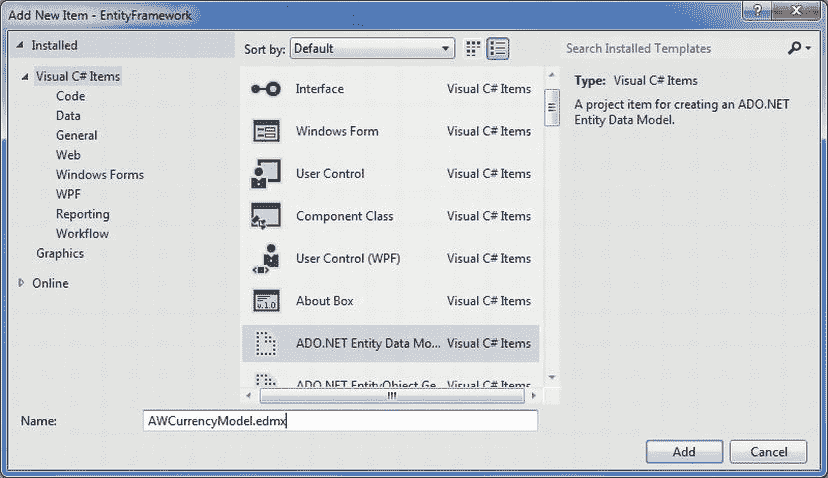

    ***图 19-1。**添加 ADO.NET 实体数据模型*

4.  The Entity Data Model Wizard will start, with the Choose Model Contents screen appearing first. Select the “Generate from database” option, as shown in Figure 19-2. Click Next. 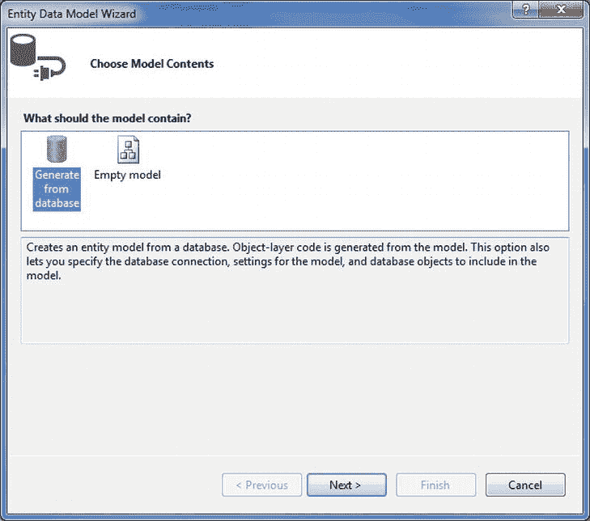

    ***图 19-2。**实体数据模型向导—选择模型内容屏幕*

5.  The Choose Your Data Connection screen appears next, as shown in Figure 19-3. Click the New Connection button. 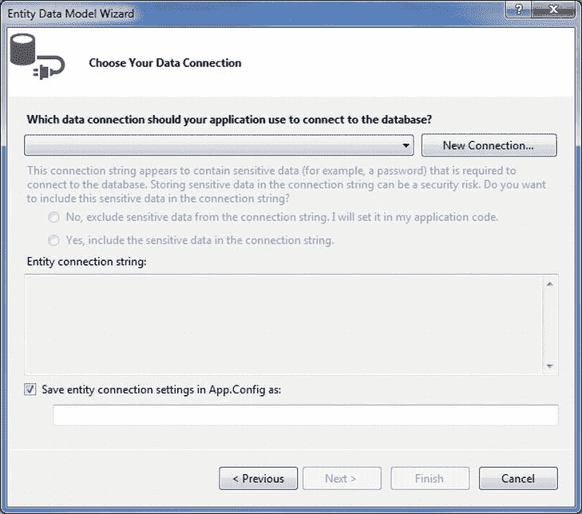

    ***图 19-3。**实体数据模型向导—选择您的数据连接屏幕*

6.  The Choose Data Source dialog box appears. Select Microsoft SQL Server from the “Data source” list, as shown in Figure 19-4. Click Continue. 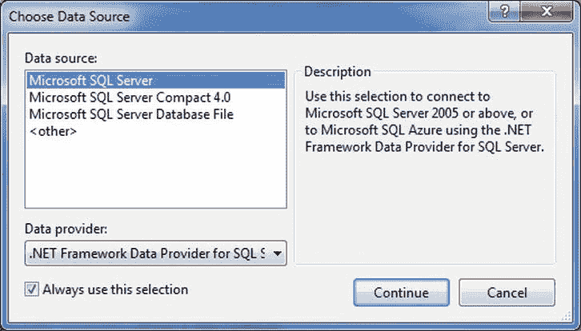

    ***图 19-4。**实体数据模型向导—选择数据源对话框*

7.  Next, the Connection Properties dialog box appears. Enter .\SQL2012 in the “Server name” list box and ensure that the Use Windows Authentication radio button is selected. From the list box provided below the “Select or enter a database name” radio button, select Northwind. Your dialog box should look like Figure 19-5. Click the Test Connection button. 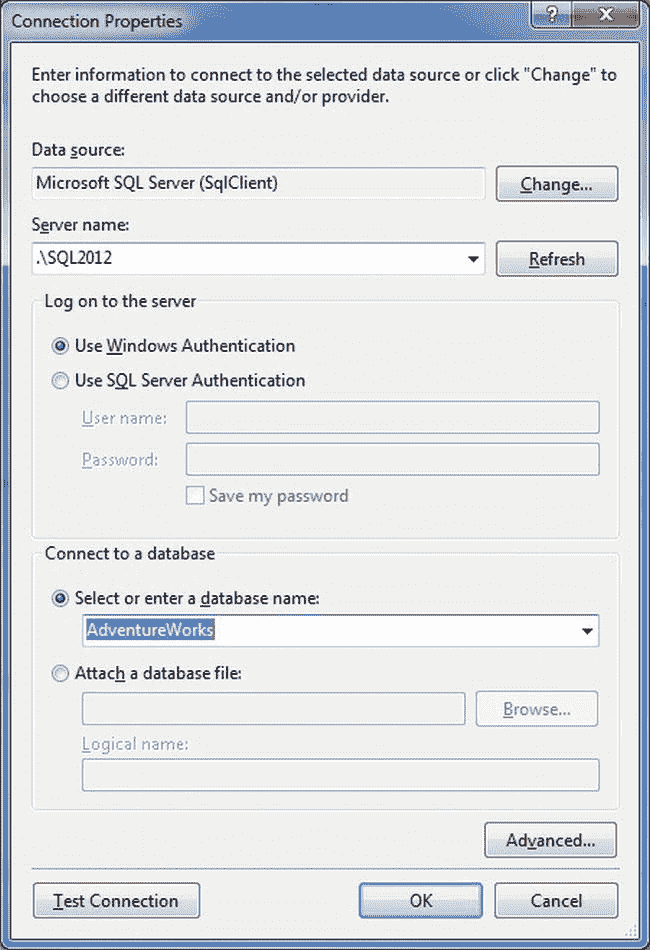

    ***图 19-5。**实体数据模型向导—连接属性对话框*

8.  消息框应该闪烁，显示消息“测试连接成功”单击确定。现在，在连接属性对话框中单击确定。
9.  The Choose Your Data Connection window appears, again displaying all the settings you’ve made so far. Ensure the check box “Save entity connection settings in App.config as” is selected and has AWCurrencyEntities as a value entered in it, as shown in Figure 19-6. Click Next. 

    ***图 19-6。**实体数据模型向导——选择显示设置的数据连接屏幕*

10.  The Choose Your Database Objects screen now appears. Expand the Tables node. If any of the table or tables are selected, remove all the check marks except for the ones beside the Sales.Currency table. Also, remove the check marks from the Views and Stored Procedures node. The screen will look like Figure 19-7. Click Finish. 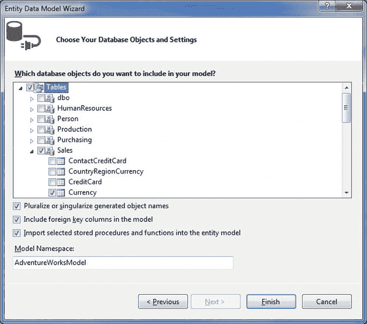

    ***图 19-7。**实体数据模型向导—选择您的数据库对象屏幕*

11.  Navigate to Solution Explorer, and you will see that a new `AWCurrencyModel.edmx` object has been added to the project, as shown in Figure 19-8. 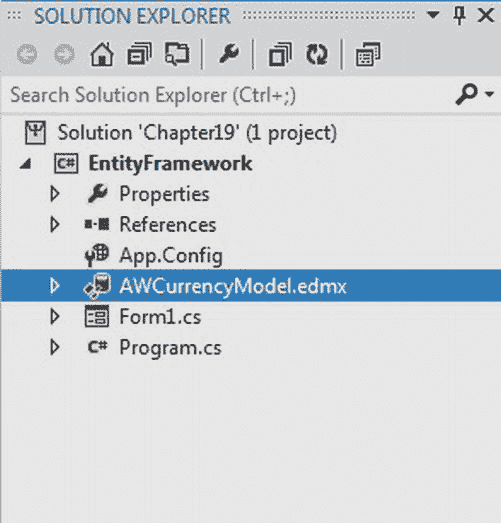

    ***图 19-8。**显示生成的实体数据模型的解决方案浏览器*

12.  Double-click `AWCurrencyModel.edmx` to view the generated Entity Data Model in the Design view. It should look like Figure 19-9. 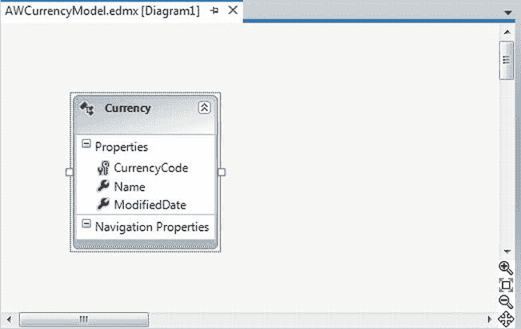

    ***图 19-9。**设计视图中的实体数据模型*

13.  The generated Entity Data Model also has an XML mapping associated with it especially for its `EntityContainer` and `EntitySet`s. To view the XML mapping, navigate to Solution Explorer, right-click `AWCurrencyModel.edmx`, and choose the Open With option. From the dialog box that appears, select XML (Text) Editor, and click OK. Notice the highlighted text in the mapping shown in Figure 19-10. 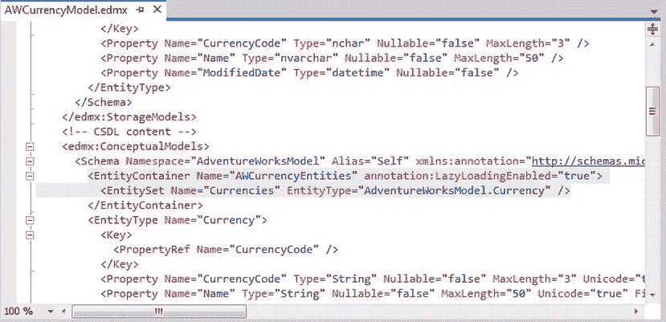

    ***图 19-10。**与实体数据模型相关联的 XML 映射*

14.  切换到解决方案资源管理器，并将 Form1 重命名为`PublishCurrency.cs`。
15.  将 TextBox 控件拖到窗体上，并将其放在窗体的中央。选择此 TextBox 控件，导航到“属性”窗口，并设置以下属性:
    *   将 Name 属性设置为 txtCurrency。
    *   对于 Location 属性，将 X 设置为 12，将 Y 设置为 12。
    *   将 Multiline 属性设置为 True。
    *   将 ScrollBars 属性设置为垂直。
    *   对于“大小”属性，将“宽度”设置为 518，将“高度”设置为 247。
    *   将文本属性留空。
16.  Now your PublishCurrency form in the Design view should like Figure 19-11. 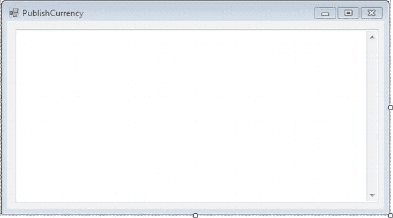

    ***图 19-11。**发行货币表单的设计视图*

17.  Double-click the empty surface of the form, and it will open the code editor window, showing the `PublishCurrency_Load` event. Place the code listed in Listing 19-1 into the load event code template.

    ***清单 19-1。**使用实体数据模型*

    `                AWCurrencyEntities currContext = new AWCurrencyEntities();

                    foreach (var cr in currContext.Currencies)
                    {
                        txtCurrency .AppendText(cr.ModifiedDate.ToString());

                        txtCurrency.AppendText("\t\t");
                        txtCurrency.AppendText(cr.CurrencyCode.ToString());

                        txtCurrency.AppendText("\t\t");
                        txtCurrency.AppendText(cr.Name.ToString());
                        txtCurrency.AppendText("\t");
                        txtCurrency.AppendText("\n");
                    }`
18.  Build the solution, and run the project. When the PublishCurrency form appears, you will see all the currencies listed in the TextBox. The screen shown in Figure 19-12 should display. 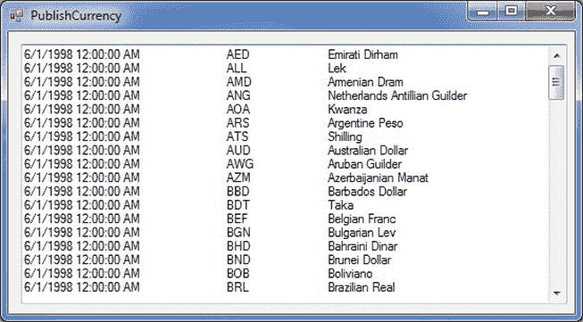

    ***图 19-12。**显示发行货币表单*

##### 它是如何工作的

因为您正在使用一个实体数据模型，所以您不需要处理`SqlConnection`、`SqlCommand`等等。在这里，您创建一个引用名为`AWCurrencyEntities`的`EntityContainer`的对象，该对象引用存储在`App.config`文件中的整个连接字符串。

`AWCurrencyEntities currContext = new AWCurrencyEntities();`

将对象指定给`EntityContainer`后，就该遍历由`EntityContainer.EntitySet`组成的对象集了，这样就包含了 EntityContainer 对象的名称，它代表了后缀为`EntitySet`的`EntityContainer`。

 **注意**`EntityContainer`元素以数据库模式命名，所有逻辑上应该组合在一起的“实体集”都包含在一个`EntityContainer`元素中。一个`EntitySet`代表数据库中相应的表。您可以在`.edmx`文件的`ConceptualModel`元素下浏览您的`EntityModel`对象的名称，如图图 19-10 所示。

`foreach (var cr in currContext.Currencies)
                {
                    txtCurrency .AppendText(cr.ModifiedDate.ToString());

                    txtCurrency.AppendText("\t\t");
                    txtCurrency.AppendText(cr.CurrencyCode.ToString());

                    txtCurrency.AppendText("\t\t");
                    txtCurrency.AppendText(cr.Name.ToString());` `                    txtCurrency.AppendText("\t");
                    txtCurrency.AppendText("\n");
                }`

如您所见，`EntityContainer`对象通过智能感知公开了列名。或者，如果你放一个.(点)，你会看到销售的所有领域。货币表，这比您在前一章中试验的 DataReader 的`rdr[0], rdr[1]`技术更简单。换句话说，实体框架已经“映射”了来自销售的每个记录。货币表转换为对象。这些属性与表中的列同名，但是使用对象符合面向对象的编码风格。

##### 试试看:使用实体数据模型的模式抽象

在前面的练习中，您创建了一个名为 AWCurrencyModel 的实体数据模型(因为这是您的`.edmx`文件的名称)；在本练习中，您将看到该实体数据模型如何帮助开发人员实现模式抽象和修改数据库，而无需在整个项目中或数据访问层(DAL)中接触数据访问代码。也就是说，开发人员可以简单地从模型中移除表引用，然后再将它添加回来。这些列将被重新对齐，然后可以更新代码来引用相应的属性。

1.  启动 SQL Server Management Studio，展开“数据库”节点，展开“AdventureWorks 数据库”节点，然后展开“表”节点。在表列表中，展开 Sales。货币节点，然后展开`Columns`文件夹。
2.  选择“名称”列，右键单击，然后选择“重命名”选项。将 name 列重命名为 CurrencyName。
3.  选择“修改日期”列，右键单击，然后选择“重命名”选项。将 ModifiedDate 列重命名为 ModifiedCurrencyDate。
4.  所以，基本上，我们在这两列中添加了货币术语。现在，通过选择文件退出，退出 SQL Server Management Studio。
5.  As you can imagine, our PublishCurrency form and the database have a column name mismatch, so we will now view the exception that the application will report because of this recent column name change. To do so, we will add a `TRY…CATCH` block to report the issue. Modify the `PublishCurrency.cs` code to look like Listing 19-2.

    *清单 19-2**。**将`TRY…CATCH`添加到`PublishCurrency.cs`以显示异常详情*

    `try
       {      AWCurrencyEntities currContext = new AWCurrencyEntities();

                   foreach (var cr in currContext.Currencies)
                   {
                         txtCurrency .AppendText(cr.ModifiedDate.ToString());

                         txtCurrency.AppendText("\t\t");
                         txtCurrency.AppendText(cr.CurrencyCode.ToString());

                         txtCurrency.AppendText("\t\t");` `                     txtCurrency.AppendText(cr.Name.ToString());
                         txtCurrency.AppendText("\t");
                         txtCurrency.AppendText("\n");
           }
         }

          catch(Exception ex)
          {
                   MessageBox.Show(ex.Message + ex.StackTrace +
                       ex.InnerException);
          }`
6.  现在，通过按 Ctrl+F5 构建并运行 PublishCurrency。PublishCurrency 详细信息表单应该加载并引发一个异常窗口，显示以下消息:“执行命令定义时出错。有关详细信息，请参见内部异常。
7.  If you look at `InnerException`, you will see a message that indicates the cause of this exception; it’s because you have just renamed the Name and ModifiedDate columns of the Sales.Currency table. The exception details should look like Figure 19-13. 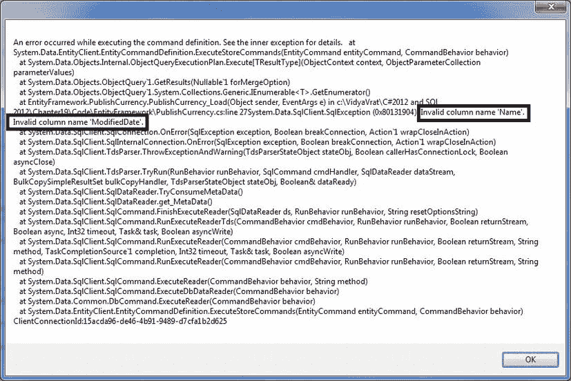

    ***图 19-13。**反映最近重命名后无效列名的异常详细信息*

8.  单击确定关闭异常窗口，并关闭打开的表单，该表单将是空的，因为数据因发生异常而未加载。
9.  Now you will see the advantage of entity data modeling. Assume the same issue occurred in the code you wrote in previous chapters; the only solution is to modify the column name in each and every SQL statement that maps to the table we modified. In a real-world scenario, this will not be possible, because database schema updates changes are invisible and so the Entity Data Model comes to rescue.

    要修复这个应用，您必须修改由实体数据模型创建的 XML 映射文件，也就是您在本章前面创建的`AWCurrencyModel.edmx`文件。要查看 XML 映射，导航到 Solution Explorer，右键单击`AWCurrencyModel.edmx`，并选择 Open With 选项。从提供的对话框中，选择 XML(文本)编辑器，然后单击确定。你会看到 XML 映射，如前面的图 19-10 所示。

     **注意**在打开的 XML 映射文件中，导航到`<!-- SSDL content -->`部分，将`<Property Name="Name" Type="nvarchar" Nullable="false" MaxLength="50" />` XML 标签中的名称修改为`CurrencyName`；修改后标签应该显示为`<Property Name="CurrencyName" Type="nvarchar" Nullable="false" MaxLength="50" />`。

     **注意**表示数据库模式的逻辑模型是使用 SSDL 在 XML 文件中定义的。这就是为什么您需要修改列名来映射数据库模式。

10.  Also, modify the `<Property Name="ModifiedDate" Type="datetime" Nullable="false" />` XML tag to `ModifiedCurrencyDate <Property Name="ModifiedCurrencyDate" Type="datetime" Nullable="false" />` XML tag to appear as `<Property Name="ModifiedCurrencyDate" Type="datetime" Nullable="false" />`. The modified SSDL content section with the `CurrencyName` and `ModifiedCurrencyDate` values will look like Figure 19-14. 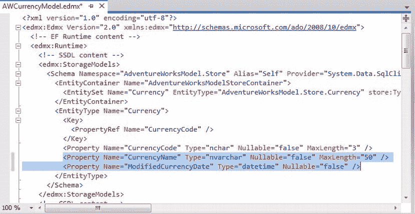

    ***图 19-14。**修改 SSDL 内容部分*

11.  Now look for the `<!-- C-S mapping content -->` section and modify the `<ScalarProperty Name="Name" ColumnName="Name" />` tag to be `<ScalarProperty Name="Name" ColumnName="CurrencyName" />`.•

     **注意**概念模型是使用 CSDL 在 XML 文件中定义的。CSDL 定义了应用的业务层所知道的实体和关系。这就是为什么您需要修改列名，使其可读并易于被实体找到。

12.  Next, modify the `<ScalarProperty Name="ModifiedDate" ColumnName="ModifiedDate" />` tag to appear as `<ScalarProperty Name="ModifiedDate" ColumnName="ModifiedCurrencyDate" />`. The modified `C-S` mapping content section with the `CurrencyName` and `ModifiedCurrencyDate` values will look like Figure 19-15. 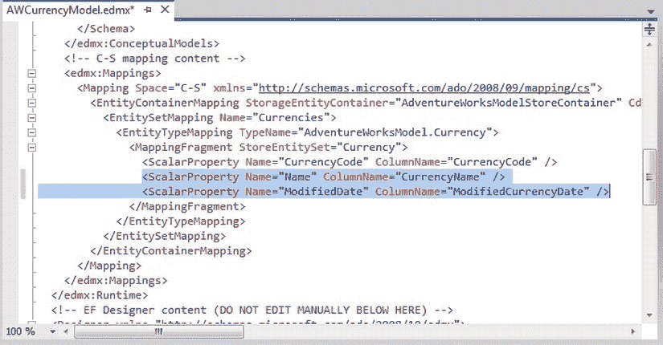

    ***图 19-15。**修改`C-S`映射内容段*

13.  现在保存并构建 Chapter19 解决方案，并运行应用。当 PublishCurrency 表单打开时，应该用`ModifiedDate`、`Name`和`CurrencyCode`值填充文本框，如前面图 19-12 中的所示。
14.  用`foreach`循环切换回`PublishCurrency.cs`代码，如清单 19-2 所示。即使您已经修改了 AdventureWorks 数据库的 Sales 中的列名，您仍然应该看到文本框中显示的相同的列名，其中的`EntityContainer`为`cr.ModifiedDate`和`cr.Name`。货币表。但是通过利用实体数据模型的模式抽象特性，您只需要在 XML 映射文件中的 SSDL 内容和`C-S`映射内容部分下指定更新的列名。

### 总结

在本章中，您了解了 ADO.NET 5.0 实体数据模型的特性。

您还了解了模式抽象是如何工作的，以及它将如何帮助您实现数据库和数据访问代码或数据访问层之间的松散耦合。在下一章，你将学习如何使用 SQL CLR 对象。