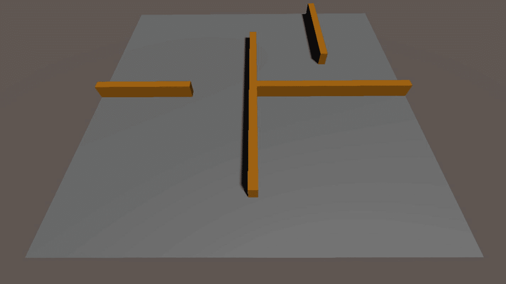

# 四、导航

在第二章中，我们看到了如何对导航代理的基本特征进行编程，比如转向和向目标移动，在第三章中，我们学习了什么是寻路算法以及它是如何工作的，并且我们实现了一个使用路点系统来表示可行走区域的算法。

在这一章中，我们将使用我们在前面章节中学到的知识，同时探索解决导航问题的不同方法。我将在本章介绍的新方法在复杂的情况下更有效。它们是在视频游戏中的 3D 环境开始变得流行时引入的，并且它们现在仍然在游戏行业中广泛使用，因为这些年来它们成为解决 3D 环境中导航问题的事实上的标准。我所说的技术是最佳优先搜索算法和加权图，特别是 A*和导航网格。

## 4.1 加权图

我们在第三章中看到了广度优先搜索算法是如何工作的，通过展开同一级别的所有节点，然后展开较低级别的节点。这种平衡的探索过程在许多情况下工作得很好，但是它牺牲了内存中使用的空间(在算法找到目标之前，为存储被探索的节点而分配的内存可能变得非常大)，更重要的是，在某些情况下，它可能会花费很多时间。

想象以下场景(图 4-1 ):你有一个名为 A 的根节点和三个名为 B、C 和 D 的子节点，D 是目标节点，它直接连接到 A，因此到达它的时间应该是最快的。不幸的是，如果我们使用广度优先搜索，我们只会在检查 A→B 和 A→C 之后找到路径 A→D，这是我们最初应该花费在找到 A→D 上的时间的三倍。如果 B、C 和 D 有孩子，这个问题会变得更糟，解决方案在 D 的分支中有两到三层。


图 4-1

一个非常简单的图表显示了 BFS 可能会失败的情况

浪费时间和资源来寻找到目标节点的路径的问题显然是人工智能研究中的一个重要和关键的问题，并且对于该问题仍然没有完美的解决方案，并且在具有非常大的图的复杂情况下，在合理的时间和资源量内寻找到目标的路径仍然是一个挑战。唯一真正有帮助的方法是在加权图中使用最佳优先搜索，使用一个好的启发式函数。这是什么意思？来看看吧！

加权图是这样的图，其中走到一个节点具有成本，并且该成本在不同的节点之间不同。连接两个节点的路径具有成本 X，其中 X 是连接这两个节点的所有节点的成本之和。在图 4-2 的例子中，连接 A 到 G 的路径 ABEG 的开销为 1+2+1 = 4。ABEG 也是最短路径；事实上，连接 A 和 G 的另一条路径是 ACEG，开销为 2+2+1 = 5。


图 4-2

加权图

在上一章的图中，所有节点的成本都是 1，所以路径的成本等于路径中节点的数量。

在未加权的图中，我们认为最短路径是具有较少节点的路径，而在加权的图中，我们更喜欢具有最小成本的路径——即使它包含更多节点。

加权图中的成本具有与该图是其数学模型的空间相关的语义。

为每个节点增加成本背后的逻辑与我们在日常生活中必须在需要不同努力的不同长度的不同方式之间做出决定的情况相同，例如在需要更多努力的较短方式和需要较少努力的较长方式之间做出决定。沿着一条路径前进所需的努力变成了一种附加成本，其总和等于路径本身的长度。考虑这个总和可以让我们理解一条路径的实际整体便利性。


图 4-3

与在舒适的路径上行走 500 米的成本相比，没有考虑攀登 50 米石墙的成本的寻路算法可能会做出错误的决定，判断两条路径中哪一条是最好的

例如，想象在一个山区，你想登上山顶欣赏风景(图 4-3 )。有两种方法可以到达那里:爬 50 米的岩壁或走 500 米长的小路。很有可能你会更喜欢走在这条路上，因为它需要更少的努力，使它成为到达那里的最佳和可能最短(和更安全)的方式，即使这条路本身实际上是它的十倍长。我们可以说，爬 1 米比走 1 米的成本高得多，这使得 50 米的攀登不那么吸引人(图 4-4 )。


图 4-4

增加遵循这两条路径所需的工作成本完全改变了这种情况

Unity 使用一个在游戏行业广受好评和使用的解决方案:导航网格来实现导航的加权图。让我们看看这是怎么回事！

## 4.2 导航网格

导航网格(或 NavMesh)是凸多边形的集合，用于在 3D 空间的表面上标记可行走的区域。与航路点非常相似，NavMeshes 在内部表示为图形，因此图形算法可以用于解决寻路问题。

虽然航路点是空间中非常精确的点，但导航网格是 3D 空间中区域的集合(凸多边形)。这种差异使 NavMesh 成为更平滑、更自然运动的更好解决方案。

使用一个非常用户友好的界面，你可以在 Unity 中烘焙一个 NavMesh 来为一个预定义的代理标记表面上的可行走区域。让我们看看这是如何工作的。

打开 Unity 并创建一个新的 3D 项目。在主场景中，创建一个游戏对象，并将其命名为关卡。这将是我们将要用原语创建的(非常简单的)级别的容器。

使用如图 4-5 所示的属性设置，从立方体中创建一个平台。这将是我们级别的基础。


图 4-5

将要代表楼层的平台的属性

现在让我们在那个表面上创建一些墙和障碍物。创建一堆立方体，塑造并移动它们，在我们的平台上做一些墙。一旦你完成了，你将会得到类似图 4-6 的东西(希望更好！).

你可以在关卡中添加任意数量的 3D 对象，并应用不同的材质来定义场景的不同部分，就像我在图 4-6 中所做的那样。当你完成制作后，只需将所有的对象拖入游戏对象关卡。



图 4-6

一个非常简单的地图的例子

现在选中关卡 GameObject，在检查器中点击**静态**设置，就在包含对象名称的文本框旁边，会弹出一个下拉菜单；从下拉菜单中选择设置**导航静态**。这将告诉 Unity 把游戏对象和它的所有子对象看作静态对象，是可导航的 3D 空间的一部分。这个设置的结果是，当一个 NavMesh 将被烘焙时，Unity 将考虑所有被标记为导航静态的 3D 对象，并基于我们还没有设置的预定义代理的特征来决定它们是否可以以任何方式行走或到达...让我们现在就做吧！

要打开导航面板，需要进入顶部的窗口菜单，选择 AI ➤导航，如图 4-7 所示。


图 4-7

如何访问导航面板

导航面板将如图 4-8 所示。


图 4-8

导航面板的烘焙部分

图 4-8 显示了导航面板的烘焙部分。在此部分，您可以自定义与代理相关的一些设置。让我们更详细地看看它们:

*   **代理半径**:定义代理可以走过的区域的宽度(墙之间的距离)

*   **代理高度**:定义代理可以走过的地方的高度

*   **最大坡度**:代理可以走的最大坡度

*   **台阶高度**:代理可以攀爬的台阶的最大高度

紧接着是与脱离网格链接相关的设置。脱离网格链接连接因任何原因分离的网格。这可能是因为两个曲面之间有间隙，也可能是因为有一个台阶高于上一节中设置的台阶高度。生成脱离网格链接时，会根据以下设置连接这些网格:

*   **跌落高度**:代理的最大跌落高度——如果平台的跌落高度高于此值，则无法生成脱离网格。

*   **跳跃距离**:最大代理跳跃距离——如果两个平台之间的距离大于该距离，则它们无法通过脱离网格链接进行链接。

如果您单击“烘焙”, Unity 将根据这些设置为所有标记为导航静态的区域生成一个导航网格。让我们这样做，你应该有类似于图 4-9 的东西。


图 4-9

我们刚刚创建的场景的烘焙导航网格

图 4-9 显示了图 4-6 中创建的几何图形的导航网格。蓝色区域适合步行。没有脱离网格的链接，因为整个级别非常简单，没有其他类型的区域；它们可以在导航面板的区域部分中定义。您也可以在这里为不同的区域设置不同的费用，如图 4-10 所示。


图 4-10

导航面板中的区域选项卡允许您创建不同类型的区域，并为它们分配不同的成本

成本不同的不同区域会导致代理避开或偏好某些路径，而不是其他路径。也可以指定代理可以行走的区域，这样你就可以防止一些代理移动到一些特定的区域或者使用它们来达到他们的目标。这个特性可以引入大量的可能性来迫使代理走向特定的路径。

要指定代理可以行走的区域，请选择您的代理，并在检查器中查找区域掩码下拉列表；通过点击它，您可以检查您希望您的代理能够行走的区域(图 4-11 )。


图 4-11

在区域掩码字段中，您可以为您的代理指定可行走的区域

让我们试着在地图上添加一些非网状链接！选择其中一面墙，增加它的宽度，比如值为 2，选择该对象，打开导航面板的*对象*部分；在那里，勾选如图 4-12 所示的*生成离线链接*框，将导航区域标记为可行走。这将确保 Unity 将根据代理的设置尝试使该对象可行走，并可能将其链接到地板网格。


图 4-12

激活 3D 对象的脱离网格链接的选项位于导航面板的对象部分

现在一切都设置好了，回到烘焙部分，如图 4-13 所示将下落高度和跳跃距离设置为 1，然后按下烘焙。


图 4-13

NavMesh 设置使用新的跌落高度和跳跃距离值进行了更新

新的 NavMesh 将根据设置进行烘焙，在修改后的墙的顶部生成一条可行走的路径，并使用脱离网格链接将该区域连接到地板(图 4-14 )。


图 4-14

新的 NavMesh 还包含非网状链接

新的 NavMesh 允许代理人在地图上走动，并跳到足够宽的墙上。代理现在将能够在考虑不同成本的情况下在关卡中导航，并做出最佳决策，以最短的路径到达地图上指定的目标位置。

但是我们如何在 Unity 中编写这样一个代理程序呢？更一般地说，在这样的加权系统中，寻路是如何工作的？

我们需要一类搜索算法，通过扩展节点，优先考虑最方便的节点，来探索考虑节点不同成本的图。这种搜索算法被称为最佳优先搜索。让我们仔细看看！

## 4.3 导航星

最佳优先搜索算法是一种搜索算法，该算法探索对最有希望的节点进行优先排序的图。扩展或不扩展节点的便利性通过启发式函数来衡量，该函数允许算法将节点组织在优先级队列中，并建议它们应该扩展的顺序。

解决问题的启发式方法是一种实用的方法，它不保证是最优的，但它足够快和足够好来实现短期目标或找到问题的满意解决方案。

在最佳优先搜索算法的情况下，启发式算法的目的是通过在节点到来时对其进行评估，找到可能导致最短路径的节点扩展策略。

关于启发式的真实例子，为了充分理解它的威力，考虑这样一个场景，你正试图决定去商店的最短路径，有两种方法:一种是绕过建筑物，将你连接到商店的正门，另一种是穿过一群房子的小直路，将你带到商店的后面(图 4-15 )。即使没有测量两条路径的长度，你的大脑也会立即评估这两条路径，并向你暗示这条小直路更可能是最短的一条，因为它是一条直接连接你和商店的直路。你的大脑只是运用了一种启发式方法，根据过去的经验和感知周围环境的能力，给两条路径分配一个近似的成本。


图 4-15

当考虑实现目标的不同方法时，你的大脑会本能地运用基于过去经验和知识的启发式方法来估计整体最佳路径

这类算法中最著名的是 A*(发音为 A-star)，它也是解决视频游戏中复杂寻路问题(尤其是在 3D 空间中)的事实标准，这也是 Unity 内部完全支持它的原因。

A*使用了我们在导航时经常使用的非常熟悉的启发式方法。它粗略估计了目标可能达到的距离，没有考虑障碍。我们称之为直线距离；在计算机科学中，这被称为曼哈顿距离。

A*算法为每个节点分配分数 F = G + H，其中

*   **G** 是从起始节点到当前节点的代价。

*   **H** 是当前节点与目标之间的曼哈顿距离。

A* agent 每次展开一个节点，都会给周围的所有节点分配一个 F 分，并移动到得分最低的节点。

这种方法允许代理快速到达目标，而不会遭受广度优先搜索的副作用，即被迫扩展图中的每个节点。

很明显，A*提供了更好的整体性能。同样重要的是要注意效率，特别是 A*的时间复杂度很大程度上取决于所使用的启发式算法。一个好的启发会给你一个好的效率，而一个坏的启发可能会使算法完全无效。

## 4.4 编程代理

我们终于有了编写代理程序的所有元素，它可以使用加权 NavMesh 上的*找到通向目标点的路径。这在 Unity 中是极其容易做到的，我们甚至不需要从头开始实现 A*！

通过右键单击层次并选择 3D 对象➤立方体，在场景中创建一个立方体。让我们称这个新对象为*代理*。随意将材质应用到对象，使其从场景的其余部分中突出出来。

必须通知 Unity，我们刚刚创建的对象实际上是我们刚刚创建的导航网格的代理。我们可以通过向代理对象添加一个 NavMesh 代理组件来实现这一点。选择代理对象，转到检查器，并单击添加组件；在那里，查找 NavMesh 代理组件并将其添加到对象中。

在图 4-16 中，你可以看到 NavMesh 代理组件的样子。


图 4-16

NavMesh 代理组件允许您个性化代理

在那里，您可以自定义与代理相关的所有设置。让我们仔细看看它们:

*   **代理类型**:该代理的类型。可以在导航面板的“代理”部分定义代理类型——无论如何，因为您只能基于单一类型的代理定义单一导航网格，所以您可能希望只使用一种类型的代理。

*   **基准偏移量**:物体的相对垂直位移。

以下是所有与转向相关的设置。我们在第二章中详细介绍了转向。如果你认为你需要刷新那些想法，在继续阅读之前，回去快速阅读一下。

*   **速度**:代理的导航速度。

*   **角速度**:代理的旋转速度。

*   **加速度**:代理的最大加速度值。

*   **停止距离**:代理到达目标后与目标保持的距离。

*   **自动刹车**:自动刹车允许代理停止以避免超过目的地点(因为导航速度高)。

在转向设置之后，还有避障设置:

*   **半径**:智能体的避障半径。

*   **高度**:智能体的避障高度。

*   **质量**:这让你可以在回避精度和性能之间进行权衡——事实上，计算回避距离可能需要一些繁重的处理器工作，这取决于情况和这里设置的质量水平。

*   **优先级**:代理人的回避优先级。当代理执行回避时，较低优先级的代理将被忽略。

最后，还有一些特定于寻路的设置:

*   **自动遍历网外链接**:代理是否应该自动遍历网外链接？

*   **自动重新路径**:如果当前路径无效，代理是否应该计算另一条路径？

*   **区域屏蔽**:指定该代理可以通过的区域种类(可以多选)。

现在我们已经做好了所有准备，我们只需要添加一些非常基本的功能来允许代理在我们选择目的地时移动。

让我们创建一个名为 AgentController.cs 的新 C# 脚本。

该脚本将包含以下代码:

```cs
 1\.   using System.Collections;
 2\.   using System.Collections.Generic;
 3\.   using UnityEngine;
 4.
 5\.   public class AgentController : MonoBehaviour
 6\.   {
 7\.       void Update()
 8\.       {
 9\.           if(Input.GetMouseButtonDown(0))
10\.           {
11\.               RaycastHit hit;
12\.               if (Physics.Raycast(Camera.main.ScreenPointToRay(Input.mousePosition), out hit, 100))
13\.               {
14\.               this.GetComponent<UnityEngine.AI.NavMeshAgent>().SetDestination(hit.point);
15\.               }
16\.           }
17\.       }
18\.   }

```

正如我们在前面章节中看到的，在**第 9–12 行**中，我们向地图上我们点击的点投射光线，以便我们可以在 3D 空间中有一个位置来设置代理的目标。**第 14 行**是神奇的地方:就这一行，我们告诉 NavMesh 代理组件将代理的目标设置为我们点击的位置。这将使代理使用我们刚刚烘焙的导航网格来计算到达目标位置的最佳路径。

就是这样；我们不需要任何其他功能，没有转向行为，没有寻路实现:Unity 已经实现和设置了一切。但重要的是要清楚它们是如何工作的！

保存脚本，将其附加到代理对象，然后运行游戏。

运行游戏(图 4-17 )，你会看到点击关卡中的任何一点都会使代理沿着最短的路径走向那个点，这要感谢 A*算法在我们刚刚烘焙的加权 NavMesh 上的后台工作！


图 4-17

代理走向我们在地图上点击的任何一点

在本章中，我们看到了使用 Unity 提供的两个强大工具解决 3D 环境中的导航问题是多么容易:Navigation Mesh 和 A*。

在下一章，我们将做下一步，给我们的代理添加行为。我们将创建一个迷你秘密行动游戏，你必须避开正在寻找你的巡逻警卫。我们将探索和实现许多有趣的想法，如一个视觉锥，让警卫感知球员和一个非常基本的噪音系统，以吸引附近的警卫，并迫使他们调查声音传来的位置。

## 4.5 测试你的知识

1.  什么是加权图？

2.  什么是导航网格？

3.  航路点和导航网格有什么区别？

4.  NavMesh 比航路点系统更好的原因是什么？

5.  如何在 Unity 中烘焙导航网格？

6.  如何在 Unity 中更改 NavMesh 面积成本？

7.  什么是 A*？它是如何工作的？

8.  什么时候方便？

9.  如何在 Unity 中创建 NavMesh 代理？