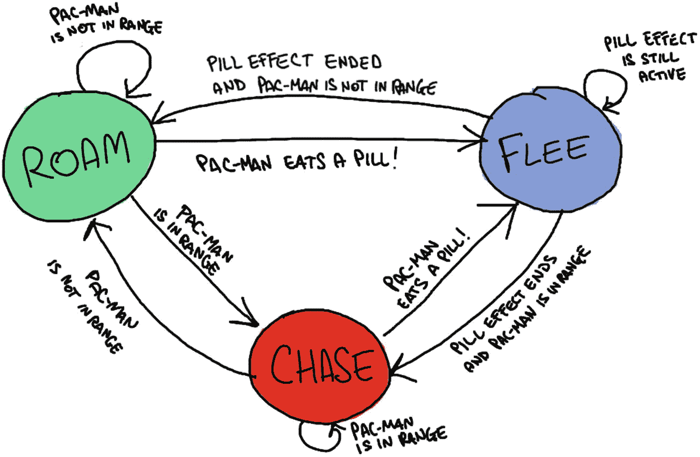
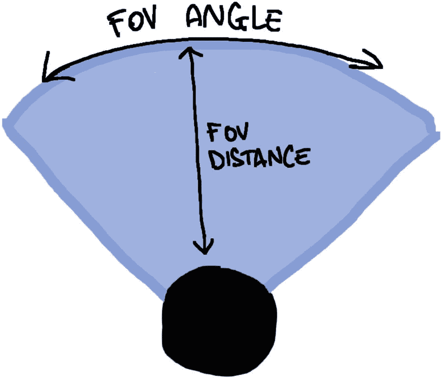
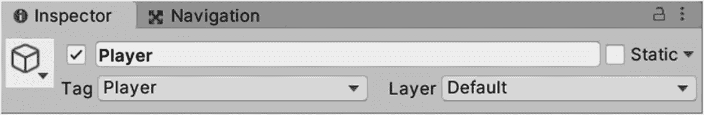
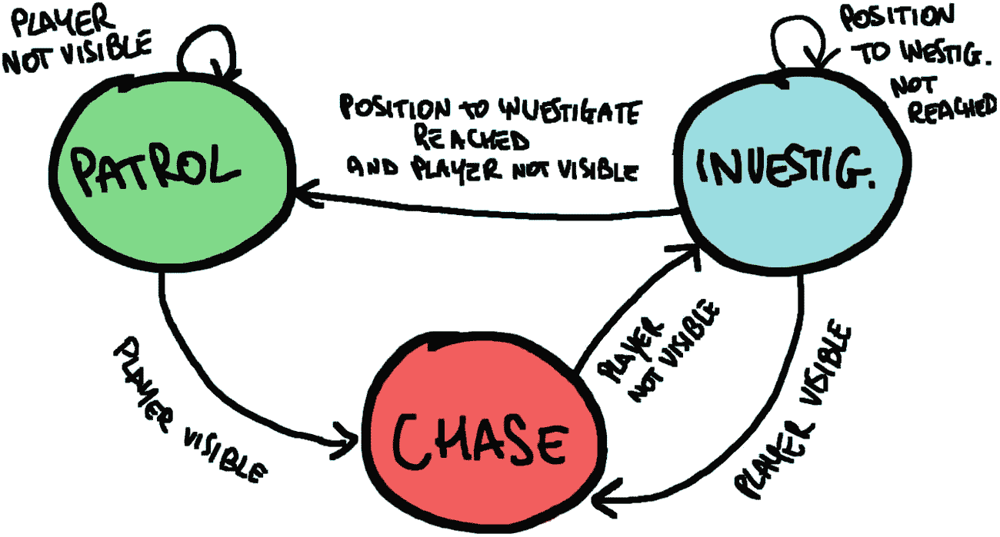
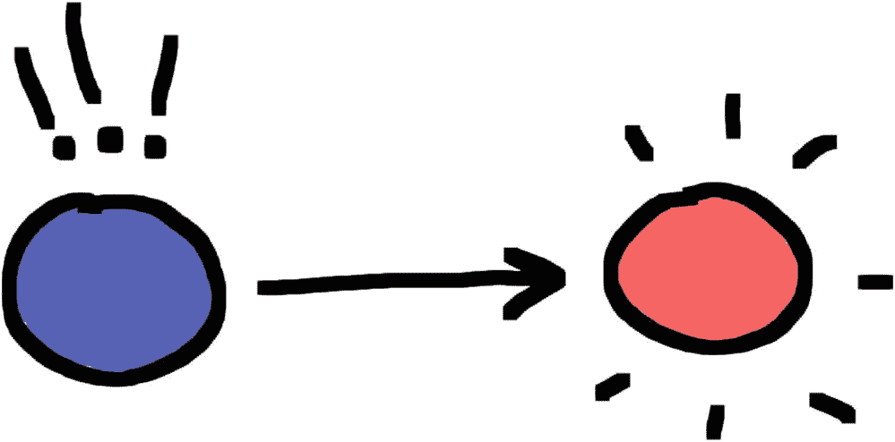
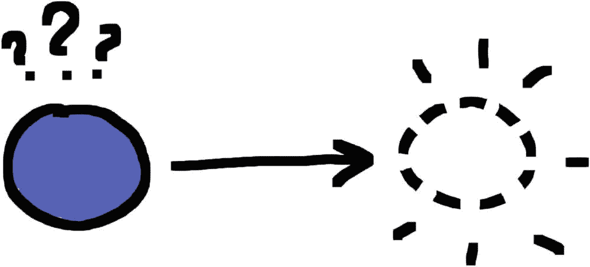
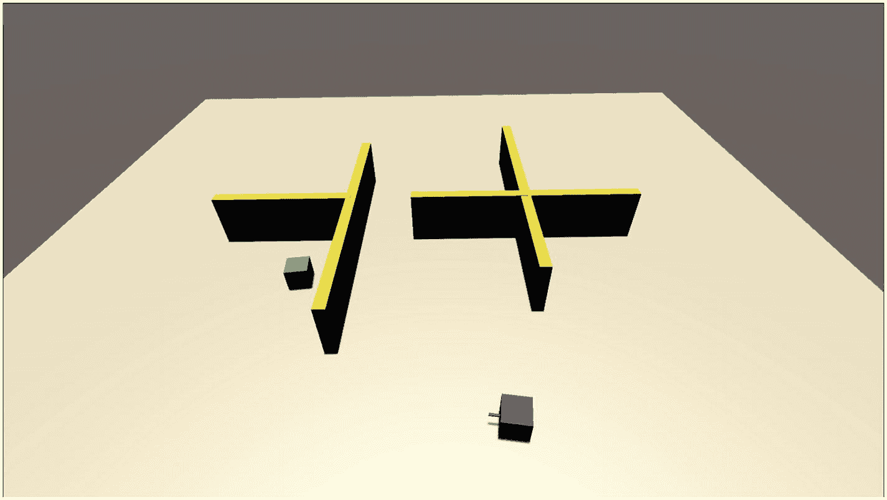

# 五、行为

在这一章中，我们将进一步扩展我们关于游戏人工智能的对话，为我们游戏中的 NPC 创造可信的人工智能行为迈出第一步。

曾经有一段时间，电子游戏只有敌人，他们漫无目的地四处活动。玩家只需要走过敌人，避开他们的模式和子弹，这就是全部的威胁。

1980 年，Namco 通过引入新益智游戏 *Pac-Man* 的敌人行为，永远改变了这一趋势。《??》中吃豆人的敌人是在迷宫中游荡的有色幽灵，偶尔会试图追赶协调他们行动的玩家。关于*吃豆人*不可思议的事情是每个敌人都有不同的追逐玩家的方法，并且它与其他敌人的方法是互补的。这让游戏在一个全新的层面上感受到了挑战，因为玩家第一次感觉到他们在与一种“新型智能”对抗，正如加里·卡斯帕罗夫在 1997 年遭遇惨败后所描述的那样。每场比赛都感觉与之前的不同，因为敌人正在适应每一个新的情况，击败他们的唯一方法是试图通过预测他们的方法来击败他们，因为这种新的协作人工智能系统的本质，不是很容易。

《吃豆人》中革命性的人工智能是基于一系列不同的*状态*，根据某些条件，敌人可能在游戏中的任何时刻出现。

图 5-1 显示了*吃豆人*幽灵在任何时刻可能处于的各种状态。在游戏开始时，它们产卵并进入漫游状态，开始在迷宫中漫游。鬼魂一看到*吃豆人*，就进入追逐状态，开始使用他们独特的策略追逐*吃豆人*。如果幽灵失去了对吃豆人的追踪，他们会回到漫游状态。当*吃了吃豆人*的黄色药丸后，鬼魂进入躲避状态，它们变得蓝色，容易受到*吃豆人*的攻击，它们开始逃离他。



图 5-1

吃豆人幽灵有限状态机

你可以在图 5-1 中看到的这种表示叫做`Finite-State Machine (FSM)`。

`FSM`是一种计算模型，用于许多不同的领域(软件和硬件)来设计和模拟逻辑过程。在许多计算机科学领域至关重要之后，`FSM`也在游戏人工智能中找到了自己的位置，成为最早和最容易(并且仍然在使用)的表示和管理简单人工智能行为的方法之一。

我们将使用一个`FSM`为一个代理创建一个行为，我们将把它添加到我们在第四章中创建的场景中。新的代理将在场景中四处游荡，一旦看到玩家控制的角色，它就会试图追逐它。当玩家控制的角色离开代理人的视线范围后，他们会回去巡逻这个区域。

现在我们有了一个计划，拿起我们在第四章中做的项目，让我们继续做下去！

## 5.1 警卫！卫兵！

让我们从创建一个新的`Game Object`开始，它将在场景中代表我们的警卫代理。右键单击`Hierarchy`并选择`3D Object` ➤ `Cube`，创建一个立方体。

重命名这个新对象`"Guard"`，选择它并点击检查器中的`Add Component`，然后点击`Navigation` ➤ `Nav Mesh Agent`，给它分配一个`NavMeshAgent`。这将允许新代理使用 Unity 导航系统，就像我们在第四章中制作的代理一样。

这个新的代理将是一个自主的代理，能够自己推理和采取行动，所以我们需要为它提供一些传感器，让它感知周围的世界。我们要给这个特工一个礼物视力！

### 视野

为了让我们的代理能够看到，我们将实现一个**视野** (FOV)，它代表了在任何给定时刻可见的可见世界的范围。视野内的每个对象都可以被代理看到。

我们可以将这一概念转化为 C# Unity 编程，方法是从代理向玩家投射一条光线，并检查该光线与玩家相遇的位置是否位于与代理的位置和方向成一定角度和距离的区域内，如图 5-2 所示。

在我们开始编码之前，我们需要创建一个标签分配给玩家，以确保我们知道我们击中了正确的对象。



图 5-2

我们将要实现的 FOV 的表示

让我们从层次中选择 Player 对象，然后在检查器中，单击 Tag 字段以显示一个下拉菜单，您可以从中选择或创建一个新的标签。出于本章的目的，我们可以安全地使用默认情况下已经存在的“Player”标签(图 5-3 )。



图 5-3

玩家标签

现在，让我们创建一个名为“`GuardController.cs`”的新 C# 脚本，并将其分配给`Guard`代理。

通过双击打开脚本，并在类定义的顶部添加以下类成员:

```cs
1\.   public Transform player;
2\.   float fovDist = 20.0f;
3\.   float fovAngle = 45.0f;

```

第一个类成员(第 1 行)叫做`player`，它代表玩家的位置。我们需要将玩家头像的实例与这个成员连接起来，这样代理就会一直知道当前的位置。这只是为了容易地实现这个机制，但是如果玩家不在代理的视野之内，代理就不能追逐玩家。

第二个和第三个类成员(第 2-3 行)表示视图锥的深度(您可以将此视为从代理位置开始的半径),其宽度表示为以度为单位的角度。

正如我们所说，我们需要将公共成员*玩家*连接到实际的*玩家*对象。为此，您需要选择`Guard`对象，然后在检查器的 *GuardController* 脚本部分，单击`player`字段并从列表中选择*玩家*对象，或者只需将*玩家*对象拖放到*玩家*字段中。

现在我们有了关于`Player`位置的信息，让我们在`GuardController`中定义一个新方法来决定它是否能被`fovDist`和`fovAngle`定义的`Guard`的视野看到。

```cs
 1\.   bool ICanSee(Transform player)
 2\.   {
 3\.       Vector3 direction = player.position - this.transform.position;
 4\.       float angle = Vector3.Angle(direction, this.transform.forward);
 5.
 6\.       RaycastHit hit;
 7\.       if (
 8\.           Physics.Raycast(this.transform.position, direction, out hit) && // Can I cast a ray from my position to the player's position?
 9\.           hit.collider.gameObject.tag == "Player" && // Did the ray hit the player?
10\.           direction.magnitude < fovDist && // Is the player close enough to be seen?
11\.           angle < fovAngle // Is the player in the view cone?
12\.           )
13\.           {
14\.               return true;
15\.           }
16\.       return false;
17\.   }

```

该方法将一个`Transform`组件作为参数，并返回一个布尔值。它从当前对象(`this`)向作为参数传递的对象(第 8 行)投射光线，并检查被击中的对象是否被标记为`"Player"`(第 9 行)以及是否在视野内(第 10-11 行)。如果所有条件都得到验证，这意味着对象是可见的，因此函数返回`true`(第 14 行)；否则，它返回`false`(第 16 行)。

这个代码将被用在代理的`Update`方法中，这样它就可以在每一次点击时*看到*，并检查玩家是否在视野范围内，并据此采取行动。

让我们通过在`Update`方法中使用`ICanSee`来做一个小测试，看看它是如何工作的。这样修改`Update`方法:

```cs
 1\.   void Update()
 2\.   {
 3\.       if (ICanSee(player))
 4\.       {
 5\.           Debug.Log("I saw the player at " + player.position);
 6\.       }
 7\.       else
 8\.       {
 9\.           Debug.Log("All quiet here...");
10\.       }
11\.   }

```

现在保存脚本并运行游戏。

守卫会看到正前方视野范围内的任何东西，所以只需点击视野范围内的一个点，就可以让玩家的化身走到那个点，让守卫注意到。你可以检查控制台来验证守卫是否真的看到玩家站在它的视野中。

现在我们已经有了合适的视野，让我们设计和编码代理的实际行为。

### 5.1.2 特工，规矩点！

为了让我们的守卫代理表现得像一个合适的守卫，我们需要教他们一个真正的守卫是如何行为的，所以让我们设计一个 FSM 来描述我们希望他们遵循的行为。

Tip

无论 FSM 看起来有多简单，拥有一个设计阶段总是一个很好的实践，可以让你熟悉流程，并抓住机会尽可能地最小化 FSM。

正如我们所说的，我们希望警卫在这个区域随意巡逻。我们也希望守卫一看到玩家就追上去。如果玩家成功逃脱，我们希望守卫调查他们最后一次看到玩家的地方，然后，如果玩家不可见，开始巡逻，或者追逐他们。

这是一种也在经典游戏*合金装备* (Konami，1998)中使用的`FSM`，它是理解一个简单行为如何对游戏有效的一个很好的基础。

从对行为的描述中，我们可以得出三种状态:

*   巡逻:警卫正在巡逻这个地区。

*   **调查**:守卫正在向他们最后看到玩家的地方移动。

*   **追逐**:守卫知道玩家的当前位置，正在追逐他们。

从行为的描述中，我们还可以推导出我们推导出的状态之间的联系，如图 5-4 所示。



图 5-4

第章第五部分代理的 FSM

在编程语言中实现`FSM`的最简单也是最常见的方式是使用`enum`来描述不同的状态，`FSM`可以进入这些状态并检查其当前状态以执行不同的代码。

使用枚举在 C# 中实现我们的`FSM`,如下所示:

```cs
 1\.   enum State { Patrol, Investigate, Chase };
 2.
 3\.   /* ... */
 4.
 5\.   switch (state)
 6\.   {
 7\.       case State.Patrol:
 8\.           // Patrolling actions
 9\.           break;
10\.     case State.Investigate:
11\.        // Investigating actions
12\.        break;
13\.     case State.Chase:
14\.        // Chasing actions
15\.        break;
16\.   }

```

前面的代码将是允许我们根据当前状态执行正确操作的框架。我们需要将这段代码与我们已经为视场编写的代码混合，这样我们就可以遵循图 5-4 中`FSM`所表达的逻辑。

为了实现我们的行为，首先我们需要一些支持逻辑和存储一些重要信息的类成员，所以在`GuardController`类的定义顶部定义以下类字段:

```cs
 1\.   // FSM
 2\.   enum State { Patrol, Investigate, Chase };
 3\.   State curState = State.Patrol;
 4.
 5\.   // Player info
 6\.   public Transform player;
 7.
 8\.   // Field of View settings
 9\.   public float fovDist = 20.0f;
10\.   public float fovAngle = 45.0f;
11.
12\.   // Last place the player was seen
13\.   Vector3 lastPlaceSeen;

```

让我们逐一简单描述一下:

**第 1–2 行**:这里我们定义了代表我们的`FSM`(第 1 行)和`State`变量的所有状态的枚举，这些变量将存储代理的当前状态。

**第 6 行**:正如我们已经看到的，这里我们定义了将连接到实际玩家对象的公共成员，这样我们就可以访问玩家的当前位置并检查`FOV`代码。

**第 9–10 行**:同样，我们在这里定义`FOV`的设置，它的视角和距离。

**第 13 行**:这里，我们定义了一个`Vector3`变量，它将存储我们最后一次看到玩家的地方的信息。当我们执行调查和巡逻行动时，我们将使用它。

然后，修改`GuardController.cs`脚本中的更新方法，使其看起来像这样:

```cs
 1\.   void Update()
 2\.   {
 3\.       State tmpstate = curState; // temporary variable to check if the state has changed
 4.
 5\.       // -- Field of View logic --
 6\.       if (ICanSee(player))
 7\.       {
 8\.           curState = State.Chase;
 9\.           lastPlaceSeen = player.position;
10\.       }
11\.       else
12\.       {
13\.           if (curState == State.Chase)
14\.           {
15\.               curState = State.Investigate;
16\.           }
17\.       }
18.
19\.     // -- State check --
20\.       switch (curState)
21\.       {
22\.           case State.Patrol: // Start patrolling
23\.               Patrol();
24\.               break;
25\.           case State.Investigate:
26\.               Investigate()
27\.               break;
28\.           case State.Chase: // Move towards the player
29\.               Chase(player);
30\.               break;
31\.       }
32.
33\.       if (tmpstate != curState)
34\.           Debug.Log("Guard's state: " + curState);
35\.   }

```

前面的代码包含一些占位符函数(`Chase`、`Investigate`和`Patrol`)，我们稍后将实现这些函数；现在，让我们只关注行为的一般逻辑。

**第 6–17 行**:我们可以看到`FOV`逻辑被用于确定当前状态。如果守卫能看到玩家，它会追逐他们(**第 8–9 行**)；否则，如果它目前处于追逐状态，这意味着警卫刚刚失去了玩家的踪迹，因此它需要调查玩家最后被看到的地点(**第 15–16 行**)。我们将在 Investigate 函数中通过将`NavMeshAgent`目标设置为我们想要调查的点来实现这一点，在代理到达调查点之前，我们不会中断调查。

如果守卫看不到玩家，但是当前状态与`State.Chase`不同，我们不想改变它，因为这意味着守卫正在巡逻或调查，所以我们不想中断这个活动，直到它结束或直到守卫看到玩家。

**第 21–31 行**:在这里，我们检查所有的状态并采取相应的行动。让我们仔细看看:

*   **第 22-24 行**:守卫处于`Patrol`状态时，只是在`lastPlaceSeen`点附近巡逻。`Patrol()`方法内部的巡查逻辑将从`lastPlaceSeen`开始创建一个新的随机检查点，并将其设置为新的目标。

*   **第 25–27 行**:如果守卫处于`Investigate`状态，我们希望他们继续调查。调查方法将包含一个检查，当守卫到达调查点时，检查将停止调查并开始巡逻。

*   **第 28–30 行**:最后，如果守卫处于`Chase`状态，它只是继续追逐玩家。如果你离玩家不够近的话,`Chase()`方法将包含向玩家移动的逻辑。我们稍后会看到这一点。

**第 3 行**和**第 33–34 行**只是记录控制台的任何状态变化，这样你就可以跟踪`Guard`的行为。

好了，现在我们有了行为的结构，让我们来实现守卫可以做的三个动作。

### 5.1.3 追！



让我们从最容易实现的操作开始。`Chase`动作的作用是在守卫不够近的情况下，以确定的速度向玩家的位置移动。我们需要使用我们在第 2 和 3 章节中看到的移动和转向原理来实现这一点。

我们还需要三个类成员来定义行走和旋转的速度和准确性，这基本上是我们希望在目标和代理之间保持的空间。让我们将这三个类成员添加到类定义中:

```cs
1\.   // Chasing settings
2\.   public float chasingSpeed = 2.0f;
3\.   public float chasingRotSpeed = 2.0f;
4\.   public float chasingAccuracy = 5.0f;

```

现在让我们定义实际的`Chase`方法:

```cs
 1\.   void Chase(Transform player)
 2\.   {
 3\.       this.GetComponent<UnityEngine.AI.NavMeshAgent>().Stop();
 4\.       this.GetComponent<UnityEngine.AI.NavMeshAgent>().ResetPath();
 5.
 6\.       Vector3 direction = player.position - this.transform.position;
 7\.       this.transform.rotation = Quaternion.Slerp(this.transform.rotation, Quaternion.LookRotation(direction), Time.deltaTime * this.chasingRotSpeed);
 8.
 9\.       if (direction.magnitude > this.chasingAccuracy)
10\.       {
11\.           this.transform.Translate(0, 0, Time.deltaTime * this.chasingSpeed);
12\.       }
13\.   }

```

首先，我们想重置`NavMeshAgent`组件，因为当我们追逐时，我们希望代理只专注于跟随玩家，因此它需要忘记任何巡逻或调查目标，我们通过调用`NavMeshAgent`组件的`Stop`和`ResetPath`方法(**第 3–4 行**)来完成。

然后，我们使用代表`Guard`和玩家位置的向量(**线 6** )来定义我们需要守卫看的方向，然后我们进行实际的旋转，这样`Guard`就可以面对`Player` ( **线 7** )。

在**第 9-12 行**，我们检查`Guard`是否离玩家足够近，如果不是，我们希望代理向前移动——多亏了**第 7 行**，这是`Player`所在的方向。

这就是我们为`Chase`方法所要做的一切。

让我们看看下一个:`Investigate`！

### 5.1.4 调查！



`Investigate`方法是另一个简单的方法。它来源于我们在第四章中所学的关于`NavMeshes`和`A*`的内容，由于 Unity 的特性，在这个方法中我们只需要为`NavMeshAgent`组件设定一个目标，并确保它永远不会被覆盖，直到代理达到它或者他们看到玩家。

我们不需要为这个方法添加任何额外的类参数，因为我们将只使用已经定义的`lastPlaceSeen`和`curState`。

这是`Investigate`方法的代码:

```cs
 1\.   void Investigate()
 2\.   {
 3\.       // If the agent arrived at the investigating goal, they should start patrolling there
 4\.       if (transform.position == lastPlaceSeen)
 5\.       {
 6\.           curState = State.Patrol;
 7\.       }
 8\.       else
 9\.       {
10\.           this.GetComponent<UnityEngine.AI.NavMeshAgent>().SetDestination(lastPlaceSeen);
11\.           Debug.Log("Guard's state: " + curState + " point " + lastPlaceSeen);
12\.       }
13\.   }

```

正如我们所说的，当我们处于`Investigate`状态时，只有当警卫到达我们希望他们调查的点时，我们才希望停止调查。我们在**4 号线**对此进行检查，如果该点仍然无法到达，我们将该点设置为`NavMeshAgent`目的地(**10 号线**)；否则，如果到达该点，我们希望警卫开始巡逻(**线 6** )。

`Investigate`方法完成；现在我们只需要添加`Patrol`方法。我们来看看怎么做。

### 5.1.5 巡逻！

在这个方法中，我们希望`Guard`从最后一次看到`Player`的地方选择一个确定距离的随机位置，然后去那里。

我们希望`Guard`不时地找到一个新的随机地点进行访问。我们不希望这太频繁，以避免神经过敏和怪异的行为。我们想给人的感觉是，警卫心甘情愿地走向空间中的一个精确点，只是为了环视一个区域，然后走向另一个区域。

首先，我们需要为类`GuardController`定义一些类成员，我们将使用它们来设置巡视和控制流:

```cs
1\.   // Patrol settings
2\.   public float patrolDistance = 10.0f;
3\.   float patrolWait = 5.0f;
4\.   float patrolTimePassed = 0;

```

在**第 2 行**，我们定义了 patrolDistance，这是从我们想要生成随机步行点的最后一个 PlaceSeen 点的距离。

在**行 3** 和**行 4** ，我们定义了 patrolWait 和 patrolTimePassed。前者代表我们希望守卫在找到新的随机地点之前等待的时间。后者是从上一次随机点生成开始经过的实际时间量。

在我们定义了逻辑和那些设置之后，实现非常简单:

```cs
 1\.   void Patrol()
 2\.   {
 3\.       patrolTimePassed += Time.deltaTime;
 4.
 5\.       if (patrolTimePassed > patrolWait)
 6\.       {
 7\.           patrolTimePassed = 0; // reset the timer
 8\.           Vector3 patrollingPoint = lastPlaceSeen;
 9.
10\.           // Generate a random point on the X,Z axis at 'patrolDistance' distance from the lastPlaceSeen position
11\.           patrollingPoint += new Vector3(Random.Range(-patrolDistance, patrolDistance), 0, Random.Range(-patrolDistance, patrolDistance));
12.
13\.           // Make the generated point a goal for the agent
14\.           this.GetComponent<UnityEngine.AI.NavMeshAgent>().SetDestination(patrollingPoint);
15\.       }
16\.   }

```

`Update`方法在守卫处于巡逻状态的每一帧都会调用这个方法，所以我们做的第一件事就是增加`Time.deltaTime`经过的时间的值，也就是从上一帧(**第 3 行**)经过的时间(以秒为单位)。

在更新当前经过的时间后，我们检查是否超过了我们希望代理在生成新的步行点(**线 5** )之前等待的时间量，如果是这样，我们重置计时器(**线 7** )并在`X`和`Z`轴上生成一个随机点，从`lastPlaceSeen`位置(最后一次看到`Player`的位置)开始，在`-patrolDistance`和`+patrolDistance` ( **线 8** 和**的范围内最后，新的随机位置被指定为`NavMeshAgent`组件的新目的地(**行 14** )。**

作为点睛之笔，我们要初始化`patrolTimePassed`和`lastPlaceSeen`，让第一个点在游戏开始时从后卫的当前位置开始产生。为此，我们需要使用`Start`方法:

```cs
1\.   void Start()
2\.   {
3\.       patrolTimePassed = patrolWait;
4\.       lastPlaceSeen = this.transform.position;
5\.   }

```

就这样！都准备好了！保存脚本并运行游戏，观察您的第一个动作`FSM`!

运行游戏时，你会看到守卫从原来的位置开始在随机的位置上移动，如果玩家出现在它的视野范围内，它会追逐他们，一旦玩家成功逃脱，它会调查最后一次看到他们的地方，并从那里开始巡逻，以防没有玩家的踪迹(图 5-5 )。



图 5-5

玩家(绿色)躲在墙后躲避巡逻的警卫(蓝色)

在看到`Guard`四处巡逻、追逐和调查之后，你可能已经理解了`FSM`驱动的行为的力量，但是为了给你一点提示`FSM`可以变得多么复杂和有趣，让我们利用我们刚刚创建的东西来构建一个有趣的功能。

## 5.2 *咚-咚*-谁在那里？

在经典的隐形游戏*合金装备* (Konami，1998)中，你扮演*索利德·斯内克*，一名间谍，其目的是渗透一个秘密基地并发现威胁世界的军事秘密！*蛇*腰带上最锋利的武器之一是能够敲击墙壁来吸引巡逻警卫的注意，并迫使他们离开巡逻的地方去调查他们听到噪音的位置。这是一个需要掌握的关键能力，因为它可以让你预测守卫的移动，并在一小段时间内释放一些区域，让你可以继续前进。我们将在我们的迷你游戏中实现这个功能！

所以正如我们所说的，除了我们已经做的，我们希望有可能通过敲门引起`Guard`的注意。我们希望这个动作可以迫使守卫调查玩家的当前位置，如果敲门发生时守卫离玩家有一定的距离。

我们首先需要的是一个可以从`Guard`类外部触发的方法，所以让我们在`GuardController`类内部定义这个额外的方法:

```cs
1\.   public void InvestigatePoint(Vector3 point)
2\.   {
3\.       lastPlaceSeen = point;
4\.       curState = State.Investigate;
5\.   }

```

这个新方法将一个`Vector3`作为参数，这是我们希望`Guard`调查的位置。为了迫使`Guard`调查那个点，我们只需假装那是玩家最后出现的地方(**行 3** )，然后我们将`Guard`的状态改为`Investigate` ( **行 4** )。就这样！在下一次迭代中，`Guard`将开始调查新的点。

现在，为了实现敲击地板的实际功能，我们希望在每次按下敲击键时在玩家周围生成一个球体，并检查这个球体内部的碰撞。如果球体与守卫发生碰撞，我们希望提醒守卫，让他们使用`InvestigatePoint`功能调查玩家的当前位置。

我们需要的第一件事是为我们的`Guard`添加一个标签，这样我们就可以在所有其他对象中识别它。就像我们为播放器所做的一样，在`Hierarchy`中选择`Guard`对象，然后转到检查器并点击`Tag`下拉菜单，这次通过点击`Add Tag...`创建一个自定义标签。调用新标签`Guard`并将其分配给`Guard`对象。

我们希望`Player`真正发出敲击声，为此，我们需要给我们的`Player`对象添加一个`AudioSource`组件。在`Hierarchy,`中点击`Player`对象，然后在检查器中点击`Add Component`。从列表中找到`AudioSource`组件，并将其添加到对象中。在那个组件中有许多有趣的设置要调整，但是我们只需要添加我们的音频文件，真的。因此，让我们单击`AudioSource`的`AudioClip`字段来选择我们的敲击音频文件。

现在，让我们打开与`Player`对象相关联的脚本，并添加这个方法来播放敲门音频文件:

```cs
1\.   IEnumerator PlayKnock()
2\.   {
3\.       AudioSource audio = GetComponent<AudioSource>();
4.
5\.       audio.Play();
6\.       yield return new WaitForSeconds(audio.clip.length);
7\.   }

```

这是一段非常简单的代码:在第 3 行的**处，我们加载`AudioSource`组件，并在第 5 行**的**处运行它。**第 6 行**确保只有音频文件播放完毕后，程序才能再次运行。**

我们希望能够定义敲击的强度，以防我们希望给玩家配备不同的物体或选项来制造不同强度的噪音。因此，让我们定义这个类成员，它将定义碰撞球的半径，这将触发警卫的调查:

```cs
1\.   public float knockRadius = 20.0f;

```

最后，在 Update 方法中，添加以下代码:

```cs
 1\.   if (Input.GetKey("space"))
 2\.   {
 3\.       StartCoroutine(PlayKnock()); // Play audio file
 4.
 5\.       // Create the sphere collider
 6\.       Collider[] hitColliders = Physics.OverlapSphere(transform.position, knockRadius);
 7\.       for (int i = 0; i < hitColliders.Length; i++) // check the collisions
 8\.       {
 9\.           // If it's a guard, trigger the Investigation!
10\.           if (hitColliders[i].tag == "guard")
11\.           {
12\.               hitColliders[i].GetComponent<GuardController>().InvestigatePoint(this.transform.position);
13\.           }
14\.       }
15\.   }

```

我们说过，当敲击键被按下(**第 1 行**，我们播放声音文件(**第 3 行**，我们创建一个半径为`knockRadius` ( **第 6 行**)的球体碰撞器；然后，对于每个与我们的球体发生碰撞的物体(**线 7** ，我们检查它是否被标记为`Guard` ( **线 10** )，在这种情况下，我们希望触发对我们当前位置的调查(**线 12** )。

保存脚本并运行游戏！

你现在有能力欺骗`Guard`迫使他们调查一个点，让他们离开一个地方。就像传说中的*索利德·斯内克*！

在这一章中，你发现了表达的力量，你可以用`FSM`驱动的行为来教会一个代理如何聪明地(或明显地)根据他们所处的不同情况做不同的动作。以不同方式面对不同情况的能力是理性智能概念的一大部分。

即使`FSM`驱动的行为是视频游戏中使用的第一个行为系统，它们仍然在许多视频游戏流派中广泛使用，这是因为这种方法的效率，它非常轻便而强大，只需很少的计算和编程工作就能产生很好的结果。

## 5.3 再见，艾

在这五章中，我们发现并阐述了许多游戏人工智能原理，从人工智能和智能体的定义开始，经过寻路和搜索算法，最终创建了一个小型隐形游戏，其中一个自主智能体能够巡逻，追逐和调查奇怪的噪音和入侵者。那是一段漫长的旅程！

人工智能是一个非常广泛和复杂的领域，它总是在不断发展。我希望这本小书能够给你一个很好的、清晰的关于游戏 AI 开发基础的介绍，并帮助你在游戏/AI 开发者的职业生涯中提高你的技能，构建有趣的、好玩的、以智能(或显然如此)NPC 为特色的游戏！

祝你好运，玩得开心！