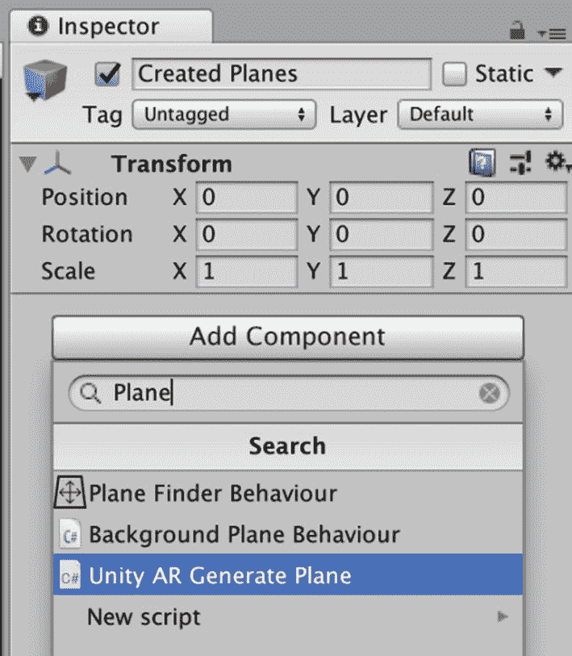

# 三、Unity ARKit

现在，您已经安装了 Unity 和 Unity ARKit 插件，是时候开始学习更多关于这个工具的知识，并进行我们的第一次 AR 体验了。注意，我称之为体验而不是游戏，尽管它可能以某种方式被用作游戏；从我的角度来看，一个游戏需要一些关键元素，我将在第 4 章详细介绍。

如果您还没有打开我们在上一章中创建的 AR 项目，现在是这样做的好时机。如果您查看项目文件夹(图 [3-1](#Fig1) )并查看每个文件夹，您会看到 Unity ARKit 插件附带了许多资源，我们将在本书中探索和使用这些资源。

## 创建场景

我们要做的第一个任务是创建游戏对象，并将其放入我们的场景中，在 AR 中查看它。从菜单中选择游戏对象➤ 3D 对象➤立方体(图 [3-1](#Fig1) )。我们可以选择任何 3D 对象，但我希望你在 AR 中看到立方体，并在 3D 空间中围绕它移动。虽然我更喜欢球体，3D 立方体有六个顶点(多边形的角点)，这些将更容易看到。然而，我们将很快添加不同形状的游戏对象。

图 3-1

创建 3D 游戏对象

一旦你完成了这个任务，你将会在场景面板中看到我们惊人的立方体(图 [3-2](#Fig2) )。

图 3-2

场景中的立方体游戏对象

现在让我们在检查器里看一下(图 [3-3](#Fig3) )。如果你的变换位置和我的不一样，现在不用担心这个(无论如何我们都要移动游戏对象)。注意比例是 1，1，1。Unity 使用公制标准进行测量，因此 Unity 空间中的 1 个单位相当于现实世界中的 1 米。现在对于大多数传统游戏(不是 AR)，这真的不是初学者开发者需要担心的事情(太多)。然而，因为我们将把游戏资产投影到现实世界的空间中，获得正确的尺寸和比例变得非常重要。所以，如果我们把立方体的比例设为 1 米宽，1 米高，1 米深，这将是一个相当大的立方体。在 3D 图形中描述坐标的约定是 X，Y，z。我将在本书中使用这个标准。我将扩展我们这个令人惊叹的立方体，这样它就能适合我的小公寓了。一些读者可能会感到惊讶，大多数教学书籍的作者并没有住在价值数百万美元的豪宅里(至少这位作者没有)。

图 3-3

检查器中的立方体游戏对象

在检查器中，将刻度设置为 0.25，0.25，0.25(图 [3-4](#Fig4) )。

图 3-4

立方体游戏对象缩小比例

现在如果你看场景中的立方体，它会(或者应该)看起来更小(图 [3-5](#Fig5) )。如果你想更近距离的观察游戏对象，你可以在场景视图中移动相机靠近立方体。移动场景视图摄影机有两种主要方式。最简单的方法是在层级面板中选择游戏对象，然后按 f 键(我记得这是 f 键表示焦点)。另一种方法是使用鼠标中轮(如果你有一个 3 键鼠标)将相机移进或移出，或者双击鼠标(如果你有一个魔术鼠标)。我(非常)老派，更喜欢用我的 5 键鼠标。

图 3-5

缩小比例的立方体游戏对象的场景视图

## 摄像机

现在是谈论照相机的好时机。我们刚刚在场景视图中移动了摄像机。这个摄像机使你，开发者，能够看到场景中的东西。但是，如果你在层级面板中查看，你会看到一个 GameObject 主摄像头。这是玩家将要观看的摄像机。你会注意到在图 [3-5](#Fig5) 中，我的场景视图中有一个相机图标。这是玩家的摄影机在场景中的位置。我要你在层级面板中选择主摄像机。你会在场景视图的右下角看到一个小窗口(图 [3-6](#Fig6) )。此窗口显示玩家摄像机的视图(摄像机预览)。

图 3-6

相机预览

虽然相机预览窗口为我们提供了一个很好的场景对玩家来说是什么样子的想法，但为了获得更好的视图，我们可以选择游戏视图选项卡(图 [3-7](#Fig7) )。

图 3-7

游戏视图

正如我们在前一章中看到的，有许多设置我们可以使用(长宽比，比例，等等)。我们在这里可以看到，我们惊人的立方体有点远。我们将首先移动游戏对象，然后我们将移动主摄像机。

## 转换

在 Unity 中有几种移动(变换)游戏对象的方法。我们将使用的第一种方法(也是我使用的主要方法)是在检查器中设置变换设置。首先，选择我们想要转换的游戏对象。然后，在检查器中设置变换位置为 0，0，0(图 [3-8](#Fig8) )。

图 3-8

具有更新的变换位置的游戏对象

现在让我们看看主摄像头，看看玩家会怎么看(图 [3-9](#Fig9) )。

图 3-9

带有重置变换位置的游戏对象的相机预览

你会注意到游戏对象离主摄像头还是有点远。在屏幕的左上方(层级面板的正上方)，有六个图标(图 [3-10](#Fig10) )。

图 3-10

六个变换图标

第一个图标是手形工具(Q 快捷键)，它用于在场景视图中变换(或平移)相机。选中此工具，选择层次结构中的任何游戏对象，移动鼠标，注意游戏对象的变换设置不会改变，但游戏对象的视图会改变。按住 alt (option)键的同时,“手形工具”使您能够围绕其轴点环绕摄影机。通过按住控制按钮，您可以移动(或推拉)相机靠近或远离游戏对象。

下一个图标是移动工具(W 快捷键)。正如你可能猜到的，移动工具是用来移动游戏对象在场景中的位置的。选择主相机，选择移动工具(通过选择移动图标或按下 W 键)，你会注意到在场景视图中主相机图标现在有了移动 Gizmo(带箭头的红、绿、蓝线–图 [3-11](#Fig11) )。首先，选择绿线(Y 轴)并向下移动主摄像机。请注意，当您选择此行时，其他箭头行将灰显，您选择的行将变为黄色。现在尝试将相机移动到 Y 轴的 0。您会注意到这可能需要一些时间。如果您不能正确放置，您可能希望在检查器的 Y 中输入零(这就是为什么我更喜欢在检查器中键入值)。

图 3-11

移动小控件

下一个工具是旋转工具(E 快捷键)。正如你可能猜到的，这个工具是用来旋转游戏对象的。尝试选择立方体，然后按 R 键。您将看到旋转小控件(图 [3-12](#Fig12) )。使用旋转 Gizmo，您可以通过单击并拖动出现在其周围的线框旋转 Gizmo 的轴来更改游戏对象的旋转。使用旋转 Gizmo，红色、绿色和蓝色的圆将围绕红色、绿色和蓝色轴进行旋转(红色是 x 轴，绿色是 y 轴，蓝色是 z 轴)。外圆用于围绕场景视图 z 轴旋转游戏对象。

图 3-12

旋转小控件

下一个工具是计重收费(R 快捷键)。缩放工具用于缩放或重缩放所有轴上的游戏对象，方法是选择缩放 Gizmo 的中心，然后拖动鼠标(图 [3-13](#Fig13) )。您也可以使用此工具，通过选择任意一个单独的轴在单独的轴上进行缩放。

图 3-13

缩放小控件

在选择了立方体游戏对象的情况下缩放立方体会设置立方体的位置，或者当我们使用变换工具时它已经被移动了；现在是将位置设置或重置为 0，0，0 的好时机(图 [3-14](#Fig14) )。

图 3-14

立方体游戏对象位置设置

现在我们需要将主摄像机定位在原点(0，0，0)。如果你看我的立方体的位置，这将意味着我们的相机将在我们的立方体的中间。所以，让我们先把立方体移开。将立方体变换位置设置为 0，0，1，然后将主摄像机移动到 0，0，0(图 [3-15](#Fig15) )。现在立方体将看起来像是位于离我们的摄像机 1 米远的地方。

图 3-15

新的主摄像头设置

### 测试

现在是时候看看我们神奇的立方体在现实世界中是什么样子了。在为 iOS 开发时，我们需要使用 Xcode，然后才能测试或部署游戏。要在 iTunes 上发布一个 AR 游戏，我们需要将游戏提交给苹果公司进行审批，然后当它获得批准后，我们可以从 iTunes 商店下载它，并在我们的设备上查看它的外观。使用 Xcode，我们可以预览我们的游戏在我们的设备上将会是什么样子，但这仍然需要我们构建并运行游戏，并使用 Xcode 来预览游戏。正如你可能想象的那样，这是一次非常耗时(并且有点令人沮丧)的经历。Unity 前来救援，为我们提供了 Unity Remote。Unity Remote 是 iTunes app store 中适用于 iOS 设备的应用(或应用)。这个工具帮助我们在 iOS 设备上测试游戏，而不需要将游戏提交到 iTunes 商店。然而，在撰写本文时，Unity Remote(版本 5)还不支持 AR。Unity 的优秀人员考虑了这个挑战，并在 Unity ARKit 中加入了一个名为 UnityARKitRemote 的小程序。Unity ARKitRemote 为我们提供了在 iOS 设备上测试我们的 AR 项目所需的工具。

## ARKit 遥控器

在项目文件夹中，键入搜索文本以找到 ARKit 远程预置(图 [3-16](#Fig16) )。现在将这个文件拖到层次选项卡上(图 [3-17](#Fig17) )。

图 3-17

层级中的 ARKitRemote 预设

图 3-16

搜索 ARKit 遥控器

## 设置主摄像机

现在在主相机设置中，将清除标志设置为仅深度(图 [3-18](#Fig18) )。

图 3-18

将相机的清除标志设置为仅深度

## 添加组件

现在，我们将添加一个组件到我们的相机。在本例中，我们将添加 Unity AR 视频脚本。若要添加此脚本，请选择主摄像机，在检查器中选择“添加组件”。

在检查器中，您会看到一个您可以添加的可能组件的列表(图 [3-18](#Fig18) )。您可能需要一段时间才能找到它，所以我建议您使用 Add Component 菜单中的搜索栏来查找我们正在寻找的脚本。在图 [3-19](#Fig19) 中，在搜索栏中，我搜索了视频。

图 3-19

搜索 Unity AR 视频脚本组件

找到 Unity AR 视频脚本后，选择它(单击鼠标)，现在您应该会看到该组件已添加到主摄像机中(图 [3-20](#Fig20) )。

图 3-20

添加到主摄像机的 Unity AR 视频脚本组件

在 Unity AR 视频脚本中，有一个属性叫做 Clear Material。我们将添加一种材料。在 Unity AR 视频脚本 Clear Materials 属性中，在属性框的右边，有一个小齿轮(图[3-19](#Fig19))；如果您选择此档位，您将看到该项目文件夹中所有可用材料的列表(图 [3-21](#Fig21) )。同样，您可以手动搜索，或者使用搜索栏。搜索 YUV 素材。我将在下一章更详细地介绍这种材料的作用以及我们为什么要使用它。

图 3-21

为透明材质选择 YUV 材质

### 追踪手机移动

为了让 AR 项目看起来真实，我们需要跟踪手机在现实世界中的移动，并在手机屏幕上投影虚拟物体的准确表示。Unity 的优秀员工(再次)让我们的生活变得更加轻松，在 Unity ARKit 中有一个名为 Unity AR Camera Manager 的脚本。按照我们添加 Unity AR 视频脚本的步骤，我们将添加 Unity AR 摄像机管理器。首先选择主摄像头，在检查器中选择添加组件(图[3-22](#Fig22))；现在搜索 AR 摄像头管理器(图 [3-23](#Fig23) ，并将其添加到主摄像头。

图 3-23

搜索 Unity AR 摄像机管理器

图 3-22

添加组件

将主摄像机添加到 Unity AR 摄像机管理器的跟踪摄像机属性是一个很好的做法；这将确保 AR 摄像机管理器使用正确的摄像机。但是，如果您不选择此项，Unity AR 相机管理器会为您选择。要将主摄像机添加到 Unity AR 摄像机管理器的摄像机属性中，请从层级中选择主摄像机，并将其拖动到 Unity AR 摄像机管理器的跟踪摄像机属性中(图 [3-24](#Fig24) )。

图 3-24

将主摄像机设置为跟踪摄像机

### 构建并运行

现在我们已经准备好构建和运行我们的应用了。确保您已将 iOS 设备连接到 Mac，然后从 Unity 文件菜单中选择构建和运行(图 [3-25](#Fig25) )。如果您还没有下载最新版本的 Xcode，您需要现在就下载(这需要一段时间)。

图 3-26

构建设置

图 3-25

选择构建和运行

在 Build setting 菜单中，首先选择您想要构建它的平台，在我们的例子中是 iOS。另外，选中“开发构建”复选框。最后，只选择您想要构建的场景非常重要。如果您的当前场景未列出，请单击添加开放场景按钮(图 [3-26](#Fig26) )并取消选中任何其他场景。

从构建设置屏幕中，选择播放器设置图标。这将打开播放器设置的检查器，我们将在其中输入公司名称和产品名称(图 [3-27](#Fig27) )。

图 3-27

播放器设置的检查视图

向下滚动菜单，找到捆绑标识符(图 [3-26](#Fig26) )。需要注意的是，一旦您在 Xcode 中为个人团队注册了一个捆绑包标识符，以后就不能将同一个捆绑包标识符注册到另一个 Apple 开发者项目团队。这意味着当你使用一个免费的 Apple ID 和一个个人团队测试你的游戏时，你应该选择一个仅用于测试的捆绑包标识符——你将无法使用同一个捆绑包标识符来发布游戏。最好的解决方案是将“Test”添加到测试包标识符的末尾——例如，com . your company name . your appname Test。接受的字符是字母数字字符、句点和连字符。在我的例子中(图 [3-28](#Fig28) ，我使用了 com。RottenEggProductions . hello world test 作为包标识符(您需要自己的名字)。如果您有一个签名团队 ID，您可能也想包括它。但是出于测试目的，这是不需要的。

图 3-28

在播放器设置中设置捆绑标识符

现在选择构建和运行图标。Unity 将提示您保存项目。学习编程入门课程时的传统是将我们的第一个应用命名为 Hello World(不要问我为什么)。因此，在这个传统中，我将把我的第一个 AR 应用命名为 Hello WorldAR。注意在图 [3-29](#Fig29) 中，我将它保存在我的 Unity 项目所在的文件夹中。有些人会认为这不是好的实践，但是现在已经足够好了。

图 3-29

保存 Hello WorldAR 菜单

保存文件后，Unity 将开始编译应用(图 [3-28](#Fig28) )，并最终打开 Xcode(图 [3-29](#Fig29) )。当 Xcode 打开时(图 [3-31](#Fig31) ，确保你选择了正确的设备(iPhone 或 iPad)，选择 play 按钮在你的设备上启动你的游戏(图 [3-30](#Fig30) )。如果 Unity 报告任何错误，请确保在重试之前检查错误并解决这些问题。

图 3-31

x mode(x mode)-x mode(x mode)-x mode(x mode)(x mode)(x mode)(x mode)(x mode)(x mode)(x mode)(x mode)

图 3-30

Unity 编译我们的应用

您将被提示允许 Unity ARKit 访问您的相机，如果一切正常，您应该可以在现实世界中看到您的神奇立方体。在我的例子中，你可以看到我的神奇立方体投影在我的奥拉基山照片前面(图 [3-32](#Fig32) )。

图 3-32

我的 Hello WorldAR 应用

### 拯救现场

现在是拯救我们现场的好时机。从文件菜单中，选择文件➤将场景另存为并将该场景命名为(图 [3-33](#Fig33) )。我选择了 Hello WorldAR 作为这个场景的名字(图 [3-34](#Fig34) )。

图 3-34

保存场景并选择其位置

图 3-33

将场景另存为菜单

### 理解场景

现在可能是讨论 Unity 场景和项目之间的区别的好时机。一个 Unity 项目包含了游戏或应用可能用到的所有场景和必要的代码。场景是项目的一个元素(或组件)。将项目想象成一部完整的电影，将场景想象成电影的一部分。在一个游戏中，这些场景可以是菜单、关卡、演职员表等等。

## 视觉惯性里程计简介

现在我们来看看更多的用于创建 AR 游戏的重要工具。在我们的 Hello WorldAR 项目中，我们创建了一个放置在 iPhone 摄像头前面的立方体，并在我们移动摄像头位置时保持在那里。摄像头怎么知道自己定位在哪里？你可能已经知道，iPhone 有一些很酷的方式来知道它的位置。我最常用的是加速度计。加速度计允许 iPhone 知道它在 3 个轴(X，Y，Z)上的位置。这对于在纵向和横向模式之间切换非常有用。我使用的另一个工具是指南针(或磁力计)，你可能已经知道，这对导航非常有用。最后一个工具是陀螺仪。陀螺仪跟踪 iPhone 的旋转或扭曲。虽然这些都是很好的导航工具，但它们没有在 AR 中跟踪手机移动所需的精确度。为了跟踪增强现实所需的 iPhone 的运动，苹果最近在手机的摄像头中加入了一些技术。通过结合视觉信息(来自相机)和惯性信息(来自加速度计和陀螺仪)，可以精确地测量 iPhone 的位置。

### 特征点

那么摄像头是如何追踪手机位置的呢？问得好！iPhone(目前是 iPhone 8 或更高版本)中的摄像头足够智能，可以识别现实世界中的关键点(或特征点)，当摄像头移动时，可以跟踪这些点的位置。这个过程需要一些令人印象深刻的数学知识，但最近的 iPhones 有足够的处理能力来做到这一点。

### 点云

Unity ARKit 包括一个帮助手机识别物理世界特征点的预置。我们要使用的第一个是点云预置。

随着你的 Hello WorldAR 应用在 Unity 中打开，我们将创建一个空的游戏对象。从文件菜单中，选择游戏对象➤创建空白(图 [3-35](#Fig35) )。

图 3-35

创建一个空的游戏对象

在检查器中选择空的游戏对象，将其重命名为点云。现在添加一个组件。在搜索栏中，搜索 Unity 点云示例，并将其添加到点云游戏对象中(图 [3-36](#Fig36) )。

图 3-36

搜索点云示例

添加了 Unity 点云示例脚本后，现在将显示的最大点数设置为 120(图 [3-37](#Fig37) )。您可以设置任意多的点云。

图 3-37

设置要显示的最大点数

现在我们需要添加一个点云粒子预置到点云。选择点云预置框右边的小齿轮，然后搜索预置(图 [3-38](#Fig38) )。在点云粒子示例脚本中，选择点云预设并将其拖动到点云粒子预设框中(图 [3-39](#Fig39) )。

图 3-39

设置为点云预设的点云预设

图 3-38

搜索点云预置

### 测试

现在我们要测试我们的点云。当我们测试我们的 Hello WorldAR 应用时，我们经历了构建应用的漫长(可能是乏味的)任务，在 Xcode 中启动它。然后终于可以在我们的 iOS 设备上看到我们的应用了。Unity 的优秀员工已经考虑到了这一点，并为我们创造了一种减少测试开发时间的方法。在 Unity ARKit 中，有一个场景可以让我们在 Unity 的游戏标签中预览构建。如果每次想预览开发都要经历使用 Xcode 的过程，那也没问题。然而，我将向您展示一种您可能重视的更有效的方法。

### Unity ARKitRemote

因为 Unity Remote Connection 目前不支持 AR，所以我们需要在我们的 iOS 设备上构建和部署一个应用。Unity 的好人们在 Unity ARKit 中加入了一个叫做 ARKit Remote 的场景。您可以使用搜索栏在项目文件夹中找到它。在图 [3-40](#Fig40) 中，我使用了搜索字符串 remote。

图 3-40

搜索 UnityARKitRemote 场景

双击场景将其打开。如果您尚未保存对当前场景的任何更改，在 Unity 打开另一个场景之前，系统会提示您保存更改。你会看到这是一个非常简单的场景，由一个主摄像头和一个方向灯组成(图 [3-41](#Fig41) )。

图 3-41

UnityARKitRemote

如果您在层级中选择主摄像机，您将看到主摄像机添加了几个脚本(图 [3-42](#Fig42) )。这些脚本将使手机摄像头跟踪其位置，并使我们能够在 Unity 编辑器中看到相机视图。

图 3-42

主摄像机脚本

就像我们创建的 Hello WorldAR 应用一样，我们需要将这个应用部署到我们的手机上。从文件菜单中，选择文件➤构建设置(图 [3-43](#Fig43) )。

图 3-43

选择构建设置

在构建设置菜单中，选择播放器设置菜单，并对产品名称和捆绑包标识符进行更改(图 [3-44](#Fig44) )。

图 3-44

播放器设置的检查视图

注意，我已经将产品名改为 ARKitRemote，将包标识符改为 com。RottenEggProductions . ARKitRemoteTest(图 [3-45](#Fig45) )。

图 3-45

捆绑标识符设置

确保您有正确的场景来构建，并从“构建”菜单中选择“构建并运行”。现在 Unity 将编译我们的应用并运行 Xcode，Xcode 将把它部署到我们的设备上(图 [3-46](#Fig46) )。

图 3-46

我的 iPhone 上安装了 ARKitRemote

现在我们需要将 ARKit 连接预置添加到 Hello WorldAR 项目中。打开你的 Hello WorldAR 场景(双击)。

### 使用 ARKit 远程连接

在项目文件夹中，搜索一个名为 ARKitRemoteConnection 的预置(图 [3-47](#Fig47) )。

图 3-47

搜索 UnityARKitRemoteConnection 预置

选择这个预设，并将其添加到场景中(将其拖动到层次中)(图 [3-48](#Fig48) )。

图 3-48

场景中的 UnityARKitRemoteConnection

现在我们要在 iOS 设备上打开 ARKitRemote。在 Unity 中，打开 Hello World AR 场景，然后选择游戏选项卡并按下播放按钮。Unity 会在控制台菜单中提示你连接播放器(图 [3-49](#Fig49) )。

图 3-49

Unity 连接到玩家消息

在控制台表中，选择编辑器并选择您的 iOS 设备(图 [3-50](#Fig50) )。

图 3-50

在控制台菜单中选择 iOS 设备

然后 Unity 会提示你启动远程 ARKit 会话(图 [3-51](#Fig51) )。在 Unity 中点击游戏屏幕上的图标，您的应用现在可以在您的 iOS 设备上运行。

图 3-51

启动远程 ARKit 会话提示

在图 [3-52](#Fig52) 中，你可以看到我已经成功地能够在我的 iPhone 上查看 Hello WorldAR 应用，并在 Unity 中看到场景。如果您移动您的设备，您应该在 Unity 场景选项卡中看到摄像机移动，在游戏选项卡中看到画面变化。我想指出的是，这会有点慢(滞后)，但 ARKitRemote 是目前开发和测试 iOS 版 Unity AR 开发的最佳方式。

图 3-52

游戏视图中的立方体和点云

而点云系统对于识别非对称物体(如沙发)非常有用。如果我们使用 UnityARKit 中提供的另一个功能来帮助识别平面(如地板、墙壁或桌子)，将会更加高效和有效。

### 平面可视化

首先，创建另一个包含所需脚本的空游戏对象。要创建一个空的游戏对象，从菜单中选择游戏对象➤创建空的(图 [3-53](#Fig53) )。

图 3-53

创建一个空的游戏对象

选择游戏对象，在检查器中，命名这个创建的平面(图 [3-54](#Fig54) )。

图 3-54

命名新游戏对象创建的飞机

现在我们需要添加一个组件。在创建的平面检查器中选择添加组件按钮，并在搜索栏中搜索 Unity AR 生成平面脚本(图 [3-55](#Fig55) )。

图 3-55

搜索 Unity AR 生成平面脚本

Unity AR 生成的平面脚本包含在创建的平面游戏对象中，在 Unity AR 生成的平面脚本的平面预设设置中。选择选项框右侧的小齿轮，搜索并选择 DebugPlanePrefab(图 [3-56](#Fig56) )。

图 3-56

搜索调试计划预设

### 测试

现在，将您的 iOS 设备连接到 Mac，运行 UnityARKitRemote 应用。现在 Unity 一致。在编辑器中连接到您的设备，然后单击播放按钮。使用您的 iOS 设备，转动相机以查看一个平面，您应该会在 Unity Game view 屏幕中看到您的点云和一个矩形(图 [3-57](#Fig57) )。

图 3-57

点云和创建的平面

点云和创建的平面在我们创建的游戏中都很有用，可以从 iOS 摄像头中找到并跟踪参考点。如果你觉得自己很勇敢，你可以试着将最终版本部署到你的 iOS 设备上。然而，目前，我们的立方体还没有准备好真正使用相机的参考点跟踪。

### 摘要

在本章中，我们学习了如何使用 Unity ARKit 并配置我们的 iOS 设备来实时预览我们的应用和游戏。我们还学到了一些关于 Unity ARKit 如何追踪设备位置的理论。最后，我们使用了一些工具来帮助我们准确地跟踪设备的细微运动。