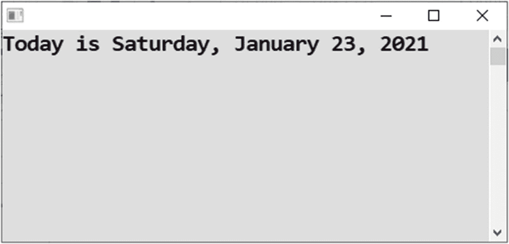
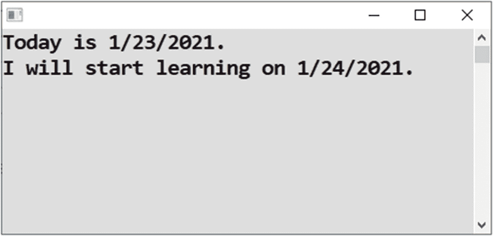
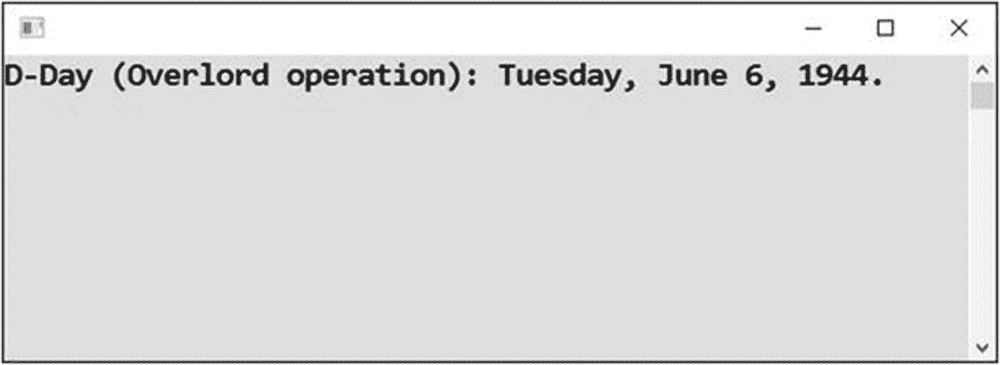
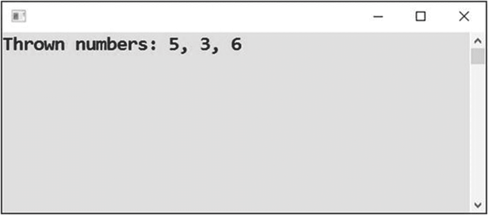
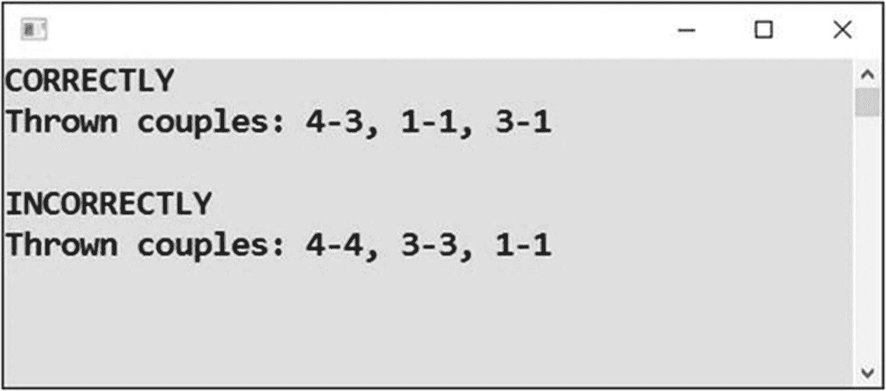
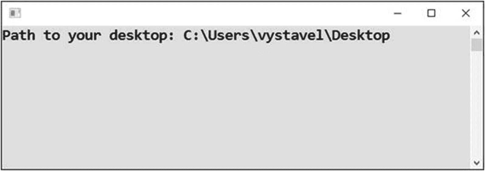
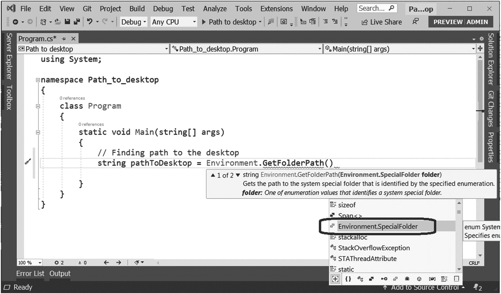

# 六、使用对象操作

从上一章你已经知道，一个对象是一种由几个“数据片段”组成的数据集合体您还知道，当您输入对象名称、点号和组件名称时，可以访问对象的单个组件。在这一章中，你会发现编程中的对象甚至更复杂。您将了解到，除了数据组件之外，对象还可以封装您可以使用相应对象执行的操作。通过几个任务，你将练习使用对象动作。

## 以文本显示月份

第一个任务将向您介绍可以使用`DateTime`对象执行的操作。

### 工作

你将编写一个程序，用文本显示当前日期，而不是用数字(或者，通常是长格式)，如图 6-1 所示。



图 6-1

用文本显示当前日期和月份

您可以使用`DateTime`对象的`ToLongDateString`动作来完成这项任务。

### 解决办法

代码如下:

```cs
static void Main(string[] args)
{
    // Today's date
    DateTime today = DateTime.Today;

    // Output
    Console.WriteLine("Today is " + today.ToLongDateString());

    // Waiting for Enter
    Console.ReadLine();
}

```

### 讨论

请注意以下几点:

*   当在 C# 中启动某个对象动作时，动作名称总是被括号(圆括号)所附加，即使它们之间没有任何内容。

*   括号通常不是空的，而是包含一个*参数*(或多个参数)，这是一些特定于动作的信息。例如，在`Console.WriteLine`动作的情况下，您在括号中指定想要显示的内容。

*   您可以对对象执行的操作也被称为*方法*。

*   `ToLongDateString`方法显示的月份名称取决于操作系统的语言设置。

## 明天展示

除了将日期转换成文本，对象还有更多可用的操作。日期运算尤其重要。

### 工作

你将编写一个显示明天日期的程序(见图 6-2 )。



图 6-2

显示明天的日期

### 解决办法

`DateTime`对象可以执行更多有趣的动作(方法)，例如:

*   使用`AddDays`进行日期运算

*   使用`ToShortDateString`以短格式显示日期

代码如下:

```cs
static void Main(string[] args)
{
    // Today's date
    DateTime today = DateTime.Today;

    // Tomorrow's date
    DateTime tomorrow = today.AddDays(1);

    // Output
    Console.WriteLine("Today is " + today.ToShortDateString() + ".");
    Console.WriteLine("I will start learning on " + tomorrow.ToShortDateString() + ".");

    // Waiting for Enter
    Console.ReadLine();
}

```

## 显示特定日期

让我们继续讨论日期，看看什么是*构造函数*。

### 工作

处理日期时，不必总是从今天的日期开始。你可以选择一些具体的日期(见图 6-3 )。



图 6-3

从特定的日期开始

### 解决办法

通过调用对象的构造函数，可以创建一个用特定日期初始化的`DateTime`对象。您输入`new`单词，键入名称(例如`DateTime`，并使用括号括起可能的参数。在这种情况下，参数是年、月和日。

```cs
static void Main(string[] args)
{
    // A specific date
    DateTime overlordDday = new DateTime(1944, 6, 6);

    // Output
    Console.WriteLine("D-Day (Overlord operation): " +
                        overlordDday.ToLongDateString() + ".");

    // Waiting for Enter
    Console.ReadLine();
}

```

## 滚动单个模具

约会够多了。现在你将学习如何处理偶然性或随机性。

### 工作

你将编写一个程序，将一个骰子“掷出”三次(见图 6-4 )。



图 6-4

滚动骰子

### 解决办法

要使用 chance，你需要一个*随机数生成器*。在 C# 中，您使用`Random`对象来实现这个目的。

在程序开始运行时，你首先通过调用其构造函数**一次**来创建一个`Random`对象，然后你**重复**调用其方法`Next`。

```cs
static void Main(string[] args)
{
    // Creating random number generator object
    Random randomNumbers = new Random();

    // Repeatedly throwing a die
    int number1 = randomNumbers.Next(1, 6 + 1);
    int number2 = randomNumbers.Next(1, 6 + 1);
    int number3 = randomNumbers.Next(1, 6 + 1);

    // Output
    Console.WriteLine("Thrown numbers: " +
        number1 + ", " +
        number2 + ", " +
        number3);

    // Waiting for Enter
    Console.ReadLine();
}

```

### 注意

`Next`方法(动作)需要括号中的两个参数:

*   生成数区间的下界

*   上界**增加 1** (对不起，我不是发明这种陌生感的人)

## 掷骰子

继续讨论随机数的话题，现在你将看到如何使用多个随机数序列。

### 工作

你将编写一个程序，将一对骰子掷出三次(见图 6-5 )。我会告诉你正确的方法和错误的方法。



图 6-5

掷骰子三次

### 解决办法

该解决方案的主要信息是使用**单个**随机数发生器。如果你几乎同时创建了两个，它们通常会生成**相同的数字**！代码如下:

```cs
static void Main(string[] args)
{
    // 1\. CORRECT SOLUTION
    // Creating random number generator object
    Random randomNumbers = new Random();

    // Repeatedly throwing two dice
    int correctNumber11 = randomNumbers.Next(1, 6 + 1);
    int correctNumber12 = randomNumbers.Next(1, 6 + 1);

    int correctNumber21 = randomNumbers.Next(1, 6 + 1);
    int correctNumber22 = randomNumbers.Next(1, 6 + 1);

    int correctNumber31 = randomNumbers.Next(1, 6 + 1);
    int correctNumber32 = randomNumbers.Next(1, 6 + 1);

    // Output
    Console.WriteLine("CORRECTLY");
    Console.WriteLine("Thrown couples: " +
        correctNumber11 + "-" + correctNumber12 + ", " +
        correctNumber21 + "-" + correctNumber22 + ", " +
        correctNumber31 + "-" + correctNumber32);

    // 2\. INCORRECT SOLUTION
    // Two random number generators
    Random randomNumbers1 = new Random();
    Random randomNumbers2 = new Random();

    // Repeatedly throwing two dice
    int incorrectNumber11 = randomNumbers1.Next(1, 6 + 1);
    int incorrectNumber12 = randomNumbers2.Next(1, 6 + 1);

    int incorrectNumber21 = randomNumbers1.Next(1, 6 + 1);
    int incorrectNumber22 = randomNumbers2.Next(1, 6 + 1);

    int incorrectNumber31 = randomNumbers1.Next(1, 6 + 1);
    int incorrectNumber32 = randomNumbers2.Next(1, 6 + 1);

    // Output
    Console.WriteLine(); // empty line
    Console.WriteLine("INCORRECTLY");
    Console.WriteLine("Thrown couples: " +
        incorrectNumber11 + "-" + incorrectNumber12 + ", " +
        incorrectNumber21 + "-" + incorrectNumber22 + ", " +
        incorrectNumber31 + "-" + incorrectNumber32);

    // Waiting for Enter
    Console.ReadLine();
}

```

## 获取桌面的路径

作为本章的结尾，你将学习另一个物体的动作。

### 工作

当您处理文件时，您可能希望在用户的桌面上创建一个文件。然而，每个人都有自己的桌面文件系统路径。我会告诉你如何找到那条路径(见图 6-6 )。



图 6-6

寻找道路

### 解决办法

可以用你的老朋友，`Environment`对象。代码如下:

```cs
static void Main(string[] args)
{
    // Finding path to the desktop
    string pathToDesktop = Environment.GetFolderPath(Environment.SpecialFolder.Desktop);

    // Output
    Console.WriteLine("Path to your desktop: " + pathToDesktop);

    // Waiting for Enter
    Console.ReadLine();
}

```

### 列举

要特别注意你对桌面感兴趣的方式。`Desktop`的值是被称为`Environment.SpecialFolder`的*枚举*的值之一。

每当 Visual Studio 希望您输入枚举值时，它通常会为您提供相应的枚举。在这种情况下，当您从 IntelliSense 中选择`GetFolderPath`并随后键入左括号时，会立即弹出`Environment.SpecialFolder`枚举(参见图 6-7 )。



图 6-7

使用智能感知

使用 Tab 键选择提供的枚举，输入一个点，然后选择`Desktop`值。

## 摘要

本章的主要目的是向您展示对象是更复杂的实体，而不仅仅是数据组件的集合体。具体来说，它们通常包含方法，这些方法是您可以执行的操作，通常对对象的数据进行操作。

您已经熟悉了`DateTime`、`Random`和`Environment`对象的各种方法。具体来说，您学习了以下内容:

*   使用`ToLongDateString`和`ToShortDateString`方法将日期转换为文本

*   日期运算的方法之一，即`AddDays`

*   在指定范围内产生单个随机数的`Next`方法

*   `GetFolderPath`方法，可用于获取特殊文件夹的文件系统路径，如`Desktop`、`Documents`等

您还了解了如何使用构造函数调用来创建对象。您输入了`new`单词，后面是对象类型的名称和括号。一些构造函数，比如`Random`对象，只需要空括号，而其他的，比如`DateTime`，需要你在括号之间指定一些值(年、月、日)。

在最后一个例子中，您还发现了所谓的枚举的用法，它本质上是一组预定义的(枚举的)值。Visual Studio 的 IntelliSense 在处理枚举时非常有用。