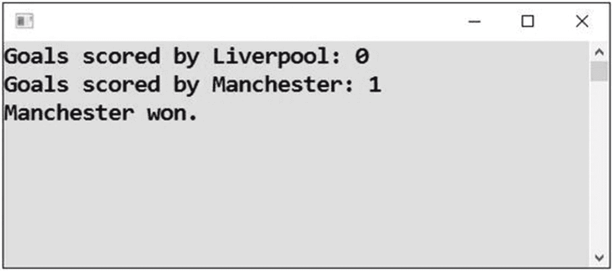
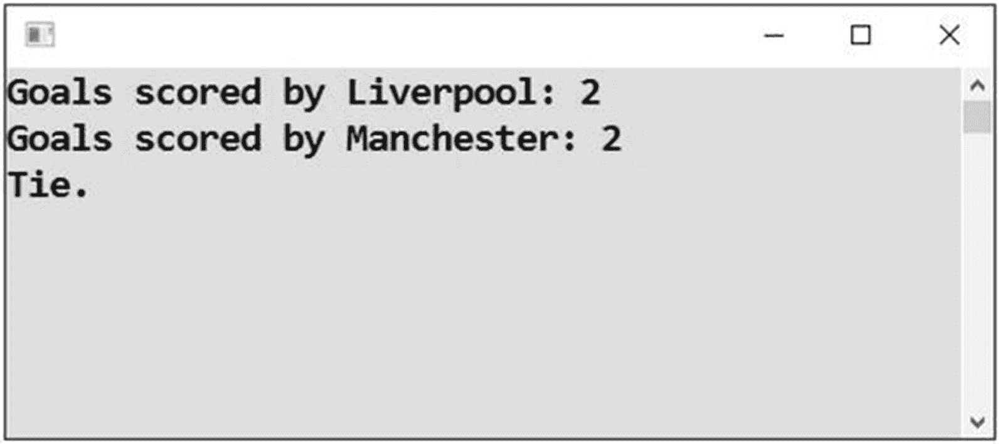
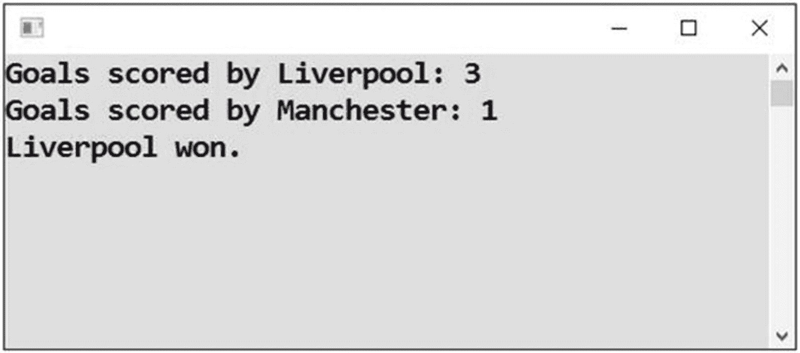
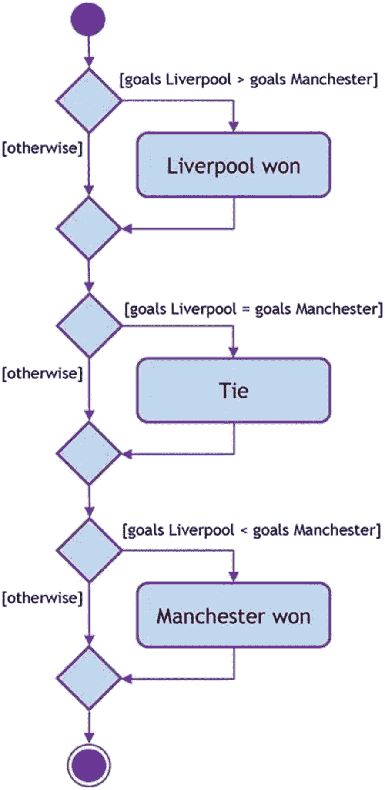
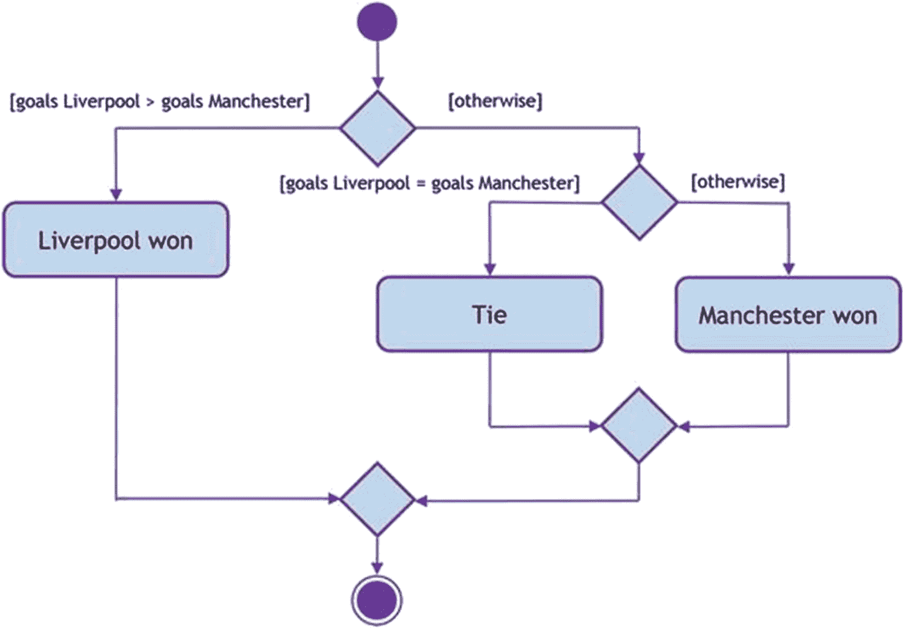
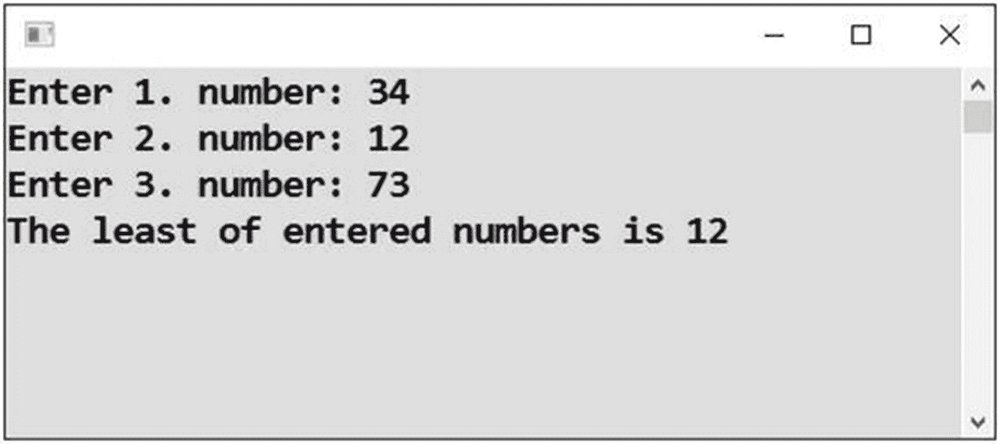
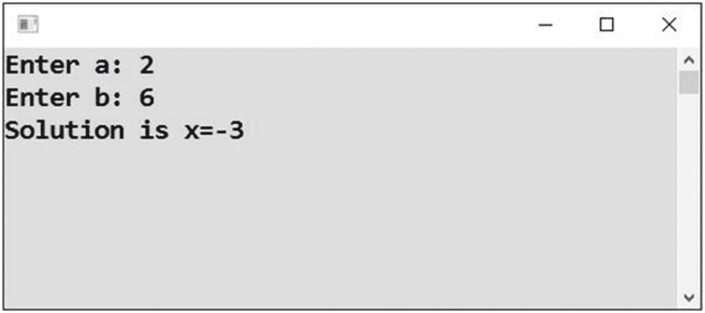
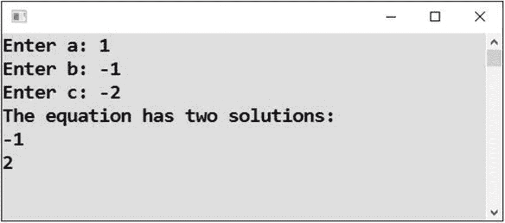
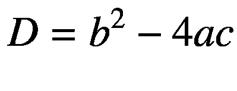
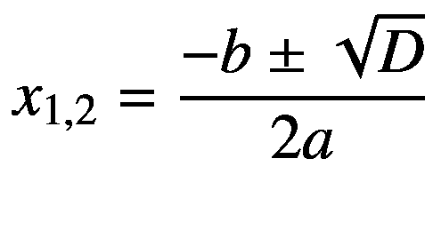

# 十八、多重条件

继续讨论条件这个话题，现在我们来看更复杂的例子。在这一章中，你将遇到可以在一个程序中使用几个条件来解决的任务。

## 足球

首先，您将详细考虑可选执行路径的三个分支的典型情况。

### 工作

您将准备一个程序，用户在其中输入关于足球比赛的数据:双方的进球数。然后，程序评估匹配结果。它显示第一个俱乐部赢了，第二个俱乐部赢了，还是平局(见图 18-1 、 18-2 和 18-3 )。



图 18-3

第二个俱乐部赢了



图 18-2

这是一个平局



图 18-1

第一个俱乐部赢了

### 分析

您可以连续使用三个条件来解决任务，每个条件考虑一个特定的匹配结果(参见图 18-4 )。



图 18-4

程序流程

### 解决办法

代码如下:

```cs
static void Main(string[] args)
{
    // Inputs
    Console.Write("Goals scored by Liverpool: ");
    string inputLiverpool = Console.ReadLine();
    int goalsLiverpool = Convert.ToInt32(inputLiverpool);

    Console.Write("Goals scored by Manchester: ");
    string inputManchester = Console.ReadLine();
    int goalsManchester = Convert.ToInt32(inputManchester);

    // Evaluating
    if (goalsLiverpool > goalsManchester)
    {
        Console.WriteLine("Liverpool won.");
    }

    if (goalsLiverpool == goalsManchester)
    {
        Console.WriteLine("Tie.");
    }

    if (goalsLiverpool < goalsManchester)
    {
        Console.WriteLine("Manchester won.");
    }

    // Waiting for Enter
    Console.ReadLine();
}

```

## 足球或者

为了给你展示另一个观点，你将用另一种方法解决前面的练习。之前，您连续使用了三个条件。这一次，您将第二个条件嵌套到第一个条件中。

### 分析

如图 18-5 所示，程序将首先分支到以下选项:



图 18-5

程序流程

*   利物浦赢了。

*   利物浦没有赢。

另一个选项“利物浦没有赢”，将进一步分为以下内容:

*   领带。

*   曼彻斯特赢了。

### 解决办法

代码如下:

```cs
static void Main(string[] args)
{
    // Inputs
    Console.Write("Goals scored by Liverpool: ");
    string inputLiverpool = Console.ReadLine();
    int goalsLiverpool = Convert.ToInt32(inputLiverpool);

    Console.Write("Goals scored by Manchester: ");
    string inputManchester = Console.ReadLine();
    int goalsManchester = Convert.ToInt32(inputManchester);

    // Evaluating
    if (goalsLiverpool > goalsManchester)
    {
        // Here we know Liverpool won. We can display the result.
        Console.WriteLine("Liverpool won.");
    }
    else
    {
        // Here we know Liverpool did not win. We will decide
        //   between tie and victorious Manchester
        if (goalsLiverpool == goalsManchester)
        {
            Console.WriteLine("Tie.");
        }
        else
        {
            Console.WriteLine("Manchester won.");
        }
    }

    // Waiting for Enter
    Console.ReadLine();
}

```

## 最少三个数字

下一个示例使用条件执行来比较三个数字。

### 工作

你将编写一个程序，找出用户输入的三个数字中最小的一个(见图 18-6 )。



图 18-6

寻找最小的数字

### 分析

该任务可以通过对所有输入数字的后续处理来解决。您将使用一个辅助变量来存储到目前为止找到的最小值。

开始时，第一个输入的数字成为最小值。在第二步中，您将第二个数字与最小值进行比较。如果前者小于后者，则前者成为最小值。最后，对第三个数字执行相同的程序。

### 解决办法

下面是代码:

```cs
static void Main(string[] args)
{
    // Inputs
    Console.Write("Enter 1\. number: ");
    string input1 = Console.ReadLine();
    int number1 = Convert.ToInt32(input1);

    Console.Write("Enter 2\. number: ");
    string input2 = Console.ReadLine();
    int number2 = Convert.ToInt32(input2);

    Console.Write("Enter 3\. number: ");
    string input3 = Console.ReadLine();
    int number3 = Convert.ToInt32(input3);

    // At the beginning, we set 1st number as minimum
    int minimum = number1;

    // Is not 2nd number less than present minimum?
    if (number2 < minimum)
    {
        minimum = number2;
    }

    // Is not 3rd number less than present minimum?
    if (number3 < minimum)
    {
        minimum = number3;
    }

    // Output
    Console.WriteLine("The least of entered numbers is " + minimum);

    // Waiting for Enter
    Console.ReadLine();
}

```

## 内置函数的最小值

您可以使用 C# 中现成的`Math.Min`函数来解决前面的练习。函数本身确定两个数字中最小的一个。我将向你展示如何使用三个数字的情况。

### 解决办法

首先，确定第一个和第二个数字中最小的一个。然后，结果将与第三个“竞争”。

代码如下:

```cs
static void Main(string[] args)
{
    // Inputs
    Console.Write("Enter 1\. number: ");
    string input1 = Console.ReadLine();
    int number1 = Convert.ToInt32(input1);

    Console.Write("Enter 2\. number: ");
    string input2 = Console.ReadLine();
    int number2 = Convert.ToInt32(input2);

    Console.Write("Enter 3\. number: ");
    string input3 = Console.ReadLine();
    int number3 = Convert.ToInt32(input3);

    // Evaluating
    int min12 = Math.Min(number1, number2);
    int minimum = Math.Min(min12, number3);

    // Output
    Console.WriteLine("The least of entered numbers is " + minimum);

    // Waiting for Enter
    Console.ReadLine();
}

```

## 线性方程

这个练习会涉及到一些数学知识。

### 工作

您将编写一个程序来求解一个线性方程，换句话说，一个类型为 *ax + b = 0* 的方程。

比如 *2x + 6 = 0* 是一个线性方程，2 是 *a* ，6 是 *b* 。

解决方案显然是-3。当你用-3 代替 *x* 时，左边变成零，换句话说，等于右边。

用户以系数 *a* 和 *b* 的形式输入要求解的方程。然后程序计算并显示其解(见图 18-7 )。



图 18-7

计算并显示其解

### 分析

无论何时你想编程任何东西，你都需要先了解现实世界的问题。换句话说，你需要知道不用电脑怎么解。

以下是如何解线性方程的数学提示:

*   如果 *a* 不为零，显而易见的解是 *-b/a* 。

*   *a* 等于零的情况是一种数学上的好奇。方程退化为一个奇怪的“没有 *x* 的方程”或者伪方程 *b = 0* 。这样一个“等式”
    *   对于等于零的 *b* 有无穷多个解(不管 *x* 如何，它总是成立)

    *   对于非零的 *b* 没有解(没有 *x* 可以满足这个方程)

### 解决办法

代码如下:

```cs
static void Main(string[] args)
{
    // Inputs
    Console.Write("Enter a: ");
    string inputA = Console.ReadLine();
    double a = Convert.ToDouble(inputA);

    Console.Write("Enter b: ");
    string inputB = Console.ReadLine();
    double b = Convert.ToDouble(inputB);

    // Solving the equation
    if (a != 0)
    {
        // a is non-zero, the equation has "normal" solution
        double solution = -b / a;
        Console.WriteLine("Solution is x=" + solution);
    }
    else
    {
        // a is zero, result depends on b
        if (b == 0)
        {
            Console.WriteLine("The equation \"is solved\" by any x");
        }
        else
        {
            Console.WriteLine("The equation does not have a solution");
        }
    }

    // Waiting for Enter
    Console.ReadLine();
}

```

## 二次方程

继续数学，下一个练习涉及一个更难的二次方程。

### 工作

你会写一个程序来解一个二次方程，换句话说就是一个类似*ax*<sup>*2*</sup>*+bx+c = 0*的方程。二次方程的一个例子是*x*<sup>*2*</sup>-*x- 2 = 0*其中 *a* 为 1， *b* 为-1， *c* 为-2。提到的方程有两个解:-1 和 2。替换左边两个零中的任何一个。

待解方程将以系数 *a* 、 *b* 、 *c* 的形式输入。程序计算并显示其解(见图 18-8 )。



图 18-8

解二次方程

为了简单起见，您不会考虑 *a* 等于零的情况，这将把任务转移到前一个线性方程。

### 分析

很久以前，有人聪明地设计出了一个解二次方程的程序。你可能在学校就知道了。你先算一下所谓的判别式:



然后，解决方案根据判别值进行分支。

*   对于 *D > 0* ，该方程有两个解，由下式给出:

T2】

*   对于 *D = 0* ，同样的公式适用于两个解重合的情况。

*   对于 *D < 0* ，该方程没有实数解。

### 解决办法

代码如下:

```cs
static void Main(string[] args)
{
    // Inputs
    Console.Write("Enter a: ");
    string input = Console.ReadLine();
    double a = Convert.ToDouble(input);

    Console.Write("Enter b: ");
    string inputB = Console.ReadLine();
    double b = Convert.ToDouble(inputB);

    Console.Write("Enter c: ");
    string inputC = Console.ReadLine();
    double c = Convert.ToDouble(inputC);

    // Solving + output
    double d = b * b - 4 * a * c;
    if (d > 0)
    {
        double x1 = (-b - Math.Sqrt(d)) / (2 * a);
        double x2 = (-b + Math.Sqrt(d)) / (2 * a);
        Console.WriteLine("The equation has two solutions:");
        Console.WriteLine(x1);
        Console.WriteLine(x2);
    }
    if (d == 0)
    {
        double x = -b / (2 * a);
        Console.WriteLine("The equation has a single solution: " + x);
    }
    if (d < 0)
    {
        Console.WriteLine("The equation does not have a solution");
    }

    // Waiting for Enter
    Console.ReadLine();
}

```

### 讨论

这个练习最有趣的一点是你用代码输入公式的方式。请注意，分子和分母必须用括号括起来，以确定计算的正确顺序！数学公式不包含它们，因为数学家使用分数。

计算判别式时，我不使用括号；我只是依靠乘法优先于减法。

#### 试验

为了检查程序计算是否正确，您可以编写更多的代码作为测试；将溶液替换为 *x* 后，左侧应为零。

## 摘要

在本章中，您看到了几个使用多个条件来完成指定任务的例子。

首先，你用两种方法解决了足球比赛评估。第一个使用三个简单的`if`语句一个接一个地考虑各个可能性。第二个使用了嵌套在另一个分支中的分支。

您进一步连续练习了多个条件，以找到三个数字中最小的一个。为此，您在一个辅助变量中存储了一个“迄今为止最小”值。

然后使用内置函数`Math.Min`解决了相同的任务。您已经知道函数决定了两个值中的最小值。在这里，我向您展示了一个有趣的案例，告诉您如何将它用于三个数字。

在最后两个任务中，你练习了数学中的多个条件，即解线性和二次方程。最后一项任务让您有机会看到用代码编写的更复杂的计算。