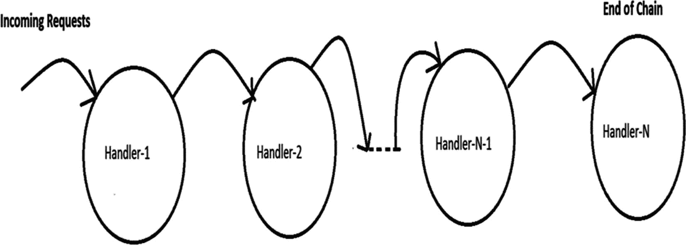
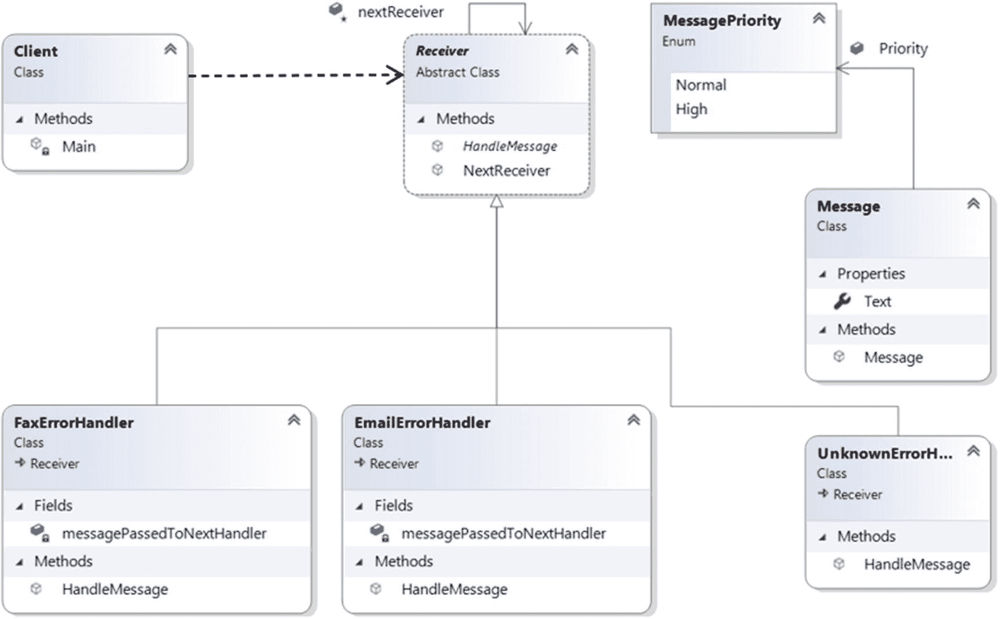
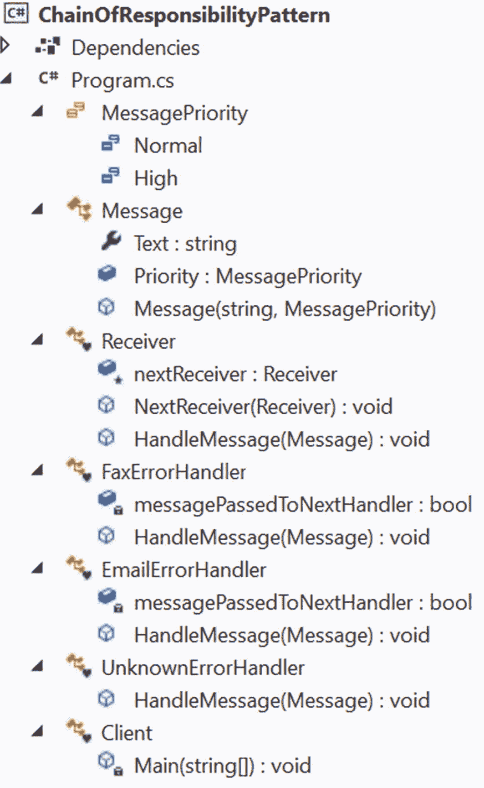

# 二十二、责任链模式

本章涵盖了责任链模式。

## GoF 定义

通过给多个对象一个处理请求的机会，避免将请求的发送方耦合到接收方。链接接收对象，并沿着链传递请求，直到有对象处理它。

## 概念

在这种模式中，您形成了一个对象链，在这个对象链中，您将任务的责任从一个对象传递到另一个对象，直到一个对象接受完成任务的责任。链中的每个对象都可以处理特定类型的请求。如果一个对象不能完全处理请求，它会将请求传递给链中的下一个对象。这个过程可以持续到链的末端。这种请求处理机制为您提供了在链中添加新处理对象(处理程序)的灵活性。图 22-1 显示了这样一个有 N 个处理器的链。



图 22-1

责任链模式

## 真实世界的例子

大多数软件组织都有一些客户服务代表，他们接受客户的反馈，并将任何问题转发给组织中适当的部门。但是，这两个部门不能同时解决这个问题。看似负责的部门会首先查看问题，如果这些员工认为问题应该转发给另一个部门，他们就会转发。

当病人去医院看病时，你可能会看到类似的场景。如果认为有必要，一个部门的医生可以将病人转到另一个部门(以作进一步诊断)。

你也可以考虑移动公司组织。例如，在印度，沃达丰移动公司有一个客户服务部。如果你有投诉，你首先向客户服务部提出问题。如果他们不能解决你的问题，你可以把它升级到一个节点官员。如果您对节点官员给出的解决方案不满意，您可以进一步将问题升级到上诉官员。

## 计算机世界的例子

考虑一个可以发送电子邮件和传真的软件应用(例如打印机)。因此，任何客户都可以报告传真问题或电子邮件问题，所以您需要两种不同类型的错误处理程序:`EmailErrorHandler`和`FaxErrorHandler`。你可以放心地假设`EmailErrorHandler`只处理电子邮件错误，它不对传真错误负责。同样，`FaxErrorHandler`处理传真错误，不关心电子邮件错误。

您可以像这样形成一个链:每当您的应用发现一个错误，它就抛出一张票并转发错误，希望其中一个处理程序会处理它。让我们假设请求首先到达`FaxErrorhandler`。如果这个处理程序同意这是一个传真问题，它就处理它；否则，它将问题转发给`EmailErrorHandler`。

注意，这里的链以`EmailErrorHandler`结束。但是如果您需要处理另一种类型的问题，比如身份验证问题，由于安全漏洞，您可以创建一个`AuthenticationErrorHandler`并将其放在`EmailErrorHandler`之后。现在，如果一个`EmailErrorHandler`也不能完全解决问题，它会将问题转发给`AuthenticationErrorHandler`，这个链就此结束。

Points to Remember

这只是一个例子；您可以按照自己喜欢的任何顺序随意放置这些处理程序。底线是处理链可能会在以下两种情况下结束:

*   处理程序可以完全处理请求。

*   你已经到了链条的末端。

当您在 C# 应用中使用多个 catch 块实现异常处理机制时，您会看到类似的机制。如果 try 块中出现异常，第一个 catch 块会尝试处理它。如果它不能处理这种类型的异常，下一个 catch 块将尝试处理它，并遵循相同的机制，直到该异常被一些处理程序(catch 块)正确处理。如果应用中的最后一个 catch 块也无法处理它，则会在此链之外引发异常。

## 履行

让我们假设在下面的例子中，你为我刚刚讨论的计算机世界例子编写程序。在这个例子中，我假设我们需要处理来自电子邮件或传真的不同种类的消息。客户还可以将这些消息标记为普通优先级或高优先级。所以，在程序的开始，你会看到下面的代码段。

```cs
/// <summary>
/// Message priorities
/// </summary>
public enum MessagePriority
{
  Normal,
  High
}
/// <summary>
/// Message class
/// </summary>
public class Message
{
 public string Text { get; set; }
 public MessagePriority Priority;
 public Message(string msg, MessagePriority priority)
  {
    this.Text = msg;
    this.Priority = priority;
  }
}

```

这次我选择了一个抽象的`Receiver`类，因为我想在它的派生类之间共享一些公共功能。

Points to Note

或者，您可以选择一个接口并使用默认接口方法的概念，这在 C# 8 中是受支持的。因为遗留版本不支持这一点，所以我为这个例子选择了抽象类。

`Receiver`类如下所示。

```cs
abstract class Receiver
{
  protected Receiver nextReceiver;
  //To set the next handler in the chain.  public void NextReceiver(Receiver nextReceiver)
  {
   this.nextReceiver = nextReceiver;
  }
 public abstract void HandleMessage(Message message);
}

```

`FaxErrorHandler`和`EmailErrorHandler`类继承自`Receiver`，它们在这个程序中充当具体的处理程序。为了演示一个非常简单的用例，我可以在`FaxErrorHandler` `.`中使用下面的代码段

```cs
if (message.Text.Contains("fax"))
{
    Console.WriteLine($"FaxErrorHandler processed { message.Priority } priority issue: { message.Text }");
}
else if (nextReceiver != null)
{
    nextReceiver.HandleMessage(message);
}

```

Points to Remember

在前面的代码段中，您可以看到，如果一条消息包含单词 *fax* ，那么 FaxErrorHandler 会处理它；否则，它会将问题传递给下一个处理程序。同样，在接下来的例子中，如果一条消息包含单词 *email* ，那么 EmailErrorHandler 将处理这条消息，以此类推。所以，你可能会问，如果一条消息中同时包含了*电子邮件*和*传真*，会发生什么？我在接下来的例子中处理了这个问题，但是为了简单起见，您可以忽略使用这段代码的情况。在现实世界的问题中，一个错误会导致另一个错误；因此，当传真代码库中出现错误时，相同的错误会传播到电子邮件代码库(如果它们共享一个公共代码库)。一个通用的补丁可以解决这两个问题。在接下来的例子中，我将向您展示何时应该传递问题，以及如何将问题传递给下一个处理者。因此，首先，您可能会忽略单个支柱的复杂性。

实际上，一个组织可能更喜欢实现一个基于人工智能的机制来首先分析一个问题，然后根据症状，他们可以将问题转发给一个特定的部门，但在核心部分，您可能会看到这种模式。

为了演示一条消息同时包含单词 *email* 和单词 fax 的情况，我对`FaxErrorHandler` `,`使用了一个相对复杂的结构，如下所示(相关的注释可以作为您的指南)。

```cs
class FaxErrorHandler : Receiver
{
    bool messagePassedToNextHandler = false;
    public override void HandleMessage(Message message)
    {
        // Start processing if the error message contains "fax"
        if (message.Text.Contains("fax"))
        {
            Console.WriteLine("FaxErrorHandler processed {0} priority issue: {1}", message.Priority, message.Text);
                /*
                Do not leave now, if the error message contains 'email' too.
                */
                if (nextReceiver != null && message.Text.Contains("email"))
                {
                    Console.WriteLine("I've fixed fax side defect.Now email team needs to work on top of this fix.");
                    nextReceiver.HandleMessage(message);
                    // We'll not pass the message repeatedly to next handler
                    messagePassedToNextHandler = true;
                }
            }
            if (nextReceiver != null && messagePassedToNextHandler != true)
            {
                nextReceiver.HandleMessage(message);
            }
        }
}

```

`EmailErrorHandler`与此类似。现在，如果你有一条包含*电子邮件*和*传真*的消息，像`"Neither the fax nor email is working,"`一样，这个相对复杂的结构可以帮助你得到下面的输出，你可以看到两个团队都在处理缺陷:

```cs
FaxErrorHandler processed High priority issue: Neither fax nor email are working.
I've fixed fax side defect. Now email team needs to work on top of this fix.
EmailErrorHandler processed High priority issue: Neither fax nor email are working.
Email side defect is fixed. Now fax team needs to cross verify this fix.

```

在我的链的末端，有一个`UnknownErrorHandler`声明这个问题既不是来自`Email`也不是来自`Fax`；所以你需要咨询专业的开发者来解决这个问题。

```cs
class UnknownErrorHandler : Receiver
    {
        public override void HandleMessage(Message message)
        {
            if (!(message.Text.Contains("fax")|| message.Text.Contains("email")))
            {
                Console.WriteLine("Unknown error occurs.Consult experts immediately.");
            }
            else if (nextReceiver != null)
            {
                nextReceiver.HandleMessage(message);
            }
        }
}

```

最后，错误处理程序对象的形成非常简单明了，如下所示。

```cs
// Different handlers
Receiver emailHandler = new EmailErrorHandler();
Receiver faxHandler = new FaxErrorHandler();
Receiver unknownHandler = new UnknownErrorHandler();

```

从下面的代码段，你可以很容易地理解如何形成一个处理程序链。

```cs
/*
Making the chain :
FaxErrorhandler->EmailErrorHandler->UnknownErrorHandler.
*/
faxHandler.NextReceiver(emailHandler);
emailHandler.NextReceiver(unknownHandler);

```

### 类图

图 22-2 为类图。



图 22-2

类图

### 解决方案资源管理器视图

图 22-3 显示了程序的高层结构。



图 22-3

解决方案资源管理器视图

### 示范

这是完整的程序。

```cs
using System;

namespace ChainOfResponsibilityPattern
{
    /// <summary>
    /// Message priorities
    /// </summary>
    public enum MessagePriority
    {
        Normal,
        High
    }
    /// <summary>
    /// Message class
    /// </summary>
    public class Message
    {
        public string Text { get; set; }
        public MessagePriority Priority;
        public Message(string msg, MessagePriority priority)
        {
            this.Text = msg;
            this.Priority = priority;
        }
    }
    /// <summary>
    /// Abstract class -Receiver
    /// The abstract class is chosen to share
    /// the common codes across derived classes.
    /// </summary>
    abstract class Receiver
    {
        protected Receiver nextReceiver;
        //To set the next handler in the chain.
        public void NextReceiver(Receiver nextReceiver)
        {
            this.nextReceiver = nextReceiver;
        }
        public abstract void HandleMessage(Message message);
    }
    /// <summary>
    /// FaxErrorHandler class
    /// </summary>
    class FaxErrorHandler : Receiver
    {
        bool messagePassedToNextHandler = false;
        public override void HandleMessage(Message message)
        {
            //Start processing if the error message contains "fax"
            if (message.Text.Contains("fax"))
            {
                Console.WriteLine($"FaxErrorHandler processed {message.Priority} priority issue: {message.Text}");
                //Do not leave now, if the error message contains email too.
                if (nextReceiver != null && message.Text.Contains("email"))
                {
                    Console.WriteLine("I've fixed fax side defect.Now email team needs to work on top of this fix.");
                    nextReceiver.HandleMessage(message);
                    //We'll not pass the message repeatedly to next handler.
                    messagePassedToNextHandler = true;
                }
            }
            if (nextReceiver != null && messagePassedToNextHandler != true)
            {
                nextReceiver.HandleMessage(message);
            }
        }
    }
    /// <summary>
    /// EmailErrorHandler class
    /// </summary>
    class EmailErrorHandler : Receiver
    {
        bool messagePassedToNextHandler = false;
        public override void HandleMessage(Message message)
        {
            //Start processing if the error message contains "email"
            if (message.Text.Contains("email"))
            {
                Console.WriteLine($"EmailErrorHandler processed {message.Priority} priority issue: {message.Text}");
                //Do not leave now, if the error message contains "fax" too.
                if (nextReceiver != null && message.Text.Contains("fax"))
                {
                    Console.WriteLine("Email side defect is fixed.Now fax team needs to cross verify this fix.");
                    //Keeping the following code here.
                    //It can be useful if you place this handler before fax //error handler
                     nextReceiver.HandleMessage(message);
                    //We'll not pass the message repeatedly to the next //handler.
                    messagePassedToNextHandler = true;
                }
            }
            if (nextReceiver != null && messagePassedToNextHandler != true)
            {
                nextReceiver.HandleMessage(message);
            }
        }
    }
    /// <summary>
    /// UnknownErrorHandler class
    /// </summary>
    class UnknownErrorHandler : Receiver
    {
        public override void HandleMessage(Message message)
        {
            if (!(message.Text.Contains("fax") || message.Text.Contains("email")))
            {
                Console.WriteLine("Unknown error occurs.Consult experts immediately.");
            }
            else if (nextReceiver != null)
            {
                nextReceiver.HandleMessage(message);
            }
        }
    }
    /// <summary>
    /// Client code
    /// </summary>
    class Client
    {
        static void Main(string[] args)
        {
            Console.WriteLine("***Chain of Responsibility Pattern Demo***\n");

            //Different handlers
            Receiver emailHandler = new EmailErrorHandler();
            Receiver faxHandler = new FaxErrorHandler();
            Receiver unknownHandler = new UnknownErrorHandler();
            /*
            Making the chain :
            FaxErrorhandler->EmailErrorHandler->UnknownErrorHandler.
            */
            faxHandler.NextReceiver(emailHandler);
            emailHandler.NextReceiver(unknownHandler);

            Message msg = new Message("The fax is reaching late to the destination.", MessagePriority.Normal);
            faxHandler.HandleMessage(msg);
            msg = new Message("The emails are not reaching to the destinations.", MessagePriority.High);
            faxHandler.HandleMessage(msg);
            msg = new Message("In email, CC field is disabled always.", MessagePriority.Normal);
            faxHandler.HandleMessage(msg);
            msg = new Message("The fax is not reaching to the destination.", MessagePriority.High);
            faxHandler.HandleMessage(msg);
            msg = new Message("Cannot login  into the system.", MessagePriority.High);
            faxHandler.HandleMessage(msg);
            msg = new Message("Neither fax nor email are working.", MessagePriority.High);
            faxHandler.HandleMessage(msg);
            Console.ReadKey();
        }
    }
}

```

### 输出

这是输出。

```cs
***Chain of Responsibility Pattern Demo***

FaxErrorHandler processed Normal priority issue: The fax is reaching late to the destination.
EmailErrorHandler processed High priority issue: The emails are not reaching to the destinations.
EmailErrorHandler processed Normal priority issue: In email, CC field is disabled always.
FaxErrorHandler processed High priority issue: The fax is not reaching to the destination.
Unknown error occurs.Consult experts immediately.
FaxErrorHandler processed High priority issue: Neither fax nor email are working.
I've fixed fax side defect.Now email team needs to work on top of this fix.
EmailErrorHandler processed High priority issue: Neither fax nor email are working.
Email side defect is fixed.Now fax team needs to cross verify this fix.

```

## 问答环节

22.1 在上例中，为什么需要消息优先级？

接得好。实际上，您可以忽略消息优先级，因为为了简单起见，您只是在处理程序中搜索文本*电子邮件*或*传真*。我添加这些优先级是为了美化代码。不要为*电子邮件*和*传真*使用单独的处理程序，你可以创建一个不同类型的链来处理基于优先级的消息。但是在我们的演示中，我没有形成基于优先级的链，因为我假设从事传真支柱工作的开发人员不太了解电子邮件支柱，反之亦然。

22.2 使用责任链设计模式有什么好处？

一些显著的优点如下。

*   您有多个对象来处理一个请求。(如果一个处理程序不能处理整个请求，它可以将责任转发给链中的下一个处理程序。)

*   链的节点可以动态添加或删除。此外，你可以打乱他们的顺序。例如，在前面的应用中，如果您看到大多数缺陷来自电子邮件，那么您可能会将`EmailErrorHandler`放置为第一个处理程序，以节省应用的平均处理时间。

*   处理程序不需要知道链中的下一个处理程序如何处理请求。它可以专注于它的处理机制。

*   在这个模式中，您将(请求的)发送者与接收者分离。

**22.3 使用责任链设计模式有哪些挑战？**

以下几点描述了一些挑战。

*   不能保证请求得到处理，因为您可能到达了链的末端，但是没有找到任何显式的接收者来处理请求。

*   对于这种设计，调试变得很棘手。

22.4 如果到达了链的末端，但没有处理程序处理请求，你如何处理这种情况？

一个简单的解决方案是通过 try/catch(或 try/finally 或 try/catch/finally)块。您可以将所有的处理程序放在`try`块中，如果没有一个处理请求，您可以使用适当的消息引发一个异常，并在`catch`块中捕获该异常以引起您的注意(或者以某种不同的方式处理它)。

GoF 在类似的背景下谈到了 Smalltalk 的自动转发机制(doesNotUnderstand)。如果一个消息找不到合适的处理程序，它就会在`doesNotUnderstand`实现中被捕获，该实现可以被覆盖以在对象的后继中转发消息，将其记录在一个文件中，并将其存储在一个队列中供以后处理，或者您可以简单地执行任何其他操作。但是您必须注意，默认情况下，该方法会引发一个需要正确处理的异常。

我可以说一个处理程序要么完全处理这个请求，要么把它传递给下一个处理程序。这是正确的吗？

是的。

在我看来，观察者模式 **和责任链模式有相似之处。这是正确的吗？**

在观察者模式中，所有注册用户并行获得通知，但是在责任链模式中，责任链中的对象依次被逐个通知，并且这个过程一直持续到一个对象完全处理通知(或者您到达责任链的末端)。比较结果在观察者模式的“问答环节”部分用图表显示(参见第十四章中的问答 14.4)。