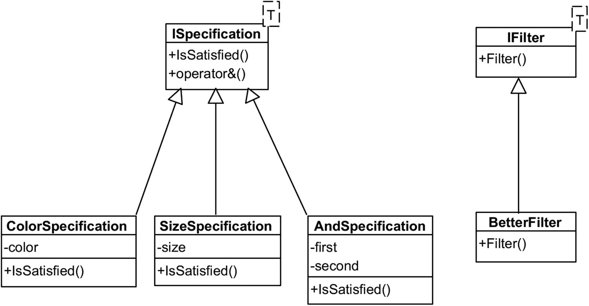

# 一、SOLID 设计原则

SOLID 是一个缩写词，代表以下设计原则(及其缩写):

*   单一责任原则

*   开闭原则(OCP)

*   利斯科夫替代原理

*   接口隔离原则(ISP)

*   从属倒置原则

这些原则是罗伯特·c·马丁在 21 世纪初提出的——事实上，它们只是罗伯特的书和博客中表达的几十条原则中的五条。这五个特殊的主题贯穿了对模式和软件设计的讨论，所以，在我们深入设计模式之前(我知道你们都很渴望)，我们将简要回顾一下 SOLID 原则是什么。

## 单一责任原则

假设你决定记下你最私密的想法。这本杂志有一个标题和许多条目。您可以如下建模:

```cs
public class Journal
{
  private readonly List<string> entries = new List<string>();
  // just a counter for total # of entries
  private static int count = 0;
}

```

现在，您可以添加向日志添加条目的功能，以条目在日志中的序号为前缀。您还可以拥有删除条目的功能(在下面以一种非常简单的方式实现)。这很简单:

```cs
public void AddEntry(string text)
{
  entries.Add($"{++count}: {text}");
}

public void RemoveEntry(int index)
{
  entries.RemoveAt(index);
}

```

该日志现在可以用作

```cs
var j = new Journal();
j.AddEntry("I cried today.");
j.AddEntry("I ate a bug.");

```

将该方法作为`Journal`类的一部分是有意义的，因为添加日志条目是日志实际需要做的事情。杂志的责任是记录条目，所以任何与之相关的事情都是公平的。

现在，假设您决定通过将日志保存到文件中来使其持久化。您将这段代码添加到`Journal`类中:

```cs
public void Save(string filename, bool overwrite = false)
{
  File.WriteAllText(filename, ToString());
}

```

这种方法是有问题的。日志的责任是*保存*日志条目，而不是将它们写到磁盘。如果您将持久性功能添加到`Journal`和类似的类中，持久性方法的任何改变(比如，您决定写入云而不是磁盘)都需要在每个受影响的类中进行许多微小的改变。

我想在这里暂停一下，提出一个观点:如果可能的话，通常最好避免让你不得不在很多类中做很多微小的改变的架构。现在，它实际上取决于具体情况:如果你正在重命名一个在上百个地方使用的符号，我认为这通常是可以的，因为 ReSharper、Rider 或任何你使用的 IDE 实际上会让你执行一次重构，并让变化传播到每个地方。但是当你需要完全重做一个界面的时候…嗯，那会变成一个非常痛苦的过程！

因此，我们声明持久性是一个单独的*关注点*，最好在一个单独的类中表达。我们使用术语*关注点分离*(遗憾的是，缩写 SoC 已经被采用 <sup>1</sup> )来讨论将代码按照功能划分到不同类的一般方法。在我们的例子中的持久性的情况下，我们会像这样将它外部化:

```cs
public class PersistenceManager
{
  public void SaveToFile(Journal journal, string filename,
                         bool overwrite = false)
  {
  if (overwrite || !File.Exists(filename))
    File.WriteAllText(filename, journal.ToString());
  }
}

```

这正是我们所说的*单一责任*的含义:每个类只有一个责任，因此也只有一个改变的理由。只有在条目的内存存储方面需要做更多的事情时，才需要改变；例如，您可能希望每个条目都有一个时间戳作为前缀，因此您可以更改`Add()`方法来做到这一点。另一方面，如果你想改变持久性机制，这将在`PersistenceManager`中改变。

违反 SRP 的反模式 <sup>2</sup> 的极端例子被称为*上帝对象*。一个 God 对象是一个巨大的类，它试图处理尽可能多的问题，成为一个很难处理的巨大怪物。严格地说，您可以将任何规模的任何系统放入一个类中，但通常情况下，您最终会得到一个无法理解的混乱局面。对我们来说幸运的是，God 对象很容易被视觉或自动识别(只需计算成员函数的数量)，由于持续集成和源代码控制系统，负责任的开发人员可以被快速识别并受到适当的惩罚。

## 开闭原理

假设我们在数据库中有一系列(完全假设的)产品。每个产品都有颜色和尺寸，定义如下:

```cs
public enum Color
{
  Red, Green, Blue
}

public enum Size
{
  Small, Medium, Large, Yuge
}

public class Product
{
  public string Name;
  public Color Color;
  public Size Size;

  public Product(string name, Color color, Size size)
  {
    // obvious things here
  }
}

```

现在，我们希望为一组给定的产品提供一定的过滤功能。我们制作一个`ProductFilter`服务类。为了支持按颜色过滤产品，我们实现如下:

```cs
public class ProductFilter
{
  public IEnumerable<Product> FilterByColor
    (IEnumerable<Product> products, Color color)
  {
    foreach (var p in products)
      if (p.Color == color)
        yield return p;
  }
}

```

我们目前通过颜色过滤项目的方法很好，虽然当然可以通过使用语言集成查询(LINQ)来大大简化。因此，我们的代码投入生产，但不幸的是，过了一段时间，老板进来要求我们也实现按大小过滤。所以我们跳回`ProductFilter.cs`，添加以下代码，并重新编译:

```cs
public IEnumerable<Product> FilterBySize
  (IEnumerable<Product> products, Size size)
{
  foreach (var p in products)
    if (p.Size == size)
      yield return p;
}

```

这感觉像是完全的复制，不是吗？为什么我们不写一个带谓词的通用方法呢？嗯，一个原因可能是不同形式的过滤可以以不同的方式完成:例如，一些记录类型可能被索引，需要以特定的方式进行搜索；有些数据类型适合在图形处理单元(GPU)上搜索，而有些则不适合。

此外，您可能希望限制可以过滤的标准。例如，如果您查看亚马逊或类似的在线商店，您只能根据有限的一组标准进行过滤。如果亚马逊发现，比如说，根据评论数量进行排序会影响底线，它可以增加或删除这些标准。

好了，我们的代码投入生产了，但是老板又一次回来告诉我们，现在需要同时使用尺寸*和颜色*进行搜索。那么，除了增加另一个功能，我们还能做什么呢？

```cs
public IEnumerable<Product> FilterBySizeAndColor(
  IEnumerable<Product> products,
  Size size, Color color)
{
  foreach (var p in products)
    if (p.Size == size && p.Color == color)
      yield return p;
}

```

从前面的场景来看，我们想要的是实施*开闭原则*，该原则声明类型对扩展是开放的，但对修改是封闭的。换句话说，我们希望过滤是可扩展的(可能在不同的程序集中)，而不必修改它(并重新编译已经工作并可能已经提供给客户机的东西)。

如何才能实现？嗯，首先我们概念上分开(SRP！)我们的过滤过程分为两个部分:一个过滤器(一个接受所有项目并只返回一些项目的构造)和一个规范(一个应用于数据元素的谓词)。

我们可以对规范接口做一个非常简单的定义:

```cs
public interface ISpecification<T>
{
  bool IsSatisfied(T item);
}

```

在这个接口中，类型`T`是我们选择的任何类型:它当然可以是`Product`，但也可以是其他类型。这使得整个方法可以重用。

接下来，我们需要一种基于`ISpecification<T>`的过滤方法；这是通过定义完成的，你猜对了，`an IFilter<T>`:

```cs
public interface IFilter<T>
{
  IEnumerable<T> Filter(IEnumerable<T> items,
                        ISpecification<T> spec);
}

```

同样，我们所做的只是为一个名为`Filter()`的方法指定签名，该方法接受所有项目和一个规范，并只返回那些符合规范的项目。

基于上述数据，改进滤波器的实现非常简单:

```cs
public class BetterFilter : IFilter<Product>
{
  public IEnumerable<Product> Filter(IEnumerable<Product> items,
                                     ISpecification<Product> spec)
  {
    foreach (var i in items)
      if (spec.IsSatisfied(i))
        yield return i;
  }
}

```

同样，您可以把传入的`ISpecification<T>`看作是`Predicate<T>`的强类型等价物，它有一组适合问题域的具体实现。

现在，这是最简单的部分。要制作滤色器，您需要制作一个`ColorSpecification`:

```cs
public class ColorSpecification : ISpecification<Product>
{
  private Color color;

  public ColorSpecification(Color color)
  {
    this.color = color;
  }

  public bool IsSatisfied(Product p)
  {
    return p.Color == color;
  }
}

```

有了这个规范，有了一个产品列表，我们现在可以对它们进行如下筛选:

```cs
var apple = new Product("Apple", Color.Green, Size.Small);
var tree = new Product("Tree", Color.Green, Size.Large);
var house = new Product("House", Color.Blue, Size.Large);

Product[] products = {apple, tree, house};

var pf = new ProductFilter();
WriteLine("Green products:");
foreach (var p in pf.FilterByColor(products, Color.Green))
  WriteLine($" - {p.Name} is green");

```

前面的代码得到了“苹果”和“树”，因为它们都是绿色的。现在，到目前为止我们唯一没有实现的是搜索尺寸*和*颜色(或者，实际上，解释了如何搜索尺寸*或*颜色，或者混合不同的标准)。答案是你简单地做一个*组合子*。例如，对于逻辑 AND，您可以使其如下所示:

```cs
public class AndSpecification<T> : ISpecification<T>
{
  private readonly ISpecification<T> first, second;

  public AndSpecification(ISpecification<T> first, ISpecification<T> second)
  {
    this.first = first;
    this.second = second;
  }

  public override bool IsSatisfied(T t)
  {
    return first.IsSatisfied(t) && second.IsSatisfied(t);
  }
}

```

而现在，你可以在更简单的`ISpecifications`的基础上自由创建复合条件。重用我们之前制定的`green`规范，找到绿色的大东西现在就像

```cs
foreach (var p in bf.Filter(products,
  new AndSpecification<Product>(
    new ColorSpecification(Color.Green),
    new SizeSpecification(Size.Large))))
{
  WriteLine($"{p.Name} is large and green");
}

// Tree is large and green

```

这需要很多代码来做一些看似简单的事情，但好处是值得的。唯一真正烦人的部分是必须为`AndSpecification`指定泛型参数——记住，与颜色/大小规格不同，组合子并不局限于`Product`类型。

请记住，由于 C# 的强大功能，您可以简单地为两个`ISpecification<T>`对象引入一个`operator &`(重要的是:这里是单个&符号，`&&`是副产品)，从而使过滤过程由两个(或更多！)标准稍微简单一些……唯一的问题是我们需要从一个接口变成一个抽象类(随意删除名字中的前导`I`)。

```cs
public abstract class ISpecification<T>
{
  public abstract bool IsSatisfied(T p);

  public static ISpecification<T> operator &(
    ISpecification<T> first, ISpecification<T> second)
  {
    return new AndSpecification<T>(first, second);
  }
}

```

如果现在避免为尺寸/颜色规格制造额外的变量，复合规格可以减少到单行 <sup>3</sup> :

```cs
var largeGreenSpec = new ColorSpecification(Color.Green)
                   & new SizeSpecification(Size.Large);

```

自然，您可以通过在所有可能的规范对上定义扩展方法来将这种方法发挥到极致:

```cs
public static class CriteriaExtensions
{
  public static AndSpecification<Product> And(this Color color, Size size)
  {
    return new AndSpecification<Product>(
      new ColorSpecification(color),
      new SizeSpecification(size));
  }
}

```

随着后续的使用

```cs
var largeGreenSpec = Color.Green.And(Size.Large);

```

然而，这将需要一组所有可能的标准，这并不太现实，当然，除非您使用代码生成。遗憾的是，C# 中没有办法在一个`enum Xxx`和一个`XxxSpecification`之间建立隐式关系。

这是我们刚刚构建的整个系统的示意图:



所以，让我们回顾一下什么是 OCP，以及这个例子是如何执行它的。基本上，OCP 指出，你不应该需要回到你已经编写和测试的代码，并改变它。这正是这里正在发生的事情！我们创建了`ISpecification<T>`和`IFilter<T>`，从那时起，我们所要做的就是实现其中一个接口(不需要修改接口本身)来实现新的过滤机制。这就是“开放供扩展，封闭供修改”的含义

值得注意的一点是，只有在面向对象的范例中，才可能符合 OCP。例如，F# 的受歧视的联合从定义上来说不符合 OCP，因为不修改它们的原始定义就不可能扩展它们。

## 利斯科夫替代原理

以 Barbara Liskov 命名的 Liskov 替换原则指出，如果一个接口接受一个类型为`Parent`的对象，那么它应该同样接受一个类型为`type Child`的对象，而不破坏任何东西。我们来看一个 LSP 坏掉的情况。

这是一个长方形。它有宽度和高度，还有一堆计算面积的 getters 和 setters:

```cs
public class Rectangle
{
  public int Width { get; set; }
  public int Height { get; set; }

  public Rectangle() {}
  public Rectangle(int width, int height)
  {
    Width = width;
    Height = height;
  }

  public int Area => Width * Height;
}

```

假设我们做了一种特殊的`Rectangle`叫做`Square`。这个对象覆盖设置器来设置宽度*和*高度:

```cs
public class Square : Rectangle
{
  public Square(int side)
  {
    Width = Height = side;
  }

  public new int Width
  {
    set { base.Width = base.Height = value; }
  }

  public new int Height
  {
    set { base.Width = base.Height = value; }
  }
}

```

这种做法就是*恶*。您还看不到它，因为它看起来确实非常无辜:设置器只是简单地设置了两个维度(因此正方形始终是正方形)，这可能会出错吗？好吧，假设我们引入一个利用`Rectangle`的方法:

```cs
public static void UseIt(Rectangle r)
{
  r.Height = 10;
  WriteLine($"Expected area of {10*r.Width}, got {r.Area}");
}

```

如果与`Rectangle`一起使用，这个方法看起来足够简单:

```cs
var rc = new Rectangle(2,3);
UseIt(rc);
// Expected area of 20, got 20

```

然而，无害的方法如果与`Square`一起使用，可能会产生严重的反效果:

```cs
var sq = new Square(5);
UseIt(sq);
// Expected area of 50, got 100

```

前面的代码将公式`Area = Width × Height`作为不变量。它获取宽度，将高度设置为 10，并正确地期望乘积等于计算的面积。但是用`Square`调用前面的函数得到的值是 100 而不是 50。我相信你能猜到这是为什么。

所以这里的问题是，尽管`UseIt()`很乐意接受任何一个`Rectangle`类，但它却无法接受一个`Square`，因为`Square`内部的行为破坏了它的操作。那么，你会如何解决这个问题呢？嗯，一种方法是简单地弃用`Square`类，并开始将某些`Rectangles`作为特例。例如，您可以引入一个`IsSquare`属性。

您可能还需要一种方法来检测`Rectangle`实际上是一个正方形:

```cs
public bool IsSquare => Width == Height;

```

类似地，代替构造函数，你可以引入工厂方法(参见“工厂”一章)来构造矩形和正方形，并且有相应的名字(例如，`NewRectangle()`和`NewSquare()`)，这样就不会有歧义。

就设置属性而言，在这种情况下，解决方案是引入一个统一的`SetSize(width,height)`方法并完全移除`Width/Height`设置器。这样，您就避免了通过 setter 设置高度的同时悄悄改变宽度的情况。

在我看来，这个矩形/正方形的挑战是一个极好的面试问题:它没有正确的答案，但允许许多解释和变化。

## 界面分离原理

哦，好吧，这里有另一个人为的例子，但仍然适合说明这个问题。假设您决定定义一台多功能打印机:一台可以打印、扫描以及传真文档的设备。所以你这样定义它:

```cs
class MyFavouritePrinter /* : IMachine */
{
  void Print(Document d) {}
  void Fax(Document d) {}
  void Scan(Document d) {}
};

```

这很好。现在，假设您决定定义一个接口，该接口需要由计划制造多功能打印机的每个人来实现。因此，您可以在您最喜欢的 IDE 中使用 Extract Interface 函数，您将得到如下内容:

```cs
public interface IMachine
{
  void Print(Document d);
  void Fax(Document d);
  void Scan(Document d);
}

```

这是一个问题。问题的原因是这个接口的一些实现者可能不需要扫描或传真，只需要打印。然而，您是在强迫他们实现那些额外的特性:当然，它们都可以是不可操作的，但是为什么要这么麻烦呢？

一个典型的例子是没有任何扫描或传真功能的老式打印机。在这种情况下实现`IMachine`接口成为一个真正的挑战。这种情况下特别令人沮丧的是，没有正确的方式让事情不被实现——这实际上是接口分离不良的一个很好的标志。我的意思是，当然，你可以抛出一个异常，我们甚至有一个专门的异常，正是为了这个目的:

```cs
public class OldFashionedPrinter : IMachine
{
  public void Print(Document d)
  {
    // yep
  }

  public void Fax(Document d)
  {
    throw new System.NotImplementedException();
  }

  public void Scan(Document d)
  {
    throw new System.NotImplementedException();
  }
}

```

但是你还是把用户搞糊涂了！他们可以将`OldFashionedPrinter.Fax()`视为 API 的一部分，所以他们认为这种类型的打印机也可以传真是情有可原的！所以你还能做什么？嗯，你可以把多余的方法留为 no-op(空)，就像前面的`Scan()`方法一样。同样，这种方法违反了*最小惊奇原则*:你的用户希望事情尽可能的可预测。无论是默认抛出的方法还是什么都不做的方法都不是最可预测的解决方案——即使您在文档中明确说明了这一点！

在编译时唯一可行的选择是将所有不必要的方法标记为过时的核心选项:

```cs
[Obsolete("Not supported", true)]
public void Scan(Document d)
{
  throw new System.NotImplementedException();
}

```

如果有人试图使用`OldFashionedPrinter.Scan()`，这将阻止编译。事实上，好的 ide 会提前意识到这一点，并且经常会在您调用该方法时删除它，以表明它不会工作。这种方法的唯一问题是它非常不通顺:这种方法不是真的过时了，而是没有实现。别再对客户撒谎了！

因此，接口分离原则建议您做的是拆分接口，以便实现者可以根据他们的需求进行挑选。由于打印和扫描是不同的操作(例如，扫描仪不能打印)，我们为它们定义了单独的接口:

```cs
public interface IPrinter
{
  void Print(Document d);
}

public interface IScanner
{
  void Scan(Document d);
}

```

然后，打印机可以只实现*和*所需的功能，其他什么都不做:

```cs
public class Printer : IPrinter
{
  public void Print(Document d)
  {
    // implementation here
  }
}

```

类似地，如果我们想要实现复印机，我们可以通过实现`IPrinter`和`IScanner`接口来实现:

```cs
public class Photocopier : IPrinter, IScanner
{
  public void Print(Document d) { ... }
  public void Scan(Document d) { ... }
}

```

现在，如果我们真的想要一个多功能设备的专用接口，我们可以将其定义为上述接口的组合:

```cs
public interface IMultiFunctionDevice
  : IPrinter, IScanner // also IFax etc.
{
  // nothing here
}

```

当您为多功能设备创建一个类时，这是要使用的接口。例如，您可以使用简单的委托来确保`Machine`重用由特定的`IPrinter`和`IScanner`提供的功能(这实际上是装饰模式的一个很好的例子):

```cs
public class MultiFunctionMachine : IMultiFunctionDevice
{
  // compose this out of several modules
  private IPrinter printer;
  private IScanner scanner;

  public MultiFunctionMachine(IPrinter printer, IScanner scanner)
  {
    this.printer = printer;
    this.scanner = scanner;
  }

  public void Print(Document d)
  {
    printer.Print(d);
  }

  public void Scan(Document d)
  {
    scanner.Scan(d);
  }
}

```

所以，简单重述一下，这里的想法是将复杂接口的各个部分分离成单独的接口，以避免强迫客户实现他们并不真正需要的功能。任何时候，当你为某个复杂的应用编写插件时，你会得到一个有 20 种令人困惑的方法的接口，要用各种各样的 no-ops 和`return null`来实现，很可能 API 作者已经违反了 ISP。

### 参数对象

当我们谈论接口时，我们通常会谈论`interface`关键字，但 ISP 的本质也可以应用于一个更加局部的现象:传统意义上的接口，例如，由构造函数公开的参数列表。

考虑一个(完全任意的)带有大量参数的构造函数的例子。这些参数中的大多数都有默认值，但有些没有:

```cs
public class Foo
{
  public Foo(int a, int b, bool c = false, int d = 42, float e = 1.0f)
  {
    // meaningful code here
  }
}

```

这里构造函数的接口的问题是，它向一个毫无戒心的客户端抛出了很多东西。如果客户必须提供参数`a`、`b`和`e`，情况会变得更加滑稽，因为这样他们会不必要地重复一些默认设置。

在这种情况下，ISP 的核心原则(不要把所有东西都扔进一个接口)在这里也有意义，尽管原因不同。你需要提供一组合理的输入，让用户避免任何额外的麻烦。

任何有自尊的 IDE 都为您提供了参数对象重构功能——一种将所有参数放入一个类中并保留所有默认值的能力:

```cs
public class MyParams
{
  public int a;
  public int b;
  public bool c = false;
  public int d = 42;
  public float e = 1.0f;

  public MyParams(int a, int b)
  {
    this.a = a;
    this.b = b;
  }
}

```

然后这个参数对象将被传递到`Foo`的构造函数中:

```cs
public Foo(MyParams myParams)
{
  // meaningful work here
}

```

注意`MyParams`是如何制作的:它有自己的构造函数，要求您初始化前两个参数，但它也公开了其他参数供您任意初始化。

我想说的是:原则和模式不一定要在宏观(类)尺度上运行——它们在微观尺度上运行也足够好。

## 从属倒置原则

依赖性反转原则的原始定义陈述如下 <sup>4</sup> :

1.  *高层模块不应该依赖低层模块。两者都应该依赖于抽象。*

    这句话的基本意思是，如果您对日志感兴趣，您的报告组件不应该依赖于具体的`ConsoleLogger`，而是可以依赖于`ILogger`接口。在这种情况下，我们认为报告组件是高级的(更接近于业务领域)，而日志记录是一个基本问题(有点像文件 I/O 或线程，但不完全是)，被认为是一个低级模块。

2.  抽象不应该依赖于细节。细节应该依赖于抽象。

    这再次重申了对接口或基类的依赖优于对具体类型的依赖。希望这种说法的真实性是显而易见的，因为这样的方法支持更好的可配置性和可测试性…特别是如果您正在使用一个好的框架来为您处理这些依赖性。

让我们来看一个 DIP 的例子。假设我们决定使用以下定义来模拟人与人之间的谱系关系:

```cs
public enum Relationship
{
  Parent,
  Child,
  Sibling
}

public class Person
{
  public string Name;
  // DoB and other useful properties here
}

```

我们可以创建一个专门用于存储关系信息的(低级)类。它看起来会像下面这样:

```cs
public class Relationships // low-level
{
  public List<(Person,Relationship,Person)> relations
    = new List<(Person, Relationship, Person)>();

  public void AddParentAndChild(Person parent, Person child)
  {
    relations.Add((parent, Relationship.Parent, child));
    relations.Add((child, Relationship.Child, parent));
  }
}

```

现在，假设我们想对我们捕捉到的关系做一些研究。例如，为了找到 John 的所有孩子，我们创建以下(高级)类:

```cs
public class Research
{
  public Research(Relationships relationships)
  {
    // high-level: find all of John's children
    var relations = relationships.Relations;
    foreach (var r in relations
      .Where(x => x.Item1.Name == "John"
               && x.Item2 == Relationship.Parent))
    {
      WriteLine($"John has a child called {r.Item3.Name}");
    }
  }
}

```

这里说明的方法直接违反了 DIP，因为高级模块`Research`直接依赖于低级模块`Relationships`。为什么这样不好？因为`Research`直接依赖于`Relationships`的数据存储实现:你可以看到它在迭代元组列表。如果您以后想要改变`Relationships`的底层存储，也许是通过将它从元组列表移动到适当的数据库，该怎么办呢？你不能，因为你有依赖它的高级模块。

那么我们想要什么？我们希望我们的高级模块依赖于一个*抽象*，用 C# 术语来说，这意味着依赖于某种接口。但是我们还没有界面！没问题，让我们创建一个:

```cs
public interface IRelationshipBrowser
{
  IEnumerable<Person> FindAllChildrenOf(string name);
}

```

这个接口有一个单一的方法，可以通过名字找到某个人的所有孩子。我们希望像`Relationships`这样的低级模块能够实现这个方法，从而保持其实现细节的私密性:

```cs
public class Relationships : IRelationshipBrowser // low-level
{
  // no longer public!
  private List<(Person,Relationship,Person)> relations
    = new List<(Person, Relationship, Person)>();

  public IEnumerable<Person> FindAllChildrenOf(string name)
  {
    return relations
      .Where(x => x.Item1.Name == name
               && x.Item2 == Relationship.Parent)
      .Select(r => r.Item3);
  }
}

```

这是我们的`Research`模块可以依赖的东西！我们可以将一个`IRelationshipBrowser`注入到它的构造函数中，并安全地执行研究，而无需深入底层模块的内部:

```cs
public Research(IRelationshipBrowser browser)
{
  foreach (var p in browser.FindAllChildrenOf("John"))
  {
    WriteLine($"John has a child called {p.Name}");
  }
}

```

请注意，DIP 并不等同于依赖注入，这本身就是另一个重要的话题。DI 可以通过简化依赖关系的表示来促进 DIP 的应用，但是这两个是不同的概念。

<aside aria-label="Footnotes" class="FootnoteSection" epub:type="footnotes">Footnotes 1

SoC 是 System on a Chip 的缩写，是一种集成了计算机所有(或大部分)方面的微处理器。

  2

一个*反模式*是一个设计模式，不幸的是，它也经常出现在代码中，足以被全球认可。模式和反模式的区别在于，反模式通常是糟糕设计的模式，导致代码难以理解、维护和重构。

  3

注意，我们在评估中使用了一个`&`。如果您想使用`&&`，您还需要覆盖`ISpecification`中的`true`和`false`操作符。

  4

Martin，Robert C. (2003)，*敏捷软件开发，原则，模式和实践*，Prentice Hall，第 127–131 页。

 </aside>