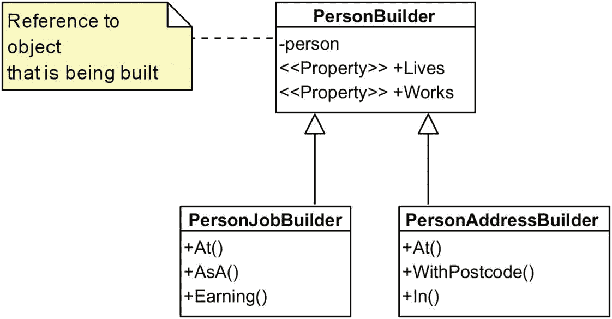

# 三、构建器

构建器模式与复杂的对象的创建有关，也就是说，不能在一行构造器调用中构建的对象。这些类型的对象本身可能由其他对象组成，并且可能包含不太明显的逻辑，因此需要一个专门用于对象构造的单独组件。

我想值得预先注意的是，虽然我说过构建器关注的是复杂的对象，但我们将看一个相当简单的例子。这样做纯粹是为了优化空间，因此领域逻辑的复杂性不会影响读者理解模式的实际实现。

## 方案

假设我们正在构建一个呈现网页的组件。一个页面可能只包含一个段落(让我们暂时忘记所有典型的 HTML 陷阱)，要生成它，您可能需要编写如下代码:

```cs
var hello = "hello";
var sb = new StringBuilder();
sb.Append("<p>");
sb.Append(hello);
sb.Append("</p>");
WriteLine(sb);

```

这是一些严重的过度工程，Java 风格，但它是一个很好的例子，说明了我们已经在。NET 框架:`StringBuilder`！当然,`StringBuilder`是一个独立的组件，用于连接字符串。它有一些实用的方法，比如`AppendLine()`，所以你可以添加文本和换行符(如`Enrivonment.NewLine`)。但是`StringBuilder`真正的好处是，与导致大量临时字符串的字符串连接不同，它只是分配一个缓冲区，并用追加的文本填充它。

那么，我们尝试输出一个简单的无序(项目符号)列表，其中有两项包含单词 *hello* 和 *world* 怎么样？一个非常简单的实现可能如下所示:

```cs
var words = new[] { "hello", "world" };
sb.Append("<ul>");
foreach (var word in words)
{
  sb.AppendFormat("<li>{0}</li>", word);
}
sb.Append("</ul>");
WriteLine(sb);

```

这实际上给了我们想要的东西，但是这种方法不太灵活。我们如何将这个列表从项目符号列表变成编号列表呢？在列表被创建后，我们如何添加另一个项目*？显然，在我们这个严格的方案中，一旦`StringBuilder`被初始化，这是不可能的。*

因此，我们可以走 OOP 路线，定义一个`HtmlElement`类来存储关于每个 HTML 标签的信息:

```cs
class HtmlElement
{
  public string Name, Text;
  public List<HtmlElement> Elements = new List<HtmlElement>();
  private const int indentSize = 2;

  public HtmlElement() {}
  public HtmlElement(string name, string text)
  {
    Name = name;
    Text = text;
  }
}

```

这个类模拟了一个单独的 HTML 标签，它有一个名字，也可以包含文本或者一些孩子，这些孩子本身就是`HtmlElement`的。使用这个方法，我们现在可以用一种更合理的方式创建我们的列表:

```cs
var words = new[] { "hello", "world" };
var tag = new HtmlElement("ul", null);
foreach (var word in words)
  tag.Elements.Add(new HtmlElement("li", word));
WriteLine(tag); // calls tag.ToString()

```

这工作得很好，给了我们一个更可控的、OOP 驱动的项目列表的表示。它还极大地简化了其他操作，如删除条目。但是构建每个`HtmlElement`的过程不是很方便，特别是如果这个元素有子元素或者有一些特殊的需求。因此，我们转向构建器模式。

## 简单生成器

Builder 模式只是试图将对象的分段构造外包给一个单独的类。我们的第一次尝试可能会产生这样的结果:

```cs
class HtmlBuilder
{
  protected readonly string rootName;
  protected HtmlElement root = new HtmlElement();

  public HtmlBuilder(string rootName)
  {
    this.rootName = rootName;
    root.Name = rootName;
  }

  public void AddChild(string childName, string childText)
  {
    var e = new HtmlElement(childName, childText);
    root.Elements.Add(e);
  }

  public override string ToString() => root.ToString();
}

```

这是一个构建 HTML 元素的专用组件。构建器的构造器接受一个`rootName`，它是正在构建的根元素的名称:如果我们正在构建一个无序列表，它可以是`"ul"`，如果我们正在创建一个段落，它可以是`"p"`，等等。在内部，我们将根存储为一个`HtmlElement`，并在构造函数中赋予它的`Name`。但是我们也保持`rootName`不变，所以如果我们想的话，我们可以在以后重置构建器。

`AddChild()`方法是用于向当前元素添加更多子元素的方法，每个子元素被指定为一个名称-文本对。它可以按如下方式使用:

```cs
var builder = new HtmlBuilder("ul");
builder.AddChild("li", "hello");
builder.AddChild("li", "world");
WriteLine(builder.ToString());

```

你会注意到，此时，`AddChild()`方法是`void`-返回。我们可以使用返回值做很多事情，但返回值最常见的用途之一是帮助我们构建一个流畅的界面。

## 流畅的构建器

让我们将`AddChild()`的定义更改如下:

```cs
public HtmlBuilder AddChild(string childName, string childText)
{
  var e = new HtmlElement(childName, childText);
  root.Elements.Add(e);
  return this;
}

```

通过返回对构建器本身的引用，现在可以链接构建器调用。这就是所谓的*流畅界面*:

```cs
var builder = new HtmlBuilder("ul");
builder.AddChild("li", "hello").AddChild("li", "world");
WriteLine(builder.ToString());

```

返回`this`的“一个简单的技巧”允许您构建接口，将几个操作塞进一个语句中。注意`StringBuilder`本身也公开了一个 fluent 接口。流畅的界面通常很好，但是制作使用它们的装饰器(例如，使用自动化工具，如 ReSharper 或 Rider)可能是个问题——我们稍后会遇到这个问题。

## 传达意图

我们为 HTML 元素实现了一个专用的构建器，但是我们类的用户如何知道如何使用它呢？一个想法是简单地*强迫*他们在构建一个对象时使用构建器。你需要做的是:

```cs
class HtmlElement
{
  protected string Name, Text;
  protected List<HtmlElement> Elements = new List<HtmlElement>();
  protected const int indentSize = 2;

  // hide the constructors!
  protected HtmlElement() {}
  protected HtmlElement(string name, string text)
  {
    Name = name;
    Text = text;
  }

  // factory method
  public static HtmlBuilder Create(string name) => new HtmlBuilder(name);
}

```

我们的方法是双管齐下的。首先，我们隐藏了所有的构造函数，所以它们不再可用。我们还隐藏了构建器本身的实现细节，这是我们以前没有做过的。然而，我们已经创建了一个工厂方法(这是一个我们将在后面讨论的设计模式),用于从`HtmlElement`中创建一个构建器。这也是一个静态方法！下面是如何使用它的方法:

```cs
var builder = HtmlElement.Create("ul");
builder.AddChild("li", "hello")
       .AddChild("li", "world");
WriteLine(builder);

```

在前面的例子中，我们是*强迫*客户端使用静态`Create()`方法，因为，嗯，确实没有其他方法来构造`HtmlElement`——毕竟，所有的构造器都是`protected`。所以客户机创建了一个`HtmlBuilder`，然后被迫在对象的构造中与它交互。清单的最后一行只是打印正在构造的对象。

但是我们不要忘记，我们的最终目标是建造一个`HtmlElement`，到目前为止我们还没有办法实现它！因此，锦上添花可以是构建器上的`implicit operator HtmlElement`的实现，以产生最终值:

```cs
protected HtmlElement root = new HtmlElement();

public static implicit operator HtmlElement(HtmlBuilder builder)
{
  return builder.root;
}

```

运算符的添加允许我们编写以下内容:

```cs
HtmlElement root = HtmlElement
  .Create("ul")
  .AddChildFluent("li", "hello")
  .AddChildFluent("li", "world");
WriteLine(root);

```

遗憾的是，没有办法明确地告诉其他用户以这种方式使用 API。希望对构造函数的限制以及静态`Create()`方法的出现鼓励用户使用构造函数，但是，除了操作符，给`HtmlBuilder`本身添加一个相应的`Build()`函数也是有意义的:

```cs
public HtmlElement Build() => root;

```

## 复合助洗剂

让我们通过一个使用多个构建器来构建一个对象的例子来继续讨论构建器模式。这种场景适用于构建过程非常复杂的情况，以至于构建者本身受到单一责任原则的约束，并且需要被分割成更小的部分。

假设我们决定记录一个人的一些信息:

```cs
public class Person
{
  // address
  public string StreetAddress, Postcode, City;

  // employment info
  public string CompanyName, Position;
  public int AnnualIncome;
}

```

`Person`有两个方面:他们的地址和就业信息。如果我们想为每一个都有单独的构建器，那该怎么办呢——我们如何提供最方便的 API 呢？为此，我们将构建一个复合构建器。这个构造并不简单，所以要注意:即使我们需要两个独立的构造器来处理工作和地址信息，我们也会产生不少于*三个*不同的类。

我们称第一节课为`PersonBuilder`:

```cs
public class PersonBuilder
{
  // the object we're going to build
  protected Person person; // this is a reference!

  public PersonBuilder() => person = new Person();
  protected PersonBuilder(Person person) => this.person = person;

  public PersonAddressBuilder Lives => new PersonAddressBuilder(person);
  public PersonJobBuilder Works => new PersonJobBuilder(person);

  public static implicit operator Person(PersonBuilder pb)
  {
    return pb.person;
  }
}

```

这比我们之前的简单构建器要复杂得多，所以让我们依次讨论每个成员:

*   引用`person`是对正在构建的对象的引用。这个字段被标记为`protected`，这是为子构建器特意做的。值得注意的是，这种方法只对引用类型有效——如果`person`是一个`struct`，我们将会遇到不必要的重复。

*   `Lives`和`Works`是返回构建器方面的属性:分别初始化地址和雇佣信息的子构建器。

*   是我们以前用过的一个技巧。

需要注意的非常重要的一点是构造函数:我们只在公共的、无参数的构造函数中这样做，而不是到处都用一个`new Person()`初始化`person`引用。还有另一个构造函数接受引用并保存它——这个构造函数被设计为由继承者使用，而不是由客户端使用，这就是它受到保护的原因。这样设置的原因是，每次使用构建器时，即使使用了子构建器，也只能实例化一次`Person`。

现在，让我们来看看子构建器类的实现:

```cs
public class PersonAddressBuilder : PersonBuilder
{
  public PersonAddressBuilder(Person person) : base(person)
  {
    this.person = person;
  }

  public PersonAddressBuilder At(string streetAddress)
  {
    person.StreetAddress = streetAddress;
    return this;
  }

  public PersonAddressBuilder WithPostcode(string postcode)
  {
    person.Postcode = postcode;
    return this;
  }

  public PersonAddressBuilder In(string city)
  {
    person.City = city;
    return this;
  }
};

```

如你所见，`PersonAddressBuilder`为建立一个人的地址提供了一个流畅的界面。注意，它实际上是从`PersonBuilder`继承了(意味着它获得了`Lives`和`Works`属性)。它有一个构造器，接受并存储对正在被构造的对象的引用，所以当你使用这些子构造器时，你总是只处理一个`Person`的实例——你不会意外地产生多个实例。调用基本构造函数是*关键的*——如果不是，子构建器将自动调用无参数构造函数，导致额外`Person`实例的不必要实例化。

正如您所猜测的，`PersonJobBuilder`是以相同的方式实现的，所以我在这里省略了它。

现在，您期待已久的时刻到了——这些建筑商的一个实例:

```cs
var pb = new PersonBuilder();
Person person = pb
  .Lives
    .At("123 London Road")
    .In("London")
    .WithPostcode("SW12BC")
  .Works
    .At("Fabrikam")
    .AsA("Engineer")
    .Earning(123000);

WriteLine(person);
// StreetAddress: 123 London Road, Postcode: SW12BC, City: London,
// CompanyName: Fabrikam, Position: Engineer, AnnualIncome: 123000

```

你能看到这里发生了什么吗？我们创建一个构建器，然后使用`Lives`属性得到一个`PersonAddressBuilder`，但是一旦我们完成了地址信息的初始化，我们只需调用`Works`并切换到使用一个`PersonJobBuilder`来代替。如果你需要我们刚才所做的直观演示，这并不复杂:



当我们完成构建过程时，我们使用与之前相同的隐式转换技巧来将正在构建的对象作为`Person`。或者，您可以调用`Build()`来获得相同的结果。

这种方法有一个相当明显的缺点:它不可扩展。一般来说，一个基类知道自己的子类是一个坏主意，然而这正是这里所发生的—`PersonBuilder`通过特殊的 API 公开自己的子类来知道它们。如果你想有一个额外的子建造者(比如说，一个`PersonEarningsBuilder`)，你必须打破 OCP，直接编辑`PersonBuilder`；你不能简单地子类化它来添加一个接口成员。

## 构建器参数

正如我所演示的，强制客户端使用构建器而不是直接构造对象的唯一方法是使对象的构造函数不可访问。但是，在某些情况下，您希望从一开始就明确地强制用户与构建器进行交互，甚至可能隐藏他们实际构建的对象。

例如，假设您有一个用于发送电子邮件的 API，其中每封电子邮件的内部描述如下:

```cs
public class Email
{
  public string From, To, Subject, Body;
  // other members here
}

```

注意，我在这里说的是内部的*——你不想让用户直接与这个类交互，可能是因为其中存储了一些额外的服务信息。保持它的公共性是很好的，只要你不公开允许客户端直接发送`Email`的 API。电子邮件的某些部分(如`Subject`)是可选的，所以对象不必完全指定。*

您决定实现一个流畅的构建器，人们将使用它在幕后构建一个`Email`。它可能如下所示:

```cs
public class EmailBuilder
{
  private readonly Email email;
  public EmailBuilder(Email email) => this.email = email;

  public EmailBuilder From(string from)
  {
    email.From = from;
    return this;
  }

  // other fluent members here
}

```

现在，为了强制客户端只使用构建器来发送电子邮件，您可以实现如下的邮件服务:

```cs
public class MailService
{
  public class EmailBuilder { ... }

  private void SendEmailInternal(Email email) {}

  public void SendEmail(Action<EmailBuilder> builder)
  {
    var email = new Email();
    builder(new EmailBuilder(email));
    SendEmailInternal(email);
  }
}

```

如您所见，客户端应该使用的`SendEmail()`方法接受一个函数，而不仅仅是一组参数或一个预先打包的对象。这个函数接受一个`EmailBuilder`，然后使用构建器来构建消息体。一旦完成，我们使用`MailService`的内部机制来处理一个完全初始化的`Email`。

您会注意到这里有一个巧妙的花招:构建器不是在内部存储对电子邮件的引用，而是在构造函数参数中获取该引用。我们这样实现它的原因是为了让`EmailBuilder`不必在其 API 的任何地方公开暴露一个`Email`。

从客户的角度来看，这个 API 的用法如下:

```cs
var ms = new MailService();
ms.SendEmail(email => email.From("foo@bar.com")
                           .To("bar@baz.com")
                           .Body("Hello, how are you?"));

```

简而言之，构建器参数方法迫使 API 的消费者使用构建器，不管他们喜不喜欢。我们使用的这个`Action`技巧确保了客户端有办法接收已经初始化的构建器对象。

## 带有递归泛型的生成器扩展

一个有趣的问题是继承的问题，这个问题不仅影响到 fluent 构建器，而且影响到任何带有 fluent 接口的类。一个流利的构建者从另一个流利的构建者那里继承有可能吗(也是现实的)？是的，但是不容易。

问题就在这里。假设您从以下(非常简单的)想要构建的对象开始:

```cs
public class Person
{
  public string Name;
  public string Position;
}

```

您创建了一个基类构建器来帮助构建`Person`对象:

```cs
public abstract class PersonBuilder
{
  protected Person person = new Person();
  public Person Build()
  {
    return person;
  }
}

```

接着是一个指定`Person`名称的专用类:

```cs
public class PersonInfoBuilder : PersonBuilder
{
  public PersonInfoBuilder Called(string name)
  {
    person.Name = name;
    return this;
  }
}

```

这是可行的，绝对没有问题。但是现在，假设我们决定子类化`PersonInfoBuilder`来指定雇佣信息。您可能会这样写:

```cs
public class PersonJobBuilder : PersonInfoBuilder
{
  public PersonJobBuilder WorksAsA(string position)
  {
    person.Position = position;
    return this;
  }
}

```

可悲的是，我们现在破坏了流畅的界面，使整个设置不可用:

```cs
var me = Person.New
  .Called("Dmitri")  // returns PersonInfoBuilder
  .WorksAsA("Quant") // will not compile
  .Build();

```

为什么前面的代码无法编译？很简单:`Called()`返回`this`，是一个`PersonInfoBuilder`类型的对象；那个对象根本没有`WorksAsA()`方法！

您可能认为这种情况是没有希望的，但事实并非如此:您可以在考虑继承的情况下设计流畅的 API，但这会有点棘手。让我们看看重新设计`PersonInfoBuilder`类会涉及到什么。这是它的新化身:

```cs
public class PersonInfoBuilder<SELF> : PersonBuilder
  where SELF : PersonInfoBuilder<SELF>
{
  public SELF Called(string name)
  {
    person.Name = name;
    return (SELF) this;
  }
}

```

如果您不熟悉递归泛型，前面的代码可能会让人不知所措，所以让我们讨论一下我们实际做了什么以及为什么。

首先，我们本质上引入了一个新的通用参数，`SELF`。更让人好奇的是，这个`SELF`被指定为`PersonInfoBuilder<SELF>`的传承人；换句话说，该类的泛型参数需要从这个确切的类继承。这看起来很疯狂，但实际上是在 C# 中进行 CRTP 式继承的一个非常流行的技巧。本质上，我们正在实施一个继承链:我们说只有当`Foo`从`Bar`派生出来的时候`Foo<Bar>`才是一个可接受的专门化，其他所有情况都不符合`where`约束。

流畅接口继承中最大的问题是能够返回对你当前所在类的引用，即使你正在调用一个*基类*的流畅接口成员。有效传播这一点的唯一方法是拥有一个贯穿整个继承层次结构的通用参数(`SELF`)。

为了理解这一点，我们还需要看看`PersonJobBuilder`:

```cs
public class PersonJobBuilder<SELF>
  : PersonInfoBuilder<PersonJobBuilder<SELF>>
  where SELF : PersonJobBuilder<SELF>
{
  public SELF WorksAsA(string position)
  {
    person.Position = position;
    return (SELF) this;
  }
}

```

看它的基类！它不像以前那样只是一辆普通的`PersonInfoBuilder`，而是一辆`PersonInfoBuilder<PersonJobBuilder<SELF>>`！因此，当我们从一个`PersonInfoBuilder`继承时，我们将它的`SELF`设置为`PersonJobBuilder<SELF>`，这样它的所有流畅接口都返回正确的类型，*而不是*只是所属类的类型。

这有道理吗？如果没有，花点时间再看一遍源代码。在这里，我们来测试一下你的理解:假设我引入另一个名为`DateOfBirth`的成员和一个对应的`PersonDateOfBirthBuilder`，它会从哪个类继承？

如果你回答了

```cs
PersonInfoBuilder<PersonJobBuilder<PersonBirthDateBuilder<SELF>>>

```

那你就错了，但我不能责怪你的尝试。想想看:`PersonJobBuilder`*已经是*的一个`PersonInfoBuilder`了，所以这个信息不需要作为继承类型列表的一部分被显式地重述。相反，您应该按如下方式定义生成器:

```cs
public class PersonBirthDateBuilder<SELF>
  : PersonJobBuilder<PersonBirthDateBuilder<SELF>>
  where SELF : PersonBirthDateBuilder<SELF>
{
  public SELF Born(DateTime dateOfBirth)
  {
    person.DateOfBirth = dateOfBirth;
    return (SELF)this;
  }
}

```

我们的最后一个问题是:我们如何实际构建这样一个生成器，考虑到它总是采用一个通用的参数。嗯，恐怕你现在需要一个新的*型*，而不仅仅是一个变量。因此，例如，`Person.New`(开始构造过程的属性)的实现可以如下实现:

```cs
public class Person
{
  public class Builder : PersonJobBuilder<Builder>
  {
    internal Builder() {}
  }

  public static Builder New => new Builder();

  // other members omitted
}

```

这可能是最烦人的实现细节:事实上，你需要有一个递归泛型类型的非泛型继承才能使用它。

也就是说，将所有东西放在一起，您现在可以使用构建器，利用继承链中的所有方法:

```cs
var builder = Person.New
  .Called("Natasha")
  .WorksAsA("Doctor")
  .Born(new DateTime(1981, 1, 1));

```

## 惰性函数生成器

前面使用递归泛型的例子需要做大量的工作。一个合理的问题是:继承应该被用来扩展构建器吗？毕竟，我们可以使用扩展方法来代替。

如果我们采用函数式方法，实现会变得简单很多，不需要递归泛型。让我们再次构建一个定义如下的`Person`类:

```cs
public class Person
{
  public string Name, Position;
}

```

这一次，我们将定义一个*惰性*构建器，它只在调用其`Build()`方法时构造对象。在此之前，它将简单地保存一个在构建对象时需要执行的`Action`列表:

```cs
public sealed class PersonBuilder
{
  private readonly List<Func<Person, Person>> actions =
    new List<Func<Person, Person>>();

  public PersonBuilder Do(Action<Person> action)
    => AddAction(action);

  public Person Build()
    => actions.Aggregate(new Person(), (p, f) => f(p));

  private PersonBuilder AddAction(Action<Person> action)
  {
    actions.Add(p => { action(p); return p; });
    return this;
  }
}

```

想法很简单:我们不需要一调用任何构建器方法就修改可变的“构造中的对象”,而是简单地存储一个每当有人调用`Build()`时需要应用于对象的动作列表。但是在我们的实现中还有额外的复杂性。

第一个是对人采取的动作，虽然作为一个`Action<T>`参数，但实际上是作为一个`Func<T,T>`存储的。背后的动机是提供这个流畅的接口，我们允许`Build()`内部的`Aggregate()`调用正确工作。当然，我们可以用一辆老式的`ForEach()`来代替。

第二个复杂因素是，为了允许符合 OCP 标准的可扩展性，我们真的不想将`actions`公开为公共成员，因为这将允许列表上太多的操作(例如，任意移除),我们不一定希望在将来向扩展该构建器的任何人公开这些操作。相反，我们只公开一个操作，`Do()`，它允许您指定要对正在构建的对象执行的操作。然后，该操作被添加到整个操作集中。

在这个范例下，我们现在可以给这个构建器一个具体的方法来指定一个`Person`的名字:

```cs
public PersonBuilder Called(string name)
  => Do(p => p.Name = name);

```

但是现在，由于构建器的构造方式，我们可以使用扩展方法而不是继承来为构建器提供额外的功能，例如指定一个人的位置的能力:

```cs
public static class PersonBuilderExtensions
{
  public static PersonBuilder WorksAs
    (this PersonBuilder builder, string position)
    => builder.Do(p => p.Position = position);
}

```

使用这种方法，没有继承问题，也没有递归魔法。任何时候我们想要额外的行为，我们简单地添加它们作为扩展方法，保持对 OCP 的坚持。

下面是如何使用这种设置:

```cs
var person = new PersonBuilder()
  .Called("Dmitri")
  .WorksAs("Programmer")
  .Build();

```

严格地说，前面的函数方法可以成为一个可重用的通用基类，用于构建不同的对象。唯一的问题是，您必须将派生类型传播到基类中，这又一次需要递归泛型。您可以将基数`FunctionalBuilder`定义为

```cs
public abstract class FunctionalBuilder<TSubject, TSelf>
  where TSelf: FunctionalBuilder<TSubject, TSelf>
  where TSubject : new()
{
  private readonly List<Func<TSubject, TSubject>> actions
    = new List<Func<TSubject, TSubject>>();

  public TSelf Do(Action<TSubject> action)
    => AddAction(action);

  private TSelf AddAction(Action<TSubject> action)
  {
    actions.Add(p => {
      action(p);
      return p;
    });
    return (TSelf) this;
  }

  public TSubject Build()
    => actions.Aggregate(new TSubject(), (p, f) => f(p));
}

```

现在将`PersonBuilder`简化为

```cs
public sealed class PersonBuilder
  : FunctionalBuilder<Person, PersonBuilder>
{
  public PersonBuilder Called(string name)
    => Do(p => p.Name = name);
}

```

而`PersonBuilderExtensions`类保持原样。使用这种方法，您可以轻松地重用`FunctionalBuilder`作为应用中其他函数构建器的基类。请注意，在函数范式下，我们仍然坚持派生的构建器都是`sealed`并通过使用扩展方法来扩展的想法。

## F# 中的 DSL 构造

许多编程语言(如 Groovy、Kotlin 或 F#)都试图引入一种语言特性来简化创建 DSL(特定于领域的语言)的过程，即帮助描述特定问题领域的小型语言。这种嵌入式 DSL 的许多应用被用来实现构建器模式。例如，如果你想建立一个 HMTL 页面，你不必直接摆弄类和方法；相反，你可以用你的代码写一些非常接近 HTML 的东西！

在 F# 中实现这一点的方法是使用列表理解:定义列表而不需要显式调用构建器方法的能力。例如，如果您想要支持 HTML 段落和图像，您可以定义以下生成器函数:

```cs
let p args =
  let allArgs = args |> String.concat "\n"
  ["<p>"; allArgs; "</p>"] |> String.concat "\n"

let img url = ""

```

注意，`img`标签只有一个文本参数，而`<p>`标签接受一系列的`args`，允许它包含任意数量的内部 HTML 元素，包括普通的纯文本。因此，我们可以构建一个包含文本和图像的段落:

```cs
let html =
  p [
    "Check out this picture";
    img "pokemon.com/pikachu.png"
  ]
printfn "%s" html

```

这会产生以下输出:

```cs
<p>
Check out this picture

</p>

```

这种方法用于 web 框架，如 WebSharper。这种方法有许多变体，包括记录类型的使用(让人们使用花括号而不是列表)、指定纯文本的自定义操作符等等。 <sup>[2](#Fn2)</sup>

需要注意的是，只有当我们使用不可变的、只追加的结构时，这种方法才是方便的。一旦你开始处理可变的对象(例如，使用 DSL 来构造微软项目文档的定义)，你最终会回到 OOP。当然，最终的 DSL 语法使用起来仍然非常方便，但是使其工作所需的管道却一点也不漂亮。

## 摘要

构建器模式的目标是定义一个完全致力于复杂对象或对象集的分段构建的组件。我们已经观察到建造者的以下关键特征:

*   构建者可以拥有一个流畅的接口，该接口可用于使用单个调用链的复杂构建。为了支持这一点，构建器函数应该返回`this`。

*   为了强制 API 的用户使用构建器，我们可以使目标类的构造器不可访问，然后定义一个静态的`Create()`方法来返回构建器的实例。(命名由你决定，你可以叫它`Make()`、`New()`，或者别的什么。)

*   通过定义适当的隐式转换运算符，可以将生成器强制转换为对象本身。

*   通过将生成器指定为参数函数的一部分，可以强制客户端使用生成器。

*   这样你可以完全隐藏正在构建的对象。

*   单个构建器接口可以公开多个子构建器。通过巧妙地使用继承和流畅的接口，人们可以轻松地从一个构建器跳到另一个构建器。

*   通过递归泛型，流畅接口的继承(不仅仅是构建者)是可能的。

只是为了重申我已经提到的一些东西，当对象的构造是一个*重要的*过程时，使用构建器模式是有意义的。由有限数量的合理命名的构造函数参数明确构造的简单对象可能应该使用构造函数(或依赖注入),而不需要这样的构造函数。

<aside aria-label="Footnotes" class="FootnoteSection" epub:type="footnotes">Footnotes [1](#Fn1_source)

CRTP——奇怪地重复出现的模板模式——是一种流行的 C++模式，如下所示:`class Foo<T> : T`。换句话说，你继承了一个泛型参数，这在 C# 中是不可能的。

  [2](#Fn2_source)

例如，请看托马斯·皮特里切克在 [`http://fssnip.net/hf.`](http://fssnip.net/hf) 的基于 F# 的 HTML 构造 DSL 的片段

 </aside>