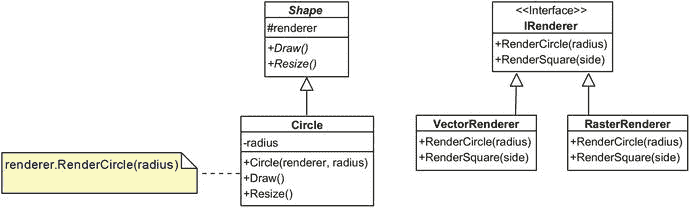

# 八、桥接

## 传统桥接

假设我们对在屏幕上画不同种类的形状感兴趣。让我们假设我们有各种各样的形状(圆形、方形等。)以及用于渲染这些的不同 API(比如光栅渲染和矢量渲染)。

我们希望创建指定形状类型和形状用于渲染的渲染机制的对象。我们如何做到这一点？一方面，我们可以定义无限多的类(`RasterSquare`、`VectorCircle`等)。)并为每一个提供一个实现。或者我们可以以某种方式让每个形状引用它正在使用的渲染器。

让我们从定义一个`IRenderer`开始。这个接口将决定不同的形状如何被所需的机制渲染: <sup>1</sup>

```cs
public interface IRenderer
{
  void RenderCircle(float radius);
  // RenderSquare, RenderTriangle, etc.
}

```

另一方面，我们可以为形状层次定义一个抽象类(不是接口)。为什么是抽象类？因为我们希望保留对渲染器的引用。

```cs
public abstract class Shape
{
  protected IRenderer renderer;

  // a bridge between the shape that's being drawn and
  // the component which actually draws it
  public Shape(IRenderer renderer)
  {
    this.renderer = renderer;
  }

  public abstract void Draw();
  public abstract void Resize(float factor);
}

```

这可能看起来违反直觉，所以让我们停下来问问自己:我们到底在试图防范什么？嗯，我们试图处理两种情况:当新的渲染器被添加时和当新的形状被添加到系统中时。我们不希望这些中的任何一个导致*多个*变化。这里有两种情况:

*   如果添加了一个新的形状，它所要做的就是继承`Shape`并实现它的成员(假设有 M 个不同的成员)。然后每个呈现器只需要实现一个新成员(`RenderXxx`)。因此，如果有 M 个不同的渲染器，一个新形状所需的操作总数是 M+N。

*   如果添加了一个新的渲染器，它所要做的就是实现 M 个不同的成员，每个成员对应一个形状。

如你所见，我们要么实现 M 个成员，要么实现 M+N 个成员。在任何时候，我们都不会遇到 M 乘 N 的情况，这是该模式试图避免的。另一个额外的好处是，渲染器总是知道如何渲染系统中所有可用的形状，因为每个形状`Xxx`都有一个明确调用`RenderXxx()`的`Draw()`方法。

这里是`Circle`的实现:

```cs
public class Circle : Shape
{
  private float radius;

  public Circle(IRenderer renderer, float radius) : base(renderer)
  {
    this.radius = radius;
  }

  public override void Draw()
  {
    renderer.RenderCircle(radius);
  }

  public override void Resize(float factor)
  {
    radius *= factor;
  }

}

```

这是其中一个渲染器的示例实现:

```cs
public class VectorRenderer : IRenderer
{
  public void RenderCircle(float radius)
  {
    WriteLine($"Drawing a circle of radius {radius}");
  }
}

```

注意，`Draw()`方法只是使用了桥:它为这个特定的对象调用相应的渲染器的绘制实现。

为了使用这个设置，你必须实例化一个`IRenderer`和形状。这可以直接完成:

```cs
var raster = new RasterRenderer();
var vector = new VectorRenderer();
var circle = new Circle(vector, 5);
circle.Draw(); // Drawing a circle of radius 5
circle.Resize(2);
circle.Draw(); // Drawing a circle of radius 10

```

或者，如果您正在使用依赖注入框架，您可以定义一个在整个应用中使用的默认呈现器。这样，`Circle`的所有构造实例都将被集中定义的渲染器预初始化。下面是一个使用 Autofac 容器的示例:

```cs
var cb = new ContainerBuilder();
cb.RegisterType<VectorRenderer>().As<IRenderer>();
cb.Register((c, p) => new Circle(c.Resolve<IRenderer>(),
  p.Positional<float>(0)));
using (var c = cb.Build())
{
  var circle = c.Resolve<Circle>(
    new PositionalParameter(0, 5.0f)
  );
  circle.Draw();
  circle.Resize(2);
  circle.Draw();
}

```

前面的代码指定，默认情况下，当有人请求一个`IRenderer`时，应该提供一个`VectorRenderer`。此外，由于形状需要一个额外的参数(大概是它们的大小)，我们指定默认值为零。



## 动态原型桥

您可能已经注意到，桥只不过是依赖倒置原则的应用，其中您通过一个公共参数将两个不同的层次结构连接在一起。现在我们来看一个更复杂的例子，它涉及到动态原型。

动态原型是一种编辑技术。NET 程序*在运行*时。您已经体验过 Visual Studio 中的“编辑&继续”功能。动态原型的思想是允许用户通过编辑和运行时编译程序的源代码，对当前运行的程序进行即时更改。

它是如何工作的？好吧，假设你坚持“每个文件一个类”的方法，并且你预先知道你的 DI 容器可以满足给定类的所有依赖关系。在这种情况下，您可以执行以下操作:

*   允许用户编辑这个类的源代码。如果类和文件之间有一对一的对应关系，这种方法效果最好。大多数现代 ide 都试图实施这种方法。

*   编辑并保存新的源代码后，使用 C# 编译器编译该类，并获得新类型的内存实现。你基本上会得到一个`System.Type`。如果你愿意，你可以实例化那个新类型，并用它来更新一些引用，或者…

*   您可以在 DI 容器中更改注册选项，这样您的新类型就可以替代原来的类型。这自然要求您使用某种抽象。

最后一点需要解释。如果你有一个具体的类型`Foo.Bar`并且你构建了一个全新的内存类型`Foo.Bar`，那么即使这些类型的 API 保持不变，这些类型也是*不兼容的*。不能用新的引用来分配对旧的`Bar`的引用。互换使用它们的唯一方法是通过`dynamic`或反射，这两者都是小众案例。

让我来说明整个过程是如何工作的。假设您有一个被`Payroll`类使用的`Log`类。使用假设的依赖注入，您可以将其定义为

```cs
// Log.cs
public class Log
{
  void Info(string msg) { ... }
}

// Payroll.cs
public class Payroll
{
  [Service]
  public Log Log { get; set; }
}

```

注意，我将`Log`定义为注入属性，而不是通过构造函数注入。现在，要创建动态桥，您需要引入一个接口，即:

```cs
// ILog.cs
public interface ILog

{
  void Info(string msg);
}

// Log.cs
public class Log : ILog { /* as before */ }

// Payroll.cs
public class Payroll
{
  [Service]
  public ILog Log { get; set; }
}

```

也要注意文件名。这很重要:每种类型都在自己的文件中。现在，当您运行这个程序时，假设您想在不停止应用的情况下更改`Log`的实现。您要做的如下所示:

*   用`Log.cs`文件打开一个编辑器并编辑该文件。

*   关闭编辑器。现在`Log.cs`被编译成内存中的程序集。

*   创建在这个新程序集中找到的第一个类型。肯定会是一个`Log`，但是和之前的`Log`不兼容！然而，它实现了一个`ILog`，这对我们来说已经足够好了。

*   检查容器已经创建的对象，并用新对象更新所有标记了`[Service]`的对`ILog`的引用。

这最后一部分可能会很棘手。首先，你需要一个容器，它可以检查自己的注入点，老实说，你也可以使用好的老式反射来达到这个目的。我提到容器的原因是它使用起来更方便。另外，注意这种方法只适用于属性注入，并且有一个隐含的假设，即服务是*不可变的*(没有状态)。如果服务有状态，您必须将其序列化，然后将数据反序列化到新的对象中——这并非不可能，但是一个健壮的实现需要处理许多极端情况。

所以这个故事的寓意是，为了能够用一个运行时构造的类型替换另一个，它们都需要实现相同的接口。而且在你问之前， *no* ，你不能动态改变任何基类(类或者接口)。

## 摘要

正如我们所看到的，桥设计模式的主要目标是避免数据类型的过度增长，在这种情况下，有两个或更多的“维度”，也就是说，系统的各个方面，可能在数量上成倍增长。桥接的最佳方法仍然是主动避免(例如，如果可能的话，用枚举替换类)，但是如果那是不可能的，我们就简单地抽象掉两个层次，并找到一种连接它们的方法。

<aside aria-label="Footnotes" class="FootnoteSection" epub:type="footnotes">Footnotes 1

我在这里使用了一个呼叫约定。这纯粹是为了说明的目的。如果每个渲染的形状都不共享另一个形状的父形状或子形状，则可以通过创建一系列名称相似的重载来简化这种情况，即，`Render(Circle c), Render(Square s)`等等。选择权在你。

 </aside>