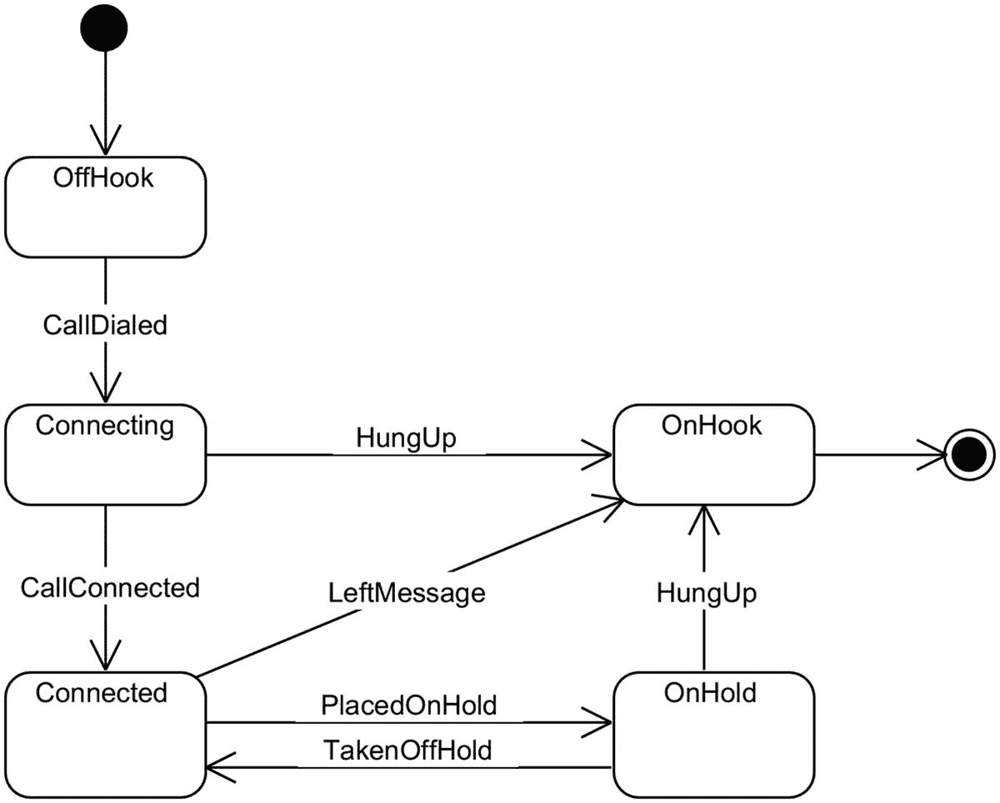

# 二十二、状态

我必须承认:我的行为受我的状态支配。如果我睡眠不足，我会有点累。如果我喝了酒，我就不会开车了。所有这些都是状态，它们支配着我的行为:我的感受，我能做什么和不能做什么。

当然，我可以从一种状态转换到另一种状态。我可以去喝杯咖啡，这会让我从困倦中清醒过来(我希望！).所以我们可以把咖啡想象成一个触发器，让你真正从困倦状态转变为清醒状态。在这里，我笨拙地为你说明一下:<sup>T3 1T5】</sup>

```cs
        coffee
sleepy --------> alert

```

因此，状态设计模式是一个非常简单的想法:状态控制行为，状态可以改变，唯一没有定论的是谁触发从一个状态到另一个状态的改变。

有两种方法可以模拟状态:

*   状态是具有行为的实际类，这些行为导致从一个状态到另一个状态的转换。换句话说，一个州的成员是我们从那个州走向何方的选项。

*   状态和转换只是枚举。我们有一个叫做*状态机*的特殊组件来执行实际的转换。

这两种方法都是可行的，但第二种方法才是最常见的。我们将看一看这两个，但是我必须警告，我将浏览第一个，因为这不是人们通常做事情的方式。

## 状态驱动的状态转换

我们从最简单的例子开始:一个只能处于*开*和*关*状态的灯开关。我们之所以选择这样一个简单的域，是因为我想强调一个经典的 State 实现所带来的疯狂(没有别的词可以形容)，这个例子非常简单，不需要生成代码清单。

我们将构建一个模型，其中任何状态都能够切换到其他状态:这反映了状态设计模式的“经典”实现(根据 GoF 书)。首先，让我们建立电灯开关的模型。它只有一个状态和一些从一个状态切换到另一个状态的方法:

```cs
public class Switch
{
  public State State = new OffState();
}

```

这一切看起来完全合理；我们有一个处于某种状态的开关(或者是*打开*或者是*关闭*)。我们现在可以定义`State`，在这个特殊的例子中，它将是一个实际的类。

```cs
public abstract class State
{
  public virtual void On(Switch sw)
  {
    Console.WriteLine("Light is already on.");
  }

  public virtual void Off(Switch sw)
  {
    Console.WriteLine("Light is already off.");
  }
}

```

这个实现远非直观，以至于我们需要慢慢地、小心地讨论它，因为从一开始，关于`State`类的任何东西都没有意义。

虽然`State`是抽象的(意味着您不能实例化它)，但它有非抽象成员，允许从一种状态切换到另一种状态。这……对一个通情达理的人来说，毫无意义。想象一下电灯开关:它是改变状态的开关。人们并不指望这个州本身会改变*本身*，然而它似乎确实在改变。

然而，也许最令人困惑的是，`State.On()` / `Off()`的默认行为声称我们已经*处于这种状态*！请注意，这些方法是虚拟的。当我们实现示例的其余部分时，这将在某种程度上结合在一起。

我们现在实现开和关状态:

```cs
public class OnState : State
{
  public OnState()
  {
    Console.WriteLine("Light turned on.");
  }
  public override void Off(Switch sw)
  {
    Console.WriteLine("Turning light off...");
    sw.State = new OffState();
  }
}
// similarly for OffState

```

每个状态的构造器简单地通知我们，我们已经*完成了*转换。但是过渡本身发生在`OnState.Off()`和`OffState.On()`。这就是转变发生的地方。

我们现在可以完成`Switch`类，为它提供实际开关灯的方法:

```cs
public class Switch
{
  public State State = new OffState();
  public void On()  { State.On(this); }
  public void Off() { State.Off(this); }
}

```

因此，将所有这些放在一起，我们可以运行以下场景:

```cs
LightSwitch ls = new LightSwitch(); // Light turned off
ls.On();  // Switching light on...
          // Light turned on
ls.Off(); // Switching light off...
          // Light turned off
ls.Off(); // Light is already off

```

下面是一个从`OffState`到`OnState`的转换示意图:

```cs
         LightSwitch.On() -> OffState.On()
OffState------------------------------------>OnState

```

另一方面，从`OnState`到`OnState`的转换使用基本的`State`类，它告诉你你已经处于那个状态了:

```cs
         LightSwitch.On() -> State.On()
OnState --------------------------------> OnState

```

让我第一个说这里呈现的实现是*可怕的*。虽然这是 OOP 平衡的一个很好的演示，但它是一个不可读的、不直观的混乱，违背了我们对 OOP 的所有了解，特别是对设计模式的了解，具体来说:

*   一个状态通常不会自行切换。

*   可能的转换列表不应该到处出现；最好放在一个地方(SRP)。

*   没有必要用实际的类来模拟状态，除非它们有特定于类的行为；这个例子可以简化得更简单。

也许我们一开始就应该使用`enum` s？

## 手工状态机

让我们试着为一个典型的电话对话定义一个状态机。

首先，我们将描述电话的状态:

```cs
public enum State
{
  OffHook,
  Connecting,
  Connected,
  OnHold
}

```

我们现在还可以定义状态之间的转换，也称为`enum`:

```cs
public enum Trigger
{
  CallDialed,
  HungUp,
  CallConnected,
  PlacedOnHold,
  TakenOffHold,
  LeftMessage
}

```

现在，这个状态机的确切的*规则*，也就是哪些变迁是可能的，需要存储在某个地方。下面是一个 UML 状态机图，显示了我们想要的转换类型:



让我们使用状态到触发器/状态对的字典:

```cs
private static Dictionary<State, List<(Trigger, State)>> rules
    = new Dictionary<State, List<(Trigger, State)>>() { /* todo */ }

```

这有点笨拙，但本质上字典的键是我们从移动*的`State`，值是在这个状态和使用触发器时进入的状态中代表可能的触发器的`Trigger-State`对的列表。*

让我们初始化这个数据结构:

```cs
private static Dictionary<State, List<(Trigger, State)>> rules
  = new Dictionary<State, List<(Trigger, State)>>
  {
    [State.OffHook] = new List<(Trigger, State)>
    {
      (Trigger.CallDialed, State.Connecting)
    },
    [State.Connecting] = new List<(Trigger, State)>
    {
      (Trigger.HungUp, State.OffHook),
      (Trigger.CallConnected,  State.Connected)
    },
    // more rules here
  };

```

我们还需要一个起始(当前)状态，如果我们希望状态机在到达该状态时停止执行，我们还可以添加一个退出(终止)状态:

```cs
State state = State.OffHook, exitState = State.OnHook;

```

所以在前面一行中，我们从`OffHook`状态开始(当您准备好打电话时)，退出状态是当电话被放置`OnHook`并且呼叫结束时。

这样，我们就不必为实际运行(我们使用术语*编排*)状态机构建单独的组件。例如，如果我们想建立一个交互式的电话模型，我们可以这样做:

```cs
do
{
  Console.WriteLine($"The phone is currently {state}");
  Console.WriteLine("Select a trigger:");

  for (var i = 0; i < rules[state].Count; i++)
  {
    var (t, _) = rules[state][i];
    Console.WriteLine($"{i}. {t}");
  }

  int input = int.Parse(Console.ReadLine());

  var (_, s) = rules[state][input];
  state = s;
} while (state != exitState);
Console.WriteLine("We are done using the phone.");

```

该算法相当明显:我们让用户选择当前状态的一个可用触发器，如果该触发器有效，我们通过使用之前创建的`rules`字典转换到正确的状态。

如果我们到达的状态是退出状态，我们就跳出循环。这是一个与程序交互的例子:

```cs
The phone is currently OffHook
Select a trigger:
0\. CallDialed
0
The phone is currently Connecting Select a trigger:
0.HungUp
1.CallConnected
1
The phone is currently Connected
Select a trigger:
0.LeftMessage
1.HungUp
2.PlacedOnHold
2
The phone is currently OnHold
Select a trigger:
0.TakenOffHold
1.HungUp
1
We are done using the phone.

```

这种手工创建的状态机的主要好处是非常容易理解:状态和转换是普通的枚举，转换集在一个`Dictionary`中定义，开始和结束状态是简单的变量。我相信你会同意这比我们在本章开始时的例子更容易理解。

## 基于开关的状态机

在我们对状态机的探索中，我们已经从用类表示状态的不必要的复杂的经典例子发展到用枚举表示状态的手工例子，现在我们将经历退化的最后一步，因为我们完全停止使用状态的专用数据类型。

但是我们的简化不会就此结束:我们不会从一个方法调用跳到另一个方法调用，而是将自己限制在一个无限循环的`switch`语句中，在该语句中，状态将被检查，并且由于状态改变而发生转换。

我想让你考虑的场景是一个密码锁。锁有一个四位数的代码(如`1234`)，您可以一次输入一个数字。当您输入代码时，如果您输入错误，您会得到“`FAILED`”输出，但是如果您输入的所有数字都正确，您会得到“`UNLOCKED`”，然后退出状态机。

整个场景可以放在一个清单中:

```cs
string code = "1234";
var state = State.Locked;
var entry = new StringBuilder();

while (true)
{
  switch (state)
  {
    case State.Locked:
      entry.Append(Console.ReadKey().KeyChar);

      if (entry.ToString() == code)
      {
        state = State.Unlocked;
        break;
      }

      if (!code.StartsWith(entry.ToString()))
      {
        // the code is blatantly wrong
        state = State.Failed;
      }
      break;

    case State.Failed:
      Console.CursorLeft = 0;
      Console.WriteLine("FAILED");
      entry.Clear();
      state = State.Locked;
      break;
    case State.Unlocked:
      Console.CursorLeft = 0;
      Console.WriteLine("UNLOCKED");
      return;
  }
}

```

如您所见，这在很大程度上是一个状态机，尽管它缺乏任何结构。你不能从顶层检查它，也不能说出所有可能的状态和转换是什么。除非你真的检查代码，否则不清楚转换是如何发生的——我们很幸运这里没有`goto`语句在案例之间跳转！

这种基于开关的状态机方法适用于状态和转换数量非常少的情况。它在结构、可读性和可维护性方面有所损失，但是如果您确实急需一个状态机并且懒得创建 enum 用例，它可以作为一个快速补丁。

总的来说，这种方法不可伸缩，并且难以管理，所以我不建议在生产代码中使用。唯一的例外是，这种机器是基于某种外部模型使用代码生成制造的。

## 用开关表达式编码转换

基于`switch`的状态机可能很笨拙，但这部分是由于关于状态和转换的信息的构造方式(因为事实并非如此)。但是有一种不同的`switch`—`switch`—*语句*(相对于*表达式*)由于模式匹配，允许我们灵活地定义状态转换。

好了，是时候举个简单的例子了。你正在寻宝，发现了一个可以打开或关闭的宝箱…除非它是锁着的，在这种情况下，情况就有点复杂了(你需要有一把钥匙来打开或关闭宝箱)。因此，我们可以将状态和可能的转换编码如下:

```cs
enum Chest
{
  Open, Closed, Locked
}

enum Action
{
  Open, Close
}

```

有了这个定义，我们可以编写一个名为`Manipulate`的方法，将我们从一个状态带到另一个状态。胸部手术的一般规则如下:

*   如果箱子是锁着的，只有有钥匙才能打开。

*   如果箱子是开着的，你拿着钥匙关上它，你就锁上了它。

*   如果箱子是开着的，而你没有钥匙，你就关上它。

*   不管你有没有钥匙，一个封闭的(但没有上锁的)箱子都可以被打开。

可能转换的集合可以被编码在模式匹配表达式的结构中。事不宜迟，就是这样:

```cs
static Chest Manipulate(Chest chest,
  Action action, bool haveKey) =>
  (chest, action, haveKey) switch
  {
    (Chest.Closed, Action.Open, _) => Chest.Open,
    (Chest.Locked,  Action.Open, true) => Chest.Open,
    (Chest.Open, Action.Close, true) => Chest.Locked,
    (Chest.Open, Action.Close, false) => Chest.Closed,
  _ => chest
};

```

这种方法有许多优点和缺点。其优点是

*   这个状态机很容易阅读

*   像`haveKey`这样的保护条件很容易合并，并且非常适合模式匹配

也有不利之处:

*   这个状态机的正式规则集是以一种无法提取的方式定义的。没有保存规则的数据存储，因此您不能生成报告或图表，也不能运行任何超出编译器所做的验证检查(它检查穷举性)。

*   如果您需要任何行为，比如状态进入或退出行为，这在 switch 表达式中是不容易做到的——您需要定义一个包含 switch 语句的老式方法。

总而言之，这种方法非常适合简单的状态机，因为它会产生非常易读的代码。但这并不完全是一个“企业”解决方案。

## 无状态的状态机

虽然手工滚动状态机适用于最简单的情况，但是您可能希望利用工业级的状态机框架。通过这种方式，您可以获得一个经过测试的功能更多的库。这也是合适的，因为我们需要讨论额外的与状态机相关的概念，并且手工实现它们是相当乏味的。

在我们继续讨论我想讨论的概念之前，让我们首先使用无状态来重建我们之前的电话呼叫示例。 <sup>[2](#Fn2)</sup> 假设和以前一样存在相同的枚举`State`和`Trigger`，状态机的定义非常简单:

```cs
var call = new StateMachine<State, Trigger>(State.OffHook);

phoneCall.Configure(State.OffHook)
  .Permit(Trigger.CallDialed, State.CallConnected);

// and so on, then, to cause a transition, we do

call.Fire(Trigger.CallDialed); // call.State is now State.CallConnected

```

如你所见，Stateless' `StateMachine` class 是一个具有流畅接口的构建器。当我们讨论无状态的不同复杂性时，这个 API 设计背后的动机将变得显而易见。

### 类型、动作和忽略过渡

让我们来谈谈无状态和状态机的许多特性。

首先也是最重要的，无状态支持 *any* 的状态和触发器。NET 类型——它不局限于`enums`。你可以使用字符串，数字，任何你想要的。例如，一个灯开关可以用一个`bool`来表示状态(`false` =关，`true` =开)；我们将继续使用`enums`作为触发器。下面是如何实现`LightSwitch`的例子:

```cs
enum Trigger { On, Off }
var light = new StateMachine<bool, Trigger>(false);

light.Configure(false)            // if the light is off...
  .Permit(Trigger.On, true)       // we can turn it on
  .Ignore(Trigger.Off);           // but if it's already off we do nothing

// same for when the light is on
light.Configure(true)
  .Permit(Trigger.Off, false)
  .Ignore(Trigger.On)
  .OnEntry(() => timer.Start())
  .OnExit(() => timer.Stop());   // calculate time spent in this state

light.Fire(Trigger.On);   // Turning light on
light.Fire(Trigger.Off);  // Turning light off
light.Fire(Trigger.Off);  // Light is already off!

```

这里有几件有趣的事情值得讨论。首先，这个状态机有*动作*——当我们进入特定状态时发生的事情。这些都是在`OnEntry()`中定义的，在这里你可以提供一个做某事的 lambda 类似地，您可以在使用`OnExit()`退出状态时调用一些东西。这种转换动作的一个用途是在进入一个转换时启动一个计时器，在退出一个转换时停止计时器，这可以用于跟踪在每个状态中花费的时间量。例如，您可能想要测量灯亮着的时间，以验证电费。

另一件值得注意的事情是`Ignore()`构建器方法的使用。这基本上是告诉状态机完全忽略这个转换:如果灯已经关了，我们试图关掉它(如前面清单的最后一行)，我们指示状态机简单地忽略它，所以在这种情况下没有输出。

为什么这很重要？因为如果您忘记`Ignore()`这个转换或者没有明确指定它，无状态将抛出一个`InvalidOperationException`:

> 对于触发器“False ”,不允许从状态“False”进行有效的离开转换。考虑忽略触发器*。*

### 再次重入

“冗余交换”难题的另一个替代方案是无状态对可重入状态的支持。为了复制本章开始时的例子，我们可以配置状态机，以便在重新进入一个状态的情况下(意味着我们从`false`转换到`false`)，调用一个动作。下面是如何配置它的:

```cs
var light = new StateMachine<bool, Trigger>(false);

light.Configure(false)        // if the light is off...
  .Permit(Trigger.On, true)   // we can turn it on
  .OnEntry(transition =>
  {
    if (transition.IsReentry)
      WriteLine("Light is already off!");
    else
      WriteLine("Turning light off");
  })
  .PermitReentry(Trigger.Off);

// same for when the light is on

light.Fire(Trigger.On);  // Turning light on
light.Fire(Trigger.Off); // Turning light off
light.Fire(Trigger.Off); // Light is already off!

```

在前面的清单中，`PermitReentry()`允许我们在一个`Trigger.Off`触发器上返回到`false`(关闭)状态。注意，为了向控制台输出相应的消息，我们使用了不同的 lambda:一个有`Transition`参数的 lambda。该参数具有完整描述转换的公共成员。这包括`Source`(我们正在转换的状态)、`Destination`(我们将要转换的状态)、`Trigger`(导致转换的原因)，以及`IsReentry`，一个布尔标志，我们使用它来确定这是否是一个可重入的转换。

### 分级状态

在打电话的情况下，可以认为`OnHold`状态是`Connected`状态的子状态，这意味着当我们在等待时，我们也是连接的。无状态允许我们这样配置状态机:

```cs
phoneCall.Configure(State.OnHold)
    .SubstateOf(State.Connected)
    // etc.

```

现在，如果我们处于`OnHold`状态，`phoneCall.State`会给我们`OnHold`，但是还有一个`a phoneCall.IsInState(State)`方法，当用`State.Connected`或`State.OnHold`调用时，它会返回`true`。

### 更多功能

让我们再讨论几个与无状态实现的状态机相关的特性。

*   **Guard 子句**允许你通过调用`PermitIf()`和提供`bool`-返回 lambda 函数来随意启用和禁用转换，例如:

*   参数化触发器是一个有趣的概念。本质上，您可以将参数附加到触发器上，这样，除了触发器本身之外，还有其他信息可以传递。例如，如果一个状态机需要通知一个特定的雇员，您可以指定一个用于通知的电子邮件:

```cs
phoneCall.Configure(State.OffHook)
  .PermitIf(Trigger.CallDialled, State.Connecting, () => IsValidNumber)
  .PermitIf(Trigger.CallDialled, State.Beeping, () =>!IsValidNumber);

```

*   **外部存储**是无状态的一个特性，它允许你在外部存储一个状态机的内部状态(例如，在一个数据库中),而不是使用`StateMachine`类本身。要使用它，只需在`StateMachine`构造函数中定义 getter 和 setter 方法:

```cs
var notifyTrigger = workflow.SetTriggerParameters<string>(Trigger.Notify);
workflow.Configure(State.Notified)
  .onEntryFrom(assignTrigger, email => SendEmail(email));
workflow.Fire(notifyTrigger, "foo@bar.com");

```

*   **内省**允许我们通过`PermittedTriggers`属性实际查看可以从当前状态触发的触发器表。

```cs
var stateMachine = new StateMachine<State, Trigger>(
  () => database.ReadState(),
  s => database.WriteState(s));

```

这远不是无状态提供的特性的详尽列表，但是它涵盖了所有重要的部分。

## 摘要

如您所见，状态机的整个业务远远超出了简单的转换:它允许大量的复杂性来处理最苛刻的业务案例。让我们回顾一下我们已经讨论过的一些状态机特性:

*   状态机包括两个集合:状态和触发器。状态为系统的可能状态建模，并触发我们从一个状态到另一个状态的转换。不限于枚举:可以使用普通的数据类型。

*   尝试未配置的转换将导致异常。

*   可以为每个状态显式配置进入和退出操作。

*   API 中可以显式地允许重入，而且，您可以确定在进入/退出动作中是否发生了重入。

*   转换可以通过保护条件打开或关闭。它们也可以被参数化。

*   状态可以是分层的，也就是说，它们可以是其他状态的子状态。然后需要一个额外的方法来确定您是否处于特定的(父)状态。

虽然这些特性中的大部分看起来像是过度工程化，但是这些特性在定义真实世界的状态机时提供了很大的灵活性。

<aside aria-label="Footnotes" class="FootnoteSection" epub:type="footnotes">Footnotes [1](#Fn1_source)

我撒谎了——两次。第一，我不开汽车，我更喜欢电动自行车。这并不会以任何方式影响饮酒——仍然是不允许的。第二，我不喝咖啡。

  [2](#Fn2_source)

无国籍可以在 [`https://github.com/dotnet-state-machine/stateless`](https://github.com/dotnet-state-machine/stateless) 找到。值得注意的是，电话示例实际上来自 SimpleStateMachine 的作者，这是一个无状态的基础项目。

 </aside>