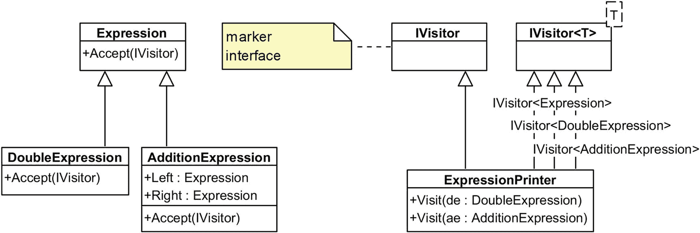

# 二十五、访问者

为了解释这个模式，我将首先跳到一个例子中，然后讨论这个模式本身。希望你不要介意！

假设您已经解析了一个数学表达式(当然，使用了解释器模式！)由`double`值和加法运算符组成，例如:

```cs
(1.0 + (2.0 + 3.0))

```

此表达式可以使用类似于下面的对象层次结构来表示:

```cs
public abstract class Expression { /* nothing here (yet) */ }

public class DoubleExpression : Expression
{
  private double value;

  public DoubleExpression(double value) { this.value = value; }
}

public class AdditionExpression : Expression
{
  private Expression left, right;

  public AdditionExpression(Expression left, Expression right)
  {
    this.left = left;
    this.right = right;
  }
}

```

根据这个设置，您对两件事感兴趣:

*   将 OOP 表达式打印为文本

*   评估表达式的值

您还希望尽可能统一和简洁地完成这两件事(以及对这些树的许多其他可能的操作)。你会怎么做？嗯，有很多方法，我们将从打印操作的实现开始，逐一查看。

## 不速之客

最简单的解决方案是获取基类`Expression`并向其添加一个抽象成员。

```cs
public abstract class Expression
{
  // adding a new operation
  public abstract void Print(StringBuilder sb);
}

```

除了破坏 OCP 之外，这种修改还依赖于这样一个假设，即您实际上可以访问该层次结构的源代码——这并不总是有保证的。但我们总得从某个地方开始，对吧？因此，随着这种变化，我们需要在`DoubleExpression`中实现`Print()`(这很简单，所以我在这里省略了)以及在`AdditionExpression`中实现`Print()`:

```cs
public class AdditionExpression : Expression
{
  ...
  public override void Print(StringBuilder sb)
  {
    sb.Append(value: "(");
    left.Print(sb);
    sb.Append(value: "+");
    right.Print(sb);
    sb.Append(value: ")");
  }
}

```

哦，这太有趣了！我们在子表达式上多态地递归调用`Print()`。太好了，让我们来测试一下:

```cs
var e = new AdditionExpression(
  left: new DoubleExpression(1),
  right: new AdditionExpression(
    left: new DoubleExpression(2),
    right: new DoubleExpression(3)));
var sb = new StringBuilder();
e.Print(sb);
WriteLine(sb); // (1.0 + (2.0 + 3.0))

```

嗯，这很简单。但是现在假设您在层次结构中有 10 个继承者(顺便说一下，在现实世界的场景中并不少见)，您需要添加一些新的`Eval()`操作。那是需要在十个不同的类中完成的十个修改。但是 OCP 不是真正的问题。

真正的问题是 SRP。你知道，像印刷这样的问题是需要特别关注的。与其说每个表达式都应该打印自己，为什么不引入一个知道如何打印表达式的`ExpessionPrinter`？并且，稍后，您可以引入一个知道如何执行实际计算的`ExpressionEvaluator`——所有这些都不会以任何方式影响`Expression`层次结构。

## 反射式打印机

既然我们已经决定制作一个*独立的*打印机组件，让我们去掉`Print()`成员函数(当然，要保留基类)。

```cs
abstract class Expression
{
  // nothing here!
};

```

现在让我们试着实现一个`ExpressionPrinter`。我的第一反应会是这样写:

```cs
public static class ExpressionPrinter
{
  public static void Print(DoubleExpression e, StringBuilder sb)
  {
    sb.Append(de.Value);
  }

  public static void Print(AdditionExpression ae, StringBuilder sb)
  {
    sb.Append("(");
    Print(ae.Left, sb);  // will not compile!!!
    sb.Append("+");
    Print(ae.Right, sb); // will not compile!!!
    sb.Append(")");
  }
}

```

前面编译的几率:零。C# 知道，`ae.Left`是一个`Expression`，但是由于它不在运行时检查类型(不像各种动态类型的语言)，它不知道调用哪个重载。太糟糕了！

这里能做什么？嗯，只有一件事——移除重载并在运行时检查类型:

```cs
public static class ExpressionPrinter
{
  public static void Print(Expression e, StringBuilder sb)
  {
    if (e is DoubleExpression de)
    {
      sb.Append(de.Value);
    }
    else if (e is AdditionExpression ae)
    {
      sb.Append("(");
      Print(ae.Left, sb);
      sb.Append("+");
      Print(ae.Right, sb);
      sb.Append(")");
    }
  }
}

```

前面的代码实际上是一个可用的解决方案:

```cs
var e = new AdditionExpression(
  left: new DoubleExpression(1),
  right: new AdditionExpression(
    left: new DoubleExpression(2),
    right: new DoubleExpression(3)));
var sb = new StringBuilder();
ExpressionPrinter.Print(e, sb);
WriteLine(sb);

```

这种方法有一个相当大的缺点:没有编译器检查，你*有*，事实上，为层次结构中的每个元素实现了打印。当添加新元素时，您可以继续使用`ExpressionPrinter`而无需修改，它将跳过任何新类型的元素。

但这是一个可行的解决方案。说真的，很有可能就此打住，不再进一步研究访问者模式:`is`操作符没有*那么*昂贵，我认为许多开发人员会记得在`if`语句中覆盖每一种类型的对象。

### 扩展方法？

如果你认为分离出一个`ExpressionPrinter`的问题可以在不使用类型检查的情况下得到解决，这是可以理解的。可悲的是，这种设置也转移到使用反射访问者。

当然，你可以同时获取`DoubleExpression`和`AdditionExpression`并给它们`Print()`扩展方法，这些方法可以在驻留在其他地方时直接在对象上调用。然而，您的`AdditionExpression.Print()`实现仍然会有几个问题:

```cs
public static void Print(this AdditionExpression ae, StringBuilder sb)
{
  sb.Append("(");
  ae.Left.Print(sb); // oops
  sb.Append("+");
  ae.Right.Print(sb);
  sb.Append(")");
}

```

第一个问题是，由于这是一个扩展方法，我们需要将`Left`和`Right`成员公开，以便扩展方法可以访问它们。

但这不是真正的问题。这里的主要问题是`ae.Left.Print()`不能被调用，因为`ae.Left`是一般的`Expression`。你会如何支持它？嗯，这就是你通过在层次结构的根元素上实现一个扩展方法并执行类型检查来转移到反射打印机的地方:

```cs
public static void Print(this Expression e, StringBuilder sb)
{
  switch (e)
  {
    case DoubleExpression de:
      de.Print(sb);
      break;
    case AdditionExpression ae:
      ae.Print(sb);
      break;
    // and so on
  }
}

```

这个解决方案遇到了与原始方案相同的问题，即没有验证来确保`switch`语句覆盖了`Expression`的每个继承者*。现在，不可否认的是，这是我们实际上可以强制的，因此通过使用…反射赋予了反射打印机它真正的名字！*

`Extension method classes` `are static, and can have both static fields and constructors, so we can map out all the inheritors and attempt to find the methods that handle them`:

```cs
public static class ExpressionPrinter
{
  private static Dictionary<Type, MethodInfo> methods
    = new Dictionary<Type, MethodInfo>();

  static ExpressionPrinter()
  {
    var a = typeof(Expression).Assembly;
    var classes = a.GetTypes()
      .Where(t => t.IsSubclassOf(typeof(Expression)));
    var printMethods = typeof(ExpressionPrinter).GetMethods();
    foreach (var c in classes)
    {
      // find extension method that takes this class
      var pm = printMethods.FirstOrDefault(m =>
        m.Name.Equals(nameof(Print)) &&
        m.GetParameters()?[0]?.ParameterType == c);

      methods.Add(c, pm);
    }
  }
}

```

有了这个设置，为基本类型`Expression`实现的扩展方法`Print()`现在转移到:

```cs
public static void Print(this Expression e, StringBuilder sb)
{
  methods[e.GetType()].Invoke(null, new object[] {e, sb});
}

```

当然，这种方法有很大的性能成本。有一些方法可以抵消这些成本，比如使用`Delegate.CreateDelegate()`来避免存储那些`MethodInfo`对象，而是在需要时使用随时可以调用的委托。

最后，总有一个“核心选项”:生成在运行时创建这些调用的代码。当然，这也带来了一系列问题:您要么基于反射生成代码(这意味着您几乎总是落后一步，因为您需要二进制文件来提取类型信息)，要么使用 Roslyn、ReSharper、Rider 或其他类似机制提供的解析器框架来检查实际编写的代码。

### 功能反射访问者

值得注意的是，前面采用的方法是*确切地说是*在诸如 F# 之类的语言中你将采用的方法，唯一的区别当然是，你将主要处理函数，而不是继承层次。

如果您不是在层次结构中定义表达式类型，而是在有区别的联合中定义表达式类型，例如

```cs
type Expression =
  | Add of Expression * Expression
  | Mul of Expression * Expression
  ...

```

那么您将实现的任何访问者很可能具有类似于下面的结构:

```cs
let rec process expr =
  match expr with
  | And(lhs,rhs) -> ...
  | Mul(lhs,rhs) -> ...
  ...

```

这种方法完全等同于我们在 C# 实现中采用的方法。一个`match`表达式中的每一种情况都将被有效地转化为一个`is`检查。然而，还是有很大的不同。首先，F# 中具体的 case 过滤器和 guard 条件比 C# 中嵌套的`if`语句更容易阅读。整个过程可能的递归性更具表现力。

### 改进

虽然在前面的例子中不可能静态地强制每个必要类型检查的存在，但是如果缺少适当的实现，那么*有可能*生成异常。为此，只需创建一个字典，将支持的类型映射到处理这些类型的 lambda 函数，即:

```cs
private static DictType actions = new DictType
{
  [typeof(DoubleExpression)] = (e, sb) =>
  {
    var de = (DoubleExpression) e;
    sb.Append(de.Value);
  },
  [typeof(AdditionExpression)] = (e, sb) =>
  {
    var ae = (AdditionExpression) e;
    sb.Append("(");
    Print(ae.Left, sb);
    sb.Append("+");
    Print(ae.Right, sb);
    sb.Append(")");
  }
};

```

现在，您可以用更简单的方式实现顶级的`Print()`方法。事实上，为了加分，您可以使用 C# 扩展方法机制来添加`Print()`作为任何`Expression`的方法:

```cs
public static void Print(this Expression e, StringBuilder sb)
{
  actionse.GetType();
}
// sample use:
myExpression.Print(sb)

```

对于 SRP 的目的来说，您是否在一个`Printer`上使用扩展方法或普通的静态或实例方法是完全不相关的。一个普通的类和一个扩展方法类都用来将打印功能与数据结构本身隔离开来，唯一的区别是你是否考虑打印`Expression's` API 的一部分，我个人认为这是合理的:我喜欢`expression.Print()`、`expression.Eval()`等等的想法。尽管如果你是一个 OOP 纯粹主义者，你可能会讨厌这种方法。

## 什么是调度？

每当人们谈到来访者，就会提到派遣这个词。这是什么？简而言之，“分派”是一个计算要调用哪些方法的问题——具体来说，需要多少条信息才能进行调用。

这里有一个简单的例子:

```cs
interface IStuff { }
class Foo : IStuff { }
class Bar : IStuff { }

public class Something
{
  static void func(Foo foo) { }
  static void func(Bar bar) { }
}

```

现在，如果我创建一个普通的`Foo`对象，我可以用它调用`func()`:

```cs
Foo foo = new Foo();
func(foo); // this is fine

```

但是如果我决定将它强制转换为基类型(接口或类)，编译器将不知道调用哪个重载:

```cs
Stuff stuff = new Foo;
func(stuff); // oops!

```

现在，让我们从多方面考虑这个问题:有没有什么*方法可以让我们强迫系统调用正确的重载，而不需要任何运行时(`is`、`as`和类似的)检查？原来是有的。*

看，当你在一个`IStuff`上调用某个东西时，那个调用*可以*是多态的，它可以被直接分派给必要的组件，而组件又可以调用必要的重载。这被称为*双调度*是因为以下原因:

1.  首先对实际对象进行多态调用。

2.  在多态调用中，调用重载。因为在对象内部，`this`有一个精确的类型(例如，`Foo`或`Bar`)，所以正确的重载被触发。

我的意思是:

```cs
interface Stuff {
  void call();
}
class Foo : Stuff {
  void call() { func(this); }
}
class Bar : Stuff {
  void call() { func(this); }
}

void func(Foo foo) {}
void func(Bar bar) {}

```

你能看到这里发生了什么吗？我们不能只把一个通用的`call()`实现粘在`Stuff`中:不同的实现*必须*在它们各自的类中，这样`this`指针才能被正确地类型化。

该实现允许您编写以下内容:

```cs
Stuff foo = new Foo;
foo.call();

```

这是一个示意图，展示了正在发生的事情:

```cs
            this = Foo
foo.call() ------------> func(foo)

```

## 动态访问者

让我们回到我声称没有零成功机会的`ExpressionPrinter`例子:

```cs
public class ExpressionPrinter
{
  public void Print(AdditionExpression ae, StringBuilder sb)
  {
    sb.Append("(");
    Print(ae.Left, sb);
    sb.Append("+");
    Print(ae.Right, sb);
    sb.Append(")");
  }

  public void Print(DoubleExpression de, StringBuilder sb)
  {
    sb.Append(de.Value);
  }
}

```

如果我告诉你，我可以通过添加两个关键字并提高`Print(ae,sb)`方法的计算成本来实现它，会怎么样？我相信你已经猜到我在说什么了。是的，我说的是动态调度:

```cs
public void Print(AdditionExpression ae, StringBuilder sb)
{
  sb.Append("(");
  Print((dynamic)ae.Left, sb);  // <-- look closely here
  sb.Append("+");
  Print((dynamic)ae.Right, sb); // <-- and here
  sb.Append(")");
}

```

为了支持动态类型语言，`dynamic`的全部业务都被添加到了 C# 中。其中一些语言的一个方面是动态调度的能力，也就是说，在运行时而不是编译时做出调用决策。这正是我们在这里所做的！

你可以这样称呼它:

```cs
var e  = ...; // as before
var ep = new ExpressionPrinter();
var sb = new StringBuilder();
ep.Print((dynamic)e, sb); // <-- note the cast here
WriteLine(sb);

```

通过将一个变量赋给`dynamic`，我们将调度决策推迟到运行时。因此，我们得到了正确的调用；只有几个问题，即:

*   这种类型的分派会带来相当大的性能损失。

*   如果缺少一个需要的方法，您将得到一个运行时错误。

*   你可能会在继承方面遇到严重的问题。

如果您希望访问的对象图很小，并且调用不频繁，那么动态访问者是一个很好的解决方案。否则，性能损失可能会使整个努力难以为继。

## 经典访客

访问者设计模式的“经典”实现使用了*双重分派*。访问者成员函数的调用有一些约定:

*   访问者的方法通常被称为`Visit()`。

*   在整个层次结构中实现的方法通常被称为`Accept().`

所以现在，我们再一次将一些东西放入基类`Expression`中:函数`Accept()`。

```cs
public abstract class Expression
{
  public abstract void Accept(IExpressionVisitor visitor);
}

```

正如你所看到的，前面的代码引用了一个名为`IExpressionVisitor`的接口类型，它可以作为各种访问者的基本类型，比如`ExpressionPrinter`、`ExpressionEvaluator`等等。现在，`Expression`的每一个实现者现在都被要求*以相同的方式实现`Accept()`，特别是:*

```cs
public override void Accept(IExpressionVisitor visitor)
{
  visitor.Visit(this);
}

```

从表面上看，这似乎违反了干(不要重复自己)，另一个自我描述的原则。然而，如果你仔细想想，每个实现者都会有一个不同类型的`this`引用，所以这不是另一个静态分析工具如此喜欢抱怨的剪切粘贴编程的例子。

现在，在另一边，我们可以如下定义`IExpressionVisitor`接口:

```cs
public interface IExpressionVisitor
{
  void Visit(DoubleExpression de);
  void Visit(AdditionExpression ae);
}

```

注意，我们*绝对必须*为所有表达式对象定义重载；否则，在实现相应的`Accept()`时，我们会得到一个编译错误。我们现在可以实现这个接口来定义我们的`ExpressionPrinter`:

```cs
public class ExpressionPrinter : IExpressionVisitor
{
  StringBuilder sb = new StringBuilder();

  public void Visit(DoubleExpression de)
  {
    sb.Append(de.Value);
  }

  public void Visit(AdditionExpression ae)
  {
    // wait for it!
  }

  public override string ToString() => sb.ToString();
}

```

`DoubleExpression`的实现非常明显，但是下面是`AdditionExpression`的实现:

```cs
public void Visit(AdditionExpression ae)
{
  sb.Append("(");
  ae.Left.Accept(this);
  sb.Append("+");
  ae.Right.Accept(this);
  sb.Append(")");
}

```

注意现在调用是如何发生在子表达式本身上的，再次利用了双重分派。至于新的双派遣访问者的用法，这里是:

```cs
var e = new AdditionExpression(
  new DoubleExpression(1),
  new AdditionExpression(
    new DoubleExpression(2),
    new DoubleExpression(3)));
var ep = new ExpressionPrinter();
ep.Visit(e);
WriteLine(ep.ToString()); // (1 + (2 + 3))

```

遗憾的是，不可能构造一个类似于前面实现的扩展方法，因为，你猜怎么着，静态类不能实现接口。如果您想将表达式 printer 隐藏在稍微好一点的 API 后面，您可以使用以下方法:

```cs
public static class ExtensionMethods
{
  public void Print(this DoubleExpression e, StringBuilder sb)
  {
    var ep = new ExpressionPrinter();
    ep.Print(e, sb);
  }
  // other overloads here
}

```

当然，实现所有正确的重载取决于您，所以这种方法实际上没有太大帮助，并且不提供安全检查来确保您已经为每个`Expression`继承者重载。

### 实现附加访问者

那么，双重调度方法的优势是什么呢？好处是你只需要通过层次结构*实现一次*成员。你再也不用碰任何一个成员了。例如，假设您现在想要有一种方法来评估表达式的结果。这很容易，但是需要记住的是，`Visit()`目前被声明为一个`void`方法，所以`AdditionExpression`的实现可能看起来有点奇怪:

```cs
public class ExpressionCalculator : IExpressionVisitor
{
  public double Result;

  public void Visit(DoubleExpression de)
  {
    Result = de.Value;
  }

  public void Visit(AdditionExpression ae)
  {
    // in a moment!
  }

  // maybe, what you really want is double Visit(...)
}

```

…但是需要记住的是，`Visit()`目前被声明为一个`void`方法，所以一个`AdditionExpression`的实现可能看起来有点奇怪:

```cs
public void Visit(AdditionExpression ae)
{
  ae.Left.Accept(this);
  var a = Result;
  ae.Right.Accept(this);
  var b = Result;
  Result = a + b;
}

```

前面的代码是无法从`Accept()`得到`return`的副产品，所以我们将结果缓存在变量`a`和`b`中，然后返回它们的总和。它工作得很好:

```cs
var calc = new ExpressionCalculator();
calc.Visit(e);
WriteLine($"{ep} = {calc.Result}");
// prints "(1+(2+3)) = 6"

```

这种方法的有趣之处在于，现在您可以在单独的类中编写新的访问者，即使您无法访问层次结构本身的源代码。除了让你的代码更容易理解之外，这也让你忠于 SRP 和 OCP。


## 非循环访问者

现在是一个很好的时机来提及访问者设计模式实际上有两种类型。它们如下:

*   **循环访客**，基于函数重载。由于层次结构(必须知道访问者的类型)和访问者(必须知道层次结构中每个类的*)之间的循环依赖，该方法的使用仅限于不经常更新的稳定层次结构。*

*   **非循环** **访问者**，这也是基于类型转换的。这里的优点是对被访问的层次结构没有限制，但是正如您可能已经猜到的那样，这里存在性能问题。

非循环访问者实现的第一步是实际的访问者接口。我们没有为层次结构中的每一个类型定义一个`Visit()`重载，而是尽可能地使事情通用化:

```cs
public interface IVisitor<TVisitable>
{
  void Visit(TVisitable obj);
}

```

我们需要领域模型中的每个元素都能够接受这样的访问者，但是由于每个专门化都是唯一的，我们所做的就是引入一个*标记接口*——一个空接口，里面什么也没有。

```cs
public interface IVisitor {} // marker interface

```

前面的接口没有成员，但是我们*将*使用它作为我们想要实际访问的任何对象中的`Accept()`方法的参数。现在，我们能做的是重新定义我们之前的`Expression`类，如下所示:

```cs
public abstract class Expression
{
  public virtual void Accept(IVisitor visitor)
  {
    if (visitor is IVisitor<Expression> typed)
      typed.Visit(this);
  }
}

```

下面是新的`Accept()`方法的工作原理:我们获取一个`IVisitor`，然后尝试将其转换为一个`IVisitor<T>`，其中`T`是我们当前所在的类型。如果转换成功，这个访问者知道如何访问我们的类型，所以我们调用它的`Visit()`方法。如果它失败了，那就没用了。关键是*要理解为什么`typed`本身没有一个我们可以调用的`Visit()`。如果是这样的话，就需要为每一个有兴趣调用它的类型重载，这正是引入循环依赖的原因。*

在我们模型的其他部分实现了`Accept()`(同样，每个`Expression`类中的实现是相同的)之后，我们可以通过再次定义一个`ExpressionPrinter`将所有东西放在一起，但是这一次，它看起来如下:

```cs
public class ExpressionPrinter : IVisitor, IVisitor<Expression>,

    IVisitor<DoubleExpression>,
    IVisitor<AdditionExpression>
{
  StringBuilder sb = new StringBuilder();

  public void Visit(DoubleExpression de) { ... }

  public void Visit(AdditionExpression ae) { ...  }

  public void Visit(Expression obj)
  {
    // default handler?
  }

  public override string ToString() => sb.ToString();
}

```

如你所见，我们实现了`IVisitor`标记接口以及一个`Visitor<T>`用于我们想要访问的每个`T`。如果我们省略了一个特定的类型`T`(例如，假设我注释掉了`Visitor<DoubleExpression>`)，程序仍然会编译，并且相应的`Accept()`调用，如果它来了，将简单地作为空操作执行

在前面的文本中，`Visit()`方法的实现与我们在传统的 visitor 实现中的实现是相同的，结果也是如此。

然而，这个例子和传统的访问者之间有一个基本的区别。传统的访问者使用一个接口，而我们的非循环访问者使用一个抽象类作为层次结构的根。这是什么意思？嗯，一个抽象类可以有一个可以用作“后备”的实现，这就是为什么在`ExpressionPrinter`的定义中，我可以实现`IVisitor``<Expression>`并提供一个`Visit(Expression obj)`方法，该方法可以用来处理缺失的`Visit()`重载。例如，您可以在这里添加日志记录，或者抛出一个异常。



## 功能访问者

当我们讨论解释器设计模式时，我们已经看到了实现访问者的函数方法，所以我在这里不再重复。一般的方法归结为使用类型的模式匹配和其他有用的特性(比如列表理解)遍历递归的有区别的联合(当然，假设您使用的是列表)。

函数范式中的访问者与面向对象的范式有着本质的不同。在面向对象编程中，访问者是一种机制，它“在侧面”为一组相关的类提供额外的功能，同时理想地能够

*   将功能组合在一起

*   避免类型检查，而是依靠接口

有区别的联合上的模式匹配相当于使用`is` C# 关键字(`isinst` IL 指令)来检查每种类型。然而，与 C# 不同，F# 会告诉您丢失的情况，因此它提供了更大的编译时安全性。

因此，与 OOP 实现相比，规范的 F# 访问者将实现一个*反射访问者*方法。

F# 中 Visitor 的实现有很多问题。首先，正如我们之前提到的，受歧视的工会本身打破了 OCP，因为除了改变他们的定义之外，没有其他方法来扩展他们。但是 Visitor 实现使问题变得更加复杂:因为我们的函数 Visitor 本质上是一个巨大的`switch`语句，所以增加对特定类型支持的唯一方法就是在 Visitor 中也违反 OCP！

## 摘要

访问者设计模式允许我们向对象层次结构中的每个元素添加一些独特的行为。我们看到的方法包括以下几种:

*   *介入式*:向层次结构中的每个对象添加一个方法。有可能(假设你有源代码)，但打破 OCP。

*   *反射*:添加一个不需要改变对象的单独访客；每当需要运行时调度时，使用`is` / `as`。

*   *动态*:通过将层次对象强制转换为`dynamic`，强制通过 DLR 进行运行时调度。这以非常大的计算成本提供了最好的接口。

*   *经典*(双重调度):整个等级*被修改，但是只有一次，而且是以一种非常普通的方式。这个层级的每一个成员都学会了如何接待访客。然后，我们对 visitor 进行子类化，以在各个方向增强层次结构的功能。*

**   *非循环*:就像反射类一样，为了正确调度而进行强制转换。然而，它打破了访问者和被访问者之间的循环依赖，允许访问者更加灵活的组合。* 

 *访问者经常与解释器模式一起出现:在解释了一些文本输入并将其转换成面向对象的结构之后，我们需要，例如，以特定的方式呈现抽象语法树。Visitor 帮助在整个层次结构中传播一个`StringBuilder`(或类似的累加器对象)并将数据整理在一起。**