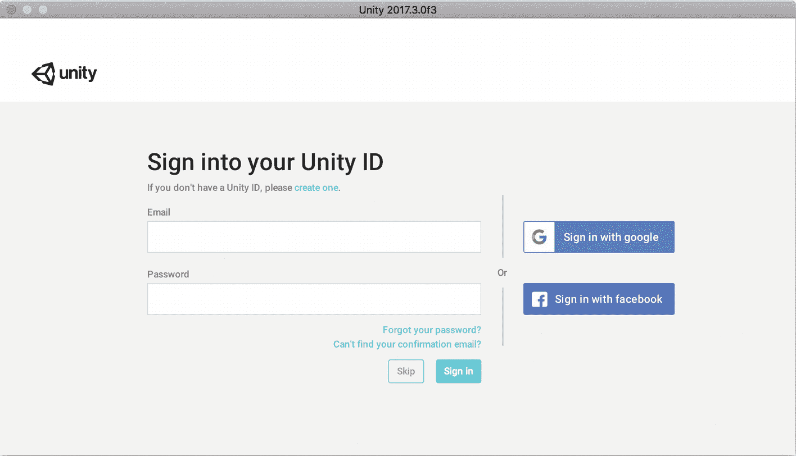
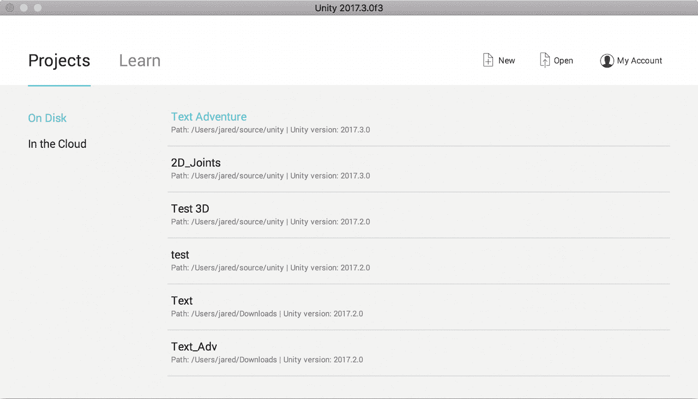
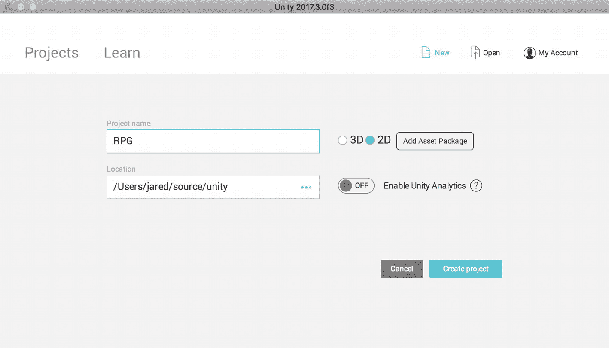
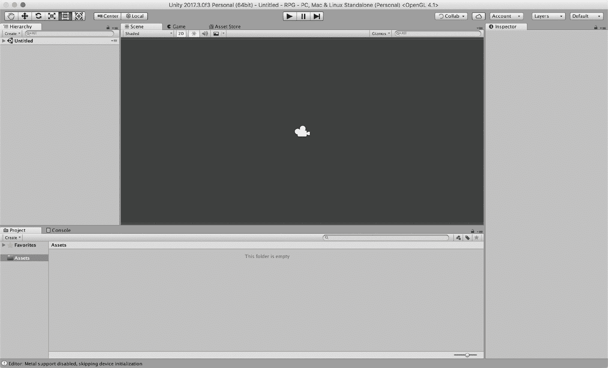
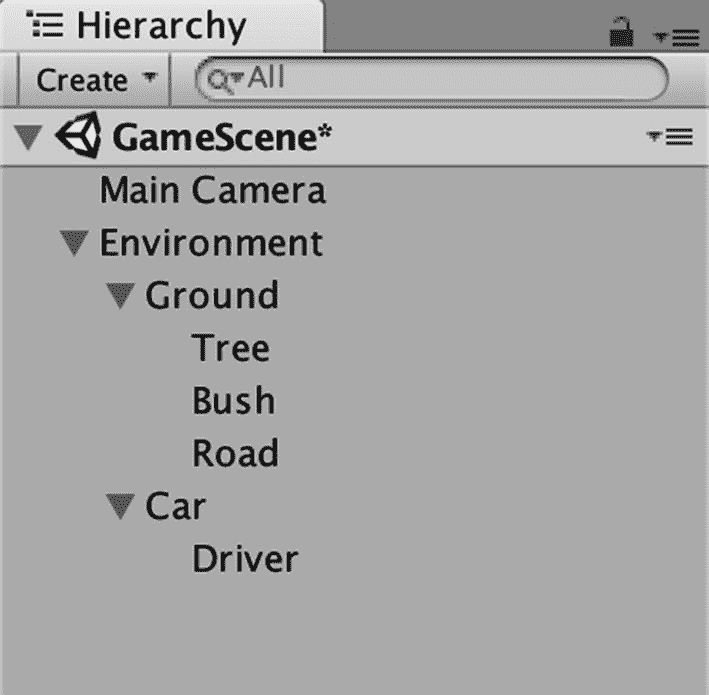
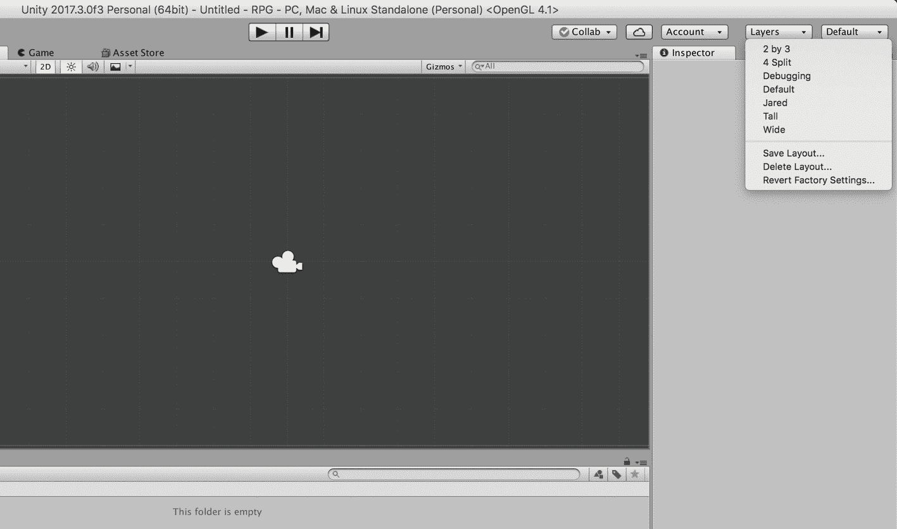
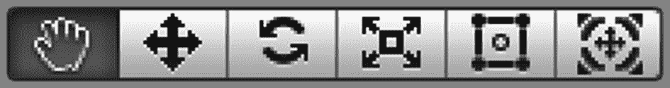
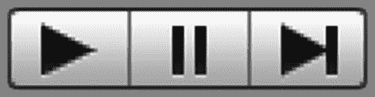
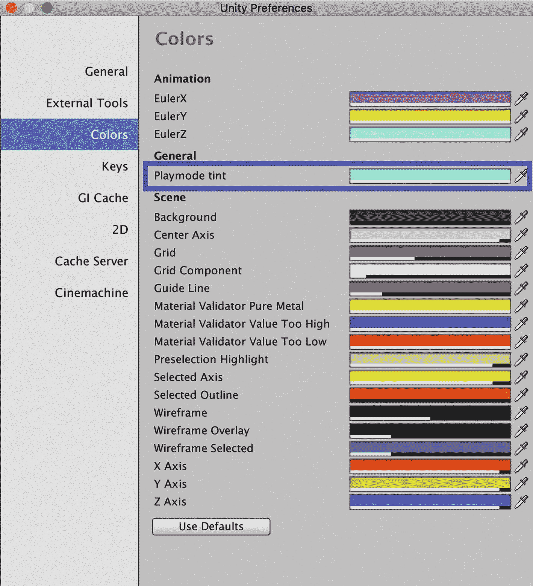

# 二、Unity 简介

本章介绍 Unity 编辑器——安装、配置、导航其窗口、使用其工具集以及熟悉项目结构。并非所有这些材料都与您在 Unity 中的日常工作直接相关，无论如何，您将来都可能需要多次参考这一章，所以不要试图一次就记住所有内容。

## 安装 Unity

首先:去 [`https://store.unity.com`](https://store.unity.com) 下载 Unity。因为我们只是在学习使用 Unity，获得个人版本，这是免费的。

就本书的目的而言，免费版和增强版的主要区别在于，免费版会在闪屏上显示“由 Unity 制作”,而增强版允许您创建自定义闪屏。Plus、Pro 和 Enterprise 版本逐渐变得更加昂贵，但提供了一些有趣的好处，如更好的数据分析和控制、多人游戏功能、使用 Unity 云服务的测试版本，甚至可以访问企业级的源代码。

你应该记住这些等级，你每一级的资格是由收入决定的。如果你或你的游戏公司每年的收入少于 10 万美元，你就有资格免费使用 Unity 个人版。如果您的公司年收入低于 20 万美元，您需要使用 Unity Plus 层。最后，如果您的公司年收入超过 20 万美元，您必须使用 Unity Pro。一点也不差。

安装 Unity 时，Unity 下载助手会提示您选择要安装的 Unity 编辑器组件。确保以下组件已勾选:Unity 2018(或最新版本)、文档、标准资产和示例项目。在本书中，我们将构建一个可以在你的桌面(PC、Mac 或 Linux)上独立运行的示例游戏。如果你愿意，你也可以勾选复选框来安装 WebGL、iOS 或 Android 构建支持的组件，以便为这些平台构建。

## 配置 Unity

安装 Unity 并首次运行后，会提示您登录您的帐户(图 [2-1](#Fig1) )。除非你想利用一些更高级的功能，如云构建和广告，否则创建并登录一个帐户并不是真正必要的，但无论如何创建一个帐户并登录并没有什么坏处。如果您想使用 Unity 资产商店中的任何东西，您需要一个帐户。

图 2-1

Unity 登录屏幕

我们来过一遍 Unity 的项目和学习画面，如图 [2-2](#Fig2) 所示，指出几件事。在左上角，您会注意到两个选项卡——项目和学习。

图 2-2

Unity 项目和学习屏幕

选择项目，让我们浏览选项:

### 在磁盘上

将出现您最近参与的六个项目的历史记录，并且可以通过选择它们来打开。

### 在云端

这指的是使用基于云的协作项目，我们不会讨论这个。Unity Teams 有一个名为 Unity Collaborate 的功能，允许团队成员更新项目中的文件，并将这些更改发布到云中。然后，其他团队成员可以查看这些更改，并决定是将他们的本地项目与这些更改同步，还是忽略它们。如果你曾经使用过 Git，Unity Collaborate 是非常相似的，但是 Git 有一点学习曲线，Unity Collaborate 被有意设计成非常直观和易于使用。

现在选择“学习”选项卡。

学习部分有丰富的信息，您可以轻松地花几周时间浏览所有教程、示例项目、资源和链接。不要害怕打开看起来远远超出您已经知道的范围的示例项目。四处打探，调整东西，打破东西。学习就是这样发生的。如果您破坏了某些东西并且无法修复，您可以随时关闭并重新加载示例项目。

好了，让我们开始创建我们的项目。

从项目和学习屏幕的右上角选择“新建”。

您将看到一个屏幕，如图 [2-3](#Fig3) 所示，包含一些用于设置新项目的配置选项。

新 Unity 项目的默认名称是“新 Unity 项目”将项目名称改为“RPG”或“有史以来最伟大的 RPG”，如图 [2-3](#Fig3) 所示。选择“2D”旁边的单选按钮，将项目配置为始终显示 2D 的侧视图。如果您忘记设置它，也不用担心——一旦我们的项目被创建，就很容易切换。

请注意“位置”文本框中的文件路径。这就是 Unity 将拯救你的项目的地方。我喜欢把我电脑上的源代码放在一个名为“source”的父目录中，而 Unity 代码放在一个“Unity”子目录中，但是你可以随意组织你的目录结构。如果您已登录，您将看到一个切换开关来打开 Unity Analytics。您可以关闭此设置，因为我们不会使用它。

图 2-3

项目创建

点击“创建项目”按钮，用这些设置创建一个新项目，并在 Unity 编辑器中打开它。

## 脚本编辑器:Visual Studio

从 Unity 2018.1 开始，Visual Studio 现在是开发 C# 脚本的默认脚本编辑器。历史上，Unity 自带的内置脚本编辑器是 MonoDevelop，但从 Unity 2018.1 开始，Unity 自带了 Visual Studio for Mac，而不是 macOS 上的 MonoDevelop。在 Windows 上，Unity 附带 Visual Studio 2017 Community，不再附带 MonoDevelop。

接下来，我们将了解 Unity 编辑器。

## 导航 Unity 界面

横跨 Unity 编辑器顶部的是工具栏，它由转换工具集、工具手柄控制、播放、暂停和步进控制、云协作选择器、服务按钮、帐户选择器、层选择器和布局选择器组成。我们将在适当的时候讨论所有这些问题。

Unity 界面(图 [2-4](#Fig4) )由许多窗口视图组成，我们接下来将回顾这些视图。

图 2-4

Unity 编辑器

## 了解不同的窗口视图

让我们浏览一下默认编辑器布局中显示的各种视图。除了我们下面讨论的视图之外，还有许多其他视图可用，我们将在本书的后面讨论其中的一些。

*   场景视图

场景可以被认为是 Unity 项目的基础，所以在 Unity 编辑器中工作时，大部分时间场景视图都是打开的。游戏中发生的一切都发生在一个场景中。场景视图是我们构建游戏和使用精灵和碰撞器完成大部分工作的地方。场景包含游戏对象，它们拥有与场景相关的所有功能。我们将在第 3 章中更详细地介绍游戏对象，但是现在我们只知道 Unity 场景中的每个对象都是游戏对象。

*   游戏视图

游戏视图从当前活动摄像机的视角渲染游戏。游戏视图也是你在 Unity Editor 中工作时查看和玩游戏的地方。在 Unity Editor 之外也有构建和运行游戏的方法，比如一个独立的应用，在网络浏览器中，或者在手机上，我们将在本书的后面介绍其中的一些平台。

*   资产商店

选择 Unity 构建游戏的一个引人注目的因素是 Unity 资产商店。正如在第 [1](1.html) 章中所讨论的，Unity 资产商店是一个在线店面，艺术家、开发者和内容创作者可以上传内容进行买卖。为了方便起见，Unity 编辑器有一个连接到资产商店的内置标签，但您也可以通过 Web 在 [`https://assetstore.unity.com`](https://assetstore.unity.com) 访问资产商店。虽然在你的布局中使用这个面板没有坏处，但是隐藏它并且只在你需要资产商店的东西时才打开它也没有坏处。

*   层级窗口

“层次”窗口以层次格式显示当前场景中所有对象的列表。层级窗口也允许通过左上角的“创建”下拉菜单创建新的游戏对象。搜索栏允许开发者通过名字搜索特定的游戏对象。

在 Unity 中，游戏对象可以包含其他游戏对象，这就是所谓的“亲子”关系。“层次结构”窗口将以有用的嵌套格式显示这些关系。图 [2-5](#Fig5) 描绘了示例场景中的层级窗口视图。

图 2-5

层次窗口

下面是对“层次结构”窗口中“父子”关系的简单解释。图 [2-5](#Fig5) 中的示例场景被称为 GameScene，它包含一个名为 Environment *的游戏对象。*环境是几个游戏对象的父对象，包括一个叫地面的。地面是相对于环境的子对象。然而，地面包含几个自己的子对象，包括树、灌木和道路。地面是相对于这些子对象的父对象。

*   项目窗口

“项目”窗口概述了“资源”文件夹中的所有内容。在项目窗口中创建文件夹有助于整理音频文件、素材、模型、纹理、场景和脚本等项目。在项目的整个生命周期中，您将花费大量时间拖移和重新排列文件夹中的资源，并选择这些资源以在“检查器”窗口中查看它们。在本书中，我们将演示一个建议的项目文件夹结构，但是您应该可以自由地以一种对您和您喜欢的工作方式有逻辑意义的方式重新安排事情。

*   控制台视图

控制台视图将显示 Unity 应用的错误、警告和其他输出。有一些 C# 脚本函数可用于在运行时将信息输出到控制台视图，以帮助调试。我们将在稍后讨论调试时讨论这些内容。您可以通过控制台视图右上角的三个按钮打开和关闭各种形式的输出。

### 小费

有时你会得到一个错误信息，每次 Unity 框架更新时都会出现，这些信息会很快堵塞你的控制台视图。在这种情况下，点击折叠切换按钮将所有相同的错误消息折叠成一条消息会很有帮助。

*   检查器窗口

检查器窗口是 Unity 编辑器中最有用和最重要的窗口之一；一定要熟悉一下。Unity 中的场景由游戏对象组成，游戏对象由脚本、网格、碰撞器和其他元素组成。您可以选择一个游戏对象，并使用检查器来查看和编辑附加的组件及其各自的属性。甚至有技术可以在游戏对象上创建你自己的属性，然后可以修改。我们将在后面的章节中详细介绍这一点。您也可以使用检查器来查看和更改预设、摄影机、材质和资源的属性。如果选择了资源，如音频文件，检查器将显示详细信息，如文件的载入方式、导入的大小和压缩率。材质贴图等资源将允许您检查渲染模式和着色器。

### 小费

请注意，您可以通过快捷方式访问许多更常用的面板:Control (PC)或 Cmd / ⌘ (Mac) + number。例如，⌘ + 1 和⌘ + 2 分别在 Mac 上的场景视图和游戏视图之间切换。这是一个节省时间的好方法，可以避免使用鼠标进行更常见的窗格切换。

## 配置和自定义布局

通过抓住窗格左上角的选项卡并拖动它，可以重新排列每个窗格。Unity 允许用户创建一个自定义的编辑器布局，方法是拖动窗格，锁定它们，根据你的喜好调整它们的大小，然后保存布局。

要保存布局，您有两种选择:

*   进入菜单选项:窗口➤布局➤保存布局。出现提示时，为您的自定义布局命名，然后点击保存按钮。

*   点击 Unity 编辑器右上角的布局选择器(图 [2-6](#Fig6) )。一开始会说违约。然后选择保存布局，给你的自定义布局一个名字，点击保存按钮。

您可以在将来从同一个菜单加载任何布局:窗口➤布局，或使用布局选择器。如果您想重置您的布局，只需从布局选择器中选择默认。

图 2-6

布局下拉菜单

## 变换工具集

接下来，我们将浏览组成工具栏的不同按钮和开关。现在工具栏需要注意的三件事是:转换工具集；工具手柄控制；以及播放、暂停和步进控件。工具栏上还有其他控件，但是我们在开始使用它们的时候会用到它们。

变换工具(图 [2-7](#Fig7) )允许用户在场景视图中导航并与游戏对象互动。

图 2-7

变换工具集

六个变换工具从左到右分别是:

*   手

手形工具允许您在屏幕上左键单击并拖动鼠标来平移视图。请注意，当选择“手形工具”时，您将无法选择任何对象。

*   移动

选择移动工具并在层级或场景视图中选择一个游戏对象将允许你在屏幕上移动该对象。

*   辐状的

旋转工具旋转选定的对象。

*   规模

缩放工具缩放选定的对象。

*   矩形

Rect 工具允许使用 2D 手柄移动和调整所选对象的大小，该手柄将出现在所选对象上。

*   移动、旋转或缩放选定的对象

该工具是移动、旋转和缩放工具的组合，合并为一组手柄。

您可以随时通过按下 Option (Mac)或 Alt (PC)来临时切换到“抓手”工具(仅在 2D 项目中),并在场景中移动。

### 小费

变换工具集中的六个控件分别映射到以下六个键:Q、W、E、R、T、y。使用这些热键可以在工具之间快速切换。

使用移动工具(热键:w)时，一个有用的技巧是通过按住 Control (PC)或 Cmd / ⌘ (Mac)让游戏对象捕捉到特定的增量。在“编辑➤捕捉设置”菜单中调整捕捉增量设置。

## 手柄位置控制

在变换工具集的右边，你会发现手柄位置控件，如图 [2-8](#Fig8) 所示。

图 2-8

手柄位置控制

控制柄是对象上的 GUI 控件，用于在场景中操纵它们。手柄位置控制允许您调整选定对象的手柄位置以及它们的方向。

第一个切换按钮(见图 [2-8](#Fig8) )允许您设置手柄的位置。

位置的两个选项是:

*   轴:这会将控制柄放置在选定对象的轴点。

*   中心:将控制柄放置在选定对象的中心。

第二个切换按钮允许您设置手柄的方向。请注意，如果选择了缩放工具，方向按钮将灰显，因为方向与缩放无关。两个方向选项是:

*   局部:选中时，变换工具功能将与游戏对象相关。

*   全局:选中时，变换工具功能将相对于世界空间方向。

### 小费

通过在项目窗口中选择精灵，在检查器中将精灵模式切换到多重，然后点按精灵编辑器按钮，可以更改精灵的轴心点。点击精灵编辑器中的“切片”按钮，并从下拉菜单中选择一个轴点。

## 播放、暂停和步进控制

Unity 编辑器有两种模式:播放模式和编辑模式。当按下播放按钮时，如果没有错误阻止游戏构建，Unity 编辑器将进入播放模式并切换到游戏视图(见图 [2-9](#Fig9) )。进入播放模式的快捷键是 Control (PC)或 Cmd / ⌘ (Mac) + P

图 2-9

播放、暂停和步进控制

在游戏模式下，如果你想检查正在运行的场景中的游戏对象，你可以通过选择场景面板顶部的标签切换回场景视图。如果您需要调试场景，这很有帮助。在播放模式下，您也可以随时按下暂停按钮来暂停正在运行的场景。暂停场景的快捷键在 PC 上是 Control + Shift + P，在 Mac 上是 Cmd / ⌘ (Mac) + Shift + P。

步进按钮允许 Unity 前进一帧，然后再次暂停。这也有助于调试。在 PC 上向前移动一帧的快捷方式是 Control + Alt + P，在 Mac 上是 Cmd / ⌘ (Mac) + Option + P。

在播放模式下再次按下播放按钮将停止播放场景，将 Unity 编辑器切换回编辑模式，并切换回场景视图。

在播放模式下工作时，要始终记住的一件重要事情是，一旦编辑器切换回编辑模式，您对对象所做的任何更改都不会保存或反映在场景中。当一个场景正在运行时，很容易忘记这一点，进行一些更改和调整，直到它们变得完美，只有当你停止播放时，这些更改才会丢失。

### 小费

为了让你在播放模式下非常明显，配置 Unity 偏好设置以在进入播放模式时自动切换编辑器的背景色调颜色是很有用的。为此，进入如图 [2-10](#Fig10) 所示的菜单选项:Unity ➤首选项。从左侧的选项中选择颜色，并查找标题为“常规”的部分选择您喜欢的背景色调颜色并退出。现在点击播放按钮查看结果。Unity 编辑器的背景应该是你选择的颜色。

图 2-10

Unity 首选项菜单

## Unity 项目结构

需要了解的两个主要 Unity 项目文件夹是 Assets/ folder 和 ProjectSettings/ folder。如果您使用任何形式的源代码版本控制，这是您应该签入的两个文件夹。

资产/文件夹是所有游戏资源所在的位置，包括脚本、图像、声音文件等等。

顾名思义，ProjectSettings/文件夹包含所有类型的项目设置，包括物理、音频、网络、标签、时间、网格等等。从菜单“编辑➤项目设置”中设置的所有内容都存储在该文件夹中。

Unity 项目结构中还有其他文件夹和文件，但它们都是基于 Assets/或 ProjectSettings/的内容生成的。库/文件夹是导入资源的本地缓存，Temp/用于在构建过程中生成的临时文件。以. csproj 扩展名结尾的文件是 C# 项目文件，而以。sln 是用于 Visual Studio IDE 的解决方案文件。

## Unity 文档

Unity 有很好的文档，Unity 网站上的文档( [`https://docs.unity3d.com/`](https://docs.unity3d.com/) )涵盖了脚本 API 和 Unity 编辑器的使用。Unity 在 Learn portal ( [`https://unity3d.com/learn`](https://unity3d.com/learn) )中还有几十个视频教程，内容适合所有级别的开发者体验。Unity 论坛( [`https://forum.unity.com/`](https://forum.unity.com/) )是讨论 Unity 主题的地方，Unity 回答( [`https://answers.unity.com`](https://answers.unity.com) )是发布问题和从社区中的 Unity 开发者伙伴那里获得帮助的重要资源。

## 摘要

我们已经在这一章中介绍了很多与你作为一名 Unity 游戏开发者的未来相关的内容。我们在 Unity 编辑器中介绍了最常用的窗口和视图，比如场景视图，你可以在那里构建你的游戏，游戏视图，你可以在那里查看你的游戏运行。我们讨论了层次窗口如何给出当前场景中所有游戏对象的概述，如何在检查器中编辑这些游戏对象的属性，以及如何通过变换工具集操纵它们，并处理位置控制。在此过程中，我们讨论了如何更改这些窗口和视图的布局，并保存该布局以供将来使用。我们学习了控制台视图如何显示错误信息，并在游戏出现问题时用于调试。在本章的最后，我们指出了大量的 Unity 文档、视频教程、论坛和问答资源。