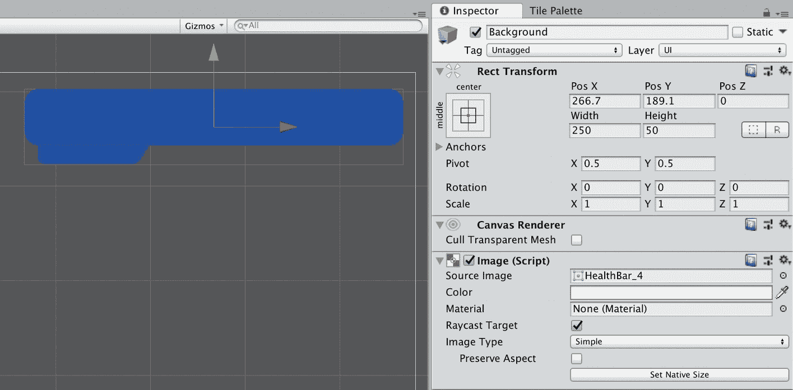
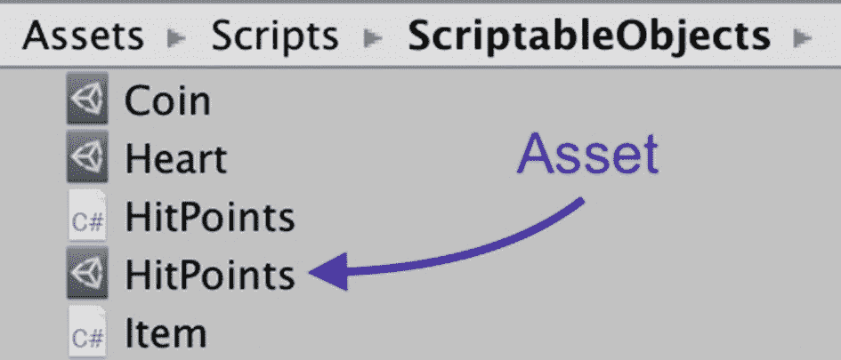
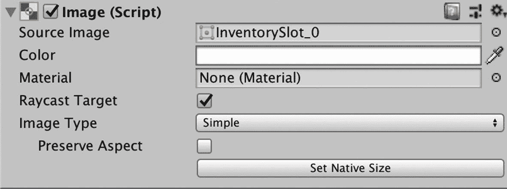

# 六、健康和库存

这一章很大。我们将把目前为止学到的所有东西结合起来，建立一个健康栏来跟踪玩家的生命值。除了利用游戏对象、可脚本化的对象和预设，我们将了解一些新的 Unity 组件类型，如画布和 UI 元素。

没有一个物品清单系统的 RPG 是不完整的，所以我们将建立一个，以及一个屏幕上的物品清单栏，显示玩家持有的所有物品。这将是一个紧张的章节，有很多脚本和预设，但在它结束时，你会对构建自己的游戏组件更有信心。

## 创建健康栏

正如我们在第 [5](5.html) 章的角色职业部分所讨论的，许多电子游戏都有角色生命值的概念和追踪生命值的生命值条。我们将建立一个健康栏来跟踪我们无畏的玩家的健康水平。

### 画布对象

我们的健康栏将使用一个叫做画布的东西作为主要的游戏对象。什么是画布？画布是一种特定类型的 Unity 对象，负责渲染用户界面，或 Unity 场景中的“UI”元素。Unity 场景中的每个 UI 元素都需要是 Canvas 对象的子对象。一个场景可能有多个画布对象，如果在创建新的 UI 元素时画布不存在，那么将创建一个画布，并且新的 UI 元素将被添加为该画布的子元素。

### 用户界面元素

UI 元素是封装特定的、通常需要的用户界面功能的游戏对象，例如按钮、滑块、标签、滚动条或输入字段。Unity 允许开发人员通过提供预制的 UI 元素快速构建定制的用户界面，而不是要求开发人员从头开始创建。

关于 UI 元素需要注意的一点是，它们使用 Rect 转换，而不是常规的转换组件。除了位置、旋转和缩放之外，矩形变换与常规变换相同，它们还具有宽度和高度。宽度和高度用于指定矩形的尺寸。

### 建造健康酒吧

右键单击层次视图中的任意位置，然后选择 UI ➤画布。这将自动创建两个对象:Canvas 和 EventSystem。将画布对象重命名为“HealthBarObject”。

EventSystem 是用户使用鼠标或其他输入设备直接与对象交互的一种方式。我们暂时不需要，你可以删除。

选择 HealthBarObject 并查找画布组件。确保渲染模式被设置为屏幕空间覆盖，并勾选“像素完美”复选框。

将渲染模式设置为屏幕空间覆盖可确保 Unity 在场景顶部渲染 UI 元素。如果调整屏幕大小，包含 UI 元素的画布将自动调整自身大小。画布组件设置自己的矩形变换设置，并且不能更改。如果你需要一个更小的 UI 元素，你可以调整元素本身的大小，而不是画布。

现在我们已经创建了一个 Canvas 对象，让我们确保所有的 UI 元素，比如我们正在构建的健康栏，在屏幕上总是具有相同的相对大小。

选择 HealthBarObject 并查找画布缩放组件。将 UI 缩放模式设置为:随屏幕尺寸缩放，如图 [6-1](#Fig1) 所示，并将单位参考像素设置为 32。


图 6-1

设置用户界面缩放模式

这可以确保画布大小随屏幕大小适当缩放。

是时候导入我们将用于健康栏的精灵了。在精灵文件夹中新建一个名为“健康栏”的子文件夹。我们会把所有和生命值相关的精灵放在这个文件夹里。现在将名为“HealthBar.png”的 spritesheet 拖动到我们刚刚创建的文件夹中。

选择健康栏 spritesheet，并在检查器中使用以下导入设置:

*   纹理类型:精灵(2D 和用户界面)

*   精灵模式:多重

*   每单位像素:32

*   过滤器模式:点(无过滤器)

*   确保选择底部的默认按钮，并将压缩设置为:无

按下应用按钮，然后打开精灵编辑器。

在切片菜单中，确保“类型”设置为:自动。我们将让 Unity 编辑器检测这些精灵的边界。

按“应用”切割精灵，然后关闭精灵编辑器。

接下来，我们将向 HealthBarObject 添加一个 Image 对象，它是一个 UI 元素。选择 HealthBarObject，右键单击，然后转到 UI ➤图像对象以创建图像。

这个图像对象将作为 HealthBar 的背景图像。将对象重命名为“背景”。单击源图像旁边的点，选择标题为“HealthBar_4”的切片图像。如图 [6-2](#Fig2) 所示，图像最初看起来是方形的。


图 6-2

调整尺寸前的背景图像

选择背景对象，将矩形变换宽度更改为:250，高度更改为:50。

按“W”使用移动工具的工具栏快捷方式。使用手柄，将背景对象移动到画布的右上角，如图 [6-3](#Fig3) 所示。



图 6-3

调整健康栏的大小和移动健康栏后

### 锚

您可能已经注意到图 [6-2](#Fig2) 和图 [6-4](#Fig4) 中间的星形符号。该符号由四个小三角形手柄组成，代表特定于 UI 元素的称为锚点的属性。


图 6-4

所选 UI 元素的锚点

如图 [6-5](#Fig5) 中的蓝线所示，锚点中的每个菱形对应于 UI 元素的 Rect 变换的一个角。左上角的锚点菱形对应于 UI 元素的左上角，依此类推。


图 6-5

四个锚点对应于 UI 元素的四个角

UI 元素的每个角总是以相对于其各自锚点的相同距离呈现。这确保了 UI 元素总是在相同的位置，一个场景接一个场景。当画布的大小随着屏幕的大小一起缩放时，在锚点和 UI 元素之间设置一致的距离的能力变得特别有用。

通过调整锚点的位置，我们可以确保健康栏总是出现在屏幕的右上角。我们将定位锚点，以显示屏幕边缘和健康栏之间的小边界，而不管屏幕有多大。

### 调整锚点

选择背景对象。在矩形变换组件中，点击图 [6-6](#Fig6) 中高亮显示的锚点预设图标。


图 6-6

“锚点预置”按钮

按下图标会给你一个锚预置菜单，如图 [6-7](#Fig7) 所示。默认情况下，选择中间-中心。这解释了为什么背景对象的锚点出现在画布的中间。


图 6-7

默认锚点预设为:中间-中心

我们希望始终将健康栏固定在相对于屏幕右上角的位置。在标题为“右”的列和标题为“上”的行中选择锚点预置设置。你会看到一个白色的方框围绕着选定的锚点预置，如图 [6-8](#Fig8) 所示。


图 6-8

选择右上锚点预设

按下锚点预设图标将其关闭，并注意锚点现在如何移动到画布的右上角(图 [6-9](#Fig9) )。


图 6-9

锚点预置现在位于画布的右上角

我们在健康栏和画布的角落之间留了一点空间，锚点都集中在右上角。不管我们将屏幕尺寸缩放到什么程度，健康栏总是位于那个确切的位置。

### 小费

如果“矩形变换”组件在检查器中折叠，锚点将不会出现。如果您在选择 UI 元素时没有看到锚点，请确保单击“Rect Transform”左侧的小箭头，以便在组件折叠时将其展开。

### 用户界面图像遮罩

右键单击背景对象并创建另一个图像对象。因为我们在选择背景对象的同时创建了这个图像对象，所以它将被创建为一个“子”对象。它是与背景图像对象相同的*类型*的对象，但是我们使用它的方式有点不同。子图像对象将充当遮罩。这个面具和你在万圣节可能戴的面具有点不同。事实上，它的作用与万圣节面具正好相反。这个遮罩不会隐藏它下面的内容，只会显示任何符合遮罩形状的底层子图像的一部分。在这种情况下，底层图像将是 health meter，并将作为子对象添加。

选择图像对象，并将其重命名为“BarMask”。将源图像设置为:HealthBar_3。它看起来应该如图 [6-10](#Fig10) 所示。


图 6-10

为健康栏遮罩设置源图像后

如图 [6-10](#Fig10) 所示，作为 UI 元素的子对象也有锚点，但是这些锚点是相对于它们的父对象的。默认情况下，BarMask 的锚点相对于背景对象居中。

选择 BarMask 对象，将矩形变换的大小调整为宽度:240 和高度:30。我们想让 BarMask 比 health bar 的尺寸小一点，以显示实际 health meter 周围的边距。

按“W”使用移动工具的工具栏快捷方式。如图 [6-11](#Fig11) 所示，将酒吧老板移动到位。如果您喜欢在矩形转换中手动输入位置，可以设置位置 X: 0，位置 Y: 6。


图 6-11

将巴尔马克移动到位

在 BarMask 对象仍然被选中的情况下，点击检查器中的添加组件按钮，添加一个“Mask”组件，如图 [6-12](#Fig12) 所示。


图 6-12

向 BarMask 对象添加一个遮罩组件

这是将进行实际屏蔽的组件。包含遮罩的父对象的任何子对象都将被自动遮罩。

右键单击 BarMask 并添加一个类型为 Image 的子 UI 元素。这与我们之前创建 BarMask 时遵循的过程相同。称这个子图像对象为:“米”。将其源图像设置为:HealthBar_0，如图 [6-13](#Fig13) 所示，并将宽度设置为:240，高度设置为:30。


图 6-13

设定仪表图像对象的尺寸

因为米与 BarMask 的大小相同，并且是作为子对象创建的，所以您不必重新定位它。

本书的资源中包含的 spritesheet 图像包括几个替代的仪表图像。在这个例子中，我们使用的是实心绿色指示器，但是您可以随意选择您最喜欢的指示器。

选择仪表对象，并在图像组件上，将图像类型更改为:填充。然后将填充方法更改为:水平，并将填充原点更改为:左侧。这些设置将确保健康条*从左到右水平填充*。

选择仪表对象后，慢慢向左滑动填充量滑块。如图 [6-14](#Fig14) 所示，你会看到计量器慢慢缩小，表示玩家正在失去生命值。


图 6-14

向左移动填充量以模拟玩家正在失去生命值

我们将编写代码，以编程方式更新计量器的填充量，以指示剩余的点击次数。

### 小费

理解 UI 元素是如何呈现的很重要。对象在层次视图中出现的顺序就是它们将被渲染的顺序。将首先渲染层次中最顶层的对象，最后渲染底层的对象，导致最顶层的对象出现在背景中。

### 导入自定义字体

您很可能希望在项目中使用自定义字体。幸运的是，在 Unity 中导入和使用自定义字体非常简单。这个项目包括一个免费的定制字体，具有复古风格，称为丝网印刷。Silkscreen 是 Jason Kottke 创造的字体。

右键单击项目视图中的 Assets 文件夹，并创建一个名为“Fonts”的新文件夹。

打开本地计算机上保存本章资源文件的目录，并查看 Fonts 文件夹。找到。标题为“silkscreen.zip”的 zip 文件，双击它将其解压缩。解压它会创建另一个名为“silkscreen”的文件夹，在这个文件夹中，你会看到一个名为“slkscr.ttf”的文件。

将字体文件“slkscr.ttf”拖放到 Unity 项目的 Fonts 文件夹中以导入它。Unity 将检测文件类型，并使字体在任何相关的 Unity 组件中可用。

### 添加命中点文本

右键单击背景对象并从菜单中选择:UI ➤文本，添加一个文本 UI 元素作为背景的子元素。将对象重命名为“HPText”。这个文本对象将显示剩余的生命值。

在 HPText 的 Rect Transform 组件上，将宽度设置为:70，高度设置为:16。在 HPText 的文本组件上，将字体大小更改为 16，并将颜色更改为白色。将字体改为“slkscr”，这是我们刚刚导入的自定义丝印字体。如图 [6-15](#Fig15) 所示，将段落水平对齐和垂直对齐分别设置为左对齐和中对齐。


图 6-15

配置文本组件

健康栏图像底部有一个小托盘，提供背景并提高文本的可视性。将 HPText 对象移动到托盘上，使其类似于图 [6-16](#Fig16) 。


图 6-16

将 HPText 对象移动到托盘中

将 HPText 锚点改为左下方，如图 [6-17](#Fig17) 所示。


图 6-17

将 HPText 锚点设置为左下方

我们希望确保 HPText 与其父对象的左侧和底部保持相同的距离。

将 HealthBarObject 拖动到 prefabs 文件夹中，创建一个预置，并将预置重命名为:HealthBarObject。不要从层次视图中删除 HealthBarObject 我们稍后将使用它。

最终，我们将在 Player 对象中创建一个对 HealthBarObject 预置的引用，这样玩家脚本就可以很容易地找到它。但是首先我们必须构建健康栏脚本。

### 编写健康栏脚本

玩家类从角色类继承属性:生命值。现在，生命值只是一个常规类型:整数。我们将利用脚本化对象的能力在健康栏和玩家类之间共享生命值数据。

计划是创建此 HitPoints 可脚本化对象的实例，并将资产保存到 ScriptableObjects 文件夹。我们将向 Player 类添加一个 HitPoints 属性，并创建一个单独的包含 HitPoints 属性的 HealthBar 脚本。因为两个脚本都包含对相同的可脚本化对象资源:生命点的引用，所以生命点数据将在这两个脚本之间自动共享。

当我们构建这个功能时，请记住，我们正在对代码的某些部分进行更改，这将暂时破坏游戏，并导致游戏无法编译。这很正常——把它想象成拆开一个汽车引擎来升级一个零件，然后再把引擎装回去。发动机拆开后就不运转了，但一旦重新组装起来，就会比以前运转得更好。

在 Scriptable Objects 文件夹中，右键单击并创建一个名为 HitPoints 的新脚本，并将其更新为使用以下代码。

### 可编写脚本的对象:生命值

```cs
using UnityEngine;

// 1
[CreateAssetMenu(menuName = "HitPoints")]
public class HitPoints : ScriptableObject
{

// 2
    public float value;
}

```

```cs
// 1

```

我们在第 5 章中使用了同样的技术。`CreateAssetMenu`在“创建”子菜单中创建一个条目，这允许我们轻松地创建 HitPoints 可脚本化对象的实例。这些实例作为资产保存在 Unity 项目中。

```cs
// 2

```

使用一个浮子来保持生命值。我们需要在健康栏的计量器对象中为 Image 对象属性:Fill Amount 分配一个 float，这样我们的生活从一个 float 开始会更容易一些。

### 更新角色脚本

我们需要对角色脚本做一个小小的改动，以利用我们刚刚创建的生命值脚本。在角色脚本中，更改该行:

```cs
public int hitPoints;

```

致:

```cs
public HitPoints hitPoints;

```

我们已经将类型从:`int`更改为新创建的可脚本化对象:`HitPoints`。

并将`maxHitPoints`的类型从`int`更改为`float`:

```cs
public float maxHitPoints;

```

因为我们在 HitPoints 对象中使用了一个`float`来存储当前值，所以我们也将角色脚本中的`maxHitPoints`更改为`float`。

添加以下附加属性:

```cs
public float startingHitPoints;

```

我们将使用这个属性来设置一个角色开始时的生命值。

### 更新玩家脚本

在`Start()`方法上方的任意位置添加以下两个属性。

```cs
// 1
public HealthBar healthBarPrefab;

// 2
HealthBar healthBar;

```

```cs
// 1

```

用于存储健康栏预置的引用。我们将使用这个引用作为参数来实例化()我们实例化了一个 HealthBar 预置的副本。

```cs
// 2

```

用于存储对实例化 HealthBar 的引用。

在现有的`Start()`方法中，添加以下几行:

```cs
// 1
hitPoints.value = startingHitPoints;

// 2
healthBar = Instantiate(healthBarPrefab);

```

```cs
// 1

```

当脚本被启用时,`Start()`方法将只被调用一次。我们想让玩家从`startingHitPoints`开始，所以我们把它分配给当前的`hitPoints.value`。

```cs
// 2

```

实例化一个健康栏预置的副本，并在内存中存储对它的引用。

有一件重要的事情我们没有做，当我们编写的逻辑拾起心脏和增加玩家的生命值。玩家当前的生命值不能超过他们允许的最大生命值。我们现在将添加该逻辑。

将`OnTriggerEnter2D()`方法改为:

```cs
void OnTriggerEnter2D(Collider2D collision)
{
    if (collision.gameObject.CompareTag("CanBePickedUp"))
    {
        Item hitObject = collision.gameObject.GetComponent<Consumable>().item;

        if (hitObject != null)
        {
// 1
            bool shouldDisappear = false;

            switch (hitObject.itemType)
            {
                case Item.ItemType.COIN:
// 2
                    shouldDisappear = true;
                    break;
                case Item.ItemType.HEALTH:
// 3
                    shouldDisappear = AdjustHitPoints(hitObject.quantity);
                    break;
                default:
                    break;
            }
// 4
            if (shouldDisappear)
            {
                collision.gameObject.SetActive(false);
            }
        }
    }
}

// 5
public bool AdjustHitPoints(int amount)
{

// 6
    if (hitPoints.value < maxHitPoints)
    {

// 7
        hitPoints.value = hitPoints.value + amount;

// 8
        print("Adjusted HP by: " + amount + ". New value: " + hitPoints.value);

// 9
        return true;
    }

// 10
    return false;
}

```

```cs
// 1

```

该值将被设置为指示碰撞中的对象应该消失。

```cs
// 2

```

默认情况下，玩家碰撞到的任何硬币都应该消失，给人一种它们已经被捡起并添加到玩家库存中的错觉。我们将在下一节创建一个玩家清单，所以现在这一行就足够了。

```cs
// 3

```

我们将添加额外的逻辑来“限制”生命值:`maximumHitPoints`——玩家类从角色类继承的属性。下面提到的`AdjustHitPoints()`方法，如果生命值被调整，将返回`true`，如果没有被调整，将返回`false`。

尽管玩家的生命值已满，`AdjustHitPoints()`将返回 false，他们碰到的任何红心都不会被“捡起”并在场景中保持活跃。

```cs
// 4

```

如果`AdjustHitPoints()`返回 true，那么预设对象应该消失。按照我们设计这种逻辑的方式，我们将来添加到 switch 语句中的任何新项目也可以设置`shouldDisappear`值来使对象消失。

```cs
// 5

```

`AdjustHitPoints()`方法将返回类型:`bool`，表示`hitPoints`是否调整成功。

```cs
// 6

```

检查当前生命值是否低于最大允许生命值。

```cs
// 7

```

按金额调整玩家当前`hitPoints`。这种方法也允许负调整。

```cs
// 8

```

打印出一个帮助调试的方法。这是可选的。

```cs
// 9

```

返回`true`表示生命值被调整。

```cs
// 10

```

Return `false`表示玩家的生命值没有被调整。

### 创建健康栏脚本

右键单击 MonoBehaviours 文件夹 HealthBar:script，creation，并创建一个名为 HealthBar 的新 C#。使用以下代码创建健康栏脚本。

```cs
using UnityEngine;

// 1
using UnityEngine.UI;

public class HealthBar : MonoBehaviour
{

// 2
    public HitPoints hitPoints;

// 3
    [HideInInspector]
    public Player character;

// 4
    public Image meterImage;

// 5
    public Text hpText;

// 6
    float maxHitPoints;

    void Start()
    {

// 7
        maxHitPoints = character.maxHitPoints;
    }

    void Update()
    {

// 8
        if (character != null)
        {
// 9
            meterImage.fillAmount = hitPoints.value / maxHitPoints;

// 10
            hpText.text = "HP:" + (meterImage.fillAmount * 100);
        }
    }
}

```

```cs
// 1

```

使用 UI 元素需要导入名称空间`UnityEngine.UI`。

```cs
// 2

```

玩家预设引用的同一生命值资产(可脚本化的对象)。这个数据容器允许我们在两个对象之间自动共享数据。

```cs
// 3

```

我们需要一个对当前玩家对象的引用来检索`maxHitPoints`。此引用将通过编程方式设置，而不是通过 Unity 编辑器设置，因此在检查器中隐藏它以消除混淆是有意义的。

我们使用`[HideInInspector]`在 Inspector 中隐藏这个公共属性。`[HideInInspector]`的括号语法表明它是一个**属性**。属性允许方法和变量的附加行为。

```cs
// 4

```

为了方便和简单起见，我们创建了这个属性，这样我们就不必搜索各种子对象来查找仪表图像对象。一旦附加了 HealthBar 脚本，我们将在 Unity 编辑器中通过将计量器对象拖放到该属性中来进行设置。

```cs
// 5

```

这是为了方便和简单而创建的另一个属性。我们将在 Unity 编辑器中通过将 HPText 对象拖放到该字段中来进行设置。

```cs
// 6

```

因为在我们当前的游戏设计中，生命值的最大值不会改变，我们将把它缓存在一个局部变量中。

```cs
// 7

```

检索并存储角色的最大生命值。

```cs
// 8

```

在我们试图对它做任何事情之前，检查以确保对`character`的引用不为空。

```cs
// 9

```

图像的填充量属性要求该值介于 0 和 1 之间。我们通过将当前点击量除以最大点击量将当前点击量转换成百分比，然后将结果分配给计量器的填充量属性。

```cs
// 10

```

修改 HPText 文本属性，以整数形式显示剩余的生命值。将`fillAmount`乘以 100(如. 40 =气血:40，或. 80 =气血:80)。

### 小费

当你为你的游戏构建架构时，考虑一下一个公共变量是否需要在 Unity 编辑器中可见，或者它是否可以通过编程来设置。如果它是以编程方式设置的，那么当你检查一个预设并且不记得某个属性是否需要被设置时，使用`[HideInInspector]`属性可以让你避免一些困惑。

我们还需要补充最后一点。回到播放器脚本，在现有的`Start()`方法中，添加下面一行:

```cs
healthBar.character = this;

```

这一行将`healthBar`中的`Player character`属性设置为实例化的播放器。我们把这个保存到最后，这样你就可以看到我们刚刚添加到 HealthBar 的代码和播放器脚本之间的联系。HealthBar 脚本使用这个 player 对象来检索`maxHitPoints`属性。

### 配置健康栏组件

切换回 Unity 编辑器，并从项目视图的 Prefabs 文件夹中选择 HealthBarObject。向 HealthBar 对象添加 Health Bar 脚本。

我们刚刚创建的属性应该是空白的，如图 [6-18](#Fig18) 所示。


图 6-18

设置属性前的健康栏脚本

在“可编写脚本的对象”文件夹中，右键单击并使用我们创建的菜单选项:“创建➤生命点”来创建生命点对象的新实例。重命名为:“生命值”，如图 [6-19](#Fig19) 所示。这个 HitPoints 对象是一个实际的资源，保存在项目文件夹中。



图 6-19

从可编写脚本的对象创建生命点资源

选中 HealthBarObject，将 HitPoints 对象拖动到 Hit Points 属性上，如图 [6-20](#Fig20) 所示。


图 6-20

将点击对象拖至属性

如你所见，生命值属性现在是**粗体**。正如我们之前所讨论的，这是 Unity 编辑器提醒我们的方式，我们只改变了预置的这个特定实例。如果我们想将更改应用到预设的所有实例，我们必须按下检查器右上角的应用按钮。请记住，在未来的某些情况下，你可能不希望对每个现有的预设进行修改。

我们将设置我们在 Health Bar 脚本中创建的属性，该脚本被添加到 HealthBarObject 中。脚本中的`HitPoints hitPoints`和`Text hpText`等属性实际上会被设置为引用 HealthBarObject 的一些子对象。

选择 Health Bar 对象，并单击 Health Bar 脚本中每个属性旁边的小圆点。为每个属性选择合适的值，如图 [6-21](#Fig21) 所示。完成后，请按下检查器中的“应用”按钮。


图 6-21

使用健康栏上的相应对象设置血糖仪图像和 Hp 文本

在预设文件夹中选择玩家对象预设。将我们创建的 HitPoints 脚本化对象拖到播放器脚本的 Hit Points 属性中。请记住，我们在健康栏对象中使用了相同的生命值对象。生命值数据像魔法一样在两个独立的物体之间共享。

在玩家脚本中设置属性如下:起始生命值为 6，最大生命值为 10，拖动 HealthBarObject 设置生命条预置属性如图 [6-22](#Fig22) 所示。


图 6-22

将健康栏预设属性设置为 HealthBarObject 预设

让我们总结一下我们刚刚构建的内容。

*   当玩家撞上一颗心时，`AdjustHitPoints()`增加生命值。

*   HealthBar 脚本还有一个名为`hitPoints`的属性，它引用了与播放器相同的生命值对象。HealthBar 继承自`MonoBehaviour`，这意味着它在每一帧都调用`Update()`方法。

*   在 HealthBar 脚本的`Update()`方法中，我们检查当前的`value`内部生命值，并在仪表图像上设置填充量。这将调整健康计的视觉外观。

是时候测试一下健康棒了。确保您已经保存了所有的 Unity 脚本，并在 HealthBarObject 上按 apply 以应用更改。删除 HealthBarObject 以将其从层次结构中删除。

按 Play，让玩家走来走去捡红心。玩家每捡起一颗红心，生命值就会增加 10 点，如图 [6-23](#Fig23) 所示。


图 6-23

每当玩家收集到一颗心，生命值条就会增加点数

恭喜你！你建了一个健康吧！

### 小费

如果您需要处理层次结构或项目视图中的对象，但想要在检查器中保持不同的对象可见，请单击如图 [6-24](#Fig24) 所示的锁图标，以保持原始对象可见。当您需要拖动其他对象并将其设置为属性时，锁定对象会使工作变得更加容易。要解锁对象，只需再次按下锁图标。


图 6-24

使用锁定按钮使对象在检查器中保持打开状态

## 库存

许多电子游戏都有库存的概念——一个存放玩家所拿物品的地方。在本节中，我们将创建一个库存栏，其中包含几个存放物品的物品槽。一个脚本将被附加到库存栏，它将管理玩家的库存以及库存栏本身的外观。我们将把库存栏变成一个预置，并在玩家对象中存储对它的引用，就像我们对健康栏所做的那样。

右键单击层次视图中的任意位置，然后选择 UI ➤画布；这将创建两个对象:Canvas 和 EventSystem。将画布对象重命名为“InventoryObject”并删除 EventSystem。

选中 InventoryObject，在 Canvas 组件中选中:Pixel Perfect，并将 UI Scale Mode 属性设置为:Scale with Screen Size，就像我们之前对 Health Bar 所做的那样。

再次右键单击 InventoryObject 并选择 Create Empty。这将创建一个空的 UI 元素。将空元素重命名为:“InventoryBackground”。

### 小费

如果看不到正在处理的对象，请在层次视图中双击该对象，使其在场景中居中。双击 InventoryBackground 对象使其居中。

确保选择“库存背景”,然后按“添加组件”按钮。搜索并添加水平布局组，如图 [6-25](#Fig25) 所示。


图 6-25

添加水平布局组

水平布局组组件将自动安排其所有子视图水平并排放置。

选中 InventoryObject，创建一个空的 GameObject 子对象，并将其重命名为:“Slot”。

插槽对象将显示单个项目或大量“可堆叠”的项目。当我们的游戏运行时，我们将编程实例化插槽预置的五个副本。

每个 Slot 父对象将包含四个子对象:背景图像、托盘图像、项目图像和文本对象。

如图 [6-26](#Fig26) 所示，选择槽对象并在矩形变换组件中将其宽度和高度设置为 80 和 80。


图 6-26

将槽元素尺寸设置为 80 × 80

你的 Slot 元素的位置 X 和位置 Y 可能与图 [6-26](#Fig26) 不同，这没关系，因为我们无论如何都要以编程方式实例化它们。

右键单击插槽对象并选择 UI ➤图像以创建图像子对象。将子对象重命名为:“背景”。右键单击 Slot 对象并创建另一个名为“ItemImage”的图像。Background 和 ItemImage 都应该是 Slot 的子元素。

现在，我们将添加一个小“托盘”，在其中放置可堆叠物品数量文本。选择背景对象并创建一个图像子对象。将图像对象重命名为:“托盘”。右键单击托盘并选择 UI ➤文本创建一个文本子对象，重命名该对象:“QtyText”。

完成后，插槽结构应该如图 [6-27](#Fig27) 所示。


图 6-27

设置托盘和 QtyText 子项

所有这些对象在层次结构中的顺序都是正确的，这一点很重要。如图 [6-27](#Fig27) 所示对它们进行排序将确保背景先渲染，然后 ItemImage、Tray 和 QtyText 在其上渲染。如果您不小心用错误的父对象创建了一个对象，只需单击并将其拖到正确的父对象上。

### 导入库存插槽图像

在精灵下创建一个名为“库存”的新文件夹。在下载本章资源的本地目录中，从 Spritesheets 文件夹中选择名为“InventorySlot.png”的 spritesheet。将其拖动到项目视图的 Sprites/Inventory 文件夹中。

选择清单 Slot spritesheet，并在检查器中使用以下导入设置:

*   纹理类型:精灵(2D 和用户界面)

*   精灵模式:多重

*   每单位像素:32

*   过滤器模式:点(无过滤器)

*   确保选择底部的默认按钮，并将压缩设置为:无

按下应用按钮，然后打开精灵编辑器。

在切片菜单中，确保“类型”设置为:自动。我们将让 Unity 编辑器检测这些精灵的边界。

按“应用”切割精灵并关闭精灵编辑器。

### 配置库存插槽

库存插槽由几个不同的项目组成，每个项目都有自己的配置。配置完成后，我们将把库存槽变成它自己的预置，并把它从主库存对象中分离出来。

#### 配置项目图像

选择槽中的 ItemImage 对象。在矩形转换组件中，将宽度和高度更改为 80。

通过选中检查器中组件左上角的框来禁用图像。我们将在将图像放入插槽后启用它。ItemImage 的图像组件应类似于图 [6-28](#Fig28) 。


图 6-28

禁用 ItemImage 的图像组件

我们禁用图像，因为如果没有源图像提供给图像组件，图像组件将默认为默认颜色。我们不想显示一个巨大的空白盒，所以我们禁用图像组件，直到我们有一个源图像显示。

#### 配置背景

选择背景对象，并确保图像组件的设置如图 [6-29](#Fig29) 所示。使用“InventorySlot_0”作为源映像，并确保映像类型设置为简单。



图 6-29

配置插槽的背景

将背景的矩形变换组件的宽度和高度设置为 80 和 80，如图 [6-30](#Fig30) 所示。


图 6-30

设置背景的宽度和高度

#### 配置托盘

选择托盘对象，将其宽度和高度更改为 48 × 32。将图像组件的源图像设置为:“InventorySlot_1”，如图 [6-31](#Fig31) 所示。


图 6-31

设置托盘图像

因为托盘是作为背景的子对象添加的，所以它被自动设置为 0 和 0 的位置 X 和位置 Y，如图 [6-32](#Fig32) 所示。


图 6-32

托盘的默认位置

将托盘的锚点设置为右下角，然后再次将位置 X 和位置 Y 更改为 0 和 0。这将导致托盘的中心移动到其父对象的右下角，如图 [6-33](#Fig33) 所示。


图 6-33

锚点设置为右下角，位置 X，Y 设置为:0，0

#### 配置数量文本-数量文本

文本对象用于向用户显示不可交互的文本。它们有助于在游戏中显示文本、调试和设计自定义 GUI 控件。库存中的文本对象将用于显示投币口中可堆叠物品的数量，如硬币。

选择文本组件，将其宽度更改为 25，高度更改为 20。在文本(脚本)组件中，将文本更改为“00”。我们将文本更改为 00，以帮助我们看到文本的位置。将字体设置为“slkscr”(我们定制的丝印字体)，保持正常的字体样式。将字体大小改为 16，颜色改为白色，对齐方式如图 [6-34](#Fig34) 所示。


图 6-34

在文本对象中配置文本组件

因为 QtyText 对象是 Tray 的一个子对象，所以我们将保留锚点的默认值:middle-center。没必要移动它们。

对文本的位置满意后，通过取消选中文本对象上文本组件左上角的框来禁用文本组件。我们禁用文本，因为我们不想显示数量，直到我们有多个可堆叠的项目占据同一个插槽。我们将以编程方式启用该组件。

#### 创建预设

现在所有的子元素都就位了，我们要用插槽制作一个预置。我们将以编程方式实例化这个预置的副本，并使用它们来填充库存栏。

选择高亮显示的项目:Slot，如图 [6-35](#Fig35) 所示，并将其拖入 prefabs 文件夹来创建一个 Slot 预置。确保你没有选择整个 inventory object——我们只是想从插槽中创建一个预置。我们一会儿会回来使用这个预制屋。


图 6-35

选择并拖动插槽到预设文件夹来创建一个预设

一旦你从插槽中创建了一个预置，从层次视图中删除插槽，这样只剩下清单对象和清单背景。它应该类似于图 [6-36](#Fig36) 。


图 6-36

在创建一个槽预置并从它的父槽中移除该槽后

最后但并非最不重要的是，点击并拖动库存对象到预设文件夹来创建一个预设，然后从层次中删除它。

#### 构建插槽脚本

我们将构建一个简单的脚本来保存对插槽中文本对象的引用。该脚本将被附加到每个插槽对象。

在项目视图中选择插槽预置，并添加一个名为“插槽”的新脚本。在脚本中使用以下代码:

```cs
using UnityEngine;
using UnityEngine.UI;

// 1
public class Slot : MonoBehaviour {

// 2
    public Text qtyText;
}

```

```cs
// 1

```

从 MonoBehaviour 继承，以便我们可以将此脚本附加到插槽对象。

```cs
// 2

```

对槽内文本对象的引用。我们将在 Unity 编辑器中进行设置。

保存这个脚本并切换回 Unity 编辑器。我们希望设置刚才在 Slot 脚本中创建的 Qty 文本属性。问题是，如果我们在项目视图中选择插槽预置，我们只能看到背景和 ItemImage 子项目，如图 [6-37](#Fig37) 所示。


图 6-37。在项目视图中选择托盘或 QtyText 子对象时，我们看不到它们

这个限制是 Unity 设计者故意设置的，目的是阻止开发人员引用嵌套父子层次结构内部的对象。

要在 Unity 编辑器中看到一个预设的所有子对象，我们需要临时实例化一个副本。将插槽预设拖到层次视图或场景中，以临时创建插槽的实例。

如果我们在项目视图中选择新实例化的副本，我们可以再次看到插槽的所有子对象，如图 [6-38](#Fig38) 所示。


图 6-38

查看所有插槽预置子对象

您将无法在场景中实际查看插槽预置，因为它目前不是画布对象的子对象。没关系——我们现在需要的就是能够访问 QtyText 对象

点击 Slot 脚本旁边的小点，设置 Slot 脚本上的 Qty Text 属性，如图 [6-39](#Fig39) 所示。


图 6-39

设置插槽脚本的数量文本属性

在脚本中包含对 QtyText 对象的引用使得以后的查找更加容易，而不必跟踪索引。通过特定索引引用对象也是一种有点脆弱的方式。如果顺序发生变化，或者添加了额外的组件，索引就会发生变化，脚本将不再正常工作。

按下检查器右上角的应用按钮，将更改应用到插槽预设，然后从层次视图中删除预设。

### 创建清单脚本

下一步是写一个脚本来管理玩家的库存，以及库存栏的外观。此脚本将附加到 InventoryObject。库存脚本将会比我们到目前为止所学的任何课程都要复杂，但是请将此视为一个学习和练习脚本技能的机会。

我们还将创建一个脚本来保存对 QtyText 的引用，并将该脚本附加到插槽预置中。

在项目视图的 MonoBehaviours 文件夹中，创建一个名为“Inventory”的新子文件夹。在 Inventory 文件夹中，右键单击并创建一个名为“Inventory”的新 C# 脚本。双击在 Visual Studio 中打开。

用下面的代码替换库存中的默认代码。

#### 设置属性

首先，我们要为 Inventory 类设置属性。

```cs
using UnityEngine;
using UnityEngine.UI;

public class Inventory : MonoBehaviour
{
// 1
    public GameObject slotPrefab;

// 2
    public const int numSlots = 5;

// 3
    Image[] itemImages = new Image[numSlots];

// 4
    Item[] items = new Item[numSlots];

// 5
    GameObject[] slots = new GameObject[numSlots];

    public void Start()
    {
      // Empty for now
    }
}

```

```cs
// 1

```

存储一个插槽预置的引用，我们将在 Unity 编辑器中附加它。我们的库存脚本将实例化这个预置的多个副本，用作库存槽。

```cs
// 2

```

清单栏将包含五个位置。我们使用`const`关键字，因为我们不应该在运行时动态修改这个数字，因为脚本中的几个实例变量依赖于它。

```cs
// 3

```

实例化一个名为`itemImages`的数组，大小为`numSlots` (5)。该数组将保存图像组件。每个图像组件都有一个 Sprite 属性。当玩家将一个物品添加到他们的库存中时，我们将这个 Sprite 属性设置为该物品中引用的 Sprite。精灵将显示在清单栏的槽中。请记住，我们游戏中的物品实际上只是可脚本化的对象，或数据容器，将信息捆绑在一起。

```cs
// 4

```

`items`数组将保存玩家拾取的可脚本化对象类型的实际项目的引用。

```cs
//5

```

数组中的每个索引将引用一个槽预置。这些槽预置是在运行时动态实例化的。我们将使用这些引用来查找槽内的文本对象。

#### 实例化插槽预置

将以下方法添加到 Inventory 类中。这个方法负责从预设中动态创建插槽对象。

```cs
public void CreateSlots()
{

// 1
    if (slotPrefab != null)
    {
// 2
        for (int i = 0; i < numSlots; i++)
        {
// 3
            GameObject newSlot = Instantiate(slotPrefab);
            newSlot.name = "ItemSlot_" + i;
// 4
           newSlot.transform.SetParent(gameObject.transform.GetChild(0).transform);

// 5
            slots[i] = newSlot;

// 6
            itemImages[i] = newSlot.transform.GetChild(1).GetComponent<Image>();
        }
    }
}

```

```cs
// 1

```

在我们尝试编程使用之前，检查以确保我们已经通过 Unity 编辑器设置了插槽预置。

```cs
// 2

```

循环遍历槽数。

```cs
// 3

```

实例化插槽预置的副本，并将其分配给`newSlot`。将实例化的 GameObject 的`name`改为“`ItemSlot_`”，并将索引号追加到末尾。`Name`是每个游戏对象的固有属性。

```cs
// 4

```

此脚本将附加到 InventoryObject。InventoryObject 预设只有一个子对象:Inventory。

将实例化槽的父对象设置为 InventoryObject 索引 0 处的子对象。索引为 0 的子对象是:存货，如图 [6-40](#Fig40) 所示。


图 6-40

Inventory 是 InventoryObject 在索引 0 处的子对象

```cs
// 5

```

将这个新的 Slot 对象分配给当前索引处的`slots`数组。

```cs
// 6

```

槽的索引 1 处的子对象是 ItemImage。我们从 ItemImage 子元素中检索图像组件，并将其分配给`itemImages`数组。当玩家拿起物品时，这个图像组件的源图像将出现在物品栏中。图 [6-41](#Fig41) 说明了 ItemImage 如何位于索引:1。


图 6-41

ItemImage 是索引为 1 的 Slot 的子对象

#### 填充 Start()方法

让我们填写`Start()`方法。这是一个短的。

```cs
public void Start()
{
// 1
    CreateSlots();
}

```

```cs
// 1

```

调用我们之前写的方法来实例化插槽预置并设置库存栏。

#### AddItem 方法

接下来，我们将构建一个方法，将一个项目实际添加到库存中。

```cs
// 1
public bool AddItem(Item itemToAdd) 

{
// 2
    for (int i = 0; i < items.Length; i++)
    {

// 3
        if (items[i] != null && items[i].itemType == itemToAdd.itemType && itemToAdd.stackable == true)
        {
            // Adding to existing slot
// 4
            items[i].quantity = items[i].quantity + 1;

// 5
            Slot slotScript = slots[i].gameObject.GetComponent<Slot>();

// 6
            Text quantityText = slotScript.qtyText;

// 7
            quantityText.enabled = true;

// 8
            quantityText.text = items[i].quantity.ToString();

// 9
            return true;
        }

// 10
        if (items[i] == null)
        {
            // Adding to empty slot
// Copy item & add to inventory. copying so we don’t change original Scriptable Object

// 11
            items[i] = Instantiate(itemToAdd);

// 12
            items[i].quantity = 1;

// 13
            itemImages[i].sprite = itemToAdd.sprite;

// 14
            itemImages[i].enabled = true;
            return true;
        }
    }

// 15
    return false;
}

```

因为这是一个较长的方法，每一行代码都包含在每一个解释的上方，所以您不必不停地来回翻页。

```cs
// 1
public bool AddItem(Item itemToAdd)

```

方法`AddItem`将接受类型为`Item`的单个参数。这是要添加到清单中的项目。该方法还返回一个`bool`,指示商品是否被成功添加到库存中。

```cs
// 2
for (int i = 0; i < items.Length; i++)

```

遍历`items`数组中的所有索引。

```cs
// 3

```

这三个条件与可堆叠物品相关。让我们来看一下这个 if 语句:

```cs
items[i] != null

```

检查当前索引是否不为空。

```cs
items[i].itemType == itemToAdd.itemType

```

检查商品的`itemType`是否等于我们要添加到库存中的商品的`itemType`。

```cs
itemToAdd.stackable == true

```

检查要添加的项目是否可堆叠。

这三个条件的组合将具有检查索引中的当前项目(如果存在)是否与玩家想要添加的类型相同的效果。如果它是相同的类型，并且是一个可堆叠的项目，那么我们希望将新项目添加到现有项目的堆叠中。

```cs
// 4
items[i].quantity = items[i].quantity + 1;

```

因为我们正在堆叠这个项目，所以在项目数组中的当前索引处增加数量。

```cs
// 5
Slot slotScript = slots[i].GetComponent<Slot>();

```

当我们实例化一个插槽预置时，我们真正做的是创建一个附有插槽脚本的游戏对象。这一行将获取对插槽脚本的引用。Slot 脚本包含对 QtyText 子文本对象的引用。

```cs
// 6
Text quantityText = slotScript.qtyText;

```

获取对文本对象的引用。

```cs
// 7
quantityText.enabled = true;

```

因为我们将可堆叠对象添加到已经包含可堆叠对象的插槽中，所以现在一个插槽中有多个对象。启用我们将用来显示数量的文本对象。

```cs
// 8
quantityText.text = items[i].quantity.ToString();

```

每个项目对象都有一个类型为`int`的数量属性。ToString()会将类型:`int`转换成类型:`String`，这样就可以用来设置文本对象的`text`属性。

```cs
// 9
return true;

```

因为我们能够向清单中添加一个对象，所以返回`true`表示成功。

```cs
// 10
if (items[i] == null)

```

检查项目数组的当前索引是否包含项目。如果它为空，那么我们将把`newItem`添加到这个槽中。

因为我们每次都是线性地遍历 items 数组，所以一旦我们找到一个包含 null 项的索引，就意味着我们遍历了所有已经保存的项。所以我们要么添加特定`itemType`的第一个项目，要么我们试图添加的项目不可堆叠。

注意，如果我们想在将来添加删除对象的功能，我们必须稍微修改这个逻辑。我们将添加这样的逻辑:当从一个槽中移除对象时，向左移动所有剩余的对象，并且不留下空槽。

```cs
// 11
items[i] = Instantiate(itemToAdd);

```

实例化一个`itemToAdd`的副本，并将其分配给`items`数组。

```cs
// 12
items[i].quantity = 1;

```

将项目对象上的数量设置为 1。

```cs
// 13
itemImages[i].sprite = itemToAdd.sprite;

```

将`itemToAdd`中的精灵分配给`itemImages`数组中的图像对象。请注意，这是我们之前在`CreateSlots()` : `itemImages[i] = newSlot.transform.GetChild(1).GetComponent<Image>();`中设置插槽时，用下面一行代码分配的精灵

```cs
// 14
itemImages[i].enabled = true;
return true;

```

使能`itemImage`并返回`true`表示`itemToAdd`添加成功。回想一下，我们最初禁用了图像，因为如果没有向图像组件提供源图像，图像组件将默认为默认颜色。因为我们已经分配了一个精灵，所以我们启用了图像组件。

```cs
// 15
return false;

```

如果两个 If 语句都没有将`itemToAdd`添加到库存中，那么库存一定是满的。返回`false`表示`itemToAdd`没有被添加。

保存清单脚本并返回 Unity 编辑器。

选择清单对象，并通过检查器将清单脚本附加到该对象。拖动插槽预置到库存脚本中的插槽预置属性。没有必要按下应用按钮，因为我们正在直接修改库存对象预置，而不是预置的一个实例。

#### 更新玩家脚本

我们已经建立了这个伟大的库存系统，但玩家对象完全不知道它的存在。打开播放器脚本并添加以下属性:`inventoryPrefab`和`inventory`，然后在现有的`Start()`方法中的任意位置添加`Instantiate(inventoryPrefab)`行:

```cs
// 1
public Inventory inventoryPrefab;

// 2
Inventory inventory;

public void Start()
{

// 3
    inventory = Instantiate(inventoryPrefab);

    hitPoints.value = startingHitPoints;
    healthBar = Instantiate(healthBarPrefab);
    healthBar.character = this;
}

```

```cs
// 1

```

存储对库存预置的引用。稍后我们将在 Unity 编辑器中使用它。

```cs
// 2

```

用于在库存实例化后存储对库存的引用。

```cs
// 3

```

实例化库存预置。这一行将在`inventory`变量中存储一个预置的引用。我们存储这个引用，这样我们就不必在每次想要使用它的时候搜索库存。

#### 最后一件事…

在现有的`OnTriggerEnter2D(Collider2D collision)`方法中，修改`switch`语句，如下所示:

```cs
switch (hitObject.itemType)
{
    case Item.ItemType.COIN:

// 1
        shouldDisappear = inventory.AddItem(hitObject);

// 2
        shouldDisappear = true;
             break;
        case Item.ItemType.HEALTH:
       shouldDisappear = AdjustHitPoints(hitObject.quantity);
             break;
             default:
       break;
}

```

```cs
// 1

```

在本地库存实例上调用`AddItem()`方法，并将其作为参数传递`hitObject`。将结果分配给`shouldDisappear`。如果你回想起当我们在建立健康栏的时候更新玩家脚本，如果`shouldDisappear`是`true`，那么玩家碰撞的游戏对象将被设置为无效。因此，如果对象被添加到清单中，那么原始对象将从场景中消失。

```cs
// 2

```

去掉这条线，因为我们不再需要它了。

保存玩家脚本并切换回 Unity 编辑器。

选择玩家预设，并将新创建的库存对象预设拖到玩家脚本的库存预设属性中。它看起来应该如图 [6-42](#Fig42) 所示。


图 6-42

将库存对象分配给库存预设属性

添加更多的硬币让玩家通过拖放硬币到场景中来拾取。

现在按播放键。让玩家在地图上走来走去，捡起硬币。注意当你持有多枚硬币时，数量计数器的文字是如何显示的，如图 [6-43](#Fig43) 所示。


图 6-43

玩家是正式的富有…非常富有

### 摘要

咻！嗯，这是相当多的，但想想我们已经完成了多少。我们已经使用了可脚本化的对象和预设，甚至学习了画布和 UI 元素。这一章让我们写了比以往更多的 C#，我们学到了一些保持游戏架构整洁的技巧。我们有一个正常运行的库存和健康栏，我们的游戏开始看起来像一个正常的 RPG。