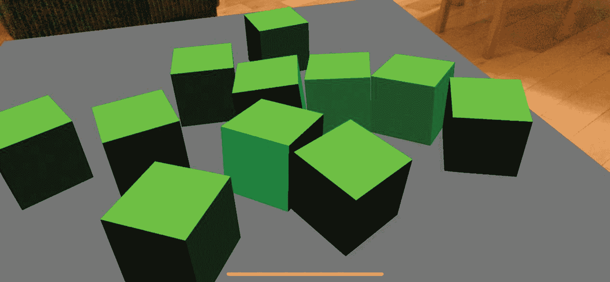

# 十四、物理学

SceneKit 为我们提供的另一个惊人的东西是物理引擎，我们可以在增强现实体验中使用它。这意味着我们可以给场景中放置的物品赋予相互交互的能力，就像它们是真实物体时你所期望的那样。

我们可以通过在 SCNNodes 上设置`SCNNode.PhysicsBody`属性来做到这一点。

## 给物品一个坚硬的结构

我们可以给我们的节点一些视觉外观之外的虚拟物质，这样东西就可以和它碰撞，就像它是固体一样，如清单 14-1 所示。

我们通过调用`PhysicsBody = SCNPhysicsBody.CreateKinematicBody()`将节点的物理实体设置为实体。

```cs
var material = new SCNMaterial();
material.Diffuse.Contents = UIColor.DarkGray;

var geometry = SCNPlane.Create(width, length);
geometry.Materials = new[] { material };

var planeNode = new SCNNode
{
    Geometry = geometry,
    PhysicsBody = SCNPhysicsBody.CreateKinematicBody(),
    EulerAngles = new SCNVector3((float)(-Math.PI / 2), 0, 0)
};

Listing 14-1Making a 2D plane rigid

```

一旦我们做到了这一点，如果其他具有实体的节点试图占据相同的空间，就会与它发生冲突，更重要的是，我们可以在这个固体平面的顶部放置物品。

## 对物体施加重力

我们可以让物品模拟受重力影响，也就是说，被直接拉下来，直到它们碰到另一个虚拟物品而停止，这个虚拟物品已经被赋予了一个刚体，就像我们之前在图 14-1 中所做的那样。

为了让一个节点像重力一样被拉下来，我们可以将它的`PhysicsBody`设置为一个动态体`PhysicsBody = SCNPhysicsBody.CreateDynamicBody()`，如清单 14-2 所示。

如果你在你的场景和节点中使用重力，我建议你也使用一个运动体作为一种物理表面或地板；否则，你会发现你的节点会从屏幕上掉到地球的中心！事实上，当它们远离视野时，它们会继续下降(但仍会使用应用内存！).

通过在下面放置一个动力学平面，我们可以阻止这种不寻常的和不希望的行为，并模仿一些更像真实世界的体验。

```cs
var material = new SCNMaterial();
material.Diffuse.Contents = UIColor.Green;

var size = 0.05f;
var geometry = SCNBox.Create(size, size, size, 0);
geometry.Materials = new[] { material };

var cubeNode = new SCNNode
{
    Geometry = geometry,
    PhysicsBody = SCNPhysicsBody.CreateDynamicBody(),
};

Listing 14-2Making a cube effected by gravity

```

## 结合重力和固体物体

在下面的例子中(列表 14-3 )，我们在场景中放置一个 2D 平面，并赋予它一个坚固的物理属性。然后，我们在 2D 平面上方产卵，它们受到重力的影响，被拉向下方，直到它们撞击并停在坚固的 2D 平面上。

```cs
public partial class ViewController : UIViewController
    {
        private readonly ARSCNView sceneView;

        public ViewController(IntPtr handle) : base(handle)
        {
            this.sceneView = new ARSCNView();
            this.View.AddSubview(this.sceneView);
        }

        public override void ViewDidLoad()
        {
            base.ViewDidLoad();
            this.sceneView.Frame = this.View.Frame;
        }

        public override void ViewDidAppear(bool animated)
        {
            base.ViewDidAppear(animated);

            this.sceneView.Session.Run(new ARWorldTrackingConfiguration
            {
                LightEstimationEnabled = true,
                WorldAlignment = ARWorldAlignment.Gravity
            });

            var planeNode = new PlaneNode(width:0.5f, length:0.5f, UIColor.DarkGray);

            this.sceneView.Scene.RootNode.AddChildNode(planeNode);
        }

        public override void TouchesEnded(NSSet touches, UIEvent evt)
        {
            base.TouchesEnded(touches, evt);

            if (!(touches.AnyObject is UITouch touch))
                return;

            var point = touch.LocationInView(this.sceneView);
            var hits = this.sceneView.HitTest(point, new SCNHitTestOptions());
            var hit = hits.FirstOrDefault();

            if (hit == null)

                return;

            var node = hit.Node;

            if (node == null)
                return;

            var cubeNode = new CubeNode(0.05f, UIColor.Green)
            {
                Position = new SCNVector3(
                    hit.WorldCoordinates.X,
                    hit.WorldCoordinates.Y + 0.1f,
                    hit.WorldCoordinates.Z
                )
            };

            this.sceneView.Scene.RootNode.AddChildNode(cubeNode);
        }

        public override void ViewDidDisappear(bool animated)
        {
            base.ViewDidDisappear(animated);
            this.sceneView.Session.Pause();
        }

        public override void DidReceiveMemoryWarning()
        {
            base.DidReceiveMemoryWarning();
        }
    }

    public class PlaneNode : SCNNode
    {
        public PlaneNode(float width, float length, UIColor color)

        {
            Geometry = CreateGeometry(width, length, color);
            PhysicsBody = SCNPhysicsBody.CreateKinematicBody();
            EulerAngles = new SCNVector3((float)(-Math.PI / 2), 0, 0);
        }

        private static SCNGeometry CreateGeometry(float width, float length, UIColor color)
        {
            var material = new SCNMaterial();
            material.Diffuse.Contents = color;
            material.DoubleSided = true;

            var geometry = SCNPlane.Create(width, length);
            geometry.Materials = new[] { material };
            return geometry;
        }
    }

    public class CubeNode : SCNNode
    {
        public CubeNode(float size, UIColor color)
        {
            Geometry = CreateGeometry(size, color);
            Position = new SCNVector3(0, size / 2, 0);
            PhysicsBody = SCNPhysicsBody.CreateDynamicBody();
        }

        private static SCNGeometry CreateGeometry(float size, UIColor color)
        {
            var material = new SCNMaterial();
            material.Diffuse.Contents = color;

            var geometry = SCNBox.Create(size, size, size, 0);
            geometry.Materials = new[] { material };
            return geometry;
        }
    }

Listing 14-3Using gravity to drop solid cubes onto a solid 2D plane

```



图 14-1

将固体立方体放到固体平面上

## 施加力

除了将基础物理应用于我们的节点，如重力，给它们一个坚固的结构，并允许它们相互接触，我们还可以对它们施加一个力。

在清单 14-4 中，我们将一个单独的盒子放在一个平面上，当接触盒子节点时，对它施加一个大的力，推动它向前离开平面。您可以尝试应用力的大小，看看节点在被触摸时会受到怎样的影响。

```cs
public partial class ViewController : UIViewController
    {
        private readonly ARSCNView sceneView;

        public ViewController(IntPtr handle) : base(handle)
        {
            this.sceneView = new ARSCNView();
            this.View.AddSubview(this.sceneView);
        }

        public override void ViewDidLoad()
        {
            base.ViewDidLoad();
            this.sceneView.Frame = this.View.Frame;
        }

        public override void ViewDidAppear(bool animated)
        {
            base.ViewDidAppear(animated);

            this.sceneView.Session.Run(new ARWorldTrackingConfiguration
            {
                LightEstimationEnabled = true,
                WorldAlignment = ARWorldAlignment.Gravity,
            });

            var planeNode = new PlaneNode(width: 0.3f, length: 0.3f, UIColor.LightGray);
            this.sceneView.Scene.RootNode.AddChildNode(planeNode);

            SCNNode boxNode = new SCNNode();

            var boxMaterial = new SCNMaterial();
            boxMaterial.Diffuse.Contents = UIColor.Blue;

            var boxGeometry = SCNBox.Create(0.04f, 0.06f, 0.04f, 0f);
            boxNode.Geometry = boxGeometry;
            boxNode.Geometry.FirstMaterial = boxMaterial;
            boxNode.PhysicsBody = SCNPhysicsBody.CreateDynamicBody();
            boxNode.Position = new SCNVector3(0.0f, 0.05f, 0.0f);

            this.sceneView.Scene.RootNode.AddChildNode(boxNode);
        }

        public override void TouchesEnded(NSSet touches, UIEvent evt)

        {
            base.TouchesEnded(touches, evt);

            if (!(touches.AnyObject is UITouch touch))
                return;

            var point = touch.LocationInView(this.sceneView);
            var hits = this.sceneView.HitTest(point, new SCNHitTestOptions());
            var hit = hits.FirstOrDefault();

            if (hit == null)
                return;

            var node = hit.Node;

            if (node == null)
                return;

            var forcePower = 10;
            var pointOfView = this.sceneView.PointOfView;
            var transform = pointOfView.Transform;
            var orientation = new SCNVector3(-transform.M31, -transform.M32, -transform.M33);

            node.PhysicsBody.ApplyForce(
                new SCNVector3(
                    orientation.X * forcePower,
                    orientation.Y * forcePower,
                    orientation.Z * forcePower), true);
        }

        public override void ViewDidDisappear(bool animated)
        {
            base.ViewDidDisappear(animated);
            this.sceneView.Session.Pause();
        }

        public override void DidReceiveMemoryWarning()
        {
            base.DidReceiveMemoryWarning();
        }
    }

    public class PlaneNode : SCNNode
    {
        public PlaneNode(float width, float length, UIColor color)
        {
            Geometry = CreateGeometry(width, length, color);
            PhysicsBody = SCNPhysicsBody.CreateKinematicBody();
            EulerAngles = new SCNVector3((float)(-Math.PI / 2), 0, 0);
        }

        private static SCNGeometry CreateGeometry(float width, float length, UIColor color)
        {
            var material = new SCNMaterial();
            material.Diffuse.Contents = color;
            material.DoubleSided = true;

            var geometry = SCNPlane.Create(width, length);
            geometry.Materials = new[] { material };
            return geometry;
        }
    }

    public class CubeNode : SCNNode
    {
        public CubeNode(float size, UIColor color)
        {
            Geometry = CreateGeometry(size, color);
            Position = new SCNVector3(0, size / 2, 0);
            PhysicsBody = SCNPhysicsBody.CreateDynamicBody();
        }

        private static SCNGeometry CreateGeometry(float size, UIColor color)
        {
            var material = new SCNMaterial();
            material.Diffuse.Contents = color;

            var geometry = SCNBox.Create(size, size, size, 0);
            geometry.Materials = new[] { material };
            return geometry;
        }
    }

Listing 14-4Apply force to an object in Augmented Reality

```

在 SceneKit 中有很多与物理相关的变量可以改变，包括质量和摩擦力。通过改变这些值，您将改变场景中的项目受物理影响的方式。

Note

同样，我们可以对一个物体施加力，我们也可以对一个物体施加力矩，也就是说，使一个物体绕轴旋转。你可以通过调用`SCNPhysicsBody.ApplyTorque()`来实现。

## 要尝试的事情

这里有一些不同的东西，你可以在 ARKit 中尝试和学习物理。

**尝试改变摩擦力、质量和其他物理属性** `.`

尝试改变场景中对象的一些属性，包括它们的摩擦力和质量，看看这会如何影响它们在场景中的行为。

**使用 ApplyForce()来发射物体。**

在不同的方向和其他物体上玩射击游戏。看看能不能打翻其他物体。

**使用不同形状的物体。**

不要只使用立方体，例如，看看球体如何从斜面滚下。

**使用 ApplyTorque()对物体施加扭矩。**

查看对具有不同物理属性的不同形状的物体施加扭矩时它们的行为。

## 摘要

SceneKit 为我们提供了一个非常复杂的物理引擎。让场景中的项目像真实物体一样响应交互，可以为您的 AR 体验增加另一个层次的真实感。可以看到一些游戏是如何很好的利用 ARKit 内置的物理引擎的。

在前面的章节中，我们已经看到了如何使用 ARKit 进行图像检测、人脸检测和平面检测。在下一章，我们将看看如何识别场景中的 3D 物体。听起来不可能？好吧，让我们用物体检测来找出答案。