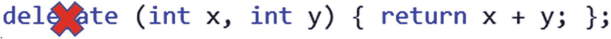
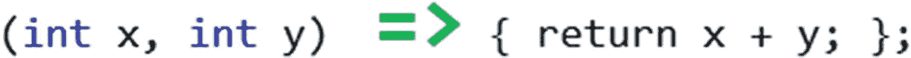
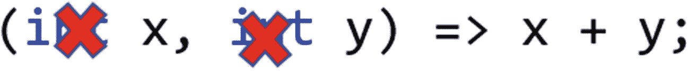
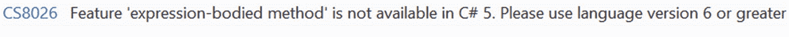
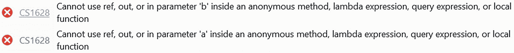

# 三、Lambda 表达式

Lambda 表达式和匿名方法是高级编程中的两个重要概念。总的来说，它们通常被称为匿名函数。C# 2.0 引入了匿名方法的概念，C# 3.0 引入了 lambda 表达式。随着时间的推移，lambda 表达式变得比匿名方法更受欢迎。如果你瞄准了。NET Framework 3.5 或更高版本，建议您使用 lambda 表达式。本章向你展示了使用 lambda 表达式的不同方法，以及如何在高级编程中有效地使用它们。

## Lambda 表达式的有用性

lambda 表达式是一种以易于阅读的形式编写的匿名方法。什么是匿名方法，为什么它有用？顾名思义，匿名方法就是没有名字的方法。在某些情况下，它们非常有用。例如，当您使用委托指向一个方法，但该方法出现在源文件中的不同位置时(或者，在极端情况下，它出现在不同的源文件中)。这种分离的代码很难理解、调试和维护。在这种情况下，匿名方法很有帮助，因为您可以定义一个没有名称的“内联”方法来满足您的目的。

*lambda* 这个词来自 lambda calculus，它模拟了一个图灵机。它用希腊字母 lambda (λ)拼写，而你的键盘上没有。要表示一个 lambda 运算符，可以使用= >符号。运算符的左侧指定输入参数(如果有)，运算符的右侧指定表达式或语句块。= >是右关联的，其优先级与=相同。当读取包含 lambda 运算符的代码时，将 lambda 运算符替换为*转到* **，** *转到* **，** *箭头* **，**或*成为*。比如你读`x=> x+5`；因为`x`去了`x+5`。同样，你把`(x,y)=>x+y;`读成`x`，`y`到`x+y`。

C# 编译器可以将 lambda 表达式转换为委托实例或表达式树(这在 LINQ 中经常使用)。这本书没有详细讨论 LINQ，但是你已经了解了代表，并且在第一章看到了几个关于他们的例子。让我们在这里关注委托实例。

Note

当 lambda 表达式转换为委托类型时，结果取决于输入参数和返回类型。如果一个 lambda 表达式没有返回类型，它可以被转换成一个`Action`委托类型；如果它有一个返回类型，它可以被转换成一个`Func`委托类型。`Func`和`Action`是通用的代表，你会在第四章中了解到。

### 演示 1

我从一个简单的程序开始，这个程序使用各种方法计算两个整数(21 和 79)的和。第一种方法使用普通的方法(这是您所熟悉的)。您可以使用这个方法来计算`int`的总和。接下来，我将向您展示如何使用一个委托实例来做同样的事情。最后两段代码分别展示了匿名方法和 lambda 表达式的用法。每个程序段生成相同的输出。这个程序让你选择方法。为了可读性，请浏览支持性注释。

```cs
using System;

namespace LambdaExpressionEx1
{
    public delegate int Mydel(int x, int y);

    class Program
    {
        public static int Sum(int a, int b) { return a + b; }

        static void Main(string[] args)
        {
            Console.WriteLine("***Exploring the use of a lambda expression and comparing it with other techniques. ***");
            // Without using delgates or lambda expression
            Console.WriteLine(" Using a normal method.");
            int a = 21, b = 79;
            Console.WriteLine(" Invoking the Sum() method in a common way without using a delegate.");
            Console.WriteLine("Sum of {0} and {1} is : {2}", a,b, Sum(a, b));

            /* Using Delegate(Initialization with a named method)*/
            Mydel del1 = new Mydel(Sum);
            Console.WriteLine("\n Using delegate now.");
            Console.WriteLine("Invoking the Sum() method with the use of a delegate.");
            Console.WriteLine("Sum of {0} and {1} is : {2}", a, b, del1(a, b));

            // Using Anonymous method (C# 2.0 onwards)
            Mydel del2 = delegate (int x, int y) { return x + y; };
            Console.WriteLine("\n Using anonymous method now.");
            Console.WriteLine("Invoking the Sum() method using an anonymous method.");
            Console.WriteLine("Sum of {0} and {1} is : {2}", a, b, del2(a, b));

            // Using Lambda expression(C# 3.0 onwards)
            Console.WriteLine("\n Using lambda expression now.");
            Mydel sumOfTwoIntegers = (x, y) => x + y;
            Console.WriteLine("Sum of {0} and {1} is : {2}", a, b, sumOfTwoIntegers(a, b));
            Console.ReadKey();
        }
    }
}

```

#### 输出

以下是运行该程序的输出。

```cs
***Exploring the use of a lambda expression and comparing it with other techniques.***
Using a normal method.
Invoking the Sum() method in a common way without using a delegate.
Sum of 21 and 79 is : 100

 Using delegate now.
Invoking the Sum() method with the use of a delegate.
Sum of 21 and 79 is : 100

 Using anonymous method now.
Invoking the Sum() method using an anonymous method.
Sum of 21 and 79 is : 100

 Using lambda expression now.
Sum of 21 and 79 is : 100

```

#### 分析

让我们回顾一下用于匿名方法和 lambda 表达式的语句。对于匿名方法，我使用了

```cs
delegate (int x, int y) { return x + y; };

```

对于 lambda 表达式，我使用

```cs
(x, y) => x + y;

```

如果您熟悉匿名方法，但不熟悉 lambda 表达式，您可以使用以下步骤从匿名方法中获取 lambda 表达式。

对于第 1 步，从匿名方法表达式中删除 delegate 关键字，这将产生如图 3-1 所示的结果。



图 3-1

从匿名方法表达式中移除 delegate 关键字

也就是你得到`(int x, int y) {return x + y; };`。

在步骤 2 中，添加一个 lambda 操作符，结果如图 3-2 所示。(它还会产生有效的 lambda 表达式。)



图 3-2

在步骤 1 表达式中添加 lambda 运算符

请注意，在本例中，我处理的是一个 return 语句。在这种情况下，作为第 3 步，您可以删除花括号、分号和回车，结果如图 3-3 所示(这是一个有效的 lambda 语句)。


图 3-3

从步骤 2 的表达式中删除花括号、分号和“return”

也就是说，你得到:`(int x, int y) => x + y;`

在大多数情况下，编译器在处理 lambda 表达式时可以识别输入参数和返回类型。用编程术语来说，这叫做*类型推理*。尽管如此，在某些特殊情况下，您可能需要保留这种类型信息，以便让编译器正确地计算表达式。但这是一个非常简单的情况，编译器可以正确理解它(在这种情况下，请注意委托声明)，即使您没有提到输入参数的类型。因此，对于步骤 4，您可以从输入参数中移除类型信息，并使表达式更短，如图 3-4 所示。



图 3-4

从步骤 3 的表达式中删除类型信息以获得最短的表达式

也就是你得到`(x, y) => x + y;`。

## 有(和没有)参数的 Lambda 表达式

lambda 表达式可以接受一个或多个参数。也可以使用不接受任何参数的 lambda 表达式。

在演示 1 中，您看到当一个 lambda 表达式使用多个参数时，您将它们列在用逗号分隔的括号中，就像`(x, y)=> x+y;`。

如果 lambda 表达式只接受一个参数，可以省略括号。例如，您可以使用`(x)=> x*x;`或`x=>x*x;`。两者都有相同的目的。

最后，`() => Console.WriteLine("No parameter.");`是一个没有任何参数的 lambda 表达式的例子。演示 2 展示了所有案例。

### 演示 2

本演示涵盖了带有不同参数的 lambda 表达式的用法。

```cs
using System;

namespace LambdaExpTest2
{
    class Program
    {
        public delegate void DelegateWithNoParameter();
        public delegate int DelegateWithOneIntParameter(int x);
        public delegate void DelegateWithTwoIntParameters(int x, int y);
        static void Main(string[] args)
        {

            Console.WriteLine("***Experimenting lambda expressions with different parameters.***\n");
            // Without lambda exp.
            Method1(5, 10);

            // Using Lambda expression

            DelegateWithNoParameter delWithNoParam = () => Console.WriteLine("Using lambda expression with no parameter, printing Hello");
            delWithNoParam();

            DelegateWithOneIntParameter delWithOneIntParam = (x) => x * x;
            Console.WriteLine("\nUsing a lambda expression with one parameter, square of 5 is {0}", delWithOneIntParam(5));

            DelegateWithTwoIntParameters delWithTwoIntParam = (int x, int y) =>
              {
                  Console.WriteLine("\nUsing lambda expression with two parameters.");
                  Console.WriteLine("It is called a statement lambda because it has a block of statements in it's body.");
                  Console.WriteLine("This lambda accepts two parameters.");
                  int sum = x + y;
                  Console.WriteLine("Sum of {0} and {1} is {2}", x, y, sum);
              };

            delWithTwoIntParam(10,20);

            Console.ReadKey();
        }

        private static void Method1(int a, int b)
        {
            Console.WriteLine("\nThis is Method1() without lambda expression.");
            int sum = a + b;
            Console.WriteLine("Sum of {0} and {1} is {2}", a, b, sum);
        }
    }
}

```

#### 输出

以下是运行该程序的输出。

```cs
***Experimenting lambda expressions with different parameters.***
This is Method1() without lambda expression.
Sum of 5 and 10 is 15

Using lambda expression with no parameter, printing Hello

Using a lambda expression with one parameter, square of 5 is 25

Using lambda expression with two parameters.
It is called a statement lambda because it has a block of statements in it's body.
This lambda accepts two parameters.
Sum of 10 and 20 is 30

```

## Lambda 表达式的类型

理想情况下，lambda 表达式用于单行方法。但是在演示 2 中，您看到了 lambda 表达式可以不止一行。

在编程术语中，您将 lambda 表达式分为表达式 lambdas 和语句 lambdas。表达式 lambda 只有一个表达式，而语句 lambda 包含一组语句。语句 lambdas 可以使用花括号、分号和 return 语句。一个语句 lambda 可以包含任意数量的语句，但一般来说，它们包含两个或三个语句。如果在一个 lambda 表达式中使用三行以上，可能会使理解变得复杂；在这些情况下，你可能更喜欢普通的方法而不是 lambda 表达式。

## 表情丰富的成员

Lambda 表达式最早出现在 C# 3.0 中，但从 C# 6.0 开始，它们提供了额外的灵活性:如果你在一个类中有一个非 lambda 方法，你可以使用相同的表达式语法来定义相同的方法。例如，在下面的演示中，有一个名为 Test 的类。

```cs
    class Test
    {
        public int CalculateSum1(int a, int b)
        {
            int sum = a + b;
            return sum;
        }
        // Expression-bodied method is not available in C#5
        public int CalculateSum2(int a, int b) => a + b; // ok
    }

```

注意非 lambda 方法`CalculateSum1`。这是一个简单的方法，接受两个整数**，**计算它们的和，并返回结果(也是一个整数)。

从 C# 6.0 开始，您可以编写 lambda 表达式来定义 CalculateSum1 的等效版本。下面是这样的表达。

***public int calculatesum 2(int a，int b)=>a+b；***

如果您在 C# 6.0 之前的 C# 版本中使用它(比如在 C# 5.0 中)，您会得到下面的编译时错误。

```cs
CS8026: Feature 'expression-bodied method' is not available in C# 5\. Please use language version 6 or greater.

```

图 3-5 是一个 Visual Studio IDE 截图，供大家参考。



图 3-5

C# 5 中没有“表达式主体方法”功能

我保留了这些评论来帮助你理解。但是需要注意的是，当您的方法可以用单个表达式表示时(即，在方法实现中只有一行代码)，您可以使用这个概念。换句话说，它适用于*表达式λ*语法，但不能用于*语句λ*语法。在演示 3 中，如果取消对以下代码段的注释，就会出现编译时错误。

```cs
//int CalculateSum3(int a, int b) =>{
//    int sum = a + b;
//    return sum;
//}

```

### 演示 3

这个完整的演示展示了表达式体方法的使用。

```cs
using System;

namespace ExpressionBodiedMethodDemo
{
    class Test
    {
        public int CalculateSum1(int a, int b)
        {
            int sum = a + b;
            return sum;
        }
        /*
        Expression-bodied method is not available in C#5.
        C#6.0 onwards,you can use same expression syntax to define a non-lambda method within a class
        It is ok for single expression, i.e. for
        expression lambda syntax,but not for statement lambda.
        */

        public int CalculateSum2(int a, int b) => a + b;//ok

        // Following causes compile-time error
        // For expression-bodied methods, you cannot use
        // statement lambda
        //int CalculateSum3(int a, int b) =>{
        //    int sum = a + b;
        //    return sum;
        //}
    }
    class Program
    {
        static void Main(string[] args)
        {
            Console.WriteLine("***Experimenting lambda expression with expression-bodied method.***\n");
            // Using Normal method
            Test test = new Test();
            int result1 = test.CalculateSum1(5, 7);
            Console.WriteLine("\nUsing a normal method, CalculateSum1(5, 7) results: {0}", result1);
            // Using expression syntax

            int result2 = test.CalculateSum2(5, 7);
            Console.WriteLine("\nUsing expression syntax for CalculateSum2(5,7),result is: {0}", result2);
            Console.ReadKey();
        }
    }
}

```

#### 输出

以下是运行该程序的输出。

```cs
***Experimenting lambda expression with expression-bodied method.***

Using a normal method, CalculateSum1(5, 7) results: 12

Using expression syntax for CalculateSum2(5,7),result is: 12

```

Points to Remember

定义非 lambda 方法的表达式语法不适用于*语句 lambdas* 。你只能对*表情 lambdas* 使用它。

### 演示 4

演示 3 向您展示了表达式体方法的使用，但它也适用于属性、构造函数和终结器。在演示 4 中，您将看到它是如何与构造函数、只读属性和读写属性一起使用的。所以，让我们把重点放在重要的代码段上，并将它们与通常的实现进行比较。

假设您有一个`Employee`类，其中有雇员 ID、公司名称和雇员姓名。在代码中，我将它们分别表示为`empId`、`company`和`name`。当你初始化一个`Employee`对象时，你提供了`empId`。`Company`是只读属性，`Name`是读写属性。

下面是公共构造函数的通常实现，它只有一个参数。

```cs
public Employee(int id)
{
 empId = id;
}

```

下面显示了表达式主体构造函数。

```cs
public Employee(int id) => empId = id;

```

下面是只读属性`Company`的通常实现。

```cs
public string Company
{
  get
  {
    return company;
  }
}

```

下面显示了只读属性的表达式体定义。

```cs
public string Company => company;

```

下面是读写`Name`属性的通常实现。

```cs
public string Name
{
  get
  {
    return name;
  }
  set
  {
    name = value;
  }
}

```

下面显示了读写属性的表达式体定义。

```cs
public string Name
 {
    get => name;
    set => name = value;
 }

```

我们来看一下完整的演示和输出，如下所示。

```cs
using System;

namespace Expression_BodiedPropertiesDemo
{
    class Employee
    {
        private int empId;
        private string company = "XYZ Ltd.";
        private string name = String.Empty;

        //Usual implementation of a constructor.
        //public Employee(int id)
        //{
        //    empId = id;
        //}
        //Following shows an expression-bodied constructor
        public Employee(int id) => empId = id;//ok

        //Usual implementation of a read-only property
        //public string Company
        //{
        //    get
        //    {
        //        return company;
        //    }
        //}
        //Read-only property.C#6.0 onwards.
        public string Company => company;

        //Usual implementation
        //public string Name
        //{
        //    get
        //    {
        //        return name;
        //    }
        //    set
        //    {
        //        name = value;
        //    }
        //}

        //C#7.0 onwards , we can use expression-body definition for the get //and set accessors.
        public string Name
        {
            get => name;
            set => name = value;
        }
    }
    class Program
    {
        static void Main(string[] args)
        {
            Console.WriteLine("***Experimenting lambda expressions with expression-bodied properties.***");
            Employee empOb = new Employee(1);
            //Error.Company is read-only
            //empOb.Company = "ABC Co.";
            empOb.Name = "Rohan Roy ";//ok
            Console.WriteLine("{0} works in {1} as an employee.", empOb.Name,empOb.Company);
            Console.ReadKey();
        }
    }
}

```

#### 输出

以下是运行该程序的输出。

```cs
***Experimenting lambda expressions with expression-bodied properties.***
Rohan Roy  works in XYZ Ltd. as an employee.

```

Points to Remember

在 C# 6.0 中，我们得到了对表达式体方法和只读属性的支持。在 C# 7.0 中，这种支持扩展到了属性、索引器、构造函数和终结器。

## Lambda 表达式中的局部变量

你可能已经注意到局部变量在 lambda 表达式中的使用。在这种情况下，变量必须在范围内。演示 5 展示了 lambda 表达式中局部变量的简单用法。

### 演示 5

该演示将您的注意力吸引到以下几点。

*   您可以在程序中使用查询语法或方法调用语法。我已经展示了两者的用法。(如果你熟悉 LINQ 编程，你知道查询语法；否则，您可以跳过这段代码，直到您了解它。)考虑下面的代码，尤其是粗体部分:

    ```cs
    IEnumerable<int> numbersAboveMidPoint = intList.Where(x => x > midPoint);

    ```

*   `midPoint`是一个局部变量。lambda 表达式可以访问此变量，因为它在此位置的范围内。

*   本例中使用了`List<int>`和`IEnumerable<int>`。它们是泛型编程中最简单的构造。如果你是泛型的新手，你可以暂时跳过这个例子，在第四章讲述泛型编程后再回来。

让我们来看一下演示。

```cs
using System;
using System.Collections.Generic;
using System.Linq;

namespace TestingLocalVariableScopeUsingLambdaExpression
{
   class Program
   {
        static void Main(string[] args)
        {
            Console.WriteLine("***Testing local variable scope with a lambda expression.***\n");
            #region Using query syntax
            /* Inside lambda Expression,you can access the variable that are in scope (at that location).*/
            int midPoint = 5;
             List<int> intList = new List<int> { 1, 2, 3, 4, 5, 6, 7, 8, 9, 10 };
            var myQueryAboveMidPoint = from i in intList
                                       where i > midPoint
                                       select i;
            Console.WriteLine("Numbers above mid point(5) in intList are as follows:");
            foreach (int number in myQueryAboveMidPoint)
            {
                Console.WriteLine(number);
            }
            #endregion
            #region Using method call syntax
            // Alternative way( using method call syntax)
            Console.WriteLine("Using a lambda expression, numbers above mid point(5) in intList are as follows:");
            IEnumerable<int> numbersAboveMidPoint = intList.Where(x => x > midPoint);
            foreach (int number in numbersAboveMidPoint)
            {
                Console.WriteLine(number);
            }
            #endregion
            Console.ReadKey();
        }
    }
}

```

#### 输出

以下是运行该程序的输出。

```cs
***Testing local variable scope with a lambda expression.***
Numbers above mid point(5) in intList are as follows:
6
7
8
9
10
Using a lambda expression, numbers above mid point(5) in intList are as follows:
6
7
8
9
10

```

## 在 Lambda 表达式中使用元组

从 C# 7.0 开始，就有了对元组的内置支持。在许多应用中，元组有内置的委托(例如，`Func`、`Action`等)。)和 lambda 表达式。你将在第四章中了解内置代理。现在，让我们在用户定义的委托的上下文中使用元组。

在下面的例子中，我将一个元组传递给一个方法。为了简单起见，我们假设元组只有两个组件。你想把这个元组传递给一个方法参数，反过来，你想得到一个元组，在这个元组中你得到每个组件的双精度值。下面的方法代表了这样一个示例。

```cs
static Tuple<int, double> MakeDoubleMethod(Tuple<int, double> input)
{
    return Tuple.Create(input.Item1 * 2, input.Item2 * 2);
}

```

可以看到在 tuple 内部，第一个组件是一个`int`，第二个是一个`double`。我只是将输入参数乘以 2，以获得每个组件的 double 值，并返回包含另一个元组的结果。

在 Main 方法中，我如下调用了这个方法。

```cs
var resultantTuple = MakeDoubleMethod(inputTuple);

```

因为我是从静态上下文中调用方法，所以我将`MakeDoubleMethod`设为静态。

现在你知道如何在一个方法中使用元组了。让我们使用 lambda 表达式来实现这个概念。

首先，声明一个委托，如下所示。

```cs
delegate Tuple<int, double> MakeDoubleDelegate(Tuple<int, double> input);

```

现在您有了委托，所以您可以使用 lambda 表达式，如下所示。

```cs
MakeDoubleDelegate delegateObject =
                (Tuple<int, double> input) => Tuple.Create(input.Item1 * 2, input.Item2 * 2);

```

如果不使用命名组件，默认情况下，元组的字段被命名为`Item1`、`Item2`、`Item3`等等。要获得预期的结果，可以使用下面几行代码。

```cs
var resultantTupleUsingLambda= delegateObject(inputTuple);
Console.WriteLine("Using lambda expression, the content of resultant tuple is as follows:");
Console.WriteLine("First Element: " + resultantTupleUsingLambda.Item1);
Console.WriteLine("Second Element: " + resultantTupleUsingLambda.Item2);

```

像本书中的许多其他例子一样，我保留了两种方法来获得预期的结果。它有助于比较 lambda 表达式的使用和类似上下文中的普通方法。接下来是完整的演示。

### 演示 6

```cs
using System;

namespace UsingTuplesInLambdaExp
{
    delegate Tuple<int, double> MakeDoubleDelegate(Tuple<int, double> input);
    class Program
    {
        static void Main(string[] args)
        {
            Console.WriteLine("***Using Tuples in Lambda Expression.***");
            var inputTuple = Tuple.Create(1, 2.3);
            Console.WriteLine("Content of input tuple is as follows:");
            Console.WriteLine("First Element: " + inputTuple.Item1);
            Console.WriteLine("Second Element: " + inputTuple.Item2);
            var resultantTuple = MakeDoubleMethod(inputTuple);

            Console.WriteLine("\nPassing tuple as an input argument in a normal method which again returns a tuple.");
            Console.WriteLine("Content of resultant tuple is as follows:");
            Console.WriteLine("First Element: " + resultantTuple.Item1);
            Console.WriteLine("Second Element: " + resultantTuple.Item2);

            Console.WriteLine("\nUsing delegate and lambda expression with tuple now.");
            MakeDoubleDelegate delegateObject =
                (Tuple<int, double> input) => Tuple.Create(input.Item1 * 2, input.Item2 * 2);
            var resultantTupleUsingLambda= delegateObject(inputTuple);
            Console.WriteLine("Using lambda expression, the content of resultant tuple is as follows:");
            Console.WriteLine("First Element: " + resultantTupleUsingLambda.Item1);
            Console.WriteLine("Second Element: " + resultantTupleUsingLambda.Item2);
            Console.ReadKey();
        }
        static Tuple<int, double> MakeDoubleMethod(Tuple<int, double> input)
        {
            return Tuple.Create(input.Item1 * 2, input.Item2 * 2);
        }
    }

}

```

#### 输出

以下是运行该程序的输出。

```cs
***Using Tuples in Lambda Expression.***
Content of input tuple is as follows:
First Element: 1
Second Element: 2.3

Passing tuple as an input argument in a normal method which again returns a tuple.
Content of resultant tuple is as follows:
First Element: 2
Second Element: 4.6

Using delegate and lambda expression with tuple now.
Using lambda expression, the content of resultant tuple is as follows:
First Element: 2
Second Element: 4.6

```

## 带有 Lambda 表达式的事件订阅

可以对事件使用 lambda 表达式。

### 演示 7

为了演示一个案例，我们来看一下第二章的第一个程序，并对其进行修改。由于我们关注的是 lambda 表达式，这一次，您不需要创建一个`Receiver`类，它有一个名为`GetNotificationFromSender` `,`的方法，用于在`myInt`在`Sender`类对象中发生变化时处理事件通知。在那个例子中，`Sender`类也有一个`GetNotificationItself`方法来处理它自己的事件。它向您展示了一个`Sender`类也可以处理自己的事件。

这是完整的演示。

```cs
using System;

namespace UsingEventsAndLambdaExp
{
    class Sender
    {
        private int myInt;
        public int MyInt
        {
            get
            {
                return myInt;
            }
            set
            {
                myInt = value;
                //Whenever we set a new value, the event will fire.
                OnMyIntChanged();
            }
        }
        // EventHandler is a predefined delegate which is used to handle //simple events.
        // It has the following signature:
        //delegate void System.EventHandler(object sender,System.EventArgs e)
        //where the sender tells who is sending the event and
        //EventArgs is used to store information about the event.
        public event EventHandler MyIntChanged;
        public void OnMyIntChanged()
        {
            if (MyIntChanged != null)
            {
                MyIntChanged(this, EventArgs.Empty);
            }
        }

    }

    class Program
    {
        static void Main(string[] args)
        {
            Console.WriteLine("***Demonstration-.Exploring events with lambda expression.***");
            Sender sender = new Sender();

            //Using lambda expression as an event handler
            //Bad practise
            //sender.MyIntChanged += (Object sender, System.EventArgs e) =>
            // Console.WriteLine("Using lambda expression, inside Main method, received a notification: Sender recently has changed the myInt value . ");
            //Better practise
            EventHandler myEvent =
               (object sender, EventArgs e) =>
              Console.WriteLine("Using lambda expression, inside Main method, received a notification: Sender recently has changed the myInt value . ");
            sender.MyIntChanged += myEvent;

            sender.MyInt = 1;
            sender.MyInt = 2;
            //Unregistering now
            //sender.MyIntChanged -= receiver.GetNotificationFromSender;
            //No notification sent for the receiver now.
            //but there is no guarantee if you follow the bad practise
            //sender.MyIntChanged -= (Object sender, System.EventArgs e) =>
            // Console.WriteLine("Unregistered event notification.");

            //But now it can remove the event properly.
            sender.MyIntChanged -= myEvent;
            sender.MyInt = 3;

            Console.ReadKey();

        }
    }
}

```

#### 输出

以下是运行该程序的输出。

```cs
***Demonstration-.Exploring events with lambda expression.***
Using lambda expression, inside Main method, received a notification: Sender recently has changed the myInt value .
Using lambda expression, inside Main method, received a notification: Sender recently has changed the myInt value .

```

### 问答环节

3.1 你为什么要编写额外的代码？我发现你可以简单地写下下面的内容来订阅这个活动。

```cs
sender.MyIntChanged += (Object sender, System.EventArgs e) =>
  Console.WriteLine("Using lambda expression, inside Main method, received a notification: Sender recently has changed the myInt value . ");

```

你可以用它来替换下面几行。

```cs
EventHandler myEvent = (object sender, EventArgs e) =>
Console.WriteLine("Using lambda expression, inside Main method, received a notification: Sender recently has changed the myInt value . ");
sender.MyIntChanged += myEvent;

```

这是正确的吗？

接得好，但这是必要的。假设您使用以下代码行来订阅事件。

```cs
sender.MyIntChanged += (Object sender, System.EventArgs e) =>
Console.WriteLine("Using lambda expression, inside Main method, received a notification: Sender recently has changed the myInt value . ");

```

然后用下面一行取消订阅。

```cs
sender.MyIntChanged -= (Object sender, System.EventArgs e) =>
   Console.WriteLine("Unregistered event notification.");

```

不能保证编译器会取消订阅正确的事件。例如，在这种情况下，当我执行程序时，我注意到输出中的第三种情况是不需要的(因为在我将`myInt`的值设置为 3 之前，我想取消订阅事件通知)。以下是输出。

```cs
***Demonstration-.Exploring events with lambda expression.***
Using lambda expression, inside Main method, received a notification: Sender recently has changed the myInt value .
Using lambda expression, inside Main method, received a notification: Sender recently has changed the myInt value .
Using lambda expression, inside Main method, received a notification: Sender recently has changed the myInt value .

```

*所以，专家建议，在这种情况下，应该将匿名方法/lambda 表达式存储在一个委托变量* ***、*** *中，然后将这个委托添加到事件中。这样一来，你就可以随时关注它* ***，*** *并且如果你愿意，你可以适当地取消订阅**。当您希望以后取消订阅某个事件时，通常建议不要使用匿名函数来订阅该事件。这是因为，为了避免现实应用中的内存泄漏，一旦您订阅了一个事件，您就应该在预期的工作完成后取消订阅。*

 ***3.2 什么是表达式？**

根据微软的说法，表达式可以是运算符和操作数的组合。它可以计算为单个值、方法、对象或命名空间。表达式可以包括方法调用、带有操作数的运算符、文本值(文本是没有名称的常量值)，或者只是变量、类型成员、方法参数、命名空间或类型的名称。

下面是一个简单的表达式语句示例。

```cs
int i=1;

```

这里，`i`是一个简单的名字，1 是字面值。文字和简单名称是两种最简单的表达式。

**3.3 什么是图灵机？**

图灵机是一种抽象机器，它可以通过遵循规则来操纵磁带的符号。它是许多编程语言的数学基础。

**3.4 语句 lambda 和表达式 lambda 有什么区别？**

表达式 lambda 只有一个表达式，但语句 lambda 在 lambda 运算符的右侧有一个语句块。使用语句 lambda，可以在花括号中包含任意数量的语句。在撰写本文时，您不能将语句 lambda 用于表达式体方法，但是您可以在这些上下文中使用表达式 lambda。

在表达式树中，只能使用表达式 lambdas 但是你不能在这些上下文中使用 lambda 语句。我排除了对表达式树的讨论，因为它是与 LINQ 相关的特性，超出了本书的范围。

**3.5 如果不提供参数，编译器仍然可以确定类型。但是当您提供它们时，它们必须匹配委托类型。这是正确的吗？**

是的。但有时编译器无法推断出来。在这种情况下，您需要提供参数。在这种情况下，您需要记住输入参数必须是隐式的或显式的。

**3.6 你说输入参数必须是隐式的或者显式的。这是什么意思？**

让我们假设您有以下委托。

```cs
delegate string MyDelegate(int a, int b);

```

如果你写了下面这段代码，你会得到一个编译时错误，如图 3-6 所示。


图 3-6

由于 lambda 参数用法不一致而导致的编译时错误

```cs
MyDelegate resultOfLambdaExp =(int x,  y)=> (x > y) ? "Yes." : "No.";

```

补救方法如下。

```cs
MyDelegate resultOfLambdaExp =(int x, int y)=> (x > y) ? "Yes." : "No.";

```

或者，您可以删除这两个 int，如下所示。

```cs
MyDelegate resultOfLambdaExp =( x, y)=> (x > y) ? "Yes." : "No.";

```

**3.7 lambda 表达式有什么限制？**

Lambda 表达式是匿名方法的超集。适用于匿名方法的所有限制也适用于 lambda 表达式(例如，在匿名方法的上下文中，不能使用定义方法的 ref 或 out 参数)。作为参考，请记住以下几点。

*   在“is”或“as”运算符的左侧不允许出现 Lambdas。在这种情况下，您可能还记得 C# 6.0 规范中的语句，它说，“匿名函数本身没有值或类型，但可以转换为兼容的委托或表达式树类型。”

*   不能使用`break`、`goto`或`continue`跳出 lambda 表达式范围。

*   不能在 lambda 表达式中使用`unsafe`代码。例如，假设您有以下委托:

```cs
delegate void DelegateWithNoParameter();

```

如果您编写以下代码段，您会在所有操作指针的地方(我用注释标记了这些地方)得到一个编译时错误。

```cs
      DelegateWithNoParameter delOb = () =>
            {
                int a = 10;
                //CS 0214:Pointers and fixed sized buffers may //only be used only in an unsafe context
                int* p = &a;//Error
                //Console.WriteLine("a={0}", a);
                //Printing using string interpolation
                Console.WriteLine($"a={a}");
                Console.WriteLine($"*p={*p}");//Error CS0214
            };

```

**3.8 你说过在匿名方法的上下文中，不能使用定义方法的 ref 或 out 参数。你能详细说明一下吗？**

让我们考虑一下演示 1 中的 Sum 方法，并将其修改如下。

```cs
public static int Sum(ref int a, ref int b)
        {
            //return a + b;
            //Using Anonymous method(C# 2.0 onwards)
            Mydel del2 = delegate (int x, int y)
            {
                //Following segment will NOT work
                x = a;//CS1628
                y = b;//CS1628
                return x + y;

                //Following segment will work
                //return x + y;
            };
            return del2(a, b);
        }
Where the Mydel delegate is unchanged and as follows:
public delegate int Mydel(int x, int y);

```

对于这段代码，您将得到一个编译时错误(标记为 CS1628)。CS1628 指出，在匿名方法或 lambda 表达式中，不能在参数中使用 *ref、out、*或*。图 3-7 是 Visual Studio 2019 错误截图，供大家参考。*



图 3-7

编译时错误。不能在匿名方法或 lambda 表达式中使用 ref、out 或 in 参数

您可以参考前面代码段中使用注释行显示的潜在解决方案。

## 最后的话

目前关于兰姆达斯就这些了。在你离开这一章之前，我想提醒你，尽管很酷的特性很容易使用，但是代码的可读性和可理解性应该是你最优先考虑的。

接下来，我们转到本书的第二部分(从第四章开始)，在这里你可以看到目前为止你所学概念的用法。虽然第二部分是这本书的核心，但第一部分的内容(第 1 、 2 和 3 章)是它们的组成部分。

## 摘要

本章讨论了以下关键问题。

*   为什么匿名方法和 lambda 表达式有用？

*   如何将匿名方法转换成 lambda 表达式？

*   如何使用 lambda 表达式来接受不同数量的参数？

*   如何在 lambda 表达式中使用局部变量？

*   什么是表达式λ？

*   什么是语句 lambda？

*   如何使用表达式语法来定义非 lambda 方法？以及它的使用限制是什么？

*   适用于 lambda 表达式的关键限制是什么？*