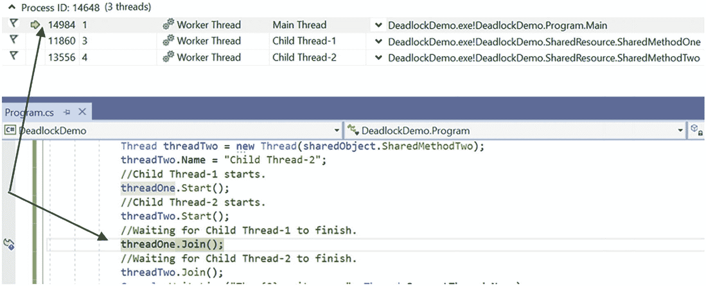
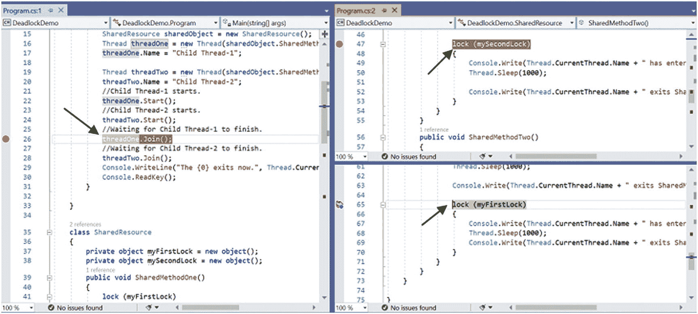

# 五、多线程编程

当今世界，大家对多任务都很熟悉，简单的说就是你可以并行做多件事。考虑一个常见的场景。例如，当我在笔记本电脑上用 Microsoft Word 写这一章时，我正在 Windows Media Player 上听一段非常平静的音乐。同样，您可以在 C# 应用中同时执行不同的方法。要实现这个概念，您需要熟悉多线程。

在早期，计算机只有一个处理器，但是现在，情况已经发生了很大的变化。当今世界的大多数计算机都有多个处理器。例如，在撰写本文时，我正在使用一个带有四个逻辑处理器的双核系统；然而，在当今世界，这并不被认为是一台超高速计算机，因为有大量处理器(显然是昂贵的)和更强大的计算能力的机器。不过，如果另一台超高速电脑通过网络连接到我的电脑，我可以在上面执行一些工作。所以，使用其他机器的计算能力是可能的。但事实是，除非您将代码构建为在多个处理器上运行，否则您没有充分利用机器的计算潜力。在本章中，你将熟悉多线程，并学习如何有效地使用它。我们开始吧。

## 线程编程基础

到目前为止，您所看到的大多数程序都有一个单一的顺序控制流(即，一旦程序开始执行，它就按顺序遍历所有语句，直到结束)。因此，在任何特定时刻，只有一条语句正在执行。线程类似于程序。它只有一个控制流。它在起点和终点之间也有一个主体，它按顺序执行命令。每个程序至少有一个线程。

在 C# 中，一个程序中可以有多个控制流。在这些情况下，每个控制流被称为一个*线程*，这些线程可以并行运行。在多线程环境中，每个线程都有一个独特的执行流。这是一种编程范式，其中一个程序被分成多个可以并行实现的子程序(或部分)。但是，如果计算机只有一个处理器，它如何并行执行多项任务呢？处理器在这些子程序(或代码段)之间切换得非常快，因此在人眼看来，它们似乎都在同时执行。

简单来说，当操作系统在不同的应用之间划分处理器执行时间时，该场景是多任务处理，当操作系统在单个应用内的不同线程之间划分执行时间时，该场景被称为多线程。这就是为什么多线程被认为是一种特殊的多任务处理。

在这种情况下，在任何操作系统理论书籍中回顾进程和线程之间的区别是很重要的。供您参考，表 5-1 强调了一些关键区别。

表 5-1

进程和线程之间的比较

<colgroup><col class="tcol1 align-left"> <col class="tcol2 align-left"></colgroup> 
| 

过程

 | 

线

 |
| --- | --- |
| 分配单位。 | 执行单位。 |
| 建筑构造。 | 编码结构不影响架构。 |
| 每个进程都有一个或多个线程。 | 每个线程属于一个进程。 |
| 由于上下文切换，进程间通信(通常称为 IPC)的开销很大。 | 线程间通信成本较低，可以使用进程内存，并且可能不需要上下文切换。 |
| 安全:一个进程不能破坏另一个进程。 | 不安全:一个线程可以写入另一个线程使用的内存。 |

管理多线程环境可能很有挑战性，但您可以更快地完成任务，并显著减少总体空闲时间。通常，在自动化环境中，计算机的输入比用户的键盘输入快得多。或者，当您通过网络传输数据时，网络传输速率可能比接收计算机的消耗速率慢。如果您需要等待每个任务完成后才能开始下一个任务，则总的空闲时间会更长。在这种情况下，多线程环境总是更好的选择。C# 可以帮助你有效地建模多线程环境。

图 5-1 展示了多线程程序中的一个常见场景，其中`main thread`创建了另外两个线程——`threadOne`和`threadTwo`——并且所有线程都在并发运行。


图 5-1

在多线程程序中，主线程创建两个以上的线程，并且它们都是并发运行的

POINTS TO REMEMBER

多线程的核心目标是你可以在单独的线程中执行独立的代码段，这样你就可以更快地完成任务。

在。NET Framework 中，您可以同时拥有前台和后台线程。创建线程时，默认情况下它是前台线程。但是您可以将前台线程转换为后台线程。关键区别在于，当前台线程终止时，关联的后台线程也会停止。

### 问答环节

**5.1 在图** **5-1** **中，我看到了术语“上下文切换”在这个上下文中是什么意思？**

通常，许多线程可以在您的计算机上并行运行。计算机允许一个线程在一个处理器中运行一段时间，然后它可以突然切换到另一个处理器。这个决定是由不同的因素做出的。正常情况下，所有线程都有相同的优先级，它们之间的切换执行得很好。线程之间的切换称为*上下文切换*。它还使您能够存储当前线程(或进程)的状态，以便以后可以从这一点继续执行。

**5.2 与单线程环境相比，多线程环境的主要优势是什么？**

在单线程环境中，如果线程被阻塞，整个程序就会暂停，而在多线程环境中则不是这样。此外，您可以通过有效利用 CPU 来减少总的空闲时间。例如，当程序的一部分通过网络发送大量数据时，程序的另一部分可以接受用户输入，而程序的另一部分可以验证该输入并准备发送下一个数据块。

5.3 我有一个多核系统，但是多线程还能帮我吗？

曾几何时，大多数计算机只有一个内核；并发线程共享 CPU 周期，但是它们不能并行运行。使用多线程的概念，您可以通过有效使用 CPU 来减少总的空闲时间。但是如果你有多个处理器，你可以同时运行多个线程。因此，您可以进一步提高程序的速度。

5.4 多线程程序可以有多个并发运行的部分。这些部分中的每一个都是线程，每个线程可以有一个单独的执行流。这是正确的吗？

是的。

## 用 C# 编写多线程程序

在用 C# 编写多线程程序之前，首先要记住的是从

```cs
using System.Threading;

```

这个名称空间包含有不同方法的`Thread`类。您将在接下来的演示中看到其中的一些方法。现在到了下一步。要运行一个方法，比如说`Method1()`，在一个单独的线程中，您需要编写如下代码。

```cs
Thread threadOne = new Thread(Method1);
threadOne.Start();

```

注意前面的两行。如果将鼠标悬停在 Visual Studio 中的 Thread 类型上，您会看到 Thread 类有四个不同的构造函数，如下所示。

```cs
public Thread(ThreadStart start)
public Thread(ParameterizedThreadStart start)
public Thread(ThreadStart start, int maxStackSize)
public Thread(ParameterizedThreadStart start, int maxStackSize)

```

`ThreadStart`和`ParameterizedThreadStart`是代表。现在让我们详细研究一下这些代表。从 Visual Studio IDE 中，您可以获得对`ThreadStart`委托的以下描述。

```cs
//
// Summary:
// Represents the method that executes on a //System.Threading.Thread.
[ComVisible(true)]
public delegate void ThreadStart();

```

类似地，Visual Studio IDE 显示了对`ParameterizedThreadStart`委托的以下描述。

```cs
//
// Summary:
// Represents the method that executes on a    //System.Threading.Thread.
//
// Parameters:
//   obj:
//     An object that contains data for the thread procedure.
    [ComVisible(false)]
    public delegate void ParameterizedThreadStart(object obj);

```

这些描述显示了以下几点。

*   两个委托都有`void`返回类型。

*   `The ThreadStart` delegate 没有参数，而`ParameterizedThreadStart`可以接受对象参数。

您将很快对这两个代理进行实验。但到目前为止，您已经学会了在不同的线程中运行一个方法；这些方法应该匹配任一委托签名。

最后一点:在演示 1 和演示 2 中，我使用了最简单的`Start()`方法，它没有任何参数。稍后，您还会注意到该方法的另一个重载版本的使用，它可以接受一个对象参数。因此，根据您的需要，您可以使用以下任何一种方法:

```cs
public void Start();
public void Start(object? parameter);

```

## 使用`ThreadStart`委托

让我们从`ThreadStart`代表开始。假设你有一个叫做`Method1`的方法，如下。

```cs
static void Method1()
{
    for (int i = 0; i < 10; i++)
    {
         Console.WriteLine("-ThreadOne from Method1() prints {0}", i);
    }}

```

因为`Method1`不接受任何参数，并且它有一个`void`返回类型，它与`ThreadStart`委托签名匹配。在第一章中，你学到了如果你写下以下内容，

```cs
ThreadStart delegateObject = new ThreadStart(Method1);

```

它相当于写作

```cs
ThreadStart delegateObject = Method1;

```

因此，当您在线程构造函数中传递一个`ThreadStart`委托对象时，您可以编写如下代码。

```cs
Thread threadOne = new Thread(new ThreadStart(Method1));

```

这相当于写作

```cs
Thread threadOne = new Thread(Method1);

```

最后，值得注意以下几点。

*   在接下来的例子中，`Method1()`是一个静态方法。在这种情况下，您可以引用该方法，而无需实例化任何对象。

*   一旦调用了`Start()`方法，线程就被创建并开始执行。

*   如果你在一个已经运行的线程上调用`Start()`方法，你会遇到一个运行时错误，说，`System.Threading.ThreadStateException` : *线程正在运行或者终止；它无法重启。*

我们再来看最后一点。通过编程，一个线程可以有几种状态。`Start`方法可以将当前实例的状态更改为`ThreadState.Running`。在 Visual Studio2019 IDE 中，如果将鼠标悬停在`ThreadState`定义处，会看到图 5-2 所示的枚举，描述了不同的线程状态。


图 5-2

C# 中线程的不同状态

这些都是不言自明的，但是你可能会对一个叫做`WaitSleepJoin`的感兴趣。由于调用了`Sleep()`或`Join()`，或者请求了一个锁，线程可以进入这种阻塞状态；例如，当你调用`Wait()`、`Monitor.Enter()`等带有适当参数的时候。您很快就会了解到这一点。

### 演示 1

在下面的演示中，有两个静态方法:`Method1`和`Method2`。这些方法与`ThreadStart`代表的签名相匹配。正如在“线程编程的基础”一节中所讨论的，我在单独的线程中运行它们。

POINTS TO REMEMBER

在本章中，对于一些初始演示，您会看到方法体中的硬编码行，例如

```cs
Console.WriteLine("-ThreadOne from Method1() prints {0}", i);

```

或者，

```cs
Console.WriteLine("--ThreadTwo from Method2() prints 2.0{0}", i);

```

理想情况下，您不应该像这样硬编码线程细节，因为在多线程环境中，Method1()可以在不同的线程中执行。但是如果你设置了一个线程名，那么你可以写类似下面的代码。

```cs
Console.WriteLine("-{0} from Method1() prints {1}", Thread.CurrentThread.Name, i);

```

或者，如果您喜欢使用字符串插值，您可以编写如下代码。

```cs
Console.WriteLine($"{Thread.CurrentThread.Name} from MyMethod() prints {i}");

```

在这里，我一步一步来。我还没有从 Thread 类中引入 Name 属性。为了简单起见，我使用 threadOne 对象执行 Method1()，使用 threadTwo 对象执行 Method2()，以此类推。

这是完整的演示。

```cs
using System;
using System.Threading;

namespace ThreadProgrammingEx1
{
    class Program
    {
        static void Main(string[] args)
        {
            Console.WriteLine("***Thread Demonstration-1****");
            Console.WriteLine("Main thread has started.");

            Thread threadOne = new Thread(Method1);
            // Same as
            /* Thread threadOne = new Thread(new ThreadStart(Method1));*/

            Thread threadTwo = new Thread(Method2);
            // Same as
            /* Thread threadTwo = new Thread(new ThreadStart(Method2));*/

            Console.WriteLine("Starting threadOne shortly.");
            // threadOne starts
            threadOne.Start();
            Console.WriteLine("Starting threadTwo shortly.");
            // threadTwo starts
            threadTwo.Start();

            Console.WriteLine("Control comes at the end of Main() method.");
            Console.ReadKey();
        }
        static void Method1()
        {
            for (int i = 0; i < 10; i++)
            {
                Console.WriteLine("-ThreadOne from Method1() prints {0}", i);
            }
        }
        static void Method2()
        {
            for (int i = 0; i < 10; i++)
            {
                Console.WriteLine("--ThreadTwo from Method2() prints 2.0{0}", i);
            }
        }
    }
}

```

#### 输出

这是一种可能的输出。

```cs
***Thread Demonstration-1****
Main thread has started.
Starting threadOne shortly.
Starting threadTwo shortly.
-ThreadOne from Method1() prints 0
-ThreadOne from Method1() prints 1
-ThreadOne from Method1() prints 2
-ThreadOne from Method1() prints 3
-ThreadOne from Method1() prints 4
-ThreadOne from Method1() prints 5
-ThreadOne from Method1() prints 6
-ThreadOne from Method1() prints 7
-ThreadOne from Method1() prints 8
Control comes at the end of Main() method.
--ThreadTwo from Method2() prints 2.00
--ThreadTwo from Method2() prints 2.01
-ThreadOne from Method1() prints 9
--ThreadTwo from Method2() prints 2.02
--ThreadTwo from Method2() prints 2.03
--ThreadTwo from Method2() prints 2.04
--ThreadTwo from Method2() prints 2.05
--ThreadTwo from Method2() prints 2.06
--ThreadTwo from Method2() prints 2.07
--ThreadTwo from Method2() prints 2.08
--ThreadTwo from Method2() prints 2.09

```

这是另一个可能的输出。

```cs
***Thread Demonstration-1****
Main thread has started.
Starting threadOne shortly.
Starting threadTwo shortly.
-ThreadOne from Method1() prints 0
-ThreadOne from Method1() prints 1
-ThreadOne from Method1() prints 2
Control comes at the end of Main() method.
-ThreadOne from Method1() prints 3
-ThreadOne from Method1() prints 4
-ThreadOne from Method1() prints 5
-ThreadOne from Method1() prints 6
-ThreadOne from Method1() prints 7
-ThreadOne from Method1() prints 8
-ThreadOne from Method1() prints 9
--ThreadTwo from Method2() prints 2.00
--ThreadTwo from Method2() prints 2.01
--ThreadTwo from Method2() prints 2.02
--ThreadTwo from Method2() prints 2.03
--ThreadTwo from Method2() prints 2.04
--ThreadTwo from Method2() prints 2.05
--ThreadTwo from Method2() prints 2.06
--ThreadTwo from Method2() prints 2.07
--ThreadTwo from Method2() prints 2.08
--ThreadTwo from Method2() prints 2.09

```

#### 分析

我提出了两种可能的输出结果:它可能因你的情况而异。这在线程编程中很常见，因为您的操作系统根据设计采用了上下文切换。稍后，您将看到可以使用一种特殊的机制来控制执行顺序。

### 演示 2

在演示 1 中，原始线程(对于`Main()`方法)在衍生线程(对于`Method1`和`Method2`)之前结束。但是在真实的应用中，您可能不希望父线程在子线程之前完成(尽管程序会继续运行，直到其前台线程处于活动状态)。

在简单的场景中，您可以使用`Sleep(int millisecondsTimeout)`方法。这是一种常用的`static`方法。它会导致当前执行的线程暂停一段指定的时间。`int`参数提示您需要将毫秒作为参数传递。如果您希望当前线程暂停 1 秒钟，您可以将 1000 作为参数传递给`Sleep`方法。但是`Sleep`方法不如`Join()`有效，?? 也在`Thread`类中定义。这是因为`Join()`方法可以帮助你阻塞一个线程，直到另一个线程完成它的执行。在下面的演示中，我使用了这种方法，您会看到下面几行带有支持注释的代码。

```cs
// Waiting for threadOne to finish
threadOne.Join();
// Waiting for threadtwo to finish
threadTwo.Join();

```

这些语句是在`Main()`方法内部编写的。一旦原始线程通过这些语句，它就等待`threadOne`和`threadTwo`完成它们的任务，并有效地加入子线程的执行。

现在浏览完整的演示并查看输出，然后是一个简短的分析。

```cs
using System;
using System.Threading;

namespace ThreadProgrammingEx2
{
    class Program
    {
        static void Main(string[] args)
        {
            Console.WriteLine("***Thread Demonstration-2****");
            Console.WriteLine("***Exploring Join() method.It helps to make a thread wait for another running thread to finish it's job.***");
            Console.WriteLine("Main thread has started.");

            Thread threadOne = new Thread(Method1);
            // Same as
            //Thread threadOne = new Thread(new ThreadStart(Method1));

            Thread threadTwo = new Thread(Method2);
            // Same as
            //Thread threadTwo = new Thread(new ThreadStart(Method2));

            Console.WriteLine("Starting threadOne shortly.");
            // threadOne starts
            threadOne.Start();
            Console.WriteLine("Starting threadTwo shortly.");
            // threadTwo starts
            threadTwo.Start();

            // Waiting for threadOne to finish
            threadOne.Join();
            // Waiting for threadtwo to finish
            threadTwo.Join();

            Console.WriteLine("Control comes at the end of Main() method.");
            Console.ReadKey();
        }
        static void Method1()
        {
            for (int i = 0; i < 10; i++)
            {
                Console.WriteLine("-ThreadOne from Method1() prints {0}", i);
            }
        }
        static void Method2()
        {
            for (int i = 0; i < 10; i++)
            {
                Console.WriteLine("--ThreadTwo from Method2() prints 2.0{0}", i);
            }
        }
    }
}

```

#### 输出

这是一种可能的输出。

```cs
***Thread Demonstration-2****
***Exploring Join() method.It helps to make a thread wait for another running thread to finish it's job.***
Main thread has started.
Starting threadOne shortly.
Starting threadTwo shortly.
-ThreadOne from Method1() prints 0
-ThreadOne from Method1() prints 1
-ThreadOne from Method1() prints 2
-ThreadOne from Method1() prints 3
-ThreadOne from Method1() prints 4
--ThreadTwo from Method2() prints 2.00
--ThreadTwo from Method2() prints 2.01
--ThreadTwo from Method2() prints 2.02
--ThreadTwo from Method2() prints 2.03
--ThreadTwo from Method2() prints 2.04
--ThreadTwo from Method2() prints 2.05
--ThreadTwo from Method2() prints 2.06
--ThreadTwo from Method2() prints 2.07
--ThreadTwo from Method2() prints 2.08
--ThreadTwo from Method2() prints 2.09
-ThreadOne from Method1() prints 5
-ThreadOne from Method1() prints 6
-ThreadOne from Method1() prints 7
-ThreadOne from Method1() prints 8
-ThreadOne from Method1() prints 9
Control comes at the end of Main() method.

```

#### 分析

在这个演示中，您看到了在`Main()`方法中使用了`Join()`方法。原始线程保持活动状态，直到其他线程完成执行。所以，`"Control comes at the end of Main() method."`语句总是出现在输出的末尾。

值得注意的是

*   `Start`和`Join`方法都有不同的重载版本。

*   你遇到一个运行时错误，说，`System.Threading.ThreadStateException:`*‘线程没有启动。’*如果你在一个没有启动的线程上调用`Join()`。

### 问答环节

**5.5 如何穿线。Sleep()不同于 Thread。Join()？**

`Sleep()`方法有两种变体。

```cs
public static void Sleep(int millisecondsTimeout)
and
public static void Sleep(TimeSpan timeout)

```

使用 Sleep()方法，可以将当前线程挂起一段特定的时间。

```cs
Join() has three variations.
public void Join();
public bool Join(int millisecondsTimeout);
public bool Join(TimeSpan timeout);

```

基本思想是，通过使用 Join()，可以阻塞调用线程，直到该实例所代表的线程终止。(虽然可以在重载版本的 Join()内部指定超时限制。)

使用`sleep()`，如果你指定的时间不必要的长，线程将处于暂停状态，即使其他线程已经完成了它们的执行。但是通过使用 Join()，您可以等待其他线程完成，然后立即继续。

另一个有趣的区别是`Sleep()`是一个静态方法，你在当前线程上调用这个方法。但是`Join()`是一个实例方法，当你写类似下面这样的东西时，从调用者的角度来看，你传递了某个其他线程(而不是调用线程)的实例，并等待那个线程先完成。

```cs
// Waiting for threadOne to finish
threadOne.Join();

```

## 使用`ParameterizedThreadStart`委托

您已经看到了`ThreadStart`委托的用法。您无法处理可以接受参数的方法，但是带参数的方法在编程中非常常见。接下来，您将看到`ParameterizedThreadStart`委托的使用。您已经知道它可以接受一个`object`参数，并且它的返回类型是 void。因为参数是一个对象，所以您可以将它用于任何类型，只要您可以将强制转换正确地应用于正确的类型。

### 演示 3

在本演示中，您有以下方法。

```cs
static void Method3(Object number)
{
    int upperLimit = (int)number;
    for (int i = 0; i < upperLimit; i++)
    {
        Console.WriteLine("---ThreadThree from Method3() prints 3.0{0}", i);
    }
}

```

您可以看到，尽管该方法有一个`object`参数，但我将它转换为一个`int`，然后使用它将所需的数据打印到控制台窗口。在这个演示中，有三种方法:`Method1`、`Method2`和`Method3`。`Method1`和`Method2`在之前的演示中。新增`Method3`是为了在下面的例子中演示`ThreadStart`委托和`ParameterizedThreadStart`委托的用法。

```cs
using System;
using System.Threading;

namespace UsingParameterizedThreadStart_delegate
{
    class Program
    {
        static void Main(string[] args)
        {
            Console.WriteLine("***ParameterizedThreadStart delegate is used in this demonstration****");
            Console.WriteLine("Main thread has started.");

            Thread threadOne = new Thread(Method1);
            // Same as
            //Thread threadOne = new Thread(new ThreadStart(Method1));

            Thread threadTwo = new Thread(Method2);
            // Same as
            //Thread threadTwo = new Thread(new ThreadStart(Method2));

            Thread threadThree = new Thread(Method3);
            // Same as
            //Thread threadThree = new Thread(new ParameterizedThreadStart(Method3));

            Console.WriteLine("Starting threadOne shortly.");
            // threadOne starts
            threadOne.Start();
            Console.WriteLine("Starting threadTwo shortly.");
            // threadTwo starts
            threadTwo.Start();

            Console.WriteLine("Starting threadThree shortly.Here we use ParameterizedThreadStart delegate.");
            // threadThree starts
            threadThree.Start(15);

            // Waiting for threadOne to finish
            threadOne.Join();
            // Waiting for threadtwo to finish
            threadTwo.Join();
            // Waiting for threadthree to finish
            threadThree.Join();

            Console.WriteLine("Main() method ends now.");

            Console.ReadKey();
        }
        static void Method1()
        {
            for (int i = 0; i < 10; i++)
            {
                Console.WriteLine("-ThreadOne from Method1() prints {0}", i);
            }
        }
        static void Method2()
        {
            for (int i = 0; i < 10; i++)
            {
                Console.WriteLine("--ThreadTwo from Method2() prints 2.0{0}", i);
            }
        }

/*
The following method has an object parameter
This method matches the ParameterizedThreadStart delegate signature;because it has a single parameter of type Object and this method doesn't return a value.
*/
        static void Method3(Object number)
        {
            int upperLimit = (int)number;
            for (int i = 0; i < upperLimit; i++)
            {
                Console.WriteLine("---ThreadThree from Method3() prints 3.0{0}", i);
            }
        }
    }
}

```

#### 输出

这是一种可能的输出。

```cs
***ParameterizedThreadStart delegate is used in this demonstration****
Main thread has started.
Starting threadOne shortly.
Starting threadTwo shortly.
-ThreadOne from Method1() prints 0
-ThreadOne from Method1() prints 1
-ThreadOne from Method1() prints 2
-ThreadOne from Method1() prints 3
-ThreadOne from Method1() prints 4
Starting threadThree shortly.Here we use ParameterizedThreadStart delegate.
--ThreadTwo from Method2() prints 2.00
-ThreadOne from Method1() prints 5
--ThreadTwo from Method2() prints 2.01
-ThreadOne from Method1() prints 6
--ThreadTwo from Method2() prints 2.02
-ThreadOne from Method1() prints 7
--ThreadTwo from Method2() prints 2.03
-ThreadOne from Method1() prints 8
---ThreadThree from Method3() prints 3.00
--ThreadTwo from Method2() prints 2.04
-ThreadOne from Method1() prints 9
---ThreadThree from Method3() prints 3.01
--ThreadTwo from Method2() prints 2.05
---ThreadThree from Method3() prints 3.02
--ThreadTwo from Method2() prints 2.06
---ThreadThree from Method3() prints 3.03
---ThreadThree from Method3() prints 3.04
---ThreadThree from Method3() prints 3.05
---ThreadThree from Method3() prints 3.06
--ThreadTwo from Method2() prints 2.07
--ThreadTwo from Method2() prints 2.08
---ThreadThree from Method3() prints 3.07
--ThreadTwo from Method2() prints 2.09
---ThreadThree from Method3() prints 3.08
---ThreadThree from Method3() prints 3.09
---ThreadThree from Method3() prints 3.010
---ThreadThree from Method3() prints 3.011
---ThreadThree from Method3() prints 3.012
---ThreadThree from Method3() prints 3.013
---ThreadThree from Method3() prints 3.014
Main() method ends now.

```

#### 分析

与演示 2 一样，本例中使用了`Join()`方法。因此，行`"Main() method ends now."`位于输出的末尾。还要注意，这次我使用了下面一行:`threadThree.Start(15);`这里我使用了重载版本的`Start()`方法，它可以接受一个对象参数。

### 问答环节

**5.6 我知道通过使用** `ParameterizedThreadStart` **委托，我可以使用可以接受** `object` **参数的方法。但是如何使用除 object 之外接受参数的其他方法呢？**

因为参数是一个对象，所以几乎可以在任何情况下使用它，并且可能需要正确应用强制转换。例如，在演示 3 中，我将一个`int`传递给了`Method3`的参数，该参数被隐式地转换为一个`object`，后来我对对象参数应用了强制转换，以取回所需的`int`。

**5.7 使用** `ParameterizedThreadStart` **委托，我可以处理接受多个参数的方法吗？**

是的，你可以。演示 4 向您展示了这样一种用法。

### 演示 4

在这个例子中，您会看到下面这个名为`Boundaries`的类，它有一个带有两个`int`参数的公共构造函数。

```cs
class Boundaries
{
    public int lowerLimit;
    public int upperLimit;
    public Boundaries( int lower, int upper)
    {
     lowerLimit = lower;
     upperLimit = upper;
    }
}

```

并且有一个名为`Method4`的静态方法匹配`ParameterizedThreadStart`委托的签名。该方法定义如下。

```cs
static void Method4(Object limits)
{
    Boundaries boundaries = (Boundaries)limits;
    int lowerLimit = boundaries.lowerLimit;
    int upperLimit = boundaries.upperLimit;
    for (int i = lowerLimit; i < upperLimit; i++)
    {
       Console.WriteLine("---ThreadFour from Method4() prints 4.0{0}", i);
    }
}

```

在`Main`里面是下面几行代码。

```cs
Thread threadFour = new Thread(Method4);
threadFour.Start(new Boundaries(0, 10));

```

您可以看到我正在创建一个 Boundaries 类对象，并将 0 和 10 作为参数传递。以类似的方式，您可以传递任意多的参数来构造一个对象，然后将它传递给与`ParameterizedThreadStart`委托匹配的方法。

```cs
using System;
using System.Threading;

namespace ThreadProgrammingEx4
{
    class Boundaries
    {
        public int lowerLimit;
        public int upperLimit;
        public Boundaries( int lower, int upper)
        {
            lowerLimit = lower;
            upperLimit = upper;
        }
    }
    class Program
    {
        static void Main(string[] args)
        {
            Console.WriteLine("***Thread Demonstration-4****");
            Console.WriteLine("Main thread has started.");

            Thread threadOne = new Thread(Method1);
            // Same as
            //Thread threadOne = new Thread(new ThreadStart(Method1));

            Thread threadTwo = new Thread(Method2);
            // Same as
            //Thread threadTwo = new Thread(new ThreadStart(Method2));

            Thread threadThree = new Thread(Method3);
            // Same as
            //Thread threadThree = new Thread(new ParameterizedThreadStart(Method3));

            Thread threadFour = new Thread(Method4);
            // Same as
            //Thread threadThree = new Thread(new ParameterizedThreadStart(Method4));

            Console.WriteLine("Starting threadOne shortly.");
            // threadOne starts
            threadOne.Start();
            Console.WriteLine("Starting threadTwo shortly.");
            // threadTwo starts
            threadTwo.Start();

            Console.WriteLine("Starting threadThree shortly.Here we use ParameterizedThreadStart delegate.");
            // threadThree starts
            threadThree.Start(15);

            Console.WriteLine("Starting threadFour shortly.Here we use ParameterizedThreadStart delegate.");
            // threadFour starts
            threadFour.Start(new Boundaries(0,10));

            // Waiting for threadOne to finish
            threadOne.Join();
            // Waiting for threadtwo to finish
            threadTwo.Join();
            // Waiting for threadthree to finish
            threadThree.Join();

            Console.WriteLine("Main() method ends now.");
            Console.ReadKey();
        }
        static void Method1()
        {
            for (int i = 0; i < 10; i++)
            {
                Console.WriteLine("-ThreadOne from Method1() prints {0}", i);
            }
        }
        static void Method2()
        {
            for (int i = 0; i < 10; i++)
            {
                Console.WriteLine("--ThreadTwo from Method2() prints 2.0{0}", i);
            }
        }

/*
The following method has an object parameter
This method matches the ParameterizedThreadStart delegate signature;because it has a single parameter of type Object and this method doesn't return a value.
*/
        static void Method3(Object number)
        {
            int upperLimit = (int)number;
            for (int i = 0; i < upperLimit; i++)
            {
                Console.WriteLine("---ThreadThree from Method3() prints 3.0{0}", i);
            }
        }

/*
The following method also has one parameter.This method matches the ParameterizedThreadStart delegate signature; because it has a single parameter of type Object and this method doesn't return a value.
*/
        static void Method4(Object limits)
        {
            Boundaries boundaries = (Boundaries)limits;
            int lowerLimit = boundaries.lowerLimit;
            int upperLimit = boundaries.upperLimit;
            for (int i = lowerLimit; i < upperLimit; i++)
            {
                Console.WriteLine("---ThreadFour from Method4() prints 4.0{0}", i);
            }
        }
    }
}

```

#### 输出

这是一种可能的输出。

```cs
***Thread Demonstration-4****
Main thread has started.
Starting threadOne shortly.
Starting threadTwo shortly.
-ThreadOne from Method1() prints 0
-ThreadOne from Method1() prints 1
Starting threadThree shortly.Here we use ParameterizedThreadStart delegate.
-ThreadOne from Method1() prints 2
-ThreadOne from Method1() prints 3
-ThreadOne from Method1() prints 4
-ThreadOne from Method1() prints 5
-ThreadOne from Method1() prints 6
-ThreadOne from Method1() prints 7
-ThreadOne from Method1() prints 8
-ThreadOne from Method1() prints 9
---ThreadThree from Method3() prints 3.00
---ThreadThree from Method3() prints 3.01
---ThreadThree from Method3() prints 3.02
---ThreadThree from Method3() prints 3.03
---ThreadThree from Method3() prints 3.04
---ThreadThree from Method3() prints 3.05
---ThreadThree from Method3() prints 3.06
--ThreadTwo from Method2() prints 2.00
--ThreadTwo from Method2() prints 2.01
--ThreadTwo from Method2() prints 2.02
--ThreadTwo from Method2() prints 2.03
--ThreadTwo from Method2() prints 2.04
--ThreadTwo from Method2() prints 2.05
--ThreadTwo from Method2() prints 2.06
--ThreadTwo from Method2() prints 2.07
--ThreadTwo from Method2() prints 2.08
--ThreadTwo from Method2() prints 2.09
---ThreadThree from Method3() prints 3.07
Starting threadFour shortly.Here we use ParameterizedThreadStart delegate.
---ThreadThree from Method3() prints 3.08
---ThreadThree from Method3() prints 3.09
---ThreadThree from Method3() prints 3.010
---ThreadThree from Method3() prints 3.011
---ThreadThree from Method3() prints 3.012
---ThreadThree from Method3() prints 3.013
---ThreadThree from Method3() prints 3.014
---ThreadFour from Method4() prints 4.00
---ThreadFour from Method4() prints 4.01
---ThreadFour from Method4() prints 4.02
---ThreadFour from Method4() prints 4.03
---ThreadFour from Method4() prints 4.04
---ThreadFour from Method4() prints 4.05
---ThreadFour from Method4() prints 4.06
---ThreadFour from Method4() prints 4.07
---ThreadFour from Method4() prints 4.08
Main() method ends now.
---ThreadFour from Method4() prints 4.09

```

#### 分析

我没有用`Join()`代替`threadFour`，所以主线程有可能在`threadFour`完成它的任务之前就结束了。

### 问答环节

5.8 parameterized threadstart 委托不处理具有非 void 返回类型的方法。但是，如果我需要获得退货信息，我应该如何进行？

你可以用不同的方式处理它。例如，在第六章中，你将学习不同的技术来实现异步编程。在那一章中，您将看到一个基于任务的异步模式演示，其中有一个返回`string`结果的方法。如果您想处理一个返回不同数据类型的方法，比如说一个`int`，您可以使用类似的方法。

现在，您可以使用 lambda 表达式来获得您想要的结果。演示 5 展示了这样一个例子。(作为变体，我在这个例子中使用了字符串插值来打印控制台消息。)

### 演示 5

这个演示是一个例子，在这个例子中，您可以使用 lambda 表达式来执行在不同线程中运行的两个不同的方法(使用返回类型)。

```cs
using System;
using System.Threading;

namespace ThreadProgrammingEx5
{
    class Program
    {
        static void Main(string[] args)
        {
            Console.WriteLine("***Dealing methods with return types.These methods run in different threads.***");
            int myInt = 0;//Initial value
             Console.WriteLine($"Inside Main(),ManagedThreadId:{Thread.CurrentThread.ManagedThreadId}");
            Thread threadOne = new Thread(
                () => {
                    Console.WriteLine($"Method1() is executing in ManagedThreadId:{Thread.CurrentThread.ManagedThreadId}");
                    // Do some activity/task
                    myInt = 5;//An arbitrary value
                });

            string myStr = "Failure"; // Initial value
            Thread threadTwo = new Thread(
                () => {
                    Console.WriteLine($"Method2() is executing in ManagedThreadId:{Thread.CurrentThread.ManagedThreadId}");
                    // Do some activity/task
                    myStr = "Success.";
                });

            Console.WriteLine("Starting threadOne shortly.");
            // threadOne starts
            threadOne.Start();
            Console.WriteLine("Starting threadTwo shortly.");
            // threadTwo starts
            threadTwo.Start();

            // Waiting for threadOne to finish
            threadOne.Join();
            // Waiting for threadtwo to finish
            threadTwo.Join();
            Console.WriteLine($"Method1() returns {myInt}");
            Console.WriteLine($"Method2() returns {myStr} ");
            Console.WriteLine("Control comes at the end of Main() method.");
            Console.ReadKey();
        }
    }
}

```

#### 输出

这是一种可能的输出。

```cs
***Dealing methods with return types.These methods run in different threads.***
Inside Main(),ManagedThreadId:1
Starting threadOne shortly.
Starting threadTwo shortly.
Method1() is executing in ManagedThreadId:3
Method2() is executing in ManagedThreadId:4
Method1() returns 5
Method2() returns Success.
Control comes at the end of Main() method.

```

Note

ManagedThreadId 只为特定的托管线程获取唯一标识符*。当您在机器上运行应用时，您可能会注意到一个不同的值。不要觉得既然你已经创建了 *n* 个线程，你应该只看到 1 和 *n* 之间的线程 id。可能还有其他线程也在后台运行。*

 *### 问答环节

**5.9 在本章中，你使用的术语是******。这是什么意思？****

 **当您执行程序时，一个线程会自动启动。这是主线。这些演示中的`Main()`方法正在创建主线程，它在`Main()`方法结束时终止。当我使用`Thread`类创建其他线程时，我将它们称为*子线程*。在这种情况下，需要注意的是`Thread.CurrentThread`属性可以帮助您获得关于线程的信息；例如，您可以使用下面几行代码来获取线程的名称(可以在前面设置)、ID 和优先级。

```cs
Console.WriteLine("Inside Main,Thread Name is:{0}", Thread.CurrentThread.Name);
Console.WriteLine("Inside Main,ManagedThreadId is:{0}", Thread.CurrentThread.ManagedThreadId);
Console.WriteLine("Inside Main,Thread Priority is: {0}", Thread.CurrentThread.Priority);

```

在编写时，C# 中的一个线程可以有以下优先级`: Lowest`、`BelowNormal`、`Normal`、`AboveNormal`、`and Highest`。图 5-3 显示了 Visual Studio 的部分屏幕截图，其中显示了关于`ThreadPriority`枚举的信息。


图 5-3

C# 中不同的线程优先级

### 演示 6

这个演示展示了我们刚刚讨论过的`Thread`类中的`Name`、`Priority`和`ManagedThreadId`属性的用法。

```cs
using System;
using System.Threading;

namespace UsingMainThread
{
    class Program
    {
        static void Main(string[] args)
        {
            Console.WriteLine("***Working on the main thread and a child Thread only.****");
            Thread.CurrentThread.Name = "Main Thread";

            Thread threadOne = new Thread(Method1);
            threadOne.Name = "Child Thread-1";
            threadOne.Priority = ThreadPriority.AboveNormal;
            Console.WriteLine("Starting threadOne shortly.");
            // threadOne starts
            threadOne.Start();
            Console.WriteLine("Inside Main,Thread Name is:{0}", Thread.CurrentThread.Name);
            Console.WriteLine("Inside Main,ManagedThreadId is:{0}", Thread.CurrentThread.ManagedThreadId);
            Console.WriteLine("Inside Main,Thread Priority is: {0}", Thread.CurrentThread.Priority);
            Console.WriteLine("Control comes at the end of Main() method.");
            Console.ReadKey();
        }
        static void Method1()
        {
            Console.WriteLine("Inside Method1(),Thread Name is:{0}", Thread.CurrentThread.Name);
            Console.WriteLine("Inside Method1(),ManagedThreadId is:{0}", Thread.CurrentThread.ManagedThreadId);
            Console.WriteLine("Inside Method1(),Thread Priority is:{0}", Thread.CurrentThread.Priority);
            for (int i = 0; i < 5; i++)
            {
                Console.WriteLine("Using Method1(), printing the value {0}", i);
            }
        }
    }
}

```

#### 输出

这是一个可能的输出。

```cs
***Working on the main thread and a child Thread only.****
Starting threadOne shortly.
Inside Main,Thread Name is:Main Thread
Inside Main,ManagedThreadId is:1
Inside Method1(),Thread Name is:Child Thread-1
Inside Method1(),ManagedThreadId is:5
Inside Method1(),Thread Priority is:AboveNormal
Using Method1(), printing the value 0
Using Method1(), printing the value 1
Using Method1(), printing the value 2
Using Method1(), printing the value 3
Using Method1(), printing the value 4
Inside Main,Thread Priority is: Normal
Control comes at the end of Main() method.

```

#### 分析

尽管子线程的优先级高于主线程，但这并不保证子线程会在主线程之前完成。有几个其他因素可能会决定这个输出。

### 问答环节

**5.10“它不能保证子线程会在主线程之前完成。还有其他几个因素可能决定这一产出”。你能详细说明一下吗？**

从概念上讲，优先级决定了一个线程获得 CPU 时间的频率。理论上，高优先级线程比低优先级线程获得更多的 CPU 时间，在抢占式调度中，它们可以抢占低优先级线程。但是，你需要考虑许多其他因素。例如，可能会发生高优先级线程正在等待获取共享资源，因此被阻塞的情况；在这种情况下，低优先级线程可以有机会完成它的任务。

考虑另一种情况，低优先级线程正在执行一个非常短的任务，而高优先级线程正在执行一个非常长的任务。如果低优先级线程有机会执行，它会在高优先级线程之前完成。

最后，任务调度在操作系统中的实现方式也很重要，因为 CPU 分配也取决于此。这就是为什么你不应该完全依赖优先级来预测产出。

如何终止一个线程？

通过使用在`Thread`类中定义的`Abort()`方法，您可以终止一个线程。

下面是一些示例代码。

```cs
threadOne.Abort();

```

`Abort()`方法有两个不同的重载版本，如下。

```cs
public void Abort();
public void Abort(object stateInfo);

```

## 前台线程与后台线程

Thread 类有一个名为`IsBackground`的属性，描述如下。

```cs
//
// Summary:
//     Gets or sets a value indicating whether or not a thread is a //     background thread.
//
// Returns:
//     true if this thread is or is to become a background thread; //     otherwise, false.
//
// Exceptions:
//   T:System.Threading.ThreadStateException:
//     The thread is dead.
public bool IsBackground { get; set; }

```

默认情况下，线程是前台线程。当您将`IsBackground`属性设置为`true`时，您可以将前台线程转换为后台线程。以下代码片段可以帮助您更好地理解这一点。(我做了两个`Thread`类对象:`threadFour`和`threadFive`。稍后我会做一个`threadFive`后台线程。我用注释标记了这个部分的预期输出)。

```cs
Thread threadFour = new Thread(Method1);
Console.WriteLine("Is threadFour is a background thread?:{0} ", threadFour.IsBackground); // False
Thread threadFive = new Thread(Method1);
threadFive.IsBackground = true;
Console.WriteLine("Is threadFive is a background thread?:{0} ", threadFive.IsBackground); // True

```

如果您想要一个完整的演示，请考虑下面的例子。

### 演示 7

在`Main()`中，我只创建了一个线程。我将其命名为`Child Thread-1`，并将`IsBackground`属性设置为 true。现在运行这个程序，并遵循输出和相应的讨论。

```cs
using System;
using System.Threading;

namespace TestingBackgroundThreads
{
    class Program
    {
        static void Main(string[] args)
        {
            Console.WriteLine("***Comparing a foreground threads with a background thread****");
            Thread.CurrentThread.Name = "Main Thread";
            Console.WriteLine($"{Thread.CurrentThread.Name} has started.");
            Thread childThread = new Thread(MyMethod);
            childThread.Name = "Child Thread-1";
            Console.WriteLine("Starting Child Thread-1 shortly.");
            // threadOne starts
            childThread.Start();
            childThread.IsBackground = true;
            Console.WriteLine("Control comes at the end of Main() method.");
            //Console.ReadKey();
        }
        static void MyMethod()
        {
            Console.WriteLine($"{Thread.CurrentThread.Name} enters into MyMethod()");
            for (int i = 0; i < 10; i++)
            {
                Console.WriteLine($"{Thread.CurrentThread.Name} from MyMethod() prints {i}");
                //Taking a small sleep
                Thread.Sleep(100);
            }
            Console.WriteLine($"{Thread.CurrentThread.Name} exits from MyMethod()");
        }
    }
}

```

#### 输出

这是一个可能的输出。

```cs
***Comparing a forground threads with a background thread****
Main Thread has started.
Starting Child Thread-1 shortly.
Control comes at the end of Main() method.
Child Thread-1 enters into MyMethod()
Child Thread-1 from MyMethod() prints 0

```

但是如果您注释掉前面示例中的下面一行，如下所示，

```cs
//childThread.IsBackground = true;

```

您可能会得到以下输出。

```cs
***Comparing a forground threads with a background thread****
Main Thread has started.
Starting Child Thread-1 shortly.
Control comes at the end of Main() method.
Child Thread-1 enters into MyMethod()
Child Thread-1 from MyMethod() prints 0
Child Thread-1 from MyMethod() prints 1
Child Thread-1 from MyMethod() prints 2
Child Thread-1 from MyMethod() prints 3
Child Thread-1 from MyMethod() prints 4
Child Thread-1 from MyMethod() prints 5
Child Thread-1 from MyMethod() prints 6
Child Thread-1 from MyMethod() prints 7
Child Thread-1 from MyMethod() prints 8
Child Thread-1 from MyMethod() prints 9
Child Thread-1 exits from MyMethod()

```

这告诉你子线程(又名工作线程)能够完成它的任务；当您不使它成为后台线程时，它可以在主线程完成其执行后继续其任务。

#### 附加说明

我还在将`IsBackground`属性设置为`true`时注释了下面一行。

```cs
//Console.ReadKey();

```

这是因为我不想等待用户输入。我希望一旦主线程死亡，子线程立即终止。

Note

在许多上下文中(特别是在 UI 应用中)，您会看到术语*工作线程*。它描述了不同于当前线程的另一个线程。从技术上来说，它是一个在后台运行的线程，尽管没有人声称这是真正的定义。微软写道，“工作线程通常用于处理后台任务，用户不必等待就可以继续使用你的应用。诸如重新计算和后台打印之类的任务就是工作线程的典型例子。”(见 [`https://docs.microsoft.com/en-us/cpp/parallel/multithreading-creating-worker-threads?view=vs-2019`](https://docs.microsoft.com/en-us/cpp/parallel/multithreading-creating-worker-threads%253Fview%253Dvs-2019) )。

微软说，在 C# 的环境中，“默认情况下，一个. NET 程序是由一个单独的线程启动的，通常被称为主线程。但是，它可以创建额外的线程来与主线程并行或并发地执行代码。这些线程通常被称为工作线程。(参见 [`https://docs.microsoft.com/en-us/dotnet/standard/threading/threads-and-threading`](https://docs.microsoft.com/en-us/dotnet/standard/threading/threads-and-threading) )。

## 线程安全

有时多个线程需要访问共享资源。控制这些情况是棘手的；例如，考虑当一个线程试图从文件中读取数据，而另一个线程仍在同一文件中写入或更新数据。如果你不能管理正确的顺序，你可能会得到令人惊讶的结果。在这些情况下，同步的概念很有用。

### 非同步版本

为了理解同步方法的必要性，让我们从一个没有实现这个概念的程序开始。在下面的演示中，一个名为`SharedResource`的类包含一个名为`SharedMethod()`的公共方法。让我们假设在这个方法中，有可以在多个线程之间共享的资源。为了简单起见，我用一些简单的语句来表示线程的入口和出口。为了精确地观察效果，我在方法体中放了一个简单的`Sleep`语句。它增加了将执行切换到另一个线程的可能性。

我在`Main`方法中创建了两个子线程:`Child Thread-1`和`Child Thread-2`。请注意演示中的以下代码行。

```cs
SharedResource sharedObject = new SharedResource();
Thread threadOne = new Thread(sharedObject.SharedMethod);
threadOne.Name = "Child Thread-1";
Thread threadTwo = new Thread(sharedObject.SharedMethod);
threadTwo.Name = "Child Thread-2";

```

一旦您运行这个程序的非同步版本，您可能会在可能的输出中注意到下面几行。

***子线程-1 已经进入共享位置。***

***子线程-2 已经进入共享位置。***

***子线程-1 退出。***

***子线程-2 退出。***

从这个输出片段中，您可以看到`Child Thread-1`首先进入了共享位置。但是在它完成执行之前，`Child Thread-2`也已经进入了共享位置。

当您处理共享资源(或共享位置)时，您需要非常小心，因此如果有任何线程正在那里工作，您可能希望限制任何其他线程进入该位置。

### 演示 8

这个完整的例子描述了这种情况。

```cs
using System;
using System.Threading;

namespace ExploringTheNeedofSynchronizationInDotNetCore
{
    class Program
    {
        static void Main(string[] args)
        {
            Console.WriteLine("***Exploring Thread Synchronization.****");
            Console.WriteLine("***We are beginning with a non-synchronized version.****");
            Thread.CurrentThread.Name = "Main Thread";
            Console.WriteLine("Main thread has started already.");

            SharedResource sharedObject = new SharedResource();
            Thread threadOne = new Thread(sharedObject.SharedMethod);
            threadOne.Name = "Child Thread-1";

            Thread threadTwo = new Thread(sharedObject.SharedMethod);
            threadTwo.Name = "Child Thread-2";
            // Child Thread-1 starts.
            threadOne.Start();
            // Child Thread-2 starts.
            threadTwo.Start();
            // Waiting for Child Thread-1 to finish.
            threadOne.Join();
            // Waiting for Child Thread-2 to finish.
            threadTwo.Join();
             Console.WriteLine("The {0} exits now.", Thread.CurrentThread.Name);
            Console.ReadKey();
        }
    }
    class SharedResource
    {
        public void SharedMethod()
        {
            Console.Write(Thread.CurrentThread.Name + " has entered in the shared location. \n");
            Thread.Sleep(3000);
            Console.Write(Thread.CurrentThread.Name + " exits.\n");
        }
    }
}

```

#### 输出

这是一个完全可能的输出。

```cs
***Exploring Thread Synchronization.****
***We are beginning with a non-synchronized version.****
Main thread has started already.
Child Thread-1 has entered in the shared location.
Child Thread-2 has entered in the shared location.
Child Thread-1 exits.
Child Thread-2 exits.
The Main Thread exits now.

```

Note

每次在系统中运行时，此输出可能会有所不同。为了获得相同的输出，您可能需要多次执行该应用。

### 同步版本

我相信你现在明白同步版本的必要性了。所以，让我们实现同步的概念，更新前面的演示。

### 演示 9

在本演示中，您将看到锁的使用。这种锁定机制通常防止由于同时访问共享位置中的多个线程而导致的共享资源的意外修改；当你成功地实现了这一点，你就可以说你的应用是线程安全的。

首先，我来解释一些常用术语。这些术语经常在类似的上下文中使用。您想要防止多个线程同时访问的代码段被称为**临界段**。在任何给定的时刻，您只允许一个线程在临界区工作。这个原理被称为**互斥**。实施这一原则的机制通常被称为**互斥**。

当线程获得锁时，它可以进入临界区。一旦它的工作完成，它就从这个位置退出并释放锁。现在，另一个线程可以获得锁并继续。但是如果一个线程想进入临界区，看到锁当前被另一个线程持有，它就不能进入。线程需要暂停活动，直到锁被释放。

你如何创建一个锁？这非常简单，通常用同一个对象/类中的私有实例变量来完成，如下所示。

```cs
private object myLock = new object(); // You can use any object.

```

如评论所说，你可以随心所欲的做锁。例如，如果您处理一个静态方法，您甚至可以编写如下代码。

```cs
private static StringBuilder strLock = new StringBuilder();

```

为了在前面的演示中实现线程安全，您可以如下修改`SharedResource`类。(注意以粗体显示的新引入的行。)我还在`Main`方法内部做了一些修改，以表明它是一个同步版本。因此，我将替换上一个演示中的下面一行

```cs
Console.WriteLine("***We are beginning with a non-synchronized version.****");

```

在接下来的演示中。

```cs
Console.WriteLine("***Here we have a synchronized version.We are using the concept of lock.****");

class SharedResource
{
    private object myLock = new object();
    public void SharedMethod()
    {
        lock (myLock)
        {
            Console.Write(Thread.CurrentThread.Name + " has entered in the shared location. \n");
            Thread.Sleep(3000);
            Console.Write(Thread.CurrentThread.Name + " exits.\n");
        }
    }
}

```

#### 输出

这一次，您会得到以下输出。

```cs
***Exploring Thread Synchronization.****
***Here we have a synchronized version.We are using the concept of lock.****
Main thread has started already.
Child Thread-1 has entered in the shared location.
Child Thread-1 exits.
Child Thread-2 has entered in the shared location.
Child Thread-2 exits.
The Main Thread exits now.

```

你需要记住，当你如下使用 lock 语句时，`myLock`是一个引用类型的表达式。

```cs
lock(myLock){ // Some code},

```

例如，在这个例子中，`myLock`是一个`Object`实例，它只是一个引用类型。但是，如果在如下上下文中使用值类型，而不是使用引用类型，

```cs
private int myLock = new int();//not correct

```

您将得到以下错误。

```cs
Error CS0185 'int' is not a reference type as required by the lock statement

```

## 使用 Monitor 类的另一种方法

在`Monitor`类`,`中，成员实现同步。既然你已经看到了`locks`的使用，值得注意的是它内部包装了`Monitor`的`Entry`和`Exit`方法。因此，您可以替换下面的代码段

```cs
lock (myLock)
{
    Console.Write(Thread.CurrentThread.Name + " has entered in the shared location. \n");
    Thread.Sleep(3000);
    Console.Write(Thread.CurrentThread.Name + " exits.\n");
}

```

使用`Monitor`的`Entry`和`Exit`方法的等价代码段，如下所示。

```cs
// lock internally wraps Monitor's Entry and Exit method in a  try...// finally block.
try
{
    Monitor.Enter(myLock);
    Console.Write(Thread.CurrentThread.Name + " has entered in the shared location. \n");
    Thread.Sleep(3000);
    Console.Write(Thread.CurrentThread.Name + " exits.\n");
}
finally
{
     Monitor.Exit(myLock);
 }

```

除了这些方法之外，`Monitor`类还有其他方法可以发送通知。例如，在这个类中，您可以看到具有不同重载版本的`Wait`、`Pulse`和`PulseAll`方法。以下是对这些方法的简单描述。

*   `Wait()` `:`使用这种方法，一个线程可以等待其他线程的通知。

*   `Pulse()` `:`使用这种方法，一个线程可以向另一个线程发送通知。

*   `PulseAll()` `:`使用这种方法，一个线程可以通知一个进程内的所有其他线程。

除了这些方法，还有另一个有趣的重载版本的方法叫做`TryEnter`。

这是这种方法的最简单形式，带有来自 Visual Studio 的说明。

```cs
//
// Summary:
//     Attempts to acquire an exclusive lock on the specified object.
//
// Parameters:
//   obj:
//     The object on which to acquire the lock.
//
// Returns:
//     true if the current thread acquires the lock; otherwise, false.
//
// Exceptions:
//   T:System.ArgumentNullException:
//     The obj parameter is null.
public static bool TryEnter(object obj);

```

如果调用线程可以获得所需对象的锁，`TryEnter`方法返回布尔值`true`；否则，它将返回`false`。使用此方法的不同重载版本，您可以指定一个时间限制，在该时间限制内，您可以尝试获取所需对象的独占锁。

## 僵局

死锁是一种情况或条件，其中至少有两个进程或线程在等待对方完成或释放控制，以便每个进程或线程都可以完成其工作。这可能导致它们都无法启动(并且它们进入挂起状态。)你可能经常听说这些现实生活中的例子。

没有经验，你找不到工作；没有工作就无法获得经验。

或者，

两个好朋友吵架后，他们都希望对方能重新开始友谊。

POINTS TO REMEMBER

如果没有同步，您可能会看到令人惊讶的输出(例如，一些损坏的数据)，但是如果同步使用不当，您可能会遇到死锁。

### 死锁的类型

理论上，有不同类型的死锁。

*   **资源死锁**。假设两个进程(P1 和 P2)拥有两个资源(分别是 R1 和 R2)。P1 请求资源 R2 和 P2 请求资源 R1 来完成他们的工作。操作系统通常处理这种类型的死锁。

*   **同步死锁**。假设流程 P1 仅在 P2 完成特定操作(a2)后等待执行操作(a1)，P2 仅在 P1 完成 a1 后等待完成操作 a2。

*   **通信死锁**。与前面的场景类似，您可以用消息替换动作/资源的概念(即，两个流程等待从对方接收消息以进一步处理)。

在这一章中，我们关注的是多线程环境，所以我们只讨论在 C# 应用中由多线程引起的死锁。

### 演示 10

下面的程序会导致死锁。这个程序中使用了两个锁。这些锁分别被称为`myFirstLock`和`mySecondLock`。出于演示目的，本例中显示了错误的设计；你看`Child Thread-1`试图获得`myFirstLock`，然后`mySecondLock`和`Child Thread-2`试图以相反的顺序获得锁。因此，当两个线程同时锁定它们的第一个锁时，它们会遇到死锁的情况。

同样，下面是一个不正确的实现，仅用于演示目的。

```cs
using System;
using System.Threading;

namespace DeadlockDemoInDotNetCore
{
    class Program
    {
        static void Main(string[] args)
        {
            Console.WriteLine("***Exploring Deadlock with an incorrect design of application.****");

            Thread.CurrentThread.Name = "Main Thread";
            Console.WriteLine("Main thread has started already.");

            SharedResource sharedObject = new SharedResource();
            Thread threadOne = new Thread(sharedObject.SharedMethodOne);
            threadOne.Name = "Child Thread-1";

            Thread threadTwo = new Thread(sharedObject.SharedMethodTwo);
            threadTwo.Name = "Child Thread-2";
            // Child Thread-1 starts.
            threadOne.Start();
            // Child Thread-2 starts.
            threadTwo.Start();
            // Waiting for Child Thread-1 to finish.
            threadOne.Join();
            // Waiting for Child Thread-2 to finish.
            threadTwo.Join();
            Console.WriteLine("The {0} exits now.", Thread.CurrentThread.Name);
            Console.ReadKey();
        }

    }

    class SharedResource
    {
        private object myFirstLock = new object();
        private object mySecondLock = new object();
        public void SharedMethodOne()
        {
            lock (myFirstLock)
            {
                Console.Write(Thread.CurrentThread.Name + " has entered into first part of SharedMethodOne. \n");
                Thread.Sleep(1000);
                Console.Write(Thread.CurrentThread.Name + " exits SharedMethodOne--first part.\n");

                lock (mySecondLock)
                {
                    Console.Write(Thread.CurrentThread.Name + " has entered into last part of SharedMethodOne. \n");
                    Thread.Sleep(1000);

                    Console.Write(Thread.CurrentThread.Name + " exits SharedMethodOne--last part.\n");
                }
            }
        }
        public void SharedMethodTwo()
        {
            lock (mySecondLock)
            {
                Console.Write(Thread.CurrentThread.Name + " has entered into first part of SharedMethodTwo. \n");
                Thread.Sleep(1000);

                Console.Write(Thread.CurrentThread.Name + " exits SharedMethodTwo--first part.\n");

                lock (myFirstLock)
                {
                    Console.Write(Thread.CurrentThread.Name + " has entered into last part of SharedMethodTwo. \n");
                    Thread.Sleep(1000);
                    Console.Write(Thread.CurrentThread.Name + " exits SharedMethodTwo--last part.\n");
                }
            }
        }
    }
}

```

#### 输出

当您的程序挂起时，您只能在输出中看到以下几行。

```cs
***Exploring Deadlock with an incorrect design of application.****
Main thread has started already.
Child Thread-1 has entered into first part of SharedMethodOne.
Child Thread-2 has entered into first part of SharedMethodTwo.
Child Thread-1 exits SharedMethodOne--first part.
Child Thread-2 exits SharedMethodTwo--first part.

```

Note

第一次运行可能不会遇到死锁，但会一直执行程序；最终会出现你看到死锁的情况。

### 调查 Visual Studio 中的死锁状态

在这种挂起状态下，进入**调试** ➤ **断开所有**。然后进入**调试** ➤ **窗口** ➤ **线程**。

你会看到一个类似图 5-4 的屏幕。请注意，您可以看到主线程和子线程的状态。让我们打开所有的窗户(见图 5-4 、 5-5 和 5-6 )。

图 5-4 为主线程窗口。



图 5-4

主线程窗口处于死锁状态

图 5-5 为子线程 1 窗口。


图 5-5

处于死锁状态的子线程 1 窗口

图 5-6 为子线程 2 窗口。


图 5-6

子线程 2 窗口处于死锁状态

如果将窗口分割成垂直和水平两部分，可以一次看到全部，如图 5-7 所示。



图 5-7

死锁状态下主线程、子线程 1、子线程 2 窗口一览

Note

要垂直拆分一个窗口，你可以去**窗口** ➤ **新窗口**创建一个标签的克隆。请注意名为 Program.cs:1 和 Program2.cs:2 的选项卡。右击其中任何一个，然后选择**新建垂直选项卡组**。类似地，要水平分割窗口，选择**新建水平选项卡组**。在图 5-7 中，我垂直划分了窗口，然后水平划分了其中一个。

您应该能够清楚地看到线程被子线程中的锁语句卡住了。作为副作用，`Main`螺纹也卡在了`threadOne.Join().`上

在多线程程序的执行过程中，如果 Visual Studio 向您显示挂起状态，您可以用类似的方式调查原因。还需要注意的是，死锁可能发生在许多不同的情况下，但是本节的重点是锁。

这是线程编程的基础。像任何高级主题一样，深入的讨论需要更多的页面。不过，你现在应该对基本面有一个公平的想法。

## 最后的话

现在你可能明白为什么从下面这行代码开始了。

```cs
using System.Threading;

```

是因为这个命名空间有`Thread`类，是线程编程的基础。`Thread`是一个`sealed`类，它有很多成员，包括属性、方法、构造函数和析构函数。到目前为止，您已经看到了以下内容。

*   使用以下两个构造函数:

    ```cs
    public Thread(ThreadStart start);
    public Thread(ParameterizedThreadStart start);

    ```

*   使用以下属性:

    ```cs
    public bool IsBackground { get; set; }
    public static Thread CurrentThread { get; }
    public string Name { get; set; }
    public int ManagedThreadId { get; }

    ```

*   使用以下方法:

    ```cs
     public void Start();
     public void Join();
     public void Abort();

    ```

还有许多其他成员也是有用的。我建议你看看它们。如果您使用的是 Visual Studio IDE，只需右键单击`Thread`类，然后选择**转到定义(F2)** 来查看它们的定义。

同样值得注意的是，`Thread`类的一些成员被弃用，(例如，`Suspend`和`Resume)`)。Microsoft 建议您为应用使用其他方法，而不是这些方法。例如，在`Suspend`方法定义中，您会看到如下内容。

```cs
[Obsolete("Thread.Suspend has been deprecated.  Please use other classes in System.Threading, such as Monitor, Mutex, Event, and Semaphore, to synchronize Threads or protect resources.  http://go.microsoft.com/fwlink/?linkid=14202", false)]
[SecuritySafeCritical]
public void Suspend();

```

这也告诉您，`Monitor`、`Mutex`、`Event`和`Semaphore`是您在程序中实现同步时的重要类。对这些类更详细的描述超出了本书的范围。

最后，当您希望并发执行而不是顺序执行时，您可以使用多线程，并且您可能认为创建线程可以提高应用的性能。但这可能并不总是对的！您应该限制应用中的线程数量，以避免线程间过多的上下文切换。上下文切换带来的开销会降低应用的整体性能。

这些是 C# 中线程编程的基础。多线程是一个复杂的话题，它有几个方面。一整本书都可以用来讨论这个话题。不过，我相信这一章会让你对基本原理有一个清晰的概念。在下一章中，我们将讨论异步编程，你将在类似的环境中学习一些有趣的概念。

## 摘要

本章讨论了以下关键问题。

*   什么是线程，它与进程有什么不同？

*   如何创建线程？

*   如何使用不同的线程类构造函数？

*   使用`ParameterizedThreadStart`委托，如何使用接受多个参数的方法？

*   如何使用重要的`Thread`类成员？

*   如何区分前台线程和后台线程？

*   什么是同步，为什么需要同步？

*   在 C# 中如何使用 lock 语句实现线程安全？

*   如何使用 Monitor 的`Entry`和`Exit`方法实现另一种锁定语句的方法？

*   什么是死锁，如何检测系统中的死锁？***