# 七、数据库编程

C# 客户端应用可以使用 ADO.NET 与数据库对话。总的来说，它是一组类(通常称为*框架*)，可以帮助您连接数据源，比如 XML 文件或数据库。使用这些类(和相应的方法)，您可以操作所需的数据。这是另一个大话题，但我将讨论限制在一个简单的 C# 应用如何使用 SQL 查询与 RDBMS(关系数据库管理系统)对话。

当我谈到 RDBMS 时，有多种选择。例如，Oracle、Microsoft SQL Server 和 MySQL 就是其中的一些主要参与者。事实上，在许多书籍中，ADO.NET 是与微软 SQL Server 一起讨论的。在本章中，MySQL 是首选的关系数据库。但好消息是，当您选择不同的选项(例如，Microsoft SQL Server)时，底层方法不会有太大的变化。

与数据库对话还有其他方法。例如，开发人员可以选择基于对象关系映射(ORM)的实体框架(EF)，而不是使用 ADO.NET。因此，他们不是直接编写 SQL 查询，而是处理类(或对象)并使用 LINQ 查询。虽然详细的讨论超出了本章的范围，但是知道以下内容可能是有用的，因为 EF 是建立在 ADO.NET 之上的，它并不比使用 ADO.NET 更快(但是它可以使你的代码开发更快并且组织得更整齐)。此外，当您解决数据访问问题时，理解 ADO.NET 的核心职责可以使编程更容易。

要体验数据库编程，您需要熟悉以下概念。

*   什么是数据库以及它如何帮助您存储或组织数据

*   数据库是如何连接的

*   C# 应用如何与数据库对话(例如，如何建立与数据库的连接，以及如何在数据库中插入、更新或删除记录)

图 [7-1](#Fig1) 展示了一个客户端应用(一个 C# 程序)和一个使用 ADO.NET 连接的数据库的整个过程的简化视图。

Note

你可以用各种方式存储数据；例如，您使用数据库，您可以将数据存储在文本文件中，等等。在这一章中，我交替使用术语*数据存储器*和*数据库*。

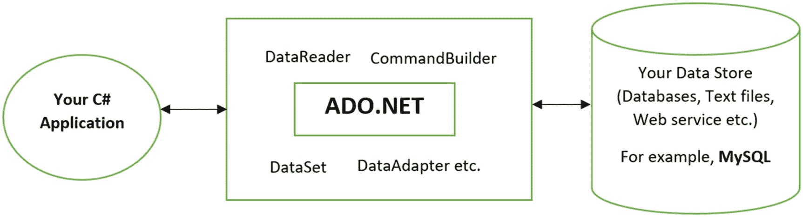

图 7-1

通过 ADO.NET 将 C# 应用连接到数据库

如果您是数据库编程新手，您可能需要学习一些关键术语，本章将简要介绍这些术语。我建议您反复阅读这些定义，以便更好地理解它们。渐渐地，这些术语你会越来越清楚。

## 数据库和 DBMS

数据库是一个有组织的数据集合。例如，根据其类型，数据库可以是与文件(或表)相关的集合。一个*表*可以是相关记录的集合，其中每个*记录*可以是相关字段的集合。字段是文件(或表格)中最小的有意义的信息。

一个*数据库管理系统* (DBMS)有效地创建和管理数据库。Oracle 数据库、SQL Server、MySQL 和 MS Access 是流行的 DBMS 软件包。

通常，数据库、DBMS 和相应的应用的集合可以形成一个数据库系统。

### DBMS 的类型

有不同类型的 DBMS，包括以下几种。

*   分级数据库管理系统

*   网络数据库管理系统

*   关系数据库管理系统

*   面向对象数据库

*   分布式数据库管理系统

各有利弊。选择数据库取决于您的需求。与其选择 SQL 数据结构(适合 RDBMS)，不如选择 NoSQL(适合 DDBMS 的非关系结构)。在本章中，您只看到了 RDBMS 和简单 SQL 语句的用法。

### 关系型数据库管理系统

在 RDBMS 中，数据存储在行和列中，这类似于表。你可能会看到常见的术语，比如*关系*、*元组*、*属性*。当您使用 SQL 时，正式的关系模型术语——*关系*、*元组*和*属性*——分别用于表、行和列。

表中的每一行都包含一条记录。每列都包含字段。图 [7-2](#Fig2) 所示的表格标记了所有的记录和属性。

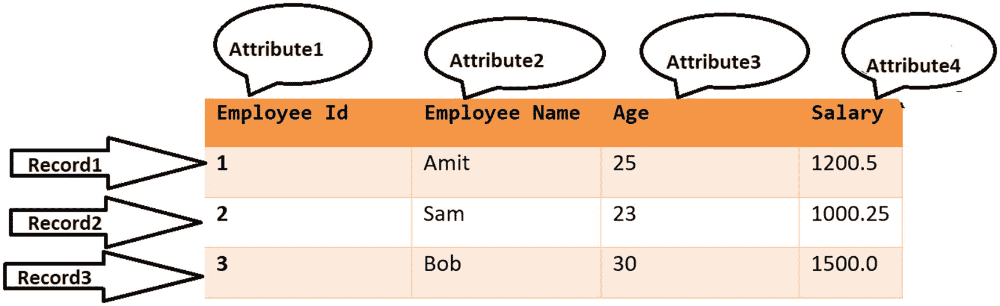

图 7-2

示例表标有记录和属性

您可以基于一个称为*关系代数*的数学公式来处理一个关系的不同记录。因为整个数据库都可以用它来处理，所以关系代数是关系数据库和 SQL 的理论基础。

Oracle 数据库、MySQL、Microsoft SQL Server 和 IBM DB2 是 RDBMS 的常见例子；在这一章中，我使用 MySQL 来演示例子。

Note

附录 A 包括在 Win10 机器上安装 MySQL 的步骤。

### 结构化查询语言

SQL 代表结构化查询语言。它是一种非常流行和广泛使用的 RDBMS 语言。它是一种类似英语的语言，被认为是第四代语言。创建数据、更新数据、读取数据和删除数据是 SQL 最常见的操作。

POINTS TO REMEMBER

*   C#、Java、C++和 C 都是通用语言的例子。每一种都被归类为第三代语言(3GL)，而 SQL 被称为 4GL。在 3GL 中，重点是“我如何解决一个问题？”但在 4GL，焦点是“我想要什么结果？”但是代替提供方法，你有让你的计算机/机器决定如何获得它的自由。虽然一个高级 3GL 可以结合 4GL 的一些重要方面。

*   值得注意的是，SQL 不区分大写和小写字符集，但通常需要使用大写关键字。

*   本章的各种程序中都使用了简单的 SQL 语句。如果您是 SQL 新手，我建议您在继续下一步之前，先在您喜欢的数据库中做一些简单的 SQL 语句练习，以便获得更好的想法。

我假设您已经在本地计算机上安装了 MySQL。如果尚未安装，请前往 [`https://dev.mysql.com/downloads/installer/`](https://dev.mysql.com/downloads/installer/) 下载安装程序并了解相关信息。也可以参考附录 A，里面有在 Win10 机器上安装 MySQL 的步骤。

当我为另一本书写关于不同技术的类似章节时，MySQL-installer-community-8 . 0 . 16 . 0 是最新版本。但随着我的前进，更新不断出现，我也在不断更新。最后定在了 8.0.19。

安装数据库是第一步。那么您需要一个特定于供应商的连接器。我用的是 MySQL。NET 框架。我寻找一个适合我的连接器。我去了 [`https://dev.mysql.com/downloads/connector/net/`](https://dev.mysql.com/downloads/connector/net/) ，如图 [7-3](#Fig3) 。

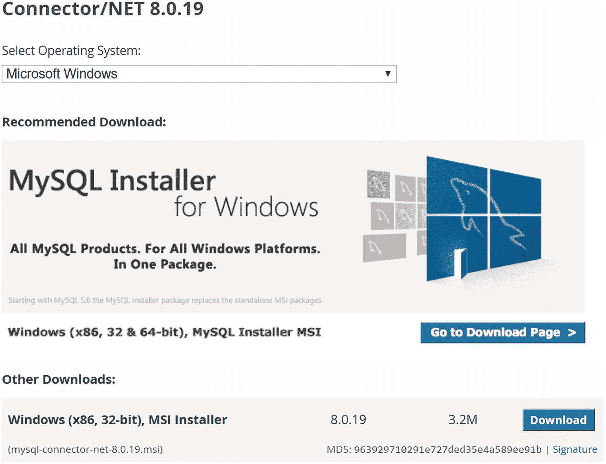

图 7-3

下载连接器

下载完压缩文件后，解压缩它以获得连接器。强烈建议您登陆官网( [`https://dev.mysql.com/doc/connector-net/en/connector-net-versions.html`](https://dev.mysql.com/doc/connector-net/en/connector-net-versions.html) )了解更多。网络连接器。忍不住要提以下几个有趣的点。

*   MySQL Connector/NET 有多个版本。

*   官网上说 MySQL Connector/NET 8.0 是 Connector/NET 7.0 的延续，目前命名为将版本号的第一位数字与其支持的(最高)MySQL 服务器版本同步。

*   MySQL Connector/NET 8.0 is highly recommended for use with MySQL Server 8.0, 5.7, and 5.6\. Based on your system configuration, you may need to upgrade and use the proper version of the connector. It’s worth looking at the table on the website, as shown in Figure [7-4](#Fig4), before you proceed.

    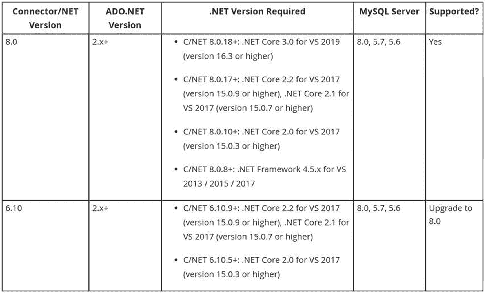

    图 7-4

    相关产品的连接器/网络要求(来源: [`https://dev.mysql.com/doc/connector-net/en/connector-net-versions.html`](https://dev.mysql.com/doc/connector-net/en/connector-net-versions.html) )

*   我电脑上安装的 Visual Studio 版本是 16.3.9。MySQL 版本是 8.0.18。我用过。NET Core 3.0 中的许多例子。因此，使用连接器版本 8.0 和更高版本是有意义的。

*   Once installed, you need to add a MySql.Data.dll reference to your project. On my machine, I used C:\Program Files (x86)\MySQL\MySQL Connector Net 8.0.19\Assemblies\v4.5.2\. Once you do this, to verify the information, open the Properties window. Note the arrow in Figure [7-5](#Fig5). It is an ADO.NET driver for MySQL for .NET Framework and .NET Core.

    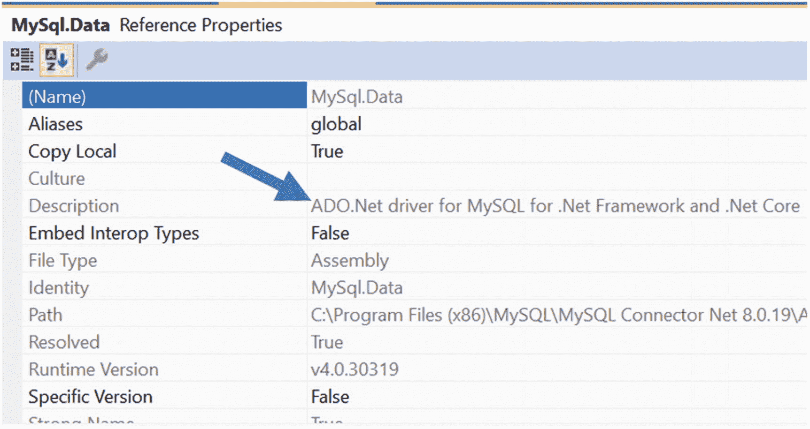

    图 7-5

    MySql。数据是 MySQL 的 ADO.NET。NET 框架和。净核心

*   如果你使用。NET 核心，你可能需要安装一个 MySql。数据包，然后再继续。您可以使用 Visual Studio 添加该包。或者，您可以转到工具➤ NuGet 软件包管理器➤软件包管理器控制台并键入以下命令(版本可能因您的情况而异):

```cs
PM> Install-Package MySql.Data -Version 8.0.19

```

正确操作后，您会看到类似于图 [7-6](#Fig6) 的屏幕。

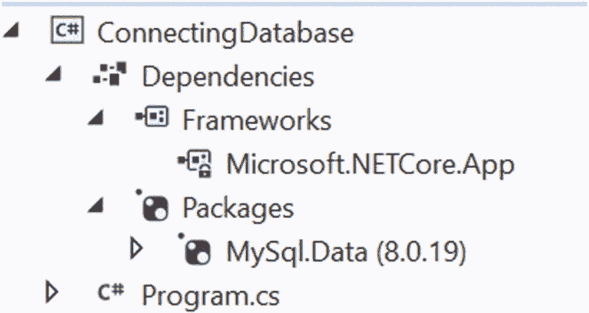

图 7-6

MySql。数据已成功添加到。网络核心应用

## ADO.NET 简论

因为我将在接下来的演示中使用 about，所以让我们快速讨论一下。首先，它是一个面向对象的框架，非常灵活。在传统方法中，您必须打开一个连接来连接数据库，然后执行简单的 SQL 查询。您的应用总是连接到数据库。因此，即使不使用数据存储，也会使用昂贵的数据库资源，这会降低应用的整体性能和效率。

为了克服这一点，ADO.NET 还支持*断开数据架构*，它说当你需要运行 SQL 查询时，你连接到数据库，获得结果，然后立即断开连接。为了保存这些结果，需要使用一个称为数据集的本地缓冲区。但是请记住，ADO.NET 也可以支持传统的面向连接的服务，并且在那里使用 DataReader。在这一章中，我将向您展示传统的面向连接的实现及其对应的非连接数据架构实现。

Note

ADO 代表 ActiveX 数据对象。但是微软基于 COM 的数据访问模型(ADO)不同于 ADO.NET。是的，有一些相似之处(例如，`Command`和`Connection`对象)，但它们有很大的不同。许多 ADO.NET 类型在 ADO 中没有直接的对等项(例如，`DataAdapter`)。ADO 有少量支持 COM 标准的数据类型；而 ADO.NET 是为。NET 应用连接数据库，它支持大量的数据类型。

## 理解代码

在 C# 中，数据库编程涉及到大量的类、接口、方法和属性。在这个层次上，对它们的详细描述并不重要。(老实说，如果你从所有这些术语的详细描述开始，可能会让你感到厌烦。他们通过练习被记住。)所以，让我们把重点放在接下来的演示中需要理解的部分。

在前两个演示中，我使用了面向连接的架构。在这种方法中，您的代码库显式地连接到数据存储，一旦数据处理完成，它就与数据存储断开连接。你经常看到使用`Connection`对象、`Command`对象和`DataReader`对象。

在第三个演示中，您将看到非连接数据架构的使用。在这种方法中，您首先会看到一个`DataSet`对象，它可以存储表、关系和约束(应用于表上)。一旦获得了这个对象，就可以使用它来遍历或操作数据，并将其用作客户端副本(即本地副本)。用户可以对本地副本进行更改，并在以后将更改应用到实际的数据库。这种方法加快了数据处理速度。它减少了网络流量，提高了应用的整体性能。

在 ADO.NET，你看不到连接不同数据库管理系统的单个对象集；取而代之的是各种数据提供者。这些提供程序针对连接特定的 DBMS(如 Oracle、MySQL 和 Microsoft SQL Server)进行了优化。例如，Microsoft 为 SQL Server 数据库提供了专门的优化类。这些类以 *Sql* 开始，包含在`System.Data.SqlClient`中。

同样，在我们的例子中，类名以 *MySql* 开头；比如`MySqlConnection`、`MySqlCommandBuilder`、`MySqlDataReader`。要在我的程序中使用这些类，需要以下名称空间。

```cs
using MySql.Data.MySqlClient;

```

您可以正确地假设每个提供者在一个命名空间中为您提供了一组类型。要在程序中使用这些类型，您需要包含相应的名称空间并安装正确的 NuGet 包(您已经学习了安装 MySql 的步骤。程序中的数据包)。在这个阶段，选择哪个数据库管理系统并不重要。通常，为了支持数据库编程的核心功能，每个提供者都提供相似的类和接口。当你看到演示时，你会对此有更好的理解。

首先，让我向您介绍一些在数据库编程中经常使用的常见对象类型，总结如下。

*   对象:连接和断开数据存储。

*   对象:表示 SQL 查询和存储过程。(存储过程将在后面讨论。)

*   `DataReader` object:从连接架构中的数据库读取数据。

*   `DataAdapter`对象:连接到一个数据库，从中获取记录，并填充一个本地缓冲区(`DataSet`)。在一个不相连的架构中，它的作用是至关重要的。

*   对象:表示参数化查询中的参数。

尽管每个提供程序的核心类的具体名称不同，但由于这些类继承自相同的基类并实现相同的接口，因此您可以假设如何使用特定于供应商的数据库。例如，因为我使用的是 MySQL 数据库，所以你会看到在我的程序中使用了`MySqlConnection`、`MySqlDataReader`和`MySqlCommand`。

类似地，其他供应商也提供遵循通用命名约定的名称。每个提供程序都在相关 DBMS 的名称前加上它们的构造。因此，如果您连接到一个 SQL 服务器，您可能会在类似的上下文中看到`SqlConnection`、`SqlDataReader`、`SqlCommand`等等的用法。

有趣的是，没有一个名为`Connection`的类。这同样适用于其他对象，例如`Command`对象、`DataAdapter`对象等等。因此，在这些上下文中，您只能看到特定于供应商的名称(例如，`MySqlConnection, MySqlCommandBuilder, MySqlDataReader`等)。).

开始编码吧。在接下来的演示中，您会看到下面几行代码。

```cs
static MySqlConnection mySqlConnection = null;
static MySqlCommand mySqlCommand = null;
static MySqlDataReader mySqlDataReader = null;

```

让我们来关注这三个元素:`MySqlConnection`、`MySqlCommand`和`MySqlDataReader`。我使用了“静态”变量，但这不是必需的。为了共享公共副本并避免不同方法中的重复初始化，我在这些程序中将它们设为静态。

Note

有来自 Visual Studio IDE 的部分/全部截图供您立即参考。我解释了重要的特征。

### mysql 连接

`MySqlConnection`是继承了`DbConnection`的密封类。图 [7-7](#Fig7) 是来自 Visual Studio IDE 的`MySqlConnection`类的部分截图。

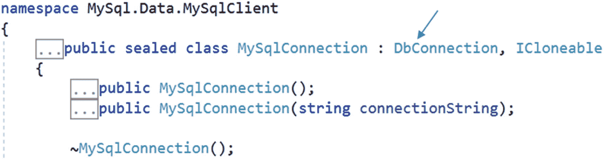

图 7-7

Visual Studio 2019 中 MySqlConnection 类的部分截图

深入一点，你会发现`DbConnection`是从`IDbConnection`派生出来的。图 [7-8](#Fig8) 是来自 Visual Studio IDE 的`DbConnection`类的部分截图。

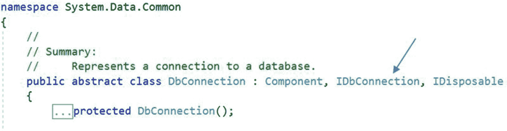

图 7-8

Visual Studio 2019 中 DbConnection 类的部分截图

`IDbConnection`包含在`System.Data`名称空间中，其方法如图 [7-9](#Fig9) 所示。

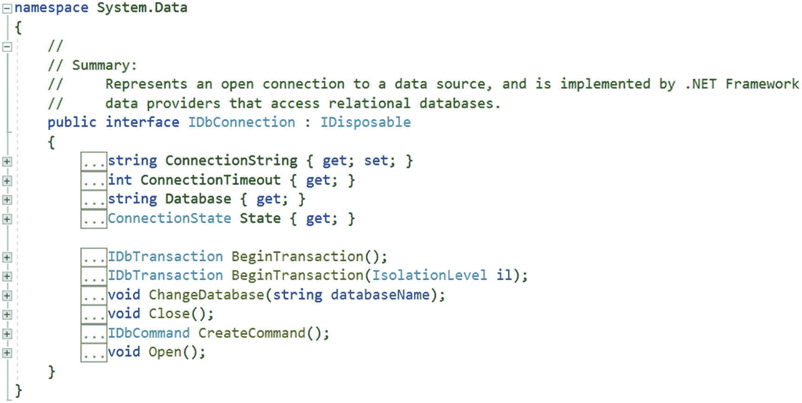

图 7-9

来自 Visual Studio 2019 的 IDbConnection 界面的部分截图

这些接口成员配置到特定数据存储的连接。您可以随时展开方法描述来查看有关该方法的信息。但是在高层次上，您可以看到数据提供者类型需要覆盖抽象类方法或实现接口方法。`MySqlConnection`正在做这个。

### MySqlCommand

`MySqlCommand`是继承自`DbCommand`的密封类。图 [7-10](#Fig10) 是来自 Visual Studio IDE 的`MySqlCommand`类的部分截图。

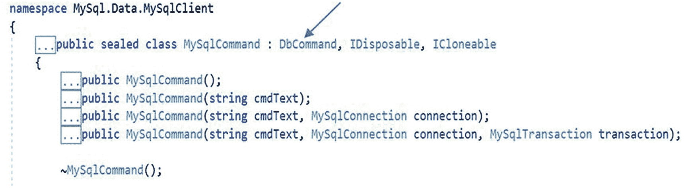

图 7-10

Visual Studio 2019 中 MySqlCommand 类的部分截图

`DbCommand`是一个抽象类，它为表示各种命令的特定于数据库的类提供了一个基类。它包含一个名为`ExecuteReader()`的方法，描述如下。

```cs
//
// Summary:
//     Executes the System.Data.Common.DbCommand.CommandText against the //     System.Data.Common.DbCommand.Connection,
//     and returns an System.Data.Common.DbDataReader.
//
// Returns:
//     A System.Data.Common.DbDataReader object.
public DbDataReader ExecuteReader();

```

`MySqlCommand`类覆盖了这个方法。在演示 1 中，您将在下面的代码段中看到该类的用法。

```cs
mySqlCommand = new MySqlCommand(sqlQuery,mySqlConnection);
mySqlDataReader = mySqlCommand.ExecuteReader();

```

从这段代码中，你可以看到我正在使用下面的代码制作一个`MySqlCommand`对象。

```cs
mySqlCommand = new MySqlCommand(sqlQuery,mySqlConnection);

```

在`MySqlCommand`类的部分截图中，有四个重载的构造函数版本可用。在这段代码中，我使用了下面的版本。

```cs
// Summary:
//     Initializes a new instance of the MySql.Data.MySqlClient.MySqlCommand class with the text of the query and a MySql.Data.MySqlClient.MySqlConnection.
//(Other details omitted)
public MySqlCommand(string cmdText, MySqlConnection connection);

```

然后我用`ExecuteReader()`方法构建了一个`MySqlDataReader`对象。

### MySqlDataReader

`MySqlDataReader`是一个密封类，扩展了`DbDataReader`、`IDataReader`、`IDataRecord`和`IDisposable`。图 [7-11](#Fig11) 是来自 VS2019 的部分截图；显示关于`MySqlDataReader`的信息。

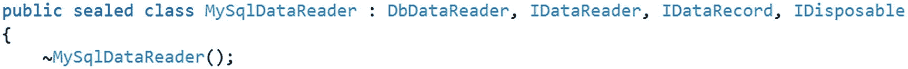

图 7-11

Visual Studio 2019 中 MySqlDataReader 类的部分截图

类成员帮助您从`MySQL`数据库中读取只进的行流。换句话说，一旦获得了一个对象`MySqlDataReader`，就可以以只读和只进的方式迭代结果。单词*只进*意味着一旦指向记录 2，就不能返回到记录 1，以此类推。

图 [7-12](#Fig12) 显示了`IDataReader`的概要。

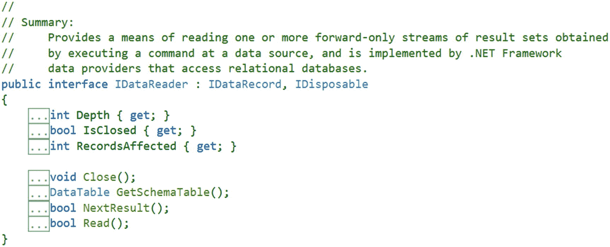

图 7-12

Visual Studio 2019 中 IDataReader 界面的部分截图

可以看到`IDataReader`扩展了`IDataRecord`接口，其中包含了很多方法。接口定义告诉我们，这些方法可以访问`DataReader`的每一行中的列值。还可以从流中提取强类型值。

在演示 1 中，您会看到`Close()`和`Read()`方法。如果可能的话，`Close()`方法关闭`DataReader`对象，`Read()`方法帮助`DataReader`对象前进到下一条记录。

在接下来的演示中不会用到方法，但是我会包括一个 Visual Studio 截图，它可以在将来的实现中帮助你。图 [7-13](#Fig13) 显示了`IDataRecord`界面的概要。

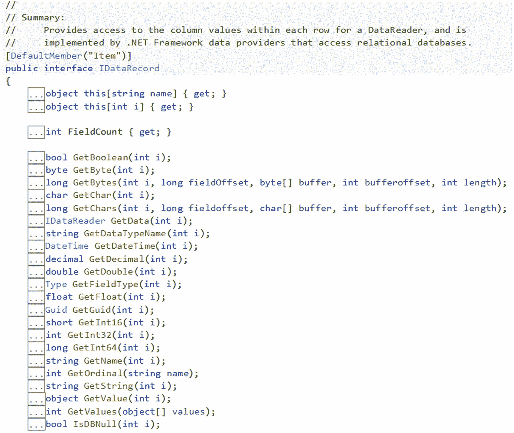

图 7-13

Visual Studio 2019 中 IDataRecord 界面的部分截图

## 实现面向连接的体系结构

现在您已经准备好实现一个面向连接的模型了。要使用 C# 应用连接到 MySQL 数据库，您需要有一个`MySqlConnection`对象和一个连接字符串*。*一个连接字符串可能包含几个键值对，用分号分隔。在每个键/值对中，选项名及其对应的值由等号连接。在下一个演示中，您会看到下面一行代码。

```cs
connectMe = "server=localhost;database=test;username=root;password=admin";
mySqlConnection = new MySqlConnection(connectMe);

```

`mySqlConnection`是`MySqlConnection`的实例。这一行简单地说明我将使用一个 MySqlConnection 对象，它被配置为连接到位于`localhost (the server)`的 MySQL 服务器。数据库名为`test`，用户名为`root`，密码为`admin`。

在演示 1 中，在`Main()`内部，您可以看到以下三种方法的存在。

```cs
// Open the database connection i.e. connect to a MySQL database.
ConnectToMySqlDatabase();
// Display details of Employee table.
DisplayRecordsFromEmployeeTable();
// Close the database connection.
CloseDatabaseConnection();

```

根据这些方法的名称和支持注释，很容易假设我正在使用一个`C#`应用打开一个到`MySQL`数据库的连接，然后从一个名为 Employee 的表中检索信息，最后关闭连接。在这个例子中，所有的方法都被`try-catch`块包围。这是推荐的做法。一旦遇到异常，这个结构可以帮助你更好地分析情况。

`Open()`和`Close()`方法用于打开和关闭该程序中的连接。`MySqlConnection`类中的`Open()`方法的细节如下所示。

```cs
public override void Open();

```

这只是说供应商已经覆盖了`DbConnection`的`Open()`方法，其中`Open()`被声明为抽象方法，如下所示。

```cs
//
// Summary:
//     When overridden in a derived class, opens a database connection with
//     the settings specified by the System.Data.Common.DbConnection.//     ConnectionString.public abstract void Open();

```

`Close()`方法也在`MySqlConnection`类中被覆盖，但是它关闭了一个数据库连接。

在`DisplayRecordsFromEmployeeTable()`方法中，你可以看到`MySqlCommand`对象和`ExecuteReader()`方法。

`mySqlDataReader.Close();`当读取完`Employee`表中的所有记录后，关闭`DataReader`对象。

在许多情况下，您会看到类似程序的 Windows 窗体应用。当您使用 Windows 窗体(ASP.NET WPF、UWP 等)时。)，你得到了更好的布局，你可以通过使用各种控件来美化作品。但是本章对那些美化不感兴趣。对于本书中的几乎所有程序，我都使用了控制台应用，我在这里也保持不变。

### 演示 1

这是完整的演示。

```cs
using System;
using MySql.Data.MySqlClient;

namespace ConnectingDatabase
{
    class Program
    {
        static string connectMe = String.Empty;
        static MySqlConnection mySqlConnection = null;
        static MySqlCommand mySqlCommand = null;
        static MySqlDataReader mySqlDataReader = null;
        static void Main(string[] args)
        {
            Console.WriteLine("∗∗∗Demonstration-1.Connecting and retrieving details from a MySQL database table.∗∗∗");
            try
            {
                /∗ Open the database connection i.e. connect to a  MySQL database.∗/
                ConnectToMySqlDatabase();
                // Display details of Employee table.
                DisplayRecordsFromEmployeeTable();
                // Close the database connection.
                CloseDatabaseConnection();
            }
            catch (Exception ex)
            {
                Console.WriteLine("Caught exception.Here is the problem details.");
                Console.WriteLine(ex.Message);
            }
            Console.ReadKey();
        }

        private static void DisplayRecordsFromEmployeeTable()
        {
            try
            {
                string sqlQuery = "select ∗ from Employee ;";
                mySqlCommand = new MySqlCommand(sqlQuery,mySqlConnection);
                mySqlDataReader = mySqlCommand.ExecuteReader();
                Console.WriteLine("EmployeeId\t" + "EmployeeName\t" + "Age\t" + "Salary");
                Console.WriteLine("_____________________________________");
                while (mySqlDataReader.Read())
                {
                    Console.WriteLine(mySqlDataReader["EmpId"] + "\t\t" + mySqlDataReader["Name"] + "\t\t" + mySqlDataReader["Age"] + "\t" + mySqlDataReader["Salary"]);
                }
                mySqlDataReader.Close();
            }
            catch (MySqlException ex)
            {
                Console.WriteLine("Cannot show the records.Here is the problem details.");
                Console.WriteLine(ex.Message);
            }
        }

        private static void ConnectToMySqlDatabase()
        {
            try
            {
                connectMe = "server=localhost;database=test;username=root;password=admin";
                mySqlConnection = new MySqlConnection(connectMe);
                mySqlConnection.Open();
                Console.WriteLine("Connection to MySQL successful.");
            }
            catch (MySqlException ex)
            {
                Console.WriteLine("Could not connect to the database.Here is the problem details.");
                Console.WriteLine(ex.Message);
            }
        }
        private static void CloseDatabaseConnection()
        {
            try
            {
                mySqlConnection.Close();
            }
            catch (MySqlException ex)
            {
                Console.WriteLine("Could not close the connection.Here is the problem details.");
                Console.WriteLine(ex.Message);
            }
        }
    }
}

```

#### 输出

这是输出。

```cs
∗∗∗Demonstration-1.Connecting and retrieving details from a MySQL database table.∗∗∗
Connection to MySQL successful.
EmployeeId      EmployeeName    Age     Salary
___________________________________________
1               Amit            25      1200.5
2               Sam             23      1000.25
3               Bob             30      1500

```

#### 分析

首先，在 C# 应用和 MySQL 数据库之间建立连接；然后可以从 Employee 表中检索信息。因为它是面向连接的体系结构，所以从数据库中获取记录后，就不能关闭连接。为了测试这一点，让我们修改下面的代码块，并假设您调用了`CloseDatabaseConnection()`方法，如下所示。

```cs
while (mySqlDataReader.Read())
{
        Console.WriteLine(mySqlDataReader["EmpId"] + "\t\t" + mySqlDataReader["Name"] + "\t\t" + mySqlDataReader["Age"] + "\t" + mySqlDataReader["Salary"]);
        // Closing the connection
        CloseDatabaseConnection();
}

```

如果您执行该程序，您会得到以下输出。

```cs
∗∗∗Demonstration-1.Connecting and retrieving details from a MySQL database table.∗∗∗
Connection to MySQL successful.
EmployeeId      EmployeeName    Age     Salary
___________________________________________
1               Amit            25      1200.5
Cannot show the records. Here is the problem details.
Invalid attempt to Read when reader is closed.

```

在演示 3 中，您将学习如何在连接关闭后继续工作。

### 演示 2

演示 1 向您展示了如何建立连接、关闭连接以及从数据库的表中检索信息。这个演示介绍了另外三种方法:一种在表中插入记录，一种从表中删除记录，一种更新表。它们分别被命名为`InsertNewRecordIntoEmployeeTable()`、`DeleteRecordFromEmployeeTable()`和`UpdateExistingRecordIntoEmployeeTable()`。

这个计划很简单，但我想强调以下几点。

*   一旦工作完成，每个方法都会调用`DisplayRecordsFromEmployeeTable()`方法来显示表的当前状态。

*   在删除记录时，您看到了一种从键盘接受用户提供的输入的方法。您可以在类似的上下文中参考以下代码行:

    ```cs
    mySqlCmd = new MySqlCommand("Delete from employee where name=@NameToBeDeleted", mySqlConnection);
    mySqlCmd.Parameters.AddWithValue("@NameToBeDeleted", empNameToDelete);
    mySqlCmd.Prepare();
    mySqlCmd.ExecuteNonQuery();

    mySqlCmd is an object of MySqlCmd.

    ```

*   Inside the `DeleteRecordFromEmployeeTable()` method in the following segment of code, you see a comment prior to the line of code.

    ```cs
    /∗ If deletion performs successfully, print this message.∗/
    Console.WriteLine("One record is deleted from employee table.");

    ```

    我用这个来表示我没有验证用户输入。为了简单起见，我没有包括验证，但是您可能需要对所有方法进行类似的验证。我把这个简单的练习留给你。(然而，在演示 4 中，在执行删除操作之后，使用了一个简单的验证。)

*   在`UpdateExistingRecordIntoEmployeeTable()`方法中，我更新了 Bob 的工资两次。最初，我将其更改为 3000.75，后来我将其重置为旧值:1500.00。我这样做是为了保持表的原始值。在实际编程中，最好对原始表进行备份。如果需要，可以使用备份表。您可以通过各种方式进行备份。但是这里我们处理的是一个名为`Employee`的表。因此，在这种情况下，您可以使用下面的查询从现有的 employee 表中创建另一个表(比如，`employee_backup`)并随意使用它。

*   重要的是要注意一个情况。prior 命令复制包含数据的表，但不复制其他数据库对象，如主键、外键、索引等。(如果您不知道这些键，请参考问答 7.9)。要从现有的表和所有依赖对象中复制数据，您可以使用下面两个命令(这里我假设您通过复制`employee_backup`来创建`Employee`表)。我还在创建表格之前检查它是否已经存在):

    ```cs
    create table if not exists employee like employee_backup;
    insert employee select ∗ from employee_backup;

    ```

```cs
create table employee_backup as (select ∗ from employee);

```

现在进行完整的演示。

```cs
using System;
using MySql.Data.MySqlClient;

namespace ExercisingSqlCommands
{
    class Program
    {
        static string connectMe = String.Empty;
        static MySqlConnection mySqlConnection = null;
        static MySqlDataReader mySqlDataReader = null;
        static MySqlCommand mySqlCommand = null;
        static void Main(string[] args)
        {
            Console.WriteLine("∗∗∗Demonstration-2.Connecting and retrieving details from a MySQL database table.∗∗∗");
            try
            {
                /∗ Open the database connection i.e. connect to a MySQL database.∗/
                ConnectToMySqlDatabase();
                // Display details of Employee table.
                DisplayRecordsFromEmployeeTable();

                #region insert and delete a record
                // Insert a new record in Employee table.
                InsertNewRecordIntoEmployeeTable();
                // Delete a record from the Employee table.
                DeleteRecordFromEmployeeTable();
                #endregion

                #region Update and reset a record
                /∗
                First updating a record and then resetting the value. So, basically there are two updates.∗/
                UpdateExistingRecordIntoEmployeeTable();
                #endregion

                //Close the database connection.
                CloseDatabaseConnection();
            }
            catch (Exception ex)
            {
                Console.WriteLine("Caught exception.Here is the problem details.");
                Console.WriteLine(ex.Message);
            }
            Console.ReadKey();
        }

        private static void UpdateExistingRecordIntoEmployeeTable()
        {
            try
            {
                Console.WriteLine("Updating Bob's salary to 3000.75");

                mySqlCommand = new MySqlCommand("update Employee set Salary=3000.75 where name="Bob";", mySqlConnection);
                mySqlCommand.ExecuteNonQuery();

                // If update performs successfully , print this message.
                Console.WriteLine("One record is updated in employee table.");
                Console.WriteLine("Here is the current table:");
                DisplayRecordsFromEmployeeTable();

                Console.WriteLine("Now resetting Bob's salary to 1500.00");
                mySqlCommand = new MySqlCommand("update Employee set Salary=1500.00 where name="Bob";", mySqlConnection);
                mySqlCommand.ExecuteNonQuery();

                // If update performs successfully , print this  message.
                Console.WriteLine("One record is updated in employee table.");
                Console.WriteLine("Here is the current table:");
                DisplayRecordsFromEmployeeTable();

            }
            catch (MySqlException ex)
            {
                Console.WriteLine("Cannot update the record.Here is the problem details.");
                Console.WriteLine(ex.Message);

            }
        }

        private static void DeleteRecordFromEmployeeTable()
        {
            try
            {
                Console.WriteLine("Enter the employee name to be deleted from Employee table.");
                string empNameToDelete = Console.ReadLine();
                /∗ Additional validation required to confirm the employee name exists in the table.
                Or, whether its a valid entry or not.
                ∗/
                mySqlCmd = new MySqlCommand("Delete from employee where name=@NameToBeDeleted", mySqlConnection);                mySqlCmd.Parameters.AddWithValue("@NameToBeDeleted", empNameToDelete);
                mySqlCmd.Prepare();
                mySqlCmd.ExecuteNonQuery();

                /* If deletion performs successfully , print this message.*/
                Console.WriteLine("One record is deleted from employee table.");
                Console.WriteLine("Here is the current table:");
                DisplayRecordsFromEmployeeTable();
            }
            catch (MySqlException ex)
            {
                Console.WriteLine("Cannot delete the record.Here is the problem details.");
                Console.WriteLine(ex.Message);
            }
        }

        private static void InsertNewRecordIntoEmployeeTable()
        {
            try
            {
                mySqlCommand = new MySqlCommand("insert into Employee values(4,'John',27,975);", mySqlConnection);
                mySqlCommand.ExecuteNonQuery();
                Console.WriteLine("New record insertion successful.");
                Console.WriteLine("Here is the current table:");
                DisplayRecordsFromEmployeeTable();
            }
            catch (MySqlException ex)
            {
                Console.WriteLine("Cannot insert the new record.Here is the problem details.");
                Console.WriteLine(ex.Message);
            }
        }

        private static void DisplayRecordsFromEmployeeTable()
        {
            try
            {
                string sqlQuery = "select ∗ from Employee ;";
                mySqlCommand = new MySqlCommand(sqlQuery, mySqlConnection);
                mySqlDataReader = mySqlCommand.ExecuteReader();
                Console.WriteLine("EmployeeId\t" + "EmployeeName\t" + "Age\t" + "Salary");
                Console.WriteLine("_____________________________________");
                while (mySqlDataReader.Read())
                {
                    Console.WriteLine(mySqlDataReader["EmpId"] + "\t\t" + mySqlDataReader["Name"] + "\t\t" + mySqlDataReader["Age"] + "\t" + mySqlDataReader["Salary"]);
                }
                mySqlDataReader.Close();
            }
            catch (MySqlException ex)
            {
                Console.WriteLine("Cannot show the records.Here is the problem details.");
                Console.WriteLine(ex.Message);
            }
        }
        private static void ConnectToMySqlDatabase()
        {
            try
            {
                connectMe = "server=localhost;database=test;username=root;password=admin";
                mySqlConnection = new MySqlConnection(connectMe);
                mySqlConnection.Open();
                Console.WriteLine("Connection to MySQL successful.");
            }
            catch (MySqlException ex)
            {
                Console.WriteLine("Could not connect to the database.Here is the problem details.");
                Console.WriteLine(ex.Message);
            }
        }
        private static void CloseDatabaseConnection()
        {
            try
            {
                mySqlConnection.Close();
            }
            catch (MySqlException ex)
            {
                Console.WriteLine("Could not close the connection.Here is the problem details.");
                Console.WriteLine(ex.Message);
            }
        }
    }
}

```

#### 输出

这是输出。

```cs
∗∗∗Demonstration-2.Connecting and retrieving details from a MySQL database table.∗∗∗
Connection to MySQL successful.
EmployeeId      EmployeeName    Age     Salary
___________________________________________
1               Amit            25      1200.5
2               Sam             23      1000.25
3               Bob             30      1500
New record insertion successful.
Here is the current table:
EmployeeId      EmployeeName    Age     Salary
___________________________________________
1               Amit            25      1200.5
2               Sam             23      1000.25
3               Bob             30      1500
4               John            27      975
Enter the employee name to be deleted from Employee table.
John
One record is deleted from employee table.
Here is the current table:
EmployeeId      EmployeeName    Age     Salary
___________________________________________
1               Amit            25      1200.5
2               Sam             23      1000.25
3               Bob             30      1500
Updating Bob's salary to 3000.75
One record is updated in employee table.
Here is the current table:
EmployeeId      EmployeeName    Age     Salary
___________________________________________
1               Amit            25      1200.5
2               Sam             23      1000.25
3               Bob             30      3000.75
Now resetting Bob's salary to 1500.00
One record is updated in employee table.
Here is the current table:
EmployeeId      EmployeeName    Age     Salary
___________________________________________
1               Amit            25      1200.5
2               Sam             23      1000.25
3               Bob             30      1500

```

## 实现断开连接的数据架构

现在是时候向您展示一个非连接数据架构的演示了(也称为*非连接层*)。演示 3 就是为此而做的。在这里，您可以看到`DataTable`、`DataRow`和`DataSet`类。要获得这些类，您需要包含以下名称空间。

```cs
using System.Data;

```

是 ADO.NET 议会的核心。这个名称空间还包含其他重要的类，如`DataColumn`、`DataRelation`和`Constraint`(它是一个抽象类)。以下是对它们每一个的简要描述。

*   `DataSet`:它是你的本地缓冲区(内存缓存)，是表或者记录集的集合。

*   `DataTable`:使用行和列以表格形式包含数据。

*   `DataRow`:表示`DataTable`中的单个行(即记录)。

*   `DataColumn`:表示`DataTable`中的一列。

*   `DataRelation`:表示两个`DataTable`对象之间的父子关系。

*   `Constraint` `:`表示对一个或多个`DataColumn`对象的限制。

在本演示中，您会看到下面几行代码。

```cs
static MySqlDataAdapter mySqlDataAdapter = null;
static MySqlCommandBuilder mySqlCommandBuilder = null;

```

所以，让我们来看看他们。

### MySqlDataAdapter

`MySqlDataAdapter`是一个密封类，因此不能创建另一个从它继承的类。class summary 声明它代表一组数据命令和一个数据库连接，用于填充数据集和更新 MySQL 数据库。看看 VS2019 怎么说。图 [7-14](#Fig14) 是`MySqlDataAdapter`级的部分截图。

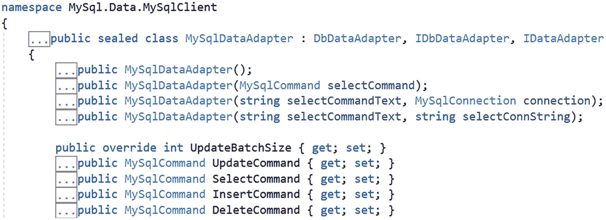

图 7-14

Visual Studio 2019 中 MySqlDataAdapter 类的部分截图

图 [7-14](#Fig14) 告诉你`MySqlDataAdapter`继承了`DbAdpater`、`IDbDataAdapter`和`IDataAdapter`。命名约定表明`IDbDataAdapter`和`IDataAdapter`是两个接口。我们来看看这些接口的总结。图 [7-15](#Fig15) 是`IDbDataAdapter`的截图。

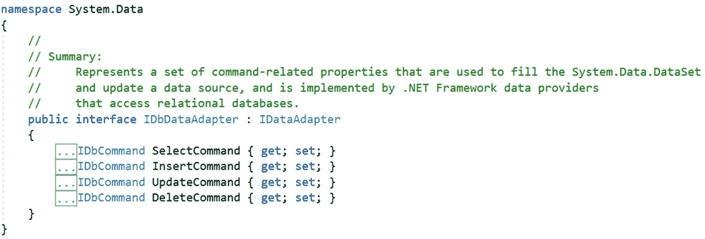

图 7-15

来自 Visual Studio 2019 的 IDbDataAdapter 界面的部分截图

您可以看到`IDbDataAdapter`有四个属性，用于从数据库中选择、插入、更新或删除记录。图 [7-15](#Fig15) 显示`IDataAdapter`是`IDbDataAdapter`的父级。

图 [7-16](#Fig16) 是来自 VS2019 的截图；它显示了`IDataAdapter`的摘要。

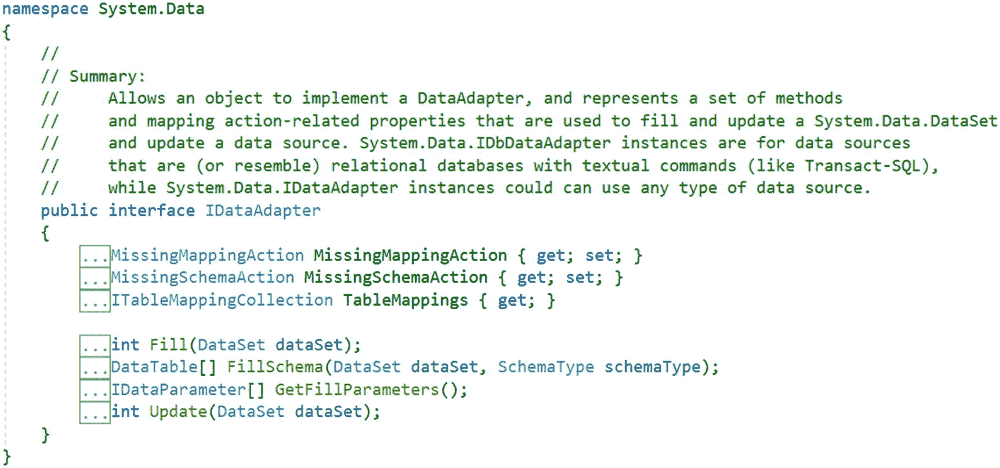

图 7-16

Visual Studio 2019 中 IDataAdapter 接口的部分截图

在这个接口中，您可以看到属性和方法。当您实现一个断开的数据架构时，`Fill`、`FillSchema`和`Update`方法是非常常见的。在演示 3 中，您会看到这些方法。演示 3 的下面一段代码展示了`Fill`和`FillSchema`方法。

```cs
// Retrieve details from 'Employee' table
mySqlDataAdapter.FillSchema(localDataSet, SchemaType.Source, "Employee");
mySqlDataAdapter.Fill(localDataSet, "Employee");

```

在使用`Fill()`方法之前，您可能需要调用`FillSchema()`，这允许您匹配源表的模式。当您在`DataTable`中离线插入新记录时，这一点很重要。

在许多应用中，您可能只会看到`Fill()`方法。在这些应用中，`Fill()`方法是最重要的方法，因为它是`DataAdapter`对象连接到物理数据库并获取查询结果的步骤(在本例中，我们在`Fill()`之前调用了`FillSchema()`)。

在这个界面中，您可以看到`TableMappings`属性，它将数据库列名(来自源表)映射到更加用户友好的显示名称(到数据集表)。

最后，`DbDataAdapter`是继承了前面两个接口的抽象类。方法总结指出这个类帮助实现了`IDbDataAdapter`接口。图 [7-17](#Fig17) 是来自 Visual Studio IDE 的`DbDataAdapter`类的部分截图。

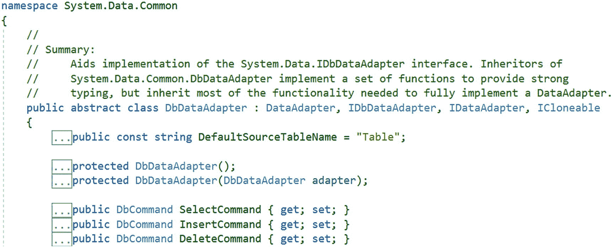

图 7-17

Visual Studio 2019 中 DbDataAdapter 类的部分截图

### MySqlCommandBuilder

`MySqlCommandBuilder`是继承自`DbCommandBuilder`的密封类。class summary 声明它会自动生成单表命令，以便将对`DataSet`的更改与相关的 MySQL 数据库进行协调。

图 [7-18](#Fig18) 是来自 Visual Studio IDE 的`MySqlCommandBuilder`的部分截图。

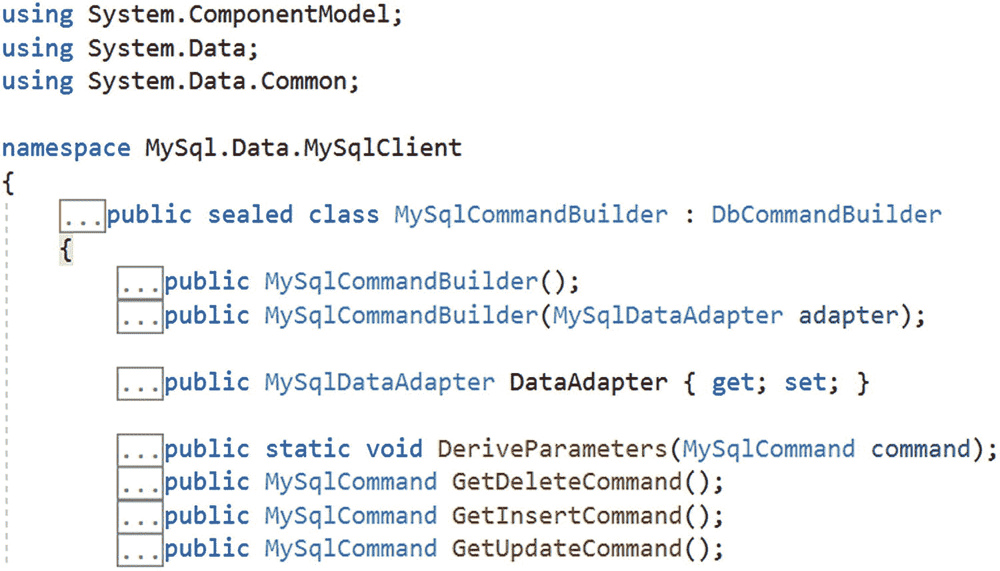

图 7-18

Visual Studio 2019 中 MySqlCommandBuilder 类的部分截图

在演示 3 中，当您想要将您的本地更改反映到实际数据库时，您会看到下面几行。

```cs
mySqlCommandBuilder = new MySqlCommandBuilder(mySqlDataAdapter);
Console.WriteLine("Syncing with remote database table");
mySqlDataAdapter.Update(localDataSet, "Employee");

```

这里，`mySqlDataAdapter`是`MySqlDataAdapter`的一个宾语。

### 演示 3

此演示显示 Employee 表中的记录，插入一条新记录，然后删除一条记录。为了便于理解这些操作，这些方法分别被命名为`DisplayRecordsFromEmployeeTable`、`InsertRecordIntoEmployeeTable`和 DeleteRecordIntoEmployeeTable。如果您在本演示之前浏览了类描述和讨论，您应该不难理解该代码——除了下面的代码段。

```cs
// Creates a new record with the same schema as the table
DataRow currentRow = localDataTable.NewRow();
currentRow["EmpId"] = 4;
currentRow["Name"] = "Jack";
currentRow["Age"] = 40;
currentRow["Salary"] = 2500.75;
// Add this record to local table
localDataTable.Rows.Add(currentRow);

```

是的，你猜对了！支持性的注释告诉您，这是向表中添加记录的一种方式。然而，有一种替代方法可以做到这一点。例如，下面的代码段也适用于这种环境。

```cs
// Also works
currentRow[0] = 4;
currentRow[1] = "Jack";
currentRow[2] = 40;
currentRow[3] = 2500.75;

```

你可以选择你喜欢的方法。如果您想减少输入，请选择第二种方法。如果你想要更好的可读性，选择第一个。

现在来看完整的演示和相应的输出。

```cs
using System;
using System.Data;
using MySql.Data.MySqlClient;

namespace ConnectingDatabase
{
    class Program
    {
        static string connectMe = String.Empty;
        static string sqlCommand = String.Empty;
        static MySqlDataAdapter mySqlDataAdapter = null;
        static MySqlCommandBuilder mySqlCommandBuilder = null;
        static DataSet localDataSet = null;

        static void Main(string[] args)
        {
            Console.WriteLine("∗∗∗Connecting and retrieving details from a MySQL database table.∗∗∗");
            Console.WriteLine("∗∗∗Testing the disconnected architecture now.∗∗∗");

            try
            {
                // Get a local copy of Employee table
                DataTable localDataTable = CreateLocalTable();
                //Display from the client-side(local)table.
                DisplayRecordsFromEmployeeTable(localDataTable);
                /∗ Insert a new record into local table and sync it with the database∗/
                InsertRecordIntoEmployeeTable(localDataTable);
                Console.WriteLine("∗∗After Inserting a record into the Employee table...∗∗");
                DisplayRecordsFromEmployeeTable(localDataTable);
                /∗ Delete an existing record from local table and sync it with the database. ∗/
                DeleteRecordIntoEmployeeTable(localDataTable);
                Console.WriteLine("∗∗After deleting a record into the Employee table...∗∗");
                DisplayRecordsFromEmployeeTable(localDataTable);
            }
            catch (Exception ex)
            {
                Console.WriteLine("Caught exception.Here is the problem details.");
                Console.WriteLine(ex.Message);
            }
            Console.ReadKey();
        }

        private static void DeleteRecordIntoEmployeeTable(DataTable localDataTable)
        {
            try
            {
                Console.WriteLine("Now deleting the record for EmpId4.");
                DataTable dataTable = localDataSet.Tables["Employee"];
                // Deleting a record
                DataRow deleteRow = dataTable.Rows.Find(4);
                deleteRow.Delete();

                //If deletion performs successfully, print this message.

                Console.WriteLine("Successfully deleted the record from local buffer where EmpId was 4.");
                // Apply the change to MySQL
                mySqlCommandBuilder = new MySqlCommandBuilder(mySqlDataAdapter);
                Console.WriteLine("Syncing with remote database table");
                mySqlDataAdapter.Update(localDataSet, "Employee");
                Console.WriteLine("Successfullly updated the remote table.\n");
            }
            catch (MySqlException ex)
            {
                Console.WriteLine("Could not delete the record.Here is the problem details.");
                Console.WriteLine(ex.Message);
            }
        }

        private static void InsertRecordIntoEmployeeTable(DataTable localDataTable)
        {
            try
            {
                /∗ Creates a new record with the same schema as the table.∗/
                DataRow currentRow = localDataTable.NewRow();
                currentRow["EmpId"] = 4;
                currentRow["Name"] = "Jack";
                currentRow["Age"] = 40;
                currentRow["Salary"] = 2500.75;
                // Add this record to local table
                localDataTable.Rows.Add(currentRow);
                Console.WriteLine("Successfully added a record into local buffer.");
                int noOfRecords = localDataTable.Rows.Count;
                Console.WriteLine("Local table currently has {0} number of records.", noOfRecords);
                // Apply the change to MySQL
                mySqlCommandBuilder = new MySqlCommandBuilder(mySqlDataAdapter);
                Console.WriteLine("Syncing with remote database table");
                mySqlDataAdapter.Update(localDataSet, "Employee");
                Console.WriteLine("Successfullly updated the remote table");
            }
            catch (MySqlException ex)
            {
                Console.WriteLine("Could not insert the record.Here is the problem details.");
                Console.WriteLine(ex.Message);
            }

        }

        private static void DisplayRecordsFromEmployeeTable(DataTable localDataTable)
        {
            try
            {
                int noOfRecords = localDataTable.Rows.Count;
                Console.WriteLine("Here is the table for you:");
                Console.WriteLine("EmployeeId\t" + "EmployeeName\t" + "Age\t" + "Salary");
                Console.WriteLine("_____________________________________");
                for (int currentRow = 0; currentRow < noOfRecords; currentRow++)
                {
                    Console.WriteLine(
                       localDataTable.Rows[currentRow]["EmpId"] + "\t\t" +
                       localDataTable.Rows[currentRow]["Name"] + "\t\t" +
                       localDataTable.Rows[currentRow]["Age"] + "\t" +
                       localDataTable.Rows[currentRow]["Salary"]
                       );
                }
            }
            catch (MySqlException ex)
            {
                Console.WriteLine("Cannot show the records.Here is the problem details.");
                Console.WriteLine(ex.Message);
            }
        }

        private static DataTable CreateLocalTable()
        {
            connectMe = "datasource=localhost;port=3306;database=test;username=root;password=admin";
            sqlCommand = "select ∗ from Employee";
            mySqlDataAdapter = new MySqlDataAdapter(sqlCommand, connectMe);
            // Also works
            //mySqlConnection = new MySqlConnection(connectMe);
            //mySqlDataAdapter = new MySqlDataAdapter(sqlCommand, mySqlConnection);

            // Create a DataSet instance
            /∗ I recommend you to use the following overloaded constructor of DataSet to use.∗/
            localDataSet = new DataSet("LocalDataSet");
            // Retrieve details from 'Employee' table
            mySqlDataAdapter.FillSchema(localDataSet, SchemaType.Source, "Employee");
            mySqlDataAdapter.Fill(localDataSet, "Employee");
            // Create new instance of DataTable
            DataTable dataTable = localDataSet.Tables["Employee"];
            int noOfRecords = dataTable.Rows.Count;
            Console.WriteLine("Created a local DataTable.Total number of records in this table is:{0}", noOfRecords);
            return dataTable;
        }
    }
}

```

#### 输出

这是输出。

```cs
∗∗∗Connecting and retrieving details from a MySQL database table.∗∗∗
∗∗∗Testing the disconnected architecture now.∗∗∗
Created a local DataTable.Total number of records in this table is:3
Here is the table for you:
EmployeeId      EmployeeName    Age     Salary
___________________________________________
1               Amit            25      1200.5
2               Sam             23      1000.25
3               Bob             30      1500
Successfully added a record into local buffer.
Local table currently has 4 number of records.
Syncing with remote database table
Successfullly updated the remote table
∗∗After Inserting a record into the Employee table...∗∗
Here is the table for you:
EmployeeId      EmployeeName    Age     Salary
___________________________________________
1               Amit            25      1200.5
2               Sam             23      1000.25
3               Bob             30      1500
4               Jack            40      2500.75
Now deleting the record for EmpId4.
Successfully deleted the record from local buffer where EmpId was 4.
Syncing with remote database table
Successfullly updated the remote table.

∗∗After deleting a record into the Employee table...∗∗
Here is the table for you:
EmployeeId      EmployeeName    Age     Salary
___________________________________________
1               Amit            25      1200.5
2               Sam             23      1000.25
3               Bob             30      1500

```

## 使用存储过程编程

您已经看到了 SQL 语句在前面所有程序中的使用。当您开始学习数据库编程时，这很好。但是这种方法有一个潜在的缺点。使用这些简单的 SQL 语句，您可以在代码中公开数据库模式(设计),这是可以更改的。这就是为什么在现实世界的应用中，您通常会看到存储过程的使用，而不是普通的 SQL 语句。

存储过程具有以下特征。

*   它们是预编译的可执行对象。

*   您可以在存储过程中使用一个或多个 SQL 语句。

*   任何复杂的 SQL 语句都可以用存储过程代替。

*   它们可以接受输入并返回输出。

已经说过，我在本章中使用简单的 SQL 语句来演示数据库编程的思想，如果您是 SQL 新手，我建议您在首选数据库中做 SQL 语句练习，以熟悉 SQL 语句。我建议存储过程也是如此。

现在我将向您展示如何用简单的存储过程替换 SQL 语句。

出于演示目的，让我们回到演示 1 或演示 2。在这里，您看到了 select、insert、update 和 delete SQL 语句的使用。在下一个演示中，我用存储过程替换 select、insert 和 delete 语句。剩下的情况，更新，非常简单。我把这个练习留给你。

现在，我们开始吧。

Note

附录 A 包括在 MySQL 数据库中创建这些存储过程所需的完整命令。如果需要，可以参考他们。

### 存储过程来选择记录

在我的数据库中，我创建了以下名为`GetAllEmployees`的存储过程，来替换演示 1 或演示 2 中的 select 查询。

```cs
DELIMITER $
CREATE PROCEDURE GetAllEmployees()
     BEGIN
        SELECT ∗ FROM EMPLOYEE;
    END $
DELIMITER ;

```

### 存储过程插入一条记录

在我的数据库中，我创建了以下名为`InsertOneNewRecord`的存储过程，来替换演示 2 中的插入查询。此存储过程插入具有预定义值的记录。

```cs
DELIMITER $
CREATE PROCEDURE InsertOneNewRecord()
    BEGIN
        insert into Employee values(4,'John',27,975);
    END $
DELIMITER ;

```

### 存储过程删除一条记录

在我的数据库中，我创建了以下名为`DeleteOneRecord`的存储过程，来替换演示 2 中的删除查询。该存储过程根据用户的输入删除一条记录。

```cs
DELIMITER //
CREATE PROCEDURE DeleteOneRecord(
  IN NameToBeDeleted varchar(10)
)
BEGIN
  Delete from employee where Name=NameToBeDeleted;
END //
DELIMITER;

```

Note

您可以选择分隔符。注意，在前两个存储过程中，我使用了`$`作为分隔符，但是在最后一个存储过程中，我使用了`//`。

### 一个简单的验证

为了简单和减少代码量，我告诉你在不同的操作之后实现你自己的验证方法。在这个演示中，我将使用下面的代码段(在`DeleteRecordFromEmployeeTable()`方法中)向您展示一个简单的验证技术。

```cs
if (mySqlCommand.ExecuteNonQuery() == 1)
{
        // If deletion performs successfully , print this message.
        Console.WriteLine("One record is deleted from employee table.");
}
else
{
        Console.WriteLine("Couldn't delete the record from employee table.");
}

```

如果您在 Visual Studio IDE 中看到`ExecuteNonQuery()`方法描述，您将获得以下信息。

```cs
//
// Summary:
//     Executes a SQL statement against the connection and returns the //     number of rows affected.
//
// Returns:
//     Number of rows affected
//
// Remarks:
//     You can use ExecuteNonQuery to perform any type of database //     operation, however any resultsets returned will not be available. //     Any output parameters used in calling a stored procedure will be //     populated with data and can be retrieved after execution is //     complete. For UPDATE, INSERT, and DELETE statements, the return //     value is the number of rows affected by the command. For all other //     types of statements,the return value is -1.
public override int ExecuteNonQuery();

```

这个描述是不言自明的。您可以很容易地将这种方法用于自己的验证目的。

### 演示 4

这是完整的演示。方法名和操作与`demonstration 2`相似，但是这次使用了简单的存储过程。我建议你参考相关评论，以便更好地了解。

```cs
using System;
using System.Data;
using MySql.Data.MySqlClient;

namespace UsingStoredProcedures
{
    class Program
    {
        static string connectMe = String.Empty;
        static MySqlConnection mySqlConnection = null;
        static MySqlCommand mySqlCommand = null;
        static MySqlDataReader mySqlDataReader = null;
        static void Main(string[] args)
        {
            Console.WriteLine("∗∗∗Demonstration-4.Using stored procedure now.∗∗∗");
            try
            {
                /∗ Open the database connection i.e. connect to a  MySQL database∗/
                ConnectToMySqlDatabase();
                // Display details of Employee table.
                DisplayRecordsFromEmployeeTable();
                // Insert a new record in Employee table.
                InsertNewRecordIntoEmployeeTable();
                // Delete a record from the Employee table.
                DeleteRecordFromEmployeeTable();
                // Close the database connection.
                CloseDatabaseConnection();
            }
            catch (Exception ex)
            {
                Console.WriteLine("Caught exception.Here is the problem details.");
                Console.WriteLine(ex.Message);
            }
            Console.ReadKey();
        }

        private static void DisplayRecordsFromEmployeeTable()
        {
            try
            {
                #region old code( which you saw in previous demonstrations)
                //string sqlQuery = "select ∗ from Employee ;";
                //mySqlCommand = new MySqlCommand(sqlQuery, mySqlConnection);
                #endregion
                #region new code
                //The following lines are moved to a common place
                //mySqlCommand = new MySqlCommand();
                //mySqlCommand.Connection = mySqlConnection;
                mySqlCommand.CommandText = "SelectAllEmployees";//Using Stored Procedure
                mySqlCommand.CommandType = CommandType.StoredProcedure;
                #endregion
                mySqlDataReader = mySqlCommand.ExecuteReader();
                Console.WriteLine("EmployeeId\t" + "EmployeeName\t" + "Age\t" + "Salary");
                Console.WriteLine("_____________________________________");
                while (mySqlDataReader.Read())
                {
                    Console.WriteLine(mySqlDataReader["EmpId"] + "\t\t" + mySqlDataReader["Name"] + "\t\t" + mySqlDataReader["Age"] + "\t" + mySqlDataReader["Salary"]);
                }
                mySqlDataReader.Close();
            }
            catch (MySqlException ex)
            {
                Console.WriteLine("Cannot show the records.Here is the problem details.");
                Console.WriteLine(ex.Message);
            }
        }
        private static void InsertNewRecordIntoEmployeeTable()
        {
            try
            {
                // Old code (you saw in demonstration 2)
                //mySqlCommand = new MySqlCommand("insert into Employee values(4,'John',27,975);", mySqlConnection);

                #region new code
                //The following lines are moved to a common place

                //mySqlCommand = new MySqlCommand();
                //mySqlCommand.Connection = mySqlConnection;
                mySqlCommand.CommandText = "InsertOneNewrecord";// Using Stored Procedure
                mySqlCommand.CommandType = CommandType.StoredProcedure;
                #endregion

                mySqlCommand.ExecuteNonQuery();
                Console.WriteLine("New record insertion successful.");
                Console.WriteLine("Here is the current table:");
                DisplayRecordsFromEmployeeTable();
            }
            catch (MySqlException ex)
            {
                Console.WriteLine("Cannot insert the new record.Here is the problem details.");
                Console.WriteLine(ex.Message);
            }
        }
        private static void DeleteRecordFromEmployeeTable()
        {
            try
            {
                Console.WriteLine("Enter the employee name to be deleted from Employee table.");
                string empNameToDelete = Console.ReadLine();

                #region new code
                MySqlParameter deleteParameter = new MySqlParameter("NameToBeDeleted", MySqlDbType.VarChar);
                mySqlCommand.CommandType = CommandType.StoredProcedure;
                mySqlCommand.CommandText = "DeleteOneRecord";
                // Using Stored Procedure
                /∗ The following code segment will also work but  in that case, you have to add the value to the parameter  first.∗/
                //deleteParameter.Value = empNameToDelete;
                //mySqlCommand.Parameters.Add(deleteParameter);
                mySqlCommand.Parameters.AddWithValue("NameToBeDeleted", empNameToDelete);

                #endregion
                if (mySqlCommand.ExecuteNonQuery()==1)
                {
                // If deletion performs successfully, print this message.
                    Console.WriteLine("One record is deleted from employee table.");
                }
                else
                {
                    Console.WriteLine("Couldn't delete the record from employee table.");
                }

               Console.WriteLine("Here is the current table:");
               DisplayRecordsFromEmployeeTable();

            }
            catch (MySqlException ex)
            {
                Console.WriteLine("Cannot delete the record.Here is the problem details.");
                Console.WriteLine(ex.Message);
            }
        }

        private static void ConnectToMySqlDatabase()
        {
            try
            {
                // The following will also work
                //connectMe = "datasource=localhost;port=3306;database=test;username=root;password=admin";
                connectMe = "server=localhost;database=test;username=root;password=admin";
                mySqlConnection = new MySqlConnection(connectMe);
                mySqlConnection.Open();
                Console.WriteLine("Connection to MySQL successful.");
                // Initializing Command here to remove duplicate codes.
                mySqlCommand = new MySqlCommand();
                mySqlCommand.Connection = mySqlConnection;
            }
            catch (MySqlException ex)
            {
                Console.WriteLine("Could not connect to the database.Here is the problem details.");
                Console.WriteLine(ex.Message);
            }
        }
        private static void CloseDatabaseConnection()
        {
            try
            {
                mySqlConnection.Close();
            }
            catch (MySqlException ex)
            {
                Console.WriteLine("Could not close the connection.Here is the problem details.");
                Console.WriteLine(ex.Message);
            }
        }
    }
}

```

#### 输出

这是输出。

```cs
∗∗∗Demonstration-4.Using stored procedure now.∗∗∗
Connection to MySQL successful.
EmployeeId      EmployeeName    Age     Salary
___________________________________________
1               Amit            25      1200.5
2               Sam             23      1000.25
3               Bob             30      1500
New record insertion successful.
Here is the current table:
EmployeeId      EmployeeName    Age     Salary
___________________________________________
1               Amit            25      1200.5
2               Sam             23      1000.25
3               Bob             30      1500
4               John            27      975
Enter the employee name to be deleted from Employee table.
John
One record is deleted from employee table.
Here is the current table:
EmployeeId      EmployeeName    Age     Salary
___________________________________________
1               Amit            25      1200.5
2               Sam             23      1000.25
3               Bob             30      1500

```

### 问答环节

7.1 为什么 ADO.NET 支持不同的提供者连接到不同的数据库，而不是给出一组对象来与不同的数据库通信？

以下是使用这种方法可以获得的一些重要好处。

*   特定的提供程序可以帮助您直接连接到特定的数据库。因此，您不需要支持调用者和数据存储之间的任何中间层。

*   对于特定的数据库，提供程序具有特殊和独特的功能。您可以从这种专业支持中获益。

**7.2 在 ADO.NET****使用非连接数据架构有什么好处？**

在大多数现实世界的应用中，所需的数据保存在远程计算机上，您通过网络连接到该计算机。在断开连接的数据架构中，一旦获得了`DataSet`对象，所需的数据就保留在本地机器中，因此可以快速访问这些数据。同时，由于您不需要互联网连接来访问本地数据，因此可以减少网络流量。因此，应用的整体性能得到了增强。

最后，您可以对本地数据进行任何更改，并进行自己的实验。您可以决定是否要在实际的数据库中反映这些变化(通过调用适配器的`Update()`方法)。在实际的数据库上做实验显然不是一个好主意。

**7.3 在演示 3 中，您在下面的代码段中的** `Fill()` **方法** **之前调用了** `FillSchema()` **。这有必要吗？**

```cs
// Retrieve details from 'Employee' table
mySqlDataAdapter.FillSchema(localDataSet, SchemaType.Source, "Employee");
mySqlDataAdapter.Fill(localDataSet, "Employee");

```

这是一种更好的做法。为了包含现有表中的约束，我包含了这行代码。在这种情况下，您有两种选择:使用`DataAdapter`的`FillSchema`方法，或者在调用`Fill`方法之前将`DataAdapter`的`MissingSchemaAction`属性设置为`AddWithKey`。在我们的例子中，如果没有使用`FillSchema()`，该行应该被注释如下。

```cs
//mySqlDataAdapter.FillSchema(localDataSet, SchemaType.Source, "Employee");

```

如果您再次运行该应用，您会在删除操作之前得到一个异常，该异常表明*表*没有主键*。***

 *如果你有兴趣了解这些方法，请访问 [`https://docs.microsoft.com/en-us/dotnet/framework/data/adonet/adding-existing-constraints-to-a-dataset`](https://docs.microsoft.com/en-us/dotnet/framework/data/adonet/adding-existing-constraints-to-a-dataset) 。

7.4 什么是存储过程？

如果要重复一系列任务，请创建一个存储过程。它是存储在数据库中的一个子程序。在我们的例子中，一个存储过程可以有一个名称、参数和 SQL 语句；它非常类似于 C# 中的一个方法。创建存储过程的步骤因数据库而异。在本章中，演示 4 向您展示了三个存储过程来满足我们的需求。

7.5 存储过程类似于函数。这是正确的吗？

存储过程和函数有一些显著的不同。例如，在 MySQL 中，一个存储过程可以返回一个或多个值，或者根本不返回值；而函数总是返回单个值。

7.6 如何创建一个函数？一个简单的演示可以帮助我。

这是一个 SQL 查询，用于创建一个名为 **AddNumbers** 的函数:

`mysql> create function AddNumbers(firstNumber double,secondNumber double) returns double deterministic return firstNumber+secondNumber;`

查询正常，0 行受影响(0.45 秒)

以下查询确认了函数的详细信息:

```cs
mysql> Select Routine_name as "Function Name", routine_Definition as "Definition", Routine_Schema "Schema", Data_Type as "Types", Created From  Information_Schema.Routines Where Routine_Name="AddNumbers" and Routine_Type= 'FUNCTION';
Here is an output:
+-----------------+-------------------------+---------+--------+--------------------+
| Function Name | Definition            | Schema | Types | CREATED          |
+-----------------+---------------------------+---------+--------+---------------------+
| AddNumbers   | return firstNumber+                  secondNumber          | test   | double | 2020-03-17 10:13:20 |
+-----------------+--------------------------+---------+--------+--------------------+
1 row in set (0.00 sec)

```

图 [7-19](#Fig19) 为紧凑视图。

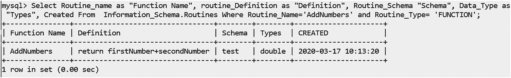

图 7-19

一旦在 MySQL 中创建了名为 AddNumbers 的函数，就可以从 MySQL 命令提示符中截取屏幕截图。

或者，您可以使用以下查询查看当前数据库中的所有函数。

```cs
mysql> show function status where db="test";

```

现在让我们执行函数。函数可以通过多种方式调用。下面是一个带有输出的示例查询。

```cs
mysql> select AddNumbers(25,45) as "Total";
+-------+
| Total |
+-------+
|    70 |
+-------+
1 row in set (0.00 sec)

```

**7.7 我在一些地方的 SQL 上下文中看到了术语 DDL。这是什么意思？**

SQL 命令通常分为以下几类。

*   DDL(数据定义语言)语句创建或修改数据库对象的结构。在这个上下文中使用 create、alter、drop 和 truncate 语句。

*   DML(数据操作语言)语句检索、插入、更新或删除数据库中的记录。例如，在这个上下文中使用 insert、update、delete 和 select 语句。一些工程师喜欢将 select 语句放在一个单独的类别中，称为 DQL(数据查询语言)。

*   DCL(数据控制语言)语句创建各种角色和权限来控制对数据库的访问。例如，您可以在此上下文中使用 grant 和 revoke 语句。

*   TCL(事务控制语言)语句管理数据库中发生的不同事务。例如，您可以在这个上下文中使用`commit`和`rollback`语句。

7.8 ADO.NET 与 ADO 有何不同？

请参考《浅谈 ADO》中的注释。NET”部分。

7.8 什么是分隔符？为什么用？

你需要在 MySQL 中使用一个分隔符来处理一组语句(函数、存储过程等。)作为一个完整的语句。默认情况下，使用分隔符`;`来分隔两个语句。但是当你需要把多个语句作为一个整体来处理的时候，你临时设置自己的分隔符，然后重新设置为默认的`;`。当您创建自己的存储过程时，您可以选择不同的分隔符，如`//`或`$`。

**7.9 您使用了术语** ***主键*** **和** ***外键*** **。你什么意思？**

*主键*(更准确地说，是候选键)是用于正确识别记录的单个字段或字段组合。例如，在一个组织中，两个雇员可以有相同的名字，但是他们的雇员 id 不同。因此，您应该选择 id 作为主键，而不是选择名称。需要注意的是，主键不仅定义唯一性，而且不能为空。例如，雇员必须有一个标识号(ID)。

理论上，在一个表中可以有几个唯一标识一条记录的键。这些被称为*候选键*。在这些候选键中，你只选择一个作为主键，剩下的键叫做*备用键*。例如，假设您有一个名为`StudentTable`的表来维护不同的学生记录。在这个表中，我们假设有像`StudentName, StudentAddress, Department`这样的列，以此类推。现在您可能会发现，`RollNumber`和`StudentName, StudentAddress`的组合都可以唯一地标识一条记录。所以，如果你选择`RollNumber`作为主键，另一个`(StudentName, StudentAddress)`，就是备用键。当你有多个列作为一个键时，这些键也被称为*组合键*。例如，(StudentName，StudentAddress)就是组合键的一个例子。

*外键*用于定义两个表之间的关系。外键是作为另一个表的主键的列。包含外键的表通常被称为*子表*，包含候选键的表通常被称为引用表或*父表*。在这种情况下，MySQL 社区说:“外键关系涉及一个保存初始列值的父表，以及一个列值引用父列值的子表。在子表上定义了外键约束。(参见 [`https://dev.mysql.com/doc/refman/5.6/en/create-table-foreign-keys.html`](https://dev.mysql.com/doc/refman/5.6/en/create-table-foreign-keys.html) )。

## 连接池

让我们以一个关于连接池的简短讨论来结束这一章。在本章中，数据库存储在本地。您可能看不到连接数据库所用时间的影响，但是许多实际应用都要花大量时间来连接数据库(无论是否使用。NET，Java 等。).

如果有许多连接快速发生(例如，一个 web 应用)，初始化(或打开)连接然后关闭连接会降低应用的性能。为了克服这个问题，你可以使用*连接池*。连接池特定于给定的连接。为了启用它们，在许多应用中，您会在连接字符串中看到“Pooling=true”。(对于`MySqlConnection`，默认情况下启用池)。

当连接池被启用时，提供者提供一个“连接的和开放的”连接池，无论谁请求一个连接，它都会立即被提供给谁。在这种情况下，在调用了`Close()`方法之后，连接似乎是打开的，这是一种预期的行为。MySQL 社区在 [`https://dev.mysql.com/doc/connector-net/en/connector-net-connections-pooling.html`](https://dev.mysql.com/doc/connector-net/en/connector-net-connections-pooling.html) 说了下面的话。

> *MySQL Connector/NET 支持连接池，以提高数据库密集型应用的性能和可伸缩性。默认情况下，这是启用的。您可以使用连接字符串选项池、连接重置、连接生存期、缓存服务器属性、最大池大小和最小池大小来关闭它或调整其性能特征。*

> *连接池的工作原理是在客户端释放 MySqlConnection 时保持与服务器的本地连接。随后，如果打开一个新的 MySqlConnection 对象，它将从连接池中创建，而不是创建一个新的本机连接。这提高了性能。*

最后，`Max Pool Size`和`Min Pool Size`的出现暗示了(连接的)池大小可能因应用而异。

## 最后的话

这些是数据库编程的基础。

这不仅是本章的结尾，也是本书的结尾。恭喜你，你已经完成了这本书！我相信你将来会发现这本书很有用。现在，您已经为 C# 的高级编程做好了准备，希望您可以进一步了解 C# 中即将出现的新概念。

直到我们再次见面，享受和快乐编码！祝你一切顺利。

## 摘要

本章讨论了以下关键问题。

*   什么是数据库？

*   什么是数据库管理系统？什么是不同类型的数据库管理系统？

*   RDBMS 中有哪些常用术语？

*   什么是 SQL？

*   什么是 ADO.NET？它与经典的 ADO 有何不同？

*   你如何连接 MySQL？

*   C# 应用如何与数据库对话？

*   如何使用 C# 应用实现连接层？

*   如何使用 C# 应用实现断开连接的层？

*   如何在程序中使用`MySqlConnection`、`MySqlCommand`、`MySqlDataReader`、`MySqlDataAdapter`、`MySqlCommandBuilder`？

*   什么是存储过程？它与存储函数有什么不同？

*   你如何在你的程序中使用存储过程？*