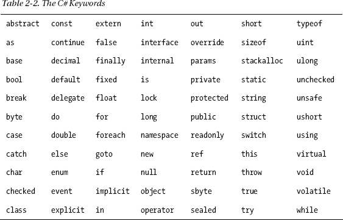
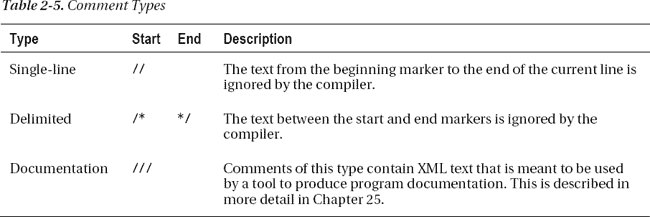

# 二、C# 编程概述

### 一个简单的 C# 程序

这一章是学习 C# 的基础。由于我将在本文中广泛使用代码示例，我首先需要向您展示 C# 程序的样子及其各个部分的含义。

我将首先演示一个简单的程序，并逐一解释它的组件。这将介绍一系列主题，从 C# 程序的结构到将程序输出到屏幕的方法。

有了这些源代码预备知识，我就可以在本文的其余部分自由地使用代码示例了。所以，不像下面的章节，其中一个或两个主题被详细讨论，这一章涉及许多主题，只有最低限度的解释。

让我们先看一个简单的 C# 程序。该程序的完整源代码显示在图 2-1 左上角的阴影区域。如图所示，代码包含在一个名为`SimpleProgram.cs`的文本文件中。当你通读它的时候，不要担心理解所有的细节。表 2-1 给出了代码的逐行描述。图左下方的阴影区域显示了程序的输出。图的右边部分是程序各部分的图形描述。

> *   When code compilation is executed, the string "Hi there!" is displayed. In a window on the screen.
> *   Line 5 contains two consecutive slash characters. The compiler ignores these characters and everything that follows them in the line. This is called *single-line annotation* .

***图 2-1。**简单程序程序*

T2】

#### 关于简单程序的更多信息

C# 程序由一个或多个类型声明组成。本书的大部分内容是解释你可以在程序中创建和使用的不同类型。程序中的类型可以以任何顺序声明。在`SimpleProgram`示例中，只声明了一个`class`类型。

名称空间是一组与名称相关的类型声明。`SimpleProgram`使用两个名称空间。它创建了一个名为`Simple`的新名称空间，在这个名称空间中它声明了自己的类型(类`Program`，并使用了在名为`System`的名称空间中定义的`Console`类。

要编译程序，可以使用 Visual Studio 或命令行编译器。要以最简单的形式使用命令行编译器，请在命令窗口中使用以下命令:

`   csc SimpleProgram.cs`

在这个命令中，`csc`是命令行编译器的名称，`SimpleProgram.cs`是源文件的名称。CSC 代表“C-Sharp 编译器”

### 标识符

*标识符*是字符串，用于命名变量、方法、参数和一系列其他编程结构，这些将在后面介绍。

您可以通过使用大小写字母将有意义的单词连接成一个描述性名称来创建自文档化的标识符(例如，`CardDeck`、`PlayersHand`、`FirstName`、`SocialSecurityNum`)。标识符中的某些位置允许或不允许使用某些字符。图 2-2 说明了这些规则。

> *   And underscores (`a` to `z`, `A` to `Z` and `_`) are allowed to appear in any position.
> *   Numbers are not allowed in the first position, and all other positions are allowed.
> *   The `@` character is allowed to appear in the first position of the identifier, but not in any other position. Although it is allowed, it is usually discouraged.

***图 2-2。**标识符中允许的字符*

标识符区分大小写。例如，变量名`myVar`和`MyVar`是不同的标识符。

例如，在下面的代码片段中，变量声明都是有效的，并且声明了不同的整数变量。但是使用这样相似的名字会使编码更容易出错，调试更困难。那些稍后调试你的代码的人会不高兴的。

`   // Valid syntactically, but very confusing!
   int totalCycleCount;
   int TotalCycleCount;
   int TotalcycleCount;`

我将在第七章中描述推荐的 C# 命名约定。

### 关键词

*关键字*是用来定义 C# 语言的字符串记号。表 2-2 给出了 C# 关键字的完整列表。

关于关键词，需要了解的一些重要事项如下:

> *   Keyword cannot be used as variable name or any other form of identifier unless it begins with `@` character.
> *   All C# keywords are all composed of lowercase letters. (.However, NET type names use Pascal case. )

*上下文关键字*是仅在特定语言结构中充当关键字的标识符。在这些位置上，它们有特殊的意义；但是与不能用作标识符的关键字不同，上下文关键字可以在代码的其他部分用作标识符。表 2-3 包含上下文关键词列表。

### Main:程序的起点

每个 C# 程序都必须有一个包含名为`Main`的方法的类。在前面显示的`SimpleProgram`程序中，它在一个名为`Program`的类中声明。

> *   The execution starting point of every C# program is at the first instruction in `Main`.
> 
> `Main`

`Main`最简单的形式如下:

`    static void Main( )
    {
       *Statements*
    }`

### 空白

*程序中的空白*是指没有可见输出字符的字符。编译器会忽略源代码中的空白，但程序员会用它来使代码更加清晰易读。一些空白字符包括以下内容:

> *   blank
> *   tabs
> *   line feed
> *   return

例如，尽管以下代码片段在外观上有所不同，但它们被编译器完全相同地对待。

`   // Nicely formatted
   Main()
   {
      Console.WriteLine("Hi, there!");
   }

   // Just concatenated
   Main(){Console.WriteLine("Hi, there!");}`

### 报表

C# 中的语句与 C 和 C++中的语句非常相似。本节介绍了报表的一般形式；具体报表见第九章。

*语句*是描述一个类型或者告诉程序执行一个动作的源代码指令。

> *   A simple *sentence* is terminated by a semicolon by *.*

例如，下面的代码是两个简单语句的序列。第一条语句定义了一个名为`var1`的整数变量，并将其值初始化为`5`。第二条语句将变量`var1`的值打印到屏幕上的一个窗口中。

`   int var1 = 5;
   System.Console.WriteLine("The value of var1 is {0}", var1);`

#### 街区

*块*是由一组匹配的花括号括起来的零个或多个语句的序列；它作为一个单一的句法陈述。

通过将前面示例中的两个语句用匹配的大括号括起来，可以从这组语句中创建一个块，如下面的代码所示:

`   {
      int var1 = 5;
      System.Console.WriteLine("The value of var1 is {0}", var1);
   }`

关于块，需要了解的一些重要信息如下:

> 只要语法需要一个语句，但是你需要的动作需要不止一个简单的语句，你就可以使用一个块。*   Some program constructs *require* blocks. In these constructions, simple statements cannot replace blocks.*   Although a simple statement ends with a semicolon, there is no semicolon after a block. (Actually, the compiler will *allow* it because it is parsed as an empty statement-but this is not a good style. )

`    {        Terminating semicolon
                   ↓                                    Terminating semicolon
       int var2 = 5;                                           ↓
       System.Console.WriteLine("The value of var1 is {0}", var1);
    }
     ↑  No terminating semicolon`

### 从程序中输出文本

一个*控制台窗口*是一个简单的命令提示窗口，允许程序显示文本并从键盘接收输入。BCL 提供了一个名为`Console`(在`System`名称空间中)的类，它包含向控制台窗口输入和输出数据的方法。

#### 写

`Write`是`Console`类的成员。它向程序的控制台窗口发送一个文本字符串。最简单的形式是，`Write`向窗口发送一个文本字符串。字符串必须用引号括起来——双引号，*而不是单引号*。

下面一行代码展示了一个使用`Write`成员的例子:

`   Console.Write("<ins>This is trivial text.</ins>");
                            ↑
                       Output string`

此代码在控制台窗口中产生以下输出:

* * *

`This is trivial text.`

* * *

另一个例子是下面的代码，它向程序的控制台窗口发送三个文本字符串:

`   System.Console.Write ("This is text1\. ");
   System.Console.Write ("This is text2\. ");
   System.Console.Write ("This is text3\. ");`

这段代码产生了下面的输出。请注意，`Write`没有在字符串后面添加换行符，所以三个语句的输出在一行中一起运行。

`<ins>This is text1.</ins>  <ins>This is text2.</ins>  <ins>This is text3.</ins>
       ↑               ↑               ↑
     First           Second           Third
    statement          statement          statement`

#### WriteLine

`WriteLine`是`Console`的另一个成员；它执行与`Write`相同的功能，但是在每个输出字符串的末尾附加一个换行符。

例如，如果您使用前面的代码，用`WriteLine`替换`Write`，则输出在单独的行上:

`   System.Console.WriteLine("This is text1.");
   System.Console.WriteLine("This is text2.");
   System.Console.WriteLine("This is text3.");`

这段代码在控制台窗口中产生以下输出:

* * *

`This is text1.
This is text2.
This is text3.`

* * *

#### 格式字符串

`Write`和`WriteLine`语句的一般形式可以接受多个参数。

> *   If there are multiple parameters, separate them with commas.
> *   The first parameter must always be a string, which is called *format string* . The format of the string can contain the *substitution mark* .
>     *   Substitution marks the position in the format string where a value should be substituted in the output string.
>     *   The replacement tag consists of an integer contained in a set of matching curly braces. Integer is the numeric position of the replacement value to be used. The parameter after the format string is called *substitute value* . These replacement values are numbered from 0.

语法如下:

`   Console.WriteLine( FormatString, SubVal0, SubVal1, SubVal2, ... );`

例如，下面的语句有两个替换标记，编号为`0`和`1`，还有两个替换值，它们的值分别是`3`和`6`。

`                                            Substitution  markers
                                               ↓       ↓    
   Console.WriteLine(<ins>"Two sample integers are {0} and {1}."</ins>, <ins>3, 6</ins>);
                                       ↑                       ↑
                                   Format string             Substitution values`

这段代码在屏幕上产生以下输出:

* * *

`Two sample integers are 3 and 6.`

* * *

#### 多个标记和值

在 C# 中，可以使用任意数量的标记和任意数量的值。

> *   These values can be used in any order.
> *   The values in the format string can be replaced any number of times.

例如，下面的语句使用三个标记和两个值。注意，值`1`用在值`0`之前，值`1`用了两次。

`   Console.WriteLine("Three integers are {1}, {0} and {1}.", 3, 6);`

该代码产生以下输出:

* * *

`   Three integers are 6, 3 and 6.`

* * *

标记不得试图引用超出替换值列表长度的位置的值。如果是这样，它将*不会产生编译错误，而是产生运行时错误*(称为*异常*)。

例如，在下面的语句中，有两个替换值，位置分别为`0`和`1`。然而，第二个标记引用了不存在的位置`2`。这将产生运行时错误。

`                                                Position 0    Position 1
                                               ↓          ↓
   Console.WriteLine("Two integers are {0} and {2}.", 3   6);    // Error!
                                                ↑
                                      There is no position 2 value.`

#### 格式化数字字符串

在本文中，示例代码将使用`WriteLine`方法来显示值。通常，它将使用简单的替换标记，仅由整数周围的花括号组成。

然而，很多时候，在您自己的代码中，您会希望用一种比普通数字更合适的格式来表示文本字符串的输出。例如，您可能希望将一个值显示为货币或具有特定小数位数的定点值。您可以通过使用格式字符串来完成这些事情。

例如，下面的代码由两条打印出值`500`的语句组成。第一行打印出没有任何附加格式的数字。在第二行中，格式字符串指定应将数字格式化为货币。

`   Console.WriteLine("The value: {0}."  , 500);        // Print out number
   Console.WriteLine("The value: {0:C}.", 500);        // Format as currency
                                    ↑
                             Format as currency`

该代码产生以下输出:

* * *

`The value: 500.
The value: $500.00.`

* * *

这两个语句的区别在于格式化项在格式说明符中包含附加信息。格式说明符的语法由花括号内的三个字段组成:索引、对齐说明符和格式字段。图 2-3 显示了语法。

***图 2-3。**格式说明符的语法*

格式说明符中的第一件事是索引。如您所知，索引指定了格式字符串后面的列表中的哪一项应该被格式化。索引是必需的，列表项的编号从 0 开始。

##### 对齐说明符

对齐说明符用字符表示字段的最小宽度。对齐说明符具有以下特征:

> *   The alignment specifier is optional, separated from the index by commas.
> 
> *   Integer indicates the minimum number of characters used in this field.
> *   Symbols represent right or left alignment. A positive number indicates right alignment; Negative numbers indicate left alignment.

`          Index—use 0th item in the list
                      ↓
   Console.WriteLine("{0, 10}", 500);
                           ↑
    Alignment specifier—right-align in a field of ten characters`

例如，下面的代码格式化了变量`myInt`的值，显示了两个格式项。在第一种情况下，`myInt`的值显示为右对齐的十个字符的字符串。在第二种情况下，它是左对齐的。格式项位于两个竖线之间，这样在输出中您可以看到字符串每一边的限制。

`   int myInt = 500;
   Console.WriteLine("|{0, 10}|", myInt);                 // Aligned right
   Console.WriteLine("|{0,-10}|", myInt);                 // Aligned left`

这段代码产生以下输出:竖线之间有十个字符:

* * *

`|       500|
|500       |`

* * *

该值的实际表示形式可能比对齐说明符中指定的字符更多或更少:

> *   If there are fewer characters than those specified in the alignment specifier, the remaining characters are filled with spaces.
> *   If the notation uses more characters than specified, the alignment specifier is ignored and the notation uses the required number of characters.

##### 格式字段

格式字段指定数字表示应该采用的形式。比如应该用货币表示，十进制格式，十六进制格式，还是定点记数法？

格式字段由三部分组成，如图图 2-4 所示:

> *   The colon character must follow the format specifier with no spaces in the middle.
> *   *Format specifier* is a single-letter character from a set of nine built-in character formats. Characters can be uppercase or lowercase. This situation is important for some descriptors, but not for others.
> *   *Precision specifier* is optional and consists of one or two digits. Its actual meaning depends on the format specifier.

***图 2-4。**标准格式字段字符串*

下面的代码显示了格式字符串组件的语法示例:

`          Index—use 0th item in the list
                      ↓
   Console.WriteLine("{0:F4}", 12.345678);
                          ↑
                       Format component—fixed-point, four decimal places`

以下代码显示了不同格式字符串的示例:

`   double myDouble = 12.345678;
   Console.WriteLine("{0,-10:G} -- General",                      myDouble);
   Console.WriteLine("{0,-10} -- Default, same as General",       myDouble);
   Console.WriteLine("{0,-10:F4} -- Fixed Point, 4 dec places",   myDouble);
   Console.WriteLine("{0,-10:C} -- Currency",                     myDouble);
   Console.WriteLine("{0,-10:E3} -- Sci. Notation, 3 dec places", myDouble);
   Console.WriteLine("{0,-10:x} -- Hexadecimal integer",          1194719 );`

该代码产生以下输出:

* * *

`12.345678  -- General
12.345678  -- Default, same as General
12.3457    -- Fixed Point, 4 dec places
$12.35     -- Currency
1.235E+001 -- Sci. Notation, 3 dec places
123adf     -- Hexadecimal integer`

* * *

##### 标准数字格式说明符

表 2-4 总结了九种标准数字格式说明符。第一列列出了说明符的名称，后跟说明符字符。如果说明符字符根据大小写有不同的输出，它们被标记为*区分大小写。*

T2】

### 注释:注释代码

你已经看到了单行注释，所以在这里我将讨论第二种类型的行内注释——用*分隔的注释*——并提到第三种类型，称为*文档注释*。

> *   The separated comment has a two-character start tag (`/*`) and a two-character end tag (`*/`).
> *   Text between matching tags is ignored by the compiler.
> *   Delimited comments can span any number of lines.

`   ↑ Beginning of comment spanning multiple lines
   /*
      This text is ignored by the compiler.
      Unlike single-line comments, delimited comments
      like this one can span multiple lines.
   */
    ↑ End of comment`

分隔注释也可以只跨越一行的一部分。例如，下面的语句显示了行中间被注释掉的文本。结果是声明了一个变量`var2`。

`   Beginning of comment
       ↓
   int /*var 1,*/ var2;
                 ↑
          End of comment`

 **注意**单行和分隔注释在 C# 中的行为就像在 C 和 C++中一样。

#### 更多关于评论

关于注释，您还需要了解一些其他重要的事情:

> *   Cannot nest delimited comments. Only one comment can take effect at a time. If you try to nest comments, the first comment will remain valid until the end of its scope.
> *   The range of annotation types is as follows:
>     *   Single line comment, the comment will remain valid until the end of the current line.
>     *   For comments with separators, the comments will remain valid until the first *ending separator* is met.

下列评论是不正确的:

`      ↓Opens the comment
   /* This is an attempt at a nested comment.
      /*  ← Ignored because it’s inside a comment
         Inner comment
      */ ← Closes the comment because it’s the first end delimiter encountered
   */   ← Syntax error because it has no opening delimiter

      ↓ Opens the comment                ↓ Ignored because it’s inside a comment
   // Single-line comment   /* Nested comment?
                       */  ← Incorrect because it has no opening delimiter`

#### 文档注释

C# 还提供了第三种类型的注释:文档注释。文档注释包含可用于生成程序文档的 XML 文本。这种类型的注释看起来像单行注释，除了它们有三个连续的斜线而不是两个。我将在第二十五章中讨论文档注释。

以下代码显示了文档注释的形式:

`   /// 

   /// This class does...
   /// 

   class Program
   {
      ...`

#### 评论类型汇总

行内注释是被编译器忽略的文本部分，但是包含在代码中以记录它。程序员在代码中插入注释来解释和记录代码。表 2-5 总结了注释类型。

