# 十二、数组

### 数组

数组是由单个变量名表示的一组统一的数据元素。使用变量名以及方括号中的一个或多个索引来访问各个元素，如下所示:

`   Array name   Index
                ↓    ↓
    **MyArray[4]**`

#### 定义

让我们从 C# 中与数组有关的一些重要定义开始。

*   *元素*:一个数组的各个数据项称为*元素*。数组的所有元素必须属于同一类型或从同一类型派生。
*   *秩/维数*:数组可以有任意正的维数。一个数组的维数叫做它的*秩*。
*   *维度长度*:一个数组的每一个维度都有一个*长度*，是该方向的位置数。
*   *数组长度*:在*所有*维度中，一个数组包含的元素总数，称为数组的*长度*。

#### 重要细节

以下是一些关于 C# 数组的重要事实:

*   一旦创建了一个数组，它的大小就固定了。C# 不支持动态数组。
*   数组索引是从 *0 开始的*。也就是说，如果一个维度的长度是 *n* ，那么索引值的范围是从 0 到*n*–1。例如，图 12-1 显示了两个示例数组的尺寸和长度。请注意，对于每个维度，索引范围从 0 到*长度*–1。

***图 12-1** 。尺寸和大小*

### 数组的类型

C# 提供了两种数组:

*   一维数组可以被认为是一行元素，或者是元素的向量。
*   多维数组的组成使得主向量中的每个位置都是一个数组，称为*子数组*。子阵列向量中的位置本身可以是子阵列。

此外，还有两种类型的多维数组:*矩形数组*和*交错数组*；它们具有以下特征:

*   矩形阵列
    *   是多维数组，其中特定维中的所有子数组长度相同
    *   无论尺寸有多少，始终使用一组方括号`int x = myArray2[4, 6, 1]        // One set of square brackets`
*   交错阵列
    *   是多维数组，其中每个子数组都是独立的数组
    *   可以具有不同长度的子阵列
    *   对数组的每个维度使用一组单独的方括号

`jagArray1[2][7][4]                  // Three sets of square brackets`

图 12-2 显示了 C# 中可用的数组类型。

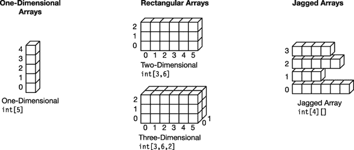

***图 12-2** 。一维、矩形和锯齿状数组*

### 一个数组作为一个对象

数组实例是一个类型从类`System.Array`派生的对象。因为数组是从这个 BCL 基类派生的，所以它们从这个基类继承了许多有用的成员，例如:

*   `Rank`:返回数组维数的属性
*   `Length`:返回数组长度(元素总数)的属性

数组是引用类型，和所有引用类型一样，它们既有对数据的引用，也有对数据对象本身的引用。引用要么在栈上，要么在堆中，而数据对象本身总是在堆中。图 12-3 显示了一个数组的内存配置和组件。

***图 12-3** 。数组的结构*

尽管数组总是引用类型，但数组的元素可以是值类型，也可以是引用类型。

*   如果存储的元素是值类型，则数组称为*值类型数组*。
*   如果存储在数组中的元素是引用类型对象的引用，则该数组称为*引用类型数组*。

图 12-4 显示了一个值类型数组和一个引用类型数组。

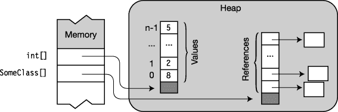

***图 12-4** 。元素可以是值或引用。*

### 一维矩形数组

从语法上来说，一维数组和矩形数组非常相似，所以我将它们放在一起处理。然后，我将分别处理交错数组。

#### 声明一维或矩形数组

若要声明一维或矩形数组，请在类型和变量名之间使用一组方括号。

*等级说明符*是括号之间的逗号。它们指定数组将具有的维数。排名是逗号的数量加一。例如，没有逗号表示一维数组，一个逗号表示二维数组，依此类推。

基本类型和等级说明符是数组的*类型*。例如，下面一行代码声明了一个一维数组`long` s。数组的类型是`long[]`，读作“一个长整型数组”。

`      Rank specifiers = 1
               ↓
  <ins>long[ ]</ins> secondArray;
          ↑
Array type`

下面的代码显示了矩形数组声明的示例。请注意以下事项:

*   您可以根据需要拥有任意多个等级说明符。
*   不能在数组类型部分中放置数组维数长度。秩是数组类型的一部分，但是维度的长度是类型的一部分。
*   当声明一个数组时，维数的*数*是固定的。然而，维度的*长度*直到数组被实例化才被确定。

`      Rank specifiers
              <ins>↓</ins>
   int[,,]   firstArray;                     // Array type: 3D array of int
   int[,]    arr1;                           // Array type: 2D array of int
   long[,,]  arr3;                           // Array type: 3D array of long
            ↑
      Array type

   long[3,2,6] SecondArray;                  // Wrong!  Compile error
                ↑ ↑ ↑
   Dimension lengths not allowed!`

 **注意**与 C/C++不同，在 C# 中，括号跟在基类型后面，而不是变量名后面。

### 实例化一维或矩形数组

要实例化一个数组，可以使用一个*数组创建表达式*。数组创建表达式由`new`操作符、基本类型和一对方括号组成。每个维度的长度放在括号之间的逗号分隔列表中。

以下是一维数组声明的示例。

*   数组`arr2`是由四个`int`组成的一维数组。
*   数组`mcArr`是四个`MyClass`引用的一维数组。

图 12-5 显示了它们在内存中的布局。

`                                                      Four elements
                                                               ↓
   int[]     arr2  = new int[4];
   MyClass[] mcArr = <ins>new MyClass[4]</ins>;
                                                           ↑
                       Array-creation expression`

下面是一个矩形阵列的示例。

*   数组`arr3`是一个三维数组。
*   数组的长度是 3 * 6 * 2 = 36。

图 12-5 显示了它在内存中的布局。

`                                          Lengths of the dimensions
                                                        <ins>    ↓    </ins>
   int[,,] arr3 = new int[3,6,2] ;` 

***图 12-5** 。声明和实例化数组*

 **注意**与对象创建表达式不同，数组创建表达式不包含括号——即使对于引用类型的数组也是如此。

### 访问数组元素

使用整数值作为数组的索引来访问数组元素。

*   每个维度都使用从 0 开始的索引。
*   索引放在数组名称后面的方括号中。

下面的代码显示了声明、写入和读取一维和二维数组的示例:

`   int[]  intArr1 = new int[15];        // Declare 1D array of 15 elements.
   intArr1[2]     = 10;                 // Write to element 2 of the array.
   int var1       = intArr1[2];         // Read from element 2 of the array.

   int[,] intArr2 = new int[5,10];      // Declare 2D array.
   intArr2[2,3]   = 7;                  // Write to the array.
   int var2       = intArr2[2,3];       // Read from the array.`

下面的代码显示了创建和访问一维数组的完整过程:

`   int[] myIntArray;                            // Declare the array.

   myIntArray = new int[4];                     // Instantiate the array.

   for( int i=0; i<4; i++ )                     // Set the values.
      myIntArray[i] = i*10;

   // Read and display the values of each element.
   for( int i=0; i<4; i++ )  
      Console.WriteLine("Value of element {0} = {1}", i, myIntArray[i]);`

该代码产生以下输出:

* * *

`Value of element 0 is 0
Value of element 1 is 10
Value of element 2 is 20
Value of element 3 is 30`

* * *

### 初始化一个数组

每当创建数组时，每个元素都会自动初始化为该类型的默认值。预定义类型的默认值为:整数类型为`0`，浮点类型为`0.0`，布尔类型为`false`，引用类型为`null`。

例如，下面的代码创建一个数组，并将其四个元素初始化为值`0`。图 12-6 说明了内存中的布局。

`   int[] intArr = new int[4];` 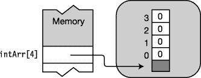

***图 12-6** 。一维数组的自动初始化*

#### 一维数组的显式初始化

对于一维数组，您可以通过在数组实例化的数组创建表达式后立即包含一个*初始化列表*来设置显式初始值。

*   初始化值必须用逗号分隔，并用一组花括号括起来。
*   维度长度是可选的，因为编译器可以根据初始化值的数量来推断长度。
*   请注意，数组创建表达式和初始化列表之间没有任何分隔。也就是说，没有等号或其他连接运算符。

例如，下面的代码创建一个数组，并将其四个元素初始化为花括号之间的值。图 12-7 显示了内存中的布局。

`                                                                  Initialization list
                                                              <ins>              ↓              </ins>
   int[] intArr = new int[] { 10, 20, 30, 40 };
                                                           ↑
                         No connecting operator` 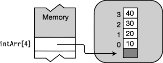

***图 12-7** 。一维数组的显式初始化*

#### 矩形数组的显式初始化

要显式初始化矩形数组，需要遵循以下规则:

*   初始值的每个*向量必须用花括号括起来。*
*   每个*维度*也必须嵌套在花括号中。
*   除了初始值，每个维度的初始化列表和组件也必须用逗号分隔。

例如，下面的代码显示了带有初始化列表的二维数组的声明。图 12-8 显示了内存中的布局。

`                                                                          Initialization lists separated by commas
                                                                                          ↓                ↓
   int[,] intArray2 = new int[,] { {10, 1}, {2, 10}, {11, 9} } ;` 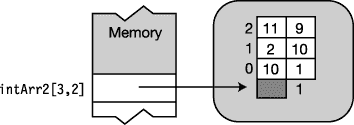

***图 12-8。**初始化矩形阵列*

#### 初始化矩形数组的语法点

矩形数组是用嵌套的逗号分隔的初始化列表初始化的。初始化列表嵌套在花括号中。这有时会令人困惑，因此要正确使用嵌套、分组和逗号，请考虑以下提示:

*   逗号被用作所有*元素*和*组*之间的*分隔符*。
*   逗号*从不*放在左花括号之间。
*   逗号*从不*放在右花括号之前。
*   如果可能的话，使用缩进和回车来排列这些组，这样它们在视觉上是不同的。
*   从左到右阅读等级规范，将最后一个数字指定为“元素”，将所有其他数字指定为“组”

例如，将下面的声明读作“`intArray`有四组三组两个元素。”

`                                                                               Initialization lists, nested and separated by commas
   int[,,] intArray = new int[4,3,2] {                   ↓                  ↓                    ↓
                                       { {8, 6},  {5,  2}, {12, 9} },
                                       { {6, 4},  {13, 9}, {18, 4} },
                                       { {7, 2},  {1, 13}, {9,  3} },
                                       { {4, 6},  {3,  2}, {23, 8} }
                                     };`

#### 快捷语法

当在单个语句中组合声明、数组创建和初始化时，可以完全省略语法中的数组创建表达式部分，只提供初始化部分。图 12-9 显示了这种快捷语法。

***图 12-9** 。数组声明、创建和初始化的快捷方式*

#### 隐式类型化数组

到目前为止，我们已经在所有数组声明的开头明确指定了数组类型。但是，像其他局部变量一样，局部数组也可以是隐式类型的。这意味着:

*   初始化数组时，可以让编译器从初始化器的类型中推断出数组的类型。只要所有的初始值设定项都可以隐式转换为单一类型，这是允许的。
*   就像隐式类型的局部变量一样，使用关键字`var`代替数组类型。

下面的代码显示了三个数组声明的显式和隐式版本。第一组是一维数组`int` s .第二组是二维数组`int` s .第三组是字符串数组。注意，在隐式类型`intArr4`的声明中，您仍然需要在初始化中包含秩说明符。

`           Explicit                           Explicit
      <ins>     ↓    </ins>                                    ↓
   int [] intArr1 = new int[] { 10, 20, 30, 40 };
   var    intArr2 = new    [] { 10, 20, 30, 40 };
        ↑                                           ↑
    Keyword                                 Inferred
   int[,] intArr3 = new int[,] { { 10, 1 }, { 2, 10 }, { 11, 9 } };
   var    intArr4 = new    [,] { { 10, 1 }, { 2, 10 }, { 11, 9 } };
                                                             ↑
                                                   Rank specifier
   string[] sArr1 = new string[] { "life", "liberty", "pursuit of happiness" };
   var      sArr2 = new       [] { "life", "liberty", "pursuit of happiness" };`

#### 把所有的东西放在一起

下面的代码把我们到目前为止看到的所有部分放在了一起。它创建、初始化并使用一个矩形数组。

`   // Declare, create, and initialize an implicitly typed array.
   var arr = new int[,] {{0, 1, 2}, {10, 11, 12}};

   // Print the values.
   for( int i=0; i<2; i++ )
      for( int j=0; j<3; j++ )
         Console.WriteLine("Element [{0},{1}] is {2}", i, j, arr[i,j]);`

该代码产生以下输出:

* * *

`Element [0,0] is 0
Element [0,1] is 1
Element [0,2] is 2
Element [1,0] is 10
Element [1,1] is 11
Element [1,2] is 12`

* * *

### 参差阵列

交错数组是数组的数组。与矩形阵列不同，交错阵列的子阵列可以有不同数量的元素。

例如，下面的代码声明了一个二维交错数组。图 12-10 显示了内存中数组的布局。

*   第一维的长度是 3。
*   声明可以读作“`jagArr`是一个由三个`int`组成的数组。”
*   注意，图中显示了四个数组对象——一个用于顶层数组，三个用于子数组。

`int[][] jagArr = new int[3][];   // Declare and create top-level array.
            ...                  // Declare and create subarrays.` 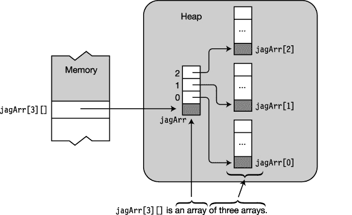

***图 12-10。**参差阵列是阵列中的阵列。*

#### 声明一个交错的数组

交错数组的声明语法要求每个维度都有一组单独的方括号。数组变量声明中的方括号组数决定了数组的秩。

*   交错数组可以是大于 1 的任意维数。
*   与矩形数组一样，维数长度不能包含在声明的数组类型部分中。

`   Rank specifiers
       <ins>      ↓</ins>
   int[][]   SomeArr;             // Rank = 2
   <ins>int[][][]</ins> OtherArr;            // Rank = 3
               ↑               ↑
     Array type        Array name`

#### 快捷方式实例化

您可以使用数组创建表达式将交错数组声明与第一级数组的创建结合起来，如下面的声明所示。图 12-11 显示了结果。

`                                                Three subarrays
                                                             ↓
   int[][] jagArr = new int[3][];` 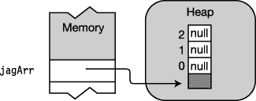

***图 12-11。**快捷方式一级实例化*

在声明语句中，不能实例化超过一级的数组。

`                                                      Allowed
                                                            ↓
   int[][] jagArr = new int[3][4];              // Wrong! Compile error
                                                                    ↑
                                                            Not allowed`

#### 实例化一个交错的数组

与其他类型的数组不同，您无法在一个步骤中完全实例化交错数组。因为交错数组是由独立数组组成的数组，所以每个数组都必须单独创建。实例化完整的交错数组需要以下步骤:

1.  实例化顶级数组。
2.  分别实例化每个子数组，将新创建的数组的引用分配给其包含数组的适当元素。

例如，以下代码显示了二维交错数组的声明、实例化和初始化。请注意，在代码中，对每个子数组的引用都被赋给了顶级数组中的一个元素。代码中的步骤 1 至 4 对应于图 12-12 中的编号表示。

`   int[][] Arr = new int[3][];                  // 1\. Instantiate top level.

   Arr[0] = new int[] {10, 20, 30};             // 2\. Instantiate subarray.
   Arr[1] = new int[] {40, 50, 60, 70};         // 3\. Instantiate subarray.
   Arr[2] = new int[] {80, 90, 100, 110, 120};  // 4\. Instantiate subarray.` 

***图 12-12。**创建二维交错数组*

#### 交错排列的子阵列

因为交错数组中的子数组本身就是数组，所以交错数组中可能有矩形数组。例如，下面的代码创建一个由三个二维矩形数组组成的交错数组，并用值初始化它们。然后显示这些值。图 12-13 说明了该结构。

该代码使用从`System.Array`继承的数组的`GetLength(int n)`方法来获取数组的指定维度的长度。

`   int[][,] Arr;         // An array of 2D arrays
   Arr = new int[3][,];  // Instantiate an array of three 2D arrays.

   Arr[0] = new int[,] { { 10,  20  },
                         { 100, 200 } };

   Arr[1] = new int[,] { { 30,  40,  50  },
                         { 300, 400, 500 }  };

   Arr[2] = new int[,] { { 60,  70,  80,  90  },
                         { 600, 700, 800, 900 } };

                                                                                 ↓ Get length of dimension 0 of Arr.
   for (int i = 0; i < Arr.GetLength(0); i++)
   {
                                                                                              ↓ Get length of dimension 0 of Arr[ i ].
      for (int j = 0; j < Arr[i].GetLength(0); j++)
      {
                                                                                                           ↓ Get length of dimension 1 of Arr[ i ].
         for (int k = 0; k < Arr[i].GetLength(1); k++)
         {
             Console.WriteLine
                     ("[{0}][{1},{2}] = {3}", i, j, k, Arr[i][j, k]);
         }
         Console.WriteLine("");
      }
      Console.WriteLine("");
   }`

这段代码产生以下输出:

* * *

`[0][1,0] = 100
[0][1,1] = 200

[1][0,0] = 30
[1][0,1] = 40
[1][0,2] = 50

[1][1,0] = 300
[1][1,1] = 400
[1][1,2] = 500

[2][0,0] = 60
[2][0,1] = 70
[2][0,2] = 80
[2][0,3] = 90

[2][1,0] = 600
[2][1,1] = 700
[2][1,2] = 800
[2][1,3] = 900`

* * *

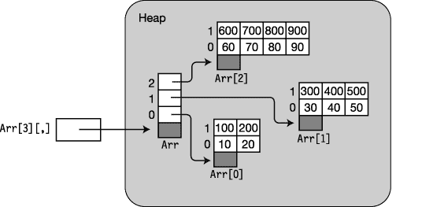

***图 12-13。**交错排列的三个二维数组*

### 比较矩形和锯齿状数组

矩形和锯齿状数组的结构有很大的不同。例如，图 12-14 显示了一个 3 乘 3 的矩形数组的结构，以及一个由三个长度为 3 的一维数组组成的锯齿状数组。

*   两个数组都包含九个整数，但是正如你所看到的，它们的结构是完全不同的。
*   矩形数组只有一个数组对象，而交错数组有四个数组对象。

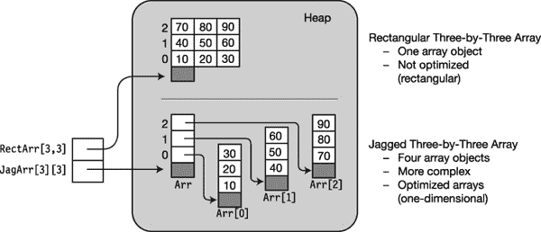

***图 12-14。**比较矩形和锯齿状阵列的结构*

一维数组在 CIL 中有特定的指令，允许它们针对性能进行优化。矩形阵列没有这些指令，也没有优化到相同的水平。因此，有时使用一维数组的交错数组(可以优化)比使用矩形数组(不能优化)更有效。

另一方面，对于矩形阵列来说，编程复杂度可以显著降低，因为它可以被视为单个单元，而不是阵列的阵列。

### foreach 语句

`foreach`语句允许你顺序访问数组中的每个元素。它实际上是一个更通用的构造，因为它也适用于其他集合类型——但是在这一节中，我将只讨论它在数组中的使用。第十八章讲述了它与其他收藏类型的使用。

`foreach`声明的要点如下:

*   *迭代变量*是与数组元素类型相同的临时变量。`foreach`语句使用迭代变量顺序表示数组中的每个元素。
*   `foreach`语句的语法如下所示，其中
    *   `Type`是数组元素的类型。您可以显式地提供它的类型，或者您可以使用`var`并让它被编译器隐式地类型化和推断，因为编译器知道数组的类型。
    *   `Identifier`是迭代变量的名称。
    *   `ArrayName`是要迭代的数组的名称。
    *   `Statement`是对数组中的每个元素执行一次的简单语句或块。

`       Explicitly typed iteration variable declaration
                         <ins>              ↓               </ins>
   foreach( *Type Identifier* in *ArrayName* )
      *Statement*

                    Implicitly typed iteration variable declaration
                         <ins>             ↓              </ins>
   foreach( var *Identifier* in *ArrayName* )
      Statement`

在下面的文本中，我有时会使用隐式类型，有时会使用显式类型，这样您就可以看到所使用的确切类型。但是形式在语义上是等价的。

`foreach`语句的工作方式如下:

*   它从数组的第一个元素开始，并将该值赋给*迭代变量*。
*   然后，它执行语句体。在主体内部，可以使用迭代变量作为数组元素的只读别名。
*   执行完主体后，`foreach`语句选择数组中的下一个元素，并重复这个过程。

这样，它在数组中循环，允许您逐个访问每个元素。例如，以下代码显示了一个包含四个整数的一维数组的`foreach`语句的用法:

*   `WriteLine`语句是`foreach`语句的主体，对数组的每个元素执行一次。
*   第一次循环时，迭代变量`item`具有数组第一个元素的值。每一次，它都有数组中下一个元素的值。

`   int[] arr1 = {10, 11, 12, 13};
      Iteration variable declaration
                         <ins>       ↓        </ins>                                  Iteration variable use
   foreach( int item in arr1 )                          ↓
      Console.WriteLine("Item Value: {0}", item);`

该代码产生以下输出:

* * *

`Item Value: 10
Item Value: 11
Item Value: 12
Item Value: 13`

* * *

#### 迭代变量为只读

因为迭代变量的值是只读的，很明显它不能被改变。但是这对值类型数组和引用类型数组有不同的影响。

对于值类型数组，这意味着当数组的元素由迭代变量表示时，不能改变它。例如，在下面的代码中，试图更改迭代变量中的数据会产生一条编译时错误信息:

`   int[] arr1 = {10, 11, 12, 13};

   foreach( int item in arr1 )
      item++;     // Compilation error. Changing variable value is not allowed.`

对于引用类型数组，您仍然不能更改迭代变量，但是迭代变量只保存对数据的引用，而不是数据本身。因此，尽管您不能更改引用，但是您可以通过迭代变量更改*数据*。

下面的代码创建一个由四个`MyClass`对象组成的数组，并初始化它们。在第一个`foreach`语句中，每个对象中的数据都发生了变化。在第二个`foreach`语句中，从对象中读取更改的数据。

`   class MyClass
   {
      public int MyField = 0;
   }

   class Program
   {
      static void Main()
      {
         MyClass[] mcArray = new MyClass[4];            // Create array.
         for (int i = 0; i < 4; i++)
         {
            mcArray[i] = new MyClass();                 // Create class objects.
            mcArray[i].MyField = i;                     // Set field.
         }
         foreach (MyClass item in mcArray)
            item.MyField += 10;                         // Change the data.

         foreach (MyClass item in mcArray)
            Console.WriteLine("{0}", item.MyField);     // Read the changed data.
      }
   }`

该代码产生以下输出:

* * *

`10
11
12
13`

* * *

#### 带有多维数组的 foreach 语句

在多维数组中，按照最右边的索引增加最快的顺序处理元素。当索引从 0 到*长度*–1 时，左边的下一个索引递增，右边的索引重置为 0。

##### 矩形阵列示例

以下示例显示了用于矩形数组的`foreach`语句:

`   class Program
   {
      static void Main()
      {
         int total = 0;
         int[,] arr1 = { {10, 11}, {12, 13} };

         foreach( var element in arr1 )
         {
            total += element;
            Console.WriteLine
                      ("Element: {0}, Current Total: {1}", element, total);
         }
      }
   }`

该代码产生以下输出:

* * *

`Element: 10, Current Total: 10
Element: 11, Current Total: 21
Element: 12, Current Total: 33
Element: 13, Current Total: 46`

* * *

##### 交错排列的例子

因为交错数组是数组的数组，所以必须为交错数组中的每个维度使用单独的`foreach`语句。`foreach`语句必须正确嵌套，以确保每个嵌套数组都得到正确处理。

例如，在下面的代码中，第一个`foreach`语句循环遍历顶级数组`arr1`，选择下一个要处理的子数组。内部的`foreach`语句处理该子数组的元素。

`   class Program
   {
      static void Main( )
      {
         int total    = 0;
         int[][] arr1 = new int[2][];
         arr1[0]      = new int[] { 10, 11 };
         arr1[1]      = new int[] { 12, 13, 14 };

         foreach (int[] array in arr1)       // Process the top level.
         {
            Console.WriteLine("Starting new array");
            foreach (int item in array)      // Process the second level.
            {
               total += item;
               Console.WriteLine("  Item: {0}, Current Total: {1}", item, total);
            }
         }
      }
   }`

该代码产生以下输出:

* * *

`Starting new array
  Item: 10, Current Total: 10
  Item: 11, Current Total: 21
Starting new array
  Item: 12, Current Total: 33
  Item: 13, Current Total: 46
  Item: 14, Current Total: 60`

* * *

### 阵列协方差

在某些情况下，即使对象不是数组的基类型，也可以将对象分配给数组元素。数组的这个属性叫做*数组协方差*。如果满足以下条件，则可以使用数组协方差:

*   该数组是引用类型数组。
*   您正在分配的对象的类型和数组的基类型之间存在隐式或显式转换。

因为在派生类和它的基类之间总是有一个隐式转换，所以你总是可以把一个派生类的对象赋给一个为基类声明的数组。

例如，下面的代码声明了两个类，`A`和`B`，其中类`B`派生自类`A`。最后一行通过将类型为`B`的对象分配给类型为`A`的数组元素来显示协方差。图 12-15 显示了代码的内存布局。

`   class A { ... }                                        // Base class
   class B : A { ... }                                    // Derived class

   class Program {
      static void Main() {
         // Two arrays of type A[]
         A[] AArray1 = new A[3];
         A[] AArray2 = new A[3];

         // Normal--assigning objects of type A to an array of type A
         AArray1[0] = new A(); AArray1[1] = new A(); AArray1[2] = new A();

         // Covariant--assigning objects of type B to an array of type A
         AArray2[0] = new B(); AArray2[1] = new B(); AArray2[2] = new B();
      }
   }` 

***图 12-15。**显示协方差的数组*

 **注意**值类型数组没有协方差。

### 有用继承的数组成员

我之前提到过 C# 数组是从类`System.Array`派生的。它们从基类继承了许多有用的属性和方法。表 12-1 列出了一些最有用的方法。

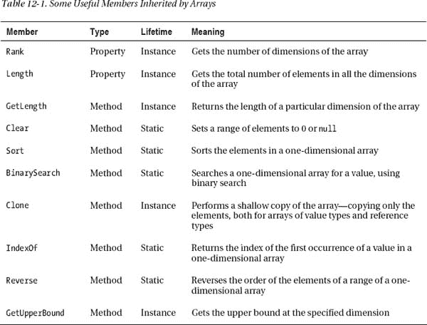

例如，下面的代码使用了其中的一些属性和方法:

`   public static void PrintArray(int[] a)
   {
      foreach (var x in a)
         Console.Write("{0}  ", x);

      Console.WriteLine("");
   }

   static void Main()
   {
      int[] arr = new int[] { 15, 20, 5, 25, 10 };
      PrintArray(arr);

      Array.Sort(arr);
      PrintArray(arr);

      Array.Reverse(arr);
      PrintArray(arr);

      Console.WriteLine();
      Console.WriteLine("Rank = {0}, Length = {1}",arr.Rank, arr.Length);
      Console.WriteLine("GetLength(0)     = {0}",arr.GetLength(0));
      Console.WriteLine("GetType()        = {0}",arr.GetType());
   }`

该代码产生以下输出:

* * *

`15  20  5  25  10
5  10  15  20  25
25  20  15  10  5

Rank = 1, Length = 5
GetLength(0)     = 5
GetType()        = System.Int32[]`

* * *

#### 克隆方法

方法执行数组的浅层复制。这意味着它只创建阵列本身的克隆。如果它是一个引用类型数组，它不会*而不是*复制元素引用的对象。这对于值类型数组和引用类型数组有不同的结果。

*   克隆值类型数组会产生两个独立的数组。
*   克隆引用类型数组会导致两个数组指向相同的对象。

`Clone`方法返回一个类型为`object`的引用，该引用必须转换为数组类型。

`   int[] intArr1 = { 1, 2, 3 };
                                        Array type                 Returns an object
                                        <ins>    ↓   </ins>                        <ins>     ↓    </ins>
   int[] intArr2 = ( int[] ) intArr1.Clone();`

例如，下面的代码显示了一个克隆值类型数组的示例，生成两个独立的数组。图 12-16 说明了代码中显示的步骤。

`   static void Main()
   {
      int[] intArr1 = { 1, 2, 3 };                             // Step 1
      int[] intArr2 = (int[]) intArr1.Clone();                 // Step 2

      intArr2[0] = 100; intArr2[1] = 200; intArr2[2] = 300;    // Step 3
   }` 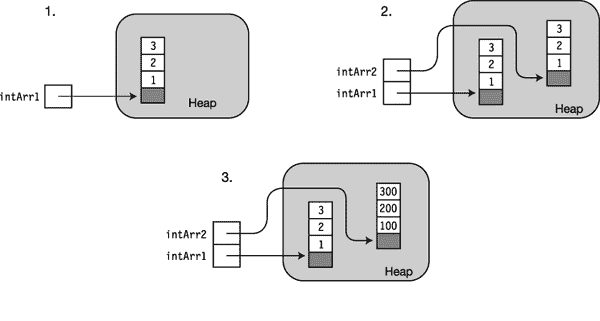

***图 12-16。**克隆一个值类型数组产生两个独立的数组。*

克隆一个引用类型数组导致两个数组*指向相同的对象*。下面的代码显示了一个示例。图 12-17 说明了代码中显示的步骤。

`   class A
   {
      public int Value = 5;
   }

   class Program
   {
      static void Main()
      {
         A[] AArray1 = new A[3] { new A(), new A(), new A() };     // Step 1
         A[] AArray2 = (A[]) AArray1.Clone();                      // Step 2

         AArray2[0].Value = 100;
         AArray2[1].Value = 200;
         AArray2[2].Value = 300;                                   // Step 3
      }
   }` 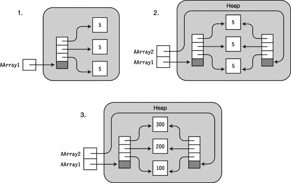

***图 12-17。**克隆一个引用类型数组会产生两个引用相同对象的数组。*

### 比较数组类型

表 12-2 总结了三种类型数组之间的一些重要的相似和不同之处。

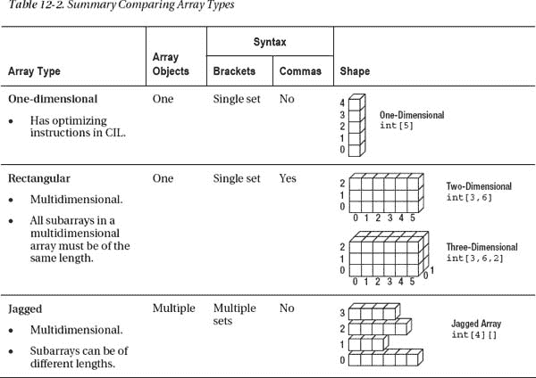