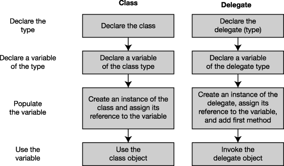
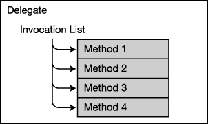
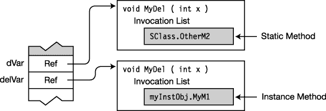
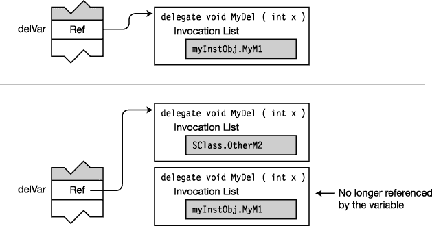
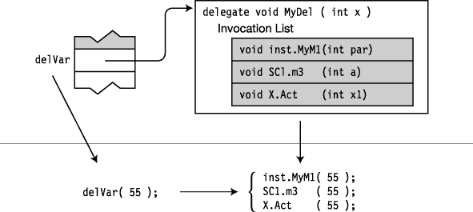
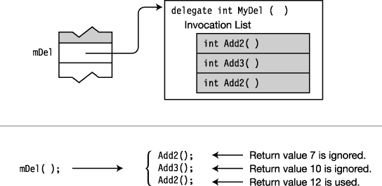
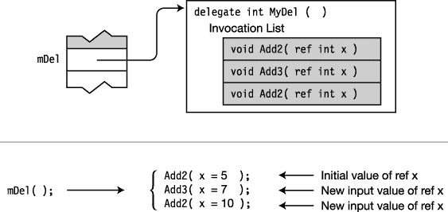
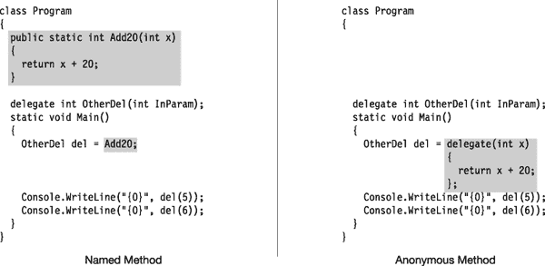
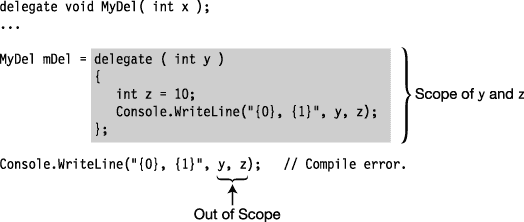
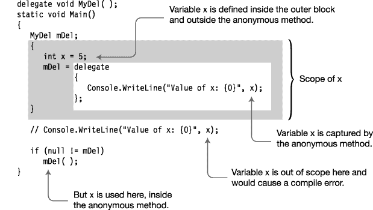

# 十三、委托

### 什么是委托？

您可以将委托想象成一个包含一个或多个方法的对象。当然，通常你不会想到“执行”一个*对象*，但是委托不同于一个典型的对象。您可以执行委托，当您这样做时，它会执行它“持有”的一个或多个方法

在这一章中，我将解释创建和使用委托的语法和语义。在后面的章节中，你将看到如何使用委托将可执行代码从一个方法传递到另一个方法——以及为什么这是一件有用的事情。

我们将从下一页的示例代码开始。如果在这一点上一切都不完全清楚，不要担心，因为我将在本章的其余部分解释委托的细节。

*   代码从名为`MyDel`的委托类型的声明开始。(是的，一个委托*型*——*不是*一个委托*型对象*。我们很快就会谈到这一点。)
*   类`Program`声明了三个方法:`PrintLow`、`PrintHigh`和`Main`。我们很快将创建的委托对象将持有`PrintLow`或`PrintHigh`方法——但是使用哪一个要到运行时才能确定。
*   `Main`声明了一个名为`del`的局部变量，它将保存一个对`MyDel`类型的委托对象的引用。这并没有创建对象——它只是创建了一个变量，该变量将保存对 delegate 对象的引用，该对象将在下面几行创建并赋给它。
*   创建一个 .NET 类`Random`，这是一个随机数生成器类。然后程序调用对象的`Next`方法，用`99`作为它的输入参数。这将返回一个 0 到 99 之间的随机整数，并将该值存储在本地变量`randomValue`中；。
*   下一行检查返回和存储的随机值是否小于 50。(注意，我们在这里使用三元条件操作符来返回一个或另一个委托对象。)
    *   如果值小于 50，它创建一个`MyDel`委托对象并初始化它以保存对`PrintLow`方法的引用。
    *   否则，它会创建一个包含对`PrintHigh`方法的引用的`MyDel`委托对象。
*   最后，`Main` *执行`del`委托对象*，委托对象执行它持有的方法(`PrintLow`或`PrintHigh`)。

 **注意**如果你来自 C++背景，理解委托的最快方法就是把它们想象成类型安全的、面向对象的 C++函数指针。

`   delegate void MyDel(int value);   // Declare delegate TYPE.

   class Program
   {
      void PrintLow( int value )
      {
         Console.WriteLine( "{0} - Low Value", value );
      }

      void PrintHigh( int value )
      {
         Console.WriteLine( "{0} - High Value", value );
      }

      static void Main( )
      {
         Program program = new Program();

         MyDel   del;            // Declare delegate variable.

         // Create random-integer-generator object and get a random
         // number between 0 and 99.
         Random  rand    = new Random();
         int randomValue = rand.Next( 99 );

         // Create a delegate object that contains either PrintLow or
         // PrintHigh, and assign the object to the del variable.
         del = randomValue < 50
                  ? new MyDel( program.PrintLow  )
                  : new MyDel( program.PrintHigh );

         del( randomValue );    // Execute the delegate.
      }
   }`

因为我们使用的是随机数生成器，所以程序在不同的运行中会产生不同的值。该程序的一次运行产生了以下输出:

* * *

`28 - Low Value`

* * *

### 委托概述

现在让我们进入细节。委托是用户定义的类型，就像类是用户定义的类型一样。但是，类表示数据和方法的集合，而委托则包含一个或多个方法以及一组预定义的操作。

您可以通过执行以下步骤来使用委托。我将在下面的小节中详细介绍这些步骤。

1.  声明一个委托类型。委托声明看起来像方法声明，只是它没有实现块。
2.  声明委托类型的委托变量。
3.  创建一个委托类型的对象，并将其赋给委托变量。新的委托对象包含对一个方法的引用，该方法必须具有与第一步中定义的委托类型相同的签名和返回类型。
4.  您可以选择将其他方法添加到委托对象中。这些方法必须具有与第一步中定义的委托类型相同的签名和返回类型。
5.  在整个代码中，您可以调用该委托，就像它是一个方法一样。当您调用委托时，它包含的每个方法都会被执行。

在查看前面的步骤时，您可能已经注意到它们类似于创建和使用类的步骤。图 13-1 比较了创建和使用类和委托的过程。

***图 13-1。**委托是用户定义的引用类型，就像类一样。*

你可以把委托想象成一个对象，它包含一个有序的方法列表，这些方法具有相同的签名和返回类型，如图 13-2 所示。

*   方法列表被称为*调用列表*。
*   委托*持有的方法可以来自任何类或结构*，只要它们符合以下两个中的*:*
    *   委托的返回类型
    *   委托签名(包括`ref`和`out`修饰符)
*   调用列表中的方法可以是实例方法，也可以是静态方法。
*   当委托被调用时，它的调用列表中的每个方法都被执行。

***图 13-2** 。作为方法列表的委托*

### 声明委托类型

正如我在上一节中所说的，委托是类型，就像类是类型一样。与类一样，在使用委托类型创建变量和该类型的对象之前，必须声明委托类型。下面的代码示例声明了一个委托类型:

`        Keyword      Delegate type name
             ↓                      ↓
   delegate void <ins>MyDel( int x )</ins>;
             ↑        ↑
                     Return type     Signature`

委托类型的声明看起来很像方法的声明，因为它既有一个*返回类型*又有一个*签名*。返回类型和签名指定委托将接受的方法的形式。

前面的声明指定了类型为`MyDel`的委托对象将只接受具有单个`int`参数并且没有返回值的方法。图 13-3 显示了左边的委托类型和右边的委托对象。

***图 13-3** 。委托类型和对象*

委托类型声明在两个方面不同于方法声明。委托类型声明

*   以关键字`delegate`开头
*   没有方法体

 **注意**即使委托类型声明看起来像方法声明，它也不需要在类内声明，因为它是类型声明。

### 创建代理对象

委托是一种引用类型，因此既有引用又有对象。声明委托类型后，可以声明变量并创建该类型的对象。下面的代码显示了委托类型变量的声明:

`   Delegate type     Variable
               ↓              ↓
      MyDel  delVar;`

有两种方法可以创建委托对象。第一种是使用带有`new`操作符的对象创建表达式，如下面的代码所示。`new`运算符的操作数由以下内容组成:

*   委托类型名称。
*   一组括号，包含用作调用列表中第一个成员的方法的名称。方法可以是实例方法，也可以是静态方法。

`                                            Instance method
                                          <ins>             ↓             </ins>
delVar = new MyDel( myInstObj.MyM1 );       // Create delegate and save ref.
dVar   = new MyDel( <ins>SClass.OtherM2</ins> );       // Create delegate and save ref.
                                                       ↑
                      Static method`

您也可以使用快捷语法，它只包含方法说明符，如下面的代码所示。这段代码和前面的代码在语义上是等价的。使用快捷语法是可行的，因为在方法名和兼容的委托类型之间存在隐式转换。

`   delVar = myInstObj.MyM1;          // Create delegate and save reference.
   dVar   = SClass.OtherM2;          // Create delegate and save reference.`

例如，下面的代码创建了两个委托对象:一个使用实例方法，另一个使用静态方法。图 13-4 显示了代理的实例。这段代码假设有一个名为`myInstObj`的对象，它是一个类的实例，该类定义了一个名为`MyM1`的方法，该方法不返回值，并以一个`int`作为参数。它还假设有一个名为`SClass`的类，该类有一个静态方法`OtherM2`，其返回类型和签名与委托`MyDel`的返回类型和签名相匹配。

`   delegate void MyDel(int x);               // Declare delegate type.
   MyDel delVar, dVar;                       // Create two delegate variables.
                                                   Instance method
                       <ins>     ↓     </ins>
   delVar = new MyDel( myInstObj.MyM1 );     // Create delegate and save ref.
   dVar   = new MyDel( <ins>SClass.OtherM2</ins> );     // Create delegate and save ref.
                                                              ↑
                                                      Static method` 

***图 13-4** 。实例化委托*

除了为委托分配内存之外，创建委托对象还会将第一个方法放在委托的调用列表中。

还可以使用初始化器语法，在同一语句中创建变量并实例化对象。例如，以下语句也会产生与图 13-4 中所示相同的配置:

`   MyDel delVar = new MyDel( myInstObj.MyM1 );
   MyDel dVar   = new MyDel( SClass.OtherM2 );`

以下语句使用快捷语法，但同样产生如图 13-4 所示的结果:

`   MyDel delVar = myInstObj.MyM1;
   MyDel dVar   = SClass.OtherM2;`

### 分配委托

因为委托是引用类型，所以可以通过给委托变量赋值来更改委托变量中包含的引用。旧的委托对象将被垃圾收集器(GC)处理掉。

例如，下面的代码设置然后改变`delVar`的值。图 13-5 说明了代码。

`   MyDel delVar;
   delVar = myInstObj.MyM1;   // Create and assign the delegate object.

      ...
   delVar = SClass.OtherM2;   // Create and assign the new delegate object.` 

***图 13-5** 。给委托变量赋值*

### 组合委托

到目前为止，您看到的所有委托在其调用列表中都只有一个方法。可以使用加法运算符“组合”委托。该操作的结果是创建一个新的委托，其调用列表是两个操作数委托的调用列表副本的串联。

例如，下面的代码创建三个委托。第三个委托是由前两个委托组合而成的。

`   MyDel delA = myInstObj.MyM1;
   MyDel delB = SClass.OtherM2;

   MyDel delC = delA + delB;                  // Has combined invocation list`

尽管术语*组合委托*可能给人一种操作数委托被修改的印象，但它们根本没有改变。事实上，*委托是不可改变的*。委托对象创建后，不能更改。

图 13-6 展示了前面代码的结果。注意，操作数委托保持不变。

***图 13-6** 。组合委托*

### 向代理添加方法

尽管您在上一节中看到了委托实际上是不可变的，但是 C# 提供了语法，使您看起来可以使用`+=`操作符向委托添加方法。

例如，下面的代码将两个方法“添加”到委托的调用列表中。这些方法被添加到调用列表的底部。图 13-7 显示了结果。

`   MyDel delVar  = inst.MyM1;     // Create and initialize.
   delVar       += SCl.m3;        // Add a method.
   delVar       += X.Act;         // Add a method.` 

***图 13-7** 。向委托“添加”方法的结果。实际上，因为委托是不可变的，所以调用列表中有三个方法的结果委托是一个由变量指向的全新委托。*

当然，实际发生的是，当使用`+=`操作符时，一个新的委托被创建，调用列表是左边的委托和右边列出的方法的组合。这个新的委托然后被分配给`delVar`变量。

可以多次向委托添加方法。每次添加它时，它都会在调用列表中创建一个新元素。

### 从委托中删除方法

您也可以使用`-=`操作符从委托中删除一个方法。下面一行代码显示了操作符的用法。图 13-8 显示了该代码应用于图 13-7 中所示委托时的结果。

`   delVar -= SCl.m3;             // Remove the method from the delegate.` 

***图 13-8** 。从委托中移除方法的结果*

与向委托添加方法一样，产生的委托实际上是一个新委托。新委托是旧委托的副本，但是它的调用列表不再包含对被移除的方法的引用。

以下是删除方法时要记住的一些事情:

*   如果一个方法在调用列表中有多个条目，那么`-=`操作符*将从列表*的底部开始搜索，并删除找到的第一个匹配方法的实例。
*   尝试删除不在调用列表中的方法没有任何效果。
*   试图调用空委托会引发异常。您可以通过将委托与`null`进行比较来检查委托的调用列表是否为空。如果调用列表为空，则委托为`null`。

### 调用委托

你通过调用委托来调用它，就好像它只是一个方法一样。用于调用委托的参数用于调用调用列表上的每个方法(除非其中一个参数是输出参数，我将很快介绍这一点)。

例如，如下面的代码所示，委托`delVar`接受一个整数输入值。用参数调用委托会导致它用相同的参数值(本例中为 55)调用其调用列表中的每个成员。图 13-9 说明了调用。

`   MyDel delVar  = inst.MyM1;
   delVar       += SCl.m3;
   delVar       += X.Act;
      ...
   delVar( 55 );                              // Invoke the delegate.
      ...` 

***图 13-9。**当委托被调用时，它执行它的调用列表中的每个方法，使用与调用它时相同的参数。*

如果一个方法不止一次出现在调用列表中，那么当委托被调用时，每次在列表中遇到该方法都会被调用。

### 委托示例

下面的代码定义并使用了一个没有参数和返回值的委托。请注意以下关于代码的内容:

*   类`Test`定义了两个打印功能。
*   方法`Main`创建委托的一个实例，然后再添加三个方法。
*   然后程序调用委托，委托调用它的方法。然而，在调用委托之前，它检查以确保它不是`null`。

`   // Define a delegate type with no return value and no parameters.
   delegate void PrintFunction();

   class Test
   {
       public void Print1()
       { Console.WriteLine("Print1 -- instance"); }

       public static void Print2()
       { Console.WriteLine("Print2 -- static"); }
   }

   class Program
   {
       static void Main()
       {
           Test t = new Test();    // Create a test class instance.
           PrintFunction pf;       // Create a null delegate.

           pf = t.Print1;          // Instantiate and initialize the delegate.

           // Add three more methods to the delegate.
           pf += Test.Print2;
           pf += t.Print1;
           pf += Test.Print2;
           // The delegate now contains four methods.

           if( null != pf )           // Make sure the delegate isn't null.
              pf();                   // Invoke the delegate.
           else
              Console.WriteLine("Delegate is empty");
       }
   }`

该代码产生以下输出:

* * *

`Print1 -- instance
Print2 -- static
Print1 -- instance
Print2 -- static`

* * *

### 调用带有返回值的委托

如果委托在其调用列表中有一个返回值和多个方法，则会发生以下情况:

*   调用列表中最后一个方法返回的值是委托调用返回的值。
*   调用列表中所有其他方法的返回值都被忽略。

例如，下面的代码声明了一个返回`int`值的委托。创建委托的一个对象并添加两个额外的方法。然后，它调用`WriteLine`语句中的委托，并打印其返回值。图 13-10 显示了代码的图形表示。

`delegate int MyDel( );                 // Declare delegate with return value.
   class MyClass {
      int IntValue = 5;
      public int Add2() { IntValue += 2; return IntValue;}
      public int Add3() { IntValue += 3; return IntValue;}
   }

   class Program {
      static void Main( ) {
         MyClass mc = new MyClass();
         MyDel mDel = mc.Add2;          // Create and initialize the delegate.
         mDel += mc.Add3;               // Add a method.
         mDel += mc.Add2;               // Add a method.
         Console.WriteLine("Value: {0}", mDel() );
      }
                                                                            ↑
   }                       Invoke the delegate and use the return value.` 

该代码产生以下输出:

* * *

`Value: 12`

* * *

***图 13-10** 。最后执行的方法的返回值是委托返回的值。*

### 用引用参数调用委托

如果委托有一个引用参数，该参数的值可以在从调用列表中的一个或多个方法返回时更改。

*   当调用调用列表中的下一个方法时，参数的*新值——而不是初始值*—是传递给下一个方法的值。

例如，下面的代码调用带有引用参数的委托。图 13-11 说明了代码。

`   delegate void MyDel( ref int X );

   class MyClass
   {
      public void Add2(ref int x) { x += 2; }
      public void Add3(ref int x) { x += 3; }
      static void Main()
      {
         MyClass mc = new MyClass();

         MyDel mDel = mc.Add2;
         mDel += mc.Add3;
         mDel += mc.Add2;

         int x = 5;
         mDel(ref x);

         Console.WriteLine("Value: {0}", x);
      }
   }`

该代码产生以下输出:

* * *

`Value: 12`

* * *

***图 13-11** 。引用参数的值可以在调用之间改变。*

### 匿名方法

到目前为止，您已经看到可以使用静态方法或实例方法来实例化委托。无论哪种情况，方法本身都可以从代码的其他部分显式调用，当然，必须是某个类或结构的成员。

但是，如果该方法只使用一次——来实例化委托，那该怎么办呢？在这种情况下，除了创建委托的语法要求之外，并不真正需要单独的命名方法。匿名方法允许您省去单独的命名方法。

*   匿名方法是在实例化委托时内联声明的方法。

例如，图 13-12 显示了同一个类的两个版本。左边的版本声明并使用了一个名为`Add20`的方法。右边的版本使用匿名方法。两个版本的无阴影代码是相同的。

***图 13-12** 。比较命名方法和匿名方法*

图 13-12 中的两组代码产生以下输出:

* * *

`25
26`

* * *

#### 使用匿名方法

您可以在以下位置使用匿名方法:

*   声明委托变量时作为初始值设定项表达式。
*   组合委托时位于赋值语句的右侧。
*   在赋值语句的右侧，向事件添加委托。第十四章报道事件。

#### 匿名方法的语法

匿名方法表达式的语法包括以下组件:

*   键入关键字`delegate`
*   *参数列表*，如果语句块不使用任何参数，可以省略
*   *语句块*，它包含匿名方法的代码

`                                Parameter
        Keyword               list                         Statement block
             ↓                     ↓                     <ins>                     ↓                     </ins>
   delegate ( Parameters )  { ImplementationCode }`

##### 返回类型

匿名方法不显式声明返回类型。但是，实现代码本身的行为必须通过返回该类型的值来匹配委托的返回类型。如果委托的返回类型为`void`，那么匿名方法代码不能返回值。

例如，在下面的代码中，委托的返回类型是`int`。因此，匿名方法的实现代码必须在通过代码的所有路径上返回一个`int`。

`              Return type of delegate type
                           ↓
   delegate int OtherDel(int InParam);

   static void Main()
   {
       OtherDel del = delegate(int x)
                   {
                       return x + 20 ;                   // Returns an int
                   };
          ...
   }`

##### 参数

除了数组参数之外，匿名方法的参数列表必须与委托的参数列表在以下三个方面相匹配:

*   参数数量
*   参数的类型和位置
*   修饰语

您可以通过将括号留空或完全省略来简化匿名方法的参数列表，但前提是以下两个都为真:

*   委托的参数列表不包含任何`out`参数。
*   匿名方法不使用*任何*参数。

例如，下面的代码声明了一个没有任何`out`参数的委托和一个不使用任何参数的匿名方法。因为这两个条件都满足，所以可以从匿名方法中省略参数列表。

`   delegate void SomeDel ( int X );                 // Declare the delegate type.   
   SomeDel SDel = delegate                          // Parameter list omitted
                  {
                     PrintMessage();
                     Cleanup();
                  };`

##### params 参数

如果委托声明的参数列表包含一个`params`参数，那么`params`关键字将从匿名方法的参数列表中省略。例如，在下面的代码中:

*   委托类型声明将最后一个参数指定为`params`类型参数。
*   然而，匿名方法的参数列表必须省略`params`关键字。

`              params keyword used in delegate type declaration
                                                                    ↓
   delegate void SomeDel( int X, params int[] Y);
                                        params keyword omitted in matching anonymous method
                                                                      ↓
   SomeDel mDel = delegate (int X, int[] Y)
            {
               ...
            };`

#### 变量和参数的范围

匿名方法中声明的参数和局部变量的作用域被限制在实现代码的主体内，如图图 13-13 所示。

例如，下面的匿名方法定义了参数`y`和局部变量`z`。匿名方法的主体关闭后，`y`和`z`不再在作用域内。代码的最后一行会产生一个编译错误。

***图 13-13** 。变量和参数的范围*

##### 外部变量

与委托的命名方法不同，匿名方法可以访问局部变量及其周围的环境。

*   来自周围作用域的变量称为*外部变量*。
*   匿名方法的实现代码中使用的外部变量被称为由该方法捕获的。

例如，图 13-14 中的代码显示了在匿名方法之外定义的变量`x`。然而，方法中的代码可以访问`x`并打印其值。

***图 13-14** 。使用外部变量*

##### 延长捕获变量的生命周期

只要捕获的外部变量的捕获方法是委托的一部分，该变量就会保持活动状态，即使该变量通常会超出范围。

例如，图 13-15 中的代码说明了一个被捕获变量生命周期的延长。

*   局部变量`x`在块内声明并初始化。
*   委托`mDel`然后被实例化，使用一个匿名方法捕获外部变量`x`。
*   当块关闭时，`x`超出范围。
*   如果块结束后的`WriteLine`语句被取消注释，将会导致编译错误，因为它引用了`x`，而后者现在超出了范围。
*   然而，委托`mDel`中的匿名方法在其环境中维护`x`，并在`mDel`被调用时打印其值。

***图 13-15** 。匿名方法中捕获的变量*

图中的代码产生以下输出:

* * *

`Value of x: 5`

* * *

### λ表达式

C# 2.0 引入了匿名方法，我们刚才已经讨论过了。然而，匿名方法的语法有些冗长，并且需要编译器本身已经知道的信息。C# 3.0 没有要求您包含这些冗余信息，而是引入了 *lambda 表达式*，减少了匿名方法的语法。你可能想要使用 lambda 表达式而不是匿名方法。事实上，如果 lambda 表达式被首先引入，就不会有匿名方法。

在匿名方法语法中，`delegate`关键字是多余的，因为编译器已经可以看出您正在将方法分配给委托。通过执行以下操作，可以轻松地将匿名方法转换为 lambda 表达式:

*   删除`delegate`关键字。
*   将 lambda 运算符`=>`放在参数列表和匿名方法体之间。lambda 运算符读作“goes to”

下面的代码展示了这种转换。第一行显示了一个匿名方法被分配给变量`del`。第二行显示了相同的匿名方法，在被转换成 lambda 表达式后，被赋给变量`le1`。

`   MyDel del = delegate(int x)    { return x + 1; } ;     // Anonymous method
   MyDel le1 =         (int x) => { return x + 1; } ;     // Lambda expression`

 **注**术语*λ表达式*来源于数学家阿隆佐·邱奇等人在 20 世纪二三十年代发展起来的*λ演算*。lambda 演算是一个表示函数的系统，使用希腊字母 lambda()来表示一个无名函数。最近，函数式编程语言(如 Lisp 及其方言)使用该术语来表示表达式，这些表达式可用于直接描述函数的定义，而不是为函数命名。

这个简单的转换不太冗长，看起来更干净，但是它只节省了六个字符。然而，编译器可以推断出更多的东西，从而允许您进一步简化 lambda 表达式，如下面的代码所示。

*   从委托的声明中，编译器也知道委托参数的类型，因此 lambda 表达式允许您省略参数类型，如对`le2`的赋值所示。
    *   与其类型一起列出的参数称为*显式类型化的*。
    *   那些没有列出类型的被称为*隐式类型*。
*   如果只有一个隐式类型的参数，可以去掉括号，如对`le3`的赋值所示。
*   最后，lambda 表达式允许表达式的主体是语句块或者表达式。如果语句块包含一个 return 语句，可以用跟在关键字`return`后面的表达式来替换语句块，如对`le4`的赋值所示。

`   MyDel del = delegate(int x)    { return x + 1; } ;     // Anonymous method
   MyDel le1 =         (int x) => { return x + 1; } ;     // Lambda expression
   MyDel le2 =             (x) => { return x + 1; } ;     // Lambda expression
   MyDel le3 =              x  => { return x + 1; } ;     // Lambda expression
   MyDel le4 =              x  =>          x + 1    ;     // Lambda expression`

lambda 表达式的最终形式大约只有原始匿名方法的四分之一，而且更清晰、更容易理解。

下面的代码展示了完整的转换。`Main`的第一行显示了一个匿名方法被分配给变量`del`。第二行显示了同样的匿名方法，在被转换成 lambda 表达式后，被赋给变量`le1`。

`   delegate double MyDel(int par);

   class Program
   {   
      static void Main()
      {
         MyDel del = delegate(int x)    { return x + 1; } ;  // Anonymous method

         MyDel le1 =         (int x) => { return x + 1; } ;  // Lambda expression
         MyDel le2 =             (x) => { return x + 1; } ;
         MyDel le3 =              x  => { return x + 1; } ;
         MyDel le4 =              x  =>          x + 1    ;

         Console.WriteLine("{0}", del (12));
         Console.WriteLine("{0}", le1 (12));  Console.WriteLine("{0}", le2 (12));
         Console.WriteLine("{0}", le3 (12));  Console.WriteLine("{0}", le4 (12));
      }
   }`

该代码产生以下输出:

* * *

`13
13
13
13
13`

* * *

关于 lambda 表达式参数表的一些要点如下:

*   lambda 表达式的参数列表中的参数在数量、类型和位置上必须与委托的参数匹配。
*   表达式的参数列表中的参数不必包含类型(即，它们是*隐式类型化的*)，除非委托有`ref`或`out`参数——在这种情况下，类型是必需的(即，它们是*显式类型化的*)。
*   如果只有一个参数，并且是隐式类型的，则可以省略括号。否则，它们是必需的。
*   如果没有参数，则必须使用一组空括号。

图 13-16 显示了 lambda 表达式的语法。

***图 13-16。**lambda 表达式的语法由 lambda 运算符组成，左边是参数部分，右边是 lambda 主体。*