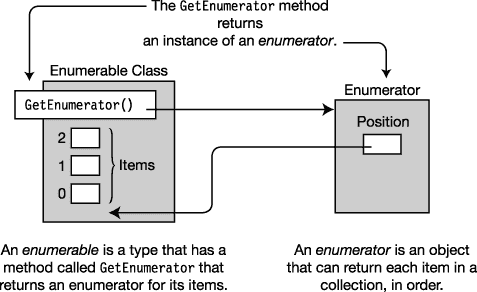
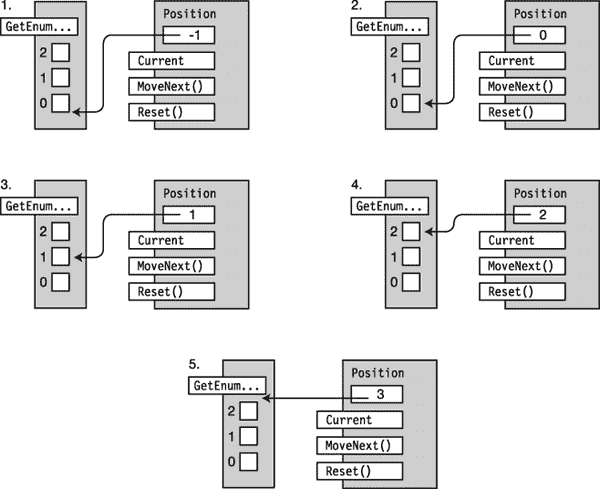
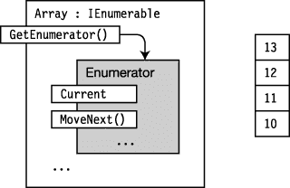
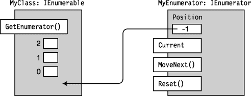
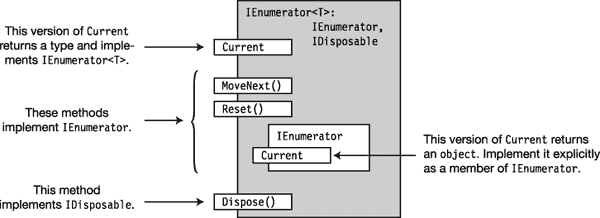
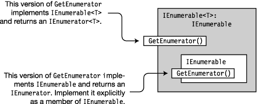
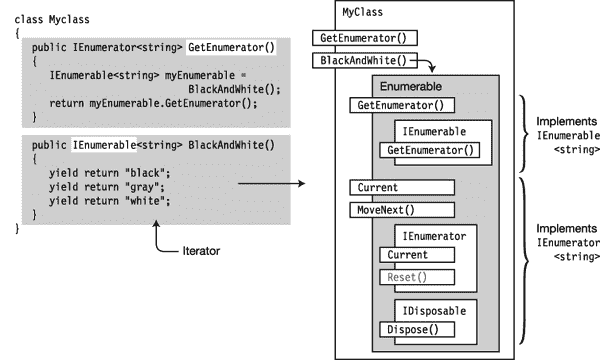
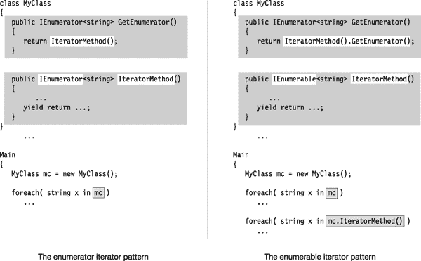
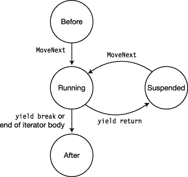

# 十八、枚举器和迭代器

### 枚举器和可枚举类型

在《T2》第十二章中，你看到了你可以使用一个`foreach`语句循环遍历一个数组的元素。在这一章中，你将仔细观察数组，看看为什么它们可以被`foreach`语句处理。您还将看到如何使用迭代器将这种能力添加到您自己的用户定义的类中。

#### 使用 foreach 语句

当您对一个数组使用`foreach`语句时，该语句会一个接一个地显示数组中的每个元素，允许您读取它的值。例如，下面的代码声明了一个包含四个元素的数组，然后使用一个`foreach`循环打印出各项的值:

`   int[] arr1 = { 10, 11, 12, 13 };                // Define the array.

   foreach (int item in arr1)                      // Enumerate the elements.
      Console.WriteLine("Item value:  {0}", item);`

该代码产生以下输出:

* * *

`Item value:  10
Item value:  11
Item value:  12
Item value:  13`

* * *

为什么这适用于数组？原因是数组可以根据请求产生一个名为*枚举器*的对象。枚举器是一个对象，它可以根据请求依次返回数组的元素。枚举器“知道”项目的顺序，并跟踪它在序列中的位置。然后，当被请求时，它返回当前项。

对于具有枚举数的类型，必须有一种检索它的方法。检索对象的枚举数的方法是调用对象的`GetEnumerator`方法。实现了`GetEnumerator`方法的类型被称为*可枚举类型*，或者简称为*可枚举类型*。数组是可枚举的。

图 18-1 说明了枚举数和枚举数的关系。

***图 18-1** 。枚举器和枚举器概述*

`foreach`构造被设计成使用可枚举的。只要要迭代的对象是可枚举类型，比如数组，它就会执行以下操作:

> *   Get the enumerator of the object by calling its `GetEnumerator` method.
> *   It requests each item from the enumerator and uses it as *iteration variable* for your code to read (but not change).

`                           Must be enumerable
                                  ↓
   foreach( *Type VarName* in *EnumerableObject* )
   {
      ...
   }`

### IEnumerator 接口

一个枚举器实现了`IEnumerator`接口，该接口包含三个函数成员:`Current`、`MoveNext`和`Reset`。

> *   `Current` is the attribute of the item at the current position in the return sequence.
>     *   It is a read-only property.
>     *   It returns a reference of type `object`, so it can return any type of object.
> *   `MoveNext` is a method to advance the position of the enumerator to the next item in the collection. It also returns a Boolean value indicating whether the new position is a valid position or beyond the end of the sequence.
>     *   If the new position is valid, the method returns to `true`.
>     *   If the new position is invalid (that is, the current position exceeds the end point), the method returns `false`.
>     *   The initial position of the enumerator is *before the first item in the sequence, so `MoveNext` must call *before* accesses `Current` for the first time.*
> *   `Reset` is a method to reset the position to the initial state.

图 18-2 展示了一个由三个项目组成的集合，显示在图的左边，以及它的枚举器，显示在右边。在图中，枚举器是一个名为`ArrEnumerator`的类的实例。

***图 18-2** 。小集合的枚举器*

枚举器跟踪序列中当前项目的方式完全依赖于实现。它可能被实现为对一个对象的引用、一个索引值或者其他完全不同的东西。对于内置的一维数组类型，它只是项目的索引。

图 18-3 显示了三个项目集合的枚举器的状态。这些状态被标记为 1 到 5。

> *   Note that in state 1, the initial position of the enumerator is 1 (that is, before the first element of the collection).
> *   Every transition between states is caused by a call to `MoveNext`, which will raise the position in the sequence. Every call to `MoveNext` between state 1 and state 4 returns `true`. However, in the transition between States 4 and 5, the position ends at the last item in the set, so the method returns `false`.
> *   In the final state, any further call to `MoveNext` returns `false`.

***图 18-3** 。计数器的状态*

给定一个集合的枚举器，您应该能够通过使用`MoveNext`和`Current`成员循环遍历集合中的项目来模拟一个`foreach`循环。例如，您知道数组是可枚举的，所以下面的代码手动*执行`foreach`语句自动*执行的*操作。事实上，当你写一个`foreach`循环时，C# 编译器会生成与此非常相似的代码(当然是在 CIL)。*

`   static void Main()
   {
      int[] MyArray = { 10, 11, 12, 13 };           // Create an array.
                         Get and store the enumerator.
                       <ins>          ↓            </ins>
      IEnumerator ie = MyArray.GetEnumerator();
              Move to the next position.
              <ins>       ↓     </ins>
      while ( ie.MoveNext() )
      {               Get the current item.
                       <ins>    ↓    </ins>
         int i = (int) ie.Current;
         Console.WriteLine("{0}", i);               // Write it out.
      }
   }`

这段代码产生以下输出，就像您使用了内置的`foreach`语句一样:

* * *

`10
11
12
13`

* * *

图 18-4 说明了代码示例中数组的结构。

***图 18-4。**美国 .NET 数组类实现 IEnumerable。*

##### IEnumerable 接口

可枚举类是实现`IEnumerable`接口的类。接口只有一个成员，方法`GetEnumerator`，它返回对象的枚举数。

图 18-5 显示了类`MyClass`，该类有三项要枚举，通过实现`GetEnumerator`方法来实现`IEnumerable`接口。

***图 18-5** 。GetEnumerator 方法返回该类的枚举器对象。*

下面的代码显示了可枚举类的声明形式:

`   using System.Collections;
                  Implements the IEnumerable interface
                      ↓
   class MyClass : IEnumerable
   {
      public IEnumerator GetEnumerator { ... }
         ...     ↑
   }     Returns an object of type IEnumerator`

下面的代码给出了一个可枚举类的例子，它使用了一个名为`ColorEnumerator`的枚举器类，它实现了`IEnumerator`。我将在下一节展示`ColorEnumerator`的实现。

`   using System.Collections;

   class MyColors: IEnumerable
   {
      string[] Colors = { "Red", "Yellow", "Blue" };

      public IEnumerator GetEnumerator()
      {
         return <ins>new ColorEnumerator(Colors)</ins>;
      }                      ↑
   }            An instance of the enumerator class`

#### 使用 IEnumerable 和 IEnumerator 的例子

下面的代码展示了一个名为`Spectrum`的可枚举类及其枚举器类`ColorEnumerator`的完整示例。类`Program`在方法`Main`中创建了一个`MyColors`的实例，并在`foreach`循环中使用它。

`using System;
   using System.Collections;

   class ColorEnumerator : IEnumerator
   {
      string[] _colors;
      int      _position = -1;

      public ColorEnumerator( string[] theColors )        // Constructor
      {
         _colors = new string[theColors.Length];
         for ( int i = 0; i < theColors.Length; i++ )
            _colors[i] = theColors[i];
      }

      public object Current                               // Implement Current.
      {
         get
         {
            if ( _position == -1 )
               throw new InvalidOperationException();
            if ( _position >= _colors.Length )
               throw new InvalidOperationException();

            return _colors[_position];
         }
      }

      public bool MoveNext()                              // Implement MoveNext.
      {
         if ( _position < _colors.Length - 1 )
         {
            _position++;
            return true;
         }
         else
            return false;
      }

      public void Reset()                                 // Implement Reset.
      {
         _position = -1;
      }
   }` `   class Spectrum : IEnumerable
   {
      string[] Colors = { "violet", "blue", "cyan", "green", "yellow", "orange", "red" };

      public IEnumerator GetEnumerator()
      {
         return new ColorEnumerator( Colors );
      }
   }

   class Program
   {
      static void Main()
      {
         Spectrum spectrum = new Spectrum();
         foreach ( string color in spectrum )
            Console.WriteLine( color );
      }
   }`

该代码产生以下输出:

* * *

`violet
blue
cyan
green
yellow
orange
red`

* * *

### 通用枚举接口

到目前为止，我描述的枚举接口都是非通用版本。实际上，您应该主要使用接口的通用版本，即`IEnumerable<T>`和`IEnumerator<T>`。它们被称为泛型是因为它们使用 C# 泛型，这在第十七章中有所涉及。使用它们与使用非泛型形式基本相同。

两者之间的本质区别如下:

> *   In the form of non-universal interface
>     *   The `GetEnumerator` method of interface `IEnumerable` returns an enumerator class instance that implements `IEnumerator`.
>     *   The class that implements `IEnumerator` implements the property `Current`, which returns a reference of type `object`, and then you must convert it to the actual type of the object.
> *   Use common interface form.
>     *   The `GetEnumerator` method of interface `IEnumerable<T>` returns an instance of the class that implements `IEnumerator<T>`.
>     *   The class that implements `IEnumerator<T>` implements the property `Current`, which returns an instance of the actual type instead of a reference to the base class `object`.

然而，需要注意的最重要的一点是，到目前为止，我们看到的非泛型接口实现不是类型安全的。它们返回对类型`object`的引用，然后必须将其转换为实际类型。

然而，使用*通用接口*，枚举器是类型安全的，返回对实际类型的引用。如果您通过实现接口来创建自己的可枚举数，这是您应该采用的方法。非泛型接口形式适用于 C# 2.0 引入泛型之前开发的遗留代码。

虽然通用版本与非通用版本相同或者更容易使用，但是它们的结构稍微复杂一些。图 18-6 和 18-7 说明了它们的结构。

***图 18-6** 。实现 IEnumerator < T >接口*的类的结构

***图 18-7。**实现 IEnumerable < T >接口*的类的结构

### 迭代器

可枚举类和枚举器在 .NET 集合类，所以熟悉它们的工作方式很重要。但是现在您已经知道了如何创建自己的可枚举类和枚举器，您可能会很高兴地了解到，从 C# 2.0 开始，该语言提供了一种更简单的创建枚举器和枚举器的方法。事实上，编译器会为您创建它们。产生它们的结构被称为*迭代器*。您可以在任何需要使用手动编码的枚举器或枚举器的地方使用由迭代器生成的枚举器和枚举器。

在我解释细节之前，我们先来看两个例子。下面的方法声明实现了一个迭代器，该迭代器生成并返回一个枚举数。

> *   Iterator returns a universal enumerator, which returns three items of type `string`.
> 
> `yield return`
> 
> *这是枚举*

`        Return an enumerator that returns strings.
          <ins>        ↓              </ins>
   public IEnumerator<string> BlackAndWhite()                 // Version 1
   {
      yield return "black";                                   // yield return
      yield return "gray";                                    // yield return
      yield return "white";                                   // yield return
   }`

下面的方法声明是产生相同结果的另一个版本:

`        Return an enumerator that returns strings.
          <ins>           ↓       </ins>
   public IEnumerator<string> BlackAndWhite()                  // Version 2
   {
      string[] theColors = { "black", "gray", "white" };

      for (int i = 0; i < theColors.Length; i++)
         yield return theColors[i];                            // yield return
   }`

我还没有解释`yield return`语句，但是在检查这些代码段时，您可能会觉得这段代码有些不同。好像不太对。`yield return`语句到底是做什么的？

例如，在第一个版本中，如果方法在第一个`yield return`语句上返回，那么最后两个语句永远不会到达。如果它没有在第一个语句中返回，而是继续到方法的末尾，那么值会发生什么呢？在第二个版本中，如果循环体中的`yield return`语句在第一次迭代时返回，那么循环将*永远不会*到达任何后续迭代。

除此之外，枚举器并不只是一次性返回所有的元素——它会在每次访问`Current`属性时返回一个新值。那么，这如何给你一个枚举数呢？显然，这段代码不同于之前展示的任何代码。

#### 迭代器块

一个*迭代器块*是一个包含一个或多个`yield`语句的代码块。以下三种类型的代码块都可以是迭代器块:

> *   A legal system
> *   A legal system
> *   A legal system

迭代器块的处理方式不同于其他块。其他块包含被强制处理的语句序列。也就是说，执行块中的第一条语句，然后执行后续语句，最后控制权离开块。

另一方面，迭代器块不是一次执行的命令序列。相反，它是声明性的；它描述了您希望编译器为您生成的枚举数类的行为。迭代器块中的代码描述了如何枚举元素。

迭代器块有两个特殊的语句:

> `yield return`
> 
> `yield break`

编译器获取如何枚举项的描述，并使用它来构建枚举器类，包括所有必需的方法和属性实现。结果类嵌套在声明迭代器的类中。

根据迭代器块使用的返回类型，你可以让迭代器产生一个枚举器或者一个可枚举器，如图图 18-8 所示。

***图 18-8。**你可以让一个迭代器块产生一个枚举器或者一个可枚举器，这取决于你指定的返回类型。*

#### 使用迭代器创建枚举器

下面的代码演示了如何使用迭代器创建一个可枚举的类。

> *   Method `BlackAndWhite` is an iterator block that generates a method that returns the enumerator of class `MyClass`.
> *   `MyClass` also implements the method `GetEnumerator`, which just calls `BlackAndWhite` and returns the enumerator returned by `BlackAndWhite`.
> *   Note that in `Main`, you can directly use the instance of this class in `foreach` statement, because this class implements `GetEnumerator`, so it is enumerable.

`   class MyClass
   {
      public IEnumerator<string> GetEnumerator()
      {
         return BlackAndWhite();                   // Returns the enumerator
      }
            Returns an enumerator
            <ins>        ↓          </ins>
      public IEnumerator<string> BlackAndWhite()  // Iterator
      {
         yield return "black";
         yield return "gray";
         yield return "white";
      }
   }

   class Program
   {
      static void Main()
      {
         MyClass mc = new MyClass();
                        Use the instance of MyClass.
                                 ↓
         foreach (string shade in mc)
            Console.WriteLine(shade);
      }
   }`

该代码产生以下输出:

* * *

`black
gray
white`

* * *

图 18-9 左边显示了`MyClass`的代码，右边显示了结果对象。注意有多少是由编译器自动构建的。

> *   The code of the iterator is shown on the left side of the figure, showing that its return type is `IEnumerator<string>`.
> *   On the right side of the diagram, the diagram shows that the nested class implements `IEnumerator<string>`.

***图 18-9** 。生成枚举器*的迭代器块

#### 使用迭代器创建一个可枚举

前面的例子创建了一个包含两部分的类:产生返回枚举数的方法的迭代器和返回枚举数的`GetEnumerator`方法。在这个例子中，迭代器产生一个可枚举的而不是一个的*枚举器。这个例子和上一个例子有一些重要的区别:*

> *   In the example, the iterator method `BlackAndWhite` returns a `IEnumerator<string>`, and `MyClass` implements the method `GetEnumerator` by returning `BlackAndWhite`. In this example, the iterator method `BlackAndWhite` returns a `IEnumerable<string>` instead of a `IEnumerator<string>`. Therefore, `MyClass` implements its `GetEnumerator` method by first calling the method `BlackAndWhite` to obtain an enumerable object, then calling the `GetEnumerator` method of the object and returning the result.
> *   Note that in the `foreach` statement of `Main`, you can use an instance of the class or call `BlackAndWhite` directly, because it returns an enumerable one. There are both ways.

`   class MyClass
   {
      public IEnumerator<string> GetEnumerator()
      {
         IEnumerable<string> myEnumerable = BlackAndWhite(); // Get enumerable.
         return myEnumerable.GetEnumerator();                // Get enumerator.
      }        Returns an enumerable
             <ins>        ↓           </ins>
      public IEnumerable<string> BlackAndWhite()
      {
         yield return "black";
         yield return "gray";
         yield return "white";
      }
   }

   class Program
   {
      static void Main()
      {
         MyClass mc = new MyClass();
                            Use the class object.
                                   ↓
         foreach (string shade in mc)
            Console.Write("{0}  ", shade);
                               Use the class iterator method.
                                   <ins>     ↓       </ins>
         foreach (string shade in mc.BlackAndWhite())
            Console.Write("{0}  ", shade);
      }
   }`

这段代码产生以下输出:

* * *

`black  gray  white  black  gray  white`

* * *

图 18-10 说明了代码中可枚举迭代器产生的泛型可枚举。

> *   The code of the iterator is shown on the left side of the figure, showing that its return type is `IEnumerable<string>`.
> *   On the right side of the diagram, the diagram shows that the nested class implements both `IEnumerator<string>` and `IEnumerable<string>`.

***图 18-10。**编译器生成一个既是枚举器又是枚举器的类。它还产生返回可枚举对象的方法 BlackAndWhite。*

### 常见迭代器模式

前两节展示了您可以创建一个迭代器来返回一个*枚举数*或一个*枚举数*。图 18-11 总结了如何使用常见的迭代器模式。

> *   When you implement an iterator that returns an enumerator, you must make *class* enumerable by implementing `GetEnumerator` so that it returns the enumerator returned by the iterator. This is shown on the left side of the diagram.
> *   In a class, when you implement an iterator that returns enumerable, you can make the class itself enumerable or un-enumerable by making the class implement `GetEnumerator` or not.
>     *   If you implement `GetEnumerator`, let it call the iterator method to get an instance of the automatically generated class that implements `IEnumerable`. Next, return the enumerator built by `GetEnumerator` from this `IEnumerable` object, as shown in the right figure.
>     *   If you decide not to make the class itself enumerable, you can still use the enumerable returned by the iterator by not implementing `GetEnumerator`, and call the iterator method directly, as shown in the second `foreach` statement on the right.

***图 18-11** 。常见的迭代器模式*

### 产生多个可枚举数

在下面的例子中，类`Spectrum`有两个可枚举的迭代器——一个从紫外端到红外端枚举光谱的颜色，另一个从相反的方向枚举。请注意，尽管它有两个返回可枚举的方法，但该类本身是不可枚举的，因为它没有实现`GetEnumerator`。

`   using System;
   using System.Collections.Generic;

   class Spectrum
   {
      string[] colors = { "violet", "blue", "cyan", "green", "yellow", "orange", "red" };
                                Returns an enumerable
                                    ↓
      public IEnumerable<string> UVtoIR()
      {
         for ( int i=0; i < colors.Length; i++ )
            yield return colors[i];
      }
                                Returns an enumerable
                                    ↓
      public IEnumerable<string> IRtoUV()
      {
         for ( int i=colors.Length - 1; i >= 0; i-- )
            yield return colors[i];
      }
   }

   class Program
   {
      static void Main()
      {
         Spectrum spectrum = new Spectrum();

         foreach ( string color in spectrum.UVtoIR() )
            Console.Write( "{0}  ", color );
         Console.WriteLine();

         foreach ( string color in spectrum.IRtoUV() )
            Console.Write( "{0}  ", color );
         Console.WriteLine();
      }
   }`

该代码产生以下输出:

* * *

`violet  blue  cyan  green  yellow  orange  red
red  orange  yellow  green  cyan  blue  violet`

* * *

### 迭代器作为属性

前面的例子使用迭代器产生一个具有两个可枚举数的类。这个例子说明了两件事。首先，它使用迭代器产生一个具有两个枚举器的类。第二，它展示了迭代器如何实现为*属性*而不是方法。

代码声明了两个属性，这两个属性定义了两个不同的枚举数。根据布尔变量`_listFromUVtoIR`的值，`GetEnumerator`方法返回两个枚举器中的一个或另一个。如果`_listFromUVtoIR`为`true`，则返回`UVtoIR`枚举数。否则，返回`IRtoUV`枚举器。

`using System;
   using System.Collections.Generic;

   class Spectrum
   {
      bool _listFromUVtoIR;

      string[] colors = { "violet", "blue", "cyan", "green", "yellow", "orange", "red" };

      public Spectrum( bool listFromUVtoIR )
      {
         _listFromUVtoIR = listFromUVtoIR;
      }

      public IEnumerator<string> GetEnumerator()
      {
         return _listFromUVtoIR
                     ? UVtoIR
                     : IRtoUV;
      }

      public IEnumerator<string> UVtoIR
      {
         get
         {
            for ( int i=0; i < colors.Length; i++ )
               yield return colors[i];
         }
      }

      public IEnumerator<string> IRtoUV
      {
         get
         {
            for ( int i=colors.Length - 1; i >= 0; i-- )
               yield return colors[i];
         }
      }
   }` `   class Program
   {
      static void Main()
      {
         Spectrum startUV = new Spectrum( true );
         Spectrum startIR = new Spectrum( false );

         foreach ( string color in startUV )
            Console.Write( "{0}  ", color );
         Console.WriteLine();

         foreach ( string color in startIR )
            Console.Write( "{0}  ", color );
         Console.WriteLine();
      }
   }`

该代码产生以下输出:

* * *

`violet  blue  cyan  green  yellow  orange  red
red  orange  yellow  green  cyan  blue  violet`

* * *

### 幕后用迭代器

以下是关于迭代器需要知道的一些其他重要的事情:

> *   Iterator needs `System.Collections.Generic` namespace, so it should be included with `using` instruction.
> *   `Reset` method is not supported in enumerator generated by compiler. It is implemented because the interface needs it, but if it is called, the implementation will throw a `System.NotSupportedException` exception. Note that the `Reset` method is shown in gray in Figure 18-9 .

在幕后，编译器生成的枚举器类是一个状态机，有四种状态:

> *   Before *: the initial state before `MoveNext` is called for the first time.*
> **   *Running* : the state entered when `MoveNext` is called. In this state, the enumerator determines and sets the position of the next item. When it encounters a `yield return`, `yield break` or the end of the iterator body, it exits the state.*   *Pending* : The state machine waits for the next call of `MoveNext`.*   After *: There are no more items to enumerate.**

 **如果状态机处于之前的*或暂停状态*，并且调用了`MoveNext`方法，它将进入运行状态。在*运行*状态下，确定集合中的下一个项目并设定位置。

如果有更多项目，状态机进入*暂停*状态。如果没有更多的项目，它将在后进入*状态，并保持不变。图 18-12 显示了状态机。*

***图 18-12。**迭代器状态机***