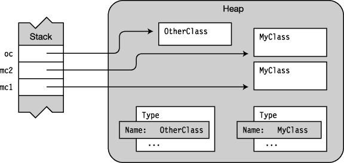
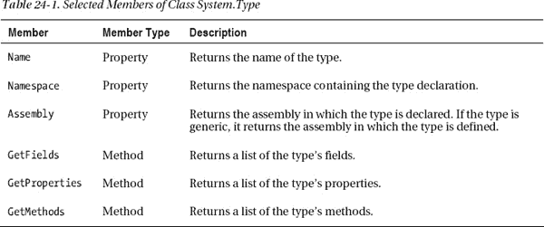
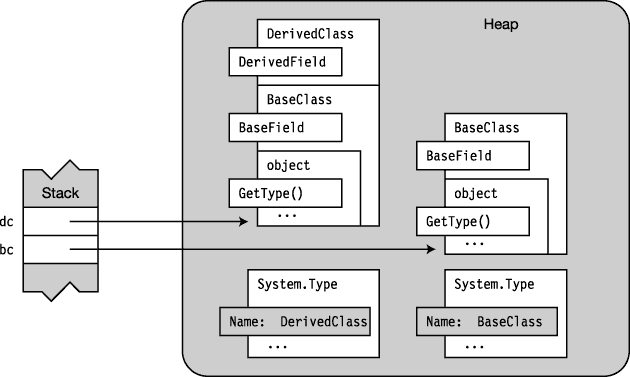
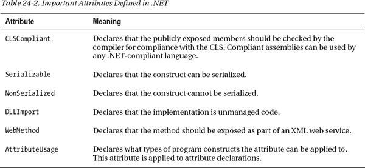
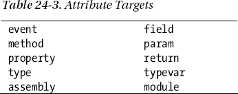
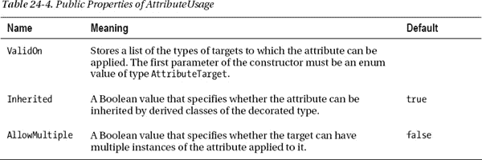

# 二十四、反射和属性

*   元数据和反射
*   类型类
*   获取类型对象
*   什么是属性？
*   应用属性
*   预定义、保留的属性
*   关于应用属性的更多信息
*   自定义属性
*   访问属性

### 元数据和反射

大多数程序都是用来处理数据的。它们读取、写入、操作和显示数据。(图形是数据的一种形式。)然而，对于某些类型的程序来说，它们操纵的数据不是数字、文本或图形，而是关于程序和程序类型的信息。

> 关于程序及其类的数据称为元数据，存储在程序的程序集中。*   A program can view other assemblies or its own metadata at runtime. When a running program looks at its own metadata or the metadata of other programs, this is called reflection.

对象浏览器是显示元数据的程序的一个例子。它可以读取程序集并显示它们包含的类型，以及所有的特征和成员。

本章将介绍你的程序如何使用`Type`类反映数据，以及如何使用*属性*向你的类型添加元数据。

 **注意**要使用反射，必须使用`System.Reflection`名称空间。

### 铅字类

在本文中，我描述了如何声明和使用 C# 中可用的类型。这些包括预定义的类型(`int`、`long`、`string`等)、来自 BCL 的类型(`Console`、`IEnumerable`等)，以及用户定义的类型(`MyClass`、`MyDel`等)。每种类型都有自己的成员和特征。

BCL 声明了一个名为`Type`的抽象类，它被设计用来包含一个类型的特征。使用这个类的对象允许你得到关于你的程序正在使用的类型的信息。

由于`Type`是一个抽象类，它不能有实际的实例。相反，在运行时，CLR 创建从包含类型信息的`Type` ( `RuntimeType`)派生的类*的实例。当您访问这些实例之一时，CLR 返回一个引用，不是派生类型的引用，而是基类`Type`的引用。不过，为了简单起见，在本章的其余部分，我将把引用所指向的对象称为类型为`Type`的对象，尽管从技术上讲，它是 BCL 内部的一个派生类型的对象。*

关于`Type`需要了解的重要事项如下:

> *   For each type used in the program, the CLR will create a `Type` object containing information about that type.
> *   Each type used in the program is associated with a separate `Type` object.
> *   No matter how many types of instances are created, only one `Type` object is associated with all instances.

图 24-1 显示了一个带有两个`MyClass`对象和一个`OtherClass`对象的运行程序。注意，虽然有两个`MyClass`实例，但是只有一个`Type`对象表示它。

***图 24-1** 。CLR 为程序中使用的每个类型实例化类型的对象。*

你几乎可以从类型的`Type`对象中获得任何你需要知道的信息。表 24-1 列出了这个类中一些更有用的成员。

### 获取类型对象

你可以通过使用`GetType`方法或者使用`typeof`操作符得到一个`Type`对象。类型`object`包含一个名为`GetType`的方法，该方法返回对实例的`Type`对象的引用。因为每个类型最终都是从`object`派生的，所以您可以对任何类型的对象调用`GetType`方法来获取其`Type`对象，如下所示:

`Type t = myInstance.GetType();`

下面的代码显示了基类和从它派生的类的声明。方法`Main`为每个类创建一个实例，并将引用放在一个名为`bca`的数组中，以便于处理。在外层的`foreach`循环中，代码获取`Type`对象并打印出类名。然后它获取该类的字段并将它们打印出来。图 24-2 说明了内存中的对象。

`   using System;
   using System.Reflection;                           // Must use this namespace
   class BaseClass
   {
      public int BaseField = 0;
   }

   class DerivedClass : BaseClass
   {
      public int DerivedField = 0;
   }

   class Program
   {
      static void Main( )
      {
         var bc = new BaseClass();
         var dc = new DerivedClass();

         BaseClass[] bca = new BaseClass[] { bc, dc };

         foreach (var v in bca)
         {
            Type t = v.GetType();                     // Get the type.

            Console.WriteLine("Object type : {0}", t.Name);

            FieldInfo[] fi = t.GetFields();           // Get the field information.
            foreach (var f in fi)
               Console.WriteLine("      Field : {0}", f.Name);
            Console.WriteLine();
         }
      }
   }`

该代码产生以下输出:

* * *

`Object type : BaseClass
      Field : BaseField

Object type : DerivedClass
      Field : DerivedField
      Field : BaseField`

* * *

***图 24-2** 。基类和派生类对象以及它们的类型对象*

你也可以使用`typeof`操作符来获得一个`Type`对象。只需提供类型名作为操作数，它就会返回一个对`Type`对象的引用，如下所示:

`   Type t = typeof( DerivedClass );
              ↑          ↑
            Operator   Type you want the Type object for`

下面的代码显示了一个使用`typeof`操作符的简单例子:

`   using System;
   using System.Reflection;                           // Must use this namespace

   namespace SimpleReflection
   {
      class BaseClass
      {
         public int MyFieldBase;
      }

      class DerivedClass : BaseClass
      {
         public int MyFieldDerived;
      }

      class Program
      {
         static void Main( )
         {
            Type tbc = typeof(DerivedClass);                    // Get the type.
            Console.WriteLine("Result is {0}.", tbc.Name);

            Console.WriteLine("It has the following fields:");  // Use the type.
            FieldInfo[] fi = tbc.GetFields();
            foreach (var f in fi)
               Console.WriteLine("   {0}", f.Name);
         }
      }
   }`

该代码产生以下输出:

* * *

`Result is DerivedClass.
It has the following fields:
   MyFieldDerived
   MyFieldBase`

* * *

### 什么是属性？

一个*属性*是一种语言结构，允许你添加元数据到程序的集合中。它是一种特殊类型的类，用于存储关于程序结构的信息。

> *   The program structure to which you apply attributes is called its *target* .
> *   Programs designed to retrieve and use metadata, such as object browsers, are called consumers of attributes.
> *   There are predefined attributes. You can also declare custom attributes.

图 24-3 给出了使用属性所涉及的组件的概述，并说明了关于它们的以下几点:

> *   You *apply the* attribute to the program construction in the source code.
> *   The compiler gets the source code, generates metadata from the attributes, and puts the metadata into the assembly.
> *   The consumer program can access the metadata of attributes and the metadata of other components of the program. Note that the compiler generates and uses attributes.

***图 24-3** 。创建和使用属性所涉及的组件*

按照惯例，属性名使用 Pascal 大小写，并以后缀`Attribute`结尾。但是，在将属性应用于目标时，可以省略后缀。例如，对于属性`SerializableAttribute`和`MyAttributeAttribute`，在将它们应用到一个构造时，您可以使用简称`Serializable`和`MyAttribute`。

### 应用属性

我将从展示如何使用已经定义的属性开始，而不是从描述如何创建属性开始。这样，你就可以知道它们是如何有用的。

属性的目的是告诉编译器发出一组关于程序构造的元数据，并将其放入程序集中。您可以通过*将属性*应用于构造来实现这一点。

> *   Apply an attribute by placing a *attribute segment* before construction.
> *   *The attribute part* consists of square brackets and contains an attribute name and sometimes a parameter list.

例如，下面的代码显示了两个类的标题。前几行代码显示了应用于类`MyClass`的名为`Serializable`的属性。注意`Serializable`没有参数列表。第二个类声明有一个名为`MyAttribute`的属性，它有一个带两个`string`参数的参数列表。

`   [ Serializable ]                                  // Attribute
   public class MyClass
   { ...

   [ MyAttribute("Simple class", "Version 3.57") ]   // Attribute with parameters
   public class MyOtherClass
   { ...`

关于属性，需要了解的一些重要信息如下:

> *   Most attributes only apply to constructs that follow the attribute segment.
> *   A construction with an attribute is called *modifying* , or *modifying* , which has this attribute. These two terms are very common.

### 预定义的、保留的属性

在这一节中，我们将看看. NET 预定义和保留的几个属性。

#### 过时的属性

在一个程序的生命周期中，它可能会经历许多不同的版本，可能会持续几年。在其生命周期的后期，您通常会编写一个新方法来取代执行类似功能的旧方法。出于多种原因，您可能希望保留所有调用旧的、现已过时的方法的旧代码，而让新代码调用新方法。

当这种情况发生时，您会希望您的团队成员，或者以后处理代码的程序员，使用新的方法而不是旧的方法。为了帮助警告他们不要使用旧方法，您可以使用`Obsolete`属性将旧方法标记为过时，并在编译代码时显示一条有用的警告消息。下面的代码显示了它的用法示例:

`   class Program     Apply attribute.
   {                    ↓

      [Obsolete("Use method SuperPrintOut")]   // Apply attribute to method.
      static void PrintOut(string str)
      {
          Console.WriteLine(str);
      }
      static void Main(string[] args)
      {
          PrintOut("Start of Main");           // Invoke obsolete method.
      }
   }`

注意方法`Main`调用`PrintOut`,即使它被标记为过时。尽管如此，代码编译和运行良好，并产生以下输出:

* * *

`Start of Main`

* * *

不过，在编译期间，编译器会产生下列 CS0618 警告讯息，通知您正在使用过时的建构:

* * *

`'AttrObs.Program.PrintOut(string)' is obsolete: 'Use method SuperPrintOut'`

* * *

属性的另一个重载接受类型为`bool`的第二个参数。此参数指定是否将用法标记为错误，而不仅仅是警告。以下代码指定应将它标记为错误:

`                                      Flag as an error.
                                           ↓
   [ Obsolete("Use method SuperPrintOut", true) ]  // Apply attribute to method.
   static void PrintOut(string str)
   { ...`

#### 条件属性

`Conditional`属性允许您指示编译器包含或排除特定方法的所有*调用*。要使用`Conditional`属性，将它应用到方法声明中，并将编译符号作为参数。

> 如果定义了编译符号，编译器将包含所有方法调用的代码，就像对任何普通方法一样。*   If the compilation symbol is defined by *instead of* , the compiler *will omit all the method calls of* in the whole code.T9】

定义方法本身的 CIL 代码总是包含在程序集中。只是插入或省略了调用。

例如，在下面的代码中，`Conditional`属性被应用于名为`TraceMessage`的方法的声明。该属性只有一个参数，在本例中是字符串`DoTrace`。

> *   When compiling code, the compiler will check whether the compilation symbol named `DoTrace` is defined.
> *   If `DoTrace` is defined, the compiler places all calls to method `TraceMessage` in the code as usual.
> *   If `DoTrace` compilation symbol is not defined, it will not output any code for `TraceMessage` call.

`              Compilation symbol
                <ins>    ↓    </ins>
   [Conditional( "DoTrace" )]
   static void TraceMessage(string str)
   {
      Console.WriteLine(str);
   }`

##### 条件属性的例子

下面的代码展示了使用`Conditional`属性的完整示例。

> *   Method `Main` contains two calls to method `TraceMessage`.
> *   The declaration of method `TraceMessage` is decorated with the attribute `Conditional`, whose parameter is the compilation symbol `DoTrace`. Therefore, if `DoTrace` is defined, the compiler will contain all the codes that call `TraceMessage`.
> *   Since the first line of code defines a compilation symbol named `DoTrace`, the compiler will contain the code that calls `TraceMessage` twice.

`   #define DoTrace
   using System;
   using System.Diagnostics;

   namespace AttributesConditional
   {
      class Program
      {
         [Conditional( "DoTrace" )]
         static void TraceMessage(string str)
         { Console.WriteLine(str); }

         static void Main( )
         {
            TraceMessage("Start of Main");
            Console.WriteLine("Doing work in Main.");
            TraceMessage("End of Main");
         }
      }
   }`

该代码产生以下输出:

* * *

`Start of Main
Doing work in Main.
End of Main`

* * *

如果您注释掉第一行，使得`DoTrace`没有被定义，编译器将不会为对`TraceMessage`的两次调用插入代码。这一次，当您运行该程序时，它会产生以下输出:

* * *

`Doing work in Main.`

* * *

#### 来电者信息属性

调用者信息属性允许您访问有关文件路径、行号和调用成员名称的源代码信息。

> *   The three attribute names are `CallerFilePath`, `CallerLineNumber` and `CallerMemberName` respectively.
> *   These properties can only be used with optional parameters on methods.

下面的代码声明了一个名为`MyTrace`的方法，该方法在其三个可选参数上使用了三个调用者信息属性。如果使用这些参数的显式值调用该方法，将使用实际参数的值。然而，在下面显示的来自`Main`的调用中，没有提供显式的值，所以系统提供源代码的文件路径、调用方法的行的行号以及调用方法的成员的名称。

`   using System;
   using System.Runtime.CompilerServices;

   public static class Program
   {
      public static void MyTrace( string message,
                                  [CallerFilePath]   string fileName = "",
                                  [CallerLineNumber] int lineNumber = 0,
                                  [CallerMemberName] string callingMember = "" )
      {
         Console.WriteLine( "File:        {0}", fileName );
         Console.WriteLine( "Line:        {0}", lineNumber );
         Console.WriteLine( "Called From: {0}", callingMember );
         Console.WriteLine( "Message:     {0}", message );
      }

      public static void Main()
      {
         MyTrace( "Simple message" );
      }
   }`

该代码产生以下输出:

* * *

`File:        c:\TestCallerInfo\TestCallerInfo\Program.cs
Line:        19
Called From: Main
Message:     Simple message`

* * *

#### DebuggerStepThrough 属性

很多时候，当你调试代码并一行一行地单步执行时，有些方法是你不想让调试器进入的；您只想让它执行方法，并单步执行方法调用后的行。`DebuggerStepThrough`属性指示调试器在不进入目标代码的情况下执行它。

在我自己的代码中，这是我经常发现的最有用的属性。有些方法很小，但显然是正确的，以至于在调试时不得不重复地一步一步来，这很烦人。但是，请小心使用该属性，因为您不想排除可能包含 bug 的代码。

关于`DebuggerStepThrough`需要了解的重要事项如下:

> *   This attribute is in the `System.Diagnostics` namespace.
> *   You can use this property on classes, structures, constructors, methods or accessors.

下面的代码展示了在访问器和方法上使用的属性。如果您在调试器中单步调试这段代码，您会发现调试器没有进入`IncrementFields`方法或`X`属性的`set`访问器。

`   using System;
   using System.Diagnostics;         // Required for this DebuggerStepThrough

   class Program
   {
      int _x = 1;
      int X
      {
         get { return _x; }
         [DebuggerStepThrough]       // Don’t step through the set accessor.
         set
         {
            _x = _x * 2;
            _x += value;
         }
      }

      public int Y { get; set; }

      public static void Main()  {
         Program p = new Program();

         p.IncrementFields();
         p.X = 5;
         Console.WriteLine( "X = {0}, Y = {1}", p.X, p.Y );
      }
      [DebuggerStepThrough]          // Don’t step through this method.
      void IncrementFields()
      {
         X++;
         Y++;
      }
   }`

#### 其他预定义属性

那个 .NET Framework 预定义了许多由编译器和 CLR 理解和解释的属性。表 24-2 列出了其中的一些。该表使用短名称，不带“属性”后缀。比如`CLSCompliant`的全称是`CLSCompliantAttribute`。

### 关于应用属性的更多信息

到目前为止显示的简单属性使用了应用于方法的单个属性。本节描述其他类型的属性用法。

#### 多重属性

您可以将多个属性应用于单个构造。

> *   Multiple attributes can be listed in one of the following formats:
>     *   Individual attribute parts of, one by one. Usually these are stacked on top of each other in separate rows.
>     *   Individual attribute segments, separating attributes with commas.
> *   Attributes can be listed in any order.

例如，下面的代码显示了应用多个属性的两种方式。代码的各个部分是等效的。

`   [ Serializable ]                                                 // Stacked
   [ MyAttribute("Simple class", "Version 3.57") ]

   [ <ins>MyAttribute("Simple class", "Version 3.57")</ins>, Serializable ]    // Comma separated
                         ↑                             ↑
                     Attribute                          Attribute`

#### 其他类型的目标

除了类之外，您还可以将属性应用于其他程序结构，例如字段和属性。下面的声明显示了一个字段的一个属性和一个方法的多个属性:

`   [MyAttribute("Holds a value", "Version 3.2")]                // On a field
   public int MyField;

   [Obsolete]                                                   // On a method
   [MyAttribute("Prints out a message.", "Version 3.6")]
   public void PrintOut()
   {
      ...`

您还可以显式标记属性，以应用于特定的目标构造。若要使用显式目标说明符，请将目标类型放在属性部分的开头，后跟一个冒号。例如，下面的代码用一个属性来修饰*方法*，并且将一个属性应用于*返回值*。

`  Explicit target specifier
     ↓
   [method: MyAttribute("Prints out a message.", "Version 3.6")]
   [return: MyAttribute("This value represents ...", "Version 2.3")]
   public long ReturnSetting()
   {
      ...`

C# 语言定义了十个标准属性目标，在表 24-3 中列出。大多数目标名称都是不言自明的，但是`type`涵盖了类、结构、委托、枚举和接口。`typevar`目标名指定了使用泛型的构造的类型参数。

#### 全局属性

您还可以通过使用`assembly`和`module`目标名称，使用显式目标说明符在程序集和模块级别设置属性。(组件和模块在第二十一章中进行了解释。)关于程序集级属性的一些要点如下:

> *   Assembly-level attributes must be placed in *outside any namespace scope, usually in `AssemblyInfo.cs` file.*
> *   `AssembyInfo.cs` Files usually contain metadata about companies, products and copyright information.

以下是来自一个`AssemblyInfo.cs`文件的行:

`   [assembly: AssemblyTitle("SuperWidget")]
   [assembly: AssemblyDescription("Implements the SuperWidget product.")]
   [assembly: AssemblyConfiguration("")]
   [assembly: AssemblyCompany("McArthur Widgets, Inc.")]
   [assembly: AssemblyProduct("Super Widget Deluxe")]
   [assembly: AssemblyCopyright("Copyright © McArthur Widgets 2012")]
   [assembly: AssemblyTrademark("")]
   [assembly: AssemblyCulture("")]`

### 自定义属性

您可能已经注意到，应用属性的语法与您到目前为止看到的语法非常不同。由此，您可能会认为属性是一种完全不同类型的构造。他们不是——他们只是一种特殊的阶级。

关于属性类的一些要点如下:

> *   The user-defined attribute class is called *custom attribute* .
> *   All the attribute classes of are derived from the `System.Attribute` class.

#### 声明自定义属性

声明一个属性类在很大程度上与声明任何其他类是一样的。但是，有几件事需要注意:

> *   To declare a custom attribute, do the following:
>     *   Declare a class derived from `System.Attribute`.
>     *   Give it a name ending with the suffix `Attribute`.
> *   For security reasons, it is generally recommended that you declare the attribute class as `sealed`.

例如，下面的代码显示了属性`MyAttributeAttribute`声明的开始:

`                           Attribute name
                       <ins>        ↓          </ins>
   public sealed class MyAttribute<ins>Attribute</ins> : <ins>System.Attribute</ins>
   {                                 ↑              ↑
      ...                           Suffix          Base class`

由于属性包含有关目标的信息，因此属性类的公共成员通常只包含以下内容:

> *   field
> *   attribute
> *   Constructor

#### 使用属性构造函数

像其他类一样，属性也有构造函数。每个属性必须至少有一个公共构造函数。

> *   Like other classes, if you do not declare a constructor, the compiler will generate an implicit, public and parameterless constructor for you.
> *   Property constructors, like other constructors, can be overloaded.
> *   When declaring a constructor, you must use the full class name, including the suffix. When *applies* attribute, you can only use abbreviation.

例如，使用下面的构造函数，如果方法名不包含后缀，编译器将产生一条错误消息:

`                        Suffix
                     <ins>    ↓   </ins>
   public MyAttributeAttribute(string desc, string ver)
   {
      Description   = desc;
      VersionNumber = ver;
   }`

#### 指定构造函数

当您将属性应用于目标时，您正在指定应该使用哪个构造函数来创建属性的实例。属性应用中列出的参数是构造函数的实际参数。

例如，在下面的代码中，`MyAttribute`被应用于一个字段和一个方法。对于该字段，声明指定了一个带有单个`string`参数的构造函数。对于该方法，它指定了一个带有两个`string`参数的构造函数。

`   [MyAttribute("Holds a value")]                 // Constructor with one string
   public int MyField;

   [MyAttribute("Version 1.3", "Sal Martin")]     // Constructor with two strings
   public void MyMethod()
   { ...`

关于属性构造函数的其他要点如下:

> *   When applying the attribute, the actual parameter of the constructor must be a constant expression, and its value can be determined at compile time.
> *   If you apply the property constructor without parameters, you can omit the brackets. For example, both classes in the following code use the parameterless constructor of the property `MyAttr`. The meaning of these two forms is the same.

`   [MyAttr]
   class SomeClass ...

   [MyAttr()]
   class OtherClass ...`

#### 使用构造函数

请注意，您从未显式调用构造函数。相反，只有当属性消费者访问属性时，才会创建属性的实例，并调用其构造函数*。这与其他类实例非常不同，其他类实例是在使用对象创建表达式的位置创建的。应用属性是一个声明性语句，它并不决定何时应该构造属性类的对象。*

图 24-4 比较了普通类的构造函数的使用和带属性的构造函数的使用。

> 命令式语句实际上是说，“在这里创建一个新的类对象。”*   Declarative statement says, "This attribute is associated with this target, and if you need to construct an attribute, use this constructor."

***图 24-4** 。比较构造函数的使用*

#### 构造函数中的位置和命名参数

像常规类的方法和构造函数一样，属性构造函数也可以使用位置参数和命名参数。

下面的代码使用一个位置参数和两个命名参数演示了属性的应用:

下面的代码展示了属性类的声明，以及它在类`MyClass`上的应用。注意，构造函数*声明*只列出了一个形参。然而，通过使用命名参数，您可以给构造函数三个实际参数。这两个命名参数设置字段`Ver`和`Reviewer`的值。

`   public sealed class MyAttributeAttribute : System.Attribute
   {
      public string Description;
      public string Ver;
      public string Reviewer;

      public MyAttributeAttribute(string desc)  // Single formal parameter
      {
         Description = desc;
      }
   }                               Three actual parameters
                <ins>                             ↓                             </ins>
   [MyAttribute("An excellent class", Reviewer="Amy McArthur", Ver="7.15.33")]
   class MyClass
   {
      ...
   }`

 **注意**和方法一样，如果构造函数需要任何位置参数，它们必须放在任何命名参数之前。

#### 限制一个属性的使用

您已经看到了可以将属性应用于类。但是属性*本身*是类，并且有一个重要的预定义属性可以应用于您的定制属性:`AttributeUsage`属性。您可以使用它将属性的使用限制到一组特定的目标类型。

例如，如果您希望您的自定义属性`MyAttribute`只应用于方法，您可以使用下面形式的`AttributeUsage`:

`                        Only to methods
                     <ins>         ↓           </ins>
   [ AttributeUsage( AttributeTarget.Method ) ]
   public sealed class MyAttributeAttribute : System.Attribute
   { ...`

`AttributeUsage`有三个重要的公共属性，在表 24-4 中列出。该表显示了属性的名称及其含义。对于后两个属性，它还显示了它们的默认值。

##### 【AttributeUsage 的构造函数

`AttributeUsage`的构造函数接受一个单一的位置参数，该参数指定属性允许哪些目标类型。它使用这个参数来设置它的`ValidOn`属性。可接受的目标类型是`AttributeTarget`枚举的成员。表 24-5 显示了`AttributeTarget`枚举成员的完整集合。

您可以使用按位 OR 运算符组合使用类型。例如，下面代码中声明的属性只能应用于方法和构造函数。

`                                              Targets
                     <ins>                          ↓                          </ins>
   [ AttributeUsage( AttributeTarget.Method | AttributeTarget.Constructor ) ]
   public sealed class MyAttributeAttribute : System.Attribute
   { ...`

当您将`AttributeUsage`应用到一个属性声明时，构造函数将至少有一个必需的参数，它包含要存储在`ValidOn`中的目标类型。您还可以通过使用命名参数来设置`Inherited`和`AllowMultiple`属性。如果你不设置它们，它们将有它们的默认值，如表 24-4 所示。

例如，下一个代码块指定了关于`MyAttribute`的以下内容:

> *   `MyAttribute` must only be applied to classes.
> *   `MyAttribute` is not inherited by a class derived from the class to which it is applied.
> *   There cannot be multiple instances of `MyAttribute` applied to the same target.

`   [ AttributeUsage( AttributeTarget.Class,          // Required, positional
                     Inherited = false,              // Optional, named
                     AllowMultiple = false ) ]       // Optional, named
   public sealed class MyAttributeAttribute : System.Attribute
   { ...`

#### 建议自定义属性的做法

在编写自定义属性时，强烈建议采用以下做法:

> *   The attribute class should represent a certain state of the target construct.
> *   If the property requires certain fields, it contains a constructor with position parameters to collect data and initialize optional fields with named parameters as needed.
> *   Do not implement public methods or other function members other than properties.
> *   To increase security, declare the attribute class as `sealed`.
> *   Use the `AttributeUsage` attribute in the attribute declaration to explicitly specify the attribute target set.

以下代码阐释了这些准则:

`   [AttributeUsage( AttributeTargets.Class )]
   public sealed class  ReviewCommentAttribute : System.Attribute
   {
      public string Description   { get; set; }
      public string VersionNumber { get; set; }
      public string ReviewerID    { get; set; }

      public ReviewCommentAttribute(string desc, string ver)
      {
         Description   = desc;
         VersionNumber = ver;
      }
   }`

### 访问属性

在本章的开始，您看到了您可以使用类型的`Type`对象来访问关于类型的信息。您可以用同样的方式访问自定义属性。这里有两种`Type`方法特别有用:`IsDefined`和`GetCustomAttributes`。

#### 使用 IsDefined 方法

您可以使用`Type`对象的`IsDefined`方法来确定特定的属性是否应用于特定的类。

例如，下面的代码声明了一个名为`MyClass`的属性化类，并通过访问在程序本身中声明和应用的属性来充当自己的属性消费者。在代码的顶部是属性`ReviewComment`和应用它的类`MyClass`的声明。该代码执行以下操作:

> *   First, `Main` Create an object of a class. Then, it retrieves the reference to the `Type` object by using the `GetType` method inherited from its base class `object`.
> *   By referencing the `Type` object, you can call the `IsDefined` method to see if the attribute `ReviewComment` is applied to this class.
>     *   The first parameter accepts a `Type` object of the *attribute* you are checking.
>     *   The type of the second parameter is `bool`, which specifies whether to search the inheritance tree of `MyClass` to find the attribute.

`   [AttributeUsage(AttributeTargets.Class)]
   public sealed class ReviewCommentAttribute : System.Attribute
   { ... }

   [ReviewComment("Check it out", "2.4")]
   class MyClass {  }

   class Program
   {
      static void Main()
      {
         MyClass mc = new MyClass(); // Create an instance of the class.
         Type t = mc.GetType();      // Get the Type object from the instance.
         bool isDefined =            // Check the Type for the attribute.
            t.IsDefined(typeof(ReviewCommentAttribute), false);

         if( isDefined )
            Console.WriteLine("ReviewComment is applied to type {0}", t.Name);
      }
   }`

该代码产生以下输出:

* * *

`ReviewComment is applied to type MyClass`

* * *

#### 使用 GetCustomAttributes 方法

`GetCustomAttributes`方法返回一个应用于构造的属性数组。

> *   The returned actual object is an array of `object`, which must be converted to the correct attribute type.
> *   Boolean parameter specifies whether to search the inheritance tree to find the attribute. `object[] AttArr = t.GetCustomAttributes(false);`
> *   When the `GetCustomAttributes` method is called, an instance of each attribute associated with the target is created.

下面的代码使用与前面的示例相同的属性和类声明。但是在这种情况下，它不仅仅决定一个属性是否被应用到类中。相反，它检索应用于该类的属性数组，并循环遍历它们，打印出它们的成员值。

`   using System;

   [AttributeUsage( AttributeTargets.Class )]
   public sealed class MyAttributeAttribute : System.Attribute
   {
      public string Description   { get; set; }
      public string VersionNumber { get; set; }
      public string ReviewerID    { get; set; }

      public MyAttributeAttribute( string desc, string ver )
      {
         Description   = desc;
         VersionNumber = ver;
      }
   }

   [MyAttribute( "Check it out", "2.4" )]
   class MyClass
   {
   }

   class Program
   {
      static void Main()
      {
         Type t = typeof( MyClass );
         object[] AttArr = t.GetCustomAttributes( false );

         foreach ( Attribute a in AttArr )
         {
            MyAttributeAttribute attr = a as MyAttributeAttribute;
            if ( null != attr )
            {
               Console.WriteLine( "Description    : {0}", attr.Description );
               Console.WriteLine( "Version Number : {0}", attr.VersionNumber );
               Console.WriteLine( "Reviewer ID    : {0}", attr.ReviewerID );
            }
         }
      }
   }`

该代码产生以下输出:

* * *

`Description    : Check it out
Version Number : 2.4
Reviewer ID    :`

* * *