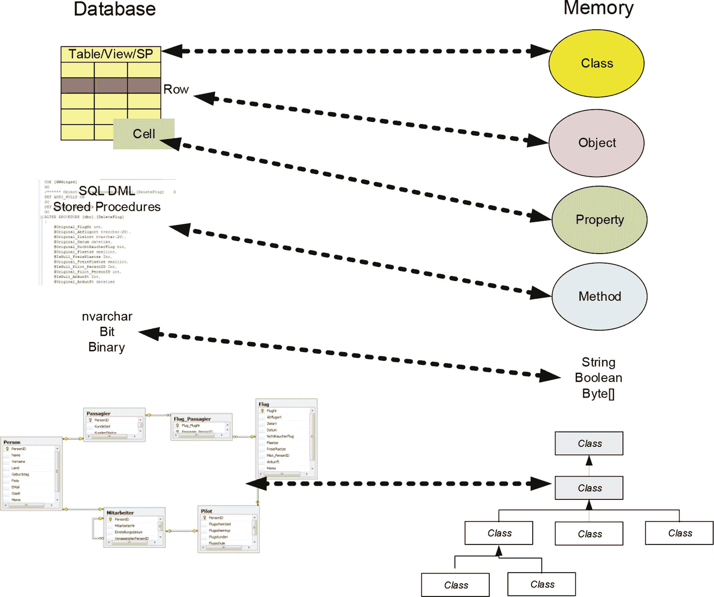
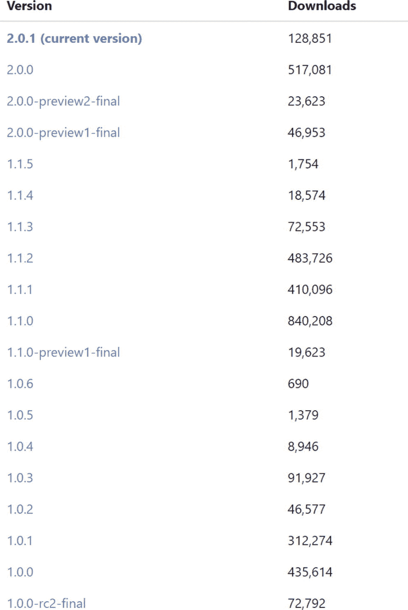
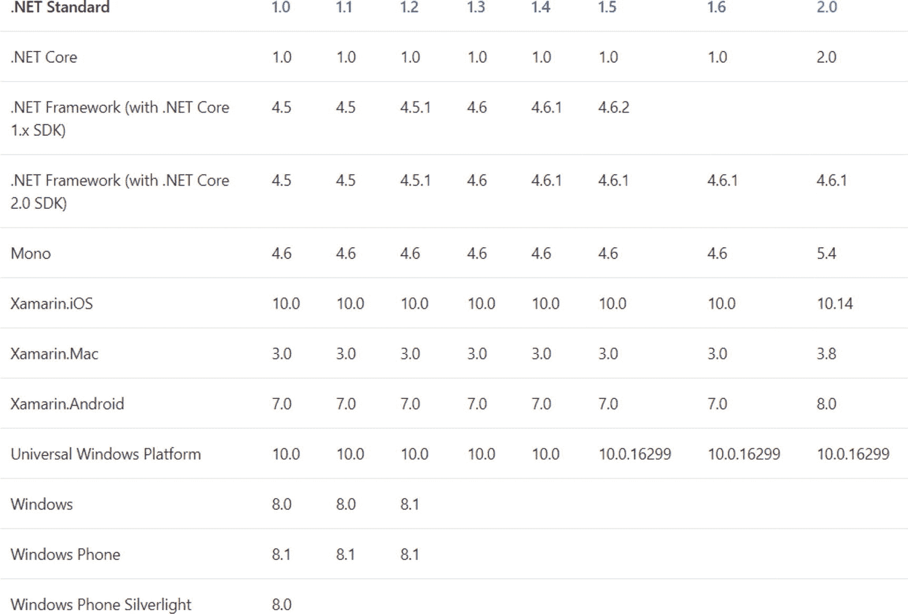
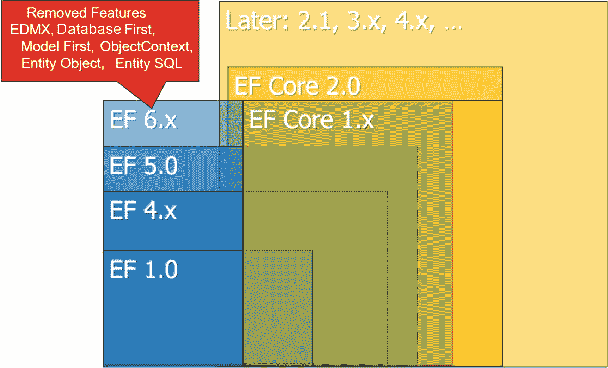

# 一、实体框架核心简介

在本章中，您将了解实体框架核心，以及它如何成为的或映射器。NET(。NET 框架，。NET Core、Mono 和 Xamarin)。实体框架核心是 ADO.NET 实体框架的全新实现。

与...一起。NET 核心 1.0 版和 ASP.NET 核心 1.0 版，实体框架核心 1.0 版于 2016 年 6 月 27 日发布。2017 年 8 月 14 日发布 2.0 版本。2.1 版本正在开发中。

## 什么是对象关系映射器？

在数据库世界中，关系数据库很普遍。编程世界都是关于对象的。两个世界存在显著的语义和句法差异，称为阻抗不匹配； [`https://en.wikipedia.org/wiki/Object-relational_impedance_mismatch`见](https://en.wikipedia.org/wiki/Object-relational_impedance_mismatch)。

将对象作为类的实例在内存中使用是面向对象编程(OOP)的核心。大多数应用还要求在对象中永久存储数据，尤其是在数据库中。基本上，有直接能够存储对象的面向对象数据库(OODBs ),但是 OODBs 到目前为止只有很小的分布。关系数据库更占优势，但是它们映射数据结构的方式不同于对象模型。

为了使面向对象系统中关系数据库的处理更加自然，软件行业多年来一直依赖于对象关系映射器。这些工具将面向对象世界中的概念，如类、属性或类之间的关系，转换成关系世界中相应的结构，如表、列和外键(见图 1-1 )。因此，开发人员可以留在面向对象的世界中，并指示 OR mapper 加载或存储关系数据库表中记录形式的某些对象。不太有趣的任务和容易出错的任务，比如手动创建`INSERT`、`UPDATE`和`DELETE`语句，也由 OR mapper 处理，进一步减轻了开发人员的负担。

图 1-1

The OR mapper translates constructs of the OOP world to the relational world

对象模型和关系模型之间两个特别显著的区别是 N:M 关系和继承。虽然在对象模型中，可以通过一组相互的对象来映射对象之间的 N:M 关系，但是在关系数据库中需要一个中间表。关系数据库不支持继承。有不同的复制方式，但是在本书的后面你会学到更多。

### 或者地图绘制者。网络世界

当. NET 开发人员从带有`DataReader`或`DataSet`的数据库中读取数据时，开发人员此时并没有进行对象关系映射。虽然`DataReader`和`DataSet`是。NET 对象，它们只管理表结构。从对象模型的角度来看，`DataReader`和`DataSet`是无类型的、非特定的容器。只有当开发人员为存储在表中的结构定义了特定的类并将内容从`DataSet`或`DataReader`复制到这些特定的数据结构中时，开发人员才是在执行或映射。这种“手动”对象关系映射对于读访问(尤其是对于非常宽的表)来说是耗时、乏味且单调的编程工作。如果您想再次保存对象中的更改，这项工作将成为一项智力挑战，因为您必须能够识别哪些对象已经被更改。否则，您必须不断地重新保存所有数据，这在多用户环境中是荒谬的。

虽然 OR mappers 在 Java 世界中已经建立了很长时间，但是微软在很长一段时间内都未能将合适的产品推向市场。的第一个版本。NET 没有包含 OR 映射器，而是将自己局限于 XML 文档和关系模型之间的直接数据访问和映射。英寸 NET 3.5 中，有一个名为 LINQ 到 SQL 的 OR 映射器，但它仅限于 Microsoft SQL Server，并且有许多其他限制。

很多。NET 开发人员因此开始用辅助库和工具来简化这项工作。除了众所周知的或为。NET，您会发现许多内部解决方案正在构建中。

以下是第三方或地图 for.NET(其中一些开源):

*   nhiberinated(无国籍人士)
*   Telerik 数据访问(又名开放访问)
*   基因组
*   LLBLGen Pro 公司
*   威尔逊
*   比音速稍慢的
*   OBJ.NET
*   DataObjects.NET
*   衣冠楚楚的
*   佩塔波
*   大量的
*   xpo 快递

有了 LINQ 到 SQL、ADO.NET 实体框架和实体框架，微软自己现在有了三个 ORM 产品。该软件公司同时宣布，进一步的开发工作将集中在实体框架核心。

## 实体框架核心的版本历史

图 1-2 显示了实体框架核心的版本历史。

图 1-2

Entity Framework Core version history ( [`https://www.nuget.org/packages/Microsoft.EntityFrameworkCore`](https://www.nuget.org/packages/Microsoft.EntityFrameworkCore) )

主要版本和次要版本(1.0、1.1 等)表示来自 Microsoft 的功能版本，修订版本(1.0.1、1.0.2 等)表示错误修复版本。这本书在讨论一个需要特定版本的函数时提到了最低版本。

Note

实体框架 Core 1.x 的实体框架核心工具于 2017 年 3 月 6 日发布，在实体框架 Core 1.1.1 和 Visual Studio 2017 的框架内。以前，这些工具只有“预览”版本。从 Entity Framework Core 2.0 开始，这些工具总是与新产品一起发布。

## 支持的操作系统

像核心产品家族中的其他产品一样，实体框架核心(以前的实体框架 7.0)是独立于平台的。已建立的对象关系映射器的核心版本不仅在“完整”上运行。NET 框架，但也在。NET Core 和 Mono，包括 Xamarin。这允许您在 Windows、Windows Phone/Mobile、Linux、macOS、iOS 和 Android 上使用实体框架核心。

## 支持。网络版本

实体框架核心 1.x 运行于。网芯 1.x，。NET Framework 4.5.1、Mono 4.6、Xamarin.iOS 10、Xamarin Android 7.0 或更高版本以及通用 Windows 平台(UWP)。

实体框架核心 2.0 是基于。NET Standard 2.0，因此需要下列之一。NET 实现(参见图 1-3 ):

图 1-3

Implementations of .NET Standard ( [`https://docs.microsoft.com/en-us/dotnet/standard/library`](https://docs.microsoft.com/en-us/dotnet/standard/library) )

*   。NET Core 2.0(或更高版本)
*   。NET Framework 4.6.1(或更高版本)
*   单声道 5.4(或更高)
*   Xamarin.iOS 10.14(或更高版本)
*   Xamarin。Mac 3.8(或更高版本)
*   Xamarin。Android 7.5(或更高版本)
*   UWP 10.0.16299(或更高)

Note

微软认为这种限制是合理的。NET 标准在实体框架 Core 2.0 中的 [`https://github.com/aspnet/Announcements/issues/246`](https://github.com/aspnet/Announcements/issues/246) 。除此之外，它可以显著减小 NuGet 包的大小。

## 支持的 Visual Studio 版本

要使用 Entity Framework Core 2.0/2.1，您需要 Visual Studio 2017 Update 3 或更高版本，即使您正在使用 classic 进行编程。NET Framework，因为只有此更新的 Visual Studio 才能识别。NET 标准 2.0 并理解这一点。NET Framework 4.6.1 和更高版本是。NET 标准 2.0。

## 支持的数据库

表 1-1 显示了实体框架核心支持的数据库管理系统，包括微软(SQL Server、SQL Compact 和 SQLite)和第三方供应商(PostgreSQL、DB2、Oracle、MySQL 等)的数据库管理系统。

在运行 Xamarin 或 Windows 10 UWP 应用的移动设备上，Entity Framework Core 1.x 只能处理本地数据库(SQLite)。随着……的引入。NET Standard 2.0，微软 SQL Server 客户端现在也可以在 Xamarin 和 Windows 10 UWP 上使用(从 2017 年秋季 Creators 更新开始)。

Entity Framework Core 1 . x/2 . x 版中尚未包含对 Redis、Azure 表存储等 NoSQL 数据库的计划支持，不过，GitHub 上有一个针对 MongoDB 的开源开发项目； [`https://github.com/crhairr/EntityFrameworkCore.MongoDb`见](https://github.com/crhairr/EntityFrameworkCore.MongoDb)。

表 1-1

Available Database Drivers for Entity Framework Core

<colgroup><col align="left"> <col align="left"> <col align="left"></colgroup> 
| 数据库ˌ资料库 | 公司/价格 | 统一资源定位器 |
| :-- | :-- | :-- |
| 搜寻配置不当的 | 微软/免费 | [`www.nuget.org/packages/Microsoft.EntityFrameworkCore.SqlServer`](http://www.nuget.org/packages/Microsoft.EntityFrameworkCore.SqlServer) |
| Microsoft SQL Server Compact 3.5 | 微软/免费 | [`www.nuget.org/packages/EntityFrameworkCore.SqlServerCompact35`](http://www.nuget.org/packages/EntityFrameworkCore.SqlServerCompact35) |
| Microsoft SQL Server Compact 4.0 | 微软/免费 | [`www.nuget.org/packages/EntityFrameworkCore.SqlServerCompact40`](http://www.nuget.org/packages/EntityFrameworkCore.SqlServerCompact40) |
| 数据库 | 微软/免费 | [`www.nuget.org/packages/Microsoft.EntityFrameworkCore.sqlite`](http://www.nuget.org/packages/Microsoft.EntityFrameworkCore.sqlite) |
| 在记忆中 | 微软/免费 | [`www.nuget.org/packages/Microsoft.EntityFrameworkCore.InMemory`](http://www.nuget.org/packages/Microsoft.EntityFrameworkCore.InMemory) |
| 关系型数据库 | 甲骨文/免费 | [`www.nuget.org/packages/MySQL.Data.EntityFrameworkCore`](http://www.nuget.org/packages/MySQL.Data.EntityFrameworkCore) |
| 一种数据库系统 | 开源团队 npgsql.org/free | [`www.nuget.org/packages/Npgsql.EntityFrameworkCore.PostgreSQL`](http://www.nuget.org/packages/Npgsql.EntityFrameworkCore.PostgreSQL) |
| DB2 | IBM/免费 | [`www.nuget.org/packages/EntityFramework.IBMDataServer`](http://www.nuget.org/packages/EntityFramework.IBMDataServer) |
| MySQL、Oracle、PostgreSQL、SQLite、DB2、Salesforce、Dynamics CRM、SugarCRM、Zoho CRM、QuickBooks、FreshBooks、MailChimp、ExactTarget、Bigcommerce、Magento | Devart/$99 到$299 每种驱动程序类型 | [`www.devart.com/purchase.html#dotConnect`](http://www.devart.com/purchase.html#dotConnect) |

Caution

由于提供程序接口中的重大更改，Entity Framework Core 1.x 提供程序与 Entity Framework Core 2.0 不兼容。所以，2.0 版需要新的提供者！

## 实体框架核心的特征

图 1-4 显示了与之前的实体框架(左侧区域)相比，实体框架核心(右侧区域)包含了一些新的特性。有些特性包含在实体框架 6.x 中，但不包含在实体框架核心 1.x/2.0 中。Microsoft 将在即将发布的 Entity Framework Core 版本中升级其中的一些功能，但不再添加新功能。

Note

如果你从这本书的网站上下载图片，你将能够根据颜色区分图片中的产品。

图 1-4

Functional scope of the classic Entity Framework compared to Entity Framework Core. On the left, a balloon shows some features that have been permanently eliminated.

### 已经取消的功能

传统实体框架中的以下功能已在实体框架核心中删除:

*   取消了流程模型数据库优先和模型优先。在 Entity Framework Core 中，只有基于代码的建模(以前称为 Code First)，通过它，您可以从数据库生成程序代码(逆向工程)，也可以从程序代码生成数据库(正向工程)。
*   实体数据模型(EDM)和 XML 表示(EDMX)已经被取消。到目前为止，在代码优先模型中，还在 RAM 内部生成了一个 EDM。这种开销也被消除了。
*   实体框架上下文的基类`ObjectContext`已被删除。只有基类`DbContext. DbContext`现在不再是实体框架核心中`ObjectContext`的包装器，而是一个全新的独立实现。
*   实体类的基类`EntityObject`已经被删除。实体类现在总是普通的旧 CLR 对象(POCOs)。
*   省略了查询语言实体 SQL (ESQL)。它支持 LINQ、SQL、存储过程(SPs)和表值函数(TVFs)。
*   不再提供自动模式迁移。模式迁移，包括数据库模式的创建，现在必须在开发时手动执行。在运行时，第一次访问数据库时，迁移仍然会发生。
*   过去有一些表和类型之间更复杂映射的场景。这包括每个类型的多个实体集(MEST，将不同的表映射到同一个实体)，以及继承层次结构中的按层次结构表(TPH)、按类型表(TPT)和按具体类型表(TPC)策略的组合。所有这些功能都已删除。

### 缺少关键功能

在实体框架核心路线图( [`https://github.com/aspnet/EntityFramework/wiki/Roadmap`](https://github.com/aspnet/EntityFramework/wiki/Roadmap) )中，微软开发人员 Rowan Miller 记录了即将升级的实体框架核心中缺少哪些功能。这并没有一个具体的时间表，但微软称其中一些功能是“关键的”

*   实体框架核心仅支持对表的访问，不支持对数据库中视图的访问。只有当您手动创建视图和程序代码并将视图视为表格时，您才能使用视图。
*   以前，存储过程只能用于查询数据(`SELECT`)，而不能用于插入(`INSERT`)、更新(`UPDATE`)和删除(`DELETE`)。
*   一些 LINQ 命令目前在 RAM 中执行，而不是在数据库中。这还包括`group by`操作符，这意味着数据库中的所有数据集都被读入 RAM 并在那里分组，这导致所有表的灾难性性能(除了非常小的表)。
*   实体框架核心 API 中既没有自动延迟加载，也没有显式重载。目前，开发人员只能直接加载链接的数据集(急切加载)或用单独的命令重新加载。
*   直接 SQL 和存储过程只有在返回实体类型时才能使用。还不支持其他类型。
*   现有数据库的反向工程只能从命令行或从 Visual Studio 中的 NuGet 控制台启动。基于 GUI 的向导消失了。
*   对于现有数据库，也没有“从数据库更新模型”命令；换句话说，在对数据库进行反向工程后，开发人员必须在对象模型中手动添加数据库模式更改，或者重新生成整个对象模型。这个函数在 Code First 中也不可用，只在 Database First 中可用。
*   没有复杂的类型，换句话说，类不代表它们自己的实体，而是另一个实体的一部分。

Preview

其中一些特性将在 2.1 版本中添加；参见附录 C 。

### 高优先级功能

在第二份清单中，微软称其他不认为重要的功能为“高优先级”:

*   到目前为止，还没有对象模型的图形可视化，这在以前的 EDMX 中是可能的。
*   一些以前存在的类型转换，比如 XML 和字符串之间的转换，现在还不存在。
*   尚不支持 Microsoft SQL Server 的地理和几何数据类型。
*   实体框架核心不支持 N:M 映射。到目前为止，开发人员必须用两个 1:N 映射和一个类似于数据库中中间表的中间实体来复制这一点。
*   尚不支持将每种类型的表作为继承策略。如果基类有一个`DBSet<T>`，实体框架核心使用 TPH 否则，它使用 TPC。您不能显式配置 TPC。
*   作为迁移的一部分，不可能用数据填充数据库(`seed()`功能)。
*   允许实体框架软件开发者在数据库中执行之前和之后操纵发送到数据库的命令的实体框架 6.0 命令拦截器还不存在。

微软高优先级列表中的一些项目也是 Entity Framework 6.x 本身(还)不掌握的新特性。

*   定义在快速加载中加载数据记录的条件(快速加载规则)
*   支持电子标签
*   支持非关系数据存储(NoSQL ),如 Azure 表存储和 Redis

这种优先顺序是从微软的角度来看的。根据我的实践经验，我会对一些要点进行不同的优先排序；例如，我会将 N:M 映射升级到 critical。通过对象模型中的两个 1:N 关系复制 N:M 是可能的，但是会使程序代码更加复杂。从现有的实体框架解决方案迁移到实体框架核心变得很困难。

这也适用于缺乏对每类型表继承的支持。同样，现有的程序代码必须进行大范围的修改。即使对于具有新数据库模式和前向工程的新应用，也存在一个问题:如果继承首先是通过 TPH 或 TPC 实现的，那么如果您以后想在 TPH 上下注，就必须费力地重新安排数据库模式中的数据。

微软的列表中还缺少验证实体等功能，当 RAM 中已经清楚实体不满足所需条件时，这些功能可以节省不必要的数据库往返。

Preview

其中一些特性将在 2.1 版本中添加；参见附录 C 。

### 实体框架核心中的新特性

实体框架核心相对于其前身具有以下优势:

*   Entity Framework Core 不仅可以在 Windows、Linux 和 macOS 上运行，还可以在运行 Windows 10、iOS 和 Android 的移动设备上运行。在移动设备上，当然只提供对本地数据库(比如 SQLite)的访问。
*   实体框架核心提供了更快的执行速度，尤其是在读取数据时(几乎与手动将数据从`DataReader`对象复制到类型化对象的性能相同。NET 对象)。
*   带有`Select()`的投影现在可以直接映射到实体类。匿名绕道。NET 对象不再是必要的。
*   批处理允许实体框架核心将`INSERT`、`DELETE`和`UPDATE`操作合并到一个数据库管理系统往返中，而不是一次发送一个命令。
*   反向工程和正向工程现在都支持数据库中列的默认值。
*   除了经典的自动增量值之外，现在还允许使用序列等新方法来生成密钥。
*   实体框架核心中的术语影子属性指的是现在可能对数据库表的列的访问，对于这些列，类中没有属性。

## 何时使用实体框架核心

考虑到这一长串缺失的特性，问题就出现了:是否以及何时可以使用 1.x/2.0 版中的实体框架核心。

主要的应用领域是目前还没有运行 Entity Framework 的平台:Windows Phone/Mobile、Android、iOS、Linux 和 macOS。

*   UWP 应用和 Xamarin 应用只能使用实体框架核心。经典的实体框架在这里是不可能的。
*   如果您想开发一个新的 ASP.NET 核心 web 应用或 web API，并且不希望它基于完整的。但在. NET Framework 上。NET 核心，没有办法用实体框架核心做到这一点，因为经典的实体框架 6.x 不能在。NET 核心。但是，在 ASP.NET 核心中，也可以使用。NET Framework 4.6.x/4.7.x 作为基础，这样你也可以使用 Entity Framework 6.x。
*   另一个推荐在 web 服务器上使用 Entity Framework Core 的场景是离线场景，在这种情况下，移动设备上应该有服务器数据库的本地副本。在这种情况下，您可以在客户机和服务器上使用相同的数据访问代码。客户端使用实体框架核心来访问 SQLite，web 服务器使用相同的实体框架核心代码来访问 Microsoft SQL Server。

对于其他平台上的项目，请注意以下几点:

*   将现有代码从 Entity Framework 6.x 迁移到 Entity Framework 核心是非常昂贵的。重要的是要考虑实体框架核心的改进特性和性能是否值得付出努力。
*   然而，在新的项目中，开发人员已经可以使用实体框架核心作为高性能的未来技术，并且如果必要的话，使用现有的实体框架作为现有差距的中间解决方案。