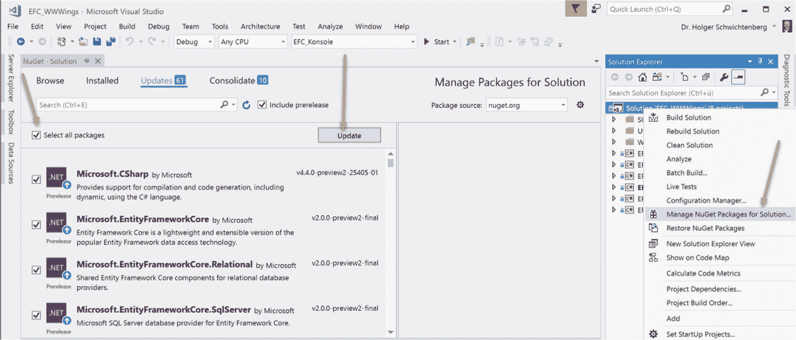

# 2.安装实体框架核心

实体框架核心没有`setup.exe`。实体框架核心通过 NuGet 包安装在项目中。

## NuGet 包

与经典的实体框架相比，实体框架核心由几个 NuGet 包组成。表 [2-1](#Tab1) 只显示了根包。NuGet 会自动将相关的包添加到它们的依赖项中，这里没有列出。如果您使用的是 ASP.NET 核心 Web 应用程序模板这样的项目模板，那么您可能已经包含了一些依赖项。

表 2-1

Main Packages Available on nuget.org for Entity Framework Core

<colgroup><col align="left"> <col align="left"> <col align="left"></colgroup> 
| 数据库管理系统 | 运行时需要 NuGet 包 | 在开发阶段获取逆向工程或模式迁移所需的包 |
| :-- | :-- | :-- |
| Microsoft SQL Server Express，Standard，Enterprise，Developer，LocalDB(从 2008 版开始) | `Microsoft.EntityFrameworkCore.SqlServer` | `Microsoft.EntityFrameworkCore.Tools` `Microsoft.EntityFrameworkCore.SqlServer`(针对 EF 核心 2.0) `Microsoft.EntityFrameworkCore.SQLServer.Design`(针对 EF 核心 1.x) |
| Microsoft SQL Server Compact 3.5 | `EntityFrameworkCore.SqlServerCompact35` | 无法使用 |
| Microsoft SQL Server Compact 4.0 | `EntityFrameworkCore.SqlServerCompact40` | 无法使用 |
| 数据库 | `Microsoft.EntityFrameworkCore.Sqlite` | `Microsoft.EntityFrameworkCore.Tools` `Microsoft.EntityFrameworkCore.Sqlite`(针对 EF 核心 2.0) `Microsoft.EntityFrameworkCore.Sqlite.Design`(针对 EF 核心 1.x) |
| 内存中 | `Microsoft.EntityFrameworkCore.InMemory` | 无法使用 |
| 一种数据库系统 | `Npgsql.EntityFrameworkCore.PostgreSQL` | `Microsoft.EntityFrameworkCore.Tools` `Npgsql.EntityFrameworkCore.PostgreSQL`(针对 EF 核心 2.0) `Npgsql.EntityFrameworkCore.PostgreSQL.Design`(针对 EF 核心 1.x) |
| 关系型数据库 | `MySQL.Data.EntityFrameworkCore` | `MySQL.Data.EntityFrameworkCore.Design` |
| Oracle (Devart 提供商) | `Devart.Data.Oracle.EFCore` | `Microsoft.EntityFrameworkCore.Tools` |

在 Entity Framework Core 版本中，微软改变了包的剪裁(就像在 alpha 和 beta 版本中所做的那样)，如图 [2-1](#Fig1) 所示。以前，每个车手都有两个包，其中一个名字里有 design。“设计”包被分解并集成到实际的驱动程序组件中。


图 2-1

In Entity Framework Core 2.0, Microsoft has integrated the classes of Microsoft.Entity FrameworkCore.SQL Server.Design.dll into Microsoft.EntityFrameworkCore.SqlServer.dll.

## 安装软件包

可以用 NuGet 包管理器(图 [2-2](#Fig2) 和 [2-3](#Fig3) 和 [2-4](#Fig4) )或者 Visual Studio 中的 PowerShell cmdlet `Install-Package`来安装这些包(图 [2-5](#Fig5) 和 [2-6](#Fig6) )。


图 2-2

Installing the driver for Microsoft SQL Server with the NuGet Package Manager GUI

在命令行中(选择 NuGet 软件包管理器控制台➤ PMC)，您可以安装当前的稳定版本以及与以下内容相关的依赖项:

```cs
Install-Package Microsoft.EntityFrameworkCore.SqlServer

```

您可以安装当前的预发行版本，包括:

```cs
Install-Package Microsoft.EntityFrameworkCore.SqlServer -Pre

```

您可以安装包含以下内容的特定版本:


图 2-5

Installing the Microsoft SQL Server driver with the NuGet Package Manager Console (shown here in version 1.1.2)


图 2-4

Installing Entity Framework Core 2.0 in a .NET Core 2.0 application includes a different set of dependencies


图 2-3

Installing Entity Framework Core 1.1.2 in a .NET Core 1.1 console

```cs
Install-Package Microsoft.EntityFrameworkCore.SqlServer version 2.0.0

```

您可以在 NuGet 软件包管理器控制台中使用以下命令列出软件包的所有可用版本:

```cs
(Find-Package Microsoft.Entity FrameworkCore.SqlServer -ExactMatch -allversions -includeprerelease).Versions | Format-Table Version, Release

```

您可以查看当前解决方案的项目中引用的包的版本，如下所示:


图 2-6

The Get-Package cmdlet shows that some projects have already been upgraded to Entity Framework Core 2.0, others not yet

```cs
(Get-Package Microsoft.EntityFrameworkCore.SqlServer) | Format-Table Projectname, id, Versions

```

## 更新到新版本

现有的项目通过 NuGet 包管理器升级到 Entity Framework Core 的新版本，无论是在图形化版本中还是在命令行中。

NuGet 包管理器 GUI 表明，当一个新的实体框架核心版本可用时，许多 NuGet 包将被更新。

Tip

由于 NuGet 包管理器有时会与许多更新“纠缠在一起”，你不应该一次更新所有的包，如图 [2-7](#Fig7) 所示。你应该只更新实际的根包，换句话说，就是带有期望的实体框架核心驱动的包(例如`Microsoft.EntityFrameworkCore.SqlServer`，如图 [2-8](#Fig8) 所示)。此软件包更新还需要更新其依赖项。



图 2-7

Graphical update of all NuGet packages (not recommended!)


图 2-8

It is better to choose only the root packages, in other words, the package with the database driver

这与命令行上的过程相对应，在命令行上，您不想键入所有包，而只想更新根包，例如，升级到 Entity Framework Core 2.0 时:

```cs
Update-Package Microsoft.EntityFrameworkCore.SqlServer version 2.0.0

```

Tip

如果您收到错误消息“无法安装软件包。' EntityFrameworkCore . SQL server 2 . 0 . 0 '。您正在尝试将此包安装到以“”为目标的项目中。NETFramework，Version=v4.x，但该包不包含任何与该框架兼容的程序集引用或内容文件，这可能有以下原因:


图 2-9

Error message when updating to Entity Framework Core 2.0

*   您正在使用与不兼容的 4.6.1 之前的. NET 版本。NET Standard 2.0，因此无法使用实体框架核心 2.0。
*   但是，如果错误消息中的版本号是 4.6.1 或更高(见图 [2-9](#Fig9) )，这是因为您使用的 Visual Studio 版本太旧。Entity Framework Core 2.0 只能从 Visual Studio 2015 Update 3 开始与一起使用。安装了网络核心。(就算用经典的。NET 框架，。NET Core 必须安装在开发系统上！)

Tip

从 Entity Framework Core 1.x 升级到版本 2.0 时，您需要手动删除对`Microsoft.EntityFrameworkCore.SQLServer.Design`的引用。

```cs
uninstall-package Microsoft.EntityFrameworkCore.SqlServer.Design

```

如果你也有一个包的参考`Microsoft.EntityFrameworkCore.Relational.Design`，然后删除它(图 [2-10](#Fig10) ):

```cs
uninstall-package Microsoft.EntityFrameworkCore.Relational.Design

```

在 Entity Framework Core 2.0 中，微软已经将带有后缀`.Design`的 NuGet 包的内容移到了没有这个后缀的同名包中。

如果您仍然有名为`Microsoft.AspNetCore...`的包，即使您没有使用基于 ASP.NET 核心的 web 应用程序，您也可以删除它们。这些参考是实体框架核心工具的第一个版本的遗留物:


图 2-10

Uninstalling the package Microsoft.EntityFrameworkCore.SqlServer.Design, which is no longer required in Entity Framework Core 2.0

```cs
uninstall-package Microsoft.AspNetCore.Hosting.Abstractions
uninstall-package Microsoft.AspNetCore.Hosting.Server.Abstractions
uninstall-package Microsoft.AspNetCore.Http.Abstractions
uninstall-package Microsoft.AspNetCore.Http.Feature
uninstall-package System.Text.Encodings.Web

```

Tip

有时 Visual Studio 会在一次更新后找不到同一解决方案中其他项目的编译输出(见图 [2-11](#Fig11) )。在这种情况下，在参考管理器中短暂停用该项目(参考➤添加参考)，然后直接再次选择它(见图 [2-12](#Fig12) )。


图 2-11

The project exists, but the compilation is not found


图 2-12

Removing and re-inserting the reference Tip

在. NET 标准库中，只有在设置为时，才能安装 Entity Framework Core 2.0。NET Standard 2.0 作为目标框架。否则，您将看到以下错误:“打包 Microsoft。EntityFrameworkCore . SQL server 2 . 0 . 0 与 netstandard1.6 不兼容(。NETStandard，版本=v1.6)。打包微软。EntityFrameworkCore . SQL server 2 . 0 . 0 支持:netstandard2.0(。NET 标准，版本=v2.0)。”同样，Entity Framework Core 2.0 不能在. NET Core 1.x 项目中使用，只能在中使用。NET Core 2.0 项目。项目可能需要提前升级(见图 [2-13](#Fig13) 和图 [2-14](#Fig14) )。


图 2-13

Updating the target framework to .NET Standard version 2.0 in the project settings


图 2-14

Updating the target framework to .NET Core version 2.0 in the project settings