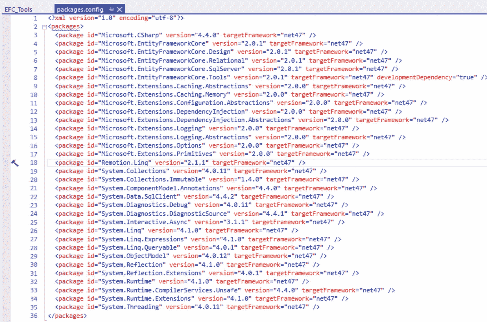
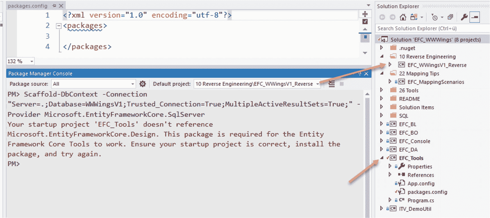
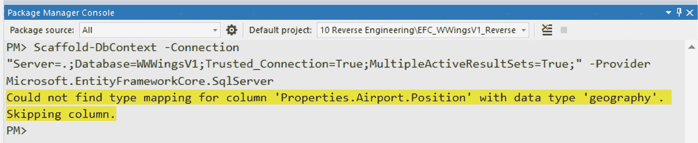
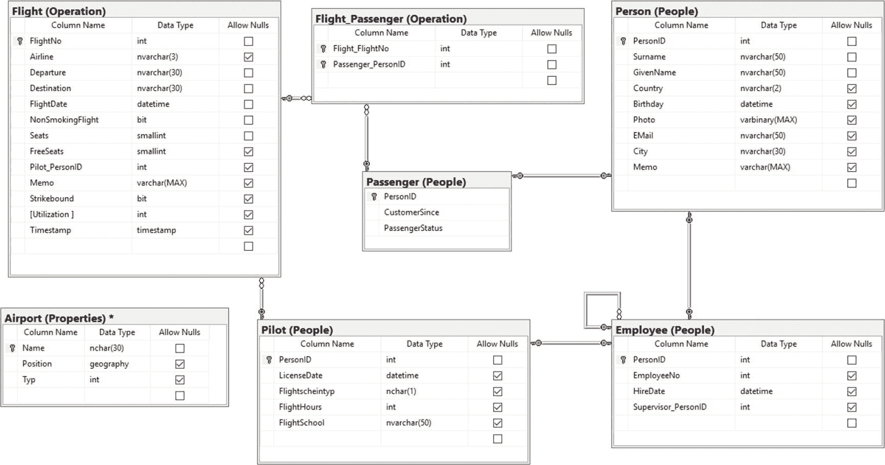
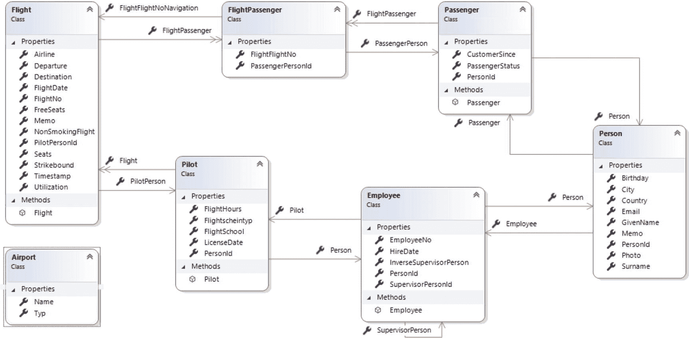
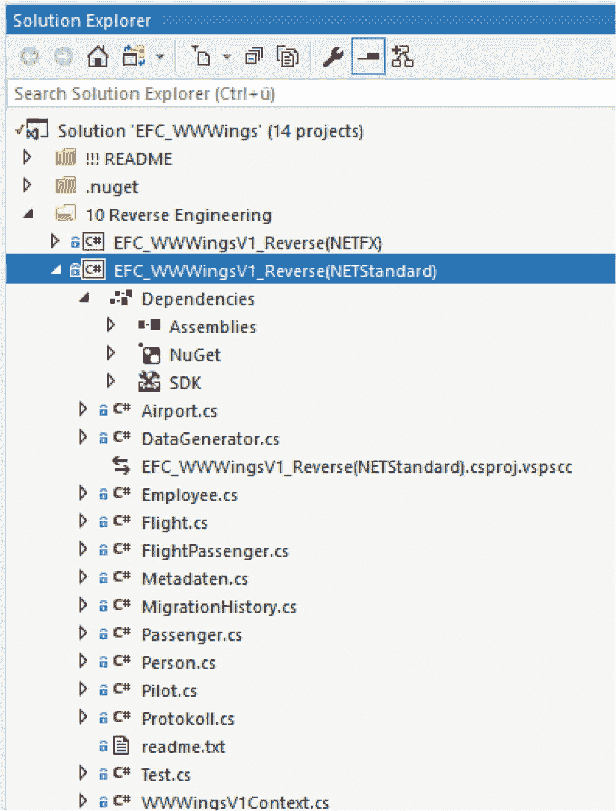
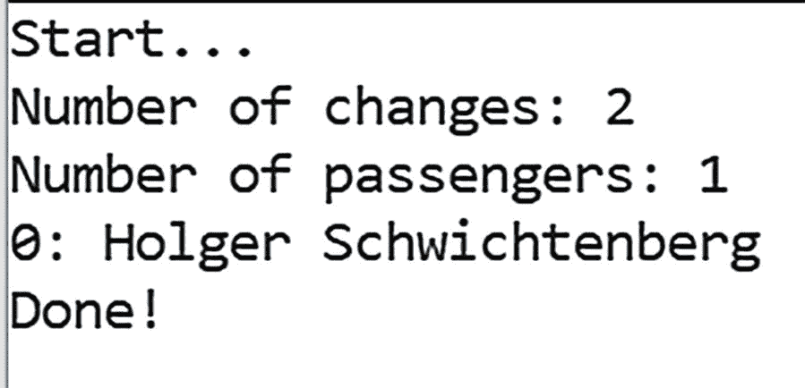
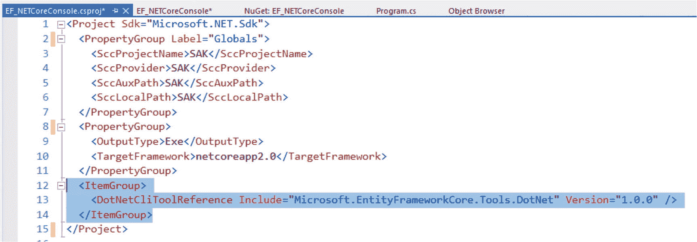
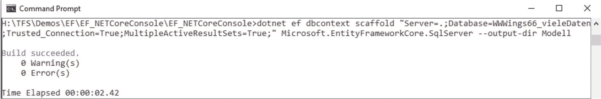

# 4.现有数据库的逆向工程(数据库优先开发)

本章讨论现有数据库的反向工程。反向工程是指从现有的数据库模式中创建对象模型。

本章介绍了更简单的版本 1 的万维网 Wings 数据库模式。您可以用 SQL 脚本`WWWings66.sql`安装这个数据库模式，它也提供数据(10，000 次航班和 200 名飞行员)。

## 使用逆向工程工具

这个过程没有现成的可视化工具，但是微软未来的版本可能会包含一些选项。在第 [19](19.html) 章，我将介绍一些额外的工具来帮助你完成这个过程，如下所述:

*   Visual Studio 开发环境中 NuGet 包管理器控制台(PMC)的 PowerShell cmdlets。这些命令不仅可以在中使用。净核心项目还要在“全”。NET 框架项目。
*   命令行。NET Core 工具(Windows 中称为`dotnet.exe`)，也可以独立于 Visual Studio 和 Windows 使用。但是，这仅适用于。NET Core 或基于 ASP.NET Core 的项目。

## 使用 PowerShell Cmdlets 进行反向工程

对于逆向工程，实体框架核心 2.0 中有两个相关的 NuGet 包。

*   在 Visual Studio 的当前启动项目中，开发时需要包`Microsoft.EntityFrameworkCore.Tools`。
*   在生成程序代码的项目中和在带有工具的项目中，需要每个实体框架核心数据库驱动程序的包(例如，`Microsoft.EntityFrameworkCore.SqlServer`或`Microsoft.EntityFrameworkCore.Sqlite`)。

Tip

虽然理论上可以只使用一个项目并包含两个包，但实际上您应该为实体框架核心工具创建自己的项目。目前，只使用实体框架核心工具。启动项目已完成，但仍未使用。或者，也可以在程序代码生成后卸载实体框架核心工具。这可以让你的项目更干净、更集中。

对于本章中的示例，继续创建这两个项目:

*   `EFC_Tools.csproj`只为工具而存在。此项目将是一个. NET Framework 控制台应用程序(EXE)。
*   程序代码在`EFC_WWWWingsV1_Reverse.csproj`中生成。该项目是一个. NET 标准 2.0 库，因此可以在。NET 框架以及。NET Core、Mono 和 Xamarin。

在这种情况下，您必须首先安装软件包，因此在`EFC_Tools.csproj`中执行以下操作:

```cs
Install-Package

Microsoft.EntityFrameworkCore.Tools Install-package Microsoft.EntityFrameworkCore.SqlServer

```

在`EFC_WWWingsV1_Reverse.csproj`中执行以下操作:

```cs
Install-package Microsoft.EntityFrameworkCore.SqlServer

```

或者对 SQLite 执行以下操作:

```cs
Install-package Microsoft.EntityFrameworkCore.Sqlite

```

Note

在 Entity Framework Core 1.x 中，还必须将包`Microsoft.EntityFrameworkCore.SqlServer.Design`或`Microsoft.EntityFrameworkCore.Sqlite.Design`包含在工具项目中。在实体框架核心 2.0 中不再需要这些包。

当您运行工具的包安装命令时，总共 33 个程序集引用将被添加到一个. NET 4.7 项目中(参见图 [4-1](#Fig1) )。在 Entity Framework Core 1.x 中，甚至有更多，包括 ASP.NET 核心程序集，即使你根本不在 ASP.NET 核心项目中。



图 4-1

The Microsoft.EntityFrameworkCore.Tools package will add 33 more packages!

如果在没有安装软件包的情况下执行代码生成命令，开发人员会在软件包管理器控制台中看到一个错误(参见图 [4-2](#Fig2) )。



图 4-2

Scaffold-DbContext without previous package installation

## 生成代码

然后，在通过`Scaffold-DbContext` cmdlet 安装了两个包之后，运行实际的代码生成，开发人员至少需要将数据库提供者的名称和一个连接字符串传递给 cmdlet。

```cs
Scaffold-DbContext -Connection "Server=DBServer02;Database=WWWings;Trusted_Connection=True;MultipleActiveResultSets=True;" -Provider Microsoft.EntityFrameworkCore.SqlServer

```

这个命令为在 NuGet 包管理器控制台中设置为当前目标项目的项目中的这个数据库中的所有表创建类。对于无法映射的数据库列，`Scaffold-DbContext`发出警告(见图 [4-3](#Fig3) )。



图 4-3

Scaffold-DbContext warns that a column of type Geography has been ignored

或者，可以使用一个模式或表来限制生成特定的数据库模式名或表名。对于这两个参数，您可以指定几个用分号分隔的名称。

```cs
Scaffold-DbContext -Connection "Server=DBServer02;Database=WWWWingsV1;Trusted_Connection=True;MultipleActiveResultSets=True;" -Provider Microsoft.EntityFrameworkCore.SqlServer -Tables Flight,Person,Pilot,Passenger,Airport,Employee,Flight_Passenger -force

```

您可以使用带有或不带有模式名的表名(换句话说，您可以使用`Flight`或`operation.Flight`)。但是要注意，如果一个同名的表存在于多个模式中，那么没有模式名的规范将为所有模式中同名的所有表生成实体类。

默认情况下，代码是在 NuGet 包管理器控制台中当前选择的项目的根目录中生成的，使用的是该项目的默认名称空间。通过参数`-Project`和`-OutputDir`，开发者可以影响项目和输出文件夹。不幸的是，使用现有的参数，不可能将实体类和上下文类的代码生成指向不同的项目。

关于图 [4-4](#Fig4) 所示的数据模型，`Scaffold-DbContext` cmdlet 现在生成以下输出:



图 4-4

Example database for the Word Wide Wings airline (version 1)

*   为六个表中的每一个生成一个 POCO 样式的实体类，包括 N:M 中间表`Flight_Passenger`，它总是消除对象模型中的经典实体框架。遗憾的是，实体框架核心 2.0 版还不支持 N:M 关系；它只是用两个 1:N 关系来复制它们，关系模型也是如此。
*   由基类`Microsoft.EntityFrameworkCore.DbContext`派生的上下文类被派生。与以前不同，这个类不再是`ObjectContext`类的包装器，而是一个全新的独立实现。这个类的名字可以被开发者用命令行参数`-Context`影响。不幸的是，在这里不可能指定名称空间。Visual Studio 通过“传入的上下文类名不是有效的 C#标识符”来确认在参数值中使用点。
*   如果不能为单个列生成代码，那么在包管理器控制台中将会有一个黄色的警告输出。例如，`Geometry`和`Geography`数据类型会发生这种情况，因为还不支持实体框架核心。

图 [4-5](#Fig5) 显示了从图 [4-4](#Fig4) 中为样本数据库生成的类，图 [4-6](#Fig6) 显示了对象模型。



图 4-6

Object model of the generated classes



图 4-5

Project with the generated classes for the sample database from Figure [4-4](#Fig4)

不幸的是，您不能给实体框架核心的代码生成器任何名称空间的设置；对于生成的实体类和上下文类，它总是使用项目的默认命名空间。因此，您应该在生成项目中设置默认的名称空间，以便它至少适合实体类。然后，您只需手动更改上下文类的名称空间。

与 ADO.NET 实体框架的逆向工程不同，实体框架核心不会自动将连接字符串包含在应用程序配置文件`app.config`或`web.config`中。连接字符串在生成后位于上下文类的`OnConfiguring()`方法中，由软件开发人员为其找到合适的可能的备份位置。

多元化(换句话说，将类名中的表名改为复数)不会发生。到目前为止，实体框架核心中还没有选项可以做到这一点；然而，这并不是一个很大的损失，因为多元化服务只适用于英文表名。

## 查看生成的程序代码

下面的清单显示了由`Scaffold-DbContext`为上下文类生成的程序代码，例如，为实体类`Flight`和`Passenger`生成的程序代码。

对象模型如何映射到数据库模式的定义在传统的实体框架中以三种方式继续:

*   实体框架核心自动应用的约定
*   由实体类及其成员应用的数据注释
*   在`DbContext`类的`OnModelCreating()`方法中使用的 Fluent API

实体框架核心工具生成的代码侧重于第三种方式。上下文类中的`OnModelCreating()`方法相应地充满了流畅的 API 调用。但是约定继续起作用，例如，标准中的类的属性与表中的列具有相同的名称。

到目前为止，Visual Studio 中经典实体框架的助手还使用了数据注释，现在已不再用于生成的程序代码中。如果想找回旧的行为，可以使用`Scaffold-DbContext`中的参数`-DataAnnotations`。

Fluent API 包含以下定义:

*   它使用`ToTable()`定义数据库中的表名，如果它们不同或者它们的模式名不同于`dbo`。
*   它使用`HasName()`定义主键列和索引的名称。
*   它定义列类型和列属性。NET 类型名称对于数据库管理系统中的一个数据类型来说不是唯一的，使用`HasColumnType()`、`IsRequired()`、`HasMaxLength()`。
*   它使用`HasDefaultValueSql()`或`HasDefaultValue()`定义列的默认值。
*   它使用`HasOne()`、`HasMany()`、`WithOne()`、`WithMany()`、`HasForeignKey()`和`HasConstraintName()`来定义表和它们的外键之间的基数。
*   它使用`HasIndex()`定义索引。
*   它决定在插入或修改实体框架核心记录后是否必须重新读取列的内容，因为它是由数据库管理系统使用`ValueGeneratedOnAddOrUpdate()`、`ValueGeneratedOnAdd()`和`ValueGeneratedNever()`生成的。
*   它使用`OnDelete()`设置级联删除设置。

在源代码中，Fluent API 配置是按类组织的，如下所示:

```cs
modelBuilder.Entity<Person>(entity => {...});

```

在这些方法调用中，您将找到这些表的各个列的配置。

```cs
entity.Property(e => e.PersonId)...

```

与以前的 ADO.NET 实体框架相比，有一些语法上的变化和改进。因此，索引配置现在更加简洁了。

以下特性就像经典的实体框架:

*   逆向工程代码生成器不会在实体类之间创建继承关系，即使这在乘客➤人、雇员➤人和飞行员➤人的情况下是可能的。相反，代码生成器总是生成关联和关联的导航属性。这种继承关系必须由开发人员稍后定义，然后移除导航属性。
    *   例如，实体类中的导航属性被声明为`virtual`，即使实体框架核心延迟加载还不支持`virtual`所必需的。
    *   例如，集合的导航属性用`ICollection<T>`声明，然后用新的`HashSet<T>()`填充到构造函数中。
*   对于每个实体类，在上下文类中都有一个`DbSet<T>`属性。

可以更改生成的源代码(参见清单 [4-1](#Par64) ，清单 [4-2](#Par65) ，清单 [4-3](#Par66) )，例如，如果您想在对象模型的数据库中拥有除列名之外的属性名。您可以使用 Fluent API 方法`HasColumnName("column name")`或数据注释`Column("column name")`来完成这项工作。

```cs
using System;
using Microsoft.EntityFrameworkCore;
using Microsoft.EntityFrameworkCore.Metadata;

namespace EFC_WWWingsV1_Reverse
{
    public partial class WWWingsV1Context : DbContext
    {
        public virtual DbSet<Airport> Airport { get; set; }
        public virtual DbSet<Employee> Employee { get; set; }
        public virtual DbSet<Flight> Flight { get; set; }
        public virtual DbSet<FlightPassenger> FlightPassenger { get; set; }
        public virtual DbSet<Metadaten> Metadaten { get; set; }
        public virtual DbSet<MigrationHistory> MigrationHistory { get; set; }
        public virtual DbSet<Passenger> Passenger { get; set; }
        public virtual DbSet<Person> Person { get; set; }
        public virtual DbSet<Pilot> Pilot { get; set; }
        public virtual DbSet<Protokoll> Protokoll { get; set; }
        public virtual DbSet<Test> Test { get; set; }

        protected override void OnConfiguring(DbContextOptionsBuilder optionsBuilder)
        {
            if (!optionsBuilder.IsConfigured)
            {
#warning To protect potentially sensitive information in your connection string, you should move it out of source code. See http://go.microsoft.com/fwlink/?LinkId=723263 for guidance on storing connection strings.
                optionsBuilder.UseSqlServer(@"Server=.;Database=WWWingsV1;Trusted_Connection=True;MultipleActiveResultSets=True;");
            }
        }

        protected override void OnModelCreating(ModelBuilder modelBuilder)

        {
            modelBuilder.Entity<Airport>(entity =>
            {
                entity.HasKey(e => e.Name);

                entity.ToTable("Airport", "Properties");

                entity.Property(e => e.Name)
                    .HasColumnType("nchar(30)")
                    .ValueGeneratedNever();
            });

            modelBuilder.Entity<Employee>(entity =>
            {
                entity.HasKey(e => e.PersonId);

                entity.ToTable("Employee", "People");

                entity.Property(e => e.PersonId)
                    .HasColumnName("PersonID")
                    .ValueGeneratedNever();

                entity.Property(e => e.HireDate).HasColumnType("datetime");

                entity.Property(e => e.SupervisorPersonId).HasColumnName("Supervisor_PersonID");

                entity.HasOne(d => d.Person)
                    .WithOne(p => p.Employee)
                    .HasForeignKey<Employee>(d => d.PersonId)
                    .OnDelete(DeleteBehavior.ClientSetNull)
                    .HasConstraintName("FK_MI_Employee_PE_Person");

                entity.HasOne(d => d.SupervisorPerson)
                    .WithMany(p => p.InverseSupervisorPerson)
                    .HasForeignKey(d => d.SupervisorPersonId)
                    .HasConstraintName("FK_Employee_Employee");

            });

            modelBuilder.Entity<Flight>(entity =>
            {
                entity.HasKey(e => e.FlightNo);

                entity.ToTable("Flight", "Operation");

                entity.Property(e => e.FlightNo).ValueGeneratedNever();

                entity.Property(e => e.Airline).HasMaxLength(3);

                entity.Property(e => e.Departure)
                    .IsRequired()
                    .HasMaxLength(30);

                entity.Property(e => e.Destination)
                    .IsRequired()
                    .HasMaxLength(30);

                entity.Property(e => e.FlightDate).HasColumnType("datetime");

                entity.Property(e => e.Memo).IsUnicode(false);

                entity.Property(e => e.PilotPersonId).HasColumnName("Pilot_PersonID");

                entity.Property(e => e.Timestamp).IsRowVersion();

                entity.Property(e => e.Utilization).HasColumnName("Utilization ");

                entity.HasOne(d => d.PilotPerson)
                    .WithMany(p => p.Flight)
                    .HasForeignKey(d => d.PilotPersonId)
                    .HasConstraintName("FK_FL_Flight_PI_Pilot");
            });

            modelBuilder.Entity<FlightPassenger>(entity =>
            {
                entity.HasKey(e => new { e.FlightFlightNo, e.PassengerPersonId })
                    .ForSqlServerIsClustered(false);

                entity.ToTable("Flight_Passenger", "Operation");

                entity.Property(e => e.FlightFlightNo).HasColumnName("Flight_FlightNo");

                entity.Property(e => e.PassengerPersonId).HasColumnName("Passenger_PersonID");

                entity.HasOne(d => d.FlightFlightNoNavigation)
                    .WithMany(p => p.FlightPassenger)
                    .HasForeignKey(d => d.FlightFlightNo)
                    .OnDelete(DeleteBehavior.ClientSetNull)
                    .HasConstraintName("FK_Flight_Passenger_Flight");

                entity.HasOne(d => d.PassengerPerson)
                    .WithMany(p => p.FlightPassenger)
                    .HasForeignKey(d => d.PassengerPersonId)
                    .OnDelete(DeleteBehavior.ClientSetNull)
                    .HasConstraintName("FK_Flight_Passenger_Passenger");
            });

            modelBuilder.Entity<Passenger>(entity =>
            {
                entity.HasKey(e => e.PersonId);

                entity.ToTable("Passenger", "People");

                entity.Property(e => e.PersonId)
                    .HasColumnName("PersonID")
                    .ValueGeneratedNever();

                entity.Property(e => e.CustomerSince).HasColumnType("datetime");

                entity.Property(e => e.PassengerStatus).HasColumnType("nchar(1)");

                entity.HasOne(d => d.Person)
                    .WithOne(p => p.Passenger)
                    .HasForeignKey<Passenger>(d => d.PersonId)
                    .OnDelete(DeleteBehavior.ClientSetNull)
                    .HasConstraintName("FK_PS_Passenger_PE_Person");
            });

            modelBuilder.Entity<Person>(entity =>
            {
                entity.ToTable("Person", "People");

                entity.Property(e => e.PersonId).HasColumnName("PersonID")

;

                entity.Property(e => e.Birthday).HasColumnType("datetime");

                entity.Property(e => e.City).HasMaxLength(30);

                entity.Property(e => e.Country).HasMaxLength(2);

                entity.Property(e => e.Email)
                    .HasColumnName("EMail")
                    .HasMaxLength(50);

                entity.Property(e => e.GivenName)
                    .IsRequired()
                    .HasMaxLength(50);

                entity.Property(e => e.Memo).IsUnicode(false);

                entity.Property(e => e.Surname)
                    .IsRequired()
                    .HasMaxLength(50);
            });

            modelBuilder.Entity<Pilot>(entity =>
            {
                entity.HasKey(e => e.PersonId);

                entity.ToTable("Pilot", "People");

                entity.Property(e => e.PersonId)
                    .HasColumnName("PersonID")
                    .ValueGeneratedNever();

                entity.Property(e => e.FlightSchool).HasMaxLength(50);

                entity.Property(e => e.Flightscheintyp).HasColumnType("nchar(1)");

                entity.Property(e => e.LicenseDate).HasColumnType("datetime");

                entity.HasOne(d => d.Person)

                    .WithOne(p => p.Pilot)
                    .HasForeignKey<Pilot>(d => d.PersonId)
                    .OnDelete(DeleteBehavior.ClientSetNull)
                    .HasConstraintName("FK_PI_Pilot_MI_Employee");
            });

        }
    }
}

Listing 4-1Generated Context Class

```

```cs
using System;
using System.Collections.Generic;

namespace EFC_WWWingsV1_Reverse
{
    public partial class Flight
    {
        public Flight()
        {
            FlightPassenger = new HashSet<FlightPassenger>();
        }

        public int FlightNo { get; set; }
        public string Airline { get; set; }
        public string Departure { get; set; }
        public string Destination { get; set; }
        public DateTime FlightDate { get; set; }
        public bool NonSmokingFlight { get; set; }
        public short Seats { get; set; }
        public short? FreeSeats { get; set; }
        public int? PilotPersonId { get; set; }
        public string Memo { get; set; }
        public bool? Strikebound { get; set; }
        public int? Utilization { get; set; }
        public byte[] Timestamp { get; set; }

        public Pilot PilotPerson { get; set; }
        public ICollection<FlightPassenger> FlightPassenger { get; set; }
    }
}

Listing 4-2Generated Entity Class Flight

```

```cs
using System;
using System.Collections.Generic;

namespace EFC_WWWingsV1_Reverse
{
    public partial class Passenger
    {
        public Passenger()
        {
            FlightPassenger = new HashSet<FlightPassenger>();
        }

        public int PersonId { get; set; }
        public DateTime? CustomerSince { get; set; }
        public string PassengerStatus { get; set; }

        public Person { get; set; }
        public ICollection<FlightPassenger> FlightPassenger { get; set; }
    }
}

Listing 4-3Generated Entity Class Passenger

```

## 查看示例客户端

清单 [4-4](#Par71) 中显示的程序使用了生成的实体框架上下文类和实体类`Passenger`。

所示的方法创建了一个新乘客，将该乘客附加到`DbSet<Passenger>`，然后使用`SaveChanges()`方法将新乘客存储在数据库中。

然后所有的乘客都要接受检查，他们的号码被打印出来。清单 [4-4](#Par71) 显示了名为 Schwichtenberg 的所有乘客的版本。然后在 RAM 中对先前装载的乘客上方的对象进行 LINQ 过滤。图 [4-7](#Fig7) 在屏幕上显示输出。

Note

本例中使用的命令在本书后面的章节中会有更详细的描述。然而，这个清单对于证明所创建的实体框架核心上下文类的功能是必要的。



图 4-7

Output of the sample client

```cs
public static void Run()
  {
   Console.WriteLine("Start...");
   using (var ctx = new WWWingsV1Context())
   {
    // Create Person object
    var newPerson = new Person();
    newPerson.GivenName = "Holger";
    newPerson.Surname = "Schwichtenberg";
    // Create Passenger object
    var newPassenger = new Passenger();
    newPassenger.PassengerStatus = "A";
    newPassenger.Person = newPerson;
    // Add Passenger to Context
    ctx.Passenger.Add(newPassenger);
    // Save objects
    var count = ctx.SaveChanges();
    Console.WriteLine("Number of changes: " + count);
    // Get all passengers from the database
    var passengerSet = ctx.Passenger.Include(x => x.Person).ToList();
    Console.WriteLine("Number of passengers: " + passengerSet.Count);
    // Filter with LINQ-to-Objects
    foreach (var p in passengerSet.Where(x=>x.Person.Surname == "Schwichtenberg").ToList())
    {
     Console.WriteLine(p.PersonId + ": " + p.Person.GivenName + " " + p.Person.Surname);
    }
   }
   Console.WriteLine("Done!");
   Console.ReadLine();
  }
Listing 4-4Program Code That Uses the Created Entity Framework Core Model

```

## 使用。网络核心工具 dotnet

发展的时候。NET 核心项目的命令行工具`dotnet`(也称为。NET 核心命令行界面[CLI])。NET Core SDK 可以作为 PowerShell cmdlet([`https://www.microsoft.com/net/download/core`](https://www.microsoft.com/net/download/core))的替代方案。与 PowerShell cmdlets 不同，`dotnet`不仅适用于 Windows，也适用于 Linux 和 macOS。

这种形式的生成适用于以下情况:

*   。NET 核心控制台应用程序
*   ASP.NET 核心项目基于。NET Core 或。NET Framework 4.6.2 和更高版本

首先，必须安装包`Microsoft.EntityFrameworkCore.Tools.DotNet`，这不能通过命令行工具，只能通过在基于 XML 的`.csproj`项目文件中手动输入(见图 [4-8](#Fig8) ):



图 4-8

Manual extension of the .csproj file

```cs
<ItemGroup>
   <DotNetCliToolReference Include="Microsoft.EntityFrameworkCore.Tools.DotNet"     Version="2.0.1" />
</ItemGroup>

```

然后，您必须添加以下包:

```cs
<ItemGroup>
    <PackageReference Include="Microsoft.EntityFrameworkCore.Design" Version="2.0.1" />
</ItemGroup>

```

但是，这也可以通过项目目录中的命令行来实现，如下所示:

```cs
dotnet add package Microsoft.EntityFrameworkCore.design

```

现在添加所需的实体框架核心提供者，如下所示:

```cs
dotnet add package Microsoft.EntityFrameworkCore.SqlServer

```

以下软件包在 Entity Framework Core 1.x 中也是必需的，但在 Entity Framework Core 2.0 中不再需要:

```cs
dotnet add package Microsoft.EntityFrameworkCore.SQL Server.design

```

然后就可以进行代码生成了(见图 [4-9](#Fig9) )。



图 4-9

Reverse engineering with dotnet.exe

```cs
dotnet ef dbcontext scaffold "server =.; Database = WWWings66; Trusted_Connection = True; MultipleActiveResultSets = True; "Microsoft.EntityFrameworkCore.SqlServer --output-dir model

```

Note

微软直到 2017 年 3 月 6 日才发布`dotnet.exe` 1.0 的最终版本，作为实体框架 Core 1.1.1 和 Visual Studio 2017 的一部分。以前，只有“预览”版本。这些预览版本使用了一个`project.json`文件。如果你仍然使用这种过时的格式，你不必在`.csproj`文件中做条目；你得在`project.json`档里做！

## 了解逆向工程的弱点

与传统的实体框架一样，您只能为带有主键的表创建实体类型。然而，复合主键对于实体框架核心来说不是问题。

Note

微软将在 2.1 版本中引入没有主键的表的映射；更多信息见附录 [C](23.html) 。

对于 SQL Server 2016 中添加的时态表(称为系统版本化表)，历史表不能使用实体框架核心进行映射。但是，对于实际的表来说，这已经是可能的了，因此只能通过 SQL 查询历史值，目前还不能通过 LINQ。

对于数据库视图和存储过程，与经典的实体框架相反，不能生成类和函数。

一旦使用实体框架核心命令行工具生成了对象模型，就不能对其进行更新。可用于“数据库优先”方法的“从数据库更新模型”命令目前尚未实现。您只能重新开始生成。如果要生成的类已经存在，cmdlet `Scaffold-DbContext`会报错。使用附加参数`-force`，cmdlet 将覆盖现有文件。但是，对源代码文件的任何手动更改都将丢失。

如果在一个新的`Scaffold-DbContext`命令中，您没有生成所有先前生成的表，而是只生成了几个选定的表，那么在上下文类中，所有现在不再生成的表都缺少`DbSet<T>`声明和 Fluent API 配置。同样，这也是生成一个项目的原因，然后您可以从该项目中将所需的生成部分复制到另一个项目中。然而，微软已经宣布(在 [`https://github.com/aspnet/EntityFramework/wiki/Roadmap`](https://github.com/aspnet/EntityFramework/wiki/Roadmap) )它计划改进工具，并提供一个从数据库特性更新的模型。

在此之前，这是最好的方法，至少可以限制在更改新表时产生的代码；对新的、已更改的或已删除的列的更改最好在源代码中手动完成。或者，在一个数据库的逆向工程之后，可以切换到正向工程；在这种情况下，更改将被记录在对象模型中，并用于生成更改数据库模式的 DDL 命令。