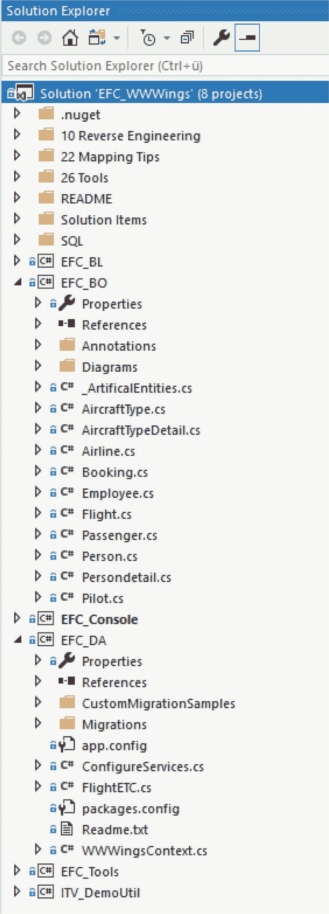

# 五、新数据库的正向工程

尽管 Entity Framework Core 支持现有数据库模型的逆向工程，但理想的流程模型是正向工程，其中数据库模型是从对象模型生成的。这是因为开发人员可以根据业务案例的需要来设计对象模型。

正向工程在经典的实体框架中有两种变体:模型优先和代码优先。在 Model First 中，您以图形方式创建一个实体数据模型(EDM)来生成数据库模式和。NET 类。在代码优先中，您直接编写类，从这些类中创建数据库模式。电火花是看不见的。在重新设计的实体框架核心中，只有第二种方法，但是不叫代码优先，而是基于代码的建模，不再使用不可见的 EDM。

## 两种类型的课程

实体框架核心中基于代码的建模通过以下两种类型的类实现:

*   您创建实体类，将数据存储在 RAM 中。您在实体类中创建导航属性，这些属性表示实体类之间的关系。这些通常是普通的旧 CRL 对象(POCOs ),每个数据库列都有属性。
*   您编写了一个表示数据库模型的上下文类(从`DbContext`派生而来)，每个实体都被列为一个`DBSet`。这将用于所有查询和其他操作。

理想情况下，这两种类型的类在不同的项目(DLL 程序集)中实现，因为实体类经常在软件架构的几层甚至所有层中使用，而上下文类是数据访问层的一部分，应该只由它上面的层使用。

## 本章中的示例

本章展示了如何在版本 2 中创建一个初步版本的 World Wide Wings 对象模型。最初，您将只考虑实体`Person`、`Employee`、`Pilot`、`Passenger`、`Flight`和`Booking`。您将只设置从对象模型创建数据库模式所需的最少选项。您将在接下来的章节中扩展和细化对象模型。你可以在解决方案`EFC_WWWings`中找到程序代码。实体类位于名为`EFC_BO_Step1`(用于业务对象)的 DLL 项目中，上下文类位于名为`EFC_DA_Step1`(用于数据访问)的 DLL 项目中。启动应用是控制台应用(`EFC_Konsole`)。这包括数据访问代码和屏幕输出。见图 5-1 。

Note

为了保持示例的简单性并专注于使用实体框架核心 API，我没有进一步描述业务逻辑，也没有在上下文类之上创建专用的数据访问层。这不是一个架构上的例子；这些类型的例子将在本书的后面介绍。



图 5-1

Solution for the example in this and the following chapters

## 自行创建实体类的规则

如前所述，实体类是 POCOs。换句话说，它们不必从基类继承或实现接口。但是，必须有一个无参数的构造函数，当数据库表行被具体化时，实体框架核心可以使用它来创建实例。

Note

本章最初只描述了实体类的典型基本配置。你会在第十二章中找到改编版本。

### NuGet 包

您不需要引用任何实体框架核心 NuGet 包来实现实体类。然而，使用数据注释如`[Key]`和`[StringLength]`需要参考经典中的`System.ComponentModel.Annotations.dll`。NET 框架或者 NuGet 包`System.ComponentModel.Annotations` ( [`https://www.nuget.org/packages/System.ComponentModel.Annotations`](https://www.nuget.org/packages/System.ComponentModel.Annotations) )中。NET 核心和。净标准。

### 数据注释属性

要在数据库表中创建的每一列都必须由一个属性表示。这些属性可以是带有`{get; set;}`的自动属性，也可以是带有 getter 和 setter 实现的显式属性(参见`Flight`类中的属性`Memo`)。一个类也可以拥有字段；但是，这些字段不会映射到列。换句话说，默认情况下，这些字段中的信息是不持久的。此外，没有 setter 的属性也不会被持久化，比如类`Person`中的属性`Fullname`。

### 数据类型

那个。允许使用网络原始数据类型(`String`、`DateTime`、`Boolean`、`Byte`、`Int16`、`Int32`、`Int64`、`Single`、`Double`、`Decimal`、`System.Guid`)。`Nullable<T>`可以指示数据库表格中的相应列可以留空(`NULL`)。也允许枚举类型；例如，参见`Pilot`类中的`PilotLicenseType`。数据类型`DbGeometry`和`DbGeography`，从版本 5.0 开始在经典的实体框架中被支持，不幸的是现在在实体框架核心中不存在。

### 关系(大纲-细节)

也可能有被声明为不同实体类型的属性。这些被称为导航属性，它们表达了两个实体类之间的关系。实体框架核心支持以下内容:

*   1:0/1 关系:在这里，属性被声明为相关类型的单个对象(参见`Flight`类中的`Pilot`和`Copilot`)。

Important

对于单个对象，在导航属性声明或构造函数中分配相关类型的实例在语义上是错误的，因为或映射器(如实体框架核心)会看到新的实体对象。只有当一个新的顶层对象总是需要一个新的子对象时，这种实例化才有意义。在`Flight`和`Pilot`的情况下，情况并非如此，因为没有为每次飞行设置新的飞行员。

*   1:0 / N 关系:在这里，属性被声明为相关类型的集合类型(参见`List<Flight>`中的`FlightAsPilotSet`和`Pilot`类中的`FlightAsCopilotSet`)。允许将导航属性声明为`ICollection`或基于它的任何其他接口(如`IList`)或声明为`ICollection<T>`类(如`List<T>`或`HashSet<T>`)。

Important

在声明或构造函数中直接指定具体的集合类型通常是一个好主意，这样调用程序代码就不必这样做了。实体框架核心处理关系修正中的集合实例化。因为这里只创建了一个空列表，所以只要列表没有被填充，实体框架核心就不想在这里保存任何东西。

Note

实体框架核心当前不支持 N:M 关系。更具体地说，Entity Framework Core 不支持用对象模型中的一个中间表作为 N:M 来表示两个 1:N 关系的抽象，关系数据库模型也不支持 N:M 关系；它需要一个用于两个 1:n 关系的中间表，其中中间表包含来自要连接的实体的主键的复合主键。在 Entity Framework Core 中，对象模型中的中间表有一个中间类，就像在关系模型中一样，有两个 1:N 关系，而不是 N:M 关系。这样的中间实体类可以在类预订中看到。它被类别`Flight`和类别`Passenger`中的预订集引用。

在经典的实体框架核心中，导航属性必须被标记为`virtual`，这样延迟加载才能工作。由于实体框架 Core 1.x/2.0 中没有惰性加载，所以不再需要这个版本。延迟加载将在实体框架核心的更高版本中出现；到目前为止，还不清楚微软是否会再次要求将此作为标签。但是现在将导航属性声明为`virtual`并无大碍。

导航属性可以是双向的，如实体类`Flight`和`Pilot`所示。导航属性的 0/1 页可以具有(但不需要)显式外键属性(参见`PilotId`和`CopilotId`)。

### 继承

实体类可以相互继承。这可以在类`Pilot`和`Passenger`中看到，它们继承自类`Person`。在本例中，`Person`是一个抽象类。但是它也可以是具有实例的类。

### 主关键字

实体框架核心的另一个先决条件是每个实体类必须有一个由一个或多个简单属性组成的主键(PK)。在最简单的情况下，根据惯例，您创建一个名为`ID`或`Id`或`classnameID`或`classnameId`的属性。ID 和类名的大小写敏感性在这里是不相关的，即使在 [`www.efproject.net/en/latest/modeling/keys.html`](http://www.efproject.net/en/latest/modeling/keys.html) 的实体框架核心仍然不完整的文档有不同的提示。

Note

如果你想重命名主键或者定义一个复合主键，那么你必须显式地配置它，你将在第十二章学到。

### 例子

清单 5-1 、 5-2 、 5-3 、 5-4 、 5-5 和 5-6 2 反映了部分 World Wide Wings 实例类。

```cs
using System;
using System.Collections.Generic;
using System.ComponentModel.DataAnnotations;
using System.ComponentModel.DataAnnotations.Schema;

namespace BO
{

 [Serializable]
 public class Flight
 {
  public Flight()
  {  }

  #region Key
  [Key]
  [DatabaseGenerated(DatabaseGeneratedOption.None)] // No identity column!
  public int FlightNo { get; set; }
  #endregion

  #region Primitive Properties
  [StringLength(50), MinLength(3)]
  public string Departure { get; set; }
  [StringLength(50), MinLength(3)]
  public string Destination { get; set; }

  [Column("FlightDate", Order = 1)]
  public DateTime Date { get; set; }
  public bool? NonSmokingFlight { get; set; }

  [Required]
  public short? Seats { get; set; }

  public short? FreeSeats { get; set; }

  public decimal? Price { get; set; }

  public string Memo { get; set; }

  #endregion

  #region Related Objects
  public Airline { get; set; }
  public ICollection<Booking> BookingSet { get; set; }
  public Pilot { get; set; }
  public Pilot Copilot { get; set; }

  // Explicit foreign key properties for the navigation properties
  public string AirlineCode { get; set; } // mandatory!
  public int PilotId { get; set; } // mandatory!
  public int? CopilotId { get; set; } // optional
  public byte? AircraftTypeID { get; set; } // optional
  #endregion

  public override string ToString()
  {
   return String.Format($"Flight #{this.FlightNo}: from {this.Departure} to {this.Destination} on {this.Date:dd.MM.yy HH:mm}: {this.FreeSeats} free Seats.");
  }

  public string ToShortString()
  {
   return String.Format($"Flight #{this.FlightNo}: {this.Departure}->{this.Destination} {this.Date:dd.MM.yy HH:mm}: {this.FreeSeats} free Seats.");

  }
 }
}

Listing 5-1Class Flight

```

```cs
using System;

namespace BO
{
 public class Person
 {
  #region Primitive properties
  // --- Primary Key
  public int PersonID { get; set; }
  // --- Additional properties
  public string Surname { get; set; }
  public string GivenName { get; set; }
  public Nullable<DateTime> Birthday { get; set; }
  public virtual string EMail { get; set; }
  // --- Relations
  public Persondetail Detail { get; set; } = new Persondetail(); // mandatory (no FK property!)
  #endregion

  // Calculated property (in RAM only)
  public string FullName => this.GivenName + " " + this.Surname;

  public override string ToString()
  {
   return "#" + this.PersonID + ": " + this.FullName;
  }
 }
}

Listing 5-2Class Person

```

```cs
using System;

namespace BO
{
 public class Employee : Person
 {
  public DateTime? HireDate;
  public float Salary { get; set; }
  public Employee Supervisor { get; set; }

  public string PassportNumber => this._passportNumber;
  private string _passportNumber;

  public void SetPassportNumber(string passportNumber)
  {
   this._passportNumber = passportNumber

;
  }
 }
}

Listing 5-3Class Employee

```

```cs
using System;
using System.Collections.Generic;
using System.ComponentModel.DataAnnotations;

namespace BO
{

 public enum PilotLicenseType
 {
  // https://en.wikipedia.org/wiki/Pilot_licensing_and_certification
  Student, Sport, Recreational, Private, Commercial, FlightInstructor, ATP
 }

 [Serializable]
 public partial class Pilot : Employee
 {
  // PK ist inherited from Employee

  #region Primitive
  public virtual DateTime LicenseDate { get; set; }
  public virtual Nullable<int> FlightHours { get; set; }

  public virtual PilotLicenseType
  {
   get;
   set;
  }
  [StringLength(50)]
  public virtual string FlightSchool
  {
   get;
   set;
  }
  #endregion

  #region Related Objects
  public virtual ICollection<Flight> FlightAsPilotSet { get; set; }
  public virtual ICollection<Flight> FlightAsCopilotSet { get; set; }
  #endregion
 }
}

Listing 5-4Class Pilot

```

```cs
using System;
using System.Collections.Generic;
using System.ComponentModel.DataAnnotations;

namespace BO
{
 public class PassengerStatus
 {
  public const string A = "A";
  public const string B = "B";
  public const string C = "C";
  public static string[] PassengerStatusSet = { PassengerStatus.A, PassengerStatus.B, PassengerStatus.C };
 }

 [Serializable]
 public partial class Passenger : Person
 {

  public Passenger()
  {
   this.BookingSet = new List<Booking>();
  }

  // Primary key is inherited!
  #region Primitive Properties
  public virtual Nullable<DateTime> CustomerSince { get; set; }

  [StringLength(1), MinLength(1), RegularExpression("[ABC]")]
  public virtual string Status { get; set; }
  #endregion

  #region Relations
  public virtual ICollection<Booking> BookingSet { get; set; }
  #endregion
 }
}

Listing 5-5Class Passenger

```

```cs
namespace BO
{
 /// <summary>
 /// Join class for join table
 /// </summary>
 public class Booking
 {
  // Composite Key: [Key] not possible, see Fluent API!
  public int FlightNo { get; set; }
  // Composite Key: [Key] not possible, see Fluent API!
  public int PassengerID { get; set; }

  public Flight { get; set; }
  public Passenger { get; set; }
 }
}

Listing 5-6Class Booking

```

## 自创建上下文类的规则

context 类是实体框架核心编程的关键，在实现它时需要遵循一些规则。

Note

本章仅描述了上下文类的典型基本配置。你会在第十二章中找到改编版本。

### 安装 NuGet 包

对于 context 类的实现，你需要一个 NuGet 包，用于你各自的数据库管理系统(见表 5-1 )。例如，在 NuGet 软件包管理器控制台中输入以下内容:

```cs
Install-Package Microsoft.EntityFrameworkCore.SqlServer

```

对于 SQLite，输入以下内容:

```cs
Install-Package Microsoft.EntityFrameworkCore.Sqlite

```

对于 Oracle，输入以下内容:

```cs
Install-Package Devart.Data.Oracle.EFCore

```

在传统的实体框架中，只需要引用两个程序集(并且这些引用必须手动创建)，而新的 NuGet 包(在核心产品模块化的意义上)包含了 32 个混杂的引用(参见项目`DAL`)，这是您不希望手动创建的。对于项目`BO`，不需要引用实体框架 DLL！

表 5-1

The Entity Framework Core Providers Available on nuget.org

<colgroup><col align="left"> <col align="left"></colgroup> 
| 数据库管理系统 | NuGet 包 |
| :-- | :-- |
| Microsoft SQL Server Express，标准版，企业版，开发版，LocalDB 2008+ | `Microsoft.EntityFrameworkCore.SqlServer` |
| Microsoft SQL Server Compact 3.5 | `EntityFrameworkCore.SqlServerCompact35` |
| Microsoft SQL Server Compact 4.0 | `EntityFrameworkCore.SqlServerCompact40` |
| 数据库 | `Microsoft.EntityFrameworkCore.sqlite` |
| 一种数据库系统 | `Npgsql.EntityFrameworkCore.PostgreSQL` |
| 在内存中(用于单元测试) | `Microsoft.EntityFrameworkCore.InMemory` |
| 关系型数据库 | `MySQL.Data.EntityFrameworkCore` |
| Oracle (DevArt) | `Devart.Data.Oracle.EFCore` |

### 基础类

上下文类不是 POCO 类。它必须从基类`Microsoft.EntityFrameworkCore.DbContext`继承。曾经存在于经典实体框架中的备选基类`ObjectContext`已经不存在了。

### 构造器

context 类必须有一个无参数的构造函数才能在 Visual Studio 或命令行中使用架构迁移工具，因为这些工具必须在设计时实例化 context 类。如果在应用启动时专门生成数据库模式，则不需要无参数构造函数。然后开发人员就有机会用构造函数参数调用上下文类。

Note

如果没有显式的构造函数，C# 会自动拥有一个无参数的构造函数。

### 对实体类的引用

开发人员必须为每个实体类创建一个类型为`DbSet<EntityType>`的属性，如下所示:

```cs
public DbSet<Flight> FlightSet {get; set; }
public DbSet<Pilot> PilotSet {get; set; }

```

Caution

默认情况下，实体框架核心使用此处显示的属性名作为数据库模式中的表名。你将在以后学习如何改变这种行为。

### 提供程序和连接字符串

要寻址的数据库的连接字符串必须在经典实体框架中通过构造函数传递给基类`DbContext`的本地实现。实体框架核心有一个不同的方法，即一个叫做`OnConfiguring()`的新方法，它必须被覆盖。该方法由实体框架核心调用，用于流程中上下文的第一次实例化。方法`OnConfiguring()`接收一个`DbContextOptionsBuilder`的实例作为参数。在`OnConfiguring()`中，然后调用`DbContextOptionsBuilder`实例上的扩展方法，该方法确定数据库提供者和连接字符串。要调用的扩展方法由实体框架核心数据库提供者提供。在 Microsoft SQL Server 的情况下，它被命名为`UseSqlServer()`,并期望连接字符串作为参数。将连接字符串移动到合适的位置(例如，配置文件)并从那里加载取决于您。

Note

虽然在代码中包含一个连接字符串对于实际项目来说是一个糟糕的做法，但这是让示例变得清晰的最佳解决方案。因此，本书中的许多清单将连接字符串保存在代码中。在实际项目中，您应该从配置文件中读取连接字符串。

外包配置数据的能力在很大程度上取决于项目的类型，像这里展示的解决方案不能在任何其他类型的项目中运行。对各种配置系统和相关 API 的处理不是本书的一部分。请参考上的基本文档。. NET。NET Core、UWP 和 Xamarin。

连接字符串必须包含`MultipleActiveResultSets = True`，否则实体框架核心在某些情况下可能无法正常工作；您将得到以下错误消息:“已经有一个打开的 DataReader 与此命令相关联，必须先将其关闭。”

```cs
builder.UseSqlServer(@"Server=MyServer;Database=MyDatabase;Trusted_Connection=True;MultipleActiveResultSets=True");

```

Attention

如果在`OnConfiguring()`中没有调用`UseXY()`方法，那么将出现以下运行时错误:“没有为此 DbContext 配置数据库提供程序。可以通过重写 DbContext 来配置提供程序。OnConfiguring 方法或通过在应用服务提供者上使用 AddDbContext。如果使用 AddDbContext，那么还要确保您的 DbContext 类型在其构造函数中接受 DbContext options<t context>对象，并将其传递给 DbContext 的基本构造函数。

### 看到一个例子

清单 5-7 显示了基本配置中的 World Wide Wings 示例的上下文类。

```cs
using BO;
using Microsoft.EntityFrameworkCore;

namespace DA
{
 /// <summary>
 /// EFCore context class for World Wings Wings database schema version 7.0
 /// </summary>
 public class WWWingsContext : DbContext
 {

  #region Tables
  public DbSet<Flight> FlightSet { get; set; }
  public DbSet<Pilot> PilotSet { get; set; }
  public DbSet<Passenger> PassengerSet { get; set; }
  public DbSet<Booking> BookingSet { get; set; }
  #endregion

  public static string ConnectionString { get; set; } =
  @"Server=.;Database=WWWingsV2_EN_Step1;Trusted_Connection=True;MultipleActiveResultSets=True;App=Entityframework";

  public WWWingsContext() { }

  protected override void OnConfiguring(DbContextOptionsBuilder builder)
  {
   builder.UseSqlServer(ConnectionString);
  }
 }

Listing 5-7Context Class

```

### 你自己的关系

`UseSqlServer()`和其他驱动程序也可以接收连接对象(类`DbConnection`的一个实例)而不是连接字符串。不一定要事先打开连接。可以打开它，然后使用现有的连接。实体框架核心上下文也不关闭它。如果没有打开，实体框架核心上下文将根据需要打开和关闭连接。

Best Practice

基本上，你应该远离实体框架核心连接管理！只有在非常特殊的情况下(例如，跨多个上下文实例的事务)，您才应该自己打开连接！

### 线程安全

`DbContext`类不是线程安全的，这意味着从`DbContext`继承的自己创建的上下文类在任何情况下都不能在几个不同的线程中使用。每个线程都需要自己的上下文类实例！忽视这一点的人会冒在实体框架核心中出现不可预测的行为和奇怪的运行时错误的风险！对于那些使用依赖注入的人来说，`DbContext`应该作为一个`Transient`对象。

Note

当然，这也适用于使用逆向工程生成的`DbContext`类。

## 数据库模式生成规则

实体框架代码然后从实体类和能够存储实体类的所有实例的上下文类生成数据库模式。数据库模式的结构基于约定和配置。这里适用先约定后配置的原则。

有许多惯例。以下是最重要的:

*   从每个实体类(在上下文类中有一个`DbSet<T>`)创建一个表。在经典的实体框架中，标准系统中实体类的类名是复数。在实体框架核心中，标准现在使用上下文类中的`DbSet<T>`属性的名称。
*   实体类中的每个基本属性都成为表中的一列。
*   名为`ID`的属性或名为`ID`的类自动成为具有自动增量值的主键。
*   对于导航属性的每 1/0 边，都会创建一个额外的外键列，即使没有显式的外键属性。
*   被命名为导航属性加上后缀`ID`的属性表示自动生成的外键列。
*   枚举类型成为数据库中的`int`列。

Note

虽然在许多情况下，这些约定足以从对象模型创建数据库模式，但在这种情况下，这些约定是不够的。不幸的是，在编译时您不会发现这一点；只有在执行使用 context 类的程序代码时，您才会发现它。

## 请看一个示例客户端

清单 5-8 中的程序现在使用创建的实体框架上下文类和实体类`Passenger`。首先，通过调用`EnsureCreated()`方法，程序确保数据库被创建，如果它还不存在的话。传统实体框架中已知的数据库初始化类不再存在于实体框架核心中。

此后，程序创建一个新乘客，将该乘客附加到`DbSet<Passenger>`，然后使用`SaveChanges()`方法将新乘客存储在数据库中。

然后所有的乘客都被装载，他们的号码被打印出来。最后，一个版本的所有乘客的名字 Schwichtenberg 如下。这种过滤随后在 RAM 中进行，并对先前装载的乘客上方的物体进行 LINQ。

Note

本例中使用的命令在本书后面的章节中会有更详细的描述。然而，这个讨论对于证明所创建的实体框架核心上下文类的功能是必要的。

不幸的是，这个例子还不能无错运行。在下一章，你将了解为什么会这样，以及如何解决这些问题。

```cs
using DA;
using BO;
using System;
using System.Linq;

namespace EFC_Console
{
 class SampleClientForward
 {
  public static void Run()
  {
   Console.WriteLine("Start...");
   using (var ctx = new WWWingsContext())
   {
    // Create database at runtime, if not available!
    var e = ctx.Database.EnsureCreated();
    if (e) Console.WriteLine("Database has been created!");
    // Create passenger object
    var newPassenger = new Passenger();
    newPassenger.GivenName = "Holger";
    newPassenger.Surname = "Schwichtenberg";
    // Append Passenger to EFC context
    ctx.PassengerSet.Add(newPassenger);
    // Save object
    var count = ctx.SaveChanges();
    Console.WriteLine("Number of changes: " + count);
    // Read all passengers from the database
    var passengerSet = ctx.PassengerSet.ToList();
    Console.WriteLine("Number of passengers: " + passengerSet.Count);
    // Filter with LINQ-to-Objects
    foreach (var p in passengerSet.Where(x => x.Surname == "Schwichtenberg").ToList())
    {
     Console.WriteLine(p.PersonID + ": " + p.GivenName + " " + p.Surname);
    }
   }
   Console.WriteLine("Done!");
   Console.ReadLine();
  }
 }

Listing 5-8Program Code That Uses the Created Entity Framework Core Model

```

## 通过 Fluent API(onmodelcreasing())进行适配

当您启动清单 5-8 中的程序代码时，`EnsureCreated()`方法首先会遇到以下运行时错误:“无法确定导航属性 Flight 所表示的关系。“Pilot”类型的“Pilot”。请手动配置该关系，或者使用“[NotMapped]”特性或使用“EntityTypeBuilder”忽略此属性。“OnModelCreating”中的“Ignore”。"

这样实体框架核心告诉你，在`Flight`和`Pilot`(带有属性`Pilot`和`Copilot`)双向关系的情况下，它不知道`Pilot`侧的两个导航属性(`FlightsAsPilotSet`和`FlightAsCopilotSet`)中的哪一个对应于`Flight`侧的导航属性`Pilot`和`Copilot`。

为了澄清这一点，在实体框架核心中有所谓的 Fluent API，它在经典的实体框架中首先在代码中可用。Fluent API 由方法`protected override void OnModelCreating` ( `ModelBuilder modelBuilder`)组成，该方法将在上下文类中被覆盖。在`modelBuilder`对象上，然后在方法的调用链中进行配置。

```cs
protected override void OnModelCreating(ModelBuilder builder)
{
...
}

```

在`Pilot`和`Flight`是双向关系的情况下，在`OnModelCreating()`中要输入以下两个方法链，其中飞行员明确关联`FlightAsPilot`，而`Copilot`关联`FlightAsCopilot`:

```cs
modelBuilder.Entity<Pilot>().HasMany(p => p.FlightAsPilotSet).WithOne(p => p.Pilot).HasForeignKey(f => f.PilotId).OnDelete(DeleteBehavior.Restrict);
modelBuilder.Entity<Pilot>().HasMany(p => p.FlightAsCopilotSet).WithOne(p => p.Copilot).HasForeignKey(f => f.CopilotId).OnDelete(DeleteBehavior.Restrict);

```

使用`.OnDelete(DeleteBehavior.Restrict)`，您关闭了级联删除，这在这种情况下没有意义。

如果您随后再次启动程序，您会得到运行时错误“实体类型”BO。“预订”需要定义一个密钥。实体框架核心不知道中间类 booking 中的主键是什么，因为按照约定，那里没有可以作为主键的属性。应该有一个复合主键。因此，您必须在 Fluent API 中添加以下内容:

```cs
modelBuilder.Entity<Booking>().HasKey(b => new { b.FlightNo, b.PassengerID });

```

实体框架仍然不满意，并在程序下一次启动时抱怨类`Flight`、`Passenger`和`staff`中缺少主键。在`Flight`中，这一点很清楚，因为`FlightNr`不符合约定(即`FlightID`)。因此，添加以下内容:

```cs
modelBuilder.Entity<Flight>().HasKey(x => x.FlightNo);

```

然而，乘客和雇员继承基类`Person`的主键`PersonID`。不幸的是，实体框架核心不够聪明，没有注意到这一点。所以也要补充一下。

```cs
modelBuilder.Entity<Employee>().HasKey(x => x.PersonID);
modelBuilder.Entity<Passenger>().HasKey(x => x.PersonID);

```

这样，程序代码终于可以执行了！

现在问题来了，为什么实体框架 Core 不抱怨`Pilot`没有主键。这是因为实体框架核心在数据库中映射继承的方式。飞行员不是存储在单独的表中，而是与雇员存储在同一个表中。因此，实体框架核心不会为飞行员抱怨。

清单 5-9 显示了上下文类的改进版本。有了这个版本，程序现在可以按预期执行了。图 5-2 显示输出。


图 5-2

Output of the sample client using the improved context class (in a .NET Core console app)

```cs
using BO;
using Microsoft.EntityFrameworkCore;

namespace DA
{

 /// <summary>
 /// EFCore context class for World Wings Wings database schema version 7.0
 /// </summary>
 public class WWWingsContext : DbContext
 {

  #region Tables
  public DbSet<Flight> FlightSet { get; set; }
  public DbSet<Passenger> PassengerSet { get; set; }
  public DbSet<Pilot> PilotSet { get; set; }
  public DbSet<Booking> BookingSet { get; set; }
  #endregion

  public static string ConnectionString { get; set; } =
  @"Server=.;Database=WWWingsV2_EN_Step1;Trusted_Connection=True;MultipleActiveResultSets=True;App=Entityframework";

  public WWWingsContext() { }

  protected override void OnConfiguring(DbContextOptionsBuilder builder)
  {
   builder.UseSqlServer(ConnectionString);
  }

  protected override void OnModelCreating(ModelBuilder modelBuilder)

  {
   #region Configure the double relation between Flight and Pilot
   // fix for problem:  "Unable to determine the relationship represented by navigation property Flight.Pilot' of type 'Pilot'. Either manually configure the relationship, or ignore this property using the '[NotMapped]' attribute or by using 'EntityTypeBuilder.Ignore' in 'OnModelCreating'."
   modelBuilder.Entity<Pilot>().HasMany(p => p.FlightAsPilotSet).WithOne(p => p.Pilot).HasForeignKey(f => f.PilotId).OnDelete(DeleteBehavior.Restrict);
   modelBuilder.Entity<Pilot>().HasMany(p => p.FlightAsCopilotSet).WithOne(p => p.Copilot).HasForeignKey(f => f.CopilotId).OnDelete(DeleteBehavior.Restrict);
   #endregion

   #region Composite key for BookingSet
   // fix for problem: 'The entity type 'Booking' requires a primary key to be defined.'
   modelBuilder.Entity<Booking>().HasKey(b => new { FlightNo = b.FlightNo, PassengerID = b.PassengerID });
   #endregion

   #region Other Primary Keys
   // fix for problem: 'The entity type 'Employee' requires a primary key to be defined.'
   modelBuilder.Entity<Employee>().HasKey(x => x.PersonID);

   // fix for problem: 'The entity type 'Flight' requires a primary key to be defined.'
   modelBuilder.Entity<Flight>().HasKey(x => x.FlightNo);

   // fix for problem: 'The entity type 'Passenger' requires a primary key to be defined.'
   modelBuilder.Entity<Passenger>().HasKey(x => x.PersonID);
   #endregion

   base.OnModelCreating(modelBuilder);
  }
 }
}

Listing 5-9Improved Version of the Context Class

```

## 查看生成的数据库模式

图 5-3 显示了生成的数据库。


图 5-3

The resulting database model

如您所见，实体框架核心仅从六个实体类(`Person`、`Employee`、`Pilot`、`Passenger`、`Flight`和`Booking`)中生成数据库中的四个表。实体框架核心混合了每个具体类型的继承映射策略表(TPC)和每个层次的继承映射策略表(TPH)。

*   没有表`Person`。抽象实体类`Person`的所有属性已经被移动到`Passenger`和`Employee`表中。
*   根据 TPH 原则，表`Employee`还包括实体类`Pilot`的实例。有一个列`Discriminator`，它自动用值`Pilot`或`Employee`填充实体框架核心。

到目前为止，使用实体框架核心的开发人员对继承映射策略的影响非常小。你只能间接影响 TPC 和 TPH 之间的决策。如果在 context 类中有一个`DbSet<Person>`和`DbSet<Employee>`，那么实体框架核心将完全应用层次表(TPH)策略，换句话说，从`Person`、`Employee`、`Pilot`和`Passenger`中只生成一个表。那么就不需要在 Fluent API 中为员工和乘客制定明确的键规范！

Note

实体框架核心中尚不存在按类型分类的表(TPT)继承映射策略。

与经典的实体框架一样，实体框架核心为所有主键和外键创建索引。与经典的实体框架一样，实体框架核心将标准中的字符串列设置为`nvarchar(max)`。这个还是需要调整的。比经典实体框架更好的是，实体框架核心创建数据类型为`DateTime2(7)`的日期列，而不是像以前那样创建数据类型为`DateTime`的日期列。因此，问题不再在于。SQL Server 1 . 1 . 1601 版之前拒绝净有效日期。