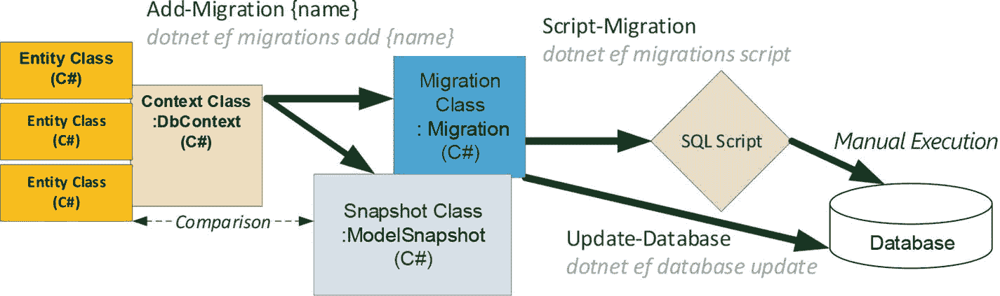
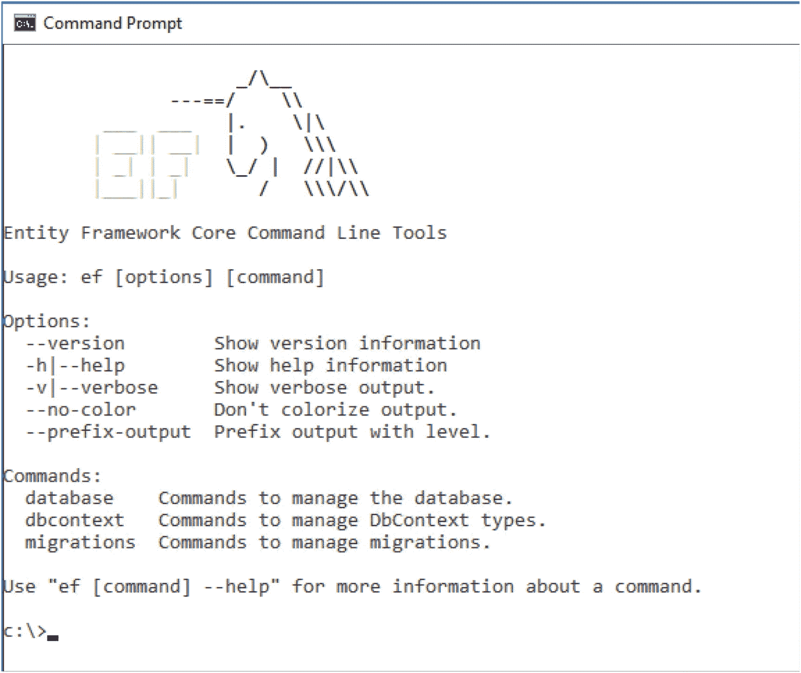
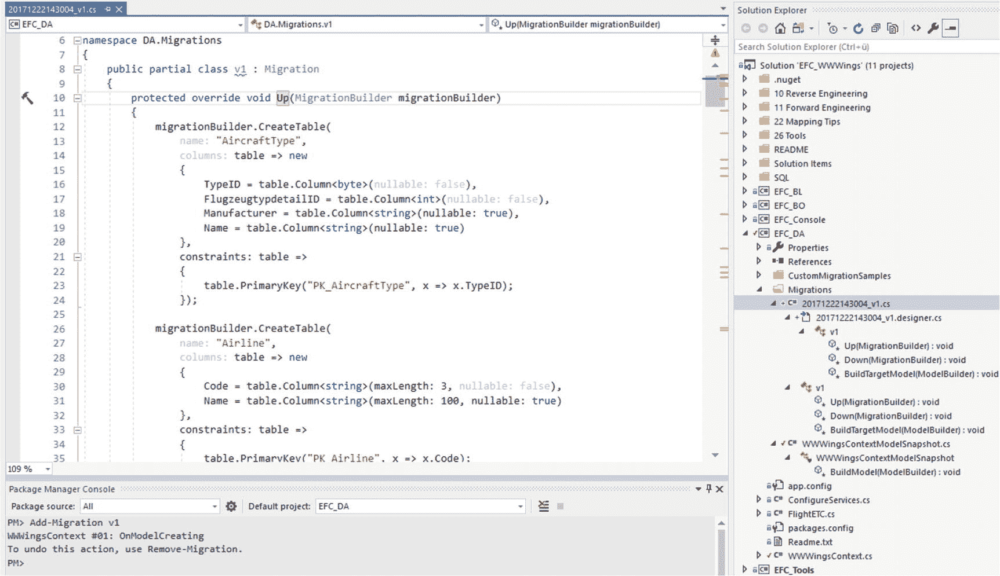
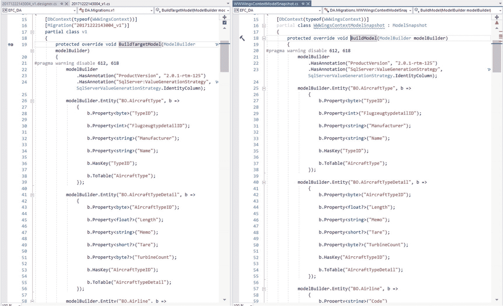
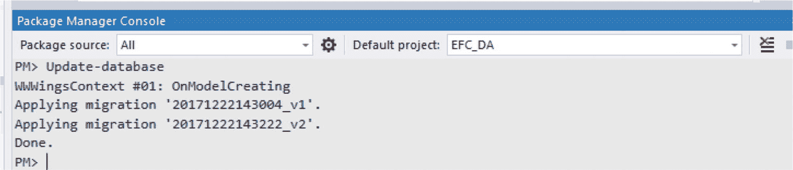
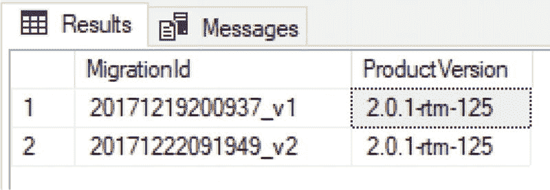

# 7.数据库模式迁移

Entity Framework Core 包含一些工具，用于在应用程序开发或运行时从对象模型创建数据库，以及更改现有数据库的模式(在简单的情况下不会丢失数据)。

默认情况下，实体框架核心在启动时假设要寻址的数据库存在，并且处于正确的模式版本中。没有检查看看这是否真的是真的。例如，如果缺少表或列，或者不存在预期的关系，则在访问数据库中的对象时会出现运行时错误(例如，“无效的对象名' AircraftType '”)。

## 在运行时创建数据库

程序启动时，可以调用 context 类的`Database`子对象中的`EnsureCreated()`方法(见清单[7-1](#Par7))；如果不存在完整的数据库，这种方法将创建完整的数据库，并创建带有相关键和索引的表。

但是，如果数据库已经存在，`EnsureCreated()`就让它保持原样。然后，方法`EnsureCreated()`不检查数据库模式是否正确，即它是否对应于当前的对象模型。相反，`EnsureCreated()`使用以下命令:

```cs
IF EXISTS (SELECT * FROM INFORMATION_SCHEMA.TABLES WHERE TABLE_TYPE = 'BASE TABLE') SELECT 1 ELSE SELECT 0

```

这将检查数据库中是否有任何表。如果没有表，则创建所有表。然而，只要数据库中有任何表，什么都不会发生，程序就会在运行时失败。下一节将描述模式迁移，您将获得更多的“智能”。

```cs
using DA;
using ITVisions;
using Microsoft.EntityFrameworkCore;

namespace EFC_Console
{
 class CreateDatabaseAtRuntime
 {
  public static void Create()
  {
   CUI.MainHeadline("----------- Create Database at runtime");
   using (var ctx = new WWWingsContext())
   {
    // GetDbConnection() requires using Microsoft.EntityFrameworkCore !
    CUI.Print("Database: " + ctx.Database.GetDbConnection().ConnectionString);
    var e = ctx.Database.EnsureCreated();
    if (e)
    {
     CUI.Print("Database has been created");
    }
    else
    {
     CUI.Print("Database exists!");
    }
   }
  }
 }
}

Listing 7-1Using EnsureCreated()

```

## 开发时的模式迁移

在经典实体框架的 4.3 版本中，微软引入了模式迁移。这些模式迁移现在(略有不同)也可以在实体框架核心中使用。

模式迁移允许您执行以下操作:

*   以后更改数据库模式，同时保留现有数据
*   如有必要，取消更改
*   在开发时或应用程序启动时运行迁移

## 用于模式迁移的命令

与传统的实体框架一样，没有用于执行迁移的图形用户界面(GUI)。相反，您可以通过 Visual Studio 的包管理器控制台中的 PowerShell cmdlet 或外部命令行工具`dotnet.exe`(或其他操作系统上的`dotnet`)在命令行界面中执行所有操作。

要使用这些命令，请安装一个 NuGet 包。

```cs
Install-Package Microsoft.EntityFrameworkCore.Tools

```

不幸的是，这个包在项目中引入了许多新的程序集引用，这些引用在以后的运行时是不需要的。然而，由于 NuGet 包只在应用程序的启动项目中需要，而在其他项目中不需要，所以有一个简单的解决方案可以避免实际的启动项目膨胀。请遵循以下步骤:

1.  创建一个新的控制台应用程序项目，比如使用名称`EFC_Tools`。
2.  安装实体框架核心工具包(`Microsoft.EntityFrameworkCore.Tools`)。
3.  从`EFC_Tools`项目中，引用上下文类所在的项目。
4.  将此`EFC_Tools`项目作为启动项目。
5.  在此执行所需的迁移命令。
6.  再次更改启动项目。

如果您使用参数`-startupproject`指定启动项目在 cmdlets 中应该是什么，您可以避免更改启动项目。

Note

项目`EFC_Tools`不需要在以后部署给用户。

与传统的实体框架相比，微软已经改变了在实体框架核心中创建和使用模式迁移的过程的一些细节。开始时不需要运行`Enable-Migrations`命令；可以用`Add-Migration`直接启动项目。`Command-Enable-Migrations`命令仍然存在，但它只返回以下消息:“Enable-Migrations 已过时。使用`Add-Migration`开始使用迁移。”不调用`Add-Migration`的自动迁移在实体框架核心中不再可用。如前所述，使用`Update-Database`更新数据库。如果您更喜欢自己执行的 SQL 脚本，现在您将通过`Script-Migration`而不是`Update-Database`脚本接收它(参见图 [7-1](#Fig1) )。



图 7-1

Flow of schema migration in the Entity Framework Core

## ef.exe

在内部，PowerShell cmdlets 使用一个名为`ef.exe`(实体框架核心命令行工具)的经典命令行实用程序，它是 NuGet 包`Microsoft.EntityFrameworkCore.Tools`的一部分，位于`Tools`文件夹中。图 [7-2](#Fig2) 显示了该命令的帮助。



图 7-2

Help for ef.exe

## 添加-迁移

对于实体框架核心，您可以在 Visual Studio 中使用 PowerShell cmdlet `Add-Migration`启动模式迁移(甚至是第一次)。这是通过 NuGet 软件包管理器控制台(PMC)完成的。

1.  实体框架核心工具实际上安装在当前的启动项目中。
2.  该项目被选为上下文类所在的默认项目。
3.  所有项目都可以在解决方案中编译。

与所有 PowerShell cmdlets 一样，cmdlet 名称的大小写无关。为了方便起见，每个项目中应该只有一个上下文类。否则，实体框架核心工具不知道指的是哪个上下文类(您将得到以下错误消息:“找到了多个 DbContext。指定要使用哪一个。对 PowerShell 命令使用'- context '参数，对 dotnet 命令使用'-Context '参数。).您必须通过为每个命令指定附加参数`-Context`来解决这个问题。

您必须指定一个可自由选择的名称，例如`Add-Migration v1`。在包管理器控制台中执行该命令会在上下文类的项目中创建一个包含三个文件和两个类的`Migrations`文件夹(参见图 [7-3](#Fig3) )。

*   按照`Add-Migration`中指定的名称创建一个类。这个类有两个文件，一个增加了`.designer`。这些文件的名称中还带有时间戳，表示迁移的创建时间。这个类继承自基类`Microsoft.EntityFrameworkCore.Migrations.Migration`。它在下文中被称为迁移类。
*   创建一个类，它采用上下文类的名称加上`ModelSnapshot`，并继承自`Microsoft.EntityFrameworkCore.Infrastructure.ModelSnapshot`。这个类在下文中被称为快照类。

迁移类有三个方法。`Up()`方法将数据库模式移动到它的新状态(如果没有先前的迁移，程序代码将在默认状态下创建数据库)，而`Down()`方法撤销更改。方法`BuildTargetModel()`返回迁移创建时对象模型的状态。`BuildTargetModel()`使用从实体框架核心传递来的`ModelBuilder`的实例，就像 context 类中的`OnModelCreating()`方法一样。

在经典的实体框架中，微软将对象模型的当前状态存储在 XML 资源文件(`.resx`)中，当前状态的二进制表示在嵌入的 BLOB 中。然而，这种二进制表示不适合在源代码控制系统中进行比较，因此当多个开发人员创建模式迁移时会带来挑战。实体框架核心仍然可能是团队环境中冲突的来源，但这些冲突现在可以通过源代码控制系统更容易地解决，因为快照现在保存在 C#(或 Visual Basic)中。网)。



图 7-3

File created by Add-Migration

`Snapshot`类包含一个`BuildModel()`方法，该方法包含与第一次迁移中的`BuildTargetModel()`相同的程序代码。`Snapshot`类总是反映对象模型的最后状态，而`BuildTargetModel()`指的是迁移创建的时间。这两种方法的共同点是，它们用流畅的 API 语法表达整个对象模型，而不仅仅是`OnModelCreating()`的内容；他们还通过 Fluent API 制定约定和数据注释。这里可以看到 Fluent API 确实提供了实体框架核心的所有配置选项(见 [`www.n-tv.de/mediathek/videos/wirtschaft/Ryanair-will-Co-Piloten-abschaffen-article1428656.html`](http://www.n-tv.de/mediathek/videos/wirtschaft/Ryanair-will-Co-Piloten-abschaffen-article1428656.html) )。

开发者可以自己扩展`Up()`和`Down()`方法，在这里执行自己的步骤。除了`CreateTable()`、`DropTable()`、`AddColumn()`、`DropColumn()`之外，还有`CreateIndex()`、`AddPrimaryKey()`、`AddForeignKey()`、`DropTable()`、`DropIndex()`、`DropPrimaryKey()`、`DropForeignKey()`、`RenameColumn()`、`RenameTable()`、`MoveTable()`、`Sql()`等操作。对于后一种操作，您可以执行任何 SQL 命令，例如，更新值或创建记录。在传统实体框架中用于填充数据库表的`Seed()`方法在实体框架核心中不存在。见图 [7-4](#Fig4) 。



图 7-4

Content of BuildModel() vs. BuildTargetModel() on first migration

`Add-Migration`不创建数据库，不读取数据库。`Add-Migration`根据当前快照类单独决定要做什么。因此，在 Entity Framework Core 中，您可以一个接一个地创建多个迁移，而实际上不必在中间更新数据库。

在经典的实体框架中，这是不同的。在这里，`Add-Migration`总是首先在数据库中查看它是否是最新的。否则，将出现错误“无法生成显式迁移，因为以下显式迁移处于待定状态”。不幸的是，这意味着如果不在其间更新您自己的数据库，您就不能一个接一个地创建多个模式迁移。尽管逐步创建模式迁移是明智的，但是您不希望每次都被迫更新数据库。

Attention

您可能会看到以下错误信息:“在程序集中找不到 DbContext。请确保您使用的是正确的程序集，并且该类型既不是抽象的也不是泛型的。这意味着您选择了错误的程序集来运行`Add-Migration`。这也可能意味着版本号中存在(小的)不一致。例如，如果在上下文类项目(`EFC_DA`)中使用了实体框架核心 2.0，但在`EFC_Tools`项目中安装了工具的 2.0.1 版本，则会出现此误导性错误消息。

清单 [7-2](#Par43) 显示了迁移`v2`，它是在`v1`之后创建的，也是在我添加了属性`Plz`之后创建的，在类`Persondetail`中被遗忘了。`Up()`方法添加列`AddColumn()`，而`Down()`用`DropColumn()`清除它。

```cs
using Microsoft.EntityFrameworkCore.Migrations;
using System;
using System.Collections.Generic;

namespace DA.Migrations
{
    public partial class v2 : Migration
    {
        protected override void Up(MigrationBuilder migrationBuilder)
        {
            migrationBuilder.AddColumn<string>(
                name: "Postcode",
                table: "Persondetail",
                maxLength: 8,
                nullable: true);
        }

        protected override void Down(MigrationBuilder migrationBuilder)
        {
            migrationBuilder.DropColumn(
                name: "Postcode",
                table: "Persondetail");
        }
    }
}

Listing 7-2The Migration v2 Complements the Column Plz in the Table Persondetail

```

## 更新-数据库

然后，命令`Update-Database`会在您需要的任何时候将数据库带入迁移步骤所描述的状态。重要的是，此时，在上下文类的`OnConfiguring()`方法中，您通过`UseSqlServer(ConnectionString). Update-Database`将所需数据库的正确连接字符串传递给实体框架核心数据库提供者，它将在开发时实例化上下文类，`OnConfiguring()`将执行它。`Update-Database`将根据所有尚未执行的模式迁移的`Up()`方法创建数据库(如果还没有的话)以及所有的表。图 [7-5](#Fig5) 显示执行了两个模式迁移(`v1`和`v2`)。



图 7-5

Execution of Update-Database

`Update-Database`还在数据库中创建一个额外的`__EFMigrationsHistory`表，其中包含`MigrationId`和`ProductVersion`列。`MigrationId`对应的是没有文件扩展名的迁移类的文件名(如`20171222143004_v1`),`ProductVersion`是实体框架核心的版本号(如`2.0.1-rtm-125`)。在经典的实体框架中，该表被命名为`__MigrationHistory`，并且还包含一个对象模型状态的 BLOB。参见图 [7-6](#Fig6) 。



图 7-6

Content of the Table __EFMigrationsHistory

如果数据库已经存在，实体框架核心查看`__EFMigrationsHistory`表是否已经存在。如果有这个表并且记录了所有的迁移步骤，那么什么都不会发生。重复执行`Update-Database`不会产生错误(执行是幂等的)。实体框架核心不检查实际的数据库模式是否合适。因此，如果有人删除了一个表(通过 SQL Management Studio 或类似工具)，只有当程序正在运行并且实体框架核心想要访问那个表时，问题才会出现。

如果`__EFMigrationsHistory`表不存在，Entity Framework Core 创建它，但同时它假设数据库模式还不存在，并执行所有的迁移步骤。但是，如果已经存在具有这些名称的表，`Update-Database`将失败(并显示错误消息“数据库中已经有一个名为‘xy’的对象。”).因此，如果有人删除了`__EFMigrationsHistory`表，因为他们认为它是多余的，这会破坏加载更多模式迁移的能力。

## 脚本迁移

虽然使用 Entity Framework Core 的正向工程足以执行 PowerShell commandlet `Update-Database`或等效的命令行命令`dotnet ef database update`来将模式更改直接导入开发系统，但是在分发应用程序时，您将需要其他机制。对于大多数公司来说，有必要使用一个 SQL 脚本，由数据库管理员(经过仔细检查)安装在屏蔽良好的数据库服务器上。这样的 SQL 脚本是通过`Script-Migration`命令行或者通过带有`dotnet ef migrations script`的命令行获得的。

`Script-Migration`创建带有迁移动作的 SQL 数据定义语言(DDL)脚本。`Script-Migration`不查看数据库，因此不知道其状态。cmdlet 总是为第一步之后的所有迁移步骤创建 SQL 脚本，而不进一步指定参数。如果您只想将单个迁移步骤作为 SQL 脚本，您必须用`-from`和`-to`来指定。这里有一个例子:

```cs
Script-Migration -from 20170905085855_v2 -to 20170905090511_v3

```

这个 cmdlet 内置了两个“困难”。

*   不能使用自赋名称(如`v2`)；您必须使用完整的迁移名称，包括由实体框架核心给出的时间戳。参数`-from`中的值 0 是初始状态的固定名称。
*   还执行参数`-from`中指定的迁移步骤。因此，前面的命令并没有创建一个带有`v2`和`v3`差异的 SQL 脚本，而是创建了一个带有`v1`和`v3`差异的 SQL 脚本。

## 进一步的迁移步骤

即使在导入一个或多个迁移步骤后，您也可以随时创建其他迁移步骤。`Update-Database`检测迁移步骤是否尚未记录，然后执行。

## 迁移场景

对于哪种类型的模式改变，实体框架核心可以自动生成适当的模式迁移。添加表或列的模式更改并不重要。不管使用的字母顺序如何，列总是被添加到表的末尾(否则，整个表将不得不被删除并重新创建，这将要求数据被预先保存在临时表中)。

当您创建删除表或列的迁移步骤时，`Add-Migration`会用以下消息警告您:“操作被搭建，可能会导致数据丢失。请检查迁移的准确性。

有时，除了添加表和列之外，您还想做其他事情。例如，当重命名表或列时，您必须手动干预。这里，`Add-Migration`生成一些包含旧表或列删除的程序代码，并且创建一个新的表或列，因为在重命名时没有保留. NET 类或属性的特性。数据在迁移过程中丢失。现在，在这个迁移类中，你必须自己将一个`DropTable()`或一个`CreateTable()`转换成一个`RenameTable()`，以及将一个`DropColumn()`和一个`CreateColumn()`转换成一个`RenameColumn()`方法。

Note

从 Entity Framework Core 2.0 版开始，Entity Framework Core 将删除属性和添加相同数据类型和长度的属性视为重命名操作，因此在迁移类中创建了一个`RenameColumn()`方法。这可能是正确的；您可能希望删除一个列，然后创建一个新列。同样，您必须仔细检查生成的迁移类。

当更改数据类型时(例如，将一个`nvarchar`列从八个字符减少到五个字符)，如果数据库中有更长的字符串，那么`Migration`会中止`Update-Database`(您会得到以下错误消息:“字符串或二进制数据将被截断。”).在这种情况下，您必须首先清理数据。例如，您可以通过添加以下内容将`Postcode`列从八个字符缩短为五个字符:

```cs
migrationBuilder.Sql("update Persondetail set Postcode = left(Postcode, 5)")

```

到`Up()`方法之前，执行这个:

```cs
migrationBuilder.AlterColumn<string>(name: "Postcode", table: "Persondetail", maxLength: 5, nullable: true).

```

改变基数的模式迁移是困难的。例如，假设您必须从`Passenger`和`Persondetail`之间的 1:0/1 关系中突然建立一个 1:N 关系，因为需求已经改变，所以每个`Passenger`现在可能有多个地址。随着基数的变化，实体框架核心不再能够保持一致的数据状态。虽然之前在`Passenger`表中有一个`DetailID`列引用了`Persondetail`表中的一个记录，但是在`Persondetail`中的模式构造之后必须有一个`PersonalID`列引用`Passenger`。尽管实体框架核心删除了一列并创建了另一个新列，但它不会用适当的值填充新列。这里，您必须使用迁移类中的`Sql()`方法手动复制这些值。

不幸的是，实体框架核心工具也会生成迁移代码，首先删除`DetailID`列，然后在`PersonDetails`表中重新创建`PersonID`。当然，在这里获取数据是行不通的。清单 [7-3](#Par65) 显示了不同顺序的正确解决方案，并使用`Sql()`方法复制密钥。

```cs
namespace EFC_DA.Migrations
{
 public partial class Kardinaliaet11wird1N : Migration
 {
  protected override void Up(MigrationBuilder migrationBuilder)
  {
   // First create a new column on the N-side
   migrationBuilder.AddColumn<int>(
       name: "PassengerPersonID",
       table: "Persondetail",
       nullable: true);

   // Now copy the values from the 1-side
   migrationBuilder.Sql("update Persondetail set PassengerPersonID = Passenger.PersonID FROM Passenger INNER JOIN Persondetail ON Passenger.DetailID = Persondetail.ID");

   // Then delete the column on the 1-side first
   migrationBuilder.DropForeignKey(
       name: "FK_Passenger_Persondetail_DetailID",
       table: "Passenger");

   migrationBuilder.DropIndex(
       name: "IX_Passenger_DetailID",
       table: "Passenger");

   migrationBuilder.DropColumn(
       name: "DetailID",
       table: "Passenger");

   // Then create index and FK for new column
   migrationBuilder.CreateIndex(
       name: "IX_Persondetail_PassengerPersonID",
       table: "Persondetail",
       column: "PassengerPersonID");

   migrationBuilder.AddForeignKey(
       name: "FK_Persondetail_Passenger_PassengerPersonID",
       table: "Persondetail",
       column: "PassengerPersonID",
       principalTable: "Passenger",
       principalColumn: "PersonID",
       onDelete: ReferentialAction.Restrict);
  }
}

Listing 7-3Up() Migration Class Method for a Cardinality Change from 1:0/1 to 1:N

```

## 更多选项

使用`Update-Database`，您还可以返回到数据库模式的先前状态。例如，在使用以下命令导入版本 3 后，您可以返回到版本 2:

```cs
Update-Database-Migration v2

```

`Update-Database`使用迁移类的`Down()`方法。使用`Script-Migration`，你还可以为“倒下”的情况创建一个脚本。这里有一个例子:

```cs
Script-Migration -from v3 -to v2

```

`Remove-Migration`允许您为最近的迁移步骤从 Visual Studio 中移除迁移类。

Important

您不应手动删除迁移类，因为快照类将不再是最新的。因此，下次创建迁移时，手动删除的迁移步骤将被忽略。如果手动删除迁移类，还必须手动调整快照类。

`Remove-Migration`检查数据库中是否已经应用了最后一个迁移步骤。如果是这样，将不会删除迁移类和更改快照类。错误消息如下:“迁移已应用于数据库。取消应用并重试。如果迁移已应用于其他数据库，请考虑使用新的迁移来恢复其更改。您可以通过参数`-force`绕过该检查。如果不在数据库模式中进行手动干预，您可能无法再在数据库中创建新的迁移步骤，因为这些步骤可能会尝试重新创建以前创建的表或列。

`Add-Migration`、`Remove-Migration`、`Update-Database`和`Script-Migration`各有三个公共参数，在此列出:

*   `-StartupProject`:如果不想更改启动项目，则设置包含实体框架核心工具包的 Visual Studio 项目
*   `-Project`:指定上下文类所在的 Visual Studio 项目
*   `-Context`:如果 Visual Studio 项目中有多个上下文类，则设置上下文类(带有命名空间)

这里有一个例子:

```cs
Update-Database v2 -StartupProject EFC_Tools -Project EFC_DA -Context WWWingsContext

```

为了避免在 cmdlet 中重复使用这些参数，您可以使用 cmdlet `Use-DbContext`设置这些值，从而确保所有后续的 cmdlet 调用都使用这些值。

```cs
Use-dbContext -StartupProject EFC_Tools -Project EFC_DA -context WWWingsContext

```

## 与 TFS 相关的模式迁移问题

在与 Team Foundation Server (TFS)的版本管理系统相结合的情况下(至少在具有服务器工作区的经典版本中，它对文件进行写保护),实体框架核心的工具存在困难。它报告无法修改迁移文件夹中的文件。您将得到以下错误:“对路径…wwwingscontextmodelnsnapshot . cs 的访问被拒绝。在这种情况下，在运行该命令之前，您应该通过签出以进行编辑来解锁迁移文件夹。

另一个问题是`Remove-Migration`会删除磁盘上的文件，但不会从 TFS 版本中删除。您必须在“挂起的更改”窗口中手动选择 Visual Studio 命令“撤消”。

## 运行时模式迁移

在极少数情况下，会发布一个小应用程序(例如，控制台应用程序)，将模式更改导入目标数据库。这些案例包括以下内容:

*   为没有经验的数据库管理员或不熟悉 SQL 的客户服务代表提供工具
*   作为发布管道中自动化集成测试的一部分，安装或更新数据库
*   在最终用户系统上安装或更新本地数据库(如果是移动应用程序，应该在启动时将模式迁移直接安装到实际的应用程序中)

对于适合程序执行模式迁移的情况，实体框架核心提供了方法`ctx.Database.GetMigrations()`、`ctx.Database.GetAppliedMigrations()`和`ctx.Database.Migrate()`。这些方法可以使开发人员不必编写工具来确定哪些模式迁移正在进行，然后注入适当的 SQL 脚本。

与传统的实体框架不同，在应用程序的第一次数据库访问期间，实体框架核心不检查模式是否是最新的。程序可能会在出现错误时运行(例如，“无效的列名‘邮政编码’”)。通过调用 context 类的`Database`对象中的方法`Migrate()`，您可以在启动时确保数据库模式是最新的(参见清单 [7-4](#Par90) )。`Migrate()`可能会执行缺失的迁移步骤，这是可能的，因为迁移类是项目编译的一部分，项目包含上下文类。

Note

对于运行时的模式迁移，不需要 NuGet 包`Microsoft.EntityFrameworkCore.Tools`。

```cs
using (var ctx = new WWWingsContext())
{
  ctx.Database.Migrate();
}
Listing 7-4Running a Schema Migration at Runtime Using the Migrate() Method

```

禁止同时使用`EnsureCreated()`和`Migrate()`。甚至方法`Migrate()`的工具提示也警告不要这么做。如果您仍然想尝试，您将得到一个不起眼的运行时错误“已经添加了一个具有相同键的项目。”

Note

如果模式已经处于必要的状态，那么`Migrate()`的启动成本非常低。架构迁移可能需要几秒钟时间；但是，如果没有迁移，您的代码可能会失败。