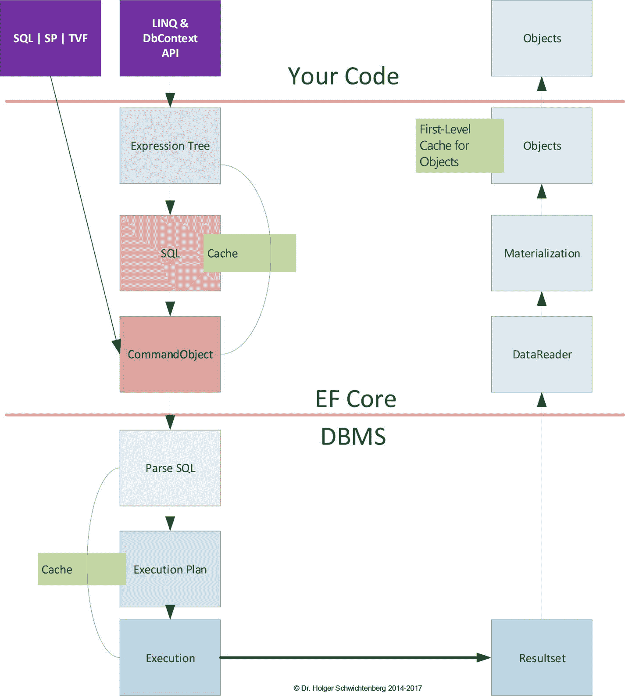
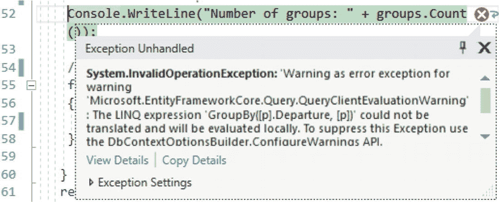
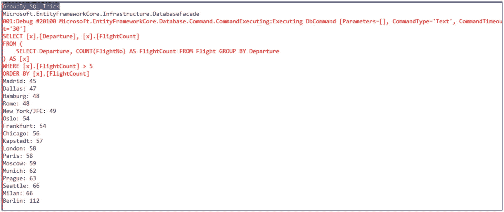
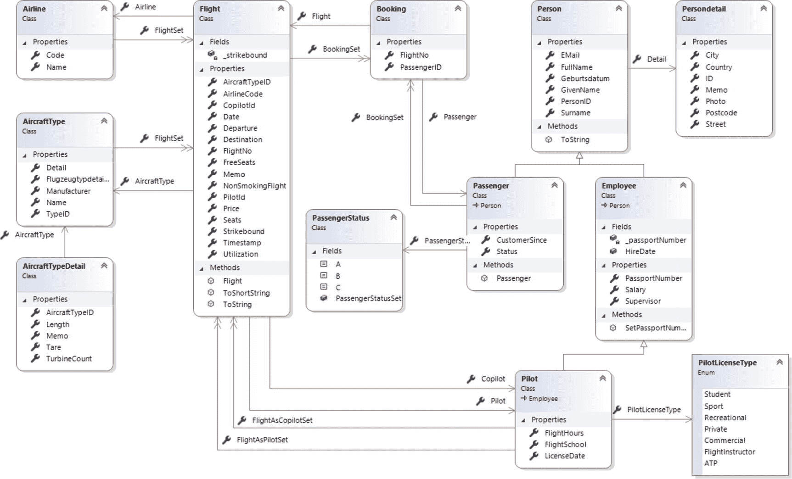

# 8.用 LINQ 读取数据

与经典的实体框架一样，实体框架核心允许您使用语言集成查询(LINQ)编写数据库查询。

LINQ 是 2007 年在中引入的不同数据存储的通用查询语言。NET 框架 3.5；它也存在于。NET Core 以及 Mono 和 Xamarin。微软从一开始就在经典的实体框架中使用 LINQ，它被实现为实体的 LINQ。微软在实体框架核心中不再使用这个术语；它就叫 LINQ。经典实体框架和实体框架核心在 LINQ 执行方面存在一些积极和消极的差异。

## 上下文类

Entity Framework Core 中所有 LINQ 查询的起点是在对现有数据库进行逆向工程时创建的上下文类，或者在进行正向工程时手动创建的上下文类。实体框架核心中的上下文类总是从基类`Microsoft.EntityFrameworkCore.DbContext`继承而来。经典实体框架中存在的`ObjectContext`的替代基类已从实体框架核心中删除。因此，你必须使用`DbContext`进行所有的 LINQ 操作。但是即使是基类`DbContext`在实体框架核心也有一点改变。

`DbContext`类实现了`IDisposable`接口。作为`Dispose()`方法的一部分，`DbContext`释放所有分配的资源，包括对所有加载了变更跟踪的对象的引用。

Tip

因此，一旦工作完成，上下文类用户总是调用`Dispose()`是很重要的。最好用一个`using(){ ... }`挡！

## LINQ 询问

实例化上下文类后，您可以制定一个 LINQ 查询。该查询不一定立即执行；它最初是以带有接口`IQueryable<T>`的对象的形式出现的。在所谓的延迟执行的意义上，当结果被实际使用时(例如，在一个`foreach`循环中)或者当结果被转换成另一个集合类型时，LINQ 查询被执行。您可以使用 LINQ 转换运算符强制执行查询，换句话说，`ToList()`、`ToArray()`、`ToLookup()`、`ToDictionary()`、`Single()`、`SingleOrDefault()`、`First()`、`FirstOrDefault()`，或者使用聚合运算符，如`Count()`、`Min()`、`Max()`或`Sum()`。

因为`IQueryable<T>`是`IEnumerable<T>`的一个子类型，你可以用`IQueryable<T>`在一个对象上开始一个`foreach`循环。这将导致查询立即运行。此外，实体框架核心保持数据库连接打开，直到获取最后一个对象，这可能导致不必要的副作用。因此，在使用 RAM 中的数据之前，您应该总是显式地使用前面的转换或聚合操作符之一，因为在这种情况下，实体框架核心将关闭数据库连接。但是，因为实体框架核心是基于 ADO.NET 的，所以数据库连接实际上并没有立即关闭，而是返回到 ADO.NET 连接池。同样，数据绑定到接口为`IQueryable<T>`的对象会触发数据检索。

图 [8-1](#Fig1) 显示了 LINQ 查询的内部处理。首先，LINQ 查询被转换成表达式树。表达式树创建一个 SQL 命令，实体框架核心使用来自 ADO.NET 的`Command`对象将该命令发送到数据库管理系统。实体框架核心为 SQL 命令提供了一个缓存，以防止将 LINQ 转换为 SQL 的开销增加到相同命令的两次。



图 8-1

Internals for running a LINQ command through Entity Framework Core

数据库管理系统分析该查询，并检查是否已经有合适的执行计划。如果缓存中不存在，将会创建它。此后，数据库管理系统执行查询并将结果集传递给实体框架核心。然后实体框架核心使用一个`DataReader`对象读取结果集，但是用户代码看不到它，因为实体框架核心将`DataReader`行具体化为对象。除了在非跟踪模式下，实体框架核心查看要物化的对象是否已经在实体框架核心上下文的一级缓存中。如果对象在那里，物化就被消除了。但是，这也意味着如果一个对象在 RAM 中，用户将不会从数据库中获得记录的当前状态，而是从缓存中获得对象，尽管重新执行了一个 SQL 命令。

清单 [8-1](#Par11) 显示了一个简单的 LINQ 查询，它返回从一个出发地点出发的所有未预订的航班，按日期和出发地点排序。`ToList()`将`IQueryable<Flight>`变成带有接口`IEnumerable<T>`的`List<Flight>`。然而，在实践中，程序代码中经常使用关键字`var`，而不是具体的类型名。

```cs
public static void LINQ_List()
{
 var city = "Berlin";

 // Instantiate context
 using (var ctx = new WWWingsContext())
 {
  // Define queries, but do not execute yet
  IQueryable<Flight> query = (from x in ctx.FlightSet
                                where x.Departure == city &&
                                      x.FreeSeats > 0
                                orderby x.Date, x.Departure
                                select x);

  // Run query now
  List<Flight> flightSet = query.ToList();

  // Count loaded objects
  var count = flightSet.Count;
  Console.WriteLine("Number of loaded flights: " + count);

  // Print results
  foreach (var f in flightSet)
  {
   Console.WriteLine($"Flight Nr {f.FlightNo} from {f.Departure} to {f.Destination} has {f.FreeSeats} free seats!");
  }
 } // End using-Block -> Dispose() will be called

Listing 8-1LINQ Query That Returns All Nonbooked Flights from a Departure Location

```

在 LINQ 的方法语法中可能有一个更简洁的公式，如下所示:

```cs
var query2 = ctx.FlightSet.Where(x => x.Departure == city && x.FreeSeats > 0)
     .OrderBy(x => x.Date).ThenBy(x => x.Departure);

```

当然，也可以将对`ToList()`的调用与 LINQ 查询的定义结合起来，从而立即执行 LINQ 查询。

```cs
var flightSet2 = (from x in ctx.FlightSet
                      where x.Departure == city &&
                            x.FreeSeats > 0
                      orderby x.Date, x.Departure
                      select x).ToList();

```

但是，拆分表示法的优点是，您可以在执行查询之前附加更多的操作。

以下是执行的 SQL 查询:

```cs
SELECT [x].[FlightNo], [x].[AircraftTypeID], [x].[AirlineCode], [x].[CopilotId], [x].[FlightDate], [x].[Departure], [x].[Destination], [x].[FreeSeats], [x].[LastChange], [x].[Memo], [x].[NonSmokingFlight], [x].[PilotId], [x].[Price], [x].[Seats], [x].[Strikebound], [x].[Timestamp], [x].[Utilization]
FROM [Flight] AS [x]
WHERE ([x].[Departure] = @__city_0) AND ([x].[FreeSeats] > 0)
ORDER BY [x].[FlightDate], [x].[Departure]

```

Note

理论上，你可以调用方法`query.Count()`而不是属性`flightSet.Count`。但是，这会产生一个新的数据库查询，提供记录的数量。这是多余的，因为对象已经物化，可以在 RAM 中快速计数。只有当您想确定数据库中的记录数量是否已经改变时，使用`query.Count()`访问 DBMS 才有意义。

## LINQ 查询的逐步组合

清单 [8-2](#Par21) 展示了如果值的变量不包含零或空字符串，如何根据具体情况将出发或目的地的附加条件附加到基本查询`FreeSeats > 0`上。这是用户设置过滤器的典型情况。如果用户没有在筛选字段中输入任何内容，那么他们不希望看到值为空的记录，并且希望在查询过程中忽略该筛选。

```cs
public static void LINQ_Composition()
  {
   var departure = "";
   var destination = "Rome";

   // Create context instance
   using (var ctx = new WWWingsContext())
   {
    // Define query, but do not execute yet
    IQueryable<Flight> query = from x in ctx.FlightSet
                 where x.FreeSeats > 0
                 select x;

    // Conditional addition of further conditions
    if (!String.IsNullOrEmpty(departure)) query = query.Where(x => x.Departure == departure);
    if (!String.IsNullOrEmpty(destination)) query = query.Where(x => x.Destination == destination);

    // now use sorting, otherwise there will be problems with variable query type (IQueryable<Flight> vs. IOrderedQueryable<Flight>)
    var querySorted = from x in query // IOrderedQueryable<Flight>
                      orderby x.Date, x.Departure
                      select x;

    // Execute query now
    List<Flight> flightSet = querySorted.ToList();

    // Count loaded objects
    long c = flightSet.Count;
    Console.WriteLine("Number of loaded flights: " + c);

    // Print result
    foreach (var f in flightSet)
    {
     Console.WriteLine($"Flight Nr {f.FlightNo} from {f.Departure} to {f.Destination} has {f.FreeSeats} free seats!");
    }
   } // End using-Block -> Dispose()

Listing 8-2LINQ Query That Returns All Unbooked Flights on a Route, with Both Departure and Destination Optional

```

## var 的使用

在实践中，当使用 LINQ 时，使用关键字`var`，而不是特定的类型名，如`IQueryable<Flight>`。关于关键字`var`(特别是在 Visual Basic 中使用不带类型的`Dim`时)，开发人员之间仍然有很多争论。网)。在 LINQ 的配合下，`var`经常简化编码。对于 LINQ，使用一些操作符如`orderby`会改变返回类型。没有`orderby`，你得到一个实现`IQueryable<Flight>`的对象。有了`orderby`，就是一个`IOrderedQueryable<Flight>`。因此，在更改 LINQ 查询时，您经常需要更改变量类型。当使用关键字`var`时，这是不必要的。

## 知识库模式

除了在小型应用程序中，您不应该将数据访问代码保存在用户界面中。已经建立了存储库模式来封装一个或多个(连接的)表的数据访问代码。repository 类提供返回单个对象或对象集的方法，或者返回允许您插入、删除和修改记录的方法。

一个`IQueryable<T>`也可以用作方法的返回值，这样方法的调用者也可以扩展查询。但是，只有当上下文实例在方法结束后仍然存在，从而可以在以后执行查询时，这才有意义。因此，您必须将上下文实例作为类的一个属性，并为以后调用`Dispose()`时上下文实例的销毁提供`IDisposable`接口(参见清单 [8-3](#Par26) 和存储库中的类`FlightManager`)。然后调用者可以扩展查询，并且应该使用带有`using()`块的类`FlightManager`来确保对`Dispose()`的调用。参见清单 [8-4](#Par27) 。

Note

您可以在本书的附录 [A](21.html) 中看到运行中的存储库模式。在这里，您还将看到如何为所有存储库类使用一个公共基类，从而减少存储库类中的代码。

```cs
using Microsoft.EntityFrameworkCore;
using System;
using System.Collections.Generic;
using System.Linq;
using BO;
using DA;

namespace BL
{

 /// <summary>
 /// Repository class for Flight entities
 /// </summary>
 public class FlightManager  : IDisposable
 {
  public FlightManager()
  {
   // create instance of context when FlightManager is created
   ctx = new WWWingsContext();
  }

  // keep one EFCore context per instance
  private WWWingsContext ctx;

  /// <summary>
  /// Dispose context if FlightManager is disposed
  /// </summary>
  public void Dispose() { ctx.Dispose(); }

  /// <summary>
  /// Get one flight
  /// </summary>

  public Flight GetFlight(int flightID)
  {
     return ctx.FlightSet.Find(flightID);
  }

  /// <summary>
  /// Get all flights on a route
  /// </summary>
  public List<Flight> GetFlightSet(string departure, string destination)
  {
   var query = GetAllAvailableFlightsInTheFuture();
   if (!String.IsNullOrEmpty(departure)) query = from f in query
                                                   where f.Departure == departure
                                                   select f;
   if (!String.IsNullOrEmpty(destination)) query = query.Where(f => f.Destination == destination);
   List<Flight> result = query.ToList();
   return result;
  }

  /// <summary>
  /// Base query that callre can extend
  /// </summary>
  public IQueryable<Flight> GetAllAvailableFlightsInTheFuture()
  {
   var now = DateTime.Now;
   var query = (from x in ctx.FlightSet
                where x.FreeSeats > 0 && x.Date > now
                select x);
   return query;
  }

  /// <summary>
  /// Get the combined list of all departures and all destinations
  /// </summary>
  /// <returns></returns>
  public List<string> GetAirports()
  {
   var l1 = ctx.FlightSet.Select(f => f.Departure).Distinct();
   var l2 = ctx.FlightSet.Select(f => f.Destination).Distinct();
   var l3 = l1.Union(l2).Distinct();
   return l3.OrderBy(z => z).ToList();
  }

  /// <summary>
  /// Delegate SaveChanges() to the context class
  /// </summary>
  /// <returns></returns>
  public int Save()
  {
   return ctx.SaveChanges();
  }

  /// <summary>
  /// This overload checks if there are objects in the list that do not belong to the context. These are inserted with Add().
  /// </summary>
  public int Save(List<Flight> flightSet)
  {
   foreach (Flight f in flightSet)
   {
    if (ctx.Entry(f).State == EntityState.Detached)
    {
     ctx.FlightSet.Add(f);
    }
   }
   return Save();
  }

  /// <summary>
  /// Remove flight (Delegated to context class)
  /// </summary>
  /// <param name="f"></param>
  public void RemoveFlight(Flight f)
  {
   ctx.Remove(f);
  }

  /// <summary>
  /// Add flight (Delegated to context class)
  /// </summary>
  /// <param name="f"></param>
  public void Add(Flight f)
  {
   ctx.Add(f);
  }

  /// <summary>
  ///   Reduces the number of free seats on the  flight, if seats are still available. Returns true if successful, false otherwise.
  /// </summary>
  /// <param name="flightID"></param>
  /// <param name="numberOfSeats"></param>
  /// <returns>true, wenn erfolgreich</returns>
  public bool ReducePlatzAnzahl(int flightID, short numberOfSeats)
  {
   var f = GetFlight(flightID);
   if (f != null)
   {
    if (f.FreeSeats >= numberOfSeats)
    {
     f.FreeSeats -= numberOfSeats;
     ctx.SaveChanges();
     return true;
    }
   }
   return false;
  }
 }
}

Listing 8-3Repository Class

That Returns an IQuerable <Flight>

```

```cs
public static void LINQ_RepositoryPattern()
{
 using (var fm = new BL.FlightManager())
 {
  IQueryable<Flight> query = fm.GetAllAvailableFlightsInTheFuture();
  // Extend base query now
  query = query.Where(f => f.Departure == "Berlin");
  // Execute the query now
  var flightSet = query.ToList();
  Console.WriteLine("Number of loaded flights: " + flightSet.Count);
 }
}
Listing 8-4Using the Repository Class from Listing 8-3

```

## LINQ 分页查询

分页意味着从结果集中只能传递一个特定范围的记录。这可以在 LINQ 用方法`Skip()`和`Take()`(或者 Visual Basic 中的语言元素`Skip`和`Take`实现。网)。

清单 [8-5](#Par36) 显示了一个更复杂的 LINQ 查询。它将搜索比赛

*   至少有一个空座位
*   至少有一个预订
*   有一个乘客叫穆勒
*   飞行员出生于 1972 年 1 月 1 日之前
*   有一个副驾驶

然后，通过在数据库管理系统中进行分页，从结果集中跳过前 50 个数据记录，并且仅传递后面的 10 个数据记录(即，数据记录 51 至 60)。

```cs
[EFCBook("Paging")]
  public static void LINQ_QueryWithPaging()
  {
   CUI.MainHeadline(nameof(LINQ_QueryWithPaging));
   string name = "Müller";
   DateTime date = new DateTime(1972, 1, 1);
   // Create context instance
   using (var ctx = new WWWingsContext())
   {

    // Define query and execute
    var flightSet = (from f in ctx.FlightSet
                     where f.FreeSeats > 0 &&
                           f.BookingSet.Count > 0 &&
                           f.BookingSet.Any(b => b.Passenger.Surname == name) &&
                           f.Pilot.Birthday < date &&
                           f.Copilot != null
                     select f).Skip(5).Take(10).ToList();

    // Count number of loaded objects
    var c = flightSet.Count;
    Console.WriteLine("Number of found flights: " + c);

    // Print objects
    foreach (var f in flightSet)
    {
     Console.WriteLine($"Flight Nr {f.FlightNo} from {f.Departure} to {f.Destination} has {f.FreeSeats} free seats!");
    }
   } // End using-Block -> Dispose()
  }

Listing 8-5Complex LINQ Query

```

下面的 SQL 命令是清单 [8-5](#Par36) 中发送的 SQL 命令，它比 LINQ 的对应命令复杂得多。此命令已发送到 Microsoft SQL Server 2017，并使用 SQL Server 附带的 SQL Server Profiler 工具进行了检索。SQL Server 版本在这里实际上很重要；2008 SQL ANSI 标准(`http:// /` [`www.iso.org/iso/home/store/catalogue_tc/catalogue_tc_browse.htm?commid=45342`](http://www.iso.org/iso/home/store/catalogue_tc/catalogue_tc_browse.htm?commid=45342) )中带有关键字`OFFSET`、`FETCH FIRST`和`FETCH NEXT`的行限制子句从 2012 年版本开始就受到 Microsoft SQL Server 的支持。Oracle 从版本 1.7.2013 年 7 月 1 日发布)开始提供这种支持。对于不支持这种新语法的 DBMSs，Entity Framework Core 需要用`rownumber()`函数创建一个更加复杂的查询，并选择实现`Skip()`。

Note

实体框架核心的一个很好的改进是在 SQL 命令中使用了 LINQ 查询中的变量名(这里是`f`和`b`)。在经典的实体框架中，使用了诸如`extend1`、`extend2`、`extend3`等名称。如果 SQL 中的 Entity Framework Core 多次需要一个表的别名，ORM 会在变量名后面附加一个数字(参见下面 SQL 代码中的`[b0]`)。

```cs
exec sp_executesql N'SELECT [f].[FlightNo], [f].[AircraftTypeID], [f].[AirlineCode], [f].[CopilotId], [f].[FlightDate], [f].[Departure], [f].[Destination], [f].[FreeSeats], [f].[LastChange], [f].[Memo], [f].[NonSmokingFlight], [f].[PilotId], [f].[Price], [f].[Seats], [f].[Strikebound], [f].[Timestamp], [f].[Utilization]
FROM [Flight] AS [f]
INNER JOIN [Employee] AS [f.Pilot] ON [f].[PilotId] = [f.Pilot].[PersonID]
WHERE ([f.Pilot].[Discriminator] = N''Pilot'') AND ((((([f].[FreeSeats] > 0) AND ((
    SELECT COUNT(*)
    FROM [Booking] AS [b]
    WHERE [f].[FlightNo] = [b].[FlightNo]
) > 0)) AND EXISTS (
    SELECT 1
    FROM [Booking] AS [b0]
    INNER JOIN [Passenger] AS [b.Passenger] ON [b0].[PassengerID] = [b.Passenger].[PersonID]
    WHERE ([b.Passenger].[Surname] = @__name_0) AND ([f].[FlightNo] = [b0].[FlightNo]))) AND ([f.Pilot].[Birthday] < @__date_1)) AND [f].[CopilotId] IS NOT NULL)
ORDER BY (SELECT 1)
OFFSET @__p_2 ROWS FETCH NEXT @__p_3 ROWS ONLY',N'@__name_0 nvarchar(4000),@__date_1 datetime2(7),@__p_2 int,@__p_3 int',@__name_0=N'Müller',@__date_1='1972-01-01 00:00:00',@__p_2=5,@__p_3=10

```

## 预测

在关系数据库中，对所选列的限制称为投影(参见 [`https://en.wikipedia.org/wiki/Set_theory`](https://en.wikipedia.org/wiki/Set_theory) )。如果不是所有的列都是真正需要的，那么装载一个表的所有列通常是一个严重的性能错误。

### 到实体类型的投影

到目前为止显示的 LINQ 查询总是实际加载和具体化`Flight`表的所有列。清单 [8-6](#Par42) 显示了一个带有`select new Flight()`和所需列的投影。在执行了`ToList()`方法之后，您会收到一个包含所有属性的`Flight`对象的列表(因为类是这样定义的)，但是只填充了指定的属性。

```cs
public static void Projection_Read()
  {
   using (var ctx = new WWWingsContext())
   {
    CUI.MainHeadline(nameof(Projection_Read));

    var query = from f in ctx.FlightSet
                  where f.FlightNo > 100
                  orderby f.FlightNo
                  select new Flight()
                  {
                   FlightNo = f.FlightNo,
                   Date = f.Date,
                   Departure = f.Departure,
                   Destination = f.Destination,
                   FreeSeats = f.FreeSeats
                  };

    var flightSet = query.ToList();

    foreach (var f in flightSet)
    {
     Console.WriteLine($"Flight Nr {f.FlightNo} from {f.Departure} to {f.Destination} has {f.FreeSeats} free seats!");
    }
   }
  }

Listing 8-6LINQ Query with Projection

```

清单 [8-6](#Par42) 的以下 SQL 输出证明了实体框架核心确实只请求数据库管理系统中所需的列:

```cs
SELECT [f].[FlightNo], [f].[FlightDate] AS [Date], [f].[Departure], [f].[Destination], [f].[FreeSeats]
FROM [Flight] AS [f]
WHERE [f].[FlightNo] > 100
ORDER BY [f].[FlightNo]

```

Note

对实体类的直接支持是 Entity Framework Core 相对于传统实体框架的一个主要优势。在经典的实体框架中，对于实体类和复杂类型，投影是不可能的；只有匿名类型和非实体类可以用于投影。由于匿名类型的限制(实例是只读的，不能在方法中作为返回值使用)，通常需要复制实体类的实例。为此，您可以使用 NuGet 包自动映射器。EF6 ( [`https://github.com/AutoMapper/AutoMapper.EF6`](https://github.com/AutoMapper/AutoMapper.EF6) )用扩展法`ProjectTo<T>()`。

### 匿名类型的投影

到匿名类型的投影是可能的。在这种情况下，不应该在`new`操作符后指定类名。如果属性的名字不变，那么在初始化块中，只需要简单的提一下属性，而不是赋值`{Departure = f.Departure, ...}`，如下:`{f.Departure, f.Destination, ...}`。

Note

匿名类型对于实体框架核心是未知的。如果您尝试用`ctx.Entry(f).State`查询匿名状态或调用`ctx.Attach(f)`，您会得到以下运行时错误:“找不到实体类型'< > f__AnonymousType8 <int datetime="" string="" nullable="">，byte[ ] 【T6 '”。请确保该实体类型已添加到模型中。</int>

`f.FreeSeats--`

第 20 章讲述了如何使用对象到对象的映射将匿名类型映射到其他类型。清单 [8-7](#Par49) 显示了匿名类型的投影。

```cs
public static void Projection_AnonymousType()
{
 using (var ctx = new WWWingsContext())
 {
  CUI.MainHeadline(nameof(Projection_AnonymousType));

  var q = (from f in ctx.FlightSet
           where f.FlightNo > 100
           orderby f.FlightNo
           select new
           {
            FlightID = f.FlightNo,
            f.Date,
            f.Departure,
            f.Destination,
            f.FreeSeats,
            f.Timestamp
           }).Take(2);

  var flightSet = q.ToList();

  foreach (var f in flightSet)
  {
   Console.WriteLine($"Flight Nr {f.FlightID} from {f.Departure} to {f.Destination} has {f.FreeSeats} free seats!");
  }

  Console.WriteLine("Number of flights: " + flightSet.Count);

  foreach (var f in flightSet)
  {
   Console.WriteLine(f.FlightID);
   // not posssible:  Console.WriteLine("Before attach: " + f + " State: " + ctx.Entry(f).State + " Timestamp: " + ByteArrayToString(f.Timestamp));
   // not posssible:   ctx.Attach(f);
   // not posssible:   Console.WriteLine("After attach: " + f + " State: " + ctx.Entry(f).State + " Timestamp: " + ByteArrayToString(f.Timestamp));
   // not posssible:
  // f.FreeSeats--;
   // not posssible:   Console.WriteLine("After Änderung: " + f + " State: " + ctx.Entry(f).State + " Timestamp: " + ByteArrayToString(f.Timestamp));

   var count = ctx.SaveChanges(); // no changes can be saved
   Console.WriteLine("Number of saved changes: " + count);
   // not posssible:  Console.WriteLine("After saving: " + f + " State: " + ctx.Entry(f).State + " Timestamp: " + ByteArrayToString(f.Timestamp));
  }
 }
}

Listing 8-7Projection to an Anonymous Type

```

### 任意类型的投影

投影的目标也可以是任何其他类，根据软件架构的结构，这些类将被称为业务对象(BO)或数据传输对象(DTO)。与实体类投影一样，您必须在`new`之后提到类名，并且完整的赋值对于初始化是必要的，如下:`{Departure = f.Departure, ...}`。清单 [8-8](#Par52) 显示了到 DTO 的投影。

Note

与匿名类型一样，在这种情况下，实体框架核心不知道该类。因此，使用`Attach()`请求状态并保存更改是不可能的。

```cs
class FlightDTO
  {
   public int FlightID { get; set; }
   public DateTime Date { get; set; }
   public string Departure { get; set; }
   public string Destination { get; set; }
   public short? FreeSeats { get; set; }
   public byte[] Timestamp { get; set; }
  }

  public static void Projection_DTO()
  {
   using (var ctx = new WWWingsContext())
   {
    CUI.MainHeadline(nameof(Projection_DTO));

    var q = (from f in ctx.FlightSet
             where f.FlightNo > 100
             orderby f.FlightNo
             select new FlightDTO()
             {
              FlightID = f.FlightNo,
              Date = f.Date,
              Departure = f.Departure,
              Destination = f.Destination,
              FreeSeats = f.FreeSeats,
              Timestamp = f.Timestamp
             }).Take(2);

    var flightSet = q.ToList();

    foreach (var f in flightSet)
    {
     Console.WriteLine($"Flight Nr {f.FlightID} from {f.Departure} to {f.Destination} has {f.FreeSeats} free seats!");
    }

    Console.WriteLine("Number of flights: " + flightSet.Count);

    foreach (var f in flightSet)
    {
     Console.WriteLine(f.FlightID);
     // not posssible:  Console.WriteLine("Before attach: " + f + " State: " + ctx.Entry(f).State + " Timestamp: " + ByteArrayToString(f.Timestamp));
     // not posssible:   ctx.Attach(f);
     // not posssible:   Console.WriteLine("After attach: " + f + " State: " + ctx.Entry(f).State + " Timestamp: " + ByteArrayToString(f.Timestamp));
     // not posssible:
     // f.FreeSeats--;
     // not posssible:   Console.WriteLine("After Änderung: " + f + " State: " + ctx.Entry(f).State + " Timestamp: " + ByteArrayToString(f.Timestamp));

     var anz = ctx.SaveChanges(); // no changes can be saved
     Console.WriteLine("Number of saved changes: " + anz);
     // not posssible:  Console.WriteLine("After saving: " + f + " State: " + ctx.Entry(f).State + " Timestamp: " + ByteArrayToString(f.Timestamp));
    }
   }
  }

Listing 8-8Projection to a DTO

```

## 查询单个对象

LINQ 提供了四种操作来选择集合中的第一个或唯一元素，如下所示:

*   `First()`:一个集合中的第一个元素。如果集合中有多个元素，则除了第一个元素之外，其他元素都将被丢弃。如果没有元素，就会发生运行时错误。
*   `FirstOrDefault()`:当金额为空时，集合的第一个元素或默认值(对于引用类型`null`或`Nothing`)。如果集合中有多个元素，则除了第一个元素之外，其他元素都将被丢弃。
*   `Single()`:一个集合中唯一的元素。如果集合中没有元素或有多个元素，则会发生运行时错误。
*   `SingleOrDefault()`:一个集合中唯一的元素。如果没有元素，则返回默认值(对于引用类型`null`或`Nothing`)。如果集合中有多个项目，则会发生运行时错误。

`First()`和`FirstOrDefault()`使用 SQL 操作符`TOP(1). Single()`限制数据库端的输出数量，`SingleOrDefault()`使用`TOP(2)`确定是否有多个元素，这会导致运行时错误。清单 [8-9](#Par59) 显示了 LINQ 查询的代码。

```cs
public static void LINQ_SingleOrDefault()
  {
   using (var ctx = new WWWingsContext())
   {
    var FlightNr = 101;

    var f = (from x in ctx.FlightSet
             where x.FlightNo == FlightNr
             select x).SingleOrDefault();

    if (f != null)
    {
     Console.WriteLine($"Flight Nr {f.FlightNo} from {f.Departure} to {f.Destination} has {f.FreeSeats} free seats!");
    }
    else
    {
     Console.WriteLine("Flight not found!");
    }
   } // End using-Block -> Dispose()
  }

Listing 8-9LINQ Query for a Single Object with SingleOrDefault()

```

## 使用带有 Find()的主键进行加载

经典实体框架中的`DbSet<T>`类提供了一个`Find()`方法，作为使用主键和 LINQ 加载对象的替代方法。`Find()`传递主键的值。如果有多部分主键，也可以传递几个值，比如`Find ("Holger", "Schwichtenberg", 12345)`如果主键由两个字符串和一个数字组成。`Find()`在实体框架核心版本 1.0 中不可用，但已集成到版本 1.1 中。清单 8-10 显示了 LINQ 查询。

Note

`Find()`具有特殊的行为，首先在实体框架核心上下文的一级缓存中查找对象，只有在对象不在那里时才启动数据库查询。方法`Single()`、`SingleOrDefault()`、`First()`和`FirstOrDefault()`总是询问数据库，即使对象存在于本地缓存中！

```cs
public static void LINQ_Find()
{
 CUI.MainHeadline(nameof(LINQ_Find));
 using (var ctx = new WWWingsContext())
 {
  ctx.FlightSet.ToList(); // Caching all flights in context (here as an example only to show the caching effect!)

  var FlightNr = 101;
  var f = ctx.FlightSet.Find(FlightNr); // Flight is loaded from cache!

  if (f != null)
  {
   Console.WriteLine($"Flight Nr {f.FlightNo} from {f.Departure} to {f.Destination} has {f.FreeSeats} free seats!");
  }
  else
  {
   Console.WriteLine("Flight not found!");
  }
 } // End using-Block -> Dispose()

}

Listing 8-10LINQ Query for a Single Object with Find

```

## 在 RAM 中而不是在数据库中使用 LINQ(客户端评估)

清单 [8-11](#Par65) 显示了一个使用 LINQ 分组操作符(`group by`或`GroupBy()`)进行分组的 LINQ 查询。这个查询提供了想要的结果(每次出发的航班数量)，但是对于大量的数据，这个查询需要花费很多时间。在研究原因的时候，你会发现在发给数据库管理系统的 SQL 命令中，分组是完全缺失的。实体框架核心已经加载了所有记录，并在 RAM 中进行分组，这是不好的，也是意外的。

Attention

事实上，Entity Framework Core 版本 1.x 和 2.0 不支持将 LINQ 分组转换成 SQL 的`GROUP BY`语法，这是 Entity Framework Core 中一个可怕的缺陷(参见“解决 GroupBy 问题”一节)。计划对实体框架核心 2.1 版进行改进；参见附录 [C](23.html) 。

```cs
 using (var ctx = new WWWingsContext())
 {
  Console.WriteLine(ctx.Database.GetType().FullName);
  ctx.Log();

  var groups = (from p in ctx.FlightSet
               group p by p.Departure into g
               select new { City = g.Key, Count =   g.Count() }).Where(x => x.Count > 5).OrderBy(x => x.Count);

  // First roundtrip to the database (done intentionally here!)
  var count = groups.Count();
  Console.WriteLine("Number of groups: " + count);
  if (count == 0) return;

  // Second roundtrip to the database
  foreach (var g in groups.ToList())
  {
   Console.WriteLine(g.City + ": " + g.Count);
  }
 }

Listing 8-11Determine the Number of Flights per Departure

```

清单 [8-11](#Par65) 显示了发送到数据库管理系统的 SQL 命令(两次:一次用于`Count()`，一次用于`ToList()`)。

```cs
SELECT [p0].[FlightNo],
       [p0].[AircraftTypeID],
       [p0].[AirlineCode],
       [p0].[CopilotId],
       [p0].[FlightDate],
       [p0].[Departure],
       [p0].[Destination],
       [p0].[FreeSeats],
       [p0].[LastChange],
       [p0].[Memo],
       [p0].[NonSmokingFlight],
       [p0].[PilotId],
       [p0].[Price],
       [p0].[Seats],
       [p0].[Strikebound],
       [p0].[Timestamp],
       [p0].[Utilization]
FROM   [Flight] AS [p0]
ORDER  BY [p0].[Departure]

```

不幸的是，在许多其他情况下，实体框架核心在 RAM 中而不是在数据库中执行操作。

对于下面的查询，在 Entity Framework Core 1.x 中，只有通过`FlightNo`的过滤发生在数据库中。

```cs
var q2 = from f to ctx.FlightSet
             where f.FlightNo > 100
             && f.FreeSeats.ToString().Contains("1")
             orderby f.FlightNo
             select f;

```

`ToString().Contains()`无法被翻译并在 RAM 中执行该条件。在 2.0 版中，整个 LINQ 命令都被翻译成 SQL。

对于以下查询，`AddDays()`在 Entity Framework Core 1.x 中无法翻译，因此在数据库管理系统中只对空闲座位进行了过滤，而没有进行日期过滤。

```cs
var q3 = from f to ctx.FlightSet
             where f.FreeSeats> 0 &&
             f.Date > DateTime.Now.AddDays (10)
             orderby f.FlightNo
             select f;

```

在实体框架核心 2.0 中也修复了这一点。

不幸的是，在 Entity Framework Core 2.0 的 RAM 中也出现了以下带有 LINQ 运算符`Union()`的查询:

```cs
var all places = (from f in ctx.FlightSet select f.Departure.Union(from f in ctx.FlightSet select f.Destination).Count();

```

尽管这里只需要一个数字，但实体框架核心将执行以下操作:

```cs
SELECT [f]. [Departure]
FROM [Flight] AS [f]
SELECT [f0]. [Destination]
FROM [Flight] AS [f0]

```

Note

应该提到的是，以前的一些 LINQ 查询在经典的实体框架中根本不可执行。它们已被编译，但导致了运行时错误。实体框架核心中的新解决方案是否是更好的解决方案是有争议的。虽然订单现在是可能的，但潜伏着一个大陷阱。毕竟微软已经在路线图( [`https://github.com/aspnet/EntityFrameworkCore/wiki/Roadmap`](https://github.com/aspnet/EntityFrameworkCore/wiki/Roadmap) )中宣布，在未来版本的 Entity Framework Core 中你可以在数据库管理系统中执行更多的操作。

当在 RAM 中运行时，由于加载了太多的记录，可能会出现严重的性能问题。如果开发人员使用这样的查询，然后不使用大量记录进行测试，他们可能会遇到困难。这更加令人惊讶，因为微软总是谈论大数据，但随后 LINQ 在实体框架核心提供了一个工具，只是在某些方面没有大数据能力。

这种 RAM 操作只能通过新的提供者架构在实体框架核心中进行，这使得提供者可以决定在 RAM 中执行某些操作。微软称之为客户评估。

软件开发人员可以通过关闭客户端评估来防止这些性能问题。这可以通过`ConfigureWarnings()`方法实现，它提供了开发人员在`OnConfiguring()`方法中获得的`DbContextOptionsBuilder`对象。以下配置导致每个客户端评估触发一个运行时错误，如图 [8-2](#Fig2) 所示。默认情况下，实体框架核心仅记录客户端评估(参见第 [12 章](12.html)记录)。



图 8-2

Runtime error raised on a client evaluation if disabled

```cs
protected override void OnConfiguring(DbContextOptionsBuilder builder)
  {
   builder.UseSqlServer(_DbConnection);

builder.ConfigureWarnings(warnings => warnings.Throw(RelationalEventId.QueryClientEvaluationWarning));
}

```

## 使用错误的命令顺序

然而，有时软件开发者自己在 RAM 中而不是在数据库管理系统中进行操作。在清单 [8-12](#Par86) 中，`ToList()`被过早调用，并且查询包含类型`List<Flight>`而不是类型`IQueryable<Flight>`的对象。因此，基于出发地和目的地的过滤器和排序发生在 RAM 中，其中 LINQ 为对象。

Note

LINQ 在 RAM (LINQ 到对象)和 LINQ 在实体框架/实体框架核心中使用相同的查询语法。因此，你无法在一个程序代码行中看到，它是在 ram 中执行还是在数据库管理系统中执行。这总是取决于基本集合的数据类型(也就是说，LINQ 查询中的`in`之后是什么)。

```cs
public static void LINQ_CompositionWrongOrder()
{
 CUI.MainHeadline(nameof(LINQ_Composition));

 var departure = "";
 var destination = "Rome";

 // Create context instance
 using (var ctx = new WWWingsContext())
 {
  // Define query (ToList() ist WRONG here!)
  var query = (from x in ctx.FlightSet
   where x.FreeSeats > 0
   select x).ToList();

  // Conditional addition of further conditions
  if (!String.IsNullOrEmpty(departure)) query = query.Where(x => x.Departure == departure).ToList();
  if (!String.IsNullOrEmpty(destination)) query = query.Where(x => x.Destination == destination).ToList();

  // Sorting
  var querySorted = from x in query
   orderby x.Date, x.Departure
   select x;

  // The query shoud execute here, but it is already executed
  List<Flight> flightSet = querySorted.ToList();

  // Count loaded objects
  long c = flightSet.Count;
  Console.WriteLine("Number of loaded flights: " + c);

  // Print result
  foreach (var f in flightSet)
  {
   Console.WriteLine($"Flight Nr {f.FlightNo} from {f.Departure} to {f.Destination} has {f.FreeSeats} free seats!");
  }
 } // End using-Block -> Dispose()
}

Listing 8-12ToList() Is Set Too Early and Causes the Following Queries to Execute in RAM

```

## 在 LINQ 使用自定义函数

Entity Framework Core 中新的提供者架构为在 LINQ 查询中整合您自己的函数提供了可能性。当然，这部分查询是在 RAM 中执行的。例如，清单 [8-13](#Par89) 中的查询包含它自己的`GetNumberofDaysUntil()`方法。此外，在这种情况下，只对数据库中的`FreeSeats`列执行过滤器。

Note

从 C# 6.0 开始就存在的本地函数不能在 LINQ 命令中调用。

```cs
private static int GetNumberOfDaysUntil(DateTime t)
{
 return (t - DateTime.Now).Days;
}

public static void LINQ_CustomFunction()
{

 CUI.MainHeadline("Query with Custom Function - RAM :-(");
 using (var ctx = new WWWingsContext())
 {

  var q4 = from f in ctx.FlightSet
   where f.FreeSeats > 0 &&
         GetNumberOfDaysUntil(f.Date) > 10
   orderby f.FlightNo
   select f;

  List<Flight> l4 = q4.Take(10).ToList();

  Console.WriteLine("Count: " + l4.Count);

  foreach (var f in l4)
  {
   Console.WriteLine(f);
  }
 }
}

Listing 8-13Custom Functions in LINQ

```

## 解决分组问题

在 Entity Framework Core 1.x 和 2.0 中，没有将 LINQ 分组转换为 SQL，而是将记录分组到 RAM 中，这对于许多现实场景来说是绝对不可接受的。

实际上，需要一种在相应的数据库管理系统中执行分组的解决方案。不幸的是，使用 LINQ，这在实体框架核心 1.x 和 2.0 中不能实现。但是 SQL 的使用也带来了挑战，因为 Entity Framework Core 还不支持将 SQL 查询的结果映射到任何类型，而只支持映射到实体类。

Note

微软将在实体框架核心 2.1 版本中引入`GroupBy`翻译(见附录 [C](23.html) )，这将使这些变通办法变得过时。

### 映射到不存在的类型

清单 [8-14](#Par94) 中使用`FromSql()`的代码不幸不是一个解决方案。它未能执行`FromSql()`并导致以下运行时错误:“无法为‘departure group’创建 DbSet，因为该类型未包含在上下文的模型中。”然而，错误消息提示了另一个有效的技巧(参见下面的“挑战:迁移”一节)。

```cs
public static void GroupBy_SQL_NonEntityType()
  {

   // Get the number of flights per departure
   using (var ctx = new WWWingsContext())
   {
    // Map SQL to non-entity class
    Console.WriteLine(ctx.Database.GetType().FullName);
    ctx.Log();
    var sql = "SELECT Departure, COUNT(FlightNo) AS FlightCount FROM Flight GROUP BY Departure";
    // ERROR!!! Cannot create a DbSet for 'Group' because this type is not included in the model for the context."
    var groupSet = ctx.Set<DepartureGroup>().FromSql(sql);
    // Output
    foreach (var g in groupSet)
    {
     Console.WriteLine(g.Departure + ": " + g.FlightCount);
    }
   }
}

Listing 8-14No Solution to the GroupBy Issue

```

### 为数据库视图结果创建实体类

因为在非实体类型上不能实现与`FromSql()`的映射，所以您必须为分组结果创建一个伪实体类，其名称和类型属性必须与分组结果的列相匹配。这个实体类还需要一个符合约定的主键(ID 为`classnameID`)，或者必须使用`[Key]`或 Fluent API 的`HasKey()`来指定。见清单 [8-15](#Par96) 。

```cs
namespace BO
{
public class DepartureGrouping
 {
  [Key] // must have a PK
  public string Departure { get; set; }
  public int FlightCount { get; set; }
 }
...
}
Listing 8-15Entity Class with Two Properties for the Grouping Result

```

### 在上下文类中包含实体类

分组结果的伪实体类必须通过`DbSet<T>`作为实体类包含在上下文类中，如清单 [8-16](#Par98) 所示。

```cs
public class WWWingsContext: DbContext
{
  #region tables
  public DbSet<Flight> FlightSet {get; set; }
  public DbSet<Pilot> PilotSet {get; set; }
  public DbSet<Passenger> PassengerSet {get; set; }
  public DbSet<Airport> AirportSet {get; set; }
  public DbSet<Booking> BookingSet {get; set; }
  public DbSet<AircraftType> AircraftTypeSet {get; set; }
  #endregion

  #region grouping results (pseudo-entities)
  public DbSet<DepartureGrouping> DepartureGroupingSet {get; set; } // for grouping
  #endregion ...
}

Listing 8-16Including the Entity Class for the Database View in the Context Class

```

### 使用伪实体类

实体类`DepartureGrouping`现在可以用作`FromSQL()`中的返回类型，如清单 [8-17](#Par100) 所示。

```cs
public static void GroupBy_SQL_Trick()
{
 // Get the number of flights per departure
 using (var ctx = new WWWingsContext())
 {
  Console.WriteLine(ctx.Database.GetType().FullName);
  ctx.Log();

  // Map SQL to entity class
  var sql = "SELECT Departure, COUNT(FlightNo) AS FlightCount FROM Flight GROUP BY Departure";
  var groupSet = ctx.Set<BO.DepartureGrouping>().FromSql(sql).Where(x=>x.FlightCount>5).OrderBy(x=>x.FlightCount);

  // Output
  foreach (var g in groupSet)
  {
   Console.WriteLine(g.Departure + ": " + g.FlightCount);
  }

 }
}

Listing 8-17Use of the Pseudo-Entity Class

```

图 [8-3](#Fig3) 显示了输出。



图 8-3

Output of Listing [8-17](#Par100)

### 挑战:迁移

如您所见，使用分组结果需要一些手工操作。不幸的是，除了打字工作之外，数据库模式迁移还有另一个挑战。

如果您在上下文中添加了数据库视图的伪实体类之后创建了一个模式迁移类，您将会注意到实体框架核心不期望地想要为数据库中的伪实体类创建一个表(参见清单 [8-18](#Par104) 中的`CreateTable()`)。这是正确的，因为我假设`DepartureGrouping`是一张桌子。然而，不希望为分组结果创建表格。

```cs
using Microsoft.EntityFrameworkCore.Migrations;
using System;
using System.Collections.Generic;

namespace DA.Migrations
{
    public partial class v3 : Migration
    {
        protected override void Up(MigrationBuilder migrationBuilder)
        {
            migrationBuilder.CreateTable(
                name: "DepartureGrouping",
                columns: table => new
                {
                    Departure = table.Column<string>(nullable: false),
                    FlightCount = table.Column<int>(nullable: false)
                },
                constraints: table =>
                {
                    table.PrimaryKey("PK_DepartureGrouping", x => x.Departure);
                });
        }

        protected override void Down(MigrationBuilder migrationBuilder)
        {
            migrationBuilder.DropTable(
                name: "DepartureGrouping");
        }
    }
}

Listing 8-18Entity Framework Core Creates a CreateTable() for the Pseudo-Entity in the Schema Migration (Not Desirable)

```

这种情况下有三种可能的解决方案:

*   您可以创建表，但不使用它。
*   您可以从迁移类中手动删除`Up()`方法中的`CreateTable()`和`Down()`中对应的`DropTable()`。
*   您可以欺骗实体框架核心，使其在开发时而不是运行时创建迁移步骤时忽略实体类`DepartureStatistics`。

清单 [8-19](#Par110) 展示了如何实现这个技巧。作为创建或删除模式迁移的一部分，实体框架核心实例化上下文类，并调用`OnModelCreating()`。然而，在开发时，这不是通过应用程序的实际起始点发生的(然后应用程序将启动)，而是通过在命令行工具`ef.exe`中托管带有上下文类的 DLL。因此，在`OnModelCreating()`中，您要检查当前进程的名称是否为`ef`。如果是这样，那么应用程序不在运行时，而您在开发环境中，想要用`Ignore()`忽略数据库视图。然而，在应用程序运行时，不会执行`Ignore()`方法，因此可以通过实体类使用数据库视图。

```cs
if (System.Diagnostics.Process.GetCurrentProcess().ProcessName.ToLower() == "ef")
{
 modelBuilder.Ignore<DepartureGrouping>();
}
Listing 8-19Entity Framework Core Should Ignore the Entity Class for the Database View at Development Time Only

```

Alternative Trick

如果进程名称的查询对您来说太不确定，因为 Microsoft 可以更改这个名称，您可以在上下文类中以静态属性的形式使用一个开关(例如，`IsRuntime`)。默认情况下，`IsRuntime`为 false，并忽略伪实体类。然而，在运行时，在上下文类第一次实例化之前，`IsRuntime`被设置为 true。

### 使用数据库视图分组

在 Entity Framework Core 1.x 和 2.0 中，通过使用数据库视图，解决`GroupBy`问题的方式略有不同。这里您定义了一个数据库视图，它进行分组并返回分组结果。

然而，因为这些版本的实体框架核心也不支持数据库视图，所以同样的技巧仍然适用于表示数据库视图结果的实体类。重要的是，您不能再选择在模式迁移中创建表，因为已经有一个同名的数据库视图，这会导致命名冲突。

您可以在第 [18](18.html) 章(数据库视图的映射)中找到关于使用数据库视图的详细信息。

## LINQ 语法概述

本节介绍了 LINQ 最重要的命令，并附有有意义的例子作为快速参考。所有查询都在万维网之翼版本 2 的对象模型上执行，如图 [8-4](#Fig4) 所示。对于这些类中的每一个，在数据库中都有一个同名的对应表。



图 8-4

Object model for the following LINQ examples

所有命令都基于实体框架核心上下文的先前实例化。

```cs
WWWingsContext ctx = new WWWingsContext();

```

除了 LINQ 命令之外，还显示了可选的 lambda 符号和生成的 SQL 命令。对于 LINQ 和 lambda 符号，产生的 SQL 命令总是相同的；因此，这里只重印一次。

Tip

有关基本 LINQ 命令的更详细示例集合，请参见 [`https://code.msdn.microsoft.com/101-LINQ-Samples-3fb9811b`](https://code.msdn.microsoft.com/101-LINQ-Samples-3fb9811b) 。

### 简单的选择命令(所有记录)

实体框架核心支持`ToArray()`、`ToList()`、`ToDictionary()`和`ToLookup()`将查询转换成一组对象。

```cs
   CUI.Headline("All records as Array<T>");
   Flight[] flightSet0a = (from f in ctx.FlightSet select f).ToArray();
   Flight[] flightSet0b = ctx.FlightSet.ToArray();

   CUI.Headline("All records as List<T>");
   List<Flight> flightSet1a = (from f in ctx.FlightSet select f).ToList();
   List<Flight> flightSet1b = ctx.FlightSet.ToList();

   CUI.Headline("All records as Dictionary<T, T>");
   Dictionary<int, Flight> flightSet2a = (from f in ctx.FlightSet select f).ToDictionary(f=>f.FlightNo, f=>f);
   Dictionary<int, Flight> flightSet2b = ctx.FlightSet.ToDictionary(f => f.FlightNo, f => f);

   CUI.Headline("All records as ILookup<T, T>");
   ILookup<int, Flight> flightSet2c = (from f in ctx.FlightSet select f).ToLookup(f => f.FlightNo, f => f);
   ILookup<int, Flight> flightSet2d = ctx.FlightSet.ToLookup(f => f.FlightNo, f => f);

```

在所有八种情况下，以下 SQL 语句都被发送到 DBMS:

```cs
SELECT [f].[FlightNo], [f].[AircraftTypeID], [f].[AirlineCode], [f].[CopilotId], [f].[FlightDate], [f].[Departure], [f].[Destination], [f].[FreeSeats], [f].[LastChange], [f].[Memo], [f].[NonSmokingFlight], [f].[PilotId], [f].[Price], [f].[Seats], [f].[Strikebound], [f].[Timestamp], [f].[Utilization]
FROM [Flight] AS [f]

```

### 条件(在哪里)

```cs
   List<Flight> flightSet3a = (from f in ctx.FlightSet
                           where f.Departure == "Berlin" &&
                           (f.Destination.StartsWith("Rome") || f.Destination.Contains("Paris"))
                           && f.FreeSeats > 0
                           select f)
                           .ToList();

   List<Flight> flightSet3b = ctx.FlightSet.Where(f => f.Departure == "Berlin" &&
                           (f.Destination.StartsWith("Rome") || f.Destination.Contains("Paris"))
                           && f.FreeSeats > 0)
                           .ToList();

```

两种情况下产生的 SQL 如下:

```cs
SELECT [f].[FlightNo], [f].[AircraftTypeID], [f].[AirlineCode], [f].[CopilotId], [f].[FlightDate], [f].[Departure], [f].[Destination], [f].[FreeSeats], [f].[LastChange], [f].[Memo], [f].[NonSmokingFlight], [f].[PilotId], [f].[Price], [f].[Seats], [f].[Strikebound], [f].[Timestamp], [f].[Utilization]
FROM [Flight] AS [f]
WHERE (([f].[Departure] = N'Berlin') AND (([f].[Destination] LIKE N'Rome' + N'%' AND (LEFT([f].[Destination], LEN(N'Rome')) = N'Rome')) OR (CHARINDEX(N'Paris', [f].[Destination]) > 0))) AND ([f].[FreeSeats] > 0)

```

### 包含(英寸)

```cs
ist<string> Orte = new List<string>() { "Berlin", "Hamburg", "Köln", "Berlin" };
   List<Flight> flightSet4a = (from f in ctx.FlightSet
                           where Orte.Contains(f.Departure)
                           select f)
                          .ToList();
   List<Flight> flightSet4b = ctx.FlightSet.Where(f => Orte.Contains(f.Departure)).ToList();

```

两种情况下产生的 SQL 如下:

```cs
SELECT [f].[FlightNo], [f].[AircraftTypeID], [f].[AirlineCode], [f].[CopilotId], [f].[FlightDate], [f].[Departure], [f].[Destination], [f].[FreeSeats], [f].[LastChange], [f].[Memo], [f].[NonSmokingFlight], [f].[PilotId], [f].[Price], [f].[Seats], [f].[Strikebound], [f].[Timestamp], [f].[Utilization]
FROM [Flight] AS [f]
WHERE [f].[Departure] IN (N'Berlin', N'Hamburg', N'Köln', N'Berlin')

```

### 排序(排序依据)

```cs
   CUI.Headline("Sorting");
   List<Flight> flightSet5a = (from f in ctx.FlightSet
                           where f.Departure == "Berlin"
                           orderby f.Date, f.Destination, f.FreeSeats descending
                           select f).ToList();
   List<Flight> flightSet5b = ctx.FlightSet.Where(f => f.Departure == "Berlin")
                           .OrderBy(f => f.Date)
                           .ThenBy(f => f.Destination)
                           .ThenByDescending(f => f.FreeSeats)
                           .ToList();

```

两种情况下产生的 SQL 如下:

```cs
SELECT [f].[FlightNo], [f].[AircraftTypeID], [f].[AirlineCode], [f].[CopilotId], [f].[FlightDate], [f].[Departure], [f].[Destination], [f].[FreeSeats], [f].[LastChange], [f].[Memo], [f].[NonSmokingFlight], [f].[PilotId], [f].[Price], [f].[Seats], [f].[Strikebound], [f].[Timestamp], [f].[Utilization]
FROM [Flight] AS [f]
WHERE [f].[Departure] = N'Berlin'
ORDER BY [f].[FlightDate], [f].[Destination], [f].[FreeSeats] DESC

```

### 分页(Skip()和 Take())

```cs
   CUI.Headline("Paging");
   List<Flight> flightSet6a = (from f in ctx.FlightSet
                           where f.Departure == "Berlin"
                           orderby f.Date
                           select f).Skip(100).Take(10).ToList();
   List<Flight> flightSet6b = ctx.FlightSet.Where(f => f.Departure == "Berlin")
                           .OrderBy(f => f.Date)
                           .Skip(100).Take(10).ToList();

```

实体框架知道正在使用的数据库引擎，并将尽可能以最有效的方式实现分页。对于较新的版本，支持行限制子句。对于较老的数据库，将使用更复杂的查询和带有`rownumber()`函数的通用表表达(CTE)风格的语法。这是由实体框架核心自动控制的。

```cs
exec sp_executesql N'SELECT [f].[FlightNo], [f].[AircraftTypeID], [f].[AirlineCode], [f].[CopilotId], [f].[FlightDate], [f].[Departure], [f].[Destination], [f].[FreeSeats], [f].[LastChange], [f].[Memo], [f].[NonSmokingFlight], [f].[PilotId], [f].[Price], [f].[Seats], [f].[Strikebound], [f].[Timestamp], [f].[Utilization]
FROM [Flight] AS [f]
WHERE [f].[Departure] = N''Berlin''
ORDER BY [f].[FlightDate]
OFFSET @__p_0 ROWS FETCH NEXT @__p_1 ROWS ONLY',N'@__p_0 int,@__p_1 int',@__p_0=100,@__p_1=10

```

### 规划

```cs
   List<Flight> flightSet7a = (from f in ctx.FlightSet
                           where f.Departure == "Berlin"
                           orderby f.Date
                           select new Flight()
                           {
                            FlightNo = f.FlightNo,
                            Date = f.Date,
                            Departure = f.Departure,
                            Destination = f.Destination,
                            FreeSeats = f.FreeSeats,
                            Timestamp = f.Timestamp
                           }).ToList();

   List<Flight> flightSet7b = ctx.FlightSet
                           .Where(f => f.Departure == "Berlin")
                           .OrderBy(f => f.Date)
                           .Select(f => new Flight()
                           {
                            FlightNo = f.FlightNo,
                            Date = f.Date,
                            Departure = f.Departure,
                            Destination = f.Destination,
                            FreeSeats = f.FreeSeats,
                            Timestamp = f.Timestamp
                           }).ToList();

```

两种情况下产生的 SQL 如下:

```cs
SELECT [f].[FlightNo], [f].[FlightDate] AS [Date], [f].[Departure], [f].[Destination], [f].[FreeSeats], [f].[Timestamp]
FROM [Flight] AS [f]
WHERE [f].[Departure] = N'Berlin'
ORDER BY [Date]

```

### 聚合函数(Count()、Min()、Max()、Average()、Sum())

```cs
int agg1a = (from f in ctx.FlightSet select f).Count();
   int? agg2a = (from f in ctx.FlightSet select f).Sum(f => f.FreeSeats);
   int? agg3a = (from f in ctx.FlightSet select f).Min(f => f.FreeSeats);
   int? agg4a = (from f in ctx.FlightSet select f).Max(f => f.FreeSeats);
   double? agg5a = (from f in ctx.FlightSet select f).Average(f => f.FreeSeats);

   int agg1b = ctx.FlightSet.Count();
   int? agg2b = ctx.FlightSet.Sum(f => f.FreeSeats);
   int? agg3b = ctx.FlightSet.Min(f => f.FreeSeats);
   int? agg4b = ctx.FlightSet.Max(f => f.FreeSeats);
   double? agg5b = ctx.FlightSet.Average(f => f.FreeSeats);

```

产生的 SQL 如下所示:

```cs
SELECT COUNT (*)
FROM [Flight] AS [f]

SELECT SUM([f].[FreeSeats])
FROM [Flight] AS [f]

SELECT MIN([f].[FreeSeats])
FROM [Flight] AS [f]

SELECT MAX([f].[FreeSeats])
FROM [Flight] AS [f]

SELECT AVG(CAST([f].[FreeSeats] AS float))
FROM [Flight] AS [f]

```

### 分组(GroupBy)

```cs
  var group1a = (from f in ctx.FlightSet
                   group f by f.Departure into g
                   select new { City = g.Key, Count = g.Count(), Sum = g.Sum(f => f.FreeSeats), Avg = g.Average(f => f.FreeSeats) })
                  .ToList();

   var group1b = ctx.FlightSet
                 .GroupBy(f => f.Departure)
                 .Select(g => new
                 {
                  City = g.Key,
                  Count = g.Count(),
                  Sum = g.Sum(f => f.FreeSeats),
                  Avg = g.Average(f => f.FreeSeats)
                 }).ToList();

```

Note

LINQ 分组仍然在实体框架核心的 2.0 版本中的 RAM 中运行。在即将到来的 2.1 版本中(见附录 [C](23.html) )，这些应该被正确地翻译成 SQL。因此，在 SQL 1.0 到 2.0 版本中，分组应该直接用公式表示(参见第 [15 章](15.html))。

数据库管理系统当前接收到以下命令:

```cs
SELECT [f0].[FlightNo], [f0].[AircraftTypeID], [f0].[AirlineCode], [f0].[CopilotId], [f0].[FlightDate], [f0].[Departure], [f0].[Destination], [f0].[FreeSeats], [f0].[LastChange], [f0].[Memo], [f0].[NonSmokingFlight], [f0].[PilotId], [f0].[Price], [f0].[Seats], [f0].[Strikebound], [f0].[Timestamp], [f0].[Utilization]
FROM [Flight] AS [f0]
ORDER BY [f0].[Departure]

```

### 单个对象(SingleOrDefault()、FirstOrDefault())

```cs
   Flight flight1a = (from f in ctx.FlightSet select f).SingleOrDefault(f => f.FlightNo == 101);

   Flight flight1b = ctx.FlightSet.SingleOrDefault(f => f.FlightNo == 101);

```

两种情况下产生的 SQL 如下:

```cs
SELECT TOP(2) [f].[FlightNo], [f].[AircraftTypeID], [f].[AirlineCode], [f].[CopilotId], [f].[FlightDate], [f].[Departure], [f].[Destination], [f].[FreeSeats], [f].[LastChange], [f].[Memo], [f].[NonSmokingFlight], [f].[PilotId], [f].[Price], [f].[Seats], [f].[Strikebound], [f].[Timestamp], [f].[Utilization]
FROM [Flight] AS [f]
WHERE [f].[FlightNo] = 101
   Flight flight2a = (from f in ctx.FlightSet
                  where f.FreeSeats > 0
                  orderby f.Date
                  select f).FirstOrDefault();

   Flight flight2b = ctx.FlightSet
                 .Where(f => f.FreeSeats > 0)
                 .OrderBy(f => f.Date)
                 .FirstOrDefault();

```

两种情况下产生的 SQL 如下:

```cs
SELECT TOP(1) [f].[FlightNo], [f].[AircraftTypeID], [f].[AirlineCode], [f].[CopilotId], [f].[FlightDate], [f].[Departure], [f].[Destination], [f].[FreeSeats], [f].[LastChange], [f].[Memo], [f].[NonSmokingFlight], [f].[PilotId], [f].[Price], [f].[Seats], [f].[Strikebound], [f].[Timestamp], [f].[Utilization]
FROM [Flight] AS [f]
WHERE [f].[FreeSeats] > 0
ORDER BY [f].[FlightDate]

```

### 相关对象(Include())

```cs
   List<Flight> flightDetailsSet1a = (from f in ctx.FlightSet
                                  .Include(f => f.Pilot)
                                  .Include(f => f.BookingSet).ThenInclude(b => b.Passenger)
                                  where f.Departure == "Berlin"
                                  orderby f.Date
                                  select f)
                                  .ToList();

   List<Flight> flightDetailsSet1b = ctx.FlightSet
                                 .Include(f => f.Pilot)
                                 .Include(f => f.BookingSet).ThenInclude(b => b.Passenger)
                                 .Where(f => f.Departure == "Berlin")
                                 .OrderBy(f => f.Date)
                                 .ToList();

```

Note

实体框架核心直接依次执行两条 SQL 语句，以避免连接。

两种情况下产生的 SQL 如下:

```cs
SELECT [f].[FlightNo], [f].[AircraftTypeID], [f].[AirlineCode], [f].[CopilotId], [f].[FlightDate], [f].[Departure], [f].[Destination], [f].[FreeSeats], [f].[LastChange], [f].[Memo], [f].[NonSmokingFlight], [f].[PilotId], [f].[Price], [f].[Seats], [f].[Strikebound], [f].[Timestamp], [f].[Utilization], [f.Pilot].[PersonID], [f.Pilot].[Birthday], [f.Pilot].[DetailID], [f.Pilot].[Discriminator], [f.Pilot].[EMail], [f.Pilot].[GivenName], [f.Pilot].[PassportNumber], [f.Pilot].[Salary], [f.Pilot].[SupervisorPersonID], [f.Pilot].[Surname], [f.Pilot].[FlightHours], [f.Pilot].[FlightSchool], [f.Pilot].[LicenseDate], [f.Pilot].[PilotLicenseType]
FROM [Flight] AS [f]
INNER JOIN [Employee] AS [f.Pilot] ON [f].[PilotId] = [f.Pilot].[PersonID]
WHERE ([f.Pilot].[Discriminator] = N'Pilot') AND ([f].[Departure] = N'Berlin')
ORDER BY [f].[FlightDate], [f].[FlightNo]

SELECT [f.BookingSet].[FlightNo], [f.BookingSet].[PassengerID], [b.Passenger].[PersonID], [b.Passenger].[Birthday], [b.Passenger].[CustomerSince], [b.Passenger].[DetailID], [b.Passenger].[EMail], [b.Passenger].[GivenName], [b.Passenger].[Status], [b.Passenger].[Surname]
FROM [Booking] AS [f.BookingSet]
INNER JOIN [Passenger] AS [b.Passenger] ON [f.BookingSet].[PassengerID] = [b.Passenger].[PersonID]
INNER JOIN (
    SELECT DISTINCT [f0].[FlightNo], [f0].[FlightDate]
    FROM [Flight] AS [f0]
    INNER JOIN [Employee] AS [f.Pilot0] ON [f0].[PilotId] = [f.Pilot0].[PersonID]
    WHERE ([f.Pilot0].[Discriminator] = N'Pilot') AND ([f0].[Departure] = N'Berlin')
) AS [t] ON [f.BookingSet].[FlightNo] = [t].[FlightNo]
ORDER BY [t].[FlightDate], [t].[FlightNo]

```

### 内部连接

如果存在导航关系，则不需要显式连接操作(参见“相关对象(`Include()`)”)。在以下示例中，为了构建一个没有导航关系的案例，将搜索与飞行员具有相同 ID 的所有航班:

```cs
   var flightDetailsSet2a = (from f in ctx.FlightSet
                           join p in ctx.PilotSet
                           on f.FlightNo equals p.PersonID
                           select new { Nr = f.FlightNo, flight = f, Pilot = p })
                                  .ToList();

   var flightDetailsSet2b = ctx.FlightSet
                          .Join(ctx.PilotSet, f => f.FlightNo, p => p.PersonID,
                          (f, p) => new { Nr = f.FlightNo, flight = f, Pilot = p })
                          .ToList();

```

两种情况下产生的 SQL 如下:

```cs
SELECT [f].[FlightNo] AS [Nr], [f].[AircraftTypeID], [f].[AirlineCode], [f].[CopilotId], [f].[FlightDate], [f].[Departure], [f].[Destination], [f].[FreeSeats], [f].[LastChange], [f].[Memo], [f].[NonSmokingFlight], [f].[PilotId], [f].[Price], [f].[Seats], [f].[Strikebound], [f].[Timestamp], [f].[Utilization], [p].[PersonID], [p].[Birthday], [p].[DetailID], [p].[Discriminator], [p].[EMail], [p].[GivenName], [p].[PassportNumber], [p].[Salary], [p].[SupervisorPersonID], [p].[Surname], [p].[FlightHours], [p].[FlightSchool], [p].[LicenseDate], [p].[PilotLicenseType]
FROM [Flight] AS [f]
INNER JOIN [Employee] AS [p] ON [f].[FlightNo] = [p].[PersonID]
WHERE [p].[Discriminator] = N'Pilot'

```

### 交叉连接(笛卡尔乘积)

```cs
   var flightDetailsSet3a = (from f in ctx.FlightSet
                           from b in ctx.BookingSet
                           from p in ctx.PassengerSet
                           where f.FlightNo == b.FlightNo && b.PassengerID == p.PersonID && f.Departure == "Rome"
                           select new { flight = f, passengers = p })
                           .ToList();

   var flightDetailsSet3b = ctx.FlightSet
      .SelectMany(f => ctx.BookingSet, (f, b) => new  { f = f,  b = b})
      .SelectMany(z => ctx.PassengerSet, (x, p) => new {x = x, p = p})
      .Where(y => ((y.x.f.FlightNo == y.x.b.FlightNo) &&
                        (y.x.b.PassengerID == y.p.PersonID)) && y.x.f.Departure == "Rome")
      .Select(z => new {flight = z.x.f, passengers = z.p } )

```

两种情况下产生的 SQL 如下:

```cs
SELECT [f].[FlightNo], [f].[AircraftTypeID], [f].[AirlineCode], [f].[CopilotId], [f].[FlightDate], [f].[Departure], [f].[Destination], [f].[FreeSeats], [f].[LastChange], [f].[Memo], [f].[NonSmokingFlight], [f].[PilotId], [f].[Price], [f].[Seats], [f].[Strikebound], [f].[Timestamp], [f].[Utilization], [p].[PersonID], [p].[Birthday], [p].[CustomerSince], [p].[DetailID], [p].[EMail], [p].[GivenName], [p].[Status], [p].[Surname]
FROM [Flight] AS [f]
CROSS JOIN [Booking] AS [b]
CROSS JOIN [Passenger] AS [p]
WHERE (([f].[FlightNo] = [b].[FlightNo]) AND ([b].[PassengerID] = [p].[PersonID])) AND ([f].[Departure] = N'Rome')

```

### 加入一个团体

```cs
   var flightDetailsSet4a = (from b in ctx.BookingSet
                           join f in ctx.FlightSet on b.FlightNo equals f.FlightNo
                           join p in ctx.PassengerSet on b.PassengerID equals p.PersonID
                           where f.Departure == "Berlin"
                           group b by b.Flight into g
                           select new { flight = g.Key, passengers = g.Select(x => x.Passenger) })
                           .ToList();

   var flightDetailsSet4b = ctx.BookingSet
                             .Join(ctx.FlightSet, b => b.FlightNo, f => f.FlightNo, (b, f) => new { b = b, f = f })
                             .Join(ctx.PassengerSet, x => x.b.PassengerID, p => p.PersonID, (x, p) => new { x = x, p = p })
                             .Where(z => (z.x.f.Departure == "Berlin"))
                             .GroupBy(y => y.x.b.Flight, y => y.x.b)
                             .Select(g => new { flight = g.Key, passengers = g.Select(x => x.Passenger) })
                             .ToList();

```

两种情况下产生的 SQL 如下:

```cs
SELECT [b0].[FlightNo], [b0].[PassengerID], [b.Flight0].[FlightNo], [b.Flight0].[AircraftTypeID], [b.Flight0].[AirlineCode], [b.Flight0].[CopilotId], [b.Flight0].[FlightDate], [b.Flight0].[Departure], [b.Flight0].[Destination], [b.Flight0].[FreeSeats], [b.Flight0].[LastChange], [b.Flight0].[Memo], [b.Flight0].[NonSmokingFlight], [b.Flight0].[PilotId], [b.Flight0].[Price], [b.Flight0].[Seats], [b.Flight0].[Strikebound], [b.Flight0].[Timestamp], [b.Flight0].[Utilization], [f0].[FlightNo], [f0].[AircraftTypeID], [f0].[AirlineCode], [f0].[CopilotId], [f0].[FlightDate], [f0].[Departure], [f0].[Destination], [f0].[FreeSeats], [f0].[LastChange], [f0].[Memo], [f0].[NonSmokingFlight], [f0].[PilotId], [f0].[Price], [f0].[Seats], [f0].[Strikebound], [f0].[Timestamp], [f0].[Utilization], [p0].[PersonID], [p0].[Birthday], [p0].[CustomerSince], [p0].[DetailID], [p0].[EMail], [p0].[GivenName], [p0].[Status], [p0].[Surname]
FROM [Booking] AS [b0]
INNER JOIN [Flight] AS [b.Flight0] ON [b0].[FlightNo] = [b.Flight0].[FlightNo]
INNER JOIN [Flight] AS [f0] ON [b0].[FlightNo] = [f0].[FlightNo]
INNER JOIN [Passenger] AS [p0] ON [b0].[PassengerID] = [p0].[PersonID]
WHERE [f0].[Departure] = N'Berlin'
ORDER BY [b.Flight0].[FlightNo]

```

### 子查询(子选择)

Note

实体框架和实体框架核心子查询都是针对主数据库管理系统查询的每个结果数据记录单独发送的。这可能会导致严重的性能问题！

```cs
List<Flight> flightDetailsSet5a = (from f in ctx.FlightSet
         where f.FlightNo == 101
         select new Flight()
         {
          FlightNo = f.FlightNo,
          Date = f.Date,
          Departure = f.Departure,
          Destination = f.Destination,
          FreeSeats = f.FreeSeats,
          Timestamp = f.Timestamp,
          Pilot = (from p in ctx.PilotSet where
                   p.PersonID == f.PilotId select p)
                   .FirstOrDefault(),
          Copilot = (from p in ctx.PilotSet where
                     p.PersonID == f.CopilotId select p)
                     .FirstOrDefault(),
         }).ToList();

   List<Flight> flightDetailsSet5b = ctx.FlightSet.Where(f => f.FlightNo == 101)
   .Select(f =>new Flight()
         {
          FlightNo = f.FlightNo,
          Date = f.Date,
          Departure = f.Departure,
          Destination = f.Destination,
          FreeSeats = f.FreeSeats,
          Timestamp = f.Timestamp,
          Pilot = ctx.PilotSet
               .Where(p => (p.PersonID == f.PilotId))
               .FirstOrDefault(),
          Copilot = ctx.PilotSet
               .Where(p => (p.PersonID) == f.CopilotId)
               .FirstOrDefault()
         }
   ).ToList();

```

两种情况下产生的 SQL 如下:

```cs
SELECT [f].[FlightNo], [f].[FlightDate] AS [Date], [f].[Departure], [f].[Destination], [f].[FreeSeats], [f].[Timestamp], [f].[PilotId], [f].[CopilotId]
FROM [Flight] AS [f]
WHERE [f].[FlightNo] = 101

exec sp_executesql N'SELECT TOP(1) [p].[PersonID], [p].[Birthday], [p].[DetailID], [p].[Discriminator], [p].[EMail], [p].[GivenName], [p].[PassportNumber], [p].[Salary], [p].[SupervisorPersonID], [p].[Surname], [p].[FlightHours], [p].[FlightSchool], [p].[LicenseDate], [p].[PilotLicenseType]
FROM [Employee] AS [p]
WHERE ([p].[Discriminator] = N''Pilot'') AND ([p].[PersonID] = @_outer_PilotId)',N'@_outer_PilotId int',@_outer_PilotId=23

exec sp_executesql N'SELECT TOP(1) [p0].[PersonID], [p0].[Birthday], [p0].[DetailID], [p0].[Discriminator], [p0].[EMail], [p0].[GivenName], [p0].[PassportNumber], [p0].[Salary], [p0].[SupervisorPersonID], [p0].[Surname], [p0].[FlightHours], [p0].[FlightSchool], [p0].[LicenseDate], [p0].[PilotLicenseType]
FROM [Employee] AS [p0]
WHERE ([p0].[Discriminator] = N''Pilot'') AND ([p0].[PersonID] = @_outer_CopilotId)',N'@_outer_CopilotId int',@_outer_CopilotId=3

```