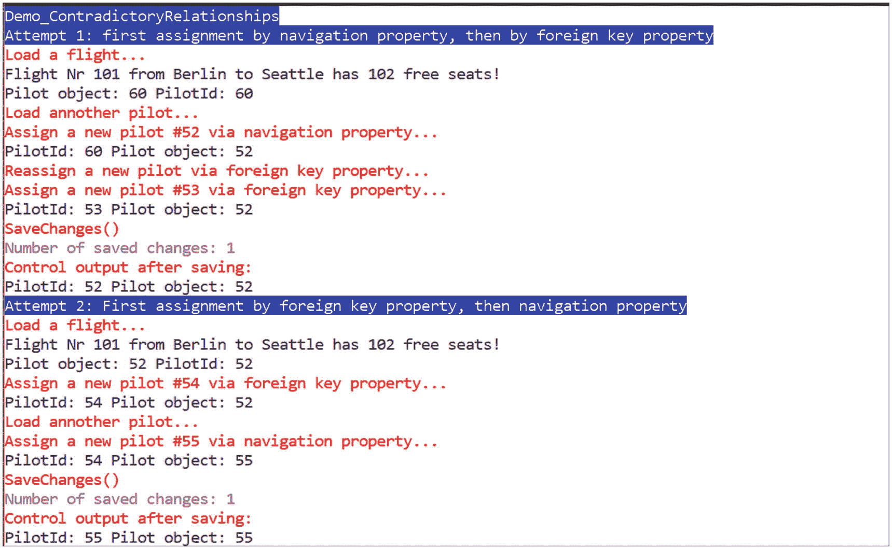

# 十、插入、删除和修改记录

在许多地方，与传统的实体框架相比，在实体框架核心中插入、删除和修改记录的 API 和方法保持不变。但是在细节上有一些变化，特别是当将多个变化合并到数据库管理系统的一个批处理往返中时。

您可以随时写入从数据库加载的实体对象。您不必在写操作之前“宣布”它们，也不必在写操作之后“注册它们”。实体框架核心的上下文类(更准确地说，是内置的变更跟踪器)跟踪标准系统中对象的所有变更(称为变更跟踪)。但是，如果对象是在非跟踪模式(例如使用`AsNoTracking()`)下加载的，则不会发生更改跟踪，这是专门设置的，或者上下文实例被破坏。

## 使用 SaveChanges()保存

清单 [10-1](#Par10) 展示了如何用`SingleOrDefault()`加载一个`Flight`对象。在这个`Flight`对象中，自由席位的数量减少了两个位置。此外，一些文本被写到`Flight`对象的`memo`属性中。

`SaveChanges()`方法用于存储数据库中的更改。它在基类`DbContext`中实现，并从那里继承到您在逆向工程中生成的上下文类，或者它在正向工程中创建自己。

`SaveChanges()`方法保存自加载以来的所有更改(新记录、已更改的记录和已删除的记录),或者保存当前上下文实例中加载的所有对象上的最后一个`SaveChanges()`方法。`SaveChanges()`向数据库发送一个`INSERT`、`UPDATE`或`DELETE`命令来保存每个更改。

Note

即使在实体框架核心中，不幸的是，当存在多个变更时，也不可能只保存单个变更。

当然，`SaveChanges()`只保存被改变的对象和被改变对象的被改变的属性。图 [10-1](#Fig1) 中显示的 SQL 输出证明了这一点。在`UPDATE`命令的`SET`部分，只有`FreeSeats`和`Memo`出现。您还可以看到,`UPDATE`命令返回已更改记录的数量。调用者从`SaveChanges()`接收这个数字作为返回值。

`UPDATE`命令只包含`WHERE`条件下的`FlightNo`值。换句话说，这里没有检查对象是否被另一个用户或后台进程更改。实体框架核心的标准是“最后一个胜出”的原则但是，您可以更改这种默认行为(参见第 [17 章](17.html))。只有当数据库中要更改的数据记录被删除时，调用者才会得到类型为`DbConcurrencyException`的运行时错误。然后，`UPDATE`命令从数据库管理系统返回零个记录受变更影响，实体框架核心将此视为变更冲突的指示。

清单 [10-1](#Par10) 打印了三次关于`Flight`对象的信息(更改前、更改后和保存后)。除了`FlightNo`(主键)和`Flight`路线(出发地和目的地)，还打印`FreeSeats`的编号和对象的当前状态。状态不能由实体对象本身决定，只能由带有`ctx.Entry(obj).State`的上下文类的`Entry()`方法决定。

```cs
  public static void ChangeFlightOneProperty()
  {
   CUI.MainHeadline(nameof(ChangeFlightOneProperty));

   int FlightNr = 101;
   using (WWWingsContext ctx = new WWWingsContext())
   {
    // Load flight
    var f = ctx.FlightSet.Find(FlightNr);

    Console.WriteLine($"Before changes: Flight #{f.FlightNo}: {f.Departure}->{f.Destination} has {f.FreeSeats} free seats! State of the flight object: " + ctx.Entry(f).State);

    // Change object in RAM
    f.FreeSeats -= 2;

    Console.WriteLine($"After changes: Flight #{f.FlightNo}: {f.Departure}->{f.Destination} has {f.FreeSeats} free seats! State of the flight object: " + ctx.Entry(f).State);

    // Persist changes
    try
    {
     var count = ctx.SaveChanges();
     if (count == 0)
     {
      Console.WriteLine("Problem: No changes saved!");
     }
     else
     {
      Console.WriteLine("Number of saved changes: " + count);
      Console.WriteLine($"After saving: Flight #{f.FlightNo}: {f.Departure}->{f.Destination} has {f.FreeSeats} free seats! State of the flight object: " + ctx.Entry(f).State);
     }
    }
    catch (Exception ex)
    {
     Console.WriteLine("Error: " + ex.ToString());
    }
   }
  }

Listing 10-1One changed Property of Flights is Saved

```

图 [10-1](#Fig1) 从实体框架核心的角度展示了对象的状态是如何变化的。装完后就是`Unchanged`。将 change 设置为`Modified`后，实体框架核心就知道对象发生了变化。用`SaveChanges()`救了之后，又是`Unchanged`。换句话说，RAM 中的状态再次对应于数据库中的状态。

当执行`SaveChanges()`方法时，很可能出现错误(例如，`dbConcurrencyException`)。因此，在清单 [10-1](#Par10) 中，有明确的`try-catch`到`SaveChanges()`。`SaveChanges()`上另一个典型的运行时错误是当。NET Framework 允许从数据库的角度写入未经授权的值。例如，如果这个列在数据库中有长度限制，那么使用`Memo`属性就会发生这种情况。既然琴弦在。NET 的长度基本上是无限的，从数据库的角度来看，可能会给属性分配一个太长的字符串。

Note

与经典的实体框架不同，实体框架核心在用`SaveChanges()`保存之前不做任何验证。换句话说，无效值首先被数据库管理系统注意到。在这种情况下，您会得到以下运行时错误:“Microsoft。EntityFrameworkCore . DbUpdateException:更新条目时出错。有关详细信息，请参见内部异常。然后，内部异常对象提供了错误的实际来源:“System。DataSqlClient.SqlException:字符串或二进制数据将被截断。


图 10-1

Output of Listing [10-1](#Par10)

下面是清单 [10-1](#Par10) 中实体框架核心在`SaveChanges()`发出的 SQL 命令:

```cs
exec sp_executesql N'SET NOCOUNT ON;
UPDATE [Flight] SET [FreeSeats] = @p0
WHERE [FlightNo] = @p1;
SELECT @@ROWCOUNT;
',N'@p1 int,@p0 smallint',@p1=101,@p0=114'

```

## 跟踪子对象的变更

变更跟踪在 Entity Framework Core(与其前身一样)中对变更的子对象起作用。清单 [10-2](#Par17) 加载`Flight`对象及其`Pilot`对象。对`Flight`对象以及连接的`Pilot`对象进行更改(增加`Pilot`的`Flight`时间)。`Pilot`对象的状态类似于`Flight`对象，从`Unchanged`变为`Modified`，并在`SaveChanges()`执行后再次变为`Unchanged`。

```cs
  public static void ChangeFlightAndPilot()
  {
   CUI.MainHeadline(nameof(ChangeFlightAndPilot));

   int flightNo = 101;
   using (WWWingsContext ctx = new WWWingsContext())
   {

    var f = ctx.FlightSet.Include(x => x.Pilot).SingleOrDefault(x => x.FlightNo == flightNo);

    Console.WriteLine($"After loading: Flight #{f.FlightNo}: {f.Departure}->{f.Destination} has {f.FreeSeats} free seats!\nState of the flight object: " + ctx.Entry(f).State + " / State of the Pilot object: " + ctx.Entry(f.Pilot).State);
    f.FreeSeats -= 2;
    f.Pilot.FlightHours = (f.Pilot.FlightHours ?? 0) + 10;
    f.Memo = $"Changed by User {System.Environment.UserName} on {DateTime.Now}.";

    Console.WriteLine($"After changes: Flight #{f.FlightNo}: {f.Departure}->{f.Destination} has {f.FreeSeats} free seats!\nState of the flight object: " + ctx.Entry(f).State + " / State of the Pilot object: " + ctx.Entry(f.Pilot).State);

    try
    {
     var count = ctx.SaveChanges();
     if (count == 0) Console.WriteLine("Problem: No changes saved!");
     else Console.WriteLine("Number of saved changes: " + count);
     Console.WriteLine($"After saving: Flight #{f.FlightNo}: {f.Departure}->{f.Destination} has {f.FreeSeats} free seats!\nState of the flight object: " + ctx.Entry(f).State + " / State of the Pilot object: " + ctx.Entry(f.Pilot).State);
    }
    catch (Exception ex)
    {
     Console.WriteLine("Error: " + ex.ToString());
    }
   }
  }

Listing 10-2Changes in Subobjects

```

以下是实体框架核心发送给`SaveChanges()`的 SQL 命令；它显示两个`UPDATE`命令被发送到数据库管理系统。图 [10-2](#Fig2) 显示了输出。


图 10-2

Output of the previous code

```cs
exec sp_executesql N'SET NOCOUNT ON;
UPDATE [Employee] SET [FlightHours] = @p0
WHERE [PersonID] = @p1;
SELECT @@ROWCOUNT;

UPDATE [Flight] SET [FreeSeats] = @p2, [Memo] = @p3
WHERE [FlightNo] = @p4;
SELECT @@ ROWCOUNT;

',N'@p1 int,@p0 int,@p4 int,@p2 smallint,@p3 nvarchar(4000)',@p1=57,@p0=40,@p4=101,@p2=104,@p3=N'Changed by User HS on 23/12/2017 00:53:12.'

```

## 组合命令(批处理)

与经典的实体框架相反，实体框架核心并不在其自身的往返行程中将每个`INSERT`、`UPDATE`或`DELETE`命令发送到数据库管理系统；相反，它将命令组合成更大的往返行程。这种功能称为批处理。

实体框架核心决定往返的命令摘要的大小。在对`Flight`数据集的大规模插入的测试中，300 个数据集用于两次往返；1000 次用于六次往返旅行；2000 被用于 11；5000 次用于数据库管理系统的 27 次往返。

除了`Add()`方法之外，在上下文类和`DbSet<EntityClass>`类上都有一个`AddRange()`方法，您可以向其传递要附加的对象列表。在经典的实体框架中，`AddRange()`比`Add()`要快得多，因为它消除了重复审查实体框架变更跟踪程序的需要。实体框架核心不再有在一个循环中调用`Add()`1000 次或者用一组 1000 个对象作为参数调用`AddRange()`一次的性能差异。图 [10-3](#Fig3) 中一个清晰可见的性能优势是由批处理产生的。但是如果你总是在`Add()`之后直接调用`SaveChanges()`，就不可能进行批处理(见图 [10-3](#Fig3) 中的第三条)。


图 10-3

Power measurement during mass insertion of 1,000 records

## 处理 foreach 循环注意事项

使用 Entity Framework，在使用转换操作符(如`ToList()`)进行迭代之前，没有必要显式具体化查询。一个带有`IQueryable`接口的对象上的`foreach`循环足以触发数据库查询。然而，在这种情况下，当循环运行时，数据库连接保持打开，记录由`IQueryable`接口的迭代器单独获取。这导致在数据获取`foreach`循环中调用`SaveChanges()`导致运行时错误，如清单 [10-3](#Par29) 和图 [10-4](#Fig4) 所示。

这里列出了三种解决方案:

*   最好的解决方案是在开始循环之前用`ToList()`完全具体化查询，并将`SaveChanges()`放在循环之后。这导致在一次或几次往返中传输所有变化。但是所有的变化都有一个交易！
*   如果请求多个事务中的改变，那么在循环之前至少应该执行`ToList()`。
*   或者，可以用`SaveChangesAsync()`代替`SaveChanges()`；更多信息见第 [13](13.html) 章。

Tip

使用带有`ToList()`的显式物化。


图 10-4

Error from running Listing [10-3](#Par29)

```cs
  public static void Demo_ForeachProblem()
  {
   CUI.Headline(nameof(Demo_ForeachProblem));
   WWWingsContext ctx = new WWWingsContext();
   // Define query
   var query = (from f in ctx.FlightSet.Include(p => p.BookingSet).ThenInclude(b => b.Passenger) where f.Departure == "Rome" && f.FreeSeats > 0 select f).Take(1);
   // Query is performed implicitly by foreach
   foreach (var Flight in query)
   {
    // Print results
    CUI.Print("Flight: " + Flight.FlightNo + " from " + Flight.Departure + " to " + Flight.Destination + " has " + Flight.FreeSeats + " free seats");

    foreach (var p in Flight.BookingSet)
    {
     CUI.Print(" Passenger  " + p.Passenger.GivenName + " " + p.Passenger.Surname);
    }

    // Save change to every flight object within the loop
    CUI.Print("  Start saving");
    Flight.FreeSeats--;
    ctx.SaveChangesAsync(); // SaveChanges() will produce ERROR!!!
    CUI.Print("  End saving");
   }
  }

Listing 10-3SaveChanges() Does Not Work Within a foreach Loop Unless You Have Previously Materialized the Records

```

## 添加新对象

要添加一条新记录(在 SQL 中，使用`INSERT`)，您可以使用实体框架核心执行以下步骤:

1.  用`new`操作符实例化对象(像往常一样在。网)。与经典实体框架中一样，工厂方法在实体框架核心中并不存在。
2.  从数据库模式的角度来看，填充对象，尤其是所有强制属性。
3.  通过 context 类中的`Add()`方法或 context 类中适当的`DbSet<EntityClass>`将对象附加到上下文中。
4.  调用`SaveChanges()`。

清单 [10-4](#Par37) 展示了如何创建一个`Flight`对象。强制要求是航班号(这里的主键不是自动增加的值，因此必须手动设置)、航线、出发、目的地和日期，以及与`Pilot`对象的关系。副驾驶是可选的。即使航空公司是强制字段，程序代码也可以在没有显式分配枚举值的情况下工作，因为实体框架核心将在这里使用默认值 0，这是数据库的有效值。

作为预先加载`Pilot`对象然后将其分配给`Flight`对象的替代方法，您可以通过使用`Flight`对象中的外键属性`PilotId`并在那里直接分配`Pilot`对象的主键:`f.PilotId = 234`来更有效地实现该任务。在这里，您将看到显式外键属性的优点，它可以节省数据库的往返行程。

```cs
  public static void AddFlight()
  {
   CUI.MainHeadline(nameof(AddFlight));

   using (WWWingsContext ctx = new WWWingsContext())
   {
    // Create flight in RAM
    var f = new Flight();
    f.FlightNo = 123456;
    f.Departure = "Essen";
    f.Destination = "Sydney";
    f.AirlineCode = "WWW";
    f.PilotId = ctx.PilotSet.FirstOrDefault().PersonID;
    f.Seats = 100;
    f.FreeSeats = 100;

    Console.WriteLine($"Before adding: Flight #{f.FlightNo}: {f.Departure}->{f.Destination} has {f.FreeSeats} free seats! State of the Flight object: " + ctx.Entry(f).State);

    // Add flight to context
    ctx.FlightSet.Add(f);
    // or: ctx.Add(f);

    Console.WriteLine($"After adding: Flight #{f.FlightNo}: {f.Departure}->{f.Destination} has {f.FreeSeats} free seats! State of the Flight object: " + ctx.Entry(f).State);

    try
    {
     var count = ctx.SaveChanges();
     if (count == 0) Console.WriteLine("Problem: No changes saved!");
     else Console.WriteLine("Number of saved changes: " + count);
     Console.WriteLine($"After saving: Flight #{f.FlightNo}: {f.Departure}->{f.Destination} has {f.FreeSeats} free seats! State of the Flight object: " + ctx.Entry(f).State);
    }
    catch (Exception ex)
    {
     Console.WriteLine("Error: " + ex.ToString());
    }

   }
  }

Listing 10-4Creating a New Flight

```

对象状态的顺序如下(见图 [10-5](#Fig5) ): `Detached`(在执行`Add()`之前，实体框架核心上下文不知道`Flight`的新实例，因此认为它是一个瞬态对象)，`Added`(在`add()`之后)，然后在保存`Unchanged`之后。顺便说一句，实体框架核心并不认为`Add()`的多次调用是错误的，但是`Add()`不需要被多次调用。

Note

您可以添加一个主键值尚不存在于当前上下文实例中的对象。如果你想删除一个对象，然后在相同的主键值下创建一个新的对象，你必须在`Remove()`之后、`Add()`之前执行`SaveChanges()`；否则，实体框架核心会报错，并显示以下错误消息:“System。InvalidOperationException:无法跟踪实体类型“Flight”的实例，因为已经在跟踪{“Flight no”}的另一个具有相同键值的实例。


图 10-5

Output from Listing [10-4](#Par37) (creating a Flight object)

## 创建相关对象

`Add()`方法不仅考虑作为参数传递的对象，还考虑与该对象相关联的对象。如果在状态`Detached`中作为参数传递的对象下有对象，它们被自动添加到上下文中，然后处于状态`Added`。

1:N 情况下的关系操作是在第 1 方通过用特定于列表的方法添加和删除列表来完成的，主要是用方法`Add()`和`Remove()`。对于双向关系，可以在第 1 端或第 N 端进行更改。在`Flight`和`Pilot`之间的双向关系的具体情况下，有三种等价的建立关系的方式，这里列出:

*   利用 1 侧的导航属性，所以`Flight` : `flight.Pilot = Pilot;`中的`Pilot`
*   使用`Flight` : `flight.PersonID = 123;`中的外键属性`PersonID`
*   使用 N 端的导航属性，换句话说，`Pilot`页面上的【T0:】页

清单 [10-5](#Par49) 展示了如何用一个新的`Pilot`对象、一个新的`AircraftType`对象和一个新的`AircraftTypeDetail`对象创建一个新的`Flight`。对`Flight`对象执行`Add()`就足够了。然后，实体框架核心向数据库发送`SaveChanges()`五个`INSERT`命令，每个命令对应一个表:`AircraftType`、`AircraftTypeDetail`、`Employees`(`Employee`和`Pilot`类实例的公共表)、`Persondetail`和`Flight`。

```cs
  public static void Demo_CreateRelatedObjects()
  {
   CUI.MainHeadline(nameof(Demo_CreateRelatedObjects));
   using (var ctx = new WWWingsContext())
   {
    ctx.Database.ExecuteSqlCommand("Delete from Booking where FlightNo = 456789");
    ctx.Database.ExecuteSqlCommand("Delete from Flight where FlightNo = 456789");

    var p = new Pilot();
    p.GivenName = "Holger";
    p.Surname = "Schwichtenberg";
    p.HireDate = DateTime.Now;
    p.LicenseDate = DateTime.Now;
    var pd = new Persondetail();
    pd.City = "Essen";
    pd.Country = "DE";
    p.Detail = pd;

    var act = new AircraftType();
    act.TypeID = (byte)(ctx.AircraftTypeSet.Max(x=>x.TypeID)+1);
    act.Manufacturer = "Airbus";
    act.Name = "A380-800";
    ctx.AircraftTypeSet.Add(act);
    ctx.SaveChanges();

    var actd = new AircraftTypeDetail();
    actd.TurbineCount = 4;
    actd.Length = 72.30f;
    actd.Tare = 275;
    act.Detail = actd;

    var f = new Flight();
    f.FlightNo = 456789;
    f.Pilot = p;
    f.Copilot = null;
    f.Seats = 850;
    f.FreeSeats = 850;
    f.AircraftType = act;

    // One Add() is enough for all related objects!
    ctx.FlightSet.Add(f);
    ctx.SaveChanges();

    CUI.Print("Total number of flights: " + ctx.FlightSet.Count());
    CUI.Print("Total number of pilots: " + ctx.PilotSet.Count());
   }
  }

Listing 10-5Creation of a New Pilot’s Flight with Persondetail, New AircraftType, and AircraftTypeDetail

```

图 [10-6](#Fig6) 显示了这五个`INSERT`命令的输出。


图 10-6

Batch updating makes only three round-trips for five INSERT commands

## 更改链接对象

实体框架核心还检测实体对象之间的关系变化，并自动保存在`SaveChanges()`中。就像最初用`Pilot`创建一个`Flight`对象一样，在理想情况下有三个改变关系的选项(带有外键属性的双向关系):

*   使用`Flight` : `Flight.Pilot = Pilot;`中的导航属性`Pilot`
*   使用`Flight` : `Flight.PersonID = 123;`中的外键属性`PilotId`
*   使用`Pilot`页面上的导航属性`FlightAsPilotSet`:`Pilot.FlightAsPilotSet.Add (Flight);`

在所有这三种情况下，实体框架核心都向数据库发送`SaveChanges()`。通过执行`SaveChanges()`，实体框架核心正确地不对`Pilot`表中的数据库进行任何更改，而是对`Flight`表中的数据库进行任何更改，因为`Flight`表具有建立`Pilot`和`Flight`之间关系的外键。

```cs
exec sp_executesql N'SET NOCOUNT ON;
UPDATE [Flight] SET [PilotId] = @p0
WHERE [FlightNo] = @p1;
SELECT @@ ROWCOUNT;
', N' @p1 int, @p0 int ', @p1 = 101, @p0 = 123

```

Tip

要删除关系，您可以简单地分配零或什么都不分配。

清单 [10-6](#Par61) 显示了一个新`Pilot`到一个`Flight`的赋值。然而，这种分配不是通过`Flight101.Pilot = newPilot`(1 侧)进行的，而是通过`newPilot.FlightAsPilotSet.Add(flight101)`在`Pilot`侧(N 侧)进行的。这个清单的输出是令人兴奋的；见图 [10-7](#Fig7) 。你可以看到，一开始，一个飞行员有 31 次飞行，另一个有 10 次飞行。分配后，新的`Pilot`有 11 个班次，旧的`Pilot`还是 31 个班次，不对。另外，`flight101.Pilot`还是指旧的`Pilot`，这也不对。

然而，在运行`SaveChanges()`之后，对象关系已经被纠正。现在旧的`Pilot`只有 30 个航班。另外，`flight101.Pilot`指的是新的`Pilot`。实体框架核心的这一特性被称为关系修复。作为关系修正操作的一部分，实体框架核心检查当前在 RAM 中的对象之间的所有关系，并且如果在另一侧发生了变化，也在另一侧改变它们。使用`SaveChanges()`保存时，实体框架核心运行关系修复操作。

通过执行方法`ctx.ChangeTracker.DetectChanges()`，您可以在任何时候强制执行关系修复操作。如果许多对象已经被加载到一个上下文实例中，`DetectChanges()`可能会花费许多毫秒。因此，在实体框架核心中，微软不会在很多地方自动调用`DetectChanges()`，而是由您来决定何时需要对象关系的一致状态并使用`DetectChanges()`。图 [10-7](#Fig7) 显示了输出。


图 10-7

Output of Listing [10-6](#Par61) (the relationship fixup works)

```cs
  public static void Demo_RelationhipFixup1N()
  {
   CUI.MainHeadline(nameof(Demo_RelationhipFixup1N));
   using (var ctx = new WWWingsContext())
   {
    // Load a flight
    var flight101 = ctx.FlightSet.SingleOrDefault(x => x.FlightNo == 101);
    Console.WriteLine($"Flight Nr {flight101.FlightNo} from {flight101.Departure} to {flight101.Destination} has {flight101.FreeSeats} free seats!");

    // Load the pilot for this flight with the list of his flights
    var oldPilot = ctx.PilotSet.Include(x => x.FlightAsPilotSet).SingleOrDefault(x => x.PersonID == flight101.PilotId);
    Console.WriteLine("Pilot: " + oldPilot.PersonID + ": " + oldPilot.GivenName + " " + oldPilot.Surname + " has " + oldPilot.FlightAsPilotSet.Count + " flights as pilot!");

    // Next pilot in the list load with the list of his flights
    var newPilot = ctx.PilotSet.Include(x => x.FlightAsPilotSet).SingleOrDefault(x => x.PersonID == flight101.PilotId + 1);
    Console.WriteLine("Planned Pilot: " + newPilot.PersonID + ": " + newPilot.GivenName + " " + newPilot.Surname + " has " + newPilot.FlightAsPilotSet.Count + " flights as pilot!");

    // Assign to Flight
    CUI.Print("Assignment of the flight to the planned pilot...", ConsoleColor.Cyan);
    newPilot.FlightAsPilotSet.Add(flight101);

    // optional:force Relationship Fixup
    // ctx.ChangeTracker.DetectChanges();

    CUI.Print("Output before saving: ", ConsoleColor.Cyan);
    Console.WriteLine("Old pilot: " + oldPilot.PersonID + ": " + oldPilot.GivenName + " " + oldPilot.Surname + " has " + oldPilot.FlightAsPilotSet.Count + " flights as a pilot!");
    Console.WriteLine("New pilot: " + newPilot.PersonID + ": " + newPilot.GivenName + " " + newPilot.Surname + " has " + newPilot.FlightAsPilotSet.Count + " flights as a pilot!");
    var pilotAktuell = flight101.Pilot; // Current Pilot in the Flight object
    Console.WriteLine("Pilot for flight " + flight101.FlightNo + " is currently: " + pilotAktuell.PersonID + ": " + pilotAktuell.GivenName + " " + pilotAktuell.Surname);

    // SaveChanges()()
    CUI.Print("Saving... ", ConsoleColor.Cyan);
    var count = ctx.SaveChanges();
    CUI.MainHeadline("Number of saved changes: " + count);

    CUI.Print("Output after saving: ", ConsoleColor.Cyan);
    Console.WriteLine("Old Pilot: " + oldPilot.PersonID + ": " + oldPilot.GivenName + " " + pilotAlt.Surname + " has " + pilotAlt.FlightAsPilotSet.Count + " flights as pilot!");
    Console.WriteLine("New Pilot: " + newPilot.PersonID + ": " + newPilot.GivenName + " " + newPilot.Surname + " has " + newPilot.FlightAsPilotSet.Count + " flights as pilot!");
    pilotAktuell = flight101.Pilot; // Current pilot from the perspective of the Flight object
    Console.WriteLine("Pilot for Flight " + flight101.FlightNo + " is now: " + pilotAktuell.PersonID + ": " + pilotAktuell.GivenName + " " + pilotAktuell.Surname);
   }
  }

Listing 10-6Making a 1:N Relationship Across the First Page

```

## 处理矛盾的关系

如果像前面解释的那样，有多达三种方法来建立对象之间的关系，那么当多个选项与矛盾的数据并行使用时会发生什么？

列表 [10-7](#Par67) ，结合图 [10-8](#Fig8) 和图 [10-9](#Fig9) 的输出，显示优先级如下:

*   最高优先级是设置在 1 侧的对象的值，所以在关系`Pilot<->Flight` (1:N)的情况下，来自`Pilot.FlightAsPilotSet`的值是第一个。
*   第二高的优先级是来自 N 侧的单个对象的值。换句话说，在`Pilot<->Flight` (1:N)的情况下，是来自`Flight.Pilot`的值。
*   只有这样，N 端才会考虑外键属性。换句话说，在`Pilot: Flight` (1:N)的情况下，是来自`Flight.PersonID`的值。


图 10-9

Output of Listing [10-7](#Par67) (part 2)



图 10-8

Output of Listing [10-7](#Par67) (part 1)

```cs
using System;
using System.Linq;
using DA;
using EFC_Console;
using ITVisions;
using Microsoft.EntityFrameworkCore;
namespace EFC_Console
{
 class ContradictoryRelationships
 {
  /// <summary>
  /// Four test scenarios for the question of which value has priority, if the relationship is set contradictory
  /// </summary>
  [EFCBook()]
  public static void Demo_ContradictoryRelationships()
  {
   CUI.MainHeadline(nameof(Demo_ContradictoryRelationships));
   Attempt1();
   Attempt2();
   Attempt3();
   Attempt4();
  }

  public static int pilotID = new WWWingsContext().PilotSet.Min(x => x.PersonID);

  public static int GetPilotIdEinesFreienPilots()
  {
   // here we assume that the next one in the list has time for this flight :-)
   pilotID++; return pilotID;
  }

  private static void Attempt1()
  {
   using (var ctx = new WWWingsContext())
   {
    CUI.MainHeadline("Attempt 1: first assignment by navigation property, then by foreign key property");
    CUI.PrintStep("Load a flight...");
    var flight101 = ctx.FlightSet.Include(f => f.Pilot).SingleOrDefault(x => x.FlightNo == 101);
    Console.WriteLine($"Flight Nr {flight101.FlightNo} from {flight101.Departure} to {flight101.Destination} has {flight101.FreeSeats} free seats!");
    CUI.Print("Pilot object: " + flight101.Pilot.PersonID + " PilotId: " + flight101.PilotId);

    CUI.PrintStep("Load another pilot...");
    var newPilot2 = ctx.PilotSet.Find(GetPilotIdEinesFreienPilots()); // next Pilot
    CUI.PrintStep($"Assign a new pilot #{newPilot2.PersonID} via navigation property...");
    flight101.Pilot = newPilot2;
    CUI.Print($"PilotId: {flight101.PilotId} Pilot object: {flight101.Pilot?.PersonID}");

    CUI.PrintStep("Reassign a new pilot via foreign key property...");
    var neuePilotID = GetPilotIdEinesFreienPilots();
    CUI.PrintStep($"Assign a new pilot #{neuePilotID} via foreign key property...");
    flight101.PilotId = neuePilotID;
    CUI.Print($"PilotId: {flight101.PilotId} Pilot object: {flight101.Pilot?.PersonID}");

    CUI.PrintStep("SaveChanges()");
    var anz2 = ctx.SaveChanges();
    CUI.PrintSuccess("Number of saved changes: " + anz2);

    CUI.PrintStep("Control output after saving: ");
    CUI.Print($"PilotId: {flight101.PilotId} Pilot object: {flight101.Pilot?.PersonID}");
   }
  }

  private static void Attempt2()
  {
   using (var ctx = new WWWingsContext())
   {
    CUI.MainHeadline("Attempt 2: First assignment by foreign key property, then navigation property");
    CUI.PrintStep("Load a flight...");
    var flight101 = ctx.FlightSet.Include(f => f.Pilot).SingleOrDefault(x => x.FlightNo == 101);
    Console.WriteLine($"Flight Nr {flight101.FlightNo} from {flight101.Departure} to {flight101.Destination} has {flight101.FreeSeats} free seats!");
    CUI.Print("Pilot object: " + flight101.Pilot.PersonID + " PilotId: " + flight101.PilotId);

    var neuePilotID2 = GetPilotIdEinesFreienPilots();
    CUI.PrintStep($"Assign a new pilot #{neuePilotID2} via foreign key property...");
    flight101.PilotId = neuePilotID2;
    CUI.Print($"PilotId: {flight101.PilotId} Pilot object: {flight101.Pilot?.PersonID}");

    CUI.PrintStep("Load another pilot...");
    var newPilot1 = ctx.PilotSet.Find(GetPilotIdEinesFreienPilots()); // next Pilot
    CUI.PrintStep($"Assign a new pilot #{newPilot1.PersonID} via navigation property...");
    flight101.Pilot = newPilot1;
    CUI.Print($"PilotId: {flight101.PilotId} Pilot object: {flight101.Pilot?.PersonID}");

    CUI.PrintStep("SaveChanges()");
    var anz2 = ctx.SaveChanges();
    CUI.PrintSuccess("Number of saved changes: " + anz2);

    CUI.PrintStep("Control output after saving: ");
    CUI.Print($"PilotId: {flight101.PilotId} Pilot object: {flight101.Pilot?.PersonID}");
   }
  }

  private static void Attempt3()
  {
   using (var ctx = new WWWingsContext())
   {
    CUI.MainHeadline("Attempt 3: Assignment using FK, then Navigation Property at Flight, then Navigation Property at Pilot");
    CUI.PrintStep("Load a flight...");
    var flight101 = ctx.FlightSet.Include(f => f.Pilot).SingleOrDefault(x => x.FlightNo == 101);
    Console.WriteLine($"Flight No {flight101.FlightNo} from {flight101.Departure} to {flight101.Destination} has {flight101.FreeSeats} free seats!");
    CUI.Print("Pilot object: " + flight101.Pilot.PersonID + " PilotId: " + flight101.PilotId);

    var neuePilotID3 = GetPilotIdEinesFreienPilots();
    CUI.PrintStep($"Assign a new pilot #{neuePilotID3} via foreign key property...");
    flight101.PilotId = neuePilotID3;
    CUI.Print("flight101.PilotId=" + flight101.PilotId);
    CUI.Print($"PilotId: {flight101.PilotId} Pilot object: {flight101.Pilot?.PersonID}");

    CUI.PrintStep("Load another pilot...");
    var newPilot3a = ctx.PilotSet.Find(GetPilotIdEinesFreienPilots()); // next Pilot
    CUI.PrintStep($"Assign a new pilot #{newPilot3a.PersonID} via navigation property in Flight object...");
    flight101.Pilot = newPilot3a;
    CUI.Print($"PilotId: {flight101.PilotId} Pilot object: {flight101.Pilot?.PersonID}");

    CUI.PrintStep("Load another Pilot...");
    var newPilot3b = ctx.PilotSet.Include(p => p.FlightAsPilotSet).SingleOrDefault(p => p.PersonID == GetPilotIdEinesFreienPilots()); // next Pilot
    CUI.PrintStep($"Assign a new pilot #{newPilot3b.PersonID} via navigation property in Pilot object...");
    newPilot3b.FlightAsPilotSet.Add(flight101);
    CUI.Print($"PilotId: {flight101.PilotId} Pilot object: {flight101.Pilot?.PersonID}");

    CUI.PrintStep("SaveChanges()");
    var anz3 = ctx.SaveChanges();
    CUI.PrintSuccess("Number of saved changes: " + anz3);

    CUI.PrintStep("Control output after saving: ");
    CUI.Print($"PilotId: {flight101.PilotId} Pilot object: {flight101.Pilot?.PersonID}");

   }
  }

  private static void Attempt4()
  {
   using (var ctx = new WWWingsContext())
   {
    CUI.MainHeadline("Attempt 4: First assignment by FK, then Navigation Property at Pilot, then Navigation Property at Flight");
    CUI.PrintStep("Load a flight...");
    var flight101 = ctx.FlightSet.Include(f => f.Pilot).SingleOrDefault(x => x.FlightNo == 101);
    Console.WriteLine($"Flight Nr {flight101.FlightNo} from {flight101.Departure} to {flight101.Destination} has {flight101.FreeSeats} free seats!");
    CUI.Print("Pilot object: " + flight101.Pilot.PersonID + " PilotId: " + flight101.PilotId);

    var neuePilotID4 = GetPilotIdEinesFreienPilots();
    CUI.PrintStep($"Assign a new pilot #{neuePilotID4} via foreign key property...");
    flight101.PilotId = neuePilotID4;
    CUI.Print("flight101.PilotId=" + flight101.PilotId);
    CUI.Print($"PilotId: {flight101.PilotId} Pilot object: {flight101.Pilot?.PersonID}");

    CUI.PrintStep("Load another pilot...");
    var newPilot4b = Queryable.SingleOrDefault(ctx.PilotSet.Include(p => p.FlightAsPilotSet), p => p.PersonID == GetPilotIdEinesFreienPilots()); // next Pilot
    CUI.PrintStep($"Assign a new pilot #{newPilot4b.PersonID} via navigation property...");
    newPilot4b.FlightAsPilotSet.Add(flight101);
    CUI.Print($"PilotId: {flight101.PilotId} Pilot object: {flight101.Pilot?.PersonID}");

    CUI.PrintStep("Load another Pilot...");
    var newPilot4a = ctx.PilotSet.Find(GetPilotIdEinesFreienPilots()); // next Pilot
    CUI.PrintStep($"Assign a new pilot #{newPilot4a.PersonID} via navigation property in Flight object...");
    flight101.Pilot = newPilot4a;
    CUI.Print($"PilotId: {flight101.PilotId} Pilot object: {flight101.Pilot?.PersonID}");

    CUI.PrintStep("SaveChanges()");
    var anz4 = ctx.SaveChanges();
    CUI.PrintSuccess("Number of saved changes: " + anz4);

    CUI.PrintStep("Control output after saving: ");
    CUI.Print($"PilotId: {flight101.PilotId} Pilot object: {flight101.Pilot?.PersonID}");
   }
  }
 }
}

Listing 10-7Four Test Scenarios for the Question of Which Value Has Priority When the Relationship Is Contradictory

```

## 删除对象

本节介绍删除对象和数据库中相应行的不同方法。

### 使用 Remove()删除对象

要删除一个对象，你必须调用`Remove()`方法，它和`Add()`一样，要么直接存在于上下文类中(从`DbContext`继承而来)，要么存在于上下文类的`DbSet<EntityClass>`属性中(参见清单 [10-8](#Par70) )。调用`Remove()`导致加载的`Flight`对象从`Unchanged`状态变为`Delete`状态(见图 [10-10](#Fig10) )。但是，它尚未从数据库中删除。只有通过调用`SaveChanges()`方法，才会向数据库管理系统发送一个`DELETE`命令。


图 10-10

Output of Listing [10-8](#Par70)

```cs
  public static void RemoveFlight()
  {
  CUI.MainHeadline(nameof(RemoveFlight));

   using (WWWingsContext ctx = new WWWingsContext())
   {
    var f = ctx.FlightSet.SingleOrDefault(x => x.FlightNo == 123456);
    if (f == null) return;

    Console.WriteLine($"After loading: Flight #{f.FlightNo}: {f.Departure}->{f.Destination} has {f.FreeSeats} free seats! State of the flight object: " + ctx.Entry(f).State);

    // Remove flight
    ctx.FlightSet.Remove(f);
    // or: ctx.Remove(f);

    Console.WriteLine($"After deleting: Flight #{f.FlightNo}: {f.Departure}->{f.Destination} has {f.FreeSeats} free seats! State of the flight object: " + ctx.Entry(f).State);

    try
    {
     var count = ctx.SaveChanges();
     if (count == 0) Console.WriteLine("Problem: No changes saved!");
     else Console.WriteLine("Number of saved changes: " + count);
     Console.WriteLine($"After saving: Flight #{f.FlightNo}: {f.Departure}->{f.Destination} has {f.FreeSeats} free seats! State of the flight object: " + ctx.Entry(f).State);
    }
    catch (Exception ex)
    {
     Console.WriteLine("Error: " + ex.ToString());
    }
   }
  }

Listing 10-8Deleting a Flight Record

```

下面是清单 [10-8](#Par70) 中实体框架核心发出的 SQL 命令:

```cs
SELECT TOP(2) [x].[FlightNo], [x].[AircraftTypeID], [x].[AirlineCode], [x].[CopilotId], [x].[FlightDate], [x].[Departure], [x].[Destination], [x].[FreeSeats], [x].[LastChange], [x].[Memo], [x].[NonSmokingFlight], [x].[PilotId], [x].[Price], [x].[Seats], [x].[Strikebound], [x].[Utilization]
FROM [Flight] AS [x]
WHERE [x].[FlightNo] = 123456

exec sp_executesql N'SET NOCOUNT ON;
DELETE FROM [Flight]
WHERE [FlightNo] = @p0;
SELECT @@ROWCOUNT;
',N'@p0 int',@p0=123456

```

### 删除带有虚拟对象的对象

在前面的代码中，完全加载`Flight`对象效率很低；您只发送删除命令。清单 [10-9](#Par77) 显示了一个解决方案，它通过在 RAM 中创建一个`Flight`对象来避免这种到数据库管理系统的往返，其中只有主键被设置为要删除的对象。然后用`Attach()`将这个虚拟对象附加到上下文中。这使得对象的状态从`Detached`变为`Unchanged`。最后，你执行`Remove()`和`SaveChanges()`。这个技巧是可行的，因为实体框架只需要知道删除的主键。

请注意以下关于此技巧的内容:

*   这里调用的是方法`Attach()`，不是`Add()`；否则，实体框架核心会将虚拟对象视为新对象。
*   只有在实体框架核心中没有配置冲突检查时，这个技巧才有效。但是，如果模型设置为在保存时比较其他列的值，则必须用虚拟对象中的当前值填充这些值。否则，无法删除对象，并出现`DbConcurrenyException`。

```cs
  public static void RemoveFlightWithKey()
  {
   Console.WriteLine(nameof(RemoveFlightWithKey));

   using (WWWingsContext ctx = new WWWingsContext())
   {
    // Create a dummy object
    var f = new Flight();
    f.FlightNo = 123456;

    Console.WriteLine($"After creation: Flight #{f.FlightNo}: {f.Departure}->{f.Destination} has {f.FreeSeats} free seats! State of the flight object: " + ctx.Entry(f).State);

    // Append dummy object to context
    ctx.Attach(f);

    Console.WriteLine($"After attach: Flight #{f.FlightNo}: {f.Departure}->{f.Destination} has {f.FreeSeats} free seats! State of the flight object: " + ctx.Entry(f).State);

    // Delete flight
    ctx.FlightSet.Remove(f);
    // or: ctx.Remove(f);

    Console.WriteLine($"After remove: Flight #{f.FlightNo}: {f.Departure}->{f.Destination} has {f.FreeSeats} free seats! State of the flight object: " + ctx.Entry(f).State);

    try
    {
     var count = ctx.SaveChanges();
     if (count == 0) Console.WriteLine("Problem: No changes saved!");
     else Console.WriteLine("Number of saved changes: " + count);
     Console.WriteLine($"After saving: Flight #{f.FlightNo}: {f.Departure}->{f.Destination} has {f.FreeSeats} free seats! State of the flight object: " + ctx.Entry(f).State);
    }
    catch (Exception ex)
    {
     Console.WriteLine("Error: " + ex.ToString());
    }
   }
  }

Listing 10-9Deleting a Flight Record More Efficiently with a Dummy Object

```

### 批量删除

`Remove()`方法不适合`Delete from Flight where FlightNo> 10000`中定义的批量删除，因为实体框架核心将在每种情况下为每个对象生成一个`DELETE`命令。实体框架核心没有认识到许多`DELETE`命令可以合并成一个命令。在这种情况下，您应该总是依赖经典技术(SQL 或存储过程),因为在这里使用`Remove()`会慢很多倍。另一个选项是扩展 EFPlus(参见第 [20 章](20.html))。

## 执行数据库事务

请注意以下关于数据库事务的要点:

*   当您运行`SaveChanges()`时，Entity Framework Core 总是自动进行一个事务，这意味着在上下文中所做的所有更改都被持久化，或者都不被持久化。
*   如果您需要一个跨越对`SaveChanges()`方法的多次调用的事务，您必须使用`ctx.Database.BeginTransaction()`、`Commit()`和`Rollback()`来完成。
*   `System.Transactions.Transactions.TransactionScope`在实体框架核心中尚不支持。实体框架核心 2.1 版将支持；参见附录 [C](23.html) 。

Tip

最好的交易是你避免的交易。事务总是对应用的性能、可伸缩性和健壮性产生负面影响。

### 例 1

以下示例显示了对一个`Flight`对象进行两次更改的事务，这两次更改分别由`SaveChanges()`独立保存:

```cs
  public static void ExplicitTransactionTwoSaveChanges()
  {

   Console.WriteLine(nameof(ExplicitTransactionTwoSaveChanges));
   using (var ctx = new WWWingsContext())
   {
    // Start transaction. Default is System.Data.IsolationLevel.ReadCommitted
    using (var t = ctx.Database.BeginTransaction(System.Data.IsolationLevel.ReadCommitted))
    {
     // Print isolation level
     RelationalTransaction rt = t as RelationalTransaction;
     DbTransaction dbt = rt.GetDbTransaction();
     Console.WriteLine("Transaction with Level: " + dbt.IsolationLevel);

     // Read data
     int FlightNr = ctx.FlightSet.OrderBy(x => x.FlightNo).FirstOrDefault().FlightNo;
     var f = ctx.FlightSet.Where(x => x.FlightNo == FlightNr).SingleOrDefault();

     Console.WriteLine("Before: " + f.ToString());

     // Change data and save
     f.FreeSeats--;
     var count1 = ctx.SaveChanges();
     Console.WriteLine("Number of saved changes: " + count1);

     //  Change data again and save
     f.Memo = "last changed at " + DateTime.Now.ToString();
     var count2 = ctx.SaveChanges();
     Console.WriteLine("Number of saved changes: " + count2);

     Console.WriteLine("Commit or Rollback? 1 = Commit, other = Rollback");
     var input = Console.ReadKey().Key;
     if (input == ConsoleKey.D1)
     { t.Commit(); Console.WriteLine("Commit done!"); }
     else
     { t.Rollback(); Console.WriteLine("Rollback done!"); }

     Console.WriteLine("After in RAM: " + f.ToString());
     ctx.Entry(f).Reload();
     Console.WriteLine("After in DB: " + f.ToString());
    }
   }
  }

```

### 例 2

以下示例显示了对表`Booking` ( `insert a new booking`)和表`Flight`(减少自由选择的数量)进行更改的事务。这里，事务通过一个上下文类的两个不同的上下文实例发生。如果两个不同的上下文类引用同一个数据库，也可以通过它们进行事务处理。

请注意以下几点:

*   数据库连接是单独创建和打开的。
*   该事务在此连接上打开。
*   上下文实例不打开自己的连接，而是使用打开的连接。为此，数据库连接对象被传递到上下文类的构造函数中，并保存在那里。在`OnConfiguring()`中，这个数据库连接对象必须和`UseSqlServer()`或者类似的一起使用，而不是将连接字符串作为参数传递！
*   实例化后，事务对象必须被传递给`ctx.Database.UseTransaction()`。

Note

未能提前打开连接并将其传递给相关的上下文实例将导致以下运行时错误:“指定的事务与当前连接不相关联。只能使用与当前连接相关联的事务。

图 [10-11](#Fig11) 显示了输出。


图 10-11

Output of the previous example

```cs
  public static void ExplicitTransactionTwoContextInstances()
  {
 CUI.MainHeadline(nameof(ExplicitTransactionTwoContextInstances));

   // Open shared connection
   using (var connection = new SqlConnection(Program.CONNSTRING))
   {
    connection.Open();
    // Start transaction. Default is System.Data.IsolationLevel.ReadCommitted
    using (var t = connection.BeginTransaction(System.Data.IsolationLevel.ReadCommitted))
    {
     // Print isolation level
     Console.WriteLine("Transaction with Level: " + t.IsolationLevel);
     int flightNo;

     using (var ctx = new WWWingsContext(connection))
     {
      ctx.Database.UseTransaction(t);
      var all = ctx.FlightSet.ToList();

      var flight = ctx.FlightSet.Find(111);
      flightNo = flight.FlightNo;
      ctx.Database.ExecuteSqlCommand("Delete from booking where flightno= " + flightNo);
      var pasID = ctx.PassengerSet.FirstOrDefault().PersonID;

      // Create and persist booking
      var b = new BO.Booking();
      b.FlightNo = flightNo;
      b.PassengerID = pasID;
      ctx.BookingSet.Add(b);
      var count1 = ctx.SaveChanges();
      Console.WriteLine("Numer of bookings saved: " + count1);
     }

     using (var ctx = new WWWingsContext(connection))
     {
      ctx.Database.UseTransaction(t);

      // Change free seats and save
      var f = ctx.FlightSet.Find(flightNo);
      Console.WriteLine("BEFORE: " + f.ToString());
      f.FreeSeats--;
      f.Memo = "last changed at " + DateTime.Now.ToString();
      Console.WriteLine("AFTER: " + f.ToString());
      var count2 = ctx.SaveChanges();
      Console.WriteLine("Number of saved changes: " + count2);

      Console.WriteLine("Commit or Rollback? 1 = Commit, other = Rollback");
      var input = Console.ReadKey().Key;
      Console.WriteLine();
      if (input == ConsoleKey.D1)
      {t.Commit(); Console.WriteLine("Commit done!");}
      else
      {t.Rollback(); Console.WriteLine("Rollback done!");}

      Console.WriteLine("After in RAM: " + f.ToString());
      ctx.Entry(f).Reload();
      Console.WriteLine("After in DB: " + f.ToString());
     }
    }
   }
  }

```

## 使用更改跟踪器

内置于实体框架核心中的变更跟踪器监视连接到实体框架核心上下文的所有对象的变更，可以通过程序代码在任何时候进行查询。

### 获取对象的状态

因为实体框架核心与普通的旧 CLR 对象(POCOs)一起工作，这些对象具有实体对象而不是基类，并且实现接口，所以实体对象不知道它们的上下文类或状态。

要查询对象状态，不要询问实体对象本身，而是询问上下文类的`ChangeTracker`对象。`ChangeTracker`对象有一个`Entry()`方法，为给定的`Entity`对象返回一个关联的`EntryObject<EntityType>`。该对象拥有以下内容:

*   `ChangeTracker`对象有一个`EntityState`类型的`State`属性，它是一个枚举类型，值为`Added`、`Deleted`、`Detached`、`Modified`和`Unchanged`。
*   在属性中，您可以找到一个以`PropertyEntry`对象形式的实体对象的所有属性的列表。每个`PropertyEntry`对象都有一个`IsModified`属性，指示属性是否被更改，以及旧值(`OriginalValue`和新值(`CurrentValue`)。
*   使用`EntryObject<EntityType>`，您也可以通过使用`Property`方法指定一个 lambda 表达式来直接获得一个特定的`PropertyEntry`对象。
*   `GetDatabaseValues()`用于从数据库中获取对象的当前状态。

清单 [10-10](#Par107) 中的子程序加载一个`Flight`(第一个)并修改这个`Flight`对象。在程序开始时，不仅为`Flight`对象本身创建了一个变量，还为`EntryObject<Flight>`创建了一个`entryObj`变量，为`PropertyEntry`对象创建了`propObj`。

加载`Flight`后，`entryObj`和`propObj`首先被`ChangeTracker`对象的对象填充。实体对象处于`Unchanged`状态，`FreeSeats`属性返回`IsModified False`。然后对象在属性`FreeSeats`中被改变。实体对象现在处于`Modified`状态，`FreeSeats`的`IsModified`返回`True`。

Note

重要的是从上下文的`ChangeTracker`对象中检索信息；`EntryObject<Flight>`和`PropertyEntry`的实例不会随着实体对象的改变而自动更新，而是反映了检索时的当前状态。

因此，您还必须在从`ChangeTracker`对象调用`SaveChanges()`方法后第三次请求这些对象。在`SaveChanges()`之后，实体对象的状态再次变为`Unchanged`，属性`FreeSeats`返回`IsModified False`。

该例程还循环遍历`EntryObject<Flight>`的`Properties`属性，以使用数据库的旧值和新值以及当前值返回实体对象的所有修改属性。该值可使用`EntryObject<Flight>`中的`GetDatabaseValues()`方法确定。然后`GetDatabaseValues()`对数据库进行查询，并用数据库中的所有当前值填充一个`PropertyValues`列表。数据库中的这些值可能与实体框架核心知道的值不同，并且在`OriginalValue`属性中可见，另一个进程(或同一进程中的另一个实体框架核心上下文)同时保存了对记录的更改。在这种情况下，发生了数据冲突。图 [10-12](#Fig12) 显示了输出。


图 10-12

Output

```cs
  /// </summary>
  public static void ChangeTracking_OneObject()
  {
   CUI.MainHeadline(nameof(ChangeTracking_OneObject));

   Flight flight;
   EntityEntry<BO.Flight> entryObj;
   PropertyEntry propObj;

   using (var ctx = new WWWingsContext())
   {

    CUI.Headline("Loading Object...");
    flight = (from y in ctx.FlightSet select y).FirstOrDefault();

    // Access Change Tracker
    entryObj = ctx.Entry(flight);
    propObj = entryObj.Property(f => f.FreeSeats);
    Console.WriteLine(" Object state: " + entryObj.State);
    Console.WriteLine(" Is FreeSeats modified?: " + propObj.IsModified);

    CUI.Headline("Changing Object...");
    flight.FreeSeats--;

    // Access Change Tracker again
    entryObj = ctx.Entry(flight);
    propObj = entryObj.Property(f => f.FreeSeats);
    Console.WriteLine(" Object state: " + entryObj.State);
    Console.WriteLine(" Is FreeSeats modified?: " + propObj.IsModified);

    // Print old and new values
    if (entryObj.State == EntityState.Modified)
    {
     foreach (PropertyEntry p in entryObj.Properties)
     {
      if (p.IsModified)
       Console.WriteLine(" " + p.Metadata.Name + ": " + p.OriginalValue + "->" + p.CurrentValue +
                         " / State in database: " + entryObj.GetDatabaseValues()[p.Metadata.Name]);
     }
    }

    CUI.Headline("Save...");
    int count = ctx.SaveChanges();
    Console.WriteLine(" Number of changes: " + count);

    // Update of the Objects of the Change Tracker
    entryObj = ctx.Entry(flight);
    propObj = entryObj.Property(f => f.FreeSeats);
    Console.WriteLine(" Object state: " + entryObj.State);
    Console.WriteLine(" Is FreeSeats modified?: " + propObj.IsModified);
   }
  }

Listing 10-10Querying the Change Tracker for a Changed Object

```

### 列出所有已更改的对象

`ChangeTracker`对象不仅可以提供单个对象的信息，还可以提供它使用其`Entries()`方法监控的所有实体对象的列表。然后，您可以根据所需的状态过滤实体对象。

清单 [10-11](#Par111) 中的例程修改三个航班，然后创建一个值为 123456 的航班(如果它还不存在的话)。如果`Flight`对象已经存在，它将被删除。此后，例程分别向`ChangeTracker`对象请求新的、已更改的和已删除的对象(清单 [10-12](#Par112) )。三套都是由`Entries()`提供的。使用`Where()`操作符将集合从 LINQ 过滤到对象。在这三种情况下，都会调用`PrintChangedProperties()`助手例程。但是只有在对象改变的情况下，它才提供一些输出。如果对象已被添加或删除，则各个属性被视为未更改。

图 [10-13](#Fig13) 和图 [10-14](#Fig14) 显示输出。

```cs
  public static void ChangeTracking_MultipleObjects()
  {
   CUI.MainHeadline(nameof(ChangeTracking_MultipleObjects));

   using (var ctx = new WWWingsContext())
   {
    var flightQuery = (from y in ctx.FlightSet select y).OrderBy(f4 => f4.FlightNo).Take(3);
    foreach (var flight in flightQuery.ToList())
    {
     flight.FreeSeats -= 2;
     flight.Memo = "Changed on " + DateTime.Now;
    }

    var newFlight = ctx.FlightSet.Find(123456);
    if (newFlight != null)
    {
     ctx.Remove(newFlight);
    }
    else
    {
     newFlight = new Flight();
     newFlight.FlightNo = 123456;
     newFlight.Departure = "Essen";
     newFlight.Destination = "Sydney";
     newFlight.AirlineCode = "WWW";
     newFlight.PilotId = ctx.PilotSet.FirstOrDefault().PersonID;
     newFlight.Seats = 100;
     newFlight.FreeSeats = 100;
     ctx.FlightSet.Add(newFlight);
    }
    CUI.Headline("New objects");
    IEnumerable<EntityEntry> neueObjecte = ctx.ChangeTracker.Entries().Where(x => x.State == EntityState.Added);
    if (neueObjecte.Count() == 0) Console.WriteLine("none");
    foreach (EntityEntry entry in neueObjecte)
    {
     CUI.Print("Object " + entry.Entity.ToString() + " State: " + entry.State, ConsoleColor.Cyan);
     ITVisions.EFCore.EFC_Util.PrintChangedProperties(entry);
    }

    CUI.Headline("Changed objects");
    IEnumerable<EntityEntry> geaenderteObjecte =
     ctx.ChangeTracker.Entries().Where(x => x.State == EntityState.Modified);
    if (geaenderteObjecte.Count() == 0) Console.WriteLine("none");
    foreach (EntityEntry entry in geaenderteObjecte)
    {
     CUI.Print("Object " + entry.Entity.ToString() + " State: " + entry.State, ConsoleColor.Cyan);
     ITVisions.EFCore.EFC_Util.PrintChangedProperties(entry);
    }

    CUI.Headline("Deleted objects");
    IEnumerable<EntityEntry> geloeschteObjecte = ctx.ChangeTracker.Entries().Where(x => x.State == EntityState.Deleted);
    if (geloeschteObjecte.Count() == 0) Console.WriteLine("none");
    foreach (EntityEntry entry in geloeschteObjecte)
    {
     CUI.Print("Object " + entry.Entity.ToString() + " State: " + entry.State, ConsoleColor.Cyan);
    }
    Console.WriteLine("Changes: " + ctx.SaveChanges());
   }
  }

Listing 10-11Querying the Change Tracker for Several Changed Objects

```


图 10-14

Second pass of the code: flight 123456 is deleted again


图 10-13

First run of the code: flight 123456 is added

```cs
  /// <summary>
  /// Lists the changed properties of an object, including the current database state
  /// </summary>
  /// <param name="entry"></param>
  public static void PrintChangedProperties(EntityEntry entry)
  {
   PropertyValues dbValue = entry.GetDatabaseValues();
   foreach (PropertyEntry prop in entry.Properties.Where(x => x.IsModified))
   {
    var s = "- " + prop.Metadata.Name + ": " +
     prop.OriginalValue + "->" +
     prop.CurrentValue +
     " State in the database: " + dbValue[prop.Metadata.Name];
    Console.WriteLine(s);
   }
  }
Listing 10-12Auxiliary Routine for Querying the Change Tracker

```