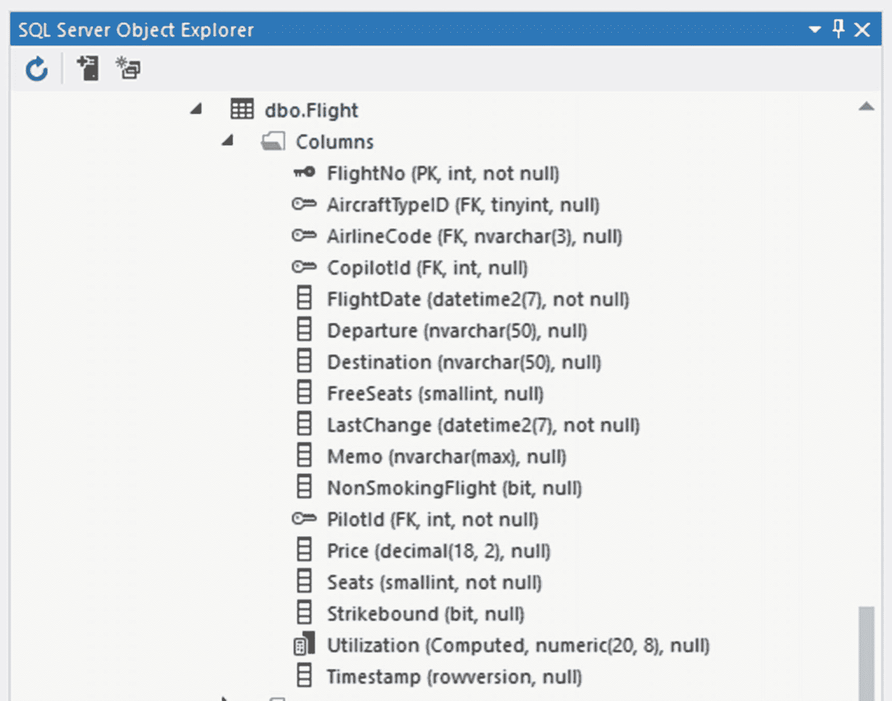
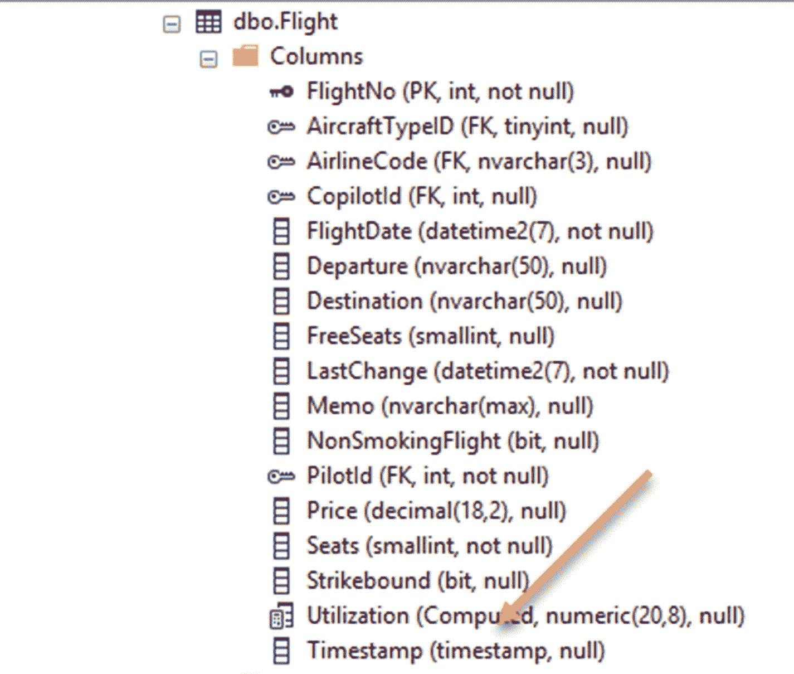
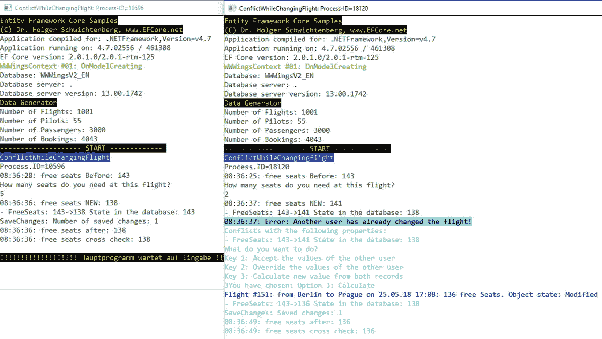
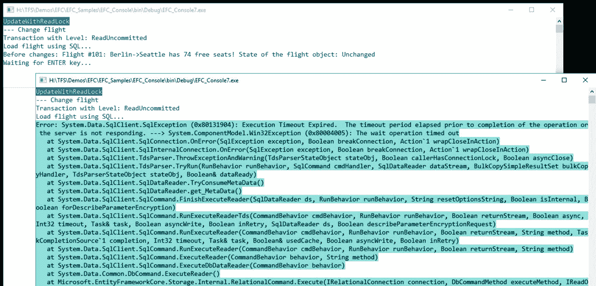

# 十一、防止冲突（并发）

在许多生产场景中，多个人或自动后台任务可能同时访问相同的记录。这可能会导致冲突，发生相互矛盾的数据更改。本章展示了如何在实体框架核心中检测和解决这种冲突。

## 看一下并发的历史

与其前身实体框架和底层基本技术 ADO.NET 一样，实体框架核心不支持阻止其他进程的数据记录读取访问。这是微软在 2005 年的一个深思熟虑的决定。NET 1.0 (2002)，因为锁会导致很多性能问题。在的 alpha 版本中。NET 2.0 (2005)中，在当时的新类`SqlResultSet`中有这样一个锁函数的原型，但是这个类从未在. NET 的 RTM 版本中发布。

因此，在。NET 以及基于它的框架，比如实体框架，实体框架核心，只有所谓的乐观锁定。乐观锁定是一种委婉的说法，因为实际上在数据库管理系统和 RAM 中没有任何东西被阻塞。只能确保以后会注意到变更冲突。第一个想写更改的进程获胜。所有其他进程都无法写入，并将收到一条错误消息。为了实现这一点，`WHERE`条件中的`UPDATE`和`DELETE`命令包含来自源记录的单个或多个值。

一个`DataSet`连同一个`DataAdapter`和一个`CommandBuilder`对象不仅查询一个`UPDATE`或`DELETE`命令的`WHERE`子句中的一个或多个主键列，而且还从进程在读取记录时接收的当前进程值的角度查询所有具有旧值的列(参见清单 11-1 )。同时，如果另一个进程更改了任何单独的列，`UPDATE`或`DELETE`命令不会在数据库管理系统中导致运行时错误；相反，它导致零个记录受到影响。这允许`DataAdapter`检测到存在变更冲突。

```cs
UPDATE [dbo]. [Flight]
SET [FlightNo] = @p1, [Departure] = @p2, [Strikebound] = @p3, [CopilotId] = @p4, [FlightDate] = @p5, [Flightgesellschaft] = @p6, [AircraftTypeID] = @p7, [FreeSeats] = @p8, [LastChange] = @p9, [Memo] = @p10, [NonSmokingFlight] = @p11, [PilotId] = @p12, [Seats] = @p13, [Price] = @p14, [Timestamp] = @p15, [destination] = @p16
WHERE (([FlightNo] = @p17) AND ((@p18 = 1 AND [Departure] IS NULL) OR ([Departure] = @p19)) AND ((@p20 = 1 AND [Expires] IS NULL) OR ( [Strikebound] = @p21)) AND ((@p22 = 1 AND [CopilotId] IS NULL) OR ([CopilotId] = @p23)) AND ([FlightDate] = @p24) AND ([Airline] = @p25) AND ((@p26 = 1 AND [aircraftID_ID] IS NULL) OR ([aircraft_type_ID] = @p27)) AND ((@p28 = 1 AND [FreeSeats] IS NULL) OR ([FreeSeats] = @p29)) AND ( [Lastchange] = @p30) AND ((@p31 = 1 AND [NonSmokingFlight] IS NULL) OR ([NonSmokingFlight] = @p32)) AND ([PilotId] = @p33) AND ([Seats] = @p34) AND ((@p35 = 1 AND [price] IS NULL) OR ([price] = @p36)) AND ((@p37 = 1 AND [destination] IS NULL) OR ([destination] = @p38)))
Listing 11-1Update Command, As Created by a SqlCommandBuilder for the Flight Table with the Primary Key FlightNo

```

## 默认情况下没有冲突检测

实体框架核心和实体框架一样，默认情况下根本不锁，即使使用乐观锁也不行。标准很简单“最后写的人赢。”清单 11-2 展示了如何在 RAM 中更改一个`Flight`对象，并通过实体框架核心用`SaveChanges()`持久化该更改。该程序代码向数据库管理系统发送以下 SQL 命令:

```cs
UPDATE [Flight] SET [FreeSeats] = @p0
WHERE [FlightNo] = @p1;
SELECT @@ ROWCOUNT;

```

可以看到，`WHERE`条件中只出现了主键`FlightNo`；列`FreeSeats`或其他列的旧值不出现。因此，该值是持久的，即使其他进程同时更改了该值。因此，航空公司可能会出现航班超额预订的情况。例如，如果只剩下两个空位，而两个进程(几乎)同时加载该信息，则这两个进程中的每一个都可以从剩余的空位中减去两个位置。然后，数据库中列`FreeSeats`中的状态为零。事实上，四名乘客被安排在两个座位上。那在飞机上会很紧！

虽然`SaveChanges()`打开了一个事务，但它仅适用于一个存储操作，因此不能防止数据更改冲突。然而，忽略冲突对于用户来说通常是不可行或不可接受的。幸运的是，您可以重新配置实体框架核心，就像您在它的前身实体框架中首先处理代码一样。

实体框架核心会注意到的唯一更改冲突是用另一个进程删除记录，因为在这种情况下，`UPDATE`命令会返回零个记录被更改的事实，然后实体框架核心会引发一个`DbUpdateConcurrencyException`错误。

```cs
  public static void Change.FlightOneProperty()
  {
   CUI.MainHeadline(nameof(ChangeFlightOneProperty));

   int FlightNr = 101;
   using (WWWingsContext ctx = new WWWingsContext())
   {

    // Load flight
    var f = ctx.FlightSet.Find(FlightNr);

    Console.WriteLine($"Before changes: Flight #{f.FlightNo}: {f.Departure}->{f.Destination} has {f.FreeSeats} free seats! State of the flight object: " + ctx.Entry(f).State);

    // Change object in RAM
    f.FreeSeats -= 2;

    Console.WriteLine($"After changes: Flight #{f.FlightNo}: {f.Departure}->{f.Destination} has {f.FreeSeats} free seats! State of the flight object: " + ctx.Entry(f).State);

    // Persist changes
    try
    {
     var count = ctx.SaveChanges();
     if (count == 0)
     {
      Console.WriteLine("Problem: No changes saved!");
     }
     else
     {
      Console.WriteLine("Number of saved changes: " + count);
      Console.WriteLine($"After saving: Flight #{f.FlightNo}: {f.Departure}->{f.Destination} has {f.FreeSeats} free seats! Zustand des Flight-Objekts: " + ctx.Entry(f).State);
     }
    }
    catch (Exception ex)
    {
     Console.WriteLine("Error: " + ex.ToString());
    }
   }
  }

Listing 11-2Changing a Flight Object

```

## 使用乐观锁定检测冲突

实体框架核心向数据库管理系统发送以下 SQL 命令:

```cs
UPDATE [Flight] SET [FreeSeats] = @p0
WHERE [FlightNo] = @p1 AND [FreeSeats] = @p2;
SELECT @@ROWCOUNT;

```

这里，`FlightNo`除了查询主键之外，还对`FreeSeats`列的旧值(读取时的原始值)进行查询。为了实现这种冲突检测，需要改变的不是程序代码，而是实体框架核心模型。

有两种方法可以配置模型。

*   通过数据注释`[ConcurrencyCheck]`
*   通过 Fluent API 中的`IsConcurrencyToken()`

清单 11-3 显示了实体类`Flight`的一个部分。这里，`FreeSeats`用`[ConcurrencyCheck]`进行了注释，实体框架核心自动查询所有`UPDATE`和`DELETE`命令的`WHERE`条件中的旧值。这是通过在实体框架核心上下文类的`OnModelCreating()`中的相应`PropertyBuilder`对象上调用`IsConcurrencyToken()`来实现的(参见清单 11-4 )。

```cs
public class Flight
{

  [Key]
  public int FlightNo {get; set; }

  [ConcurrencyCheck]
  public short? FreeSeats {get; set;}

[ConcurrencyCheck]
public decimal? Price {get; set; }
  public short? Seats { get; set; }

...
}

Listing 11-3Use of Data Annotation [ConcurrencyCheck]

```

```cs
public class WWWingsContext: DbContext
{
  public DbSet<Flight> FlightSet { get; set; }
...
  protected override void OnModelCreating (ModelBuilder builder)
  {
   Builder %Entity<Flight>().Property (f => f.FreeSeats).IsConcurrencyToken();
...
}
}
Listing 11-4Using IsConcurrencyToken( ) in the Fluent API

```

现在，对几个列运行冲突检查可能是有用的。例如，冲突检查也可以通过`Flight`对象的`Price`列来执行。就内容而言，这意味着如果`Flight`的价格已经改变，你不能改变座位的数量，因为这个预订将会以旧价格显示给用户。然后，您可以用`[ConcurrencyCheck`注释`Price`属性，或者将其添加到 Fluent API 中。

```cs
builder.Entity<Flight>().Property(x => x.FreeSeats).ConcurrencyToken();

```

下面的 SQL 命令在`WHERE`条件中包含三个部分，来自清单:

```cs
SET NOCOUNT ON;
UPDATE [Flight] SET [FreeSeats] = @p0
WHERE [FlightNo] = @p1 AND [FreeSeats] = @p2 AND [Price] = @p3;
SELECT @@ ROWCOUNT;

```

## 检测所有属性的冲突

对于所有实体类和所有持久属性，通过数据注释或 Fluent API 进行这种配置可能会很乏味。幸运的是，Entity Framework Core 允许您进行大量配置。清单 11-5 展示了如何从`ModelBuilder`对象中使用`OnModelCreating()`中的`Model`。`GetEntityTypes()`通过`GetProperties()`获取所有实体类的列表以及每个实体类中的所有属性，从而在那里设置`IsConcurrencyToken = true`。

```cs
public class WWWingsContext: DbContext
{
  public DbSet<Flight> FlightSet { get; set; }
...
  protected override void OnModelCreating (ModelBuilder builder)
  {
   foreach (IMutableEntityType entity in modelBuilder.Model.GetEntityTypes())
   {
    // get all properties
    foreach (var prop in entity.GetProperties())
    {
      prop.IsConcurrencyToken = true;
    }
   }
...
  }
}
Listing 11-5Mass Configuration of the ConcurrencyToken for All Properties in All Entity Classes

```

然后，清单创建了一个 SQL 命令，其中包含了`WHERE`条件中的所有列，如下所示:

```cs
SET NOCOUNT ON;
UPDATE [Flight] SET [FreeSeats] = @p0
WHERE [FlightNo] = @p1 AND [Departure] = @p2 AND [Destination] = @p3 AND [CopilotId] = @p4 AND [FlightDate] = @p5 AND [Airline] = @p6 AND [AircraftTypeID] IS NULL AND [ FreeSeats] = @p7 AND [LastChange] = @p8 AND [Memo] = @p9 AND [NonSmokingFlight] IS NULL AND [PilotId] = @p10 AND [Seats] = @p11 AND [Price] = @p12 AND [Strikebound] = @p13;
SELECT @@ ROWCOUNT;

```

## 通过惯例解决冲突

如果您想排除个别列，这也是可能的。在这种情况下，定义一个单独的注释是有意义的，称为`[ConcurrencyNoCheckAttribute]`(参见清单 11-6 )，然后注释实体类的所有持久属性，实体框架核心不应该对这些属性执行冲突检查。清单 11-7 显示了考虑注释`[ConcurrencyNoCheck]`的示例的扩展。这里重要的是`PropertyInfo`后的零传播算子`?.`；这很重要，因为您可以在实体框架核心中定义所谓的影子属性，这些属性只存在于实体框架核心模型中，而不存在于实体类中。这些 shadow 属性没有`PropertyInfo`对象，所以在 shadow 属性没有空传播操作符的情况下，会出现常见的`Null Reference`运行时错误。使用`ConcurrencyNoCheckAttribute`，您可以根据需要从冲突检查中优雅地排除单个属性。

```cs
using system;
namespace EFCExtensions
{
/// <summary>
/// Annotation for EFCore entity classes and properties for which EFCore should not run a concurrency check
/// </ summary>
[AttributeUsage (AttributeTargets.Property | AttributeTargets.Class, AllowMultiple = false)]
public class ConcurrencyNoCheckAttribute: Attributes
{
}
}
Listing 11-6Annotation for Entity Class Properties for Which Entity Framework Core Should Not Run a Concurrency Check

```

```cs
public class WWWingsContext: DbContext
{
  public DbSet<Flight> FlightSet {get; set; }
...
  protected override void OnModelCreating (ModelBuilder builder)
  {
   // Get all entity classes
   foreach (IMutableEntityType entity in modelBuilder.Model.GetEntityTypes())
   {
    // get all properties
    foreach (var prop in entity.GetProperties())
    {
     // Look for annotation [ConcurrencyNoCheck]
     var annotation = prop.PropertyInfo?.GetCustomAttribute<ConcurrencyNoCheckAttribute>();
     if (annotation == null)
     {
      prop.IsConcurrencyToken = true;
     }
     else
     {
      Console.WriteLine("No Concurrency Check for" + prop.Name);
     }
     if (prop.Name == "Timestamp")
     {
      prop.ValueGenerated = ValueGenerated.OnAddOrUpdate;
      prop.IsConcurrencyToken = true;
     }
     foreach (var a in prop.GetAnnotations())
     {
      Console.WriteLine(prop.Name + ":" + a.Name + "=" + a.Value);
     }
    }
   }
}
...
}
}
Listing 11-7Mass Configuration of the ConcurrencyToken for All Properties in All Entity Classes, Except the Properties Annotated with [ConcurrencyNoCheck]

```

## 单独设置冲突检查

有时，在实践中，希望在逐案例例的基础上为各个属性的各个更改激活或停用冲突检查。不幸的是，这无法实现，因为数据注释是编译的，而且每个进程只调用一次`OnModelCreating()`。遗憾的是，在`OnModelCreating()`结束后，您无法更改实体框架核心模型。虽然`DbContext`类像`ModelBuilder`类一样提供了属性模型，但是在`ModelBuilder`中，属性模型具有`IMutalModel`类型(顾名思义，这是一个变量)。`DbContext`只获取`IModel`类型，而`IsConcurrencyToken`像许多其他属性一样是只读的。因此，如果您想逐个更改乐观锁定列，您需要自己向数据库管理系统发送`UPDATE`和`DELETE`命令(通过实体框架核心或其他方式)。

## 添加时间戳

可以引入一个额外的时间戳列，而不是在单个数据列级别进行原始值比较。您可以在 Microsoft SQL Server 中找到一个这样的列，类型为`rowversion` ( [`https://docs.microsoft.com/en-us/sql/t-sql/data-types/rowversion-transact-sql`](https://docs.microsoft.com/en-us/sql/t-sql/data-types/rowversion-transact-sql) )，称为`timestamp`(参见图 11-1 和图 11-2 )。对于每个单独的数据记录变化，它由数据库管理系统自动增加。因此，在使用`UPDATE`或`DELETE`命令的情况下，只需检查该值是否仍为加载期间存在的先前值。如果是这样，整个记录保持不变。如果没有，则另一个进程至少更改了部分记录。然而，使用`timestamp`列，您无法区分变更相关的列和变更不相关的列。数据库管理系统在每次列改变时调整时间戳；不可能有例外。

Note

虽然目前 SQL Server Management Studio (SSMS)仍然显示旧名称`timestamp`，但是 Visual Studio 2016 中的 SQL Server Data Tools 显示了当前名称`rowversion`。



图 11-1

A timestamp column for a record in Microsoft SQL Server 2017 as shown in Visual Studio 2017



图 11-2

A timestamp column for a record in Microsoft SQL Server 2017 as shown in SQL Server Management Studio 17.1

要使用时间戳进行变更冲突检测，您需要向实体类添加一个`byte`-数组列(`byte[]`)，并用`[timestamp]`对其进行注释。然而，列的名称与实体框架核心无关。

```cs
[Timestamp]
public byte[] Timestamp { get; set; }

```

或者，您可以使用 Fluent API 再次进行设置，但这发生在程序代码中，如下所示:

```cs
builder.Entity<Flight>()
           .Property(p => p.Timestamp)
           .ValueGeneratedOnAddOrUpdate()
           .IsConcurrencyToken();

```

从实体框架核心 1.1 版本开始，也可以使用`IsRowVersion()`作为替代，如下图:

```cs
modelBuilder.Entity<Flight>().Property(x => x.Timestamp).IsRowVersion();

```

Note

每个表只能有一个`timestamp` / `rowversion`列。不幸的是，错误消息“一个表只能有一个时间戳列。”仅在您调用`Update-Database`时发生，不与`Add-Migration`一起发生。

对于时间戳支持，您不需要实现其他任何东西。如果在对象模型中有这样的属性，并且在数据库表中有相应的列，那么对于`WHERE`条件中的所有`DELETE`和`UPDATE`命令，实体框架核心总是引用先前的时间戳值。

```cs
SET NOCOUNT ON;
UPDATE [Flight] SET [FreeSeats] = @p0
WHERE [FlightNo] = @p1 AND [Timestamp] IS NULL;
SELECT [Timestamp]
FROM [Flight]
WHERE @@ ROWCOUNT = 1 AND [FlightNo] = @p1;

```

如您所见，Entity Framework Core 还使用`SELECT [Timestamp]`来重新加载数据库管理系统在`UPDATE`之后更改的时间戳，以相应地更新 RAM 中的对象。如果没有发生这种情况，那么对象的第二次更新将是不可能的，因为这样 RAM 中的时间戳将会过时，并且即使没有任何更改冲突，Entity Framework Core 也将总是报告更改冲突(因为第一次更改是更改数据库表中时间戳的那个更改)。

按照惯例，时间戳配置也可以自动化。清单 11-8 中所示的批量配置自动为所有带有名称`timestamp`的属性添加时间戳，用于冲突检测。

```cs
public class WWWingsContext: DbContext
{
  public DbSet<Flight> FlightSet {get; set; }
  ...
  protected override void OnModelCreating (ModelBuilder builder)
  {
   // Get all entity classes
   foreach (IMutableEntityType entity in modelBuilder.Model.GetEntityTypes())
   {
    // Get all properties
    foreach (var prop in entity.GetProperties())
    {
     if (prop.Name == "Timestamp")
     {
      prop.ValueGenerated = ValueGenerated.OnAddOrUpdate;
      prop.IsConcurrencyToken = true;
     }

    }
   }
...
}
}

Listing 11-8Automatically Turning Any Properties Called Timestamp into Timestamps for Conflict Detection

```

## 解决冲突

本节说明如何验证冲突检测。图 11-3 显示了程序两次启动时的一些典型输出。首先启动 ID 为 10596 的进程，然后启动进程 18120。两人都读到了编号为 101 的航班，该航班目前还有 143 个座位。然后，过程 10596 将位置数减少 5，并在`FreeSeats`列中保持 138。现在进程 18120 为两个人预订了一个房间，所以在 RAM 中该值变为 141 `FreeSeats`。然而，进程 18120 不能持续，因为实体框架核心由于对`FreeSeats`列的冲突检测或基于时间戳列抛出了类型为`DbUpdateConcurrencyException`的错误。过程 18120 中的用户被给予接受或覆盖其他用户的改变或者抵消这两个改变的选择，这在某些情况下可能是有意义的。



图 11-3

Conflict detection and conflict resolution

清单 11-9 显示了实现。`SaveChanges()`接住了`DbUpdateConcurrencyException`。在错误处理程序中，`PrintChangedProperties()`助手函数用于指定在此过程中航班的哪些属性发生了更改，以及当前的数据库状态是什么。您通过方法`GetDatabaseValues()`获得数据库的当前状态，该方法向数据库管理系统发送相应的 SQL 查询。之后，用户必须做出决定。如果用户选择将更改应用到另一个进程，则在实体框架核心 API 中调用`Reload()`方法，该方法丢弃 RAM 中已更改的对象，并从数据库中重新加载它。如果用户选择覆盖对其他进程的更改，程序代码会稍微复杂和间接一些。命令链从数据库加载当前状态，并在实体框架核心变更跟踪器中将其设置为对象的原始值:`ctx.Entry(Flight).OriginalValues.SetValues(ctx.Entry(Flight).GetDatabaseValues())`。之后，`SaveChanges()`再次被调用，现在它可以工作了，因为在`WHERE`条件中使用的原始值或时间戳对应于数据库中数据记录的当前状态。然而，从理论上讲，如果在`GetDatabaseValues()`和`SaveChanges()`之间的短时间内，另一个进程更改了数据库表中的记录，冲突可能会再次发生。因此，您应该封装`SaveChanges()`和相关的错误处理，但是为了更好地说明这个例子，这里没有这样做。

在图 11-3 中，用户选择了第三个选项，清除了两个变更。除了它的原始值和当前值，过程 18120 还需要列`FreeSeats`的当前数据库值。结果是正确的 136。但是，计算假设两个过程都从相同的原始值开始。如果没有进程间通信，进程 18120 可能不知道进程 10596 的种子值。账单只在特殊情况下有效。

当然，也可以让用户在(图形)用户界面中通过输入值而不是决定哪一方来解决冲突。就实现而言，清除就像另一个值的输入一样，对应于第二种情况，换句话说，覆盖另一个过程的更改。在调用`SaveChanges()`之前，简单地在对象中设置你想要随后在数据库中拥有的值(参见清单 11-9 和清单 11-10 中的案例`ConsoleKey.D3`)。

```cs
public static void ConflictWhileChangingFlight()
  {
   CUI.MainHeadline(nameof(ConflictWhileChangingFlight));
   Console.WriteLine("Process.ID=" + Process.GetCurrentProcess().Id);
   Console.Title = nameof(ConflictWhileChangingFlight) + ": Process-ID=" + Process.GetCurrentProcess().Id;

   // Flight, where the conflict should arise
   int flightNo = 151;

   using (WWWingsContext ctx = new WWWingsContext())
   {
    // --- load flight
    Flight flight = ctx.FlightSet.Find(flightNo);
    Console.WriteLine(DateTime.Now.ToLongTimeString() + ": free seats Before: " + flight.FreeSeats);

    short seats = 0;
    string input = "";
    do
    {
     Console.WriteLine("How many seats do you need at this flight?");
     input = Console.ReadLine(); // wait (time to start another process)
    } while (!Int16.TryParse(input, out seats));

    // --- change the free seats
    flight.FreeSeats -= seats;
    Console.WriteLine(DateTime.Now.ToLongTimeString() + ": free seats NEW: " + flight.FreeSeats);

    try
    {
     // --- try to save
     EFC_Util.PrintChangedProperties(ctx.Entry(flight));
     var count = ctx.SaveChanges();
     Console.WriteLine("SaveChanges: Number of saved changes: " + count);
    }
    catch (DbUpdateConcurrencyException ex)
    {
     Console.ForegroundColor = ConsoleColor.Red;
     CUI.PrintError(DateTime.Now.ToLongTimeString() + ": Error: Another user has already changed the flight!");

     CUI.Print("Conflicts with the following properties:");
     EFC_Util.PrintChangedProperties(ex.Entries.Single());

     // --- Ask the user
     Console.WriteLine("What do you want to do?");
     Console.WriteLine("Key 1: Accept the values of the other user");
     Console.WriteLine("Key 2: Override the values of the other user");
     Console.WriteLine("Key 3: Calculate new value from both records");

     ConsoleKeyInfo key = Console.ReadKey();
     switch(key.Key)
     {
      case ConsoleKey.D1: // Accept the values of the other user
       {
       Console.WriteLine("You have chosen: Option 1: Accept");
       ctx.Entry(flight).Reload();
       break;
      }
      case ConsoleKey.D2: // Override the values of the other user
       {
       Console.WriteLine("You have chosen: Option 2: Override");
       ctx.Entry(flight).OriginalValues.SetValues(ctx.Entry(flight).GetDatabaseValues());
       // wie RefreshMode.ClientWins bei ObjectContext
       EFC_Util.PrintChangeInfo(ctx);
       int count = ctx.SaveChanges();
       Console.WriteLine("SaveChanges: Saved changes: " + count);
       break;
      }
      case ConsoleKey.D3: // Calculate new value from both records
       {

        Console.WriteLine("You have chosen: Option 3: Calculate");
        var FreeSeatsOrginal = ctx.Entry(flight).OriginalValues.GetValue<short?>("FreeSeats");
        var FreeSeatsNun = flight.FreeSeats.Value;
        var FreeSeatsInDB = ctx.Entry(flight).GetDatabaseValues().GetValue<short?>("FreeSeats");
        flight.FreeSeats = (short) (FreeSeatsOrginal -
                            (FreeSeatsOrginal - FreeSeatsNun) -
                            (FreeSeatsOrginal - FreeSeatsInDB));
        EFC_Util.PrintChangeInfo(ctx);
        ctx.Entry(flight).OriginalValues.SetValues(ctx.Entry(flight).GetDatabaseValues());
        int count = ctx.SaveChanges();
        Console.WriteLine("SaveChanges: Saved changes: " + count);
        break;
       }
     }
    }
    Console.WriteLine(DateTime.Now.ToLongTimeString() + ": free seats after: " + flight.FreeSeats);

    // --- Cross check the final state in the database
    using (WWWingsContext ctx2 = new WWWingsContext())
    {
     var f = ctx.FlightSet.Where(x => x.FlightNo == flightNo).SingleOrDefault();
     Console.WriteLine(DateTime.Now.ToLongTimeString() + ": free seats cross check: " + f.FreeSeats);

    } // End using-Block -> Dispose()
   }
  }

Listing 11-9Conflict Detection and Conflict Resolution with Entity Framework Core

```

```cs
/// <summary>
  /// Print all changed objects and the changed properties
  /// </summary>
  /// <param name="ctx"></param>
  public static void PrintChangeInfo(DbContext ctx)
  {
   foreach (EntityEntry entry in ctx.ChangeTracker.Entries())
   {
    if (entry.State == EntityState.Modified)
    {
     CUI.Print(entry.Entity.ToString() + " Object state: " + entry.State, ConsoleColor.Yellow);
     IReadOnlyList<IProperty> listProp = entry.OriginalValues.Properties;
     PrintChangedProperties(entry);
    }
   }
  }

  /// <summary>
  /// Print the changed properties of an object, including the current database state
  /// </summary>
  /// <param name="entry"></param>
  public static void PrintChangedProperties(EntityEntry entry)
  {
   PropertyValues dbValue = entry.GetDatabaseValues();
   foreach (PropertyEntry prop in entry.Properties.Where(x => x.IsModified))
   {
    var s = "- " + prop.Metadata.Name + ": " +
     prop.OriginalValue + "->" +
     prop.CurrentValue +
     " State in the database: " + dbValue[prop.Metadata.Name];
    Console.WriteLine(s);
   }
  }

Listing 11-10Subroutines for Listing 11-9

```

## 实体框架核心上的悲观锁定

虽然微软故意没有在。NET 和。NET Core 可以用来阻止其他人对记录的读访问，但是我经常遇到一些客户，他们仍然迫切地想从一开始就避免冲突。使用 LINQ 命令，即使激活了事务，读锁也是不可行的。您需要一个事务和一个特定于数据库管理系统的 SQL 命令。在 Microsoft SQL Server 中，这是与事务相关联的查询提示`SELECT ... WITH (UPDLOCK)`。这个查询提示确保读记录被锁定，直到事务完成。它只在一个事务中工作，所以你会在清单 11-11 中找到一个`ctx.Database.BeginTransaction()`方法，然后是对`commit()`的调用。清单还展示了 Entity Framework Core 提供的`FromSql()`方法的使用，它允许您将自己的 SQL 命令发送到数据库管理系统，并将结果具体化为实体对象。

```cs
public static void UpdateWithReadLock()
 {
  CUI.MainHeadline(nameof(UpdateWithReadLock));
  Console.WriteLine("--- Change flight");
  int flightNo = 101;
  using (WWWingsContext ctx = new WWWingsContext())
  {
   try
   {
    ctx.Database.SetCommandTimeout(10); // 10 seconds
    // Start transaction
    IDbContextTransaction t = ctx.Database.BeginTransaction(IsolationLevel.ReadUncommitted); // default is System.Data.IsolationLevel.ReadCommitted
    Console.WriteLine("Transaction with Level: " + t.GetDbTransaction().IsolationLevel);

    // Load flight with read lock using  WITH (UPDLOCK)
    Console.WriteLine("Load flight using SQL...");
    Flight f = ctx.FlightSet.FromSql("SELECT * FROM dbo.Flight WITH (UPDLOCK) WHERE flightNo = {0}", flightNo).SingleOrDefault();

    Console.WriteLine($"Before changes: Flight #{f.FlightNo}: {f.Departure}->{f.Destination} has {f.FreeSeats} free seats! State of the flight object: " + ctx.Entry(f).State);

    Console.WriteLine("Waiting for ENTER key...");
    Console.ReadLine();

    // Change object in RAM
    Console.WriteLine("Change flight...");
    f.FreeSeats -= 2;

    Console.WriteLine($"After changes: Flight #{f.FlightNo}: {f.Departure}->{f.Destination} has {f.FreeSeats} free seats! State of the flight object: " + ctx.Entry(f).State);

    // Send changes to DBMS
    Console.WriteLine("Save changes...");
    var c = ctx.SaveChanges();
    t.Commit();
    if (c == 0)
    {
     Console.WriteLine("Problem: No changes saved!");
    }
    else
    {
     Console.WriteLine("Number of saved changes: " + c);
     Console.WriteLine($"After saving: Flight #{f.FlightNo}: {f.Departure}->{f.Destination} has {f.FreeSeats} free seats! State of the flight object: " + ctx.Entry(f).State);
    }
   }
   catch (Exception ex)
   {
    CUI.PrintError("Error: " + ex.ToString());
   }
  }
 }

Listing 11-11A Lock Is Already Set Up When Reading the Data Record

```

图 11-4 提供了事实上只要第一个进程还没有完成它的事务，第二个进程就不能读取`FlightNo` 101 的证据。在这个示例代码中，处理在事务中间等待用户输入。事务中的用户输入当然是“最糟糕的实践”,不应该出现在生产代码中。然而，在示例代码中，它是一个有用的工具，可以在几秒钟内模拟一个事务的运行时，直到另一个进程超时。



图 11-4

If the program code runs twice in parallel, in the second run the process will time out because the first process has a read lock on the record Note

我必须重申，数据库管理系统中的这种数据记录锁不是一种好的做法。锁，尤其是读锁，会降低应用的速度，还会很快导致死锁，即进程相互等待，从而无法再进行处理。这种做法损害了软件的性能、可伸缩性和稳定性。为什么我要在这一章展示它？因为我知道有些开发商还是要的。

顺便说一句，在数据库管理系统中记录锁的一个更好的替代方法是在应用级别使用锁，其中应用管理锁，也可能使用 RAM 中的自定义锁表。这样做的好处是，应用可以准确地呈现给当前正在处理记录的用户。比如用户 Müller 可以说“这个记录还有 4 分 29 秒由你独家编辑。”迈耶夫人说，“米勒先生正在处理这个数据集。他还有 4 分 29 秒来保存记录。在此期间，您不能对此记录进行任何更改。这提供了更多的可能性。例如，您可以让按钮显示“我是明星，现在我想立即将米勒先生从唱片中踢出去。”然而，在实体框架核心中，没有预定义的应用级锁定机制。这里需要你自己的创造力！