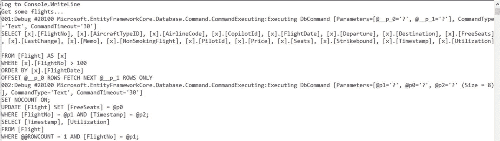

# 十二、日志

在传统的实体框架中，有两种简单的方法来获取或映射器发送给数据库的 SQL 命令。

*   可以对查询对象(`IQueryable<T>`)调用`ToString()`。
*   您可以使用`Log`属性(从实体框架 6.0 版开始)，就像在`ctx.Database.Log = Console.WriteLine;`中一样。

不幸的是，这两个选项在实体框架核心中都不可用。

以下命令

```cs
var query = ctx.FlightSet.Where(x => x.FlightNo > 300).OrderBy(x => x.- Date).Skip(10).Take(5);
Console.WriteLine (query.ToString());

```

仅提供以下输出:`Microsoft.EntityFrameworkCore.Query.Internal.EntityQueryable`1 [BO.Flight]`。

`ctx.Database`对象在实体框架核心中没有`log`属性。

## 使用扩展方法 Log()

登录实体框架核心是可能的，但是比它的前身要复杂得多。因此，我以`DbContext`类的`Log()`扩展方法的形式创建了对`Database`对象的扩展。它是一个方法，而不是属性，因为在。不幸的是，只有扩展方法，没有扩展属性。

Note

本书的一些清单中使用了`Log()`方法。

你可以像这样使用方法`Log()`:

```cs
using (var ctx1 = new WWWingsContext())
   {
    var query1 = ctx1.FlightSet.Where(x => x.FlightNo > 100).OrderBy(x => x.Date).Skip(10).Take(5);
    ctx1.Log(Console.WriteLine);
    var flightSet1 = query1.ToList();
    flightSet1.ElementAt(0).FreeSeats--;
    ctx1.SaveChanges();
   }

```

类似于实体框架中的`Log`属性，`Log()`是一个没有返回值的方法；它需要一个字符串作为唯一的参数。与经典的实体框架不同，您可以省略`Log()`中的参数。然后输出会自动打印到青色的`Console.WriteLine()`(见图 [12-1](#Fig1) )。



图 12-1

Default logging for the Log( ) method

```cs
using (var ctx2 = new WWWingsContext())
   {
    var query2 = ctx2.FlightSet.Where(x => x.FlightNo < 3000).OrderBy(x => x.Date).Skip(10).Take(5);
    ctx2.Log();
    var flightSet2 = query2.ToList();
    flightSet2.ElementAt(0).FreeSeats--;
    ctx2.SaveChanges();
   }

```

如果您想记录到一个文件，您可以通过编写一个带有字符串参数且没有返回值的方法，并将其传递给`Log()`来实现。

```cs
using (var ctx3 = new WWWingsContext())
   {
    Console.WriteLine("Get some flights...");
    var query3 = ctx3.FlightSet.Where(x => x.FlightNo > 100).OrderBy(x => x.Date).Skip(10).Take(5);
    ctx3.Log(LogToFile);
    var flightSet3 = query3.ToList();
    flightSet3.ElementAt(0).FreeSeats--;
    ctx3.SaveChanges();
   }
  }

  public static void LogToFile(string s)
  {
   Console.WriteLine(s);
   var sw = new StreamWriter(@"c:\temp\log.txt");
   sw.WriteLine(DateTime.Now + ": " + s);
   sw.Close();
  }

```

默认情况下，`Log()`方法只记录那些发送到 DBMS 的命令。`Log()`方法的另外两个参数影响日志记录的数量，如下所示:

*   参数 2 是日志类别(字符串)的列表。
*   参数 3 是事件编号(数字)的列表。

下一个命令将打印来自实体框架核心的所有日志输出(它为每个命令生成大量屏幕输出):

```cs
ctx1.Log(Console.WriteLine, new List<string>(), new List<int>());

```

下一个命令将只打印某些日志类别和事件号:

```cs
ctx1.Log(Console.WriteLine, new List<string>() { "Microsoft.EntityFrameworkCore.Database.Command" }, new List<int>() { 20100, 20101});

```

事件 20100 是`Executing`，20101 是`Executed`。

Note

因为实体框架核心不是将内部使用的记录器工厂类分配给一个上下文实例，而是分配给所有上下文实例，所以在特定实例上建立的日志记录方法也适用于同一上下文类的其他实例。

## 实现 Log()扩展方法

列表 [12-1](#Par33) 展示了扩展方法`Log()`的实现。

*   `Log()`扩展方法向`ILoggerFactory`服务添加一个记录器提供者的实例。
*   logger provider 是一个实现`ILoggerProvider`的类。在这个类中，实体框架核心为每个日志记录类别调用一次`CreateLogger()`。
*   `CreateLogger()`然后必须为每个记录类别提供一个记录器实例。
*   记录器是一个实现`ILogger`的类。
*   清单 [12-1](#Par33) 有一个`FlexLogger`类，它向`Log()`指定的方法发送一个字符串。如果没有指定方法，则调用`ConsoleWriteLineColor()`。
*   第二个 logger 类是`NullLogger`，它丢弃与 SQL 输出无关的所有日志类别的日志输出。

```cs
// Logging for EF Core
// (C) Dr. Holger Schwichtenberg, www.IT-Visions.de 2016-2017

using Microsoft.EntityFrameworkCore;
using Microsoft.EntityFrameworkCore.Infrastructure;
using Microsoft.Extensions.DependencyInjection;
using Microsoft.Extensions.Logging;
using System;
using System.Collections.Generic;
using System.Reflection;

namespace ITVisions.EFCore
{
 /// <summary>
 /// Enhancement for the DbContext class for easy logging of the SQL commands sent by EF Core to a method that expects a string (C) Dr. Holger Schwichtenberg, www.IT-Visions.de
 /// </summary>
 public static class DbContextExtensionLogging
 {
  public static Dictionary<string, ILoggerProvider> loggerFactories = new Dictionary<string, ILoggerProvider>();

  public static bool DoLogging = true;
  public static bool DoVerbose = true;
  private static Version VERSION = new Version(4, 0, 0);

  private static List<string> DefaultCategories = new List<string>
  {
   "Microsoft.EntityFrameworkCore.Storage.IRelationalCommandBuilderFactory", // für EFCore 1.x
   "Microsoft.EntityFrameworkCore.Database.Sql", // für EFCore 2.0Preview1
   "Microsoft.EntityFrameworkCore.Database.Command", // für EFCore >= 2.0Preview2
  };

  private static List<int> DefaultEventIDs = new List<int>
  {
   20100 // 20100 = "Executing"
 };

  public static void ClearLog(this DbContext ctx)
  {
   var serviceProvider = ctx.GetInfrastructure<IServiceProvider>();
   // Add Logger-Factory
   var loggerFactory = serviceProvider.GetService<ILoggerFactory>();
   (loggerFactory as LoggerFactory).Dispose();
  }

  /// <summary>
  /// Extension Method for Logging to a method expecting a string
  /// </summary>
  /// <example>Log() or Log(Console.WriteLine) for console logging</example>
  public static void Log(this DbContext ctx, Action<string> logMethod = null, List<string> categories = null, List<int> eventsIDs = null, bool verbose = false)
  {
   DbContextExtensionLogging.DoVerbose = verbose;
   if (eventsIDs == null) eventsIDs = DefaultEventIDs;
   if (categories == null) categories = DefaultCategories;
   var methodName = logMethod?.Method?.Name?.Trim();
   if (string.IsNullOrEmpty(methodName)) methodName = "Default (Console.WriteLine)";

   if (DbContextExtensionLogging.DoVerbose)
   {
    Console.WriteLine("FLEXLOGGER EFCore " + VERSION.ToString() + " (C) Dr. Holger Schwichtenberg 2016-2017 " + methodName);
    Console.WriteLine("FLEXLOGGER Start Logging to " + methodName);
    Console.WriteLine("FLEXLOGGER Event-IDs: " + String.Join(";", eventsIDs));
    Console.WriteLine("FLEXLOGGER Categories: " + String.Join(";", categories));
   }
   // Make sure we only get one LoggerFactory for each LogMethod!
   var id = ctx.GetType().FullName + "_" + methodName.Replace(" ", "");
   if (!loggerFactories.ContainsKey(id))
   {
    if (verbose) Console.WriteLine("New Logger Provider!");
    var lp = new FlexLoggerProvider(logMethod, categories, eventsIDs);
    loggerFactories.Add(id, lp);
    // Get ServiceProvider
    var serviceProvider = ctx.GetInfrastructure();
    // Get Logger-Factory
    var loggerFactory = serviceProvider.GetService<ILoggerFactory>();
    // Add Provider to Factory
    loggerFactory.AddProvider(lp);
   }

  }
 }

 /// <summary>
 /// LoggerProvider for FlexLogger (C) Dr. Holger Schwichtenberg www.IT-Visions.de
 /// </summary>
 public class FlexLoggerProvider : ILoggerProvider
 {

 public Action<string> _logMethod;
  public List<int> _eventIDs = null;
  public List<string> _categories = null;

  public FlexLoggerProvider(Action<string> logMethod = null, List<string> categories = null, List<int> eventIDs = null)
  {
   _logMethod = logMethod;
   _eventIDs = eventIDs;
   _categories = categories;
   if (_eventIDs == null) _eventIDs = new List<int>();
   if (_categories == null) _categories = new List<string>();
  }

  /// <summary>
  /// Constructor is called for each category. Here you have to specify which logger should apply to each category
  /// </summary>
  /// <param name="categoryName"></param>
  /// <returns></returns>
  public ILogger CreateLogger(string categoryName)
  {
   if (_categories == null || _categories.Count == 0 || _categories.Contains(categoryName))
   {
    if (DbContextExtensionLogging.DoVerbose) Console.WriteLine("FLEXLOGGER CreateLogger: " + categoryName + ": Yes");
    return new FlexLogger(this._logMethod, this._eventIDs);
   }
   if (DbContextExtensionLogging.DoVerbose) Console.WriteLine("FLEXLOGGER CreateLogger: " + categoryName + ": No");
   return new NullLogger(); // return NULL nicht erlaubt :-(
  }

  public void Dispose()
  { }

  /// <summary>
  /// Log output to console or custom method
  /// </summary>
  private class FlexLogger : ILogger
  {
   private static int count = 0;

   readonly Action<string> logMethod;
   readonly List<int> _EventIDs = null;
   public FlexLogger(Action<string> logMethod, List<int> eventIDs)
   {
    count++;
    this._EventIDs = eventIDs;
    if (logMethod is null) this.logMethod = ConsoleWriteLineColor;
    else this.logMethod = logMethod;
   }

   private static void ConsoleWriteLineColor(object s)
   {
    var farbeVorher = Console.ForegroundColor;
    Console.ForegroundColor = ConsoleColor.Cyan;
    Console.WriteLine(s);
    Console.ForegroundColor = farbeVorher;
   }

   public bool IsEnabled(LogLevel logLevel) => true;

   private static long Count = 0;

   public void Log<TState>(LogLevel logLevel, EventId eventId, TState state, Exception exception, Func<TState, Exception, string> formatter)
   {
    if (!DbContextExtensionLogging.DoLogging) return;

    if (Assembly.GetAssembly(typeof(Microsoft.EntityFrameworkCore.DbContext)).GetName().Version.Major == 1 || (this._EventIDs != null && (this._EventIDs.Contains(eventId.Id) || this._EventIDs.Count == 0)))
    {
     Count++;
     string text = $"{Count:000}:{logLevel} #{eventId.Id} {eventId.Name}:{formatter(state, exception)}";
     // Call log method now
     logMethod(text);
    }
   }

   public IDisposable BeginScope<TState>(TState state)
   {
    return null;
   }
  }

  /// <summary>
  /// No Logging
  /// </summary>
  private class NullLogger : ILogger
  {
   public bool IsEnabled(LogLevel logLevel) => false;

   public void Log<TState>(LogLevel logLevel, EventId eventId, TState state, Exception exception, Func<TState, Exception, string> formatter)
   { }

   public IDisposable BeginScope<TState>(TState state) => null;
  }
 }
}

Listing 12-1Entity Framework Core Extensions for Easy Logging

```

## 日志类别

不幸的是，微软在 Entity Framework Core 版本 1.x 和 2.0 之间更改了日志类别的名称。

以下是 Entity Framework Core 1.x 中的日志记录类别:

*   `Microsoft.EntityFrameworkCore.Storage.Internal.SQLServerConnection`
*   `Microsoft.EntityFrameworkCore.Storage.IExecutionStrategy`
*   `Microsoft.EntityFrameworkCore.Internal.RelationalModelValidator`
*   `Microsoft.EntityFrameworkCore.Query.Internal.SqlServerQueryCompilationContextFactory`
*   `Microsoft.EntityFrameworkCore.Query.Translators expression.Internal.SqlServerCompositeMethodCallTranslator`
*   `Microsoft.EntityFrameworkCore.Storage.IRelationalCommandBuilderFactory`
*   `Microsoft.EntityFrameworkCore.Query.Internal.QueryCompiler`
*   `Microsoft.EntityFrameworkCore.DbContext`

以下是实体框架核心 2.0 中的日志记录类别:

*   `Microsoft.EntityFrameworkCore.Infrastructure`
*   `Microsoft.EntityFrameworkCore.Update`
*   `Microsoft.EntityFrameworkCore.Database.Transaction`
*   `Microsoft.EntityFrameworkCore.Database.Connection`
*   `Microsoft.EntityFrameworkCore.Model.Validation`
*   `Microsoft.EntityFrameworkCore.Query`
*   `Microsoft.EntityFrameworkCore.Database.Command`

`Log()`扩展方法的实现考虑了这种变化；它还考虑了类别`Microsoft.EntityFrameworkCore.Query`，该类别有两个事件:`Executing`(事件 ID 20100)和`Executed`(事件 ID 20101)。`Log()`在标准系统中仅输出事件 ID 20100。但是类别和事件 id 可以通过`Log()`的参数来控制。