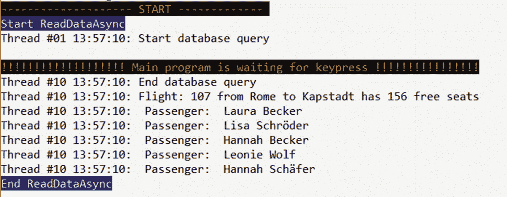
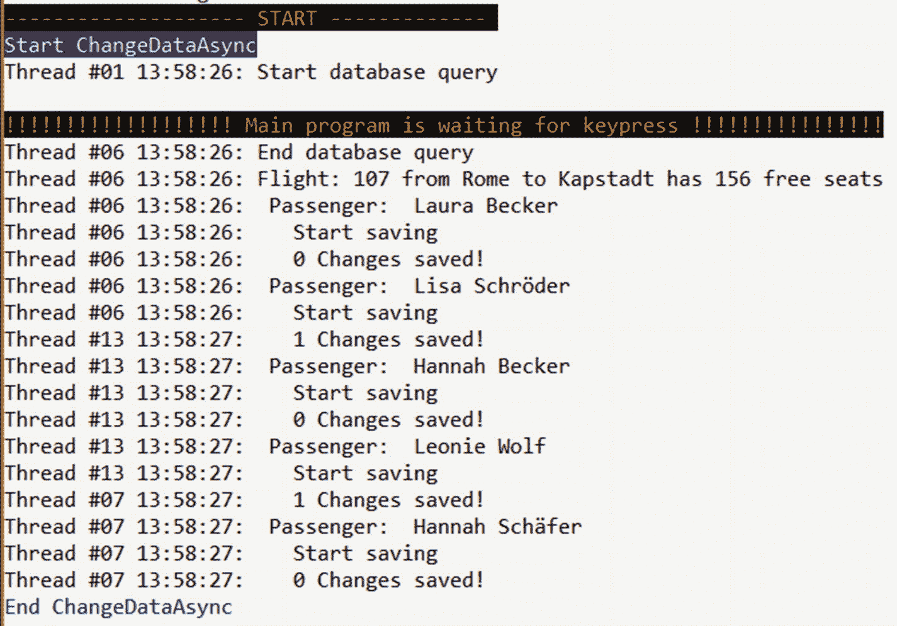

# 十三、异步编程

。NET 从 1980 年开始支持简化的异步的、基于任务的编程，使用了`async`和`await`。NET 框架 4.5。经典的 ADO.NET 实体框架从版本 6.0 开始就支持相关的异步操作。在 Entity Framework Core 中，从 1.0 版本开始，您就可以使用异步操作了。

## 异步扩展方法

实体框架核心允许使用异步设计模式读写数据。为此，Microsoft 扩展了结果集，在 Microsoft 中提供了 LINQ 转换和聚合运算符。具有异步变量的 EntityFrameworkCore . EntityFrameworkQueryableExtensions 类。现在你可以在这里找到例子，`EntityFrameworkQueryableExtensions`类包括扩展方法`ToListAsync()`和`ToArrayAsync()`；方法`SingleAsync()`、`FirstAsync()`、`SingleOrDefaultAsync()`、`FirstOrDefaultAsync()`；以及`CountAsync()`、`AllAsync()`、`AnyAsync()`、`AverageAsync()`、`MinAsync()`、`MaxAsync()`、`SumAsyn()`等聚合函数。`SaveChangesAsync()`方法用于保存。在代码中放一行`using Microsoft.EntityFrameworkCore`是使用这些扩展方法的先决条件。

## ToListAsync()

清单 [13-1](#Par7) 展示了如何使用`ToListAsync()`。具有相同结果集的同步调用的唯一区别在于以下两行:

*   子程序`DataReadingAsync()`被声明为`async`。
*   不叫`query.ToList()`，现在叫`await query.ToListAsync()`。

图 [13-1](#Fig1) 显示实体框架核心的数据库查询和对象物化实际上与这些边缘变化是异步的。这表明在发出第一个`Flight`之前，主程序已经在等待输入。输出`Start Database Query`仍然在线程 10 中。然后，它返回到主程序，而数据库查询和过程的剩余部分`Read DataReadingAsync()`在线程 13 中继续。



图 13-1

Output of Listing [13-1](#Par7)

```cs
  public static async void ReadDataAsync()
  {
  CUI.MainHeadline("Start " + nameof(ReadDataAsync)); using (var ctx = new WWWingsContext())
   {
    // Define query
    var query = (from f in ctx.FlightSet.Include(p => p.BookingSet).ThenInclude(b => b.Passenger) where f.Departure == "Rome" && f.FreeSeats > 0 select f).Take(1);
    // Execute Query asynchronously
    CUI.PrintWithThreadID("Start database query");
    var flightSet = await query.ToListAsync();
    CUI.PrintWithThreadID("End database query");
    // Print results
    foreach (Flight flight in flightSet)
    {
     CUI.PrintWithThreadID("Flight: " + flight.FlightNo + " from " + flight.Departure + " to " + flight.Destination + " has " + flight.FreeSeats + " free seats");

     foreach (var p in flight.BookingSet.Take(5))
     {
      CUI.PrintWithThreadID(" Passenger:  " + p.Passenger.GivenName + " " + p.Passenger.Surname);
     }
    }
    CUI.MainHeadline("End " + nameof(ReadDataAsync));
   }
  }

Listing 13-1Using ToListAsync( )

```

## SaveChangesAsync()

还有一个异步保存操作。清单 [13-2](#Par9) 显示线程如何切换到`ToList()`和`SaveChangesAsync()`，图 [13-2](#Fig2) 显示输出。



图 13-2

Output of Listing [13-2](#Par9)

```cs
  public static async void ChangeDataAsync()
  {
   CUI.MainHeadline("Start " + nameof(ChangeDataAsync));
   using (var ctx = new WWWingsContext())
   {
    // Define query
    var query = (from f in ctx.FlightSet.Include(p => p.BookingSet).ThenInclude(b => b.Passenger) where f.Departure == "Rome" && f.FreeSeats > 0 select f).Take(1);
    // Query aynchron ausführen
    CUI.PrintWithThreadID("Start database query");
    var flightSet = await query.ToListAsync();
    CUI.PrintWithThreadID("End database query");
    // Print results
    foreach (Flight flight in flightSet)
    {
     CUI.PrintWithThreadID("Flight: " + flight.FlightNo + " from " + flight.Departure + " to " + flight.Destination + " has " + flight.FreeSeats + " free seats”);

     foreach (var b in flight.BookingSet.Take(5))
     {
      CUI.PrintWithThreadID(" Passenger:  " + b.Passenger.GivenName + " " + b.Passenger.Surname);
      CUI.PrintWithThreadID("   Start saving");
      b.Passenger.Status = "A";
      var count = await ctx.SaveChangesAsync();
      CUI.PrintWithThreadID($"   {count} Changes saved!");
     }
    }
    CUI.Headline("End " + nameof(ChangeDataAsync));
   }
  }

Listing 13-2Using SaveChangesAsync()

```

## ForEachAsync()

使用 Entity Framework，在使用转换操作符(如`ToList()`)进行迭代之前，没有必要显式具体化查询。一个带有`IQueryable`接口的对象上的`foreach`循环足以触发数据库查询。然而，在这种情况下，当循环运行时，数据库连接保持打开，记录由`IQueryable`接口的迭代器单独获取。

您还可以使用方法`ForEachAsync()`异步执行这个构造，该方法逐步检索结果集，并对结果集的所有元素执行方法的方法体(清单 [13-3](#Par14) 中 lambda 表达式形式的匿名方法)。

正如在第 [10](10.html) 章中提到的，你必须使用`SaveChangesAsync()`而不是`SaveChanges()`来避免仍在运行的读操作和写操作之间的事务问题。

Note

如果您想使用`SaveChangesAsync(): var count = await ctx.SaveChangesAsync()`的结果，您将得到以下运行时错误:“不允许新事务，因为会话中有其他线程正在运行。”最好的解决方案是不使用`ForEachAsync()`，而是使用`ToListAsync()`！

```cs
  public static async void AsyncForeach()
  {
   CUI.MainHeadline("Start " + nameof(AsyncForeach));
   WWWingsContext ctx = new WWWingsContext();
   // Define query
   var query = (from f in ctx.FlightSet.Include(p => p.BookingSet).ThenInclude(b => b.Passenger) where f.Departure == "Rome" && f.FreeSeats > 0 select f).Take(1);
   // Executing and iterate query with ForEachAsync
   CUI.PrintWithThreadID("Print objects");
   await query.ForEachAsync(async flight =>
  {
   // Print results
   CUI.PrintWithThreadID("Flight: " + flight.FlightNo + " from " + flight.Departure + " to " + flight.Destination + " has " + flight.FreeSeats + " free Seats");

   foreach (var p in flight.BookingSet)
   {
    CUI.PrintWithThreadID(" Passenger: " + p.Passenger.GivenName + " " + p.Passenger.Surname);
   }

   // Save changes to each flight object within the loop
   CUI.PrintWithThreadID("  Start saving");
   flight.FreeSeats--;
   await ctx.SaveChangesAsync();

   //not possible: var count  = await ctx.SaveChangesAsync(); --> "New transaction is not allowed because there are other threads running in the session."

   CUI.PrintWithThreadID("   Changes saved!");
  });

   CUI.Headline("End " + nameof(AsyncForeach));
  }

Listing 13-3Using ForEachAsync( )

```