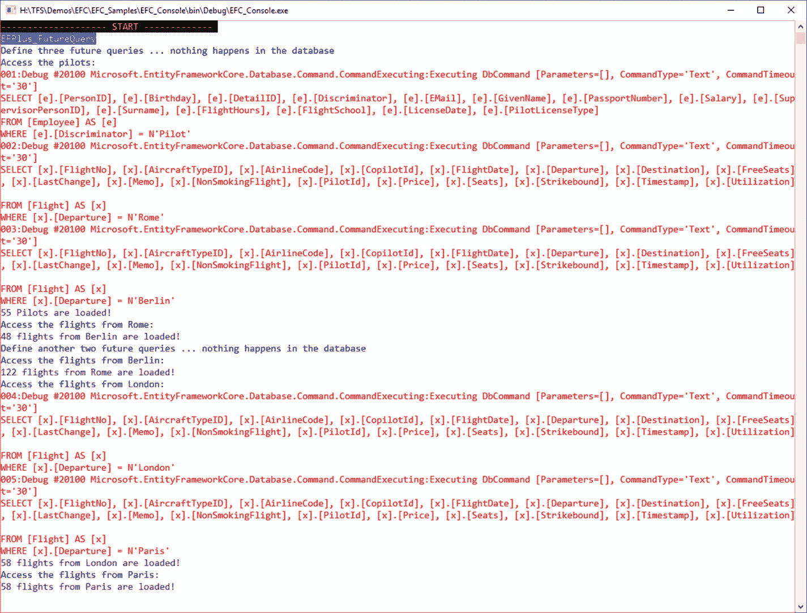

# 16.映射的提示和技巧

本章描述了影响实体类到数据库模式映射的其他方法。这些可能性中的许多没有显示在世界之翼的例子中，因为它们不适合它。

## 阴影属性

实体框架核心可以为数据库表中在实体类中没有对应属性或字段的那些列创建影子属性(也称为影子状态属性)。

### 自动阴影属性

如果导航关系的实体类中没有匹配的外键属性，则会自动创建影子属性。因为对于大多数关系，数据库模式需要一个外键列，所以该列自动成为影子属性。如果导航关系的对应方有几个主键列，则相应地创建几个外键列，每个外键列有一个 shadow 属性。

外键列和影子属性由导航属性的名称和主类的主键名组成。这样做，实体框架核心避免了单词重复(见表 [16-1](#Tab1) )。

表 16-1

Automatic Naming for Shadow Properties

<colgroup><col align="left"> <col align="left"> <col align="left"></colgroup> 
| 主类的主键 | 导航属性的名称 | 外键列/阴影属性的名称 |
| :-- | :-- | :-- |
| `MainClassID` | `MainClass` | `MainClassID` |
| `ID` | `MainClass` | `MainClassID` |
| `ID` | `Anything` | `AnythingID` |
| `MainClassID` | `Anything` | `AnythingMainClassID` |
| `MainClassID1`和`MainClassID2`(组合键) | `Anything` | `AnythingMainClassID1`和`AnythingMainClassID2` |

### 定义阴影属性

您也可以使用`Property()`方法手动定义阴影属性。清单 [16-1](#Par7) 展示了如何添加一个名为`LastChange`的`DateTime`影子属性。但是，这个名称存储在一个变量中，因此可以更改。

Note

更改变量`ShadowPropertyName`的内容必须在上下文类的第一次实例化之前完成，因为`OnModelCreating()`只被调用一次，即第一次使用上下文类时。

```cs
public class WWWingsContext: DbContext
{
  static public string ShadowPropertyName = "LastChange";
  ...
  protected override void OnModelCreating (ModelBuilder builder)
  {
  ...
  builder.Entity<Flight>().Property<DateTime>(ShadowPropertyName);
  }
}
Listing 16-1Defining a Shadow Property in OnModelCreating() of the Context Class

```

### 获取实体类的所有影子属性的输出

您可以从`EntityEntry<T>`实例的 properties 对象集中获得一个实体类的所有属性的列表(真实属性和阴影属性)，这是通过上下文类的`Entry()`方法获得的(清单 [16-2](#Par9) )。

```cs
using (WWWingsContext ctx = new WWWingsContext())
{
 var flight = ctx.FlightSet.SingleOrDefault(x => x.FlightNo == flightNo);

 foreach (var p in ctx.Entry(flight).Properties)
 {
  Console.WriteLine(p.Metadata.Name + ": " + p.Metadata.IsShadowProperty);
 }
}

Listing 16-2Printing a List of All Properties of an Entity Class Including the Shadow Properties

```

### 读取和更改阴影属性

不能在实体对象上直接使用 shadow 属性，因为相应的数据库列没有 real 属性。因此，使用通过`EntityEntry<T>`的实例进行，该实例通过上下文类的方法`Entry()`获得。然后您可以调用方法`Property("ColumnName")`并从提供的`PropertyEntry`对象中查询`CurrentValue`属性。

```cs
ctx.Entry(flight).Property("LastChange").CurrentValue

```

顺便说一下，这样您就可以从实体对象中访问任何信息，包括真实的属性。

```cs
ctx.Entry(flight).Property("FreeSeats").CurrentValue

```

然而，这通常是不做的，因为通过实体对象访问更容易。

```cs
flight.FreeSeats

```

Note

您只能通过`Property ("Name")`访问真实属性和阴影属性。如果数据库表有额外的列，它们不能被实体框架访问。调用`ctx.Entry(Flight).Property("abc").CurrentValue`导致以下运行时错误:“找不到实体类型‘Flight’的属性‘ABC’。请确保该属性存在，并且已包含在模型中。

您也可以通过`CurrentValue`改变数值，如下所示:

```cs
ctx.Entry(Flight).Property("LastChange").CurrentValue = DateTime.Now;

```

清单 [16-3](#Par20) 展示了`Flight`实体类上`LastChange` shadow 属性的使用。

```cs
public static void ReadAndChangeShadowProperty()
  {
   int flightNo = 101;
   CUI.MainHeadline(nameof(ReadAndChangeShadowProperty));

   using (WWWingsContext ctx = new WWWingsContext())
   {

    var flight = ctx.FlightSet.SingleOrDefault(x => x.FlightNo == flightNo);

    CUI.Headline("List of all shadow property of type Flight");
    foreach (var p in ctx.Entry(flight).Properties)
    {
     Console.WriteLine(p.Metadata.Name + ": " + p.Metadata.IsShadowProperty);
    }

    CUI.Print("Before: " + flight.ToString() + " / " + ctx.Entry(flight).State, ConsoleColor.Cyan);
    Console.WriteLine("Free seats: " + ctx.Entry(flight).Property("FreeSeats").CurrentValue);
    Console.WriteLine("Last change: " + ctx.Entry(flight).Property("LastChange").CurrentValue);

    CUI.PrintWarning("Changing object...");
    flight.FreeSeats += 1;
    ctx.Entry(flight).Property("LastChange").CurrentValue = DateTime.Now;

    CUI.Print("After: " + flight.ToString() + " / " + ctx.Entry(flight).State, ConsoleColor.Cyan);
    Console.WriteLine("Free seats: " + ctx.Entry(flight).Property("FreeSeats").CurrentValue);
    Console.WriteLine("Last change: " + ctx.Entry(flight).Property("LastChange").CurrentValue);

    var count = ctx.SaveChanges();
    Console.WriteLine("Number of saved changes: " + count);
   }
}

Listing 16-3Using a Shadow Property

```

### 使用阴影属性编写 LINQ 查询

您还可以在语言集成查询(LINQ)中使用阴影属性。这里不能用`Entry()`和`Property()`；你必须使用特殊的建筑`EF.Property<T>()`。类`EF`是实体框架核心的静态类。

这种结构不仅在条件中允许，而且在排序和投影中也允许。清单 [16-4](#Par23) 标识了最近两天发生的最后一次变更。

```cs
CUI.Headline("LINQ query using a Shadow Property");
using (WWWingsContext ctx = new WWWingsContext())
{
 var date = ctx.FlightSet
  .Where(c => EF.Property<DateTime>(c, WWWingsContext.ShadowStateProp) > DateTime.Now.AddDays(-2))
  .OrderByDescending(c => EF.Property<DateTime>(c, WWWingsContext.ShadowStateProp))
  .Select(x => EF.Property<DateTime>(x, WWWingsContext.ShadowStateProp))
  .FirstOrDefault();

 Console.WriteLine("Last change: " + date);
}

Listing 16-4LINQ Queries with Shadow Properties

```

### 实际示例:每次保存时自动更新阴影属性

如果您想对开发人员隐藏信息，阴影属性尤其有用。清单 [16-5](#Par25) 展示了如何在上下文类中覆盖`SaveChanges()`方法，每次保存对`Flight`对象的更改时，该方法会自动将`LastChange` shadow 属性更新为当前日期和时间。

```cs
public override int SaveChanges()
  {
   // Detect changes
   this.ChangeTracker.DetectChanges();

   // Search all new and changed flights
   var entries = this.ChangeTracker.Entries<Flight>()
       .Where(e => e.State == EntityState.Added || e.State == EntityState.Modified);

   if (!String.IsNullOrEmpty(ShadowStateProp))
   {
    // set the Shadow State column "LastChange" for all of them
    foreach (var entry in entries)
    {
     entry.Property(ShadowStateProp).CurrentValue = DateTime.Now;
    }
   }

   // Save changes (we do not need DetectChanges() to be called again!)
   this.ChangeTracker.AutoDetectChangesEnabled = false;
   var result = base.SaveChanges(); // Call base class now
   this.ChangeTracker.AutoDetectChangesEnabled = true;
   return result;
  }

Listing 16-5Using a Shadow Property in the Overwritten SaveChanges() Method

```

## 计算列

从实体框架核心的角度来看，计算列是数据库管理系统为其赋值的那些数据库列。这些可能如下:

*   自动增加值列(标识列)，如`Person`类中的`PersonID`以及从`Person`派生的`Employee`、`Pilot`和`Passenger`类
*   时间戳列(参见第 [11 章](11.html)
*   具有默认值的列
*   具有计算公式的列

### 自动选择

在所有这些情况下，在任何生成的`INSERT`或`UPDATE`之后，实体框架核心用一个自动的`SELECT`来响应，以将计算列的新值从数据库管理系统读入 RAM。然而，在默认列的情况下，这只有在`INSERT`之后才有意义。因此，实体框架核心知道三种策略以及 Fluent API 中的相应方法:

*   `ValueGeneratedOnAdd()`:只有在`INSERT`之后才会执行`SELECT`。
*   `ValueGeneratedOnAddOrUpdate()`:在`INSERT`和`UPDATE`之后都执行`SELECT`。
*   `ValueGeneratedNever()`:在`INSERT`或`UPDATE`之后不执行`SELECT`。

`ValueGeneratedNever()`是所有列的默认值，但以下三种情况除外:

*   默认情况下，由类型为`Int16` ( `short`)、`Int32` ( `int`)或`Int64` ( `long`)的单个整数列组成的主键列被创建为带有`ValueGeneratedOnAdd()`的自动递增列。
*   默认列自动得到`ValueGeneratedOnAdd()`。
*   用`[Timestamp]`标注的字节数组(`byte[]`)列被自动赋予`ValueGeneratedOnAddOrUpdate()`。

Note

虽然 Microsoft SQL Server 确实允许类型为`tinyint`(即`byte`)的标识列，但 Entity Framework Core 始终为`Byte`数据类型设置主键不使用自动增量值。

### 实际示例:使用计算公式创建列

与其前身相比，实体框架核心支持在程序代码中定义计算公式，以便在数据库管理系统中执行正向工程。

您可以在实体类中为计算列创建一个属性。例如，实体类`Flight`将获得一个名为`Utilization`的属性，它将是预订座位的百分比。它还得到了`Seats`(飞机座位总数)和`FreeSeats`。将计算列的`Utilization`属性的 setter 声明为私有是有意义的，因为该对象的任何用户都不能设置该值。这里不能完全省略 setter，因为 Entity Framework Core 需要一种方法来设置从数据库管理系统接收的值。

```cs
public class Flight
{
  public int FlightNo {get; set; }
  ...
  public short Seats {get; set; }
  public short? FreeSeats {get; set; }
  public decimal? Utilization {get; private set; }
}

```

现在用`HasComputedColumnSql()`在`OnModelCreating()`的 Fluent API 中定义一个公式。在这种情况下，每个`Flight`的利用率百分比是根据空闲座位数和总座位数计算出来的。

```cs
modelBuilder.Entity<Flight>().Property(p => p.Utilization)
            .HasComputedColumnSql("100.0-(([FreeSeats]*1.0)/[Seats])*100.0");

```

Note

没有必要使用`ValueGeneratedOnAddOrUpdate()`，因为`HasComputedColumnSql()`暗示了这种策略。

当创建模式迁移时，您可以在`MigrationBuilder`调用中再次看到该公式。

```cs
    public partial class v2_FlightCostload: Migration
    {
        protected override void up (MigrationBuilder migrationBuilder)
        {
            migration builder.AddColumn<int>(
                name: "Utilization",
                table: "Flight",
                type: "decimal",
                nullable: true,
                computedColumnSql: "100.0-(([FreeSeats]*1.0)/[Seats])*100.0");
        }
...
}

```

你也可以在数据库模式中看到这个公式(图 [16-1](#Fig1) )。


图 16-1

Calculation formula column in Microsoft SQL Server Management Studio

### 在计算公式中使用列

带有公式的列的属性可以像其他列一样读取，如清单 [16-6](#Par51) 所示。

Note

在执行`SaveChanges()`之前，带有计算公式列的列的属性值不会改变。在清单 [16-6](#Par51) 中，座位数量减少后，利用率最初显示的是旧值。只有在`SaveChanges()`之后才能获得新值。

```cs
public static void ComputedColumnWithFormula()
{
 CUI.MainHeadline(nameof(ComputedColumnWithFormula));

 int flightNo = 101;
 using (WWWingsContext ctx = new WWWingsContext())
 {
  ctx.Log();
  var flight = ctx.FlightSet.Find(flightNo);
  Console.WriteLine($"BEFORE: {flight}: Utilization={flight.Utilization:##0.00}%");

  flight.FreeSeats -= 10;
  //not possible: flight.Utilization = 100;

  // The change is not yet visible in the Utilization, since the Utilization is calculated in the DBMS
  Console.WriteLine($"After changes: {flight}: Utilization={flight.Utilization:##0.00}%");

  ctx.SaveChanges();
  // The change in Utilization is now visible
  Console.WriteLine($"After saving: {flight}: Utilization={flight.Utilization:##0.00}%");

  CUI.Headline("Metadata of Flight properties");
  foreach (PropertyEntry p in ctx.Entry(flight).Properties)
  {
   Console.WriteLine(p.Metadata.Name + ": " + p.Metadata.ValueGenerated);
  }
 }
}

Listing 16-6The Utilization Column in the Flight Class Is Based on a Formula

```

图 [16-2](#Fig2) 显示了清单 [16-6](#Par51) 的输出。请注意以下几点:


图 16-2

Output of Listing [16-6](#Par51)

*   利用率仅在`SaveChanges()`后更新。
*   利用率列有策略`OnAddOrUpdate`(通过`Metadata` `.` `ValueGenerated`在`PropertyEntry`对象中得到的)。
*   因此，在`SaveChanges()`之后，实体框架核心对该值(和时间戳)执行`SELECT`。

### 在逆向工程中使用带计算公式的列

实体框架核心在使用`Scaffold-DbContext`进行逆向工程时识别计算公式，并相应地创建一个属性。但是，该属性接收一个公共 setter。公式由代码生成器存储在 Fluent API 中，但这在逆向工程中没有任何意义。只有当你后来从逆向工程转向正向工程时，它才会变得有意义。

```cs
public decimal? Utilization {get; set; }

```

Fluent API 包含以下内容:

```cs
entity.Property(e => e.Utilization)
.HasColumnType("numeric(20, 8)")
.HasComputedColumnSql("((100.0-(([FreeSeats]*1.0)/[Seats])*100.0))")

```

逆向工程的基础是带有列`Utilization`的数据库模式，它以前是由正向工程生成的。

## 默认值

实体框架核心支持由数据库管理系统设置的默认值，同时为尚未传递值的列创建记录。这种支持同时存在于正向工程和反向工程中。

### 定义正向工程的默认值

当没有提供显式值时，使用 Fluent API 中的方法`HasDefaultValue()`和`HasDefaultValueSql()`来定义由数据库管理系统分配的列默认值。默认值可以是下列值之一:

*   静态值(如数字或字符串)，使用`HasDefaultValue()`
*   使用`HasDefaultValueSql()`的 SQL 表达式(例如，调用类似`getdate()`的函数)

以下是一些例子:

```cs
f.Property(x => x.Price).HasDefaultValue(123.45m);
f.Property(x => x.Departure).HasDefaultValue("(not set)");
f.Property(x => x.Destination).HasDefaultValue("(not set)");
f.Property(x => x.Date).HasDefaultValueSql("getdate()");

```

实体框架核心在创建数据库时会考虑这些默认值(参见图 [16-3](#Fig3) )。


图 16-3

Default value for the FlightDate column in Microsoft SQL Server Management Studio

### 使用默认值

实体框架核心考虑定义的默认值。作为`ValueOnAdd`策略的一部分，实体框架核心在`INSERT`之后查询默认值，但前提是之前没有传递任何值。

清单 [16-7](#Par73) 非常深刻地展示了这一点。

*   在代码中设置`Departure`的值。因此，实体框架核心不要求`SELECT`中的出发位置。
*   `Destination`为空。因此，实体框架核心在`SELECT`中要求数据库管理系统给出的`Destination`值。
*   新对象中未设置`Flight Date`和`Price`。因此，实体框架核心在`SELECT`中查询由数据库管理系统分配的`FlightDate`和`Price`值。

```cs
public static void DefaultValues()
{
 CUI.MainHeadline(nameof(DefaultValues));

 using (WWWingsContext ctx = new WWWingsContext())
 {
  var pilot = ctx.PilotSet.FirstOrDefault();
  ctx.Log();
  var f = new Flight();
  f.FlightNo = ctx.FlightSet.Max(x => x.FlightNo) + 1;
  f.Departure = "Berlin";
  f.Destination = null;
  f.Pilot = pilot;
  f.Copilot = null;
  f.FreeSeats = 100;
  f.Seats = 100;
  CUI.Headline("Object has been created in RAM");
  Console.WriteLine($"{f} Price: {f.Price:###0.00} Euro.");
  ctx.FlightSet.Add(f);
  CUI.Headline("Object has been connected to the ORM");
  Console.WriteLine($"{f} Price: {f.Price:###0.00} Euro.");
  ctx.SaveChanges();
  CUI.Headline("Object has been saved");
  Console.WriteLine($"{f} Price: {f.Price:###0.00} Euro.");

  f.FreeSeats--;
  CUI.Headline("Object has been changed in RAM");
  Console.WriteLine($"{f} Price: {f.Price:###0.00} Euro.");
  ctx.SaveChanges();
  CUI.Headline("Object has been saved"); ;
  Console.WriteLine($"{f} Price: {f.Price:###0.00} Euro.");

  //if (f.Destination != "(not set)") Debugger.Break();
  //if (f.Price != 123.45m) Debugger.Break();
 }
}

Listing 16-7Using Default Values

```

图 [16-4](#Fig4) 显示默认值仅在`SaveChanges()`之后设置。用`UPDATE`更新后，实体框架核心不再要求默认值(只有带有`Utilization`计算公式的列和数据库管理系统分配的时间戳列是`UPDATE`后的`SELECT`的一部分)。


图 16-4

Output of Listing [16-7](#Par73)

### 实际示例:创建对象时已经分配了默认值

如果您希望默认值在对象创建后立即在 RAM 中生效，那么您不必在数据库管理系统中分配这些默认值，而是在类的构造函数中分配(清单 [16-8](#Par76) )。

```cs
public class Flight
 {

  /// <summary>
  /// Parameterless constructor
  /// </summary>
  public Flight()
  {
   // Default Values
   this.Departure = "(not set)";
   this.Destination = "(not set)";
   this.Price = 123.45m;
   this.Date = DateTime.Now;
  }
...
}

Listing 16-8Assigning Default Values in the Constructor

```

图 [16-5](#Fig5) 使用了`Date`和`Price`属性的例子来显示默认值立即适用。然而，`Flight`构造函数中设置的`Departure`和`Destination`默认值不起作用，因为程序代码覆盖了这些值。


图 16-5

Output of the Use Defaults listing when default values are specified in the constructor

### 使用默认值进行逆向工程

实体框架核心识别`Scaffold-DbContext`上的默认值，并将它们放在 Fluent API 中。这里重要的是实体框架核心知道有一个缺省值。对于逆向工程来说，实际值是多少并不重要。事实上，您也可以稍后在这里输入一个空字符串。生成的代码总是使用`HasDefaultValueSql()`，即使对于静态值也是如此。

```cs
entity.Property(e => e.FlightDate).HasDefaultValueSql("(getdate())")
entity.Property(e => e.Price).HasDefaultValueSql("((123.45))");
entity.Property(e => e.Departure)
                    .HasMaxLength(50)
                    .HasDefaultValueSql("(N'(not set)')");
entity.Property(e => e.Destination)
                    .HasMaxLength(50)
                    .HasDefaultValueSql("(N'(not set)')");

```

## 表格拆分

从 Entity Framework Core 2.0 开始，OR mapper 允许您将单个数据库表分布在多个实体类中。表格拆分如下进行:

*   为表创建一个实体类(`Master`)和一个或多个依赖类。
*   实体类实现引用依赖类的 1:1 导航属性。
*   对于这些导航属性，您在`OnModelCreating()`中调用方法`OwnsOne()`。

清单 [16-9](#Par85) 显示了一个`Master`类和三个依赖的`Split`类。

```cs
using ITVisions;
using Microsoft.EntityFrameworkCore;
using System;
using System.Collections.Generic;

namespace EFC_MappingScenarios.TableSplitting
{
 /// <summary>
 /// In this example, several classes are deliberately implemented in one file, so that the example is clearer.
 /// </summary>
 class DEMO_TableSplitting
 {
  public static void Run()
  {
   CUI.MainHeadline(nameof(DEMO_TableSplitting));
   using (var ctx = new MyContext())
   {
    CUI.Print("Database: " + ctx.Database.GetDbConnection().ConnectionString);

    var e = ctx.Database.EnsureCreated();

    if (e)
    {
     CUI.Print("Database has been created!");
    }
    else
    {
     CUI.Print("Database exists!");

    }

    CUI.Headline("Detail");
    var obj1 = new Detail();
    foreach (var p in ctx.Entry(obj1).Properties)
    {
     Console.WriteLine(p.Metadata.Name + ": " + p.Metadata.IsShadowProperty);
    }

    CUI.Headline("Master");
    var obj2 = new Master();
    foreach (var p in ctx.Entry(obj2).Properties)
    {
     Console.WriteLine(p.Metadata.Name + ": " + p.Metadata.IsShadowProperty);
    }
   }
  }
 }

 class MyContext : DbContext
 {
  public DbSet<Master> MasterSet { get; set; }
  public DbSet<Detail> DetailSet { get; set; }

  protected override void OnConfiguring(DbContextOptionsBuilder builder)
  {
   // Set provider and connectring string
   string connstring = @"Server=.;Database=EFC_MappingTest_TableSplitting;Trusted_Connection=True;MultipleActiveResultSets=True;";
   builder.UseSqlServer(connstring);
  }

  protected override void OnModelCreating(ModelBuilder modelBuilder)
  {
   // Define a composite key
   modelBuilder.Entity<Master>().HasKey(b => new { b.MasterId1, b.MasterId2 });

   // Define table splitting
   modelBuilder.Entity<Master>().OwnsOne(c => c.Split1);
   modelBuilder.Entity<Master>().OwnsOne(c => c.Split2);
   modelBuilder.Entity<Master>().OwnsOne(c => c.Split3);
  }
 }

 public class Master
 {
  public int MasterId1 { get; set; }
  public int MasterId2 { get; set; }
  public string Memo { get; set; }

  public List<Detail> DetailSet { get; set; }
  public Split1 Split1 { get; set; }
  public Split2 Split2 { get; set; }
  public Split3 Split3 { get; set; }
 }

 public class Detail
 {
  public int DetailId { get; set; }
  public string DetailMemo { get; set; }

  public Master Master { get; set; }
 }

 public class Split1
 {
  public string Memo1 { get; set; }
 }
 public class Split2
 {
  public string Memo2 { get; set; }
 }

 public class Split3
 {
  public string Memo3 { get; set; }
 }
}

Listing 16-9Project EFC_MappingTest, TableSplitting.cs

```

图 [16-6](#Fig6) 显示`MasterSet`数据库表包含了`Master`类以及三个名为`Split1`、`Split2`和`Split3`的类的所有属性。


图 16-6

Created database

## 序列对象(序列)

序列对象(也称为序列)存在于一些数据库管理系统(例如 Oracle、Microsoft SQL Server)中，用于自动增量值的灵活分配。在 Microsoft SQL Server 中，序列自 2012 版起就存在了。

### 什么是序列？

序列以升序或降序返回数字，以定义的间隔生成。可以对序列进行配置，以便在达到可定义的最终值时重新启动，换句话说，形成一个循环(序列循环)。虽然标识列仅适用于`tinyint`、`smallint`、`int`和`bigint`，但是您也可以使用序列将值分配给 decimal 和 numeric 列类型。

因此，序列对象具有以下属性:

*   最小值
*   最大值
*   起始值(介于最小值和最大值之间的值)，表示将传送的第一个数字
*   增量或减量(当前值为下一个值增加的值)
*   顺序循环(是或否)

与标识列不同，序列对象独立于一个表，因此可以由多个表使用。

在 Microsoft SQL Server Management Studio(SSMS)中，可以在数据库的可编程性/序列分支中看到序列对象。

序列允许您在不在表中插入行的情况下检索下一项。这是在 T-SQL 中通过以下语句完成的:

```cs
select NEXT VALUE FOR schema.NameofSequence

```

此后，序列号被视为已检索。如果提取是中止的事务的一部分，则不会回滚。

### 在正向工程中创建序列

通过`HasSequence()`在 Fluent API 中定义一个序列，然后与`HasDefaultValueSql()`一起使用(例如，用于主键)。清单 [16-10](#Par101) 显示了 1000 和 1300 之间的循环序列的定义，从 1100 开始，步长为 10。然后在三个地方使用这个序列(简单主键、复合主键和其他列)。图 [16-7](#Fig7) 显示了输出。


图 16-7

Created sequence in Microsoft SQL Server Management Studio

```cs
// cyclic sequence between 1000 and 1300, step 10, starting at 1100
modelBuilder.HasSequence<int>("Setp10IDs", schema: "demo")
.StartsAt(1100).IncrementsBy(10).HasMin(1000).HasMax(1300).IsCyclic();

// Sequence used for primary key (Data type: short)
modelBuilder.Entity<EntityClass1>()
         .Property(o => o.EntityClass1Id)
         .HasDefaultValueSql("NEXT VALUE FOR demo.Setp10IDs");
// Sequence used for normal column (Data type: decimal)
modelBuilder.Entity<EntityClass2>()
      .Property(o => o.Value)
      .HasDefaultValueSql("NEXT VALUE FOR demo.Setp10IDs");

// Sequence used for part of a composite key (Data type: int)
modelBuilder.Entity<EntityClass3>().HasKey(b => new { b.EntityClass3Id1, b.EntityClass3Id2 });
modelBuilder.Entity<EntityClass3>()
   .Property(o => o.EntityClass3Id1)
   .HasDefaultValueSql("NEXT VALUE FOR demo.Setp10IDs");

Listing 16-10Creating and Applying Sequences

```

### 查看运行中的序列

清单 [16-11](#Par109) 显示了一个独立的例子:

1.  上下文类引用了三个实体类。
2.  上下文类创建一个序列。
3.  实体类 1 使用主键序列。
4.  实体类 2 使用`Value`列的顺序(类型`decimal`)。
5.  实体类 3 使用序列作为主键的一部分。
6.  然后程序创建并保存所有三个类的实例。

```cs
using ITVisions;
using Microsoft.EntityFrameworkCore;
using System;
using System.ComponentModel.DataAnnotations;

namespace EFC_MappingScenarios.Sequences
{
 /// <summary>
 /// In this example, several classes are deliberately implemented in one file, so that the example is clearer.
 /// </summary>
 class DEMO_SequencesDemos
 {
  public static void Run()
  {
   CUI.MainHeadline(nameof(DEMO_SequencesDemos));
   using (var ctx = new Kontext())
   {
    CUI.Print("Database: " + ctx.Database.GetDbConnection().ConnectionString);
    var e = ctx.Database.EnsureCreated();
    if (e)
    {
     CUI.Print("Database has been created!");
    }
    else
    {
     CUI.Print("Database exists!");
    }

// This will fail, because we consume more IDs that the sequence defines!
    for (int i = 0; i < 30; i++)
    {
     var obj1 = new EntityClass1();
     ctx.EntityClass1Set.Add(obj1);

     CUI.Headline("EntityClass1");
     Console.WriteLine($"BEFORE: PK: {obj1.EntityClass1Id}");
     var count1 = ctx.SaveChanges();
     Console.WriteLine($"Saved changes: {count1}.PK: {obj1.EntityClass1Id}");
     CUI.Headline("EntityClass2");
     var obj2 = new EntityClass2();
     ctx.EntityClass2Set.Add(obj2);
     Console.WriteLine($"BEFORE: PK: {obj2.EntityClass2Id} Value: {obj2.Value}");
     var count2 = ctx.SaveChanges();
     Console.WriteLine($"Saved changes: {count2}.PK: {obj2.EntityClass2Id} Value: {obj2.Value}");
     CUI.Headline("EntityClass3");
     var obj3 = new EntityClass3();
     ctx.EntityClass3Set.Add(obj3);
     Console.WriteLine($"BEFORE: PK: {obj3.EntityClass3Id1}/{obj3.EntityClass3Id2}");
     var count3 = ctx.SaveChanges();
     Console.WriteLine($"Saved changes: {count3}. PK: {obj3.EntityClass3Id1}/{obj3.EntityClass3Id2}");
    }
   }
  }
 }
 class Kontext : DbContext
 {
  public DbSet<EntityClass1> EntityClass1Set { get; set; }
  public DbSet<EntityClass2> EntityClass2Set { get; set; }
  public DbSet<EntityClass3> EntityClass3Set { get; set; }
  protected override void OnConfiguring(DbContextOptionsBuilder builder)
  {
   // Set provider and connectring string
   string connstring = @"Server=.;Database=EFC_MappingTest_Sequences;Trusted_Connection=True;MultipleActiveResultSets=True;";
   builder.UseSqlServer(connstring);
   builder.EnableSensitiveDataLogging(true);
  }

  protected override void OnModelCreating(ModelBuilder modelBuilder)
  {
   // cyclic sequence between 1000 and 1300, step 10, starting at 1100
   modelBuilder.HasSequence<int>("Setp10IDs", schema: "demo")
   .StartsAt(1100).IncrementsBy(10).HasMin(1000).HasMax(1300).IsCyclic();

   // Sequence used for primary key (Data type: short)
   modelBuilder.Entity<EntityClass1>()
            .Property(o => o.EntityClass1Id)
            .HasDefaultValueSql("NEXT VALUE FOR demo.Setp10IDs");
   // Sequence used for normal column (Data type: decimal)
   modelBuilder.Entity<EntityClass2>()
         .Property(o => o.Value)
         .HasDefaultValueSql("NEXT VALUE FOR demo.Setp10IDs");

   // Sequence used for part of a composite key (Data type: int)
   modelBuilder.Entity<EntityClass3>().HasKey(b => new { b.EntityClass3Id1, b.EntityClass3Id2 });
   modelBuilder.Entity<EntityClass3>()
      .Property(o => o.EntityClass3Id1)
      .HasDefaultValueSql("NEXT VALUE FOR demo.Setp10IDs");
  }
 }

 public class EntityClass1
 {
  public short EntityClass1Id { get; set; }
  [Timestamp]
  public byte[] Timestamp { get; set; }
 }

 public class EntityClass2
 {
  public int EntityClass2Id { get; set; }
  public decimal Value { get; set; }
 }

 public class EntityClass3
 {
  /// Composite PK
  public int EntityClass3Id1 { get; set; }
  public int EntityClass3Id2 { get; set; }
 }
}

Listing 16-11Project EFC_MappingTest, Sequences.cs

```

图 [16-8](#Fig8) 没有显示从序列号 1100 开始的第一次运行，而是以下运行之一。对于实体类别 1，序列号 1260 被分配；对于实体类别 2，分配 1270；对于实体类别 3，分配 1280。然后，对于实体类 1，使用 1290，对于实体类 2，分配 1300。因此，到达了循环序列的值范围的末端。下一个值是 1000。


图 16-8

Output of Listing [16-11](#Par52) Note

如果最终在序列循环中使用了此表中已在使用的主键的值，则会出现以下运行时错误:“违反主键约束' PK_EntityClass1Set '。无法将重复键插入对象的 dbo。EntityClass1Set。重复的键值是(…)。"

## 可选键

除了主键(可能由一列或多列组成)之外，表还可以有附加键(也可能由一列或多列组成)，这些键唯一地标识数据库表中的每一行。为此，数据库管理系统有一些概念，如唯一索引和唯一约束。这两个概念是相似的。这是在 [`https://technet.microsoft.com/en-us/library/aa224827(v=sql.80).aspx`](https://technet.microsoft.com/en-us/library/aa224827(v=sql.80).aspx) 讨论的。

经典的实体框架核心只允许创建唯一的索引。在实体框架核心中，您现在还可以创建唯一的约束。实体框架核心称之为可选键。

表 16-2

Unique Index vs. Alternative Key

<colgroup><col align="left"> <col align="left"> <col align="left"></colgroup> 
| 实体框架概念 | 唯一索引 | 可选键 |
| :-- | :-- | :-- |
| 数据库概念 | 唯一索引 | 唯一约束 |
| 经典实体框架中支持 | 是的，从版本 6.1 开始 | 不 |
| 实体框架核心中支持 | 是的，从版本 1.0 开始 | 是的，从版本 1.0 开始 |
| 在关系中用作外键 | 不 | 是 |

### 定义可选键

在 Fluent API 中用`HasAlternateKey()`定义了一个替代键。在这里，类`Detail`接收到了列`Guid`的替换键。

```cs
modelBuilder.Entity<Detail>().HasAlternateKey(c => c.Guid);

```

与主键一样，可选键可以由多列组成。为此，使用一个匿名对象作为`HasAlternateKey()`中的参数:

```cs
modelBuilder.Entity<Detail>()
.HasAlternateKey(c => new { c.Guid, Bereich = c.Area });

```

如果在关系定义中，您没有创建外键和主键之间的关系，而是使用父类的不同列而不是主键，则 Entity Framework Core 会自动生成替换键。

```cs
modelBuilder.Entity<Detail>()
          .HasOne(p => p.Master)
          .WithMany(b => b.DetailSet)
          .HasForeignKey(p => p.MasterGuid)
          .HasPrincipalKey(b => b.Guid);

```

图 [16-9](#Fig9) 显示了在 Microsoft SQL Server Management Studio 中创建的唯一约束。实体框架核心给出了以字母 AK 开头的唯一约束名称(代表“可选键”)。

除了主键之外，`MasterSet`表还有一个针对`Guid`列的唯一约束。除了指向`MasterSet`的`Guid`列的主键和外键之外，`DetailSet`表还有两个惟一的约束:一个在`Guid`列上，另一个在`Guid`和`Area`列上，作为组合键。这证明了实体框架核心允许一个列成为多个可选键的一部分。

Tip

如果可能的话，您应该总是使用关系来形成整数列，外键应该引用主键，因为这样可以提供最高的性能和最小的内存开销。图 [16-9](#Fig9) 通过`GUID`列类型的列显示的关系仅用于说明目的。


图 16-9

Unique constraints in Microsoft SQL Server Management Studio Tip

如果您不喜欢实体框架核心分配的唯一约束的名称，您也可以使用`HasName()`在 Fluent API 中给出自己的名称。

这里有一个例子:

```cs
// Alternative key with one column
modelBuilder.Entity<Detail>()
    .HasAlternateKey(c => c.Guid).HasName("UniqueContraint_GuidOnly"); ;
// Alternative key with two columns
modelBuilder.Entity<Detail>()
 .HasAlternateKey(c => new { c.Guid, Bereich = c.Area }).HasName("UniqueContraint_GuidAndArea");

```

### 查看使用中的替代键

清单 [16-12](#Par133) 显示了一个独立的例子:

*   上下文类是指两个实体类:`Master`和`Detail`。
*   除了主键之外，`Master`类还有一个用于`GUID`列的替换键。
*   除了指向`MasterSet`的`Guid`列的主键和外键，`Detail`类还有两个备用键:一个在`Guid`属性上，一个在`Guid`和`Area`属性上。
*   程序首先输出两个类的属性列表，并在屏幕上显示它是一个键(`IsKey()`)还是一个主键(`IsPrimaryKey()`)。对于每个主键，`IsKey()`也返回 true。
*   然后程序创建一个`Detail`对象和一个`Master`对象。它使用`GUID`连接这些对象。

图 [16-10](#Fig10) 显示了输出。


图 16-10

Output of Listing [16-12](#Par133)

```cs
using ITVisions;
using Microsoft.EntityFrameworkCore;
using System;
using System.Collections.Generic;

namespace EFC_MappingScenarios.AlternateKeys
{
 /// <summary>
 /// In this example, several classes are deliberately implemented in one file, so that the example is clearer.
 /// </summary>
 class DEMO_AlternateKeys
 {
  public static void Run()
  {
   CUI.MainHeadline(nameof(DEMO_AlternateKeys));
   using (var ctx = new MyContext())
   {
    CUI.Print("Database: " + ctx.Database.GetDbConnection().ConnectionString);

    var e = ctx.Database.EnsureCreated();

    if (e)
    {
     CUI.Print("Database has been created!");
    }
    else
    {
     CUI.Print("Database exists!");

    }

    CUI.MainHeadline("Metadata");
    CUI.Headline("Detail");
    var obj1 = new Detail();
    foreach (var p in ctx.Entry(obj1).Properties)
    {
     Console.WriteLine(p.Metadata.Name + ": Key=" + p.Metadata.IsKey() + " PrimaryKey=" + p.Metadata.IsPrimaryKey());
    }

    CUI.Headline("Master");
    var obj2 = new Master();
    foreach (var p in ctx.Entry(obj2).Properties)
    {
     Console.WriteLine(p.Metadata.Name + ": Key=" + p.Metadata.IsKey() + " PrimaryKey=" + p.Metadata.IsPrimaryKey());
    }

    CUI.MainHeadline("Two new objects...");
    var h = new Master();
    h.Guid = Guid.NewGuid().ToString();
    var d = new Detail();
    d.Guid = Guid.NewGuid().ToString();
    d.Area = "AB";
    h.DetailSet.Add(d);
    ctx.MasterSet.Add(h);
    var count = ctx.SaveChanges();
    if (count > 0)
    {
     CUI.PrintSuccess(count + " Saved changes!");
     CUI.Headline("Master object");
     Console.WriteLine(h.ToNameValueString());
     CUI.Headline("Detail object");
     Console.WriteLine(d.ToNameValueString());
    }
   }
  }
 }

 class MyContext : DbContext
 {
  public DbSet<Master> MasterSet { get; set; }
  public DbSet<Detail> DetailSet { get; set; }

  protected override void OnConfiguring(DbContextOptionsBuilder builder)
  {
   // Set provider and connectring string
   string connstring = @"Server=.;Database=EFC_MappingScenarios_AlternateKey;Trusted_Connection=True;MultipleActiveResultSets=True;";
   builder.UseSqlServer(connstring);
  }

  protected override void OnModelCreating(ModelBuilder modelBuilder)
  {
   // Alternative key with one column
   modelBuilder.Entity<Detail>()
    .HasAlternateKey(c => c.Guid).HasName("UniqueContraint_GuidOnly"); ;
   // Alternative key with two columns
   modelBuilder.Entity<Detail>()
 .HasAlternateKey(c => new { c.Guid, Bereich = c.Area }).HasName("UniqueContraint_GuidAndArea");

   // The Entity Framework Core automatically generates an alternate key if, in a relationship definition, you do not create the relationship between foreign key and primary key, but use a different column of the parent class instead of the primary key.
   modelBuilder.Entity<Detail>()
          .HasOne(p => p.Master)
          .WithMany(b => b.DetailSet)
          .HasForeignKey(p => p.MasterGuid)
          .HasPrincipalKey(b => b.Guid);
  }
 }

 public class Master
 {
  public int MasterID { get; set; }
  public string Guid { get; set; }
  public string Memo { get; set; }

  public List<Detail> DetailSet { get; set; } = new List<Detail>();

 }

 public class Detail
 {
  public string DetailID { get; set; }
  public string DetailMemo { get; set; }
  public string Guid { get; set; }
  public string Area { get; set; }
  public string MasterGuid { get; set; }
  public Master Master { get; set; }
 }

}

Listing 16-12Project EFC_MappingTest, AlternateKeys.cs

```

Note

可选键(作为主键)不得有`NULL`值。实体框架核心通过以下运行时错误确认了这一点，该错误还指出在唯一索引中允许零`NULL`值:“无法跟踪' DetailKlasse '类型的实体，因为备用键属性' Guid '为空。如果在关系中没有使用替换键，那么可以考虑使用唯一索引。唯一索引可以包含空值，而备用键不能包含空值。

## 级联删除

如果在对象关系(1:1，1:N)中删除了一个主记录，那么一个详细数据记录(1:1)或多个详细数据记录(1:N)会发生什么情况？答案是级联删除。

### 删除实体框架核心中的选项

实体框架核心为级联删除依赖对象提供了总共四个选项，因此比它的前身 ADO.NET 实体框架提供了更多的选项。

如果没有相关记录的相关对象被具体化，则 Entity Framework Core 将始终向数据库发送(无论设置如何)一个针对主记录的删除命令。对详细数据集的处理取决于数据库管理系统。

然而，如果相关记录被物化为相关记录，则实体框架核心可以在删除主记录之前向数据库管理系统发送(取决于设置)一个`DELETE`或`UPDATE`记录详细记录命令。此外，根据设置的不同，RAM 中的外键属性也会发生变化。

表 16-3

Cascading Delete Settings and Their Effects

<colgroup><col align="left"> <col align="left"> <col align="left"> <col align="left"> <col align="left"></colgroup> 
| 实体框架核心设置 | 默认为… | 数据库中外键的结果设置 | 运行时行为:物化相关对象 | 运行时行为:未具体化的相关记录 |
| :-- | :-- | :-- | :-- | :-- |
| `Cascade` | 强制关系 | `Cascade` | 实体框架核心为相关对象发送`DELETE`。RAM 中的外键属性被保留。 | DBMS 自动删除相关记录。 |
| `ClientSetNull` | 可选关系(从实体框架核心 2.0 开始) | `No Action` | 实体框架核心为相关对象发送`UPDATE SET = NULL`。RAM 中的外键属性设置为`NULL`。 | 没有。如果数据库中存在记录，则出现错误。 |
| `SetNull` |   | `SetNull` | 实体框架核心为相关对象发送`UPDATE SET = NULL`。RAM 中的外键属性设置为`NULL`。 | DBMS 将外键列设置为`NULL`。 |
| `Restrict` | 可选关系(在实体框架核心 1.x 中) | `No Action` | 版本 1.x: `UPDATE SET = NULL`。版本 2.x:内存中存在对象时出错。 | 没有。如果数据库中存在记录，则出现错误。 |

实体框架核心的级联删除设置是在 Fluent API 的关系声明中使用`OnDelete()`方法和`DeleteBehavior`枚举进行的。

```cs
   modelBuilder.Entity<Detail1>()
   .HasOne(f => f.Master)
   .WithMany(t => t.Detail1Set)
   .HasForeignKey(x => x.MasterId)
   .OnDelete(DeleteBehavior.Cascade);

   modelBuilder.Entity<Detail2>()
   .HasOne(f => f.Master)
   .WithMany(t => t.Detail2Set)
   .HasForeignKey(x => x.MasterId)
   .OnDelete(DeleteBehavior.ClientSetNull);

   modelBuilder.Entity<Detail3>()
    .HasOne(f => f.Master)
    .WithMany(t => t.Detail3Set)
    .HasForeignKey(x => x.MasterId)
    .OnDelete(DeleteBehavior.SetNull);

   modelBuilder.Entity<Detail4>()
    .HasOne(f => f.Master)
    .WithMany(t => t.Detail4Set)
    .HasForeignKey(x => x.MasterId)
    .OnDelete(DeleteBehavior.Restrict);

```

### 看一个例子

清单 [16-13](#Par142) 为删除选项设置了一个测试场景。有一个`Master`类，包含四个不同的`Detail`类的四个集合。实体框架核心的四个级联删除选项之一用于四个`Detail`类中的每一个。

```cs
using ITVisions;
using ITVisions.EFCore;
using Microsoft.EntityFrameworkCore;
using System;
using System.Collections.Generic;
using System.Linq;

namespace EFC_MappingScenarios_CascadingDelete
{
 /// <summary>
 /// In this example, several classes are deliberately implemented in one file, so that the example is clearer.
 /// </summary>
 class DEMO_CascadingDelete
 {
  public static void Run()
  {
   CUI.MainHeadline(nameof(DEMO_CascasdingDelete));
   using (var ctx = new MyContext())
   {
    CUI.Print("Database: " + ctx.Database.GetDbConnection().ConnectionString);

    var e = ctx.Database.EnsureCreated();

    if (e)
    {
     CUI.Print("Database has been created!");
    }
    else
    {
     CUI.Print("Database exists!");
    }

    CUI.Headline("Metadata of Master");
    var obj2 = new Master();
    foreach (var p in ctx.Entry(obj2).Properties)
    {
     Console.WriteLine(p.Metadata.Name + ": ");
    }
    foreach (var p in ctx.Entry(obj2).Navigations)
    {
     Console.WriteLine(p.Metadata.Name + ": " + p.Metadata);
    }

    CUI.Headline("Clean database");
    ctx.Database.ExecuteSqlCommand("Delete from Detail1Set");
    ctx.Database.ExecuteSqlCommand("Delete from Detail2Set");
    ctx.Database.ExecuteSqlCommand("Delete from Detail3Set");
    ctx.Database.ExecuteSqlCommand("Delete from Detail4Set");
    ctx.Database.ExecuteSqlCommand("Delete from MasterSet");

    CUI.Headline("Create one Master with three details");
    var d1 = new Detail1();
    var d2 = new Detail2();
    var d3 = new Detail3();
    var d4 = new Detail4();
    var m = new Master();
    m.Detail1Set.Add(d1);
    m.Detail2Set.Add(d2);
    m.Detail3Set.Add(d3);
    //m.Detail4Set.Add(d4); // Code will fail with this
    ctx.MasterSet.Add(m);
    var count1 = ctx.SaveChanges();
    Console.WriteLine("Saved changes: " + count1);

    PrintStatusDB();
   }

   CUI.Headline("Delete Master object...");
   using (var ctx = new MyContext())
   {
    var m = ctx.MasterSet.Include(x => x.Detail1Set).Include(x => x.Detail2Set).Include(x=>x.Detail3Set).FirstOrDefault();
    PrintStatusRAM(m);
    ctx.Log();
    ctx.Remove(m);
    var count2 = ctx.SaveChanges();
    DbContextExtensionLogging.DoLogging = false;
    Console.WriteLine("Saved changes: " + count2);
    PrintStatusDB();
    PrintStatusRAM(m);
   }
  }

  private static void PrintStatusRAM(Master m)
  {
   Console.WriteLine("h.Detail1=" + m.Detail1Set.Count + " / Detail1.FK=" + (m.Detail1Set.Count > 0 ? m.Detail1Set.ElementAt(0)?.MasterId.ToString() : "--"));
   Console.WriteLine("h.Detail2=" + m.Detail2Set.Count + " / Detail2.FK=" + (m.Detail2Set.Count > 0 ? m.Detail2Set.ElementAt(0)?.MasterId.ToString() : "--"));
   Console.WriteLine("h.Detail3=" + m.Detail3Set.Count + " / Detail3.FK=" + (m.Detail3Set.Count > 0 ? m.Detail3Set.ElementAt(0)?.MasterId.ToString() : "--"));
   Console.WriteLine("h.Detail4=" + m.Detail4Set.Count + " / Detail4.FK=" + (m.Detail4Set.Count > 0 ? m.Detail4Set.ElementAt(0)?.MasterId.ToString() : "--"));
  }

  private static void PrintStatusDB()
  {
   using (var ctx = new MyContext())
   {
    Console.WriteLine("DB Mastern: " + ctx.MasterSet.Count());
    Console.WriteLine("DB Detail1: " + ctx.Detail1Set.Count());
    Console.WriteLine("DB Detail2: " + ctx.Detail2Set.Count());
    Console.WriteLine("DB Detail3: " + ctx.Detail3Set.Count());
    Console.WriteLine("DB Detail4: " + ctx.Detail4Set.Count());
   }
  }
 }

 class MyContext : DbContext
 {
  public DbSet<Master> MasterSet { get; set; }
  public DbSet<Detail1> Detail1Set { get; set; }
  public DbSet<Detail2> Detail2Set { get; set; }
  public DbSet<Detail3> Detail3Set { get; set; }
  public DbSet<Detail4> Detail4Set { get; set; }

  protected override void OnConfiguring(DbContextOptionsBuilder builder)
  {
   // Set provider and connectring string
   string connstring = @"Server=.;Database=EFC_MappingScenarios_CascadingDelete;Trusted_Connection=True;MultipleActiveResultSets=True;";
   builder.UseSqlServer(connstring);
  }

  protected override void OnModelCreating(ModelBuilder modelBuilder)
  {
   modelBuilder.Entity<Detail1>()
   .HasOne(f => f.Master)
   .WithMany(t => t.Detail1Set)
   .HasForeignKey(x => x.MasterId)
   .OnDelete(DeleteBehavior.Cascade);

   modelBuilder.Entity<Detail2>()
   .HasOne(f => f.Master)
   .WithMany(t => t.Detail2Set)
   .HasForeignKey(x => x.MasterId)
   .OnDelete(DeleteBehavior.ClientSetNull);

   modelBuilder.Entity<Detail3>()
    .HasOne(f => f.Master)
    .WithMany(t => t.Detail3Set)
    .HasForeignKey(x => x.MasterId)
    .OnDelete(DeleteBehavior.SetNull);

   modelBuilder.Entity<Detail4>()
    .HasOne(f => f.Master)
    .WithMany(t => t.Detail4Set)
    .HasForeignKey(x => x.MasterId)
    .OnDelete(DeleteBehavior.Restrict);
  }
 }

 public class Master
 {
  public int MasterId { get; set; }
  public string Memo { get; set; }

  public List<Detail1> Detail1Set { get; set; } = new List<Detail1>();
  public List<Detail2> Detail2Set { get; set; } = new List<Detail2>();
  public List<Detail3> Detail3Set { get; set; } = new List<Detail3>();
  public List<Detail4> Detail4Set { get; set; } = new List<Detail4>();
 }

 public class Detail1
 {
  public int Detail1Id { get; set; }
  public string DetailMemo { get; set; }
  public Master Master { get; set; }
  public int? MasterId { get; set; }
 }

 public class Detail2
 {
  public int Detail2Id { get; set; }
  public string DetailMemo { get; set; }
  public Master Master { get; set; }
  public int? MasterId { get; set; }
 }

 public class Detail3
 {
  public int Detail3Id { get; set; }
  public string DetailMemo { get; set; }
  public Master Master { get; set; }
  public int? MasterId { get; set; }
 }

 public class Detail4
 {
  public int Detail4Id { get; set; }
  public string DetailMemo { get; set; }
  public Master Master { get; set; }
  public int? MasterId { get; set; }
 }
}

Listing 16-13Project EFC_MappingScenarios, CascadingDelete.cs

```

在这种情况下，假设 RAM 中的一个`Master`对象连接到前三个`Detail`对象中的一个，这三个`Details`对象在 RAM 中，并且主类对象已经通过调用`Remove()`然后调用`SaveChanges()`被删除，则发生以下反应:

*   `DELETE`表`Detail1Set`中的记录命令(级联模式)。但是，从`Detail1`到 RAM 中主类对象的外键值被保留。
*   `UPDATE`表格`Detail2Set`中的记录命令(在`ClientSetNull`模式下)。外键值被设置为`NULL`。RAM 中从`Detail2`对象到`Master`对象的外键值也被设置为`NULL`。
*   `UPDATE`表格`Detail3Set`中的记录命令(在`SetNull`模式下)。外键值被设置为`NULL`。RAM 中从`Detail3`对象到`Master`类对象的外键值也被设置为`NULL`。
*   `DELETE`命令用于主类对象。

图 [16-11](#Fig11) 显示了输出。


图 16-11

Entity Framework Core has disconnected the three DetailClass objects before deleting the main class object record

如果取消对行`m.Detail4Set.Add(d4)`的注释，代码将失败，并显示以下错误:“语句`DELETE`与`REFERENCE`约束“`FK_Detail4Set_MasterSet_MasterId`”冲突。”冲突发生在数据库`EFC_MappingScenarios_CascadingDelete`、表`dbo.Detail4Set`和列`MasterId`中，因为与`Detail4`的关系处于`Restrict`模式。如果对象不在 RAM 中，`Detail2`(在`ClientSetNull`模式下)也会发生同样的情况。

如果您取消对该行的注释，并使用`.Include(x => x.Detail4Set)`将`Detail4Set`加载到 RAM，则代码将失败，并显示以下错误:“实体类型‘Master’和‘detail 4’之间的关联已被切断，但此关系的外键不能设置为 null。如果应删除依赖实体，则设置关系以使用级联删除。

## 数据库视图的映射

实体框架核心中尚未正式支持数据库视图的映射。换句话说，不可能为现有的数据库视图创建反向工程程序代码，或者从对象模型或 Fluent API 创建正向工程数据库视图。

但是，可以在数据库中手动创建数据库视图，并将它们视为程序代码中的表。然而，这有点棘手，如本节所示。

Note

微软计划在实体框架核心 2.1 版本中为数据库视图提供更好的支持；参见附录 [C](23.html) 。

### 创建数据库视图

必须通过`CREATE VIEW`在数据库中手动创建数据库视图(可能需要 SQL Server Management Studio 等工具的帮助)。清单 [16-14](#Par155) 中的`CREATE VIEW`创建的数据库视图为`Flight`表提供了每次出发的航班数量和最后一次航班(来自 World Wide Wings 数据库)。

```cs
USE WWWingsV2_EN
GO
CREATE VIEW dbo.[V_DepartureStatistics]
AS
SELECT departure, COUNT(FlightNo) AS FlightCount
FROM dbo.Flight
GROUP BY departure
GO
Listing 16-14Creating a Database View via SQL Command

```

### 为数据库视图创建实体类

您必须为数据库视图创建一个实体类，其属性对应于要映射的数据库视图的列。在这个例子中，这个类被命名为`DepartureStatistics`，并将接收数据库视图`V_DepartureStatistics`的数据。`[Table ]`注释指定了数据库中的数据库视图名称，因为实体类的名称不同。

清单 [16-15](#Par158) 故意忽略视图`V_DepartureStatistics`的`LastFlight`值。重要的是，实体类需要用`[Key]`或 Fluent API 方法`HasKey()`指定主键。

```cs
[Table("V_DepartureStatistics")]
 public class DepartureStatistics
 {
  [Key] // must have a PK
  public string Departure { get; set; }
  public int FlightCount { get; set; }
 }
Listing 16-15Entity Class with Two Properties for the Two Columns of the Database View to Be Mapped

```

### 在上下文类中包含实体类

数据库视图的实体类现在通过`DbSet<T>`作为表的实体类包含在上下文类中，如清单 [16-16](#Par160) 所示。

```cs
public class WWWingsContext: DbContext
{
  #region Entities for tables
  public DbSet<Airline> AirlineSet { get; set; }
  public DbSet<Flight> FlightSet { get; set; }
  public DbSet<Pilot> PilotSet { get; set; }
  public DbSet<Passenger> PassengerSet { get; set; }
  public DbSet<Booking> BookingSet { get; set; }
  public DbSet<AircraftType> AircraftTypeSet { get; set; }
  #endregion

  #region Pseudo-entities for views
  public DbSet<DepartureStatistics> DepartureStatisticsSet { get; set; } // for view
  #endregion
...
}

Listing 16-16Including the Entity Class for the Database View in the Context Class

```

### 使用数据库视图

现在，您可以将实体类用于数据库视图，例如用于 LINQ 查询中的表，或者用于直接 SQL 查询的`FromSql()`。如果数据库视图是可写的，那么您也可以通过`SaveChanges()`使用实体框架核心的 API 来更改、添加或删除记录(清单 [16-17](#Par162) )。

```cs
  public static void DatabaseViewWithPseudoEntity()
  {
   CUI.MainHeadline(nameof(DatabaseViewWithPseudoEntity));

   using (var ctx = new WWWingsContext())
   {
    var query = ctx.DepartureStatisticsSet.Where(x => x.FlightCount > 0);
    var liste = query.ToList();
    foreach (var stat in liste)
    {
     Console.WriteLine($"{stat.FlightCount:000} Flights departing from {stat.Departure}.");
    }
   }
  }

Listing 16-17Using the Entity Class for the Database View

```

### 挑战:迁移

尽管前面几节展示了一些手工工作，但是除了一些必需的输入之外，集成数据库视图似乎并没有那么困难。不幸的是，仔细观察，这并不是故事的全部。

如果在创建数据库视图之后在 context 类中创建一个模式迁移，您会发现实体框架核心现在想要为数据库中的数据库视图创建一个表(清单 [16-18](#Par165) )。

```cs
using Microsoft.EntityFrameworkCore.Migrations;
using System;
using System.Collections.Generic;

namespace DA.Migrations
{
    public partial class v8 : Migration
    {
        protected override void Up(MigrationBuilder migrationBuilder)
        {

            migrationBuilder.CreateTable(
                name: "V_DepartureStatistics",
                columns: table => new
                {
                    Departure = table.Column<string>(nullable: false),
                    FlightCount = table.Column<int>(nullable: false)
                },
                constraints: table =>
                {
                    table.PrimaryKey("PK_V_DepartureStatistics", x => x.Departure);
                });
        }

        protected override void Down(MigrationBuilder migrationBuilder)
        {

            migrationBuilder.DropTable(
                name: "V_DepartureStatistics");
        }
    }
}

Listing 16-18Entity Framework Core Creates a CreateTable() for the Database View in the Schema Migration Class, Which Is Not Desirable

```

从实体框架核心的角度来看，这是正确的，因为代码告诉 OR 映射器`V_` `DepartureStatistics`将是一个表，而当前版本 2.0 中的实体框架核心完全不理解数据库视图。

不幸的是，这个模式迁移无法执行，因为数据库中只能有一个名为`V_DepartureStatistics`的对象。

这种情况有两种可能的解决方案，如下所述:

*   从迁移类中手动删除`Up()`方法中的`CreateTable()`和`Down()`中相应的`DropTable()`。
*   您欺骗了实体框架核心，使得 OR 映射器在开发时创建迁移步骤时忽略实体类`DepartureStatistics`,而不是在运行时。

Tip

清单 [16-19](#Par172) 中实现了这个技巧。作为创建或删除模式迁移的一部分，实体框架核心实例化上下文类，并调用`OnModelCreating()`。但是，这不会在开发时通过应用程序的实际起始点发生(在这种情况下，应用程序会启动)。当在命令行工具`ef.exe`中托管带有上下文类的 DLL 时会发生这种情况。因此，在`OnModelCreating()`中，您要检查当前进程的名称是否为`ef`。如果是这样，那么您不是在应用程序的运行时，而是在开发环境中，并且想要用`Ignore(`忽略数据库视图。然而，在应用程序运行时，`Ignore()`不会被执行，因此通过实体类使用数据库视图是可能的。

```cs
   // Trick: hide the view or grouping pseudo entities from the EF migration tool so it does not want to create a new table for it
   if (System.Diagnostics.Process.GetCurrentProcess().ProcessName.ToLower() == "ef")
   {
    modelBuilder.Ignore<DepartureStatistics>();
    ...
   }
Listing 16-19Entity Framework Core Should Only Ignore the Entity Class for the Database View at Development Time

```

Note

如果进程名称的查询太不确定，因为 Microsoft 可以更改该名称，您可以在上下文类中以静态属性的形式使用开关(例如，`bool IsRuntime {get; set; } = false`)。默认情况下，这个`IsRuntime`为 false，并忽略数据库视图的实体类。然而，在运行时，在上下文类第一次实例化之前，应用程序将`IsRuntime`设置为 true。

## 全局查询过滤器

全局查询过滤器是实体框架核心 2.0 中一个很好的新特性。这允许您在`OnModelCreating()`中集中定义过滤条件，该实体框架核心随后附加到任何 LINQ 查询、任何直接 SQL 查询、任何对表值函数的调用以及任何显式加载操作。此功能非常适合以下情况:

*   多租户:记录中的一列表示记录属于哪个租户。全局过滤器确保每个租户只能看到他们的数据。如果没有全局过滤器，您必须记住在每个查询中考虑租户条件。
*   软删除:被删除的记录不应被真正删除；它们只应该被标记。全局过滤器确保用户看不到任何“已删除”的数据。如果没有全局过滤器，您必须记住在每个查询中包含`deleted = false`条件。

### 定义过滤器

您使用方法`HasQueryFilter()`在`OnModelCreating()`中为每个实体类设置一个全局过滤器。

以下是一个全局过滤器，其中所有查询仅返回特定航空公司(即一个租户)的航班以及未完全预订的航班:

```cs
modelBuilder.Entity<Flight>().HasQueryFilter(x => x.FreeSeats > 0 && x.AirlineCode == "WWW");

```

Note

每个实体类最多只能定义一个过滤器。如果多次调用`HasQueryFilter()`，那么只有最后一个过滤器的条件适用。要链接多个条件，使用`AND`操作符(在 C#中为`&&`)，如前所示。

### 在 LINQ 使用过滤器

前面的过滤器在数据库管理系统中强制执行这个 LINQ 查询:

```cs
List<Flight> flightSet = (from f in ctx.FlightSet //
                          where f.Departure == "Berlin"
                          select f).ToList();

```

它使用全局过滤器中的附加条件执行以下 SQL:

```cs
SELECT [f].[FlightNo], [f].[AircraftTypeID], [f].[AirlineCode], [f].[CopilotId], [f].[FlightDate], [f].[Departure], [f].[Destination], [f].[FreeSeats], [f].[LastChange], [f].[Memo], [f].[NonSmokingFlight], [f].[PilotId], [f].[Price], [f].[Seats], [f].[Strikebound], [f].[Timestamp], [f].[Utilization]
FROM [Flight] AS [f]
WHERE (([f].[FreeSeats] > 0) AND ([f].[AirlineCode] = N'WWW')) AND ([f].[Departure] = N'Berlin')

```

实体框架核心在急切加载和显式加载期间也会考虑全局过滤器，如清单 [16-20](#Par186) 和清单 [16-21](#Par187) 所示。

```cs
CUI.Headline("Pilots (Eager Loading)");

var pilotWithFlights= ctx.PilotSet.Include(x => x.FlightAsPilotSet).ToList();

foreach (var p in pilotWithFlights)
{
 Console.WriteLine(p);
 foreach (var f in p.FlightAsPilotSet.ToList())
 {
  Console.WriteLine(" - " + f.ToString());
 }
}

Listing 16-20Explicit Load Example with Load()

```

```cs
CUI.Headline("Pilots (Explicit Loading)");

var pilotenSet = ctx.PilotSet.ToList();

foreach (var p in pilotenSet)
{
 Console.WriteLine(p);
 ctx.Entry(p).Collection(x => x.FlightAsPilotSet).Load();
 foreach (var f in p.FlightAsPilotSet.ToList())
 {
  Console.WriteLine(" - " + f.ToString());
 }
}

Listing 16-21Explicit Load Example with Load()

```

### 实际示例:忽略过滤器

您可以在每个单独的查询中决定忽略全局过滤器。这是通过`IgnoreQueryFilters()`完成的，如下所示:

```cs
List<Flight> FlightAllSet = (from f in ctx.FlightSet.IgnoreQueryFilters()
                          where f.Departure == "Berlin"
                          select f).ToList();

```

Note

然而，不可能只忽略过滤器的个别部分。尽管这是用户所希望的，但是微软还没有提供实现。

### SQL 查询的全局查询过滤器

当使用`FromSql()`通过 SQL 直接查询时，全局查询过滤器(参见第 [14 章](14.html))也可以工作。对于只返回来自特定航空公司的航班和未完全预订的航班的全局过滤器，以下是代码中的 SQL 查询:

```cs
List<Flight> flightSet2 = ctx.FlightSet.FromSql("select * from Flight where Departure = 'Berlin'").ToList();

```

实体框架核心会将你的 SQL 查询嵌入到全局过滤查询中，并发送给数据库管理系统。

```cs
SELECT [f].[FlightNo], [f].[AircraftTypeID], [f].[AirlineCode], [f].[CopilotId], [f].[FlightDate], [f].[Departure], [f].[Destination], [f].[FreeSeats], [f].[LastChange], [f].[Memo], [f].[NonSmokingFlight], [f].[PilotId], [f].[Price], [f].[Seats], [f].[Strikebound], [f].[Timestamp], [f].[Utilization]
FROM (
    select * from Flight where Departure = 'Berlin'
) AS [f]
WHERE ([f].[FreeSeats] > 0) AND ([f].[AirlineCode] = N'WWW')

```

### 存储过程和表值函数的全局查询筛选器

当使用表值函数(tvf)时，全局查询过滤器也与`FromSql()`一起工作。

在前面的全局过滤器中，只返回航空公司的航班和未预订的航班，这个 SQL 查询

```cs
List<Flight> flightSet3 = ctx.FlightSet.FromSql("Select * from GetFlightsFromTVF({0})", "Berlin").Where(f=>f.NonSmokingFlight == true).ToList();

```

将导致以下结果:

```cs
SELECT [f].[FlightNo], [f].[AircraftTypeID], [f].[AirlineCode], [f].[CopilotId], [f].[FlightDate], [f].[Departure], [f].[Destination], [f].[FreeSeats], [f].[LastChange], [f].[Memo], [f].[NonSmokingFlight], [f].[PilotId], [f].[Price], [f].[Seats], [f].[Strikebound], [f].[Timestamp], [f].[Utilization]
FROM (
    Select * from GetFlightsFromTVF(@p0)
) AS [f]
WHERE (([f].[FreeSeats] > 0) AND ([f].[AirlineCode] = N'WWW')) AND ([f].[NonSmokingFlight] = 1)

```

Warning

当调用存储过程时，RAM 中的全局过滤器不起作用！

从以下查询:`List<Flight> flightSet4 = ctx.FlightSet.FromSql("EXEC GetFlightsFromSP {0}", "Berlin").ToList();`

实体框架核心将只执行以下内容:`EXEC GetFlightsFromSP @p0`

## 未来的查询

Entity Framework Plus(参见第 [20 章](20.html))实现了一个叫做未来查询的附加特性。这允许您通过调用`Future()`扩展方法来定义一系列不立即执行的查询。这些查询可以稍后单独执行，但是这也可以与实体框架核心的标准功能一起工作。未来查询的特殊功能是，当需要查询的数据时，所有已定义的查询会一起执行，因为应用了转换或聚合运算符。

清单 [16-22](#Par205) 首先定义了三个未来查询，然后使用`ToList()`从两个查询中检索数据(所有来自柏林的飞行员和航班)。如图 [16-12](#Fig12) 所示，这三个查询都是在第一次访问数据时执行的。然后再定义两个查询(来自伦敦的航班和来自巴黎的航班)。然后，您可以访问第一个操作的第三个查询(来自罗马的航班)的数据。没有到数据库管理系统的往返，因为这些数据已经被加载。只有这时，在从伦敦来的航班上调用`ToList()`时，实体框架核心才执行从伦敦和巴黎来的航班的查询。



图 16-12

Output of Listing [16-22](#Par205)

```cs
  public static void EFPlus_FutureQuery()
  {
   CUI.MainHeadline(nameof(EFPlus_FutureQuery));
   using (var ctx = new DA.WWWingsContext())
   {
    ctx.Log();
    CUI.Headline("Define three future queries ... nothing happens in the database");
    QueryFutureEnumerable<Pilot> qAllePilots = ctx.PilotSet.Future();
    QueryFutureEnumerable<Flight> qflightSetRome = ctx.FlightSet.Where(x => x.Departure == "Rome").Future();
    QueryFutureEnumerable<Flight> qFlightSetBerlin = ctx.FlightSet.Where(x => x.Departure == "Berlin").Future();
    CUI.Headline("Access the pilots:");
    var allePilots = qAllePilots.ToList();
    Console.WriteLine(allePilots.Count + " Pilots are loaded!");
    CUI.Headline("Access the flights from Rome:");
    var flightSetRom = qflightSetRome.ToList();
    Console.WriteLine(flightSetRom.Count + " flights from Berlin are loaded!");
    CUI.Headline("Define another two future queries ... nothing happens in the database");
    QueryFutureEnumerable<Flight> qFugSetLondon = ctx.FlightSet.Where(x => x.Departure == "London").Future();
    QueryFutureEnumerable<Flight> qflightSetParis = ctx.FlightSet.Where(x => x.Departure == "Paris").Future();
    CUI.Headline("Access the flights from Berlin:");
    var flightSetBerlin = qFlightSetBerlin.ToList();
    Console.WriteLine(flightSetBerlin.Count + " flights from Rome are loaded!");
    CUI.Headline("Access the flights from London:");
    var flightSetLondon = qFugSetLondon.ToList();
    Console.WriteLine(flightSetLondon.Count + " flights from London are loaded!");
    CUI.Headline("Access the flights from Paris:");
    var flightSetParis = qflightSetParis.ToList();
    Console.WriteLine(flightSetParis.Count + " flights from Paris are loaded!");
   }
  }
Listing 16-22Future Queries with EFPlus

```