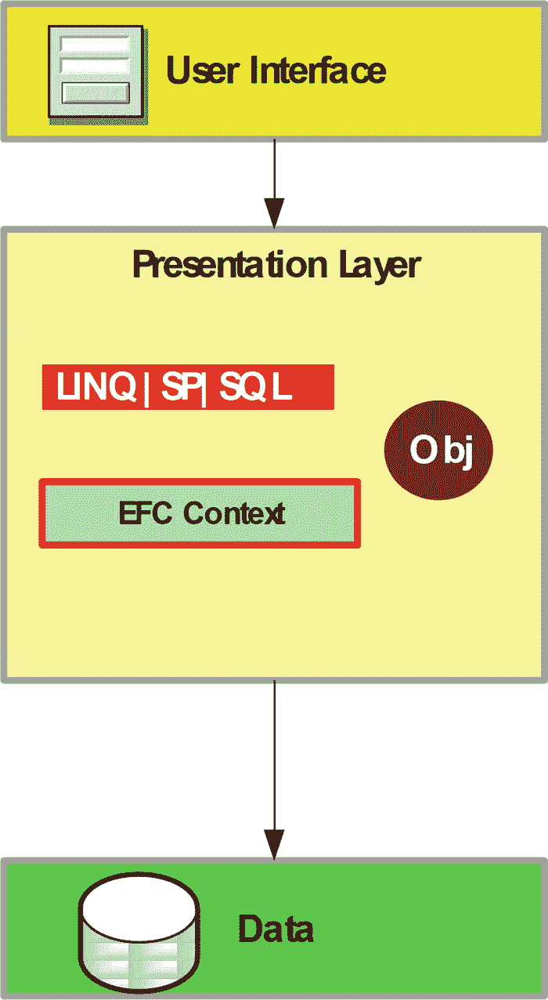
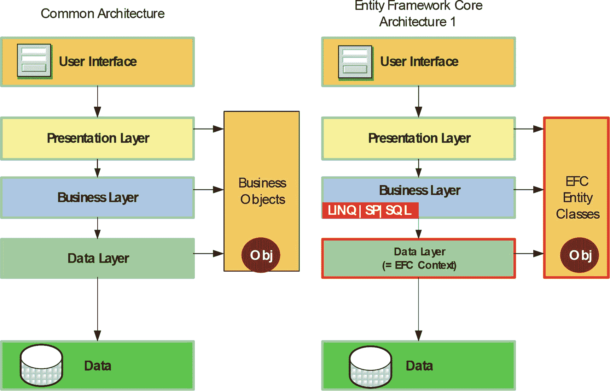
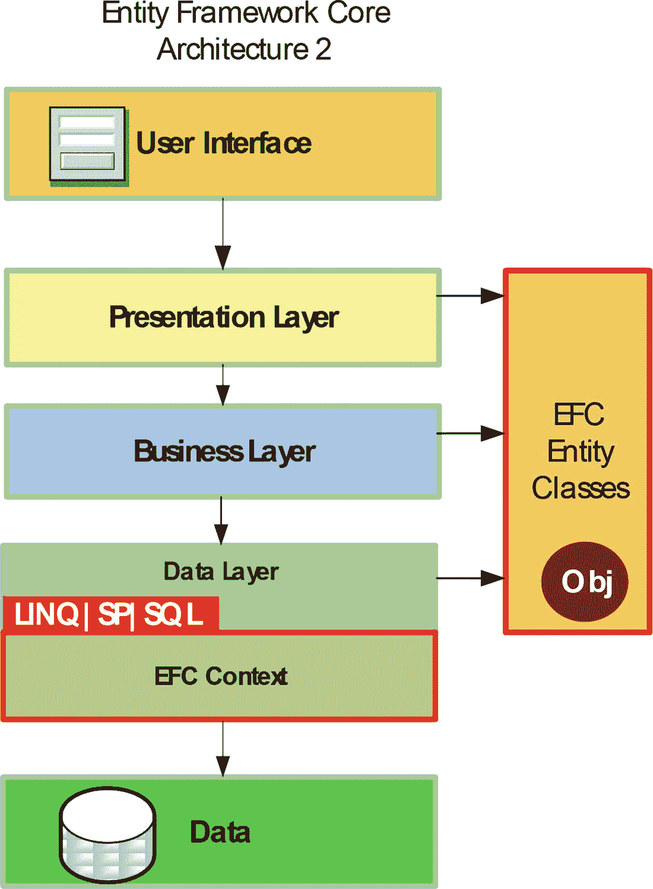
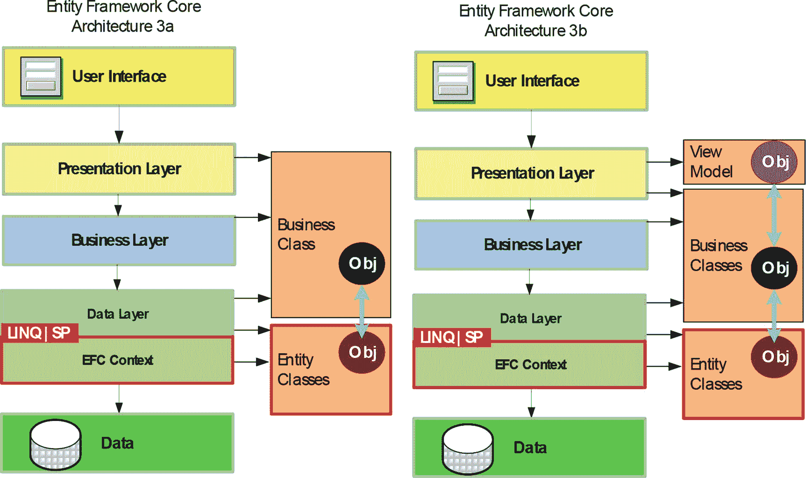
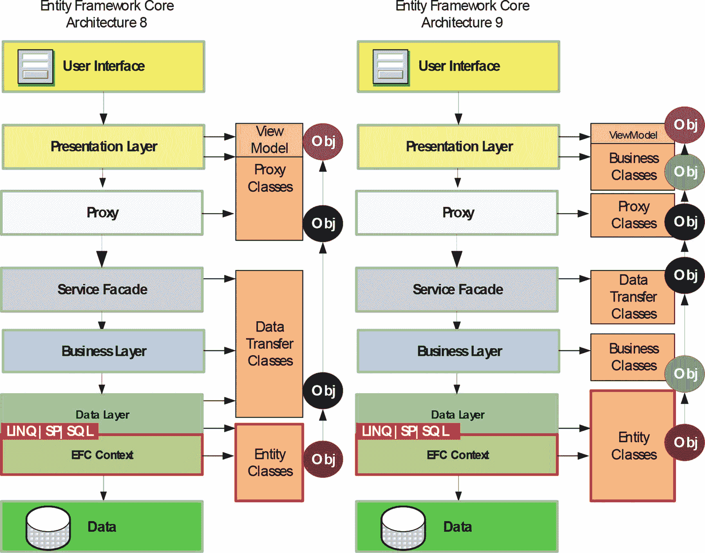
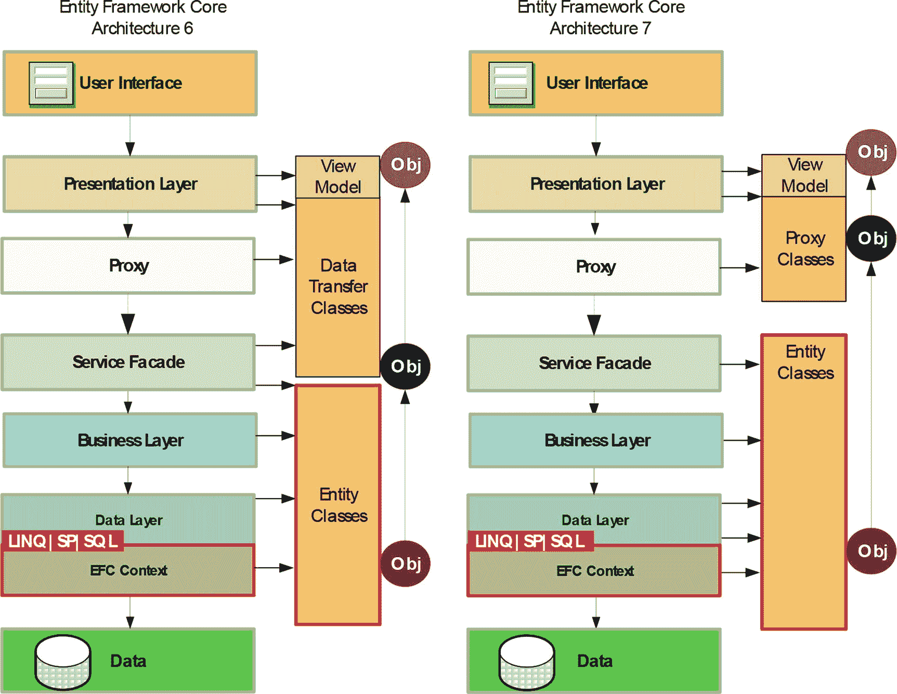
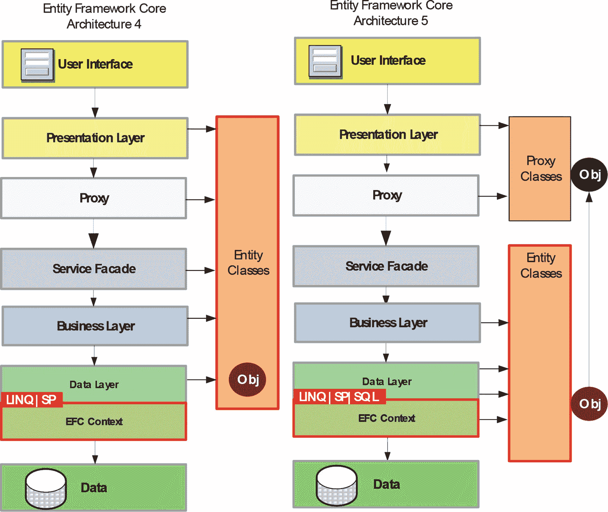

# 18.具有实体框架核心的软件体系结构

实体框架核心无疑属于数据访问层。但是使用实体框架核心时，层模型整体看起来是什么样的呢？在这一章中，我简要地讨论了几种可供选择的架构。

## 整体模型

实体框架核心可以在一个单一的软件模型中使用。换句话说，实体框架核心上下文的实例化和命令(LINQ、存储过程、SQL)的执行都在表示层(见图 [18-1](#Fig1) )。然而，这仅在非常小的应用中有意义(参见附录 A 中的 app MiracleList Light)。

图 18-1

Entity Framework Core in the monolithic software architecture model

## 作为数据访问层的实体框架核心

图 [18-2](#Fig2) 左侧显示了多层应用的一般结构，右侧显示了一个简单的多层软件架构模型，使用实体框架核心进行数据访问。这种实用的软件架构模型不需要专用的数据访问层。相反，实体框架上下文是完整的数据层。覆盖层是业务逻辑层，它通过语言集成查询(LINQ)命令和存储过程的调用(包括所需的直接 SQL 命令)来控制数据访问。根据业务逻辑层中的语句，实体框架上下文填充实体类。实体类通过所有层向下传递到表示层。

图 18-2

The pragmatic Entity Framework Core–based software architecture model

一些软件架构师批评这种简化的模型，因为业务逻辑层被数据访问命令污染了。业务逻辑层实际上不应该包含任何数据库访问命令。如果你真的把 LINQ 等同于 SQL，你就能看到这一点。但是你也可以把 LINQ 理解为 SQL 的真正抽象。毕竟，LINQ 命令只是一系列与数据库无关的方法调用；C#和 Visual Basic 中类似 SQL 的语法对于软件开发人员来说只是一种语法糖。C#或 Visual Basic 编译器立即使 LINQ 命令再次成为方法调用字符串。你也可以用这个方法调用字符串本身，也就是用`collection.Where(x => x.CatID > 4).OrderBy(x => x.Name)`代替`x in` `collection where x.CatID > 4 orderby x.Name`。但是方法调用正是业务逻辑和数据访问控制通常相互通信的形式；也就是说，除了业务逻辑和数据层之间的常见做法之外，业务逻辑层中 LINQ 的必要使用没有任何作用。LINQ 只是比数据层的大多数 API 更通用。

实际上，业务逻辑层的一些污染是业务逻辑层中实体框架上下文实例的使用。这意味着业务逻辑层必须有一个对实体框架核心组件的引用。对象关系映射器的后续替换意味着业务逻辑层的变化。但是这种模式的明显优势是简单。您不必编写自己的数据库访问层，这样可以节省时间和金钱。

## 纯商业逻辑

然而，一些软件架构师会拒绝前面的实用模型，因为它太简单了，而是依赖于第二个模型(见图 [18-3](#Fig3) )。这样，您就创建了自己的数据访问控制层。在这个数据访问控制层中，所有的 LINQ 调用和存储过程包装器方法都被再次打包在自己编写的方法中。这些方法然后调用业务逻辑层。在该模型中，只有数据访问控制层需要对实体框架核心组件的引用；因此，业务逻辑保持“纯净”

图 18-3

The textbook Entity Framework Core–based software architecture model without distribution

第二个软件架构模型对应于“纯”原则，但是在实践中，它也需要更多的实现工作。特别是在严格意义上几乎没有业务逻辑的“数据之上的表单”应用程序的情况下，开发人员必须实现许多“烦人的”包装例程。对于 LINQ，数据库访问层的`GetCustomers()`包含 LINQ 命令，业务逻辑中的`GetCustomers()`转发到数据库访问层的`GetCustomers()`。使用存储过程时，两层都只传递。

## 业务类和视图模型类

这里要讨论的第三个软件架构模型(见图 [18-4](#Fig4) )甚至更进一步，进行了一个抽象步骤，并且还禁止将实体类传递给所有层。相反，会发生实体类到其他类的映射。这些其他类通常被称为业务(对象)类，有时也被称为数据传输对象(dto ),与数据密集型实体类相反。在模型 3b 中(图的右侧)，这些业务对象类再次被映射到作为模型-视图-视图模型(MVVM)模式的一部分为视图专门格式化的类。

图 18-4

Business objects and ViewModel classes

如果创建的实体类与实体框架核心(类似于经典 ADO.NET 实体框架第一版中的`EntityObject`基类)有关系，那么基于业务类的软件架构模型将是强制性的。但在实体框架核心中却不是这样。使用基于业务类的模型的一个很好的理由是，如果实体类的设计符合表示层的需求，例如，因为它是一个“历史发展”的数据库模式。

然而，这种基于业务类的模型意味着相当大的实现开销，因为所有数据都必须从实体类转移到业务类。当然，对于新的和改变的对象，这种转移必须以相反的方向实现。这种对象到对象的映射(OOM)不能与像 Entity Framework Core 这样的对象关系映射器一起工作。但是，也有其他用于对象到对象映射的框架，比如 AutoMapper ( [`http://automapper.org`](http://automapper.org) )和 value injector([`http://valueinjecter.codeplex.com`](http://valueinjecter.codeplex.com))。但是即使有这样的框架，实现工作也是很重要的，特别是因为没有用于对象到对象映射的图形化设计器。

此外，由于额外的映射需要计算时间，因此不仅在开发时，而且在运行时，工作量都更大。

## 分布式系统

图 [18-5](#Fig5) 、图 [18-6](#Fig6) 和图 [18-7](#Fig7) 展示了以实体框架为数据访问核心的分布式系统的六种软件架构模型。现在，客户端不能直接访问数据库，但是应用服务器上有一个服务外观，客户端中有代理类(调用服务外观)。在业务逻辑层和数据访问层的划分方面，您有与架构 1 和架构 2 相同的选择。这里没有显示这些选项。更多的是关于实体类。如果您在客户端和服务器端使用相同的类，这称为共享契约。每当服务器和客户机被写入时，这都是可能的。因此，客户端可以使用服务器中的类引用该程序集。共享合同的情况如图 [18-5](#Fig5) 左侧架构 4 所示；这里，客户端也使用实体框架核心实体类。

图 18-7

More Entity Framework Core–based software architecture models with distribution

图 18-6

Entity Framework Core–based software architecture models in a distribution system

图 18-5

Entity Framework Core–based software architecture models in a distribution system

如果客户端有不同的平台，那么您必须为实体类创建代理类。在图 [18-5](#Fig5) 所示的架构 5 中，显式代理类是期望的或必要的，因为客户端不是. NET。

架构模型 6 到 9 的区别仅在于实体类的映射。

*   尽管 architecture 6 使用共享契约，但它将实体类映射到为在线传输而优化的 DTO 类。在客户端，有另一个映射到 ViewModel 类的 OO。
*   Architecture 7 假设代理类和到 ViewModel 类的 OO 映射。
*   架构 8 使用 DTO、代理和视图模型类。
*   最复杂的模型，architecture 9，也在客户端使用业务对象类。

你可能想知道谁使用 architecture 9。事实上，在我作为顾问的工作中，我看到许多软件架构都是这样精心设计的。这些是大型团队参与的项目，然而每个小的用户请求都需要很长的实现时间。

## 结论

软件架构师在使用实体框架核心时有很多架构选择。带宽从一个简单、实用的模型开始(有一些妥协)，其中开发人员只需要实现三个程序集。在这里展示的架构模型的另一边，您至少需要 12 个组件。

选择哪种架构模型取决于各种因素。当然，这包括具体的需求、系统环境和可用软件开发人员的专业知识。而且预算也是一个重要因素。在我作为公司顾问的日常生活中，我一次又一次地体验到，软件架构师选择太复杂的架构，因为“纯”的原则不适应业务条件。在这样的系统中，即使是最小的用户请求(“我们仍然需要左边的字段”)通常也是非常耗时和昂贵的。许多项目因为不必要的复杂软件架构而失败。

Tip

使用尽可能少的层。在向软件架构模型添加另一个抽象之前，请三思。