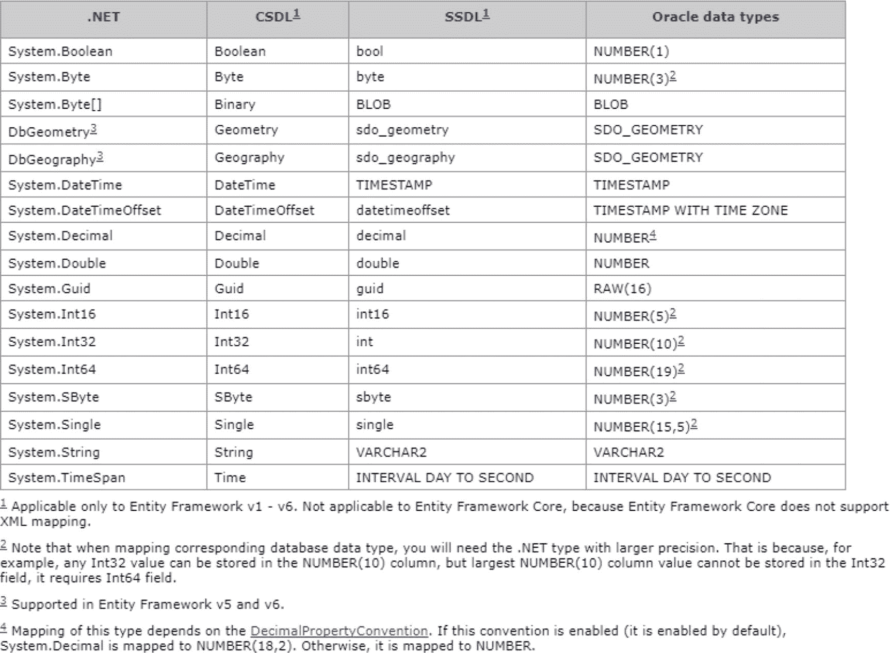
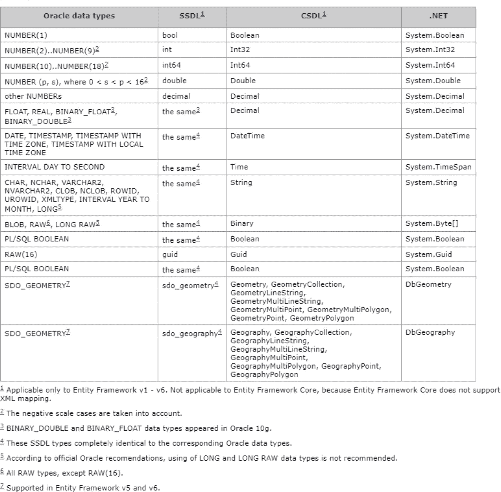
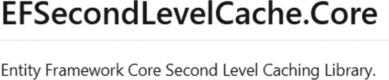
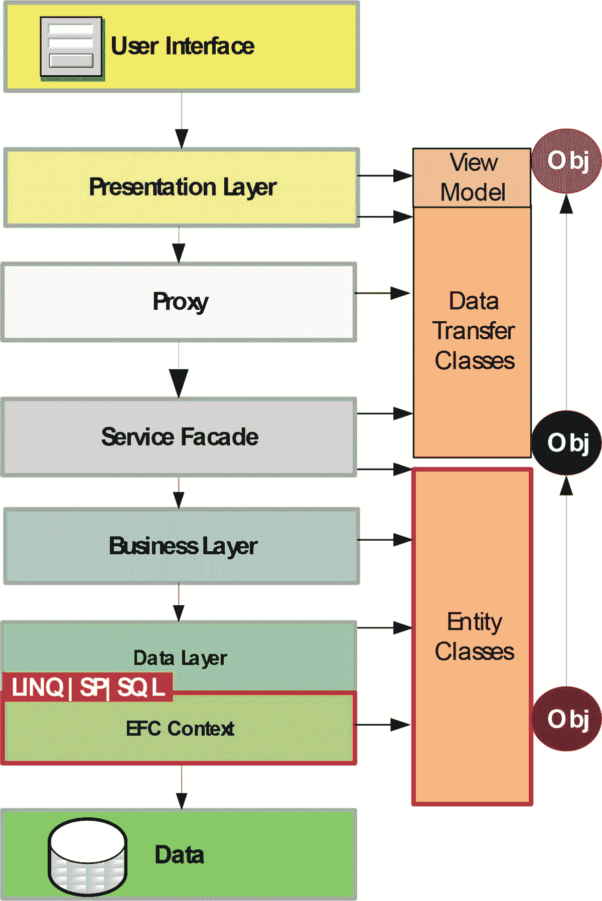
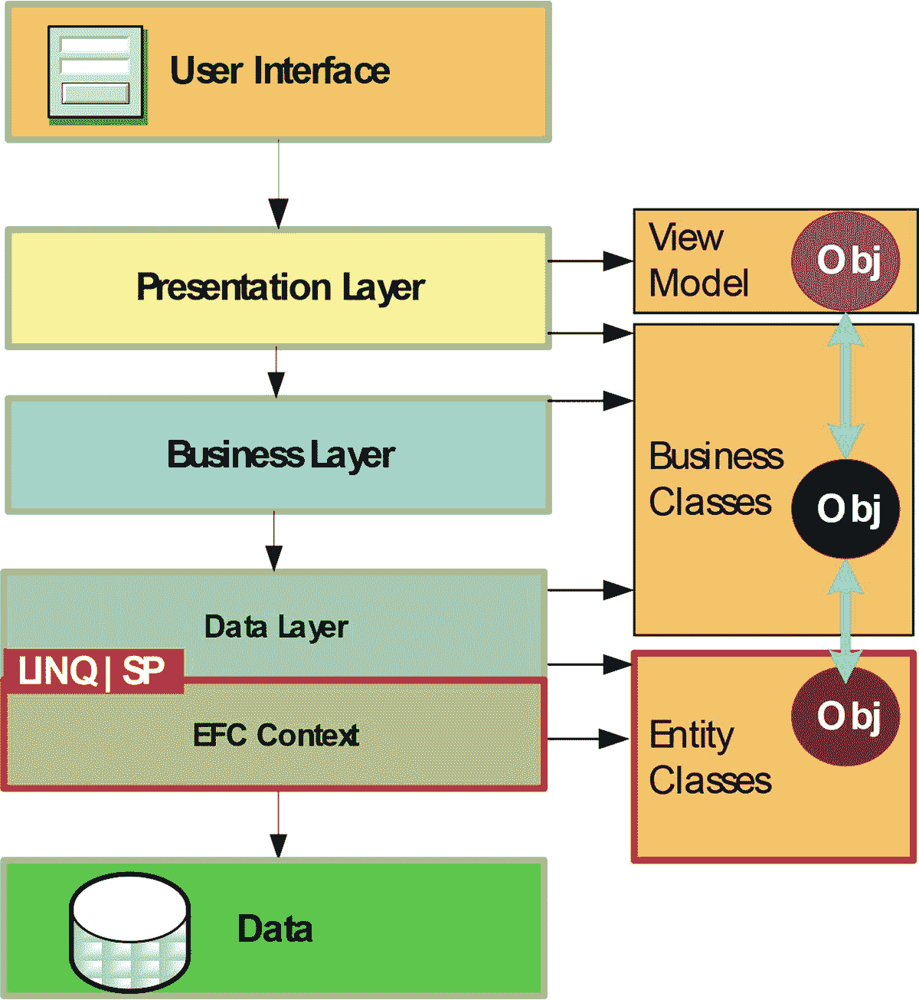
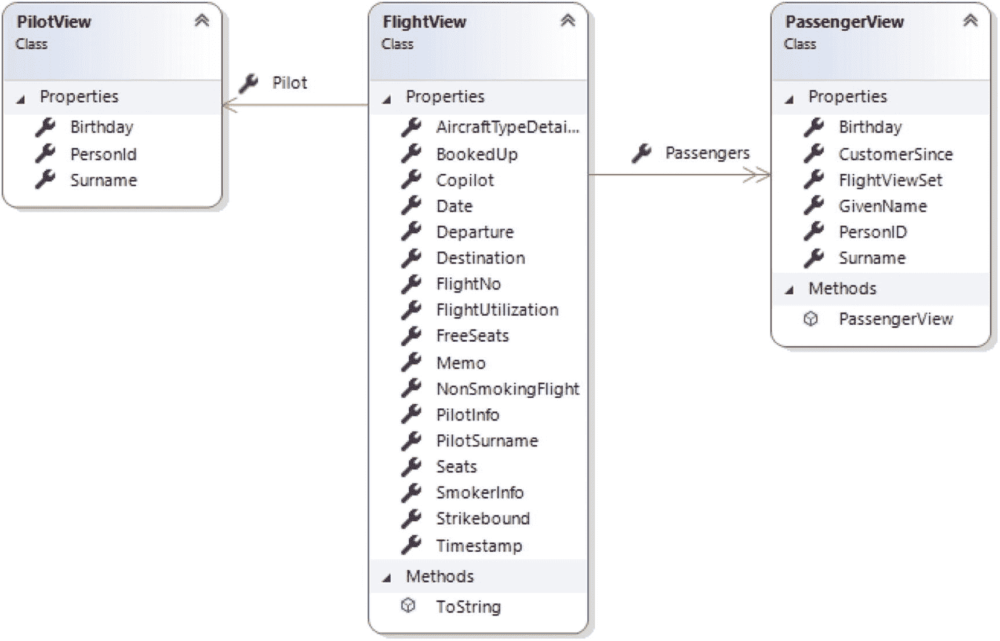
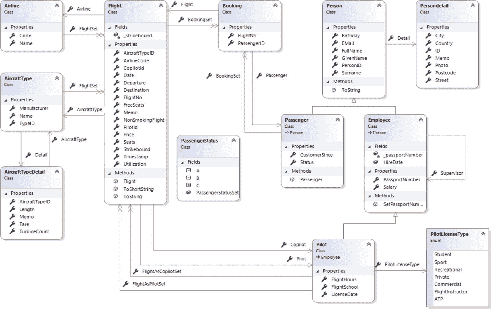
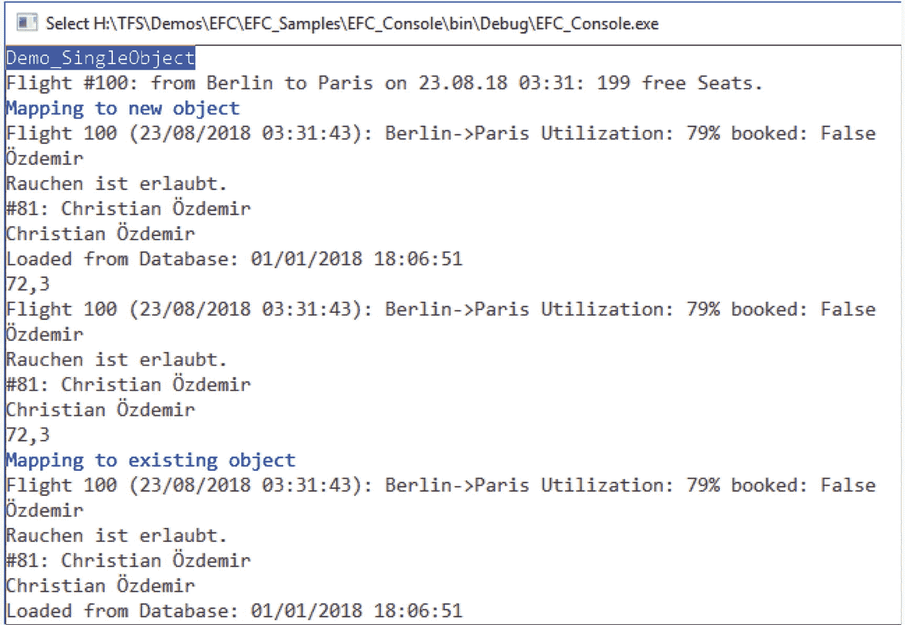

# 二十、附加组件

本章介绍了扩展实体框架核心功能的实体框架核心附加组件。我绝不参与这些工具的开发或分发。

## DevArt 的 Oracle 数据库驱动程序

Oracle 目前不支持其数据库的实体框架核心。基本上，甲骨文公司已经表示，它正在努力支持( [`www.oracle.com/technetwork/topics/dotnet/tech-info/odpnet-dotnet-core-sod-3628981.pdf`](http://www.oracle.com/technetwork/topics/dotnet/tech-info/odpnet-dotnet-core-sod-3628981.pdf) )，但到目前为止还没有解决方案。Oracle 花了几年时间为传统的实体框架提供解决方案。

作为 dotConnect for Oracle 产品的一部分，DevArt 提供了用于实体框架核心的商业 Oracle 驱动程序。

<colgroup><col align="left"> <col align="left"></colgroup> 
|   |  |
| 组件名称 | Oracle 的 dotConnect |
| 网站 | `https://www.devart.com/dotconnect/oracle/` |
| 源代码 | [否](https://github.com/zzzprojects/EntityFramework-Plus) |
| 纽吉特 | 设置:`dcoracleXYpro.exe` `Install-Package Devart.Data.Oracle.EFCore` |
| 免费版本 | [否](https://github.com/zzzprojects/EntityFramework-Plus) |
| 商业版 | $149.95 |

### 装置

首先，应该在系统上执行 DevArt 安装包(`dcoracleXYpro.exe`，其中`XY`代表版本号)。另外，NuGet 包`Devart.Data.Oracle.EFCore`应该安装在 context 类所在的项目中。

### 工具

Oracle 驱动程序使用标准实体框架核心工具进行逆向工程和正向工程。

```cs
Scaffold-DbContext "User ID=WWWings; Password=secret; Direct=true; Host=localhost; SID=ITVisions; Port=1521;" Devart.Data.Oracle.Entity.EFCore -Tables DEPT,EMP

```

Tip

或者，如果您想要一个用于 Oracle 数据库逆向工程或正向工程的图形用户界面，可以使用 DevArt 的 Entity Developer。

### 上下文类

在`OnConfiguring()`中的 context 类中，可以用连接字符串调用方法`UseOracle()`。

```cs
protected override void OnConfiguring(DbContextOptionsBuilder builder)
  {
   builder.UseOracle(@"User ID=WWWings; Password=secret; Direct=true; Host=localhost; SID=ITVisions; Port=1521;");
}

```

Note

前面的连接字符串使用所谓的 Oracle 直接模式。这消除了对 Oracle 客户端设置的需求！如果您有一个类似于`UserId = WWWings; Password = secret; Data Source = Name;`的连接字符串，您将需要为它安装 Oracle 客户端软件。否则，您将收到以下错误:“无法从注册表中获取 Oracle 客户端信息。请确保安装了 Oracle 客户端软件，并且应用(x86)的位与 Oracle 客户端的位相匹配，或者使用直接模式连接到服务器。有关数据源的信息，请参见`https://docs.oracle.com/cd/B28359_01` `/win.111/b28375/featConnecting.htm`。

### 实体类

请注意，Oracle 中的模式、表和列名每个只能包含 30 个字符( [`https://docs.oracle.com/database/121/SQLRF/sql_elements008.htm#SQLRF51129`](https://docs.oracle.com/database/121/SQLRF/sql_elements008.htm#SQLRF51129) )。如果名称太长，将出现以下运行时错误:“TableName ' entityclasswithlsupporteddatatypes '太长。指定了超过 30 个字符的标识符。

### 数据类型

图 [20-1](#Fig1) 和图 [20-2](#Fig2) 显示了 Oracle 列类型和。NET 数据类型。



图 20-2

Data type mapping during forward engineering (source: [https://​www.​devart.​com/​dotconnect/​oracle/​docs/​](https://www.devart.com/dotconnect/oracle/docs/))



图 20-1

Data type mapping during reverse engineering (source: [https://​www.​devart.​com/​dotconnect/​oracle/​docs/​](https://www.devart.com/dotconnect/oracle/docs/))

## 实体框架增强版

Entity Framework Plus (EFPlus)是传统实体框架的一个附加组件。尽管 EFPlus 网站只讨论实体框架，但是也有一个实体框架核心的变体。

Entity Framework Plus 为 Entity Framework Core 提供了几个附加功能:

<colgroup><col align="left"> <col align="left"></colgroup> 
|   |  |
| 组件名称 | EFCore 的实体框架增强版 |
| 网站 | [T2`http://entityframework-plus.net`](http://entityframework-plus.net) |
| 源代码 | [T2`https://github.com/zzzprojects/EntityFramework-Plus`](https://github.com/zzzprojects/EntityFramework-Plus) |
| 纽吉特 | `Install-Package Z.EntityFramework.Plus.EFCore` |
| 免费版本 | 是 |
| 商业版 | 不 |

*   将`UPDATE`和`DELETE`命令公式化为λ表达式(参见第 [17 章](17.html))
*   审核(记录的所有更改都会自动记录在更改表中)
*   全局查询过滤器(实体框架核心从 2.0 版本开始就能做到这一点；EFPlus 也为 Entity Framework Core 1.x)提供了这一功能
*   作为`EFSecondLevelCache.Core`的替代方案的二级缓存(参见第 [17 章](17.html))
*   查询批处理(通过数据库管理系统一次合并多个`SELECT`查询)

Note

EFPlus 1.6.11(及更新版本)支持实体框架核心版本 2.0。

## 使用 EFSecondLevelCache 进行二级缓存。核心

组件 EFSecondLevelCache。Core 为 Entity Framework Plus 中包含的二级缓存提供了替代的二级缓存。EFSecondLevelCache。Core 在配置上要复杂得多，但也更加灵活，因为除了主内存缓存(`MemoryCache`)，您还可以使用 Redis 作为缓存。

<colgroup><col align="left"> <col align="left"></colgroup> 
|   |  |
| 组件名称 | EFSecondLevelCache。核心 |
| 网站 | [T2`https://github.com/VahidN/EFSecondLevelCache.Core`](https://github.com/VahidN/EFSecondLevelCache.Core) |
| 源代码 | 是 |
| 纽吉特 | `Install-Package EFSecondLevelCache.Core` |
| 必要的相关包 | `CacheManager.Core``CacheManager.Microsoft.Extensions.Caching.Memory``CacheManager.Serialization.Json`T3】 |
| 免费版本 | 是 |
| 商业版 | 不 |

## 使用自动映射器的对象-对象映射

在现代软件架构中，典型的任务是关系数据库结构到对象的对象关系映射，以及不同对象结构之间的映射。开源工具 AutoMapper 促进了对象到对象的映射(OOM)。

将一种对象类型转换为另一种对象类型的要求是常见的，例如，在层之间的数据传输对象(dto)中，或者在包含用于显示或表达的渲染数据的视图模型中(见图 [20-3](#Fig3) 和图 [20-4](#Fig4) )。要成像的物体类型通常相似，但不完全相同。并且它们通常没有允许在编程语言级别进行类型转换(即通过类型转换表达式)的公共基类或接口。



图 20-4

Object-to-object mapping is also used between entity classes and data transfer classes in modern software architectures



图 20-3

Object-to-object mapping is used between entity classes, business objects, and ViewModel classes

那个。NET 框架和。NET 核心类库不包含支持不同类型对象映射(对象到对象映射)的函数。中的类型转换器。NET 框架类库( [`http://msdn.microsoft.com/en-us/library/system.componentmodel.typeconverter.asp`](http://msdn.microsoft.com/en-us/library/system.componentmodel.typeconverter.asp) )仅仅是定义了一个对象类型映射的公共接口。但是它对实际的成像工作没有帮助。

### 通过反射进行对象到对象的映射

手动编写对象到对象的映射意味着为迭代中的每个`x`实例创建一个`y`实例，并将`x`的相关属性分别分配给`y`的属性。对于可以在软件架构的更高层中改变的对象，您还会发现逆向程序代码，它将`y`的属性映射回`x`的属性。

编写这种对象-对象映射程序代码不是智力挑战，而是一项烦人的任务，很容易忘记属性。如果这样的映射任务是手工编程的，应用的维护工作总是会增加。毕竟，对于每个新的数据库字段，映射程序代码必须在应用中的许多不同点进行更改。

如果属性相同，并且具有相同的数据类型，那么您可以通过反射自己轻松地进行对象到对象的映射。清单 [20-1](#Par28) 和清单 [20-2](#Par29) 展示了遵循这个简单约定的类`System.Object`的两个扩展方法。但是，如果名称不同(不规则)或者属性值没有 1:1 的映射，那么基本方法就没有用了。

```cs
using System;
using System.Reflection;

namespace EFC_Console.OOM
{
 public static class ObjectExtensions
 {
  /// <summary>
  /// Copy the properties and fields of the same name to another, new object
  /// </summary>
  public static T CopyTo<T>(this object from)
   where T : new()
  {
   T to = new T();
   return CopyTo<T>(from, to);
  }

  /// <summary>
  /// Copy the properties and fields with the same name to another, existing object
  /// </summary>
  public static T CopyTo<T>(this object from, T to)
   where T : new()
  {
   Type fromType = from.GetType();
   Type toType = to.GetType();

   // Copy fields
   foreach (FieldInfo f in fromType.GetFields())
   {
    FieldInfo t = toType.GetField(f.Name);
    if (t != null)
    {
     t.SetValue(to, f.GetValue(from));
    }
   }

   // Copy properties
   foreach (PropertyInfo f in fromType.GetProperties())
   {
    object[] Empty = new object[0];
    PropertyInfo t = toType.GetProperty(f.Name);
    if (t != null)
    {
     t.SetValue(to, f.GetValue(from, Empty), Empty);
    }
   }
   return to;
  }
 }
}

Listing 20-1Copy of the Same Properties Between Two Classes via Reflection

```

```cs
using System;
using System.Linq;
using DA;

namespace EFC_Console.OOM
{
 public class FlightDTO
 {
  public int FlightNo { get; set; }
  public string Departure { get; set; }
  public string Destination { get; set; }
  public DateTime Date { get; set; }
 }

 public static class ReflectionMapping
 {

  public static void Run()
  {
   using (var ctx = new WWWingsContext())
   {
    var flightSet = ctx.FlightSet.Where(x => x.Departure == "Berlin").ToList();
    foreach (var flight in flightSet)
    {
     var dto = flight.CopyTo<FlightDTO>();
     Console.WriteLine(dto.FlightNo + ": " + dto.Departure +"->" + dto.Destination + ": " + dto.Date.ToShortDateString());
    }
   }
  }
 }
}

Listing 20-2Using the Extension Methods from Listing 20-1

```

### 自动驾驶

Jimmy Bogard 的开源库自动映射器已经在。面向对象映射的. NET 开发人员世界。NuGet 包自动映射器( [`https://www.nuget.org/packages/AutoMapper`](https://www.nuget.org/packages/AutoMapper) )由`AutoMapper.dll`组成，其中心类是`AutoMapper.Mapper`。

<colgroup><col align="left"> <col align="left"></colgroup> 
|   |  |
| 组件名称 | 自动驾驶 |
| 网站 | [T2`https://github.com/AutoMapper`](https://github.com/AutoMapper) |
| 纽吉特 | `Install-Package Automapper` |
| 免费版本 | 是 |
| 商业版 | 不 |

AutoMapper 运行在以下基础上。净变量:

*   。网
*   。净核心
*   开发
*   。用于 Windows 应用商店应用/Windows 运行时的
*   通用 Windows 平台(UWP)应用
*   洗发精，快
*   巫师安卓系统

你可以在 GitHub 上找到源代码( [`https://github.com/AutoMapper/AutoMapper`](https://github.com/AutoMapper/AutoMapper) )和一个 wiki ( [`https://github.com/AutoMapper/AutoMapper/wiki`](https://github.com/AutoMapper/AutoMapper/wiki) )。您可以在 AutoMapper 网站( [`http://automapper.org`](http://automapper.org) )上找到其他资源(例如，视频)。然而，总的来说，可用的文档(和许多开源项目一样)很少，不完整，有时还会过时。AutoMapper 的许多功能在 wiki 中没有描述，所以可以看看博客条目和论坛来全面了解 AutoMapper。到目前为止，还没有关于稳定版 3.3.1 和当前预发行版 4.0 之间差异的文档。即使是我，在我的项目中与 AutoMapper 一起工作了很长时间，也不得不花很多时间研究以发现软件组件中更多的、未记录的特性。

Note

本章描述了 6.1.1 版的 AutoMapper。不幸的是，AutoMapper 在过去有过重大变化，所以这里显示的命令在旧版本中只能部分工作。

### 看一个例子

在本例中，World Wide Wings 版本 2 对象模型的部分(如图 [20-5](#Fig5) 所示)将被映射到图 [20-6](#Fig6) 中的简化对象模型上。类别`Pilot`、`Employee`和`Person`被解散。关于`Pilot`的信息直接显示在`FlightView`类中的一个字符串和一个名为`PilotDetailView`的细节对象上。新的`PassengerView`类还包括来自`Person`类的个人数据。许多信息(例如，来自实体`Employee`)在这里有意不再使用。



图 20-6

The simplified target model to be created from the model from Figure [20-5](#Fig5) using object-to-object mapping



图 20-5

The World Wide Wings version 2 object model that uses Entity Framework Core

清单 [20-3](#Par43) 展示了这三个类。

```cs
using System;
using System.Collections.Generic;

namespace EFC_Console.ViewModels
{

 public class FlightView
 {
  public int FlightNo { get; set; }
  public string Departure { get; set; }
  public string Destination { get; set; }
  public string Date { get; set; }
  public bool NonSmokingFlight { get; set; }
  public short Seats { get; set; }
  public Nullable<short> FreeSeats { get; set; }
  public Nullable<int> FlightUtilization { get; set; }

  public bool? BookedUp { get; set; }
  public string SmokerInfo { get; set; }

  public string Memo { get; set; }
  public Nullable<bool> Strikebound { get; set; }
  public byte[] Timestamp { get; set; }

  public string PilotSurname { get; set; }
  public string AircraftTypeDetailLength { get; set; }

  public override string ToString()
  {
   return "Flight " + this.FlightNo + " (" + this.Date + "): " + this.Departure + "->" + this.Destination + " Utilization: " + this.FlightUtilization + "% booked: " + this.BookedUp;
  }

  public string PilotInfo { get; set; }

  /// <summary>
  /// Pilot 1:1
  /// </summary>
  public PilotView Pilot { get; set; }

  /// <summary>
  /// Passengers 1:n
  /// </summary>
  public List<PassengerView> Passengers{ get; set; }
 }

 public class PilotView
 {
  public int PersonId { get; set; }
  public string Surname { get; set; }
  public DateTime Birthday { get; set; }
 }

 public class PassengerView
 {
  public PassengerView()
  {

   this.FlightViewSet = new HashSet<FlightView>();
  }

  public int PersonID { get; set; }
  public Nullable<System.DateTime> CustomerSince { get; set; }
  public int Birthday { get; set; }
  public string GivenName { get; set; }
  public string Surname { get; set; }
  public virtual ICollection<FlightView> FlightViewSet { get; set; }
 }
}

Listing 20-3ViewModel Classes

```

### 配置映射

在使用 AutoMapper 进行映射之前，您必须为每个应用域向 AutoMapper 中涉及的类注册一次映射。你用方法`Initialize()`来做这个。

Attention

如果在一个方法中多次调用`Initialize()`，只有最后一次执行的配置才有效！

在`Initialize()`中，`CreateMap()`方法用于两个类之间的具体映射定义。`CreateMap()`需要两个类型参数。

*   第一个参数总是源类型。
*   二是目标类型。

如果您需要双向转换，您必须显式地创建它。

```cs
   Mapper.Initialize(cfg =>
   {
    cfg.CreateMap<Flight, FlightView>();
    cfg.CreateMap<FlightView, Flight>();
    cfg.CreateMap<Passenger, PassengerView>();
    cfg.CreateMap<PassengerView, Passenger>();
    cfg.CreateMap<Pilot, PilotDetailView>();
    cfg.CreateMap<PilotDetailView, Pilot>();
   });

```

或者，您可以使用`ReverseMap()`方法在一行中创建两个方向的映射。

```cs
   Mapper.Initialize(cfg =>
   {
    cfg.CreateMap<Flight, FlightView>().ReverseMap();
    cfg.CreateMap<Passenger, PassengerView>().ReverseMap();
    cfg.CreateMap<Pilot, PilotDetailView>().ReverseMap();
   });

```

在`Initialize()`内多次调用`CreateMap()`的顺序不相关。

对于单个类，可以有到一个类以及几个其他类的映射。这里有一个例子:

```cs
   Mapper.Initialize(cfg =>
   {
    cfg.CreateMap<Flight, FlightView>();
    cfg.CreateMap<Flight, FlightDTOShort>();
    cfg.CreateMap<Flight, FlightDTO>();
   });

```

然后实际使用这些映射中的哪一个(也就是说，在哪个目标类型上)由执行实际映射的`Map()`方法的参数决定。

### 使用 Map()运行映射

AutoMapper 的`Map()`方法有三个选项。

对于选项 1，您可以映射到一个新的对象，然后将目标类型指定为泛型类型参数，将源对象指定为方法的参数。

```cs
FlightView flightView1 = Mapper.Map<FlightView>(flight);

```

对于选项 2，如果您使用`Map()`的非通用变体，程序代码会变得更加广泛。现在，在源对象后面输入源对象类型作为第二个参数，输入目标类型作为第三个参数。此外，`Map()`只返回类型`System.Object`，因此需要使用`FlightView`进行类型转换。

```cs
FlightView FlightView2 = (FlightView) AutoMapper.Mapper .Map (Flight,   Flight.GetType(),   typeof ( FlightView ));

```

对于选项 3，将一个对象映射到另一个现有对象。这是`Map()`的第三个变体。在这种情况下，该方法不需要类型参数，但是源和目标对象将作为参数进行传输。

```cs
var flightView3 = new FlightView();
flightView3.Memo = "test";
Mapper.Map(flight, flightView3);

```

### 使用非静态 API

除了静态 API，AutoMapper 还有一个非静态 API(实例 API)用于配置映射(清单 [20-4](#Par65) )。您配置了一个`MapperConfiguration`类的实例，并使用它通过`CreateMapper()`创建一个带有`IMapper`接口的对象。然后这个对象有了`Map()`方法。

```cs
var config = new MapperConfiguration(cfg => {
 cfg.CreateMap<Flight, FlightView>();
 cfg.CreateMap<Pilot, PilotView>();
 cfg.CreateMap<Passenger, PassengerView>();
 cfg.AddProfile<AutoMapperProfile2>();
});
config.AssertConfigurationIsValid();

IMapper mapper = config.CreateMapper();
var flightView4 = mapper.Map<Flight, FlightView>(flight);

Listing 20-4Nonstatic API

```

### 映射约定

AutoMapper 不仅映射同名的属性，还包含其他标准约定，如下所示:

*   如果在源对象中没有找到属性`x`,则搜索一个`GetX()`函数，如果有必要，就调用这个函数。
*   如果属性的名称包含多个大写字母，并且有依赖对象，那么每个单词都被理解为一个级别，并用句点分隔。例如，名称`obj.AircraftTypeDetailLength`是映射到`obj.AircraftType.Detail.Length`的。AutoMapper 称这个特性为扁平化。
*   AutoMapper 忽略任何空引用运行时错误。
*   AutoMapper 访问私有的 getter 和 setter，但前提是单个 getter 或 setter 是私有的。如果整个属性被声明为私有，它将被忽略。
*   在 AutoMapper 中，对大写和小写字母以及下划线的处理非常令人兴奋。AutoMapper 也在变化的大小写中寻找合适的属性，不管有没有下划线。甚至类中属性声明的顺序也是相关的！

表 [20-1](#Tab1) 显示了一个属性`Free Spaces`有四种不同拼法的几种情况:`FreeSeats`、`freeSeats`、`Free_Seats`和`free_Seats`。总是假设源对象中只有`FreePoints`属性的变体，它也在表的第 1 列中设置。此外，目标对象始终包含属性的所有四种变体，并且属性的顺序与它们在表中的顺序相同。

表 20-1

AutoMappers Convention-Based Mapping Behavior Regarding Underscore and Case

<colgroup><col align="left"> <col align="left"> <col align="left"></colgroup> 
| 源对象中的值 | 目标对象中的值 | 评论 |
| :-- | :-- | :-- |
| `f.FreeSeats = 1` | `f.FreeSeats = 1``f.freeSeats = 1``f.Free_Seats = 1`T3】 | AutoMapper 将源对象中一个属性的值复制到目标对象的所有四个变量中。 |
| `f.FreeSeats = 1` `f.freeSeats = 2` | `f.FreeSeats = 1``f.freeSeats = 1``f.Free_Seats = 1`T3】 | 属性`FreeSeats`的值被忽略，因为`FreeSeats`已经将其值映射到所有目标属性。 |
| `f.FreeSeats = 1``f.freeSeats = 2`T2】 | `f.FreeSeats = 1``f.freeSeats = 1``f.Free_Seats = 3`T3】 | 第一个不带下划线的属性映射到所有不带下划线的属性，第一个带下划线的属性映射到所有带下划线的属性。 |
| `f.FreeSeats = 1``f.freeSeats = 2`T2】 | `f.FreeSeats = 1``f.freeSeats = 1``f.Free_Seats = 4`T3】 | 第一个不带下划线的属性映射到不带下划线的属性，第一个带下划线的属性映射到所有带下划线的属性。 |
| `f.FreeSeats = 1``f.freeSeats = 2``f.Free_Seats = 3`T3】 | `f.FreeSeats = 1``f.freeSeats = 1``f.Free_Seats = 3`T3】 | 第一个不带下划线的属性映射到所有不带下划线的属性，第一个带下划线的属性映射到所有带下划线的属性。 |

清单 [20-5](#Par74) 展示了如何将一个`Flight`对象映射到`FlightView`。图 [20-7](#Fig7) 显示输出。



图 20-7

Output of Listing [20-5](#Par74)

```cs
public class AutoMapperBasics
 {
  public static void Demo_SingleObject()
  {
   CUI.Headline(nameof(Demo_SingleObject));

   // take the first flight as an example
   var ctx = new WWWingsContext();
   var flight = ctx.FlightSet.Include(x=>x.Pilot).Include(x => x.AircraftType).ThenInclude(y=>y.Detail).FirstOrDefault();
   Console.WriteLine(flight);

   //##################################################

   Mapper.Initialize(cfg =>
   {
    cfg.CreateMap<Flight, FlightView>();
    cfg.CreateMap<FlightView, Flight>();
    cfg.CreateMap<Passenger, PassengerView>();
    cfg.CreateMap<PassengerView, Passenger>();
    cfg.CreateMap<Pilot, PilotDetailView>();
    cfg.CreateMap<PilotDetailView, Pilot>();

    cfg.CreateMap<Flight, FlightDTOShort>();
    cfg.CreateMap<Flight, FlightDTO>();
   });

   Mapper.Initialize(cfg =>
   {
    cfg.CreateMap<Flight, FlightView>().ReverseMap();
    cfg.CreateMap<Passenger, PassengerView>().ReverseMap();
    cfg.CreateMap<Pilot, PilotDetailView>().ReverseMap();
   });

   Mapper.Initialize(cfg =>
   {
    cfg.SourceMemberNamingConvention = new NoNamingConvention();
    cfg.DestinationMemberNamingConvention = new NoNamingConvention();

    cfg.CreateMap<Flight, FlightView>().ReverseMap();
    cfg.CreateMap<Passenger, PassengerView>().ReverseMap();
    cfg.CreateMap<Pilot, PilotDetailView>().ReverseMap();

    cfg.CreateMap<Flight, FlightDTOShort>();
    cfg.CreateMap<Flight, FlightDTO>();
   });

   Mapper.Initialize(cfg =>
   {
    cfg.AddProfile<AutoMapperProfileEinfach>();
   });

   Mapper.Initialize(cfg =>
   {
    cfg.AddProfile<AutoMapperProfileKomplex>();
   });

   // ----------------------
   CUI.Headline("Mapping to new object");
   FlightView flightView1 = Mapper.Map<FlightView>(flight);

   Console.WriteLine(flightView1);
   Console.WriteLine(flightView1.PilotSurname);
   Console.WriteLine(flightView1.SmokerInfo);
   Console.WriteLine(flightView1.PilotInfo);
   if (flightView1.Pilot == null) CUI.PrintError("No pilot!");
   else
   {
    Console.WriteLine(flightView1.Pilot?.Surname + " born " + flightView1.Pilot?.Birthday);
   }
   Console.WriteLine(flightView1.Memo);
   Console.WriteLine(flightView1.AircraftTypeDetailLength);

   FlightView flightView2 = (FlightView)Mapper.Map(flight, flight.GetType(), typeof(FlightView));

   Console.WriteLine(flightView2);
   Console.WriteLine(flightView2.PilotSurname);
   Console.WriteLine(flightView2.SmokerInfo);
   Console.WriteLine(flightView2.PilotInfo);
   if (flightView2.Pilot == null) CUI.PrintError("No pilot!");
   else
   {
    Console.WriteLine(flightView2.Pilot?.Surname + " born " + flightView2.Pilot?.Birthday);
   }
   Console.WriteLine(flightView2.AircraftTypeDetailLength);
   Console.WriteLine(flightView2.Memo);

   // ----------------------
   CUI.Headline("Mapping to existing object");
   var flightView3 = new FlightView();
   Mapper.Map(flight, flightView3);

   Console.WriteLine(flightView3);
   Console.WriteLine(flightView3.PilotSurname);
   Console.WriteLine(flightView3.SmokerInfo);
   Console.WriteLine(flightView3.PilotInfo);
   if (flightView3.Pilot == null) CUI.PrintError("No pilot!");
   else
   {
    Console.WriteLine(flightView3.Pilot?.Surname + " born " + flightView3.Pilot?.Birthday);
   }
   Console.WriteLine(flightView3.Memo);
}
}

Listing 20-5Mapping from Flight to FlightView

```

### 更改映射约定

您可以覆盖接受下划线作为分隔符的约定。为此，你可以编写自己的约定类(参见清单 [20-6](#Par76) ，它通过将`SeparatorCharacter`设置为空字符串并且在`SplittingExpression`中不使用正则表达式来覆盖下划线的呈现。

```cs
using AutoMapper;
using System.Text.RegularExpressions;

namespace EFC_Console.AutoMapper
{
 /// <summary>
 /// No use of underscores when mapping
 /// </summary>
 class NoNamingConvention : INamingConvention
 {
  #region INamingConvention Members
  public string ReplaceValue(Match match)
  {
   return "";
  }

  public string SeparatorCharacter
  {
   get { return ""; }
  }
  public Regex SplittingExpression
  {
   get { return new Regex(""); }
  }
  #endregion
 }
}

Listing 20-6A Separate Convention Class for AutoMapper That Overrides the Rendering of Underscores

```

您自己的约定必须包含在配置中，如下所示:

```cs
   Mapper.Initialize(cfg =>
   {
    cfg.SourceMemberNamingConvention = new NoNamingConvention();
    cfg.DestinationMemberNamingConvention = new NoNamingConvention();

    cfg.CreateMap<Flight, FlightView>().ReverseMap();
    cfg.CreateMap<Passenger, PassengerView>().ReverseMap();
    cfg.CreateMap<Pilot, PilotDetailView>().ReverseMap();
   });

```

### 配置文件类别

您可以将 AutoMapper 配置外包给所谓的 profile 类，这些类继承自基类`Profile`。

```cs
using AutoMapper;
using BO;

namespace EFC_Console.AutoMapper
{
 /// <summary>
 /// Simple profile class for AutoMapper
 /// </summary

 public class AutoMapperProfile1 : Profile
  {
   public AutoMapperProfile1()
   {
    this.SourceMemberNamingConvention = new NoNamingConvention();
    this.DestinationMemberNamingConvention = new NoNamingConvention();
    this.CreateMap<Flight, FlightView>().ReverseMap();
    this.CreateMap<Passenger, PassengerView>().ReverseMap();
    this.CreateMap<Pilot, PilotDetailView>().ReverseMap();
    this.CreateMap<Flight, FlightDTOShort>();
    this.CreateMap<Flight, FlightDTO>();
   }
 }
}

```

然后通过`AddProfile()`在`Initialize()`中调用这个配置文件类。

```cs
   Mapper.Initialize(cfg =>
   {
    cfg.AddProfile<AutoMapperProfile1>();
   });

```

### 忽略子对象

如果源对象和目标对象都有一个子对象，并且属性名称根据某个自动映射器约定进行映射，但是没有该对象类型的映射，则自动映射器会报错以下错误:“缺少类型映射配置或不支持的映射。”要么您必须为子对象类型创建一个带有`CreateMap()`的映射，要么您必须明确地告诉 AutoMapper 您不想映射子对象。

在调用`ForMember()`之后，通过使用`Ignore()`方法的`CreateMap()`方法的流畅 API 来完成忽略。

```cs
AutoMapper.Mapper.CreateMap<Passenger, PassengerView>().ForMember(z => z.PilotView, m => m.Ignore());

```

Note

对子对象调用`Ignore()`后，展平仍然有效。也就是说，`AutoMapper`将继续用来自`Pilot.Surname`的值填充类`FlightView`中的属性`PilotSurname`，即使`flightView.PilotView`被`Ignore()`语句设置为空。

### 自定义映射

AutoMapper 的开发者提供了许多操作地图的方法。使用`CreateMap()`方法的 Fluent API，您可以定义源对象属性到目标对象属性的映射，称为投影。手动映射使用`ForMember()`方法。要指定的第一个参数是目标属性的 lambda 表达式(目标的变量名`z`),第二个参数是值的 lambda 表达式(源的变量名`q`),由此可以引用源对象的一个或多个属性。

清单 [20-7](#Par100) 显示了以下十种可能性:

*   使用`UseValue()`将属性映射到静态值。
*   使用`MapFrom(`将一个属性映射到一个源属性的表达式的结果，其中结果是一个布尔值。
*   使用`MapFrom()`将一个属性映射到多个源属性的计算，其中值是一个数字。
*   将带有`MapFrom()`的属性映射到源对象的子对象中的`ToString()`方法的结果。
*   将带有`MapFrom()`的属性映射到包含来自多个源属性的值的对象。
*   使用`ResolveUsing()`和`IValueResolver`接口将属性映射到一个`ValueResolver`类。
*   使用`NullSubstitute()`方法将零值映射到另一个值。
*   指定目标对象的属性不得被源对象的值覆盖。这是通过`UseDestinationValue()`方法完成的。
*   倒数第二个例子展示了只有当源值(`SourceValue`)满足特定条件时`Condition()`如何映射。
*   最后一种情况显示了从 N:M 映射到 1:N 映射的转换。这里删除了连接`Flight`和`Passenger`的中间实体`booking`。目标类`FlightView`有一个`List<Passenger>`类型的属性。

因为这样的映射定义经常会变得非常广泛，所以通常建议将它们外包给一个 profile 类(参见清单 [20-7](#Par100) )而不是分散在程序代码中的某个地方。清单 [20-8](#Par101) 显示了解析器类。

```cs
public AutoMapperProfile2()
  {
   #region Mappings for class Flight
   CreateMap<Flight, FlightView>()

   // 1\. Set Memo to static value
  .ForMember(z => z.Memo,
             q => q.UseValue("Loaded from Database: " + DateTime.Now))

   // 2\. Mapping for a bool property
  .ForMember(z => z.BookedUp, q => q.MapFrom(f => f.FreeSeats <= 0))

   // 3\. Mapping with calculation
  .ForMember(z => z.FlightUtilization,
             q => q.MapFrom(f => (int)Math.Abs(((decimal)f.FreeSeats / (decimal)f.Seats) * 100)))

   // 4\. Mapping to a method result
   .ForMember(z => z.PilotInfo, m => m.MapFrom(
              q => q.Pilot.ToString()))

   // 5\. Mapping to a method result with object construction
    .ForMember(z => z.Pilot,
     m => m.MapFrom(
      q => new Pilot { PersonID = q.Pilot.PersonID, Surname = q.Pilot.FullName, Birthday = q.Pilot.Birthday.GetValueOrDefault() }))

   // 6\. Mapping with a value resolver
   .ForMember(z => z.SmokerInfo,
                   m => m.ResolveUsing<SmokerInfoResolver>())

   // 7\. Mapping if source value is null
   .ForMember(z => z.Destination, q => q.NullSubstitute("unknown"))

   // 8\. No Mapping for existing values
   .ForMember(z => z.Timestamp, q => q.UseDestinationValue())

   // 9\. Conditional Mapping
   .ForMember(z => z.Seats, x => x.Condition(q => q.FreeSeats < 250))

   // 10\. Map n:m to zu 1:n (for Flight->Booking->Passenger)
   .ForMember(dto => dto.PassengerViewSet, opt => opt.MapFrom(x => x.BookingSet.Select(y => y.Passenger).ToList()))

   // 11\. Include reverse Mapping
   .ReverseMap();
   #endregion

   #region Other class mappings
   CreateMap<Pilot, string>().ConvertUsing<PilotStringConverter>();
   // Map n:m to zu 1:n (for Passenger->Booking->Flight)  
   CreateMap<Passenger, PassengerView>()
    .ForMember(z => z.FlightViewSet, m => m.MapFrom(q => q.BookingSet.Select(y => y.Flight)));
   #endregion

   #region Typkonvertierungen
   CreateMap<byte, long>().ConvertUsing(Convert.ToInt64);
   CreateMap<byte, long>().ConvertUsing(ConvertByteToLong);
   #endregion
  }

Listing 20-7Manual AutoMapper Mappings with ForMember( )

```

```cs
namespace EFC_Console.AutoMapper
{
 /// <summary>
 /// Value Resolver for Automapper, converts true/false to
 /// string property "SmokerInfo"
 /// </summary>
 public class SmokerInfoResolver : IValueResolver<Flight, FlightView, string>
 {
  public string Resolve(Flight source, FlightView destination, string member, ResolutionContext context)
  {
   if (source.NonSmokingFlight.GetValueOrDefault()) destination.SmokerInfo = "This is a non-smoking flight!";
   else destination.SmokerInfo = "Smoking is allowed.";
   return destination.SmokerInfo;
  }
 }
}
Listing 20-8A Value Resolver Class for AutoMapper

```

### 类型转换

当映射基本数据类型(`string`、`int`、`decimal`、`bool`等)时，如果类型相同或者目标类型为`string`，AutoMapper 很容易映射。在目标类型为`string`的情况下，AutoMapper 总是可以通过调用`ToString()`获得一个字符串。`Number`类型自动上下转换。这允许自动映射器从`byte`映射到`long`，也可以从`long`映射到`byte`。但是，从 4.0 版开始，这种灵活性就有了。版本 3.3.1 对将`long`映射到`byte`的尝试做出响应，出现以下错误:“缺少类型映射配置或不支持的映射。映射类型:系统。Byte - > System.Int64 . "同样在 AutoMapper 4.0 中，如果要映射的值不适合目标数字类型，则会出现以下运行时错误:" AutoMapper。AutoMapperMappingException:值对于无符号字节太大或太小。

当然，如果类型完全不同，AutoMapper 就不能映射。例如，如果属性`Birthday`在源对象中具有类型`DateTime`，但是在目标对象中使用了`Integer`，那么运行时错误将总是发生(`AutoMapper.AutoMapperMappingException`)。在错误消息中，您将找到有关该问题的详细信息，如下所示:

*   系统。日期时间➤系统。Int32
*   目标路径:
*   PassengerView。生日
*   源值:
*   01.10.1980 00:00:00

对于 AutoMapper 不能自动执行的类型图像，或者与 AutoMapper 在标准版本中不同的类型图像，您必须为 AutoMapper 提供一个类型转换器(清单 [20-9](#Par110) 和清单 [20-10](#Par114) )。这样的类型转换器可以用一个简单的方法实现，该方法接受类型`x`并返回`y`。然后，这个转换器方法被注册到 AutoMapper。

```cs
CreateMap<byte, long>().ConvertUsing(ConvertByteToLong);
CreateMap<DateTime, Int32>().ConvertUsing(ConvertDateTimeToInt);

```

如有必要，可以调用。NET 框架。

```cs
CreateMap<byte, long>().ConvertUsing(Convert.ToInt64);

```

```cs
/// <summary>
/// Converts bytes to long with special case 0
/// </summary>
/// <param name="b">Byte value</param>
/// <returns></returns>
public static long ConvertByteToLong(byte b)
{
 if (b == 0) return -1;
 else return (long) b;
}
Listing 20-9Method-Based Type Converter for AutoMapper

```

```cs
/// <summary>
/// Converts bytes to long with special case 0
/// </summary>
/// <param name="d">DateTime value</param>
/// <returns></returns>
public static Int32 ConvertDateTimeToInt(DateTime d)
{
 return d.Year;
}
Listing 20-10Another Method-Based Type Converter for AutoMapper

```

您还可以使用`Convert()`方法将类型转换器实现为实现`ITypeConverter`接口的类(参见清单 [20-11](#Par116) )。然后这个定制的转换器类被注册到一个通用的`ConvertUsing()`变量中。

```cs
CreateMap<Pilot, string>().ConvertUsing<PilotStringConverter>();

```

```cs
/// <summary>
 /// Converts a Pilot to a string
 /// </summary>
 public class PilotStringConverter : ITypeConverter<Pilot, string>
 {
  public string Convert(Pilot pilot, string s, ResolutionContext context)
  {
   if (pilot == null) return "(Not assigned)";
   return "Pilot # " + pilot.PersonID;
  }
 }
}
Listing 20-11Class-Based Type Converter for AutoMapper

```

到目前为止，显示的转换对于所有类中的所有图像都是全局的。这当然是一个强大的特性，因为它避免了重复一些映射。但是您在这里也应该小心，因为您可能会创建不想要的图像，这样数据可能会丢失。

也可能是您根本不希望在全局范围内进行这样的转换，而只是希望在单个类中进行单个属性图像的转换。在这种情况下，你可以写一个`ValueResolver`(参见‘自定义映射’前的子章节)。

### 收集

即使您总是配置 AutoMapper 来映射单个类，AutoMapper 不仅可以映射单个实例，还可以使用`Map()`将任意数量的这些类相互映射。

这里有一个例子:

```cs
List<FlightView> FlightviewList = AutoMapper.Mapper.Map <List<Flight View >> (Flight list);

```

AutoMapper 支持以下类型的卷(列表 [20-12](#Par132) ):

*   `IEnumerable`
*   `IEnumerable <T>`
*   `ICollection`
*   `ICollection <T>`
*   `IList`
*   `IList<T>`
*   `List<T>`
*   数组

```cs
public static void Demo_ListMapping()
{
 CUI.Headline(nameof(Demo_ListMapping));

 Mapper.Initialize(cfg =>
 {
  cfg.AddProfile<AutoMapperProfile2>();
 });

 using (var ctx2 = new WWWingsContext())
 {
  var flightSet = ctx2.FlightSet.Include(f => f.Pilot).Include(f => f.BookingSet).ThenInclude(x => x.Passenger).Where(f => f.Departure == "Berlin").OrderBy(f => f.FlightNo).Take(5).ToList();
  // map all objects in this list
  List<FlightView> flightviewListe = Mapper.Map<List<FlightView>>(flightSet);
  foreach (var f in flightviewListe)
  {
   Console.WriteLine(f.ToString());
   if (f.Passengers!= null)
   {
    foreach (var pas in f.PassengerViewSet)
    {
     Console.WriteLine("   - " + pas.GivenName + " " + pas.Surname + " has " + pas.FlightViewSet.Count + " Flights!");
    }
   }
  }
 }
}

Listing 20-12Mapping of an Entire List

```

### 继承

为了说明自动映射器在继承关系中的行为，清单 [20-13](#Par134) 中的例子使用了`Person`、`Woman`和`Man`类，以及相关的数据传输对象(DTO)类`PersonDTO`、`MsDTO`和`MannDTO`。根据一句老话，`Man`和`Woman`的区别是基于拥有大量的汽车(在`Man`中)或鞋子(在`Woman`中)。DTO 类通过数值的数据类型(字节而不是整数)以及名和姓的组合作为属性名来区分。此外，DTO 类中的生日只保存年份，而不是完整的日期。

```cs
class Person
 {
  public string GivenName { get; set; }
  public string Surname { get; set; }
  public DateTime Birthday { get; set; }
 }

 class Man : Person
 {
  public int NumberOfCars { get; set; }
 }

 class Woman : Person
 {
  public int NumberOfShoes { get; set; }
 }

 class PersonDTO
 {
  public string Name { get; set; }
  public int YearOfBirth { get; set; }
 }

 class ManDTO : PersonDTO
 {
  public byte NumberOfCars{ get; set; }
 }

 class WomanDTO : PersonDTO
 {
  public byte NumberOfShoes{ get; set; }
 }

Listing 20-13Class Hierarchy for the Inheritance Example

```

基本上，您必须为继承关系中的继承层次结构中的每个单独的类定义一个映射。

```cs
Mapper.Initialize(cfg =>
   {
    cfg.CreateMap<Person, PersonDTO>();
    cfg.CreateMap<Woman, WomanDTO>();
    cfg.CreateMap<Man, ManDTO>();
   });

```

虽然 AutoMapper 自动处理以字节为单位的类型转换整数，但缺少姓名和出生日期的映射。出生日期的类型冲突会导致映射期间的运行时错误(`AutoMapper.AutoMapperMappingException`)。

仅在基类上用`ForMember()`和`MapFrom()`设置手动映射是不够的。

```cs
cfg.CreateMap<Person, PersonDTO>()
.ForMember(z => z.Name, map => map.MapFrom(q => q.GivenName + " " + q.Surname))
.ForMember(z => z.YearOfBirth, map => map.MapFrom(q => q.Birthday.Year));    
cfg.CreateMap<Woman, WomanDTO>();
cfg.CreateMap<Man, ManDTO>();

```

之后，只有类`Person`的映射是正确的。类`Man`和`Woman`继续产生运行时错误。AutoMapper 希望继承层次结构中的每个类都有手动映射配置，如下所示:

```cs
Mapper.Initialize(cfg =>
 {
  cfg.CreateMap<Person, PersonDTO>()
     .ForMember(z => z.Name, map => map.MapFrom(q => q.GivenName + " " + q.Surname))
     .ForMember(z => z.YearOfBirth, map => map.MapFrom(q => q.Birthday.Year));
  cfg.CreateMap<Man, ManDTO>()
      .ForMember(z => z.Name, map => map.MapFrom(q => q.GivenName + " " + q.Surname))
      .ForMember(z => z.YearOfBirth, map => map.MapFrom(q => q.Birthday.Year));
  cfg.CreateMap<Woman, WomanDTO>()
      .ForMember(z => z.Name, map => map.MapFrom(q => q.GivenName + " " + q.Surname))
      .ForMember(z => z.YearOfBirth, map => map.MapFrom(q => q.Birthday.Year));
 });

```

但是您可以通过使用 AutoMapper 的`Include()`方法来避免这种程序代码重复(不要与实体框架的`Include()`方法混淆！).

```cs
Mapper.Initialize(cfg =>
{
 cfg.CreateMap<Person, PersonDTO>()
       .Include<Man, ManDTO>()
       .Include<Woman, WomanDTO>()
       .ForMember(z => z.Name, map => map.MapFrom(q => q.GivenName + " " + q.Surname))
       .ForMember(z => z.YearOfBirth, map => map.MapFrom(q => q.Birthday.Year));
 cfg.CreateMap<Man, ManDTO>();
 cfg.CreateMap<Woman, WomanDTO>();
});

```

清单 [20-14](#Par145) 展示了一个`Person`、`Man`和`Woman`映射的例子，包括一个男人到一个女人的性别转换，汽车的数量被转换成鞋子数量的十倍。在定义了这个映射之后，使用 AutoMapper 从`Man`到`Woman`的实际转换相对来说是比较容易的。

```cs
  public static void Inheritance()
  {

   CUI.Headline(nameof(Inheritance));

   Mapper.Initialize(cfg =>
   {
    cfg.CreateMap<Person, PersonDTO>()
       .ForMember(z => z.Name, map => map.MapFrom(q => q.GivenName + " " + q.Surname))
       .ForMember(z => z.YearOfBirth, map => map.MapFrom(q => q.Birthday.Year));
    cfg.CreateMap<Man, ManDTO>()
        .ForMember(z => z.Name, map => map.MapFrom(q => q.GivenName + " " + q.Surname))
        .ForMember(z => z.YearOfBirth, map => map.MapFrom(q => q.Birthday.Year));
    cfg.CreateMap<Woman, WomanDTO>()
        .ForMember(z => z.Name, map => map.MapFrom(q => q.GivenName + " " + q.Surname))
        .ForMember(z => z.YearOfBirth, map => map.MapFrom(q => q.Birthday.Year));
   });

   // or shorter using include()
   Mapper.Initialize(cfg =>
   {
    cfg.CreateMap<Person, PersonDTO>()
          .Include<Man, ManDTO>()
          .Include<Woman, WomanDTO>()
          .ForMember(z => z.Name, map => map.MapFrom(q => q.GivenName + " " + q.Surname))
          .ForMember(z => z.YearOfBirth, map => map.MapFrom(q => q.Birthday.Year));
    cfg.CreateMap<Man, ManDTO>();
    cfg.CreateMap<Woman, WomanDTO>();
   });

   var m = new Man()
   {
    GivenName = "John",
    Surname = "Doe",
    Birthday = new DateTime(1980, 10, 1),
    NumberOfCars = 40
   };

   PersonDTO mDTO1 = Mapper.Map<PersonDTO>(m);
   Console.WriteLine(mDTO1.Name + " *" + mDTO1.YearOfBirth);

   ManDTO mDTO1b = Mapper.Map<ManDTO>(m);
   Console.WriteLine(mDTO1b.Name + " *" + mDTO1b.YearOfBirth);

   ManDTO mDTO2 = (ManDTO)Mapper.Map(m, m.GetType(), typeof(ManDTO));
   Console.WriteLine(mDTO2.Name + " *" + mDTO2.YearOfBirth + " owns " + mDTO2.NumberOfCars + " cars.");

   ManDTO mDTO3 = Mapper.Map<ManDTO>(m);
   Console.WriteLine(mDTO3.Name + " *" + mDTO3.YearOfBirth + " owns " + mDTO3.NumberOfCars + " cars.");

   // gender transformation: man -> woman
   Mapper.Initialize(cfg =>
   {
    cfg.CreateMap<Man, Woman>()
          .ForMember(z => z.NumberOfShoes, map => map.MapFrom(q => q.NumberOfCars * 10));
   });

   Woman f = Mapper.Map<Woman>(m);
   Console.WriteLine(f.GivenName + " " + f.Surname + " *" + f.Birthday + " owns " + f.NumberOfShoes + " shoes.");
  }

Listing 20-14Mapping with Person, Man, and Woman

```

如果一个派生类有一个与基类映射相矛盾的手动映射会发生什么？根据文档( [`https://github.com/AutoMapper/AutoMapper/wiki/Mapping-inheritance`](https://github.com/AutoMapper/AutoMapper/wiki/Mapping-inheritance) )，评估由 AutoMapper 按照以下优先级进行:

*   派生类中的显式映射
*   继承的显式映射
*   与`Ignore()`的映射
*   仅在最后一步起作用的自动映射约定

### 通用类

AutoMapper 也有助于泛型类。对于 AutoMapper 来说，映射泛型列表是非常基本的(参见清单 [20-15](#Par152) )。

```cs
public static void GenericHomogeneousList()
  {
   CUI.Headline(nameof(GenericHomogeneousList));

   var PersonSet = new List<Person>();
   for (int i = 0; i < 100; i++)
   {
    PersonSet.Add(new Person() { GivenName="John", Surname="Doe"});
   }

   // define Mapping
   Mapper.Initialize(cfg =>
   {
    cfg.CreateMap<Person, PersonDTO>()
.ForMember(z => z.Name, map => map.MapFrom(q => q.GivenName + " " + q.Surname))
.ForMember(z => z.YearOfBirth, map => map.MapFrom(q => q.Birthday.Year));
   });

   // Convert list
   var PersonDTOSet = Mapper.Map<List<PersonDTO>>(PersonSet);

   Console.WriteLine(PersonDTOSet.Count());
   foreach (var p in PersonDTOSet.Take(5))
   {
    Console.WriteLine(p.Name + ": "+ p.YearOfBirth);
   }
  }

Listing 20-15Mapping Generic Lists, Here the Example List<T>

```

AutoMapper 还可以将整个泛型类型映射到其他泛型类型。坚持以`Person`、`Woman`和`Man`为例，清单 [20-16](#Par154) 定义了两种常见的合伙类型:注册合伙和婚姻。

```cs
// see https://europa.eu/youreurope/citizens/family/couple/registered-partners/index_en.htm
 class RegisteredPartnership<T1, T2>
  where T1 : Person
  where T2 : Person
 {
  public T1 Partner1 { get; set; }
  public T2 Partner2 { get; set; }
  public DateTime Date { get; set; }
 }

 class Marriage<T1, T2>
  where T1 : Person
  where T2 : Person
 {
  public T1 Partner1 { get; set; }
  public T2 Partner2 { get; set; }
  public DateTime Date { get; set; }
 }

Listing 20-16Generic Types for Partnership and Marriage

```

这允许同性登记的伙伴关系，以及同性婚姻！你甚至可以允许登记的伴侣关系自动转变为婚姻。例如，将`registered partnership <husband, husband>`的类型转换为`marriage <husband, husband>`对于 AutoMapper 来说没有问题。您所要做的就是在泛型类之间定义一个通用映射。您决不需要为这些泛型类的类型参数的所有可能变体编写一个映射。

```cs
   Mapper.Initialize (cfg =>
   {
    cfg.CreateMap (typeof (RegisteredPartnership <,>), typeof (Marriage <,>));
   30.4

```

清单 [20-17](#Par158) 展示了这种映射的应用。

```cs
// A registered partnership between two men
var m1 = new   Man() {first name = "Heinz" , last name = "Müller" };
var m2 = new   Man() {first name = "Gerd" , last name = "Meier" };
var ep = new   RegisteredPartnership < Man , Man >() {Partner1 = m1, Partner2 = m2, Date = new   DateTime (2015,5,28)};

// The general mapping between the generic classes
Mapper.Initialize (cfg =>
   {
    cfg.CreateMap (typeof (RegisteredPartnership <,>), typeof (Marriage <,>));
   30.4

// Then every figure with concrete type parameters is allowed!
Marriage < husband , husband > marriage = AutoMapper.Mapper .Map < marriage < man , man >> (ep);
Console .WriteLine (before.Partner1.Name + "+" + marriage.Partner2.Name + ":" + marriage.- DateToShortDateString());

Listing 20-17Mapping Your Own Generic Types from Listing 20-16

```

通用参数的附加映射是可能的，例如`RegisteredPartnership<man, man>`到`Marriage <ManDTO, ManDTO>`。当然，这需要做到以下几点:

*   泛型类 marriage `<T1, T2>`作为类型参数也允许使用`ManDTO`或`PersonDTO`(它还没有这么做)。所以，你必须像这样改变它:

*   还需要定义`Man`和`ManDTO`之间的映射，如下所示:

```cs
class Marriage<T1, T2>
  where T1 : PersonDTO
  where T2 : PersonDTO
 {
  public T1 Partner1 { get; set; }
  public T2 Partner2 { get; set; }
  public DateTime Date { get; set; }
 }

```

```cs
   Mapper.Initialize(cfg =>
   {
    cfg.CreateMap(typeof(RegisteredPartnership<,>), typeof(Marriage<,>));
    cfg.CreateMap<Man, ManDTO>()
     .ForMember(z => z.NumberOfCars, map => map.MapFrom(q => q.GivenName + " " + q.Surname))
     .ForMember(z => z.YearOfBirth, map => map.MapFrom(q => q.Birthday.Year));
   });

```

之后就可以做`RegisteredPartnership<Man, Man>`和`Marriage<ManDTO, ManDTO>`的映射了。

```cs
   Marriage<ManDTO, ManDTO> marriageDTO = Mapper.Map<Marriage<ManDTO, ManDTO>>(ep);
   Console.WriteLine(marriageDTO.Partner1.Name + " + " + marriageDTO.Partner2.Name + ": " + marriage.Date.ToShortDateString());

```

### 映射前后的附加操作

AutoMapper 允许在映射之前或之后执行映射操作。`CreateMap()`的 Fluent API 中的`BeforeMap()`方法设置上游动作；`AfterMap()`集下游。两种方法都可以被多次调用，如清单 [20-18](#Par173) 以`BeforeMap()`为例所示。这两种方法都需要一个表达式来获取源对象(在清单中简称为`q`)和目标对象(在清单中简称为`z`)。可以调用一个方法作为表达式的一部分。这也在清单 [20-18](#Par173) 中以`AfterMap()`为例进行了展示。

清单 [20-18](#Par173) 中的示例在将`Person`映射到`PersonDTO`时执行以下操作:

*   如果名字或姓氏为空，源对象中的条目将替换为问号。
*   如果名字`??`因为名字和姓氏为空而出现在目标对象中，则值`"error"`或`"no information"`将根据出生年份来传递。背后的业务流程规则如下:所有 1980 年之前出生的人都可以匿名。此后出生的所有人都要起一个名字。如果仍然缺少名称，一定是出错了。

当然，您可以在 AutoMapper 之外设置这样的业务逻辑。这些是与 AutoMapper 集成的优势:

*   您可以在一个地方完成所有映射操作。
*   您不必在映射之前或之后对对象的迭代进行显式预编程。

```cs
public static void BeforeAfterDemo()
  {
   CUI.Headline(nameof(BeforeAfterDemo));

   var PersonSet = new List<Person>();
   for (int I = 0; i < 10; i++)
   {
    PersonSet.Add(new Person()
    {
     GivenName =""Joh"",
     Surname =""Do"",
     Birthday = new DateTime(1980, 10, 1),
    });
   }

   // Define mapping
   Mapper.Initialize(cfg =>
   {
    cfg.CreateMap<Person, PersonDTO>()
       .ForMember(z => z.Name, map => map.MapFrom(q => q.GivenName +"""" + q.Surname))
       .ForMember(z => z.YearOfBirth, map => map.MapFrom(q => q.Birthday.Year))
       .BeforeMap((q, z) => q.GivenName = (String.IsNullOrEmpty(q.GivenName) ? q.GivenName ="""" : q.GivenName))
       .BeforeMap((q, z) => q.Surname = (String.IsNullOrEmpty(q.Surname) ? q.Surname ="""" : q.Surname))
       .AfterMap((q, z) => z.Name = GetName(z.Name, z.YearOfBirth));
    cfg.CreateMap<DateTime, Int32>().ConvertUsing(ConvertDateTimeToInt);
   });

   // Map list
   var PersonDTOSet = Mapper.Map<List<PersonDTO>>(PersonSet);

   foreach (var p in PersonDTOSet)
   {
    Console.WriteLine(p.Name +"" in born in year"" + p.YearOfBirth);
   }
  }

  /// <summary>
  /// Converges DateTime into integer (only extracts year)
  /// </summary>
  /// <returns></returns>
  public static Int32 ConvertDateTimeToInt(DateTime d)
  {
   return d.Year;
  }

  /// <summary>
  /// Method called as part of AfterMap()
  /// </summary>
  /// <param name”"”">Surname</param>
  /// <param name""yearOfBirt"">YearOfBirth</param>
  /// <returns></returns>
  public static string GetName(string name, int yearOfBirth)
  {
   if (yearOfBirth == 0) return name;
   if (yearOfBirth <= 1980) return name +"" (too young"";
   return name +"" "" + yearOfBirth """";
  }

Listing 20-18BeforeMap( )and AfterMap( ) in Action

```

### 表演

AutoMapper 不为每次提取和映射值集使用反射。相反，`CreateMap()`使用`Reflection.Emit()`在运行时生成程序代码。这就提出了绘制大量数据地图需要多长时间的问题。

在表 [20-2](#Tab2) 中，比较了三种映射路径。

*   显式、硬编码的对象-对象映射(即`xa = ya`，用于每个属性)
*   基于反射的对象-对象映射，包含本章开头的程序代码
*   使用自动映射器的对象-对象映射

为了避免将苹果与梨进行比较，在表 [20-2](#Tab2) 中，两个完全相同的构造类型之间存在映射。换句话说，所有属性在两个类中都以相同的方式调用，并且具有相同的数据类型。性能测试测量通用列表中 1、10、100、1，000、10，000 和 100，000 个对象的值。

当查看结果表时，很明显 AutoMapper 要慢得多。用`CreateMap()`生成映射代码总是需要大约 208 毫秒。如果一个类型的映射在一个流程中重复出现，这种情况只会出现一次。重复呼叫大约需要 7 毫秒。然而，AutoMapper 在所有情况下都比显式映射慢，对于多达 1，000 个对象的数据集，甚至比基于反射的映射更慢。

表 20-2

Speed Comparison of Three Methods for Object-to-Object Mapping (in Milliseconds)

<colgroup><col align="left"> <col align="left"> <col align="left"> <col align="left"> <col align="left"> <col align="left"> <col align="left"></colgroup> 
| 对象数量 | 显式(硬编码)映射 | 反射映射 | 自动驾驶 |
| :-- | :-- | :-- | :-- |
|   | 每个应用域一次性初始化工作 | 制图工作 | 每个应用域一次性初始化工作 | 制图工作 | 每个应用域一次性初始化工作 | 制图工作 |
| one | Zero | Zero | Zero | Zero | Two hundred and eight | Eighteen |
| Ten | Zero | Zero | Zero | Zero | Two hundred and eight | Eighteen |
| One hundred | Zero | Zero | Zero | one | Two hundred and eight | Eighteen |
| One thousand | Zero | Zero | Zero | Ten | Two hundred and eight | Nineteen |
| Ten thousand | Zero | one | Zero | One hundred and four | Two hundred and eight | Thirty |
| One hundred thousand | Zero | Twenty-nine | Zero | One thousand and ten | Two hundred and eight | Sixty-three |

### 自动映射器的结论

AutoMapper 在不同的对象结构之间提供了灵活的成像选项。AutoMapper 的表现乍一看非常令人失望。但是，您一定不要忘记，与显式映射相比，AutoMapper 节省了大量的编程工作，并且可以做比反射映射更多的事情。

然而，像 Andrew Harcourt ( [`http://www.uglybugger.org/software/post/friends_dont_let_friends_use_automapper`](http://www.uglybugger.org/software/post/friends_dont_let_friends_use_automapper) )这样的开发者不仅批评 AutoMapper 的性能，而且不喜欢这些约定。当您重命名一个将要被映射的属性时，映射同名的属性就成了一个问题，除非您也考虑用`ForMember()`编写一个定制的映射。Harcourt 提倡对所有映射进行显式编程，这使得自动名称重构成为可能。为了减少显式映射的编程工作，他为匹配的映射代码编写了一个代码生成器。不幸的是，他没有向公众提供代码生成器。

生成显式映射的工具包括 OTIS-LIB ( [`http://code.google.com/p/otis-lib`](http://code.google.com/p/otis-lib) )和 Wayne Hartmann 的对象到对象映射实用程序( [`http://waynehartman.com/download?file=d2333998-c0cc-4bd4-8f02-82bef57d463c`](http://waynehartman.com/download?file=d2333998-c0cc-4bd4-8f02-82bef57d463c) )。然而，并不是每个人都喜欢生成器生成的程序代码。因此，这一章结束时没有明确的支持或反对 AutoMapper 的建议。这取决于应用(对象的大小和数量)和您自己的偏好。