# 二十一、案例研究

这一章描述了实体框架核心的一些实际应用，这些应用不在 World Wide Wings 示例中。

## 在 ASP.NET 核心应用中使用实体框架核心

2015 年，微软斥资逾 1 亿美元收购了总部位于柏林的应用发行商 Wunderlist ( [`https://www.theverge.com/2015/6/2/8707883/microsoft-wunderlist-acquisition-announced`](https://www.theverge.com/2015/6/2/8707883/microsoft-wunderlist-acquisition-announced) )。MiracleList 是 Wunderlist 任务管理应用的重新编程，作为一个 web 应用和跨平台应用，用于 Windows、Linux、macOS、Android 和 iOS，并在云中提供跨平台后端。参见图 A-1 ，图 A-2 ，图 A-3 。

登录用户可以创建任务类别列表，然后在每个类别中创建任务列表。任务由标题、注释、输入日期和截止日期组成，并且可以标记为完成。除了 Wunderlist 的功能之外，在 MiracleList 中，一个任务可以有三个重要级别(A、B 或 C ),而不是只有两个重要级别(是/否)和一个努力级别(数字)。这种努力没有度量单位；用户可以决定是否将工作量设置为小时、天或相对值，如 1(代表低)到 10(代表高)。

与 Wunderlist 一样，任务可以有子任务，子任务只有一个标题和一个状态。MiracleList 中缺少原始版本的一些细节，例如上传文件到任务，在类别之间移动任务，搜索标签，复制和打印列表，以及在用户之间交换任务的能力。有些功能，如任务文本中的可点击超链接，没有被实现来防止误用。

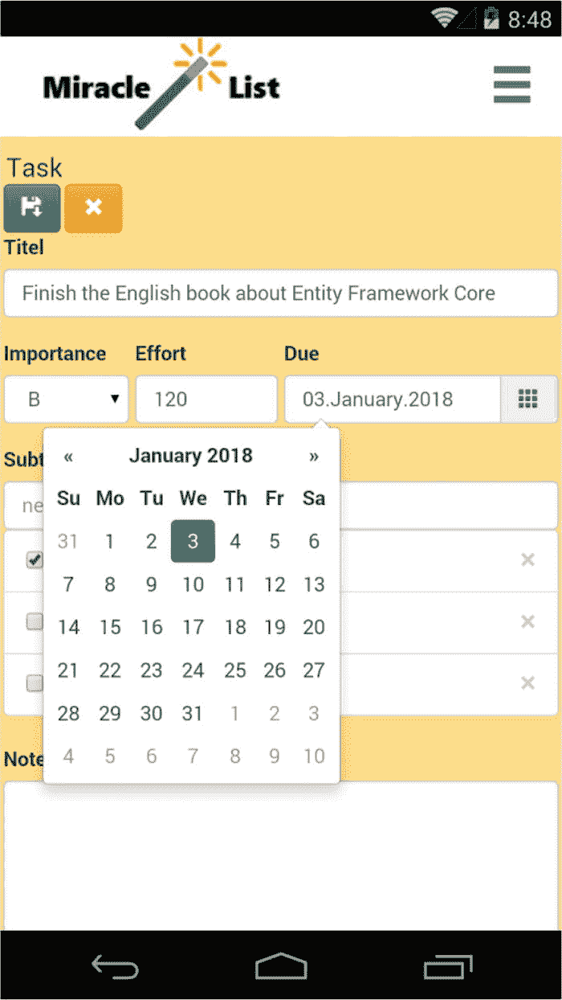

图 A-3

MiracleList client for Android

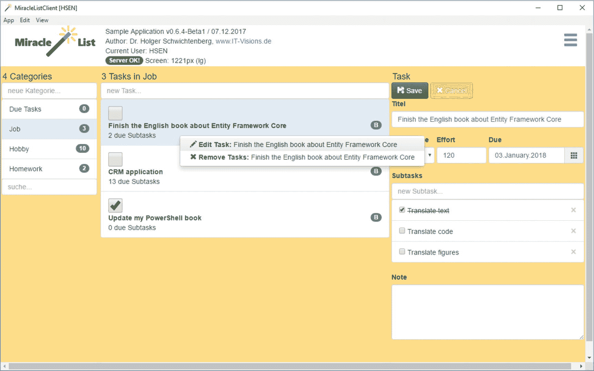

图 A-2

MiracleList desktop client for Windows

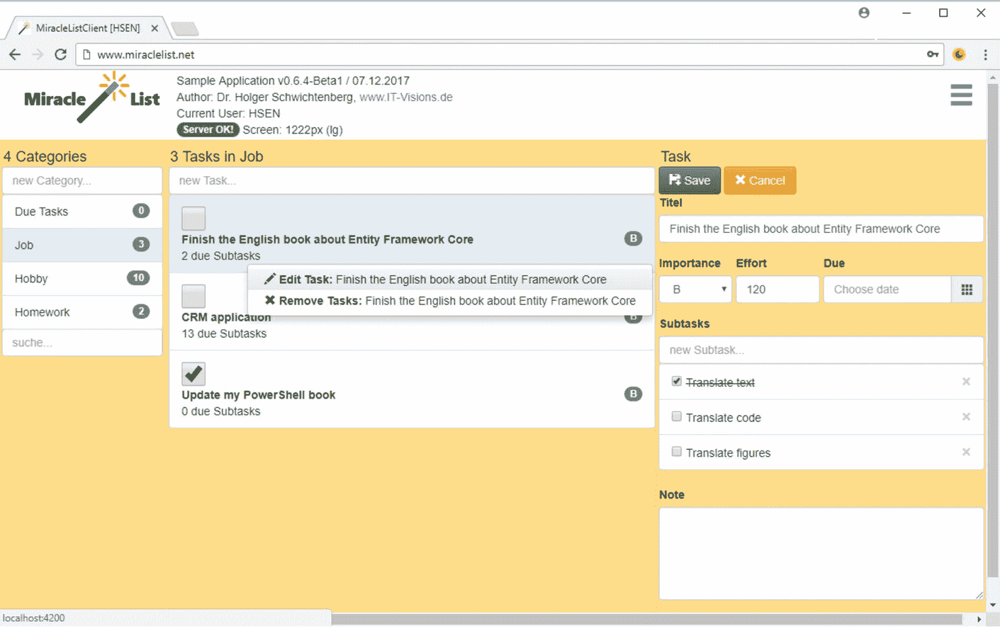

图 A-1

MiracleList web application

除了 web API 之外，后端还有一个 web 接口，它提供了以下功能(图 A-4 ):

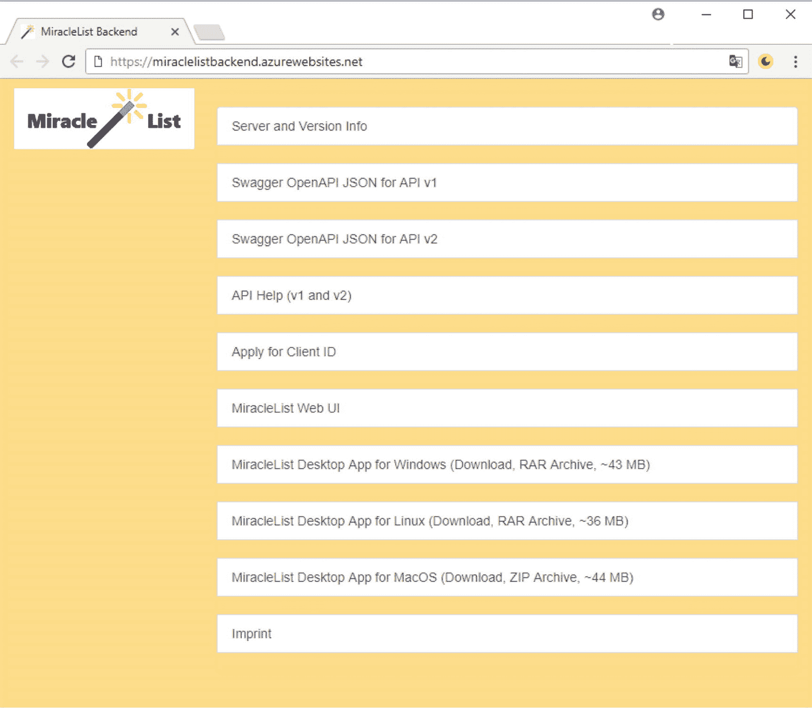

图 A-4

Web interface of the back end

*   web API 的版本信息
*   web API 的 OpenAPI 规范
*   web API 的帮助页面
*   请求客户端 ID 以创建您自己的客户端的能力
*   下载桌面客户端的能力

在本书中，只讨论了后端的摘录，因为在那里使用了实体框架核心。

您可以在以下网站找到更多信息:

*   Web 应用及客户端下载: [`http://www.miraclelist.net`](http://www.miraclelist.net)
*   后端: [`https://miraclelistbackend.azurewebsites.net`](https://miraclelistbackend.azurewebsites.net)
*   后端源代码: [`https://github.com/HSchwichtenberg/MiracleListBackend`](https://github.com/HSchwichtenberg/MiracleListBackend)
*   前端源代码: [`https://github.com/HSchwichtenberg/MiracleListClient`](https://github.com/HSchwichtenberg/MiracleListClient)

### 架构

MiracleList 使用以下技术:

*   后端:。NET 核心，C#，ASP.NET 核心 Web API，实体框架核心，SQL Azure，Azure Web App，Swagger/Swashbuckle。AspNetCore，应用洞察
*   前端:带 HTML 的 SPA，CSS，TypeScript，Angular，Bootstrap，MomentJS，ng2-datetime，angular2-moment，angular2-contextmenu，angular2-modal，electronic，Cordova

奇迹列表的后端在 [`https://miraclelistbackend.azurewebsites.net`](https://miraclelistbackend.azurewebsites.net) 可供任何人使用。它运行在 C# 6.0 和。NET Core 2.0，使用 SQL Azure 作为数据库，实体框架 Core 2.0 作为 OR 映射器，ASP.NET Core 2.0 作为 web 服务器框架。它作为一个 web 应用托管在微软的 Azure 云中。

MiracleList 后端提供了清晰的分层。该解决方案(见图 A-5 )包括以下内容:

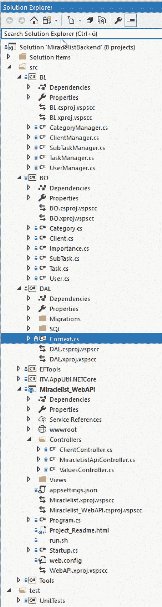

图 A-5

Projects in the MiracleList back-end solution

*   业务对象(BOs):这包含用于实体框架核心的实体类。这些类是以这样一种方式特意实现的，即它们也可以用作 Web API 中的输入和输出类型，这意味着不需要使用 AutoMapper 或其他工具进行额外的对象到对象映射。
*   数据访问层(DAL):这一层实现实体框架核心上下文(`Context.cs`)。
*   业务逻辑(BL):这里，使用实体框架核心上下文实现后端功能的“管理器”类被实现。
*   MiracleList_WebAPI:这里实现了 WebAPI 的控制器。
*   EFTools:包含用于正向工程的实体框架核心工具。
*   UnitTests:这包含了使用 XUnit 的单元测试。

### 实体

图 A-6 显示了 MiracleList 对象模型，由五个类和一个枚举类型组成。清单 A-1 ，清单 A-2 ，清单 A-3 ，清单 A-4 ，清单 A-5 显示实体。

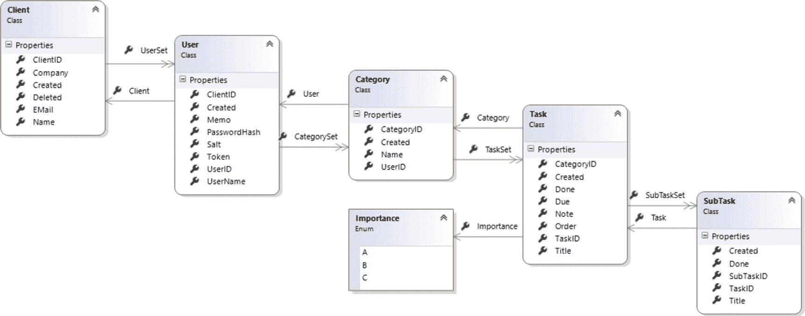

图 A-6

MiracleList object model

```cs
using System;
using System.Collections.Generic;
using System.ComponentModel.DataAnnotations;
using System.ComponentModel.DataAnnotations.Schema;

namespace BO
{

 /// <summary>
 /// Entity class representing a task
 /// Used on the server up to the WebAPI
 /// Corresponding proxy class in TypeScript is used on client
 /// </summary>
 public class Task
 {
  public int TaskID { get; set; } // PK per Konvention
  [MaxLength(250)] // alias: StringLength
  public string Title { get; set; }
  public DateTime Created { get; set; } = DateTime.Now;
  public DateTime? Due { get; set; }
  public Importance? Importance { get; set; }
  public string Note { get; set; }

  public bool Done { get; set; }
  public decimal? Effort { get; set; }
  public int Order { get; set; }

  // -------------- Navigation Properties
  public List<SubTask> SubTaskSet { get; set; } // 1:N
  [Newtonsoft.Json.JsonIgnore] // Do not serialize
  public Category Category { get; set; }
  public int CategoryID { get; set; } // optional: FK Property
 }

}

Listing A-1
Task.cs

```

```cs
namespace BO

{
 public enum Importance
 {
  A, B, C
 }
}

Listing A-2
Importance.cs

```

```cs
using System;
using System.ComponentModel.DataAnnotations;

namespace BO
{
 /// <summary>
 /// Entity class representing a subtask
 /// Used on the server up to the WebAPI
 /// Corresponding proxy class in TypeScript is used on client
 /// </summary>
 public class SubTask
 {
  public int SubTaskID { get; set; } // PK
  [MaxLength(250)]
  public string Title { get; set; }
  public bool Done { get; set; }
  public DateTime Created { get; set; } = DateTime.Now;
  // -------------- Navigation Properties
  public Task Task { get; set; }
  public int TaskID { get; set; }
 }

}

Listing A-3
SubTask.cs

```

```cs
using System;
using System.Collections.Generic;
using System.ComponentModel.DataAnnotations;

namespace BO
{
 /// <summary>
 /// Entity class representing a category of tasks
 /// Used on the server up to the WebAPI
 /// Corresponding proxy class in TypeScript is used on client
 /// </summary>
 public class Category
 {
  public int CategoryID { get; set; } // PK

  [MaxLength(50)]
  public string Name { get; set; }

  public DateTime Created { get; set; } = DateTime.Now;

  // -------------- Navigation Properties
  public List<Task> TaskSet { get; set; }
  [Newtonsoft.Json.JsonIgnore] // Do not serialize
  public User User { get; set; }
  [Newtonsoft.Json.JsonIgnore] // Do not serialize
  public int UserID { get; set; }

 }
}

Listing A-4
Category.cs

```

```cs
using System;
using System.Collections.Generic;
using System.ComponentModel.DataAnnotations;
namespace BO
{
 /// <summary>
 /// Entity class representing a category of tasks
 /// Used on the server up to the WebAPI
 /// Not used in the client!
 /// </summary>
 public class Client
 {
  public Guid ClientID { get; set; }
  [StringLength(50)]
  public string Name { get; set; }
  [StringLength(50)]
  public string Company { get; set; }
  [StringLength(50)]
  public string EMail { get; set; }
  public DateTime Created { get; set; } = DateTime.Now;
  public DateTime? Deleted { get; set; }
  public string Memo { get; set; }
  [StringLength(10)]
  public string Type { get; set; }
  // -------------- Navigation Properties
  public List<User> UserSet { get; set; }
 }
}
Listing A-5
Client.cs

```

### 实体框架核心上下文类

从`DbContext`派生的上下文类对于四个实体类(列表 A-6 )总是有一个类型为`DbSet<T>`的属性。在`OnConfiguring()`方法中，`UseSqlServer()`设置实体框架核心数据库提供者，传入连接字符串。连接字符串是作为公共静态类成员实现的，因此可以在外部设置。

在`OnModelCreating()`方法中，在列上设置了额外的索引，允许进行搜索。此外，为所有实体类全局指定数据库中的表名不应该像属性`dbSet<T>`那样命名，而应该像类那样命名(换句话说，表`Task`而不是表`TaskSet`)。例外的只是有`[Table]`注释的类，所以你有机会设置与规则的个别偏差。

```cs
using BO;
using Microsoft.EntityFrameworkCore;
using System;
using System.ComponentModel.DataAnnotations.Schema;
using System.Reflection;
using Microsoft.EntityFrameworkCore.Metadata;
using Microsoft.EntityFrameworkCore.Metadata.Internal;

namespace DAL
{
 /// <summary>
 /// Context class for Entity Framework Core
 /// Forms the DAL that is used the BL manager classes
 /// </summary>
 public class Context : DbContext
 {
  // Register the entity classes in the context
  public DbSet<Client> ClientSet { get; set; }
  public DbSet<User> UserSet { get; set; }
  public DbSet<Task> TaskSet { get; set; }
  public DbSet<Category> CategorySet { get; set; }
  public DbSet<Log> LogSet { get; set; }

  // This connection string is just for testing. Is filled at runtime from configuration file
  public static string ConnectionString { get; set; } = "Data Source=.;Initial Catalog = MiracleList_TEST; Integrated Security = True; Connect Timeout = 15; Encrypt=False;TrustServerCertificate=True;ApplicationIntent=ReadWrite;MultiSubnetFailover=False;Application Name=EntityFramework";

  protected override void OnConfiguring(DbContextOptionsBuilder builder)
  {
   builder.UseSqlServer(Context.ConnectionString);
  }

  protected override void OnModelCreating(ModelBuilder builder)
  {
   // In this case, EFCore can derive the database schema from the entity classes by convention and annotation.
   // The following Fluent API configurations only change the default behavior!

   #region Mass configuration via model class
   foreach (IMutableEntityType entity in builder.Model.GetEntityTypes())
   {
    // all table names = class names (as with EF 6.x),
    // except the classes that have [Table] annotation
    var annotation = entity.ClrType.GetCustomAttribute<TableAttribute>();
    if (annotation == null)
    {
     entity.Relational().TableName = entity.DisplayName();
    }

   }
   #endregion

   #region Custom Indices
   builder.Entity<Category>().HasIndex(x => x.Name);
   builder.Entity<Task>().HasIndex(x => x.Title);
   builder.Entity<Task>().HasIndex(x => x.Done);
   builder.Entity<Task>().HasIndex(x => x.Due);
   builder.Entity<Task>().HasIndex(x => new { x.Title, x.Due });
   #endregion
  }
 }
}

Listing A-6Context.cs

```

### ASP.NET 核心应用中上下文类的生存期

在基于 ASP.NET 和 ASP.NET 核心的 web 应用和 web 服务/web API 中使用实体框架核心时，上下文类实例的生存期不得超过处理单个 HTTP 请求的生存期。

对于每个传入的 HTTP 请求，ASP.NET 核心使用不同的线程创建控制器类的新实例。如果您要在多个 HTTP 请求中使用 context 类的实例，您将在不同的线程中使用 context 实例，这不支持它。context 类不是线程安全的，因此它不支持多线程。带有上下文实例的多线程会在运行时导致以下错误:“System。InvalidOperationException:“在前一个操作完成之前，在此上下文上开始了第二个操作。任何实例成员都不能保证是线程安全的。"

Note

此外，经典实体框架中的上下文类`ObjectContext`和`DbContext`不是线程安全的。然而，在经典的实体框架中，当使用多线程上下文时，没有明确的错误消息。实体框架深处的某个地方出现了奇怪的崩溃。

此外，您会遇到实体框架核心缓存的问题，因为第二个请求会在上下文实例中找到前一个请求的数据。但是，第二个 HTTP 请求可能会影响另一个用户。在基于用户的变量中设置实体框架核心上下文并不是一个好的解决方案，因为这会大大降低 web 应用的可伸缩性。

因此，将上下文实例的生存期限制为处理单个 HTTP 请求的生存期是合适的。作为 HTTP 请求的一部分，您可以创建一个或多个 context 类的实例，然后在请求完成时销毁这些实例。

本实践解决方案中所示的架构很好地解决了这一问题，而无需直接使用 ASP.NET/ASP.NET 核心控制器中的上下文类。这种使用是通过提供业务逻辑的管理器类间接发生的。

管理器类的每个实例都创建一个新的上下文实例。管理器类实例的生命周期依赖于`WebAPI`控制器实例的生命周期。因此，上下文实例不会超出处理 HTTP 请求的范围。

### 业务逻辑

清单 A-7 展示了一个类`TaskManager`的例子。这个实现基于通用基类`EntityManagerBase <contextType, entity type>`。反过来，`EntityManagerBase`是以`DataManagerBase <contextType>`为基础的。

这两个助手类提供了基本的功能，这些功能并不总是需要在每个管理器类中实现。这包括以下(清单 A-7 ，清单 A-8 ，清单 A-9 ):

*   创建`Manager`类时创建上下文实例
*   调用`Dispose()`时销毁上下文实例
*   `Update()`:将对象添加到“已修改”状态的上下文中，并保存更改
*   `New()`:添加新对象，直接保存新对象
*   `Remove()`:删除对象，直接执行删除
*   `IsLoaded()`:检查对象是否存在于本地缓存中

```cs
using System;
using System.Collections.Generic;
using System.Linq;
using BO;
using DAL;
using ITVisions.EFC;

using Microsoft.EntityFrameworkCore;
using System.Diagnostics;
using ITVisions.EFCore;

namespace BL
{
 /// <summary>
 /// Business Logic manager for Tasks entities
 /// </summary>
 public class TaskManager : EntityManagerBase<Context, Task>
 {
  // To manage the subtasks
  private SubTaskManager stm = new SubTaskManager();
  // Current user
  private int userID;

  /// <summary>
  /// Instantiation specifying the user ID to which all operations in this instance refer
  /// </summary>
  /// <param name="userID"></param>
  public TaskManager(int userID)
  {
   this.userID = userID;
  }

  /// <summary>
  /// Get a task list of one category for the current user
  /// </summary>
  public List<Task> GetTaskSet(int categoryID)
  {
   return ctx.TaskSet.Include(x => x.SubTaskSet).Where(x => x.Category.UserID == this.userID && x.CategoryID == categoryID).ToList();
  }

  /// <summary>
  /// Get a task including its subtasks
  /// </summary>
  public Task GetTask(int taskID)
  {
   var t = ctx.TaskSet.Include(x => x.SubTaskSet).Where(x => x.Category.UserID == this.userID && x.TaskID == taskID).SingleOrDefault();
   return t;
  }

  /// <summary>
  /// Create a new task from Task object
  /// </summary>
  public Task CreateTask(Task t)
  {
   ValidateTask(t);
   return this.New(t);
  }

  /// <summary>
  /// Create a new task from details
  /// </summary>
  public Task CreateTask(int categoryID, string title, string note, DateTime due, Importance importance, decimal? effort, List<SubTask> subtasks = null)
  {
   this.StartTracking();
   var t = new Task();
   t.CategoryID = categoryID;
   t.Created = DateTime.Now;
   SetTaskDetails(t, title, note, due, importance, false, effort, subtasks);
   this.New(t);
   this.SetTracking();
   return t;
  }

  private static void SetTaskDetails(Task t, string title, string note, DateTime? due, Importance? importance, bool done, decimal? effort, List<SubTask> subtasks)
  {
   t.Title = title;
   t.Note = note;
   t.Due = due;
   t.Importance = importance;
   t.SubTaskSet = subtasks;
   t.Effort = effort;
   t.Done = done;
  }

  /// <summary>
  /// Change a task
  /// </summary>
  public Task ChangeTask(int taskID, string title, string note, DateTime due, Importance? importance, bool done, decimal? effort, List<SubTask> subtasks)
  {
   ctx = new Context();
   ctx.Log();
   // Delete subtasks and then create new ones instead of change detection!
   stm.DeleteSubTasks(taskID);

   var t = ctx.TaskSet.SingleOrDefault(x => x.TaskID == taskID);
   SetTaskDetails(t, title, note, due, importance, done, effort, null);
   ctx.SaveChanges();

   t.SubTaskSet = subtasks;
   ctx.SaveChanges();
   return t;
  }

  public void Log(string s)
  {
   Debug.WriteLine(s);
  }

  /// <summary>
  /// Change a task including subtasks
  /// </summary>
  public Task ChangeTask(Task tnew)
  {
   if (tnew == null) return null;

   // Validate of the sent data!
   if (tnew.Category != null) tnew.Category = null; // user cannot change the category this way!
   ValidateTask(tnew);

   var ctx1 = new Context();
   ctx1.Log(Log);
   stm.DeleteSubTasks(tnew.TaskID);

   if (tnew.SubTaskSet != null) tnew.SubTaskSet.ForEach(x => x.SubTaskID = 0); // delete ID, so that EFCore regards this as a new object

   tnew.CategoryID = this.GetByID(tnew.TaskID).CategoryID; // Use existing category

   ctx1.TaskSet.Update(tnew);

   var count = ctx1.SaveChanges();
   return tnew;
  }

  /// <summary>
  /// Checks if the TaskID exists and belongs to the current user
  /// </summary>
  private void ValidateTask(int taskID)
  {
   var taskAusDB = ctx.TaskSet.Include(t => t.Category).SingleOrDefault(x => x.TaskID == taskID);
   if (taskAusDB == null) throw new UnauthorizedAccessException("Task nicht vorhanden!");
   if (taskAusDB.Category.UserID != this.userID) throw new UnauthorizedAccessException("Task gehört nicht zu diesem User!");
  }

  /// <summary>
  /// Checks if transferred task object is valid
  /// </summary>
  private void ValidateTask(Task tnew = null)
  {
   ValidateTask(tnew.TaskID);
   if (tnew.CategoryID > 0)
   {
    var catAusDB = new CategoryManager(this.userID).GetByID(tnew.CategoryID);
    if (catAusDB.UserID != this.userID) throw new UnauthorizedAccessException("Task gehört nicht zu diesem User!");
   }
  }

  /// <summary>
  /// Full-text search in tasks and subtasks, return tasks grouped by category
  /// </summary>
  public List<Category> Search(string text)
  {
   var r = new List<Category>();
   text = text.ToLower();
   var taskSet = ctx.TaskSet.Include(x => x.SubTaskSet).Include(x => x.Category).
    Where(x => x.Category.UserID == this.userID && // nur von diesem User !!!
    (x.Title.ToLower().Contains(text) || x.Note.ToLower().Contains(text) || x.SubTaskSet.Any(y => y.Title.Contains(text)))).ToList();

   foreach (var t in taskSet)
   {
    if (!r.Any(x => x.CategoryID == t.CategoryID)) r.Add(t.Category);
   }
   return r;
  }

  /// <summary>
  /// Returns all tasks due, including tomorrow, grouped by category, sorted by date
  /// </summary>
  public List<Category> GetDueTaskSet()
  {
   var tomorrow = DateTime.Now.Date.AddDays(1);
   var r = new List<Category>();
   var taskSet = ctx.TaskSet.Include(x => x.SubTaskSet).Include(x => x.Category).
    Where(x => x.Category.UserID == this.userID && // nur von diesem User !!!
    (x.Done == false && x.Due != null && x.Due.Value.Date <= tomorrow)).OrderByDescending(x => x.Due).ToList();

   foreach (var t in taskSet)

   {
    if (!r.Any(x => x.CategoryID == t.CategoryID)) r.Add(t.Category);
   }
   return r;
  }

  /// <summary>
  /// Remove Task with its subtasks
  /// </summary>
  public void RemoveTask(int id)
  {
   ValidateTask(id);
   this.Remove(id);
  }
 }
}

Listing A-7
TaskManager.cs

```

```cs
using Microsoft.EntityFrameworkCore;
using System.Linq;

namespace ITVisions.EFC
{
 /// <summary>
 /// Base class for all data managers to manage a specific entity type, even if they are detached
 /// V1.3
 /// Assumption: There is always only one primary key column!
 /// </summary>
 public abstract class EntityManagerBase<TDbContext, TEntity> : DataManagerBase<TDbContext>
  where TDbContext : DbContext, new()
  where TEntity : class
 {
  public EntityManagerBase() : base(false)
  {
  }
  public EntityManagerBase(bool tracking) : base(tracking)
  {
  }

  protected EntityManagerBase(TDbContext kontext = null, bool tracking = false) : base(kontext, tracking)
  {
  }

  /// <summary>
  /// Get object based on the primary key
  /// </summary>
  /// <returns></returns>
  public virtual TEntity GetByID(object id)
  {
   return ctx.Set<TEntity>().Find(id);
  }

  /// <summary>
  /// Saves changed object
  /// </summary>
  public TEntity Update(TEntity obj)
  {
   if (!this.tracking) this.StartTracking(); // Start change tracking if no-tracking is on
   ctx.Set<TEntity>().Attach(obj);
   ctx.Entry(obj).State = EntityState.Modified;
   ctx.SaveChanges();
   this.SetTracking();
   return obj;
  }

  /// <summary>
  /// Adds a new object
  /// </summary>
  public TEntity New(TEntity obj)
  {
   if (!this.tracking) this.StartTracking(); // Start change tracking if no-tracking is on
   ctx.Set<TEntity>().Add(obj);
   ctx.SaveChanges();
   this.SetTracking();
   return obj;
  }

  /// <summary>
  /// Deletes an object based on the primary key
  /// </summary>
  public virtual void Remove(object id)
  {
   if (!this.tracking) this.StartTracking(); // Start change tracking if no-tracking is on
   TEntity obj = ctx.Set<TEntity>().Find(id);
   Remove(obj);
   this.SetTracking();
  }

  /// <summary>
  /// Deletes an object
  /// </summary>
  public bool Remove(TEntity obj)
  {
   if (!this.tracking) this.StartTracking(); // Switch on tracking for a short time
   if (!this.IsLoaded(obj)) ctx.Set<TEntity>().Attach(obj);
   ctx.Set<TEntity>().Remove(obj);
   ctx.SaveChanges();
   this.SetTracking();
   return true;
  }

  /// <summary>
  /// Checks if an object is already in the local cache
  /// </summary>
  public bool IsLoaded(TEntity obj)
  {
   return ctx.Set<TEntity>().Local.Any(e => e == obj);
  }
 }

}

Listing A-8
EntityBaseManager.cs

```

```cs
using System;
using System.Collections.Generic;
using Microsoft.EntityFrameworkCore;
using System.Linq;

namespace ITVisions.EFC
{

 /// <summary>
 /// Base class for all data managers
 /// </summary>
 abstract public class DataManagerBase<TDbContext> : IDisposable
  where TDbContext : DbContext, new()
 {
  // One instance of the framework context per manager instance
  protected TDbContext ctx;
  protected bool disposeContext = true;
  protected bool tracking = false;

  protected DataManagerBase(bool tracking) : this(null, tracking)
  {
  }

  public void StartTracking()
  {
   ctx.ChangeTracker.QueryTrackingBehavior = Microsoft.EntityFrameworkCore.QueryTrackingBehavior.TrackAll;
  }

  public void SetTracking()
  {
   if (tracking) ctx.ChangeTracker.QueryTrackingBehavior = QueryTrackingBehavior.TrackAll;
   else ctx.ChangeTracker.QueryTrackingBehavior = QueryTrackingBehavior.NoTracking;
  }

  public DataManagerBase()
  {
   this.ctx = new TDbContext();
  }
  protected DataManagerBase(TDbContext kontext = null, bool tracking = false)
  {
   this.tracking = tracking;
   // If a context has been handed in, take this!
   if (kontext != null) { this.ctx = kontext; disposeContext = false; }
   else
   {
    this.ctx = new TDbContext();
   }

  SetTracking();
  }

  /// <summary>
  /// Destroy DataManager (also destroys the EF context)
  /// </summary>
  public void Dispose()
  {
   // If the context was submitted from the outside, we should not call Dispose() on the context! That's up to the caller!
   if (disposeContext) ctx.Dispose();
  }

  /// <summary>
  /// Save Changes in context
  /// </summary>
  /// <returns>a string that contains information about the number of new, changed, and deleted records</returns>
  public string Save()
  {
   string ergebnis = GetChangeTrackerStatistics();
   var count = ctx.SaveChanges();
   return ergebnis;
  }

  /// <summary>
  /// Save for detached entity objects with auto increment primary key named ID
  // The newly added objects must return the store routine because the IDs for the
  /// </summary>
  protected List<TEntity> Save<TEntity>(IEnumerable<TEntity> menge, out string Statistik)
  where TEntity : class
  {
   StartTracking();
   var newObjects = new List<TEntity>();

   foreach (dynamic o in menge)
   {
    // Attach to the context
    ctx.Set<TEntity>().Attach((TEntity)o);
    if (o.ID == 0) // No value -> new object
    {
     ctx.Entry(o).State = EntityState.Added;
     if (o.ID < 0) o.ID = 0; // Necessary hack, because EFCore writes a big negative number in ID after the added and considers that as key :-(
     // Remember new records because they have to be returned after saving (they will have their IDs!)
     newObjects.Add(o);
    }

    else // existing object --> UPDATE
    {
     ctx.Entry(o).State = EntityState.Modified;
    }
    SetTracking();
   }

   // Get statistics of changes
   Statistik = GetChangeTrackerStatistics<TEntity>();
   var e = ctx.SaveChanges();
   return newObjects;
  }

  /// <summary>
  /// Save for detached entity objects with an EntityState property
  /// </summary>
  protected List<TEntity> SaveEx<TEntity>(IEnumerable<TEntity> menge, out string Statistik)
where TEntity : class
  {
   StartTracking();
   var newObjects = new List<TEntity>();

   foreach (dynamic o in menge)
   {
    if (o.EntityState == ITVEntityState.Added)
    {
     ctx.Entry(o).State = EntityState.Added;
     newObjects.Add(o);
    }
    if (o.EntityState == ITVEntityState.Deleted)
    {
     ctx.Set<TEntity>().Attach((TEntity)o);
     ctx.Set<TEntity>().Remove(o);
    }

    if (o.EntityState == ITVEntityState.Modified)
    {
     ctx.Set<TEntity>().Attach((TEntity)o);
     ctx.Entry(o).State = EntityState.Modified;
    }
   }

   Statistik = GetChangeTrackerStatistics<TEntity>();
   ctx.SaveChanges();
   SetTracking();
   return newObjects;
  }

  /// <summary>
  /// Provides statistics from the ChangeTracker as a string
  /// </summary>
  protected string GetChangeTrackerStatistics<TEntity>()
where TEntity : class
  {
   string Statistik = "";
   Statistik += "Changed: " + ctx.ChangeTracker.Entries<TEntity>().Where(x => x.State == EntityState.Modified).Count();
   Statistik += " New: " + ctx.ChangeTracker.Entries<TEntity>().Where(x => x.State == EntityState.Added).Count();
   Statistik += " Deleted: " + ctx.ChangeTracker.Entries<TEntity>().Where(x => x.State == EntityState.Deleted).Count();
   return Statistik;
  }

  /// <summary>
  ///  Provides statistics from the ChangeTracker as a string
  /// </summary>
  protected string GetChangeTrackerStatistics()
  {
   string Statistik = "";
   Statistik += "Changed: " + ctx.ChangeTracker.Entries().Where(x => x.State == EntityState.Modified).Count();
   Statistik += " New: " + ctx.ChangeTracker.Entries().Where(x => x.State == EntityState.Added).Count();
   Statistik += " Deleted: " + ctx.ChangeTracker.Entries().Where(x => x.State == EntityState.Deleted).Count();
   return Statistik;
  }

 }
}

Listing A-9
DataManagerBase.cs

```

### Web API

MiracleList 后端提供了两个版本的基于 HTTPS 的 REST 服务。

*   在 REST 服务的版本 1 中，身份验证令牌在 URL 中传递。
*   在 REST 服务的版本 2 中，身份验证令牌在 HTTP 头中传递。

REST 服务的版本 1 提供了以下操作:

*   `POST/Login`:使用客户端 ID、用户名和密码登录。此操作/登录发回一个 GUID 作为会话令牌，将在所有后续操作中给出。
*   `GET/Logoff/{token}`:注销用户。
*   `GET/CategorySet/{token}`:列表类别。
*   `GET/TaskSet/{token}/{id}`:分类列出任务。
*   `GET/Task/{token}/{id}`:列出子任务的详细信息。
*   `GET/Search/{token}/{text}`:任务和子任务中的全文搜索。
*   `GET/DueTaskSet/{token}`:列出到期任务。
*   `POST/CreateCategory/{token}/{name}`:创建类别。
*   `POST/CreateTask/{token}`:创建一个任务以 JSON 格式提交到主体中(包括子任务)。
*   `PUT/ChangeTask/{token}`:修改 JSON 格式的主体中要提交的任务(包括子任务)。
*   `DELETE/DeleteTask/{token}/{id}`:删除带有所有子任务的任务。
*   `DELETE/DeleteCategory/{token}/{id}`:删除包含所有任务和子任务的类别。

REST 服务的第 2 版还提供了以下操作:

*   `POST/Login`:使用客户端 ID、用户名和密码登录。此操作返回一个 GUID 作为会话令牌，包含在所有后续操作中。
*   `GET/CategorySet/`:列表类别。
*   `GET/TaskSet/{id}`:分类列出任务。
*   `GET/Task/{id}`:列出带有子任务的任务的详细信息。
*   `POST/CreateCategory/{name}`:创建类别。
*   `POST/CreateTask and PUT/ChangeTask`:创建或更改 JSON 格式的主体中要提交的任务(包括子任务)。

对于所有 REST 操作，RESTful APIs 的 Swagger OpenAPI 规范中提供了元数据( [`http://swagger.io`](http://swagger.io) )。参见 [`https://miraclelistbackend.azurewebsites.net/swagger/v1/swagger.json`](https://miraclelistbackend.azurewebsites.net/swagger/v1/swagger.json) 获取 REST 服务的正式描述，参见 [`https://miraclelistbackend.azurewebsites.net/swagger`](https://miraclelistbackend.azurewebsites.net/swagger) 获取适当的帮助页面。后端还支持跨源资源共享(CORS)，以允许访问任何其他托管的网站( [`https://www.w3.org/TR/cors`](https://www.w3.org/TR/cors) )。

在`/Login`指定的客户端 ID 必须由每个客户端开发者在 [`https://miraclelistbackend.azurewebsites.net/Client`](https://miraclelistbackend.azurewebsites.net/Client) 请求一次。每个客户端 ID 的任务数量限制为 1，000。另一方面，不需要在后端创建用户帐户。由于这是一个示例应用，如果您提交的用户不存在，将自动创建一个用户。每个新帐户自动有三个类别(工作、家庭和休闲),并带有示例任务，如安排团队会议、倒垃圾和为山地车马拉松训练。

清单 A-10 显示了 ASP.NET 核心应用的启动代码，它启用并配置各种组件，如下所示:

*   ASP.NET 核心 MVC。
*   CORS 允许任何 web 客户端访问 web API。
*   监控和遥测数据的应用洞察。Application Insights 是微软提供的云服务。
*   禁用 JSON 序列化程序中循环引用的序列化。(循环引用在 JSON 中不是标准化的。有社区解决方案，但是如果您不需要依赖这些社区解决方案，您应该避免这样做。)
*   Swagger 为 REST 操作创建了 OpenAPI 规范和帮助页面。

```cs
using BL;
using Microsoft.AspNetCore.Builder;
using Microsoft.AspNetCore.Diagnostics;
using Microsoft.AspNetCore.Hosting;
using Microsoft.AspNetCore.Http;
using Microsoft.AspNetCore.Mvc.Filters;
using Microsoft.Extensions.Configuration;
using Microsoft.Extensions.DependencyInjection;
using Microsoft.Extensions.Logging;
using Microsoft.Extensions.PlatformAbstractions;
using Swashbuckle.AspNetCore.Swagger;
using System;
using System.IO;
using System.Threading.Tasks;

namespace Miraclelist
{

 public class Startup
 {
  public Startup(IHostingEnvironment env)
  {
   var builder = new ConfigurationBuilder()
       .SetBasePath(env.ContentRootPath)
       .AddJsonFile("appsettings.json", optional: true, reloadOnChange: true)
       .AddJsonFile($"appsettings.{env.EnvironmentName}.json", optional: true);

   if (env.IsEnvironment("Development"))
   {
    // This will push telemetry data through Application Insights pipeline faster, allowing you to view results immediately.
    builder.AddApplicationInsightsSettings(developerMode: true);
    // Connect to EFCore Profiler
HibernatingRhinos.Profiler.Appender.EntityFramework.EntityFrameworkProfiler.Initialize();
   }

   builder.AddEnvironmentVariables();
   Configuration = builder.Build();

   // inject connection string into DAL
   DAL.Context.ConnectionString = Configuration.GetConnectionString("MiracleListDB");

   #region testuser
   if (env.IsEnvironment("Development"))
   {
    var um2 = new UserManager("unittest", "unittest");
    um2.InitDefaultTasks();
   }
   #endregion
  }

  public IConfigurationRoot Configuration { get; }

  /// <summary>
  /// Called by ASP.NET Core during startup
  /// </summary>
  public void ConfigureServices(IServiceCollection services)
  {
   #region Enable Auth service for MLToken in the HTTP header
   services.AddAuthentication().AddMLToken();
   #endregion

   #region Enable App Insights
   services.AddApplicationInsightsTelemetry(Configuration);
   #endregion

   #region JSON configuration: no circular references and ISO date format
   services.AddMvc().AddJsonOptions(options =>
   {
    options.SerializerSettings.ReferenceLoopHandling = Newtonsoft.Json.ReferenceLoopHandling.Ignore;
    options.SerializerSettings.PreserveReferencesHandling = Newtonsoft.Json.PreserveReferencesHandling.None;
    options.SerializerSettings.DateFormatHandling = Newtonsoft.Json.DateFormatHandling.IsoDateFormat;
   });
   #endregion

   #region Enable MVC
   services.AddMvc(options =>
   {
    // Exception Filter
    options.Filters.Add(typeof(GlobalExceptionFilter));
    //options.Filters.Add(typeof(GlobalExceptionAsyncFilter));
    options.Filters.Add(typeof(LoggingActionFilter));
   });
   #endregion

   #region Enable CORS
   services.AddCors();
   #endregion

   // Make configuration available everywhere
   services.AddSingleton(Configuration);

   #region Swagger
   services.AddSwaggerGen(c =>
   {
    c.DescribeAllEnumsAsStrings(); // Important for Enums!

    c.SwaggerDoc("v1", new Info
    {
     Version = "v1",
     Title = "MiracleList API",
     Description = "Backend for MiracleList.de with token in URL",
     TermsOfService = "None",
     Contact = new Contact { Name = "Holger Schwichtenberg", Email = "", Url = "http://it-visions.de/kontakt" }
    });

    c.SwaggerDoc("v2", new Info
    {
     Version = "v2",
     Title = "MiracleList API",
     Description = "Backend for MiracleList.de with token in HTTP header",
     TermsOfService = "None",
     Contact = new Contact { Name = "Holger Schwichtenberg", Email = "", Url = "http://it-visions.de/kontakt" }
    });

    // Adds tokens as header parameters
    c.OperationFilter<SwaggerTokenHeaderParameter>();

    // include XML comments in Swagger doc
    var basePath = PlatformServices.Default.Application.ApplicationBasePath;
    var xmlPath = Path.Combine(basePath, "Miraclelist_WebAPI.xml");
    c.IncludeXmlComments(xmlPath);
   });
   #endregion
  }

  /// <summary>
  /// Called by ASP.NET Core during startup
  /// </summary>
  public void Configure(IApplicationBuilder app, IHostingEnvironment env, ILoggerFactory loggerFactory)
  {

   #region Error handling

   app.UseExceptionHandler(errorApp =>
   {
    errorApp.Run(async context =>
    {
     context.Response.StatusCode = 500;
     context.Response.ContentType = "text/plain";

     var error = context.Features.Get<IExceptionHandlerFeature>();
     if (error != null)
     {
      var ex = error.Error;
      await context.Response.WriteAsync("ASP.NET Core Exception Middleware:" + ex.ToString());
     }
    });
   });

   // ---------------------------- letzte Fehlerbehandlung: Fehlerseite für HTTP-Statuscode
   app.UseStatusCodePages();

   #endregion

   #region ASP.NET Core services
   app.UseDefaultFiles();
   app.UseStaticFiles();
   app.UseDirectoryBrowser();
   loggerFactory.AddConsole(Configuration.GetSection("Logging"));
   loggerFactory.AddDebug();
   #endregion

   #region CORS
   // NUGET: install-Package Microsoft.AspNet.Cors
   // Namespace: using Microsoft.AspNet.Cors;
   app.UseCors(builder =>
    builder.AllowAnyOrigin()
           .AllowAnyHeader()
           .AllowAnyMethod()
           .AllowCredentials()
    );
   #endregion

   #region Swagger
   // NUGET: Install-Package Swashbuckle.AspNetCore
   // Namespace: using Swashbuckle.AspNetCore.Swagger;
   app.UseSwagger(c =>
   {
   });

   // Enable middleware to serve swagger-ui (HTML, JS, CSS etc.), specifying the Swagger JSON endpoint.
   app.UseSwaggerUI(c =>
   {
    c.SwaggerEndpoint("/swagger/v1/swagger.json", "MiracleList v1");
    c.SwaggerEndpoint("/swagger/v2/swagger.json", "MiracleList v2");
   });
   #endregion

   #region  MVC with Routing
   app.UseMvc(routes =>
  {
   routes.MapRoute(
                name: "default",
                template: "{controller}/{action}/{id?}",
                defaults: new { controller = "Home", action = "Index" });
  });
   #endregion

  }
 }

 public class GlobalExceptionFilter : IExceptionFilter
 {
  public void OnException(ExceptionContext context)
  {
   if (context.Exception is UnauthorizedAccessException)
   {
    context.HttpContext.Response.StatusCode = 403;
   }
   else
   {
    context.HttpContext.Response.StatusCode = 500;
   }

   context.HttpContext.Response.ContentType = "text/plain";
   context.HttpContext.Response.WriteAsync("GlobalExceptionFilter:" + context.Exception.ToString());
  }
 }

 public class GlobalExceptionAsyncFilter : IAsyncExceptionFilter
 {
  public Task OnExceptionAsync(ExceptionContext context)
  {
   context.HttpContext.Response.StatusCode = 500;
   context.HttpContext.Response.ContentType = "text/plain";
   return context.HttpContext.Response.WriteAsync("MVC GlobalExceptionAsyncFilter:" + context.Exception.ToString());
  }
 }
}

Listing A-10
Startup.cs

```

清单 A-11 展示了 REST 服务版本 1 中`WebAPI`控制器的实现，包括使用应用洞察收集遥测数据。`WebAPI`控制器完全没有数据访问代码。因此，这里没有使用实体框架核心。所有数据操作都封装在业务逻辑层中。`WebAPI`控制器只使用在那里实现的管理器类。

```cs
using BL;
using BO;
using ITVisions;
using Microsoft.ApplicationInsights;
using Microsoft.AspNetCore.Mvc;
using System;
using System.Collections.Generic;
using System.Linq;
using System.Reflection;
using System.Runtime.CompilerServices;

namespace Miraclelist.Controllers
{

 /// <summary>
 /// DTO
 /// </summary>
 public class LoginInfo
 {
  public string ClientID;
  public string Username;
  public string Password;
  public string Token;
  public string Message;
 }

 /// <summary>
 /// API v1
 /// </summary>
 [Route("")]
 [ApiExplorerSettings(GroupName = "v1")]
 public class MiracleListApiController : Controller
 {
  private TelemetryClient telemetry = new TelemetryClient();
  TaskManager tm;
  UserManager um;
  CategoryManager cm;

  public MiracleListApiController()
  {
  }

  /// <summary>
  /// Helper for all actions to check the token and save telemetry data
  /// </summary>
  private bool CheckToken(string token, [CallerMemberName] string caller = "?")
  {
   if (token == null || token.Length < 2)
   {
    // save telemetry data
    var p2 = new Dictionary<string, string>();
    p2.Add("token", token);
    telemetry.TrackEvent("TOKENERROR_" + caller, p2);
    new LogManager().Log(Event.TokenCheckError, Severity.Warning, "Ungültiges Token", caller, token);
    throw new Exception("Ungültiges Token!");
   }

   // validate tokne
   um = new UserManager(token);
   var checkResult = um.IsValid();
   if (checkResult != UserManager.TokenValidationResult.Ok)
   {
    // save telemetry data
    var p2 = new Dictionary<string, string>();
    p2.Add("token", token);
    p2.Add("checkResult", checkResult.ToString());
    telemetry.TrackEvent("USERERROR_" + caller, p2);

    new LogManager().Log(Event.TokenCheckError, Severity.Warning, checkResult.ToString(), caller, token, um.CurrentUser?.UserID);

    throw new Exception(checkResult.ToString());
   }
   um.InitDefaultTasks();

   // Create manager objects
   cm = new CategoryManager(um.CurrentUser.UserID);
   tm = new TaskManager(um.CurrentUser.UserID);

   // save telemetry data
   var p = new Dictionary<string, string>();
   p.Add("token", token);
   p.Add("user", um.CurrentUser.UserName);
   telemetry.TrackEvent(caller, p);

   new LogManager().Log(Event.TokenCheckOK, Severity.Information, null, caller, token, um.CurrentUser?.UserID);
   return true;
  }

  /// <summary>
  /// About this server
  /// </summary>
  /// <returns></returns>
  [Route("/About")]
  [HttpGet]
  public IEnumerable<string> About()
  {
   return new AppManager().GetAppInfo().Append("API-Version: v1");
  }

  /// <summary>
  /// Get version of server
  /// </summary>
  /// <returns></returns>
  [Route("/Version")]
  [HttpGet]
  public string Version()
  {
   return
   Assembly.GetEntryAssembly()
 .GetCustomAttribute<AssemblyInformationalVersionAttribute>()
 .InformationalVersion.ToString();
  }

  /// <summary>
  /// Nur für einen Test
  /// </summary>
  /// <returns></returns>
  [Route("/About2")]
  [ApiExplorerSettings(IgnoreApi = true)]
  [HttpGet]
  public JsonResult GetAbout2()
  {
   var v = Assembly.GetEntryAssembly().GetCustomAttribute<AssemblyInformationalVersionAttribute>().InformationalVersion;
   var e = new string[] { "MiracleListBackend", "(C) Dr. Holger Schwichtenberg, www.IT-Visions.de", "Version: " + v };
   var r = new JsonResult(e);
   this.Response.Headers.Add("X-Version", v);
   r.StatusCode = 202;
   return r;
  }

  /// <summary>
  /// Login with a client ID, username and password. This operation sends back a GUID as a session token, to be used in all following operations.
  /// </summary>
  [HttpPost("Login")] // neu
  public async System.Threading.Tasks.Task<LoginInfo> Login([FromBody] LoginInfo loginInfo)
  {
   if (string.IsNullOrEmpty(loginInfo.Password))
   {
    new LogManager().Log(Event.LogginError, Severity.Warning, "", "password empty");
    throw new Exception("ERROR: password empty!");
   }

   var cm = new ClientManager();
   var e = cm.CheckClient(loginInfo.ClientID);
   if (e.CheckClientResultCode != ClientManager.CheckClientResultCode.Ok)
   {
    new LogManager().Log(Event.LogginError, Severity.Warning, Enum.GetName(typeof(ClientManager.CheckClientResultCode), e.CheckClientResultCode) + "\n" + e.client?.ToNameValueString(), "ClientIDCheck", "", um?.CurrentUser?.UserID);
    return new LoginInfo()
    {
     Message = "Client-ID-Check: " + Enum.GetName(typeof(ClientManager.CheckClientResultCode), e.CheckClientResultCode)
    };
   }

   var u = new UserManager(loginInfo.Username, loginInfo.Password).CurrentUser;
   if (u == null)
   {
    new LogManager().Log(Event.LogginError, Severity.Warning, loginInfo.ToNameValueString() + "\n" + e.client?.ToNameValueString(), "UserCheck", u?.Token, um?.CurrentUser?.UserID);
    return new LoginInfo() { Message = "Access denied!" };
   }
   loginInfo.Token = u.Token;
   new LogManager().Log(Event.LoginOK, Severity.Information, null, "UserCheck", u.Token, u.UserID);
   loginInfo.Password = "";
   return loginInfo;
  }

  /// <summary>
  /// Delete token
  /// </summary>
  [HttpGet("Logoff/{token}")]
  public bool Logoff(string token)
  {
   return UserManager.Logoff(token);
  }

  /// <summary>
  /// Get a list of all categories
  /// </summary>
  [HttpGet("CategorySet/{token}")]
  public IEnumerable<Category> GetCategorySet(string token)
  {
   if (!CheckToken(token)) return null;
   return cm.GetCategorySet();
  }

  /// <summary>
  /// Get a list of tasks in one category
  /// </summary>
  [HttpGet("TaskSet/{token}/{id}")]
  public IEnumerable<Task> GetTaskSet(string token, int id)
  {
   if (id <= 0) throw new Exception("Invalid ID!");
   if (!CheckToken(token)) return null;
   return tm.GetTaskSet(id);
  }

  /// <summary>
  /// Get details of one task
  /// </summary>
  [HttpGet("Task/{token}/{id}")]
  public Task Task(string token, int id)
  {
   if (id <= 0) throw new Exception("Invalid ID!");
   if (!CheckToken(token)) return null;
   return tm.GetTask(id);
  }

  /// <summary>
  /// Search in tasks and subtasks
  /// </summary>
  [HttpGet("Search/{token}/{text}")]
  public IEnumerable<Category> Search(string token, string text)
  {
   if (!CheckToken(token)) return null;
   return tm.Search(text);
  }

  /// <summary>
  /// Returns all tasks due, including tomorrow, grouped by category, sorted by date
  /// </summary>
  [HttpGet("DueTaskSet/{token}")]
  public IEnumerable<Category> GetDueTaskSet(string token)
  {
   if (!CheckToken(token)) return null;
   return tm.GetDueTaskSet();
  }

  /// <summary>
  /// Create a new category
  /// </summary>
  [HttpPost("CreateCategory/{token}/{name}")]
  public Category CreateCategory(string token, string name)
  {
   if (!CheckToken(token)) return null;
   return cm.CreateCategory(name);
  }

  /// <summary>
  /// Create a task to be submitted in body in JSON format (including subtasks)
  /// </summary>
  /// <param name="token"></param>
  /// <param name="t"></param>
  /// <returns></returns>
  [HttpPost("CreateTask/{token}")] // neu
  public Task CreateTask(string token, [FromBody]Task t)
  {
   if (!CheckToken(token)) return null;
   return tm.New(t);
  }

  /// <summary>
  /// Create a task to be submitted in body in JSON format (including subtasks)
  /// </summary>
  [HttpPut("ChangeTask/{token}")] // geändert
  public Task ChangeTask(string token, [FromBody]Task t)
  {
   if (!CheckToken(token)) return null;
   return tm.ChangeTask(t);
  }

  /// <summary>
  /// Set a task to "done"
  /// </summary>
  [HttpPut("ChangeTaskDone/{token}")]
  public Task ChangeTaskDone(string token, int id, bool done)
  {
   throw new UnauthorizedAccessException("du kommst hier nicht rein!");
  }

  /// <summary>
  /// Change a subtask
  /// </summary>
  [HttpPut("ChangeSubTask/{token}")]
  public SubTask ChangeSubTask(string token, [FromBody]SubTask st)
  {
   throw new UnauthorizedAccessException("du kommst hier nicht rein!");
  }

  /// <summary>
  /// Delete a task with all subtasks
  /// </summary>
  [HttpDelete("DeleteTask/{token}/{id}")]
  public void DeleteTask(string token, int id)
  {
   if (!CheckToken(token)) return;
   tm.RemoveTask(id);
  }

  /// <summary>
  /// Delete a category with all tasks and subtasks
  /// </summary>
  [HttpDelete("[action]/{token}/{id}")]
  public void DeleteCategory(string token, int id)
  {
   if (!CheckToken(token)) return;
   cm.RemoveCategory(id);
  }

 }
}

Listing A-11MiracleListApiController.cs (Version 1 of the REST Service)

```

### 通过依赖注入使用实体框架核心

当在 Visual Studio 中使用“个人用户帐户”或“在应用中存储用户帐户”选项创建新的 ASP.NET 核心应用时，实体框架核心还会创建一个实体框架核心上下文(`ApplicationDbContext`)，该上下文由基类`Microsoft.AspNetCore.Identity.EntityFrameworkCore.IdentityDbContext<T> inherits`创建，并使用类`ApplicationUser`作为类型参数，类型参数又由`Microsoft.AspNetCore.Identity.IdentityUser inherits`提供。如果需要的话,`ApplicationUser`类可以扩展。此外，还会创建一个模式迁移。连接字符串存储在`appsettings.json`中。它指向一个本地数据库(Microsoft SQL Server `LocalDB`)。

```cs
{
  "ConnectionStrings": {
    "DefaultConnection": "Server=(localdb)\\mssqllocaldb;Database=aspnet-ASPNETCore20-53bc9b9d-9d6a-45d4-8429-2a2761773502;Trusted_Connection=True;MultipleActiveResultSets=true"
  }
}

```

如有必要，您可以更改连接字符串。在一个`Update-Database`命令之后，数据库被创建来管理本地用户(图 A-7 )。

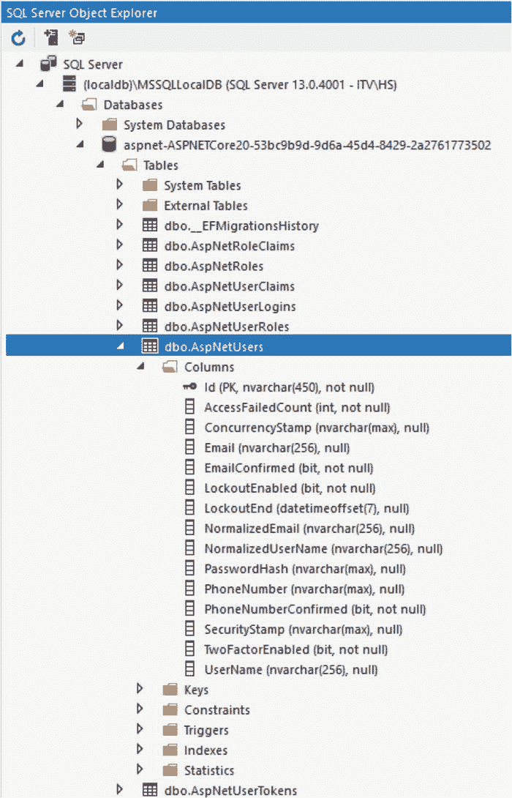

图 A-7

Created database for managing users of the ASP.NET Core web application

web 应用中没有上下文类`ApplicationDbContext`的实例化。相反，这是由依赖注入使用的。在`Startup.cs`中，你会发现两行(见清单 A-12 )。

*   `AddDbContext()`扩展方法将上下文类注册为依赖注入服务，并传递提供者和连接字符串。方法`AddDbContext()`由微软类`Microsoft.Extensions.DependencyInjection.EntityFrameworkServiceCollectionExtensions`中的`Microsoft.EntityFrameworkCore.dll`提供。
*   `AddEntityFrameworkStores()`扩展方法告诉 ASP.NET 身份组件使用哪个上下文类。`AddEntityFrameworkStores()`由微软`Extensions.Dependency injection.IdentityEntityFrameworkBuilderExtensions`类中的`Microsoft.AspNetCore.Identity.EntityFrameworkCore.dll`提供。

Note

ASP.NET 标识确保上下文类在需要时被实例化，此外，它的生存期不会超过处理一个 HTTP 请求所需的时间。

```cs
public void ConfigureServices(IServiceCollection services)
{
services.AddDbContext<ApplicationDbContext>(options =>
             options.UseSqlServer(Configuration.GetConnectionString("DefaultConnection")));

services.AddIdentity<ApplicationUser, IdentityRole>()
   .AddEntityFrameworkStores<ApplicationDbContext>()
   .AddDefaultTokenProviders();
}

Listing A-12An Extract from Startup.cs, an ASP.NET Core Web Application Created with the Project Template in Visual Studio, with Individual Local User Accounts

```

Tip

您也可以将`AddDbContext()`用于您自己的上下文类。在这种情况下，使用`AddDbContext()`在启动类中注册上下文类，如下所示:

```cs
  services.AddDbContext<EFCore_Kontext.WWWingsContext>(options =>
  options.UseSqlServer(Configuration.GetConnectionString("WWWingsConnection")));

```

当使用 ASP.NET 核心(`Microsoft.Extensions.DependencyInjection`)的标准依赖注入组件时，依赖注入只能通过构造函数注入来完成(参见清单 A-13 )。

```cs
using GO;
using EFCore_Context;
using System.Collections.Generic;
using System.Linq;

namespace ASPNETCore_NETCore.BL
{
public class FlightManager
{
  private WWWingsContext ctx;

  /// <summary>
  /// constructor
  /// </ summary>
  /// <param name="ctx">context instance comes via DI!</ Param>
  public FlightManager(WWWingsContext ctx)
  {
   this.ctx = ctx;
  }

  public List<Flight> GetFlightSet string departure, int from, int to)
  {
   var FlightSet = ctx.Flight
    .Where(x => x.Departure == departure)
    .Skip(from).Take(to - from).ToList();
   return FlightSet.ToList();
  }
}
}

Listing A-13The Class FlightManager Receives the Context Instance via Dependency Injection

```

但是，请注意，如果`FlightManager`类的实例本身是由依赖注入(DI)容器生成的，那么 ASP.NET 核心只将上下文实例注入到`FlightManager`类的构造函数中。为此，类`FlightManager`必须在启动类中注册，以便用`AddTransient()`进行依赖注入。

```cs
ServicesAddTransient <Flight manager>();

```

每次请求实例时，`AddTransient()`都会生成一个新的`FlightManager`实例。`AddScoped()`将确保相同的实例总是作为 HTTP 请求的一部分返回；这可能是所希望的，因为实体框架核心上下文的高速缓存被填充。`AddSingleton()`将总是跨多个 HTTP 请求提供相同的实例。这无法工作，因为实体框架核心上下文不支持多线程。

然后，一个 ASP.NET MVC 控制器通过构造函数注入期待一个`FlightManager`的实例(清单 A-14 )。

```cs
public class WWWingsController: Controller
{
  private FlightManager fm;
  public WWWingsController(FlightManager fm)
  {
   this.fm = fm;
  }
...
}
Listing A-14The WWWingsController Class Receives an Instance of FlightManager via Dependency Injection

```

### 实际例子:上下文实例池(DbContext Pooling)

自从实体框架 Core 2.0 以后，就可以用`AddDbContextPool()`代替`AddDbContext()`。该方法创建一组在池中管理的上下文实例，类似于 ADO.NET 连接池。当依赖注入请求一个上下文实例时，从池中取出一个空闲的上下文实例。实体框架核心还可以重置已经使用的上下文实例，并释放它以供重用。这在一定程度上提高了使用实体框架核心的 web 应用的性能。

```cs
int poolSize = 40;
services.AddDbContextPool<ApplicationDbContext>(options => options.UseSqlServer(Configuration.GetConnectionString("DefaultConnection")), poolSize);

```

## 在通用 Windows 平台应用中使用实体框架核心

本节中使用的 MiracleList Light 应用是一个用于简单本地任务管理的示例应用，实现为 Windows 10 的通用 Windows 平台(UWP)应用，使用本地 SQLite 数据库作为数据存储，在云中没有后端(图 A-8 )。这个应用允许你保存在特定日期到期的任务。在软件的当前版本中，任务总是正好有三个子任务(计划、执行、回顾)不能被改变。通过单击完成或全部移除，可以从列表中移除任务。

Note

要在 UWP 中使用实体框架核心 2.0，您需要在 Windows 10 Creators 2017 秋季更新中安装 UWP 版本 10.0.16299。

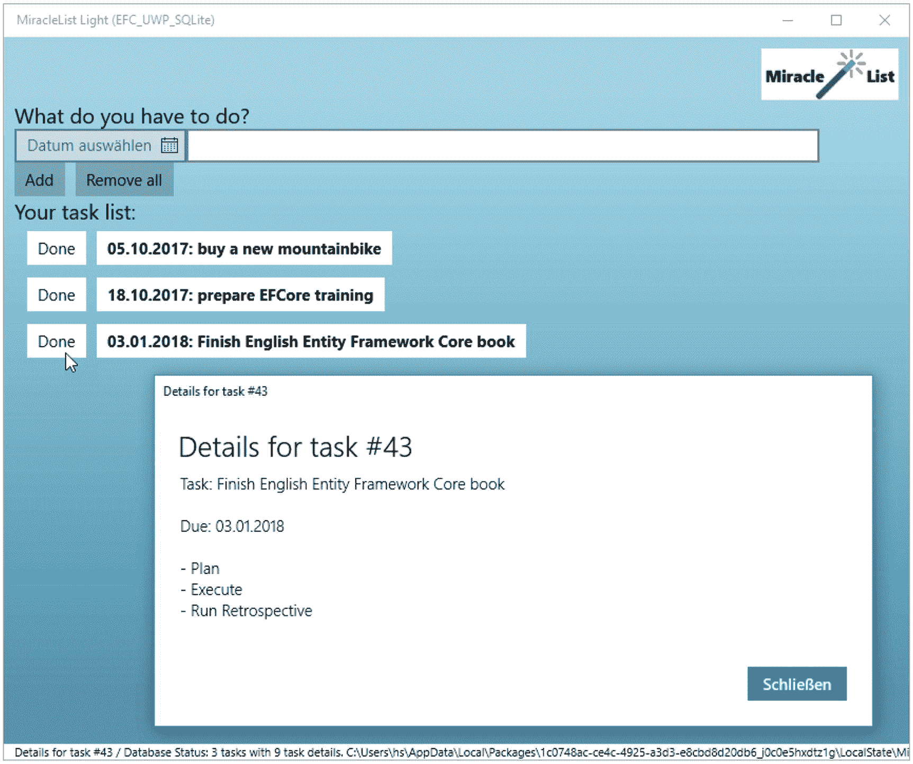

图 A-8

The MiracleList Light app for Windows 10

### 架构

由于代码大小有限，该应用在 Visual Studio 项目中作为一个整体应用来实现。该项目是使用项目模板 Windows 通用/空白应用创建的。对于此模板，Windows 10 SDK 必须安装在适合您的 Windows 安装的版本中。Microsoft 不支持在旧操作系统上使用或编译程序。

应用引用了 NuGet 包`Microsoft.EntityFrameworkCore.Sqlite`。

该应用对数据库使用正向工程。如有必要，如果应用启动时数据库文件不存在，则会在运行时生成具有适当数据库模式的数据库文件。图 A-9 显示了项目的结构。

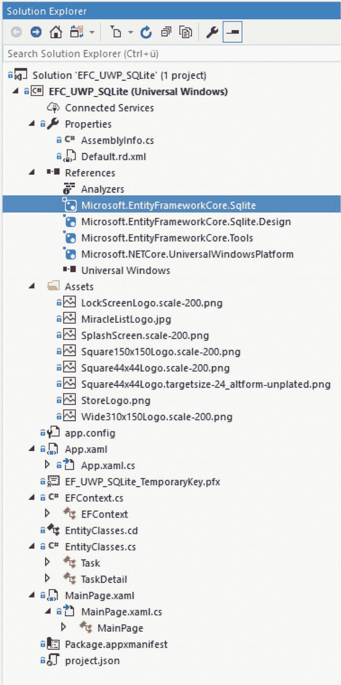

图 A-9

Structure of the project

### 实体

只需要两个实体类。

*   任务的任务类:一个`Task`对象在`Details`属性中有一个`List<TaskDetail>`。
*   子任务的 TaskDetail 类:每个`TaskDetail`对象使用`Task`属性指向子任务所属的任务。此外，`TaskID`外键属性中的`TaskDetail`类知道父任务的主键。

在这种情况下，实体类的数据注释是不必要的，因为实体框架核心可以完全基于内置约定来创建数据库模式。图 A-10 展示了应用的对象模型，清单 A-15 展示了实现。

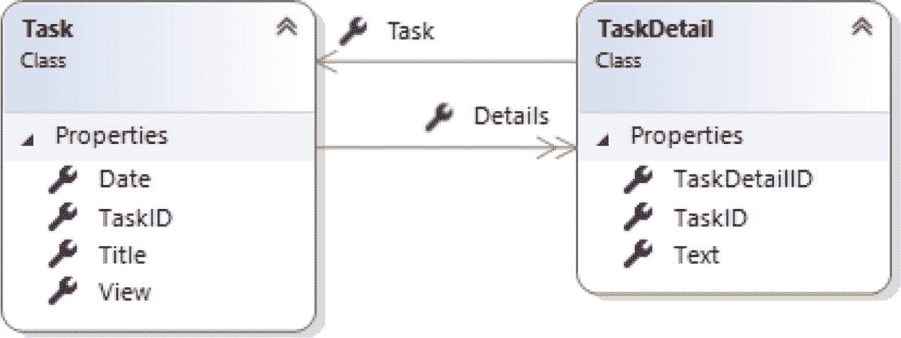

图 A-10

Object model of the application

```cs
using System;
using System.Collections.Generic;

namespace EFC_UWP_SQLite
{
 /// <summary>
 /// Entity class for tasks
 /// </summary>
 public class Task
 {
  // Basic properties
  public int TaskID { get; set; } // PK
  public string Title { get; set; } // TEXT
  public DateTime Date { get; set; } // DateTime

  // Navigation properties
  public List<TaskDetail> Details { get; set; } = new List<TaskDetail>();

  public string View { get { return Date.ToString("d") + ": " + Title; } }
 }

 /// <summary>
 /// Entity class for subtasks
 /// </summary>
 public class TaskDetail
 {
  // Basic properties
  public int TaskDetailID { get; set; } // PK
  public string Text { get; set; }

  // Navigation properties
  public Task Task { get; set; }
  public int TaskID { get; set; } // optional: Foreign key column for navigation relationship
 }

}

Listing A-15Implementation of the Two Entity Classes in the EntityClasses.cs File

```

### 实体框架核心上下文类

对于两个实体类，从`DbContext`派生的上下文类总是有一个类型为`DbSet<T>`的属性。在`OnConfiguring()`方法中，`UseSqlite()`设置实体框架核心数据库提供者，只将 SQLite 数据库文件的名称作为参数传入。在这种情况下，`OnModelCreating()`的实现是不必要的，因为实体框架核心可以完全基于内置约定创建数据库模式(清单 A-16 )。

```cs
using Microsoft.EntityFrameworkCore;

namespace EFC_UWP_SQLite
{
 /// <summary>
 /// Entity Framework core context
 /// </summary>
 public class EFContext : DbContext
 {
  public static string FileName = "MiracleList.db";

  public DbSet<Task> TaskSet { get; set; }
  public DbSet<TaskDetail> TaskDetailSet { get; set; }

  protected override void OnConfiguring(DbContextOptionsBuilder optionsBuilder)
  {
   // Set provider and database filename
   optionsBuilder.UseSqlite($"Filename={FileName}");
  }

 }
}

Listing A-16Implementation of the Context Class in the File EFContext.cs

```

### 起动电码

当应用启动时，`App.xaml.cs`数据库文件使用`Database`方法。如果数据库文件尚不存在，则创建`EnsureCreated()`。英文源代码注释来自微软的项目模板。参见清单 A-17 。

```cs
using System;
using Windows.ApplicationModel;
using Windows.ApplicationModel.Activation;
using Windows.Foundation;
using Windows.UI.Xaml;
using Windows.UI.Xaml.Controls;
using Windows.UI.Xaml.Navigation;

namespace EFC_UWP_SQLite
{
 /// <summary>
 /// Provides application-specific behavior to supplement the default Application class.
 /// </summary>
 sealed partial class App : Application
 {
  /// <summary>
  /// Initializes the singleton application object.  This is the first line of authored code
  /// executed, and as such is the logical equivalent of main() or WinMain().
  /// </summary>
  public App()
  {
   this.InitializeComponent();
   this.Suspending += OnSuspending;

   // Create DB, if not exists!
   using (var db = new EFContext())
   {
    db.Database.EnsureCreated();
   }
  }

...
 }
}

Listing A-17Extract from the App.xaml.cs File

```

### 生成的数据库

生成的数据库可以与 SQLite 的工具数据库浏览器交互显示和使用，如图 A-11 、图 A-12 和图 A-13 所示。

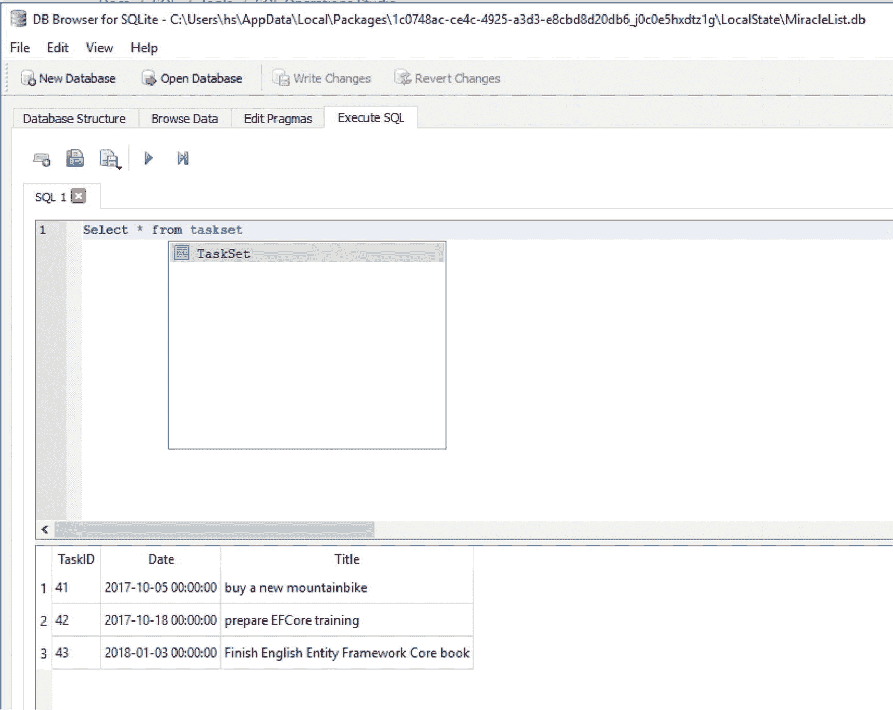

图 A-13

Executing SQL commands in DB Browser for SQLite

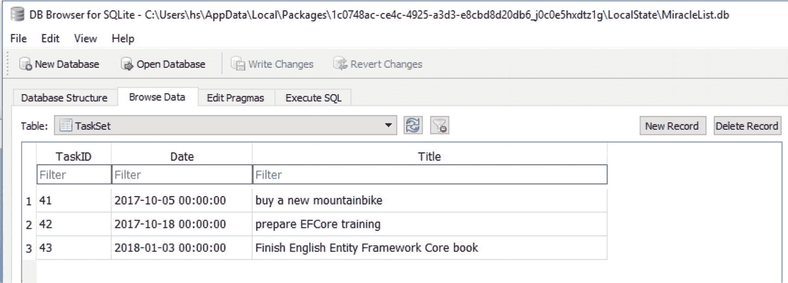

图 A-12

Data view in DB Browser for SQLite

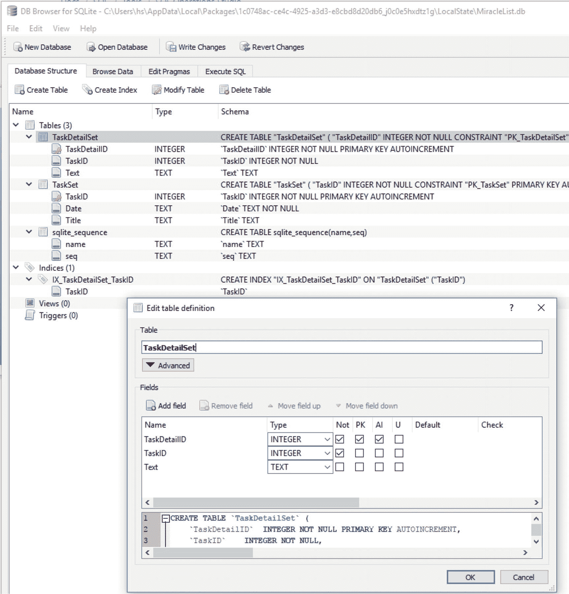

图 A-11

Database schema view in DB Browser for SQLite

<colgroup><col align="left"> <col align="left"></colgroup> 
|   |  |
| 工具名称 | SQLite 的数据库浏览器 |
| 网站 | [`www.sqlitebrowser.org`](http://www.sqlitebrowser.org) |
| 免费版本 | 是 |
| 商业版 | 不 |

### 数据访问代码

在这个简单的案例研究中，数据访问代码没有从表示层中分离出来。它还故意不使用模型-视图-视图模型(MVVM)模式，这将使本书中的程序代码易于管理。

数据访问使用实体框架核心的异步方法来保持 UI 的响应性。

当创建子任务和删除所有任务时，会显示两个变量(清单 A-18 )。被注释掉的变量是效率较低的变量。因此，在不使用 SQL 的情况下删除所有任务和子任务需要不必要地加载所有任务并为每个任务发送一个`DELETE`命令。在这两种情况下，子任务的显式删除都不是必需的，因为级联删除在标准系统中是有效的。

```cs
using Microsoft.EntityFrameworkCore;
using System;
using System.Collections.Generic;
using System.Collections.ObjectModel;
using System.ComponentModel;
using System.Linq;
using Windows.Foundation;
using Windows.Storage;
using Windows.UI.Popups;
using Windows.UI.Xaml;
using Windows.UI.Xaml.Controls;
using Windows.UI.Xaml.Input;

namespace EFC_UWP_SQLite
{
 /// <summary>
 /// Main page of the app
 /// </summary>
 public sealed partial class MainPage : Page, INotifyPropertyChanged
 {
  public MainPage()
  {
   this.DataContext = this;
   this.InitializeComponent();
   Windows.UI.ViewManagement.ApplicationView.PreferredLaunchViewSize = new Size(800, 500);
   Windows.UI.ViewManagement.ApplicationView.PreferredLaunchWindowingMode = Windows.UI.ViewManagement.ApplicationViewWindowingMode.PreferredLaunchViewSize;

   System.Diagnostics.Debug.WriteLine(ApplicationData.Current.LocalFolder.Path);
  }
  public event PropertyChangedEventHandler PropertyChanged;

  private ObservableCollection<Task> _Tasks { get; set; }
  public ObservableCollection<Task> Tasks
  {
   get { return _Tasks; }
   set { _Tasks = value; this.PropertyChanged?.Invoke(this, new PropertyChangedEventArgs(nameof(Tasks))); }
  }

  private string _Statustext { get; set; }
  public string Statustext
  {
   get { return _Statustext; }
   set { _Statustext = value; this.PropertyChanged?.Invoke(this, new PropertyChangedEventArgs(nameof(Statustext))); }
  }

  private async void Page_Loaded(object sender, RoutedEventArgs e)
  {
   var count = await this.LoadTaskSet();
   SetStatus(count + " records loaded!");
  }

  private void SetStatus(string text)
  {
   string dbstatus;
   using (var db = new EFContext())
   {
    dbstatus = db.TaskSet.Count() + " tasks with " + db.TaskDetailSet.Count() + " task details. " + ApplicationData.Current.LocalFolder.Path + @"\" + EFContext.FileName;
   }
   Statustext = text + " / Database Status: " + dbstatus + ")";
  }

  /// <summary>
  /// Get all tasks from database
  /// </summary>
  /// <returns></returns>
  private async System.Threading.Tasks.Task<int> LoadTaskSet()
  {
   using (var db = new EFContext())
   {
    var list = await db.TaskSet.OrderBy(x => x.Date).ToListAsync();
    Tasks = new ObservableCollection<Task>(list);
    return Tasks.Count;
   }

  }

  private async void Add(object sender, RoutedEventArgs e)
  {
   if (String.IsNullOrEmpty(C_Task.Text)) return;
   if (!C_Date.Date.HasValue) { C_Date.Date = DateTime.Now; }

   // Create new Task
   var t = new Task { Title = C_Task.Text, Date = C_Date.Date.Value.Date };
   var d1 = new TaskDetail() { Text = "Plan" };
   var d2 = new TaskDetail() { Text = "Execute" };
   var d3 = new TaskDetail() { Text = "Run Retrospective" };
   // Alternative 1
   //t.Details.Add(d1);
   //t.Details.Add(d2);
   //t.Details.Add(d3);

   // Alternative 2
   t.Details.AddRange(new List<TaskDetail>() { d1, d2, d3 });

   using (var db = new EFContext())
   {
    db.TaskSet.Add(t);
    // Save now!
    var count = await db.SaveChangesAsync();
    SetStatus(count + " records saved!");
    await this.LoadTaskSet();
   }
   this.C_Task.Text = "";
   this.C_Task.Focus(FocusState.Pointer);
  }

  private async void SetDone(object sender, RoutedEventArgs e)
  {
   // Get TaskID
   var id = (int)((sender as Button).CommandParameter);
   // Remove record
   using (var db = new EFContext())
   {
    Task t = db.TaskSet.SingleOrDefault(x => x.TaskID == id);
    if (t == null) return; // not found :-(
    db.Remove(t);
    var count = db.SaveChangesAsync();
    SetStatus(count + " records deleted!");
    await this.LoadTaskSet();
   }

  }

  private async void ShowDetails(object sender, RoutedEventArgs e)
  {
   // Get TaskID
   var id = (int)((sender as Button).CommandParameter);
   // Get Details
   using (var db = new EFContext())
   {
    string s = "";
    Task t = db.TaskSet.Include(x => x.Details).SingleOrDefault(x => x.TaskID == id);
    s += "Task: " + t.Title + "\n\n";
    s += "Due: " + t.Date.Date + "\n\n";
    foreach (var d in t.Details)
    {
     s += "- " + d.Text + "\n";
    }
    SetStatus("Details for task #" + id);
    await new MessageDialog(s, "Details for task #" + id).ShowAsync();
   }
  }

  private void C_Task_KeyDown(object sender, KeyRoutedEventArgs e)
  {
   if (e.Key == Windows.System.VirtualKey.Enter) Add(null, null);
  }

  private async void RemoveAll(object sender, RoutedEventArgs e)
  {
   // Remove all tasks
   using (var db = new EFContext())
   {
    // Alternative 1: unefficient :-(
    //foreach (var b in db.TaskSet.ToList())
    //{
    // db.Remove(b);
    //}
    //db.SaveChanges();

    // Alternative 2: efficient!
    //db.Database.ExecuteSqlCommand("Delete from TaskDetailSet");
    var count = await db.Database.ExecuteSqlCommandAsync("Delete from TaskSet");
    SetStatus(count + " records deleted!");
    Tasks = null;
   }

  }
 }
}

Listing A-18Data Access Code in the MainPage.xaml.cs File

```

### 用户界面

清单 A-19 显示了 XAML UWP 的应用界面。

```cs
<Page
    x:Class="EFC_UWP_SQLite.MainPage"
    xmlns:="http://schemas.microsoft.com/winfx/2006/xaml/presentation"
    xmlns:x="http://schemas.microsoft.com/winfx/2006/xaml"
    xmlns:local="using:EFC_UWP_SQLite"
    xmlns:d="http://schemas.microsoft.com/expression/blend/2008"
    xmlns:mc="http://schemas.openxmlformats.org/markup-compatibility/2006"
    mc:Ignorable="d"    Loaded="Page_Loaded">

 <Grid Margin="0,0,0,0">
  <Grid.RowDefinitions>
   <RowDefinition Height="*"></RowDefinition>
   <RowDefinition Height="auto"></RowDefinition>
  </Grid.RowDefinitions>
  <Grid.Background>
   <LinearGradientBrush EndPoint="0.5,1" StartPoint="0.5,0">
    <GradientStop Color="#FFA1D7E9" Offset="0.081"/>
    <GradientStop Color="#FF4C94AD" Offset="0.901"/>
   </LinearGradientBrush>
  </Grid.Background>
  <StackPanel Margin="10,10,10,10" Grid.Row="0">
   <!-- ==================== logo -->
   <Image x:Name="Logo" Source="Assets/MiracleListLogo.jpg" Width="130" MinHeight="50" HorizontalAlignment="Right"></Image>
   <!-- ==================== new Task -->
   <TextBlock Text="What do you have to do?" FontSize="20"></TextBlock>
   <StackPanel Orientation="horizontal">
    <CalendarDatePicker Name="C_Date" />
    <TextBox Background="White" Name="C_Task" KeyDown="C_Task_KeyDown" Width="600"></TextBox>
   </StackPanel>

   <!-- ==================== actions -->
   <StackPanel Orientation="horizontal">
    <Button Click="Add">Add</Button>
    <Button Click="RemoveAll" Margin="10,0,0,0">Remove all</Button>
   </StackPanel>
   <TextBlock Text="Your task list:" FontSize="20"/>
   <!-- ==================== list of tasks -->
   <ListView ItemsSource="{Binding Tasks}" ScrollViewer.VerticalScrollBarVisibility="Visible">
    <ListView.ItemTemplate>
     <DataTemplate>
      <StackPanel Orientation="Horizontal">
       <Button  Background="white"  Content="Done" Name="C_Done" CommandParameter="{Binding TaskID}"  Click="SetDone" Margin="0,0,10,0" />
       <Button Background="white" FontWeight="Bold" Content="{Binding View}" Name="C_Details"  CommandParameter="{Binding TaskID}" Click="ShowDetails" />
      </StackPanel>
     </DataTemplate>
    </ListView.ItemTemplate>
   </ListView>
  </StackPanel>
  <!-- ==================== statusbar -->
  <StackPanel Background="White" Grid.Row="1">
   <TextBlock Text="{Binding Statustext}" Margin="10,0,0,0"  FontSize="11" />
  </StackPanel>

 </Grid>
</Page>

Listing A-19MainPage.xaml

```

## 在 Xamarin 跨平台应用中使用实体框架核心

本节中的 MiracleList Light 案例研究是上一节中讨论的用于 Windows 10 的通用 Windows 平台(UWP)应用的写照。在这里，它是一款不局限于 Windows 10 作为 UWP 应用的跨平台应用；它也可以在 Android 和 iOS 上运行(图 A-14 和图 A-15 )。对于 GUI，使用`Xamarin.Forms`。

Note

对于实体框架核心 2.0，您需要在 Windows 10 Creators 2017 秋季更新中安装 UWP 版本 10.0.16299。

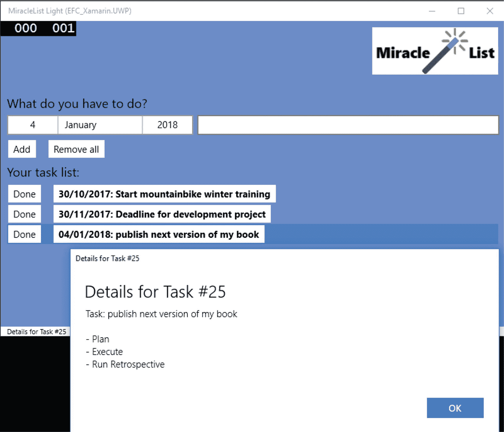

图 A-14

The MiracleList Light cross-platform app for Windows 10

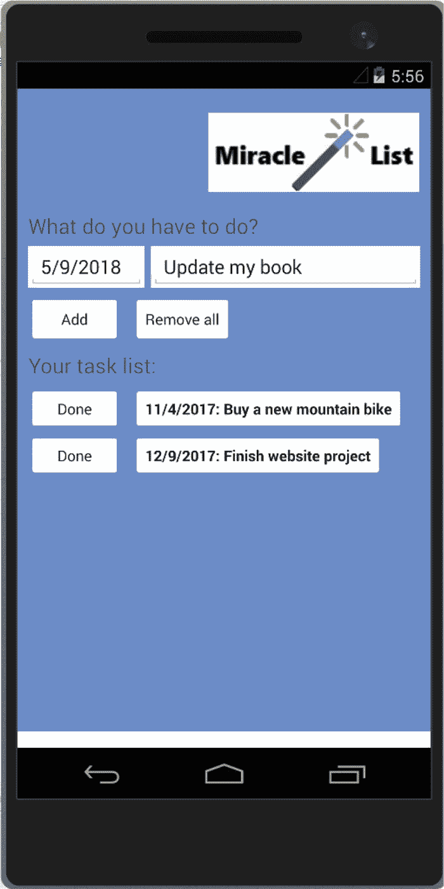

图 A-15

The MiracleList Light cross-platform app for Android

### 架构

与此应用作为 UWP 应用的实现不同，此跨平台版本是多层的。

*   业务对象项目包含实体类。该项目是一个. NET 标准库，不需要额外的引用。
*   DAL 项目包括实体框架核心上下文类。该项目是一个. NET 标准库，需要 NuGet 包`Xamarin.Forms`和`Microsoft.EntityFrameworkCore`。
*   UI 项目包含使用 Xamarin 窗体的 UI。该项目是一个. NET 标准库，需要 NuGet 包`Xamarin.Forms`和`Microsoft.EntityFrameworkCore`。
*   项目`Android`、`iOS`和`UWP`包含平台特定的启动代码以及应用的平台特定的声明。

该应用对数据库使用正向工程。如有必要，如果应用启动时数据库文件不存在，则会在运行时生成具有适当数据库模式的数据库文件。图 A-16 显示了项目的结构。

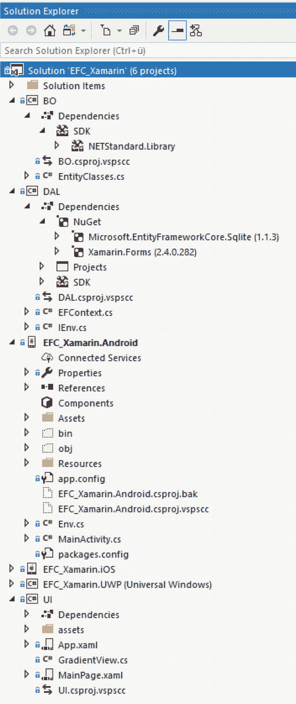

图 A-16

Structure of the project

### 实体

Xamarin 应用的实体类对应于 UWP 案例研究中的实体类。

### 实体框架核心上下文类

Xamarin 应用的上下文类与 UWP 案例研究的上下文类略有不同，因为并非每个操作系统都可以在`UseSQLite()`中的连接字符串中指定为不带路径的文件名。需要考虑特定于平台的差异。因此，在三个框架应用(清单 A-20 和清单 A-21 )的自定义接口`IEnv`的实现中，数据库文件的路径由依赖注入提供。

Note

DAL 库需要 NuGet 包`Xamarin.Forms`,因为依赖注入使用 Xamarin 表单中内置的依赖注入框架。

```cs
using Microsoft.EntityFrameworkCore;
using Xamarin.Forms;

namespace EFC_Xamarin
{
 /// <summary>
 /// Entity Framework context
 /// </summary>
 public class EFContext : DbContext
 {

  static public string Path { get; set; }
  public DbSet<Task> TaskSet { get; set; }
  public DbSet<TaskDetail> TaskDetailSet { get; set; }

  protected override void OnConfiguring(DbContextOptionsBuilder optionsBuilder)
  {
   EFContext.Path = System.IO.Path.Combine(DependencyService.Get<IEnv>().GetDbFolder(), "miraclelist.db");
   // set provider and database file path
   optionsBuilder.UseSqlite($"Filename={  EFContext.Path}");
  }
 }
}

Listing A-20Implementation of the Context Class in the File EFContext.cs

```

```cs
namespace EFC_Xamarin
{
 /// <summary>
 /// Custom Interface for getting the OS specific folder for the DB file
 /// </summary>
 public interface IEnv
 {
  string GetDbFolder();
 }
}
Listing A-21IEnv.cs

```

每个操作系统都要注入一个合适的实现(清单 A-22 ，清单 A-23 ，清单 A-24 )。

```cs
using EFC_Xamarin.UWP;
using Windows.Storage;
using Xamarin.Forms;

[assembly: Dependency(typeof(Env))]
namespace EFC_Xamarin.UWP
{
 public class Env : IEnv
 {
  public string GetDbFolder()
  {
   return ApplicationData.Current.LocalFolder.Path;
  }
 }
}

Listing A-22Implementation of IEnv on Windows 10 UWP

```

```cs
using EFC_Xamarin.Android;
using System;
using Xamarin.Forms;

[assembly: Dependency(typeof(Env))]
namespace EFC_Xamarin.Android
{
 public class Env : IEnv
 {
  public string GetDbFolder()
  {
   return Environment.GetFolderPath(Environment.SpecialFolder.MyDocuments);
  }
 }
}

Listing A-23Implementation of IEnv on Android

```

```cs
using EFC_Xamarin.iOS;
using System;
using System.IO;
using Xamarin.Forms;

[assembly: Dependency(typeof(Env))]
namespace EFC_Xamarin.iOS
{
 public class Env : IEnv
 {
  public string GetDbFolder()
  {
   return Path.Combine(Environment.GetFolderPath(Environment.SpecialFolder.MyDocuments),
       "..", "Library");
  }

 }
}

Listing A-24Implementation of IEnv on iOS

```

### 起动电码

当应用启动时，如果数据库文件尚不存在，则通过方法`Database.EnsureCreated()`在`App.xaml.` `cs`中创建数据库文件(清单 A-25 )。

```cs
using Xamarin.Forms;

//[assembly: XamlCompilation(XamlCompilationOptions.Compile)]
namespace EFC_Xamarin
{
 public partial class App : Application
 {
  public App()
  {
   InitializeComponent();
   // Create Database if it does not exist
   using (var db = new EFContext())
   {
    db.Database.EnsureCreated();
   }
   MainPage = new EFC_Xamarin.MainPage();
  }

  protected override void OnStart()
  {

  }

  protected override void OnSleep()
  {
   // Handle when your app sleeps
  }

  protected override void OnResume()
  {
   // Handle when your app resumes
  }
 }
}

Listing A-25Extract from the App.xaml.cs File in the Project UI

```

### 生成的数据库

为 Xamarin 应用生成的数据库对应于 UWP 案例研究中的数据库。

### 数据访问代码

在这个简单的案例研究中，数据访问代码没有从表示层中分离出来。它还故意不使用模式 Model-View-ViewModel (MVVM ),以保持程序代码便于在本书中打印。

数据访问使用实体框架核心的异步方法来保持 UI 的响应性。

当创建子任务和删除所有任务时，会显示两个变量(列表 A-26 )。被注释掉的变量是效率较低的变量。因此，在不使用 SQL 的情况下删除所有任务和子任务需要不必要地加载所有任务并为每个任务发送一个`DELETE`命令。然而，在这两种情况下都没有必要明确删除子任务，因为级联删除在标准系统中是有效的。

```cs
using Microsoft.EntityFrameworkCore;
using System;
using System.Collections.Generic;
using System.Collections.ObjectModel;
using System.Linq;
using Xamarin.Forms;

namespace EFC_Xamarin
{
 public partial class MainPage : ContentPage
 {
  private ObservableCollection<Task> _Tasks { get; set; }
  public ObservableCollection<Task> Tasks
  {
   get { return _Tasks; }
   set { _Tasks = value; this.OnPropertyChanged(nameof(Tasks)); }
  }

  private string _Statustext { get; set; }
  public string Statustext
  {
   get { return _Statustext; }
   set { _Statustext = value; this.OnPropertyChanged(nameof(Statustext)); }
  }

  public MainPage()
  {
   this.BindingContext = this;
   InitializeComponent();
   var count = this.LoadTaskSet();
   SetStatus(count + " Datensätze geladen!");
  }

  private async System.Threading.Tasks.Task<int> LoadTaskSet()
  {
   using (var db = new EFContext())
   {
    var list = await db.TaskSet.OrderBy(x => x.Date).ToListAsync();
    Tasks = new ObservableCollection<Task>(list);
    return Tasks.Count;
   }
  }

  private void SetStatus(string text)
  {
   string dbstatus;
   using (var db = new EFContext())
   {
    dbstatus = db.TaskSet.Count() + " Tasks with " + db.TaskDetailSet.Count() + " Task Details";
   }
   Statustext = text + " / Database Status: " + dbstatus + ")";
  }

  private async void Add(object sender, EventArgs e)
  {

   if (String.IsNullOrEmpty(C_Task.Text)) return;
   // Create new Task
   var t = new Task { Title = C_Task.Text, Date = C_Date.Date };
   var d1 = new TaskDetail() { Text = "Plan" };
   var d2 = new TaskDetail() { Text = "Execute" };
   var d3 = new TaskDetail() { Text = "Run Retrospective" };
   // Alternative 1
   //t.Details.Add(d1);
   //t.Details.Add(d2);
   //t.Details.Add(d3);

   // Alternative 2
   t.Details.AddRange(new List<TaskDetail>() { d1, d2, d3 });

   using (var db = new EFContext())
   {
    db.TaskSet.Add(t);
    // Save now!
    var count = db.SaveChangesAsync();

    SetStatus(count + " records saved!");
    await this.LoadTaskSet();
   }
   this.C_Task.Text = "";
   this.C_Task.Focus();
  }

  private async void SetDone(object sender, EventArgs e)
  {
   // Get TaskID
   var id = (int)((sender as Button).CommandParameter);
   // Remove record
   using (var db = new EFContext())
   {
    Task t = db.TaskSet.Include(x => x.Details).SingleOrDefault(x => x.TaskID == id);
    if (t == null) return; // not found!
    db.Remove(t);
    int count = await db.SaveChangesAsync();
    SetStatus(count + " records deleted!");
    await this.LoadTaskSet();
   }

  }

  private async void ShowDetails(object sender, EventArgs e)
  {
   // Get TaskID
   var id = (int)((sender as Button).CommandParameter);
   // Get Details
   using (var db = new EFContext())
   {
    string s = "";
    Task t = db.TaskSet.Include(x => x.Details).SingleOrDefault(x => x.TaskID == id);
    s += "Task: " + t.Title + "\n\n";
    s += "Due: " + String.Format("{0:dd.MM.yyyy}",t.Date) + "\n\n";
    foreach (var d in t.Details)
    {
     s += "- " + d.Text + "\n";
    }
    SetStatus("Details for Task #" + id);
    await this.DisplayAlert("Details for Task #" + id, s, "OK");
   }
  }

  private async void RemoveAll(object sender, EventArgs e)
  {
   // Remove all tasks
   using (var db = new EFContext())
   {
    // Alternative 1: unefficient :-(
    //foreach (var b in db.TaskSet.ToList())
    //{
    // db.Remove(b);
    //}
    //db.SaveChanges();

    // Alternative 2: efficient!
    //db.Database.ExecuteSqlCommand("Delete from TaskDetailSet");
    var count = await db.Database.ExecuteSqlCommandAsync("Delete from TaskSet");
    SetStatus(count + " records deleted!");
    Tasks = null;
   }

  }
 }
}

Listing A-26Data Access Code in the MainPage.xaml.cs File

```

表 A-1 显示了 UWP 应用和厦门应用用户界面控件的主要区别。

餐桌 A-1

UWP-XAML vs. Xamarin-Forms XAML

<colgroup><col align="left"> <col align="left"></colgroup> 
| 应用 | Xamarin 形式 |
| :-- | :-- |
| `private async void Page_Loaded(object sender, RoutedEventArgs e)` | `protected async override void OnAppearing()` |
| `this.DataContext = this;` | `this.BindingContext = this;` |
| `await new MessageDialog(s, "Details for Task #" + id).ShowAsync();` | `await this.DisplayAlert("Details for Task #" + id,s,"OK");` |
| `this.C_Task.Focus(FocusState.Pointer);` | `this.C_Task.Focus();` |

### 用户界面

清单 A-27 展示了 Xamarin 应用的基于 Xamarin 表单的 UI。

```cs
<?xml version="1.0" encoding="utf-8" ?>
<ContentPage  x:Name="MainPage" xmlns:="http://xamarin.com/schemas/2014/forms"
             xmlns:x="http://schemas.microsoft.com/winfx/2009/xaml"
             xmlns:local="clr-namespace:EFC_Xamarin"
             x:Class="EFC_Xamarin.MainPage" WidthRequest="800" HeightRequest="500" >
<Grid Margin="0,0,0,0" BackgroundColor="CornflowerBlue">
  <Grid.RowDefinitions>
   <RowDefinition Height="*"></RowDefinition>
   <RowDefinition Height="auto"></RowDefinition>
  </Grid.RowDefinitions>
  <StackLayout Margin="10,10,10,10" Grid.Row="0">
   <!-- ==================== logo -->
   <Image x:Name="Logo" Source="miraclelistlogo.jpg" HeightRequest="100" WidthRequest="200" HorizontalOptions="End"   ></Image>
   <!-- ==================== new Task -->
   <Label Text="What do you have to do?" FontSize="20"></Label>

   <StackLayout Orientation="Horizontal">
     <ContentView BackgroundColor="White">  <DatePicker x:Name="C_Date" /></ContentView>
    <Entry BackgroundColor="White" x:Name="C_Task" HorizontalOptions="FillAndExpand" Completed="Add"></Entry>
   </StackLayout>
   <!-- ==================== actions -->
   <StackLayout Orientation="Horizontal">
    <Button Clicked="Add" BackgroundColor="White" Text="Add"></Button>
     <Button Clicked="RemoveAll"  BackgroundColor="White" Text="Remove all" Margin="5,0,0,0"></Button>
   </StackLayout>
   <Label Text="Your task list:" FontSize="20"/>
   <!-- ==================== list of tasks -->
   <ListView x:Name="C_Tasks" ItemsSource="{Binding Tasks}">
    <ListView.ItemTemplate>
     <DataTemplate>
      <ViewCell>
       <StackLayout Orientation="Horizontal" >
        <Button BackgroundColor="White" Text="Done" x:Name="C_Done"  Clicked="SetDone" Margin="0,0,5,0" CommandParameter="{Binding TaskID}" />
        <Button BackgroundColor="White"  CommandParameter="{Binding TaskID}" FontAttributes="Bold" Text="{Binding View}" x:Name="C_Details"  Clicked="ShowDetails" />
       </StackLayout>
      </ViewCell>

     </DataTemplate>
    </ListView.ItemTemplate>
   </ListView>
  </StackLayout>
  <!-- ==================== statusbar -->
  <StackLayout BackgroundColor="White" Grid.Row="1">
   <Label Margin="10,0,0,0"  x:Name="C_StatusBar" FontSize="11" Text="{Binding StatusText}" />
  </StackLayout>
 </Grid>
</ContentPage>

Listing A-27MainPage.xaml

```

表 A-2 显示了 XAML UWP 的应用和 XAML xa marin Forms 的应用之间的主要差异。您可以看到，有许多差异使得迁移成本很高。

表 A-2

UWP XAML vs. Xamarin Forms XAML

<colgroup><col align="left"> <col align="left"></colgroup> 
| UWP XAML 文件 | 沙玛琳形成了 XAML |
| :-- | :-- |
| `<Page>` | `<ContentPage>` |
| `<TextBlock>` | `<Label>` |
| `<CalendarDatePicker>` | `<DatePicker>` |
| `<StackPanel>` | `<StackLayout>` |
| `<TextBox>` | `<Entry>` |
| `Name="abc"` | `x:Name="abc"` |
| `Orientation="horizontal" oder Orientation="Horizontal"` | `Orientation="Horizontal"` |
| `Background="white"` | `BackgroundColor="White"` |
| `Click="Add"` | `Clicked="Add"` |
| `<Button Content="Add"> oder <Button>Add</Button>` | `<Button Text="Add">` |
| `FontWeight="Bold"` | `FontAttributes="Bold"` |
| `<TextBox Background="White" Name="C_Task" KeyDown="C_Task_KeyDown" Width="600">` | `<Entry BackgroundColor="White" x:Name="C_Task" Completed="Add" WidthRequest="600" >` |
| `<ListView> <ListView.ItemTemplate> <DataTemplate>` | `<ListView> <ListView.ItemTemplate> <DataTemplate> <ViewCell>` |
| `<Image HorizontalAlignment="Right">` | `<Image HorizontalOptions="End">` |

## 与自己的多对多关系

地理提出了一个看似简单的任务:假设一个国家与任意数量的其他国家接壤。问题是，如何在对象模型中表达这一点，以便实体框架核心使其成为一个表对自身的 N:M 关系？

第一种简单的方法看起来是这样的:`Country`类有一个“边界”列表，它指向`Country`对象。你会在丹麦和德国之间建立这样的关系:`dk.Borders.Add(de)`。

但这并不满足要求。

*   在实体框架核心中，没有 N:M 映射。因此，在对象模型中必须有一个显式的`Border`类，就像在数据模型中一样。这可以用一个助手方法封装；参见`AddBorderToCounty(Country c)`。
*   两个国家之间只有一种关系是不够的，因为通过建立像`dk.Borders.Add(de)`这样的关系，丹麦现在知道它与德国接壤，但德国不知道它有丹麦人做邻居是多么幸运。

问题是导航属性描述了单向关系，但是您需要一个双向关系，这样两个国家都知道这个关系。因此，您必须在类`Country`中为邻居关系的两个方向创建一个导航属性；参见`Country`类中的`IncomingBorders`和`OutgoingBorders`以及`Border`类中的`IncomingCountry`和`OutgoingCountry`。在`OnModelCreating()`上下文类中，`WorldContext IncomingCountry`通过 Fluent API 与`IncomingBorders`连接，`OutgoingCountry`与`OutgoingBorders`连接。

当建立关系时，实体框架核心足够聪明来建立反关系。这由内部特征关系修正来保证，当你调用`DetectChanges()`或一个自动触发它的方法(例如，`SaveChanges()`)时，它总是在运行。

如果您通过丹麦的`OutgoingBorders`将关系从丹麦应用到德国，则在下一次关系修正后，丹麦也将出现在德国的`IncomingBorders`中。

清单 A-28 显示了实体类和上下文类。图 A-17 显示了在微软 SQL Server 中生成的数据库。

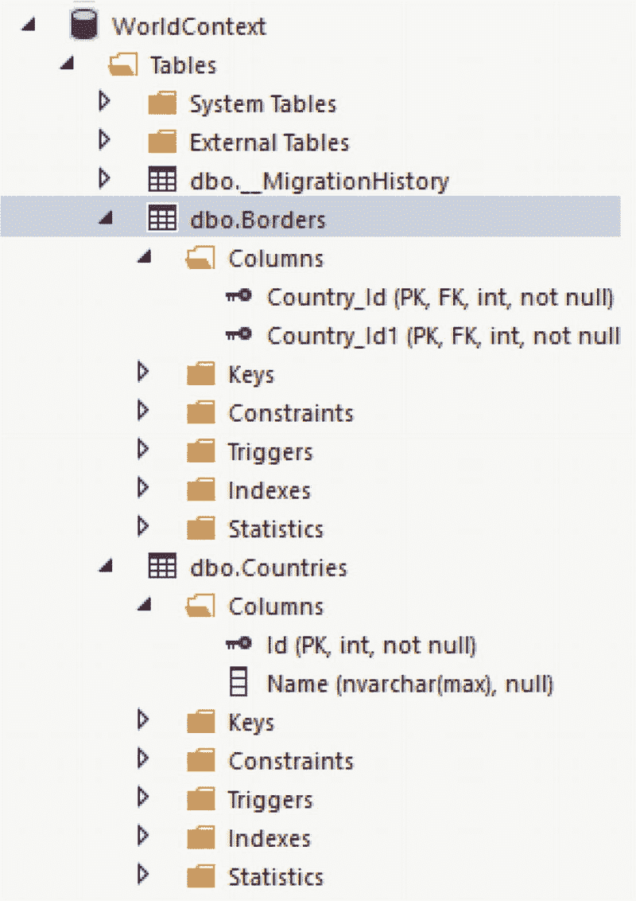

图 A-17

N:M relationship between country objects via Borders in the data model

```cs
using Microsoft.EntityFrameworkCore;
using Microsoft.EntityFrameworkCore.Metadata;
using System.Collections.Generic;
using System.Linq;

class Border
{
 // foreign key for IncomingCountry
 public int Country_Id { get; set; }
 // foreign key for OutgoingCountry
 public int Country_Id1 { get; set; }

 public virtual Country IncomingCountry { get; set; }
 public virtual Country OutgoingCountry { get; set; }
}

class Country
{
 public int Id { get; set; }
 public string Name { get; set; }

 // N-M relationship via Borders
 public virtual ICollection<Border> IncomingBorders { get; set; } = new List<Border>();
 public virtual ICollection<Border> OutgoingBorders { get; set; } = new List<Border>();

 public void AddBorderToCounty(Country c)
 {
  var b = new Border() {Country_Id = this.Id, Country_Id1 = c.Id};
  this.OutgoingBorders.Add(b);
 }
}

class WorldContext : DbContext
{
 public DbSet<Country> Countries { get; set; }
 public DbSet<Country> Borders { get; set; }
 protected override void OnConfiguring(DbContextOptionsBuilder optionsBuilder)
 {
  optionsBuilder.UseSqlServer(@"Server=.;Database=EFC_NMSelf;Trusted_Connection=True;MultipleActiveResultSets=True");
 }

 protected override void OnModelCreating(ModelBuilder modelBuilder)
 {
  // Configure primary key
  modelBuilder.Entity<Border>().HasKey(x => new {x.Country_Id, x.Country_Id1});
  // Configure relationships and foreign keys
  modelBuilder.Entity<Border>().HasOne<Country>(x => x.IncomingCountry).WithMany(x => x.IncomingBorders).HasForeignKey(x=>x.Country_Id1).OnDelete(DeleteBehavior.Restrict);
  modelBuilder.Entity<Border>().HasOne<Country>(x => x.OutgoingCountry).WithMany(x => x.OutgoingBorders).HasForeignKey(x => x.Country_Id).OnDelete(DeleteBehavior.Restrict); ;
 }

 /// <summary>
 /// Get all neighbors by the union of the two sets
 /// </summary>
 /// <param name="countryId"></param>
 /// <returns></returns>
 public IEnumerable<Country> GetNeigbours(int countryId)
 {
  var borders1 = this.Countries.Where(x => x.IncomingBorders.Any(y => y.Country_Id == countryId)).ToList();
  var borders2 = this.Countries.Where(x => x.OutgoingBorders.Any(y => y.Country_Id1 == countryId)).ToList();
  var allborders = borders1.Union(borders2).OrderBy(x=>x.Name);
  return allborders;
 }
}

Listing A-28Solution with Entity Framework Core

```

尽管数据库现在可以存储所有必要的关系，但您不能只获得所有边界关系的列表，因为这些关系分布在两个列表中(`OutgoingBorders`)。所以，你必须和 LINQ 操作符`Union()`组成联合，并且每次都要写。

```cs
var borders1 = country.OutgoingBorders;
var borders2 = ctx.Countries.Where(x => x.OutgoingBorders.Any(y => y.Id == country.Id)).ToList();
var borders = borders1.Union(borders2).OrderBy(x=>x.Name);;

```

然而，该类的用户不应该关心是创建了德国对丹麦的关系还是丹麦对德国的关系。

在经典的实体框架中，您可以优雅地将这个联合封装在`Country`类中，并使用延迟加载来加载连接的对象。因为在实体框架核心中没有惰性加载(到目前为止)，并且如你所知，实体类实例不知道上下文实例，所以封装只在上下文类中工作(参见清单 A-29 中的`GetNeigbours()`)。图 A-18 显示输出。

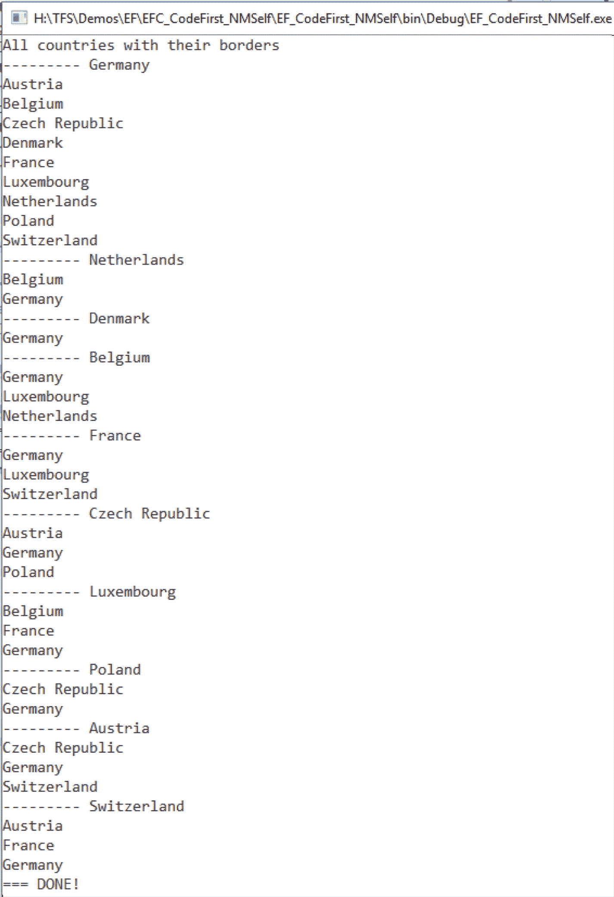

图 A-18

Output of Listing A-29

```cs
using System;
using Microsoft.EntityFrameworkCore;
using System.Linq;

namespace EF_CodeFirst_NMSelf
{
 class Program
 {
  static void Main(string[] args)
  {

   var ctx = new WorldContext();
   ctx.Database.EnsureCreated();

   // Reset example
   ctx.Database.ExecuteSqlCommand("delete from Border");
   ctx.Database.ExecuteSqlCommand("delete from country");

   // Create countries
   var de = new Country();
   de.Name = "Germany";
   ctx.Countries.Add(de);
   ctx.SaveChanges();

   var nl = new Country();
   nl.Name = "Netherlands";
   ctx.Countries.Add(nl);
   nl.AddBorderToCounty(de);
   ctx.SaveChanges();

   var dk = new Country();
   dk.Name = "Denmark";
   ctx.Countries.Add(dk);
   dk.AddBorderToCounty(de);
   ctx.SaveChanges();

   var be = new Country();
   be.Name = "Belgium";
   ctx.Countries.Add(be);
   be.AddBorderToCounty(de);
   be.AddBorderToCounty(nl);
   ctx.SaveChanges();

   var fr = new Country();
   fr.Name = "France";
   ctx.Countries.Add(fr);
   fr.AddBorderToCounty(de);
   ctx.SaveChanges();

   var cz = new Country();
   cz.Name = "Czech Republic";
   ctx.Countries.Add(cz);
   cz.AddBorderToCounty(de);
   ctx.SaveChanges();

   var lu = new Country();
   lu.Name = "Luxembourg";
   ctx.Countries.Add(lu);

   lu.AddBorderToCounty(de);
   lu.AddBorderToCounty(fr);
   lu.AddBorderToCounty(be);
   ctx.SaveChanges();

   var pl = new Country();
   pl.Name = "Poland";
   ctx.Countries.Add(pl);
   pl.AddBorderToCounty(de);
   pl.AddBorderToCounty(cz);
   ctx.SaveChanges();

   var at = new Country();
   at.Name = "Austria";
   ctx.Countries.Add(at);
   at.AddBorderToCounty(de);
   at.AddBorderToCounty(cz);
   ctx.SaveChanges();

   var ch = new Country();
   ch.Name = "Switzerland";
   ctx.Countries.Add(ch);
   ch.AddBorderToCounty(de);
   ch.AddBorderToCounty(fr);
   ch.AddBorderToCounty(at);
   ctx.SaveChanges();

   Console.WriteLine("All countries with their borders");
   foreach (var country in ctx.Countries)
   {
    Console.WriteLine("--------- " + country.Name);

    // now explicitly load the neighboring countries, as Lazy Loading in EFC does not work
    //var borders1 = ctx.Countries.Where(x => x.IncomingBorders.Any(y => y.Country_Id == country.Id)).ToList();
    //var borders2 = ctx.Countries.Where(x => x.OutgoingBorders.Any(y => y.Country_Id1 == country.Id)).ToList();
    //var allborders = borders1.Union(borders2);

    // better: encapsulated in the context class:
    var allborders = ctx.GetNeigbours(country.Id);

    foreach (var neighbour in allborders)
    {
     Console.WriteLine(neighbour.Name);
    }
   }

   Console.WriteLine("=== DONE!");
   Console.ReadLine();
  }
 }
}

Listing A-29Using the Implementation of Listing A-28

```