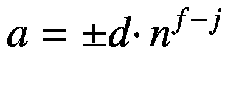
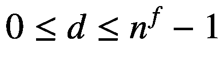
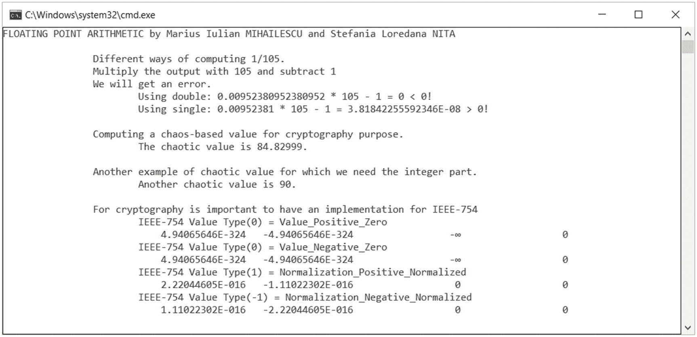

# 四、浮点运算

处理大整数可以被视为一种抽象艺术，如果密码系统没有正确实现，整个密码算法或方案可能会导致真正的灾难。本章重点介绍浮点运算及其对密码学的重要性。

*为什么是浮点运算？*

浮点运算代表了一种特殊形式的运算，我们需要关注它，因为它在密码学领域中的应用，如基于混沌的密码学、同态加密、量子密码术等等。这种类型的算法可以在基于混沌的加密或同态加密中观察到，这将在第 14 和 16 章中介绍。

在使用小实数和非常大的实数的系统中，也可以找到使用浮点数的计算。在他们的计算过程中，过程必须非常快。

浮点变量是一类特殊的变量，可以保存实数，如 4534.0、5.232 或 0.005443。浮动部分意味着小数点会“浮动”

C# 提供不同的浮点数据类型，如`float` *、* `double` *、*、`SByte` *。*正如您从 C++或其他具有整数情况的编程语言中所知，该语言没有为这些类型定义任何大小。在现代体系结构中，大多数浮点表示都遵循二进制表示格式的 IEEE 754 标准。按照这个标准，`float`类型有 4 个字节，`double`有 8 个字节，`long double`有 8 个字节(与`double`相同)，也是 80 位(通过填充我们有 12 个字节或 16 个字节)。

当您处理浮点值时，请确保至少有一个小数。这有助于编译器区分浮点数和整数。以下声明示例显示了如何声明和初始化变量:

```cs
int a = 4;        //** 4 is an integer
double b = 3.0    //** 3.0 represents a floating point (with no
                  //** suffix – double type by default)

```

## 显示浮点数

让我们考虑清单 4-1 中的例子。

```cs
using System;
using System.Collections.Generic;
using System.Linq;
using System.Text;
using System.Threading.Tasks;

namespace CommonFloatNumbers
{
    class Program
    {
        static void Main(string[] args)
        {
            float cryptoKey1 = 5.0f;
            float cryptoKey2 = 6.7f;

            Console.WriteLine(cryptoKey1);
            Console.WriteLine(cryptoKey2);

            Console.ReadKey();

        }
    }
}

Listing 4-1Displaying Common Float Numbers

```

输出如图 4-1 所示。


图 4-1

普通浮点数的输出

通过查看程序的输出，您可以发现在第一种情况下，输出是 5 个字节，但是源代码显示的是 5.0。这是因为小数部分等于 0。在第二种情况下，打印的数字与源代码中的数字相同。在第三种情况下，数字使用科学记数法显示，这是加密算法的重要资产。

## 浮点的范围

让我们来看看 IEEE 754 表示，并考虑以下尺寸及其范围和精度。见表 4-1 。

表 4-1

IEEE 754 标准表示法

<colgroup><col class="tcol1 align-left"> <col class="tcol2 align-left"> <col class="tcol3 align-left"></colgroup> 
| 

大小

 | 

范围

 | 

精确

 |
| --- | --- | --- |
| 4 字节 | 1.18×10<sup>—38</sup>*到* 3.4 × 10 <sup>38</sup> | 6-9 个最重要的数字。通常在 7 位数左右。 |
| 8 字节 | 2.23×10<sup>—308</sup>*到* 1.80 × 10 <sup>308</sup> | 15-18 个最重要的数字。通常在 16 位数左右。 |
| 80 位(通常使用 12 或 16 字节) | 3.36×10<sup>—4932</sup>*到* 1.18 × 10 <sup>4932</sup> | 18-21 个最重要的数字 |
| 16 字节 | 3.36×10<sup>—4932</sup>*到* 1.18 × 10 <sup>4932</sup> | 33-36 位最重要的数字 |

在当今的处理器上，80 位浮点是用 12 或 16 字节实现的。处理器能够管理这种大小是很常见的。

## 浮点精度

让我们考虑下面这个用分数表示的例子:。十进制表示是 0.3333333…无穷大 3 *s* 。

使用一台机器，需要无限的内存来存储无限长的数。这种内存限制会将浮点数的存储限制为特定数量的有效数字。浮点数及其精度将决定在不丢失任何知识的情况下可以表达多少有效数字。如果我们确实在密码学中产生了一个浮点数，清单 4-2 中的例子展示了如何将值截断为六位数。输出见图 4-2 。


图 4-2

浮点精度的输出

```cs
using System;
using System.Collections.Generic;
using System.Linq;
using System.Text;
using System.Threading.Tasks;

namespace FloatingValues
{
    class Program
    {
        static void Main(string[] args)
        {
            float cryptoKey1 = 7.56756767f;
            float cryptoKey2 = 765.657667f;
            float cryptoKey3 = 345543.564f;
            float cryptoKey4 = 9976544.43f;
            float cryptoKey5 = 0.00043534345f;

            Console.WriteLine("cryptoKey1 = " + cryptoKey1);
            Console.WriteLine("cryptoKey2 = " + cryptoKey2);
            Console.WriteLine("cryptoKey3 = " + cryptoKey3);
            Console.WriteLine("cryptoKey4 = " + cryptoKey4);
            Console.WriteLine("cryptoKey5 = " + cryptoKey5);

        }
    }
}

Listing 4-2Representation of Floating Point Precision

```

请注意，上面的每个案例只有六个重要数字。

通常，根据所使用的编译器，指数将在最小位数内填充。指数的位数取决于所使用的编译器，例如 Visual Studio 使用 3，而其他编译器使用 2(使用符合 C99 的指令和标准实现)。表示浮点数的位数及其精度取决于大小和存储的特定值。`float`值的定义精度为 6 和 9 位数字，大多数值至少有 7 位有效数字。`double`值以 15 位和 18 位精度表示。`Long double`值至少由 15 或 33 位有效数字表示，这取决于字节的占用情况。

## 浮点运算的下一级

在第十四章中，我们将介绍一种复杂类型的加密。*同态加密*代表一种特殊类型的加密，被用作保护隐私的专业技术。这项技术将存储和计算外包出去。这种加密方式允许数据被加密并外包给商业(或公共)环境，目的是处理它们。所有这些过程都是在数据加密时发生的。同态加密源自带错误的环学习(见第十五章)，与私有集合交集 [1 ]相关。

继续我们的复杂密码系统之旅，浮点表示法代表了加密/解密机制的热点，它通过寻找适当的方法来近似一个实数，从而支持范围和精度之间的折衷。

如上所述，浮点术语表示数字的小数点可以浮动。总之，它可以设置在数字的重要数字内的任何位置。更具体地说，当我们着眼于复杂的密码体制时，比如同态加密，一个浮点数*一个*可以表示为四个整数，所以在



*n* 为基数， *f* 为指数， *j* 为精度， *d* 为重要或有效位。重要性或有效位 *d* 必须满足以下关系:



从 with.NET 框架 4.0 开始，有一个庞大的浮点操作例程集 [8 ]。从 C# 8.0 开始，这些基本函数用于基于与浮点数相关的简单数学计算来工作和完成任务，这是普通编程和加密(低级和简单的概念)所必需的。对于高级加密算法，该函数的能力和对大浮点数的要求非常有限，并且它们不能为密码学家提供合适的设备。

下面我们将研究 IEEE 处理浮点的标准化和实现函数。与上面已经给出的应用相比，这个应用稍微复杂一些。也就是说，应用的结构包含三个类:`IEEEStandardization.cs`(参见清单 4-3 )、`FloatingPoint.cs`(参见清单 4-4 )和`Program.cs`(参见清单 4-5 )。下面的应用是根据 IEEE 标准开发的，展示了如何以较少的努力实现主要操作。

在清单 4-3 中，我们可以看到处理浮点值时返回的值的主要类型。这些值表示为枚举类型，包含从规范化到反规范化的值、非数字字符和符号值。在清单 4-4 中，我们实现了获取双二进制表示部分的方法、IEEE-754 标准操作的实现以及单精度位转换的方法。在清单 4-5 中，我们将所有的方法合并到一个主程序中，并让它工作，展示了我们如何使用不同的方法来计算浮点值、乘法结果和减法。见图 4-3 。



图 4-3

基于 IEEE 标准化的复杂浮点运算

```cs
using System;
using System.Collections.Generic;
using System.Linq;
using System.Text;
using System.Threading.Tasks;

namespace FloatingPointArithmetic
{
    class Program
    {
        static void Main(string[] args)
        {
            Console.WriteLine("FLOATING POINT ARITHMETIC " +
                "by Marius Iulian MIHAILESCU " +
                "and Stefania Loredana NITA \n");

            Console.WriteLine("\t\tDifferent ways of computing 1/105.");
            Console.WriteLine("\t\tMultiply the output with 105 and subtract 1");
            Console.WriteLine("\t\tWe will get an error.");

            double d = 1 / 105.0;
            float s = 1 / 105.0F;

            Console.WriteLine("\t\t\tUsing double: {0} * " +
                "105 - 1 = {1} < 0!", d, d * 105.0 - 1.0);
            Console.WriteLine("\t\t\tUsing single: {0} * " +
                "105 - 1 = {1} > 0!", s, s * 105.0 - 1.0);
            Console.WriteLine();

            Console.WriteLine("\t\tComputing a chaos-based " +
                "value for cryptography purpose.");
            float chaotic_value = 4.99F * 17;
            Console.WriteLine("\t\t\tThe chaotic value is " +
                "{0}.", chaotic_value);
            Console.WriteLine();

            Console.WriteLine("\t\tAnother example of chaotic " +
                "value for which we need the integer part.");
            int another_chaotic_value = (int)(100 * (1 - 0.1F));
            Console.WriteLine("\t\t\tAnother chaotic value is {0}.",
                another_chaotic_value);
            Console.WriteLine();

            Console.WriteLine("\t\tFor cryptography is " +
                "important to have an implementation " +
                "for IEEE-754");
            double[] double_values = new double[] { 0, -1 /
                Double.PositiveInfinity, 1, -1,
                //Math.PI,
                //Math.Exp(20),
                //Math.Exp(-20),
                //Double.PositiveInfinity,
                //Double.NegativeInfinity,
                //Double.NaN,
                //Double.Epsilon,
                // -Double.Epsilon,
                //10 / Double.MaxValue
            };

            for (int i = 0; i < double_values.Length; i++)
            {
                Console.WriteLine("\t\t\tIEEE-754 Value Type({0}) = {1}",
                    double_values[i],
                    FloatingPoint.Class(double_values[i]));

                Console.WriteLine("\t\t\t{0,19:E8}{1,19:E8}{2,19}{3,19}",
                    FloatingPoint.ComputerNextValue(double_values[i],
                        Double.PositiveInfinity) - double_values[i],

                    FloatingPoint.ComputerNextValue(double_values[i],
                    Double.NegativeInfinity) - double_values[i],

                    FloatingPoint.ComputingLogB(double_values[i]),
                    FloatingPoint.ReuturnSignificantMantissa(double_values[i]));
            }
            Console.ReadLine();
        }
    }
}

Listing 4-5Main Program Implementation

```

```cs
using System;
using System.Collections.Generic;
using System.Linq;
using System.Text;
using System.Threading.Tasks;

namespace FloatingPointArithmetic
{
    public sealed class FloatingPoint
    {
        #region variable and instances
            // the constructor of the class
            private FloatingPoint() { }

            // the value for conversion is 2⁶⁰
            // 2⁶⁰ = 1,152,921,504,606,846,976 (decimal base)
            // 2⁶⁰ = 10 00 00 00 00 00 00 00 (hex bytes)
            // 8 * 2⁶⁰ = 2 * 1,152,921,504,606,846,976 =
            //          = 2,305,843,009,213,693,952
            // we will use "unchecked" for supressing overflow-checking
            // for integral-type arithmetic operations and conversions
            private static readonly double UnfavorableNegativeValue
                = BitConverter.Int64BitsToDouble(unchecked(8 * 0x1000000000000000));

            // constants
            private const Double minimum_double = 4.94065645841247e-324;

            // 0x7FFFFFFFFFFFFFFF = 9,223,372,036,854,775,807 (decimal)
            private const long mask_sign_value = -1 - 0x7FFFFFFFFFFFFFFF;
            private const long clear_mask_sign = 0x7FFFFFFFFFFFFFFF;

            private const long signficand_mask = 0xFFFFFFFFFFFFF;
            private const long clearing_significand_mask = mask_sign_value | significand_exponent_mask;

            private const long significand_exponent_mask = 0x7FF0000000000000;
            private const long clearing_exponent_mask = mask_sign_value | signficand_mask;

            private const int deviation = 1023;
        private const int significant_bits = 52;
        #endregion

        #region Methods for getting parts of a double's binary representation.

            // the method return the significand of double value
            public static long ReuturnSignificantMantissa(double value)
            {
                return BitConverter.DoubleToInt64Bits(value)
                            & signficand_mask;
            }

            // the method will return the signicand
            // for a floating-point number
            public static double ReturnSignficantForFloatingPoint(double value)
            {
                if (Double.IsNaN(value)) return value;

                if (Double.IsInfinity(value)) return value;

                // computing the exponent using the deviation
                int exponentValue = ComputeDeviationExponent(value);
                long significand = ReuturnSignificantMantissa(value);

                // number 0 and denormalization
                // values has to be treated separetely
                if (exponentValue == 0)
                {
                    // if the significand is equal
                    // with we will return 0
                    if (significand == 0)
                        return 0.0;

                    // otherwise we will shit the significand to the left
                    // until significand will be 53 bits long
                    while (significand < signficand_mask)
                        significand <<= 1;

                        // truncate the leading bit
                        significand &= signficand_mask;
                }
                return BitConverter.Int64BitsToDouble
                    ((deviation << 52) + significand);
            }

            // The function will return a non-deviation
            // exponent for a floating-point value.
            // The non-deviation is computed through
            // substracting the deviation from deviated exponent.
            public static int NonDeviationExponent(double value)
            {
                return (int)((BitConverter.DoubleToInt64Bits(value)
                    & significand_exponent_mask) >> 52) - deviation;
            }

            // The function will return the
            // deviation exponnent for a
            // floating-point value.
            // The returned value is obtained
            // and computed directly from
            // and within binary representation of "value"
            public static int ComputeDeviationExponent(double value)
            {
                return (int)((BitConverter.DoubleToInt64Bits(value)
                    & significand_exponent_mask) >> 52);
            }

            // The function returns the bit sign
            // of a value. The bit sign is obtained
            // directly from the binary representation
            // of the value
            public static int SignBit(double value)
            {
                return ((BitConverter.DoubleToInt64Bits(value)
                    & mask_sign_value) != 0) ? 1 : 0;
            }
        #endregion

        #region Below contains the implementation of the IEEE-754

            // The class represents the implementation
            // of IEEE-754 floating-point
            // References:
            // https://www.geeksforgeeks.org/ieee-standard-754-floating-point-numbers/
            public static IEEEStandardization Class
                (double value)
            {
                long bits_value_representation =
                    BitConverter.DoubleToInt64Bits(value);

                bool positive_value = (bits_value_representation >= 0);

                bits_value_representation =
                    bits_value_representation & clear_mask_sign;

                // case when we have a overflow
                // for Not-A-Number
                if (bits_value_representation
                    >= 0x7ff0000000000000)
                {
                    // this is case of infinity
                    if ((bits_value_representation
                        & signficand_mask) == 0)
                    {
                        if (positive_value)
                            return IEEEStandardization.
                                Value_Positive_Infinity;
                        else
                            return IEEEStandardization.
                                Value_Negative_Infinity;
                    }
                    else

                    {
                        if ((bits_value_representation
                            & signficand_mask)
                            < 0x8000000000000)
                            return IEEEStandardization.
                                Quiet_Not_a_Number;
                        else
                            return IEEEStandardization.
                                Signaling_Not_a_Number;
                    }
                }
                // this is happening when we have
                // 0 or a denormalization value
                else if (bits_value_representation
                    < 0x0010000000000000)
                {
                    if (bits_value_representation == 0)
                    {
                        if (positive_value)
                            return IEEEStandardization.
                                Value_Positive_Zero;
                        else
                            return IEEEStandardization.
                                Value_Negative_Zero;
                    }
                    else
                    {
                        if (positive_value)
                            return IEEEStandardization.
                                Denormalization_Positive_Denormalized;
                        else
                            return IEEEStandardization.
                                Denormalization_Negative_Denormalized;
                    }
                }
                else
                {
                    if (positive_value)
                        return IEEEStandardization.
                            Normalization_Positive_Normalized;
                    else
                        return IEEEStandardization.
                            Normalization_Negative_Normalized;
                }
            }

            // The function copy the
            // sign of the number.
            // theSizeOfTheValue parameter
            //        the number for
            //        which we copy the sign
            // theValueOfTheSign parameter
            //        the value of the number
            //        for which we do the copy
            public static double CopyProcedureForSign
                    (double theSizeOfTheValue,
                     double theValueOfTheSign)
            {
                // we do a bit manipulation
                // do the copying process for
                //* the first bit for theSizeOfTheValue
                // and theValueOfTheSign
                return BitConverter.Int64BitsToDouble(
                    (BitConverter.DoubleToInt64Bits
                        (theSizeOfTheValue) &
                            clear_mask_sign)
                    | (BitConverter.DoubleToInt64Bits
                        (theValueOfTheSign) &
                            mask_sign_value));
            }

            // a boolean function to
            // check if the value is
            // finite or not
            public bool CheckIfIsFinite(double value)
            {
            // Verify the part represented by the exponent.
            // if all the bits are 1, then we
            // are dealing with a infinity (not-a-number).
                long bits = BitConverter.
                    DoubleToInt64Bits(value);
                return ((bits & significand_exponent_mask)
                    == significand_exponent_mask);
            }

            // The function will return the
            // non-biased exponent for a value.
            public static double ComputingLogB(double value)
            {
                // Let's deal with the
                // important situations.
                if (double.IsNaN(value))
                    return value;
                if (double.IsInfinity(value))
                    return double.PositiveInfinity;
                if (value == 0)
                    return double.NegativeInfinity;

                int exponentDeviationValue =
                    ComputeDeviationExponent(value);

                // if we dealing with a denormalization value
                // we need to take the right action
                if (exponentDeviationValue == 0)
                {
                    exponentDeviationValue = -1074;

                    // compute the signficand with no sign
                    long bits = BitConverter.
                        DoubleToInt64Bits(value) & clear_mask_sign;

                    // we move on if we finish dealing with situations
                    // when bits = 0
                    do
                    {
                        bits >>= 1;
                        exponentDeviationValue++;
                    }
                    while (bits > 0);
                    return exponentDeviationValue;
                }

                // exponentDeviationValue was significand,
                // proceed with subtraction the deviation
                // to obtain and compute the non-deviation exponent
                return exponentDeviationValue - deviation;
            }

            // Compute the floating-point
            // number for the next number.
            // 'from' parameter
            //        - represent the starting point
            // 'to' parameter
            //        - represent a value that shows
            //          the direction in which we will
            //          move in order to identity
            //          the next value
            public static double
                ComputerNextValue(double from, double to)
            {
                // If 'to' is equal with from
                // there is no direction to move in,
                // so we will compute and get 'from' value
                if (from == to)
                    return from;

                // if not-a-number occur will
                // be returned by themselves
                if (double.IsNaN(from))
                    return from;
                if (double.IsNaN(to))
                    return to;

                // an infinity will be an infinity all time
                if (double.IsInfinity(from))
                    return from;

                // deal with 0 situation
                if (from == 0)
                    return (to > 0) ?
                        minimum_double : -minimum_double;

                // For the rest of the
                // situation we are dealing.
                // With incrementation or
                // decrementation the bits value.
                // Values for transitions to infinity,
                // denormalized values, and to zero are
                // managed in this way.
                long bits_value = BitConverter.DoubleToInt64Bits(from);

                // A xor here avoids nesting conditionals. We have to increment if
                // fromValue lies between 0 and toValue.

                // XOR operation will help us to
                // not taken into consideration
                // conditionals.
                if ((from > 0) ^ (from > to))
                    bits_value++;
                else
                    bits_value--;
                return BitConverter.
                    Int64BitsToDouble(bits_value);
            }

            // the function compute and return
            // a value that is powered with 2
            public static double Scalb(double number,
                                       int exponent)
            {
                // Treat special cases first.
                if (number == 0 ||
                            double.IsInfinity(number) ||
                            double.IsNaN(number))
                    return number;

                if (exponent == 0)
                    return number;

                int computedExponentValue = ComputeDeviationExponent(number);
                long significand = ReuturnSignificantMantissa(number);
                long getting_sign = ((number > 0) ? 0 : mask_sign_value);

                // check if 'number' is denormalized
                if (computedExponentValue == 0)
                {
                    if (exponent < 0)
                    {
                        // an exponent that is negative
                        // we will shift the significand
                        // -exponent bits to the right
                        significand >>= -exponent;
                        return BitConverter.
                            Int64BitsToDouble(getting_sign | significand);
                    }
                    else

                    {
                        // a number that is positive is
                        // necessary to be shifted on left
                        // and this will be done until a
                        // normalized number is obtained
                        while (significand <= signficand_mask
                            && exponent > 0)
                        {
                            significand <<= 1;
                            exponent--;
                        }

                        if (significand > signficand_mask)
                            exponent++;

                        // test if we have a overflow
                        if (exponent > 2 * deviation)
                            return (number > 0) ?
                                double.PositiveInfinity
                                : double.NegativeInfinity;

                        // the number represents the
                        // significand exponent for the result
                        return BitConverter.Int64BitsToDouble(getting_sign
                            | ((long)exponent << 52) |
                                (significand & signficand_mask));
                    }
                }

                // Once we are reaching here,
                // we are aware that 'exoponent'
                // is normalized.
                // Proceeding with scaling. 'exponent'
                // will be the significand exponent for the result
                computedExponentValue =
                    computedExponentValue + exponent;

                // verify if we have 0 or denormalization
                if (computedExponentValue < 0)
                {
                    significand = ((1L << 52) +
                        significand) >> (1 -
                            computedExponentValue);

                    return BitConverter.
                        Int64BitsToDouble(getting_sign | significand);
                }

                // Veirfy if we have an overflow
                if (computedExponentValue >
                    2 * deviation)
                    return (number > 0) ?
                        double.PositiveInfinity :
                        double.NegativeInfinity;

                // If we're here, the result is normalized.
                long bits = getting_sign |
                    ((long)computedExponentValue << 52) | significand;

                return BitConverter.Int64BitsToDouble(bits);
            }

            // the function computes a value
            // wich will point out if the two
            // values are unordered
            public static bool Unordered(double value1, double value2)
            {
                return double.IsNaN(value1) || double.IsNaN(value2);
            }
        #endregion

        #region Methods for conversion bit with single-precision
            public static unsafe int ConversionSingleToInt32Bits(float val)
            {
                return *((int*)&val);
            }

            public static unsafe float ConversionInt32BitsToSingle(int val)
            {
                return *((float*)&val);
            }
        #endregion
    }
}

Listing 4-4Floating Point Implementation

```

```cs
using System;
using System.Collections.Generic;
using System.Linq;
using System.Text;
using System.Threading.Tasks;

namespace FloatingPointArithmetic
{
    public enum IEEEStandardization
    {
        // the value is a signaling NaN - not a number
        Signaling_Not_a_Number,

        // the value is represented by a quiet
        // NaN - not a number and non-signaling
        Quiet_Not_a_Number,

        // the value represents a positive infinity
        Value_Positive_Infinity,

        // the value represents a negative infinity
        Value_Negative_Infinity,

        // The value represents a normal and positive number
        Normalization_Positive_Normalized,

        // The value represents a normal and negative number
        Normalization_Negative_Normalized,

        // A denormalized positive number
        Denormalization_Positive_Denormalized,

        // The value is a denormalized negative number
        Denormalization_Negative_Denormalized,

        // The value represents a positive zero
        Value_Positive_Zero,

        // the value represents a negative zero
        Value_Negative_Zero
    }
}

Listing 4-3IEEE Standardization Implementation

```

## 结论

在这一章中，我们讨论了浮点数的一般表示，以及如何在复杂的密码系统中实现它们。我们分析了最重要的术语和基本概念，专业人员在计划建立一个开发复杂密码系统的环境时应该了解这些概念。

我们还证明了浮点运算在复杂密码系统中的重要性，如同态加密、基于混沌的密码、基于格的密码或带错误的环学习。

## 文献学

1.  H.来自同态加密的快速私有集合交集。*2017 年 ACM SIGSAC 计算机与通信安全会议 CCS '17 论文集*，2017。

2.  长度 Ducas 和 D. Micciancio，“FHEW:在不到一秒的时间内引导同态加密”，载于*密码学进展-Eurocrypt 2015*，第 617-640 页，施普林格，柏林，德国，2015 年。

3.  南 Halevi 和 V. Shoup，“HElib 中的算法”，载于*Crypto*14，第 8616 卷，施普林格，海德堡，德国，2014 年。

4.  J.坎波斯、p .夏尔马、e .詹图宁、d .巴格利和 l .福马加利，“保护高级维护开发所需数据的网络安全框架的挑战”，载于*《CIRP 进程报*，第 47 卷，第 227 页，2016 年。

5.  c .燃烧物品和 j .Ziegler，“Fast Recursive Division”，in*researchreport max-Planck 计算机科学研究所 report MPI-I-98-1-022*，max-Planck-Instituto für informatique，sahabrüber，Germany，1998 年。

6.  名词（noun 的缩写）Dowlin，R. Gilad-Bachrach，K. Laine，K. Lauter，M. Naehrig 和 J. Wernsing，“使用同态加密进行生物信息学的手册”，载于 IEEE 会议录*，第 105 卷，第 3 期，2017 年。*

7.  J.H. Cheon、A. Kim、M. Kim 和 Y. Song，“近似数算术的同态加密”，载于《密码学与信息安全的理论和应用国际会议(ASIA-CRYPT'17)会议录(T1)，第 409-437 页，中国香港，2017 年 12 月。

8.  浮点支持。网上有: [`https://docs.microsoft.com/en-us/cpp/c-runtime-library/floating-point-support?view=vs-2019`](https://docs.microsoft.com/en-us/cpp/c-runtime-library/floating-point-support%253Fview%253Dvs-2019) 。