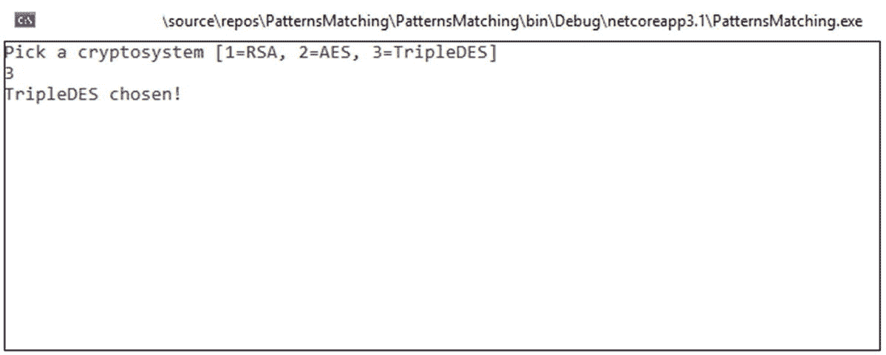
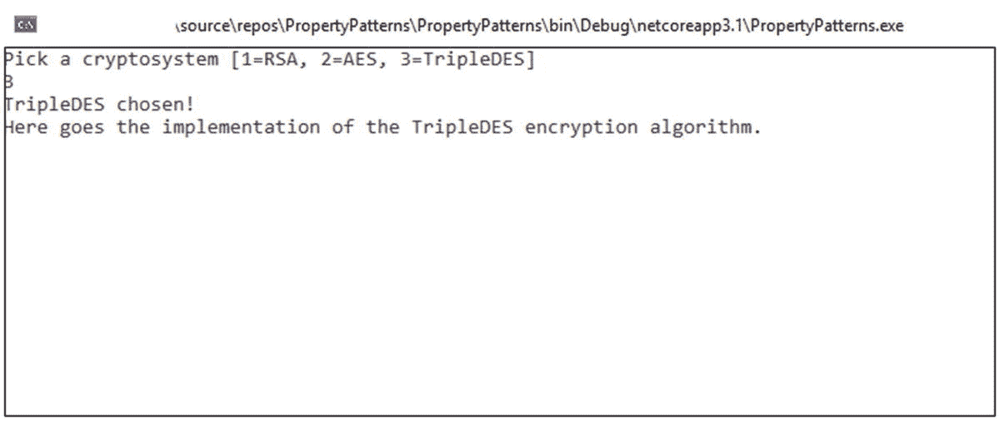
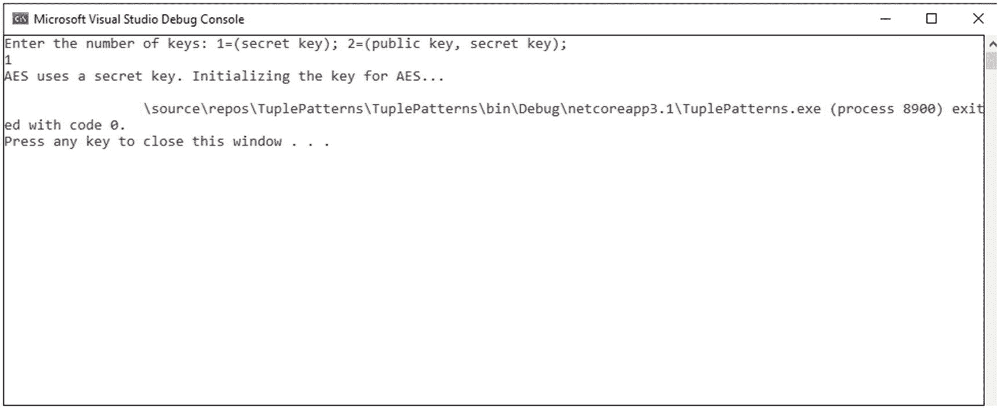
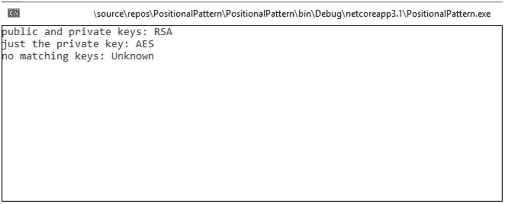
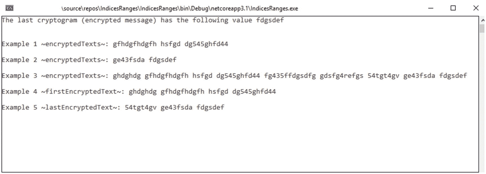
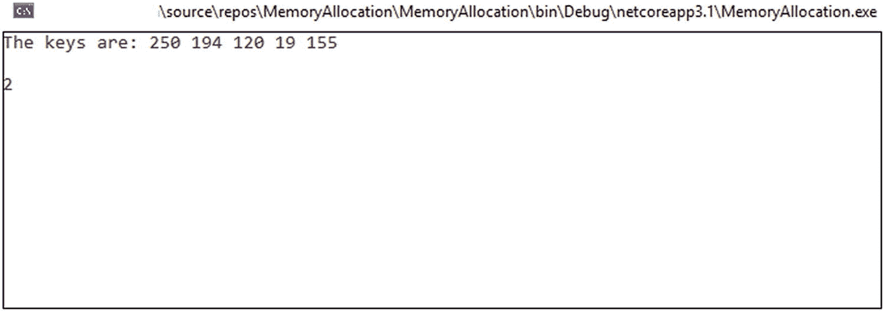

# 五、C# 8.0 的新特性

本章将为密码学和密码分析领域的专业人士讲述 C# 8.0 最重要的特性。有关哪个版本的 C# 用于不同版本的 .NET 框架和 .NET Core，我们推荐 [3 ]的资源。

C# 8.0 对 C# 语言进行了许多改进和增强，其中一些可以成功地用于提高加密和密码分析算法以及安全方案的实现过程的性能。上支持 C# 8.0。网芯 3。x 和。网络标准 2.1。关于 C# 语言版本控制的更多细节可以在这里找到 [1 。这些增强功能包括

*   只读成员

*   默认接口方法

*   模式匹配的改进:开关表达式、属性模式、元组模式、位置模式

*   使用声明

*   静态局部函数

*   一次性参考支柱

*   可为空的引用类型

*   异步流

*   异步一次性

*   指数和范围

*   零合并赋值

*   非托管构造类型

*   嵌套表达式中的 Stackalloc

*   插值逐字字符串的增强

如前所述，本章将描述有助于专业人员提高加密解决方案质量和性能的特性。要探索环境中 C# 8.0 提供的特性的更多细节，建议使用`dotnet try`工具。要深入探索这些功能，可以成功使用以下解决方案和步骤:

*   访问 [`https://github.com/dotnet/try/blob/master/README.md#setup`](https://github.com/dotnet/try/blob/master/README.md%2523setup) ，下载安装`dotnet try`工具。

*   克隆`dotnet/try-samples`存储库。可在 [`https://github.com/dotnet/try-samples`](https://github.com/dotnet/try-samples) 访问。

*   配置并设置当前目录到`the try-samples`存储库的`csharp8`子目录的路径。

*   调用并运行`dotnet try.`

以下部分将涵盖显著提高加密应用的质量和性能的增强功能。

## 只读成员

新的 readonly 修饰符可以应用于结构的成员。当我们不希望成员的状态被修改时，使用 readonly。我们将通过对成员应用 readonly 而不是 struct 声明来展示更细粒度的表示。

让我们考虑清单 5-1 中的例子，其中我们实现了一个处理 RSA 密码系统的结构。

```cs
using System;
using System.Collections.Generic;
using System.Linq;
using System.Text;
using System.Threading.Tasks;

namespace Listing_5_1___ReadOnlyMembers
{
    class Program
    {
        public int cryptoKey1;

        //** initializing and dealing with
        public readonly int cryptoKey2 = 25;
        public readonly int cryptoKey3;

        public Program()
        {
            // Initialize a readonly instance field
            cryptoKey3 = 24;
        }

        public Program(int value1, int value2, int value3)
        {
            cryptoKey1 = value1;
            cryptoKey2 = value2;
            cryptoKey3 = value3;
        }

        public static void Main()

        {
            Program cryptoProgram1 = new Program(13, 27, 39);
            Console.WriteLine($"Crypto Program 1: crypto_key 1={cryptoProgram1.cryptoKey1}, crypto_key 2={cryptoProgram1.cryptoKey2}, crypto_key 3={cryptoProgram1.cryptoKey3}");

            Program cryptoProgram2 = new Program();
            cryptoProgram2.cryptoKey1 = 55;
            Console.WriteLine($"Crypto Program 2: crypto_key 1={cryptoProgram2.cryptoKey1}, crypto_key 2={cryptoProgram2.cryptoKey2}, crypto_key 3={cryptoProgram2.cryptoKey3}");

            Console.ReadKey();
        }
    }
}

Listing 5-1Applying Readonly for a Cryptographic Purpose

```

与大多数结构一样，`ToString()`方法不会更新或修改状态。我们可以通过将`readonly`放在`override`关键字的前面来指定发生这种情况(见图 5-1 )。


图 5-1

使用 readonly 关键字的输出示例

## 模式匹配

在加密模式匹配中，技术可以用在不同的地方，例如解析密码要求、字符串和加密密钥预期。

从 C# 8.0 开始，可以在代码的不同位置使用和实现更多的模式表达式。C# 8.0 的另一个重要增强是*递归模式*，一个可以在另一个模式表达式结果的输出上使用的模式表达式。让我们考虑清单 5-2 中的例子，我们使用一个`enum`结构来列出加密算法。

```cs
public enum CryptoType
{
    RSA,
    AES,
    TripleDES,
}

Listing 5-2Using an enum struct

```

如果正在开发的应用包含`CryptographicAlgorithm`类型的定义，则它是由加密组件(例如加密、解密、计算私钥、计算公钥等)构建的。)，所以我们可以使用清单 5-3 中的例子，用一条`switch`指令将一个`CryptographicAlgorithm`值转换成`CryptoType`值。

```cs
public static CryptographicAlgorithm
      GetCryptoAlgorithm(CryptographicAlgorithm crypto)
{
   return crypto.cryptosystemType switch
   {
      CryptoType.RSA => new RSA(),
      CryptoType.AES => new AES(),
      CryptoType.TripleDES => new TripleDES(),
      _ => throw new ArgumentException(message: "There is no
                 such cryptographic algorithm ",
                 paramName: nameof(crypto.cryptosystemType))
   };
}

Listing 5-3Using a switch Expression

```

清单 5-4 给出了一个完整的例子。该列表的结果如图 5-2 所示。



图 5-2

清单 5-4 中代码的结果

```cs
using System;

namespace PatternsMatching
{
    class Program
    {
        static void Main(string[] args)
        {
            CryptographicAlgorithm cryptoAlg =
                      new CryptographicAlgorithm();
            Console.WriteLine("Pick a cryptosystem [1=RSA,
                                 2=AES, 3=TripleDES]");

            string type = Console.ReadLine();
            CryptoType ct = type switch
            {
                "1" => CryptoType.RSA,
                "2" => CryptoType.AES,
                "3" => CryptoType.TripleDES,
                _ => throw new ArgumentException(message:
                      "There is no such option ",
                      paramName: nameof(type))
            };

            try
            {
                cryptoAlg.cryptosystemType = ct;
                GetCryptoAlgorithm(cryptoAlg);

                Console.ReadKey();
            }
            catch(Exception ex)
            {
                Console.WriteLine(ex.Message);
            }
        }

        public static CryptographicAlgorithm
              GetCryptoAlgorithm(
                      CryptographicAlgorithm crypto)
        {
            return crypto.cryptosystemType switch
            {
                CryptoType.RSA => new RSA(),
                CryptoType.AES => new AES(),
                CryptoType.TripleDES => new TripleDES(),
                _ => throw new ArgumentException(message:
                      "There is no such cryptographic algorithm ",
                       paramName: nameof(crypto.cryptosystemType))
            };
        }
    }
    public enum CryptoType
    {
        RSA,
        AES,
        TripleDES,
    }

    public class CryptographicAlgorithm
    {
        internal CryptoType cryptosystemType;
        public CryptographicAlgorithm()
        {

        }
    }

    class RSA : CryptographicAlgorithm
    {
        public RSA()
        {
            Console.WriteLine("RSA chosen!");
        }
    }

    class AES : CryptographicAlgorithm
    {
        public AES()
        {
            Console.WriteLine("AES chosen!");
        }
    }

    class TripleDES : CryptographicAlgorithm
    {
        public TripleDES()
        {
            Console.WriteLine("TripleDES chosen!");
        }
    }
}

Listing 5-4Chosing an Encryption System Based on switch Expressions

```

## 模式

### 属性模式

使用*属性模式*的新特性让专业人员能够匹配属于对象的属性。让我们考虑一个电子学习平台作为例子(见清单 5-5 )。我们需要基于`CryptographicAlgorithm`对象的`cryptosystemType`属性，使用特定的加密算法对消息进行加密。请注意，这些部分中的示例仅用于演示。

```cs
public static int Encrypt(CryptographicAlgorithm crypto, Parameters parameters, int message)
{
    return crypto switch
    {
      { cryptosystemType: CryptoType.RSA } => (new RSA()).
Encrypt(parameters.n, parameters.e, message),
      { cryptosystemType: CryptoType.AES } => (new AES()).
                Encrypt(parameters.key, message),
      { cryptosystemType: CryptoType.TripleDES } => (new
             TripleDES().Encrypt(parameters.k1, parameters.k2,
                            parameters.k3, message)),
     _ => throw new ArgumentException(message: "There is no
                           such cryptographic algorithm ",
                           paramName:
                             nameof(crypto.cryptosystemType))
     };
  }

Listing 5-5Using Property Patterns

```

清单 5-6 中给出了完整的代码，输出如图 5-3 所示。



图 5-3

清单 5-6 中代码的结果

```cs
using System;

namespace PropertyPatterns
{
    class Program
    {
        static void Main(string[] args)
        {
            CryptographicAlgorithm cryptoAlg = new
                          CryptographicAlgorithm();
            Console.WriteLine("Pick a cryptosystem [1=RSA,
                              2=AES, 3=TripleDES]");

            string type = Console.ReadLine();
            CryptoType ct = type switch
            {
                "1" => CryptoType.RSA,
                "2" => CryptoType.AES,
                "3" => CryptoType.TripleDES,
                _ => throw new ArgumentException(message:
                     "There is no such option ",
                      paramName: nameof(type))
            };

            //** the parameters should be initialized
            Parameters parameters = new Parameters();
            //** the message that needs to be encrypted
            int message = 0;
            try
            {
                cryptoAlg.cryptosystemType = ct;
                Encrypt(cryptoAlg, parameters, message);
                Console.ReadKey();
            }
            catch (Exception ex)
            {
                Console.WriteLine(ex.Message);
            }
        }

        public static int Encrypt(
                     CryptographicAlgorithm  crypto,
                     Parameters parameters,
                     int message)
        {
            return crypto switch
            {
                { cryptosystemType: CryptoType.RSA } => (new
                        RSA()).Encrypt(parameters.n,
                                       parameters.e,
                                       message),
                { cryptosystemType: CryptoType.AES } => (new
                        AES()).Encrypt(parameters.key,
                                       message),
                { cryptosystemType: CryptoType.TripleDES } =>
                       (new TripleDES().Encrypt(parameters.k1,
                                            parameters.k2,
                                            parameters.k3,
                                            message)),
                _ => throw new ArgumentException(message:
                          "There is no such cryptographic
                           algorithm ",
                           paramName:
                             nameof(crypto.cryptosystemType))
            };
        }
    }
    public enum CryptoType
    { RSA, AES, TripleDES, }

    public class Parameters
    {
        public Parameters() { }
        internal int n, e, k1, k2, k3;
        internal int[,] key;
    }

    public class CryptographicAlgorithm
    {
        internal CryptoType cryptosystemType;
        public CryptographicAlgorithm() { }
        public int Encrypt()
        {
            return 0;
        }
    }

    class RSA : CryptographicAlgorithm
    {
        public RSA()
        {
            Console.WriteLine("RSA chosen!");
        }

        public int Encrypt(int n, int e, int message)
        {
            Console.WriteLine("Here goes the implementation of
                           the RSA encryption algorithm.");
            return 0;
        }

    }

    class AES : CryptographicAlgorithm
    {
        public AES()
        {
            Console.WriteLine("AES chosen!");
        }
        public int Encrypt(int[,] key, int message)
        {
            Console.WriteLine("Here goes the implementation of
                              the AES encryption algorithm.");
            return 0;
        }
    }

    class TripleDES : CryptographicAlgorithm
    {
        public TripleDES()
        {
            Console.WriteLine("TripleDES chosen!");
        }
        public int Encrypt(int k1, int k2, int k3,
                           int message)
        {
            Console.WriteLine("Here goes the implementation of
                       the TripleDES encryption algorithm.");
            return 0;
        }
    }
}

Listing 5-6Demonstration of Using Property Patterns

```

### 多重模式

一些加密算法(例如 RSA 或可搜索的加密方案)依赖于各种输入。使用*元组模式*给了我们在用元组表示的多个值之间切换的可能性。清单 5-7 中的代码说明了如何使用开关表达式在不同的加密算法之间进行切换。

在本例中，您可以根据密钥的数量选择加密系统:一个密钥用于加密和解密，或者一对密钥(用于加密的公钥和用于解密的密钥)。列表 5-7 的结果如图 5-4 所示。



图 5-4

列表结果 5-7

```cs
using System;

namespace TuplePatterns
{
    class Program
    {
        static void Main(string[] args)
        {
            CryptographicAlgorithm cryptoAlg =
                           new CryptographicAlgorithm();
            Console.WriteLine("Enter the number of keys:
                         1=(secret key);
                         2=(public key, secret key); ");

            string noOfKeys = Console.ReadLine();

            try
            {
                Console.WriteLine(noOfKeys switch
                {
                    "1" => InitializingAlgKeys(cryptoAlg,
                                                 false, true),
                    "2" => InitializingAlgKeys(cryptoAlg,
                                                  true, true),
                    _ => throw new ArgumentException(message:
                                  "There is no such option ")
                });

            }
            catch (Exception ex)
            {
                Console.WriteLine(ex.Message);
            }
        }

        public static string InitializingAlgKeys
                     (CryptographicAlgorithm crypto,
                         bool publicKey,
                         bool secretKey)
        {
            return (publicKey, secretKey) switch
            {
                (true, true) => (new RSA()).InitializeKeys(),
                (false, true) => (new AES()).InitializeKeys(),
                _ => throw new ArgumentException(message:
                                 "There is no such option. ")
            };
        }
    }

    public class CryptographicAlgorithm
    {
        public CryptographicAlgorithm() { }
        public string InitializeKeys()
        {
            return "";
        }
    }

    class RSA : CryptographicAlgorithm
    {
        public string InitializeKeys(int publicKey = -1,
                                     int secretKey = -1)
        {
            return "RSA uses a public key and a secret key.
                    Initializing the keys for RSA...";
        }
    }

    class AES : CryptographicAlgorithm
    {
        public string InitializeKeys(int secretKey = -1)
        {
            return "AES uses a secret key.
                   Initializing the  key for AES...";
        }
    }
}

Listing 5-7Using Tupple Patterns

```

### 位置模式

一些应用和实现使用了`Deconstruct`方法。此方法的目的是将属性解构为离散变量。要使用位置模式，`Deconstruct`方法应该是可访问的，这样我们将能够查看特征对象的属性，并使用这些属性来生成模式。清单 5-8 显示了`CryptoAlgorithms`类，它包括一个`Deconstruct`方法，以便为`prvKey`(私钥)和`pubKey`(公钥)创建一个离散变量。清单 5-8 中的代码展示了位置模式在密码学领域的应用。结果如图 5-5 所示。



图 5-5

列表结果 5-8

```cs
using System;

namespace PositionalPattern
{
    class Program
    {
        static void Main(string[] args)
        {
            KeysAdministration k1 = new
               KeysAdministration("This is the private key",
                                 "This is the public key");
            KeysAdministration k2 = new
                 KeysAdministration("This is the private key", null);
            KeysAdministration k3 = new
               KeysAdministration(null, "This is the public key");

            CryptographicAlgorithm cryptoAlg;

            cryptoAlg = GetAlgorithmType(k1);
            Console.WriteLine("public and private keys: " +
                              cryptoAlg.ToString());
            cryptoAlg = GetAlgorithmType(k2);
            Console.WriteLine("just the private key: " +
                              cryptoAlg.ToString());
            cryptoAlg = GetAlgorithmType(k3);
            Console.WriteLine("no matching keys: " +
                              cryptoAlg.ToString());

            Console.ReadKey();

        }
        static CryptographicAlgorithm
               GetAlgorithmType(KeysAdministration keys)
               => keys switch
        {
            var (privKey, pubKey) when
                   !string.IsNullOrEmpty(privKey) &&
                   !string.IsNullOrEmpty(pubKey)
                       => CryptographicAlgorithm.RSA,
            var (privKey, pubKey) when
                   !string.IsNullOrEmpty(privKey) &&
                   string.IsNullOrEmpty(pubKey)
                     => CryptographicAlgorithm.AES,
            _ => CryptographicAlgorithm.Unknown
        };
    }

    public enum CryptographicAlgorithm
    {
        Unknown,
        RSA,
        AES,
    }

    public class KeysAdministration
    {
        public string prvKey { get; }
        public string pubKey { get; }

        public KeysAdministration(string PrivateKey,
                                  string PublicKey)
                => (prvKey, pubKey) = (PrivateKey, PublicKey);
        public void Deconstruct(out string PrivateKey,
                                out string PublicKey)
                => (PrivateKey, PublicKey) = (prvKey, pubKey);
    }
}

Listing 5-8Positional Patterns

```

## 使用声明

使用声明表示一种在变量(或其类型)前面有`using`关键字的变量声明。例如，让我们考虑清单 5-9 中的例子，它将消息的加密写入文件。输出如图 5-6 所示。


图 5-6

列表结果 5-9

```cs
using System;
using System.Collections.Generic;
using System.Linq;

namespace Declarations
{
    class Program
    {
        static void Main(string[] args)
        {
            List<string> encryptedMessageLines = new
                                     List<string>();

            encryptedMessageLines.Add("Option 1 key:
                                  sdkjegiorjgvldmgkA64");
            encryptedMessageLines.Add("This is the message to
                    be encrypted: This is an example of using
                    declarations in C# 8.0.");
            encryptedMessageLines.Add("Option 2 key:
                                  l$klj4grg565j");

            Console.Write("The number of lines skipped: ");
            Console.WriteLine(WriteEncryptedMessages(
               encryptedMessageLines.AsEnumerable<string>())
                                    .ToString());

            Console.ReadKey();
        }

        static int WriteEncryptedMessages(IEnumerable<string>
                                        encryptedMessageLines)
        {
            using var fileWithEncryption = new
             System.IO.StreamWriter("Message.txt");

            //** A note to be done on how we will declare
            //** lines_to_be_skipped after the using
            //** statement.

            int lines_to_be_skipped = 0;

            foreach (string lineMessage in
                     encryptedMessageLines)
            {
                if (!lineMessage.Contains("key"))
                {
                    fileWithEncryption.WriteLine(lineMessage);
                }
                else
                {
                    lines_to_be_skipped++;
                }
            }
            //** Notice how the skipped lines
            //** are the main subject here

            return lines_to_be_skipped;

            //** the file will be disposed once
            //** the compiler reached here
        }
    }
}

Listing 5-9Using Declarations

```

在图 5-6 中，我们获得了两行，因为列表`encryptedMessageLines`有两行包含这行代码中提到的字符串`key`:

`if (!lineMessage.Contains("key")) from the` `WriteEncryptedMessages method`

为了检查从`encryptedMessageLines`开始的两行是否确实被跳过，看一下图 5-7 ，它显示了文本被写入的`Message.txt`文件的内容。如果没有指定完整路径，那么这个文件可以在项目的`bin > Debug > netcoreapp3.1`文件夹中找到(如果项目使用的是。网芯 3.1；否则路径是相似的)。


图 5-7

清单 5-9 中使用的文件内容

## 指数和范围

*索引*和*范围*为访问序列中的单个元素或范围提供了简短而精确的语法。

*   C# 8.0 提供了对两种新类型和操作符的支持，比如`System.Index`被定义为序列中的索引。

*   操作符`^`末尾的索引指定一个索引在序列的末尾是相对的。

*   `System.Range`定义一个已声明序列的子范围。

*   用于范围的运算符`…`，指定操作数范围内的开始和结束。

在清单 5-10 中，我们考虑一个从开始到结束都有索引的数组。

```cs
var cryptograms = new string[]
{
                       // beginning index     ending index
    "ghdghdg",         // 0                   ⁹
    "gfhdgfhdgfh",     // 1                   ⁸
    "hsfgd",           // 2                   ⁷
    "dg545ghfd44",     // 3                   ⁶
    "fg435ffdgsdfg",   // 4                   ⁵
    "gdsfg4refgs",     // 5                   ⁴
    "54tgt4gv",        // 6                   ³
    "ge43fsda",        // 7                   ²
    "fdgsdef"          // 8                   ¹
};

Listing 5-10Working with Indexes

```

如您所见，您可以返回`¹`索引，如下例所示，列出了 5-11 。

```cs
//** this will return the cryptogram value "fdgsdef"
Console.WriteLine($"The last cryptogram (encrypted message) has
                        the following value {cryptograms[¹]}");

Listing 5-11Returning ¹ Index

```

在清单 5-12 中，我们用密码`"gfhdgfhdgfh," "hsfgd,"`和`"dg545ghfd44."`创建了一个子范围，这包括`cryptograms[1]`到`cryptograms[3]`。注意，`element cryptograms[4]`不在这个范围内。

```cs
var encryptedTexts = cryptograms[1..4];

Listing 5-12Creating Subranges

```

在清单 5-13 中，我们使用密码`"ge43fsda"`和`"fdgsdef."`创建了一个子范围，这将包括`cryptograms[²]`和`cryptograms[¹]`。注意，这个指数是`cryptograms[⁰]`。

```cs
var encryptedTexts = cryptograms[²..⁰];

Listing 5-13Another Subrange

```

在清单 5-14 中，我们为开始、结束或者在某些情况下为两者创建了一个在结束时开放的范围。

```cs
//** contains "ghdghdg" through "fdgsdef".
var encryptedTexts = cryptograms[..];

//** contains "ghdghdg" through "dg545ghfd44"
var firstEncryptedText = cryptograms[..4];

//** contains "ghdghdg", "ge43fsda" and "fdgsdef"
var lastEncryptedText = cryptograms[6..];

Listing 5-14Open Range

```

将所有这些放在一起，我们得到了清单 5-15 中的代码，结果如图 5-8 所示。



图 5-8

指数和范围输出

```cs
using System;

namespace IndicesRanges
{
    class Program
    {
        static void Main(string[] args)
        {
            var cryptograms = new string[]
            {
                                    // beginning index     ending index
                "ghdghdg",          // 0                   ⁹
                "gfhdgfhdgfh",      // 1                   ⁸
                "hsfgd",            // 2                   ⁷
                "dg545ghfd44",      // 3                   ⁶
                "fg435ffdgsdfg",    // 4                   ⁵
                "gdsfg4refgs",      // 5                   ⁴
                "54tgt4gv",         // 6                   ³
                "ge43fsda",         // 7                   ²
                "fdgsdef"           // 8                   ¹
            };

            //** this will return the cryptogram value "fdgsdef"
            Console.WriteLine($"The last cryptogram (encrypted message) has the following value { cryptograms[¹]}");

            Console.Write("\n\n" + "Example 1 ~encryptedTexts~: ");
            var encryptedTexts = cryptograms[1..4];
            for (int i=0;i<encryptedTexts.Length;i++)
            {
                Console.Write(encryptedTexts[i] + " ");
            }

            Console.Write("\n\n" + "Example 2 ~encryptedTexts~: ");
            encryptedTexts = cryptograms[²..⁰];
            for (int i = 0; i < encryptedTexts.Length; i++)
            {
                Console.Write(encryptedTexts[i] + " ");
            }

            //** contains "ghdghdg" through "fdgsdef".
            Console.Write("\n\n" + "Example 3 ~encryptedTexts~: ");
            encryptedTexts = cryptograms[..];
            for (int i = 0; i < encryptedTexts.Length; i++)
            {
                Console.Write(encryptedTexts[i] + " ");

            }

            //** contains "ghdghdg" through "dg545ghfd44"
            Console.Write("\n\n" + "Example 4 ~firstEncryptedText~: ");
            var firstEncryptedText = cryptograms[..4];
            for (int i = 0; i < firstEncryptedText.Length; i++)
            {
                Console.Write(firstEncryptedText[i] + " ");
            }

            //** contains "ghdghdg", "ge43fsda" and "fdgsdef"
            Console.Write("\n\n" + "Example 5 ~lastEncryptedText~: ");
            var lastEncryptedText = cryptograms[6..];
            for (int i = 0; i < lastEncryptedText.Length; i++)
            {
                Console.Write(lastEncryptedText[i] + " ");
            }

            Console.ReadKey();
        }
    }
}

Listing 5-15Example of Functional Indices and Ranges

```

## 零合并赋值

C# 8.0 提供了一个新特性，可以显著提高表示加密算法的代码的质量和性能。运算符`??=`(参见清单 5-16 )可用于将右操作数的值赋给左操作数，前提是左操作数的返回输出被评估为`null`。

下面，我们将把所有的东西放在一起，并展示如何将零合并赋值用于加密应用。见清单 5-16 和图 5-9 。


图 5-9

列表结果 5-16

```cs
using System;
using System.Collections.Generic;

namespace NullCoalescingAssignment
{
    class Program
    {
        static void Main(string[] args)
        {
            List<string> cryptograms = null;
            string val = null;

            cryptograms ??= new List<string>();
            cryptograms.Add(val ??= "fdsfasdf");
            cryptograms.Add(val ??= "dsfasdfads4234");

            //** output: "fdsfasdf" and "fdsfasdf"
            Console.WriteLine(string.Join(" ", cryptograms));

            //** output: "fdsfasdf"
            Console.WriteLine(val);

            Console.ReadKey();
        }
    }
}

Listing 5-16Operator ??=

```

## 非托管构造类型

就加密算法和安全解决方案的实现而言，非托管构造类型可能是一个非常有趣的话题。在 C# 7.3 中，构造类型不能是非托管类型(参见清单 5-17 )。当我们使用变量和不同类型来实现加密算法时，这非常有用，特别是当大小在它们的表示中起主要作用时。见清单 5-17 和图 5-10 。


图 5-10

列表结果 5-17

```cs
using System;

namespace TheUnmanagedTypes
{
    class Program
  {
        static void Main(string[] args)
     {
      ShowTypeVariableSize<CryptographicAlgorithms<int>>();
      ShowTypeVariableSize<CryptographicAlgorithms<double>>();
      Console.ReadKey();
     }

        public struct CryptographicAlgorithms<T>
        {
            public T prvEncKey;
            public T pubEncKey;
        }

private unsafe static void ShowTypeVariableSize<T>()
where T : unmanaged
        {
            Console.WriteLine($"{typeof(T)} represents an
                           unmanaged type and the size is
                           { sizeof(T) } bytes");
        }
    }
    //** The resulted outputed is:
    //** CryptographicAlgorithms`1[System.Int32] is unmanaged.
    //** The size is 8 bytes
    //** CryptographicAlgorithms`1[System.Double] is
    //** unmanaged.
    //** The size is 16 bytes
}

Listing 5-17Unmanaged Type Example (According to C# 7.3)

```

如果我们处理泛型结构，我们可以处理非托管和非托管构造类型。清单 5-17 中的例子定义了一个通用结构`CryptographicAlgorithms<T>`并展示了一个非托管构造类型的例子。如果我们想要一个非托管类型的例子，那就是`CryptographicAlgorithms<object>.`这不是非托管的，因为它有以对象类型为特征的字段，这是非托管的完美例子。如果我们希望所有构造的类型都是非托管类型，那么我们需要使用非托管约束(参见清单 5-18 )。

```cs
public struct CryptographicAlgorithms<T> where T : unmanaged
{
    public T prvEncKey;
    public T pubEncKey;
}

Listing 5-18Using an Unmanaged Constraint (According to C# 7.3)

```

基于清单 5-18 中的例子，`CryptographicAlgorithms<T>`类型是从 C# 8.0 和更高版本开始的非托管类型。正如你所看到的，对于一些非托管类型，我们可以声明一个指针指向一个声明为这种类型的变量，或者在堆栈上适当分配一个内存块(参见清单 5-19 )。为此，我们需要关注`System.Span`  [2 。输出见图 5-11 。



图 5-11

清单 5-19 的结果

```cs
using System;

namespace MemoryAllocation
{
    class Program
    {
        static void Main(string[] args)
        {
            Random r = new Random();
            int k1 = r.Next(0, 255), k2 = r.Next(0, 255),
                k3 = r.Next(0, 255), k4 = r.Next(0, 255),
                k5 = r.Next(0, 255);

            Span<int> keys = stackalloc[] { k1, k2, k3, k4, k5 };
            Console.Write("The keys are: ");
            for (int i = 0; i < keys.Length; i++)
                Console.Write(keys[i] + " ");
            var ind = keys.IndexOfAny(stackalloc[] { k3, k5});
            Console.WriteLine("\n \n" + ind);  // output: 1

            Console.ReadKey();
        }
    }
}

Listing 5-19Allocation of a Memory Block on the Stack

```

### 结论

在本章中，我们介绍了 C# 8.0 最重要的新特性，这些特性可以在加密算法和安全方案的实现过程中使用。我们介绍的新特性集中在加密解决方案的两个主要方面，它们是

*   **代码质量**:从传统的源代码转向现代的编写源代码的角度

*   **通过使用高级编程概念提高源代码的性能**:经典与现代代码，使用优雅和规范的源代码重写大多数密码原语(如 RSA、AES、DES、Blowfish、Twofish 等)。)关注 lambda 表达式和 LINQ 语言

*   **实施过程中使用的变量大小，并确保分配了适当的大小**:分配内存大小并使用适当的大小和类型非常重要，尤其是当应用受到攻击时(软件混淆、缓冲区溢出等)。).这种攻击非常棘手，一旦被利用，会对软件应用造成严重破坏。

### 文献学

1.  C# 语言版本控制。网上有: [`https://docs.microsoft.com/en-us/dotnet/csharp/language-reference/configure-language-version`](https://docs.microsoft.com/en-us/dotnet/csharp/language-reference/configure-language-version) 。

2.  跨度<t>结构。网上有: [`https://docs.microsoft.com/en-us/dotnet/api/system.span-1?view=netcore-3.1`](https://docs.microsoft.com/en-us/dotnet/api/system.span-1%253Fview%253Dnetcore-3.1) 。</t>

3.  C# 语言版本控制。网上有: [`https://docs.microsoft.com/en-us/dotnet/csharp/language-reference/configure-language-version`](https://docs.microsoft.com/en-us/dotnet/csharp/language-reference/configure-language-version) 。