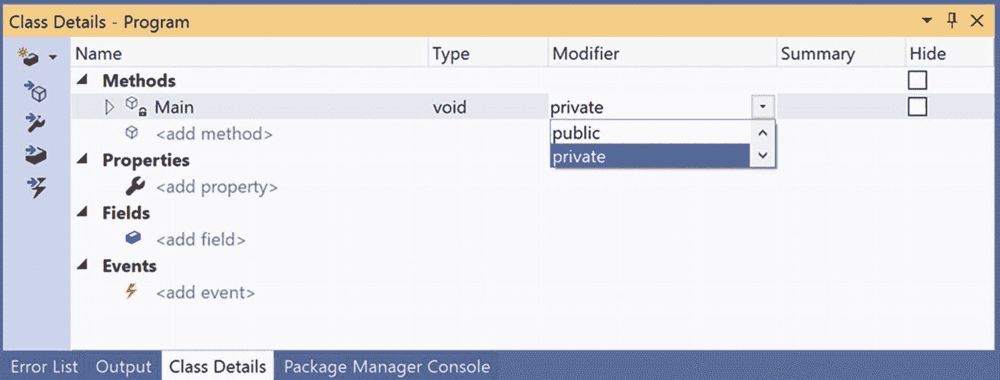

# 二、构建 C# 应用

作为一名 C# 程序员，你可以从众多的工具中进行选择。NET 核心应用。您选择的工具将主要基于三个因素:任何相关成本、您用于开发软件的操作系统以及您的目标计算平台。本章的目的是提供安装所需的信息。NET 5 SDK 和运行时，并介绍了微软的旗舰 ide，Visual Studio 代码和 Visual Studio 的初步看法。

本章的第一部分将介绍如何使用设置您的计算机。NET 5 SDK 和运行时。下一节将研究用 Visual Studio 代码和 Visual Studio Community Edition 构建您的第一个 C# 应用。

Note

本章和后续章节中的截图来自 Windows 上的 Visual Studio 代码 v 1.51.1 或 Visual Studio 2019 社区版 v16.8.1。如果你想在不同的操作系统或 IDE 上构建你的应用，本章将为你指明正确的方向；但是，您的 IDE 的外观可能与本文中的各种截图不同。

## 正在安装。NET 5

开始用 C# 9 和。NET 5(在 Windows、macOS 或 Linux 上)。需要安装. NET 5 SDK(它还会安装。NET 5 运行时)。的所有安装。NET 和。网芯位于方便的 [`www.dot.net`](http://www.dot.net) 。在主页上，单击下载，然后单击全部。点击“全部”后。你会看到两个 LTS 版本的。NET 核心(2.1 和 3.1)和一个链接。NET 5.0。点击”。NET 5.0(推荐)。”进入该页面后，选择正确的。适用于您的操作系统的 NET 5 SDK。对于这本书，您需要安装 SDK。NET Core 版本 5.0.100 或更高版本，该版本还会安装。NET、ASP.NET 和。NET 桌面(在 Windows 上)运行时。

Note

自发布以来，下载页面发生了变化。净 5。现在有三列带有标题。网，“”。网芯，“和”。NET 框架。点击“全部。NET Core 下载”。NET 或。NET Core header 带你到同一个页面。安装 Visual Studio 2019 也会安装。NET Core SDK 和运行时。

### 了解。NET 5 版本编号方案

在撰写本文时。NET 5 SDK 的版本是 5.0.100。前两个数字(5.0)表示您可以瞄准的运行时的最高版本。在这种情况下，这是 5.0。这意味着 SDK 也支持开发较低版本的运行时，如。网芯 3.1。下一个数字(1)是季度特征带。由于我们目前处于自发布以来的第一季度，所以它是 1。最后两个数字(00)表示修补程序版本。如果你在脑海中给版本加一个分隔符，把当前版本想成 5.0.1.00，这就稍微清楚一点了。

### 确认。NET 5 安装

要确认 SDK 和运行时的安装，请打开一个命令窗口并使用。NET 5 命令行界面(CLI)，`dotnet.exe`。CLI 提供了 SDK 选项和命令。这些命令包括创建、构建、运行和发布项目和解决方案，您将在本文后面看到这些命令的示例。在本节中，我们将检查 SDK 选项，共有四个，如表 2-1 所示。

表 2-1。

。NET 5 CLI SDK 选项

<colgroup><col class="tcol1 align-left"> <col class="tcol2 align-left"></colgroup> 
| 

[计]选项

 | 

生命的意义

 |
| --- | --- |
| `--version` | 显示。正在使用. NET SDK 版本 |
| `--info` | 展示.NET 信息 |
| `--list-runtimes` | 显示已安装的运行时 |
| `--list-sdks` | 显示已安装的 SDK |
| `--version` | 显示。正在使用. NET SDK 版本 |

`--version`选项显示安装在您机器上的 SDK 的最高版本，或者位于您当前目录或以上的`global.json`中指定的版本。检查的当前版本。NET 5 SDK，请输入以下内容:

```cs
dotnet --version

```

对于这本书，结果需要是 5.0.100(或更高)。

展示所有的。NET Core 运行时，请输入以下内容:

```cs
dotnet --list-runtimes

```

有三种不同的运行时间:

*   `Microsoft.AspNetCore.App`(用于构建 ASP.NET 核心应用)

*   `Microsoft.NETCore.App`(的基础运行时.NETCore)

*   `Microsoft.WindowsDesktop.App`(用于构建 WinForms 和 WPF 应用)

如果您运行的是 Windows 操作系统，则每个版本都必须是 5.0.0(或更高版本)。如果你不在 Windows 上，你只需要前两个，`Microsoft.NETCore.App`和`Microsoft.AspNetCore.App`，并且显示版本 5.0.0(或更高版本)。

最后，要显示所有安装的 SDK，请输入以下内容:

```cs
dotnet --list-sdks

```

同样，版本必须是 5.0.100(或更高)。

#### 使用早期版本的。NET(核心)SDK

如果需要将项目固定到早期版本的。NET Core SDK，你可以用一个`global.json`文件来完成。要创建该文件，可以使用以下命令:

```cs
dotnet new globaljson –sdk-version 3.1.404

```

这将创建一个类似如下的`global.json`文件:

```cs
{
  "sdk": {
    "version": "3.1.404"
  }
}

```

该文件“固定”了。将当前目录及其下的所有目录的. NET Core SDK 版本升级到 3.1.404。在这个目录下运行`dotnet.exe --version`会返回 3.1.404。

## 建筑。NET 核心应用与 Visual Studio

如果您有使用以前版本的 Microsoft 技术构建应用的经验，您可能对 Visual Studio 很熟悉。在产品的整个生命周期中，版本名称和功能集一直在变化，但自发布以来已经稳定下来。NET 核心。Visual Studio 有以下版本(适用于 Window 和 Mac):

*   Visual Studio 2019 社区(免费)

*   Visual Studio 2019 专业版(付费)

*   Visual Studio 2019 企业版(付费)

社区版和专业版本质上是一样的。最显著的区别在于许可模式。社区被许可用于开源、学术和小型企业。Professional 和 Enterprise 是许可用于任何开发(包括企业开发)的商业产品。正如所料，与专业版相比，企业版有许多附加功能。

Note

具体许可详情，请前往 [`www.visualstudio.com`](http://www.visualstudio.com) 。微软产品的许可可能会很复杂，本书不涉及细节。出于写作(和阅读)本书的目的，使用社区是合法的。

所有 Visual Studio 版本都附带了复杂的代码编辑器、集成的调试器、桌面和 web 应用的 GUI 设计器等等。由于它们都有一套共同的核心特性，好消息是它们之间的转换很容易，而且对它们的基本操作也很熟悉。

### 安装 Visual Studio 2019 (Windows)

在使用 Visual Studio 2019 开发、执行和调试 C# 应用之前，您需要安装它。2017 版本的安装体验发生了巨大变化，值得更详细地讨论。

Note

可以从 [`www.visualstudio.com/downloads`](http://www.visualstudio.com/downloads) 下载 Visual Studio 2019 社区。确保您下载并安装的版本至少是 16.8.1 或更高版本。

Visual Studio 2019 安装流程现在被分解为应用类型的工作负载。这允许您只安装您计划构建的应用类型所需的组件。例如，如果您要构建 web 应用，您应该安装“ASP。NET 和 web 开发”工作量。

另一个(极其)重大的变化是，Visual Studio 2019 支持真正的并行安装。注意，我指的不仅仅是以前版本的 Visual Studio，而是 Visual Studio 2019 本身！例如，在我的主要工作计算机上，我为我的专业工作安装了 Visual Studio 2019 Enterprise，并为我的书籍、课程和会议讲座安装了 Visual Studio 2019 社区。如果你有雇主提供的 Professional 或 Enterprise，你仍然可以安装 Community edition 来处理开源项目(或本书中的代码)。

当您启动 Visual Studio 2019 Community 的安装程序时，您会看到如图 2-1 所示的屏幕。该屏幕显示了所有可用的工作负载、选择单个组件的选项，以及显示所选内容的右侧摘要。


图 2-1。

新的 Visual Studio 安装程序

对于本书，您需要安装以下工作负载:

*   。NET 桌面开发

*   ASP.NET 和网络开发

*   数据存储和处理

*   。NET Core 跨平台开发

在“单个组件”选项卡上，还选择类设计器、Git for Windows 和“GitHub extension for Visual Studio”(都在“代码工具”下)。一旦您选择了它们，点击安装。这将为你提供完成本书中的例子所需的一切。

### 试用 Visual Studio 2019

Visual Studio 2019 是软件开发的一站式商店。NET 平台和 C#。让我们通过构建一个简单的。NET 5 控制台应用。

#### 使用“新建项目”对话框和 C# 代码编辑器

当你启动 Visual Studio 时，你会看到更新后的启动对话框，如图 2-2 所示。对话框的左侧有最近使用的解决方案，右侧有用于启动 Visual Studio 的选项，包括从存储库中启动代码、打开现有项目/解决方案、打开本地文件夹或创建新项目。还有一个选项是在没有任何代码的情况下继续，这只是启动 Visual Studio IDE。


图 2-2。

新的 Visual Studio 启动对话框

选择“创建一个`n` ew 项目”选项，会出现“创建新项目”对话框提示。如图 2-3 所示，最近使用的模板(如果有)在左边，所有可用的模板在右边，包括一组过滤器和一个搜索框。


图 2-3。

“创建新项目”对话框

首先，创建一个新的控制台应用(。NET Core) C# 项目，确保选择 C# 版本，而不是 Visual Basic 版本。

下一个屏幕是“配置你的新项目”对话框，如图 2-4 所示。输入 **SimpleCSharpConsoleApp** 作为项目名称，并为项目选择一个位置。该向导还将创建一个 Visual Studio 解决方案，默认情况下以项目名称命名。


图 2-4。

“配置您的新项目”对话框

Note

创建解决方案和项目也可以使用。NET Core CLI。这将在 Visual Studio 代码中介绍。

一旦创建了项目，您将会看到初始的 C# 代码文件(名为`Program.cs`)已经在代码编辑器中打开。用下面的代码替换`Main()`方法中的单行代码。您会注意到，在您键入时，智能感知(代码完成帮助)将在您应用点运算符时生效。

```cs
static void Main(string[] args)
{
  // Set up Console UI (CUI)
  Console.Title = "My Rocking App";
  Console.ForegroundColor = ConsoleColor.Yellow;
  Console.BackgroundColor = ConsoleColor.Blue;
  Console.WriteLine("*************************************");
  Console.WriteLine("***** Welcome to My Rocking App *****");
  Console.WriteLine("*************************************");
  Console.BackgroundColor = ConsoleColor.Black;

  // Wait for Enter key to be pressed.
  Console.ReadLine();
}

```

这里，您使用的是在`System`名称空间中定义的`Console`类。因为`System`名称空间已经通过`using`语句自动包含在文件的顶部，所以不需要在类名前限定名称空间(例如`System.Console.WriteLine()`)。这个程序没有做任何太有趣的事情；但是，请注意对`Console.ReadLine()`的最后调用。这只是为了确保用户必须按键才能终止应用。对于 Visual Studio 2019，这是不必要的，因为 VS 调试器将暂停程序并阻止它退出。如果你要导航到编译版本并运行它，当调试程序时，程序几乎会立即消失！

Note

如果你想改变 VS 调试体验，自动结束程序，选择工具➤选项➤调试➤调试停止时自动关闭控制台。

#### 改变目标。NET 核心框架

默认。NET 核心版本。NET 核心控制台应用和类库是最新的 LTS 版本。网芯 3.1。要用。NET 5 或者只是检查。NET (Core ),在解决方案资源管理器中双击该项目。这将在编辑器中打开项目文件(这是 Visual Studio 2019 和的新功能。网芯)。您也可以通过在解决方案资源管理器中右击项目名称并选择“编辑项目文件”来编辑项目文件您将看到以下内容:

```cs
<Project Sdk="Microsoft.NET.Sdk">
  <PropertyGroup>
    <OutputType>Exe</OutputType>
    <TargetFramework>netcoreapp3.1</TargetFramework>
  </PropertyGroup>
</Project>

```

换成不同的。NET 核心版到。NET 5，只需将 TargetFramework 值更改为 net5.0，如下所示:

```cs
<Project Sdk="Microsoft.NET.Sdk">
  <PropertyGroup>
    <OutputType>Exe</OutputType>
    <TargetFramework>net5.0</TargetFramework>
  </PropertyGroup>
</Project>

```

您还可以通过在解决方案资源管理器中右键单击项目名称并选择 Properties，打开 Application 选项卡，并更新目标框架值来更改目标框架，如图 2-5 所示。


图 2-5。

更改应用的目标框架

#### 使用 C# 9 特性

在的早期版本中。NET 中，一个项目所支持的 C# 版本是可以改变的。和。NET Core 3.0+，使用的 C# 版本捆绑成框架版本。若要确认这一点，请在解决方案资源管理器中右击项目名称，然后选择“属性”。在“属性”对话框中，单击左栏中的“构建”，然后单击右下角的“高级”。这将弹出如图 2-6 所示的对话框。


图 2-6。

高级构建设置

为了。NET 5.0 项目，语言版本锁定为 C# 9。表 2-2 列出了目标框架(。网芯，。NET 标准，以及。NET Framework)和使用的默认 C# 版本。

表 2-2。

C# 8 版本和目标框架

<colgroup><col class="tcol1 align-left"> <col class="tcol2 align-left"> <col class="tcol3 align-left"></colgroup> 
| 

目标框架

 | 

版本

 | 

C# 语言版本默认值

 |
| --- | --- | --- |
| 。网 | 5.x | C# 9.0 |
| 。净核心 | 3.x | C# 8.0 |
| 。净核心 | 2.x | C# 7.3 |
| 。净标准 | Two point one | C# 8.0 |
| 。净标准 | Two | C# 7.3 |
| .NET 标准 | 1.x | C# 7.3 |
| 。NET 框架 | 全部 | C# 7.3 |

#### 运行和调试项目

要运行程序并查看输出，请按 Ctrl+F5 键盘命令(也可以从“调试➤”的“不调试启动”菜单选项中访问)。一旦你这样做了，你会看到一个 Windows 控制台窗口弹出在屏幕上与你的自定义(和丰富多彩的)信息。请注意，当您使用 Ctrl+F5“运行”您的程序时，您会绕过集成调试器。

Note

。NET 核心应用也可以使用 CLI 编译和执行。要运行您的项目，请在与项目文件相同的目录中输入`dotnet run`(在本例中为`SimpleCSharpApp.csproj`)。`dotnet run`命令也会自动构建项目。

如果您需要调试您的代码(这在构建更大的程序时肯定很重要)，您的第一步是在您想要检查的代码语句处设置断点。虽然这个例子代码不多，但是通过点击代码编辑器最左边的灰色条来设置断点(注意断点是用红点图标标记的；参见图 2-7 。


图 2-7。

设置断点

如果您现在按 F5 键(或者使用“调试➤”“开始调试”菜单选项，或者单击工具栏中旁边带有“开始”的绿色箭头)，您的程序将在每个断点处暂停。如您所料，您可以使用 IDE 的各种工具栏按钮和菜单选项与调试器进行交互。一旦评估完所有断点，应用将最终在`Main()`完成后终止。

Note

微软 ide 有复杂的调试器，你将在接下来的章节中学习各种技术。现在，请注意，当您处于调试会话中时，大量有用的选项会出现在调试菜单下。请花点时间亲自验证这一点。

#### 使用解决方案浏览器

如果您看一下 IDE 的右侧，您会看到一个解决方案资源管理器窗口，它向您展示了一些重要的东西。首先，请注意 IDE 已经创建了一个包含单个项目的解决方案。这一开始可能会令人困惑，因为它们被赋予了相同的名称(SimpleCSharpConsoleApp)。这里的想法是一个“解决方案”可以包含多个一起工作的项目。例如，您的解决方案可能包括三个类库、一个 WPF 应用和一个 ASP.NET 核心 web 服务。本书的前几章总是有一个单独的项目；然而，当您构建一些更复杂的示例时，您将看到如何向您的初始解决方案空间添加新项目。

Note

请注意，当您在“解决方案资源管理器”窗口中选择最顶层的解决方案时，IDE 的菜单系统将向您显示一组与选择项目时不同的选项。如果您发现自己想知道某个菜单项消失到哪里了，请仔细检查您没有意外选择错误的节点。

#### 使用可视化类设计器

Visual Studio 还使您能够以可视化的方式设计类和其他类型(如接口或委托)。类设计器实用工具允许您查看和修改项目中类型(类、接口、结构、枚举和委托)的关系。使用此工具，您可以直观地向类型添加(或从中移除)成员，并将您的修改反映在相应的 C# 文件中。此外，当您修改给定的 C# 文件时，更改会反映在类图中。

若要访问可视化类型设计器工具，第一步是插入新的类图文件。为此，激活项目➤添加新项目菜单选项，并定位类图类型(图 2-8 )。


图 2-8。

将类图文件插入到当前项目中

最初，设计器将是空的；但是，您可以将文件从解决方案资源管理器窗口拖放到图面上。例如，一旦您将`Program.cs`拖到设计器上，您会发现`Program`类的可视化表示。如果你点击给定类型的箭头图标，你可以显示或隐藏该类型的成员(参见图 2-9 )。


图 2-9。

类图查看器

Note

使用类设计器工具栏，可以微调设计器图面的显示选项。

类设计器实用工具与 Visual Studio 的其他两个方面协同工作:“类详细信息”窗口(使用“查看➤其他窗口”菜单激活)和“类设计器工具箱”(使用“查看➤工具箱”菜单项激活)。“类详细信息”窗口不仅显示图中当前所选项的详细信息，还允许您动态修改现有成员和插入新成员(参见图 2-10 )。



图 2-10。

“类详细信息”窗口

类设计器工具箱也可以使用视图菜单激活，它允许您可视地将新类型插入到项目中(并创建这些类型之间的关系)(参见图 2-11 )。(请注意，要查看该工具箱，必须有一个类图作为活动窗口。)这样做时，IDE 会在后台自动创建新的 C# 类型定义。


图 2-11。

类设计器工具箱

例如，将一个新类从类设计器工具箱拖到您的类设计器上。在出现的对话框中，将这个类命名为`Car`。这将导致创建一个名为`Car.cs`的新 C# 文件，它会自动添加到您的项目中。现在，使用类细节窗口，添加一个名为`PetName`的公共`string`字段(见图 2-12 )。


图 2-12。

使用“类详细信息”窗口添加字段

如果您现在查看`Car`类的 C# 定义，您会看到它已经被相应地更新了(去掉了这里显示的附加代码注释):

```cs
public class Car
{
   // Public data is typically a bad idea; however,
   // it keeps this example simple.
   public string PetName;
}

```

现在，再次激活设计器文件，并将另一个新类拖到设计器上，并将其命名为`SportsCar`。单击类设计器工具箱中的继承图标，然后单击`SportsCar`图标的顶部。接下来，在`Car`类图标上点击鼠标。如果您正确地执行了这些步骤，那么您已经从`Car`中派生出了`SportsCar`类(参见图 2-13 )。


图 2-13。

可视化地从现有类派生

Note

继承的概念将在第六章中详细讨论。

为了完成这个例子，用名为`GetPetName()`的公共方法更新生成的`SportsCar`类，如下所示:

```cs
public class SportsCar : Car
{
   public string GetPetName()
   {
     PetName = "Fred";
     return PetName;
   }
}

```

如您所料，设计器显示了添加到`SportsCar`类的方法。

这就结束了您对 Visual Studio 的初步了解。在本文中，您将看到更多使用 Visual Studio 构建 C# 9 和。NET 5 应用。

## 建筑。带有 Visual Studio 代码的. NET 核心应用

微软的另一个流行的 IDE 是 Visual Studio Code (VSC)。Visual Studio 代码对于微软家族来说是一个相对较新的版本；是免费的、开源的、跨平台的；并在国内外的开发人员中获得了广泛的采用。网核生态系统。Visual Studio 代码的重点是(顾名思义)应用的代码。它没有 Visual Studio 中包含的许多内置功能。但是，还可以通过扩展将其他功能添加到 Visual Studio 代码中。这允许您拥有一个为您的工作流定制的快速 IDE。本书中的许多示例都是用 Visual Studio 代码构建和测试的。您可以从这里下载:

```cs
https://code.visualstudio.com/download

```

安装 VSC 后，您将需要添加 C# 扩展，如下所示:

```cs
https://marketplace.visualstudio.com/items?itemName=ms-dotnettools.csharp

```

Note

Visual Studio 代码用于开发基于多种语言的许多不同类型的应用。有 Angular，View，PHP，Java，还有很多很多更多的扩展。

### 试用 Visual Studio 代码

让我们快速浏览一下 Visual Studio 代码。NET 5 控制台应用。

#### 创建解决方案和项目

当您启动 Visual Studio 代码时，您会看到一个空白板。创建解决方案和项目必须通过。NET 5 命令行界面，也称为 CLI。首先，通过选择“文件”“➤”“打开文件夹”,打开包含 Visual Studio 代码的文件夹，然后在资源管理器窗口中导航到您希望解决方案和项目所在的位置。接下来，通过选择终端➤新终端或按 Ctl+Shift+`，打开一个终端窗口。

在终端窗口中，输入以下命令创建一个空的。NET 5 解决方案文件:

```cs
dotnet new sln -n SimpleCSharpConsoleApp -o .\VisualStudioCode

```

这将在名为 VisualStudioCode 的子目录中创建一个名为(`-n` ) SimpleCSharpConsoleApp 的新解决方案文件。将 Visual Studio 代码用于单个项目应用时，不需要创建解决方案文件。Visual Studio 以解决方案为中心；Visual Studio 代码是以代码为中心的。我们在这里创建了一个解决方案文件来复制 Visual Studio 示例中的过程。

Note

这些示例使用 Windows 目录分隔符。根据您的操作系统调整分离器。

接下来，创建一个新的 C# 9/。NET 5 ( `-f net5.0`)同名子目录(`-o`)中名为(`-n` ) SimpleCSharpConsoleApp 的控制台应用(注意该命令必须全部在一行中):

```cs
dotnet new console -lang c# -n SimpleCSharpConsoleApp -o .\VisualStudioCode\SimpleCSharpConsoleApp -f net5.0

```

Note

因为目标框架是使用`-f`选项指定的，所以不需要像使用 Visual Studio 那样更新项目文件。

最后，使用以下命令将新创建的项目添加到解决方案中:

```cs
dotnet sln .\VisualStudioCode\SimpleCSharpConsoleApp.sln add .\VisualStudioCode\SimpleCSharpConsoleApp

```

Note

这只是 CLI 功能的一小部分。要发现 CLI 可以做的一切，请输入`dotnet -h`。

#### 探索 Visual Studio 代码工作区

正如您在图 2-14 中看到的，Visual Studio 代码工作区专注于代码，但也提供了许多附加功能来帮助您提高工作效率。浏览器(1)是一个集成的文件浏览器，在图中被选中。源代码控件(2)与 Git 集成。调试图标(3)启动适当的调试器(假设安装了正确的扩展)。下一个是扩展管理器(4)。单击调试图标将显示推荐的扩展以及所有可用扩展的列表。扩展管理器是上下文敏感的，它会根据打开的目录和子目录中的代码类型提出建议。


图 2-14。

Visual Studio 代码工作区

代码编辑器(5)具有完整的颜色编码和智能感知支持，这两者都依赖于扩展。代码映射(6)显示整个代码文件的映射，调试控制台(7)接收调试会话的输出并接受用户的输入(类似于 Visual Studio 中的即时窗口)。

#### 还原包，构建和运行程序

那个。NET 5 CLI 拥有还原包、构建解决方案、构建项目和运行应用所需的所有功能。要恢复您的解决方案和项目所需的所有 NuGet 包，请在终端窗口(或 VSC 以外的命令窗口)中输入以下命令，确保从与解决方案文件相同的目录中运行该命令:

```cs
dotnet restore

```

要构建您的解决方案中的所有项目，请在终端/命令窗口中执行以下命令(同样，确保命令在与解决方案文件相同的目录中执行):

```cs
dotnet build

```

Note

当在包含解决方案文件的目录中执行`dotnet restore`和`dotnet build`时，解决方案中的所有项目都会被执行。也可以通过运行 C# 项目文件目录中的命令来运行单个项目中的命令(`*.csproj`)。

若要在不调试的情况下运行项目，请执行以下命令。与项目文件(`SimpleCSharpConsoleApp.csproj`)在同一目录下的. NET CLI 命令:

```cs
dotnet run

```

#### 调试您的项目

要调试程序，按 F5 键盘命令或点击调试图标(图 2-14 中的 2)。假设您已经加载了 VSC 的 C# 扩展，程序将在调试模式下运行。断点的管理与使用 Visual Studio 时相同，尽管它们在编辑器中没有那么明显(图 2-15 )。


图 2-15。

Visual Studio 代码中的断点

要更改要集成的终端并允许输入到您的程序中，首先打开`launch.json`文件(位于`.vscode`目录中)。将控制台入口从`internalConsole`更改为`integratedTerminal`，如下图所示:

```cs
{
   // Use IntelliSense to find out which attributes exist for C# debugging
   // Use hover for the description of the existing attributes
   // For further information visit https://github.com/OmniSharp/omnisharp-vscode/blob/master/debugger-launchjson.md
   "version": "0.2.0",
   "configurations": [
        {
            "name": ".NET Core Launch (console)",
            "type": "coreclr",
            "request": "launch",
            "preLaunchTask": "build",
            // If you have changed target frameworks, make sure to update the program path.
            "program": "${workspaceFolder}/SimpleCSharpConsoleApp/bin/Debug/net5.0/SimpleCSharpConsoleApp.Cs.dll",
            "args": [],
            "cwd": "${workspaceFolder}/SimpleCSharpConsoleApp",
            // For more information about the 'console' field, see https://aka.ms/VSCode-CS-LaunchJson-Console
            "console": "integratedTerminal",
            "stopAtEntry": false
        },
        {
            "name": ".NET Core Attach",
            "type": "coreclr",
            "request": "attach",
            "processId": "${command:pickProcess}"
        }
    ]
}

```

## 寻找。NET 核心和 C# 文档

C# 和。NET 核心文档非常好，可读性很强，并且充满了有用的信息。鉴于大量预定义的。NET 类型(数以千计)，您必须愿意卷起袖子深入研究所提供的文档。您可以在此处查看所有 Microsoft 文档:

```cs
https://docs.microsoft.com/en-us/dotnet/csharp/

```

在本书的前半部分，您将会用到最多的地方是 C# 文档和。NET 核心文档，可在以下位置找到:

```cs
https://docs.microsoft.com/en-us/dotnet/csharp/
https://docs.microsoft.com/en-us/dotnet/core/

```

## 摘要

本章的目的是为您提供使用。NET 5 SDK 和运行时，并提供 Visual Studio 2019 社区版和 Visual Studio 代码之旅。如果你只对构建跨平台感兴趣。NET 核心应用，您有许多选择。Visual Studio(仅限 Windows)、Visual Studio for the Mac(仅限 Mac)和 Visual Studio Code(跨平台)都是由微软提供的。构建 WPF 或 WinForms 应用仍然需要 Windows 计算机上的 Visual Studio。