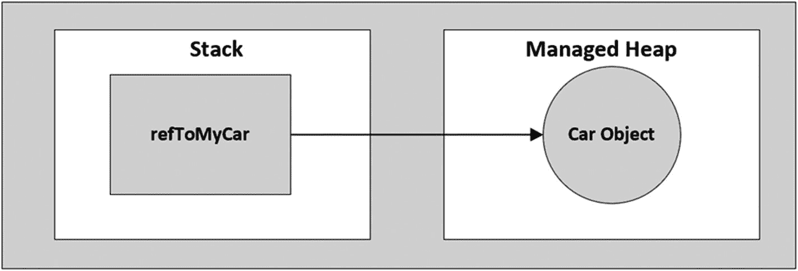
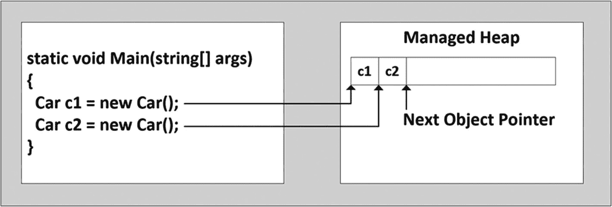
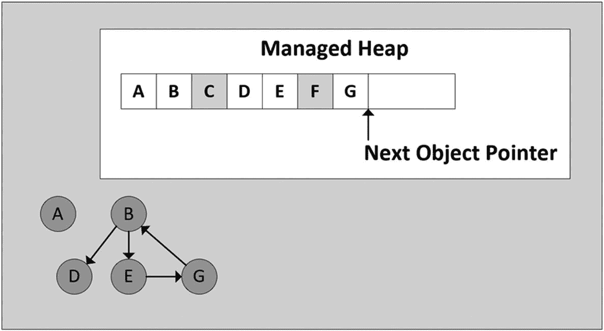

# 九、了解对象生存期

至此，您已经学习了很多关于如何使用 C# 构建自定义类类型的知识。现在您将看到运行时如何通过*垃圾收集* ( *GC* )来管理分配的类实例(又名对象)。C# 程序员从不直接从内存中释放托管对象(回想一下，C# 语言中没有`delete`关键字)。更确切地说。NET 核心对象被分配到一个叫做*托管堆*的内存区域，在那里它们将被垃圾收集器“在将来的某个时候”自动销毁

在您查看了收集过程的核心细节之后，您将学习如何使用`System.GC`类类型以编程方式与垃圾收集器进行交互(对于您的大多数项目来说，这通常不是必需的)。接下来，您将研究如何使用虚拟的`System.Object.Finalize()`方法和`IDisposable`接口来构建以可预测和及时的方式释放内部*非托管资源*的类。

您还将深入研究中介绍的垃圾收集器的一些功能。NET 4.0，包括后台垃圾收集和使用泛型`System.Lazy<>`类的惰性实例化。当你完成这一章的时候，你会对如何做有一个坚实的理解。NET 核心对象由运行库管理。

## 类、对象和引用

为了构建本章所涉及的主题，进一步澄清类、对象和引用变量之间的区别是很重要的。回想一下，类只不过是描述这种类型的实例在内存中的外观和感觉的蓝图。当然，类是在一个代码文件中定义的(按照惯例，在 C# 中使用一个`*.cs`扩展名)。考虑在名为 SimpleGC 的新 C# 控制台应用项目中定义的以下简单的`Car`类:

```cs
namespace SimpleGC
{
  // Car.cs
  public class Car
  {
    public int CurrentSpeed {get; set;}
    public string PetName {get; set;}

    public Car(){}
    public Car(string name, int speed)
    {
      PetName = name;
      CurrentSpeed = speed;
    }
    public override string ToString()
      => $"{PetName} is going {CurrentSpeed} MPH";
    }
  }
}

```

定义了一个类之后，你可以使用 C# `new`关键字分配任意数量的对象。但是，请理解，`new`关键字返回的是对堆上对象的*引用*，而不是实际的对象。如果将引用变量声明为方法范围内的局部变量，它将存储在堆栈中，供应用进一步使用。当您想要调用对象上的成员时，将 C# 点运算符应用于存储的引用，如下所示:

```cs
using System;
using SimpleGC;
Console.WriteLine("***** GC Basics *****");

// Create a new Car object on the managed heap.
// We are returned a reference to the object
// ("refToMyCar").
Car refToMyCar = new Car("Zippy", 50);

// The C# dot operator (.) is used to invoke members
// on the object using our reference variable.
Console.WriteLine(refToMyCar.ToString());
Console.ReadLine();

```

图 [9-1](#Fig1) 说明了类、对象和引用关系。



图 9-1。

对托管堆上对象的引用

Note

回想一下第 [4](04.html) 章，结构是*值类型*，它们总是被直接分配到堆栈上，从不放在。NET 核心托管堆。只有在创建类的实例时，才会发生堆分配。

## 对象生存期的基础

当您构建 C# 应用时，假设。NET Core runtime environment 会处理托管堆，无需您的直接干预。事实上……NET 核心内存管理很简单。

Rule

使用`new`关键字将一个类实例分配到托管堆上，然后忘掉它。

一旦实例化，垃圾收集器将销毁不再需要的对象。当然，下一个明显的问题是“垃圾收集器如何确定何时不再需要某个对象？”简短的(即不完整的)答案是，垃圾收集器仅在对象被你的代码库的任何部分*不可达*时才从堆中移除该对象。假设您的`Program`类中有一个方法，它分配一个本地`Car`对象，如下所示:

```cs
static void MakeACar()
{
  // If myCar is the only reference to the Car object, it *may* be destroyed when this method returns.
  Car myCar = new Car();
}

```

请注意，这个`Car`引用(`myCar`)是直接在`MakeACar()`方法中创建的，没有被传递到定义范围之外(通过返回值或`ref` / `out`参数)。因此，一旦这个方法调用完成，`myCar`引用不再可达，关联的`Car`对象现在是垃圾收集的候选对象。但是要知道，你不能保证这个对象会在`MakeACar()`完成后立即从内存中被回收。在这一点上，您可以假设的是，当运行时执行下一次垃圾收集时，可以安全地销毁`myCar`对象。

您肯定会发现，在垃圾收集环境中编程极大地简化了您的应用开发。与之形成鲜明对比的是，C++程序员痛苦地意识到，如果他们不能手动删除堆分配的对象，内存泄漏就不远了。事实上，跟踪内存泄漏是非托管环境中编程最耗时(也是最乏味)的方面之一。通过允许垃圾收集器负责销毁对象，内存管理的负担已经从您的肩上卸下，并放在运行时的肩上。

### 新 CIL

当 C# 编译器遇到`new`关键字时，它向方法实现中发出一个 CIL `newobj`指令。如果您编译当前的示例代码，并使用`ildasm.exe`研究产生的程序集，您会在`MakeACar()`方法中找到以下 CIL 语句:

```cs
.method assembly hidebysig static
          void  '<<Main>$>g__MakeACar|0_0'() cil managed
{
    // Code size       8 (0x8)
    .maxstack  1
    .locals init (class SimpleGC.Car V_0)
    IL_0000: nop
    IL_0001: newobj     instance void SimpleGC.Car::.ctor()
    IL_0006: stloc.0
    IL_0007: ret
  } // end of method '<Program>$'::'<<Main>$>g__MakeACar|0_0'

```

在检查确定何时从托管堆中移除对象的确切规则之前，让我们更详细地检查一下 CIL `newobj`指令的作用。首先，要理解托管堆不仅仅是运行时访问的随机内存块。那个。NET Core 垃圾收集器是一个相当整洁的堆管家，因为它会压缩空的内存块(必要时)以达到优化的目的。

为了有助于这项工作，托管堆维护一个指针(通常称为*下一个对象指针*或*新对象指针*)，该指针准确地标识下一个对象将位于何处。也就是说，`newobj`指令告诉运行时执行以下核心操作:

1.  计算要分配的对象所需的内存总量(包括数据成员和基类所需的内存)。

2.  检查托管堆，确保确实有足够的空间来承载要分配的对象。如果有，则调用指定的构造函数，最终向调用者返回内存中新对象的引用，该对象的地址恰好与下一个对象指针的最后位置相同。

3.  最后，在将引用返回给调用方之前，将下一个对象指针向前移动，指向托管堆上的下一个可用槽。

图 [9-2](#Fig2) 说明了基本过程。



图 9-2。

将对象分配到托管堆的详细信息

当应用忙于分配对象时，托管堆上的空间最终可能会变满。当处理`newobj`指令时，如果运行时确定托管堆没有足够的内存来分配所请求的类型，它将执行垃圾收集以尝试释放内存。因此，垃圾收集的下一个规则也很简单。

Rule

如果托管堆没有足够的内存来分配请求的对象，将发生垃圾回收。

然而，这种垃圾收集是如何发生的，取决于你的应用使用哪种垃圾收集。在这一章的后面，你会看到不同之处。

### 将对象引用设置为空

C/C++程序员经常将指针变量设置为`null`，以确保它们不再引用非托管内存。鉴于此，您可能想知道在 C# 下将对象引用分配给`null`的最终结果是什么。例如，假设`MakeACar()`子程序已经更新如下:

```cs
static void MakeACar()
{
  Car myCar = new Car();
  myCar = null;
}

```

当您将对象引用分配给`null`时，编译器会生成 CIL 代码，确保引用(在本例中为`myCar`)不再指向任何对象。如果您再次使用`ildasm.exe`来查看修改后的`MakeACar()`的 CIL 代码，您会发现`ldnull`操作码(它将一个`null`值推送到虚拟执行堆栈上)后跟一个`stloc.0`操作码(它将`null`引用设置到变量上)。

```cs
  .method assembly hidebysig static
          void  '<<Main>$>g__MakeACar|0_0'() cil managed
  {
    // Code size       10 (0xa)
    .maxstack  1
    .locals init (class SimpleGC.Car V_0)
    IL_0000: nop
    IL_0001: newobj     instance void SimpleGC.Car::.ctor()
    IL_0006: stloc.0
    IL_0007: ldnull
    IL_0008: stloc.0
    IL_0009: ret
  } // end of method '<Program>$'::'<<Main>$>g__MakeACar|0_0'

```

然而，你必须明白的是，给`null`分配一个引用并不会以任何方式迫使垃圾收集器在那个时刻启动，并从堆中移除对象。您唯一完成的事情是显式地剪切引用和它以前指向的对象之间的连接。鉴于这一点，在 C# 下设置对`null`的引用远不如在其他基于 C 的语言中这样做重要；但是，这样做肯定不会造成什么伤害。

## 确定对象是否是活动的

现在，回到垃圾收集器如何确定何时不再需要某个对象的主题。垃圾收集器使用以下信息来确定对象是否是活动的:

*   *堆栈根*:编译器和堆栈审核器提供的堆栈变量

*   *垃圾收集句柄*:指向可从代码或运行时引用的托管对象的句柄

*   *静态数据*:应用领域中可以引用其他对象的静态对象

在垃圾回收过程中，运行时将调查托管堆上的对象，以确定应用是否仍然可以访问这些对象。为此，运行时将构建一个*对象图*，它表示堆上每个可到达的对象。在第 [20](20.html) 章讨论对象序列化的时候，对象图会有一些详细的解释。现在，只要理解对象图用于记录所有可到达的对象。同样，请注意垃圾收集器不会两次绘制同一个对象，从而避免 COM 编程中令人讨厌的循环引用计数。

假设托管堆包含一组名为 A、B、C、D、E、F 和 g 的对象，在垃圾收集期间，会检查这些对象(以及它们可能包含的任何内部对象引用)。在构建了图之后，不可到达的对象(可以假设是对象 C 和 F)被标记为垃圾。图 [9-3](#Fig3) 为刚刚描述的场景绘制了一个可能的对象图(你可以使用短语*取决于*或*需要*来阅读方向箭头；比如 E 依赖于 G 和 B，A 不依赖于任何东西等等。).



图 9-3。

构建对象图是为了确定应用根可以访问哪些对象。

在对象被标记为终止后(在这种情况下是 C 和 F，因为它们在对象图中没有被考虑)，它们被从内存中清除。此时，堆上的剩余空间被压缩，这又导致运行时修改底层指针集以指向正确的内存位置(这是自动且透明地完成的)。最后但同样重要的是，下一个对象指针被重新调整，指向下一个可用的槽。图 [9-4](#Fig4) 显示了最终的重新调整。


图 9-4。

干净而紧实的堆

Note

严格地说，垃圾收集器使用两个不同的堆，其中一个专门用于存储大型对象。考虑到重定位大型对象可能带来的性能损失，在收集周期中很少查询这个堆。英寸 NET Core，大型堆可以按需压缩，或者在达到绝对或百分比内存使用的可选硬限制时压缩。

## 了解对象生成

当运行时试图定位不可访问的对象时，它不会检查托管堆上的每个对象。显然，这样做需要相当长的时间，尤其是在较大的(即真实世界的)应用中。

为了帮助优化这个过程，堆上的每个对象都被分配给一个特定的“代”世代背后的思想很简单:一个对象在堆上存在的时间越长，它就越有可能留在那里。例如，定义桌面应用主窗口的类将会一直在内存中，直到程序终止。相反，最近才放入堆中的对象(比如在方法范围内分配的对象)很可能很快就无法访问。给定这些假设，堆上的每个对象都属于以下代之一的集合:

*   *第 0 代*:标识一个新分配的从未被标记为收集的对象(大对象除外，它们最初被放在第 2 代收集中)。大多数对象在第 0 代中被回收用于垃圾收集，并且现在存活到第 1 代。

*   *第 1 代*:标识在垃圾收集中幸存的对象。这一代还充当短寿命对象和长寿命对象之间的缓冲。

*   *第 2 代*:标识一个在垃圾收集器的多次扫描中幸存下来的对象，或者一个在第 2 代收集中开始的非常大的对象。

Note

第 0 代和第 1 代被称为*短暂代*。正如在下一节中所解释的，您将看到垃圾收集过程确实以不同的方式对待短暂的世代。

垃圾收集器将首先调查所有第 0 代对象。如果标记和清除(或者更直白地说，清除)这些对象导致了所需的空闲内存量，则任何幸存的对象都被提升到第 1 代。要查看对象的生成如何影响收集过程，请思考图 [9-5](#Fig5) ，该图描述了一旦回收了所需的内存，一组幸存的第 0 代对象(A、B 和 E)是如何提升的。


图 9-5。

在垃圾收集中幸存的第 0 代对象被提升到第 1 代

如果已经评估了所有第 0 代对象，但是仍然需要额外的内存，则调查第 1 代对象的可达性并相应地收集。幸存的第 1 代对象随后被提升到第 2 代。如果垃圾收集器*仍然*需要额外的内存，则评估第 2 代对象。在这一点上，如果第 2 代对象在垃圾收集中幸存下来，它仍然是第 2 代对象，给定了对象代的预定义上限。

底线是，通过给堆上的对象分配一个世代值，较新的对象(如局部变量)将被快速移除，而较旧的对象(如程序的主窗口)不会经常被“打扰”。

当系统物理内存不足时，当托管堆上分配的内存超过可接受的阈值时，或者当应用代码中调用`GC.Collect()`时，就会触发垃圾收集。

如果这看起来比自己管理内存更好，那么请记住，垃圾收集的过程是有代价的。虽然垃圾收集肯定会受到好的或坏的影响，但垃圾收集的时间和收集的内容通常不受开发人员的控制。当执行垃圾收集时，会占用 CPU 周期，这会影响应用的性能。接下来的部分将研究不同类型的垃圾收集。

### 短暂的世代和片段

如前所述，第 0 代和第 1 代是短命的，被称为*短暂代*。这些代被分配在一个被称为*短暂段*的内存段中。当垃圾收集发生时，由垃圾收集获得的新段成为新的临时段，并且包含超过第 1 代的对象的段成为新的第 2 代段。

短暂段的大小因多种因素而异，例如垃圾收集类型(接下来将介绍)和系统的容量。表 [9-1](#Tab1) 显示了短暂段的不同大小。

表 9-1。

短暂的段大小

<colgroup><col class="tcol1 align-left"> <col class="tcol2 align-left"> <col class="tcol3 align-left"></colgroup> 
| 

垃圾收集类型

 | 

32 位

 | 

64 位

 |
| --- | --- | --- |
| 工作站 | 16 兆字节 | 256 兆字节 |
| 计算机网络服务器 | 64 兆字节 | 4 GB |
| 具有 4 个以上逻辑 CPU 的服务器 | 32 兆字节 | 2 GB |
| 具有 8 个以上逻辑 CPU 的服务器 | 16 兆字节 | 1 GB |

## 垃圾收集类型

运行库提供了两种类型的垃圾收集:

*   *工作站垃圾收集*:这是为客户端应用设计的，也是独立应用的默认设置。工作站 GC 可以是后台的(接下来将介绍)或非并发的。

*   *服务器垃圾收集*:这是为需要高吞吐量和可伸缩性的服务器应用设计的。服务器 GC 可以是后台或非并发的，就像工作站 GC 一样。

Note

这些名称表示工作站和服务器应用的默认设置，但垃圾收集的方法可通过机器的`runtimeconfig.json`或系统环境变量进行配置。除非计算机只有一个处理器，否则它将始终使用工作站垃圾收集。

工作站 GC 发生在触发垃圾收集的同一个线程上，并保持与触发时相同的优先级。这可能会导致与应用中其他线程的竞争。

服务器垃圾回收发生在设置为`THREAD_PRIORITY_HIGHEST`优先级的多个专用线程上(线程在第 [15 章](15.html)中介绍)。每个 CPU 都有一个专用堆和专用线程来执行垃圾收集。这可能导致服务器垃圾收集变得非常耗费资源。

### 后台垃圾收集

从……开始。NET 4.0(并继续在。NET Core)，垃圾收集器能够在清理托管堆上的对象时处理线程挂起，使用*后台垃圾收集*。尽管有其名称，但这并不意味着所有的垃圾收集现在都发生在额外的后台执行线程上。相反，如果后台垃圾回收正在对非 phe pharmal 代中的对象进行，则。NET Core runtime 现在能够使用一个专用的后台线程来收集临时代上的对象。

与此相关的是。NET 4.0 和更高版本的垃圾收集得到了改进，进一步减少了涉及垃圾收集细节的给定线程必须挂起的时间。这些变化的最终结果是，清理第 0 代或第 1 代中未使用的对象的过程得到了优化，可以提高程序的运行时性能(这对需要较小且可预测的 GC 停止时间的实时系统非常重要)。

但是，请理解，这种新的垃圾收集模型的引入对您如何构建自己的。NET 核心应用。实际上，您可以简单地允许垃圾收集器在没有您直接干预的情况下执行它的工作(并且很高兴微软的人正在以透明的方式改进收集过程)。

## 系统。GC 类型

`mscorlib.dll`程序集提供了一个名为`System.GC`的类类型，允许您使用一组静态成员以编程方式与垃圾收集器进行交互。现在，请注意，您很少(如果有的话)需要在代码中直接使用这个类。通常，只有在创建内部使用*非托管资源*的类时，才会用到`System.GC`的成员。如果您正在构建一个类，该类使用。NET 核心平台调用协议，或者可能是因为一些非常低级和复杂的 COM 互操作逻辑。表 [9-2](#Tab2) 提供了一些更有趣的成员的概要(参考。NET Framework SDK 文档以了解完整的详细信息)。

表 9-2。

选择`System.GC`类型的成员

<colgroup><col class="tcol1 align-left"> <col class="tcol2 align-left"></colgroup> 
| 

系统。GC 成员

 | 

描述

 |
| --- | --- |
| `AddMemoryPressure() RemoveMemoryPressure()` | 允许您指定一个数值来表示调用对象在垃圾收集过程中的“紧急程度”。请注意，这些方法应该依次改变压力*和*，因此，永远不要移除超过您添加的总量的压力。 |
| `Collect()` | 强制 GC 执行垃圾回收。该方法已被重载，以指定要收集的代，以及收集的模式(通过`GCCollectionMode`枚举)。 |
| `CollectionCount()` | 返回一个数值，表示给定层代被扫描的次数。 |
| `GetGeneration()` | 返回对象当前所属的层代。 |
| `GetTotalMemory()` | 返回托管堆上当前分配的估计内存量(以字节为单位)。一个布尔参数指定调用在返回之前是否应该等待垃圾回收。 |
| `MaxGeneration` | 返回目标系统支持的最大代数。微软旗下。NET 4.0，有三个可能的代:0，1，2。 |
| `SuppressFinalize()` | 设置一个标志，指示指定对象不应调用其`Finalize()`方法。 |
| `WaitForPendingFinalizers()` | 挂起当前线程，直到所有可终结的对象都已终结。该方法通常在调用`GC.Collect()`后直接调用。 |

为了说明如何使用`System.GC`类型来获得各种以垃圾收集为中心的细节，请将 SimpleGC 项目的顶级语句更新为以下内容，它使用了`GC`的几个成员:

```cs
using System;

Console.WriteLine("***** Fun with System.GC *****");

// Print out estimated number of bytes on heap.
Console.WriteLine("Estimated bytes on heap: {0}",
  GC.GetTotalMemory(false));

// MaxGeneration is zero based, so add 1 for display
// purposes.
Console.WriteLine("This OS has {0} object generations.\n",
 (GC.MaxGeneration + 1));

Car refToMyCar = new Car("Zippy", 100);
Console.WriteLine(refToMyCar.ToString());

// Print out generation of refToMyCar object.
Console.WriteLine("Generation of refToMyCar is: {0}",
  GC.GetGeneration(refToMyCar));
Console.ReadLine();

```

运行此命令后，您应该会看到类似如下的输出:

```cs
***** Fun with System.GC *****

Estimated bytes on heap: 75760
This OS has 3 object generations.

Zippy is going 100 MPH
Generation of refToMyCar is: 0

```

在下一节中，您将探索表 [9-2](#Tab2) 中的更多方法。

### 强制垃圾收集

同样，垃圾收集器的全部目的是代表您管理内存。然而，在一些罕见的情况下，使用`GC.Collect()`以编程方式强制垃圾收集可能是有益的。以下是您可能会考虑与收集流程进行交互的两种常见情况:

*   您的应用将要进入一个代码块，您不希望被可能的垃圾收集中断。

*   您的应用刚刚分配完大量的对象，您希望尽快移除尽可能多的已获得的内存。

如果您确定让垃圾收集器检查无法访问的对象是有益的，您可以显式触发垃圾收集，如下所示:

```cs
...
// Force a garbage collection and wait for
// each object to be finalized.
GC.Collect();
GC.WaitForPendingFinalizers();
...

```

当您手动强制垃圾收集时，您应该总是调用`GC.WaitForPendingFinalizers()`。使用这种方法，您可以放心，在您的程序继续之前，所有的*可终结对象*(在下一节中描述)都有机会执行任何必要的清理。在引擎盖下，`GC.WaitForPendingFinalizers()`会在收集过程中挂起调用线程。这是一件好事，因为它确保您的代码不会调用当前正在被销毁的对象上的方法！

还可以向`GC.Collect()`方法提供一个数值，该数值标识将在其上执行垃圾收集的最老的代。例如，要指示运行时只调查第 0 代对象，您应该编写以下代码:

```cs
...
// Only investigate generation 0 objects.
GC.Collect(0);
GC.WaitForPendingFinalizers();
...

```

同样，`Collect()`方法可以作为第二个参数传入`GCCollectionMode`枚举的值，以精确调整运行时应该如何强制垃圾收集。这个`enum`定义了以下值:

```cs
public enum GCCollectionMode
{
  Default,  // Forced is the current default.
  Forced,   // Tells the runtime to collect immediately!
  Optimized // Allows the runtime to determine whether the current time is optimal to reclaim objects.
}

```

与任何垃圾收集一样，调用`GC.Collect()`会提升幸存的代。举例来说，假设您的顶级语句已经更新如下:

```cs
Console.WriteLine("***** Fun with System.GC *****");

// Print out estimated number of bytes on heap.
Console.WriteLine("Estimated bytes on heap: {0}",
  GC.GetTotalMemory(false));

// MaxGeneration is zero based.
Console.WriteLine("This OS has {0} object generations.\n",
  (GC.MaxGeneration + 1));
Car refToMyCar = new Car("Zippy", 100);
Console.WriteLine(refToMyCar.ToString());

// Print out generation of refToMyCar.
Console.WriteLine("\nGeneration of refToMyCar is: {0}",
  GC.GetGeneration(refToMyCar));

// Make a ton of objects for testing purposes.
object[] tonsOfObjects = new object[50000];
for (int i = 0; i < 50000; i++)
{
  tonsOfObjects[i] = new object();
}

// Collect only gen 0 objects.
Console.WriteLine("Force Garbage Collection");
GC.Collect(0, GCCollectionMode.Forced);
GC.WaitForPendingFinalizers();

// Print out generation of refToMyCar.
Console.WriteLine("Generation of refToMyCar is: {0}",
  GC.GetGeneration(refToMyCar));

// See if tonsOfObjects[9000] is still alive.
if (tonsOfObjects[9000] != null)
{
  Console.WriteLine("Generation of tonsOfObjects[9000] is: {0}", GC.GetGeneration(tonsOfObjects[9000]));
}
else
{
  Console.WriteLine("tonsOfObjects[9000] is no longer alive.");
}

// Print out how many times a generation has been swept.
Console.WriteLine("\nGen 0 has been swept {0} times",
  GC.CollectionCount(0));
Console.WriteLine("Gen 1 has been swept {0} times",
  GC.CollectionCount(1));
Console.WriteLine("Gen 2 has been swept {0} times",
  GC.CollectionCount(2));
Console.ReadLine();

```

这里，我特意创建了一个大的对象类型数组(准确地说是 50，000 个)用于测试目的。以下是该程序的输出:

```cs
***** Fun with System.GC *****

Estimated bytes on heap: 75760
This OS has 3 object generations.

Zippy is going 100 MPH
Generation of refToMyCar is: 0
Forcing Garbage Collection
Generation of refToMyCar is: 1
Generation of tonsOfObjects[9000] is: 1

Gen 0 has been swept 1 times
Gen 1 has been swept 0 times
Gen 2 has been swept 0 times

```

在这一点上，我希望您对对象生命周期的细节感觉更舒服。在下一节中，您将通过解决如何构建*可终结对象*以及*可处置对象*来进一步研究垃圾收集过程。请注意，只有在构建维护内部非托管资源的 C# 类时，通常才需要下列技术。

## 构建可终结的对象

在第 6 章[的](06.html)中，你了解到最高基础类的。NET Core，`System.Object`，定义了一个名为`Finalize()`的虚方法。该方法的默认实现不做任何事情。

```cs
// System.Object
public class Object
{
  ...
  protected virtual void Finalize() {}
}

```

当您为您的定制类重写`Finalize()`时，您建立了一个特定的位置来为您的类型执行任何必要的清理逻辑。假设这个成员被定义为 protected，那么就不可能通过点运算符从类实例中直接调用对象的`Finalize()`方法。相反，*垃圾收集器*会在从内存中移除对象之前调用对象的`Finalize()`方法(如果支持的话)。

Note

在结构类型上覆盖`Finalize()`是非法的。考虑到结构是值类型，从一开始就不会在堆上分配，因此也不会被垃圾收集，这是很有意义的。但是，如果您创建了一个包含需要清理的非托管资源的结构，那么您可以实现`IDisposable`接口(稍后描述)。记住从第 [4](04.html) 章中得知`ref`结构和只读`ref`结构不能实现接口，但是可以实现`Dispose()`方法。

当然，在“自然”垃圾收集期间，或者当您通过`GC.Collect()`以编程方式强制收集时，对`Finalize()`的调用将(最终)发生。在的早期版本中。网(不是。NET Core)，在应用关闭时调用每个对象的终结器。英寸 NET Core 中，没有任何方法可以强制执行终结器，即使应用被关闭。

现在，不管你的开发人员本能告诉你什么，你的大多数 C# 类都不需要任何显式的清理逻辑或自定义终结器。原因很简单:如果你的类只是利用其他的托管对象，所有的东西最终都会被垃圾回收。只有在使用*非托管*资源(如原始 OS 文件句柄、原始非托管数据库连接、非托管内存块或其他非托管资源)时，才需要设计一个可以自我清理的类。在下面。NET 核心平台，非托管资源是通过使用平台调用服务(PInvoke)直接调用操作系统的 API 获得的，或者是一些复杂的 COM 互操作性方案的结果。鉴于此，考虑垃圾收集的下一个规则。

Rule

重写`Finalize()`的唯一令人信服的理由是，如果您的 C# 类通过 PInvoke 或复杂的 COM 互操作性任务(通常通过由`System.Runtime.InteropServices.Marshal`类型定义的各种成员)使用非托管资源。原因是在这些情况下，您正在操作运行时无法管理的内存。

### 超驰系统。Object.Finalize()

在极少数情况下，当您构建使用非托管资源的 C# 类时，您显然希望确保底层内存以可预测的方式释放。假设您已经创建了一个名为 SimpleFinalize 的新 C# 控制台应用项目，并插入了一个名为`MyResourceWrapper`的类，该类使用了一个非托管资源(无论是什么)，并且您想要覆盖`Finalize()`。在 C# 中这样做的奇怪之处在于，你不能使用预期的`override`关键字。

```cs
using System;
namespace SimpleFinalize
{
  class MyResourceWrapper
  {
    // Compile-time error!
    protected override void Finalize(){ }
  }
}

```

相反，当您想要配置您的自定义 C# 类类型来覆盖`Finalize()`方法时，您可以使用(类似 C++)析构函数语法来达到相同的效果。这种替代形式覆盖虚拟方法的原因是，当 C# 编译器处理终结器语法时，它会自动在隐式覆盖的`Finalize()`方法中添加大量必需的基础结构(马上就会显示)。

C# 终结器看起来与构造函数相似，因为它们的名称与定义它们的类相同。此外，终结器以波浪号(`~`)为前缀。然而，与构造函数不同，终结器从不接受访问修饰符(它们被隐式保护)，从不接受参数，并且不能重载(每个类只有一个终结器)。

下面是一个为`MyResourceWrapper`定制的终结器，它在被调用时会发出一声系统哔哔声。显然，这个例子只是为了教学目的。现实世界中的终结器除了释放任何非托管资源之外什么都不会做，并且*不会*与其他托管对象交互，甚至是那些被当前对象引用的对象，因为你不能假设它们在垃圾收集器调用你的`Finalize()`方法的时候还活着。

```cs
using System;
// Override System.Object.Finalize() via finalizer syntax.
class MyResourceWrapper
{
    // Clean up unmanaged resources here.
    // Beep when destroyed (testing purposes only!)
  ~MyResourceWrapper() => Console.Beep();
}

```

如果您使用`ildasm.exe`检查这个 C# 析构函数，您会看到编译器插入了一些必要的错误检查代码。首先，你的`Finalize()`方法范围内的代码语句被放在一个`try`块内(参见第 [7 章](07.html))。相关的`finally`块确保基类的`Finalize()`方法将总是执行，不管在`try`范围内遇到任何异常。

```cs
  .method family hidebysig virtual instance void
  Finalize() cil managed
  {
    .override [System.Runtime]System.Object::Finalize
    // Code size       17 (0x11)
    .maxstack  1
    .try
    {
      IL_0000:  call  void [System.Console]System.Console::Beep()
      IL_0005: nop
      IL_0006: leave.s    IL_0010
    }  // end .try
    finally
    {
      IL_0008:  ldarg.0
      IL_0009:  call instance void [System.Runtime]System.Object::Finalize()
      IL_000e:  nop
      IL_000f:  endfinally
    }  // end handler
    IL_0010:  ret
  } // end of method MyResourceWrapper::Finalize

```

如果您随后测试了`MyResourceWrapper`类型，您会发现当终结器执行时，系统会发出嘟嘟声。

```cs
using System;
using SimpleFinalize;

Console.WriteLine("***** Fun with Finalizers *****\n");
Console.WriteLine("Hit return to create the objects ");
Console.WriteLine("then force the GC to invoke Finalize()");
//Depending on the power of your system,
//you might need to increase these values
CreateObjects(1_000_000);
//Artificially inflate the memory pressure
GC.AddMemoryPressure(2147483647);
GC.Collect(0, GCCollectionMode.Forced);
GC.WaitForPendingFinalizers();
Console.ReadLine();

static void CreateObjects(int count)
{
  MyResourceWrapper[] tonsOfObjects =
    new MyResourceWrapper[count];
  for (int i = 0; i < count; i++)
  {
    tonsOfObjects[i] = new MyResourceWrapper();
  }
  tonsOfObjects = null;
}

```

Note

保证这个小的控制台应用强制垃圾收集的唯一方法。NET Core 是在内存中创建大量的对象，然后将它们设置为`null`。如果您运行这个示例应用，请确保按 Ctrl+C 组合键来停止程序执行和所有的蜂鸣声！

### 详述最终确定过程

务必记住,`Finalize()`方法的作用是确保. NET 核心对象在被垃圾收集时能够清理非托管资源。因此，如果您正在构建一个不使用非托管内存的类(这是最常见的情况)，那么终结化就没什么用了。事实上，如果可能的话，你应该设计你的类型来避免支持一个`Finalize()`方法，原因很简单，终结需要时间。

当您将对象分配到托管堆上时，运行时会自动确定您的对象是否支持自定义的`Finalize()`方法。如果是这样，该对象被标记为*可终结的*，并且指向该对象的指针被存储在一个名为*终结队列*的内部队列中。终结队列是由垃圾收集器维护的表，它指向在从堆中移除对象之前必须终结的每个对象。

当垃圾收集器确定是时候从内存中释放一个对象时，它检查终结队列中的每个条目，并将对象从堆中复制到另一个被称为*终结可达表*的托管结构中(通常缩写为 *freachable* ，发音为“eff-reachable”)。此时，会产生一个单独的线程，以便在下一次垃圾收集时为可访问表*上的每个对象调用`Finalize()`方法。考虑到这一点，至少需要两次垃圾收集才能真正终结一个对象。*

底线是，虽然对象的终结确实确保了对象可以清理非托管资源，但它本质上仍然是不确定的，并且由于额外的幕后处理，速度会慢得多。

## 建造一次性物品

正如您所看到的，当垃圾回收器开始工作时，终结器可以用来释放非托管资源。然而，考虑到许多非托管对象是“珍贵的项目”(如原始数据库或文件句柄)，尽快释放它们而不是依赖垃圾回收可能是有价值的。作为覆盖`Finalize()`的替代方法，您的类可以实现`IDisposable`接口，它定义了一个名为`Dispose()`的方法，如下所示:

```cs
public interface IDisposable
{
  void Dispose();
}

```

当您实现`IDisposable`接口时，假设当*对象用户*结束使用对象时，对象用户在允许对象引用脱离范围之前手动调用`Dispose()`。通过这种方式，对象可以对非托管资源执行任何必要的清理，而不会被放在终结队列中，也不会等待垃圾回收器触发类的终结逻辑。

Note

当对象用户(不是垃圾收集器)调用`Dispose()`方法时，非`ref`结构和类类型都可以实现`IDisposable`(不同于为类类型保留的覆盖`Finalize()`)。第 [4](04.html) 章介绍了一次性`ref`结构。

为了演示此接口的用法，创建一个名为 SimpleDispose 的新 C# 控制台应用项目。下面是一个更新的`MyResourceWrapper`类，它现在实现了`IDisposable`，而不是覆盖`System.Object.Finalize()`:

```cs
using System;
namespace SimpleDispose
{
  // Implementing IDisposable.
  class MyResourceWrapper : IDisposable
  {
    // The object user should call this method
    // when they finish with the object.
    public void Dispose()
    {
      // Clean up unmanaged resources...
      // Dispose other contained disposable objects...
      // Just for a test.
      Console.WriteLine("***** In Dispose! *****");
    }
  }
}

```

请注意，`Dispose()`方法不仅负责释放该类型的非托管资源，还可以在任何其他包含的可处置方法上调用`Dispose()`。与`Finalize()`不同，在`Dispose()`方法中与其他托管对象通信是非常安全的。原因很简单:垃圾收集器对`IDisposable`接口毫无头绪，永远不会调用`Dispose()`。因此，当对象用户调用此方法时，该对象仍然在托管堆上生活，并且可以访问所有其他堆分配的对象。这里显示的调用逻辑很简单:

```cs
using System;
using System.IO;
using SimpleDispose;
Console.WriteLine("***** Fun with Dispose *****\n");
// Create a disposable object and call Dispose()
// to free any internal resources.
MyResourceWrapper rw = new MyResourceWrapper();
rw.Dispose();
Console.ReadLine();

```

当然，在您尝试对一个对象调用`Dispose()`之前，您会希望确保该类型支持`IDisposable`接口。虽然通过查阅文档，你通常会知道哪些基类库类型实现了`IDisposable`，但是可以使用第 [6](06.html) 章中讨论的`is`或`as`关键字来完成编程检查。

```cs
Console.WriteLine("***** Fun with Dispose *****\n");
MyResourceWrapper rw = new MyResourceWrapper();
if (rw is IDisposable)
{
  rw.Dispose();
}
Console.ReadLine();

```

这个例子揭示了另一个关于内存管理的规则。

Rule

如果对象支持`IDisposable`，那么在您直接创建的任何对象上调用`Dispose()`是一个好主意。您应该做的假设是，如果类设计者选择支持`Dispose()`方法，那么该类型需要执行一些清理工作。如果你忘记了，记忆最终会被清理掉(所以不要惊慌)，但这可能会花费不必要的时间。

前面的规则有一个警告。实现了`IDisposable`接口的基类库中的许多类型为`Dispose()`方法提供了一个(有点混乱的)别名，试图让以处置为中心的方法听起来对定义类型来说更自然。举例来说，虽然`System.IO.FileStream`类实现了`IDisposable`(因此支持一个`Dispose()`方法)，但它也定义了以下用于相同目的的`Close()`方法:

```cs
// Assume you have imported
// the System.IO namespace...
static void DisposeFileStream()
{
  FileStream fs = new FileStream("myFile.txt", FileMode.OpenOrCreate);

  // Confusing, to say the least!
  // These method calls do the same thing!
  fs.Close();
  fs.Dispose();
}

```

虽然“关闭”一个文件比“处理”一个文件感觉起来更自然，但这种清理方法的重叠可能会令人困惑。对于少数提供别名的类型，只要记住如果一个类型实现了`IDisposable`，调用`Dispose()`总是安全的。

### 重用 C# using 关键字

当您处理实现了`IDisposable`的托管对象时，通常使用结构化异常处理来确保类型的`Dispose()`方法在发生运行时异常时被调用，如下所示:

```cs
Console.WriteLine("***** Fun with Dispose *****\n");
MyResourceWrapper rw = new MyResourceWrapper ();
try
{
  // Use the members of rw.
}
finally
{
  // Always call Dispose(), error or not.
  rw.Dispose();
}

```

虽然这是防御性编程的一个很好的例子，但事实是，很少有开发人员会对在一个`try` / `finally`块中包装每一个一次性类型的前景感到兴奋，只是为了确保调用`Dispose()`方法。为了以一种不那么突兀的方式实现相同的结果，C# 支持一种特殊的语法，如下所示:

```cs
Console.WriteLine("***** Fun with Dispose *****\n");
// Dispose() is called automatically when the using scope exits.
using(MyResourceWrapper rw = new MyResourceWrapper())
{
  // Use rw object.
}

```

如果您使用`ildasm.exe`查看下面的`top-level statements`的 CIL 代码，您会发现`using`语法确实扩展到了`try` / `finally`逻辑，并带有对`Dispose()`的预期调用:

```cs
.method private hidebysig static void
    '<Main>$'(string[] args) cil managed
{
...
  .try
  {
  }  // end .try
  finally
  {
      IL_0019:  callvirt   instance void [System.Runtime]System.IDisposable::Dispose()
  }  // end handler
} // end of method '<Program>$'::'<Main>$'

```

Note

如果您试图“使用”一个没有实现`IDisposable`的对象，您将会收到一个编译器错误。

虽然这种语法不需要在`try` / `finally`逻辑中手动包装可处置对象，但不幸的是，C# `using`关键字现在有了双重含义(导入名称空间和调用`Dispose()`方法)。然而，当你使用支持`IDisposable`接口的类型时，这种语法结构将确保一旦`using`块退出，被“使用”的对象将自动调用它的`Dispose()`方法。

还要注意，在一个`using`范围内声明多个相同类型的对象*是可能的。如您所料，编译器将注入代码来调用每个声明对象上的`Dispose()`。*

```cs
// Use a comma-delimited list to declare multiple objects to dispose.
using(MyResourceWrapper rw = new MyResourceWrapper(), rw2 = new MyResourceWrapper())
{
  // Use rw and rw2 objects.
}

```

### 使用声明(新 8.0)

C# 8.0 中的新特性是使用声明添加了*。using 声明是前面带有关键字`using`的变量声明。除了用大括号(`{}`)标记的显式代码块之外，这在功能上与上一个问题中的语法相同。*

将以下方法添加到您的类中:

```cs
private static void UsingDeclaration()
{
  //This variable will be in scope until the end of the method
  using var rw = new MyResourceWrapper();
  //Do something here
  Console.WriteLine("About to dispose.");
  //Variable is disposed at this point.
}

```

接下来，将以下调用添加到顶级语句中:

```cs
Console.WriteLine("***** Fun with Dispose *****\n");
...
Console.WriteLine("Demonstrate using declarations");
UsingDeclaration();
Console.ReadLine();

```

如果您使用 ILDASM 检查新方法，您将(如您所料)发现与以前相同的代码。

```cs
.method private hidebysig static
  void  UsingDeclaration() cil managed
{
...
  .try
  {
...
  }  // end .try
  finally
  {
    IL_0018: callvirt instance void
      [System.Runtime]System.IDisposable::Dispose()
...
  }  // end handler
  IL_001f: ret
} // end of method Program::UsingDeclaration

```

这个新特性本质上是编译器的魔法，节省了几次击键。使用时要小心，因为新语法不像以前的语法那样明确。

## 构建可终结和可释放的类型

至此，您已经看到了构造清理内部非托管资源的类的两种不同方法。一方面，您可以使用终结器。使用这种技术，您可以放心地知道对象在垃圾收集时(无论何时)会自行清理，而不需要用户交互。另一方面，您可以实现`IDisposable`来为对象用户提供一种一旦完成就清理对象的方法。但是，如果调用者忘记调用`Dispose()`，非托管资源可能会无限期地保留在内存中。

正如您可能会怀疑的那样，将这两种技术混合到一个类定义中是可能的。通过这样做，您可以获得两种模式的优点。如果对象用户确实记得调用`Dispose()`，您可以通过调用`GC.SuppressFinalize()`通知垃圾收集器绕过终结过程。如果对象用户忘记调用`Dispose()`，该对象将最终被终结，并有机会释放内部资源。好消息是对象的内部非托管资源将以某种方式被释放。

下面是`MyResourceWrapper`的下一个迭代，它现在是可终结和可处置的，在一个名为`FinalizableDisposableClass`的 C# 控制台应用项目中定义:

```cs
using System;

namespace FinalizableDisposableClass
{
  // A sophisticated resource wrapper.
  public class MyResourceWrapper : IDisposable
  {
    // The garbage collector will call this method if the object user forgets to call Dispose().
    ~MyResourceWrapper()
    {
      // Clean up any internal unmanaged resources.
      // Do **not** call Dispose() on any managed objects.
    }
    // The object user will call this method to clean up resources ASAP.
    public void Dispose()
    {
      // Clean up unmanaged resources here.
      // Call Dispose() on other contained disposable objects.
      // No need to finalize if user called Dispose(), so suppress finalization.
      GC.SuppressFinalize(this);
    }
  }
}

```

注意，这个`Dispose()`方法已经更新为调用`GC.SuppressFinalize()`，通知运行时当这个对象被垃圾回收时，不再需要调用析构函数，因为非托管资源已经通过`Dispose()`逻辑被释放了。

### 正式的处置模式

`MyResourceWrapper`的当前实现工作得相当好；然而，你也有一些小缺点。首先，`Finalize()`和`Dispose()`方法都必须清理相同的非托管资源。这可能导致重复代码，这很容易成为维护的噩梦。理想情况下，您应该定义一个私有的 helper 函数，这两种方法都可以调用它。

接下来，您希望确保`Finalize()`方法不会试图释放任何托管对象，而`Dispose()`方法应该这样做。最后，您还想确定对象用户可以安全地多次调用`Dispose()`而不会出错。目前，`Dispose()`方法没有这种保护措施。

为了解决这些设计问题，微软定义了一个正式的、初步的和适当的处理模式，在健壮性、可维护性和性能之间取得了平衡。下面是`MyResourceWrapper`的最终(带注释)版本，它使用了这个官方模式:

```cs
class MyResourceWrapper : IDisposable
{
  // Used to determine if Dispose() has already been called.
  private bool disposed = false;

  public void Dispose()
  {
    // Call our helper method.
    // Specifying "true" signifies that the object user triggered the cleanup.
    CleanUp(true);

    // Now suppress finalization.
    GC.SuppressFinalize(this);
  }

  private void CleanUp(bool disposing)
  {
    // Be sure we have not already been disposed!
    if (!this.disposed)
    {

      // If disposing equals true, dispose all managed resources.
      if (disposing)
      {
        // Dispose managed resources.
      }
      // Clean up unmanaged resources here.
    }
    disposed = true;
  }
  ~MyResourceWrapper()
  {
    // Call our helper method.
    // Specifying "false" signifies that the GC triggered the cleanup.
    CleanUp(false);
  }
}

```

注意，`MyResourceWrapper`现在定义了一个名为`CleanUp()`的私有 helper 方法。通过将`true`指定为参数，您表明对象用户已经启动了清理，因此您应该清理所有托管的*和*非托管的资源。然而，当垃圾收集器启动清理时，您在调用`CleanUp()`时指定`false`，以确保内部可处置对象是*而不是*被处置的(因为您不能假设它们仍然在内存中！).最后但同样重要的是，在退出`CleanUp()`之前，将`bool`成员变量(`disposed`)设置为`true`，以确保`Dispose()`可以被多次调用而不出错。

Note

在一个对象被“释放”后，客户端仍然有可能调用其上的成员，因为它仍然在内存中。因此，一个健壮的资源包装类还需要用额外的编码逻辑来更新该类的每个成员，实际上就是说，“如果我被释放，什么也不做，从该成员返回。”

为了测试`MyResourceWrapper`的最终迭代，将您的`Program.cs`文件更新如下:

```cs
using System;
using FinalizableDisposableClass;

Console.WriteLine("***** Dispose() / Destructor Combo Platter *****");

// Call Dispose() manually. This will not call the finalizer.
MyResourceWrapper rw = new MyResourceWrapper();
rw.Dispose();

// Don't call Dispose(). This will trigger the finalizer when the object gets GCd.
MyResourceWrapper rw2 = new MyResourceWrapper();

```

请注意，您在`rw`对象上显式调用了`Dispose()`，因此析构函数调用被取消了。但是，你已经“忘记”在`rw2`对象上调用`Dispose()`；不用担心，当对象被垃圾回收时，终结器仍然会执行。

这就结束了您对运行时如何通过垃圾收集来管理对象的研究。虽然关于收集过程还有一些额外的(有点深奥的)细节我还没有在这里介绍(比如弱引用和对象复活)，但是您现在已经处于自己进一步探索的最佳位置。作为本章的总结，您将研究一个名为对象的*惰性实例化*的编程特性。

## 理解惰性对象实例化

当您创建类时，您可能偶尔需要在代码中考虑一个特定的成员变量，这可能实际上永远都不需要，因为对象用户可能不会调用使用它的方法(或属性)。很公平。但是，如果正在讨论的成员变量需要大量内存来实例化，这可能会有问题。

例如，假设您正在编写一个封装数字音乐播放器操作的类。除了预期的方法，如`Play()`、`Pause()`和`Stop()`，您还想提供返回一组`Song`对象的能力(通过一个名为`AllTracks`的类)，这些对象代表设备上的每一个数字音乐文件。

如果您想继续操作，请创建一个名为 LazyObjectInstantiation 的新控制台应用项目，并定义以下类类型:

```cs
//Song.cs
namespace LazyObjectInstantiation
{
  // Represents a single song.
  class Song
  {
    public string Artist { get; set; }
    public string TrackName { get; set; }
    public double TrackLength { get; set; }
  }
}

//AllTracks.cs
using System;
namespace LazyObjectInstantiation
{
  // Represents all songs on a player.
  class AllTracks
  {
    // Our media player can have a maximum
    // of 10,000 songs.
    private Song[] _allSongs = new Song[10000];

    public AllTracks()
    {
      // Assume we fill up the array
      // of Song objects here.
      Console.WriteLine("Filling up the songs!");
    }
  }
}

//MediaPlayer.cs
using System;
namespace LazyObjectInstantiation
{
  // The MediaPlayer has-an AllTracks object.
  class MediaPlayer
  {
    // Assume these methods do something useful.
    public void Play() { /* Play a song */ }
    public void Pause() { /* Pause the song */ }
    public void Stop() { /* Stop playback */ }
    private AllTracks _allSongs = new AllTracks();

    public AllTracks GetAllTracks()
    {
      // Return all of the songs.
      return _allSongs;
    }
  }
}

```

`MediaPlayer`的当前实现假设对象用户想要通过`GetAllTracks()`方法获得歌曲列表。那么，如果对象用户*不*需要获得这个列表呢？在当前实现中，`AllTracks`成员变量仍将被分配，从而在内存中创建 10，000 个`Song`对象，如下所示:

```cs
using System;
using LazyObjectInstantiation;

Console.WriteLine("***** Fun with Lazy Instantiation *****\n");

// This caller does not care about getting all songs,
// but indirectly created 10,000 objects!
MediaPlayer myPlayer = new MediaPlayer();
myPlayer.Play();

Console.ReadLine();

```

显然，您不希望创建 10，000 个没有人会使用的对象，因为这将给。NET Core 垃圾收集器。虽然您可以手动添加一些代码来确保 _ `allSongs`对象仅在使用时才被创建(可能使用工厂方法设计模式)，但是有一种更简单的方法。

基础类库提供了一个名为`Lazy<>`的有用的泛型类，在`mscorlib.dll`的`System`命名空间中定义。这个类允许你定义数据，除非你的代码库实际使用它，否则*不会*被创建。由于这是一个泛型类，因此必须指定首次使用时要创建的项的类型，该类型可以是带有。NET 核心基类库或您自己创作的自定义类型。要启用`AllTracks`成员变量的惰性实例化，您可以简单地将`MediaPlayer`代码更新为:

```cs
// The MediaPlayer has-an Lazy<AllTracks> object.
class MediaPlayer
{
...
  private Lazy<AllTracks> _allSongs = new Lazy<AllTracks>();
  public AllTracks GetAllTracks()
  {
    // Return all of the songs.
    return _allSongs.Value;
  }
}

```

除了将`AllTracks`成员变量表示为`Lazy<>`类型之外，请注意之前的`GetAllTracks()`方法的实现也被更新了。具体来说，您必须使用`Lazy<>`类的只读`Value`属性来获取实际存储的数据(在本例中，是维护 10，000 个`Song`对象的`AllTracks`对象)。

通过这个简单的更新，请注意只有在真正调用了`GetAllTracks()`时，下面更新的代码才会间接分配`Song`对象:

```cs
Console.WriteLine("***** Fun with Lazy Instantiation *****\n");

// No allocation of AllTracks object here!
MediaPlayer myPlayer = new MediaPlayer();
myPlayer.Play();

// Allocation of AllTracks happens when you call GetAllTracks().
MediaPlayer yourPlayer = new MediaPlayer();
AllTracks yourMusic = yourPlayer.GetAllTracks();

Console.ReadLine();

```

Note

惰性对象实例化不仅有助于减少不必要对象的分配。如果给定成员有昂贵的创建代码，比如调用远程方法、与关系数据库通信等，也可以使用这种技术。

### 定制惰性数据的创建

当您声明一个`Lazy<>`变量时，实际的内部数据类型是使用默认的构造函数创建的，如下所示:

```cs
// Default constructor of AllTracks is called when the Lazy<>
// variable is used.
private Lazy<AllTracks> _allSongs = new Lazy<AllTracks>();

```

虽然在某些情况下这可能没问题，但是如果`AllTracks`类有一些额外的构造函数，并且您希望确保调用正确的构造函数，该怎么办呢？此外，如果在生成`Lazy<>`变量时，您有一些额外的工作要做(不仅仅是创建`AllTracks`对象),那该怎么办？幸运的是，`Lazy<>`类允许您指定一个泛型委托作为可选参数，这将指定一个在创建包装类型期间调用的方法。

讨论中的泛型委托属于类型`System.Func<>`，它可以指向一个方法，该方法返回由相关的`Lazy<>`变量创建的相同数据类型，并且可以接受多达 16 个参数(使用泛型类型参数类型化)。在大多数情况下，您不需要指定任何参数来传递给由`Func<>`指向的方法。此外，为了大大简化所需的`Func<>`的使用，我推荐使用 lambda 表达式(参见第 [12 章](12.html)来学习或回顾委托/lambda 关系)。

考虑到这一点，下面是`MediaPlayer`的最终版本，它在创建包装的`AllTracks`对象时添加了一些定制代码。记住，这个方法在退出之前必须返回一个由`Lazy<>`包装的类型的新实例，你可以使用你选择的任何构造函数(这里，你仍然调用默认的构造函数`AllTracks`)。

```cs
class MediaPlayer
{
...
  // Use a lambda expression to add additional code
  // when the AllTracks object is made.
  private Lazy<AllTracks> _allSongs =
    new Lazy<AllTracks>( () =>
      {
        Console.WriteLine("Creating AllTracks object!");
        return new AllTracks();
      }
  );

  public AllTracks GetAllTracks()
  {
    // Return all of the songs.
    return _allSongs.Value;
  }
}

```

太好了。我希望你能看到`Lazy<>`类的用处。本质上，这个泛型类允许您确保昂贵的对象仅在对象用户需要时才被分配。

## 摘要

本章的目的是揭开垃圾收集过程的神秘面纱。正如您所看到的，垃圾收集器只有在无法从托管堆获取必要的内存时(或者当开发人员调用`GC.Collect()`)才会运行。当发生收集时，您可以放心，Microsoft 的收集算法已经通过使用对象生成、用于对象终结的辅助线程以及专用于承载大型对象的托管堆进行了优化。

本章还演示了如何使用`System.GC`类类型以编程方式与垃圾收集器交互。如前所述，真正需要这样做的唯一时间是在构建操作非托管资源的可终结或可释放的类类型时。

回想一下，可终结类型是在垃圾回收时提供了析构函数(有效地覆盖了`Finalize()`方法)来清理非托管资源的类。另一方面，可处置对象是实现`IDisposable`接口的类(或非`ref`结构)，当对象用户使用完所述对象时，应该调用该接口。最后，您了解了混合两种方法的官方“处置”模式。

本章最后看了一个名为`Lazy<>`的泛型类。正如您所看到的，您可以使用这个类来延迟创建一个昂贵的(就内存消耗而言)对象，直到调用者真正需要它。通过这样做，您可以帮助减少存储在托管堆上的对象数量，还可以确保只在调用者真正需要时才创建昂贵的对象。