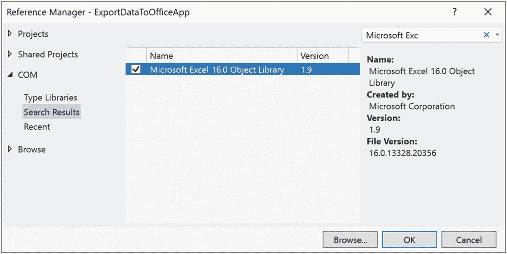
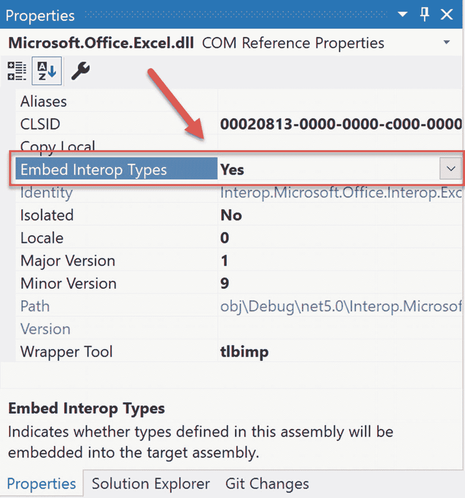

# 十八、动态类型和动态语言运行时

NET 4.0 为 C# 语言引入了一个新的关键字，具体来说就是`dynamic`。该关键字允许您将类似脚本的行为合并到类型安全、分号和花括号的强类型世界中。使用这种松散的类型，您可以极大地简化一些复杂的编码任务，还可以获得与许多动态语言进行互操作的能力。网核悟性。

在这一章中，将向您介绍 C# `dynamic`关键字，并理解如何使用动态语言运行时(DLR)将松散类型的调用映射到正确的内存对象。在理解了 DLR 提供的服务之后，您将会看到使用动态类型来简化如何执行延迟绑定方法调用(通过反射服务)以及如何轻松地与传统 COM 库进行通信的示例。

Note

不要混淆 C# `dynamic`关键字和*动态汇编*的概念(参见第十九章)。虽然在构建动态程序集时可以使用`dynamic`关键字，但这最终是两个独立的概念。

## C# 动态关键字的作用

在第三章中，你学习了`var`关键字，它允许你以这样一种方式定义局部变量，即底层数据类型是在编译时根据初始赋值确定的(回想一下这被称为*隐式类型化*)。一旦进行了初始赋值，就有了一个强类型变量，任何试图赋值不兼容的值都会导致编译器错误。

要开始研究 C# `dynamic`关键字，请创建一个名为 DynamicKeyword 的新控制台应用项目。现在，在您的`Program`类中添加下面的方法，并验证如果取消注释，最终的代码语句确实会触发编译时错误:

```cs
static void ImplicitlyTypedVariable()
{
  // a is of type List<int>.
  var a = new List<int> {90};
  // This would be a compile-time error!
  // a = "Hello";
}

```

仅仅为了这样做而使用隐式类型被一些人认为是不好的风格(如果你知道你需要一个`List<int>`，只需要声明一个`List<int>`)。然而，正如你在第十三章中看到的，隐式类型对 LINQ 很有用，因为许多 LINQ 查询返回匿名类的枚举(通过投影)，你不能在你的 C# 代码中直接声明。然而，即使在这种情况下，隐式类型变量实际上也是强类型的。

与此相关，正如你在第六章中了解到的，`System.Object`是。NET 核心框架，可以代表任何东西。同样，如果你声明了一个类型为`object`的变量，你就有了一个强类型的数据；但是，它在内存中指向的内容会因引用的赋值而不同。要访问内存中对象引用所指向的成员，需要执行显式强制转换。

假设您有一个名为`Person`的简单类，它定义了两个自动属性(`FirstName`和`LastName`)，这两个属性都封装了一个`string`。现在，观察下面的代码:

```cs
static void UseObjectVariable()
{
  // Assume we have a class named Person.
  object o = new Person() { FirstName = "Mike", LastName = "Larson" };

  // Must cast object as Person to gain access
  // to the Person properties.
  Console.WriteLine("Person's first name is {0}", ((Person)o).FirstName);
}

```

现在，回到`dynamic`关键词。从高层次来看，您可以将`dynamic`关键字视为`System.Object`的一种特殊形式，因为任何值都可以赋给动态数据类型。乍一看，这可能会令人非常困惑，因为现在您似乎有三种方法来定义其基础类型没有在您的代码库中直接指示的数据。例如，这种方法

```cs
static void PrintThreeStrings()
{
  var s1 = "Greetings";
  object s2 = "From";
  dynamic s3 = "Minneapolis";

  Console.WriteLine("s1 is of type: {0}", s1.GetType());
  Console.WriteLine("s2 is of type: {0}", s2.GetType());
  Console.WriteLine("s3 is of type: {0}", s3.GetType());
}

```

如果从`Main()`调用，将打印出以下内容:

```cs
s1 is of type: System.String
s2 is of type: System.String
s3 is of type: System.String

```

动态变量与隐式声明或通过`System.Object`引用声明的变量有很大不同，因为它是*而不是强类型的*。换个方式说，动态数据不是*静态类型化的*。就 C# 编译器而言，用`dynamic`关键字声明的数据点可以被赋予任何初始值，也可以在其生命周期内被重新赋予任何新的(也可能是不相关的)值。考虑以下方法和结果输出:

```cs
static void ChangeDynamicDataType()
{
  // Declare a single dynamic data point
  // named "t".
  dynamic t = "Hello!";
  Console.WriteLine("t is of type: {0}", t.GetType());

  t = false;
  Console.WriteLine("t is of type: {0}", t.GetType());

  t = new List<int>();
  Console.WriteLine("t is of type: {0}", t.GetType());
}
t is of type: System.String
t is of type: System.Boolean
t is of type: System.Collections.Generic.List`1[System.Int32]

```

在您研究的这一点上，请注意，如果您将`t`变量声明为`System.Object`，前面的代码会以相同的方式编译和执行。然而，你很快就会看到，`dynamic`关键字提供了许多额外的功能。

### 对动态声明的数据调用成员

假设一个动态变量可以动态地呈现任何类型的身份(就像类型为`System.Object`的变量一样)，那么您想到的下一个问题可能是关于调用动态变量的成员(属性、方法、索引器、注册事件等)。).嗯，从语法上来说，它看起来也没有什么不同。只需对动态数据变量应用点运算符，指定一个公共成员，并提供任何参数(如果需要)。

然而(这是一个非常大的“然而”)，你指定的成员的有效性不会被编译器检查！记住，与定义为`System.Object`的变量不同，动态数据不是静态类型的。直到运行时，您才会知道您调用的动态数据是否支持指定的成员，您是否传入了正确的参数，您是否正确地拼写了成员，等等。因此，尽管看起来很奇怪，下面的方法可以完美地编译:

```cs
static void InvokeMembersOnDynamicData()
{
  dynamic textData1 = "Hello";
  Console.WriteLine(textData1.ToUpper());

  // You would expect compiler errors here!
  // But they compile just fine.
  Console.WriteLine(textData1.toupper());
  Console.WriteLine(textData1.Foo(10, "ee", DateTime.Now));
}

```

注意对`WriteLine()`的第二次调用试图在动态数据点上调用名为`toupper()`的方法(注意不正确的大小写——应该是`ToUpper()`)。如您所见，`textData1`的类型是`string`，因此，您知道它没有一个全部用小写字母命名的方法。此外，`string`肯定没有一个名为`Foo()`的方法接受`int`、`string`和`DateTime`对象！

尽管如此，C# 编译器还是满意的。然而，如果您从`Main()`中调用这个方法，您将得到如下输出所示的运行时错误:

```cs
Unhandled Exception: Microsoft.CSharp.RuntimeBinder.RuntimeBinderException:
'string' does not contain a definition for 'toupper'

```

对动态数据和强类型数据调用成员的另一个明显区别是，当您对一段动态数据应用点运算符时，您将*而不是*看到预期的 Visual Studio IntelliSense。IDE 将允许您输入任何您能想到的成员名称。

智能感知对于动态数据是不可能的，这应该是有道理的。但是，请记住，这意味着当您在这样的数据点上键入 C# 代码时，您需要非常小心。成员的任何拼写错误或不正确的大写都会引发运行时错误，特别是`RuntimeBinderException`类的实例。

`RuntimeBinderException`表示一个错误，如果你试图调用一个实际上并不存在的动态数据类型的成员，就会抛出这个错误(就像在`toupper()`和`Foo()`方法的情况下)。如果您为确实存在的成员指定了错误的参数数据，也会引发同样的错误。

因为动态数据非常不稳定，所以每当您调用用 C# `dynamic`关键字声明的变量的成员时，您可以将调用包装在适当的`try` / `catch`块中，并以优雅的方式处理错误，如下所示:

```cs
static void InvokeMembersOnDynamicData()
{
  dynamic textData1 = "Hello";

  try
  {
    Console.WriteLine(textData1.ToUpper());
    Console.WriteLine(textData1.toupper());
    Console.WriteLine(textData1.Foo(10, "ee", DateTime.Now));
  }
  catch (Microsoft.CSharp.RuntimeBinder.RuntimeBinderException ex)
  {
    Console.WriteLine(ex.Message);
  }
}

```

如果再调用这个方法，会发现对`ToUpper()`(注意大写 *T* 和 *U* 的调用工作正常；但是，您会发现控制台上显示了错误数据。

```cs
HELLO
'string' does not contain a definition for 'toupper'

```

当然，将所有动态方法调用包装在一个`try` / `catch`块中的过程相当繁琐。如果您注意拼写和参数传递，这不是必需的。但是，如果您事先不知道某个成员是否会出现在目标类型上，那么捕捉异常就非常方便。

### 动态关键字的范围

回想一下，隐式类型数据(用`var`关键字声明)只可能用于成员范围内的局部变量。`var`关键字永远不能用作返回值、参数或类/结构的成员。然而，`dynamic`关键词却不是这种情况。考虑下面的类定义:

```cs
namespace DynamicKeyword
{
  class VeryDynamicClass
  {
    // A dynamic field.
    private static dynamic _myDynamicField;

    // A dynamic property.
    public dynamic DynamicProperty { get; set; }

    // A dynamic return type and a dynamic parameter type.
    public dynamic DynamicMethod(dynamic dynamicParam)
    {
      // A dynamic local variable.
      dynamic dynamicLocalVar = "Local variable";

      int myInt = 10;

      if (dynamicParam is int)
      {
        return dynamicLocalVar;
      }
      else
      {
        return myInt;
      }
    }
  }
}

```

您现在可以像预期的那样调用公共成员；但是，当您操作动态方法和属性时，您不能完全确定数据类型是什么！可以肯定的是，`VeryDynamicClass`的定义在现实世界的应用中可能没有用，但是它确实说明了可以应用这个 C# 关键字的范围。

### 动态关键字的限制

虽然使用关键字`dynamic`可以定义很多东西，但是它的用法有一些限制。虽然它们并不引人注目，但是要知道，在调用方法时，动态数据项不能使用 lambda 表达式或 C# 匿名方法。例如，下面的代码总是会导致错误，即使目标方法确实接受了一个委托参数，该参数接受一个`string`值并返回`void`:

```cs
dynamic a = GetDynamicObject();

// Error! Methods on dynamic data can't use lambdas!
a.Method(arg => Console.WriteLine(arg));

```

为了规避这个限制，你需要使用第十二章中描述的技术直接使用底层委托。另一个限制是数据的动态点不能理解任何扩展方法(参见第十一章)。不幸的是，这也将包括来自 LINQ API 的任何扩展方法。因此，用`dynamic`关键字声明的变量在 LINQ 中的使用仅限于对象和其他 LINQ 技术。

```cs
dynamic a = GetDynamicObject();
// Error! Dynamic data can't find the Select() extension method!
var data = from d in a select d;

```

### 动态关键字的实际应用

假设动态数据不是强类型的，没有在编译时进行检查，没有能力触发智能感知，也不能成为 LINQ 查询的目标，那么您完全有理由认为仅仅为了这样做而使用`dynamic`关键字是一种糟糕的编程实践。

然而，在少数情况下，`dynamic`关键字可以从根本上减少您需要手工编写的代码量。具体来说，如果您正在构建一个大量使用延迟绑定(通过反射)的. NET 核心应用，那么`dynamic`关键字可以节省您的输入时间。同样，如果您正在构建一个需要与遗留 COM 库(如微软 Office 产品)通信的. NET 核心应用，您可以通过`dynamic`关键字极大地简化您的代码库。最后一个例子，使用 ASP.NET 核心构建的 web 应用经常使用`ViewBag`类型，也可以使用`dynamic`关键字以简化的方式访问。

Note

COM 交互严格来说是一种 Windows 范式，它消除了应用的跨平台能力。

像任何“捷径”一样，你需要权衡利弊。关键字`dynamic`的使用是代码简洁和类型安全之间的权衡。虽然 C# 本质上是一种强类型语言，但您可以根据调用情况选择加入(或退出)动态行为。永远记住你永远不需要使用`dynamic`关键字。您可以通过手工编写替代代码(通常更多)来获得相同的最终结果。

## 动态语言运行库的作用

现在您更好地理解了“动态数据”是什么，让我们学习它是如何处理的。自从发布以来。NET 4.0 中，公共语言运行时(CLR)补充了一个名为动态语言运行时的补充运行时环境。“动态运行时”的概念当然不是新的。事实上，许多编程语言如 JavaScript、LISP、Ruby 和 Python 已经使用它很多年了。简而言之，动态运行时允许动态语言在运行时完全发现类型，无需编译时检查。

Note

虽然大量的 DLR 被移植到。NET Core(从 3.0 开始)，具有 DLR 之间的奇偶校验功能.NETCore 5 和。NET 4.8 还没做到。

如果你有强类型语言(包括 C#，没有动态类型)的背景，那么这种运行时的概念可能是不可取的。毕竟，您通常希望尽可能接收编译时错误，而不是运行时错误。然而，动态语言/运行时确实提供了一些有趣的特性，包括:

*   极其灵活的代码库。您可以重构代码，而无需对数据类型进行大量更改。

*   一种与不同平台和编程语言中构建的不同对象类型进行互操作的简单方法。

*   一种在运行时在内存中添加或移除类型成员的方法。

DLR 的一个作用是支持各种动态语言与。NET 运行库，并为它们提供了一种与其他。NET 代码。这些语言生活在一个动态的世界中，类型只在运行时被发现。然而，这些语言拥有丰富的。NET 基础类库。更好的是，由于包含了`dynamic`关键字，它们的代码库可以与 C# 互操作(反之亦然)。

Note

本章不会讨论如何使用 DLR 来集成动态语言。

### 表达式树的作用

DLR 利用*表达式树*来捕捉中性术语中动态调用的含义。例如，以下面的 C# 代码为例:

```cs
dynamic d = GetSomeData();
d.SuperMethod(12);

```

在这个例子中，DLR 将自动构建一个表达式树，实际上就是“调用对象`d`上名为`SuperMethod`的方法，将数字`12`作为参数传入”该信息(正式名称为*有效负载*)随后被传递给正确的运行时绑定器，该绑定器也可以是 C# 动态绑定器，甚至是(简单解释一下)遗留 COM 对象。

从这里，请求被映射到目标对象所需的调用结构中。这些表达式树的好处(除此之外，您不需要手动创建它们)是，这允许您编写固定的 C# 代码语句，而不用担心底层目标实际上是什么。

### 表达式树的动态运行时查找

如前所述，DLR 会将表达式树传递给目标对象；但是，这种调度会受到一些因素的影响。如果动态数据类型在内存中指向一个 COM 对象，则表达式树被发送到一个名为`IDispatch`的低级 COM 接口。正如您可能知道的，这个接口是 COM 合并它自己的一组动态服务的方式。然而，COM 对象可以在不使用 DLR 或 C# `dynamic`关键字的情况下在. NET 应用中使用。然而，这样做(正如您将看到的)，往往会导致更复杂的 C# 编码。

如果动态数据没有指向 COM 对象，表达式树可以被传递给实现`IDynamicObject`接口的对象。该接口在后台使用，允许诸如 IronRuby 之类的语言获取 DLR 表达式树并将其映射到 Ruby 细节。

最后，如果动态数据指向的对象是*而不是*COM 对象，并且*而不是*实现了`IDynamicObject`，那么这个对象就是一个普通的日常对象。NET 对象。在这种情况下，表达式树被分派到 C# 运行时绑定器进行处理。将表达式树映射到。NET specifications 涉及反射服务。

在表达式树被给定的绑定器处理后，动态数据将被解析为真正的内存数据类型，之后使用任何必要的参数调用正确的方法。现在，让我们看看 DLR 的一些实际用途，从延迟绑定的简化开始.NET 电话。

## 使用动态类型简化延迟绑定调用

您可能决定使用`dynamic`关键字的一个实例是当您使用反射服务时，特别是在进行延迟绑定方法调用时。在第十七章中，你看到了一些这种类型的方法调用有用的例子，最常见的是在你构建某种类型的可扩展应用时。那时，您学习了如何使用`Activator.CreateInstance()`方法来创建一个`object`，对此您没有任何编译时知识(除了它的显示名称)。然后，您可以利用`System.Reflection`名称空间的类型通过延迟绑定来调用成员。回想一下第十七章中的例子:

```cs
static void CreateUsingLateBinding(Assembly asm)
{
  try
  {
    // Get metadata for the Minivan type.
    Type miniVan = asm.GetType("CarLibrary.MiniVan");

    // Create the Minivan on the fly.
    object obj = Activator.CreateInstance(miniVan);

    // Get info for TurboBoost.
    MethodInfo mi = miniVan.GetMethod("TurboBoost");

    // Invoke method ("null" for no parameters).
    mi.Invoke(obj, null);
  }
  catch (Exception ex)
  {
    Console.WriteLine(ex.Message);
  }
}

```

虽然这段代码像预期的那样工作，但您可能会认为它有点笨拙。您必须手动使用`MethodInfo`类，手动查询元数据，等等。下面是同一方法的一个版本，现在使用 C# `dynamic`关键字和 DLR:

```cs
static void InvokeMethodWithDynamicKeyword(Assembly asm)
{
  try
  {
    // Get metadata for the Minivan type.
    Type miniVan = asm.GetType("CarLibrary.MiniVan");

    // Create the Minivan on the fly and call method!
    dynamic obj = Activator.CreateInstance(miniVan);
    obj.TurboBoost();
  }
  catch (Exception ex)
  {
    Console.WriteLine(ex.Message);
  }
}

```

通过使用`dynamic`关键字声明`obj`变量，反射的繁重工作由 DRL 代表您完成。

### 利用动态关键字传递参数

当您需要对接受参数的方法进行延迟绑定调用时，DLR 的用处会变得更加明显。当你使用“手写”反射调用时，参数需要打包成一个数组`objects`，传递给`MethodInfo`的`Invoke()`方法。

为了使用新的示例进行说明，首先创建一个名为 LateBindingWithDynamic 的新 C# 控制台应用项目。接下来，添加一个名为 MathLibrary 的类库项目。将 MathLibrary 项目的初始文件`Class1.cs`重命名为`SimpleMath.cs`，并如下实现该类:

```cs
namespace MathLibrary
{
  public class SimpleMath
  {
    public int Add(int x, int y)
    {
      return x + y;
    }
  }
}

```

用以下内容更新`MathLibrary.csproj`文件(将编译后的程序集复制到`LateBindingWithDynamic`目标目录):

```cs
<Target Name="PostBuild" AfterTargets="PostBuildEvent">
    <Exec Command="copy $(TargetPath) $(SolutionDir)LateBindingWithDynamic\$(OutDir)$(TargetFileName) /Y 
copy $(TargetPath) $(SolutionDir)LateBindingWithDynamic\$(TargetFileName) /Y" />
</Target>

```

Note

如果这些项目构建事件对您来说是新的，请回顾第十七章中的技术以获得完整的细节。

现在，回到 LateBindingWithDynamic 项目，将`System.Reflection`和`Microsoft.CSharp.RuntimeBinder`名称空间导入到`Program.cs`文件中。接下来，将下面的方法添加到`Program`类，该类使用典型的反射 API 调用来调用`Add()`方法:

```cs
static void AddWithReflection()
{
  Assembly asm = Assembly.LoadFrom("MathLibrary");
  try
  {
    // Get metadata for the SimpleMath type.
    Type math = asm.GetType("MathLibrary.SimpleMath");

    // Create a SimpleMath on the fly.
    object obj = Activator.CreateInstance(math);

    // Get info for Add.
    MethodInfo mi = math.GetMethod("Add");

    // Invoke method (with parameters).
    object[] args = { 10, 70 };
    Console.WriteLine("Result is: {0}", mi.Invoke(obj, args));
  }
  catch (Exception ex)
  {
    Console.WriteLine(ex.Message);
  }
}

```

现在，通过下面的新方法，考虑用关键字`dynamic`简化前面的逻辑:

```cs
private static void AddWithDynamic()
{
  Assembly asm = Assembly.LoadFrom("MathLibrary");

  try
  {
    // Get metadata for the SimpleMath type.
    Type math = asm.GetType("MathLibrary.SimpleMath");

    // Create a SimpleMath on the fly.
    dynamic obj = Activator.CreateInstance(math);

    // Note how easily we can now call Add().
    Console.WriteLine("Result is: {0}", obj.Add(10, 70));
  }
  catch (RuntimeBinderException ex)
  {
    Console.WriteLine(ex.Message);
  }
}

```

不算太寒酸！如果您调用这两个方法，您将看到相同的输出。然而，当使用`dynamic`关键字时，您为自己节省了相当多的工作。使用动态定义的数据，您不再需要手动将参数打包为对象数组、查询程序集元数据或其他类似的详细信息。如果您正在构建一个大量使用动态加载/延迟绑定的应用，我相信您可以看到这些代码节省是如何随着时间的推移而增加的。

## 使用动态数据简化 COM 互操作性(仅限 Windows)

让我们看一下在 COM 互用性项目的上下文中`dynamic`关键字的另一个有用的例子。现在，如果您对 COM 开发没有太多的背景知识，请注意下一个例子，编译后的 COM 库包含元数据，就像. NET 核心库一样；但是，格式完全不同。正因为如此，如果一个. NET 核心程序需要与一个 COM 对象通信，首先要做的就是生成一个所谓的*互操作程序集*(将在下面的段落中描述)。这样做非常简单。

Note

如果您没有安装 Visual Studio Tools for Office(VSTO)单个组件或“Office/SharePoint development”工作负载，则需要这样做才能完成本节。您可以重新运行安装程序来选择缺少的组件，也可以使用 Visual Studio 快速启动(Ctrl+Q)。在快速启动中键入**Visual Studio Tools for Office**并选择安装选项。

首先，创建一个名为 ExportDataToOfficeApp 的新控制台应用，通过在解决方案资源管理器中右击该项目来激活“添加 COM 引用”对话框，然后选择“添加➤ COM 引用”。选中 COM 页签，找到你要使用的 COM 库，就是微软 Excel 16.0 对象库(见图 18-1 )。



图 18-1。

“添加引用”对话框的“COM”选项卡将显示计算机上所有注册的 COM 库

一旦选择了 COM 库，IDE 将通过生成包含。COM 元数据的. NET 描述。正式来说，这些被称为*互用性程序集*(或者简称为*互操作程序集*)。互操作程序集不包含任何实现代码，除了少量帮助将 COM 事件转换为.NETCore 事件。但是，这些互操作程序集是有用的，因为它们屏蔽了您的。NET 核心代码库来自 COM 内部的复杂底层。

在 C# 代码中，您可以直接针对 interop 程序集进行编程，该程序集映射。NET 核心数据类型转换为 COM 类型，反之亦然。在后台，数据在。NET 核心和 COM 应用使用运行时可调用包装器(RCW)，这基本上是一个动态生成的代理。这个 RCW 代理将会整理和转换。NET 核心数据类型转换为 COM 类型，并将任何 COM 返回值映射到。核心等价物净额。

### 主互操作程序集的角色

许多由 COM 库供应商创建的 COM 库(例如允许访问 Microsoft Office 产品的对象模型的 Microsoft COM 库)提供了一个“官方”的互操作程序集，称为*主互操作程序集* (PIA)。pia 是优化的互操作程序集，它清理(并可能扩展)通常在使用“添加引用”对话框引用 COM 库时生成的代码。

引用 Microsoft Excel 16.0 对象库后，在解决方案资源管理器中检查项目。在 Dependencies 节点下，您将看到一个新节点(COM ),其中包含一个名为 interop . Microsoft . office . interop . excel 的项。

### 嵌入互操作元数据

在发布之前。NET 4.0 中，当 C# 应用使用 COM 库(PIA 或其他)时，您需要确保客户端计算机在其计算机上有一个 interop 程序集的副本。这不仅增加了应用安装程序包的大小，而且安装脚本必须检查 PIA 程序集是否确实存在，如果不存在，就将一个副本安装到全局程序集缓存(GAC)中。

Note

全局程序集缓存是。NET framework 程序集。它不再用于。NET 核心。

然而，随着。NET 4.0 和更高版本，您现在可以将互用性数据直接嵌入到您编译的应用中。当您这样做时，您不再需要随您的一起提供互用性程序集的副本。NET 核心应用，因为必要的互用性元数据是硬编码在程序中的。和。NET 核心，嵌入 PIA 是必需的。

要使用 Visual Studio 嵌入 PIA，请展开项目下的“依赖项”节点，展开“COM”节点，右键单击“互操作”。然后选择属性。在属性对话框中，将嵌入互操作类型的值更改为 Yes，如图 18-2 所示。



图 18-2。

嵌入互操作类型

要通过项目文件改变属性，添加`<EmbedInteropTypes>True</EmbedInteropTypes >`，如下图所示:

```cs
<ItemGroup>
  <COMReference Include="Microsoft.Office.Excel.dll">
    <Guid>00020813-0000-0000-c000-000000000046</Guid>
    <VersionMajor>1</VersionMajor>
    <VersionMinor>9</VersionMinor>
    <WrapperTool>tlbimp</WrapperTool>
    <Lcid>0</Lcid>
    <Isolated>false</Isolated>
    <EmbedInteropTypes>true</EmbedInteropTypes>
  </COMReference>
</ItemGroup>

```

C# 编译器将只包含您正在使用的互操作库部分。因此，如果真正的互操作库。NET 核心描述数百个 COM 对象，您将只引入您在 C# 代码中真正使用的子集的定义。除了减少必须部署的文件大小，您还有一个更容易的安装路径，因为您不需要在目标机器上安装任何缺失的 pia。

### 常见的 COM 互操作难点

许多 COM 库定义了采用可选参数的方法，这在 C# 中直到才得到支持。净 3.5。这要求您为可选参数的每次出现指定值`Type.Missing`。谢天谢地有了。NET 3.5 及以上(包括。NET Core)，如果您没有指定一个特定的值，`Type.Missing`值将在编译时被插入。

与此相关的是，许多 COM 方法提供了对命名参数的支持，正如你在第四章中回忆的那样，它允许你以任何你需要的顺序将值传递给成员。假设 C# 支持这个相同的特性，很容易“跳过”一组您不关心的可选参数，只设置您关心的几个参数。

另一个常见的 COM 互操作痛点是，许多 COM 方法被设计为接受和返回一个特定的数据类型，称为`Variant`。很像 C# `dynamic`关键字，`Variant`数据类型可以动态地分配给任何类型的 COM 数据(字符串、接口引用、数值等)。).在拥有`dynamic`关键字之前，传递或接收`Variant`数据点需要一些跳跃，通常是通过大量的转换操作。

当您将“嵌入互操作类型”属性设置为 True 时，所有 COM `Variant`类型都会自动映射到动态数据。这不仅会减少在处理底层 COM `Variant`数据类型时对额外转换操作的需求，还会进一步隐藏一些 COM 复杂性，比如处理 COM 索引器。

使用 COM Interop 和。NET 5 缺乏构建和运行时支持。那个。MSBuild . NET 5 版本无法解析互操作库，因此。使用 COM interop 的. NET Core 项目不能使用。NET Core CLI。它们必须使用 Visual Studio 构建，并且编译后的可执行文件可以按预期运行。

## 使用 C# 动态数据的 COM 互操作

为了展示 C# 可选参数、命名参数和`dynamic`关键字如何一起简化 COM 互操作，现在您将构建一个使用 Microsoft Office 对象模型的应用。添加包含以下代码的新类名`Car.cs`:

```cs
namespace ExportDataToOfficeApp
{
  public class Car
  {
    public string Make { get; set; }
    public string Color { get; set; }
    public string PetName { get; set; }
  }
}

```

接下来，将以下`using`语句添加到`Program.cs`的顶部:

```cs
using System;
using System.Collections.Generic;
using System.Reflection;
using Excel = Microsoft.Office.Interop.Excel;
using ExportDataToOfficeApp;

```

请注意 Excel 命名空间别名。虽然在与 COM 库交互时不需要定义别名，但它为所有导入的 COM 对象提供了一个缩短的限定符。这不仅减少了输入，还可以解决 COM 对象的名称与.NETCore 类型。

```cs
// Create an alias to the Excel object model.
using Excel = Microsoft.Office.Interop.Excel;

```

接下来，在`Program.cs`的顶层语句中创建一个`Car`记录列表:

```cs
List<Car> carsInStock = new List<Car>
{
  new Car {Color="Green", Make="VW", PetName="Mary"},
  new Car {Color="Red", Make="Saab", PetName="Mel"},
  new Car {Color="Black", Make="Ford", PetName="Hank"},
  new Car {Color="Yellow", Make="BMW", PetName="Davie"}
};

```

因为您使用 Visual Studio 导入了 COM 库，所以 PIA 已被自动配置，以便所使用的元数据将被嵌入到。NET 核心应用。因此，所有 COM `Variant`数据类型都实现为`dynamic`数据类型。此外，您可以使用 C# 可选参数和命名参数。考虑下面的`ExportToExcel()`实现:

```cs
void ExportToExcel(List<Car> carsInStock)
{
  // Load up Excel, then make a new empty workbook.
  Excel.Application excelApp = new Excel.Application();
  excelApp.Workbooks.Add();

  // This example uses a single workSheet.
  Excel._Worksheet workSheet = (Excel._Worksheet)excelApp.ActiveSheet;

  // Establish column headings in cells.
  workSheet.Cells[1, "A"] = "Make";
  workSheet.Cells[1, "B"] = "Color";
  workSheet.Cells[1, "C"] = "Pet Name";

  // Now, map all data in List<Car> to the cells of the spreadsheet.
  int row = 1;
  foreach (Car c in carsInStock)
  {
    row++;
    workSheet.Cells[row, "A"] = c.Make;
    workSheet.Cells[row, "B"] = c.Color;
    workSheet.Cells[row, "C"] = c.PetName;
  }

  // Give our table data a nice look and feel.
  workSheet.Range["A1"].AutoFormat(Excel.XlRangeAutoFormat.xlRangeAutoFormatClassic2);

  // Save the file, quit Excel, and display message to user.
  workSheet.SaveAs($@"{Environment.CurrentDirectory}\Inventory.xlsx");
  excelApp.Quit();
  Console.WriteLine("The Inventory.xslx file has been saved to your app folder");
}

```

该方法首先将 Excel 加载到内存中；但是，您不会在电脑桌面上看到它。对于这个应用，您只对使用内部 Excel 对象模型感兴趣。但是，如果您确实想显示 Excel 的用户界面，请用下面的代码行更新您的方法:

```cs
static void ExportToExcel(List<Car> carsInStock)
{
  // Load up Excel, then make a new empty workbook.
  Excel.Application excelApp = new Excel.Application();

  // Go ahead and make Excel visible on the computer.
  excelApp.Visible = true;
...
}

```

创建一个空工作表后，添加三列，它们的名称类似于`Car`类的属性。然后，用`List<Car>`的数据填充单元格，并以(硬编码的)名称`Inventory.xlsx`保存文件。

此时，如果您运行您的应用，您将能够打开`Inventory.xlsx`文件，该文件将被保存到项目的`\bin\Debug\net5.0`文件夹中。

虽然在前面的代码中似乎没有使用任何动态数据，但要知道 DLR 提供了重要的帮助。如果没有 DLR，代码应该是这样的:

```cs
static void ExportToExcelManual(List<Car> carsInStock)
{
  Excel.Application excelApp = new Excel.Application();
  // Must mark missing params!
  excelApp.Workbooks.Add(Type.Missing);
  // Must cast Object as _Worksheet!
  Excel._Worksheet workSheet =
    (Excel._Worksheet)excelApp.ActiveSheet;
  // Must cast each Object as Range object then call low-level Value2 property!
  ((Excel.Range)excelApp.Cells[1, "A"]).Value2 = "Make";
  ((Excel.Range)excelApp.Cells[1, "B"]).Value2 = "Color";
  ((Excel.Range)excelApp.Cells[1, "C"]).Value2 = "Pet Name";
  int row = 1;
  foreach (Car c in carsInStock)
  {
    row++;
    // Must cast each Object as Range and call low-level Value2 prop!
    ((Excel.Range)workSheet.Cells[row, "A"]).Value2 = c.Make;
    ((Excel.Range)workSheet.Cells[row, "B"]).Value2 = c.Color;
    ((Excel.Range)workSheet.Cells[row, "C"]).Value2 = c.PetName;
  }
  // Must call get_Range method and then specify all missing args!
  excelApp.get_Range("A1", Type.Missing).AutoFormat(
    Excel.XlRangeAutoFormat.xlRangeAutoFormatClassic2,
    Type.Missing, Type.Missing, Type.Missing,
    Type.Missing, Type.Missing, Type.Missing);
  // Must specify all missing optional args!
  workSheet.SaveAs(
    $@"{Environment.CurrentDirectory}\InventoryManual.xlsx",
    Type.Missing, Type.Missing, Type.Missing,
    Type.Missing, Type.Missing, Type.Missing,
    Type.Missing, Type.Missing, Type.Missing);
  excelApp.Quit();
  Console.WriteLine("The InventoryManual.xslx file has been saved to your app folder");
}

```

这就结束了你对 C# `dynamic`关键字和 DLR 的研究。我希望您能看到这些特性如何简化复杂的编程任务，并且(也许更重要的是)理解其中的利弊。当您选择使用动态数据时，您确实失去了大量的类型安全性，并且您的代码库容易出现更多的运行时错误。

虽然关于 DLR 肯定还有更多要说的，但本章试图将重点放在日常编程中实用和有用的主题上。如果您想了解更多关于动态语言运行库的高级功能，如与脚本语言集成，请务必参考。NET Core SDK 文档(查阅主题“动态语言运行时概述”开始)。

## 摘要

关键字`dynamic`允许你定义直到运行时才知道其身份的数据。当由动态语言运行时处理时，自动创建的“表达式树”将被传递到正确的动态语言绑定器，在那里有效负载将被解包并发送到正确的对象成员。

使用动态数据和 DLR，可以从根本上简化复杂的 C# 编程任务，尤其是将 COM 库合并到。NET 核心应用。正如您在本章中看到的，这为 COM interop 提供了许多进一步的简化(与动态数据无关)，例如将 COM interop 数据嵌入到您的应用、可选参数和命名参数中。

虽然这些特性确实可以简化您的代码，但是请记住，动态数据会使您的 C# 代码的类型安全性大大降低，并且容易出现运行时错误。一定要权衡在 C# 项目中使用动态数据的利弊，并进行相应的测试！