# 二十五、WPF 控件、布局、事件和数据绑定

第二十四章为 WPF 编程模型提供了基础，包括对`Window`和`Application`类的检查，XAML 的语法，以及代码文件的使用。第二十四章还向您介绍了使用 Visual Studio 的设计器构建 WPF 应用的过程。在本章中，您将使用几个新的控件和布局管理器深入研究更复杂的图形用户界面的构造，同时了解 Visual Studio 的 XAML 版 WPF 可视化设计器的其他功能。

本章还将研究一些重要的相关 WPF 控制主题，如数据绑定编程模型和控制命令的使用。您还将学习如何使用 Ink 和 Documents APIs，这两个 API 分别允许您捕获手写笔(或鼠标)输入和使用 XML Paper 规范构建富文本文档。

## WPF 核心控制措施调查

除非您对构建图形用户界面的概念不熟悉(这很好)，否则主要 WPF 控件的一般用途应该不会引起太多问题。不管你过去可能使用过哪种 GUI 工具包(例如 VB6、MFC、Java AWT/Swing、Windows Forms、macOS 或 GTK+/GTK #[等等])，表 25-1 中列出的核心 WPF 控件可能看起来很熟悉。

表 25-1。

核心 WPF 控件

<colgroup><col class="tcol1 align-left"> <col class="tcol2 align-left"> <col class="tcol3 align-left"></colgroup> 
| 

WPF 控制类别

 | 

成员示例

 | 

生命的意义

 |
| --- | --- | --- |
| 核心用户输入控件 | `Button`，`RadioButton`，`ComboBox`，`CheckBox`，`Calendar`，`DatePicker`，`Expander`，`DataGrid`，`ListBox`，`ListView`，`ToggleButton`，`TreeView`，`ContextMenu`，`ScrollBar`，`Slider`，`TabControl`，`TextBlock`，`TextBox`，`RepeatButton`，`RichTextBox`，`Label` | WPF 提供了一个完整的控件家族，你可以用它来构建用户界面的核心。 |
| 窗口和控件装饰 | `Menu`、`ToolBar`、`StatusBar`、`ToolTip`、`ProgressBar` | 您使用这些 UI 元素来装饰带有输入设备(如`Menu`)和用户信息元素(如`StatusBar`和`ToolTip`)的`Window`对象的框架。 |
| 媒体控制 | `Image`、`MediaElement`、`SoundPlayerAction` | 这些控件支持音频/视频回放和图像显示。 |
| 布局控件 | `Border`、`Canvas`、`DockPanel`、`Grid`、`GridView`、`GridSplitter`、`GroupBox`、`Panel`、`TabControl`、`StackPanel`、`Viewbox`、`WrapPanel` | WPF 提供了许多控件，允许您分组和组织其他控件以进行布局管理。 |

Note

本章的目的是*而不是*介绍每个 WPF 控件的每个成员。相反，您将获得各种控件的概述，重点是大多数 WPF 控件通用的基础编程模型和关键服务。

### WPF 油墨控制

除了表 25-1 中列出的常见 WPF 控件，WPF 还定义了用于数字墨水 API 的附加控件。WPF 开发的这一方面在 Tablet PC 开发过程中非常有用，因为它允许您从手写笔捕获输入。然而，这并不是说标准的桌面应用不能利用 Ink API，因为相同的控件可以使用鼠标捕获输入。

`PresentationCore.dll`的`System.Windows.Ink`名称空间包含各种 Ink API 支持类型(如`Stroke`和`StrokeCollection`)；然而，大多数的 Ink API 控件(例如，`InkCanvas`和`InkPresenter`)都与通用的 WPF 控件一起打包在`PresentationFramework.dll`汇编中的`System.Windows.Controls`名称空间下。在本章的后面，您将使用 Ink API。

### WPF 文件控制

WPF 还提供了高级文档处理控件，允许您构建包含 Adobe PDF 样式功能的应用。使用`System.Windows.Documents`名称空间中的类型(也在`PresentationFramework.dll`汇编中)，您可以创建支持缩放、搜索、用户注释(便笺)和其他富文本服务的打印就绪文档。

然而，在封面下，文档控件不使用 Adobe PDF APIs 相反，他们使用 XML 纸张规范(XPS) API。对最终用户来说，看起来真的没有区别，因为 PDF 文档和 XPS 文档具有几乎相同的外观和感觉。事实上，您可以找到许多免费的实用程序，允许您在两种文件格式之间进行动态转换。由于篇幅限制，这些控件将不在本版中讨论。

### WPF 通用对话框

WPF 还为您提供了一些常用的对话框，如`OpenFileDialog`和`SaveFileDialog`。这些对话框是在`PresentationFramework.dll`程序集的`Microsoft.Win32`名称空间中定义的。使用这些对话框都是创建一个对象并调用`ShowDialog()`方法，就像这样:

```cs
using Microsoft.Win32;
//omitted for brevity
private void btnShowDlg_Click(object sender, RoutedEventArgs e)
{
  // Show a file save dialog.
  SaveFileDialog saveDlg = new SaveFileDialog();
  saveDlg.ShowDialog();
}

```

正如您所希望的，这些类支持各种成员，这些成员允许您建立文件过滤器和目录路径，并获得对用户选择的文件的访问。您将在后面的示例中使用这些文件对话框；您还将学习如何构建自定义对话框来收集用户输入。

## Visual Studio WPF 设计器简评

这些标准 WPF 控件中的大部分都被打包在`PresentationFramework.dll`程序集的`System.Windows.Controls`名称空间中。当您使用 Visual Studio 构建 WPF 应用时，如果您有一个作为活动窗口打开的 WPF 设计器，您会发现工具箱中包含大多数这些常用控件。

类似于用 Visual Studio 创建的其他 UI 框架，你可以将这些控件拖到 WPF 窗口设计器上，并使用属性窗口配置它们(你在第二十四章中学到了)。虽然 Visual Studio 会为您生成大量的 XAML，但您自己手动编辑标记的情况并不少见。我们来复习一下基础知识。

### 使用 Visual Studio 处理 WPF 控件

你可能还记得第二十四章中的，当你把一个 WPF 控件放到 Visual Studio 设计器上时，你想通过属性窗口(或者直接通过 XAML)设置`x:Name`属性，因为这允许你访问相关 C# 代码文件中的对象。您可能还记得，可以使用“属性”窗口的“事件”选项卡为选定的控件生成事件处理程序。因此，您可以使用 Visual Studio 为一个简单的`Button`控件生成以下标记:

```cs
<Button x:Name="btnMyButton" Content="Click Me!" Height="23" Width="140" Click="btnMyButton_Click" />

```

这里，您将`Button`的`Content`属性设置为一个简单的值为`"Click Me!"`的`string`。然而，由于 WPF 控件内容模型，您可以设计一个包含以下复杂内容的`Button`:

```cs
<Button x:Name="btnMyButton" Height="121" Width="156" Click="btnMyButton_Click">
  <Button.Content>
    <StackPanel Height="95" Width="128" Orientation="Vertical">
      <Ellipse Fill="Red" Width="52" Height="45" Margin="5"/>
      <Label Width="59" FontSize="20" Content="Click!" Height="36" />
    </StackPanel>
  </Button.Content>
</Button>

```

您可能还记得,`ContentControl`派生类的直接子元素是隐含的内容；因此，在指定复杂内容时，您不需要明确定义一个`Button.Content`范围。您可以简单地编写以下内容:

```cs
<Button x:Name="btnMyButton" Height="121" Width="156" Click="btnMyButton_Click">
  <StackPanel Height="95" Width="128" Orientation="Vertical">
    <Ellipse Fill="Red" Width="52" Height="45" Margin="5"/>
    <Label Width="59" FontSize="20" Content="Click!" Height="36" />
  </StackPanel>
</Button>

```

在这两种情况下，都要将按钮的`Content`属性设置为相关项目的`StackPanel`。您还可以使用 Visual Studio 设计器创作这种复杂的内容。为内容控件定义布局管理器后，可以在设计器上选择它作为内部控件的放置目标。此时，您可以使用“属性”窗口编辑每个属性。如果您要使用“属性”窗口来处理`Button`控件的`Click`事件(如前面的 XAML 声明所示)，IDE 将生成一个空的事件处理程序，您可以向其中添加自己的自定义代码，如下所示:

```cs
private void btnMyButton_Click(object sender, RoutedEventArgs e)
{
  MessageBox.Show("You clicked the button!");
}

```

### 使用文档大纲编辑器

您应该还记得，在前一章中，Visual Studio 的“文档大纲”窗口(可以使用“查看➤其他窗口”菜单打开)在设计包含复杂内容的 WPF 控件时非常有用。为您正在构建的`Window`显示 XAML 的逻辑树，如果您单击这些节点中的任何一个，它将在可视设计器和 XAML 编辑器中被自动选中进行编辑。

在当前版本的 Visual Studio 中,“文档大纲”窗口有一些您可能会觉得有用的附加功能。在任何节点的右边，你会发现一个看起来像眼球的图标。当您切换此按钮时，您可以选择隐藏或显示设计器上的一个项目，这在您想要聚焦于要编辑的特定片段时会很有帮助(注意，这将*而不是*在运行时隐藏项目；这只隐藏设计器图面上的项)。

紧挨着“眼球图标”的是第二个开关，允许您锁定设计器上的一个项目。正如您可能猜到的，当您希望确保您(或您的同事)不会意外更改给定项目的 XAML 时，这可能会很有帮助。实际上，锁定一个项会使它在设计时成为只读的(但是，您可以在运行时更改对象的状态)。

## 使用面板控制内容布局

WPF 应用总是包含大量的 UI 元素(例如，用户输入控件、图形内容、菜单系统和状态栏)，这些元素需要在不同的窗口中进行良好的组织。放置 UI 元素后，您需要确保当最终用户调整窗口大小或可能调整窗口的一部分时(如拆分窗口的情况)，它们的行为符合预期。为了确保你的 WPF 控件在托管窗口中保持它们的位置，你可以利用大量的*面板类型*(也称为*布局管理器*)。

默认情况下，用 Visual Studio 创建的新 WPF `Window`将使用类型`Grid`的布局管理器(稍后会有更多细节)。然而，现在假设一个没有声明布局管理器的`Window`,如下所示:

```cs
<Window x:Class="MyWPFApp.MainWindow"
  xmlns:="http://schemas.microsoft.com/winfx/2006/xaml/presentation"
  xmlns:x="http://schemas.microsoft.com/winfx/2006/xaml"
  Title="Fun with Panels!" Height="285" Width="325">

</Window>

```

当您直接在不使用面板的窗口中声明控件时，该控件位于容器的正中央。考虑下面这个简单的窗口声明，它包含一个`Button`控件。无论您如何调整窗口大小，UI 小部件始终与客户区的四边等距。`Button`的大小由分配给`Button`的`Height`和`Width`属性决定。

```cs
<!- This button is in the center of the window at all times ->
<Window x:Class="MyWPFApp.MainWindow"
  xmlns:="http://schemas.microsoft.com/winfx/2006/xaml/presentation"
  xmlns:x="http://schemas.microsoft.com/winfx/2006/xaml"
  Title="Fun with Panels!" Height="285" Width="325">

  <Button x:Name="btnOK" Height = "100" Width="80" Content="OK"/>
</Window>

```

您可能还记得，如果您试图将多个元素直接放在一个`Window`的范围内，您将会收到标记和编译时错误。这些错误的原因是一个窗口(或者任何一个`ContentControl`的后代)只能分配一个对象给它的`Content`属性。因此，下面的 XAML 会产生标记和编译时错误:

```cs
<!- Error! Content property is implicitly set more than once! ->
<Window x:Class="MyWPFApp.MainWindow"
  xmlns:="http://schemas.microsoft.com/winfx/2006/xaml/presentation"
  xmlns:x="http://schemas.microsoft.com/winfx/2006/xaml"
  Title="Fun with Panels!" Height="285" Width="325">
  <!- Error! Two direct child elements of the <Window>! ->
  <Label x:Name="lblInstructions" Width="328" Height="27" FontSize="15" Content="Enter Information"/>
  <Button x:Name="btnOK" Height = "100" Width="80" Content="OK"/>
</Window>

```

显然，只能包含单个控件的窗口用处不大。当一个窗口需要包含多个元素时，这些元素必须排列在任意数量的面板中。面板将包含代表窗口的所有 UI 元素，之后面板本身被用作分配给`Content`属性的单个对象。

`System.Windows.Controls`名称空间提供了许多面板，每个面板控制如何维护子元素。如果最终用户调整了窗口的大小，如果控件保持在设计时放置的位置，如果控件从左到右水平重排或从上到下垂直重排，等等，都可以使用面板来确定控件的行为。

您还可以在其他面板中混合面板控件(例如，包含其他项目的`StackPanel`的`DockPanel`),以提供大量的灵活性和控制。表 25-2 记录了一些常用 WPF 面板控件的作用。

表 25-2。

核心 WPF 面板控制

<colgroup><col class="tcol1 align-left"> <col class="tcol2 align-left"></colgroup> 
| 

面板控制

 | 

生命的意义

 |
| --- | --- |
| `Canvas` | 提供内容放置的经典模式。项目会停留在设计时放置它们的地方。 |
| `DockPanel` | 将内容锁定到面板的指定一侧(`Top`、`Bottom`、`Left`或`Right`)。 |
| `Grid` | 在表格网格中维护的一系列单元格内排列内容。 |
| `StackPanel` | 按照`Orientation`属性的指示，以垂直或水平方式堆叠内容。 |
| `WrapPanel` | 从左到右放置内容，在包含框的边缘将内容换行。根据`Orientation`属性的值，后续排序从上到下或从右到左依次进行。 |

在接下来的几节中，您将通过将一些预定义的 XAML 数据复制到您在第二十四章中安装的`kaxaml.exe`应用中来学习如何使用这些常用的面板类型。你可以在你的章节 25 代码下载文件夹的`PanelMarkup`子文件夹中找到所有这些松散的 XAML 文件。使用 Kaxaml 时，要模拟调整窗口大小，请在标记中更改`Page`元素的高度或宽度。

### 在画布面板中定位内容

如果你来自 WinForms 背景，你可能会觉得使用`Canvas`面板最舒服，因为它允许 UI 内容的绝对定位。如果最终用户调整窗口的大小，使其小于由`Canvas`面板维护的布局，那么直到容器被拉伸到等于或大于`Canvas`区域的大小时，内部内容才可见。

要向`Canvas`添加内容，首先要在开始和结束`Canvas`标记的范围内定义所需的控件。接下来，指定每个控件的左上角；这是使用`Canvas.Top`和`Canvas.Left`属性开始渲染的地方。您可以通过设置控件的`Height`和`Width`属性来间接指定每个控件的右下角区域，或者通过使用`Canvas.Right`和`Canvas.Bottom`属性来直接指定。

要查看`Canvas`的运行，使用`kaxaml.exe`打开提供的`SimpleCanvas.xaml`文件。您应该会看到下面的`Canvas`定义(如果将这些例子加载到 WPF 应用中，您会希望将`Page`标签改为`Window`标签):

```cs
<Page
  xmlns:="http://schemas.microsoft.com/winfx/2006/xaml/presentation"
  xmlns:x="http://schemas.microsoft.com/winfx/2006/xaml"
  Title="Fun with Panels!" Height="285" Width="325">
  <Canvas Background="LightSteelBlue">
    <Button x:Name="btnOK" Canvas.Left="212" Canvas.Top="203" Width="80" Content="OK"/>
    <Label x:Name="lblInstructions" Canvas.Left="17" Canvas.Top="14" Width="328" Height="27" FontSize="15"
           Content="Enter Car Information"/>
    <Label x:Name="lblMake" Canvas.Left="17" Canvas.Top="60" Content="Make"/>
    <TextBox x:Name="txtMake" Canvas.Left="94" Canvas.Top="60" Width="193" Height="25"/>
    <Label x:Name="lblColor" Canvas.Left="17" Canvas.Top="109" Content="Color"/>
    <TextBox x:Name="txtColor" Canvas.Left="94" Canvas.Top="107" Width="193" Height="25"/>
    <Label x:Name="lblPetName" Canvas.Left="17" Canvas.Top="155" Content="Pet Name"/>
    <TextBox x:Name="txtPetName" Canvas.Left="94" Canvas.Top="153" Width="193" Height="25"/>
  </Canvas>
</Page>

```

您应该会在屏幕的上半部分看到如图 25-1 所示的窗口。

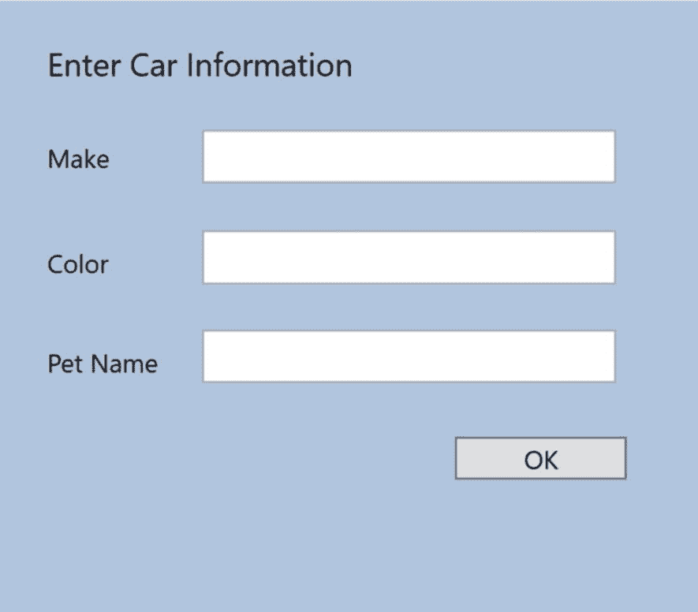

图 25-1。

*画布*布局管理器允许内容的绝对定位

请注意，您在`Canvas`中声明内容的顺序并不用于计算位置；相反，放置是基于控件的大小和`Canvas.Top`、`Canvas.Bottom`、`Canvas.Left`和`Canvas.Right`属性。

Note

如果`Canvas`中的子元素没有使用附加属性语法定义特定的位置(例如`Canvas.Left`和`Canvas.Top`，它们会自动附加到`Canvas`的左上角。

使用`Canvas`类型似乎是安排内容的首选方式(因为感觉很熟悉)，但是这种方法有一些限制。首先，`Canvas`中的项目在应用样式或模板时不会自动调整大小(例如，它们的字体大小不受影响)。其次，当最终用户将窗口调整到更小的表面时，`Canvas`不会试图保持元素可见。

也许`Canvas`类型的最佳用途是定位*图形内容*。例如，如果您使用 XAML 构建自定义图像，您肯定希望线条、形状和文本保持在相同的位置，而不是在用户调整窗口大小时看到它们动态地重新定位！当你研究 WPF 的图形渲染服务时，你会在第二十六章中重温`Canvas`。

### 在 WrapPanel 面板中定位内容

一个`WrapPanel`允许你定义当窗口调整大小时在面板上流动的内容。当在`WrapPanel`中定位元素时，不需要像通常使用`Canvas`那样指定顶部、底部、左侧和右侧的停靠值。但是，每个子元素可以自由定义一个`Height`和`Width`值(以及其他属性值)来控制它在容器中的总大小。

因为`WrapPanel`中的内容不停靠在面板的给定侧，所以声明元素的顺序很重要(内容从第一个元素到最后一个元素呈现)。如果您要加载在`SimpleWrapPanel.xaml`文件中找到的 XAML 数据，您会发现它包含以下标记(包含在`Page`定义中):

```cs
<WrapPanel Background="LightSteelBlue">
  <Label x:Name="lblInstruction" Width="328" Height="27" FontSize="15" Content="Enter Car Information"/>
  <Label x:Name="lblMake" Content="Make"/>
  <TextBox x:Name="txtMake" Width="193" Height="25"/>
  <Label x:Name="lblColor" Content="Color"/>
  <TextBox x:Name="txtColor" Width="193" Height="25"/>
  <Label x:Name="lblPetName" Content="Pet Name"/>
  <TextBox x:Name="txtPetName" Width="193" Height="25"/>
  <Button x:Name="btnOK" Width="80" Content="OK"/>
</WrapPanel>

```

当你加载这个标记时，内容看起来是乱序的，因为它从左到右流过窗口(见图 25-2 )。

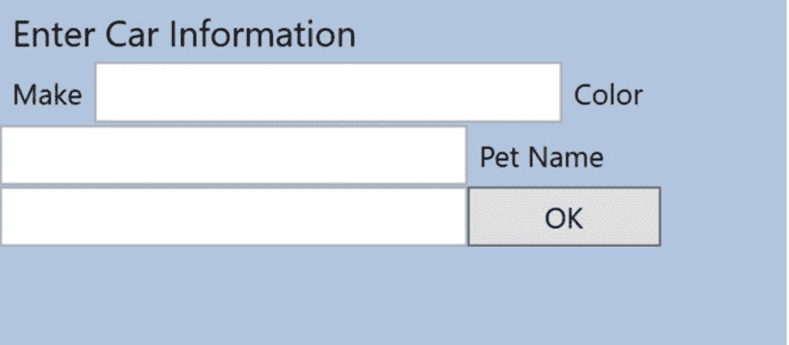

图 25-2。

一个 *WrapPanel* 中的内容表现得很像一个传统的 HTML 页面

默认情况下，`WrapPanel`中的内容从左向右排列。但是，如果您将`Orientation`属性的值更改为`Vertical`，您可以让内容以自顶向下的方式换行。

```cs
<WrapPanel Background="LightSteelBlue" Orientation ="Vertical">

```

您可以通过指定`ItemWidth`和`ItemHeight`值来声明一个`WrapPanel`(以及其他一些面板类型)，这两个值控制每个项目的默认大小。如果一个子元素确实提供了它自己的`Height`和/或`Width`值，那么它将相对于面板确定的大小进行定位。考虑以下标记:

```cs
<Page
    xmlns:="http://schemas.microsoft.com/winfx/2006/xaml/presentation"
    xmlns:x="http://schemas.microsoft.com/winfx/2006/xaml"
    Title="Fun with Panels!" Height="100" Width="650">
  <WrapPanel Background="LightSteelBlue" Orientation ="Horizontal" ItemWidth ="200" ItemHeight ="30">
  <Label x:Name="lblInstruction" FontSize="15" Content="Enter Car Information"/>
  <Label x:Name="lblMake" Content="Make"/>
  <TextBox x:Name="txtMake"/>
  <Label x:Name="lblColor" Content="Color"/>
  <TextBox x:Name="txtColor"/>
  <Label x:Name="lblPetName" Content="Pet Name"/>
  <TextBox x:Name="txtPetName"/>
  <Button x:Name="btnOK" Width ="80" Content="OK"/>
</WrapPanel>
</Page>

```

呈现的代码如图 25-3 (注意`Button`控件的大小和位置，它有一个指定的唯一`Width`值)。

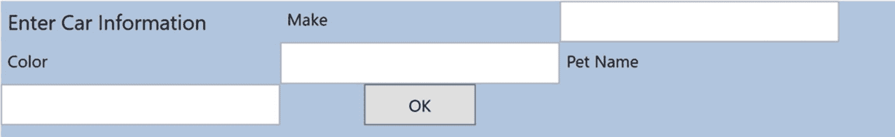

图 25-3。

一个 *WrapPanel* 可以建立给定项目的宽度和高度

看了图 25-3 后，你可能会同意，`WrapPanel`通常不是直接在窗口中排列内容的最佳选择，因为当用户调整窗口大小时，它的元素会变得混乱。在大多数情况下，`WrapPanel`将是另一个面板类型的子元素，允许窗口的一小部分区域在调整大小时包装其内容(例如，`ToolBar`控件)。

### 在堆栈面板中定位内容

与`WrapPanel`一样，`StackPanel`控件根据分配给`Orientation`属性的值，将内容排列成水平或垂直方向的单行(默认)。然而，不同之处在于，当用户调整窗口大小时，`StackPanel`将*而不是*尝试包装内容。相反，`StackPanel`中的项目将简单地伸展(基于它们的方向)以适应`StackPanel`本身的大小。例如，`SimpleStackPanel.xaml`文件包含以下标记，其输出如图 25-4 所示:

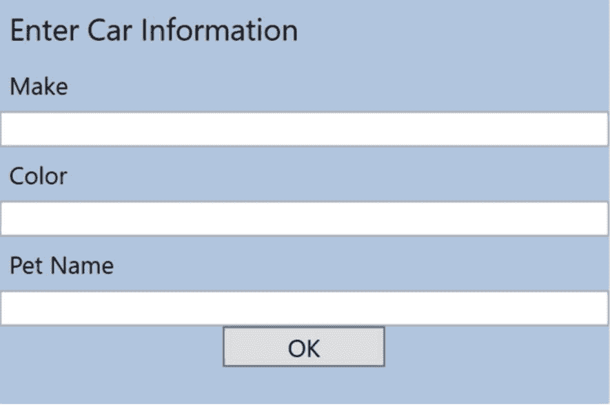

图 25-4。

内容的垂直堆叠

```cs
<Page
    xmlns:="http://schemas.microsoft.com/winfx/2006/xaml/presentation"
    xmlns:x="http://schemas.microsoft.com/winfx/2006/xaml"
    Title="Fun with Panels!" Height="200" Width="400">
  <StackPanel Background="LightSteelBlue" Orientation ="Vertical">
    <Label Name="lblInstruction"
           FontSize="15" Content="Enter Car Information"/>
    <Label Name="lblMake" Content="Make"/>
    <TextBox Name="txtMake"/>
    <Label Name="lblColor" Content="Color"/>
    <TextBox Name="txtColor"/>
    <Label Name="lblPetName" Content="Pet Name"/>
    <TextBox Name="txtPetName"/>
    <Button Name="btnOK" Width ="80" Content="OK"/>
  </StackPanel>
</Page>

```

如果您将`Orientation`属性分配给`Horizontal`，如下所示，渲染输出将与图 25-5 所示相匹配:

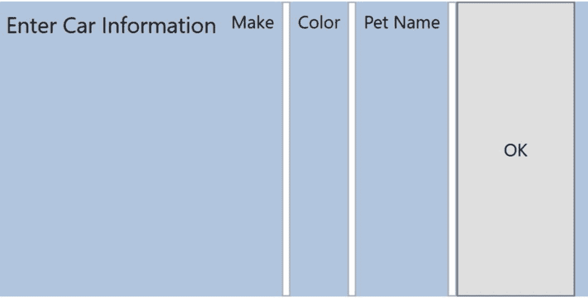

图 25-5。

内容的水平堆叠

```cs
<StackPanel Background="LightSteelBlue" Orientation="Horizontal">

```

同样，与使用`WrapPanel`的情况一样，您很少会想要使用`StackPanel`来直接在窗口中排列内容。相反，你应该使用`StackPanel`作为主面板的子面板。

### 在网格面板中定位内容

在 WPF API 提供的所有面板中，`Grid`无疑是最灵活的。像 HTML 表格一样，`Grid`可以被分割成一组单元格，每个单元格都提供内容。当定义一个`Grid`时，你执行这三个步骤:

1.  定义和配置每个列。

2.  定义和配置每一行。

3.  使用附加属性语法将内容分配给网格的每个单元格。

Note

如果您没有定义任何行或列，`Grid`默认为填充整个窗口表面的单个单元格。此外，如果您没有为`Grid`中的子元素分配单元格值(列和行),它会自动附加到列 0，行 0。

您可以通过使用`Grid.ColumnDefinitions`和`Grid.RowDefinitions`元素来实现前两步(定义列和行),这两个元素分别包含一个`ColumnDefinition`和`RowDefinition`元素的集合。网格中的每个单元格都是真实的。NET 对象，因此您可以根据自己的需要配置每个单元格的外观和行为。

这里有一个`Grid`定义(你可以在`SimpleGrid.xaml`文件中找到)安排你的 UI 内容，如图 25-6 所示:

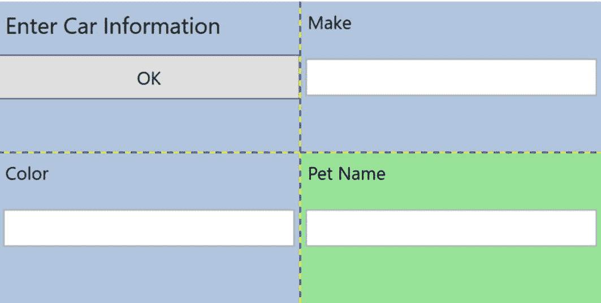

图 25-6。

行动中的`Grid`面板

```cs
<Grid ShowGridLines ="True" Background ="LightSteelBlue">
  <!-- Define the rows/columns -->
  <Grid.ColumnDefinitions>
    <ColumnDefinition/>
    <ColumnDefinition/>
  </Grid.ColumnDefinitions>
  <Grid.RowDefinitions>
    <RowDefinition/>
    <RowDefinition/>
  </Grid.RowDefinitions>

  <!-- Now add the elements to the grid's cells -->
  <Label x:Name="lblInstruction" Grid.Column ="0" Grid.Row ="0"
         FontSize="15" Content="Enter Car Information"/>
  <Button x:Name="btnOK" Height ="30" Grid.Column ="0"
          Grid.Row ="0" Content="OK"/>
  <Label x:Name="lblMake" Grid.Column ="1"
         Grid.Row ="0" Content="Make"/>
  <TextBox x:Name="txtMake" Grid.Column ="1"
           Grid.Row ="0" Width="193" Height="25"/>
  <Label x:Name="lblColor" Grid.Column ="0"
         Grid.Row ="1" Content="Color"/>
  <TextBox x:Name="txtColor" Width="193" Height="25"
           Grid.Column ="0" Grid.Row ="1" />

  <!-- Just to keep things interesting, add some color to the pet name cell -->
  <Rectangle Fill ="LightGreen" Grid.Column ="1" Grid.Row ="1" />
  <Label x:Name="lblPetName" Grid.Column ="1" Grid.Row ="1" Content="Pet Name"/>
  <TextBox x:Name="txtPetName" Grid.Column ="1" Grid.Row ="1"
           Width="193" Height="25"/>
</Grid>

```

注意，每个元素(包括一个浅绿的`Rectangle`元素)使用`Grid.Row`和`Grid.Column`附加属性将自己连接到网格中的一个单元格。默认情况下，网格中单元格的排序从左上角开始，这是使用`Grid.Column="0" Grid.Row="0"`指定的。假设您的网格总共定义了四个单元格，您可以使用`Grid.Column="1" Grid.Row="1"`来标识右下角的单元格。

#### 调整网格列和行的大小

网格中的列和行可以用三种方法之一来调整大小。

*   绝对尺寸(例如，100)

*   自动尺寸监控

*   相对规模(例如，3 倍)

绝对大小正是您所期望的；列(或行)的大小被调整为特定数量的与设备无关的单元。根据列或行中包含的控件自动调整每列或行的大小。相对大小相当于 CSS 中的百分比大小。相对大小的列或行中的数字总数除以可用空间总量。

在以下示例中，第一行获得 25%的空间，第二行获得 75%的空间:

```cs
<Grid.ColumnDefinitions>
  <ColumnDefinition Width="1*" />
  <ColumnDefinition Width="3*" />
</Grid.ColumnDefinitions>

```

### 具有 GridSplitter 类型的网格

`Grid`对象也可以支持*拆分器*。您可能知道，拆分器允许最终用户调整网格类型的行或列的大小。完成后，每个可调整大小的单元格内的内容将根据项目的包含方式调整自身的形状。向`Grid`添加分割器很容易做到；您只需定义`GridSplitter`控件，使用附加的属性语法来确定它影响的行或列。

请注意，您必须指定一个`Width`或`Height`值(取决于垂直或水平拆分),以便拆分器在屏幕上可见。考虑下面这个简单的`Grid`类型，在第一列有一个分割器(`Grid.Column = "0"`)。提供的`GridWithSplitter.xaml`文件的内容如下:

```cs
<Grid Background ="LightSteelBlue">
  <!-- Define columns -->
  <Grid.ColumnDefinitions>
    <ColumnDefinition Width ="Auto"/>
    <ColumnDefinition/>
  </Grid.ColumnDefinitions>

  <!-- Add this label to cell 0 -->
  <Label x:Name="lblLeft" Background ="GreenYellow"
         Grid.Column="0" Content ="Left!"/>

  <!-- Define the splitter -->
  <GridSplitter Grid.Column ="0" Width ="5"/>

  <!-- Add this label to cell 1 -->
  <Label x:Name="lblRight" Grid.Column ="1" Content ="Right!"/>
</Grid>

```

首先，请注意将支持拆分器的列有一个`Auto`的`Width`属性。接下来，请注意，`GridSplitter`使用附加的属性语法来建立它正在处理的列。如果您要查看这个输出，您会发现一个五像素的分割器，它允许您调整每个`Label`的大小。请注意，内容填满了整个单元格，因为您没有为任何一个`Label`指定`Height`或`Width`属性(参见图 25-7 )。

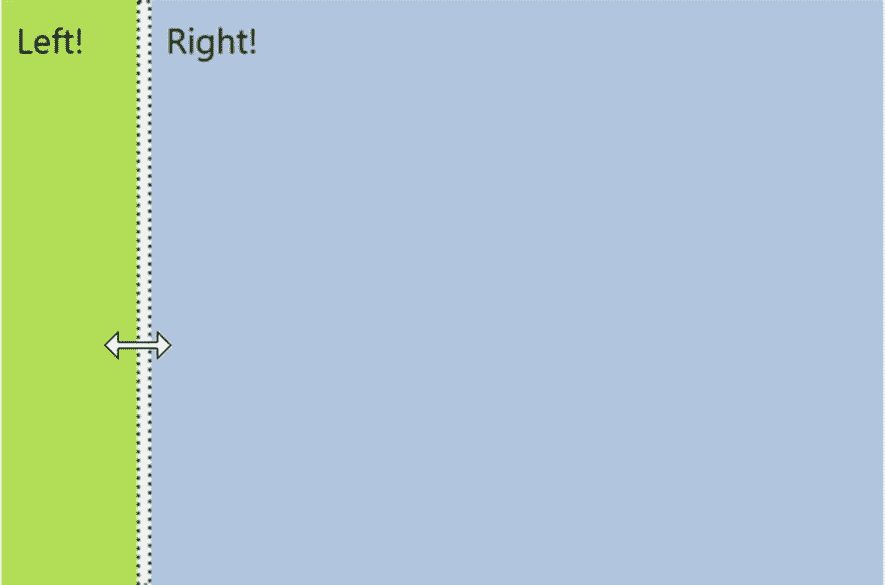

图 25-7。

`Grid`包含拆分器的类型

### 在 DockPanel 面板中定位内容

`DockPanel`通常用作容纳任意数量的附加面板的容器，用于对相关内容进行分组。使用附加属性语法(如`Canvas`或`Grid`类型所示)来控制每个条目在`DockPanel`中的停靠位置。

`SimpleDockPanel.xaml`文件定义了以下简单的`DockPanel`定义，其输出如图 25-8 所示:

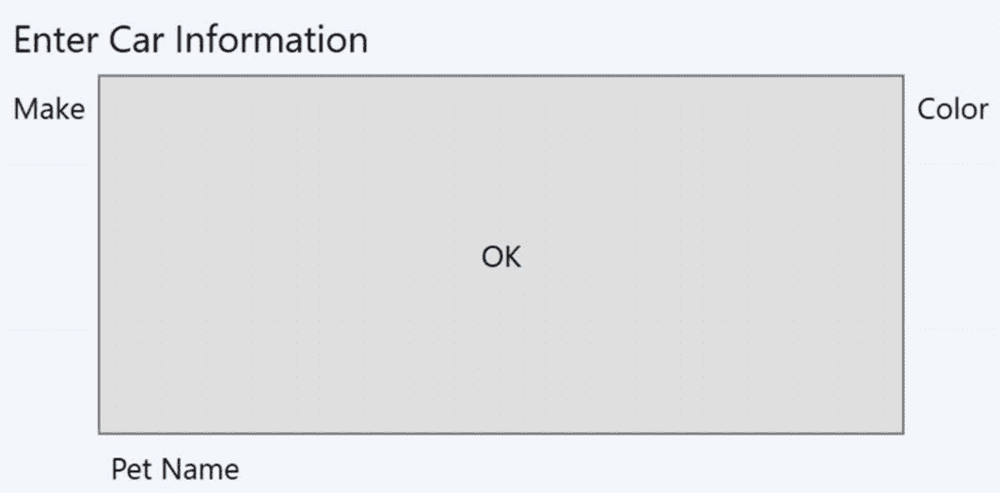

图 25-8。

一个简单的`DockPanel`

```cs
<DockPanel LastChildFill ="True" Background="AliceBlue">
  <!-- Dock items to the panel -->
  <Label DockPanel.Dock ="Top" Name="lblInstruction" FontSize="15" Content="Enter Car Information"/>
  <Label DockPanel.Dock ="Left" Name="lblMake" Content="Make"/>
  <Label DockPanel.Dock ="Right" Name="lblColor" Content="Color"/>
  <Label DockPanel.Dock ="Bottom" Name="lblPetName" Content="Pet Name"/>
  <Button Name="btnOK" Content="OK"/>
</DockPanel>

```

Note

如果将多个元素添加到`DockPanel`的同一侧，它们将按照声明的顺序沿着指定的边缘堆叠。

使用`DockPanel`类型的好处是，当用户调整窗口大小时，每个元素保持连接到面板的指定边(通过`DockPanel.Dock`)。还要注意，本例中开始的`DockPanel`标签将`LastChildFill`属性设置为`true`。鉴于`Button`控件确实是容器中的“最后一个子控件”，因此它将在剩余的空间内被拉伸。

### 启用面板类型的滚动

值得指出的是，WPF 提供了一个`ScrollViewer`类，为面板对象中的数据提供自动滚动行为。`SimpleScrollViewer.xaml`文件定义了以下内容:

```cs
<ScrollViewer>
  <StackPanel>
    <Button Content ="First" Background = "Green" Height ="50"/>
    <Button Content ="Second" Background = "Red" Height ="50"/>
    <Button Content ="Third" Background = "Pink" Height ="50"/>
    <Button Content ="Fourth" Background = "Yellow" Height ="50"/>
    <Button Content ="Fifth" Background = "Blue" Height ="50"/>
  </StackPanel>
</ScrollViewer>

```

你可以在图 25-9 中看到之前 XAML 定义的结果(注意右边的滚动条，因为窗口的大小没有调整到显示所有五个按钮)。

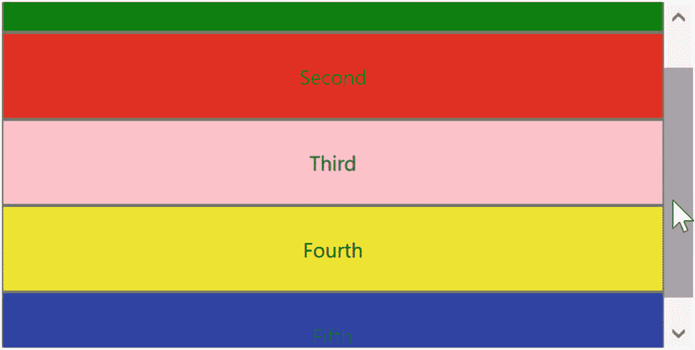

图 25-9。

使用`ScrollViewer`类型

如您所料，每个面板都提供了许多成员，允许您微调内容的位置。与此相关的是，许多 WPF 控件支持两个相关属性(`Padding`和`Margin`)，这两个属性允许控件本身通知面板它希望如何处理。具体来说，`Padding`属性控制内部控件周围应该有多少额外空间，而`Margin`控制控件外部周围的额外空间。

这就结束了本章对 WPF 主要面板类型的介绍，以及它们放置内容的各种方式。接下来，您将学习如何使用 Visual Studio 设计器创建布局。

### 使用 Visual Studio 设计器配置面板

现在，您已经大致了解了用于定义一些常见布局管理器的 XAML，您会很高兴地知道 Visual Studio 为构造布局提供了非常好的设计时支持。这样做的关键在于本章前面描述的文档大纲窗口。为了说明一些基础知识，创建一个名为`VisualLayoutTester`的新 WPF 应用项目。

注意你的初始`Window`是如何默认使用`Grid`布局的，如下所示:

```cs
<Window x:Class="VisualLayoutTester.MainWindow"
  xmlns:="http://schemas.microsoft.com/winfx/2006/xaml/presentation"
  xmlns:x="http://schemas.microsoft.com/winfx/2006/xaml"
  xmlns:d="http://schemas.microsoft.com/expression/blend/2008"
  xmlns:local="clr-namespace:VisualLayoutTesterApp"
  mc:Ignorable="d"
    Title="MainWindow" Height="450" Width="800">
    <Grid>
    </Grid>
</Window>

```

如果你喜欢使用`Grid`布局系统，请注意在图 25-10 中，你可以很容易地使用可视化布局来切割和调整网格单元的大小。为此，首先在文档大纲窗口中选择`Grid`组件，然后单击网格的边界来创建新的行和列。

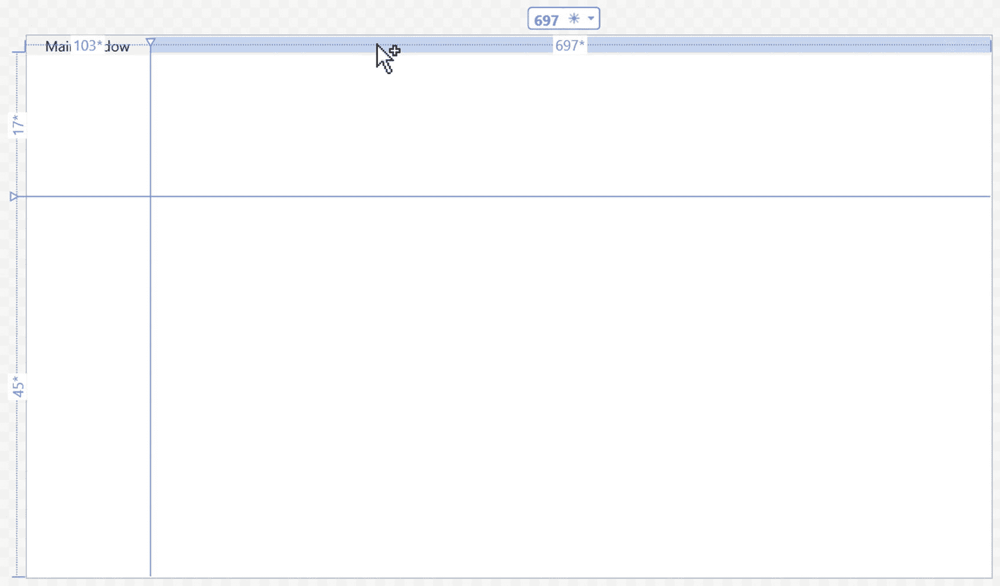

图 25-10。

使用 IDE 的设计器可以将`Grid`控件直观地切割成单元格

现在，假设您已经定义了一个包含一定数量单元格的网格。然后，您可以将控件拖放到布局系统的给定单元格中，IDE 将自动设置相关控件的`Grid.Row`和`Grid.Column`属性。下面是将`Button`拖动到预定义的单元格中后，IDE 可能生成的一些标记:

```cs
<Button x:Name="button" Content="Button" Grid.Column="1" HorizontalAlignment="Left" Margin="21,21.4,0,0" Grid.Row="1" VerticalAlignment="Top" Width="75"/>

```

现在，让我们假设你宁愿根本不使用`Grid`。如果你右击文档大纲窗口中的任何布局节点，你会发现一个菜单选项，允许你将当前容器改变为另一个(见图 25-11 )。请注意，当您这样做时，您将(很可能)从根本上改变控件的位置，因为控件将符合新面板类型的规则。

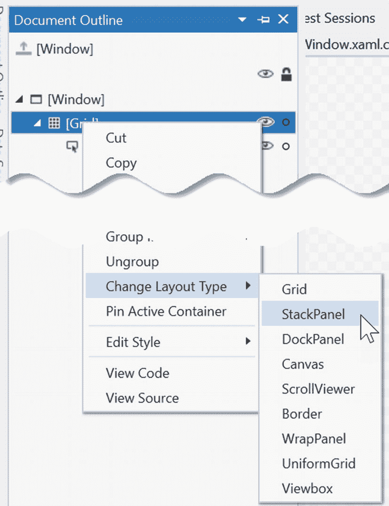

图 25-11。

“文档大纲”窗口允许您转换到新的面板类型

另一个方便的技巧是能够在可视化设计器上选择一组控件，并将它们分组到一个新的嵌套布局管理器中。假设您有一个包含一组随机对象的`Grid`。现在，通过按住 Ctrl 键并用鼠标左键单击每一项来选择设计器上的一组项。如果你右击选择，你可以将选择的项目分组到一个新的子面板中(见图 25-12 )。

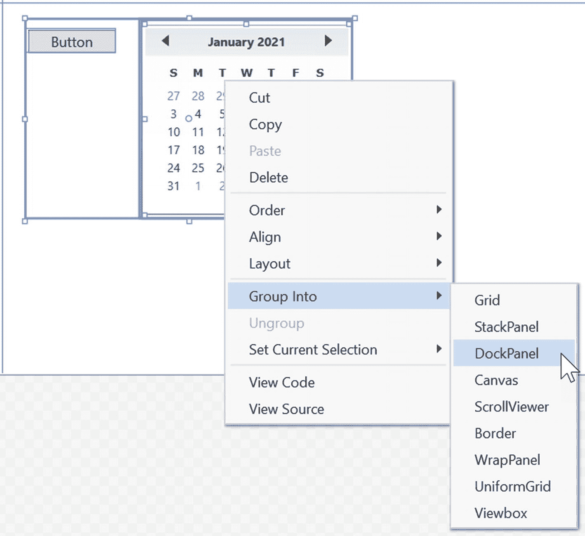

图 25-12。

将项目分组到新的子面板中

完成后，再次检查“文档大纲”窗口以验证嵌套布局系统。当您构建功能全面的 WPF 窗口时，您很可能总是需要利用嵌套布局系统，而不是简单地为所有的 UI 显示选择一个面板(事实上，本文中剩余的 WPF 示例通常会这样做)。最后，文档大纲窗口中的节点都是可拖放的。例如，如果你想将一个当前在 DockPanel 中的控件移动到父面板中，你可以如图 25-13 所示那样做。

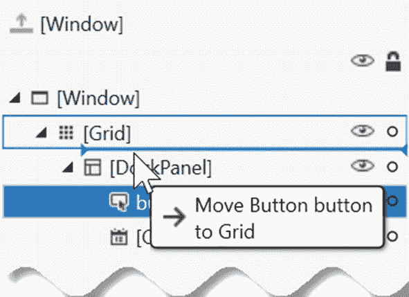

图 25-13。

通过文档大纲窗口重新定位项目

当你阅读完剩余的 WPF 章节时，我会尽可能指出额外的布局快捷方式。然而，你绝对值得花时间亲自试验和测试各种特性。为了让你朝着正确的方向前进，本章的下一个例子将说明如何为一个定制的文本处理应用构建一个嵌套的布局管理器(带拼写检查！).

## 使用嵌套面板构建窗口的框架

如上所述，典型的 WPF 窗口不会使用单个面板控件，而是将面板嵌套在其他面板中，以获得所需的布局系统。首先创建一个名为 MyWordPad 的新 WPF 应用。

你的目标是构造一个布局，其中主窗口有一个最上面的菜单系统，一个工具栏在菜单系统下面，一个状态栏安装在窗口的底部。状态栏将包含一个窗格来保存当用户选择菜单项(或工具栏按钮)时显示的文本提示，而菜单系统和工具栏将提供 UI 触发器来关闭应用并在`Expander`小部件中显示拼写建议。图 25-14 显示你拍摄的初始布局；它还展示了 WPF 内部的拼写检查功能。

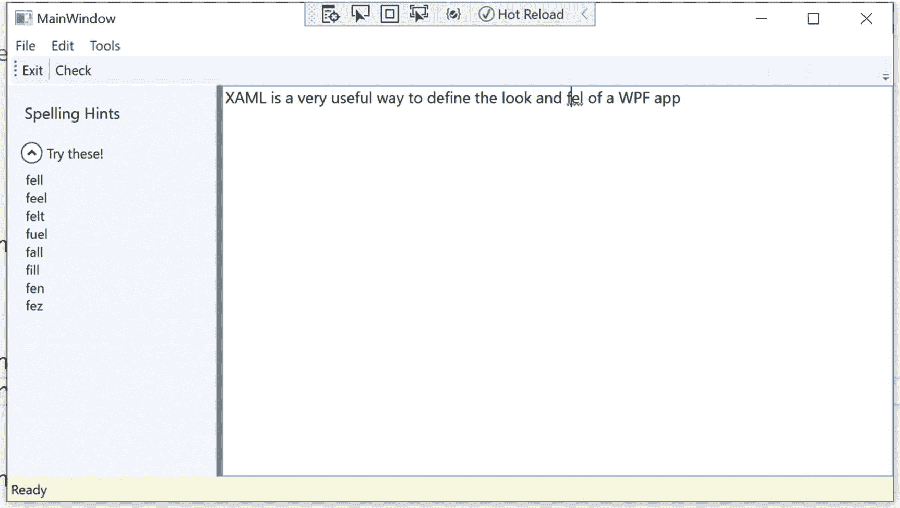

图 25-14。

使用嵌套面板建立窗口的用户界面

要开始构建这个 UI，请更新您的`Window`类型的初始 XAML 定义，以便它使用一个`DockPanel`子元素，而不是默认的`Grid`，如下所示:

```cs
<Window x:Class="MyWordPad.MainWindow"
    xmlns:="http://schemas.microsoft.com/winfx/2006/xaml/presentation"
    xmlns:x="http://schemas.microsoft.com/winfx/2006/xaml"
    xmlns:d="http://schemas.microsoft.com/expression/blend/2008"

    xmlns:local="clr-namespace:MyWordPad"
    mc:Ignorable="d"
    Title="My Spell Checker" Height="450" Width="800">
  <!-- This panel establishes the content for the window -->
  <DockPanel>
  </DockPanel>
</Window>

```

### 建立菜单系统

WPF 中的菜单系统由`Menu`类表示，它维护一个`MenuItem`对象的集合。在 XAML 构建菜单系统时，你可以让每个`MenuItem`处理各种事件。这些事件中最值得注意的是`Click`，它在最终用户选择一个子项时发生。在本例中，首先构建两个最顶层的菜单项(文件和工具；您将在本示例的后面构建 Edit 菜单)，它分别公开 Exit 和拼写提示子项。

除了处理每个子项的`Click`事件，您还需要处理`MouseEnter`和`MouseExit`事件，您将在后面的步骤中使用它们来设置状态栏文本。在您的`DockPanel`范围内添加以下标记:

```cs
<!-- Dock menu system on the top -->
<Menu DockPanel.Dock ="Top"
      HorizontalAlignment="Left" Background="White" BorderBrush ="Black">
  <MenuItem Header="_File">
    <Separator/>
    <MenuItem Header ="_Exit" MouseEnter ="MouseEnterExitArea"
              MouseLeave ="MouseLeaveArea" Click ="FileExit_Click"/>
    </MenuItem>
    <MenuItem Header="_Tools">
      <MenuItem Header ="_Spelling Hints"
          MouseEnter ="MouseEnterToolsHintsArea"
          MouseLeave ="MouseLeaveArea" Click ="ToolsSpellingHints_Click"/>
  </MenuItem>
</Menu>

```

注意，您将菜单系统停靠在`DockPanel`的顶部。此外，您使用`Separator`元素在菜单系统中插入一条细水平线，直接在退出选项之前。还要注意每个`MenuItem`的`Header`值包含一个嵌入的下划线标记(例如，`_Exit`)。您使用这个令牌来建立当最终用户按下 Alt 键(对于键盘快捷键)时哪个字母将被加下划线。这与 Windows 窗体中使用的&字符有所不同，因为 XAML 是基于 XML 的，而&字符在 XML 中有意义。

到目前为止，您已经实现了完整的菜单系统定义；接下来，您需要实现各种事件处理程序。首先，您有一个文件退出处理程序，`FileExit_Click()`，它简单地关闭窗口，然后终止应用，因为这是您的最顶层窗口。每个子项的`MouseEnter`和`MouseExit`事件处理程序将最终更新你的状态栏；然而，现在，您将简单地提供 shells。最后，Tools 拼写提示菜单项的`ToolsSpellingHints_Click()`处理程序暂时仍将是一个 shell。以下是您的代码隐藏文件的最新更新(包括更新后的`using`语句):

```cs
using System.IO;
using System.Windows;
using System.Windows.Controls;
using System.Windows.Input;
using Microsoft.Win32;
public partial class MainWindow : Window
{
  public MainWindow()
  {
    InitializeComponent();
  }

  protected void FileExit_Click(object sender, RoutedEventArgs args)
  {
    // Close this window.
    this.Close();
  }

  protected void ToolsSpellingHints_Click(object sender, RoutedEventArgs args)
  {
  }
  protected void MouseEnterExitArea(object sender, RoutedEventArgs args)
  {
  }
  protected void MouseEnterToolsHintsArea(object sender, RoutedEventArgs args)
  {
  }
  protected void MouseLeaveArea(object sender, RoutedEventArgs args)
  {
  }
}

```

### 可视化地构建菜单

虽然知道如何在 XAML 中手动定义项目总是好的，但这可能有点乏味。Visual Studio 支持对菜单系统、工具栏、状态栏和许多其他 UI 控件的可视化设计支持。如果右键单击`Menu`控件，您会注意到一个 Add MenuItem 选项。顾名思义，这为`Menu`控件添加了一个新的菜单项。添加了一组最上面的项目后，您可以添加子菜单项和分隔符，展开或折叠菜单本身，并通过第二次右键单击执行其他以菜单为中心的操作。

正如您在当前 MyWordPad 示例的剩余部分所看到的，我将典型地向您展示最终生成的 example 然而，一定要花时间与视觉设计者一起试验，以简化手头的任务。

### 构建工具栏

工具栏(由 WPF 的`ToolBar`类表示)通常提供了激活菜单选项的另一种方式。直接在您的`Menu`定义的结束范围之后添加以下标记:

```cs
<!-- Put Toolbar under the Menu -->
<ToolBar DockPanel.Dock ="Top" >
  <Button Content ="Exit" MouseEnter ="MouseEnterExitArea"
          MouseLeave ="MouseLeaveArea" Click ="FileExit_Click"/>
  <Separator/>
  <Button Content ="Check" MouseEnter ="MouseEnterToolsHintsArea"
          MouseLeave ="MouseLeaveArea" Click ="ToolsSpellingHints_Click"
          Cursor="Help" />
</ToolBar>

```

您的`ToolBar`控件由两个`Button`控件组成，这两个控件恰好处理相同的事件，并且在您的代码文件中由相同的方法处理。使用这种技术，您可以将处理程序加倍，以服务于菜单项和工具栏按钮。虽然这个工具栏使用的是典型的按钮，但是你应该意识到`ToolBar`类型的“is-a”`ContentControl`；因此，您可以自由地将任何类型嵌入其表面(例如，下拉列表、图像和图形)。这里另一个有趣的地方是，复选按钮通过`Cursor`属性支持自定义鼠标光标。

Note

您可以选择将`ToolBar`元素包装在`ToolBarTray`元素中，后者控制一组`ToolBar`对象的布局、停靠和拖放操作。

### 构建状态栏

一个`StatusBar`控件将停靠在`DockPanel`的下部，并包含一个单独的`TextBlock`控件，在本章的这一点之前，您还没有使用过这个控件。您可以使用`TextBlock`来保存支持大量文本注释的文本，比如粗体文本、下划线文本、换行符等等。在前面的`ToolBar`定义后直接添加以下标记:

```cs
<!-- Put a StatusBar at the bottom -->
<StatusBar DockPanel.Dock ="Bottom" Background="Beige" >
  <StatusBarItem>
    <TextBlock Name="statBarText" Text="Ready"/>
  </StatusBarItem>
</StatusBar>

```

### 最终确定用户界面设计

UI 设计的最后一个方面是定义一个 splittable `Grid`，它定义了两列。在左边，放置一个`Expander`控件，它将显示一个拼写建议列表，包裹在一个`StackPanel`中。在右边，放置一个支持多行和滚动条并支持拼写检查的`TextBox`控件。你将整个`Grid`挂载到父`DockPanel`的左边。直接在`StatusBar`标记下添加以下 XAML 标记，以完成窗口 UI 的定义:

```cs
<Grid DockPanel.Dock ="Left" Background ="AliceBlue">
  <!-- Define the rows and columns -->
  <Grid.ColumnDefinitions>
    <ColumnDefinition />
    <ColumnDefinition />
  </Grid.ColumnDefinitions>

  <GridSplitter Grid.Column ="0" Width ="5" Background ="Gray" />
  <StackPanel Grid.Column="0" VerticalAlignment ="Stretch" >
    <Label Name="lblSpellingInstructions" FontSize="14" Margin="10,10,0,0">
     Spelling Hints
    </Label>

    <Expander Name="expanderSpelling" Header ="Try these!"
              Margin="10,10,10,10">
      <!-- This will be filled programmatically -->
      <Label Name ="lblSpellingHints" FontSize ="12"/>
    </Expander>
  </StackPanel>

  <!-- This will be the area to type within -->
  <TextBox  Grid.Column ="1"
            SpellCheck.IsEnabled ="True"
            AcceptsReturn ="True"
            Name ="txtData" FontSize ="14"
            BorderBrush ="Blue"
            VerticalScrollBarVisibility="Auto"
            HorizontalScrollBarVisibility="Auto">
  </TextBox>
</Grid>

```

### 实现 MouseEnter/MouseLeave 事件处理程序

至此，你的窗口的 UI 就完成了。剩下的唯一任务是为剩下的事件处理程序提供一个实现。首先更新您的 C# 代码文件，以便每个`MouseEnter`、`MouseLeave`和`MouseExit`处理程序用合适的消息设置状态栏的文本窗格，以帮助最终用户，如下所示:

```cs
public partial class MainWindow : System.Windows.Window
{
...
  protected void MouseEnterExitArea(object sender, RoutedEventArgs args)
  {
    statBarText.Text = "Exit the Application";
  }
  protected void MouseEnterToolsHintsArea(object sender, RoutedEventArgs args)
  {
    statBarText.Text = "Show Spelling Suggestions";
  }
  protected void MouseLeaveArea(object sender, RoutedEventArgs args)
  {
    statBarText.Text = "Ready";
  }
}

```

此时，您可以运行您的应用了。你应该看到你的状态栏会根据你鼠标悬停在哪个菜单项/工具栏按钮上来改变它的文本。

### 实现拼写检查逻辑

WPF API 附带了内置的拼写检查支持，它独立于 Microsoft Office 产品。这意味着您不需要使用 COM 互操作层来使用 Microsoft Word 的拼写检查器；相反，您只需几行代码就可以轻松添加相同类型的支持。

您可能还记得，当您定义`TextBox`控件时，您将`SpellCheck.IsEnabled`属性设置为`true`。当您这样做时，拼写错误的单词会带有红色的下划线，就像它们在 Microsoft Office 中一样。更好的是，底层编程模型允许您访问拼写检查器引擎，该引擎允许您获得拼写错误单词的建议列表。将以下代码添加到您的`ToolsSpellingHints_Click()`方法中:

```cs
protected void ToolsSpellingHints_Click(object sender, RoutedEventArgs args)
{
  string spellingHints = string.Empty;

  // Try to get a spelling error at the current caret location.
  SpellingError error = txtData.GetSpellingError(txtData.CaretIndex);
  if (error != null)
  {
    // Build a string of spelling suggestions.
    foreach (string s in error.Suggestions)
    {
      spellingHints += $"{s}\n";
    }

    // Show suggestions and expand the expander.
    lblSpellingHints.Content = spellingHints;
    expanderSpelling.IsExpanded = true;
  }
}

```

前面的代码非常简单。您只需通过使用`CaretIndex`属性提取一个`SpellingError`对象来计算出插入符号在文本框中的当前位置。如果在所述位置有错误(意味着值不是`null`)，您使用恰当命名的`Suggestions`属性遍历建议列表。在获得拼写错误单词的所有建议后，将数据连接到`Expander`中的`Label`。

所以你有它！只有几行程序代码(和适量的 XAML)，你就有了一个功能性文字处理器的雏形。理解*控制命令*可以帮助你增加一点活力。

## 理解 WPF 命令

WPF 通过*命令架构*为被认为是*控制不可知事件*提供支持。典型的。NET Core event 在特定的基类中定义，只能由该类或其派生类使用。所以，正常。NET 核心事件与定义它们的类紧密相关。

相比之下，WPF 命令是独立于特定控件的类似事件的实体，在许多情况下，可以成功地应用于许多(看似不相关的)控件类型。举例来说，WPF 支持复制、粘贴和剪切命令，这些命令可以应用于各种 UI 元素(例如，菜单项、工具栏按钮和自定义按钮)，以及键盘快捷键(例如，Ctrl+C 和 Ctrl+V)。

虽然其他 UI 工具包(如 Windows 窗体)为此提供了标准事件，但使用它们通常会留下冗余且难以维护的代码。在 WPF 模式下，您可以使用命令作为替代方法。最终结果通常会产生一个更小、更灵活的代码库。

### 内在命令对象

WPF 附带了许多内建的控制命令，您可以使用相关的键盘快捷键(或其他输入手势)来配置所有这些命令。从编程角度来说，WPF 命令是支持属性(通常称为`Command`)的任何对象，该属性返回实现`ICommand`接口的对象，如下所示:

```cs
public interface ICommand
{
  // Occurs when changes occur that affect whether
  // or not the command should execute.
  event EventHandler CanExecuteChanged;

  // Defines the method that determines whether the command
  // can execute in its current state.
  bool CanExecute(object parameter);

  // Defines the method to be called when the command is invoked.
  void Execute(object parameter);
}

```

WPF 提供了各种命令类，开箱即用，暴露了近 100 个命令对象。这些类定义了许多公开特定命令对象的属性，每个属性都实现了`ICommand`。表 25-3 记录了一些可用的标准命令对象。

表 25-3。

固有的 WPF 控制命令对象

<colgroup><col class="tcol1 align-left"> <col class="tcol2 align-left"> <col class="tcol3 align-left"></colgroup> 
| 

WPF 级

 | 

命令对象

 | 

生命的意义

 |
| --- | --- | --- |
| `ApplicationCommands` | `Close`、`Copy`、`Cut`、`Delete`、`Find`、`Open`、`Paste`、`Save`、`SaveAs`、`Redo`、`Undo` | 各种应用级命令 |
| `ComponentCommands` | `MoveDown`、`MoveFocusBack`、`MoveLeft`、`MoveRight`、`ScrollToEnd`、`ScrollToHome` | UI 组件通用的各种命令 |
| `MediaCommands` | `BoostBase`、`ChannelUp`、`ChannelDown`、`FastForward`、`NextTrack`、`Play`、`Rewind`、`Select`、`Stop` | 各种以媒体为中心的命令 |
| `NavigationCommands` | `BrowseBack`、`BrowseForward`、`Favorites`、`LastPage`、`NextPage`、`Zoom` | 与 WPF 导航模型相关的各种命令 |
| `EditingCommands` | `AlignCenter`、`CorrectSpellingError`、`DecreaseFontSize`、`EnterLineBreak`、`EnterParagraphBreak`、`MoveDownByLine`、`MoveRightByWord` | 与 WPF 文档 API 相关的各种命令 |

### 将命令连接到命令特性

如果您想将任何 WPF 命令属性连接到支持`Command`属性的 UI 元素(例如`Button`或`MenuItem`)，您只需做很少的工作。您可以通过更新当前的菜单系统来了解如何做到这一点，这样它就支持一个名为 Edit 的新的最顶层菜单项和三个子菜单项，用于复制、粘贴和剪切文本数据，如下所示:

```cs
<Menu DockPanel.Dock ="Top" HorizontalAlignment="Left" Background="White" BorderBrush ="Black">
  <MenuItem Header="_File" Click ="FileExit_Click" >
    <MenuItem Header ="_Exit" MouseEnter ="MouseEnterExitArea" MouseLeave ="MouseLeaveArea"
        Click ="FileExit_Click"/>
  </MenuItem>

  <!-- New menu item with commands! -->
  <MenuItem Header="_Edit">
    <MenuItem Command ="ApplicationCommands.Copy"/>
    <MenuItem Command ="ApplicationCommands.Cut"/>
    <MenuItem Command ="ApplicationCommands.Paste"/>
  </MenuItem>

  <MenuItem Header="_Tools">
    <MenuItem Header ="_Spelling Hints"
              MouseEnter ="MouseEnterToolsHintsArea"
              MouseLeave ="MouseLeaveArea"
              Click ="ToolsSpellingHints_Click"/>
  </MenuItem>
</Menu>

```

注意，编辑菜单上的每个子项都有一个分配给`Command`属性的值。这样做意味着菜单项在菜单项 UI 中自动接收正确的名称和快捷键(例如，对于剪切操作，Ctrl+C );这也意味着应用现在可以*复制、剪切和粘贴*了，不需要任何程序代码！

如果您运行应用并选择一些文本，您就可以开箱即用地使用新菜单项。另外，您的应用还可以响应标准的右键单击操作，为用户提供相同的选项。

### 将命令连接到任意动作

如果您想要将一个命令对象连接到一个任意的(特定于应用的)事件，您将需要下拉到过程代码。这样做并不复杂，但它涉及的逻辑比你在 XAML 看到的要多一点。例如，假设您希望整个窗口都响应 F1 键，这样当最终用户按下该键时，他将激活相关的帮助系统。此外，假设主窗口的代码文件定义了一个名为`SetF1CommandBinding()`的新方法，在调用`InitializeComponent()`之后，在构造函数中调用该方法。

```cs
public MainWindow()
{
  InitializeComponent();
  SetF1CommandBinding();
}

```

这个新方法将以编程方式创建一个新的`CommandBinding`对象，当您需要将命令对象绑定到应用中的给定事件处理程序时，就可以使用这个对象。在这里，您配置您的`CommandBinding`对象来使用`ApplicationCommands.Help`命令操作，它自动感知 F1:

```cs
private void SetF1CommandBinding()
{
  CommandBinding helpBinding = new CommandBinding(ApplicationCommands.Help);
  helpBinding.CanExecute += CanHelpExecute;
  helpBinding.Executed += HelpExecuted;
  CommandBindings.Add(helpBinding);
}

```

大多数`CommandBinding`对象想要处理`CanExecute`事件(允许您根据程序的操作指定命令是否发生)和`Executed`事件(在这里您可以创作命令发生时应该发生的内容)。将以下事件处理程序添加到您的`Window`派生类型中(根据相关委托的要求，注意每个方法的格式):

```cs
private void CanHelpExecute(object sender, CanExecuteRoutedEventArgs e)
{
  // Here, you can set CanExecute to false if you want to prevent the command from executing.
  e.CanExecute = true;
}

private void HelpExecuted(object sender, ExecutedRoutedEventArgs e)
{
  MessageBox.Show("Look, it is not that difficult. Just type something!", "Help!");
}

```

在前面的代码片段中，您实现了`CanHelpExecute()`,因此它总是允许 F1 帮助启动；您只需返回`true`就可以做到这一点。但是，如果在某些情况下，帮助系统不应该显示，您可以说明这一点，并在必要时返回`false`。您在`HelpExecuted()`中显示的“帮助系统”只不过是一个消息框。此时，您可以运行您的应用了。当您按下键盘上的 F1 键时，您将看到消息框出现。

### 使用打开和保存命令

为了完成当前示例，您将添加将文本数据保存到外部文件并打开`*.txt`文件进行编辑的功能。如果您想走长路，您可以手动添加编程逻辑，根据您的`TextBox`中是否有数据来启用或禁用新的菜单项。然而，您可以再次使用命令来减轻您的负担。

首先，通过添加下面两个使用`Save`和`Open ApplicationCommands`对象的新子菜单，更新代表最顶层文件菜单的`MenuItem`元素:

```cs
<MenuItem Header="_File">
  <MenuItem Command ="ApplicationCommands.Open"/>
  <MenuItem Command ="ApplicationCommands.Save"/>
  <Separator/>
  <MenuItem Header ="_Exit"
            MouseEnter ="MouseEnterExitArea"
            MouseLeave ="MouseLeaveArea" Click ="FileExit_Click"/>
</MenuItem>

```

同样，记住所有的命令对象都实现了`ICommand`接口，该接口定义了两个事件(`CanExecute`和`Executed`)。现在，您需要启用整个窗口，以便它可以检查当前是否可以启动这些命令；如果是这样，您可以定义一个事件处理程序来执行自定义代码。

您可以通过填充由窗口维护的`CommandBindings`集合来做到这一点。在 XAML 这样做需要使用属性元素语法来定义一个`Window.CommandBindings`作用域，在其中放置两个`CommandBinding`定义。像这样更新你的`Window`:

```cs
<Window x:Class="MyWordPad.MainWindow"
  xmlns:="http://schemas.microsoft.com/winfx/2006/xaml/presentation"
  xmlns:x="http://schemas.microsoft.com/winfx/2006/xaml"
  Title="MySpellChecker" Height="331" Width="508"
  WindowStartupLocation ="CenterScreen" >

  <!-- This will inform the Window which handlers to call,
       when testing for the Open and Save commands. -->
  <Window.CommandBindings>
    <CommandBinding Command="ApplicationCommands.Open"
                    Executed="OpenCmdExecuted"
                    CanExecute="OpenCmdCanExecute"/>
    <CommandBinding Command="ApplicationCommands.Save"
                    Executed="SaveCmdExecuted"
                    CanExecute="SaveCmdCanExecute"/>
  </Window.CommandBindings>

  <!-- This panel establishes the content for the window -->
  <DockPanel>
  ...
  </DockPanel>
</Window>

```

现在右键单击 XAML 编辑器中的每个`Executed`和`CanExecute`属性，并选择导航到事件处理程序菜单选项。你可能还记得第二十四章中的内容，这将自动为事件本身生成存根代码。此时，窗口的 C# 代码文件中应该有四个空处理程序。

`CanExecute`事件处理程序的实现将告诉窗口，通过设置传入的`CanExecuteRoutedEventArgs`对象的`CanExecute`属性，可以随时触发相应的`Executed`事件。

```cs
private void OpenCmdCanExecute(object sender, CanExecuteRoutedEventArgs e)
{
  e.CanExecute = true;
}

private void SaveCmdCanExecute(object sender, CanExecuteRoutedEventArgs e)
{
  e.CanExecute = true;
}

```

相应的`Executed`处理程序执行显示打开和保存对话框的实际工作；他们还将你的`TextBox`中的数据发送到一个文件中。首先确保将`System.IO`和`Microsoft.Win32`名称空间导入到代码文件中。以下完整的代码非常简单:

```cs
private void OpenCmdExecuted(object sender, ExecutedRoutedEventArgs e)
{
  // Create an open file dialog box and only show XAML files.
  var openDlg = new OpenFileDialog { Filter = "Text Files |*.txt"};

  // Did they click on the OK button?
  if (true == openDlg.ShowDialog())
  {
    // Load all text of selected file.
    string dataFromFile = File.ReadAllText(openDlg.FileName);

    // Show string in TextBox.
    txtData.Text = dataFromFile;
  }
}

private void SaveCmdExecuted(object sender, ExecutedRoutedEventArgs e)
{
  var saveDlg = new SaveFileDialog { Filter = "Text Files |*.txt"};

  // Did they click on the OK button?
  if (true == saveDlg.ShowDialog())
  {
    // Save data in the TextBox to the named file.
    File.WriteAllText(saveDlg.FileName, txtData.Text);
  }
}

```

Note

第二十八章将会对 WPF 的指挥系统进行更深入的研究。在其中，您将创建基于`ICommand`和`RelayCommands`的定制命令。

这就结束了这个例子，以及您对使用 WPF 控件的初步了解。在这里，您学习了如何使用基本命令、菜单系统、状态栏、工具栏、嵌套面板和一些基本的 UI 控件，如`TextBox`和`Expander`。下一个示例将使用一些更奇特的控件，同时检查几个重要的 WPF 服务。

## 了解路由事件

您可能已经注意到了前面代码示例中的参数`RoutedEventArgs`而不是`EventArgs`。路由事件模型是标准 CLR 事件模型的改进，旨在确保事件能够以适合 XAML 的对象树描述的方式进行处理。假设您有一个名为 WpfRoutedEvents 的新 WPF 应用项目。现在，通过添加下面的`Button`控件来更新初始窗口的 XAML 描述，该控件定义了一些复杂的内容:

```cs
<Window ...
  <Grid>
    <Button Name="btnClickMe" Height="75" Width = "250"
        Click ="btnClickMe_Clicked">
      <StackPanel Orientation ="Horizontal">
        <Label Height="50" FontSize ="20">
          Fancy Button!</Label>
        <Canvas Height ="50" Width ="100" >
          <Ellipse Name = "outerEllipse" Fill ="Green"
                   Height ="25" Width ="50" Cursor="Hand"
                   Canvas.Left="25" Canvas.Top="12"/>
          <Ellipse Name = "innerEllipse" Fill ="Yellow"
             Height = "15" Width ="36"
             Canvas.Top="17" Canvas.Left="32"/>
        </Canvas>
      </StackPanel>
    </Button>
  </Grid>
</Window>

```

注意在`Button`的开始定义中，您已经通过指定当事件被引发时要调用的方法的名称来处理了`Click`事件。`Click`事件与`RoutedEventHandler`委托一起工作，该委托期望一个事件处理程序将`object`作为第一个参数，将`System.Windows.RoutedEventArgs`作为第二个参数。按如下方式实现该处理程序:

```cs
public void btnClickMe_Clicked(object sender, RoutedEventArgs e)
{
  // Do something when button is clicked.
  MessageBox.Show("Clicked the button");
}

```

如果您运行您的应用，您将看到这个消息框显示，不管您单击按钮内容的哪一部分(绿色的`Ellipse`、黄色的`Ellipse`、`Label`或`Button`的表面)。这是一件好事。想象一下，如果您被迫为这些子元素中的每一个处理一个`Click`事件，那么 WPF 事件处理会有多乏味。不仅为`Button`的每个方面创建单独的事件处理程序需要耗费大量的劳动，而且最终还会有一些令人讨厌的代码需要维护。

幸运的是，WPF *路由事件*负责确保无论按钮的哪个部分被自动点击，您的单个`Click`事件处理程序都会被调用。简单地说，路由事件模型自动地沿着对象树向上(或向下)传播事件，寻找合适的处理程序。

具体来说，一个路由事件可以利用三种*路由策略*。如果一个事件从原点向上移动到对象树中的其他定义范围，该事件被称为*冒泡事件*。相反，如果事件从最外面的元素(例如，a `Window`)向下移动到原点，则该事件被称为*隧道事件*。最后，如果一个事件仅由发起元素引发和处理(这可以被描述为一个普通的 CLR 事件)，则称之为*直接事件*。

### 路由冒泡事件的角色

在当前的例子中，如果用户点击内部的黄色椭圆，`Click`事件会冒泡到下一级作用域(T1)，然后到`StackPanel`，最后到`Button`，在那里处理`Click`事件处理程序。同样，如果用户点击`Label`，事件会冒泡到`StackPanel`，最后到`Button`元素。

考虑到这种冒泡路由事件模式，您不必担心为复合控件的所有成员注册特定的`Click`事件处理程序。但是，如果您想要为同一个对象树中的多个元素执行定制的单击逻辑，您可以这样做。

举例来说，假设您需要以一种独特的方式处理`outerEllipse`控件的点击。首先，处理这个子元素的`MouseDown`事件(图形呈现类型，如`Ellipse`不支持`Click`事件；但是，他们可以通过`MouseDown`、`MouseUp`等监控鼠标按键活动。).

```cs
<Button Name="btnClickMe" Height="75" Width = "250"
        Click ="btnClickMe_Clicked">
  <StackPanel Orientation ="Horizontal">
    <Label Height="50" FontSize ="20">Fancy Button!</Label>
    <Canvas Height ="50" Width ="100" >
    <Ellipse Name = "outerEllipse" Fill ="Green"
             Height ="25" MouseDown ="outerEllipse_MouseDown"
             Width ="50" Cursor="Hand" Canvas.Left="25" Canvas.Top="12"/>
    <Ellipse Name = "innerEllipse" Fill ="Yellow" Height = "15" Width ="36"
             Canvas.Top="17" Canvas.Left="32"/>
    </Canvas>
  </StackPanel>
</Button>

```

然后实现一个适当的事件处理程序，为了便于说明，它将简单地改变主窗口的`Title`属性，如下所示:

```cs
public void outerEllipse_MouseDown(object sender, MouseButtonEventArgs e)
{
  // Change title of window.
  this.Title = "You clicked the outer ellipse!";
}

```

这样，您现在可以根据最终用户点击的位置(归结为外部椭圆和按钮范围内的任何地方)采取不同的操作过程。

Note

路由冒泡事件总是从原点移动到下一个定义范围的*。因此，在本例中，如果您单击`innerEllipse`对象，事件将冒泡到`Canvas`，*而不是*到`outerEllipse`，因为它们都是`Canvas`范围内的`Ellipse`类型。*

### 继续或停止冒泡

目前，如果用户点击`outerEllipse`对象，它将触发这个`Ellipse`对象的注册的`MouseDown`事件处理程序，此时事件冒泡到按钮的`Click`事件。如果您想通知 WPF 停止冒泡对象树，您可以将参数`EventArgs`的`Handled`属性设置为`true`，如下所示:

```cs
public void outerEllipse_MouseDown(object sender, MouseButtonEventArgs e)
{
  // Change title of window.
  this.Title = "You clicked the outer ellipse!";
  // Stop bubbling!
  e.Handled = true;
}

```

在这种情况下，您会发现窗口的标题发生了变化，但是您不会看到由`Button`的`Click`事件处理程序显示的`MessageBox`。简而言之，路由冒泡事件使得一组复杂的内容既可以作为单个逻辑元素(例如一个`Button`)也可以作为离散的项目(例如`Button`中的一个`Ellipse`)。

### 路由隧道事件的角色

严格地说，路由事件本质上可以是*冒泡*(如前所述)或*隧道*。隧道事件(都以`Preview`后缀开始；例如`PreviewMouseDown`)从最顶端的元素向下钻至对象树的内部范围。总的来说，WPF 基类库中的每个冒泡事件都与一个相关的隧道事件成对出现，该事件在冒泡事件之前触发。例如，在冒泡`MouseDown`事件触发之前，隧道`PreviewMouseDown`事件首先触发。

处理隧道事件看起来就像处理任何其他事件一样；只需在 XAML 中指定事件处理程序名称(或者，如果需要，在代码文件中使用相应的 C# 事件处理语法)并在代码文件中实现该处理程序。为了说明隧道和冒泡事件的相互作用，首先处理`outerEllipse`对象的`PreviewMouseDown`事件，如下所示:

```cs
<Ellipse Name = "outerEllipse" Fill ="Green" Height ="25"
         MouseDown ="outerEllipse_MouseDown"
         PreviewMouseDown ="outerEllipse_PreviewMouseDown"
         Width ="50" Cursor="Hand" Canvas.Left="25" Canvas.Top="12"/>

```

接下来，通过更新每个事件处理程序(针对所有对象)来改进当前的 C# 类定义，使用传入的事件`args`对象将关于当前事件的数据追加到名为`mouseActivity`的`string`成员变量中。这将允许您观察在后台触发的事件流。

```cs
public partial class MainWindow : Window
{
  string _mouseActivity = string.Empty;
  public MainWindow()
  {
    InitializeComponent();
  }
  public void btnClickMe_Clicked(object sender, RoutedEventArgs e)
  {
    AddEventInfo(sender, e);
    MessageBox.Show(_mouseActivity, "Your Event Info");
    // Clear string for next round.
    _mouseActivity = "";
  }
  private void AddEventInfo(object sender, RoutedEventArgs e)
  {
    _mouseActivity += string.Format(
      "{0} sent a {1} event named {2}.\n", sender,
      e.RoutedEvent.RoutingStrategy,
      e.RoutedEvent.Name);
  }
  private void outerEllipse_MouseDown(object sender, MouseButtonEventArgs e)
  {
    AddEventInfo(sender, e);
  }
  private void outerEllipse_PreviewMouseDown(object sender, MouseButtonEventArgs e)
  {
    AddEventInfo(sender, e);
  }
}

```

请注意，您没有停止任何事件处理程序的事件冒泡。如果您运行这个应用，您将看到一个独特的消息框，它基于您单击按钮的位置而显示。图 25-15 显示了点击外部`Ellipse`对象的结果。

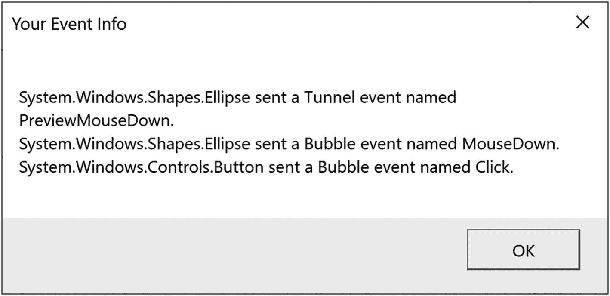

图 25-15。

先挖隧道，后冒泡

那么，为什么 WPF 事件通常成对出现(一个隧穿，一个冒泡)？答案是，通过预览事件，您可以执行任何特殊的逻辑(数据验证、禁用冒泡操作等。)在冒泡的对应物火起来之前。举例来说，假设您有一个应该只包含数字数据的`TextBox`。您可以处理`PreviewKeyDown`事件，如果您看到用户输入了非数字数据，您可以通过将`Handled`属性设置为`true`来取消冒泡事件。

正如您所猜测的，当您构建一个包含自定义事件的自定义控件时，您可以以这样一种方式创作事件，使其能够冒泡(或隧道)穿过 XAML 树。出于本章的目的，我将不研究如何构建自定义路由事件(然而，该过程与构建自定义依赖属性没有太大的不同)。如果您有兴趣，请查看。NET Framework 4.7 SDK 文档。在这本书里，你会找到很多对你有帮助的教程。

## 深入了解 WPF API 和控件

本章的剩余部分将让你有机会使用 Visual Studio 构建一个新的 WPF 应用。目标是创建一个由包含一组选项卡的`TabControl`小部件组成的 UI。每个选项卡将说明一些新的 WPF 控件和有趣的 API，您可能希望在您的软件项目中使用它们。在此过程中，您还将了解 Visual Studio WPF 设计器的其他功能。

### 使用 TabControl

首先，创建一个名为 WpfControlsAndAPIs 的新 WPF 应用。如上所述，您的初始窗口将包含一个带有三个不同选项卡的`TabControl`，每个选项卡显示一组相关的控件和/或 WPF API。将窗口的`Width`更新为 800，将`Height`更新为 350。

在 Visual Studio 工具箱中找到`TabControl`控件，将其放到您的设计器上，并将标记更新为以下内容:

```cs
<TabControl Name="MyTabControl" HorizontalAlignment="Stretch" VerticalAlignment="Stretch">
    <TabItem Header="TabItem">
        <Grid Background="#FFE5E5E5"/>
    </TabItem>
    <TabItem Header="TabItem">
        <Grid Background="#FFE5E5E5"/>
    </TabItem>
</TabControl>

```

您会注意到，系统会自动为您提供两个选项卡项目。要添加额外的选项卡，您只需右键单击文档大纲窗口中的`TabControl`节点，并选择添加`TabItem`菜单选项(您也可以右键单击设计器上的`TabControl`来激活相同的菜单选项)，或者只需在 XAML 编辑器中开始键入。使用任一方法添加一个额外的选项卡。

现在，通过 XAML 编辑器更新每个`TabItem`控件，并更改每个选项卡的`Header`属性，将它们命名为`Ink API`、`Data Binding`和`DataGrid`。此时，你的窗口设计器应该如图 25-16 所示。

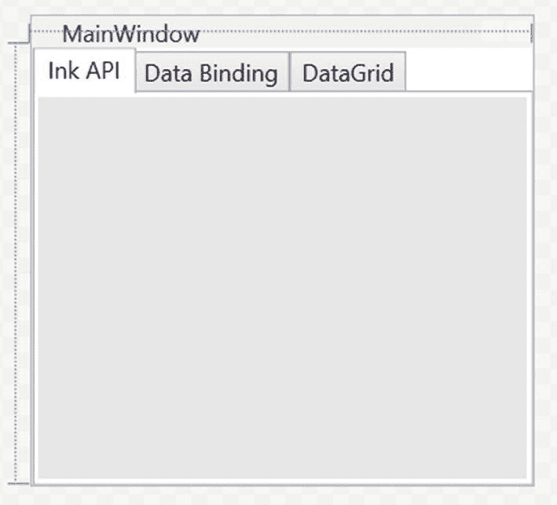

图 25-16。

标签系统的初始布局

请注意，当您选择一个选项卡进行编辑时，该选项卡将成为活动选项卡，您可以通过从“工具箱”窗口中拖动控件来设计该选项卡。既然已经定义了核心内容`TabControl`,您可以一个标签一个标签地研究细节，并在此过程中了解 WPF API 的更多特性。

## 构建 Ink API 选项卡

第一个选项卡将用于显示 WPF 的数字墨水 API 的整体作用，它允许您轻松地将绘画功能合并到程序中。当然，该应用并不一定是绘画应用；您可以将这个 API 用于多种用途，包括捕获手写输入。

Note

对于这一章的其余大部分(以及接下来的 WPF 章节)，我将直接编辑 XAML，而不是使用各种设计器窗口。虽然控件的拖放工作正常，但通常布局不是您想要的(Visual Studio 会根据您放置控件的位置添加边距和填充)，而且您无论如何都要花费大量时间来清理 XAML。

首先将 Ink API `TabItem`下的`Grid`标签改为`StackPanel`，并添加一个结束标签(确保从开始标签中删除`"/"`)。您的标记应该如下所示:

```cs
<TabItem Header="Ink API">
  <StackPanel Background="#FFE5E5E5">
  </StackPanel>
</TabItem>

```

### 设计工具栏

添加一个新的`ToolBar`控件到 StackPanel(使用 XAML 编辑器),名为`InkToolbar`,高度为`60`

```cs
.<ToolBar Name="InkToolBar" Height="60">
</ToolBar>

```

将三个`RadioButton`控件添加到`ToolBar`的`WrapPanel`控件和`Border`控件内，如下所示:

```cs
<Border Margin="0,2,0,2.4" Width="280" VerticalAlignment="Center">
  <WrapPanel>
    <RadioButton x:Name="inkRadio" Margin="5,10" Content="Ink Mode!" IsChecked="True" />
    <RadioButton x:Name="eraseRadio" Margin="5,10" Content="Erase Mode!" />
    <RadioButton x:Name="selectRadio" Margin="5,10" Content="Select Mode!" />
  </WrapPanel>
</Border>

```

当`RadioButton`控件不在父面板控件中时，它将呈现与`Button`控件相同的 UI！这就是为什么我把`RadioButton`控件包在`WrapPanel`里的原因。

接下来，添加一个`Separator`，然后添加一个`ComboBox`，其`Width`为 175，`Margin`为 10，0，0，0。添加三个内容为`Red`、`Green`和`Blue`的`ComboBoxItem`标签，并在整个`ComboBox`之后添加另一个`Separator`控件，如下所示:

```cs
<Separator/>
<ComboBox x:Name="comboColors" Width="175" Margin="10,0,0,0">
  <ComboBoxItem Content="Red"/>
  <ComboBoxItem Content="Green"/>
  <ComboBoxItem Content="Blue"/>
</ComboBox>
<Separator/>

```

### 单选按钮控件

在本例中，您希望这三个`RadioButton`控件互斥。在其他 GUI 框架中，要确保一组相关的控件(比如单选按钮)是互斥的，就需要将它们放在同一个分组框中。在 WPF 时代，你不需要这么做。相反，你可以简单地将它们分配到同一个*组名*。这是有帮助的，因为相关的项目不需要被物理地收集在相同的区域中，而是可以在窗口中的任何地方。

`RadioButton`类包含一个`IsChecked`属性，当最终用户点击 UI 元素时，该属性在`true`和`false`之间切换。此外，`RadioButton`提供了两个事件(`Checked`和`Unchecked`)，您可以使用它们来拦截这种状态变化。

### 添加保存、加载和删除按钮

`ToolBar`控件中的最终控件将是一个拥有三个`Button`控件的`Grid`。在最后一个`Separator`控件后添加以下标记:

```cs
<Grid>
  <Grid.ColumnDefinitions>
    <ColumnDefinition Width="Auto"/>
    <ColumnDefinition Width="Auto"/>
    <ColumnDefinition Width="Auto"/>
  </Grid.ColumnDefinitions>
  <Button Grid.Column="0" x:Name="btnSave" Margin="10,10" Width="70" Content="Save Data"/>
  <Button Grid.Column="1" x:Name="btnLoad" Margin="10,10" Width="70" Content="Load Data"/>
  <Button Grid.Column="2" x:Name="btnClear" Margin="10,10" Width="70" Content="Clear"/>
</Grid>

```

### 添加 InkCanvas 控件

`TabControl`的最终控制是`InkCanvas`控制。在结束`ToolBar`标签之后和结束`StackPanel`标签之前添加以下标记，如下所示:

```cs
<InkCanvas x:Name="MyInkCanvas" Background="#FFB6F4F1" />

```

### 预览窗口

此时，您已经准备好测试程序了，这可以通过按 F5 键来完成。你现在应该看到三个互斥的单选按钮，一个有三个选项的组合框，和三个按钮(见图 25-17 )。

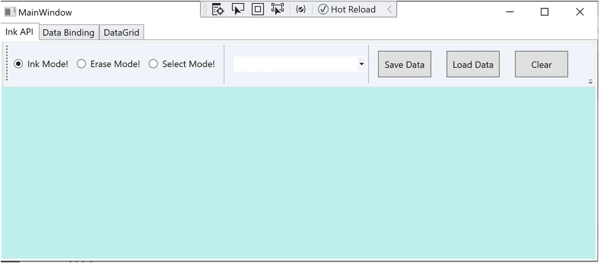

图 25-17。

Ink API 选项卡的完整布局

### 处理 Ink API 选项卡的事件

Ink API 选项卡的下一步是处理每个`RadioButton`控件的`Click`事件。正如您在本书的其他 WPF 项目中所做的那样，只需单击 Visual Studio 属性编辑器的闪电图标，输入事件处理程序的名称。使用这种方法，将每个按钮的`Click`事件路由到同一个处理程序，名为`RadioButtonClicked`。处理完所有三个`Click`事件后，使用名为`ColorChanged()`的处理程序处理`ComboBox`的`SelectionChanged`事件。完成后，您应该会看到下面的 C# 代码:

```cs
public partial class MainWindow : Window
{
  public MainWindow()
  {
    this.InitializeComponent();

    // Insert code required on object creation below this point.
  }
  private void RadioButtonClicked(object sender,RoutedEventArgs e)
  {
    // TODO: Add event handler implementation here.
  }

  private void ColorChanged(object sender,SelectionChangedEventArgs e)
  {
    // TODO: Add event handler implementation here.
  }
}

```

您将在后面的步骤中实现这些处理程序，所以暂时让它们为空。

### 向工具箱添加控件

您通过直接编辑 XAML 添加了一个`InkCanvas`控件。如果你想使用 UI 来添加它，Visual Studio 工具箱默认情况下不会*而不是*向你显示每一个可能的 WPF 组件。但是您可以更新工具箱中显示的项。

为此，右键单击工具箱区域中的任意位置，然后选择“选择项”菜单选项。过一会儿，您会看到一个可能要添加到工具箱的组件列表。出于您的目的，您对添加`InkCanvas`控件感兴趣(参见图 25-18 )。

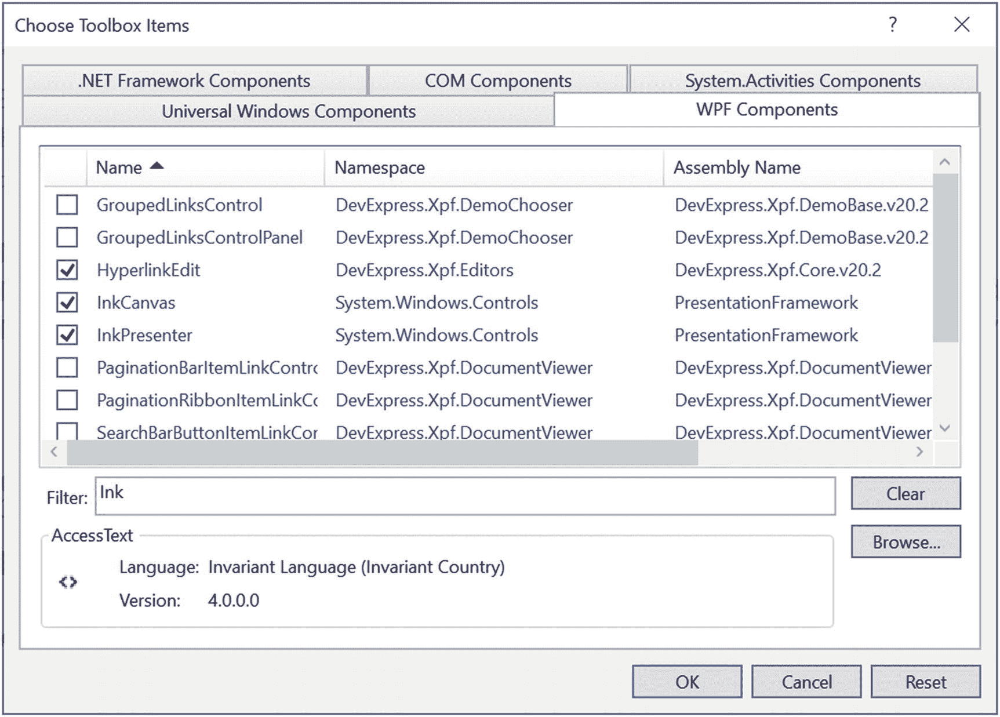

图 25-18。

向 Visual Studio 工具箱添加新组件

Note

墨迹控件与 16.8.3 版(撰写本文时的当前版本)或 Visual Studio 16.9 预览版 2 中的 Visual Studio XAML 设计器不兼容。这些控件仍然可以使用，只是不能通过设计器使用。

### InkCanvas 控件

只需添加`InkCanvas`就可以在你的窗口中绘图。您可以使用鼠标，或者如果您有支持触摸的设备，也可以使用手指或数字化笔。运行应用并绘制到框中(参见图 25-19 )。

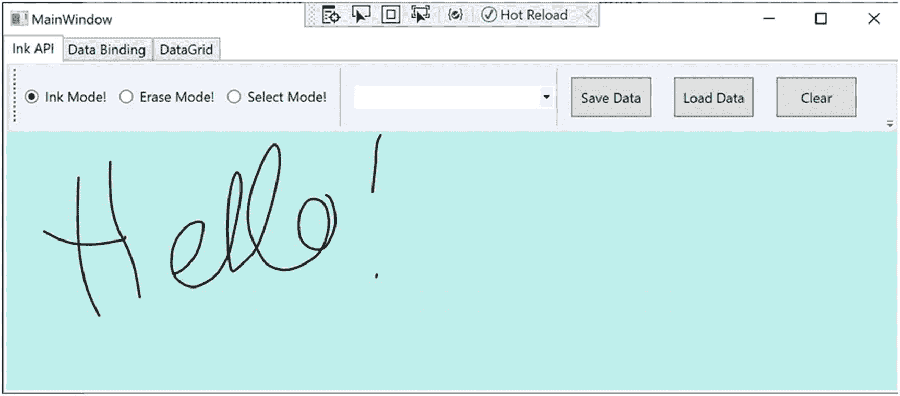

图 25-19。

`InkCanvas`在行动

`InkCanvas`不仅仅是画鼠标(或手写笔)的笔画；它还支持许多独特的编辑模式，由`EditingMode`属性控制。您可以从相关的`InkCanvasEditingMode`枚举中为该属性赋值。对于这个例子，你感兴趣的是`Ink`模式，这是你刚才目睹的默认选项；`Select`模式，允许用户用鼠标选择一个区域进行移动或调整大小；以及`EraseByStoke`，将删除之前的鼠标笔画。

Note

一个*笔划*是在单个鼠标按下/鼠标抬起操作期间发生的渲染。`InkCanvas`将所有笔画存储在一个`StrokeCollection`对象中，您可以使用`Strokes`属性访问该对象。

根据所选的`RadioButton`，用以下逻辑更新您的`RadioButtonClicked()`处理程序，将`InkCanvas`置于正确的模式:

```cs
private void RadioButtonClicked(object sender,RoutedEventArgs e)
{
  // Based on which button sent the event, place the InkCanvas in a unique
  // mode of operation.
  this.MyInkCanvas.EditingMode = (sender as RadioButton)?.Content.ToString() switch
  {
    // These strings must be the same as the Content values for each
    // RadioButton.
    "Ink Mode!" => InkCanvasEditingMode.Ink,
    "Erase Mode!" => InkCanvasEditingMode.EraseByStroke,
    "Select Mode!" => InkCanvasEditingMode.Select,
    _ => this.MyInkCanvas.EditingMode
  };
}

```

此外，在窗口的构造函数中默认设置模式为`Ink`。同时，为`ComboBox`设置一个默认选择(下一节将详细介绍这个控件)，如下所示:

```cs
public MainWindow()
{
  this.InitializeComponent();

  // Be in Ink mode by default.
  this.MyInkCanvas.EditingMode = InkCanvasEditingMode.Ink;
  this.inkRadio.IsChecked = true;
  this.comboColors.SelectedIndex = 0;
}

```

现在，按 F5 再次运行您的程序。进入墨迹模式，画一些数据。接下来，进入擦除模式，删除之前输入的鼠标笔划(您会注意到鼠标图标自动看起来像橡皮擦)。最后进入选择模式，用鼠标当套索选择一些笔画。

圈出项目后，您可以在画布上移动它并调整其尺寸。图 25-20 显示了您工作时的编辑模式。

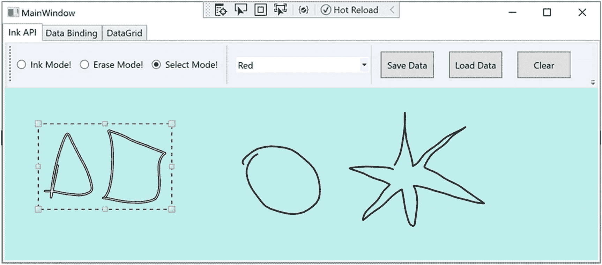

图 25-20。

动作中的`InkCanvas`，带编辑模式！

### ComboBox 控件

在您填充了一个`ComboBox`控件(或者一个`ListBox`)之后，您有三种方法来确定所选择的项目。首先，如果你想找到所选项目的数字索引，你可以使用`SelectedIndex`属性(它是从零开始的；值`-1`表示没有选择)。第二，如果您想获得列表中已被选中的对象，`SelectedItem`属性符合要求。第三，`SelectedValue`允许您获取所选对象的值(通常通过调用`ToString()`来获取)。

您需要为这个选项卡添加最后一点代码，以更改在`InkCanvas`上输入的笔画的颜色。`InkCanvas`的`DefaultDrawingAttributes`属性返回一个`DrawingAttributes`对象，允许您配置笔尖的许多方面，包括它的大小和颜色(以及其他设置)。用这个`ColorChanged()`方法的实现更新你的 C# 代码:

```cs
private void ColorChanged(object sender, SelectionChangedEventArgs e)
{
  // Get the selected value in the combo box.
  string colorToUse =
    (this.comboColors.SelectedItem as ComboBoxItem)?.Content.ToString();

  // Change the color used to render the strokes.
  this.MyInkCanvas.DefaultDrawingAttributes.Color =
    (Color)ColorConverter.ConvertFromString(colorToUse);
}

```

现在回想一下，`ComboBox`有一个`ComboBoxItems`的集合。如果查看生成的 XAML，您会看到以下定义:

```cs
<ComboBox x:Name="comboColors" Width="100" SelectionChanged="ColorChanged">
  <ComboBoxItem Content="Red"/>
  <ComboBoxItem Content="Green"/>
  <ComboBoxItem Content="Blue"/>
</ComboBox>

```

当你调用`SelectedItem`时，你抓取选中的`ComboBoxItem`，它被存储为一个通用的`Object`。将`Object`转换为`ComboBoxItem`后，取出`Content`的值，它将是字符串`Red`、`Green`或`Blue`。然后使用便利的`ColorConverter`实用程序类将这个`string`转换成一个`Color`对象。现在再次运行你的程序。渲染图像时，您应该能够在颜色之间进行切换。

注意，`ComboBox`和`ListBox`控件也可以包含复杂的内容，而不是文本数据列表。您可以通过打开您窗口的 XAML 编辑器并更改您的`ComboBox`的定义来了解一些可能的事情，因此它包含一组`StackPanel`元素，每个元素包含一个`Ellipse`和一个`Label`(注意`ComboBox`的`Width`是`175`)。

```cs
<ComboBox x:Name="comboColors" Width="175" Margin=”10,0,0,0” SelectionChanged="ColorChanged">
  <StackPanel Orientation ="Horizontal" Tag="Red">
    <Ellipse Fill ="Red" Height ="50" Width ="50"/>
    <Label FontSize ="20" HorizontalAlignment="Center"
           VerticalAlignment="Center" Content="Red"/>
  </StackPanel>

  <StackPanel Orientation ="Horizontal" Tag="Green">
    <Ellipse Fill ="Green" Height ="50" Width ="50"/>
    <Label FontSize ="20" HorizontalAlignment="Center"
           VerticalAlignment="Center" Content="Green"/>
  </StackPanel>

  <StackPanel Orientation ="Horizontal" Tag="Blue">
    <Ellipse Fill ="Blue" Height ="50" Width ="50"/>
    <Label FontSize ="20" HorizontalAlignment="Center"
           VerticalAlignment="Center" Content="Blue"/>
  </StackPanel>
</ComboBox>

```

请注意，每个`StackPanel`都为它的`Tag`属性赋值，这是一种简单、快速、方便的方法来发现用户选择了哪一堆项目(有更好的方法可以做到这一点，但这只是暂时的)。通过这种调整，您需要更改您的`ColorChanged()`方法的实现，就像这样:

```cs
private void ColorChanged(object sender, SelectionChangedEventArgs e)
{
  // Get the Tag of the selected StackPanel.
  string colorToUse = (this.comboColors.SelectedItem
      as StackPanel).Tag.ToString();
  ...
}

```

现在再次运行你的程序并记录下你的独特的`ComboBox`(见图 25-21 )。

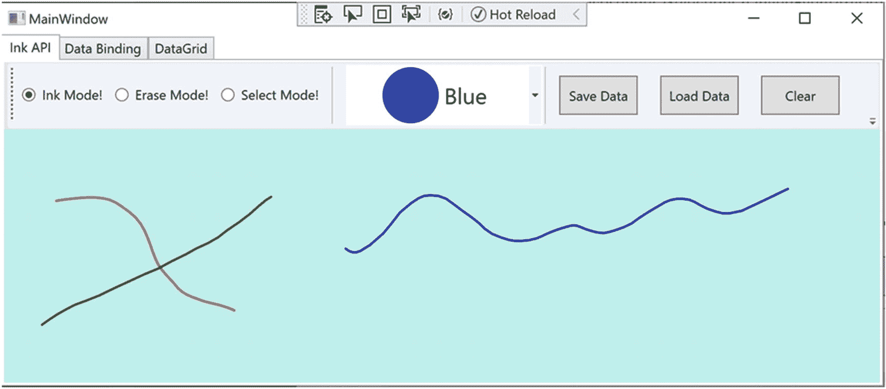

图 25-21。

自定义`ComboBox`，感谢 WPF 内容模型

### 保存、加载和清除 InkCanvas 数据

该选项卡的最后一部分将使您能够保存和加载画布数据，以及通过为工具栏中的按钮添加事件处理程序来清除所有内容。通过为单击事件添加标记来更新按钮的 XAML，如下所示:

```cs
<Button Grid.Column="0" x:Name="btnSave" Margin="10,10" Width="70" Content="Save Data" Click="SaveData"/>
<Button Grid.Column="1" x:Name="btnLoad" Margin="10,10" Width="70" Content="Load Data" Click="LoadData"/>
<Button Grid.Column="2" x:Name="btnClear" Margin="10,10" Width="70" Content="Clear" Click="Clear"/>

```

接下来，将`System.IO`和`System.Windows.Ink`名称空间导入到代码文件中。实现处理程序，如下所示:

```cs
private void SaveData(object sender, RoutedEventArgs e)
{
  // Save all data on the InkCanvas to a local file.
  using (FileStream fs = new FileStream("StrokeData.bin", FileMode.Create))
  this.MyInkCanvas.Strokes.Save(fs);
  fs.Close();
  MessageBox.Show("Image Saved","Saved");
}

private void LoadData(object sender, RoutedEventArgs e)
{
  // Fill StrokeCollection from file.
  using(FileStream fs = new FileStream("StrokeData.bin", FileMode.Open, FileAccess.Read))
  StrokeCollection strokes = new StrokeCollection(fs);
  this.MyInkCanvas.Strokes = strokes;
}

private void Clear(object sender, RoutedEventArgs e)
{
  // Clear all strokes.
  this.MyInkCanvas.Strokes.Clear();
}

```

现在，您应该能够将您的数据保存到一个文件中，从文件中加载它，并清除所有数据的`InkCanvas`。这就结束了`TabControl`的第一个选项卡，以及您对 WPF 数字墨水 API 的检查。可以肯定的是，关于这项技术还有更多要说的；然而，如果你对这个话题感兴趣的话，你应该能够更深入地挖掘。接下来，您将学习如何使用 WPF 数据绑定。

## 介绍 WPF 数据绑定模型

控件通常是各种数据绑定操作的目标。简而言之，*数据绑定*是将控件属性连接到数据值的行为，这些数据值可能会在应用的生命周期中发生变化。这样做可以让用户界面元素显示代码中变量的状态。例如，您可以使用数据绑定来完成以下任务:

*   基于给定对象的布尔属性检查`CheckBox`控件。

*   显示来自关系数据库表的`DataGrid`对象中的数据。

*   将一个`Label`连接到一个表示文件夹中文件数量的整数。

当您使用固有的 WPF 数据绑定引擎时，您必须注意绑定操作的*源*和*目的地*之间的区别。如您所料，数据绑定操作的源是数据本身(例如，布尔属性或关系数据)，而目的地(目标)是使用数据内容的 UI 控件属性(例如，`CheckBox`或`TextBox`控件上的属性)。

除了绑定到传统数据，WPF 还支持元素绑定，如前面的示例所述。这意味着您可以根据复选框的 checked 属性绑定(例如)属性的可见性。您当然可以在 WinForms 中做到这一点，但这必须通过代码来完成。WPF 框架提供了一个丰富的数据绑定生态系统，几乎可以完全用标记来处理。这也使您能够确保源和目标在它们的任何一个值发生变化时保持同步。

### 构建数据绑定选项卡

使用文档大纲编辑器，将第二个选项卡的`Grid`更改为`StackPanel`。现在，使用 Visual Studio 的工具箱和属性编辑器构建以下初始布局:

```cs
<TabItem x:Name="tabDataBinding" Header="Data Binding">
  <StackPanel Width="250">
    <Label Content="Move the scroll bar to see the current value"/>

    <!-- The scrollbar's value is the source of this data bind. -->
    <ScrollBar x:Name="mySB" Orientation="Horizontal" Height="30"
           Minimum = "1" Maximum = "100" LargeChange="1" SmallChange="1"/>

    <!-- The label's content will be bound to the scroll bar! -->
    <Label x:Name="labelSBThumb" Height="30" BorderBrush="Blue"
           BorderThickness="2" Content = "0"/>
  </StackPanel>
</TabItem>

```

注意，`ScrollBar`对象(此处命名为`mySB`)被配置了一个介于`1`和`100`之间的范围。目标是确保当你重新定位滚动条(或者点击左箭头或右箭头)时，`Label`会自动更新当前值。目前，`Label`控件的`Content`属性被设置为值`"0"`；但是，您将通过数据绑定操作来更改这一点。

### 建立数据绑定

使在 XAML 定义绑定成为可能的粘合剂是`{Binding}`标记扩展。虽然可以通过 Visual Studio 定义绑定，但直接在标记中定义也同样容易。将名为`labelSBThumb`的`Label`的`Content`属性编辑如下:

```cs
<Label x:Name="labelSBThumb" Height="30" BorderBrush="Blue" BorderThickness="2"
       Content = "{Binding Path=Value, ElementName=mySB}"/>

```

注意分配给`Label`的`Content`属性的值。`{Binding}`语句表示数据绑定操作。`ElementName`值表示数据绑定操作的源(`ScrollBar`对象)，而`Path`表示被绑定的属性，在本例中是滚动条的`Value`。

如果您再次运行您的程序，您会发现当您移动滑块时，标签的内容会根据滚动条的值进行更新！

### DataContext 属性

您可以使用另一种格式在 XAML 中定义数据绑定操作，在这种格式中，可以通过将`DataContext`属性显式设置为绑定操作的源来分解由`{Binding}`标记扩展指定的值，如下所示:

```cs
<!-- Breaking object/value apart via DataContext -->
<Label x:Name="labelSBThumb" Height="30" BorderBrush="Blue" BorderThickness="2"
       DataContext = "{Binding ElementName=mySB}" Content = "{Binding Path=Value}" />

```

在当前示例中，如果您以这种方式修改标记，输出将是相同的。考虑到这一点，您可能想知道何时需要显式设置`DataContext`属性。这样做很有帮助，因为子元素可以在标记树中继承它的值。

通过这种方式，您可以轻松地将同一个数据源设置为一系列控件，而不必将一堆冗余的`"{Binding ElementName=X, Path=Y}"` XAML 值重复给多个控件。例如，假设您已经将以下新的`Button`添加到该选项卡的`StackPanel`中(您马上就会明白为什么它如此之大):

```cs
<Button Content="Click" Height="200"/>

```

您可以使用 Visual Studio 为多个控件生成数据绑定，但可以尝试使用 XAML 编辑器手动输入修改后的标记，如下所示:

```cs
<!-- Note the StackPanel sets the DataContext property. -->
<StackPanel Background="#FFE5E5E5" DataContext = "{Binding ElementName=mySB}">
...
  <!-- Now both UI elements use the scrollbar's value in unique ways. -->
  <Label x:Name="labelSBThumb" Height="30" BorderBrush="Blue" BorderThickness="2"
         Content = "{Binding Path=Value}"/>

  <Button Content="Click" Height="200" FontSize = "{Binding Path=Value}"/>
</StackPanel>

```

这里，您直接在`StackPanel`上设置`DataContext`属性。因此，当你移动拇指时，你不仅会看到`Label`上的当前值，还会看到`Button`的字体大小根据相同的值相应地增大和缩小(图 25-22 显示了一个可能的输出)。

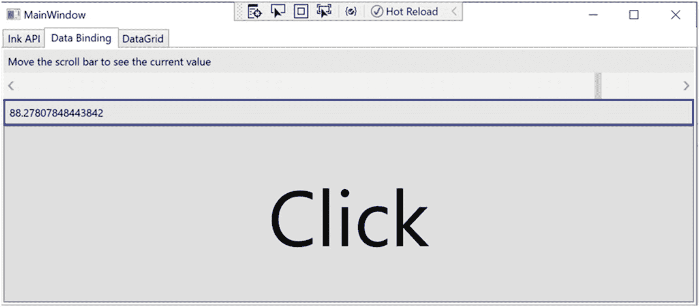

图 25-22。

将`ScrollBar`值绑定到`Label`和`Button`

### 格式化绑定数据

`ScrollBar`类型使用`double`来表示 thumb 的值，而不是期望的整数(例如，整数)。因此，当你拖动拇指时，你会发现在`Label`中显示各种浮点数(如 61.066923076923)。最终用户会发现这相当不直观，因为他很可能期望看到整数(例如，61、62 和 63)。

如果想要格式化数据，可以添加一个`ContentStringFormat`属性，传入一个自定义字符串和一个. NET 核心格式说明符，如下所示:

```cs
<Label x:Name="labelSBThumb" Height="30" BorderBrush="Blue"
  BorderThickness="2" Content = "{Binding Path=Value}" ContentStringFormat="The value is: {0:F0}"/>

```

如果在格式规范中没有任何文本，那么需要以一组空的大括号开始，这是 XAML 的转义序列。例如，这让处理器知道接下来的字符是文字，而不是绑定语句。以下是更新后的 XAML:

```cs
<Label x:Name="labelSBThumb" Height="30" BorderBrush="Blue"
  BorderThickness="2" Content = "{Binding Path=Value}" ContentStringFormat="{}{0:F0}"/>

```

Note

如果您正在绑定一个控件的`Text`属性，您可以在 binding 语句中添加一个`StringFormat`名称-值对。只需要为`Content`属性单独设置即可。

### 使用 IValueConverter 进行数据转换

如果您需要做的不仅仅是格式化数据，您可以创建一个自定义类来实现名称空间`System.Windows.Data`的`IValueConverter`接口。此接口定义了两个成员，允许您在目标和目的地之间执行转换(在双向数据绑定的情况下)。定义该类后，可以用它来进一步限定数据绑定操作的处理。

除了使用 format 属性，您还可以使用值转换器在`Label`控件中显示整数。为此，向项目类添加一个新类(名为`MyDoubleConverter`)。接下来，添加以下内容:

```cs
using System;
using System.Windows.Data;
namespace
namespace WpfControlsAndAPIs
{
  public class MyDoubleConverter : IValueConverter
  {
    public object Convert(object value, Type targetType, object parameter,  System.Globalization.CultureInfo culture)
    {
      // Convert the double to an int.
      double v = (double)value;
      return (int)v;
    }

    public object ConvertBack(object value, Type targetType, object parameter,
      System.Globalization.CultureInfo culture)
    {
    // You won't worry about "two-way" bindings here, so just return the value.
    return value;
    }
  }
}

```

当值从源(`ScrollBar`)传输到目的地(`TextBox`的`Text`属性)时，调用`Convert()`方法。您将收到许多传入的参数，但是您只需要操作传入的`object`进行转换，这是当前`double`的值。您可以使用此类型将类型转换为整数并返回新的数字。

当值从目的地传递到源时，将调用`ConvertBack()`方法(如果您启用了双向绑定模式)。这里，您只需直接返回值。这样做可以让您在`TextBox`(例如`99.9`)中键入一个浮点值，并让它在用户关闭控件时自动转换成一个整数值(例如`99`)。这种“自由”转换的发生是因为在调用了`ConvertBack()`之后，再次调用了`Convert()`方法。如果你只是简单地从`ConvertBack()`返回`null`，你的绑定会看起来不同步，因为文本框仍然会显示一个浮点数。

要在标记中使用这个转换器，首先必须创建一个本地资源来表示您刚刚构建的自定义类。不要担心添加资源的机制；接下来的几章将深入探讨这个问题。在开始的`Window`标签后添加以下内容:

```cs
<Window.Resources>
  <local:MyDoubleConverter x:Key="DoubleConverter"/>
</Window.Resources>

```

接下来，将`Label`控件的绑定语句更新为:

```cs
<Label x:Name="labelSBThumb" Height="30" BorderBrush="Blue"
    BorderThickness="2" Content = "{Binding Path=Value,Converter={StaticResource DoubleConverter}}" />

```

现在，当你运行应用时，你只能看到整数。

### 在代码中建立数据绑定

您也可以在代码中注册数据转换类。首先清理数据绑定选项卡中的`Label`控件的当前定义，使其不再使用`{Binding}`标记扩展。

```cs
<Label x:Name="labelSBThumb" Height="30" BorderBrush="Blue" BorderThickness="2" />

```

确保有对`System.Windows.Data`的使用；然后在你的窗口的构造函数中，调用一个名为`SetBindings()`的新的私有帮助函数。在此方法中，添加以下代码(并确保从构造函数中调用它):

```cs
using System.Windows.Data;
...
namespace WpfControlsAndAPIs
{
  public partial class MainWindow : Window
  {
    public MainWindow()
    {
      InitializeComponent();
...
      SetBindings();
    }
...
    private void SetBindings()
    {
      // Create a Binding object.
      Binding b = new Binding
      {
        // Register the converter, source, and path.
        Converter = new MyDoubleConverter(),
        Source = this.mySB,
        Path = new PropertyPath("Value")
        // Call the SetBinding method on the Label.
        this.labelSBThumb.SetBinding(Label.ContentProperty, b);
      }
    }
  }
}

```

这个函数唯一看起来有点不正常的部分是对`SetBinding()`的调用。注意，第一个参数调用了名为`ContentProperty`的`Label`类的一个静态只读字段。正如你将在本章后面学到的，你正在指定所谓的*依赖属性*。目前，只需知道当您在代码中设置绑定时，第一个参数几乎总是要求您指定需要绑定的类的名称(在本例中为`Label`)，然后调用带有`Property`后缀的底层属性。无论如何，运行应用说明`Label`只打印出整数。

### 构建数据网格选项卡

前面的数据绑定示例阐释了如何配置两个(或更多)控件来参与数据绑定操作。虽然这很有帮助，但是也可以绑定来自 XML 文件、数据库数据和内存中对象的数据。为了完成这个示例，您将设计选项卡控件的最后一个选项卡，以便它显示从`AutoLot`数据库的`Inventory`表中获得的数据。

与其他选项卡一样，首先将当前的`Grid`更改为`StackPanel`。为此，可以使用 Visual Studio 直接更新 XAML。现在在名为`gridInventory`的新`StackPanel`中定义一个`DataGrid`控件，如下所示:

```cs
<TabItem x:Name="tabDataGrid" Header="DataGrid">
  <StackPanel>
    <DataGrid x:Name="gridInventory" Height="288"/>
  </StackPanel>
</TabItem>

```

使用 NuGet 包管理器将以下包添加到项目中:

*   `Microsoft.EntityFrameworkCore`

*   `Microsoft.EntityFrameworkCore.SqlServer`

*   `Microsoft.Extensions.Configuration`

*   `Microsoft.Extensions.Configuration.Json`

如果您喜欢使用。NET Core 命令行界面(CLI)要添加包，请输入以下命令(从解决方案目录中):

```cs
dotnet add WpfControlsAndAPIs package Microsoft.EntityFrameworkCore
dotnet add WpfControlsAndAPIs package Microsoft.EntityFrameworkCore.SqlServer
dotnet add WpfControlsAndAPIs package Microsoft.Extensions.Configuration
dotnet add WpfControlsAndAPIs package Microsoft.Extensions.Configuration.Json

```

接下来，右键单击该解决方案，选择“添加➤现有项目”，然后添加 AutoLot。达尔和奥托洛特。Dal .从第章到第二十三章对项目建模，并对这些项目进行项目引用。您还可以使用 CLI 通过以下命令添加引用(您需要根据项目的位置和计算机的操作系统调整路径):

```cs
dotnet sln .\Chapter25_AllProjects.sln add ..\Chapter_23\AutoLot.Models
dotnet sln .\Chapter25_AllProjects.sln add ..\Chapter_23\AutoLot.Dal
dotnet add WpfControlsAndAPIs reference ..\Chapter_23\AutoLot.Models
dotnet add WpfControlsAndAPIs reference ..\Chapter_23\AutoLot.Dal

```

确认来自 AutoLot 的项目引用。达尔到奥特洛特。Dal.Models 还在。将以下名称空间添加到`MainWindow.xaml.cs`:

```cs
using System.Linq;
using AutoLot.Dal.EfStructures;
using AutoLot.Dal.Repos;
using Microsoft.EntityFrameworkCore;
using Microsoft.Extensions.Configuration;

```

在`MainWindow.cs`中添加两个模块级属性来保存`IConfiguration`和`ApplicationDbContext`的实例。

```cs
private IConfiguration _configuration;
private ApplicationDbContext _context;

```

添加一个名为`GetConfigurationAndContext()`的新方法来创建这些实例，并从构造函数中调用它。下面列出了整个方法:

```cs
private void GetConfigurationAndDbContext()
{
  _configuration = new ConfigurationBuilder()
    .SetBasePath(Directory.GetCurrentDirectory())
    .AddJsonFile("appsettings.json", true, true)
    .Build();
  var optionsBuilder =
    new DbContextOptionsBuilder<ApplicationDbContext>();
  var connectionString =
    _configuration.GetConnectionString("AutoLot");
  optionsBuilder.UseSqlServer(connectionString,
    sqlOptions => sqlOptions.EnableRetryOnFailure());
  _context = new ApplicationDbContext(optionsBuilder.Options);
}

```

将名为`appsettings.json`的新 JSON 文件添加到项目中，并将其构建状态设置为 copy always。这可以通过在解决方案资源管理器中右击文件，选择 Properties，然后输入 **Copy always** 作为 Copy To Output Directory 设置来完成。您也可以将它添加到项目文件中来完成相同的任务:

```cs
<ItemGroup>
  <None Update="appsettings.json">
    <CopyToOutputDirectory>Always</CopyToOutputDirectory>
  </None>
</ItemGroup>

```

将 JSON 文件更新为以下内容(更新连接字符串以匹配您的环境):

```cs
{
  "ConnectionStrings": {
    "AutoLotFinal": "server=.,5433;Database=AutoLot;User Id=sa;Password=P@ssw0rd;"
  }
}

```

打开`MainWindow.xaml.cs`，添加一个名为`ConfigureGrid()`的最终 helper 函数，配置好`ApplicationDbContext`后从你的构造函数中调用。您需要做的只是添加几行代码，就像这样:

```cs
private void ConfigureGrid()
{
  using var repo = new CarRepo(_context);
  gridInventory.ItemsSource = repo
    .GetAllIgnoreQueryFilters()
    .ToList()
    .Select(x=> new {
      x.Id,
      Make=x.MakeName,
      x.Color,
      x.PetName
    });
}

```

现在，当您运行项目时，您会看到数据填充了网格。如果您想让网格看起来更漂亮，可以使用 Visual Studio 属性窗口编辑网格，使其更有吸引力。

这就结束了当前的例子。在后面的章节中，你会看到一些其他的控件在起作用；然而，在这一点上，您应该对在 Visual Studio 中构建 ui 以及手动使用 XAML 和 C# 代码的过程感到舒适。

## 了解依赖项属性的作用

像其他人一样。NET 核心 API，WPF 利用每个成员的。NET 核心类型系统(类、结构、接口、委托、枚举)和每个类型成员(属性、方法、事件、常量数据、只读字段等。)在其实现中。然而，WPF 也支持一个独特的编程概念，称为*依赖属性*。

像个“正常人”。NET 核心属性(在 WPF 文献中通常称为 *CLR 属性*)，依赖属性可以使用 XAML 以声明方式设置，也可以在代码文件中以编程方式设置。此外，依赖属性(如 CLR 属性)最终是为了封装类的数据字段而存在的，并且可以配置为只读、只写或读写。

更有趣的是，几乎在每种情况下，您都不会意识到您实际上设置了(或访问了)一个依赖属性，而不是 CLR 属性！例如，WPF 控件从`FrameworkElement`继承的`Height`和`Width`属性，以及从`ControlContent`继承的`Content`成员，实际上都是依赖属性。

```cs
<!-- Set three dependency properties! -->
<Button x:Name = "btnMyButton" Height = "50" Width = "100" Content = "OK"/>

```

鉴于所有这些相似之处，为什么 WPF 要为这样一个熟悉的概念定义一个新的术语呢？答案在于依赖属性是如何在类中实现的。一会儿你会看到一个编码的例子。但是，从高层次来看，所有依赖关系属性都是以下列方式创建的:

*   首先，定义依赖属性的类在其继承链中必须有`DependencyObject`。

*   单个依赖属性在类型为`DependencyProperty`的类中被表示为一个公共的、静态的、只读的字段。按照惯例，这个字段是通过在 CLR 包装器的名称后面加上单词`Property`来命名的(参见最后一点)。

*   通过对`DependencyProperty.Register()`的静态调用来注册`DependencyProperty`变量，这通常发生在静态构造函数中，或者在声明变量时内联。

*   最后，该类将定义一个 XAML 友好的 CLR 属性，该属性调用由`DependencyObject`提供的方法来获取和设置值。

一旦实现，依赖属性提供了许多强大的功能，这些功能被各种 WPF 技术使用，包括数据绑定、动画服务、样式、模板等等。简而言之，依赖属性的动机是提供一种基于其他输入的值来计算属性值的方法。以下是一些关键优势的列表，这些优势远远超出了使用 CLR 属性进行简单数据封装的优势:

*   依赖属性可以从父元素的 XAML 定义中继承它们的值。例如，如果在`Window`的开始标记中为`FontSize`属性定义了一个值，那么在默认情况下，`Window`中的所有控件将具有相同的字体大小。

*   依赖属性支持由包含在它们的 XAML 范围内的元素设置值的能力，例如一个`Button`设置一个`DockPanel`父的`Dock`属性。(回想一下*附加属性*做这件事，因为附加属性是依赖属性的一种形式。)

*   依赖属性允许 WPF 根据多个外部值计算一个值，这对动画和数据绑定服务很重要。

*   依赖属性为 WPF 触发器提供基础结构支持(在处理动画和数据绑定时也经常使用)。

现在请记住，在许多情况下，您将以与普通 CLR 属性相同的方式与现有的依赖属性进行交互(多亏了 XAML 包装器)。在前面讨论数据绑定的部分中，您看到了如果您需要在代码中建立数据绑定，您必须在作为操作目的地的对象上调用`SetBinding()`方法，并指定它将操作的*依赖属性*，如下所示:

```cs
private void SetBindings()
{
  Binding b = new Binding
  {
    // Register the converter, source, and path.
    Converter = new MyDoubleConverter(),
    Source = this.mySB,
    Path = new PropertyPath("Value")
  };
  // Specify the dependency property!
  this.labelSBThumb.SetBinding(Label.ContentProperty, b);
}

```

当你在第二十七章中研究如何用代码启动动画时，你会看到类似的代码。

```cs
// Specify the dependency property!
rt.BeginAnimation(RotateTransform.AngleProperty, dblAnim);

```

只有在创作自定义 WPF 控件时，才需要构建自己的自定义依赖项属性。例如，如果您正在构建一个定义了四个定制属性的`UserControl`，并且您希望这些属性能够很好地集成到 WPF API 中，那么您应该使用依赖属性逻辑来创作它们。

具体来说，如果您的属性需要成为数据绑定或动画操作的目标，如果属性必须在更改时广播，如果它必须能够作为 WPF 风格的`Setter`工作，或者如果它必须能够从父元素接收它们的值，那么普通的 CLR 属性将*而不是*就足够了。如果你使用一个普通的 CLR 属性，其他程序员可能真的能够获得和设置一个值；然而，如果他们试图在 WPF 服务的上下文中使用您的属性，事情将不会像预期的那样工作。因为你永远不知道其他人可能想要如何与你的定制`UserControl`类的属性交互，你应该养成在构建定制控件时*总是*定义依赖属性的习惯。

### 检查现有的依赖属性

在您学习如何构建一个定制的依赖属性之前，让我们来看看`FrameworkElement`类的`Height`属性是如何在内部实现的。相关代码如下所示(包括我的注释):

```cs
// FrameworkElement is-a DependencyObject.
public class FrameworkElement : UIElement, IFrameworkInputElement,
  IInputElement, ISupportInitialize, IHaveResources, IQueryAmbient
{
...
  // A static read-only field of type DependencyProperty.
  public static readonly DependencyProperty HeightProperty;

  // The DependencyProperty field is often registered
  // in the static constructor of the class.
  static FrameworkElement()
  {
    ...
    HeightProperty = DependencyProperty.Register(
      "Height",
      typeof(double),
      typeof(FrameworkElement),
      new FrameworkPropertyMetadata((double) 1.0 / (double) 0.0,
        FrameworkPropertyMetadataOptions.AffectsMeasure,
        new PropertyChangedCallback(FrameworkElement.OnTransformDirty)),
      new ValidateValueCallback(FrameworkElement.IsWidthHeightValid));
    }

    // The CLR wrapper, which is implemented using
    // the inherited GetValue()/SetValue() methods.
    public double Height
    {
      get { return (double) base.GetValue(HeightProperty); }
      set { base.SetValue(HeightProperty, value); }
    }
}

```

正如您所看到的，依赖属性需要普通 CLR 属性的相当多的额外代码！实际上，依赖关系可能比您在这里看到的更复杂(幸运的是，许多实现比`Height`更简单)。

首先，记住如果一个类想要定义一个依赖属性，它必须在继承链中有`DependencyObject`，因为这是定义 CLR 包装器中使用的`GetValue()`和`SetValue()`方法的类。因为`FrameworkElement` *是-a* `DependencyObject`，这个要求就满足了。

接下来，回想一下将保存属性实际值的实体(在`Height`的情况下是一个`double`)被表示为一个`DependencyProperty`类型的公共、静态、只读字段。按照惯例，这个字段的名称应该总是通过在相关 CLR 包装器的名称后面加上单词`Property`来命名，就像这样:

```cs
public static readonly DependencyProperty HeightProperty;

```

假设依赖属性被声明为静态字段，它们通常在类的静态构造函数中创建(和注册)。通过调用静态的`DependencyProperty.Register()`方法来创建`DependencyProperty`对象。此方法已被重载多次；然而，在`Height`的情况下，调用`DependencyProperty.Register()`如下:

```cs
HeightProperty = DependencyProperty.Register(
  "Height",
  typeof(double),
  typeof(FrameworkElement),
  new FrameworkPropertyMetadata((double)0.0,
    FrameworkPropertyMetadataOptions.AffectsMeasure,
    new PropertyChangedCallback(FrameworkElement.OnTransformDirty)),
  new ValidateValueCallback(FrameworkElement.IsWidthHeightValid));

```

`DependencyProperty.Register()`的第一个参数是类的普通 CLR 属性的名称(本例中为`Height`)，而第二个参数是它封装的底层数据类型的类型信息(T2)。第三个参数指定该属性所属的类的类型信息(在本例中为`FrameworkElement`)。虽然这看起来有些多余(毕竟，`HeightProperty`字段已经在`FrameworkElement`类中定义了)，但这是 WPF 的一个巧妙之处，因为它允许一个类在另一个类上注册属性(即使类定义已经被密封了！).

在这个例子中，传递给`DependencyProperty.Register()`的第四个参数真正赋予了依赖属性自己独特的味道。在这里，传递了一个`FrameworkPropertyMetadata`对象，该对象描述了关于 WPF 应该如何处理该属性的各种细节，这些细节涉及回调通知(如果该属性需要在值改变时通知其他人)和各种选项(由`FrameworkPropertyMetadataOptions`枚举表示),这些选项控制所讨论的属性所影响的内容。(它和数据绑定一起工作吗？能遗传吗？)在这种情况下，`FrameworkPropertyMetadata`的构造函数参数分解如下:

```cs
new FrameworkPropertyMetadata(
  // Default value of property.
  (double)0.0,

  // Metadata options.
  FrameworkPropertyMetadataOptions.AffectsMeasure,

  // Delegate pointing to method called when property changes.
  new PropertyChangedCallback(FrameworkElement.OnTransformDirty)
)

```

因为`FrameworkPropertyMetadata`构造函数的最后一个参数是一个委托，注意它的构造函数参数指向了`FrameworkElement`类上一个名为`OnTransformDirty()`的静态方法。我不会费心展示这个方法背后的代码，但是请注意，任何时候您构建一个定制的依赖属性，您都可以指定一个`PropertyChangedCallback`委托来指向一个方法，当您的属性值被更改时，这个方法将被调用。

这就把我带到了传递给`DependencyProperty.Register()`方法的最后一个参数，类型为`ValidateValueCallback`的第二个委托，它指向`FrameworkElement`类上的一个方法，调用这个方法是为了确保分配给属性的值是有效的。

```cs
new ValidateValueCallback(FrameworkElement.IsWidthHeightValid)

```

这个方法包含了您通常期望在属性的 set 块中找到的逻辑(在下一节中有关于这一点的更多信息)。

```cs
private static bool IsWidthHeightValid(object value)
{
  double num = (double) value;
  return ((!DoubleUtil.IsNaN(num) && (num >= 0.0))
    && !double.IsPositiveInfinity(num));
}

```

在注册了`DependencyProperty`对象之后，最后的任务是将该字段包装在一个普通的 CLR 属性中(在本例中是`Height`)。但是，请注意，`get`和`set`作用域并不简单地返回或设置类级别的双成员变量，而是使用来自`System.Windows.DependencyObject`基类的`GetValue()`和`SetValue()`方法间接这样做，如下所示:

```cs
public double Height
{
  get { return (double) base.GetValue(HeightProperty); }
  set { base.SetValue(HeightProperty, value); }
}

```

### 关于 CLR 属性包装的重要说明

因此，简单回顾一下到目前为止的故事，当您在 XAML 或代码中获取或设置它们的值时，依赖属性看起来就像普通的日常属性，但是在幕后，它们是用更复杂的编码技术实现的。请记住，完成此过程的全部原因是为了构建一个自定义控件，该控件具有需要与 WPF 服务集成的自定义属性，这些服务需要与依赖属性(例如，动画、数据绑定和样式)进行通信。

即使依赖项属性的部分实现包括定义 CLR 包装，也不应该将验证逻辑放在 set 块中。就此而言，依赖属性的 CLR 包装除了调用`GetValue()`或`SetValue()`之外不应该做任何事情。

原因在于，WPF 运行时的构造方式使得当您编写 XAML 时，它似乎设置了一个属性，例如

```cs
<Button x:Name="myButton" Height="100" .../>

```

运行时会完全绕过`Height`属性的 set 块，直接*调用`SetValue()`！这种奇怪行为的原因与一种简单的优化技术有关。如果 WPF 运行时要调用`Height`属性的 set 块，它将不得不执行运行时反射来找出`DependencyProperty`字段(由`SetValue()`的第一个参数指定)的位置，在内存中引用它，等等。如果您要编写检索属性`Height`的值的 XAML，那么同样的故事也是成立的— `GetValue()`将被直接调用。*

既然是这样，为什么还需要构建这个 CLR 包装器呢？WPF·XAML 不允许你在标记中调用函数，所以下面的标记是错误的:

```cs
<!-- Nope! Can't call methods in WPF XAML! -->
<Button x:Name="myButton" this.SetValue("100") .../>

```

实际上，当您使用 CLR 包装在标记中设置或获取一个值时，可以把它看作是告诉 WPF 运行时“嘿！去帮我调用`GetValue()` / `SetValue()`，因为我不能直接用标记来做！”现在，如果您用如下代码调用 CLR 包装器会怎么样:

```cs
Button b = new Button();
b.Height = 10;

```

在这种情况下，如果`Height`属性的 set 块包含对`SetValue()`的调用之外的代码，它*将*执行，因为不涉及 WPF·XAML 解析器优化。

要记住的基本规则是，当注册一个依赖属性时，使用一个`ValidateValueCallback`委托来指向一个执行数据验证的方法。这确保了无论您是使用 XAML 还是代码来获取/设置依赖项属性，都会发生正确的行为。

## 构建自定义依赖项属性

如果你在这一章的这一点上有点头疼，这是完全正常的反应。构建依赖属性可能需要一些时间来适应。然而，无论好坏，这是构建许多自定义 WPF 控件过程的一部分，所以让我们来看看如何构建依赖属性。

首先创建一个名为 CustomDependencyProperty 的新 WPF 应用。现在，使用项目菜单，激活添加用户控件(WPF)菜单选项，并创建一个名为`ShowNumberControl.xaml`的控件。

Note

你会在第二十七章中了解到更多关于 WPF `UserControl`的细节，所以现在就按照图中所示进行吧。

就像一个窗口，WPF `UserControl`类型有一个 XAML 文件和一个相关的代码文件。更新用户控件的 XAML，在`Grid`中定义一个`Label`控件，如下所示:

```cs
<UserControl x:Class="CustomDepProp.ShowNumberControl"
    xmlns:="http://schemas.microsoft.com/winfx/2006/xaml/presentation"
    xmlns:x="http://schemas.microsoft.com/winfx/2006/xaml"
    xmlns:d="http://schemas.microsoft.com/expression/blend/2008"
    xmlns:local="clr-namespace: CustomDependencyProperty"
    mc:Ignorable="d"
    d:DesignHeight="300" d:DesignWidth="300">
  <Grid>
    <Label x:Name="numberDisplay" Height="50" Width="200" Background="LightBlue"/>
  </Grid>
</UserControl>

```

在该自定义控件的代码文件中，创建一个正常的、日常的。NET Core 属性，它包装了一个`int`，并用新值设置了`Label`的`Content`属性，如下所示:

```cs
public partial class ShowNumberControl : UserControl
{
  public ShowNumberControl()
  {
    InitializeComponent();
  }

  // A normal, everyday .NET property.
  private int _currNumber = 0;
  public int CurrentNumber
  {
    get => _currNumber;
    set
    {
      _currNumber = value;
      numberDisplay.Content = CurrentNumber.ToString();
    }
  }
}

```

现在，更新`MainWindow.xml`中的 XAML 定义，在`StackPanel`布局管理器中声明自定义控件的一个实例。因为您的自定义控件不是核心 WPF 程序集堆栈的一部分，所以您需要定义一个映射到您的控件的自定义 XML 命名空间。以下是所需的标记:

```cs
<Window x:Class="CustomDepPropApp.MainWindow"
    xmlns:="http://schemas.microsoft.com/winfx/2006/xaml/presentation"
    xmlns:x="http://schemas.microsoft.com/winfx/2006/xaml"
    xmlns:d="http://schemas.microsoft.com/expression/blend/2008"
    xmlns:myCtrls="clr-namespace: CustomDependencyProperty"
    xmlns:local="clr-namespace: CustomDependencyProperty"
    mc:Ignorable="d"
    Title="Simple Dependency Property App" Height="450" Width="450"
    WindowStartupLocation="CenterScreen">
  <StackPanel>
    <myCtrls:ShowNumberControl HorizontalAlignment="Left" x:Name="myShowNumberCtrl" CurrentNumber="100"/>
  </StackPanel>
</Window>

```

如您所见，Visual Studio 设计器似乎正确地显示了您在`CurrentNumber`属性中设置的值(参见图 25-23 )。

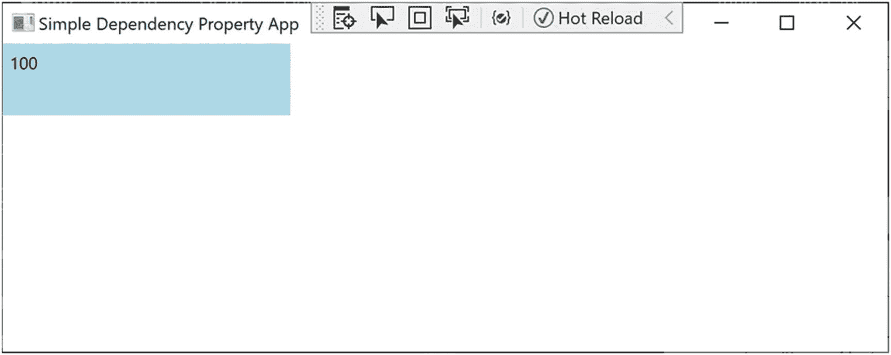

图 25-23。

看起来你的房子像预期的那样工作

但是，如果您想将一个动画对象应用到`CurrentNumber`属性，使其值在`10`秒内从`100`变为`200`，该怎么办呢？如果你想在标记中这样做，你可以这样更新你的`myCtrls:ShowNumberControl`范围:

```cs
<myCtrls:ShowNumberControl x:Name="myShowNumberCtrl" CurrentNumber="100">
  <myCtrls:ShowNumberControl.Triggers>
    <EventTrigger RoutedEvent = "myCtrls:ShowNumberControl.Loaded">
      <EventTrigger.Actions>
        <BeginStoryboard>
          <Storyboard TargetProperty = "CurrentNumber">
            <Int32Animation From = "100" To = "200" Duration = "0:0:10"/>
          </Storyboard>
        </BeginStoryboard>
      </EventTrigger.Actions>
    </EventTrigger>
  </myCtrls:ShowNumberControl.Triggers>
</myCtrls:ShowNumberControl>

```

如果运行应用，动画对象将找不到合适的目标，并引发异常。原因是`CurrentNumber`属性没有注册为依赖属性！若要解决问题，请返回自定义控件的代码文件，并完全注释掉当前的属性逻辑(包括私有支持字段)。

现在，添加以下代码来创建`CurrentNumber`作为依赖属性:

```cs
public int CurrentNumber
{
  get => (int)GetValue(CurrentNumberProperty);
  set => SetValue(CurrentNumberProperty, value);
}
public static readonly DependencyProperty CurrentNumberProperty =
  DependencyProperty.Register("CurrentNumber",
  typeof(int),
  typeof(ShowNumberControl),
  new UIPropertyMetadata(0));

```

这与您在`Height`属性的实现中看到的类似；但是，代码片段以内联方式注册属性，而不是在静态构造函数中注册(这很好)。还要注意，`UIPropertyMetadata`对象用于定义整数的默认值(`0`)，而不是更复杂的`FrameworkPropertyMetadata`对象。这是作为依赖属性的`CurrentNumber`的最简单版本。

### 添加数据验证例程

尽管您现在有了一个名为`CurrentNumber`的依赖属性(并且不再抛出异常)，但是您仍然看不到您的动画。您可能要做的下一个调整是指定一个要调用的函数来执行一些数据验证逻辑。对于这个例子，假设您需要确保`CurrentNumber`的值在`0`和`500`之间。

为此，向类型为`ValidateValueCallback`的`DependencyProperty.Register()`方法添加一个最终参数，该参数指向一个名为`ValidateCurrentNumber`的方法。

`ValidateValueCallback`是一个委托，它只能指向返回`bool`的方法，并将`object`作为唯一的参数。这个`object`代表正在被分配的新值。如果输入值在预期范围内，执行`ValidateCurrentNumber`返回`true`或`false`。

```cs
public static readonly DependencyProperty CurrentNumberProperty =
  DependencyProperty.Register("CurrentNumber",
    typeof(int),
    typeof(ShowNumberControl),
    new UIPropertyMetadata(100),
    new ValidateValueCallback(ValidateCurrentNumber));

// Just a simple rule. Value must be between 0 and 500.
public static bool ValidateCurrentNumber(object value) =>
  Convert.ToInt32(value) >= 0 && Convert.ToInt32(value) <= 500;

```

### 响应属性更改

所以，现在你有一个有效的数字，但仍然没有动画。您需要做的最后一个更改是为`UIPropertyMetadata`的构造函数指定第二个参数，这是一个`PropertyChangedCallback`对象。这个委托可以指向任何一个将`DependencyObject`作为第一个参数，将`DependencyPropertyChangedEventArgs`作为第二个参数的方法。首先，更新代码，如下所示:

```cs
// Note the second param of UIPropertyMetadata constructor.
public static readonly DependencyProperty CurrentNumberProperty =
  DependencyProperty.Register("CurrentNumber", typeof(int), typeof(ShowNumberControl),
  new UIPropertyMetadata(100, new PropertyChangedCallback(CurrentNumberChanged)),
  new ValidateValueCallback(ValidateCurrentNumber));

```

在`CurrentNumberChanged()`方法中，您的最终目标是将`Label`的`Content`更改为由`CurrentNumber`属性分配的新值。然而，你有一个大问题:`CurrentNumberChanged()`方法是静态的，因为它必须与静态的`DependencyProperty`对象一起工作。那么，对于当前的`ShowNumberControl`实例，如何获得对`Label`的访问呢？该引用包含在第一个`DependencyObject`参数中。您可以使用传入的事件参数找到新值。下面是更改`Label`的`Content`属性的必要代码:

```cs
private static void CurrentNumberChanged(DependencyObject depObj,   DependencyPropertyChangedEventArgs args)
{
  // Cast the DependencyObject into ShowNumberControl.
  ShowNumberControl c = (ShowNumberControl)depObj;
  // Get the Label control in the ShowNumberControl.
  Label theLabel = c.numberDisplay;
  // Set the Label with the new value.
  theLabel.Content = args.NewValue.ToString();
}

```

咻！仅仅改变一个标签的输出就有很长的路要走。好处是您的`CurrentNumber`依赖属性现在可以成为 WPF 风格的目标、动画对象、数据绑定操作的目标等等。如果您再次运行您的应用，您现在应该会看到在执行过程中值发生了变化。

这就结束了您对 WPF 依赖属性的了解。虽然我希望您对这些构造允许您做什么有一个更好的了解，并且对如何创建自己的构造有一个更好的了解，但是请注意，这里还有许多我没有涉及的细节。

如果您发现自己正在构建许多支持自定义属性的自定义控件，请在。NET Framework 4.7 SDK 文档。在本文中，您将发现更多构建依赖属性、附加属性的示例，配置属性元数据的各种方法，以及许多其他细节。

## 摘要

本章研究了 WPF 控件的几个方面，首先概述了控件工具包和布局管理器(面板)的作用。第一个示例让您有机会构建一个简单的文字处理应用，演示 WPF 的集成拼写检查功能，以及如何构建一个包含菜单系统、状态栏和工具栏的主窗口。

更重要的是，您研究了如何使用 WPF 命令。回想一下，您可以将这些与控件无关的事件附加到 UI 元素或输入手势，以自动继承现成的服务(例如，剪贴板操作)。

你也学到了很多关于在 XAML 构建复杂 UI 的知识，同时你也学到了 WPF Ink API。您还了解了 WPF 数据绑定操作，包括如何使用 WPF `DataGrid`类显示自定义`AutoLot`数据库中的数据。

最后，你调查了 WPF 是如何对传统文化进行独特的诠释的。NET 核心编程原语，特别是属性和事件。如您所见，*依赖属性*允许您构建一个可以集成到 WPF 服务集(动画、数据绑定、样式等)中的属性。).与此相关的是，*路由事件*为事件提供了一种沿标记树向上或向下流动的方式。