# 二十七、WPF 资源、动画、样式和模板

本章向您介绍了三个重要的(且相互关联的)主题，它们将加深您对 WPF(WPF) API 的理解。首要任务是学习*逻辑资源*的作用。正如您将看到的，逻辑资源(也称为*对象资源*)系统是一种命名和引用 WPF 应用中常用对象的方式。虽然逻辑资源通常是在 XAML 中编写的，但是它们也可以在过程代码中定义。

接下来，您将学习如何定义、执行和控制动画序列。不管你怎么想，WPF 动画并不局限于视频游戏或多媒体应用。在 WPF API 下，动画可以非常微妙，比如让一个按钮在获得焦点时发光，或者扩展`DataGrid`中选定行的大小。理解动画是构建自定义控件模板的一个关键方面(你将在本章后面看到)。

然后，您将探索 WPF 风格和模板的作用。就像使用 CSS 或 ASP.NET 主题引擎的网页一样，WPF 应用可以为一组控件定义一个共同的外观。您可以在标记中定义这些样式，并将它们存储为对象资源供以后使用，还可以在运行时动态应用它们。最后一个例子将教你如何构建自定义控件模板。

## 了解 WPF 资源系统

您的第一个任务是研究嵌入和访问应用资源的主题。WPF 支持两种类型的资源。第一个是*二进制资源*，这一类别通常包括大多数程序员认为是传统意义上的资源的项目(嵌入的图像文件或声音剪辑、应用使用的图标等)。).

第二种风格称为*对象资源*或*逻辑资源*，代表一个命名的。NET 对象，可以打包并在整个应用中重用。而任何。NET 对象可以打包成对象资源，逻辑资源在处理任何种类的图形数据时特别有用，因为您可以定义常用的图形元素(画笔、钢笔、动画等)。)并在需要时参考它们。

### 使用二进制资源

在进入对象资源的主题之前，让我们快速检查一下如何将二进制资源*打包到您的应用中，例如图标或图像文件(例如，公司徽标或动画图像)。如果您想继续，创建一个名为`BinaryResourcesApp`的新 WPF 应用。更新初始窗口的标记，以处理`Window Loaded`事件并使用`DockPanel`作为布局根，如下所示:*

```cs
<Window x:Class="BinaryResourcesApp.MainWindow"
  <!-- Omitted for brevity -->
    Title="Fun with Binary Resources" Height="500" Width="649" Loaded="MainWindow_OnLoaded">
  <DockPanel LastChildFill="True">
  </DockPanel>
</Window>

```

现在，假设您的应用需要根据用户输入在窗口的一部分显示三个图像文件中的一个。WPF `Image`控件不仅可用于显示典型的图像文件(`*.bmp`、`*.gif`、`*.ico`、`*.jpg`、`*.png`、`*.wdp`或`*.tiff`)，还可用于显示`DrawingImage`中的数据(如您在第二十六章中所见)。您可以为您的窗口构建一个支持`DockPanel`的 UI，该 UI 包含一个带有下一个和上一个按钮的简单工具栏。在这个工具栏下面，您可以放置一个`Image`控件，该控件目前没有设置为`Source`属性的值，如下所示:

```cs
  <DockPanel LastChildFill="True">
    <ToolBar Height="60" Name="picturePickerToolbar" DockPanel.Dock="Top">
      <Button x:Name="btnPreviousImage" Height="40" Width="100" BorderBrush="Black"
              Margin="5" Content="Previous" Click="btnPreviousImage_Click"/>
      <Button x:Name="btnNextImage" Height="40" Width="100" BorderBrush="Black"
              Margin="5" Content="Next" Click="btnNextImage_Click"/>
    </ToolBar>
    <!-- We will fill this Image in code. -->
    <Border BorderThickness="2" BorderBrush="Green">
      <Image x:Name="imageHolder" Stretch="Fill" />
    </Border>
  </DockPanel>

```

接下来，添加以下空事件处理程序:

```cs
private void MainWindow_OnLoaded(
  object sender, RoutedEventArgs e)
{
}
private void btnPreviousImage_Click(
  object sender, RoutedEventArgs e)
{
}
private void btnNextImage_Click(
  object sender, RoutedEventArgs e)
{
}

```

当窗口加载时，图像将被添加到一个集合中，下一个和上一个按钮将在其中循环。现在，应用框架已经就绪，让我们检查实现它的不同选项。

#### 在项目中包含松散的资源文件

一种选择是将您的图像文件作为一组松散的文件放在应用安装路径的子目录中。首先向您的项目添加一个新文件夹(名为`Images`)。右键单击并选择“添加➤现有项目”,向该文件夹添加一些图像。确保将添加现有项目对话框中的文件过滤器更改为`*.*`，以便显示图像文件。您可以添加自己的图像文件，或者使用可下载代码中的三个名为`Deer.jpg`、`Dogs.jpg`和`Welcome.jpg`的图像文件。

#### 配置松散资源

要在项目构建时将`\Images`文件夹中的内容复制到`\bin\Debug`文件夹中，首先在解决方案资源管理器中选择所有图像。现在，在这些图像仍处于选中状态的情况下，右键单击并选择 Properties 以打开 Properties 窗口。将`Build Action`属性设置为`Content`，将`Copy to Output Directory`属性设置为`Copy always`(见图 27-1 )。


图 27-1。

配置要复制到输出目录的图像数据

Note

您还可以选择`Copy if Newer`，如果您正在构建包含大量内容的大型项目，这将节省您的时间。对于这个例子，`Copy always`起作用。

如果您构建了您的项目，现在您可以单击解决方案资源管理器的 Show All Files 按钮，并查看您的`\bin\Debug`目录下复制的`Image`文件夹(您可能需要单击 Refresh 按钮)。

#### 以编程方式加载图像

WPF 提供了一个名为`BitmapImage`的类，它是`System.Windows.Media.Imaging`名称空间的一部分。这个类允许你从一个图像文件中加载数据，这个图像文件的位置由一个`System.Uri`对象表示。添加一个`List<BitmapImage>`来保存图像，以及一个`int`来存储当前显示图像的索引。

```cs
// A List of BitmapImage files.
List<BitmapImage> _images=new List<BitmapImage>();
// Current position in the list.
private int _currImage=0;

```

在窗口的`Loaded`事件中，填充图像列表，然后将`Image`控制源设置为列表中的第一幅图像。

```cs
private void MainWindow_OnLoaded(
  object sender, RoutedEventArgs e)
{
  try
  {
    string path=Environment.CurrentDirectory;
    // Load these images from disk when the window loads.
    _images.Add(new BitmapImage(new Uri($@"{path}\Images\Deer.jpg")));
    _images.Add(new BitmapImage(new Uri($@"{path}\Images\Dogs.jpg")));
    _images.Add(new BitmapImage(new Uri($@"{path}\Images\Welcome.jpg")));
    // Show first image in the List.
    imageHolder.Source=_images[_currImage];
  }
  catch (Exception ex)
  {
    MessageBox.Show(ex.Message);
  }
}

```

接下来，实现 previous 和 Next 处理程序来遍历图像。如果用户到达列表的末尾，让他们从头开始，反之亦然。

```cs
private void btnPreviousImage_Click(
  object sender, RoutedEventArgs e)
{
  if (--_currImage < 0)
  {
    _currImage=_images.Count - 1;
  }
  imageHolder.Source=_images[_currImage];
}
private void btnNextImage_Click(
  object sender, RoutedEventArgs e)
{
  if (++_currImage >=_images.Count)
  {
    _currImage=0;
  }
  imageHolder.Source=_images[_currImage];
}

```

此时，你可以运行你的程序，浏览每张图片。

#### 嵌入应用资源

如果您希望将图像文件配置为直接编译到。NET 核心程序集作为二进制资源，在解决方案资源管理器中选择图像文件(在`\Images`文件夹中，而不是在`\bin\Debug\Images`文件夹中)。将`Build Action`属性更改为`Resource`，将`Copy to Output Directory`属性设置为`Do not copy`(见图 27-2 )。

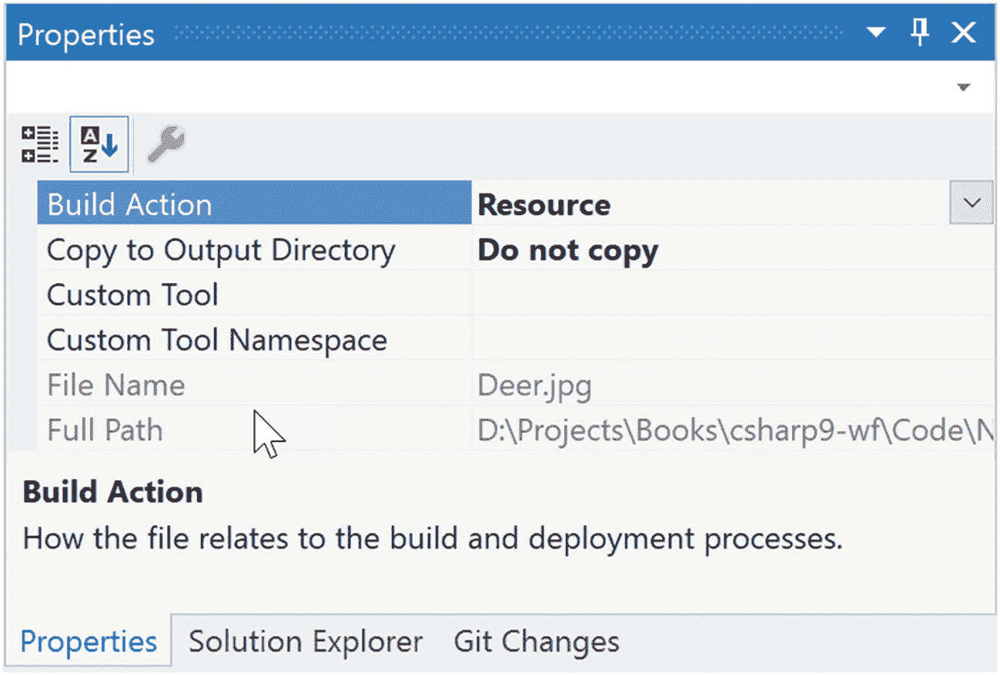

图 27-2。

将图像配置为嵌入式资源

现在，使用 Visual Studio 的 Build 菜单，选择 Clean Solution 选项清除当前的`\bin\Debug\Images`内容，然后重新构建您的项目。刷新解决方案资源管理器，观察您的`\bin\Debug\Images`目录中是否缺少数据。使用当前的构建选项，您的图形数据不再被复制到输出文件夹中，而是嵌入到程序集本身中。这确保了资源的存在，但也增加了编译后程序集的大小。

您需要修改代码，通过从编译后的程序集中提取这些图像来将它们加载到列表中。

```cs
// Extract from the assembly and then load images
_images.Add(new BitmapImage(new Uri(img/Deer.jpg", UriKind.Relative)));
_images.Add(new BitmapImage(new Uri(img/Dogs.jpg", UriKind.Relative)));
_images.Add(new BitmapImage(new Uri(img/Welcome.jpg", UriKind.Relative)));

```

在这种情况下，您不再需要确定安装路径，可以简单地按名称列出资源，这考虑了原始子目录的名称。还要注意，当你创建你的`Uri`对象时，你指定了一个`Relative`的`UriKind`值。此时，您的可执行文件是一个独立的实体，可以从机器上的任何位置运行，因为所有编译的数据都在二进制文件中。

## 使用对象(逻辑)资源

在构建 WPF 应用时，通常会定义一个 XAML 的简介，在一个窗口中的多个位置使用，或者跨多个窗口或项目使用。例如，假设你已经创建了*完美的*线性渐变画笔，它由十行标记组成。现在，您想要使用该笔刷作为项目中每个`Button`控件的背景色(项目由 8 个窗口组成),总共有 16 个`Button`控件。

最糟糕的事情是将 XAML 复制并粘贴到每个控件中。很明显，这将是一场维护的噩梦，因为你需要在任何时候对画笔的外观和感觉进行大量的修改。

谢天谢地，*对象资源*允许你定义一个 XAML 的 blob，给它一个名字，并把它存储在一个 fitting 字典中以备后用。像二进制资源一样，对象资源通常被编译到需要它们的程序集中。但是，您不需要修改`Build Action`属性就可以做到这一点。如果你把你的 XAML 放到正确的位置，编译器会自动完成剩下的工作。

使用对象资源是 WPF 开发的一大部分。正如你将看到的，对象资源可能比自定义画笔复杂得多。您可以定义基于 XAML 的动画、3D 呈现、自定义控件样式、数据模板、控件模板等，并将每个模板打包为可重用的资源。

### 资源属性的作用

如前所述，对象资源必须放在 fitting dictionary 对象中，以便在整个应用中使用。目前，`FrameworkElement`的每个后代都支持一个`Resources`属性。该属性封装了一个包含已定义对象资源的`ResourceDictionary`对象。`ResourceDictionary`可以保存任何类型的项目，因为它在`System.Object`类型上操作，并且可以通过 XAML 或程序代码进行操作。

在 WPF，所有的控件、`Window`、`Page`(构建导航应用时使用)和`UserControl`都扩展了`FrameworkElement`，所以几乎所有的小部件都提供了对`ResourceDictionary`的访问。此外，`Application`类虽然没有扩展`FrameworkElement`，但出于同样的目的，它支持一个同名的`Resources`属性。

### 定义窗口范围的资源

要开始探索对象资源的角色，创建一个名为 ObjectResourcesApp 的新 WPF 应用，并将最初的`Grid`更改为水平对齐的`StackPanel`布局管理器。在这个`StackPanel`中，像这样定义两个`Button`控件(你真的不需要太多来说明对象资源的作用，这样就行了):

```cs
<StackPanel Orientation="Horizontal">
  <Button Margin="25" Height="200" Width="200" Content="OK" FontSize="20"/>
  <Button Margin="25" Height="200" Width="200" Content="Cancel" FontSize="20"/>
</StackPanel>

```

现在，选择 OK 按钮，使用集成笔刷编辑器将`Background`颜色属性设置为自定义笔刷类型(在第二十六章中讨论)。完成后，注意画笔是如何嵌入在`<Button>`和`</Button>`标签的范围内的，如下所示:

```cs
<Button Margin="25" Height="200" Width="200" Content="OK" FontSize="20">
  <Button.Background>
    <RadialGradientBrush>
      <GradientStop Color="#FFC44EC4" Offset="0" />
      <GradientStop Color="#FF829CEB" Offset="1" />
      <GradientStop Color="#FF793879" Offset="0.669" />
    </RadialGradientBrush>
  </Button.Background>
</Button>

```

为了让 Cancel 按钮也使用这个画笔，您应该将`<RadialGradientBrush>`的范围提升到父元素的资源字典。例如，如果你把它移动到`<StackPanel>`，两个按钮可以使用相同的笔刷，因为它们是布局管理器的子元素。更好的是，你可以将画笔打包到`Window`本身的资源字典中，这样窗口的内容就可以使用它。

当您需要定义一个资源时，您可以使用 property-element 语法来设置所有者的`Resources`属性。您还为资源项赋予了一个`x:Key`值，当窗口的其他部分想要引用对象资源时，将会使用这个值。要知道`x:Key`和`x:Name`是不一样的！`x:Name`属性允许您访问代码文件中作为成员变量的对象，而`x:Key`属性允许您引用资源字典中的一个项目。

Visual Studio 允许您使用资源各自的属性窗口将资源提升到更高的范围。要做到这一点，首先要确定包含要打包为资源的复杂对象的属性(在本例中是`Background`属性)。属性的右边是一个小方块，单击它将打开一个弹出菜单。从中选择转换为新资源选项(参见图 27-3 )。

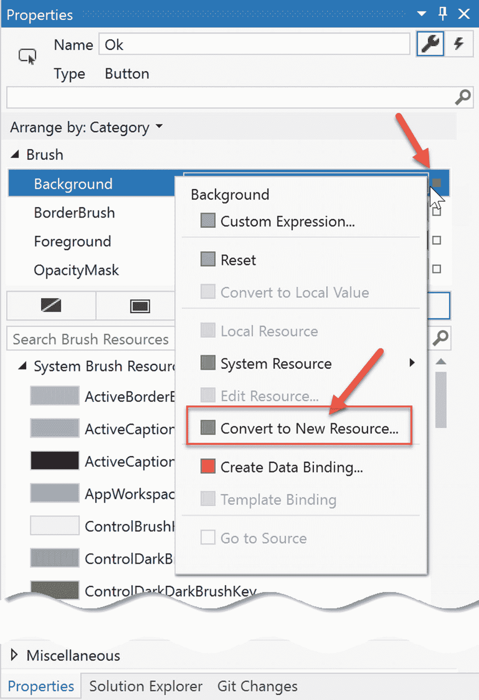

图 27-3。

将复杂对象移动到资源容器中

要求您命名您的资源(`myBrush`)并指定放置它的位置。对于本例，保留当前文件的默认选择(见图 27-4 )。

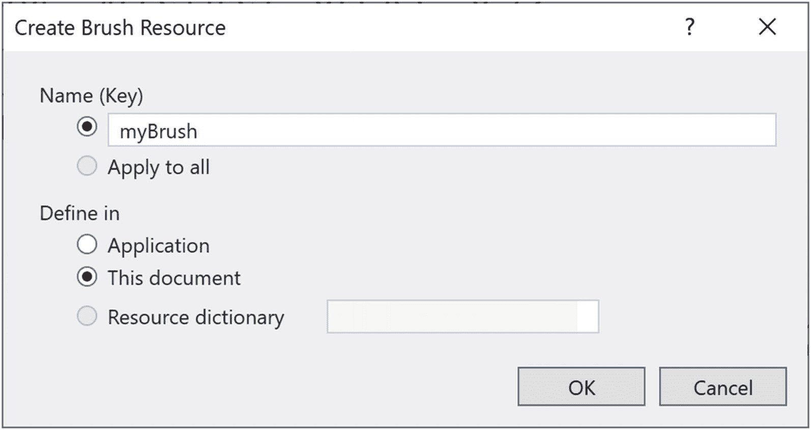

图 27-4。

命名对象资源

当你完成后，你会看到画笔已经被移动到了`Window.Resources`标签内。

```cs
<Window.Resources>
  <RadialGradientBrush x:Key="myBrush">
    <GradientStop Color="#FFC44EC4" Offset="0" />
    <GradientStop Color="#FF829CEB" Offset="1" />
    <GradientStop Color="#FF793879" Offset="0.669" />
  </RadialGradientBrush>
</Window.Resources>

```

并且`Button`控件的`Background`已经被更新以使用新的资源。

```cs
<Button Margin="25" Height="200" Width="200" Content="OK"
        FontSize="20" Background="{DynamicResource myBrush}"/>

```

创建资源向导创建新资源作为`DynamicResource`。稍后你会在文中了解到`DynamicResource` s，但是现在，把它改成`StaticResource`，就像这样:

```cs
<Button Margin="25" Height="200" Width="200" Content="OK"
    FontSize="20" Background="{StaticResource myBrush}"/>

```

要看到好处，将取消`Button`的`Background`属性更新为同一个`StaticResource`，就可以看到重用在起作用。

```cs
<Button Margin="25" Height="200" Width="200" Content="Cancel"
    FontSize="20" Background="{StaticResource myBrush}"/>

```

### {StaticResource}标记扩展

`{StaticResource}`标记扩展只应用资源一次(初始化时),并在应用的生命周期内保持与原始对象的“连接”。一些属性(例如渐变停止)将会更新，但是如果您创建一个新的`Brush`，控件将不会更新。要看到这一点，给每个`Button`控件添加一个`Name`和`Click`事件处理程序，如下所示:

```cs
<Button Name="Ok" Margin="25" Height="200" Width="200" Content="OK"
    FontSize="20" Background="{StaticResource myBrush}" Click="Ok_OnClick"/>
<Button Name="Cancel" Margin="25" Height="200" Width="200" Content="Cancel"
    FontSize="20" Background="{StaticResource myBrush}" Click="Cancel_OnClick"/>

```

接下来，将以下代码添加到`Ok_OnClick()`事件处理程序中:

```cs
private void Ok_OnClick(object sender, RoutedEventArgs e)
{
  // Get the brush and make a change.
  var b=(RadialGradientBrush)Resources["myBrush"];
  b.GradientStops[1]=new GradientStop(Colors.Black, 0.0);
}

```

Note

在这里，您使用`Resources`索引器通过名称来定位资源。但是，请注意，如果找不到资源，这将引发运行时异常。您也可以使用`TryFindResource()`方法，它不会抛出运行时错误；如果找不到指定的资源，它将简单地返回`null`。

当您运行程序并单击 OK `Button`时，您会看到渐变发生了适当的变化。现在将以下代码添加到`Cancel_OnClick()`事件处理程序中:

```cs
private void Cancel_OnClick(object sender, RoutedEventArgs e)
{
  // Put a totally new brush into the myBrush slot.
  Resources["myBrush"]=new SolidColorBrush(Colors.Red);
}

```

再次运行程序，点击取消`Button`，什么都没发生！

### {DynamicResource}标记扩展

属性也可以使用`DynamicResource`标记扩展。要查看差异，请将取消`Button`的标记更改为以下内容:

```cs
<Button Name="Cancel" Margin="25" Height="200" Width="200" Content="Cancel"
                FontSize="20" Background="{DynamicResource myBrush}" Click="Cancel_OnClick"/>

```

这一次，当你点击取消`Button`时，取消`Button`的背景会改变，但是确定`Button`的背景保持不变。这是因为`{DynamicResource}`标记扩展可以检测底层键控对象是否已经被新对象替换。正如您可能猜到的，这需要一些额外的运行时基础设施，所以您通常应该坚持使用`{StaticResource}`，除非您知道您有一个对象资源将在运行时与另一个对象交换，并且您希望使用该资源的所有项目都得到通知。

### 应用级资源

当窗口的资源字典中有对象资源时，窗口中的所有项都可以自由使用它，但应用中的其他窗口不能。跨应用共享资源的解决方案是在应用级别定义对象资源，而不是在窗口级别。在 Visual Studio 中没有办法实现自动化，所以只需将当前的 brush 对象从`<Windows.Resources>`范围中剪切出来，并将其放在`App.xaml`文件的`<Application.Resources>`范围中。

现在，应用中的任何附加窗口或控件都可以自由地使用这个画笔。如果要为控件设置`Background`属性，可以选择应用级资源，如图 27-5 所示。

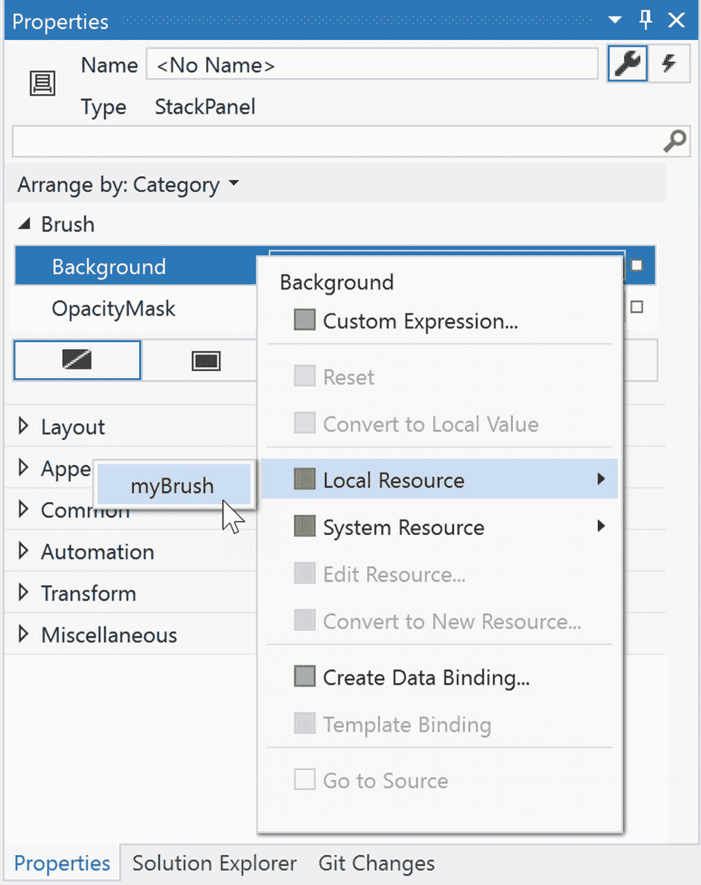

图 27-5。

应用应用级资源

Note

将资源置于应用级别并将其分配给控件的属性将会冻结资源，从而防止在运行时更改值。可以克隆资源，并且可以更新克隆。

### 定义合并的资源词典

应用级的资源通常是足够好的，但是它们无助于跨项目的重用。在这种情况下，您想要定义一个被称为*合并资源字典*的东西。把它想象成 WPF 资源的类库；它只不过是一个包含资源集合的`XAML`文件。单个项目可以根据需要拥有多个这样的文件(一个用于画笔，一个用于动画，等等)。)，每一个都可以使用通过项目菜单激活的添加新项目对话框插入(见图 27-6 )。

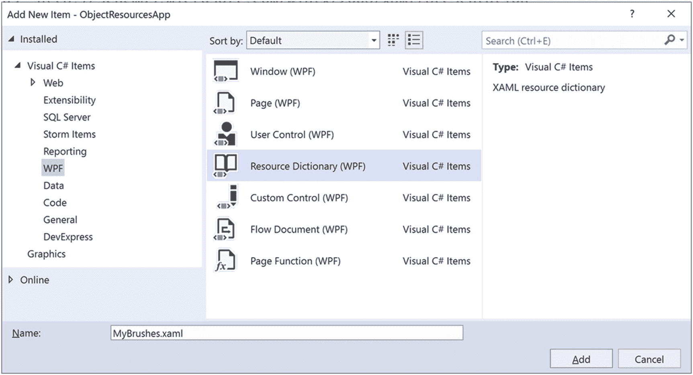

图 27-6。

插入新的合并资源字典

在新的`MyBrushes.xaml`文件中，剪切`Application.Resources`范围中的当前资源，并将它们移动到您的字典中，如下所示:

```cs
<ResourceDictionary xmlns:=http://schemas.microsoft.com/winfx/2006/xaml/presentation
  xmlns:local="clr-namespace:ObjectResourcesApp"
  xmlns:x="http://schemas.microsoft.com/winfx/2006/xaml">
  <RadialGradientBrush x:Key="myBrush">
    <GradientStop Color="#FFC44EC4" Offset="0" />
    <GradientStop Color="#FF829CEB" Offset="1" />
    <GradientStop Color="#FF793879" Offset="0.669" />
  </RadialGradientBrush>
</ResourceDictionary>

```

即使此资源字典是项目的一部分，所有资源字典都必须合并(通常在应用级别)到现有的资源字典中才能使用。为此，在`App.xaml`文件中使用以下格式(注意，可以通过在`<ResourceDictionary.MergedDictionaries>`范围内添加多个`<ResourceDictionary>`元素来合并多个资源字典):

```cs
  <Application.Resources>
    <ResourceDictionary>
      <ResourceDictionary.MergedDictionaries>
        <ResourceDictionary Source="MyBrushes.xaml"/>
      </ResourceDictionary.MergedDictionaries>
    </ResourceDictionary>
  </Application.Resources>

```

这种方法的问题是，每个资源文件都必须添加到每个需要资源的项目中。共享资源的一个更好的方法是定义一个. NET 核心类库在项目之间共享，这是您接下来要做的。

### 定义仅资源程序集

生成纯资源程序集的最简单方法是从 WPF 用户控件库(。NET Core)项目。通过 Visual 的“添加➤新项目”菜单选项将这样一个项目(名为 MyBrushesLibrary)添加到当前解决方案中，并从 ObjectResourcesApp 项目中添加对它的项目引用。

现在，从项目中删除`UserControl1.xaml`文件。接下来，将`MyBrushes.xaml`文件拖放到您的`MyBrushesLibrary`项目中，并将其从`ObjectResourcesApp`项目中删除。最后，打开`MyBrushesLibrary`项目中的`MyBrushes.xaml`，将文件中的`x:local`名称空间改为`clr-namespace:MyBrushesLibrary`。您的`MyBrushes.xaml`文件应该如下所示:

```cs
<ResourceDictionary xmlns:="http://schemas.microsoft.com/winfx/2006/xaml/presentation"
                    xmlns:x="http://schemas.microsoft.com/winfx/2006/xaml"
                    xmlns:local="clr-namespace:MyBrushesLibrary">
    <RadialGradientBrush x:Key="myBrush">
        <GradientStop Color="#FFC44EC4" Offset="0" />
        <GradientStop Color="#FF829CEB" Offset="1" />
        <GradientStop Color="#FF793879" Offset="0.669" />
    </RadialGradientBrush>
</ResourceDictionary>

```

编译您的用户控件库项目。现在，将这些二进制资源合并到`ObjectResourcesApp`项目的应用级资源字典中。然而，这样做需要一些相当时髦的语法，如下所示:

```cs
<Application.Resources>
  <ResourceDictionary>
    <ResourceDictionary.MergedDictionaries>
      <!-- The syntax is /NameOfAssembly;Component/NameOfXamlFileInAssembly.xaml -->
      <ResourceDictionary Source="/MyBrushesLibrary;Component/MyBrushes.xaml"/>
    </ResourceDictionary.MergedDictionaries>
  </ResourceDictionary>
</Application.Resources>

```

首先，请注意这个字符串是区分空间的。如果分号或正斜杠两边有多余的空格，就会产生错误。字符串的第一部分是外部库的友好名称(没有文件扩展名)。在分号后，键入单词`Component`，后跟编译后的二进制资源的名称，这将与原始的 XAML 资源字典相同。

这就结束了对 WPF 资源管理系统的检查。您将在大多数(如果不是全部)应用中很好地利用这些技术。接下来，我们来考察一下 Windows Presentation Foundation 的集成动画 API。

## 了解 WPF 的动画服务

除了你在第二十六章中研究的图形渲染服务，WPF 还提供了一个编程接口来支持动画服务。术语*动画*可能会让人想起旋转的公司徽标、一系列旋转的图像资源(以提供运动的错觉)、屏幕上跳动的文本或特定类型的程序，如视频游戏或多媒体应用。

虽然 WPF 的动画 API 肯定可以用于这种目的，但如果你想给应用增添一些特色，随时都可以使用动画。例如，您可以为屏幕上的按钮创建一个动画，当鼠标光标悬停在其边界内时，该动画会稍微放大(当鼠标光标移动到边界之外时，动画会缩小)。或者，您可以制作窗口动画，使其以特定的视觉外观关闭，例如慢慢淡入透明。更以业务应用为中心的用途是淡入应用屏幕上的错误消息，以改善用户体验。事实上，WPF 的动画支持可以用于任何类型的应用(商业应用、多媒体程序、视频游戏等)。)每当您想要提供更吸引人的用户体验时。

正如 WPF 的许多其他方面一样，制作动画的概念并不新鲜。新的是，与您过去可能使用的其他 API(包括 Windows 窗体)不同，开发人员不需要手动创作必要的基础结构。在 WPF 下，不需要创建用于推进动画序列的后台线程或计时器，不需要定义自定义类型来表示动画，不需要擦除和重绘图像，也不需要进行繁琐的数学计算。像 WPF 的其他方面一样，你可以完全使用 XAML、完全使用 C# 代码或者两者结合来制作动画。

Note

Visual Studio 不支持使用 GUI 动画工具创作动画。如果您使用 Visual Studio 创作动画，您可以通过直接键入 XAML 来完成。然而，Blend for Visual Studio(Visual Studio 2019 附带的配套产品)确实有一个内置的动画编辑器，可以大大简化你的生活。

### 动画类的角色类型

为了理解 WPF 的动画支持，您必须从检查`PresentationCore.dll`的`System.Windows.Media.Animation`名称空间中的动画类开始。在这里，您会发现 100 多个不同的类类型是使用`Animation`标记命名的。

这些类别可以分为三大类。第一，任何遵循命名约定*数据类型* `Animation` ( `ByteAnimation`、`ColorAnimation`、`DoubleAnimation`、`Int32Animation`等的类。)允许您使用线性插值动画。这使您能够随着时间的推移平稳地将值从起始值更改为最终值。

接下来，遵循命名约定的类有*数据类型* `AnimationUsingKeyFrames` ( `StringAnimationUsingKeyFrames`、`DoubleAnimationUsingKeyFrames`、`PointAnimationUsingKeyFrames`等。)表示“关键帧动画”，它允许您在一段时间内循环通过一组定义的值。例如，您可以通过在一系列单个字符之间循环，使用关键帧来更改按钮的标题。

最后，遵循*数据类型* `AnimationUsingPath`命名约定的类(`DoubleAnimationUsingPath`、`PointAnimationUsingPath`等等)是基于路径的动画，允许你动画化对象沿着你定义的路径移动。举例来说，如果您正在构建一个 GPS 应用，您可以使用基于路径的动画来沿着最快的旅行路线将项目移动到用户的目的地。

现在，很明显，这些类是*而不是*用来以某种方式直接向特定数据类型的变量提供动画序列(毕竟，你怎么能使用`Int32Animation`来制作值“9”的动画呢？).

例如，考虑一下`Label`类型的`Height`和`Width`属性，这两个属性都是包装了`double`的依赖属性。如果你想定义一个在一段时间内增加标签高度的动画，你可以将一个`DoubleAnimation`对象连接到`Height`属性，并允许 WPF 处理实际动画本身的细节。作为另一个例子，如果你想在五秒钟内将画笔类型的颜色从绿色转换为黄色，你可以使用`ColorAnimation`类型来完成。

为了清楚起见，这些`Animation`类可以连接到匹配底层类型的给定对象的任何*依赖属性*。正如第二十五章所解释的，依赖属性是许多 WPF 服务所需要的一种特殊形式的属性，包括动画、数据绑定和样式。

按照惯例，依赖属性被定义为类的静态只读字段，并通过在普通属性名后面加上单词`Property`来命名。例如，在代码中使用`Button.HeightProperty`可以访问`Button`的`Height`属性的依赖属性。

### “收件人”、“发件人”和“依据”属性

所有的`Animation`类都定义了以下几个关键属性，这些属性控制用于执行动画的开始和结束值:

*   `To`:该属性表示动画的结束值。

*   `From`:该属性表示动画的起始值。

*   `By`:该属性表示动画改变其起始值的总量。

尽管所有的`Animation`类都支持`To`、`From`和`By`属性，但它们并不通过基类的虚拟成员接收这些属性。原因是这些属性所包装的底层类型差异很大(整数、颜色、`Thickness`对象等)。)，并且使用单个基类来表示所有的可能性会导致复杂的编码结构。

另一方面，你可能也想知道为什么。NET 泛型不用于定义具有单一类型参数(例如，`Animate<T>`)的单一泛型动画类。同样，假设有这么多的底层数据类型(颜色、向量、`int`、`string`等)。)习惯了动态的依赖属性，它不会像你期望的那样是一个干净的解决方案(更不用说 XAML 对泛型类型的支持是有限的)。

### 时间轴基类的角色

尽管没有使用单个基类来定义虚拟的`To`、`From`和`By`属性，但是`Animation`类确实共享一个公共基类:`System.Windows.Media.Animation.Timeline`。这种类型提供了几个控制动画步调的附加属性，如表 27-1 所述。

表 27-1。

`Timeline`基类的关键成员

<colgroup><col class="tcol1 align-left"> <col class="tcol2 align-left"></colgroup> 
| 

性能

 | 

生命的意义

 |
| --- | --- |
| `AccelerationRatio`、`DecelerationRatio`、`SpeedRatio` | 这些属性可用于控制动画序列的整体速度。 |
| `AutoReverse` | 该属性获取或设置一个值，该值指示时间轴在完成正向迭代后是否反向播放(默认值为`false`)。 |
| `BeginTime` | 此属性获取或设置此时间线的开始时间。默认值为 0，表示立即开始播放动画。 |
| `Duration` | 此属性允许您设置播放时间线的持续时间。 |
| `FillBehavior`，`RepeatBehavior` | 这些属性用于控制时间轴完成后应该发生的事情(重复动画，什么都不做，等等)。). |

### 用 C# 代码创作动画

具体来说，您将构建一个包含一个`Button`的`Window`，每当鼠标进入它的表面区域时，它就会有一个奇怪的旋转行为(基于左上角)。首先创建一个名为`SpinningButtonAnimationApp`的新 WPF 应用。将初始标记更新为以下内容(注意，您正在处理按钮的`MouseEnter`事件):

```cs
<Button x:Name="btnSpinner" Height="50" Width="100" Content="I Spin!"
      MouseEnter="btnSpinner_MouseEnter" Click="btnSpinner_OnClick"/>

```

在代码隐藏文件中，导入`System.Windows.Media.Animation`命名空间，并在窗口的 C# 代码文件中添加以下代码:

```cs
private bool _isSpinning=false;

private void btnSpinner_MouseEnter(
  object sender, MouseEventArgs e)
{
  if (!_isSpinning)
  {
    _isSpinning=true;
    // Make a double animation object, and register
    // with the Completed event.
    var dblAnim=new DoubleAnimation();
    dblAnim.Completed +=(o, s)=> { _isSpinning=false; };
    // Set the start value and end value.
    dblAnim.From=0;
    dblAnim.To=360;
    // Now, create a RotateTransform object, and set
    // it to the RenderTransform property of our
    // button.
    var rt=new RotateTransform();
    btnSpinner.RenderTransform=rt;
    // Now, animation the RotateTransform object.
    rt.BeginAnimation(RotateTransform.AngleProperty, dblAnim);
  }
}
private void btnSpinner_OnClick(
  object sender, RoutedEventArgs e)
{

}

```

该方法的第一个主要任务是配置一个`DoubleAnimation`对象，它将从值 0 开始，到值 360 结束。请注意，您也正在处理该对象上的`Completed`事件，以切换一个类级别的`bool`变量，该变量用于确保如果一个动画当前正在执行，您不会“重置”它以重新开始。

接下来，您创建一个连接到您的`Button`控件(`btnSpinner`)的`RenderTransform`属性的`RotateTransform`对象。最后，您通知`RenderTransform`对象使用您的`DoubleAnimation`对象开始制作其`Angle`属性的动画。当您在代码中创作动画时，通常通过调用`BeginAnimation()`来完成，然后传入您想要制作动画的底层*依赖属性*(记住，按照惯例，这是类上的静态字段)，后面跟一个相关的动画对象。

让我们在程序中添加另一个动画，这个动画会导致按钮在被点击时淡入不可见状态。首先，在`Click`事件处理程序中添加以下代码:

```cs
private void btnSpinner_OnClick(
  object sender, RoutedEventArgs e)
{
  var dblAnim=new DoubleAnimation
  {
    From=1.0,
    To=0.0
  };
  btnSpinner.BeginAnimation(Button.OpacityProperty, dblAnim);
}

```

这里，您正在更改`Opacity`属性值，以使按钮淡出视图。然而，目前这很难做到，因为按钮旋转得非常快！那么，你如何控制动画的节奏呢？很高兴你问了。

### 控制动画的速度

默认情况下，动画在分配给`From`和`To`属性的值之间转换大约需要一秒钟。因此，你的按钮有一秒钟的时间旋转 360 度，而按钮将在一秒钟内消失(当被点击时)。

如果您想要为动画的过渡定义一个自定义的时间量，您可以通过动画对象的`Duration`属性来实现，该属性可以设置为一个`Duration`对象的实例。通常，时间跨度是通过将一个`TimeSpan`对象传递给`Duration`的构造函数来建立的。考虑下面的更新，它将为按钮提供整整四秒的旋转时间:

```cs
private void btnSpinner_MouseEnter(
  object sender, MouseEventArgs e)
{
  if (!_isSpinning)
  {
    _isSpinning=true;

    // Make a double animation object, and register
    // with the Completed event.
    var dblAnim=new DoubleAnimation();
    dblAnim.Completed +=(o, s)=> { _isSpinning=false; };

    // Button has four seconds to finish the spin!
    dblAnim.Duration=new Duration(TimeSpan.FromSeconds(4));

...
  }
}

```

通过这种调整，你应该有机会在按钮旋转时点击它，此时它会逐渐消失。

Note

一个`Animation`类的`BeginTime`属性也接受一个`TimeSpan`对象。回想一下，可以设置该属性来建立开始动画序列之前的等待时间。

### 反转和循环播放动画

还可以通过将`AutoReverse`属性设置为`true`来告诉`Animation`对象在动画序列完成时反向播放动画。例如，如果您想让按钮在消失后重新出现，您可以编写以下代码:

```cs
private void btnSpinner_OnClick(object sender, RoutedEventArgs e)
{
  DoubleAnimation dblAnim=new DoubleAnimation
  {
    From=1.0,
    To=0.0
  };
  // Reverse when done.
  dblAnim.AutoReverse=true;
  btnSpinner.BeginAnimation(Button.OpacityProperty, dblAnim);
}

```

如果你想让一个动画重复一定次数(或者一旦激活就永不停止)，你可以使用所有`Animation`类共有的`RepeatBehavior`属性。如果向构造函数传递一个简单的数值，可以指定硬编码的重复次数。另一方面，如果你将一个`TimeSpan`对象传递给构造函数，你可以确定动画应该重复的时间。最后，如果你想让一个动画无限循环*，你可以简单的指定`RepeatBehavior.Forever`。考虑以下方法，您可以更改本例中使用的任一`DoubleAnimation`对象的重复行为:*

```cs
// Loop forever.
dblAnim.RepeatBehavior=RepeatBehavior.Forever;

// Loop three times.
dblAnim.RepeatBehavior=new RepeatBehavior(3);

// Loop for 30 seconds.
dblAnim.RepeatBehavior=new RepeatBehavior(TimeSpan.FromSeconds(30));

```

这就结束了关于如何使用 C# 代码和 WPF 动画 API 来制作对象动画的研究。接下来，您将学习如何使用 XAML 做同样的事情。

## 在 XAML 创作动画

在标记中创作动画就像在代码中创作一样，至少对于简单直接的动画序列是这样。当您需要捕获更复杂的动画时，这可能涉及到一次更改许多属性的值，标记的数量可能会大大增加。即使您使用工具来生成基于 XAML 的动画，了解动画在 XAML 的基本表现方式也很重要，因为这将使您更容易修改和调整工具生成的内容。

Note

您会在可下载源代码的`XamlAnimations`文件夹中找到许多 XAML 文件。在接下来的几页中，将这些标记文件复制到您的自定义 XAML 编辑器或 Kaxaml 编辑器中，以查看结果。

在很大程度上，创作一部动画就像你已经看到的一样。您仍然需要配置一个`Animation`对象，并将它与一个对象的属性相关联。然而，一个很大的不同是，WPF 不是函数调用友好的。因此，您不用调用`BeginAnimation()`，而是使用*故事板*作为间接层。

让我们看一个用 XAML 定义的动画的完整例子，然后是一个详细的分解。下面的 XAML 定义将显示一个包含单个标签的窗口。一旦`Label`对象加载到内存中，它就开始一个动画序列，其中字体大小在 4 秒内从 12 磅增加到 100 磅。只要`Window`对象加载到内存中，动画就会重复播放。您可以在`GrowLabelFont.xaml`文件中找到这个标记，所以将它复制到 Kaxaml 中(确保按 F5 显示窗口)并观察行为。

```cs
<Window
  xmlns:="http://schemas.microsoft.com/winfx/2006/xaml/presentation"
  xmlns:x="http://schemas.microsoft.com/winfx/2006/xaml"
  Height="200" Width="600" WindowStartupLocation="CenterScreen" Title="Growing Label Font!">
  <StackPanel>
    <Label Content="Interesting...">
      <Label.Triggers>
        <EventTrigger RoutedEvent="Label.Loaded">
          <EventTrigger.Actions>
            <BeginStoryboard>
              <Storyboard TargetProperty="FontSize">
                <DoubleAnimation From="12" To="100" Duration="0:0:4"
                  RepeatBehavior="Forever"/>
              </Storyboard>
            </BeginStoryboard>
          </EventTrigger.Actions>
        </EventTrigger>
      </Label.Triggers>
    </Label>
  </StackPanel>
</Window>

```

现在，让我们一点一点地分解这个例子。

### 故事板的作用

从最里面的元素开始，您首先会遇到`<DoubleAnimation>`元素，它利用了您在过程代码中设置的相同属性(`From`、`To`、`Duration`和`RepeatBehavior`)。

```cs
<DoubleAnimation From="12" To="100" Duration="0:0:4"
                 RepeatBehavior="Forever"/>

```

如上所述，`Animation`元素被放置在一个`<Storyboard>`元素中，该元素用于通过`TargetProperty`属性将动画对象映射到父类型上的给定属性，在本例中是`FontSize`。一个`<Storyboard>`总是被包装在一个名为`<BeginStoryboard>`的父元素中。

```cs
<BeginStoryboard>
  <Storyboard TargetProperty="FontSize">
    <DoubleAnimation From="12" To="100" Duration="0:0:4"
                     RepeatBehavior="Forever"/>
  </Storyboard>
</BeginStoryboard>

```

### 事件触发器的作用

在定义了`<BeginStoryboard>`元素之后，您需要指定某种动作来使动画开始执行。WPF 有几种不同的方式来响应标记中的运行时条件，其中一种被称为*触发器*。从高层次来看，您可以将触发器视为一种响应 XAML 事件条件的方式，而不需要过程代码。

通常，当您在 C# 中响应事件时，您创作的自定义代码将在事件发生时执行。然而，触发器只是一种被通知某些事件条件已经发生的方式(“我被加载到内存中！”或者“鼠标在我身上！”或者“我有焦点了！”).

一旦你被通知一个事件条件已经发生，你就可以开始故事板。在本例中，您正在响应加载到内存中的`Label`。因为您感兴趣的是`Label`的`Loaded`事件，所以`<EventTrigger>`被放在`Label`的触发集合中。

```cs
<Label Content="Interesting...">
  <Label.Triggers>
    <EventTrigger RoutedEvent="Label.Loaded">
      <EventTrigger.Actions>
        <BeginStoryboard>
          <Storyboard TargetProperty="FontSize">
            <DoubleAnimation From="12" To="100" Duration="0:0:4"
                             RepeatBehavior="Forever"/>
          </Storyboard>
        </BeginStoryboard>
      </EventTrigger.Actions>
    </EventTrigger>
  </Label.Triggers>
</Label>

```

让我们看另一个在 XAML 定义动画的例子，这次使用一个*关键帧*动画。

### 使用离散关键帧的动画

与只能在起点和终点之间移动的线性插值动画对象不同，*关键帧*副本允许您为应该在特定时间发生的动画创建特定值的集合。

为了说明离散关键帧类型的用法，假设您想要构建一个`Button`控件，它可以使其内容动画化，这样在三秒钟的时间内，值“OK！”一次显示一个字符。您将在`AnimateString.xaml`文件中找到以下标记。将这个标记复制到您的`MyXamlPad.exe`程序(或 Kaxaml)中，并查看结果:

```cs
<Window xmlns:="http://schemas.microsoft.com/winfx/2006/xaml/presentation"
   xmlns:x="http://schemas.microsoft.com/winfx/2006/xaml"
   Height="100" Width="300"
   WindowStartupLocation="CenterScreen" Title="Animate String Data!">
   <StackPanel>
     <Button Name="myButton" Height="40"
             FontSize="16pt" FontFamily="Verdana" Width="100">
      <Button.Triggers>
        <EventTrigger RoutedEvent="Button.Loaded">
          <BeginStoryboard>
            <Storyboard>
              <StringAnimationUsingKeyFrames RepeatBehavior="Forever"
                Storyboard.TargetProperty="Content"
                Duration="0:0:3">
                <DiscreteStringKeyFrame Value="" KeyTime="0:0:0" />
                <DiscreteStringKeyFrame Value="O" KeyTime="0:0:1" />
                <DiscreteStringKeyFrame Value="OK" KeyTime="0:0:1.5" />
                <DiscreteStringKeyFrame Value="OK!" KeyTime="0:0:2" />
              </StringAnimationUsingKeyFrames>
            </Storyboard>
          </BeginStoryboard>
        </EventTrigger>
      </Button.Triggers>
    </Button>
  </StackPanel>
</Window>

```

首先，请注意，您已经为按钮定义了一个事件触发器，以确保当按钮加载到内存中时故事板会执行。`StringAnimationUsingKeyFrames`类通过`Storyboard.TargetProperty`值监督按钮内容的改变。

在`<StringAnimationUsingKeyFrames>`元素的范围内，您定义了四个`DiscreteStringKeyFrame`元素，它们在两秒钟内改变按钮的`Content`属性(注意`StringAnimationUsingKeyFrames`建立的持续时间总共是三秒钟，因此您将看到在最后的`!`和循环`O`之间有一个轻微的停顿)。

既然您对如何用 C# 代码和 XAML 构建动画有了更好的感觉，让我们看看 WPF 风格的作用，它大量使用图形、对象资源和动画。

## 了解 WPF 风格的作用

当您构建 WPF 应用的用户界面时，一系列控件需要共享的外观并不罕见。例如，您可能希望所有按钮类型的字符串内容具有相同的高度、宽度、背景颜色和字体大小。虽然您可以通过将每个按钮的单个属性设置为相同的值来解决这个问题，但这种方法很难实现后续的更改，因为每次更改都需要在多个对象上重置相同的属性集。

幸运的是，WPF 提供了一种简单的方法来约束使用*风格*的相关控件的外观和感觉。简单地说，WPF 样式是一个维护属性-值对集合的对象。从编程的角度来说，使用`System.Windows.Style`类来表示一个单独的样式。这个类有一个名为`Setters`的属性，它公开了一个`Setter`对象的强类型集合。是`Setter`对象允许您定义属性-值对。

除了`Setters`集合之外，`Style`类还定义了一些其他重要的成员，这些成员允许您合并触发器，限制可以应用样式的位置，甚至基于现有的样式创建新的样式(可以将其视为“样式继承”)。注意下面这个`Style`类的成员:

*   `Triggers`:公开一个触发器对象集合，允许您在一个样式中捕获各种事件条件

*   `BasedOn`:允许您在现有样式的基础上构建新样式

*   `TargetType`:允许您限制样式的应用位置

### 定义和应用样式

几乎在每种情况下，一个`Style`对象都会被打包成一个对象资源。像任何对象资源一样，您可以在窗口或应用级别打包它，以及在一个专用的资源字典中打包(这很好，因为它使`Style`对象在整个应用中很容易被访问)。现在回想一下，目标是定义一个用一组属性-值对填充(至少)集合的`Style`对象。

让我们构建一个样式，它可以捕获应用中控件的基本字体特征。首先创建一个名为`WpfStyles`的新 WPF 应用。打开您的`App.xaml`文件并定义以下命名样式:

```cs
<Application.Resources>
  <Style x:Key="BasicControlStyle">
    <Setter Property="Control.FontSize" Value="14"/>
    <Setter Property="Control.Height" Value="40"/>
    <Setter Property="Control.Cursor" Value="Hand"/>
  </Style>
</Application.Resources>

```

注意，您的`BasicControlStyle`向内部集合添加了三个`Setter`对象。现在，让我们将这种风格应用到主窗口中的几个控件上。因为这个样式是一个对象资源，想要使用它的控件仍然需要使用`{StaticResource}`或`{DynamicResource}`标记扩展来定位样式。当他们找到样式时，他们会将资源项设置为同名的`Style`属性。用以下标记替换默认的`Grid`控件:

```cs
<StackPanel>
  <Label x:Name="lblInfo" Content="This style is boring..."
         Style="{StaticResource BasicControlStyle}" Width="150"/>
  <Button x:Name="btnTestButton" Content="Yes, but we are reusing settings!"
         Style="{StaticResource BasicControlStyle}" Width="250"/>
</StackPanel>

```

如果您在 Visual Studio 设计器中查看`Window`(或者运行应用)，您会发现两个控件都支持相同的光标、高度和字体大小。

### 覆盖样式设置

虽然你的两个控件都选择了样式，但是如果一个控件想要应用一个样式，然后改变一些已定义的设置，那也没问题。例如，`Button`现在将使用`Help`光标(而不是样式中定义的`Hand`光标)。

```cs
<Button x:Name="btnTestButton" Content="Yes, but we are reusing settings!"
        Cursor="Help" Style="{StaticResource BasicControlStyle}" Width="250" />

```

在使用样式的控件的单个属性设置之前处理样式；因此，控件可以根据具体情况“覆盖”设置。

### 目标类型对样式的影响

目前，你的风格是以这样一种方式定义的，任何控件都可以采用它(并且必须通过设置控件的`Style`属性显式地这样做)，假设每个属性都由`Control`类限定。对于一个定义了许多设置的程序来说，这需要大量的重复代码。稍微清理一下这种风格的一种方法是使用`TargetType`属性。当您将该属性添加到`Style`的开始元素时，您可以准确地标记一次它可以应用的位置(在本例中，在`App.XAML`)。

```cs
<Style x:Key="BasicControlStyle" TargetType="Control">
  <Setter Property="FontSize" Value="14"/>
  <Setter Property="Height" Value="40"/>
  <Setter Property="Cursor" Value="Hand"/>
</Style>

```

Note

当您生成使用基类类型的样式时，您不必担心是否将值赋给了派生类型不支持的依赖属性。如果派生类型不支持给定的依赖项属性，则忽略该属性。

这在一定程度上是有帮助的，但是您仍然有一种可以应用于任何控件的样式。当您想要定义一个只能应用于特定类型控件的样式时,`TargetType`属性会更有用。将以下新样式添加到应用的资源字典中:

```cs
<Style x:Key="BigGreenButton" TargetType="Button">
  <Setter Property="FontSize" Value="20"/>
  <Setter Property="Height" Value="100"/>
  <Setter Property="Width" Value="100"/>
  <Setter Property="Background" Value="DarkGreen"/>
  <Setter Property="Foreground" Value="Yellow"/>
</Style>

```

这种风格只适用于`Button`控件(或`Button`的子类)。如果将它应用于不兼容的元素，将会出现标记和编译器错误。添加一个使用这个新样式的新`Button`，如下所示:

```cs
<Button x:Name="btnAnotherButton" Content="OK!" Margin="0,10,0,0"
    Style="{StaticResource BigGreenButton}" Width="250" Cursor="Help"/>

```

您将看到如图 27-7 所示的输出。

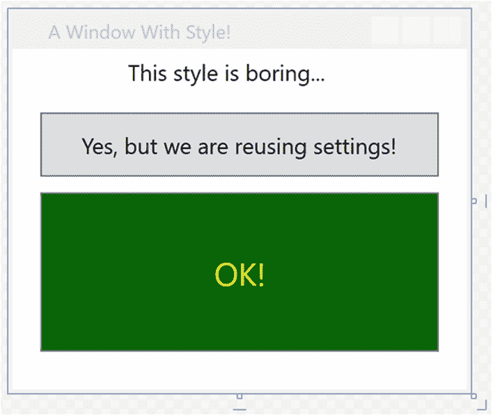

图 27-7。

不同样式的控件

`TargetType`的另一个作用是，如果`x:Key`属性*不存在*，样式将被应用到样式定义范围内该类型的所有元素。

下面是另一个应用级样式，它将自动应用于当前应用中的所有`TextBox`控件:

```cs
<!-- The default style for all text boxes. -->
<Style TargetType="TextBox">
  <Setter Property="FontSize" Value="14"/>
  <Setter Property="Width" Value="100"/>
  <Setter Property="Height" Value="30"/>
  <Setter Property="BorderThickness" Value="5"/>
  <Setter Property="BorderBrush" Value="Red"/>
  <Setter Property="FontStyle" Value="Italic"/>
</Style>

```

您现在可以定义任意数量的`TextBox`控件，它们将自动获得定义的外观。如果给定的`TextBox`不想要这个默认的外观，它可以通过将`Style`属性设置为`{x:Null}`来退出。例如，`txtTest`将获得默认的未命名样式，而`txtTest2`则以自己的方式做事。

```cs
<TextBox x:Name="txtTest"/>
<TextBox x:Name="txtTest2" Style="{x:Null}" BorderBrush="Black"
       BorderThickness="5" Height="60" Width="100" Text="Ha!"/>

```

### 子类化现有样式

您还可以通过`BasedOn`属性使用现有的样式构建新的样式。您正在扩展的样式必须在字典中被赋予一个合适的`x:Key`，因为派生的样式将使用`{StaticResource}`或`{DynamicResource}`标记扩展通过名称引用它。下面是一个基于`BigGreenButton`的新样式，它将按钮元素旋转了 20 度:

```cs
<!-- This style is based on BigGreenButton. -->
<Style x:Key="TiltButton" TargetType="Button" BasedOn="{StaticResource BigGreenButton}">
  <Setter Property="Foreground" Value="White"/>
  <Setter Property="RenderTransform">
    <Setter.Value>
      <RotateTransform Angle="20"/>
    </Setter.Value>
  </Setter>
</Style>

```

要使用这种新样式，请将按钮的标记更新为:

```cs
<Button x:Name="btnAnotherButton" Content="OK!" Margin="0,10,0,0"
    Style="{StaticResource TiltButton}" Width="250" Cursor="Help"/>

```

这将改变图 27-8 所示图像的外观。

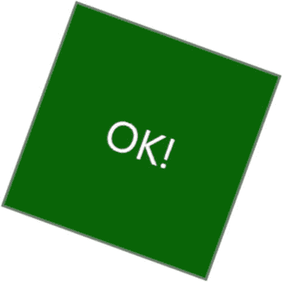

图 27-8。

使用派生样式

### 使用触发器定义样式

通过将`Trigger`对象打包到`Style`对象的`Triggers`集合中，WPF 样式也可以包含触发器。在一个样式中使用触发器允许您定义某些`<Setter>`元素，使得它们只有在给定的触发条件为`true`时才会被应用。例如，当鼠标停留在按钮上时，您可能想要增加字体的大小。或者，您可能希望确保具有当前焦点的文本框以给定的颜色突出显示。触发器对于这类情况很有用，因为它们允许您在属性更改时采取特定的操作，而无需在代码隐藏文件中编写显式 C# 代码。

下面是对`TextBox`样式的更新，确保当`TextBox`拥有输入焦点时，它将获得黄色背景:

```cs
<!-- The default style for all text boxes. -->
<Style TargetType="TextBox">
  <Setter Property="FontSize" Value="14"/>
  <Setter Property="Width" Value="100"/>
  <Setter Property="Height" Value="30"/>
  <Setter Property="BorderThickness" Value="5"/>
  <Setter Property="BorderBrush" Value="Red"/>
  <Setter Property="FontStyle" Value="Italic"/>
  <!-- The following setter will be applied only when the text box is in focus. -->
  <Style.Triggers>
    <Trigger Property="IsFocused" Value="True">
      <Setter Property="Background" Value="Yellow"/>
    </Trigger>
  </Style.Triggers>
</Style>

```

如果你测试这种风格，你会发现当你在不同的`TextBox`对象之间切换时，当前选中的`TextBox`有一个亮黄色的背景(假设它没有通过将`{x:Null}`分配给`Style`属性而退出)。

属性触发器也非常智能，当触发器的条件为*非真*时，属性会自动接收默认的赋值。因此，一旦`TextBox`失去焦点，它也会自动变成默认颜色，无需您做任何工作。相反，事件触发器(在你看 WPF 动画时检查过)不会自动回复到先前的状态。

### 使用多个触发器定义样式

触发器也可以这样设计，当*多个条件*为真时，定义的`<Setter>`元素将被应用。假设您想将一个`TextBox`的背景设置为`Yellow`，只要它有活动的焦点并且鼠标在它的边界内悬停。为此，您可以利用`<MultiTrigger>`元素来定义每个条件，如下所示:

```cs
<!-- The default style for all text boxes. -->
<Style TargetType="TextBox">
  <Setter Property="FontSize" Value="14"/>
  <Setter Property="Width" Value="100"/>
  <Setter Property="Height" Value="30"/>
  <Setter Property="BorderThickness" Value="5"/>
  <Setter Property="BorderBrush" Value="Red"/>
  <Setter Property="FontStyle" Value="Italic"/>
  <!-- The following setter will be applied only when the text box is
  in focus AND the mouse is over the text box. -->
  <Style.Triggers>
    <MultiTrigger>
      <MultiTrigger.Conditions>
            <Condition Property="IsFocused" Value="True"/>
            <Condition Property="IsMouseOver" Value="True"/>
        </MultiTrigger.Conditions>
      <Setter Property="Background" Value="Yellow"/>
    </MultiTrigger>
  </Style.Triggers>
</Style>

```

### 动画样式

样式还可以包含启动动画序列的触发器。下面是最后一个样式，当应用于`Button`控件时，当鼠标在按钮的表面区域内时，它将导致控件的大小增大和缩小:

```cs
<!-- The growing button style! -->
<Style x:Key="GrowingButtonStyle" TargetType="Button">
  <Setter Property="Height" Value="40"/>
  <Setter Property="Width" Value="100"/>
  <Style.Triggers>
    <Trigger Property="IsMouseOver" Value="True">
      <Trigger.EnterActions>
        <BeginStoryboard>
          <Storyboard TargetProperty="Height">
            <DoubleAnimation From="40" To="200"
                             Duration="0:0:2" AutoReverse="True"/>
          </Storyboard>
        </BeginStoryboard>
      </Trigger.EnterActions>
    </Trigger>
  </Style.Triggers>
</Style>

```

在这里，`Triggers`集合正在寻找`IsMouseOver`属性来返回`true`。当这种情况发生时，您定义一个`<Trigger.EnterActions>`元素来执行一个简单的故事板，强制按钮在两秒钟内增长到`200`的`Height`值(然后返回到`40`的`Height`)。如果您想要执行其他的属性更改，您也可以定义一个`<Trigger.ExitActions>`范围来定义当`IsMouseOver`更改为`false`时要采取的任何自定义动作。

### 以编程方式分配样式

回想一下，样式也可以在运行时应用。如果您想让最终用户选择他们的用户界面的外观和感觉，或者如果您需要基于安全设置(例如，`DisableAllButton`样式)或您所拥有的东西来加强外观和感觉，这可能是有帮助的。

在这个项目中，您定义了几种样式，其中许多可以应用于`Button`控件。所以，让我们重组主窗口的 UI，让用户通过在`ListBox`中选择名字来选择这些风格。根据用户的选择，您将应用适当的样式。下面是`<Window>`元素的新的(也是最终的)标记:

```cs
<DockPanel >
  <StackPanel Orientation="Horizontal" DockPanel.Dock="Top" Margin="0,0,0,50">
    <Label Content="Please Pick a Style for this Button" Height="50"/>
    <ListBox x:Name="lstStyles" Height="80" Width="150" Background="LightBlue"
             SelectionChanged="comboStyles_Changed" />
  </StackPanel>
  <Button x:Name="btnStyle" Height="40" Width="100" Content="OK!"/>
</DockPanel>

```

`ListBox`控件(名为`lstStyles`)将在窗口的构造函数中动态填充，如下所示:

```cs
public MainWindow()
{
  InitializeComponent();
  // Fill the list box with all the Button styles.
  lstStyles.Items.Add("GrowingButtonStyle");
  lstStyles.Items.Add("TiltButton");
  lstStyles.Items.Add("BigGreenButton");
  lstStyles.Items.Add("BasicControlStyle");}
}

```

最后一个任务是处理相关代码文件中的`SelectionChanged`事件。注意在下面的代码中，如何使用继承的`TryFindResource()`方法按名称提取当前资源:

```cs
private void comboStyles_Changed(object sender, SelectionChangedEventArgs e)
{
  // Get the selected style name from the list box.
  var currStyle=(Style)TryFindResource(lstStyles.SelectedValue);
  if (currStyle==null) return;
  // Set the style of the button type.
  this.btnStyle.Style=currStyle;
}

```

当您运行这个应用时，您可以从这四种按钮样式中选择一种。图 27-9 显示了您完成的申请。

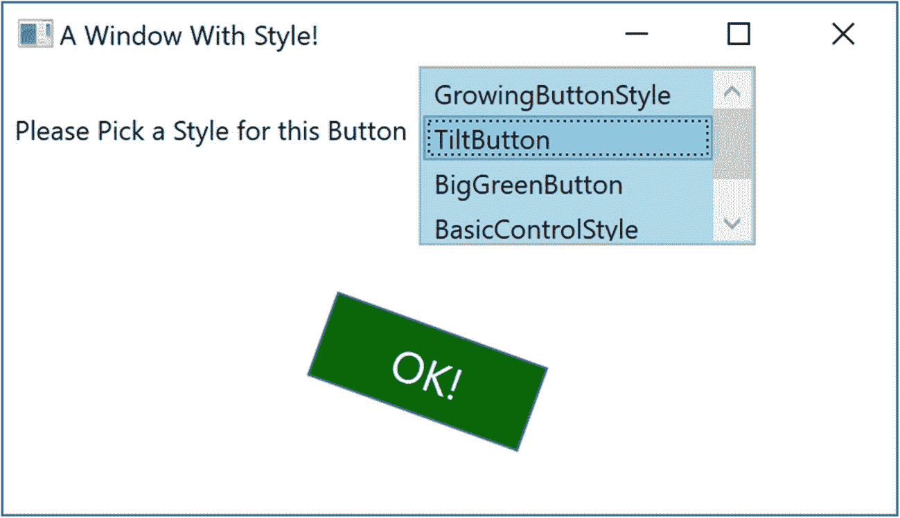

图 27-9。

不同样式的控件

## 逻辑树、可视化树和默认模板

现在您已经了解了样式和资源，在开始学习如何构建自定义控件之前，还有几个准备主题需要研究。具体来说，您需要了解逻辑树、可视化树和默认模板之间的区别。当你在 Visual Studio 或类似`kaxaml.exe`的工具中输入 XAML 时，你的标记就是 XAML 文档的*逻辑视图*。同样，如果您编写了向布局控件添加新项的 C# 代码，您就是在向逻辑树中插入新项。本质上，一个逻辑视图代表了你的内容将如何在主`Window`(或者另一个根元素，比如`Page`或者`NavigationWindow`)的各种布局管理器中定位。

然而，在每个逻辑树的背后是一个更详细的表示，称为*视觉树*，WPF 内部使用它来正确地将元素渲染到屏幕上。在任何视觉树中，都有用于呈现每个对象的模板和样式的完整细节，包括任何必要的绘图、形状、视觉效果和动画。

理解逻辑树和可视化树之间的区别非常有用，因为当您生成自定义控件模板时，实际上是替换控件的全部或部分默认可视化树并插入您自己的树。因此，如果您想要将`Button`控件呈现为星形，您可以定义一个新的星形模板，并将其插入到`Button`的可视化树中。从逻辑上讲，`Button`仍然是类型`Button`，它支持预期的属性、方法和事件。但在视觉上，它呈现出全新的面貌。鉴于其他工具包会要求您构建一个新的类来制作星形按钮，仅这一事实就使 WPF 成为一个极其有用的 API。有了 WPF，你只需要定义新的标记。

Note

WPF 控件通常被描述为*无外观*。这是指这样一个事实，即 WPF 控件的外观和感觉完全独立于它的行为。

### 以编程方式检查逻辑树

虽然在运行时分析一个窗口的逻辑树并不是一个非常常见的 WPF 编程活动，但是值得一提的是,`System.Windows`名称空间定义了一个名为`LogicalTreeHelper`的类，它允许您在运行时检查逻辑树的结构。为了说明逻辑树、可视化树和控件模板之间的联系，创建一个名为 TreesAndTemplatesApp 的新 WPF 应用。

用以下标记替换`Grid`,该标记包含两个`Button`控件和一个启用滚动条的大只读`TextBox`。确保使用 IDE 处理每个按钮的`Click`事件。下面的 XAML 会做得很好:

```cs
<DockPanel LastChildFill="True">
  <Border Height="50" DockPanel.Dock="Top" BorderBrush="Blue">
    <StackPanel Orientation="Horizontal">
      <Button x:Name="btnShowLogicalTree" Content="Logical Tree of Window"
            Margin="4" BorderBrush="Blue" Height="40" Click="btnShowLogicalTree_Click"/>
      <Button x:Name="btnShowVisualTree" Content="Visual Tree of Window"
            BorderBrush="Blue" Height="40" Click="btnShowVisualTree_Click"/>
    </StackPanel>
  </Border>
  <TextBox x:Name="txtDisplayArea" Margin="10" Background="AliceBlue" IsReadOnly="True"
         BorderBrush="Red" VerticalScrollBarVisibility="Auto" HorizontalScrollBarVisibility="Auto" />
</DockPanel>

```

在 C# 代码文件中，定义一个名为 _ `dataToShow`的`string`成员变量。现在，在`btnShowLogicalTree`对象的`Click`处理程序中，调用一个 helper 函数，该函数递归地调用自身，用`Window`的逻辑树填充字符串变量。为此，您将调用`LogicalTreeHelper`的静态`GetChildren()`方法。下面是代码:

```cs
private string _dataToShow=string.Empty;

private void btnShowLogicalTree_Click(object sender, RoutedEventArgs e)
{
  _dataToShow="";
  BuildLogicalTree(0, this);
  txtDisplayArea.Text=_dataToShow;
}

void BuildLogicalTree(int depth, object obj)
{
  // Add the type name to the dataToShow member variable.
  _dataToShow +=new string(' ', depth) + obj.GetType().Name + "\n";
  // If an item is not a DependencyObject, skip it.
  if (!(obj is DependencyObject))
    return;
  // Make a recursive call for each logical child.
  foreach (var child in LogicalTreeHelper.GetChildren((DependencyObject)obj))
  {
      BuildLogicalTree(depth + 5, child);
  }
}
private void btnShowVisualTree_Click(
  object sender, RoutedEventArgs e)
{
}

```

如果你运行你的应用并点击第一个按钮，你会在文本区域看到一个树形图，它几乎是原始 XAML 的精确复制品(见图 27-10 )。

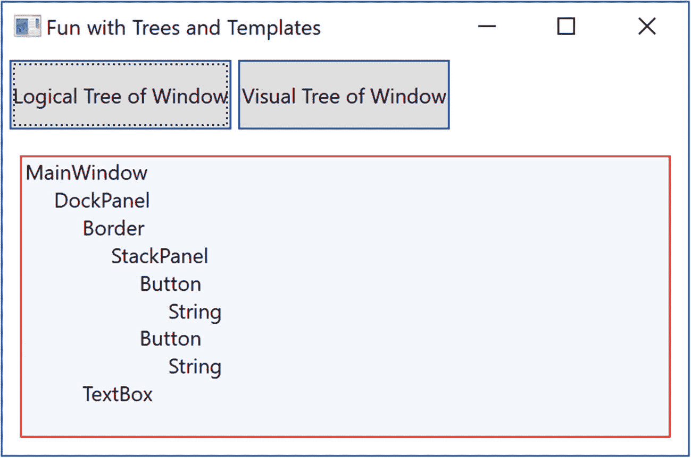

图 27-10。

在运行时查看逻辑树

### 以编程方式检查可视化树

使用`System.Windows.Media`的`VisualTreeHelper`类也可以在运行时检查`Window`的可视化树。下面是第二个`Button`控件(`btnShowVisualTree`)的`Click`实现，它执行类似的递归逻辑来构建视觉树的文本表示:

```cs
using System.Windows.Media;

private void btnShowVisualTree_Click(object sender, RoutedEventArgs e)
{
  _dataToShow="";
  BuildVisualTree(0, this);
  txtDisplayArea.Text=_dataToShow;
}
void BuildVisualTree(int depth, DependencyObject obj)
{
  // Add the type name to the dataToShow member variable.
  _dataToShow +=new string(' ', depth) + obj.GetType().Name + "\n";
  // Make a recursive call for each visual child.
  for (int i=0; i < VisualTreeHelper.GetChildrenCount(obj); i++)
  {
    BuildVisualTree(depth + 1, VisualTreeHelper.GetChild(obj, i));
  }
}

```

如图 27-11 所示，视觉树公开了几个低级渲染代理，如`ContentPresenter`、`AdornerDecorator`、`TextBoxLineDrawingVisual`等。

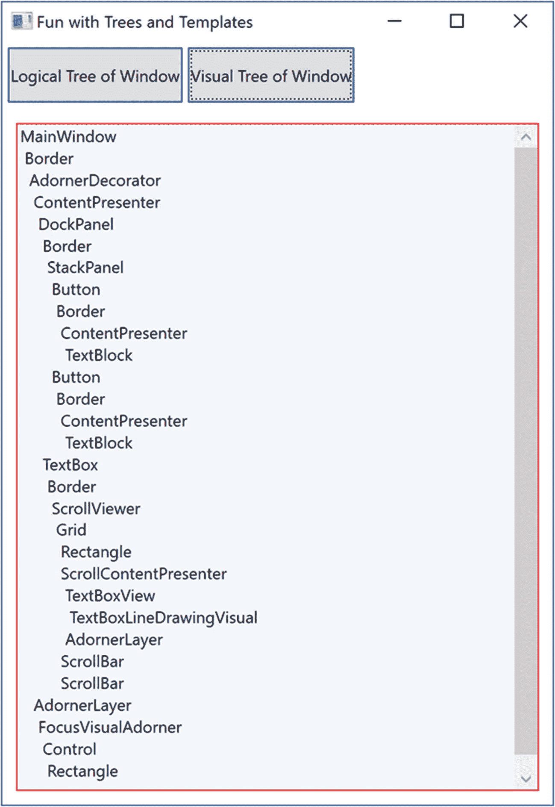

图 27-11。

在运行时查看可视化树

### 以编程方式检查控件的默认模板

回想一下，WPF 使用视觉树来理解如何呈现一个`Window`和所有包含的元素。每个 WPF 控件都在其默认模板中存储自己的呈现命令集。从编程的角度来说，任何模板都可以表示为`ControlTemplate`类的一个实例。同样，您可以通过使用名副其实的`Template`属性来获得控件的默认模板，如下所示:

```cs
// Get the default template of the Button.
Button myBtn=new Button();
ControlTemplate template=myBtn.Template;

```

同样，您可以在代码中创建一个新的`ControlTemplate`对象，并将其插入控件的`Template`属性，如下所示:

```cs
// Plug in a new template for the button to use.
Button myBtn=new Button();
ControlTemplate customTemplate=new ControlTemplate();

// Assume this method adds all the code for a star template.
MakeStarTemplate(customTemplate);
myBtn.Template=customTemplate;

```

虽然您可以用代码构建一个新的模板，但在 XAML 这样做要常见得多。但是，在您开始构建自己的模板之前，让我们先完成当前的示例，并添加在运行时查看 WPF 控件的默认模板的功能。这是查看模板整体构成的一种有用方式。用停靠在主控件`DockPanel`左侧的新控件`StackPanel`更新窗口的标记，定义如下(放置在`<TextBox>`元素之前):

```cs
<Border DockPanel.Dock="Left" Margin="10" BorderBrush="DarkGreen" BorderThickness="4" Width="358">
  <StackPanel>
    <Label Content="Enter Full Name of WPF Control" Width="340" FontWeight="DemiBold" />
    <TextBox x:Name="txtFullName" Width="340" BorderBrush="Green"
             Background="BlanchedAlmond" Height="22" Text="System.Windows.Controls.Button" />
    <Button x:Name="btnTemplate" Content="See Template" BorderBrush="Green"
            Height="40" Width="100" Margin="5" Click="btnTemplate_Click" HorizontalAlignment="Left" />
    <Border BorderBrush="DarkGreen" BorderThickness="2" Height="260"
            Width="301" Margin="10" Background="LightGreen" >
      <StackPanel x:Name="stackTemplatePanel" />
    </Border>
  </StackPanel>
</Border>

```

为`btnTemplate_Click()`事件添加一个空事件处理函数，如下所示:

```cs
private void btnTemplate_Click(
  object sender, RoutedEventArgs e)
{
}

```

左上角的文本区允许你输入位于`PresentationFramework.dll`组件中的 WPF 控件的全限定名。一旦库被加载，您将动态地创建对象的一个实例，并将其显示在左下角的大方框中。最后，控件的默认模板将显示在右边的文本区域。首先，向类型为`Control`的 C# 类添加一个新的成员变量，如下所示:

```cs
private Control _ctrlToExamine=null;

```

下面是剩余的代码，它要求您导入`System.Reflection`、`System.Xml`和`System.Windows.Markup`名称空间:

```cs
private void btnTemplate_Click(
  object sender, RoutedEventArgs e)
{
  _dataToShow="";
  ShowTemplate();
  txtDisplayArea.Text=_dataToShow;
}

private void ShowTemplate()
{
  // Remove the control that is currently in the preview area.
  if (_ctrlToExamine !=null)
    stackTemplatePanel.Children.Remove(_ctrlToExamine);
  try
  {
    // Load PresentationFramework, and create an instance of the
    // specified control. Give it a size for display purposes, then add to the
    // empty StackPanel.
    Assembly asm=Assembly.Load("PresentationFramework, Version=4.0.0.0," +
      "Culture=neutral, PublicKeyToken=31bf3856ad364e35");
    _ctrlToExamine=(Control)asm.CreateInstance(txtFullName.Text);
    _ctrlToExamine.Height=200;
    _ctrlToExamine.Width=200;
    _ctrlToExamine.Margin=new Thickness(5);
    stackTemplatePanel.Children.Add(_ctrlToExamine);
    // Define some XML settings to preserve indentation.
    var xmlSettings=new XmlWriterSettings{Indent=true};
    // Create a StringBuilder to hold the XAML.
    var strBuilder=new StringBuilder();
    // Create an XmlWriter based on our settings.
    var xWriter=XmlWriter.Create(strBuilder, xmlSettings);
    // Now save the XAML into the XmlWriter object based on the ControlTemplate.
    XamlWriter.Save(_ctrlToExamine.Template, xWriter);
    // Display XAML in the text box.
    _dataToShow=strBuilder.ToString();
  }
  catch (Exception ex)
  {
    _dataToShow=ex.Message;
  }
}

```

大部分工作只是修补编译后的 BAML 资源，将其映射成 XAML 字符串。图 27-12 显示了你的最终应用，显示了`System.Windows.Controls.DatePicker`控件的默认模板。图像显示的是`Calendar`，点击控件右侧的按钮即可进入。

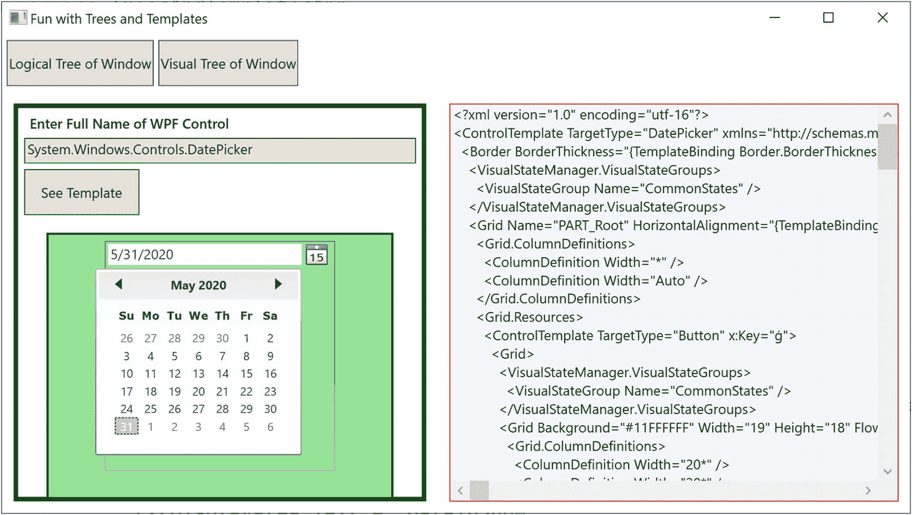

图 27-12。

在运行时调查一个`ControlTemplate`

太好了。您应该对逻辑树、可视化树和控件默认模板如何协同工作有了更好的了解。现在，您可以用本章的剩余部分来学习如何构建自定义模板和用户控件。

## 使用触发器框架构建控件模板

当您为控件生成自定义模板时，除了 C# 代码之外，您什么都不用做。使用这种方法，您可以将数据添加到一个`ControlTemplate`对象，然后将它分配给一个控件的`Template`属性。然而，大多数时候，您将使用 XAML 定义一个`ControlTemplate`的外观，并添加一些代码(或者可能是相当多的代码)来驱动运行时行为。

在本章的剩余部分，您将研究如何使用 Visual Studio 构建自定义模板。在此过程中，您将了解 WPF 触发器框架和可视化状态管理器(VSM)，并了解如何使用动画为最终用户提供可视化提示。单独使用 Visual Studio 来构建复杂的模板可能需要大量的输入和一些繁重的工作。可以肯定的是，生产级模板将受益于 Blend for Visual Studio，这是随 Visual Studio 一起安装的(现在)免费配套应用。然而，鉴于这一版本的文本不包括 Blend 的覆盖范围，是时候卷起袖子敲打一些标记了。

首先，创建一个名为 ButtonTemplate 的新 WPF 应用。对于这个项目，您对创建和使用模板的机制更感兴趣，所以用下面的标记替换`Grid`:

```cs
  <StackPanel Orientation="Horizontal">
    <Button x:Name="myButton" Width="100" Height="100" Click="myButton_Click"/>
  </StackPanel>

```

在`Click`事件处理程序中，简单地显示一个消息框(通过`MessageBox.Show()`)来显示一条确认控件点击的消息。记住，当你构建定制模板时，控件的*行为*是不变的，但是*外观*可能会变化。

目前，这个`Button`是使用默认模板呈现的，如前面的例子所示，它是给定 WPF 程序集中的一个 BAML 资源。当您想要定义自己的模板时，实际上是用您自己的创建来替换这个默认的可视化树。首先，更新`<Button>`元素的定义，使用 property-element 语法指定一个新模板。该模板将使控件具有圆形外观。

```cs
<Button x:Name="myButton" Width="100" Height="100" Click="myButton_Click">
  <Button.Template>
    <ControlTemplate>
      <Grid x:Name="controlLayout">
        <Ellipse x:Name="buttonSurface" Fill="LightBlue"/>
        <Label x:Name="buttonCaption"
        VerticalAlignment="Center"
        HorizontalAlignment="Center"
        FontWeight="Bold" FontSize="20" Content="OK!"/>
      </Grid>
    </ControlTemplate>
  </Button.Template>
</Button>

```

这里，您已经定义了一个模板，它由一个名为`Grid`的控件组成，该控件包含一个名为`Ellipse`的控件和一个名为`Label`的控件。因为您的`Grid`没有已定义的行或列，所以每个子控件都堆叠在前一个控件的顶部，使内容居中。如果您现在运行您的应用，您会注意到当鼠标光标在`Ellipse`的边界内时，`Click`事件将只触发*！这是 WPF 模板架构的一个很大的特点:你不需要重新计算命中测试、边界检查或者任何其他底层细节。因此，如果你的模板使用了一个`Polygon`对象来呈现一些奇怪的几何图形，你可以放心，鼠标点击测试的细节是相对于控件的形状，而不是更大的边框。*

### 模板作为资源

目前，您的模板被嵌入到一个特定的`Button`控件中，这限制了重用。理想情况下，您应该将模板放在资源字典中，以便可以在项目之间重用圆形按钮模板，或者至少将它移动到应用资源容器中，以便在该项目中重用。让我们通过从`Button`中剪切模板定义并将其粘贴到`App.xaml`文件的`Application.Resources`标签中，将本地`Button`资源移动到应用级别。添加一个`Key`和一个`TargetType`，如下所示:

```cs
<Application.Resources>
  <ControlTemplate x:Key="RoundButtonTemplate" TargetType="{x:Type Button}">
    <Grid x:Name="controlLayout">
      <Ellipse x:Name="buttonSurface" Fill="LightBlue"/>
      <Label x:Name="buttonCaption" VerticalAlignment="Center" HorizontalAlignment="Center"
             FontWeight="Bold" FontSize="20" Content="OK!"/>
    </Grid>
  </ControlTemplate>
</Application.Resources>

```

将`Button`标记更新为以下内容:

```cs
<Button x:Name="myButton" Width="100" Height="100"
  Click="myButton_Click"
  Template="{StaticResource RoundButtonTemplate}">
</Button>

```

现在，因为整个应用都可以使用这个资源，所以只需应用模板就可以定义任意数量的圆形按钮。创建两个额外的`Button`控件，使用这个模板进行测试(不需要为这些新项目处理`Click`事件)。

```cs
<StackPanel>
  <Button x:Name="myButton" Width="100" Height="100"
    Click="myButton_Click"
    Template="{StaticResource RoundButtonTemplate}"></Button>
  <Button x:Name="myButton2" Width="100" Height="100"
    Template="{StaticResource RoundButtonTemplate}"></Button>
  <Button x:Name="myButton3" Width="100" Height="100"
    Template="{StaticResource RoundButtonTemplate}"></Button>
</StackPanel>

```

### 使用触发器整合视觉提示

定义自定义模板时，默认模板的视觉提示也会被删除。例如，默认的 button 模板包含一些标记，这些标记通知控件在某些 UI 事件发生时如何显示，例如当它获得焦点时、用鼠标单击时、启用(或禁用)时等等。用户非常习惯于这种视觉提示，因为它给了控件某种程度的触觉反应。然而，您的`RoundButtonTemplate`没有定义任何这样的标记，所以无论鼠标活动如何，控件的外观都是相同的。理想情况下，你的控件在被点击时看起来应该有所不同(可能通过颜色变化或阴影)，让用户知道视觉状态已经改变。

正如您已经了解到的，这可以通过使用触发器来完成。对于简单的操作，触发器工作得非常好。还有其他方法可以做到这一点，超出了本书的范围，但在 [`https://docs.microsoft.com/en-us/dotnet/desktop-wpf/themes/how-to-create-apply-template`](https://docs.microsoft.com/en-us/dotnet/desktop-wpf/themes/how-to-create-apply-template) 可以获得更多信息。

举例来说，用下面的标记更新您的`RoundButtonTemplate`，它添加了两个触发器。第一个将在鼠标停留在表面上时将控件的颜色更改为蓝色，前景色更改为黄色。第二种方法是在通过鼠标按下控件时缩小`Grid`(以及所有子元素)的大小。

```cs
<ControlTemplate x:Key="RoundButtonTemplate" TargetType="Button" >
  <Grid x:Name="controlLayout">
    <Ellipse x:Name="buttonSurface" Fill="LightBlue" />
    <Label x:Name="buttonCaption" Content="OK!"
      FontSize="20" FontWeight="Bold"
      HorizontalAlignment="Center"
      VerticalAlignment="Center" />
  </Grid>
    <ControlTemplate.Triggers>
      <Trigger Property="IsMouseOver" Value="True">
        <Setter TargetName="buttonSurface" Property="Fill"
          Value="Blue"/>
        <Setter TargetName="buttonCaption"
          Property="Foreground" Value="Yellow"/>
      </Trigger>
      <Trigger Property="IsPressed" Value="True">
        <Setter TargetName="controlLayout"
           Property="RenderTransformOrigin" Value="0.5,0.5"/>
        <Setter TargetName="controlLayout"
          Property="RenderTransform">
          <Setter.Value>
            <ScaleTransform ScaleX="0.8" ScaleY="0.8"/>
          </Setter.Value>
        </Setter>
      </Trigger>
  </ControlTemplate.Triggers>
</ControlTemplate>

```

### {TemplateBinding}标记扩展的角色

控件模板的问题是每个按钮看起来和说的都一样。将标记更新为以下内容没有任何效果:

```cs
<Button x:Name="myButton" Width="100" Height="100"
  Background="Red" Content="Howdy!" Click="myButton_Click"
  Template="{StaticResource RoundButtonTemplate}" />
<Button x:Name="myButton2" Width="100" Height="100"
  Background="LightGreen" Content="Cancel!" Template="{StaticResource RoundButtonTemplate}" />
<Button x:Name="myButton3" Width="100" Height="100"
  Background="Yellow" Content="Format" Template="{StaticResource RoundButtonTemplate}" />

```

这是因为控件的默认属性(如`BackGround`和`Content`)在模板中被覆盖。要启用它们，必须将它们映射到模板中的相关属性。您可以在构建模板时使用`{TemplateBinding}`标记扩展来解决这些问题。这允许您使用模板捕获由控件定义的属性设置，并使用它们来设置模板本身中的值。

下面是`RoundButtonTemplate`的修改版本，它现在使用这个标记扩展将`Button`的`Background`属性映射到`Ellipse`的`Fill`属性；它还确保了`Button`的`Content`确实被传递给了`Label`的`Content`属性:

```cs
<Ellipse x:Name="buttonSurface" Fill="{TemplateBinding Background}"/>
<Label x:Name="buttonCaption" Content="{TemplateBinding Content}"
  FontSize="20" FontWeight="Bold" HorizontalAlignment="Center"
  VerticalAlignment="Center" />

```

通过此次更新，您现在可以创建各种颜色和文本值的按钮。图 27-13 显示了 XAML 更新后的结果。

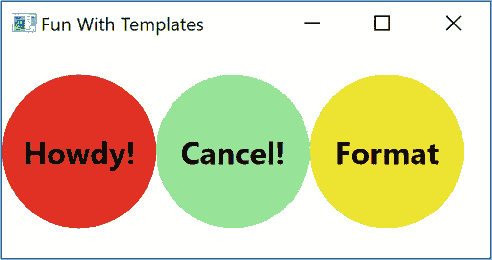

图 27-13。

模板绑定允许值传递给内部控件。

### 内容演示者的角色

当你设计你的模板时，你使用了一个`Label`来显示控件的文本值。像`Button`一样，`Label`支持一个`Content`属性。因此，考虑到您对`{TemplateBinding}`的使用，您可以定义一个包含复杂内容的`Button`，而不仅仅是一个简单的字符串。

然而，如果您需要将复杂的内容传递给一个没有*而*没有`Content`属性的模板成员，该怎么办呢？当您想要在模板中定义一个通用的*内容显示区域*时，您可以使用`ContentPresenter`类，而不是特定类型的控件(`Label`或`TextBlock`)。对于这个例子，没有必要这样做；然而，这里有一些简单的标记说明了如何构建一个使用`ContentPresenter`的定制模板，以显示使用该模板的控件的`Content`属性的值:

```cs
<!-- This button template will display whatever is set to the Content of the hosting button. -->
<ControlTemplate x:Key="NewRoundButtonTemplate" TargetType="Button">
  <Grid>
    <Ellipse Fill="{TemplateBinding Background}"/>
    <ContentPresenter HorizontalAlignment="Center" VerticalAlignment="Center"/>
  </Grid>
</ControlTemplate>

```

### 将模板并入样式

目前，你的模板仅仅定义了`Button`控件的基本外观。但是，建立控件的基本属性(内容、字体大小、字体粗细等)的过程。)是`Button`本身的责任。

```cs
<!-- Currently the Button must set basic property values, not the template. -->
<Button x:Name="myButton" Foreground="Black" FontSize="20"
  FontWeight="Bold"
  Template="{StaticResource RoundButtonTemplate}"
  Click="myButton_Click"/>

```

如果您愿意，您可以在模板中建立这些值*。通过这样做，您可以有效地创建默认的外观。你可能已经意识到了，这是 WPF·斯泰尔斯的工作。当您构建一个样式时(考虑到基本的属性设置)，您可以在样式*中定义一个模板*！这是您在`App.xaml`的应用资源中更新的应用资源，它已被重设密钥为`RoundButtonStyle`:*

```cs
<!-- A style containing a template. -->
<Style x:Key="RoundButtonStyle" TargetType="Button">
  <Setter Property="Foreground" Value="Black"/>
  <Setter Property="FontSize" Value="14"/>
  <Setter Property="FontWeight" Value="Bold"/>
  <Setter Property="Width" Value="100"/>
  <Setter Property="Height" Value="100"/>
  <!-- Here is the template! -->
  <Setter Property="Template">
    <Setter.Value>
      <ControlTemplate TargetType="Button">
          <!-- Control template from above example -->
      </ControlTemplate>
    </Setter.Value>
  </Setter>
</Style>

```

有了这次更新，您现在可以通过设置`Style`属性来创建按钮控件，如下所示:

```cs
<Button x:Name="myButton" Background="Red" Content="Howdy!"
        Click="myButton_Click" Style="{StaticResource RoundButtonStyle}"/>

```

虽然按钮的呈现和行为是相同的，但是在样式中嵌套模板的好处是可以为公共属性提供一组固定的值。这就概括了如何使用 Visual Studio 和触发器框架为控件构建自定义模板。虽然关于 Windows Presentation Foundation API 还有很多内容没有在这里讨论，但是您应该已经为进一步的学习打下了坚实的基础。

## 摘要

本章第一部分考察了 WPF 的资源管理体系。您从如何使用二进制资源开始，然后研究了对象资源的角色。正如您所了解的，对象资源被命名为 XAML 的 blobs，可以存储在不同的位置以重用内容。

接下来，你学习了 WPF 的动画框架。在这里，你有机会用 C# 代码和 XAML 制作一些动画。您了解到，如果您在标记中定义动画，您将使用`<Storyboard>`元素和触发器来控制执行。然后您看到了 WPF 风格的机制，它大量使用图形、对象资源和动画。

您检查了*逻辑树*和*视觉树*之间的关系。逻辑树基本上是您为描述 WPF 根元素而创作的标记的一一对应关系。在这个逻辑树的后面是一个更深的可视化树，它包含了详细的渲染指令。

然后检查了默认模板的作用。请记住，当您构建自定义模板时，您实际上是将控件的可视化树全部(或部分)取出，并用您自己的自定义实现替换它。*