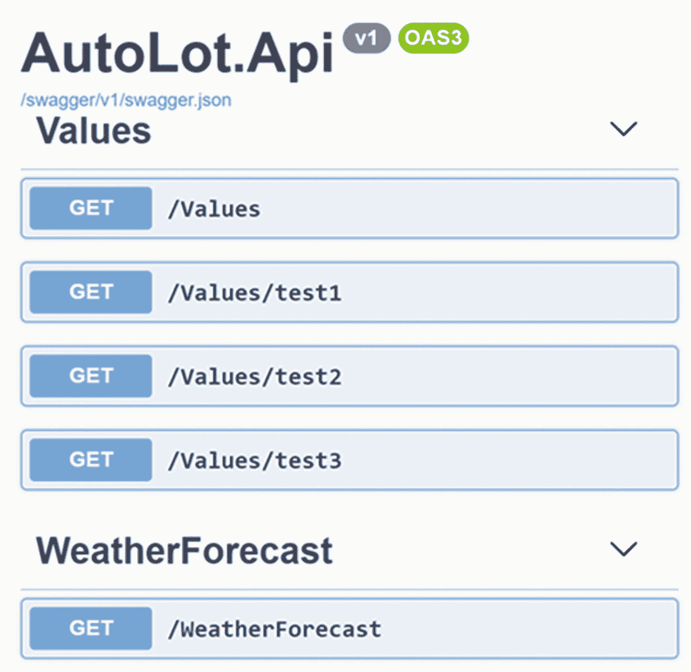
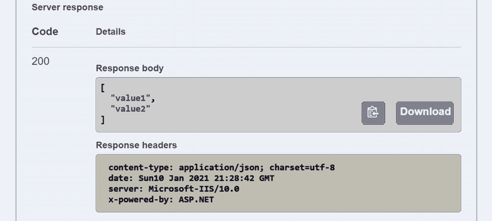
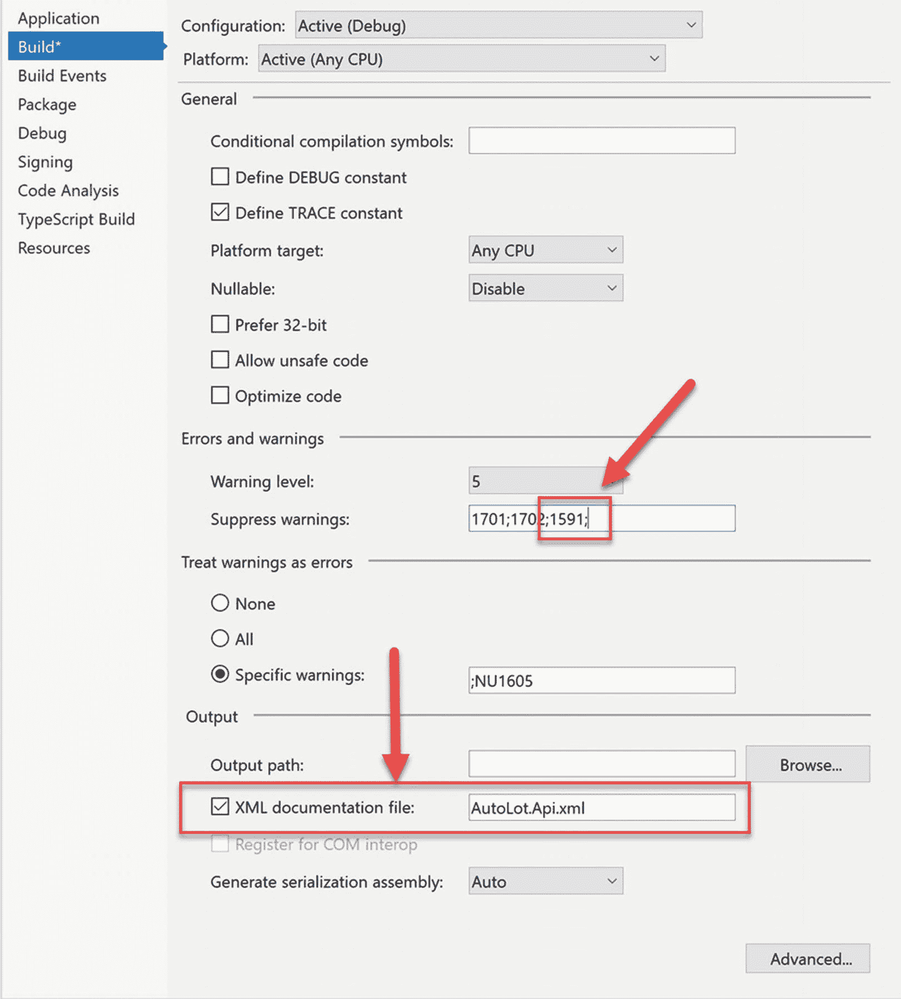
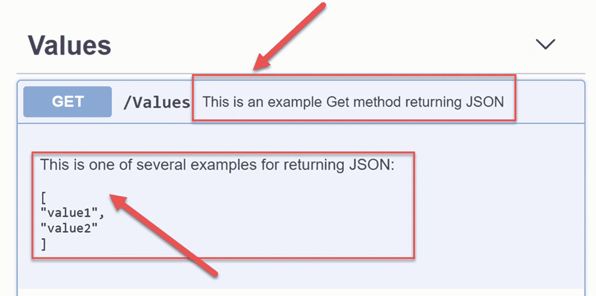
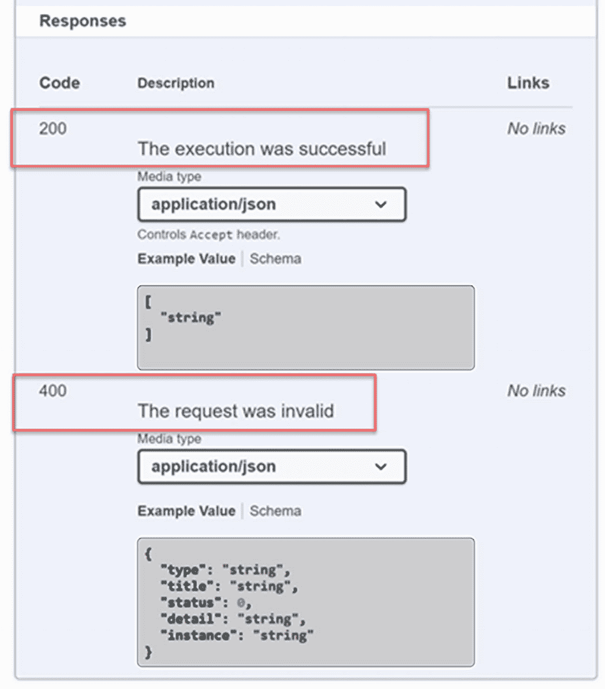

# 三十、ASP.NET 核心的 RESTful 服务

前一章介绍了 ASP.NET 核心，讨论了一些新特性，创建了项目，并更新了 AutoLot 中的代码。Mvc 和 AutoLot。包含自动 Lot 的 Api。Dal 和 Serilog 测井。本章重点介绍如何完成自动 Lot。Api RESTful 服务。

Note

本章的示例代码在本书 repo 的`Chapter 30`目录中。请随意继续你在第 [29 章](29.html)开始的解决方案。

## 介绍 ASP.NET 核心 RESTful 服务

ASP.NET MVC 框架几乎一发布就开始获得关注，微软发布了 ASP.NET Web API 和 ASP.NET MVC 4 以及 Visual Studio 2012。ASP.NET Web API 2 随 Visual Studio 2013 一起发布，然后随 Visual Studio 2013 Update 1 更新到 2.2 版。

从一开始，ASP.NET Web API 就被设计成一个基于服务的框架，用于构建**RE**presentational**S**state**T**transfer(RESTful)服务。它基于 MVC 框架减去 *V* (视图)，优化创建无头服务。这些服务可以被任何技术调用，而不仅仅是微软旗下的那些。对 Web API 服务的调用基于核心 HTTP 动词(Get、Put、Post、Delete ),通过统一资源标识符(URI ),如下所示:

```cs
http://www.skimedic.com:5001/api/cars

```

如果这看起来像一个统一资源定位器(URL)，那是因为它就是！URL 只是一个指向网络上物理资源的 URI。

对 Web API 的调用使用特定主机上的**H**yper**T**ext**T**transfer**P**rotocol(HTTP)方案(在本例中为 [`www.skimedic.com`](http://www.skimedic.com) )、特定端口(上例中为 5001)，后跟路径(`api/cars`)和可选的查询和片段(本例中未显示)。Web API 调用也可以在消息体中包含文本，这一点你会在本章中看到。正如前一章所讨论的，ASP.NET 核心将 Web API 和 MVC 统一到一个框架中。

## RESTful 服务的控制器动作

回想一下，动作返回一个`IActionResult`(或者异步操作返回一个`Task<IActionResult>`)。除了返回特定 HTTP 状态代码的`ControllerBase`中的 helper 方法之外，action 方法还可以以格式化的 JavaScript 对象符号(JSON)响应的形式返回内容。

Note

严格来说，动作方法可以返回多种格式。JSON 包含在本书中，因为它是最常见的。

### 格式化的 JSON 响应结果

大多数 RESTful APIs 使用 JSON(发音为“Jay-saw”)从客户端接收数据，并向客户端发送数据。这里显示了一个简单的 JSON 示例，包含两个值:

```cs
[
  "value1",
  "value2"
]

```

Note

第 [20 章](20.html)使用`System.Text.Json`深入讨论了 JSON 序列化。

API 也使用 HTTP 状态代码来传达成功或失败。在表 [29-3](29.html#Tab3) 中的前一章中列出了一些在`ControllerBase`类中可用的 HTTP 状态助手方法。成功的请求返回 200 范围内的状态代码，200 (OK)是最常见的成功代码。事实上，它是如此普遍，以至于你不必显式地返回一个 OK。如果没有抛出异常，并且代码没有指定状态代码，那么将向客户端返回 200 以及任何数据。

要设置以下示例，请向自动 Lot 添加一个新的控制器。Api 项目。在`Controllers`目录中添加一个名为`ValuesController.cs`的新文件，并更新代码以匹配以下内容:

```cs
using System.Collections.Generic;
using Microsoft.AspNetCore.Mvc;

[Route("api/[controller]")]
[ApiController]
public class ValuesController : ControllerBase
{
}

```

Note

如果使用 Visual Studio，有一个架子工负责控制器。要访问它，右击自动 Lot 中的`Controllers`文件夹。Api 项目并选择添加控制器。选择 MVC 控制器-空。

该代码使用一个值(`api`)和一个令牌(`[controller]`)为控制器设置路由。这个路由模板将匹配类似于 [`www.skimedic.com/` `api` `/` `values`](http://www.skimedic.com/api/values) 的 URL。下一个属性(`ApiController`)选择几个特定于 API 的特性(在下一节讨论)。最后，控制器继承自`ControllerBase`。正如在第 [29](29.html) 章中所讨论的，ASP.NET 核心将经典 ASP.NET 中所有可用的不同控制器类型整合为一个，命名为`Controller`，带有一个基类`ControllerBase`。`Controller`类提供特定于视图的功能(MVC 中的 *V* )，而`ControllerBase`为 MVC 风格的应用提供所有其余的核心功能。

有几种方法可以将内容作为 JSON 从 action 方法中返回。以下示例都返回相同的 JSON 以及 200 状态代码。不同之处主要在文体上。将以下代码添加到您的`ValuesController`类中:

```cs
[HttpGet]
public IActionResult Get()
{
  return Ok(new string[] { "value1", "value2" });
}
[HttpGet("one")]
public IEnumerable<string> Get1()
{
  return new string[] { "value1", "value2" };
}
[HttpGet("two")]
public ActionResult<IEnumerable<string>> Get2()
{
  return new string[] { "value1", "value2" };
}
[HttpGet("three")]
public string[] Get3()
{
  return new string[] { "value1", "value2" };
}
[HttpGet("four")]
public IActionResult Get4()
{
    return new JsonResult(new string[] { "value1", "value2" });
}

```

要对此进行测试，请运行 AutoLot。Api 应用，你会看到 Swagger UI 中列出了从`ValuesController`开始的所有方法，如图 [30-1](#Fig1) 所示。回想一下，在确定路由时，`Controller`后缀被从名称中去掉，因此`ValuesController`上的端点被映射为`Values`，而不是`ValuesController`。



图 30-1。

Swagger 文档页面

要执行其中一种方法，请单击“获取”按钮、“尝试”按钮，然后单击“执行”按钮。一旦方法执行完毕，UI 就会更新以显示结果，图 [30-2](#Fig2) 中只显示了 Swagger UI 的相关部分。



图 30-2。

Swagger 服务器响应信息

您将看到，执行每个方法都会产生相同的 JSON 结果。

### ApiController 属性

在 ASP.NET 核心 2.1 中添加的`ApiController`属性在与`ControllerBase`类结合时提供了特定于 REST 的规则、约定和行为。这些约定和行为将在以下几节中概述。

#### 属性路由要求

使用`ApiController`属性时，控制器必须使用属性路由。这只是强化了许多人认为的最佳实践。

#### 自动 400 响应

如果模型绑定有问题，该操作将自动返回 HTTP 400(错误请求)响应代码。这将替换以下代码:

```cs
if (!ModelState.IsValid)
{
  return BadRequest(ModelState);
}

```

ASP.NET 核心使用`ModelStateInvalidFilter`动作过滤器来做前面的检查。当出现绑定或验证错误时，HTTP 400 响应的主体中会包含错误的详细信息。这里显示了一个示例:

```cs
{
  "type": "https://tools.ietf.org/html/rfc7231#section-6.5.1",
  "title": "One or more validation errors occurred.",
  "status": 400,
  "traceId": "|7fb5e16a-4c8f23bbfc974667.",
  "errors": {
    "": [
      "A non-empty request body is required."
    ]
  }
}

```

这种行为可以通过在`Startup.cs`类的`ConfigureServices()`方法中进行配置来禁用。

```cs
services.AddControllers()
    .ConfigureApiBehaviorOptions(options =>
    {
        options.SuppressModelStateInvalidFilter = true;
    });

```

#### 绑定源参数推断

模型绑定引擎将根据表 [30-1](#Tab1) 中列出的约定推断在哪里检索值。

表 30-1。

绑定源推理约定

<colgroup><col class="tcol1 align-left"> <col class="tcol2 align-left"></colgroup> 
| 

来源

 | 

参数界限

 |
| --- | --- |
| `FromBody` | 除了有特殊含义的内置类型，如`IFormCollection`或`CancellationToken`之外，对于复杂类型参数进行推断。只能存在一个`FromBody`参数，否则将抛出异常。如果简单类型需要绑定(例如，`string`或`int`)，那么`FromBody`属性仍然是必需的。 |
| `FromForm` | 为类型`IFormFile`和`IFormFileCollection`的动作参数推断。当参数标有`FromForm`时，将推断出多部分/表单数据内容类型。 |
| `FromRoute` | 对于匹配路由令牌名称的任何参数名称进行推断。 |
| `FromQuery` | 推断出任何其他行动参数。 |

这种行为可以通过在`Startup.cs`类的`ConfigureServices()`方法中进行配置来禁用。

```cs
services.AddControllers().ConfigureApiBehaviorOptions(options =>
{
  //suppress all binding inference
  options.SuppressInferBindingSourcesForParameters= true;
  //suppress multipart/form-data content type inference
  options. SuppressConsumesConstraintForFormFileParameters = true;
});

```

#### 错误状态代码的问题详细信息

ASP.NET 核心将错误结果(状态为 400 或更高)转换为带有`ProblemDetails`的结果。这里列出了`ProblemDetails`类型:

```cs
public class ProblemDetails
{
  public string Type { get; set; }
  public string Title { get; set; }
  public int? Status { get; set; }
  public string Detail { get; set; }
  public string Instance { get; set; }
  public IDictionary<string, object> Extensions { get; }
    = new Dictionary<string, object>(StringComparer.Ordinal);
}

```

为了测试这种行为，向`ValuesController`添加另一个方法，如下所示:

```cs
[HttpGet("error")]
public IActionResult Error()
{
  return NotFound();
}

```

运行应用并使用 Swagger UI 来执行新的`Error`端点。结果仍然是 404 ( `NotFound`)状态代码，但是在响应的主体中返回了附加信息。以下是一个示例响应(您的`traceId`会有所不同):

```cs
{
  "type": "https://tools.ietf.org/html/rfc7231#section-6.5.4",
  "title": "Not Found",
  "status": 404,
  "traceId": "00-9a609e7e05f46d4d82d5f897b90da624-a6484fb34a7d3a44-00"
}

```

这种行为可以通过在`Startup.cs`类的`ConfigureServices()`方法中进行配置来禁用。

```cs
services.AddControllers()
    .ConfigureApiBehaviorOptions(options =>
    {
        options.SuppressMapClientErrors = true;
    });

```

当行为被禁用时，对`Error`端点的调用返回一个 404，没有任何附加信息。

## 更新 Swagger/OpenAPI 设置

Swagger(也称为 OpenAPI)是一个用于记录 RESTful APIs 的开放标准。将 Swagger 添加到 ASP.NET 核心 API 的两个主要选择是 Swashbuckle 和 NSwag。ASP.NET 核心 5 现在包括 Swashbuckle 作为新项目模板的一部分。为自动 Lot 生成的`swagger.json`文件。Api 包含站点、每个端点以及端点中涉及的任何对象的信息。

Swagger UI 是一个基于 web 的 UI，它提供了一个交互式界面来检查和测试应用的端点(就像你在本章前面所做的那样)。通过将文档添加到生成的`swagger.json`文件中，可以增强这种体验。

### 更新启动类中的 Swagger 调用

默认的 API 模板在`Startup.cs`的`ConfigureService()`方法中添加了生成`swagger.json`文件的代码。

```cs
services.AddSwaggerGen(c =>
{
  c.SwaggerDoc("v1", new OpenApiInfo { Title = "AutoLot.Api", Version = "v1" });
});

```

默认代码的第一个变化是向`OpenApiInfo`添加元数据。将`AddSwaggerGen()`调用更新为以下内容，这将更新标题并添加描述和许可信息:

```cs
services.AddSwaggerGen(c =>
{
  c.SwaggerDoc("v1",
    new OpenApiInfo
    {
      Title = "AutoLot Service",
      Version = "v1",
      Description = "Service to support the AutoLot dealer site",
      License = new OpenApiLicense
      {
        Name = "Skimedic Inc",
        Url = new Uri("http://www.skimedic.com")
      }
    });
});

```

下一步是将`UseSwagger()`和`UseSwaggerUI()`移出开发专用块，进入`Configure()`中的主执行路径。另外，将标题从“自动锁定”更新为“自动锁定服务 v1”。Api v1。

```cs
public void Configure(IApplicationBuilder app, IWebHostEnvironment env, ApplicationDbContext context)
{
  if (env.IsDevelopment())
  {
    //If in development environment, display debug info
    app.UseDeveloperExceptionPage();
    //Original code
    //app.UseSwagger();
    //app.UseSwaggerUI(c => c.SwaggerEndpoint("/swagger/v1/swagger.json", "AutoLot.Api v1"));
    //Initialize the database
    if (Configuration.GetValue<bool>("RebuildDataBase"))
    {
      SampleDataInitializer.ClearAndReseedDatabase(context);
    }
  }

  // Enable middleware to serve generated Swagger as a JSON endpoint.
  app.UseSwagger();
  // Enable middleware to serve swagger-ui (HTML, JS, CSS, etc.),
  // specifying the Swagger JSON endpoint.
  app.UseSwaggerUI(c => { c.SwaggerEndpoint("/swagger/v1/swagger.json", "AutoLot Service v1"); });
...
}

```

前面的代码选择使用 Swagger ( `app.UseSwagger()`)和 Swagger UI ( `app.useSwaggerUI()`)。它还为`swagger.json`文件配置端点。

### 添加 XML 文档文件

。NET Core 可以通过检查三斜线(`///`)注释的方法，从您的项目中生成一个 XML 文档文件。若要使用 Visual Studio 启用此功能，请右键单击自动标注。Api 项目并打开“属性”窗口。选择构建页面，选中 XML 文档文件复选框，并输入`AutoLot.Api.xml`作为文件名。同样，在“抑制警告”文本框中输入 **1591** ，如图 [30-3](#Fig3) 所示。



图 30-3。

添加 XML 文档文件并取消 1591

相同的设置可以直接输入到项目文件中。下面显示了要添加的`PropertyGroup`:

```cs
  <PropertyGroup Condition="'$(Configuration)|$(Platform)'=='Debug|AnyCPU'">
    <DocumentationFile>AutoLot.Api.xml</DocumentationFile>
    <NoWarn>1701;1702;1591;</NoWarn>
  </PropertyGroup>

```

NoWarn 1591 设置为没有 XML 注释的方法关闭编译器警告。

Note

1701 和 1702 警告是早期经典的延续。方法公开的。NET 核心编译器。

要查看这个过程的运行情况，请将`ValuesController`的 Get 方法更新为:

```cs
/// <summary>
/// This is an example Get method returning JSON
/// </summary>
/// <remarks>This is one of several examples for returning JSON:
/// <pre>
/// [
///   "value1",
///   "value2"
/// ]
/// </pre>
/// </remarks>
/// <returns>List of strings</returns>
[HttpGet]
public IActionResult Get()
{
  return Ok(new string[] { "value1", "value2" });
}

```

当您构建项目时，会在项目的根目录下创建一个名为`AutoLot.Api.xml`的新文件。打开文件以查看您刚刚添加的注释。

```cs
<?xml version="1.0"?>
<doc>
  <assembly>
    <name>AutoLot.Api</name>
  </assembly>
  <members>
    <member name="M:AutoLot.Api.Controllers.ValuesController.Get">
      <summary>
        This is an example Get method returning JSON
      </summary>
      <remarks>This is one of several examples for returning JSON:
        <pre>
        [
          "value1",
          "value2"
        ]
        </pre>
      </remarks>
      <returns>List of strings</returns>    </member>
  </members>
</doc>

```

Note

使用 Visual Studio 时，如果在类或方法定义前输入三个反斜杠，Visual Studio 将为您剔除初始 XML 注释。

下一步是将 XML 注释合并到生成的`swagger.json`文件中。

### 向 SwaggerGen 添加 XML 注释

生成的 XML 注释必须添加到`swagger.json`生成过程中。首先向`Startup`类添加以下`using`语句:

```cs
using System.IO;
using System.Reflection;

```

通过调用`AddSwaggerGen()`方法中的`IncludeXmlComments()`方法，XML 文档文件被添加到 Swagger 中。导航到`Startup`类的`ConfigureServices()`方法，并将`AddSwaggerGen()`方法更新为以下内容，以添加 XML 文档文件:

```cs
services.AddSwaggerGen(c =>
{
  c.SwaggerDoc("v1",
    new OpenApiInfo
    {
      Title = "AutoLot Service",
      Version = "v1",
      Description = "Service to support the AutoLot dealer site",
      License = new OpenApiLicense
      {
        Name = "Skimedic Inc",
        Url = new Uri("http://www.skimedic.com")
      }
    });
    var xmlFile = $"{Assembly.GetExecutingAssembly().GetName().Name}.xml";
    var xmlPath = Path.Combine(AppContext.BaseDirectory, xmlFile);
    c.IncludeXmlComments(xmlPath);
});

```

运行应用并检查 Swagger UI。注意集成到 Swagger UI 中的 XML 注释，如图 [30-4](#Fig4) 所示。



图 30-4。

集成到 Swagger UI 中的 XML 文档

除了 XML 文档之外，应用端点上的附加配置可以改进文档。

### API 端点的附加文档选项

Swagger 文档还有一些额外的属性。要使用它们，首先将下面的`using`语句添加到`ValuesController.cs`文件中:

```cs
using Microsoft.AspNetCore.Http;
using Swashbuckle.AspNetCore.Annotations;

```

`Produces`属性表示端点的内容类型。`ProducesResponseType`属性使用`StatusCodes`枚举来指示端点可能的返回代码。更新`ValuesController`的`Get()`方法，指定`application/json`为返回类型，动作结果将返回 200 OK 或 400 Bad 请求。

```cs
[HttpGet]
[Produces("application/json")]
[ProducesResponseType(StatusCodes.Status200OK)]
[ProducesResponseType(StatusCodes.Status400BadRequest)]
public ActionResult<IEnumerable<string>> Get()
{
  return new string[] {"value1", "value2"};
}

```

虽然`ProducesResponseType`属性将响应代码添加到文档中，但是该信息不能被定制。幸运的是，Swashbuckle 为此添加了`SwaggerResponse`属性。将`Get()`方法更新如下:

```cs
[HttpGet]
[Produces("application/json")]
[ProducesResponseType(StatusCodes.Status200OK)]
[ProducesResponseType(StatusCodes.Status400BadRequest)]
[SwaggerResponse(200, "The execution was successful")]
[SwaggerResponse(400, "The request was invalid")]
public ActionResult<IEnumerable<string>> Get()
{
  return new string[] {"value1", "value2"};
}

```

在 Swagger 注释被选取并添加到生成的文档之前，它们必须被启用。打开`Startup.cs`并导航至`Configure()`方法。将对`AddSwaggerGen()`的呼叫更新为:

```cs
services.AddSwaggerGen(c =>
{
  c.EnableAnnotations();
...
});

```

现在，当您查看 Swagger UI 的 responses 部分时，您将看到定制的消息，如图 [30-5](#Fig5) 所示。



图 30-5。

更新了 Swagger UI 中的响应

Note

Swashbuckle 支持许多额外的定制。更多信息请咨询 [`https://github.com/domaindrivendev/Swashbuckle.AspNetCore`](https://github.com/domaindrivendev/Swashbuckle.AspNetCore) 的文档。

## 构建 API 操作方法

自动手枪的大部分功能。Api 应用可分为以下几种方法:

*   `GetOne()`

*   `GetAll()`

*   `UpdateOne()`

*   `AddOne()`

*   `DeleteOne()`

主要的 API 方法将在通用的基本 API 控制器中实现。首先在 AutoLot 的`Controllers`目录中创建一个名为`Base`的新文件夹。Api 项目。在这个文件夹中，添加一个名为`BaseCrudController.cs`的新类。将`using`语句和类定义更新如下:

```cs
using System;
using System.Collections.Generic;
using AutoLot.Dal.Exceptions;
using AutoLot.Models.Entities.Base;
using AutoLot.Dal.Repos.Base;
using AutoLot.Services.Logging;
using Microsoft.AspNetCore.Http;
using Microsoft.AspNetCore.Mvc;
using Swashbuckle.AspNetCore.Annotations;

namespace AutoLot.Api.Controllers.Base
{
  [ApiController]
  public abstract class BaseCrudController<T, TController> : ControllerBase
    where T : BaseEntity, new()
    where TController : BaseCrudController<T, TController>
  {
  }
}

```

这个类是`public`和`abstract`，并且继承了`ControllerBase`。该类接受两个泛型参数。第一种类型被限制为从`BaseEntity`派生，并有一个默认的构造函数，第二种类型从`BaseCrudController`派生(表示派生的控制器)。当`ApiController`属性被添加到基类中时，派生的控制器将获得该属性提供的功能。

Note

此类中没有定义路线。它将使用派生类来设置。

### 构造函数

下一步是添加两个受保护的类级变量:一个保存`IRepo<T>`的实例，另一个保存`IAppLogging<T>`的实例。这两者都应该使用构造函数来设置。

```cs
protected readonly IRepo<T> MainRepo;
protected readonly IAppLogging<TController> Logger;
protected BaseCrudController(IRepo<T> repo, IAppLogging<TController> logger)
{
  MainRepo = repo;
  Logger = logger;
}

```

### Get 方法

有两个 HTTP Get 方法，`GetOne()`和`GetAll()`。两者都使用传递给控制器的回购。首先，添加`GetAll()`方法。此方法用作派生控制器的路由模板的端点。

```cs
/// <summary>
/// Gets all records
/// </summary>
/// <returns>All records</returns>
/// <response code="200">Returns all items</response>
[Produces("application/json")]
[ProducesResponseType(StatusCodes.Status200OK)]
[SwaggerResponse(200, "The execution was successful")]
[SwaggerResponse(400, "The request was invalid")]
[HttpGet]
public ActionResult<IEnumerable<T>> GetAll()
{
  return Ok(MainRepo.GetAllIgnoreQueryFilters());
}

```

下一个方法基于`id`获得一条记录，该记录作为必需的 route 参数传递，并被添加到派生控制器的 route 中。

```cs
/// <summary>
/// Gets a single record
/// </summary>
/// <param name="id">Primary key of the record</param>
/// <returns>Single record</returns>
/// <response code="200">Found the record</response>
/// <response code="204">No content</response>
[Produces("application/json")]
[ProducesResponseType(StatusCodes.Status200OK)]
[ProducesResponseType(StatusCodes.Status204NoContent)]
[SwaggerResponse(200, "The execution was successful")]
[SwaggerResponse(204, "No content")]
[HttpGet("{id}")]
public ActionResult<T> GetOne(int id)
{
  var entity = MainRepo.Find(id);
  if (entity == null)
  {
    return NotFound();
  }
  return Ok(entity);
}

```

路线值自动分配给`id`参数(`implicit [FromRoute]`)。

### UpdateOne 方法

HTTP Put 谓词表示对记录的更新。此处列出了该方法，并附有解释:

```cs
/// <summary>
/// Updates a single record
/// </summary>
/// <remarks>
/// Sample body:
/// <pre>
/// {
///   "Id": 1,
///   "TimeStamp": "AAAAAAAAB+E="
///   "MakeId": 1,
///   "Color": "Black",
///   "PetName": "Zippy",
///   "MakeColor": "VW (Black)",
/// }
/// </pre>
/// </remarks>
/// <param name="id">Primary key of the record to update</param>
/// <returns>Single record</returns>
/// <response code="200">Found and updated the record</response>
/// <response code="400">Bad request</response>
[Produces("application/json")]
[ProducesResponseType(StatusCodes.Status200OK)]
[ProducesResponseType(StatusCodes.Status400BadRequest)]
[SwaggerResponse(200, "The execution was successful")]
[SwaggerResponse(400, "The request was invalid")]
[HttpPut("{id}")]
public IActionResult UpdateOne(int id,T entity)
{
  if (id != entity.Id)
  {
    return BadRequest();
  }

  try
  {
    MainRepo.Update(entity);
  }
  catch (CustomException ex)
  {
    //This shows an example with the custom exception
    //Should handle more gracefully
    return BadRequest(ex);
  }
  catch (Exception ex)
  {
    //Should handle more gracefully
    return BadRequest(ex);
  }

  return Ok(entity);
}

```

该方法首先基于具有所需的`Id`路由参数的派生控制器的路由，将路由设置为`HttpPut`请求。路由值被分配给`id`参数(`implicit [FromRoute]`，实体从请求体中分配(`implicit [FromBody]`)。还要注意没有对`ModelState`有效性的检查。这也由`ApiController`属性自动完成。如果`ModelState`无效，将向客户端返回一个 400 (BadRequest)。

该方法检查以确保路由值(`id`)与正文中的`id`匹配。如果没有，则返回一个`BadRequest`。如果是，回购用于更新记录。如果更新因异常而失败，则向客户端返回 400。如果全部成功，则向客户机返回 200 (OK ),并将更新后的记录作为响应体传入。

Note

这个例子中的异常处理(以及其他例子)非常不完善。生产应用应该利用到目前为止您在本书中学到的所有知识，按照需求的指示优雅地处理问题。

### 添加一个方法

HTTP Post 谓词表示对记录的插入。此处列出了该方法，并附有解释:

```cs
/// <summary>
/// Adds a single record
/// </summary>
/// <remarks>
/// Sample body:
/// <pre>
/// {
///   "Id": 1,
///   "TimeStamp": "AAAAAAAAB+E="
///   "MakeId": 1,
///   "Color": "Black",
///   "PetName": "Zippy",
///   "MakeColor": "VW (Black)",
/// }
/// </pre>
/// </remarks>
/// <returns>Added record</returns>
/// <response code="201">Found and updated the record</response>
/// <response code="400">Bad request</response>
[Produces("application/json")]
[ProducesResponseType(StatusCodes.Status201Created)]
[ProducesResponseType(StatusCodes.Status400BadRequest)]
[SwaggerResponse(201, "The execution was successful")]
[SwaggerResponse(400, "The request was invalid")]
[HttpPost]
public ActionResult<T> AddOne(T entity)
{
  try
  {
    MainRepo.Add(entity);
  }
  catch (Exception ex)
  {
    return BadRequest(ex);
  }
  return CreatedAtAction(nameof(GetOne), new {id = entity.Id}, entity);
}

```

该方法首先将路由定义为 HTTP Post。因为是新记录，所以没有路径参数。如果回购成功添加记录，则响应为`CreatedAtAction()`。这将向客户机返回一个 HTTP 201，新创建的实体的 URL 作为`Location`头值。响应的主体是新添加的实体 JSON。

### DeleteOne 方法

HTTP Delete 谓词表示记录的移除。一旦从主体内容创建了实例，就可以使用 repo 来处理删除。下面列出了整个方法:

```cs
/// <summary>
/// Deletes a single record
/// </summary>
/// <remarks>
/// Sample body:
/// <pre>
/// {
///   "Id": 1,
///   "TimeStamp": "AAAAAAAAB+E="
/// }
/// </pre>
/// </remarks>
/// <returns>Nothing</returns>
/// <response code="200">Found and deleted the record</response>
/// <response code="400">Bad request</response>
[Produces("application/json")]
[ProducesResponseType(StatusCodes.Status200OK)]
[ProducesResponseType(StatusCodes.Status400BadRequest)]
[SwaggerResponse(200, "The execution was successful")]
[SwaggerResponse(400, "The request was invalid")]
[HttpDelete("{id}")]
public ActionResult<T> DeleteOne(int id, T entity)
{
  if (id != entity.Id)
  {
    return BadRequest();
  }
  try
  {
    MainRepo.Delete(entity);
  }
  catch (Exception ex)
  {
    //Should handle more gracefully
    return new BadRequestObjectResult(ex.GetBaseException()?.Message);
  }
  return Ok();
}

```

该方法首先将路由定义为 HTTP Delete，并将`id`作为必需的路由参数。将路由中的`id`与正文中实体的其余部分发送的`id`进行比较，如果它们不匹配，则返回一个`BadRequest`。如果回购成功删除记录，则响应为 OK；如果有错误，响应是一个`BadRequest`。

这就完成了基本控制器。

## 小车控制器

自动手枪。Api app 需要一个额外的 HTTP Get 方法来基于一个`Make`值获取`Car`记录。这将进入一个名为`CarsController`的新类别。在`Controllers`文件夹中创建一个名为`CarsController`的新的空 API 控制器。将`using`语句更新如下:

```cs
using System.Collections.Generic;
using AutoLot.Api.Controllers.Base;
using Microsoft.AspNetCore.Mvc;
using AutoLot.Models.Entities;
using AutoLot.Dal.Repos.Interfaces;
using AutoLot.Services.Logging;
using Microsoft.AspNetCore.Http;
using Swashbuckle.AspNetCore.Annotations;

```

`CarsController`源自`BaseCrudController`并定义控制器路线。构造函数接受特定于实体的 repo 和记录器的一个实例。以下是初始控制器布局:

```cs
namespace AutoLot.Api.Controllers
{
  [Route("api/[controller]")]
  public class CarsController : BaseCrudController<Car, CarsController>
  {
    public CarsController(ICarRepo carRepo, IAppLogging<CarsController> logger) : base(carRepo, logger)
    {
    }
  }
}

```

`CarsController`用另一个动作方法扩展了基类，该方法获取特定品牌的所有汽车。添加以下代码，解释如下:

```cs
/// <summary>
/// Gets all cars by make
/// </summary>
/// <returns>All cars for a make</returns>
/// <param name="id">Primary key of the make</param>
/// <response code="200">Returns all cars by make</response>
[Produces("application/json")]
[ProducesResponseType(StatusCodes.Status200OK)]
[ProducesResponseType(StatusCodes.Status204NoContent)]
[SwaggerResponse(200, "The execution was successful")]
[SwaggerResponse(204, "No content")]

[HttpGet("bymake/{id?}")]
public ActionResult<IEnumerable<Car>> GetCarsByMake(int? id)
{
  if (id.HasValue && id.Value>0)
  {
    return Ok(((ICarRepo)MainRepo).GetAllBy(id.Value));
  }
  return Ok(MainRepo.GetAllIgnoreQueryFilters());
}

```

HTTP Get 属性使用`bymake`常量扩展路由，然后使用 make 的可选`id`进行过滤，例如:

```cs
https://localhost:5021/api/cars/bymake/5

```

接下来，它检查是否为`id`传递了一个值。如果没有，它将获取所有车辆。如果传入了一个值，它将使用`CarRepo`的`GetAllBy()`方法来获取汽车的制造商。由于基类的`MainRepo`保护属性被定义为`IRepo<T>`，所以必须将其强制转换回`ICarRepo`接口。

## 剩余的控制器

其余的特定于实体的控制器都是从`BaseCrudController`派生出来的，但是没有添加任何额外的功能。将四个名为`CreditRisksController`、`CustomersController`、`MakesController`和`OrdersController`的空 API 控制器添加到`Controllers`文件夹中。其余的控制器都显示在这里:

```cs
//CreditRisksController.cs
using AutoLot.Api.Controllers.Base;
using AutoLot.Models.Entities;
using AutoLot.Dal.Repos.Interfaces;
using AutoLot.Services.Logging;
using Microsoft.AspNetCore.Mvc;

namespace AutoLot.Api.Controllers
{
  [Route("api/[controller]")]
  public class CreditRisksController : BaseCrudController<CreditRisk, CreditRisksController>
  {
    public CreditRisksController(
      ICreditRiskRepo creditRiskRepo, IAppLogging<CreditRisksController> logger)
      : base(creditRiskRepo, logger)
    {
    }
  }
}

//CustomersController.cs
using AutoLot.Api.Controllers.Base;
using AutoLot.Models.Entities;
using AutoLot.Dal.Repos.Interfaces;
using AutoLot.Services.Logging;
using Microsoft.AspNetCore.Mvc;

namespace AutoLot.Api.Controllers
{
  [Route("api/[controller]")]
  public class CustomersController : BaseCrudController<Customer, CustomersController>
  {
    public CustomersController(
      ICustomerRepo customerRepo, IAppLogging<CustomersController> logger)
      : base(customerRepo, logger)
    {
    }
  }
}

//MakesController.cs
using AutoLot.Api.Controllers.Base;
using AutoLot.Models.Entities;
using Microsoft.AspNetCore.Mvc;
using AutoLot.Dal.Repos.Interfaces;
using AutoLot.Services.Logging;

namespace AutoLot.Api.Controllers
{
  [Route("api/[controller]")]
  public class MakesController : BaseCrudController<Make, MakesController>
  {
    public MakesController(IMakeRepo makeRepo, IAppLogging<MakesController> logger)
      : base(makeRepo, logger)
    {
    }
  }
}

//OrdersController.cs
using AutoLot.Api.Controllers.Base;
using AutoLot.Dal.Repos.Interfaces;
using AutoLot.Models.Entities;
using AutoLot.Services.Logging;
using Microsoft.AspNetCore.Mvc;

namespace AutoLot.Api.Controllers
{
  [Route("api/[controller]")]
  public class OrdersController : BaseCrudController<Order, OrdersController>
  {
    public OrdersController(IOrderRepo orderRepo, IAppLogging<OrdersController> logger) : base(orderRepo, logger)
    {
    }
  }
}

```

这就完成了所有的控制器，您可以使用 Swagger UI 来测试所有的功能。如果您要添加/更新/删除记录，请将`appsettings.development.json`文件中的`RebuildDataBase`值更新为 true。

```cs
{
...
  "RebuildDataBase": true,
...
}

```

## 异常过滤器

当 Web API 应用中出现异常时，不会显示错误页面，因为用户通常是另一个应用，而不是人。任何信息都必须作为 JSON 与 HTTP 状态代码一起发送。正如在第 [29](29.html) 章中所讨论的，ASP.NET 内核允许创建在未处理异常事件中运行的过滤器。可以在控制器级别或动作级别全局应用过滤器。对于这个应用，您将构建一个异常过滤器来发回格式化的 JSON(连同 HTTP 500 ),如果站点运行在调试模式下，还将包含一个堆栈跟踪。

Note

过滤器是 ASP.NET 核心的一个非常强大的功能。在这一章中，我们只研究异常过滤器，但是还可以创建更多的过滤器，从而在构建 ASP.NET 核心应用时节省大量时间。有关过滤器的完整信息，请参考 [`https://docs.microsoft.com/en-us/aspnet/core/mvc/controllers/filters`](https://docs.microsoft.com/en-us/aspnet/core/mvc/controllers/filters) 的文档。

### 创建 CustomExceptionFilter

创建一个名为`Filters`的新目录，并在该目录中添加一个名为`CustomExceptionFilterAttribute.cs`的新类。将`using`声明更新如下:

```cs
using Microsoft.AspNetCore.Hosting;
using Microsoft.AspNetCore.Mvc;
using Microsoft.AspNetCore.Mvc.Filters;
using Microsoft.EntityFrameworkCore;
using Microsoft.Extensions.Hosting;

```

将类更改为`public`并从`ExceptionFilterAttribute`继承。覆盖`OnException()`方法，如下所示:

```cs
namespace AutoLot.Api.Filters
{
  public class CustomExceptionFilterAttribute : ExceptionFilterAttribute
  {
    public override void OnException(ExceptionContext context)
    {
    }
  }
}

```

不像 ASP.NET 核心中的大多数过滤器有一个 before 和 after 事件处理程序，异常过滤器只有一个处理程序:`OnException()`(或`OnExceptionAsync()`)。这个处理程序有一个参数，`ExceptionContext`。该参数提供对`ActionContext`以及抛出的异常的访问。

过滤器还参与依赖注入，允许在代码中访问容器中的任何项目。在这个例子中，我们需要将一个`IWebHostEnvironment`实例注入过滤器。这将用于确定运行时环境。如果环境是`Development`，响应也应该包括堆栈跟踪。添加一个类级变量来保存`IWebHostEnvironment`的实例，并添加构造函数，如下所示:

```cs
private readonly IWebHostEnvironment _hostEnvironment;
public CustomExceptionFilterAttribute(IWebHostEnvironment hostEnvironment)
{
  _hostEnvironment = hostEnvironment;
}

```

`OnException()`事件处理程序中的代码检查抛出的异常类型，并构建适当的响应。如果环境为`Development`，则堆栈跟踪包含在响应消息中。构建一个包含发送给调用请求的值的动态对象，并在`IActionResult`中返回。更新后的方法如下所示:

```cs
public override void OnException(ExceptionContext context)
{
  var ex = context.Exception;
  string stackTrace = _hostEnvironment.IsDevelopment() ? context.Exception.StackTrace : string.Empty;
  string message = ex.Message;
  string error;
  IActionResult actionResult;
  switch (ex)
  {
    case DbUpdateConcurrencyException ce:
      //Returns a 400
      error = "Concurrency Issue.";
      actionResult = new BadRequestObjectResult(
        new {Error = error, Message = message, StackTrace = stackTrace});
      break;
    default:
      error = "General Error.";
      actionResult = new ObjectResult(
        new {Error = error, Message = message, StackTrace = stackTrace})
      {
        StatusCode = 500
      };
      break;
  }
  //context.ExceptionHandled = true; //If this is uncommented, the exception is swallowed
  context.Result = actionResult;
}

```

如果您希望异常过滤器接收异常并将响应设置为 200(例如，记录错误但不将其返回给客户端)，请在设置`Result`(在前面的示例中被注释掉)之前添加以下行:

```cs
context.ExceptionHandled = true;

```

#### 向处理管道添加过滤器

过滤器可以应用于动作方法、控制器或应用的全局。滤镜的代码前的*由外向内执行(全局、控制器、动作方法)，滤镜的*代码后的*由内向外执行(动作方法、控制器、全局)。*

在应用级别添加过滤器是在`Startup`类的`ConfigureServices()`方法中完成的。打开`Startup.cs`类并将下面的`using`语句添加到文件的顶部:

```cs
using AutoLot.Api.Filters;

```

更新`AddControllers()`方法以添加自定义过滤器。

```cs
services
  .AddControllers(config => config.Filters.Add(new CustomExceptionFilterAttribute(_env)))
  .AddJsonOptions(options =>
  {
    options.JsonSerializerOptions.PropertyNamingPolicy = null;
    options.JsonSerializerOptions.WriteIndented = true;
  })
  .ConfigureApiBehaviorOptions(options =>
  {
...
  });

```

### 测试异常过滤器

要测试异常过滤器，打开`WeatherForecastController.cs`文件，并将`Get()`动作更新为如下所示的代码:

```cs
[HttpGet]
public IEnumerable<WeatherForecast> Get()
{
  _logger.LogAppWarning("This is a test");
  throw new Exception("Test Exception");
...
}

```

使用 Swagger 运行应用并练习该方法。Swagger UI 中显示的结果应该与以下输出相匹配(为简洁起见，堆栈跟踪被缩短):

```cs
{
  "Error": "General Error.",
  "Message": "Test Exception",
  "StackTrace": "   at AutoLot.Api.Controllers.WeatherForecastController.Get() in D:\\Projects\\Books\\csharp9-wf\\Code\\New\\Chapter_30\\AutoLot.Api\\Controllers\\WeatherForecastController.cs:line 31\r\n   "
}

```

## 添加跨来源请求支持

API 应该有适当的策略，允许或阻止来自另一个服务器的客户端与 API 通信。这些类型的请求被称为*跨来源请求* (CORS)。虽然当您在一个全 ASP.NET 的核心世界中本地运行您的机器时这是不需要的，但是想要与您的 API 通信的 JavaScript 框架需要它，即使所有都在本地运行。

Note

有关 CORS 支持的更多信息，请参阅位于 [`https://docs.microsoft.com/en-us/aspnet/core/security/cors`](https://docs.microsoft.com/en-us/aspnet/core/security/cors) 的文档文章。

### 创建 CORS 策略

ASP.NET 核心为配置核心提供了丰富的支持，包括允许/禁止标头、方法、来源、凭证等方法。在本例中，我们将尽可能开放所有内容。配置从创建 CORS 策略并将该策略添加到服务集合开始。策略被命名(这个名称将在`Configure()`方法中使用),然后是规则。下面的例子创建了一个名为`AllowAll`的策略，然后就这么做了。将以下代码添加到`Startup.cs`类中的`ConfigureServices()`方法中:

```cs
services.AddCors(options =>
{
  options.AddPolicy("AllowAll", builder =>
  {
    builder
      .AllowAnyHeader()
      .AllowAnyMethod()
      .AllowAnyOrigin();
  });
});

```

### 将 CORS 策略添加到 HTTP 管道处理

最后一步是将 CORS 策略添加到 HTTP 管道处理中。将下面一行添加到`Startup.cs`的`Configure()`方法中，确保它在`app.UseRouting()`和`app.UseEndpoints()`方法调用之间:

```cs
public void Configure(
    IApplicationBuilder app,
    IWebHostEnvironment env,
    ApplicationDbContext context)
{
  ...
            //opt-in to routing
            app.UseRouting();
            //Add CORS Policy
            app.UseCors("AllowAll");
            //enable authorization checks
            app.UseAuthorization();
...
}

```

## 摘要

本章继续我们对 ASP.NET 岩心的研究。我们首先学习了从 action 方法返回 JSON，然后我们看了一下`ApiController`属性及其对 API 控制器的影响。接下来，更新了通用 Swashbuckle 实现，以包括应用的 XML 文档和来自 action 方法属性的信息。

接下来，构建基本控制器，它拥有应用的大部分功能。之后，派生的、实体特定的控制器被添加到项目中。最后两个步骤增加了应用范围的异常过滤器和对跨源请求的支持。

在下一章中，您将完成 ASP.NET 核心 Web 应用 AutoLot.Mvc 的构建