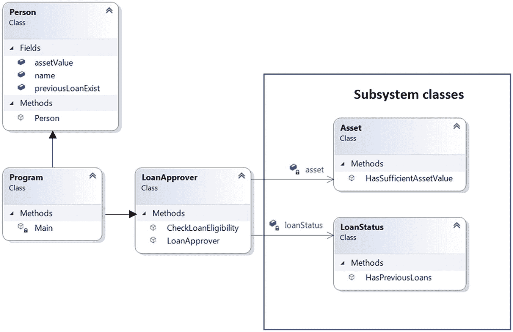

# 九、使用外观简化复杂系统

在第八章中，你看到了如何重新定义多步算法中的一些步骤来完成一项任务。在这一章中，你会看到一个应用，它也执行一系列的任务。但是，您将创建一个简化的界面来执行这些任务，而不是重新定义其中的一些任务。在这种情况下，外观是有用的。

Note

您可能有兴趣了解外观和模板方法之间的区别。一般来说，模板方法属于一个基类，允许子类重新定义一些步骤。您创建一个类的对象并调用这个模板方法来完成您的工作。但是外观经常涉及许多不同类别的多个对象。这一次，您执行一系列步骤来完成涉及所有这些对象的任务。您不需要重新定义这些类中的方法；相反，你可以轻松地给他们打电话。因此，子系统类通常不知道外观的存在。

Facades 为您提供了一个以结构化方式访问不同类的各种方法的入口点。如果您强制执行一个不允许您直接访问单个方法的规则，取而代之的是，您只能通过您的 facade 来访问它们，那么这个 facade 就被称为**opaque**facade；否则，它就是一个**透明的**门面。你也可以让你的门面**变得静态**。

## 问题陈述

一个人可以向银行申请贷款。银行在向客户发放贷款之前，必须进行一些背景核实。这种背景验证是一个复杂的过程，由各种子过程组成。银行官员在考虑贷款申请之前也可以参观客户的房产。如果申请人符合所有这些标准，他就可以获得贷款。但这里有一个关键:申请人不知道背景核实的细节，他只对最终结果感兴趣——他是否能获得贷款。银行官员如何做出决定与客户无关。在接下来的示例中，您将看到这样一个过程。为简单起见，我做了以下假设:

*   贷款申请人或客户必须有一些资产。如果资产价值低于他寻求的贷款金额，他就无法获得贷款。

*   如果客户已有贷款，他就不能获得任何新的贷款。

我们的工作是基于这些假设开发一个应用。为了更清楚起见，下面是一个示例输出:

```cs
Case-1:
Bob’s current asset value: USD 5000
He claims loan amount: USD 20000
He has an existing loan.

```

**预期结果:** Bob 无法获得贷款，原因如下:

*   余额不足。

*   旧贷款存在。

```cs
Case-2:
Jack's current asset value: USD 100000
He claims loan amount: USD 30000
He has no existing loan.

```

**预期结果:**杰克可以拿到贷款。

```cs
Case-3:
Tony's current asset value: USD 125000
He claims loan amount: USD 50000
He has an existing loan.

```

**预期结果:**托尼无法获得贷款，原因如下:

*   旧贷款存在。

让我们来构建应用。

## 初始程序

在这个例子中，您可以看到三个类:`Person`、`Asset`和`LoanStatus`。`Person`类的一个实例可以申请贷款。这个类有一个带三个参数的构造函数:`name`、`assetValue`和`previousLoanExist`。为了避免在实例创建期间输入和传递所有三个参数，我将最后两个参数设为可选。下面是`Person`类:

```cs
class Person
    {
        public string name;
        public double assetValue;
        public bool previousLoanExist;

        public Person(string name,
            double assetValue=100000,
            bool previousLoanExist = false)
        {
            this.name = name;
            this.assetValue = assetValue;
            this.previousLoanExist = previousLoanExist;
        }
    }

```

注意这个类的构造函数。因为有两个可选参数，所以可以使用以下任何一行创建实例:

```cs
Person jack = new Person("Jack");
Person kate = new Person("Kate", 70000);
Person tony = new Person("Tony", 125000, true);

```

现在看`Asset`类。这个类有一个方法`HasSufficientAssetValue`来验证当前资产值是否大于或等于索赔金额。这里是`Asset`班:

```cs
    class Asset
    {
        public bool HasSufficientAssetValue(Person person, double claimAmount)
        {
            Console.WriteLine($"Verifying whether {person.name} has sufficient asset value.");
            return person.assetValue >= claimAmount ? true : false;
        }
    }

```

现在看`LoanStatus`类。这个类有一个方法`HasPreviousLoans`来验证一个人是否有贷款。

```cs
    class LoanStatus
    {
        public bool HasPreviousLoans(Person person)
        {
            Console.WriteLine($"Verifying whether {person.name} has any previous loans.");
            return person.previousLoanExist;
        }
    }

```

在方法体中，我使用了条件操作符。我也可以用链条。你可以选择其中任何一个来使方法`HasSufficientAssetValue`和`HasPreviousLoans`工作。

POINT TO NOTE

还要注意我在这里使用的简化语句:

```cs
return person.previousLoanExist;

```

而不是使用下面的行:

```cs
return person.previousLoanExist ? true : false;

```

我可以对`Asset`类中的`HasSufficientAssetValue()`方法做同样的事情。我保留了这两种变化，以便你可以熟悉它们。

### 演示 1

已经显示了`Person`、`Asset`和`LoanStatus`类。为了简单起见，我将所有三个类和下面的客户机代码放在一个文件中。我不会在下面的代码段中重复这些类。

Note

当您从 Apress 网站下载源代码时，请参考“第九章”中的文件夹“ImplementationWithoutFacade”来查看完整的程序。

现在，假设一个程序员新手编写了下面的客户端代码。他创建了一个名为`bob`的`person`实例，并显示他是否有资格获得贷款。这是可行的，但这是一个好的解决方案吗？我们接下来将对此进行分析。

```cs
class Program
    {
        static void Main()
        {
            Console.WriteLine("***Directly interacting with the subsystems.***");
           Asset asset = new Asset();
           LoanStatus loanStatus = new LoanStatus();
           string status = "approved";
           string reason = String.Empty;
           bool assetValue, previousLoanExist;

           // Person-1
           Person bob = new Person("Bob", 5000, true);

            // Starts background verification
            assetValue = asset.HasSufficientAssetValue(bob, 20000);
            previousLoanExist = loanStatus.HasPreviousLoans(bob);

            if (!assetValue)
            {
                status = "Not approved.";
                reason += "\nInsufficient balance.";
            }
            if (previousLoanExist)
            {
                status = "Not approved.";
                reason += "\nOld loan exists.";
            }
            Console.WriteLine($"{bob.name}'s application status: {status}");
            Console.WriteLine($"Remarks if any: {reason}");

            Console.ReadKey();
        }
    }

```

### 输出

以下是输出:

```cs
***Directly interacting with the subsystems.***
Verifying whether Bob has sufficient asset value.
Verifying whether Bob has any previous loans.
Bob's application status: Not approved.
Remarks if any:
Insufficient balance.
Old loan exists.

```

### 分析

让我问你几个问题:

*   现在只有一个顾客。如果你有两个或两个以上的贷款申请人，你会怎么办？会在`Main()`内部多次重复后台验证逻辑吗？

*   你是否注意到在客户端代码中你暴露了你的后台验证逻辑？这是个好主意吗？

*   如果您不需要创建子系统实例(例如，`Asset`或`LoanStatus`实例)来了解结果，您会有什么感觉？相反，您可以假设有一个贷款审批者实例，它是让您了解申请状态的唯一联系点。这将使您能够编写如下内容:

*   将来，如果获得贷款有新的标准，让贷款审批者负责处理这种情况。

```cs
Person bob = new Person("Bob", 5000,true);
string approvalStatus = loanApprover.CheckLoanEligibility(bob, 20000);
Console.WriteLine($"{bob.name}'s application status:{approvalStatus}");

```

## 更好的程序

当你考虑这样的问题时，你意识到你应该寻找一个更好的解决方案。您可以建立一个单一的联系点(比如贷款审批者),以使您的代码更清晰、更易于维护。

### 类图

图 9-1 显示了演示 2 最重要部分的类图。



图 9-1

客户直接与贷款审批人交谈，以了解他是否能获得贷款

### 演示 2

这是演示 1 的改进版本:

```cs
using System

;

namespace UsingFacade
{
    class Person
    {
        public string name;
        public double assetValue;
        public bool previousLoanExist;

        public Person(string name,
            double assetValue=100000,
            bool previousLoanExist = false)
        {
            this.name = name;
            this.assetValue = assetValue;
            this.previousLoanExist = previousLoanExist;
        }
    }
    class Asset
    {
        public bool HasSufficientAssetValue(Person person, double claimAmount)
        {
            Console.WriteLine($"Verifying whether {person.name} has the sufficient asset value.");
            return person.assetValue >= claimAmount ? true : false;
        }
    }

    class LoanStatus
    {
        public bool HasPreviousLoans(Person person)
        {
            Console.WriteLine($"Verifying whether {person.name} has any previous loans.");
            //return person.previousLoanExist ? true : false;
            // simplified statement
            return person.previousLoanExist;
        }
    }

    class LoanApprover
    {
        readonly Asset asset;
        readonly LoanStatus loanStatus;
        public LoanApprover()
        {
            asset = new Asset();
            loanStatus = new LoanStatus();
        }
        public string CheckLoanEligibility(Person person, double claimAmount)
        {
            string status = "approved";
            string reason = String.Empty;
            Console.WriteLine($"\nChecking the loan approval status of {person.name}.");
            Console.WriteLine($"[Current asset value:{person.assetValue}," +
                $"claim amount:{claimAmount}," +
                $"existing loan?:{person.previousLoanExist}.]\n");
            if (!asset.HasSufficientAssetValue(person,claimAmount))
            {
                status = "Not approved.";
                reason += "\nInsufficient balance.";
            }
            if(loanStatus.HasPreviousLoans(person))
            {
                status = "Not approved.";
                reason +="\nOld loan exists.";
            }

            return string.Concat(status,"\nRemarks if any:",reason);
        }
    }
    class Program
    {
        static void Main()
        {
            Console.WriteLine("***Simplifying the usage of a complex system using a facade.***");
            // Using a facade
            LoanApprover loanApprover = new LoanApprover();

            // Person-1
            Person bob = new Person("Bob", 5000,true);
            string approvalStatus = loanApprover.CheckLoanEligibility(bob, 20000);
            Console.WriteLine($"{bob.name}'s application status: {approvalStatus}");

            // Person-2
            Person jack = new Person("Jack");
            approvalStatus = loanApprover.CheckLoanEligibility(jack, 30000);
            Console.WriteLine($"{jack.name}'s application status: {approvalStatus}");

            // Person-3
            Person tony = new Person("Tony", 125000,true);
            approvalStatus = loanApprover.CheckLoanEligibility(tony, 50000);
            Console.WriteLine($"{tony.name}'s application status: {approvalStatus}");

            Console.ReadKey();
        }
    }
}

```

### 输出

以下是输出:

```cs
***Simplifying the usage of a complex system using a facade.***

Checking the loan approval status of Bob.
[Current asset value:5000,claim amount:20000,existing loan?:True.]

Verifying whether Bob has sufficient asset value.
Verifying whether Bob has any previous loans.
Bob's application status: Not approved.
Remarks if any:
Insufficient balance.
Old loan exists.

Checking the loan approval status of Jack.
[Current asset value:100000,claim amount:30000,existing loan?:False.]

Verifying whether Jack has sufficient asset value.
Verifying whether Jack has any previous loans.
Jack's application status: approved
Remarks if any:

Checking the loan approval status of Tony.
[Current asset value:125000,claim amount:50000,existing loan?:True.]

Verifying whether Tony has sufficient asset value.
Verifying whether Tony has any previous loans.
Tony's application status: Not approved.
Remarks if any:
Old loan exists.

```

### 分析

使用外观，您可以获得以下好处:

*   你为你的客户做了一个简化的界面。

*   您减少了客户端需要处理的对象的数量。

*   如果有许多子系统，用一个外观管理这些子系统可以使通信更容易。

## 摘要

本章向您展示了如何在应用中使用外观。外观可以帮助您为处理许多子系统的客户开发一个简化的界面。我还讨论了外观和模板方法之间的区别。本章还回顾了不同类型的外观以及在应用中使用它们的优缺点。在考虑在应用中使用外观之前，有必要记住以下几点:

*   您不应该假设在一个应用中只能有一个外观。如果你觉得有用，你可以用两个或更多。

*   一个外观可以显示与另一个外观不同的行为。例如，您可以允许或禁止对子系统的直接访问。当您强制客户端通过 facade 创建实例时，您称之为**不透明** facade。当您还允许直接访问子系统时，您正在使用一个**透明的**外观。

*   如果子系统发生变化，您需要将相应的行为合并到外观层中。

*   使用外观，您可以维护一个额外的编码层。在将产品交付给客户之前，您需要测试这一层。如果外观过于复杂，会产生一些额外的维护成本。